# 12 高级演员-评论家方法

在本章中

+   你将了解更多高级深度强化学习方法，这些方法至今仍然是深度强化学习中的最先进算法进步。

+   你将学习解决各种深度强化学习问题，从具有连续动作空间的问题到具有高维动作空间的问题。

+   你将从头开始构建最先进的演员-评论家方法，并打开理解与人工通用智能相关的高级概念的大门。

批评可能并不令人愉快，但它是必要的。它起着与人体疼痛相同的作用。它引起了人们对事物不健康状态的注意。

— 温斯顿·丘吉尔 英国政治家、军官、作家和英国首相

在上一章中，你了解了一种不同的、更直接的技术来解决深度强化学习问题。你首先被介绍到策略梯度方法，其中智能体通过直接近似来学习策略。在纯策略梯度方法中，我们不使用价值函数作为寻找策略的代理，实际上，我们根本不使用价值函数。我们而是直接学习随机策略。

然而，你很快注意到价值函数仍然可以发挥重要作用，并使策略梯度方法得到改进。因此，你被引入了演员-评论家方法。在这些方法中，智能体学习策略和价值函数。通过这种方法，你可以利用一个函数近似的优点来减轻另一个近似的缺点。例如，在某些环境中，学习策略可能比学习足够准确的价值函数更直接，因为动作空间中的关系可能比价值的关系更紧密。尽管如此，即使精确地知道状态的价值可能更复杂，但粗略的近似对于减少策略梯度目标方差是有用的。正如你在上一章中所探索的，学习价值函数并将其用作基线或用于计算优势可以显著减少用于策略梯度更新的目标方差。此外，减少方差通常会导致学习速度更快。

然而，在上一章中，我们专注于使用价值函数作为更新随机策略的评论家。我们为学习价值函数使用了不同的目标，并以几种不同的方式并行化了工作流程。然而，算法以相同的一般方式使用学习到的价值函数来训练策略，并且学习到的策略具有相同的属性，因为它是一个随机策略。我们只是触及了使用学习策略和价值函数的表面。在本章中，我们将更深入地探讨演员-评论家方法的范式，并在四个不同的具有挑战性的环境中进行训练：摆锤、跳跃者、猎豹和月球着陆器。正如你很快就会看到的，除了是更具挑战性的环境之外，大多数这些环境都具有连续的动作空间，这是我们第一次面对的，并且需要使用独特的策略模型。

为了解决这些环境，我们首先探索了学习确定性策略的方法；也就是说，当呈现相同的状态时，返回相同动作的策略，即被认为是最优的动作。我们还研究了一系列改进，使确定性策略梯度算法成为迄今为止解决深度强化学习问题的最先进方法之一。然后，我们探索了一种演员-评论家方法，它不是使用损失函数中的熵，而是直接使用价值函数方程中的熵。换句话说，它最大化回报以及策略的长期熵。最后，我们以一个算法结束，该算法通过将策略的更新限制为小的变化，从而允许更稳定的策略改进步骤。策略中的小变化使得策略梯度方法在性能上表现出稳定且通常是单调的改进，从而在几个 DRL 基准测试中实现了最先进的性能。

## DDPG：逼近确定性策略

在本节中，我们探讨了一种名为深度确定性策略梯度（DDPG）的算法。DDPG 可以被视为一个近似的 DQN，或者更好的说法，是一个适用于连续动作空间的 DQN。DDPG 使用了 DQN 中发现的许多相同技术：它使用重放缓冲区以离线方式训练动作值函数，并使用目标网络来稳定训练。然而，DDPG 还训练了一个逼近最优动作的策略。正因为如此，DDPG 是一个限制在连续动作空间中的确定性策略梯度方法。

### DDPG 借鉴了 DQN 的许多技巧

首先，将 DDPG 想象成一个与 DQN 具有相同架构的算法。训练过程也是类似的：智能体以在线方式收集经验，并将这些在线经验样本存储到重放缓冲区中。在每一步，智能体从重放缓冲区中抽取一个迷你批次，通常是随机均匀抽取的。然后，智能体使用这个迷你批次来计算自举的*TD*目标并训练一个 Q 函数。

DQN 和 DDPG 之间的主要区别在于，虽然 DQN 使用目标 Q 函数通过 argmax 获取贪婪动作，而 DDPG 使用一个目标确定性策略函数，该函数被训练来近似贪婪动作。与我们在 DQN 中使用下一个状态的 Q 函数的 argmax 获取贪婪动作不同，在 DDPG 中，我们直接使用策略函数来近似下一个状态中的最佳动作。然后，在两者中，我们都使用该动作与 Q 函数结合来获取最大值。

|  | 展示 MathDQN 与 DDPG 的价值函数目标 |
| --- | --- |
|  | 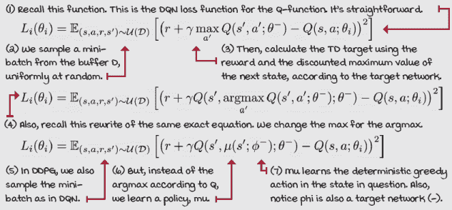 |
|  | 我会说 PythonDDPG 的 Q 函数网络 |
|  |

```
class FCQV(nn.Module):                                           ①
    def __init__(self,
                 input_dim,
                 output_dim,
                 hidden_dims=(32,32),
                 activation_fc=F.relu):
        super(FCQV, self).__init__()
        self.activation_fc = activation_fc
        self.input_layer = nn.Linear(input_dim, hidden_dims[0])  ②
        self.hidden_layers = nn.ModuleList()
        for i in range(len(hidden_dims)-1):
            in_dim = hidden_dims[i]
            if i == 0:                                           ③
                in_dim += output_dim
            hidden_layer = nn.Linear(in_dim, hidden_dims[i+1])
            self.hidden_layers.append(hidden_layer)
        self.output_layer = nn.Linear(hidden_dims[-1], 1)        ④
       <...>
    def forward(self, state, action):                            ⑤
        x, u = self._format(state, action)
        x = self.activation_fc(self.input_layer(x))
        for i, hidden_layer in enumerate(self.hidden_layers):
            if i == 0:
                x = torch.cat((x, u), dim=1)                     ⑥
            x = self.activation_fc(hidden_layer(x))              ⑦
        return self.output_layer(x)                              ⑧
```

① 这是 DDPG 中使用的 Q 函数网络。② 我们像往常一样开始构建架构。③ 这里有一个例外。我们将第一隐藏层的维度增加到输出维度。④ 注意网络的输出是一个节点，表示状态-动作对的价值。⑤ 前向传播开始如预期。⑥ 但是，我们在第一隐藏层直接将动作连接到状态。⑦ 然后，继续如预期。⑧ 最后，返回输出。

### 学习确定性策略

现在，我们需要添加到这个算法中的一个东西是策略网络。我们希望训练一个网络，能够在给定状态下给出最佳动作。该网络必须相对于动作是可微分的。因此，动作必须是连续的，以便进行高效的基于梯度的学习。目标是简单的；我们可以使用策略网络 mu 的期望 Q 值。也就是说，智能体试图找到最大化这个值的动作。注意，在实践中，我们使用最小化技术，因此最小化这个目标的负值。

|  | 展示 MathDDPG 的确定性策略目标 |
| --- | --- |
|  | 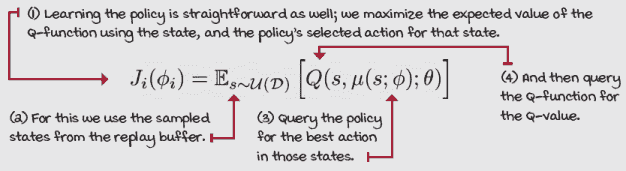 |

还要注意，在这种情况下，我们不需要使用目标网络，而是使用在线网络，即策略网络（动作选择部分）和价值函数（动作评估部分）。此外，鉴于我们需要为训练价值函数采样状态的小批量，我们可以使用这些相同的状态来训练策略网络。

| 0001 | 一点历史介绍 DDPG 算法 |
| --- | --- |
|  | DDPG 是在 2015 年一篇题为“使用深度强化学习的连续控制”的论文中提出的。这篇论文由当时在谷歌 DeepMind 担任研究科学家的蒂莫西·利利克拉普（Timothy Lillicrap）等人撰写。自 2016 年以来，蒂姆一直担任谷歌 DeepMind 的高级研究科学家和伦敦大学学院的客座教授。蒂姆为 DeepMind 的几篇其他论文做出了贡献，例如 A3C 算法、AlphaGo、AlphaZero、Q-Prop 和星际争霸 II 等。最有趣的事实之一是，蒂姆在认知科学和系统神经科学方面有背景，而不是传统计算机科学路径进入深度强化学习。 |
|  | 我会说 PythonDDPG 的确定性策略网络 |
|  |

```
class FCDP(nn.Module):                                           ①
    def __init__(self,
                 input_dim,
                 action_bounds,
                 hidden_dims=(32,32),
                 activation_fc=F.relu,                           ②
                 out_activation_fc=F.tanh):
        super(FCDP, self).__init__()
        self.activation_fc = activation_fc
        self.out_activation_fc = out_activation_fc
        self.env_min, self.env_max = action_bounds               ③
        self.input_layer = nn.Linear(input_dim, hidden_dims[0])  ④
        self.hidden_layers = nn.ModuleList()
        for i in range(len(hidden_dims)-1):
            hidden_layer = nn.Linear(hidden_dims[i],
                                     hidden_dims[i+1])
            self.hidden_layers.append(hidden_layer)
        self.output_layer = nn.Linear(hidden_dims[-1],
                                      len(self.env_max))         ④
    def forward(self, state):                                    ⑤
        x = self._format(state)
        x = self.activation_fc(self.input_layer(x))              ⑥
        for hidden_layer in self.hidden_layers:                  ⑦
            x = self.activation_fc(hidden_layer(x))
        x = self.output_layer(x)                                 ⑧
        x = self.out_activation_fc(x)                            ⑨
        return self.rescale_fn(x)                                ⑩
```

① 这是 DDPG 中使用的策略网络：全连接确定性策略。② 注意这次输出层的激活函数不同。我们使用 tanh 激活函数将输出压缩到(-1, 1)范围内。③ 我们需要获取动作的最小值和最大值，以便将网络的输出(-1, 1)重新缩放到预期的范围。④ 架构正如预期：输入状态，输出动作。⑤ 前向传播也很直接。⑥ 输入⑦ 隐藏⑧ 输出⑨ 注意，然而，我们使用输出激活函数激活输出。⑩ 同样重要的是，我们将动作从-1 到 1 的范围重新缩放到特定于环境的范围。rescale_fn 函数在此处未显示，但你可以去笔记本中查看详细信息。|

|  | 我会说 PythonDDPG 的模型优化步骤 |
| --- | --- |
|  |

```
    def optimize_model(self, experiences):                     ①
        states, actions, rewards, \
                  next_states, is_terminals = experiences
        batch_size = len(is_terminals)
        argmax_a_q_sp = self.target_policy_model(next_states)
        max_a_q_sp = self.target_value_model(next_states,
                                             argmax_a_q_sp)    ②
        target_q_sa = rewards + self.gamma * max_a_q_sp * \
                                             (1 - is_terminals)
        q_sa = self.online_value_model(states, actions)
        td_error = q_sa - target_q_sa.detach()                 ③
        value_loss = td_error.pow(2).mul(0.5).mean()
        self.value_optimizer.zero_grad()                       ④
        value_loss.backward()
        torch.nn.utils.clip_grad_norm_(
                          self.online_value_model.parameters(),
                          self.value_max_grad_norm)
        self.value_optimizer.step()
        argmax_a_q_s = self.online_policy_model(states)
        max_a_q_s = self.online_value_model(states,
                                            argmax_a_q_s)      ⑤
        policy_loss = -max_a_q_s.mean()                        ⑥
        self.policy_optimizer.zero_grad()
        policy_loss.backward()
        torch.nn.utils.clip_grad_norm_(                        ⑦
                         self.online_policy_model.parameters(),
                         self.policy_max_grad_norm)
        self.policy_optimizer.step()
```

① optimize_model 函数接收一个经验的小批量。② 使用它，我们根据策略预测的下一个状态的最大值、根据策略的动作和根据 Q 函数的值来计算目标。③ 然后我们获取预测值，计算误差和损失。注意我们使用目标网络和在线网络的位置。④ 优化步骤与其他网络类似。⑤ 接下来，我们获取在线策略预测的迷你批量中的状态的动作，然后使用这些动作通过在线价值网络获取价值估计。⑥ 接下来，我们获取策略损失。⑦ 最后，我们将优化器置零，对损失进行反向传播，裁剪梯度，并更新优化器。|

### | 探索确定性策略 |

在 DDPG 中，我们训练确定性贪婪策略。在一个理想的世界里，这种策略接受一个状态并返回该状态的最优动作。但是，在一个未经训练的策略中，返回的动作不会足够准确，但仍然是确定的。如前所述，智能体需要平衡利用知识和探索。但是，由于 DDPG 智能体学习的是确定性策略，它不会在策略上进行探索。想象一下，智能体很固执，总是选择相同的动作。为了解决这个问题，我们必须进行离策略探索。因此，在 DDPG 中，我们在策略选择的动作中注入高斯噪声。

你已经了解了多个 DRL 智能体中的探索。在 NFQ、DQN 等中，我们使用基于 Q 值的探索策略。我们使用学习的 Q 函数来获取给定状态的动作值，并根据这些值进行探索。在 REINFORCE、VPG 等中，我们使用随机策略，因此探索是在策略上的。也就是说，探索由策略本身处理，因为它具有随机性；它有随机性。在 DDPG 中，智能体通过向动作添加外部噪声来进行探索，使用离策略探索策略。

|  | 我会说 Python 确定性策略梯度探索 |
| --- | --- |
|  |

```
class NormalNoiseDecayStrategy():                              ①
    def select_action(self, model,
                                 state, max_exploration=False):
        if max_exploration:
            noise_scale = self.high                            ②
        else:
            noise_scale = self.noise_ratio * self.high         ③
        with torch.no_grad():
            greedy_action = model(state).cpu().detach().data
            greedy_action = greedy_action.numpy().squeeze()    ④
        noise = np.random.normal(loc=0,
                                 scale=noise_scale,            ⑤
                                 size=len(self.high))
        noisy_action = greedy_action + noise                   ⑥
        action = np.clip(noisy_action, self.low, self.high)
        self.noise_ratio = self._noise_ratio_update()          ⑦
        return action                                          ⑧
```

① 这是策略的 select_action 函数。② 为了最大化探索，我们将噪声尺度设置为最大动作。③ 否则，我们将噪声尺度降低。④ 我们直接从网络中获取贪婪动作。⑤ 接下来，我们使用尺度和 0 均值来获取动作的高斯噪声。⑥ 将噪声添加到动作中，并将其剪辑到范围内。⑦ 接下来，我们更新噪声比例计划。这可以是常数、线性、指数等。 |

|  | 一个具体例子摆锤环境 |
| --- | --- |
|  | Pendulum-v0 环境包含一个倒立摆，智能体需要将其摆动起来，使其尽可能少地消耗力气保持直立。状态空间是一个包含三个变量的向量（cos(theta)，sin(theta)，theta dot），表示杆的夹角余弦值、正弦值和角速度。动作空间是一个从-2 到 2 的单个连续变量，表示关节力。这个关节就是杆底部的那个黑点。动作是顺时针或逆时针的力。奖励函数是基于角度、速度和力度的方程。目标是完美平衡地直立，不消耗任何力气。在这样的理想时间步长中，智能体获得 0 奖励，这是它能做到的最好的。智能体可能获得的最高成本（最低奖励）大约是-16 奖励。精确的方程是*–(theta² + 0.1*theta_dt² + 0.001*action²)*。这是一个持续任务，因此没有终止状态。然而，环境在 200 步后超时，这起到了相同的作用。环境被认为是未解决的，这意味着没有目标回报。然而，-150 是一个合理的阈值。 |
|  | 总结 DDPG 在摆动环境中的应用 |
|  | 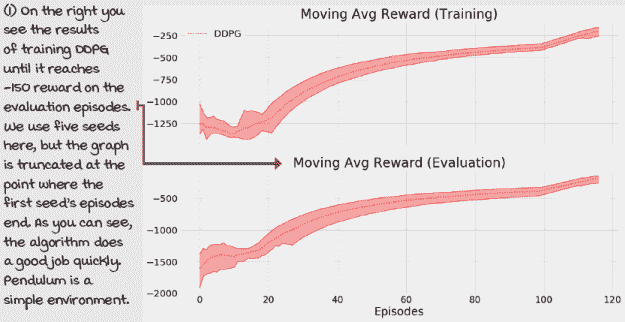 |

## TD3：在 DDPG 之上的最新改进

DDPG 已经成为了控制领域几年来的最先进的深度强化学习方法之一。然而，已经提出了改进，这些改进在性能上产生了重大影响。在本节中，我们讨论了一系列改进，这些改进共同形成了一个新的算法，称为*twin-delayed DDPG*（TD3）。*TD*3 对主要的 DDPG 算法引入了三个主要变化。首先，它增加了一种双重学习技术，类似于你在双重 Q 学习和 DDQN 中学到的，但这次有一个独特的“双胞胎”网络架构。其次，它向动作和环境中的目标动作添加了噪声，这使得策略网络对近似误差更加鲁棒。第三，它延迟了对策略网络、目标网络和双胞胎目标网络的更新，从而使双胞胎网络更新得更频繁。

### DDPG 中的双重学习

在*TD*3 中，我们使用了一种特殊的 Q 函数网络，它有两个独立的流，分别结束于对所讨论的状态-动作对的两个不同估计。在大多数情况下，这两个流是完全独立的，所以可以认为它们是两个独立的网络。然而，如果环境是基于图像的，那么共享特征层是有意义的。这样，CNN 可以提取共同的特征，并可能更快地学习。尽管如此，共享层通常更难训练，所以这需要你自己实验和决定。

在以下实现中，两个流是完全独立的，这两个网络之间唯一共享的是优化器。正如你在双网络损失函数中看到的，我们将每个网络的损失加起来，并在联合损失上优化这两个网络。

|  | 展示给我 TD3 中的双目标 |
| --- | --- |
|  | 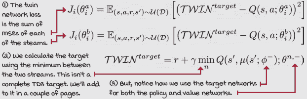 |
|  | 我会说 PythonTD3 的双 Q 网络 1/2 |
|  |

```
class FCTQV(nn.Module):                                        ①
    def __init__(self,
               input_dim,
               output_dim,
               hidden_dims=(32,32),
                 activation_fc=F.relu):
        super(FCTQV, self).__init__()
        self.activation_fc = activation_fc
        self.input_layer_a = nn.Linear(input_dim + output_dim,
                                       hidden_dims[0])         ②
        self.input_layer_b = nn.Linear(input_dim + output_dim,
                                       hidden_dims[0])
        self.hidden_layers_a = nn.ModuleList()
        self.hidden_layers_b = nn.ModuleList()
        for i in range(len(hidden_dims)-1):
           hid_a = nn.Linear(hidden_dims[i], hidden_dims[i+1]) ③
           self.hidden_layers_a.append(hid_a)
           hid_b = nn.Linear(hidden_dims[i], hidden_dims[i+1])
           self.hidden_layers_b.append(hid_b)
        self.output_layer_a = nn.Linear(hidden_dims[-1], 1)
        self.output_layer_b = nn.Linear(hidden_dims[-1], 1)    ④
    def forward(self, state, action):
        x, u = self._format(state, action)                     ⑤
        x = torch.cat((x, u), dim=1)
        xa = self.activation_fc(self.input_layer_a(x))         ⑥
        xb = self.activation_fc(self.input_layer_b(x))
        for hidden_layer_a, hidden_layer_b in zip(
                  self.hidden_layers_a, self.hidden_layers_b): ⑦
```

① 这是完全连接的双 Q 值网络。这是 *TD*3 使用双流来近似 Q 值的方式。② 注意我们有两个输入层。再次强调，这些流实际上是两个独立的网络。③ 接下来，为每个流创建隐藏层。④ 最后，我们有两个输出层，每个输出层都有一个节点代表 Q 值。⑤ 我们开始正向传播，格式化输入以匹配网络期望的格式。⑥ 接下来，我们将状态和动作连接起来，并通过每个流传递。⑦ 继续…… |

|  | 我会说 PythonTD3 的双 Q 网络 2/2 |
| --- | --- |
|  |

```
        for hidden_layer_a, hidden_layer_b in zip(
                   self.hidden_layers_a, self.hidden_layers_b):
            xa = self.activation_fc(hidden_layer_a(xa))        ⑧
            xb = self.activation_fc(hidden_layer_b(xb))
        xa = self.output_layer_a(xa)
        xb = self.output_layer_b(xb)
        return xa, xb                                          ⑨
    def Qa(self, state, action):                               ⑩
        x, u = self._format(state, action)
        x = torch.cat((x, u), dim=1)                           ⑪
        xa = self.activation_fc(self.input_layer_a(x))
        for hidden_layer_a in self.hidden_layers_a:            ⑫
            xa = self.activation_fc(hidden_layer_a(xa))        ⑫
        return self.output_layer_a(xa)                         ⑬
```

⑧ 我们通过所有隐藏层及其相应的激活函数。⑨ 最后，我们通过输出层并返回它们的直接输出。⑩ 这是 Qa 流的正向传播。这在计算目标以更新策略时很有用。⑪ 我们格式化输入，并在通过 a 流之前将它们连接起来。⑫ 然后通过“a”隐藏层……⑬ ……一直通过输出层，就像我们一开始只有一个网络一样。 |

### 使用平滑的目标进行策略更新

记住，为了提高 DDPG 中的探索性，我们在用于环境的动作中注入高斯噪声。在 *TD*3 中，我们进一步发展了这个概念，不仅向用于探索的动作添加噪声，还向用于计算目标值的动作添加噪声。

使用带噪声的目标训练策略可以看作是一个正则化器，因为现在网络被迫对类似动作进行泛化。这项技术防止策略网络收敛到错误动作，因为在训练的早期阶段，Q 函数可能会过早地不准确地评估某些动作。动作上的噪声将这个值传播到一个更广泛的相关动作范围。

|  | 展示给我数学目标平滑过程 |
| --- | --- |
|  | 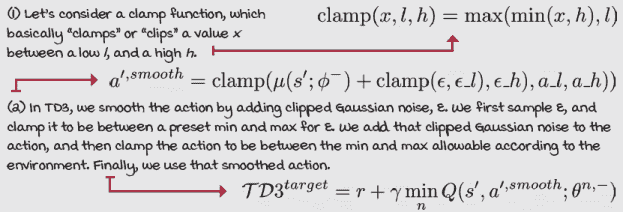 |
|  | 我会说 PythonTD3 的模型优化步骤 1/2 |
|  |

```
    def optimize_model(self, experiences):                      ①
        states, actions, rewards, \
           next_states, is_terminals = experiences
        batch_size = len(is_terminals)
        with torch.no_grad():
            env_min = self.target_policy_model.env_min          ② ③
            env_max = self.target_policy_model.env_max          ②
            a_ran = env_max - env_min
            a_noise = torch.randn_like(actions) * \
                              self.policy_noise_ratio * a_ran   ③
            n_min = env_min * self.policy_noise_clip_ratio      ④
            n_max = env_max * self.policy_noise_clip_ratio      ④
            a_noise = torch.max(
                              torch.min(a_noise, n_max), n_min) ⑤
            argmax_a_q_sp = self.target_policy_model(
                                                  next_states)  ⑥
            noisy_argmax_a_q_sp = argmax_a_q_sp + a_noise
            noisy_argmax_a_q_sp = torch.max(torch.min(          ⑦
                        noisy_argmax_a_q_sp, env_max), env_min)
```

① 为了优化 *TD*3 模型，我们接收一个经验的小批量。② 我们首先获取环境的最大值和最小值。③ 获取噪声并将其缩放到动作的范围。④ 获取噪声的裁剪最小值和最大值。⑤ 然后，裁剪噪声。⑥ 从目标策略模型获取动作。⑦ 然后，将噪声添加到动作中，并裁剪动作。 |

|  | 我会说 Python TD3 的模型优化步骤 2/2 |
| --- | --- |
|  |

```
            noisy_argmax_a_q_sp = torch.max(torch.min( noisy_argmax_a_q_sp, env_max), env_min)
            max_a_q_sp_a, max_a_q_sp_b = \
                   self.target_value_model(next_states,        ⑧
                                           noisy_argmax_a_q_sp)
            max_a_q_sp = torch.min(max_a_q_sp_a, max_a_q_sp_b) ⑨
            target_q_sa = rewards + self.gamma * max_a_q_sp * \
                                             (1 - is_terminals)
        q_sa_a, q_sa_b = self.online_value_model(states,
                                                 actions)
        td_error_a = q_sa_a - target_q_sa                      ⑩
        td_error_b = q_sa_b - target_q_sa
        value_loss = td_error_a.pow(2).mul(0.5).mean() + \
                     td_error_b.pow(2).mul(0.5).mean()
        self.value_optimizer.zero_grad()
        value_loss.backward()
        torch.nn.utils.clip_grad_norm_(                        ⑪
                          self.online_value_model.parameters(),
                          self.value_max_grad_norm)
        self.value_optimizer.step()
        if np.sum(self.episode_timestep) % \                   ⑫
                            self.train_policy_every_steps == 0:
            argmax_a_q_s = self.online_policy_model(states)    ⑬
            max_a_q_s = self.online_value_model.Qa(            ⑬
                                          states, argmax_a_q_s)
            policy_loss = -max_a_q_s.mean()                    ⑭
            self.policy_optimizer.zero_grad()
            policy_loss.backward()
            torch.nn.utils.clip_grad_norm_(                    ⑮
                         self.online_policy_model.parameters(),
                         self.policy_max_grad_norm)
            self.policy_optimizer.step()
```

⑧ 我们使用夹具噪声动作来获取最大值。⑨ 回想一下，我们通过获取两个流之间的最小预测值来获取最大值，并用于目标。⑩ 接下来，我们获取两个流中来的预测值来计算误差和联合损失。⑪ 然后，我们对双网络进行标准的反向传播步骤。⑫ 注意我们在这里延迟了策略更新。我将在下一页上对此进行更多解释。⑬ 更新类似于 DDPG，但使用单流‘Qa。’⑭ 但是，损失是相同的。⑮ 这里是策略优化的步骤。标准的东西。 |

### 延迟更新

*TD*3 相对于 DDPG 的最终改进是延迟策略网络和目标网络的更新，以便在线 Q 函数的更新速率高于其他部分。延迟这些网络是有益的，因为在线 Q 函数在训练过程的早期往往会突然改变形状。放慢策略，使其在几个值函数更新之后更新，可以让值函数在引导策略之前稳定到更准确的价值。策略和目标网络的推荐延迟是每两次更新一次在线 Q 函数。

你可能在策略更新中注意到的另一件事是，我们必须使用在线值模型的一个流来获取来自策略的动作的估计 Q 值。在*TD*3 中，我们使用两个流中的一个，但每次都使用相同的流。

| 0001 | 一点历史 TD3 代理的介绍 |
| --- | --- |
|  | TD3 是由 Scott Fujimoto 等人于 2018 年在一篇题为“Addressing Function Approximation Error in Actor-Critic Methods”的论文中引入的。Scott 是麦吉尔大学的一名研究生，正在攻读计算机科学博士学位，由 David Meger 教授和 Doina Precup 教授指导。 |
|  | 一个具体的例子 溜槽环境 |
|  | 我们使用的跳跃者环境是 MuJoCo 和 Roboschool Hopper 环境的开源版本，由 Bullet 物理引擎提供支持。MuJoCo 是一个具有多种模型和任务的物理引擎。虽然 MuJoCo 在 DRL 研究中被广泛使用，但它需要许可证。如果您不是学生，这可能需要花费您几千美元。Roboschool 是 OpenAI 尝试创建 MuJoCo 环境开源版本的一次尝试，但后来因为 Bullet 而被放弃。Bullet 物理引擎是一个开源项目，其中包含与 MuJoCo 中相同的大多数环境。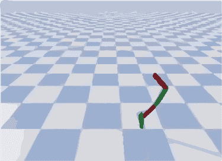HopperBulletEnv-v0 环境具有一个包含 15 个连续变量的向量作为无界观察空间，代表跳跃者机器人的不同关节。它具有一个介于-1 和 1 之间的三个连续变量的向量，代表大腿、小腿和脚关节的动作。请注意，单个动作是一个包含三个元素的向量。智能体的任务是使跳跃者向前移动，奖励函数强化这一点，同时也促进最小化能量成本。 |
|  | 细节中的训练 TD3 在跳跃者环境中 |
|  | 如果您查看该章节的笔记本，您可能会注意到我们训练智能体直到它在 100 个连续的回合中达到平均奖励为 1,500。实际上，推荐的阈值是 2,500。然而，因为我们使用五个不同的种子进行训练，并且每次训练运行大约需要一个小时，所以我想到通过仅仅降低阈值来减少完成笔记本所需的时间。即使是在 1,500 的情况下，跳跃者也能很好地向前移动，正如您可以在笔记本中的 GIF 中看到的那样。现在，您必须知道，书中所有的实现都需要很长时间，因为它们在每个回合之后都会执行一次评估回合。在每个回合上评估性能并不是必要的，并且对于大多数目的来说可能是过度杀戮。对于我们来说，这是可以接受的，但如果您想重用代码，我建议您移除该逻辑，并在大约每 10-100 个回合检查一次评估性能。此外，请查看实现细节。书中的 TD3 分别优化策略和价值网络。如果您想使用 CNN 进行训练，例如，您可能希望共享卷积并在一次中优化所有内容。但再次强调，这需要大量的调整。 |
|  | 累计 TD3 在跳跃者环境中的表现 |
|  | 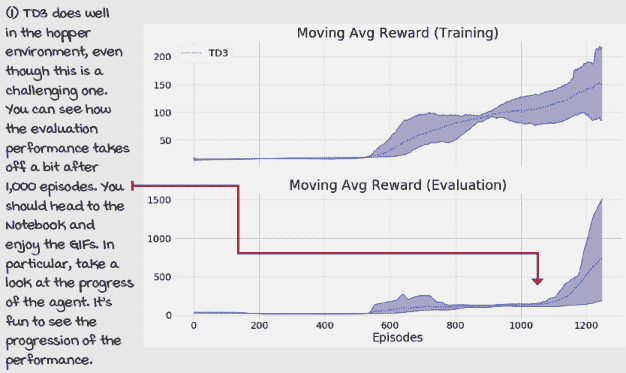 |

## |  | SAC：最大化期望回报和熵

前两个算法，DDPG 和**TD**3，是离策略方法，用于训练确定性策略。回想一下，离策略意味着该方法使用由与优化策略不同的行为策略生成的经验。在 DDPG 和**TD**3 的情况下，它们都使用一个包含由几个先前策略生成的经验的回放缓冲区。此外，因为正在优化的策略是确定性的，这意味着每次查询时它都返回相同的动作，因此它们都使用离策略探索策略。在我们的实现中，它们都使用高斯噪声注入到进入环境的动作向量中。

为了更具体地说明，你之前章节中学到的智能体是按策略学习的。记住，它们训练随机策略，这些策略本身引入了随机性和探索性。为了在随机策略中促进随机性，我们在损失函数中添加了一个熵项。

在本节中，我们讨论了一个名为**软演员-评论家**（SAC）的算法，它是这两种范例的混合体。SAC 是一个类似于 DDPG 和**TD**3 的离策略算法，但它像 REINFORCE、A3C、GAE 和 A2C 一样训练随机策略，而不是像 DDPG 和**TD**3 那样训练确定性策略。

### 将熵添加到贝尔曼方程中

SAC 最关键的特征是随机策略的熵成为智能体试图最大化的值函数的一部分。正如你在本节中看到的那样，联合最大化期望总奖励和期望总熵自然地鼓励尽可能多样化的行为，同时仍然最大化期望回报。

|  | 显示数学智能体需要最大化熵 |
| --- | --- |
|  | 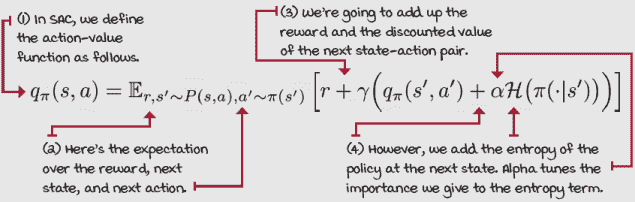 |

### 学习动作值函数

实际上，SAC 以类似于**TD**3 的方式学习值函数。也就是说，我们使用两个近似 Q 函数的网络，并取大多数计算的最低估计值。然而，有几个不同之处，即在使用 SAC 时，独立优化每个 Q 函数会产生更好的结果，这正是我们所做的。其次，我们将熵项添加到目标值中。最后，我们不像在**TD**3 中那样直接使用目标动作平滑。除此之外，模式与**TD**3 相同。

|  | 显示数学 Action-value 函数目标（我们在该目标上训练 MSE） |
| --- | --- |
|  | 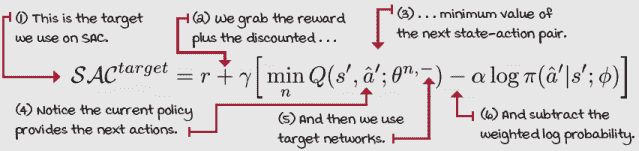 |

### 学习策略

这次为了学习随机策略，我们使用了一个压缩高斯策略，在正向传递中输出均值和标准差。然后我们可以使用这些值从这个分布中进行采样，使用双曲正切函数 tanh 压缩值，然后将值重新缩放到环境预期的范围内。

为了训练策略，我们使用重新参数化技巧。这个“技巧”包括将随机性从网络中移出，放入输入中。这样，网络是确定性的，我们可以没有问题地训练它。这个技巧在 PyTorch 中直接实现，正如您接下来看到的。

|  | 展示数学策略目标（我们通过最小化这个目标函数进行训练） |
| --- | --- |
|  | 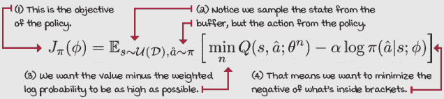 |

### 自动调整熵系数

SAC 的甜点是 alpha，即熵系数，可以自动调整。SAC 采用基于梯度的 alpha 优化，以向启发式期望熵进行优化。推荐的目标熵基于动作空间形状；更具体地说，是动作形状的向量积的负值。使用这个目标熵，我们可以自动优化 alpha，从而几乎没有与调节熵项相关的超参数需要调整。

|  | 展示数学 Alpha 目标函数（我们通过最小化这个目标函数进行训练） |
| --- | --- |
|  | 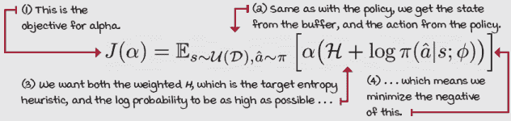 |
|  | 我会说 PythonSAC 高斯策略 1/2 |
|  |

```
class FCGP(nn.Module):                                         ①
    def __init__(self,
        <...>
        self.input_layer = nn.Linear(input_dim,                ②
                                     hidden_dims[0])
        self.hidden_layers = nn.ModuleList()
        for i in range(len(hidden_dims)-1):
            hidden_layer = nn.Linear(hidden_dims[i],
                                     hidden_dims[i+1])
            self.hidden_layers.append(hidden_layer)            ②
        self.output_layer_mean = nn.Linear(hidden_dims[-1],    ③
                                           len(self.env_max))
        self.output_layer_log_std = nn.Linear(                 ③
                                             hidden_dims[-1],
                                             len(self.env_max))
```

① 这是我们 SAC 中使用的高斯策略。② 我们以与其他策略网络相同的方式开始一切：输入，到隐藏层。③ 但隐藏层连接到两个流。一个表示动作的均值，另一个表示对数标准差。

|  | 我会说 PythonSAC 高斯策略 2/2 |
| --- | --- |
|  |

```
        self.output_layer_log_std = nn.Linear(                 ④
                                             hidden_dims[-1],
                                             len(self.env_max))
        self.target_entropy = -np.prod(self.env_max.shape)     ⑤
        self.logalpha = torch.zeros(1,                         ⑥
                                    requires_grad=True,
                                    device=self.device)
        self.alpha_optimizer = optim.Adam([self.logalpha],
                                          lr=entropy_lr)
    def forward(self, state):                                  ⑦
        x = self._format(state)                                ⑧
        x = self.activation_fc(self.input_layer(x))
        for hidden_layer in self.hidden_layers:
            x = self.activation_fc(hidden_layer(x))
        x_mean = self.output_layer_mean(x)
        x_log_std = self.output_layer_log_std(x)
        x_log_std = torch.clamp(x_log_std,                     ⑨
                                self.log_std_min,
                                self.log_std_max)
        return x_mean, x_log_std                               ⑩
    def full_pass(self, state, epsilon=1e-6):                  ⑪
        mean, log_std = self.forward(state)
        pi_s = Normal(mean, log_std.exp())                     ⑫
        pre_tanh_action = pi_s.rsample()                       ⑬
        tanh_action = torch.tanh(pre_tanh_action)              ⑭
        action = self.rescale_fn(tanh_action)                  ⑮
        log_prob = pi_s.log_prob(pre_tanh_action) - torch.log( ⑯
                (1 - tanh_action.pow(2)).clamp(0, 1) + epsilon)
        log_prob = log_prob.sum(dim=1, keepdim=True)
        return action, log_prob, self.rescale_fn(
                                             torch.tanh(mean)) ⑯
```

④ 同一行以帮助您保持代码的流程⑤ 这里我们计算*H*，目标熵启发式。⑥ 接下来，我们创建一个变量，初始化为零，并创建一个优化器来优化 log alpha。⑦ 前向函数是我们预期的。⑧ 我们格式化输入变量，并将它们通过整个网络传递。⑨ 将 log std 限制在-20 到*2*之间，以控制 std 的范围在合理的值。⑩ 并返回这些值。⑪ 在完整传递中，我们得到均值和 log std。⑫ 获取具有这些值的正态分布。⑬ *r*样本在这里执行重新参数化技巧。⑭ 然后，我们将动作压缩到-1 到 1 的范围内。⑮ 然后，将其缩放到环境期望的范围。⑯ 我们还需要缩放 log 概率和均值。

|  | 我会说 PythonSAC 优化步骤 1/2 |
| --- | --- |
|  |

```
    def optimize_model(self, experiences):                     ①
        states, actions, rewards, \
                      next_states, is_terminals = experiences  ②
        batch_size = len(is_terminals)
        current_actions, \
              logpi_s, _ = self.policy_model.full_pass(states) ③
        target_alpha = (logpi_s + \
                    self.policy_model.target_entropy).detach() ④
        alpha_loss = -(self.policy_model.logalpha * \
                                           target_alpha).mean()
        self.policy_model.alpha_optimizer.zero_grad()
        alpha_loss.backward()                                  ④
        self.policy_model.alpha_optimizer.step()
        alpha = self.policy_model.logalpha.exp()               ⑤
        current_q_sa_a = self.online_value_model_a(
                                     states, current_actions)  ⑥
        current_q_sa_b = self.online_value_model_b(
                                     states, current_actions)
        current_q_sa = torch.min(current_q_sa_a,               ⑦
                                 current_q_sa_b)
        policy_loss = (alpha * logpi_s - current_q_sa).mean()  ⑧
        ap, logpi_sp, _ = self.policy_model.full_pass(         ⑨
                                                   next_states)
```

① 这是 SAC 中的优化步骤。② 首先，从迷你批次中获取经验。③ 接下来，我们获取当前的动作，a-hat，以及状态*s*的对数概率。④ 这里，我们计算 alpha 的损失，并在这里执行 alpha 优化器的步骤。⑤ 这是我们获取当前 alpha 值的方法。⑥ 在这些行中，我们使用在线模型和 a-hat 获取 Q 值。⑦ 然后，我们使用最小 Q 值估计。⑧ 这里，我们使用那个最小 Q 值估计来计算策略损失。⑨ 在下一页，我们计算 Q 函数损失。

|  | 我会说 PythonSAC 优化步骤 2/2 |
| --- | --- |
|  |

```
        ap, logpi_sp, _ = self.policy_model.full_pass(          ⑩
                                                   next_states)
        q_spap_a = self.target_value_model_a(next_states, ap)   ⑪
        q_spap_b = self.target_value_model_b(next_states, ap)
        q_spap = torch.min(q_spap_a, q_spap_b) - \              ⑫
                                               alpha * logpi_sp
        target_q_sa = (rewards + self.gamma * \                 ⑬
                          q_spap * (1 - is_terminals)).detach()
        q_sa_a = self.online_value_model_a(states, actions)     ⑭
        q_sa_b = self.online_value_model_b(states, actions)     ⑭
        qa_loss = (q_sa_a - target_q_sa).pow(2).mul(0.5).mean() ⑮
        qb_loss = (q_sa_b - target_q_sa).pow(2).mul(0.5).mean() ⑮
        self.value_optimizer_a.zero_grad()
        qa_loss.backward()
        torch.nn.utils.clip_grad_norm_(
                        self.online_value_model_a.parameters(),
                        self.value_max_grad_norm)
        self.value_optimizer_a.step()
        self.value_optimizer_b.zero_grad()                      ⑯
        qb_loss.backward()                                      ⑯
        torch.nn.utils.clip_grad_norm_(                         ⑯
                        self.online_value_model_b.parameters(), ⑯
                        self.value_max_grad_norm)               ⑯
        self.value_optimizer_b.step()                           ⑯
        self.policy_optimizer.zero_grad()                       ⑰
        policy_loss.backward()                                  ⑰
        torch.nn.utils.clip_grad_norm_(                         ⑰
                                self.policy_model.parameters(), ⑰
                                self.policy_max_grad_norm)      ⑰
        self.policy_optimizer.step()                            ⑰
```

⑩ 为了计算价值损失，我们得到预测的下一个动作。⑪ 使用目标价值模型，我们计算下一个状态-动作对的 Q 值估计。⑫ 获取最小的 Q 值估计，并考虑熵。⑬ 这就是我们的目标计算方法，使用奖励加上下一个状态的折扣最小值以及熵。⑭ 在这里，我们使用在线模型得到状态-动作对的预测值。⑮ 计算损失并分别优化每个 Q 函数。首先，*a*：⑯ 然后，*b*：⑰ 最后，策略：|

| 0001 | 一点历史介绍 SAC 代理 |
| --- | --- |
|  | SAC 是由 Tuomas Haarnoja 在 2018 年在一篇题为“Soft actor-critic: Off-policy maximum entropy deep reinforcement learning with a stochastic actor”的论文中提出的。在发表时，Tuomas 是加州大学伯克利分校的一名研究生，在 Pieter Abbeel 教授和 Sergey Levine 教授的指导下攻读计算机科学博士学位，并在谷歌担任研究实习生。自 2019 年以来，Tuomas 成为谷歌 DeepMind 的研究科学家。 |
|  | 一个具体的例子猎豹环境 |
|  | HalfCheetahBulletEnv-v0 环境具有一个包含 26 个连续变量的向量，代表机器人的关节，动作空间是一个介于 -1 和 1 之间的 6 个连续变量的向量。代理的任务是使猎豹向前移动，与 hopper 一样，奖励函数也强化了这一点，促进最小能量成本。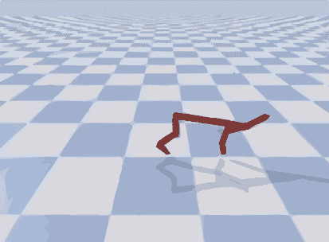 |
|  | 总结猎豹环境上的 SAC |
|  | 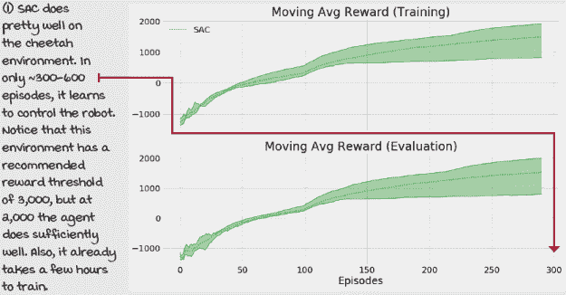 |

## PPO：限制优化步骤

在本节中，我们介绍了一种称为**近端策略优化**（PPO）的演员-评论家算法。将 PPO 视为一个与 A2C 具有相同底层架构的算法。PPO 可以重用为 A2C 开发的大部分代码。也就是说，我们可以并行使用多个环境进行模拟，将经验汇总成 mini-batch，使用评论家获取 GAE 估计，并以类似于 A2C 训练的方式训练演员和评论家。

PPO 中的关键创新是一个代理目标函数，它允许在线策略算法在相同的经验 mini-batch 上执行多个梯度步骤。正如你在上一章所学到的，A2C 作为一种在线策略方法，不能重复使用经验进行优化步骤。一般来说，在线策略方法需要在优化器步骤后立即丢弃经验样本。

然而，PPO 引入了一个剪裁的目标函数，防止策略在优化步骤后变得过于不同。通过保守地优化策略，我们不仅防止了由于策略梯度方法的内在高方差导致的性能崩溃，而且可以重用经验的小批量，并在每个小批量中执行多个优化步骤。重用经验的能力使 PPO 比其他策略方法（如你在上一章中学到的那些方法）更有效率。

### 使用与 A2C 相同的演员-评论家架构

将 PPO 视为 A2C 的改进。我的意思是，尽管在本章中我们学习了 DDPG、*TD*3 和 SAC，并且所有这些算法都有共性。PPO 不应被视为 SAC 的改进。*TD*3 是 DDPG 的直接改进。SAC 是与*TD*3 同时开发的。然而，SAC 的作者在第一篇 SAC 论文发布后不久，又发布了一个 SAC 的第二版论文，其中包含了*TD*3 的一些特性。虽然 SAC 不是*TD*3 的直接改进，但它确实共享了一些特性。然而，PPO 是 A2C 的改进，我们重用了 A2C 的部分代码。更具体地说，我们采样并行环境以收集数据的小批量，并使用 GAE 作为策略目标。

| 0001 | 一点历史介绍 PPO 代理 |
| --- | --- |
|  | PPO 是由 John Schulman 等人于 2017 年在一篇题为“Proximal Policy Optimization Algorithms”的论文中提出的。John 是一位研究科学家，OpenAI 的共同创始人之一，也是强化学习团队的共同负责人。他在加州大学伯克利分校获得计算机科学博士学位，导师是 Pieter Abbeel。 |

### 批量经验

PPO 的一个特点，A2C 没有的是，我们可以重用经验样本。为了处理这个问题，我们可以像 NFQ 那样收集大的轨迹批次，并对数据进行“拟合”，反复优化。然而，更好的方法是创建一个重放缓冲区，并在每次优化步骤中从中采样一个大的迷你批次。这给每个迷你批次带来了随机性的效果，因为样本并不总是相同的，但从长远来看，我们很可能重用所有样本。

|  | 我说 Python 第 1/4 集 |
| --- | --- |
|  |

```
class EpisodeBuffer():                                         ①
    def fill(self, envs, policy_model, value_model):
        states = envs.reset()
        we_shape = (n_workers, self.max_episode_steps)         ②
        worker_rewards = np.zeros(shape=we_shape,
                                  dtype=np.float32)
        worker_exploratory = np.zeros(shape=we_shape,
                                      dtype=np.bool)
        worker_steps = np.zeros(shape=(n_workers),
                                dtype=np.uint16)
        worker_seconds = np.array([time.time(),] * n_workers,
                                  dtype=np.float64)
        buffer_full = False
        while not buffer_full and \                            ③
              len(self.episode_steps[self.episode_steps>0]) < \
              self.max_episodes/2:
            with torch.no_grad():
                actions, logpas, \                             ④
                 are_exploratory = policy_model.np_pass(states)
                values = value_model(states)
            next_states, rewards, terminals, \
                                    infos = envs.step(actions) ⑤
            self.states_mem[self.current_ep_idxs,
                          worker_steps] = states
            self.actions_mem[self.current_ep_idxs,
                             worker_steps] = actions
            self.logpas_mem[self.current_ep_idxs,
                            worker_steps] = logpas             ⑥
```

① 这是 EpisodeBuffer 类的填充。② 变量用于将工作信息分组。③ 我们进入主循环以填充缓冲区。④ 我们首先获取当前的动作、对数概率和统计数据。⑤ 将动作传递到环境中并获取经验。⑥ 然后，将经验存储到重放缓冲区中。 |

|  | 我说 Python 第 2/4 集 |
| --- | --- |
|  |

```
    self.logpas_mem[self.current_ep_idxs,                      ⑦
                    worker_steps] = logpas
    worker_exploratory[np.arange(self.n_workers),
                       worker_steps] = are_exploratory         ⑧
    worker_rewards[np.arange(self.n_workers),
                           worker_steps] = rewards
    for w_idx in range(self.n_workers):
        if worker_steps[w_idx] + 1 == self.max_episode_steps:
            terminals[w_idx] = 1                               ⑨
            infos[w_idx]['TimeLimit.truncated'] = True
    if terminals.sum():                                        ⑩
        idx_terminals = np.flatnonzero(terminals)
        next_values = np.zeros(shape=(n_workers))
        truncated = self._truncated_fn(infos)
        if truncated.sum():
            idx_truncated = np.flatnonzero(truncated)
            with torch.no_grad():
                next_values[idx_truncated] = value_model(\     ⑪
                      next_states[idx_truncated]).cpu().numpy()
    states = next_states                                       ⑫
    worker_steps += 1                                          ⑫
    if terminals.sum():                                        ⑬
        new_states = envs.reset(ranks=idx_terminals)
        states[idx_terminals] = new_states
        for w_idx in range(self.n_workers):
            if w_idx not in idx_terminals:
                continue                                       ⑭
            e_idx = self.current_ep_idxs[w_idx]
```

⑦ 同一行。此外，我移除了空格以使其更容易阅读。⑧ 我们为每个工作者创建这两个变量。记住，工作者在环境中。⑨ 这里我们手动截断步骤过多的剧集。⑩ 我们检查终端状态并预处理它们。⑪ 如果终端状态被截断，我们进行自举。⑫ 我们更新状态变量并增加步数。⑬ 如果我们有终端状态，我们处理工作者。⑭ 我们逐个处理每个终端工作者。 |

|  | 我说 Python 第 3 集回放缓冲区 3/4 |
| --- | --- |
|  |

```
    e_idx = self.current_ep_idxs[w_idx]                        ⑮
    T = worker_steps[w_idx]
    self.episode_steps[e_idx] = T
    self.episode_reward[e_idx] = worker_rewards[w_idx,:T].sum()
    self.episode_exploration[e_idx] = worker_exploratory[\
                                             w_idx, :T].mean() ⑯
    self.episode_seconds[e_idx] = time.time() - \
                                          worker_seconds[w_idx]
    ep_rewards = np.concatenate((worker_rewards[w_idx, :T],
                                [next_values[w_idx]]))         ⑰
    ep_discounts = self.discounts[:T+1]
    ep_returns = np.array(\                                    ⑰
               [np.sum(ep_discounts[:T+1-t] * ep_rewards[t:]) \
                                            for t in range(T)])
    self.returns_mem[e_idx, :T] = ep_returns
    ep_states = self.states_mem[e_idx, :T]
    with torch.no_grad():
        ep_values = torch.cat((value_model(ep_states),         ⑱
                              torch.tensor(\
                                     [next_values[w_idx]],     ⑱
                                     device=value_model.device,
                                     dtype=torch.float32)))
    np_ep_values = ep_values.view(-1).cpu().numpy()
    ep_tau_discounts = self.tau_discounts[:T]
    deltas = ep_rewards[:-1] + self.gamma * \
                           np_ep_values[1:] - np_ep_values[:-1]
    gaes = np.array(\                                          ⑲
               [np.sum(self.tau_discounts[:T-t] * deltas[t:]) \
                                            for t in range(T)])
    self.gaes_mem[e_idx, :T] = gaes
    worker_exploratory[w_idx, :] = 0                           ⑳
    worker_rewards[w_idx, :] = 0                               ⑳
    worker_steps[w_idx] = 0                                    ⑳
    worker_seconds[w_idx] = time.time()                        ⑳
```

⑮ 进一步移除空格。⑯ 这里我们收集统计信息以事后显示和分析。⑰ 我们将自举值添加到奖励向量中。计算预测回报。⑱ 这里我们获取预测值，并将自举值添加到向量中。⑲ 这里我们计算广义优势估计值，并将它们保存到缓冲区中。⑳ 并开始重置所有工作者变量以处理下一个剧集。 |

|  | 我说 Python 第 4 集回放缓冲区 4/4 |
| --- | --- |
|  |

```
                worker_seconds[w_idx] = time.time()            ㉑
                new_ep_id = max(self.current_ep_idxs) + 1
                if new_ep_id >= self.max_episodes:
                    buffer_full = True
                    break                                      ㉒
                self.current_ep_idxs[w_idx] = new_ep_id        ㉓
    ep_idxs = self.episode_steps > 0                           ㉔
    ep_t = self.episode_steps[ep_idxs]                         ㉔
    self.states_mem = [row[:ep_t[i]] for i, \                  ㉕
                  row in enumerate(self.states_mem[ep_idxs])]  ㉕
    self.states_mem = np.concatenate(self.states_mem)          ㉕
    self.actions_mem = [row[:ep_t[i]] for i, \                 ㉕
                  row in enumerate(self.actions_mem[ep_idxs])] ㉕
    self.actions_mem = np.concatenate(self.actions_mem)        ㉕
    self.returns_mem = [row[:ep_t[i]] for i, \                 ㉕
                  row in enumerate(self.returns_mem[ep_idxs])] ㉕
    self.returns_mem = torch.tensor(np.concatenate(\           ㉕
                 self.returns_mem), device=value_model.device) ㉕
    self.gaes_mem = [row[:ep_t[i]] for i, \                    ㉕
                  row in enumerate(self.gaes_mem[ep_idxs])]    ㉕
    self.gaes_mem = torch.tensor(np.concatenate(\              ㉕
                  self.gaes_mem), device=value_model.device)   ㉕
    self.logpas_mem = [row[:ep_t[i]] for i, \                  ㉕
                  row in enumerate(self.logpas_mem[ep_idxs])]  ㉕
    self.logpas_mem = torch.tensor(np.concatenate(\            ㉕
                  self.logpas_mem), device=value_model.device) ㉕
    ep_r = self.episode_reward[ep_idxs]
    ep_x = self.episode_exploration[ep_idxs]                   ㉖
    ep_s = self.episode_seconds[ep_idxs]
    return ep_t, ep_r, ep_x, ep_s                              ㉗
```

㉑ 同一行，再次调整缩进。㉒ 检查下一个排队中的剧集，如果你有太多的话就中断。㉓ 如果缓冲区未满，我们将新剧集的 ID 设置给工作者。㉔ 如果我们处于这些行，这意味着剧集已满，因此我们处理内存以进行采样。㉕ 因为我们是同时初始化整个缓冲区，所以我们需要从剧集和步骤维度中移除所有非数字的内容。㉖ 最后，我们提取统计信息以显示。㉗ 然后返回统计信息。 |

### 裁剪策略更新

正则策略梯度的主要问题是，参数空间中的微小变化可能导致性能的巨大差异。参数空间与性能之间的差异是我们需要在策略梯度方法中使用小学习率的原因，即便如此，这些方法的方差仍然可能太大。裁剪 PPO 的整个目的是对目标函数进行限制，使得在每个训练步骤中，策略只能偏离这么多。直观地说，你可以将这种裁剪目标视为教练防止对结果过度反应。昨晚球队用新战术得分好吗？很好，但不要夸张。不要因为一个新结果而放弃整个赛季的结果。相反，每次只稍微改进一点。

|  | 给我看数学裁剪策略目标 |
| --- | --- |
|  | 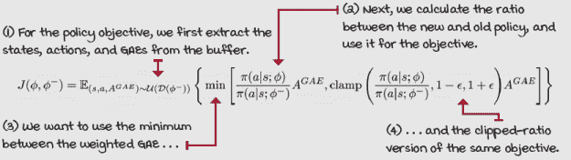 |

### 裁剪值函数更新

我们可以将类似的裁剪策略应用于值函数，核心概念相同：让参数空间的变化只改变 Q 值这么多，但不能更多。正如你可以看到的，这种裁剪技术保持了我们所关心的事物变化的平滑性，无论参数空间的变化是否平滑。我们不一定需要参数空间的小变化；然而，我们希望性能和值的变化是水平的。

|  |  | 给我看数学裁剪值损失 |
| --- | --- | --- |
|  | 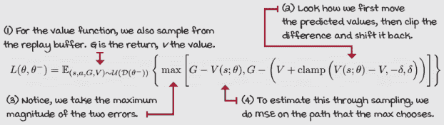 |
|  |  | 我会说 PythonPPO 优化步骤 1/3 |
|  |

```
    def optimize_model(self):                                  ①
        states, actions, returns, \                            ②
                gaes, logpas = self.episode_buffer.get_stacks()
        values = self.value_model(states).detach()             ③
        gaes = (gaes - gaes.mean()) / (gaes.std() + EPS)       ④
        n_samples = len(actions)
        for i in range(self.policy_optimization_epochs):       ⑤
            batch_size = int(self.policy_sample_ratio * \
                                                     n_samples)
            batch_idxs = np.random.choice(n_samples,           ⑥
                                          batch_size,
                                          replace=False)
            states_batch = states[batch_idxs]
            actions_batch = actions[batch_idxs]                ⑦
            gaes_batch = gaes[batch_idxs]
            logpas_batch = logpas[batch_idxs]
            logpas_pred, entropies_pred = \
                          self.policy_model.get_predictions( \ ⑧
                                  states_batch, actions_batch)
            ratios = (logpas_pred - logpas_batch).exp()        ⑨
            pi_obj = gaes_batch * ratios                       ⑩
            pi_obj_clipped = gaes_batch * ratios.clamp( \      ⑩
                                  1.0 - self.policy_clip_range,
                                  1.0 + self.policy_clip_range)
```

① 现在，让我们看看这些代码中的两个方程。② 首先，从缓冲区中提取完整的经验批次。③ 在开始优化模型之前获取值。④ 获取 gaes 并对批次进行归一化。⑤ 现在，首先对策略进行最多预设的轮次优化。⑥ 从完整批次中子采样一个迷你批次。⑦ 使用随机采样的索引提取迷你批次。⑧ 我们使用在线模型来获取预测值。⑨ 在这里，我们计算比率：对数概率与概率比。⑩ 然后，计算目标和裁剪目标。 |

|  |  | 我会说 PythonPPO 优化步骤 2/3 |
| --- | --- | --- |
|  |

```
            pi_obj_clipped = gaes_batch * ratios.clamp( \
                                  1.0 - self.policy_clip_range,
                                  1.0 + self.policy_clip_range)
            policy_loss = -torch.min(pi_obj,                   ⑪
                                     pi_obj_clipped).mean()
            entropy_loss = -entropies_pred.mean() * \          ⑫
                                       self.entropy_loss_weight
            self.policy_optimizer.zero_grad()
            (policy_loss + entropy_loss).backward()            ⑬
            torch.nn.utils.clip_grad_norm_( \
                               self.policy_model.parameters(),
                               self.policy_model_max_grad_norm)
            self.policy_optimizer.step()
            with torch.no_grad():
                logpas_pred_all, _ = \                         ⑭
                     self.policy_model.get_predictions(states,
                                                       actions)
                kl = (logpas - logpas_pred_all).mean()         ⑮
                if kl.item() > self.policy_stopping_kl:
                    break                                      ⑯
        for i in range(self.value_optimization_epochs):        ⑰
            batch_size = int(self.value_sample_ratio * \       ⑰
                                                    n_samples) ⑰
            batch_idxs = np.random.choice(n_samples,           ⑱
                                          batch_size,
                                          replace=False)
            states_batch = states[batch_idxs]
```

⑪ 我们使用目标的最小值的负值来计算损失。⑫ 同时，我们计算熵损失，并相应地加权。⑬ 将优化器置零并开始训练。⑭ 在步进优化器之后，我们执行这个巧妙的技巧，确保只有当新策略在原始策略的范围内时才再次优化。⑮ 在这里，我们计算两个策略的 kl 散度。⑯ 如果它大于停止条件，则跳出训练循环。⑰ 在这里，我们开始对价值函数进行类似的更新。⑱ 我们从完整批次中获取迷你批次，就像策略一样。 |

|  |  | 我会说 PythonPPO 优化步骤 3/3 |
| --- | --- | --- |
|  |

```
            states_batch = states[batch_idxs]
            returns_batch = returns[batch_idxs]
            values_batch = values[batch_idxs]
            values_pred = self.value_model(states_batch)       ⑲
            v_loss = (values_pred - returns_batch).pow(2)      ⑲
            values_pred_clipped = values_batch + \             ⑳
                          (values_pred - values_batch).clamp( \
                                        -self.value_clip_range,
                                        self.value_clip_range)
            v_loss_clipped = (values_pred_clipped - \          ㉑
                                          returns_batch).pow(2)
            value_loss = torch.max(\                           ㉒
                        v_loss, v_loss_clipped).mul(0.5).mean()
            self.value_optimizer.zero_grad()
            value_loss.backward()
            torch.nn.utils.clip_grad_norm_( \                  ㉓
                                self.value_model.parameters(),
                                self.value_model_max_grad_norm)
            self.value_optimizer.step()
            with torch.no_grad():
                values_pred_all = self.value_model(states)     ㉔
                mse = (values - values_pred_all).pow(2)
                mse = mse.mul(0.5).mean() 
               if mse.item() > self.value_stopping_mse:        ㉕
                    break
```

⑲ 根据模型获取预测值，并计算标准损失。⑳ 在这里，我们计算裁剪预测值。㉑ 然后，计算裁剪损失。㉒ 我们使用标准损失和裁剪损失之间的最大值的均方误差。㉓ 最后，我们将优化器置零，反向传播损失，裁剪梯度，并步进。㉔ 我们可以做一些类似早期停止的事情，但使用价值函数。㉕ 基本上，我们检查新旧策略预测值的新旧均方误差。 |

|  |  | 一个具体例子 LunarLander 环境 |
| --- | --- | --- |
|  | 与本章中我们探索的所有其他环境不同，LunarLander 环境具有离散动作空间。例如 DDPG 和*TD*3 这样的算法，仅适用于连续动作环境，无论是单变量，如摆锤，还是向量，如 hopper 和 cheetah。像 DQN 这样的智能体仅适用于离散动作空间环境，如 cart-pole。演员-评论家方法如 A2C 和 PPO 有一个很大的优点，即可以使用与几乎任何动作空间兼容的随机策略模型！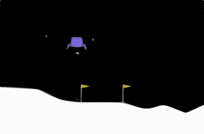在这个环境中，智能体需要在每一步选择四种可能动作中的一种。这包括 0 表示什么都不做；或 1 表示点燃左侧引擎；或 2 表示点燃主引擎；或 3 表示点燃右侧引擎。观察空间是一个包含八个元素的向量，表示坐标、角度、速度以及其腿是否接触地面。奖励函数基于与着陆板的距离和燃料消耗。解决环境的奖励阈值是 200，时间步限制是 1,000。 |
|  | 在 LunarLander 环境中的 PPO 计数 |
|  | 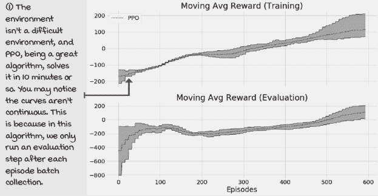 |

## 摘要

在本章中，我们概述了最先进的演员-评论家和深度强化学习方法。您首先了解了 DDPG 方法，其中学习了一个确定性策略。因为这些方法学习确定性策略，所以它们使用离策略探索策略和更新方程。例如，在 DDPG 和*TD*3 中，我们在动作选择过程中注入高斯噪声，使确定性策略变得具有探索性。

此外，您还了解到*TD*3 通过三个关键调整改进了 DDPG。首先，*TD*3 使用与 DDQN 类似的双学习技术，其中我们通过使用双 Q 网络“交叉验证”价值函数输出的估计。其次，*TD*3 除了向传递给环境的动作添加高斯噪声外，还向目标动作添加高斯噪声，以确保策略不会基于虚假的 Q 值估计来学习动作。第三，*TD*3 延迟对策略网络的更新，这样在用它们改变策略之前，价值网络可以得到更好的估计。

我们随后探索了一种名为 SAC 的熵最大化方法，该方法包括最大化价值函数和政策熵的联合目标，直观上可以理解为以最多样化的策略获得最多的奖励。SAC 智能体与 DDPG 和*TD*3 类似，以离策略的方式进行学习，这意味着这些智能体可以重用经验来改进策略。然而，与 DDPG 和*TD*3 不同，SAC 学习一个随机策略，这意味着探索可以是按策略的，并嵌入到学习到的策略中。

最后，我们探索了一种称为 PPO 的算法，它是 A2C 的直接后裔，是一种基于策略的学习方法，同时也使用基于策略的探索策略。然而，由于剪裁目标使得 PPO 更保守地改进学习策略，因此 PPO 能够重用过去的经验来改进其策略。

在下一章中，我们将回顾围绕 DRL 的几个研究领域，这些领域正在推动许多人称之的“通用人工智能”（AGI）领域的边缘。AGI 是通过重新创造它来理解人类智能的机会。物理学家理查德·费曼说：“我不能创造的东西，我就不理解。”理解智能不是很好吗？

到现在为止，

+   理解更高级的演员-评论家算法和相关技巧

+   可以实现最先进的深度强化学习方法，并可能设计出可以与他人分享的这些算法的改进

+   可以将最先进的深度强化学习算法应用于各种环境，希望甚至包括你自己的环境

|  | 可分享的工作在自己的领域内工作并分享你的发现 |
| --- | --- |

|  | 这里有一些想法，如何将你所学的内容提升到下一个层次。如果你愿意，与世界分享你的结果，并确保查看其他人所做的事情。这是一个双赢的局面，希望你能充分利用它。

+   **#gdrl_ch12_tf01:** 选择一个连续动作空间环境，并在该环境中测试本章中你所学到的所有智能体。注意，你可能需要为 PPO 更改它。但是，了解这些算法如何比较是值得的。

+   **#gdrl_ch12_tf02:** 获取 PPO，并将其添加到上一章的笔记本中。在类似的环境中测试它，并比较结果。注意，这个 PPO 实现会在进行任何更新之前缓冲一些经验。确保调整代码或超参数，以使比较公平。PPO 的表现如何？请确保在比 cart-pole 更具挑战性的环境中进行测试！

+   **#gdrl_ch12_tf03:** 还有其他最大熵深度强化学习方法，例如软 Q 学习。找到实现这种最大熵目标的算法列表，选择其中一个，并自己实现它。测试它，并将你的实现与其他智能体（包括 SAC）进行比较。创建一篇博客文章，解释这些方法的优缺点。

+   **#gdrl_ch12_tf04:** 在一个具有高维观察空间和连续动作空间的高维观察空间环境中测试本章中的所有算法。例如，查看赛车环境（[`gym.openai.com/envs/CarRacing-v0/`](https://gym.openai.com/envs/CarRacing-v0/)）。任何类似的都可以。修改代码，让智能体在这些环境中学习。

+   **#gdrl_ch12_tf05**：在每一章中，我都使用最后的标签作为通用的标签。请随意使用这个标签来讨论任何与本章相关的工作。没有比为自己创造作业更令人兴奋的了。确保分享你打算调查的内容和你的结果。

用你的发现写一条推文，@提及我 @mimoralea（我会转发），并使用列表中的特定标签来帮助感兴趣的人找到你的结果。没有对错之分；你分享你的发现并检查他人的发现。利用这个机会社交，做出贡献，让自己更受关注！我们正在等待你的加入！以下是一条推文示例：“嘿，@mimoralea。我创建了一篇博客文章，列出了学习深度强化学习的资源列表。查看它在这里<链接>。#gdrl_ch01_tf01”我会确保转发并帮助他人找到你的作品。|
