# 13 向着通用人工智能迈进

在这一章节

+   你将回顾本书中学到的算法，以及了解那些没有深入探讨的深度强化学习方法。

+   你将了解高级深度强化学习技术，当这些技术结合在一起时，能够让智能体展现出更广泛的智能。

+   你将得到我关于如何追逐梦想并为这些令人惊叹的人工智能和深度强化学习领域做出贡献的离别建议。

我们的最终目标是创建出能够像人类一样有效地从经验中学习的程序。

—— 约翰·麦卡锡 人工智能领域的创始人 Lisp 编程语言的发明者

在这本书中，我们调查了广泛的决策算法和强化学习智能体；从你在第三章中学到的规划方法到我们在上一章中涵盖的最先进的深度强化学习智能体。本书的重点是教授算法的细节；然而，深度强化学习（DRL）的内容远不止本书所涵盖的，我希望你能有一个前进的方向。

我设计这一章节是为了强调几个要点。在第一部分，我们回顾了整本书。我希望你能退后一步，再次审视全局。我希望你能看到你所学到的，以便你可以自己决定下一步该去哪里。我还提到了几种我在书页用尽之前未能涵盖的显著类型的智能体。但要知道，尽管有更多类型的算法，本书中所学的内容涵盖了基础的方法和概念。

在概述了所涵盖的内容和未涵盖的内容之后，我介绍了几个在深度强化学习（DRL）中更为高级的研究领域，这些领域可能最终会导致通用人工智能（AGI）的创造。我知道 AGI 是一个热门话题，很多人都在误导性地使用它。作为一个既令人兴奋又具有争议的话题，人们用它来吸引注意力。不要把你的精力浪费在那些人身上；不要被误导；不要分心。相反，专注于眼前的事情。朝着你的目标前进，无论你的目标是什么。

我确实相信人类能够创造出通用人工智能（AGI），因为我们将会永远地尝试。理解智能和自动化任务是我们长久以来渴望并努力追求的目标，而且这种情况永远不会改变。我们试图通过哲学和自我理解来理解智能。我们通过内省寻找关于智能的答案。我认为大多数人工智能研究者本质上也是哲学家。他们利用他们在强化学习中学到的知识来提升自己，反之亦然。

此外，人类喜欢自动化；这就是智能让我们能够做到的事情。我们将继续尝试自动化生活，我们最终会实现这一点。现在，虽然我们可以争论通用人工智能（AGI）是否是超越世界的类人机器人的开始，但今天，我们仍然无法训练一个代理以超人类水平玩所有 Atari 游戏。也就是说，单个训练过的代理不能玩所有游戏，尽管可以独立训练单个通用算法。但是，在考虑 AGI 时，我们应该谨慎。

为了结束这一章和整本书，我为你提供了前进的想法。我收到了很多关于如何将 DRL 应用于自定义问题、你自己的环境的提问。我在全职工作中以此为生，所以我可以分享我的看法，关于如何着手去做。我还为有兴趣的人提供职业建议，以及一个告别信息。这是另一个章节：让我们这么做吧。

## 覆盖了什么，又明显没有涵盖什么？

本书涵盖了深度强化学习的大部分基础，从马尔可夫决策过程（MDPs）及其内部工作原理到最先进的演员-评论家算法以及如何在复杂环境中训练它们。深度强化学习是一个活跃的研究领域，每个月都会发布新的算法。该领域正在快速发展，不幸的是，不可能在单本书中提供对一切的高质量解释。

幸运的是，大多数被省略的内容都是高级概念，在大多数应用中并不需要。但这并不意味着它们不重要；我强烈建议你继续学习深度强化学习（DRL）的旅程。你可以依赖我在路上的帮助；我很容易找到。然而，就这本书省略的内容而言，我只认为两个是基本要素；它们是基于模型的深度强化学习方法和无导数优化方法。

在本节中，我们快速回顾了你在本书中学到的算法和方法，并简要介绍了这两个明显缺失的基本方法。

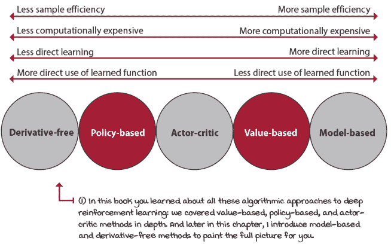

深度强化学习不同算法方法的比较

### 马尔可夫决策过程

前两章是强化学习领域的介绍以及我们描述试图解决的问题的方式。MDPs 是一个需要记住的基本概念，即使它们看起来简单且有限，它们也是强大的。我们在这个领域可以探索的还有很多。我希望你从这些概念中获得的能力是能够将问题视为 MDPs。自己练习一下。思考一个问题，并将其分解为状态、观察、动作以及使该问题成为 MDPs 的所有组成部分。

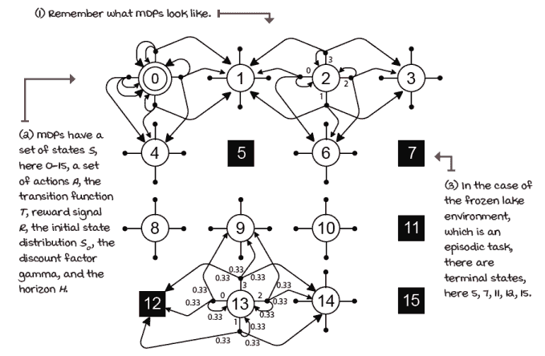

冰冻湖环境的转换函数

你会注意到，尽管世界看起来是非平稳和非马尔可夫的，但我们仍然可以转换一些使其看起来如此的东西，然后将其视为一个 MDP。现实世界的概率分布是否改变，或者是我们没有足够的数据来确定实际的分布？未来是否取决于过去的状态，或者状态空间如此高维，以至于我们无法想象世界的历史是单个状态的一部分？再次，作为一个练习，思考问题并尝试将它们拟合到这个 MDP 框架中。如果你想要将 DRL 应用于你的问题，这可能是有用的。

### 规划方法

在第三章中，我们讨论了帮助你找到具有 MDP 的问题的最优策略的方法。这些方法，如值迭代和政策迭代，迭代地计算最优值函数，从而允许快速提取最优策略。策略不过是普遍的计划——针对每种情况的计划。

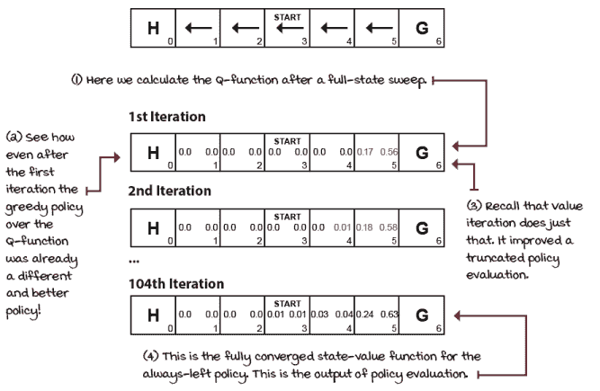

在 SWF 环境中对始终向左策略进行策略评估

本节最重要的两点收获是首先。这些算法隔离了序列决策问题。由于它们需要 MDP，因此没有不确定性，由于它们只适用于离散状态和动作空间，因此没有复杂性。其次，这里有一个普遍的模式可以观察；我们对评估行为感兴趣，可能与我们改进它们的兴趣一样大。这种认识是我一段时间后才意识到的。对我来说，改进、优化听起来更有趣，所以策略评估方法没有引起我的注意。但后来你理解，如果你正确评估，改进就变得轻而易举。主要的挑战通常是准确和精确地评估策略。但是，如果你有 MDP，你就可以直接正确地计算这些值。

### Bandit methods

第四章讲述了从评估反馈中进行学习。在这种情况下，我们通过移除 MDP 来了解强化学习的不确定性方面。我们隐藏了 MDP，但使其超级简单；一个单状态单步长 MDP，其中的挑战是在最少的回合数中找到最优动作或动作分布；也就是说，最小化总后悔。

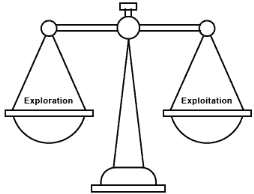

在第四章，你学习了处理探索-利用权衡的更有效的方法

我们研究了多种不同的探索策略，并在几个 bandit 环境中进行了测试。但最终，我对那一章的目标是向你展示，不确定性本身就是一个值得单独研究的挑战。关于这个主题有一些非常好的书籍，如果你对此感兴趣，你应该追求这条道路；这是一个需要大量关注的合理路径。

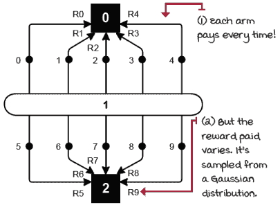

10 臂高斯 bandit

从本章中提炼出正确的要点进入强化学习是，强化学习之所以具有挑战性，是因为我们没有访问到第三章中规划方法中的 MDP。没有 MDP 会产生不确定性，而我们只能通过探索来解决不确定性。探索策略是我们代理能够通过试错学习自行学习的理由，这也是这个领域令人兴奋的原因。

### 表格强化学习

第五章、第六章和第七章都是关于强化学习的顺序性和不确定性方面的细微差别。在可以更容易研究的方式下，即没有大型和高维状态或动作空间复杂性的情况下，不确定性下的顺序决策问题是强化学习的核心。

第五章讲述了评估策略，第六章讲述了优化策略，第七章讲述了评估和优化策略的高级技术。对我来说，这是强化学习的核心，而且对这些概念的理解有助于你更快地理解深度强化学习。不要将深度强化学习视为与表格强化学习分离的东西；那是错误的想法。复杂性只是问题的一个维度，但它是完全相同的问题。你经常看到顶级深度强化学习研究实验室发布解决离散状态和动作空间问题的论文。这没有什么可耻的。这通常是明智的方法，当你进行实验时，你应该记住这一点。不要从最高复杂性的问题开始；相反，先隔离，然后解决，最后再增加复杂性。

在这三章中，我们涵盖了各种算法。我们涵盖了评估方法，如首次访问和每次访问蒙特卡洛预测、时序差分预测、*n*-步时序差分（*TD*）和*TD*(*λ*)）。我们还涵盖了控制方法，如首次访问和每次访问蒙特卡洛控制、SARSA、Q 学习、双 Q 学习以及更高级的方法，如 SARSA(*λ*)和 Q(*λ*)，这两种方法都涉及替换和累积轨迹。我们还涵盖了基于模型的方法，如 Dyna-Q 和轨迹采样。

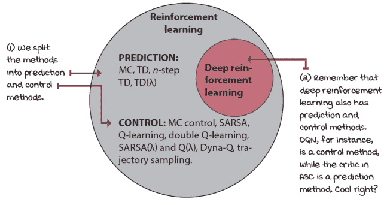

深度强化学习是强化学习更大领域的一部分

### 基于价值的深度强化学习

第八章、第九章和第十章都是关于基于价值的深度强化学习方法的细微差别。我们提到了神经拟合 Q 迭代（NFQ）、深度 Q 网络（DQN）、双深度 Q 网络（DDQN）、DDQN 中的对抗架构（对抗 DDQN）和优先级经验回放（PER）。我们从 DQN 开始，并逐个添加改进到这个基线方法。我们在小车-杆环境中测试了所有算法。

可以对这个基线算法实施许多改进，我建议你尝试一下。查看一个名为 Rainbow 的算法，并实现一些书中未提到的 DQN 的改进。写一篇关于它的博客文章，并与世界分享。在实现基于价值的深度强化学习方法时学到的技术对于其他深度强化学习方法至关重要，包括演员-评论家方法中的学习评论家。有许多改进和技术需要发现。继续对这些方法进行实验。

### 基于策略的演员-评论家深度强化学习

第十一章是关于基于策略的演员-评论家方法的介绍。在书的那个阶段，基于策略是强化学习的一个新方法，所以我们通过一个简单的算法介绍了这些概念，即 REINFORCE，它只参数化策略。为此，我们直接近似策略，完全没有使用任何价值函数。在 REINFORCE 中，我们用来优化策略的信号是蒙特卡洛回报，即代理在一段时间内实际体验到的回报。

接着，我们探索了一种学习价值函数以减少 MC 回报方差的算法。我们称这个算法为 vanilla 策略梯度（VPG）。这个名字有些随意，也许更好的名字应该是*rEINFORCE with Baseline*。尽管如此，重要的是要注意，尽管这个算法学习了一个价值函数，但它不是一个演员-评论家方法，因为它使用价值函数作为基线而不是作为评论家。这里的关键洞察是我们不使用价值函数进行自举，而且因为我们还使用 MC 回报来训练价值函数模型，所以它的偏差最小。算法中的唯一偏差是由神经网络引入的，没有其他。

然后，我们介绍了更多使用自举的先进演员-评论家方法。A3C 使用*n*-步回报；GAE，它是一种用于策略更新的 lambda 回报形式；以及 A2C，它使用同步更新策略。总的来说，这些是当前最先进的方法，你应该知道它们是可靠的方法，并且仍然被广泛使用。例如，A3C 的一个主要优点和独特特性是它只需要 CPU，并且可以比其他方法更快地训练，如果你没有 GPU 的话。

### 先进的演员-评论家技术

即使 A3C、GAE 和 A2C 都是演员-评论家方法，它们在独特地使用评论家方面并不相同。在第十二章中，我们探讨了使用独特方法的情况。例如，许多人认为 DDPG 和*TD*3 是演员-评论家方法，但它们更适合作为连续动作空间的基于价值的方法。如果你看看 A3C 使用演员和评论家的方式，例如，你会在 DDPG 中发现实质性的差异。无论如何，DDPG 和*TD*3 都是最先进的方法，无论是否是演员-评论家，在解决问题时影响不大。主要的注意事项是这两种方法只能解决连续动作空间的环境。它们可能是高维动作空间，但动作必须是连续的。其他方法，如 A3C，可以解决连续和离散动作空间。

SAC 是一种独特的动物。它之所以跟在 DDPG 和*TD*3 之后，仅仅是因为 SAC 使用了与 DDPG 和*TD*3 许多相同的技巧。但 SAC 的独特特性是它是一种熵最大化方法。值函数不仅最大化回报，还最大化策略的熵。这类方法很有前景，我不惊讶会看到源自 SAC 的新最先进的方法。

最后，我们探讨了另一种令人兴奋的演员-评论家方法，即 PPO。PPO 是一种演员-评论家方法，你可能已经注意到了，因为我们重用了 A3C 的大部分代码。PPO 的关键洞察力在于策略更新步骤。简而言之，PPO 一次只改进策略一点；我们确保策略在更新时不会改变太多。你可以将其视为一种保守的策略优化方法。PPO 可以轻松应用于连续和离散动作空间，并且 PPO 是 DRL 中一些最激动人心的结果背后的原因，例如 OpenAI Five。

在这些章节中，我们介绍了许多优秀的方法，但更重要的是，我们介绍了使你能够继续了解该领域的基础方法。许多现有的算法都源自本书中介绍过的算法，有一些例外，即基于模型的深度强化学习方法和无导数优化方法。在接下来的两个部分中，我将提供关于这些方法的信息，以便你能够继续探索深度强化学习之旅。

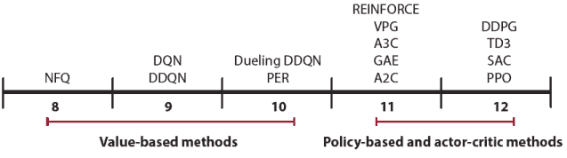

本书中的 DRL 算法

### 基于模型的深度强化学习

在第七章中，你学习了基于模型的重强化学习方法，例如 Dyna-Q 和轨迹采样。基于模型的重深度强化学习在本质上是你所预期的；使用深度学习技术来学习状态转移、奖励函数或两者，然后使用这些信息进行决策。与你在第七章中学到的那些方法一样，基于模型的重深度强化学习的一个显著优点是样本效率；基于模型的方法在强化学习中是最有效的样本使用方法。

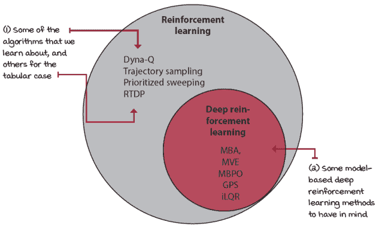

需要考虑的基于模型的重强化学习算法

|  | 米格尔的类比如何无导数方法工作 |
| --- | --- |
|  | 要直观地比较基于梯度和无梯度方法的差异，想象一下“热与冷”这个游戏。是的，就是孩子们玩的那种游戏，其中一个孩子，猎人，需要找到隐藏的感兴趣物品，而其他知道物品位置的孩子，如果猎人离物品远，就喊“冷”，如果猎人靠近物品，就喊“热”。在这个类比中，猎人的位置是神经网络的参数。感兴趣的隐藏物品是全局最优解，要么是损失函数的最小值，要么是目标函数的最大值。目的是优化猎人和物品之间的距离。为此，在游戏中，你使用孩子们喊“冷”或“热”来优化猎人的位置。这里这个类比变得有趣起来。想象一下，有孩子们，除了喊“冷”或“热”，当猎人靠近物品时，他们会变得更响亮。你知道，孩子们很容易兴奋，而且不能保守秘密。当你听到他们从轻声说“冷”到每秒声音越来越大时，你知道，作为猎人，你正在朝着正确的方向前进。可以使用那个“梯度”信息来最小化距离。使用这些信息到达感兴趣物品的方法就是基于梯度的方法。如果信息以连续的形式出现，意味着孩子们每秒喊几次，声音变大或变小，从喊“冷”到喊“热”随着距离变化，那么你可以使用信息幅度的增加或减少，即梯度，来到达物品。太棒了！另一方面，想象一下，喊信息的孩子们很刻薄，或者可能只是不完美。想象一下，他们给出的是不连续的信息。例如，当猎人处于某些区域时，他们可能不允许说任何话。他们从“轻声冷”到一段时间什么也不说，然后再回到“轻声冷”。或者，也许想象一下，物品就在一堵长墙的中间。即使猎人靠近物品，猎人也无法用梯度信息触及物品。猎人会靠近物品，所以正确喊的应该是“热”，但现实中，物品在墙的另一边，无法触及。在所有这些情况下，可能基于梯度的优化方法并不是最好的策略，无梯度方法，即使移动是随机的，也可能更适合找到物品。无梯度方法的方法可能就像这样简单。猎人会随机选择一个地方去，在到达那里时忽略“梯度”信息，然后检查喊叫的孩子们，然后尝试另一个随机位置。在得到几个随机位置的概念后，比如 10 个，猎人会选取前 3 个，并尝试从这 3 个明显更好的位置中随机变化。在这种情况下，梯度信息是没有用的。相信我，这个类比可以继续下去，但我将在这里停止。底线是，基于梯度和无梯度方法只是到达感兴趣点的策略。这些策略的有效性取决于手头的问题。 |

除了样本效率之外，使用基于模型的方法的另一个固有优势是可迁移性。学习世界动态的模型可以帮助你完成不同的相关任务。例如，如果你训练一个智能体来控制机械臂去抓取一个物体，一个学习环境如何对智能体的移动尝试做出反应的基于模型的智能体可能会更容易在后续任务中学会抓取那个物体。请注意，在这种情况下，学习奖励函数的模型对迁移并没有帮助。然而，学习环境对其运动命令的反应是可迁移的知识，这可以允许完成其他任务。上次我检查时，物理定律已经几百年来没有更新了——这真是一个缓慢发展的领域！

值得一提的还有几个优点。首先，学习模型通常是一个监督学习任务，这比强化学习更加稳定和表现良好。其次，如果我们有一个准确的环境模型，我们可以使用理论上有根据的规划算法，如轨迹优化、模型预测控制，甚至启发式搜索算法，如蒙特卡洛树搜索。最后，通过学习模型，我们总体上更好地利用经验，因为我们从环境中提取了最多的信息，这意味着有更多更好的决策可能性。

但并非一切尽善尽美；基于模型的学习也有挑战。在使用基于模型的方法时，有几个缺点需要考虑。首先，除了策略、价值函数或两者之外，学习环境动态的模型在计算上更加昂贵。而且，如果你只学习动态模型，那么模型误差的累积会使你的算法变得不切实际。

动态的各个方面并不都是对策略有直接益处的。我们在主张直接学习策略而不是学习价值函数时已经讨论了这个问题。想象一下倒水任务；如果你需要首先学习流体动力学、流体的粘度和流体流动，而你只想拿起一个杯子倒水，那么我们就过于复杂化了任务。试图学习环境的模型比直接学习策略更复杂。

必须记住，深度学习模型是数据饥渴的。正如你所知，为了从深度神经网络中获得最佳效果，你需要大量的数据，这对基于模型的深度强化学习方法来说是一个挑战。这个问题还与在神经网络中很难估计模型不确定性的事实相叠加。因此，鉴于神经网络试图泛化，无论模型不确定性如何，你可能会得到长期预测结果完全是垃圾。

这个问题提出了一个论点，即基于模型的方法是最具样本效率的，这是值得怀疑的，因为你可能最终需要比在无模型方法下学习良好策略所需的数据更多的数据来学习一个有用的模型。然而，如果你拥有那个模型，或者独立于任务获取该模型，那么你可以将该模型用于其他任务。此外，如果你要使用“浅层”模型，例如高斯过程或高斯混合模型，那么我们又回到了起点，基于模型的方法再次成为最具样本效率的方法。

我希望你从这个部分开始，知道这并不是关于基于模型与无模型之争。尽管你可以结合基于模型和无模型的方法，得到有吸引力的解决方案，但最终，工程学并不是关于这个的，同样，这也不是基于价值与基于策略之争，也不是演员-评论家之争。当你需要螺丝刀时，不要用锤子。我的工作是描述每种算法适合什么，但如何正确使用这些知识取决于你。当然，探索、享受乐趣很重要，但在解决问题的时候，要明智地选择。

### 无导数优化方法

深度学习是使用多层函数逼近器来学习函数。一个传统的深度学习用例如下。首先，我们创建一个参数模型，它反映了感兴趣的函数。然后，我们定义一个目标函数，以了解模型在任何给定时间有多错误。接下来，我们通过计算参数移动的方向来迭代优化模型，使用反向传播。最后，我们使用梯度下降更新参数。

反向传播和梯度下降是优化神经网络的实用算法。这些方法对于在给定范围内找到函数的最低点或最高点非常有价值；例如，损失函数或目标函数的局部最优。但有趣的是，它们并不是优化参数模型（如深度神经网络）的唯一方法，更重要的是，它们并不总是最有效的方法。

无导数优化，如遗传算法或进化策略，是一种近年来受到深度强化学习社区关注的不同的模型优化技术。无导数方法，也称为无梯度、黑盒和零阶方法，不需要导数，在基于梯度的优化方法受限制的情况下可能很有用。例如，在优化离散、不连续或多模型函数时，基于梯度的优化方法会遇到困难。

无导数方法在许多情况下可能是有用且直接的。即使随机扰动神经网络的权重，如果计算资源足够，也能完成任务。无导数方法的主要优势是它们可以优化任意函数。它们不需要梯度来工作。另一个优势是这些方法易于并行化。使用无导数方法时，听到数百或数千个 CPU 并不罕见。另一方面，它们易于并行化是好事，因为它们是样本低效的。作为黑盒优化方法，它们没有利用强化学习问题的结构。它们忽略了强化学习问题的顺序性质，否则这些信息可以为优化方法提供有价值的信息。

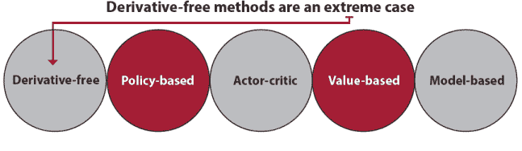

无导数方法是极端情况

## 向 AGI 迈进的高级概念

在上一节中，我们回顾了本书涵盖的深度强化学习的基础概念，并简要提到了两种我们没有深入探讨的方法类型。但是，正如我之前提到的，仍然有许多高级概念，尽管它们对于深度强化学习的介绍不是必需的，但对于设计通用人工智能（AGI）至关重要，这是大多数 AI 研究者的最终目标。

在本节中，我们首先深入一步探讨 AGI，并论证 AI 代理需要具备的一些特质以应对需要更广泛智能的任务。我以高层次解释了这些特质及其意图，以便你能够继续你的 AI 学习之旅，也许有一天能贡献于这些尖端研究领域。

### 通用人工智能（AGI）是什么，再次？

在本书中，你已经看到了许多 AI 代理的例子，它们一开始看起来令人印象深刻。同一个计算机程序能够学习解决各种各样的问题，这是非常了不起的。此外，当你转向更复杂的环境时，很容易被这些结果冲昏头脑：AlphaZero 学会了下国际象棋、围棋和将棋。OpenAI Five 在 Dota2 游戏中击败了人类团队。AlphaStar 在星际争霸 II 游戏中击败了顶尖职业选手。这些都是令人信服的通用算法。但这些通用算法是否显示出任何通用智能的迹象？首先，什么是通用智能？

通用智能是指结合各种认知能力来解决新问题的能力。对于通用人工智能（AGI），我们期望计算机程序展现出通用智能。好的。现在，让我们提出以下问题：本书中提出的任何算法，或者甚至像 AlphaZero、OpenAI Five 和 AlphaStar 这样的最先进方法，是否是通用人工智能的例子？嗯，并不清楚，但我认为不是。

你看，一方面，许多这些算法可以使用“多种认知能力”，包括感知和学习来解决新的任务，比如说，玩乒乓球。如果我们坚持我们的定义，算法使用多种认知能力来解决新问题是加分项。然而，这些算法中最令人不满意的部分之一是，除非你训练它们，否则这些训练过的代理在解决新问题上都不擅长，而这通常需要数百万个样本才能得到任何令人印象深刻的结果。换句话说，如果你训练一个 DQN 代理从像素中玩乒乓球，那么这个训练过的代理，在乒乓球上可以达到超人的水平，但对如何玩好《Breakout》一无所知，并且必须训练数百万帧才能显示出任何技能。

人类没有这个问题。如果你学会了玩乒乓球，我相当确信你可以在两秒钟内学会玩《Breakout》。两款游戏都有相同的任务，那就是用球拍击球。另一方面，即使是 AlphaZero 代理，这个在多个根本不同的棋类游戏中拥有史上最令人印象深刻技能的计算机程序，并且能够打败那些致力于这些游戏的职业玩家，但它永远不会帮你洗衣服。

某些 AI 研究人员表示，他们的目标是创建能够感知、学习、思考和甚至像人类一样感受情绪的 AI 系统。能够学习、思考、感受，甚至可能看起来像人的机器，无疑是一个令人兴奋的想法。其他研究人员则采取更实际的方法；他们并不一定想要一个像人类一样思考的 AI，除非像人类一样思考是做出一顿好午餐的必要条件。也许情感是造就一位伟大厨师的因素，谁知道呢。关键是，尽管有些人希望 AGI（通用人工智能）可以委托，停止做日常任务，但其他人则有一个更哲学的目标。创建 AGI 可能是理解智能本身、理解自我的一条途径，而这本身就是人类的一项非凡成就。

无论哪种方式，每个 AI 研究人员都会同意，无论最终目标是什么，我们仍然需要展示更多通用和可迁移技能的 AI 算法。在 AI 系统能够执行更类似人类任务的许多特质中，有许多特质是 AI 系统可能需要的，例如洗衣服、做午餐或洗碗。有趣的是，这些日常任务对于 AI 来说是最难解决的。让我们回顾一下目前正在推动深度强化学习和人工智能展示通用智能迹象的几个研究领域。

以下章节介绍了几个你可能希望在深入学习将人工智能领域推向人类水平智能的先进深度强化学习技术时进一步探索的概念。我只用了几句话，以便让你尽可能多地了解它们。我的目的是指给你门路，而不是门里面的东西。决定打开哪扇门，由你自己来定。

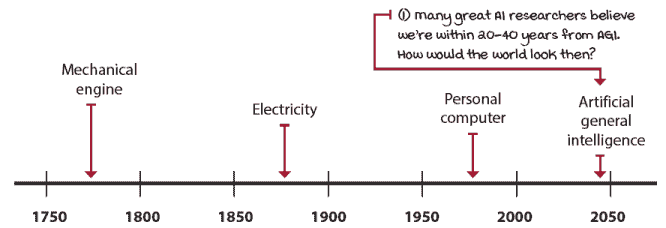

劳动力革命

### 高级探索策略

研究领域中的一个令人兴奋的成果与奖励函数有关。在这本书中，你已经看到了从奖励信号中学习的智能体，但有趣的是，最近的研究表明智能体可以在没有任何奖励的情况下学习。从除了奖励之外的事物中学习是一个令人兴奋的想法，这可能是开发类似人类智能的必要条件。如果你观察一个婴儿学习，会发现有很多无监督和自监督学习在进行。当然，在他们生命中的某个时刻，我们会奖励我们的孩子。你知道你得到 A，你得到 B；你的薪水是 x，你的薪水是 y。但智能体并不总是追求我们为他们设定的奖励。生活的奖励函数是什么？是职业成功吗？是有孩子吗？这并不清楚。

现在，从强化学习问题中移除奖励函数可能会有些可怕。如果我们没有为智能体定义要最大化的奖励函数，我们如何确保他们的目标与我们的目标一致？我们如何创造适合人类目标的人工通用智能？也许，为了创造类似人类的智能，我们需要给智能体选择命运的自由。无论如何，对我来说，这是需要追求的关键研究领域之一。

### 反向强化学习

没有奖励函数也可以学习行为，尽管我们通常更喜欢奖励函数，但首先学习模仿人类可以帮助用更少的样本学习策略。这里有几个相关的领域可以寻找。*行为克隆*是将监督学习技术应用于从演示中学习策略，通常是从人类那里学习。正如其名所示，这里没有推理发生，只是泛化。一个相关的领域，称为*反向强化学习*，包括从演示中推断奖励函数。在这种情况下，我们不仅仅是复制行为，而是在学习另一个智能体的意图。*推断意图*可以是实现多个目标的有力工具。例如，在多智能体强化学习中，对于对抗和协作设置，了解其他智能体的目标可以是有用的信息。如果我们知道一个智能体想要做什么，以及它想要做的事情是否与我们的目标相悖，我们可以在为时已晚之前制定阻止它的策略。

但是，逆强化学习允许智能体学习新的策略。从另一个智能体（如人类）那里学习奖励函数，并从这个学到的奖励函数中学习策略，这种技术通常被称为*学徒学习*。在学习逆强化学习时，一个值得考虑的有趣点是，奖励函数通常比最优策略更简洁。尝试学习奖励函数在多种情况下是有意义的。从演示中学习策略的技术也被称为*模仿学习*，通常是在学习策略之前推断奖励函数还是直接进行行为克隆。模仿学习的常见用例是将智能体初始化到足够好的策略。例如，如果一个智能体必须从随机行为中学习，那么它可能需要很长时间才能学习到一个好的策略。想法是模仿人类，即使不是最优的，也可能通过与环境更少的交互导致最优策略。然而，这并不总是情况，由人类演示预训练的策略可能会引入不希望的偏差，并阻止智能体找到最优策略。

### 迁移学习

你可能已经注意到，在某个环境中训练的智能体通常不能转移到新的环境中。强化学习算法是通用目的的，意味着同一个智能体可以在不同的环境中进行训练，但它们没有通用智能，它们学到的知识不能直接转移到新的环境中。

迁移学习是一个研究领域，它探讨将知识从一组环境转移到新环境的方法。例如，如果你有深度学习背景，可能会觉得以下方法直观：所谓的*微调*。类似于在监督学习中重用预训练网络的权重，在相关环境中训练的智能体可以重用在不同任务上卷积层学到的特征。如果环境相关，例如在 Atari 游戏中，那么一些特征可能是可迁移的。在某些环境中，甚至策略也可以迁移。

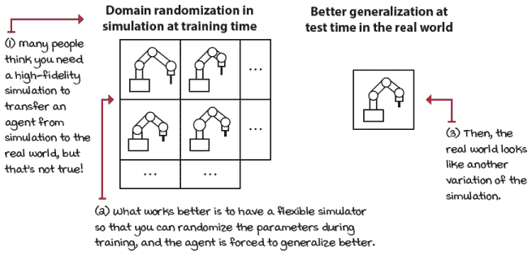

实际世界中的仿真到现实迁移学习任务是一个常见需求

研究使智能体学习更通用技能的一般领域被称为*迁移学习*。迁移学习的另一常见用途是将在模拟中学习到的策略转移到现实世界。从模拟到现实的迁移学习在机器人领域是一个常见需求，其中训练控制机器人的智能体可能很棘手、成本高昂且危险。它也不像在模拟中的训练那样可扩展。一个常见需求是在模拟中训练智能体，然后将策略转移到现实世界。一个常见的误解是，为了将智能体从模拟转移到现实世界，模拟需要具有高保真度和现实性。有研究表明情况正好相反。是观察的多样性、多样性使得智能体更具迁移性。如领域随机化等技术处于这一研究领域的最前沿，并显示出巨大的潜力。

### 多任务学习

另一个被称为*多任务学习*的研究领域，从不同的角度研究迁移学习。在多任务学习中，目标是训练多个任务，而不是一个，然后将它们转移到新任务。在这种情况下，基于模型的强化学习方法会浮现在脑海中。例如，在机器人领域，使用同一台机器人学习各种任务可以帮助智能体学习环境的动态的鲁棒模型。智能体了解重力、如何向右或向左移动等等。无论任务如何，学习的动态模型都可以转移到新任务。

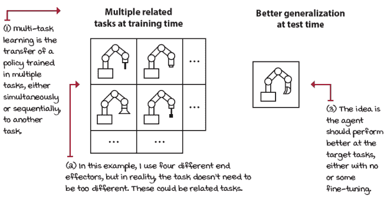

多任务学习包括在多个相关任务上训练并在新任务上测试

### 课程学习

多任务学习的常见用例场景是将任务分解为按难度级别排序的多个任务。在这种情况下，智能体会经历一个课程，逐步学习更复杂的任务。*课程学习*在开发场景时是有意义的，并且可能很有用。如果你需要为智能体创建一个解决问题的环境，那么创建一个最直接的场景并具有密集的奖励函数通常是有意义的。通过这样做，你的智能体可以快速展示学习目标方面的进步，这验证了你的环境运行良好。然后，你可以增加复杂性并使奖励函数更稀疏。在你为几个场景这样做之后，你自然会创建一个智能体可以使用的课程。然后，你可以在越来越复杂的环境中训练你的智能体，并希望智能体能够更快地达到期望的行为。

### 元学习

另一个超级激动人心的研究领域被称为*元学习*。如果您这么想，我们正在手动编码智能体来学习许多不同的任务。在某个时刻，我们成为了瓶颈。如果我们能够开发出一个智能体，它不是学习解决具有挑战性的任务，而是学习如何学习自己，我们就可以从方程式中移除人类；好吧，不是完全移除，但朝着那个方向迈出一步。学习如何学习是使用从学习多个任务中获得的经验来提高自身学习能力的激动人心的方法。这从直觉上是有意义的。从元学习中出现的一些其他激动人心的研究路径是自动发现神经网络架构和优化方法。请密切关注这些。

### 层次化强化学习

通常，我们发现自己在开发具有多个视野问题的环境。例如，如果我们想让智能体找到最佳的高级策略，但只给它低级控制命令来执行动作，那么智能体需要学会从低级动作空间到高级动作空间的转换。直观地说，大多数智能体的策略中存在层次结构。当我规划时，我是在一个更高级的动作空间中进行的。我想的是去商店，而不是移动我的手臂去商店。*层次化强化学习*使智能体能够内部创建一个动作层次结构来处理长期问题。智能体不再推理左右命令，而是更多地考虑去这里或那里。

### 多智能体强化学习

没有其他智能体，世界就不会那么有趣。在多智能体强化学习中，我们研究智能体在周围有多个智能体时如何学习的技术。在多智能体环境中学习时出现的一个主要问题是，随着您的智能体学习，其他智能体也在学习，因此改变它们的行为。问题是这种变化使得观察变得非平稳，因为您的智能体学习的内容在其他智能体学习后立即过时，因此学习变得具有挑战性。

一种令人兴奋的协作多智能体强化学习方法是在训练过程中让评论家使用所有智能体的完整状态信息。这里的优势是您的智能体通过评论家学会合作，然后我们可以在测试期间使用更真实的观察空间来应用策略。共享完整状态可能看起来不切实际，但您可以将其视为类似于团队练习的方式。在练习期间，一切都被允许。比如说，您是一名足球运动员，当您做出这个动作时，您可以告诉其他智能体您打算在边路跑动，等等。在训练期间，您可以得到关于动作的完整信息进行练习；然后，在测试期间，您只能使用有限信息的策略。

在研究多智能体强化学习时，另一个吸引人的想法是分层强化学习可以被视为多智能体强化学习的另一种案例。如何做到这一点呢？想想多个智能体在不同时间范围内做出决定。多时间结构类似于大多数公司做生意的方式。顶层的人为未来几年设定更高层次的目标，其他人则决定如何按月和按日实现目标。顶层的人为底层的人设定目标。整个系统因所有智能体的表现而获得奖励。

当然，多智能体强化学习不仅适用于合作案例，也适用于对抗案例，这可能是最令人兴奋的。人类通常将竞争和对手视为本质上不幸的事情，但多智能体强化学习表明，我们的对手往往是让我们变得更好的最佳方式。许多最近的强化学习成功故事背后的训练技术包括对手：要么是同一智能体的先前版本，例如在自我对战中，要么是在所有比赛结束后形成的整个锦标赛式的其他智能体分布——只有最好的智能体才能生存。对手往往使我们变得更好，不管好坏，它们可能对于最佳行为是必需的。

### 可解释人工智能、安全性、公平性和伦理标准

研究中还有一些其他的关键领域，尽管它们并非直接推动人类水平智能的发展，但对于人工智能解决方案的成功开发、部署和采用是基础性的。

*可解释人工智能* 是一个研究领域，试图创造更易于人类理解的智能体。动机是明显的。法律法庭可以审问任何违法的人；然而，机器学习模型并不是为了可解释性而设计的。为了确保人工智能解决方案能够快速被社会接受，研究人员必须研究减轻可解释性问题的方法。为了明确起见，我认为这不是一个必要条件。我更喜欢让人工智能给我提供准确的股市预测，无论它能否向我解释原因。然而，这两个决定都不是直截了当的。在涉及人类生死存亡的决定中，事情会迅速变得复杂。

安全性是另一个应得到更多关注的研究领域。通常情况下，人工智能以对人类来说过于明显的方式失败。此外，人工智能容易受到人类无法抵御的攻击。我们需要确保当人工智能被部署时，我们知道系统如何对各种情况进行反应。目前人工智能还没有通过经典验证和验证（V&V）软件方法的方式，这对人工智能的采用构成了重大挑战。

公平性是另一个关键问题。我们需要开始思考谁控制着人工智能。如果一家公司为了社会利益最大化利润而创建人工智能，那么人工智能技术的意义何在？我们已经在广告中看到了类似的情况。顶级公司使用人工智能通过一种操纵方式来最大化收益。这些公司是否应该被允许为了利润而这样做？当人工智能越来越好时呢？这样做的目的是什么，通过操纵来摧毁人类？这些都是需要认真考虑的事情。

最后，人工智能伦理标准也是近期受到关注的另一个问题，这得益于蒙特利尔人工智能负责任发展宣言。这些是针对人工智能的 10 项伦理原则，旨在服务于社会的利益，而不仅仅是盈利公司。当你准备贡献时，这些是几个需要考虑的顶级领域。

## 接下来会发生什么？

虽然这一部分标志着这本书的结束，但它应该只是你为人工智能和 DRL 领域做出贡献的开始或延续。我写这本书的意图不仅是让你理解 DRL 的基础知识，而且是要让你加入这个精彩的社区。你需要的不仅仅是继续旅程的承诺。你可以做很多事情，在这一部分，我想给你一些想法，帮助你开始。记住，世界是一个需要各种声音类型和才能的合唱团；你的工作是接受赋予你的才能，尽你所能发展它们，并全力以赴地扮演你的角色。虽然我可以给你提供想法，但接下来发生什么取决于你；世界需要并等待着你的声音。

### 如何使用深度强化学习（DRL）解决定制问题

强化学习（RL）算法有一些非常酷的特点，我想在你了解其他类型的智能体时让你记住。事实是，大多数 RL 智能体可以解决你选择的任何问题，只要你能将问题表示为一个正确的 MDP（马尔可夫决策过程），就像我们在第二章讨论的那样。当你问自己，“X 或 Y 算法能解决什么问题？”时，答案是其他算法能解决的问题。虽然在这本书中，我们专注于一些算法，但所有展示的智能体都可以通过一些超参数调整来解决许多其他环境。解决定制环境的需求是许多人想要解决的问题，但可能需要另一本书来正确处理。我的建议是查看一些在线可用的示例。例如，Atari 环境在后台使用名为 Stella 的模拟器。环境通过模拟器与环境之间传递图像进行观察和行动。同样，MuJoCo 和 Bullet 物理仿真引擎是驱动连续控制环境的后端。看看这些环境是如何工作的。

注意观察是如何从模拟传递到环境，然后再传递到智能体的。然后，智能体选择的动作传递到环境中，然后再传递到仿真引擎。这种模式很普遍，所以如果你想创建一个自定义环境，调查其他人是如何做到的，然后自己动手做。你想要为智能体创建一个学习在股市中投资的环境吗？考虑一下哪些平台有 API 允许你这样做。然后，你可以使用相同的 API 创建不同的环境。例如，一个环境可以购买股票，另一个可以购买期权，等等。最先进的深度强化学习方法有如此多的潜在应用，而我们可用的优质环境数量有限，这真是遗憾。这个领域的贡献无疑是受欢迎的。如果你想要创建一个环境，但没有找到，考虑投入时间创建自己的，并与世界分享。

### 展望未来

你已经学到了很多，这一点毫无疑问。但是，如果你从大局出发，你会发现还有更多东西需要学习。现在，如果你进一步放大视角，你会意识到还有更多未知的领域；是之前没有人学习过的东西。你会发现，人工智能社区追求的目标并不容易；我们正在试图理解大脑是如何工作的。

事实上，即使是其他领域，比如心理学、哲学、经济学、语言学、运筹学、控制理论等等，它们的目标都是相同的，每个领域都从自己的角度出发，使用自己的语言。但归根结底，所有这些领域都会从理解大脑如何工作、人类如何做决策以及如何帮助他们做出最佳决策中受益。以下是我们前进的一些想法。

首先，找到你的动力、你的抱负和专注力。有些人唯一的愿望就是探索；去发现关于大脑的事实是令人兴奋的。其他人则希望留下一个更美好的世界。无论你的动力是什么，找到它。找到你的驱动力。如果你不习惯阅读研究论文，除非你知道你的动机，否则你不会喜欢它们。当你找到你的动力和驱动力时，你必须保持冷静、谦逊和透明；你需要你的驱动力来集中精力，努力实现你的目标。不要让你的兴奋阻碍你。你必须学会将你的动力放在心中，同时继续前进。我们能够集中精力的能力经常受到无数现成的干扰的威胁。我保证每 15 分钟我的手机上都会有新的通知。而我们被训练去认为这是好事。这并不是。我们必须重新控制我们的生活，能够长时间、专注地投入到我们感兴趣、我们热爱的事物中。练习专注力。

其次，平衡学习和贡献，并给自己留出休息的时间。你认为如果接下来 30 天，我每天摄入 5000 卡路里，消耗 1000 卡路里，会发生什么？如果相反，我每天摄入 1000 卡路里，消耗 5000 卡路里呢？如果我是一个运动员，每天消耗 5000 卡路里，但每周都进行训练呢？没错，所有这些对身体的危害都是显而易见的。同样，对心智来说也是如此；有些人认为他们需要学习多年才能有所作为，所以他们阅读、观看视频，但并不付诸实践。另一些人认为他们不再需要阅读任何论文；毕竟，他们已经实现了一个 DQN 智能体，并撰写了一篇关于它的博客文章。他们很快就会变得过时，缺乏思考的动力。有些人做对了这两件事，但从未包括放松、享受家庭和反思的时间。这是错误的方法。找到一种平衡你所得和所给予的方法，并留出休息的时间。我们也是心智的运动员，心智中过多的“脂肪”——没有目的性地输入过多信息，会让你变得迟钝和缓慢。写太多没有进行研究的博客文章，会让你变得过时、重复和枯燥。休息不足，你将无法为长期规划做出充分的准备。

此外，要知道你不可能学会一切。再次强调，我们是在学习心智，而关于心智的信息有很多。要明智，对阅读的内容要挑剔。作者是谁？她的背景是什么？尽管如此，你可以阅读它，但要有更高的自我意识。尽量多给予。你应该能够用另一种方式解释你所学的知识。这句话“不要重复造轮子”至多有些误导性。最好是你自己尝试一些事情；这是至关重要的。如果你早期就开始探索，你可能会发现自己有一个很好的想法，后来你意识到这个想法之前已经被研究过了。这没有什么可耻的；对你来说，继续前进比等待一个解决世界饥饿问题的顿悟时刻更为关键。我听说 Rich Sutton 说过类似的话：“对你来说显而易见的是你最大的贡献。”但如果你不允许自己“重复造轮子”，你就有可能不分享“对你来说显而易见”的东西，认为它可能不值得。我并不是说你需要发表一篇关于你思考过的这个新算法——Q-learning——的论文。我是在请求，请不要让害怕做“无价值”的工作阻止你进行实验。底线是继续阅读，继续探索，继续贡献，让这一切都沉淀下来。这是一个循环；这是一个流程，所以让它继续下去。

第三点也是最后一点，拥抱这个过程，让自己沉浸在这条道路上。你的梦想只是让你开始行动的一种方式，但你的梦想是在行动中实现的。深入其中；不要只是跟随别人的做法，要跟随你的兴趣。批判性地思考你的想法，进行实验，收集数据，尝试理解结果，并从结果中抽离出来。不要让你的实验带有偏见，去发现事实。如果你能长时间地沉浸其中，你开始专业化，这是好事。这个领域如此广泛，不可能在所有事情上都做得很好。然而，如果你长时间地跟随你的兴趣和直觉，你自然会花更多的时间在某些事情上，而不是其他事情上。继续前进。我们中的一些人感到需要保持知情，一旦我们开始提出没有答案的问题，我们就感到需要回到岸边。不要害怕提出难题，并努力寻找答案。没有愚蠢的问题；每个问题都是解开谜团的一个线索。继续提问。继续玩游戏，并享受它。

### 现在就让自己出去吧！

假设你刚刚完成了这本书，确保立即出去，思考如何将这些事情组合起来，并为这个了不起的社区做出贡献。比如写一篇关于你感兴趣的、这本书没有涵盖的算法的博客文章？或者调查本章讨论的一些高级概念，并分享你发现的内容？写一篇博客文章，制作一个视频，让世界知道这件事。成为运动的一部分；让我们找出什么是智能，让我们一起构建智能系统。除非现在是正确的时机，否则永远不会是正确的时机。

## 摘要

就这些了！你做到了！这本书到此结束。球现在在你这边。

在第一章中，我将深度强化学习定义为：“深度强化学习是一种机器学习方法，旨在创建能够解决需要智能问题的计算机程序。DRL 程序的独特属性是通过利用强大的非线性函数逼近，从同时具有序列性、评估性和采样的反馈中通过试错进行学习。”

我提到对我来说成功就是，在你完成这本书之后，你应该能够回到这个定义并精确地理解它。我说你应该能够说出我为什么使用这些词，以及这些词在深度强化学习背景下的含义。

我成功了吗？你现在直觉上理解这个定义了吗？现在轮到你将你的奖励发送给这本书背后的代理人了。这个项目是-1，0，还是+1？无论你的评论如何，我都会像 DRL 代理一样从反馈中学习，我期待阅读你的评论和你的想法。现在，我的部分已经完成了。

在本章的最后，我们回顾了本书所教授的所有内容，我们还讨论了我们跳过的核心方法，以及一些可能最终在人工通用智能智能体的创建中发挥作用的先进概念。

作为告别信息，我想首先感谢你给我分享我对深度强化学习领域的看法的机会。我还想鼓励你继续前进，专注于日常，更多地思考你接下来能做什么，用你当前的能力，用你独特的才能。

到现在为止，你已经

+   直观地理解深度强化学习是什么；你知道最关键的深度强化学习方法的细节，从最基本和基础到最前沿。

+   有一个明确的方向感，因为你理解我们所学的知识如何融入深度强化学习和人工智能领域的整体图景。

+   准备好向我们展示你所拥有的，你独特的才能和兴趣。加油，让 RL 社区为你感到自豪。现在，轮到你了！

|  | 在自己的工作上努力，分享你的发现 |
| --- | --- |

|  | 这里有一些想法，如何将你所学的知识提升到下一个层次。如果你愿意，与世界分享你的成果，并确保查看其他人所做的事情。这是一个双赢的局面，希望你能充分利用它。

+   **#gdrl_ch13_tf01:** 实现基于模型的深度强化学习方法。

+   **#gdrl_ch13_tf02:** 实现无梯度深度强化学习方法。

+   **#gdrl_ch13_tf03:** 实现一个多智能体环境或智能体，并分享它。

+   **#gdrl_ch13_tf04:** 使用本书未讨论的先进深度学习技术，以获得深度强化学习智能体的更好结果。为了给你一个想法，变分自编码器（VAE）可能是压缩观察空间的一个有希望的方法。这样，智能体可以更快地学习。还有其他深度学习技术吗？

+   **#gdrl_ch13_tf05:** 创建一个资源列表，用于学习几个更高级的技术，以开发人工通用智能，无论是否提及。

+   **#gdrl_ch13_tf06:** 从本章中关于 AGI 的某个方法中挑选你喜欢的算法，创建一个笔记本，并写一篇博客解释细节。

+   **#gdrl_ch13_tf07:** 创建一个现有有趣环境的列表。

+   **#gdrl****_ch13_tf08:** 创建一个你热衷于的定制环境，可能是独特的，也许是为 AI 玩游戏或股市等创建的包装器。

+   **#gdrl_ch13_tf09:** 更新你的简历并发给我，我会转发它。确保包括你参与的一些项目，当然，与 DRL 相关。

+   **#gdrl_ch13_tf10:** 在每一章中，我都在使用最后的标签作为通用的标签。请随意使用这个标签来讨论与本章相关的工作。没有什么比为自己创造作业更令人兴奋的了。确保分享你打算调查的内容和你的结果。

用你的发现写一条推文，@mimoralea（我会转发），并使用列表中的特定标签来帮助感兴趣的人找到你的结果。没有正确或错误的结果；你分享你的发现并检查他人的发现。利用这个机会社交，做出贡献，让自己脱颖而出！我们正在等待你！以下是一条推文示例：“嘿，@mimoralea。我创建了一篇博客文章，列出了学习深度强化学习的资源列表。查看它吧，<link>。#gdrl_ch01_tf01”我会确保转发并帮助他人找到你的作品。 |
