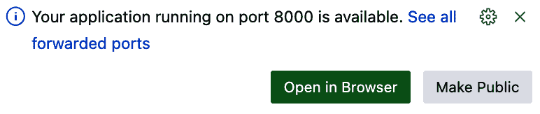

# 第四章\. 开发 FastAPI 代码

在第三章中，你创建了数据库和访问数据库的 Python 代码。在本章中，你将在这些基础代码的基础上构建一个可工作的 API。表 4-1 列出了你将创建以实现这些用户故事的端点。

表 4-1\. SWC 梦幻足球 API 的端点

| 端点描述 | HTTP 方法 | URL |
| --- | --- | --- |
| API 健康检查 | GET | */* |
| 读取球员列表 | GET | */v0/players/* |
| 读取单个球员 | GET | */v0/players/{player_id}/* |
| 读取表现列表 | GET | */v0/performances/* |
| 读取联赛列表 | GET | */v0/leagues/* |
| 读取单个联赛 | GET | */v0/leagues/{league_id}/* |
| 读取团队列表 | GET | */v0/teams/* |
| 读取计数 | GET | */v0/counts/* |

你正在使用 API 的版本 0。这将通知 API 消费者产品正在快速变化，他们应该注意潜在的*破坏性变更*——这些变更会导致功能停止工作，并可能要求消费者更改其程序代码。

# 继续你的项目组合

图 4-1 显示了之前看到的相同 API 组件，增加了一个：Uvicorn 网络服务器。Uvicorn 将执行你的 API 代码并与 API 请求交互。


###### 图 4-1\. 使用 Uvicorn 的 API 组件

在第三章中，你完成了 API 的两个非常重要的部分：SQLite 数据库和使 Python 能够与数据交互的 SQLAlchemy 类。在本章中，你将完成其余的组件。你将创建 Pydantic *模式*来定义请求和响应消息的结构。然后，你将创建控制 FastAPI 应用程序，将所有其他组件连接起来以完成 API。

# 本章使用的软件

本章中引入的软件将专注于处理来自消费者的 API 请求。表 4-2 列出了你将使用的新工具。

表 4-2\. 本章使用的新工具

| 软件名称 | 版本 | 目的 |
| --- | --- | --- |
| FastAPI | 0 | 构建 API 的 Web 框架 |
| FastAPI CLI | 0 | FastAPI 的命令行界面 |
| HTTPX | 0 | Python 的 HTTP 客户端 |
| Pydantic | 2 | 验证库 |
| Uvicorn | 0 | 运行 API 的 Web 服务器 |

## FastAPI

FastAPI 是一个专为构建 API 而设计的 Python Web 框架。*Web 框架*是一组库，它简化了 Web 应用程序的常见任务。其他常见的 Web 框架包括 Express、Flask、Django 和 Ruby on Rails。

FastAPI 旨在在应用程序性能和开发者生产力方面都快速运行。因为 FastAPI 专注于 API 开发，它简化了与 API 构建和发布相关的多个任务：

+   它使用几行代码处理 HTTP 流量、请求/响应和其他“管道”工作。

+   它会自动为你 API 生成 OpenAPI 规范文件，这对于与其他产品的集成很有用。

+   它包括你 API 的交互式文档。

+   它支持 API 版本控制、安全性和许多其他功能。

正如你在完成投资组合项目时会看到的，所有这些功能都为你的 API 用户提供了好处。

与我提到的其他框架相比，FastAPI 是一个相对较新的框架。它是由 Sebastián Ramírez Montaño 在 2018 年创建的开源项目。

FastAPI 还包括 FastAPI CLI。这是一个独立的 Python 库，用于从命令行运行 FastAPI。

到我写这篇文章的时候，FastAPI 的最新版本是 0.x 版本（例如，0.115）。这个版本号很重要，因为根据语义版本控制，0.x 表示软件可能会发生破坏性更改。

## HTTPX

HTTPX 是一个 Python HTTP 客户端。它与非常流行的 requests 库类似，但它支持 *异步调用*，这允许一些任务在等待其他任务处理时完成。requests 库只支持 *同步调用*，它们在收到响应之前会等待。HTTPX 被 pytest 用于测试 FastAPI 程序。你也会在第七章中使用这个库来创建你的 Python SDK。

## Pydantic

Pydantic 是一个数据验证库，它将在你构建的 API 中扮演关键角色。因为 API 用于系统之间的通信，它们功能的一个关键部分是对输入和输出的验证。API 开发者和数据科学家通常花费大量时间编写代码来检查数据类型和验证进入和离开 API 端点的值。

Pydantic 是专门为解决这个重要任务而构建的。Pydantic 在两个方面都很快速：它节省了开发者编写自定义 Python 验证代码所需的时间，并且 Pydantic 验证代码运行得更快，因为它是用 Rust 编程语言实现的。

除了这些好处之外，Pydantic 中定义的对象自动支持 VS Code 等 IDE 中的工具提示和提示。FastAPI 使用 Pydantic 从 Python 代码生成 JSON Schema 表示。*JSON Schema* 是一个确保 JSON 数据结构一致性的标准。这个 Pydantic 功能使 FastAPI 能够自动生成 *OpenAPI 规范*，这是一个描述 API 的行业标准文件。

对于你的项目，你将使用 Pydantic 版本 2。

## Uvicorn

所有网络应用程序，包括 API，都依赖于一个网络服务器来处理与请求和响应相关的各种管理任务。你将使用开源的 Uvicorn 网络服务器。Uvicorn 基于 *ASGI 规范*，它为 *同步进程*（在等待任务执行时阻塞进程）和 *异步进程*（在等待时允许其他进程继续）提供支持。

对于您的项目，您将使用 Uvicorn 0.x。

# 从第三章复制文件

要继续您在上一章中留下的项目组合，请将目录更改为*chapter4*，然后将上一章的文件复制到其中。以下显示了命令和预期输出：

```py
.../portfolio-project (main) $ cd chapter4
.../chapter4 (main) $ cp ../chapter3/*.py .
.../chapter4 (main) $ cp ../chapter3/fantasy_data.db .
.../chapter4 (main) $ cp ../chapter3/requirements.txt .
.../chapter4 (main) $ ls *.*
crud.py  database.py  fantasy_data.db  models.py  readme.md  requirements.txt
test_crud.py
```

# 在您的 Codespace 中安装新库

在上一章中，您创建了*requirements.txt*文件，并使用 Python 的`pip3`包管理器指定了要安装的库。您现在将使用此过程安装 Pydantic、FastAPI 和 Uvicorn。

更新*requirements.txt*以匹配以下内容：

```py
#Chapter 4 pip requirements
SQLAlchemy>=2.0.0
pydantic>=2.4.0
fastapi[standard]>=0.115.0
uvicorn>=0.23.0
Pytest>=8.1.0
httpx>=0.27.0
```

执行以下命令以在您的 Codespace 中安装新库，并验证上一章中安装的库是否仍然存在：

```py
pip3 install -r requirements.txt
```

您应该会看到一个消息，表明这些库已成功安装，如下所示：

```py
Installing collected packages: uvicorn, pydantic, httpx, fastapi
Successfully installed fastapi-0.115.4 httpx-0.26.0 pydantic-2.4.2 uvicorn-0.23.2
```

# 为您的 API 创建 Python 文件

您将创建两个新的 Python 文件，具体细节在表 4-3 中。

表 4-3\. 第四章文件的目的

| 文件名 | 目的 |
| --- | --- |
| *main.py* | 定义路由并控制 API 的 FastAPI 文件 |
| *schemas.py* | 定义验证发送到 API 的数据的 Pydantic 类 |
| *test_main.py* | FastAPI 程序的 pytest 文件 |

## 创建 Pydantic 模式

Pydantic 类定义了消费者将在他们的 API 响应中接收的数据结构。这使用了一种名为*数据传输对象*（DTO）的软件设计模式，其中您定义了在生产者和消费者之间传输数据格式的格式，而无需消费者了解后端格式。在您的项目组合中，后端和前端类看起来不会有显著差异，但使用 DTO 允许在这方面有完全的灵活性。

虽然您使用 Python 代码定义类，并且您的代码将它们作为完整的 Python 对象与之交互，但消费者将以 JSON 对象的形式在 HTTP 请求中接收它们。FastAPI 使用 Pydantic 执行*序列化*过程，即将 Python 对象转换为 API 响应的 JSON。这意味着您不需要在 Python 代码中管理序列化，这简化了您的程序。Pydantic 2 是用 Rust 编写的，并且比 Python 执行此任务要快得多。除了执行此反序列化任务外，Python 还在*openapi.json*文件中定义了响应格式。这是一个使用 OpenAPI 和 JSON Schema 的标准合同。这将为您带来多方面的好处，您将在随后的章节中看到。Pydantic 将从 SQLAlchemy 类中获取数据，并将其提供给 API 用户。

###### 注意

SQLAlchemy 和 Pydantic 文档有时将它们的类称为模型，这可能会令人困惑。对于数据科学工作来说，这一点尤其令人困惑，因为模型有额外的含义。为了清晰起见，本书将引用 Pydantic 模式和 SQLAlchemy 模型。

创建一个包含以下内容的文件，并将其命名为 *schemas.py*：

```py
"""Pydantic schemas"""
from pydantic import BaseModel, ConfigDict
from typing import List
from datetime import date

class Performance(BaseModel):
    model_config = ConfigDict(from_attributes = True)
    performance_id : int
    player_id : int
    week_number : str
    fantasy_points : float
    last_changed_date : date

class PlayerBase(BaseModel):
    model_config = ConfigDict(from_attributes = True)    
    player_id : int
    gsis_id: str
    first_name : str
    last_name : str
    position : str
    last_changed_date : date

class Player(PlayerBase):
    model_config = ConfigDict(from_attributes = True)
    performances: List[Performance] = []

class TeamBase(BaseModel):
    model_config = ConfigDict(from_attributes = True)
    league_id : int
    team_id : int
    team_name : str
    last_changed_date : date

class Team(TeamBase):
    model_config = ConfigDict(from_attributes = True)
    players: List[PlayerBase] = []

class League(BaseModel):
    model_config = ConfigDict(from_attributes = True)
    league_id : int
    league_name : str
    scoring_type : str
    last_changed_date : date
    teams: List[TeamBase] = []

class Counts(BaseModel):
    league_count : int
    team_count : int
    player_count : int
```

此文件中的模式将用于形成你将定义的 API 端点的响应。主要模式直接返回到端点，而二级模式作为主要模式的一个属性返回。例如，*/v0/players/* 端点 URL 返回一个 `Player` 对象的列表（主要），该对象具有 `Player.performances` 属性（二级）。表 4-4 显示了 API 端点和模式之间的映射。

表 4-4\. 模式到端点的映射

| 端点 URL | 主要模式 | 二级模式 |
| --- | --- | --- |
| */* | 无 | 无 |
| */v0/players/* | 球员 | Performance |
| */v0/players/{player_id}/* | 球员 | Performance |
| */v0/performances/* | Performance | 无 |
| */v0/leagues/* | 联赛 | TeamBase |
| */v0/leagues/*{league_id} | 联赛 | TeamBase |
| */v0/teams/* | 队伍 | PlayerBase |
| */v0/counts/* | 计数 | 无 |

`Performance` 类是第一个也是最简单的模式：

```py
class Performance(BaseModel):
    model_config = ConfigDict(from_attributes = True)
    performance_id : int
    player_id : int
    week_number : str
    fantasy_points : float
    last_changed_date : date
```

此类表示消费者将接收的得分数据。从他们的角度来看，*表现* 是球员在单周比赛中发生的事情。如果你将此类的元素与 SQLAlchemy 模型进行比较，你会看到它包含 `Performance` 模型中包含的所有元素。

`Performance` 是 Pydantic 的 `BaseModel` 类的子类，它提供了许多内置功能，包括验证数据类型、将 Python 对象转换为 JSON（序列化）、引发智能错误以及自动连接到 SQLAlchemy 模型。

###### 小贴士

注意，单个类元素的 Pydantic 数据类型是用冒号而不是等号分配的，这是 SQLAlchemy 所使用的。（如果你不小心，这可能会让你陷入困境。）

玩家数据以两个模式表示：`PlayerBase` 和 `Player`。将数据拆分为两个类允许你在某些情况下共享数据的有限版本，在其他情况下则共享完整版本。以下是这两个模式：

```py
class PlayerBase(BaseModel):
    model_config = ConfigDict(from_attributes = True)
    player_id : int
    gsis_id: str
    first_name : str
    last_name : str
    position : str
    last_changed_date : date

class Player(PlayerBase):
    model_config = ConfigDict(from_attributes = True)
    performances: List[Performance] = []
```

性能数据有一个单一的 `Performance` 模式，但玩家数据有两个模式。`PlayerBase` 是 `BaseModel` 的子类，并且包含所有玩家字段，除了一个：`Performance` 列表。表 4-4 显示 `PlayerBase` 将被用作 */v0/teams/* 端点的二级模式。原因很简单：为了减少 API 调用中传输的数据量。当 API 用户重试 `Team` 模式的列表时，他们想看到该队伍上的所有球员，而不想同时获取所有球员的得分表现列表。

完整的 `Player` 模式是 `PlayerBase` 的子类，并添加了 `Performance` 对象的列表。此模式直接用于 */v0/players/* 和 */v0/players/{player_id}/* 端点。在这些情况下，API 用户希望看到与球员相关的得分表现列表。

要查看`PlayerBase`的次要用途，请检查接下来的两个模式：

```py
class TeamBase(BaseModel):
    model_config = ConfigDict(from_attributes = True)
    league_id : int
    team_id : int
    team_name : str
    last_changed_date : date

class Team(TeamBase):
    model_config = ConfigDict(from_attributes = True)
    players: List[PlayerBase] = []
```

`Team`对象包含语句`players: List[PlayerBase] = []`。如前所述，这意味着`Team.players`中的项目属于更有限的`PlayerBase`模式。这是在`/v0/teams/*`端点中显示的`PlayerBase`的次要用途表 4-4。

下一个类是`League`模式：

```py
class League(BaseModel):
    model_config = ConfigDict(from_attributes = True)
    league_id : int
    league_name : str
    scoring_type : str
    last_changed_date : date
    teams: List[TeamBase] = []
```

到现在为止，你可能已经注意到`League.teams`包含`TeamBase`对象。这是在`/v0/leagues/*`端点中使用的`TeamBase`的次要用途。

最后，你将创建一个特殊用途的模式来支持由`v0/counts/*`端点提供的分析。这个模式不直接映射到数据库表，因此它不包括`model_config`元素。该模式名为`Counts`，并包括 API 中的联赛、团队和玩家记录的数量：

```py
class Counts(BaseModel):
    league_count : int
    team_count : int
    player_count : int
```

到目前为止，你已经设计了将要用于向 API 消费者发送数据的 DTOs。你现在可以准备最后一部分：FastAPI 控制器类。

## 创建你的 FastAPI 控制器

现在所有其他 Python 文件中的组件都已就绪，你可以使用`main.py`中的 FastAPI 功能将它们组合在一起。你只需几行 FastAPI 代码就能完成很多事情。

创建以下内容的文件，并将其命名为`main.py`：

```py
"""FastAPI program - Chapter 4"""
from fastapi import Depends, FastAPI, HTTPException
from sqlalchemy.orm import Session
from datetime import date

import crud, schemas
from database import SessionLocal

app = FastAPI()

# Dependency
def get_db():
    db = SessionLocal()
    try:
        yield db
    finally:
        db.close()

@app.get("/")
async def root():
    return {"message": "API health check successful"}

@app.get("/v0/players/", response_model=list[schemas.Player])
def read_players(skip: int = 0, 
                 limit: int = 100, 
                 minimum_last_changed_date: date = None, 
                 first_name: str = None, 
                 last_name: str = None,
                 db: Session = Depends(get_db)
                 ):
    players = crud.get_players(db, 
                skip=skip, 
                limit=limit, 
                min_last_changed_date=minimum_last_changed_date, 
                first_name=first_name, 
                last_name=last_name)
    return players

@app.get("/v0/players/{player_id}", response_model=schemas.Player)
def read_player(player_id: int, 
                db: Session = Depends(get_db)):
    player = crud.get_player(db, 
                             player_id=player_id)
    if player is None:
        raise HTTPException(status_code=404, 
                            detail="Player not found")
    return player

@app.get("/v0/performances/", 
         response_model=list[schemas.Performance])
def read_performances(skip: int = 0, 
                limit: int = 100, 
                minimum_last_changed_date: date = None, 
                db: Session = Depends(get_db)):
    performances = crud.get_performances(db, 
                skip=skip, 
                limit=limit, 
                min_last_changed_date=minimum_last_changed_date)
    return performances

@app.get("/v0/leagues/{league_id}", response_model=schemas.League)
def read_league(league_id: int,db: Session = Depends(get_db)):
    league = crud.get_league(db, league_id = league_id)
    if league is None:
        raise HTTPException(status_code=404, detail="League not found")
    return league

@app.get("/v0/leagues/", response_model=list[schemas.League])
def read_leagues(skip: int = 0, 
                limit: int = 100, 
                minimum_last_changed_date: date = None, 
                league_name: str = None,
                db: Session = Depends(get_db)):
    leagues = crud.get_leagues(db, 
                skip=skip, 
                limit=limit, 
                min_last_changed_date=minimum_last_changed_date, 
                league_name=league_name)
    return leagues

@app.get("/v0/teams/", response_model=list[schemas.Team])
def read_teams(skip: int = 0, 
               limit: int = 100, 
               minimum_last_changed_date: date = None, 
               team_name: str = None, 
               league_id: int = None, 
               db: Session = Depends(get_db)):
    teams = crud.get_teams(db, 
                skip=skip, 
                limit=limit, 
                min_last_changed_date=minimum_last_changed_date, 
                team_name=team_name,
                league_id=league_id)
    return teams

@app.get("/v0/counts/", response_model=schemas.Counts)
def get_count(db: Session = Depends(get_db)):
    counts = schemas.Counts(
        league_count = crud.get_league_count(db),
        team_count = crud.get_team_count(db),
        player_count = crud.get_player_count(db))
    return counts
```

让我们遍历你的 FastAPI 文件中的代码。我们将从导入开始：

```py
from fastapi import Depends, FastAPI, HTTPException 
from sqlalchemy.orm import Session 
from datetime import date 

import crud, schemas 
from database import SessionLocal 
```

[#co_developing_the_fastapi_code_CO1-1]

这些是 FastAPI 库中的方法。你将使用这些方法来识别这个程序作为一个 FastAPI 应用程序。


当这个程序调用`crud.py`时，将使用 SQLAlchemy 的`Session`。

[#co_developing_the_fastapi_code_CO1-3]

你将使用`date`类型来按最后更改日期进行查询。


这些导入允许 FastAPI 应用程序引用 SQLAlchemy 和 Pydantic 类。

[#co_developing_the_fastapi_code_CO1-5]

这检索了用于连接 SQLite 数据库的共享`SessionLocal`类。

继续审查代码：

```py
app = FastAPI()

# Dependency
def get_db():
    db = SessionLocal()
    try:
        yield db
    finally:
        db.close()
```

在 FastAPI 中，你将主要与之合作的类是`FastAPI`类。这个类默认包含处理 API 需要执行的大部分工作的功能，而无需你指定每个细节。你创建一个`FastAPI`实例并将其命名为`app`。这将在`main.py`的其余部分中使用。当你使用 Uvicorn 从命令行执行你的 API 时，你将引用`main:app`，这指的是`main.py`中的`app`对象。

你定义`get_db()`函数来创建数据库会话，并在完成后关闭会话。这个函数在`main.py`中的 API 路由中用作依赖项：

```py
@app.get("/")
async def root():
    return {"message": "API health check successful"}
```

下一个命令是 `@app.get("/")`，这是一个 *装饰器*。装饰器是一个添加在函数定义之上的语句，用来给它添加特殊的属性。在这种情况下，装饰器定义了 `async def root()` 函数定义将是一个 FastAPI 请求处理器。

当消费者访问 API 的根 URL 时，这个函数将被调用，这相当于 `/`。它将通过向消费者返回一个简单的消息来作为整个 API 的健康检查。下一个语句定义了我们为你的用户故事创建的第一个端点：

```py
@app.get("/v0/players/", response_model=list[schemas.Player])
def read_players(skip: int = 0,
                limit: int = 100,
                minimum_last_changed_date: date = None,
                first_name: str = None,
                last_name: str = None,
                db: Session = Depends(get_db)
                ):
   players = crud.get_players(db,
               skip=skip,
               limit=limit,
               min_last_changed_date=minimum_last_changed_date,
               first_name=first_name,
               last_name=last_name)
   return players
```

记住 表 4-1 定义了我们计划创建的端点，这些端点是 HTTP 动词和 URL 的组合。在 FastAPI 中，这些端点（也称为 *路由*）是通过每个函数上面的装饰器来定义的。

下面的内容解释了如何在装饰器中指定 HTTP 动词和 URL：

+   *HTTP 动词*：所有这些端点都使用 `GET` 动词，这是由 `@app.get()` 装饰器函数定义的。

+   *URL*：`get()` 函数的第一个参数是相对 URL。对于这个第一个端点，URL 是 */v0/players/*。

装饰器的第二个参数是 `response_model=list[schemas.Player]`。这告诉 FastAPI 从这个端点返回的数据将是一个 Pydantic `Player` 对象的列表，如 *schemas.py* 文件中定义。这个信息将被包含在 FastAPI 自动为这个 API 创建的 OpenAPI 规范中。消费者可以依赖返回的数据根据这个定义是有效的。

让我们看看你装饰的函数签名：

```py
def read_players(skip: int = 0,
                 limit: int = 100,
                 minimum_last_changed_date: date = None,
                 first_name: str = None,
                 last_name: str = None,
                 db: Session = Depends(get_db)
                 ):
```

这个函数中正在进行几件事情。从结尾开始，`db` 对象是由文件顶部定义的 `get_db()` 函数创建的会话。通过将函数包裹在 `Depends()` 中，FastAPI 处理调用并将 `Session` 传递给你的函数。

接下来的两个参数是可选的整数，具有默认值：`skip: int = 0, limit: int = 100, last_name`。这些后面跟着两个可选的字符串参数，默认值为 `None`。这些都是具有定义的数据类型和默认值的命名参数。FastAPI 将自动将这些参数作为查询参数包含在 API 定义中。查询参数包含在 URL 路径中，前面有一个问号，中间有一个和号。

例如，要调用这个查询方法，API 消费者可以使用这个请求：

+   *HTTP 动词*：GET

+   *URL*：*{base URL}/v0/players/?first_name=Bryce&last_name=Young*

在 `read_players()` 函数体内部，FastAPI 调用了你在 *crud.py* 中定义的 `get_players()` 函数。它执行了一个数据库查询。`players` 对象接收这个函数调用的结果。FastAPI 验证这个对象是否与定义 `list[schemas.Player]` 匹配。如果是，FastAPI 使用 Pydantic 将 Python 对象序列化为文本 JSON 字符串，并将响应发送给消费者。

下一个端点添加了两个额外的 FastAPI 功能：

```py
@app.get("/v0/players/{player_id}", response_model=schemas.Player)
def read_player(player_id: int,
                db: Session = Depends(get_db)):
    player = crud.get_player(db,
                             player_id=player_id)
    if player is None:
        raise HTTPException(status_code=404,
                            detail="Player not found")
    return player
```

首先，URL 路径包含`{player_id}`。这是一个*路径参数*，它是一个 API 请求参数，包含在 URL 路径中，而不是像查询参数那样通过问号和与号分隔。以下是一个 API 消费者可能调用此端点的示例：

+   *HTTP 动词*：GET

+   *URL*：*{base URL}/v0/players/12345?skip=10&limit=50*

函数检查是否有记录从辅助函数返回，如果没有，则抛出一个*HTTPException*。这是一个网络应用程序用来通信状态的标准方法。使用标准的[HTTP 状态码](https://oreil.ly/cTnfI)与消费者通信是良好的 RESTful API 设计。这使得操作更加可预测和可靠。此端点返回 HTTP 状态码 404，即*未找到*代码。它还添加了额外的消息，指出未找到的项目是正在搜索的玩家。

接下来的四个端点不使用任何新功能。但它们共同完成了我们为您第一次 API 所包含的所有用户故事：

```py
@app.get("/v0/performances/",
         response_model=list[schemas.Performance])
def read_performances(skip: int = 0,
                limit: int = 100,
                minimum_last_changed_date: date = None,
                db: Session = Depends(get_db)):
    performances = crud.get_performances(db,
                skip=skip,
                limit=limit,
                min_last_changed_date=minimum_last_changed_date)
    return performances

@app.get("/v0/leagues/{league_id}", response_model=schemas.League)
def read_league(league_id: int,db: Session = Depends(get_db)):
    league = crud.get_league(db, league_id = league_id)
    if league is None:
        raise HTTPException(status_code=404, detail="League not found")
    return league

@app.get("/v0/leagues/", response_model=list[schemas.League])
def read_leagues(skip: int = 0,
                limit: int = 100,
                minimum_last_changed_date: date = None,
                league_name: str = None,
                db: Session = Depends(get_db)):
    leagues = crud.get_leagues(db,
                skip=skip,
                limit=limit,
                min_last_changed_date=minimum_last_changed_date,
                league_name=league_name)
    return leagues

@app.get("/v0/teams/", response_model=list[schemas.Team])
def read_teams(skip: int = 0,
               limit: int = 100,
               minimum_last_changed_date: date = None,
               team_name: str = None,
               league_id: int = None,
               db: Session = Depends(get_db)):
    teams = crud.get_teams(db,
                skip=skip,
                limit=limit,
                min_last_changed_date=minimum_last_changed_date,
                team_name=team_name,
                league_id=league_id)
    return teams
```

最后一个端点提供了联赛、团队和玩家的计数：

```py
@app.get("/v0/counts/", response_model=schemas.Counts)
def get_count(db: Session = Depends(get_db)):
   counts = schemas.Counts(
       league_count = crud.get_league_count(db),
       team_count = crud.get_team_count(db),
       player_count = crud.get_player_count(db))
   return counts
```

值得注意的是，除了您正在使用的 FastAPI 和 Pydantic 的基本选项之外，还有许多其他验证和功能可用。正如您所看到的，这些库仅用您的一行代码就能完成很多事情。

# 测试您的 API

您将使用 pytest 来测试*main.py*文件。与上一章中的*crud.py*文件一样，您将测试每个 API 端点返回的正确记录数。记录数可以通过“加载数据”中的 SQL 查询进行验证。

要实现您 API 的测试，创建一个包含以下内容的文件，并将其命名为*test_main.py*：

```py
from fastapi.testclient import TestClient
from main import app

client = TestClient(app)

# test the health check endpoint
def test_read_main():
    response = client.get("/")
    assert response.status_code == 200
    assert response.json() == {"message": "API health check successful"}

# test /v0/players/
def test_read_players():
    response = client.get("/v0/players/?skip=0&limit=10000")
    assert response.status_code == 200
    assert len(response.json()) == 1018

def test_read_players_by_name():
    response = client.get("/v0/players/?first_name=Bryce&last_name=Young")
    assert response.status_code == 200
    assert len(response.json()) == 1
    assert response.json()[0].get("player_id") == 2009

# test /v0/players/{player_id}/
def test_read_players_with_id():
    response = client.get("/v0/players/1001/")
    assert response.status_code == 200
    assert response.json().get("player_id") == 1001

# test /v0/performances/
def test_read_performances():
    response = client.get("/v0/performances/?skip=0&limit=20000")
    assert response.status_code == 200
    assert len(response.json()) == 17306

# test /v0/performances/ with changed date
def test_read_performances_by_date():
    response = client.get(
        "/v0/performances/?skip=0&limit=20000&minimum_last_changed_date=
        2024-04-01"
    )
    assert response.status_code == 200
    assert len(response.json()) == 2711

# test /v0/leagues/{league_id}/
def test_read_leagues_with_id():
    response = client.get("/v0/leagues/5002/")
    assert response.status_code == 200
    assert len(response.json()["teams"]) == 8

# test /v0/leagues/
def test_read_leagues():
    response = client.get("/v0/leagues/?skip=0&limit=500")
    assert response.status_code == 200
    assert len(response.json()) == 5

# test /v0/teams/
def test_read_teams():
    response = client.get("/v0/teams/?skip=0&limit=500")
    assert response.status_code == 200
    assert len(response.json()) == 20

# test /v0/teams/
def test_read_teams_for_one_league():
    response = client.get("/v0/teams/?skip=0&limit=500&league_id=5001")
    assert response.status_code == 200
    assert len(response.json()) == 12

# test the count functions
def test_counts():
    response = client.get("/v0/counts/")
    response_data = response.json()
    assert response.status_code == 200
    assert response_data["league_count"] == 5
    assert response_data["team_count"] == 20
    assert response_data["player_count"] == 1018
```

文件以导入语句和创建`TestClient`类开始：

```py
from fastapi.testclient import TestClient 
from main import app 

client = TestClient(app) 
```


`TestClient`是一个特殊类，它允许在不运行 Web 服务器的情况下测试 FastAPI 程序。


这引用了您在*main.py*中创建的 FastAPI 对象。


此语句创建了一个将测试您的应用程序的`TestClient`。

看一下几个测试函数：

```py
#test the health check endpoint
def test_read_main():
    response = client.get("/")
    assert response.status_code == 200
    assert response.json() == {"message": "API health check successful"}
```

此函数使用`TestClient`模拟对根路径的 API 调用。然后，它检查 HTTP 状态码是否为`200`，这意味着请求成功。接下来，它查看 API 返回的 JSON 值，并检查它是否与提供的 JSON 值匹配。

下一个测试函数添加了更多功能：

```py
#test /v0/players/
def test_read_players():
    response = client.get("/v0/players/?skip=0&limit=10000")
    assert response.status_code == 200
    assert len(response.json()) == 1018
```

注意，在`get()`语句中传递的 URL 使用了`skip`和`limit`参数。第二个`assert`语句检查 API 返回的玩家列表的长度，确保它正好是 1018。

另一个测试函数测试按名称搜索玩家。尽管数据库不对玩家名称的唯一性进行强制，但重复的玩家名称很少见，名称通常用于识别玩家。

这种不带密钥的搜索支持 第一章 中推荐的 AI 设计：

```py
def test_read_players_by_name():
    response = client.get("/v0/players/?first_name=Bryce&last_name=Young")
    assert response.status_code == 200
    assert len(response.json()) == 1
    assert response.json()[0].get("player_id") == 2009
```

这添加了两个 `assert` 语句：一个确保从这个查询中只返回了一个记录（毕竟，只有一个 Bryce Young），另一个确保 `player_id` 是正确的。

完整的文件包含总共 11 个测试。要执行测试，请输入以下命令：

```py
.../chapter4 (main) $ pytest test_main.py
================== test session starts ===========================
platform linux -- Python 3.10.14, pytest-8.1.2, pluggy-1.4.0
rootdir: /workspaces/portfolio-project/chapter4
plugins: anyio-3.4.4.0

collected 11 items

test_main.py                                              [100%]

=================== 11 passed in 1.01s ============================
```

你已经验证了你的 FastAPI 程序与 pytest 一起工作。现在是时候尝试使用 Web 服务器了。

# 启动您的 API

这是你一直等待的时刻：现在是时候运行你的 API 了。从命令行输入以下命令：

```py
.../chapter4 (main) $ fastapi run main.py
```

你将看到应用程序启动的过程，如图 图 4-2 所示。


###### 图 4-2\. 从命令行运行 FastAPI

在 Codespaces 中，你还会看到一个对话框显示“您的应用程序正在端口 8000 上运行”，如图 图 4-3 所示。



###### 图 4-3\. Codespaces 浏览器窗口弹出

点击“在浏览器中打开”以在 Codespaces 外部打开一个浏览器标签页。此浏览器将显示以 *app.github.dev* 结尾的基本 URL，其中包含在 Codespaces 上运行的 API 的响应。你应该在你的网页浏览器中看到以下健康检查信息：

```py
{"message":"API health check successful"}
```

这确认了你的 API 正在运行，这是一个很好的开始。

下一个测试是调用一个检索数据的端点。通过将以下内容复制并粘贴到浏览器的基本 URL 的末尾来尝试：***/v0/performances/?skip=0&limit=1***。例如，完整的 URL 可能是 *[*https://happy-pine-tree-1234-8000.app.github.dev/v0/performances/?skip=0&limit=1*](https://happy-pine-tree-1234-8000.app.github.dev/v0/performances/?skip=0&limit=1)*。

如果一切正常，你应该在你的浏览器中看到以下数据：

```py
[{"performance_id":2501,"player_id":1001,"week_number":"202301",
"fantasy_points":20.0,"last_changed_date":"2024-03-01"}]
```

###### 小贴士

本章涵盖了大量的内容，所以可能发生了错误，或者你没有得到成功的结果。别担心，这发生在我们所有人身上。以下是一些如何解决你遇到的问题的建议：

+   再次运行 **`pip3 install -r requirements.txt`** 命令以确保你拥有所有更新的软件。

+   花一分钟验证浏览器地址栏中的路径。小事情很重要，比如斜杠和问号。

+   查看命令行以查看 FastAPI 抛出的任何错误。

+   要使用 FastAPI 和 Uvicorn 验证你的环境，尝试创建一个简单的 API，例如来自 [官方 FastAPI 教程](https://oreil.ly/L7QWz) 的一个。

+   如果由于文本换行而发生格式错误，请与 GitHub 仓库中的文件进行核对。

如果这个第一个 API 端点对您有效，请在浏览器中尝试更多表 4-1 中的 URL，以验证您已完成所有用户故事。恭喜您，您已经成为了一名 API 开发者！

# 其他资源

要探索 FastAPI 超出了本书的范围，官方的[FastAPI 教程](https://oreil.ly/SFN3w)和[FastAPI 参考文档](https://oreil.ly/MVgVk)都非常有用。

要了解使用 FastAPI 构建项目的方方面面，我推荐 Bill Lubanovic 的《FastAPI：现代 Python Web 开发》（O’Reilly，2023）。

要获取来自官方 FastAPI 专家的更多实用技巧列表，请查看[Marcelo Trylesinski 的 FastAPI 技巧](https://oreil.ly/kludex)。

官方的[Pydantic 2.4 文档](https://oreil.ly/2OE-8)提供了关于本章中使用的 Pydantic 特定版本的信息。

官方的[Uvicorn 文档](https://oreil.ly/uvicorn)提供了关于此软件功能的更多信息。

# 摘要

在本章中，您完成了 SWC 梦幻足球 API 的 API 功能。您实现了以下内容：

+   您已安装了 FastAPI、SQLAlchemy、Pydantic 和 Uvicorn，以及一些支持库。

+   您定义了 Pydantic 模式来表示 API 消费者希望接收的数据。

+   您创建了一个 FastAPI 程序来处理消费者请求并返回数据响应，将所有内容串联起来。

+   您使用 pytest 测试了 API，然后在网络服务器上成功运行。

在第五章中，您将使用 FastAPI 的内置功能来记录您的 API。
