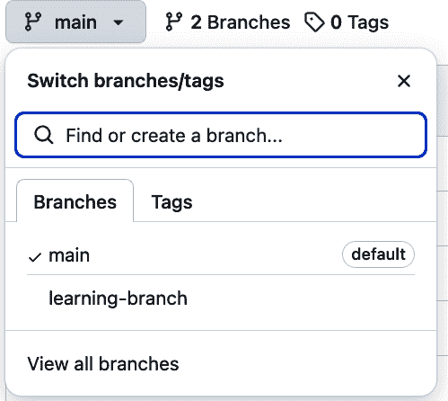

# 第七章：内置电池：创建 Python SDK

> 让正确的事情变得容易，错误的事情变得困难。
> 
> 凯西·西拉

要创建数据科学家会喜欢的 API，您应该给他们一个用于调用 API 的*软件开发工具包*（SDK）。这是大多数 API 生产者不采取的额外步骤，但它使您的用户的生活变得更加容易。在本章中，您将了解 SDK 的价值，并从几位专家的实用技巧中受益，然后您将为 SWC 梦幻足球 API 创建一个 Python SDK。构建 SDK 是您第一部分项目组合的顶峰。

SDK 可以包括代码示例、调试器和文档，但这个术语通常指的是一个作为您 API 包装器的自定义软件库。它允许开发者和数据科学家直接在他们的编程语言中使用您的 API，而无需编写额外的代码来处理 API 通信。

图 7-1 展示了用户如何使用 SDK 调用您的 API，而不是直接调用。


###### 图 7-1\. SDK 与 API 交互

# SDK 架起桥梁

为了了解 SDK 的好处和实施它们的技巧，我采访了几位经验丰富的 SDK 开发者，并随后以书面问题的形式进行了跟进。

乔伊·格雷科是一位软件工程师，他为几个梦幻足球联赛主办方创建了开源 SDK，包括[Sleeper](https://oreil.ly/8dXo_)和[MyFantasyLeague](https://oreil.ly/SIPsV)。他解释了 SDK 如何帮助用户：“一个构建良好的 SDK 为你处理了所有琐碎的事情，”他说。“一个构建良好的 SDK 给了我一些可以在我的机器上复制/粘贴的代码行，以及一些如何访问和操作各种数据的示例。它告诉我我需要做什么来认证（将您的 API 令牌传递到这个函数中等等）。这是从外部服务到您所编写的代码之间架起桥梁的绝佳方式。”

记住这一点很有用：开发者和数据科学家使用您的 API 并不是出于对 API 的兴趣——他们有工作要做，API 有助于完成这项工作。将 API 包装在预构建的程序代码中使这变得更加简单。我曾经与一个专注于数据的 API 开发者门户的用户进行了一次可用性测试。当她告诉我她对我的 API 不感兴趣——她只想得到数据时，我感到惊讶（也许还有点受辱）。对于这样一个只想得到数据的用户来说，SDK 将是一个节省时间的选择。

此外，考虑到您的用户可能会使用来自不同提供商的多个 API 和数据源。他们花费在了解每个 API 的工作方式以及为它配置代码上的时间，这会分散他们最终目标。并不是每个开发者和数据科学家都有在弹性且安全的方式使用 API 的经验。一个成熟的 SDK 可以在最小麻烦的情况下为这些用户提供良好的软件开发实践。

SDK 生成平台 Speakeasy 的联合创始人 Simon Yu 分享了额外的益处：“API 消费者之前需要编写的所有样板代码现在都由 SDK 库本身处理。消费者不必自己重新发明轮子（令人沮丧、耗时、易出错），他们只需导入 SDK，调用正确的方法，然后继续。”

还有另一个好处。当开发者在他们的 IDE 中使用 SDK 时，他们在编码过程中将获得自动完成和类型提示。这使得他们的开发速度更快，同时也使得 GitHub CoPilot 或 AWS CodeWhisperer 等生成式 AI 工具能够为他们生成准确的代码。

生产者从任何使其 API 更容易使用的因素中受益。就像好的 API 文档一样，SDK 减少了新消费者的摩擦，从而降低了第五章中讨论的“hello-world 时间”指标。Simon Yu 表示，SDK 可以成为 API 生产者的有利可图的投资：“API 消费者（可能也是另一家大型企业！）通常不会在他们的生产环境中运行之前为服务付费。因此，对于许多 API 提供商来说，解除 API 消费者的限制也解除了收入的限制。”

Yu 表示 SDK 还可以减少 API 支持费用：“由于 SDK 提供了一种现成的与 API 集成的途径，并消除了从头编写自定义集成代码的需求，它们大大减少了 API 生产者所需的支持负担。”他补充说，“没有 SDK，如果集成出现问题，API 生产者经常会被拖入一对一的支持，这代价极高。”

SDK 是一种鼓励用户负责任地使用你的 API 的好方法，通过遵守调用限制和发送正确格式化的请求。SDK 使得做正确的事情变得容易。

SDK 可以是整体 API 产品策略的一部分。我所见过的最佳例子之一是来自 StatsBomb（现在为 Hudl StatsBomb）的案例，它是一家体育数据和数据分析提供商。StatsBomb 提供足球和足球数据，并强调支持体育领域的科研和教育。StatsBomb 运营一个[体育数据分析平台](https://oreil.ly/Orp-g)，提供关于世界各地球员和球队的深入分析和可视化。StatsBomb 还通过一个[基于订阅的 API](https://oreil.ly/CzhyS)提供数据，允许其客户将数据拉入自己的分析软件。为了支持研究人员和学生，它还免费提供了一些数据，可在其[开源 GitHub 仓库](https://oreil.ly/LPGZM)上下载。

对于 StatsBomb，SDK 将付费和免费服务结合起来。公司为其 API 维护了两个 SDK：[statsbombr](https://oreil.ly/IQO_f)和[statsbombpy](https://oreil.ly/0VOdS)。如图图 7-2 所示，付费订阅者可以使用 SDK 获取实时数据，而非订阅者可以使用 SDK 免费访问静态数据。内部，SDK 从 API 获取付费数据，从文件下载获取免费数据。但这种复杂性被屏蔽在 SDK 用户之外：他们只知道他们得到了他们想要的数据。


###### 图 7-2\. statsbombpy SDK 文档

# 为您的 SDK 选择一种语言

> 您的 SDK 之旅从了解您的开发者受众以及他们将如何使用您的 API 开始。
> 
> SDKs.io

在开发 SDK 时，您将做出的第一个决定是支持哪些编程语言。SDK 不需要用与 API 开发相同的语言编写。相反，它需要用 API 消费者使用的语言编写。他们将导入 SDK 到他们的代码中，并使用它来与您的 API 交互，而不是直接调用 API。

API 提供者有时会为不同的消费者提供多种语言的 SDK。Zan Markan 将这种方法总结为“去用户所在之处”。对于数据科学家来说，他说：“它将是 Python，可能会有一些 R。Python 在该社区中应用广泛，因此您需要专注于这一点。”他的观点与第一章中讨论的“数据科学状态”调查一致，该调查将 Python 列为数据科学家最常用的语言。要开始使用 Python SDK，可以使用像[OpenAPI Python 客户端](https://oreil.ly/cnR-u)这样的开源工具来生成您可以添加更多功能的存根。

您创建的 SDK 语言越多，它们需要的维护就越多。像[Speakeasy](https://oreil.ly/speasy)、[APIMatic](https://oreil.ly/bpMKs)（SDKs.io 的出版商）和[Fern](https://oreil.ly/fern)这样的公司提供商业工具，可以直接从 OpenAPI 规范（OAS）生成多种语言的 SDK，并随着时间的推移保持它们更新。

Simon Yu 解释了自动生成服务的优势：“正确地设计 SDK 实现是困难的。维护和支持它们甚至更难。如果负责更新 SDK 的团队成员离开了会发生什么？现在将这个问题乘以您想要提供 SDK 的所有语言，”他说。“这就是 Speakeasy 和其他 SDK 生成器发挥作用的地方。”

# 从最小可行 SDK 开始

你第一部分项目组合的最后一部分是创建一个 Python SDK。在本章中，你将学习 API 专家的技巧和窍门，并实现受他们启发的 Python 功能：Francisco Goitia 的 [statsbompy](https://oreil.ly/LUiJd)、Simon Yu 公司的 SDK 以及 Joey Greco 的 [pymfl](https://oreil.ly/ut2nK)，以及额外的参考文档。

你将从一个非常简单的 SDK 开始工作，以确保项目打包正常工作。我将称之为你的**最小可行 SDK**。在验证包可以正常工作并安装后，你将添加额外的功能。

## 专家技巧：使你的 SDK 易于安装

> ...如果他们可以使用 pip install 安装 Python 库并开始使用数据，这将使他们的生活更轻松。
> 
> 弗朗西斯科·戈伊蒂亚，StatsBomb

许多编程语言都有从外部存储库下载和安装库的标准方法，例如 Node.js 的 npm 和 Java 的 Maven。Python SDK 通常发布在 [Python 包索引（PyPI）](https://pypi.org)。在 PyPI 上托管 SDK 允许 Python 开发者使用 `pip3` 工具将 SDK 安装到他们的环境中，就像你在前面的章节中用 FastAPI 和 SQLAlchemy 等库所做的那样。如果项目结构正确，`pip3` 工具还可以直接从 GitHub 存储库安装包。这就是你将如何构建你的 SDK 项目并向用户提供说明。作为额外的好处，如果你选择这样做，这种结构也是发布到 PyPI 所需的。

将目录更改为 *chapter7* 并创建 *sdk* 文件夹。然后，切换到 *sdk* 目录并创建一个名为 *pyproject.toml* 的文件：

```py
.../portfolio-project (main) $ cd chapter7
.../chapter7 (main) $ mkdir sdk
.../chapter7 (main) $ cd sdk
.../sdk (main) $ touch pyproject.toml
```

**pyproject.toml** 文件提供了工具如 `pip3` 需要的所有设置，以便正确打包你的代码并在 Python 环境中安装它。将以下所有文本添加到你的 **pyproject.toml** 文件中：

```py
[build-system] 
requires = ["setuptools>=61.0"]
build-backend = "setuptools.build_meta"

[project] 
name = "swcpy"
version = "0.0.1" 
authors = [
  { name="[enter your name]" },
]
description = "Example SDK from Hands-On API Book for AI and Data Science"
requires-python = ">=3.10" 
classifiers = 
    "Development Status :: 3 - Alpha", ![5
    "Programming Language :: Python :: 3",
    "License :: OSI Approved :: MIT License",
    "Operating System :: OS Independent",
]
dependencies =  ![6
       'pytest>=8.1',
       'httpx>=0.27.0',
]
```


本节选择 [setuptools](https://setuptools.pypa.io/en/latest/setuptools.html) 作为你的项目的构建后端。Python 打包指南列出了其他几个构建后端的选择，包括 Hatchling、Flit 和 PDM。我选择 setuptools 是因为本章中引用的所有示例 SDK 都使用它，并且使用起来很简单。


本节介绍了包的基本信息，包括名称、版本、描述和作者。（你应该把你的名字放在那里——毕竟能是你的项目组合。）


每次应用重大更改时，版本都应该更新。


这表明你的包支持的最低 Python 版本。


开发状态`Alpha`表明此 SDK 处于开发初期阶段。

[#co_batteries_included__creating_a_python_sdk_CO1-6]

本节列出了您的包运行所需的 Python 库。这是本章中唯一列出依赖关系的部分——SDK 不使用*requirements.txt*文件。

## 专家提示：使 SDK 统一和符合习惯用法

俞明说：“SDK 应该是统一和可预测的。命名约定、错误处理和响应格式应贯穿整个 SDK，以避免给用户带来不必要的困惑。”例如，您的 SDK 函数返回单个项目时将以`get_`开头，而返回列表的函数将以`list_`开头。

Sdks.io 建议您使您的 SDK*符合习惯用法*，遵循该语言其他程序员的规范。对于 Python SDK，这意味着您的代码应该是*Pythonic*。这是一个广泛的概念，但意味着 Python 代码应遵循其他 Python 程序员和工具使用的约定。Python 是一种活的语言，不断添加新功能，因此编码约定试图跟上。约定是通过 Python 社区中的 Python 增强提案（PEP）建立的。如果您想了解这个过程，请查看[PEP 1 – PEP 目的和指南](https://oreil.ly/dgQ79)。

对于您 SDK 的整体风格，您将使用[PEP 8 – Python 代码风格指南](https://oreil.ly/oersV)。[官方 Python 文档](https://oreil.ly/csNt5)提供了 PEP 8 风格的良好总结：使用 4 个空格缩进，保持行长度不超过 79 个字符，并为类使用`UpperCamelCase`，为函数和方法使用`lowercase_with_underscores`。

在您的 SDK 中，您将使用的一些额外的 Pythonic 约定包括[PEP 202 – 列推导式](https://oreil.ly/7rivi)、[PEP 343 – 上下文管理器](https://oreil.ly/bgVdx)、[PEP 257 – 文档字符串](https://oreil.ly/q5zA2)、[PEP 518 – 构建系统要求](https://oreil.ly/WLYFx)和[PEP 484 – 类型提示](https://oreil.ly/RkeOY)。这些内容将在将它们添加到您的 SDK 代码中时进行解释。

*swc_client.py*文件是主要的客户端，将与您的 API 交互。您将从一个非常基础的客户端开始。创建目录结构、包初始化文件和起始 Python 客户端：

```py
.../sdk (main) $ mkdir src
.../sdk (main) $ mkdir src/swcpy
.../sdk (main) $ touch src/swcpy/__init__.py 
.../sdk (main) $ touch src/swcpy/swc_client.py
```

[#co_batteries_included__creating_a_python_sdk_CO2-1]

因为您的 SDK 将是一个 Python 包，所以包含代码的每个目录都将包含一个名为*__init__.py*的文件。现在可以使用一个空文件来完成这项工作。

要开始创建最小化的 SDK，给*swc_client.py*文件添加足够的功能以调用 SWC API 的健康检查：

```py
import httpx 

class SWCClient:

    def __init__(self, swc_base_url: str): 
        self.swc_base_url = swc_base_url 

    def get_health_check(self): 
        # make the API call
        with httpx.Client(base_url=self.swc_base_url) as client: 
            return client.get("/") 
```

[#co_batteries_included__creating_a_python_sdk_CO3-1]

目前，你的 `import` 语句只包含 `httpx`，这是你将用于与 API 交互的核心 Python 库。本文件的其余部分定义了 `SWCClient` 类。当 SDK 用户调用 SDK 时，通过执行 `SWCClient()` 方法来创建类的实例。

[#co_batteries_included__creating_a_python_sdk_CO3-2]

这是类构造函数，它在创建客户端实例时执行一次。该方法可以用来初始化类中特定实例的方法和变量，与之前定义的常量变量相对。`self` 参数作为 Python 中每个类方法（包括构造函数）的第一个参数传递。

[#co_batteries_included__creating_a_python_sdk_CO3-3]

构造函数还接收一个字符串参数 `swc_base_url`，这是要调用的 API 的基本地址。您设置类变量 `self.swc_base_url`，以便这个值可以在 `get_health_check()` 方法中使用。

[#co_batteries_included__creating_a_python_sdk_CO3-4]

此函数调用 API 的健康检查端点。

[#co_batteries_included__creating_a_python_sdk_CO3-5]

`httpx.Client` 有很多可用功能，但就目前而言，你正在设置基本 URL 并使用它来调用 `"/"` 端点，这是你的 API 的健康检查。

为了确保你已经正确配置了 SDK 包，现在是时候使用 `pip3` 在你的 Codespace 中安装它。这将使用你创建的新源代码和配置文件，并将其安装为 Python 文件中可以访问的库。它还将从 *pyproject.toml* 文件的 `dependencies` 部分安装依赖项。

现在用 `-e` 选项本地安装你的包，这确保了随着代码的变化，包在本地得到更新：

```py
.../sdk (main) $ pip3 install -e .
Processing /workspaces/portfolio-project/chapter7/sdk
  Installing build dependencies ... done
  Getting requirements to build wheel ... done
  Preparing metadata (pyproject.toml) ... done
...
Successfully built swcpy
Installing collected packages: pluggy, iniconfig, pytest, swcpy
Successfully installed iniconfig-2.0.0 pluggy-1.5.0 pytest-8.2.2 swcpy-0.0.1
```

`pip` 包从 *pyproject.toml* 文件中添加了 Python 包的版本号。

恭喜你，你已经创建并安装了一个 Python 包！看看你为这个最小 SDK 创建的文件。使用 `tree` 命令，加上一些选项来过滤掉构建过程中创建的临时文件：

```py
.../sdk (main) $ tree --prune -I 'build|*.egg-info|__pycache__'
.
├── pyproject.toml
├── src
    └── swcpy
        ├── __init__.py
        └── swc_client.py

2 directories, 3 files
```

# 构建功能丰富的 SDK

现在是时候将最小可行 SDK 转变为一个强大且功能丰富的 SDK。随着你学习专家技巧，你可以在你的代码中实现它们。目标是使你的 SDK *内置电池*，这意味着它包含了用户与你的 API 交互所需的所有功能。这就是 SDK 成为用户主要卖点的地方，它使他们能够从你的 API 中获得最大收益。

## 专家技巧：使用合理的默认值

隐藏复杂细节的关键是实施合理的默认设置。这意味着用户可以在不指定任何参数的情况下使用您的 SDK，并且它将直接工作。一个重要的默认设置是 SDK 应该知道 API 的基本 URL，而无需告知。这允许用户使用`pip3`安装它并使用它，而无需阅读文档来了解此地址。如果 SDK 是公共 API 的只读包装器，您可能会默认生产 API 地址。如果 API 需要身份验证或是一个读写 API，您可能希望默认使用沙盒环境以防止意外。合理的默认设置将处理*快乐路径*，即 80%的用户将需要的标准用法。剩余的 20%可以通过允许用户更改配置以覆盖特殊情况的默认值来处理。

您将添加用户可以通过创建配置类来覆盖的合理默认设置。创建一个名为*swc_config.py*的文件，如下所示：

```py
.../sdk (main) $ touch src/swcpy/swc_config.py
```

此文件定义了`SWCConfig`类。用户将使用他们的配置设置实例化此类的实例，并将其传递给`SWCClient`构造函数。然后，他们将使用`SWCClient`来调用 API。

使用以下内容更新*swc_config.py*：

```py
import os
from dotenv import load_dotenv 

load_dotenv() 

class SWCConfig: 
    """Configuration class containing arguments for the SDK client.

    Contains configuration for the base URL and progressive backoff.
    """

    swc_base_url: str 
    swc_backoff: bool 
    swc_backoff_max_time: int 
    swc_bulk_file_format: str 

    def __init__( 
        self,
        swc_base_url: str = None,
        backoff: bool = True,
        backoff_max_time: int = 30,
        bulk_file_format: str = "csv",
    ):
        """Constructor for configuration class.

        Contains initialization values to overwrite defaults.

        Args:
        swc_base_url (optional):
            The base URL to use for all the API calls. Pass this in or set 
            in environment variable.
        swc_backoff:
            A boolean that determines if the SDK should
            retry the call using backoff when errors occur.
        swc_backoff_max_time:
            The max number of seconds the SDK should keep
            trying an API call before stopping.
        swc_bulk_file_format:
            If bulk files should be in csv or parquet format.
        """

        self.swc_base_url = swc_base_url or os.getenv("SWC_API_BASE_URL") 
        print(f"SWC_API_BASE_URL in SWCConfig init: {self.swc_base_url}")  

        if not self.swc_base_url: 
            raise ValueError("Base URL is required. Set SWC_API_BASE_URL 
                              environment variable.")

        self.swc_backoff = backoff
        self.swc_backoff_max_time = backoff_max_time
        self.swc_bulk_file_format = bulk_file_format

    def __str__(self): 
        """Stringify function to return contents of config object for logging"""
        return f"{self.swc_base_url} {self.swc_backoff} 
        {self.swc_backoff_max_time}  {self.swc_bulk_file_format}"
```

[#co_batteries_included__creating_a_python_sdk_CO4-1]

此导入将用于从 Python 环境中获取环境变量。

[#co_batteries_included__creating_a_python_sdk_CO4-2]

此语句从*.env*文件或操作系统的环境中加载外部变量。

[#co_batteries_included__creating_a_python_sdk_CO4-3]

`swc_base_url` 将用于访问 API。

[#co_batteries_included__creating_a_python_sdk_CO4-4]

`swc_backoff` 决定在发生错误时 SDK 是否应使用退避策略重试调用。

[#co_batteries_included__creating_a_python_sdk_CO4-5]

`swc_backoff_max_time` 是 SDK 在停止尝试 API 调用之前应保持尝试的最大秒数。

[#co_batteries_included__creating_a_python_sdk_CO4-6]

`swc_bulk_file_format` 设置批量文件的格式。

[#co_batteries_included__creating_a_python_sdk_CO4-7]

`__init__` 方法在创建此类时执行一次。它用于从用户传递的参数设置类变量。默认值在此方法中设置。

[#co_batteries_included__creating_a_python_sdk_CO4-8]

此行将内部 URL 设置为构造函数中传递的参数，或在没有参数的情况下从环境中获取。

[#co_batteries_included__creating_a_python_sdk_CO4-9]

此语句检查是否通过之前描述的方法之一提供了 URL。如果没有提供，则引发异常并停止加载。此类不能在没有访问 API 的 URL 的情况下使用。

[#co_batteries_included__creating_a_python_sdk_CO4-10]

`__str__` 方法被外部程序用于记录此类的内容。如果你不提供这样的自定义方法，将会创建一个默认方法，但它可能包含较少有用的信息。

接下来，修改 *chapter7/sdk/src/swcpy* 目录中的 *__init__.py* 文件，使其看起来如下：

```py
from .swc_client import SWCClient
from .swc_config import SWCConfig
```

这些导入简化了在用户的代码中导入类的过程。

## 专家提示：提供丰富的功能

西蒙·余建议，一个 SDK 应该具有丰富的功能，以显著减少开发者的编码工作。在本章中，我对所审查的 SDK 进行了调查，发现了一些功能，例如处理版本、处理分页、客户端缓存和身份验证。你将包括两个高级功能：数据类型验证和重试/退避逻辑。

对于最终用户来说，在他们的代码中添加数据验证是耗时的工作。他们必须阅读 API 文档以确定有效的数据类型和值，然后添加大量检查值并抛出错误的代码。当 SDK 开发者添加数据验证时，这对用户来说是一个很大的好处。原始 API 开发者对 API 的工作原理有详细的了解，这使得他们更容易在 SDK 中添加验证。对于这个 Python SDK，你还有一个额外的优势：可以访问 API 构建时使用的原始 Pydantic 类。你可以在你的 SDK 中重用第七章的 *schemas.py* 文件，以最小的努力为你的 SDK 提供强大的数据验证。

创建一个 *schemas* 文件夹和 *__init__.py* 文件，如下所示：

```py
.../sdk (main) $ mkdir src/swcpy/schemas
.../sdk (main) $ echo "from .schemas import *" > src/swcpy/schemas/__init__.py
```

将 *chapter6* 目录（或 *chapter6/complete*，如果你还没有完成第六章）中的 schemas 文件复制到本章目录中，如下所示：

```py
.../sdk (main) $ cp ../../chapter6/complete/schemas.py src/swcpy/schemas
```

现在，你将从头开始逐步重建客户端。首先，你将添加导入和类构造函数。用以下内容替换整个 *swc_client.py* 文件：

```py
import httpx
import swcpy.swc_config as config 
from .schemas import League, Team, Player, Performance 
from typing import List 
import backoff 
import logging 
logger = logging.getLogger(__name__)

class SWCClient:
    """Interacts with the SportsWorldCentral API.

        This SDK class simplifies the process of using the SWC Fantasy
        Football API. It supports all the functions of the SWC API and returns
        validated data types.

    Typical usage example:

        client = SWCClient()
        response = client.get_health_check()

    """

    HEALTH_CHECK_ENDPOINT = "/" 
    LIST_LEAGUES_ENDPOINT = "/v0/leagues/"
    LIST_PLAYERS_ENDPOINT = "/v0/players/"
    LIST_PERFORMANCES_ENDPOINT = "/v0/performances/"
    LIST_TEAMS_ENDPOINT = "/v0/teams/"
    GET_COUNTS_ENDPOINT = "/v0/counts/"

    BULK_FILE_BASE_URL = (
        "https://raw.githubusercontent.com/*[github ID]*" 
        + "/portfolio-project/main/bulk/"
    )

    def __init__(self, input_config: config.SWCConfig): 
        """Class constructor that sets variables from configuration object."""

        logger.debug(f"Bulk file base URL: {self.BULK_FILE_BASE_URL}")

        logger.debug(f"Input config: {input_config}")

        self.swc_base_url = input_config.swc_base_url
        self.backoff = input_config.swc_backoff
        self.backoff_max_time = input_config.swc_backoff_max_time
        self.bulk_file_format = input_config.swc_bulk_file_format

        self.BULK_FILE_NAMES = { 
            "players": "player_data",
            "leagues": "league_data",
            "performances": "performance_data",
            "teams": "team_data",
            "team_players": "team_player_data",
        }

        if self.backoff: 
            self.call_api = backoff.on_exception(
                wait_gen=backoff.expo,
                exception=(httpx.RequestError, httpx.HTTPStatusError),
                max_time=self.backoff_max_time,
                jitter=backoff.random_jitter,
            )(self.call_api)

        if self.bulk_file_format.lower() == "parquet": 
            self.BULK_FILE_NAMES = {
                key: value + ".parquet" for key, value in 
                self.BULK_FILE_NAMES.items()
            }
        else:
            self.BULK_FILE_NAMES = {
                key: value + ".csv" for key, value in 
                self.BULK_FILE_NAMES.items()
            }

        logger.debug(f"Bulk file dictionary: {self.BULK_FILE_NAMES}")
```

[#co_batteries_included__creating_a_python_sdk_CO5-1]

这导入了你创建的 *swc_config.py* 文件。

[#co_batteries_included__creating_a_python_sdk_CO5-2]

这用于导入 Pydantic 模式。

[#co_batteries_included__creating_a_python_sdk_CO5-3]

这用于为 Pydantic 类提供额外的类型提示。

[#co_batteries_included__creating_a_python_sdk_CO5-4]

这用于实现指数退避。

[#co_batteries_included__creating_a_python_sdk_CO5-5]

这个导入语句和随后的代码行用于记录调试和错误信息。

[#co_batteries_included__creating_a_python_sdk_CO5-6]

这为 API 的所有端点添加了类常量。

[#co_batteries_included__creating_a_python_sdk_CO5-7]

你需要将 `*[github ID]*` 替换为你的 GitHub ID，以确保批量文件的路径正确。

(#co_batteries_included__creating_a_python_sdk_CO5-8)

`SWCClient`类构造函数现在接受`SWCConfig`实例。用户将所有配置放入此对象中，并将其传递给客户端。

(#co_batteries_included__creating_a_python_sdk_CO5-9)

这创建了一个不带文件扩展名的批量文件名字典。

(#co_batteries_included__creating_a_python_sdk_CO5-10)

这是一个条件装饰器，如果用户配置它，将更新`call_api()`方法以具有回退功能。回退功能将在稍后进一步解释。

(#co_batteries_included__creating_a_python_sdk_CO5-11)

这段代码将*.csv*或*.parquet*文件扩展名追加到文件名字典中。它使用字典推导式，这是一种高效且 Pythonic 的方式来更新字典中的所有元素。

你在客户端添加的重试和回退功能有几个意想不到的转折。当你从你的 SDK 中发起 API 调用时，有时可能会因为暂时的网络故障或 API 的减速而失败。这可能是因为负载均衡问题，或者是因为服务正在中间阶段上线更多服务器以处理增加的负载。如果你正在运行使用 API 的过程，你可以在放弃之前尝试重试几次，使其更具弹性。

然而，你的重试方式可能会对 API 提供商产生一些意想不到的后果。例如，你可能会决定如果 API 调用失败，你将不断地每毫秒重试，直到成功。这相当于一个网络用户不断地点击刷新，直到网页恢复。一个用户这样做可能不会造成太大的麻烦。但是，当数百或数千个用户在断网期间不断地重试 API，或者当 API 提供商试图上线更多资源时，会发生什么？这些用户将在它最无法响应的时候给它带来巨大的负载。这就像是你自己的用户意外地发起了一次分布式拒绝服务（DDOS）攻击。

API 消费者和 SDK 开发者可以实施指数回退而不是简单的重试。使用这种方法，每次失败尝试之间的时间会指数级地变长。这种方法认识到一个失败的服务需要休息，并且发生的失败越多，它需要的休息就越多。例如，客户端可能会在每次失败时将重试之间的时间加倍。使用这种方法，它会在 1 秒、2 秒、4 秒、8 秒等重试，直到达到预设的停止点。

这是一种改进，但你能否看到使用这种方法可能存在的问题？问题在 AWS 的 *架构* 博客中解释得非常清楚，在“指数退避与抖动”（[“Exponential Backoff And Jitter”](https://oreil.ly/tSRCm)）中，图 7-3 提供了一个简化的可视化。底部数字是故障后的秒数，垂直条是那一秒内发生的重试尝试次数。


###### 图 7-3. 指数退避的问题

如图中所示，如果多个人使用相同的指数退避设置（如果他们都使用你的 SDK 默认设置，这种情况很常见），他们很可能会在相同的间隔内进行重试。这是因为，当出现故障时，它可能会同时影响许多用户，开始他们的重试计时器。这不是你想要的。解决方案是引入 *抖动*，这是一个与退避相结合的随机元素。使用这种方法，你可以在不重试相同间隔的情况下获得退避重试的好处。这是两者的最佳结合：指数退避与抖动。

你添加到 *swc_client.py* 中的代码实现了使用 [backoff Python 库](https://oreil.ly/PUZbE) 的指数退避和随机抖动。为了使用这个库，你在 `call_api()` 函数上添加了装饰器 `backoff.on_exception`。这会将退避功能包装在函数调用中，而无需对函数本身进行任何修改。如果 SDK 用户使用退避，`call_api()` 函数将被包装上这个额外的功能。

重新审视你添加到代码中的装饰器：

```py
        if self.backoff:
            self.get_url = backoff.on_exception(
                wait_gen=backoff.expo, 
                exception=(httpx.RequestError, httpx.HTTPStatusError), 
                max_time=self.backoff_max_time, 
                jitter=backoff.random_jitter, 
            )(self.call_api)
```

[#co_batteries_included__creating_a_python_sdk_CO6-1]

如果发生异常，从 1 秒开始重试，然后每次重试加倍。

[#co_batteries_included__creating_a_python_sdk_CO6-2]

从 `call_api` 函数中查找 `RequestError` 和 `HTTPStatusError` 异常。

[#co_batteries_included__creating_a_python_sdk_CO6-3]

在 `backoff_max_time` 参数（默认为 30 秒）后停止重试。

[#co_batteries_included__creating_a_python_sdk_CO6-4]

应用随机抖动，使其与精确的秒数略有不同。

## 专家提示：执行日志记录

你不希望你的 SDK 成为一个黑盒——你希望用户理解底层发生了什么。实现这一目标的一种方式是将源代码发布在公共仓库上。另一种方式是提供有意义的日志记录，这有助于用户在遇到错误或未返回预期结果时。

为了 Pythonic，您的 SDK 将使用 Python 的内置 *logging* 库，并允许用户配置他们想要打印的日志级别。例如，他们可能只想在生产日志中记录严重错误，而在开发期间记录调试消息。表 7-1 显示了可用的日志级别，根据 [官方 Python 文档](https://oreil.ly/CmUps)。

表 7-1\. Python 日志级别

| 级别 | 它的含义/何时使用 |
| --- | --- |
| `logging.DEBUG` | 详细信息，通常只有试图诊断问题的开发者感兴趣。 |
| `logging.INFO` | 确认事情按预期进行。 |
| `logging.WARNING` | 表明发生了意外情况，或者可能在不久的将来发生问题（例如，磁盘空间低）。软件仍在按预期工作。 |
| `logging.ERROR` | 表示由于更严重的问题，软件无法执行某些功能。 |
| `logging.CRITICAL` | 严重错误，表明程序本身可能无法继续运行。 |

###### 注意

在本章中，如果您在运行 `pytest` 时发生错误，您将在终端中看到日志消息。默认情况下，任何具有 `WARNING` 或更高级别日志级别的消息都将显示。如果您想看到 `INFO` 或 `DEBUG` 消息，可以使用 `--log-level` 命令行选项。

您在本书前面添加了导入语句并创建了一个 `logger` 对象。您将在创建的新方法 `call_api()` 中看到此功能的应用。在 *swc_client.py* 的底部添加以下代码：

```py
    def call_api(self, 
            api_endpoint: str, 
            api_params: dict = None 
        ) -> httpx.Response: 
        """Makes API call and logs errors."""

        if api_params: 
            api_params = {key: val for key, val in api_params.items() if val 
            is not None}

        try:
            with httpx.Client(base_url=self.swc_base_url) as client:  
                logger.debug(f"base_url: {self.swc_base_url}, api_endpoint:
                 {api_endpoint}, api_params: {api_params}") 
                response = client.get(api_endpoint, params=api_params)
                logger.debug(f"Response JSON: {response.json()}")
                return response
        except httpx.HTTPStatusError as e:
            logger.error(
                f"HTTP status error occurred: {e.response.status_code} 
                {e.response.text}"
            )
            raise
        except httpx.RequestError as e:
            logger.error(f"Request error occurred: {str(e)}")
            raise
```


因为这是一个类方法，第一个参数总是 `self`，它代表这个类的实例。


此方法的第二个参数是您要调用的单个端点。


API 调用的查询字符串参数以可选字典的形式传递。


这是一个类型提示，表示该方法应返回一个 `httpx.Response` 对象。


这个字典推导式在调用 API 之前移除了任何空参数。


这是一个上下文管理器，它使用 `httpx.Client` 执行后续步骤。


这是在 `logging.DEBUG` 级别的日志记录。参数使用 F-string 格式化，这是一种格式化变量值的 Pythonic 方法。

`call_api` 函数用于为每个 SDK 函数进行 API 调用。通过集中这项工作，你可以应用额外的错误处理和日志记录，而不会使你的代码太长。它围绕 API 调用添加了 `try…​except` 逻辑。如果 API 调用成功，这个函数会记录一个 `logging.DEBUG` 级别的消息，包含响应中的数据。

让我们更仔细地看看这个方法中的一条关键代码行：

```py
    with httpx.Client(base_url=self.swc_base_url) as client:
```

当一个语句使用 `with…​as` 这种格式时，它使用 Python 对象作为 *上下文管理器*，这样对象就会被初始化，然后运行其中的语句，然后清理它所使用的任何资源。在这里，`httpx.Client` 是上下文管理器。

根据 [HTTPX 文档](https://oreil.ly/I-xln)，`httpx.Client` 是使用 *httpx* 进行 API 调用的有效方式，因为它在 API 调用之间池化资源。`Client` 构造函数接受 `base_url` 参数，并将用于它所使用的所有 API 调用。

这段代码包含在 `try…​except` 块中，所以如果 API 调用不成功，`except` 首先处理 `httpx.HTTPStatusError`，这是一种将带有 HTTP 状态码的错误类型。对于这种类型的异常，它会记录一个 `logging.ERROR` 级别的消息，然后重新抛出异常。如果不是那种类型的异常，它接下来处理 `httpx.RequestError`。这种异常没有 HTTP 状态码，所以它只是在日志消息中放入异常的正文。然后重新抛出异常。重新抛出异常是很重要的，因为你在本章后面将添加重试和退避逻辑，并且它将寻找那些异常。

## 专家提示：隐藏你的 API 复杂细节

乔伊·格雷科喜欢 SDK 处理底层 API 的一些复杂性。“作为一个数据消费者，我不想担心 API 版本、头信息、身份验证、速率限制或寻找正确的端点来使用，”他说。“我只希望调用一些函数，并能够做对我有意义的事情。”

现在将 `get_health_check` 和 `list_leagues` 方法添加到文件的底部。像 `get_health_check` 和 `list_leagues` 这样的端点方法封装了 API 调用，并保护用户免受复杂的细节，如端点名称和返回类型。说这些方法的存在是 SDK 存在的原因并不夸张。

这两个都使用了你创建的 `call_api` 函数。`list_leagues` 方法还使用 Pydantic 验证 API 返回的数据。如果 API 的数据与 Pydantic 类定义不匹配，客户端将抛出一个错误，可以被记录。将以下代码添加到 *swc_client.py* 文件的底部：

```py
    def get_health_check(self) -> httpx.Response:
        """Checks if API is running and healthy.

        Calls the API health check endpoint and returns a standard
        message if the API is running normally. Can be used to check
        status of API before making more complicated API calls.

        Returns:
          An httpx.Response object that contains the HTTP status,
          JSON response and other information received from the API.

        """
        logger.debug("Entered health check")
        endpoint_url = self.HEALTH_CHECK_ENDPOINT 
        return self.call_api(endpoint_url)

    def list_leagues(
        self,
        skip: int = 0, 
        limit: int = 100, 
        minimum_last_changed_date: str = None,
        league_name: str = None,
    ) -> List[League]: 
        """Returns a List of Leagues filtered by parameters.

        Calls the API v0/leagues endpoint and returns a list of
        League objects.

        Returns:
        A List of schemas.League objects. Each represents one
        SportsWorldCentral fantasy league.

        """
        logger.debug("Entered list leagues")

        params = {  
            "skip": skip,
            "limit": limit,
            "minimum_last_changed_date": minimum_last_changed_date,
            "league_name": league_name,
        }

        response = self.call_api(self.LIST_LEAGUES_ENDPOINT, params) 
        return [League(**league) for league in response.json()] 
```

(#co_batteries_included__creating_a_python_sdk_CO8-1)

新的 `get_health_check()` 方法使用 `call_api()` 方法，而不是像最小 SDK 那样直接调用 API。


类型提示显示，该方法应返回一个`List`类型的`League`对象列表。`League`是一个在`*schemas.py*`文件中定义的 Pydantic 类。


当用户调用此 SDK 方法时，参数将被传递。这一行代码构建了一个包含参数的字典。


此方法还调用了`call_api`方法，并将查询字符串参数作为字典传递。


这将遍历 API 响应中返回的字典列表，并填充一个`List`类型的`League`对象列表。

看一下`list_leagues()`函数中的最后一行代码，它在一个简短的语法中包含了大量内容：

```py
    return [League(**league) for league in response.json()]
```

在这个语句中，您的目标是遍历 API 返回的字典列表，创建一个 Pydantic `League`对象列表。您使用了一个[列表推导](https://oreil.ly/Fpgem)，这是一种不使用递归循环的 Pythonic 方式来构建列表。使用通用语法`list = [expression for item in iterable]`，您可以从其他列表中非常容易地创建列表。

在迭代过程中，您希望从原始列表中的每个字典创建一个 Pydantic `League`对象。您可以使用 Python 的*解包运算符*来完成此操作。语句`League(**league)`使用两个星号将原始字典解包成键值对，这些键值对被传递给`League()`构造函数。Pydantic 在创建这些对象的过程中执行数据验证，因此如果 API 响应中存在任何无效数据，它将在这一步出错。通过这种列表推导和解包运算符的组合，您返回一个经过验证的`League`对象列表，这些对象来自原始的字典列表。

## 专家技巧：支持批量下载

> 作为一名数据科学家，我发现许多公开数据服务的复杂性令人沮丧。我不想学习如何查询端点、考虑数据类型或阅读 API 文档。只给我数据！
> 
> 罗宾·林内克

批量下载对许多 API 用户来说非常有价值，但数据科学家尤其喜欢这个功能。数据科学家经常使用完整的数据集进行分析和数据加载，他们发现调用多个端点以获取数据子集非常令人沮丧。您可以使用[FastAPI 的静态文件](https://oreil.ly/58q0a)从 API 的端点提供批量下载。

相反，您将通过 SDK 方法提供批量下载。您的 SDK 将从您 GitHub 仓库中的网络托管位置访问文件。每个文件的 URL 将使用 `BULK_FILE_BASE_URL` 和 `BULK_FILE_NAMES` 字典构建。您的仓库包含您在 SQLite 数据库中加载的每个表的两个批量文件：一个为 *.csv* 格式，另一个为 *.parquet* 格式。通过提供这两种选项，您的 SDK 能够满足广泛的批量数据需求。

批量文件位于您的仓库的 *bulk* 文件夹中。使用以下命令查看这些文件的列表：

```py
.../sdk (main) $ ls /workspaces/portfolio-project/bulk
csv_to_parquet.py     performance_data.parquet  team_data.csv
league_data.csv       player_data.csv           team_data.parquet
league_data.parquet   player_data.parquet       team_player_data.csv
performance_data.csv  readme.md                 team_player_data.parquet
```

具有 *.csv* 扩展名的文件是 *逗号分隔值* 文件。以下显示了 *player_data.csv* 文件的头两行：

```py
player_id,gsis_id,first_name,last_name,position,last_changed_date
1001,00-0023459,Aaron,Rodgers,QB,2024-04-18
```

这些是没有任何压缩的纯文本文件。第一行包含用逗号分隔的列名。其余行包含每个数据记录的一行，数据值由逗号分隔。CSV 文件在 Python 库（如 pandas）或软件（如 Microsoft Excel）中很容易处理。

*Parquet 文件* 使用一种开源数据格式，这种格式在多种数据分析任务中都很受欢迎。以下是来自 [Apache Parquet 项目页面](https://oreil.ly/K4_0_) 的官方定义：“Apache Parquet 是一种开源的列式数据文件格式，旨在高效地存储和检索数据。它提供了高性能的压缩和编码方案来处理大量复杂数据，并且被许多编程语言和数据分析工具所支持。”

您将创建一个单独的方法来检索每个文件，但该方法将根据用户在 `SWCConfig` 类中选择的 `bulk_file_format` 参数来检索 *.csv* 或 *.parquet* 格式的文件。如果用户未提供此参数，则默认值为 *.csv*。

在 *swc_client.py* 的底部添加以下方法：

```py
    def get_bulk_player_file(self) -> bytes: 
        """Returns a bulk file with player data"""

        logger.debug("Entered get bulk player file")

        player_file_path = self.BULK_FILE_BASE_URL + self.BULK_FILE_NAMES
                           ["players"] 

        response = httpx.get(player_file_path, follow_redirects=True) 

        if response.status_code == 200:
            logger.debug("File downloaded successfully")
            return response.content 
```


此方法的类型提示为 `bytes`，因为 Parquet 文件是二进制文件，而不是文本。


该语句使用 `BULK_FILE_BASE_URL` 和 `BULK_FILE_NAMES` 字典从您的 GitHub 仓库的网络托管位置构建单个文件的 URL。


与其他方法不同，此方法使用 `httpx.get()` 方法，而不是 `call_api` 方法。`follow_redirects` 参数处理在检索文件时发生的任何网页重定向。


该方法返回 `response.content`，其中将包含二进制文件。

您已经创建了实现您 SDK 所有主要功能的方法，尽管您还没有为所有端点或批量文件创建方法。更新您的*pyproject.toml*文件以包含您已添加的所有新库，并增加版本号：

```py
[build-system]
requires = ["setuptools>=61.0"]
build-backend = "setuptools.build_meta"

[project]
name = "swcpy"
version = "0.0.2" 
authors = [
  { name="[enter your name]" },
]
description = "Example Software Development Kit (SDK) from Hands-On API Book 
for AI and Data Science"
requires-python = ">=3.10"
classifiers = [
    "Development Status :: 3 - Alpha",
    "Programming Language :: Python :: 3",
    "License :: OSI Approved :: MIT License",
    "Operating System :: OS Independent",
]
dependencies = 
       'pytest>=8.1',
       'httpx>=0.27.0',
       'pydantic>=2.4.0', 
       'pyarrow>=16.0', 
]
```


将库的版本号增加以反映所有新的功能。


导入用于数据验证的 Pydantic 库。


导入用于回退和重试功能的 backoff 库。


导入 PyArrow 库以处理 Parquet 文件。

## 专家提示：记录您的 SDK

就像 API 需要文档一样，您的 SDK 也需要。由于您的 SDK 将直接用于程序代码中，记录您的 SDK 的第一步是为程序员将使用的方法添加全面的 docstrings。这是编写 Pythonic 代码的重要部分，它有助于使用 VS Code 等 IDE 的数据科学家使用您的 SDK 时获得提示和代码补全，从而加快他们的工作速度并提高准确性。随着越来越多的数据科学家在开发过程中使用生成式 AI，它允许 AI 助手和共飞行员推断出准确的编码建议。您在*swc_client.py*和*swc_config.py*文件中提供了广泛的 docstrings。

您还需要包括一个编写良好的*README.md*文件，解释如何安装 SDK 并提供使用示例。此文件将默认显示在您的 SDK 的 GitHub 仓库中，如果您将其发布到 PyPI，它将是 SDK 的主页。

按照以下方式创建*README.md*文件：

```py
.../sdk (main) $ touch README.md
```

将以下内容添加到该文件中：

```py
# swcpy software development kit (SDK)
This is the Python SDK to interact with the SportsWorldCentral Football API, 
which was created for the book [Hands-On APIs for AI and Data Science]
(https://handsonapibook.com).

## Installing swcpy

To install this SDK in your environment, execute the following command:

`pip install swcpy@git+https://github.com/{owner of repo}/
 portfolio-project#subdirectory=sdk`

## Example usage

This SDK implements all the endpoints in the SWC API, in addition to providing 
bulk downloads of the SWC fantasy data in CSV format.

### Setting base URL for the API
The SDK looks for a value of `SWC_API_BASE_URL` in the environment. The preferred 
method for setting the base URL for the SWC API is by creating a Python 
`.env` file in your project directory with the following value:

```

SWC_API_BASE_URL={您的 API 的 URL}

```py

You may also set this value as an environment variable in the environment you 
are using the SDK, or pass it as a parameter to the `SWCConfig()` method.

### Example of normal API functions

To call the SDK functions for normal API endpoints, here is an example:

```python

from swcpy import SWCClient

from swcpy import SWCConfig

config = SWCConfig(swc_base_url="http://0.0.0.0:8000",backoff=False)

client = SWCClient(config)

leagues_response = client.list_leagues()

print(leagues_response)

```py

### Example of bulk data functions

The build data endpoint returns a bytes object. Here is an example of saving 
a file locally from a bulk file endpoint:

```python

import csv

import os

from io import StringIO

config = SWCConfig()

    client = SWCClient(config)

    """通过 SDK 测试批量玩家下载"""

    player_file = client.get_bulk_player_file()

    # 将文件写入磁盘以验证文件下载

    output_file_path = data_dir + 'players_file.csv'

    with open(output_file_path, 'wb') as f:

        f.write(player_file)

```py
```

在此文件中需要注意的一个关键部分是它解释了用户如何从您的 GitHub 仓库安装您的 SDK。以下是该部分内容：

```py
## Installing swcpy

To install this SDK in your environment, execute the following command:

`pip install swcpy@git+https://github.com/{owner of repo}
/portfolio-project#subdirectory=sdk`
```

您现在已经创建了所有需要的文件，并完成了前几个端点的所有编码。要查看您项目的新的结构，运行`tree`命令：

```py
.../sdk (main) $ tree --prune -I 'build|*.egg-info|__pycache__'
.
├── README.md
├── pyproject.toml
└── src
    └── swcpy
        ├── __init__.py
        ├── schemas
        │   ├── __init__.py
        │   └── schemas.py
        ├── swc_client.py
        └── swc_config.py

3 directories, 7 files
```

要使用`pip`更新您的本地系统以使用 SDK 的新版本，您将使用`--upgrade`选项：

```py
.../sdk (main) $ pip3 install --upgrade .
Processing /workspaces/portfolio-project/chapter7/sdk
  Installing build dependencies ... done
  Getting requirements to build wheel ... done
  Preparing metadata (pyproject.toml) ... done
...
Successfully built swcpy
Installing collected packages: pydantic-core, backoff, annotated-types, pydantic,
swcpy
  Attempting uninstall: swcpy
    Found existing installation: swcpy 0.0.1
    Uninstalling swcpy-0.0.1:
      Successfully uninstalled swcpy-0.0.1
Successfully installed annotated-types-0.7.0 backoff-2.2.1 pyarrow-16.1.0
pydantic-2.4.2 pydantic-core-2.10.1 swcpy-0.0.2
```

## 测试您的 SDK

现在，你将使用 pytest 测试 SDK。使用以下命令创建一个新的目录和文件：

```py
.../sdk (main) $ mkdir tests
.../sdk (main) $ touch tests/test_swcpy.py
```

###### 注意

你可以使用不同的 pytest 布局来将测试包含在你的包中。在这种情况下，你正在使用名为“tests outside application”的 pytest 布局样式，该样式在[pytest 的良好集成实践](https://oreil.ly/GM3HU)中有描述。这意味着当你运行测试时，你是在测试已安装的模块，而不是本地路径中的代码。

使用以下内容更新 *test_swcpy.py* 文件：

```py
import pytest
from swcpy import SWCClient 
from swcpy import SWCConfig
from swcpy.schemas import League, Team, Player, Performance
from io import BytesIO 
import pyarrow.parquet as pq 
import pandas as pd 

def test_health_check(): 
    """Tests health check from SDK"""
    config = SWCConfig(swc_base_url="http://0.0.0.0:8000",backoff=False)
    client = SWCClient(config)    
    response = client.get_health_check()
    assert response.status_code == 200
    assert response.json() == {"message": "API health check successful"}

def test_list_leagues(): 
    """Tests get leagues from SDK"""
    config = SWCConfig(swc_base_url="http://0.0.0.0:8000",backoff=False)
    client = SWCClient(config)    
    leagues_response = client.list_leagues()
    # Assert the endpoint returned a list object
    assert isinstance(leagues_response, list)
    # Assert each item in the list is an instance of a Pydantic League object
    for league in leagues_response:
        assert isinstance(league, League)
    # Asset that 5 League objects are returned
    assert len(leagues_response) == 5

def test_bulk_player_file_parquet(): 
    """Tests bulk player download through SDK - Parquet"""

    config = SWCConfig(bulk_file_format = "parquet") 
    client = SWCClient(config)    

    player_file_parquet = client.get_bulk_player_file()

    # Assert the file has the correct number of records (including header)
    player_table = pq.read_table(BytesIO(player_file_parquet)) 
    player_df = player_table.to_pandas()
    assert len(player_df) == 1018
```

[#co_batteries_included__creating_a_python_sdk_CO11-1]

导入语句正在引用你在环境中本地安装的包。

[#co_batteries_included__creating_a_python_sdk_CO11-2]

这个库用于处理像 Parquet 文件这样的二进制文件。

[#co_batteries_included__creating_a_python_sdk_CO11-3]

这个库专门用于处理 Parquet 文件。

[#co_batteries_included__creating_a_python_sdk_CO11-4]

你将使用 pandas 库来读取 Parquet 文件的长度。

[#co_batteries_included__creating_a_python_sdk_CO11-5]

这个测试方法测试了健康检查端点。

[#co_batteries_included__creating_a_python_sdk_CO11-6]

这个测试方法测试了调用你的 API 的方法。

[#co_batteries_included__creating_a_python_sdk_CO11-7]

这个测试方法测试了 Parquet 批量文件下载。

[#co_batteries_included__creating_a_python_sdk_CO11-8]

这设置了 Parquet 文件的配置选项。

[#co_batteries_included__creating_a_python_sdk_CO11-9]

这些代码行使用 PyArrow 和 pandas 读取 Parquet 文件并计数记录。

现在，你将在另一个终端会话中运行你的 API，以便你的 SDK 可以调用它。在 Codespaces 中使用分割终端命令打开第二个终端会话，如图 图 7-4 所示。


###### 图 7-4\. 打开第二个终端会话

当你添加了第二个终端后，你应该能在分割屏幕中看到它，如图 图 7-5 所示。


###### 图 7-5\. 分割终端会话

###### 小贴士

如果你之前没有在 Codespace 中安装 API，你需要在运行 API 之前，在 *chapter6/complete* 目录中运行命令 **`pip3 install -r requirements.txt`**。

在第二个窗口中，切换到 *chapter6/complete* 目录以使用存储库中的完整 API。按照以下方式启动 API：

```py
.../sdk (main) $ cd ../../chapter6/complete
.../chapter6 (main) $ fastapi run main.py
...
INFO:     Started server process [9999]
INFO:     Waiting for application startup.
INFO:     Application startup complete.
INFO:     Uvicorn running on http://0.0.0.0:8000 (Press CTRL+C to quit) 
```

[#co_batteries_included__creating_a_python_sdk_CO12-1]

*test_swcpy.py* 文件应该在 `swc_base_url=` 参数中使用此地址。如果没有这个地址，更新 *test_swcpy.py* 以匹配这里的地址。

你不需要像前几章那样点击“在浏览器中打开”，因为你将使用你的 SDK 在终端测试 API。

在左侧终端窗口中，输入**`pytest tests/test_swcpy.py`**命令，你应该会看到类似以下输出的内容：

```py
.../sdk (main) $ pytest tests/test_swcpy.py
=========== test session starts ===========
platform linux -- Python 3.10.13, pytest-8.1.2, pluggy-1.5.0
rootdir: /workspaces/portfolio-project/chapter7/sdk
configfile: pyproject.toml
plugins: anyio-4.4.0
collected 3 items

tests/test_swcpy.py ...                  [100%]

============ 3 passed in 0.68s ============
```

你已经为你的 SDK 添加了许多出色的功能。做得好！花点时间考虑一下你已经为你的 SDK 实现的专家提示和功能：

使你的 SDK 易于安装。

你配置了你的项目，使其可以直接使用`pip3`从 GitHub 安装。如果你选择，你也可以将其发布到 PyPI。

保持一致性和地道性。

你使用了 PEP 8 样式和一致的函数命名。你使用了 Pythonic 技术，如列表推导、字典推导和上下文管理器。并且你使用了 Python 标准日志函数。

使用合理的默认值。

你实现了`SWCConfig`，它将使用默认值直接工作，但可以通过 URL 和其他设置进行自定义。

提供额外的功能。

你提供了数据验证、带抖动的指数退避和批量下载。

执行日志记录。

你使用 Python 内置的日志库实现了多级日志记录。

隐藏你 API 的复杂细节。

你实现了允许用户调用 API 端点而不必阅读 API 文档的方法。

提供批量下载。

你为所有数据库表提供了*.csv*和*.parquet*格式的批量文件。

记录你的 SDK。

你提供了一个*README.md*文件，解释了如何安装和使用 SDK。

对于你的 SDK，只剩下一个专家提示，但它很重要。你将在下一个任务中解决它。

## 专家提示：支持 API 支持的每个任务

理想情况下，用户应该能够使用 SDK 完成他们通过直接使用 API 所能完成的任何任务。这意味着每个 API 端点和参数都应该由 SDK 支持。你可能已经注意到，到目前为止，你只为几个 API 端点和一次批量文件下载实现了 SDK 函数。不幸的是，本章没有足够的空间带你了解剩余的代码。然而，你已经准备好使用我迄今为止展示的辅助函数和命名标准来编写其余端点的代码。

我不想让你完全处于困境中，所以这里有一些你可以用来继续构建你的 SDK 的附加信息。首先，以下是你需要创建以涵盖所有 API 端点的函数：

+   `get_health_check`（已完成）

+   `list_leagues`（已完成）

+   `get_league_by_id`

+   `get_counts`

+   `list_teams`

+   `list_players`

+   `get_player_by_id`

+   `list_performances`

这里是你需要创建的批量下载函数：

+   `get_bulk_player_file`（已完成）

+   `get_bulk_league_file`

+   `get_bulk_performance_file`

+   `get_bulk_team_file`

+   `get_bulk_team_player_file`

我鼓励您尝试根据我给出的示例创建这些端点。保持一致性和地道性。与前面的章节一样，如果您想检查您的代码，完整的完成代码可在 *chapter7/complete* 目录中找到。

# 完成 Part I 的项目组合

通过创建 SDK，您已经完成了您的项目组合所需的全部编码。恭喜！希望您已经通过频繁的小提交提交了您的代码，但请确保提交任何剩余的更改。

为了使您的项目仓库准备好分享，您需要将第六章和第七章的内容移动到您仓库的根文件夹，然后删除所有之前的章节。

在进行这些更改之前，您需要将文件的一个副本保存到 GitHub 的一个单独的 *branch* 中，这是一个在您的仓库中的隔离区域。这将保持您在编写代码时使用的原始目录结构。（您到目前为止一直在 *main* 分支上编写所有代码。）以下是从命令行创建新分支的步骤：

```py
.../sdk (main) $ cd ../.. 
.../portfolio-project/ (main) $ git checkout -b learning-branch 
Switched to a new branch 'learning-branch'
.../portfolio-project/ (main) $ git push -u origin learning-branch 
 * [new branch]      learning-branch -> learning-branch
branch 'learning-branch' set up to track 'origin/learning-branch'.
```


切换到根目录。


在本地基于 *main* 分支创建一个名为 *learning-branch* 的新分支。


将这个新分支推送到您在 GitHub.com 上的远程仓库。

要验证分支已在 GitHub 上创建，请转到您的 GitHub 仓库并点击 main。您应该会看到一个新分支，如图 7-6 所示 新分支 ch7。



###### 图 7-6\. 新创建的分支

在 Codespaces 中，您将把第六章和第七章的文件移动到您仓库的根目录。第六章包含最终的 API 文件，而第七章包含 SDK 文件。输入以下命令：

```py
.../portfolio-project/ (learning-branch) $ git checkout main 
Switched to branch 'main'
Your branch is up to date with 'origin/main'.
.../portfolio-project/ (main) $ rm -rf chapter6/complete
.../portfolio-project/ (main) $ rm -rf chapter7/complete
.../portfolio-project/ (main) $ rm
.../portfolio-project/ (main) $ mv chapter6/* . 
.../portfolio-project/ (main) $ mv chapter7/sdk . 
.../portfolio-project/ (main) $ rm -rf chapter3 
.../portfolio-project/ (main) $ rm -rf chapter4
.../portfolio-project/ (main) $ rm -rf chapter5
.../portfolio-project/ (main) $ rm -rf chapter6
.../portfolio-project/ (main) $ rm -rf chapter7
```


将您的 Codespace 切换回仓库的 *main* 分支。


将 API 文件移动到您的根目录。


将 SDK 文件移动到您的 *sdk* 目录中。


删除所有子目录及其文件。

要查看完成项目的目录结构，请运行以下命令：

```py
.../portfolio-project (main) $ tree -d  --prune -I 'build|*.egg-info|__pycache__'
.
├── bulk
└── sdk
    ├── src
    │   └── swcpy
    │       └── schemas
    └── tests
6 directories
```

要更新您的 API 文档以提及您的 SDK，请将 *README.md* 中的底部“软件开发工具包 (SDK)”部分替换为以下内容：

```py
## Software Development Kit (SDK)

If you are a Python user, you can use the swcpy SDK to interact with our API. 
Full information is available here. 
```

您已经对 *main* 分支进行了重大修改。最后提交一次到 GitHub，您就完成了。恭喜您完成 Part I 的综合项目！

# 其他资源

关于创建 SDK 的建议，请参阅 APIMatic 的 [SDKs.io 网站](https://sdks.io)。

想从 Speakeasy 获取更多关于创建 Python SDK 的建议，请阅读 [Tristan Cartledge 的“如何构建一流的 Python SDK”](https://oreil.ly/B-vKL)。

想了解更多关于编写 Pythonic 代码的建议，请查看 [*《Python 漫游指南》*](https://oreil.ly/ddReB)。

要了解 Parquet 文件在批量数据中的优势，请阅读 [Robin Linacre 的“为什么 parquet 文件是我首选的批量开放数据 API”](https://oreil.ly/OmtmF)。

# 摘要

在本章中，您从 SDK 开发专家那里学习，以识别使 Python SDK 伟大的特性。然后，您走出去了，并编写了代码！您开发的 SDK 等产品使数据科学家和您的 API 的其他以 Python 为中心的用户的生活变得更加容易。在编写 SDK 的过程中，您应用了 PEP 8 代码风格，并使用了各种 Pythonic 技术，如列表推导式和上下文管理器。

在 第八章 中，您将从消费者的角度而不是生产者的角度开始研究 API。您将首先学习数据科学家应该了解的关于 API 的技能。
