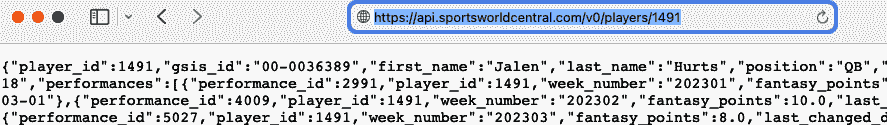
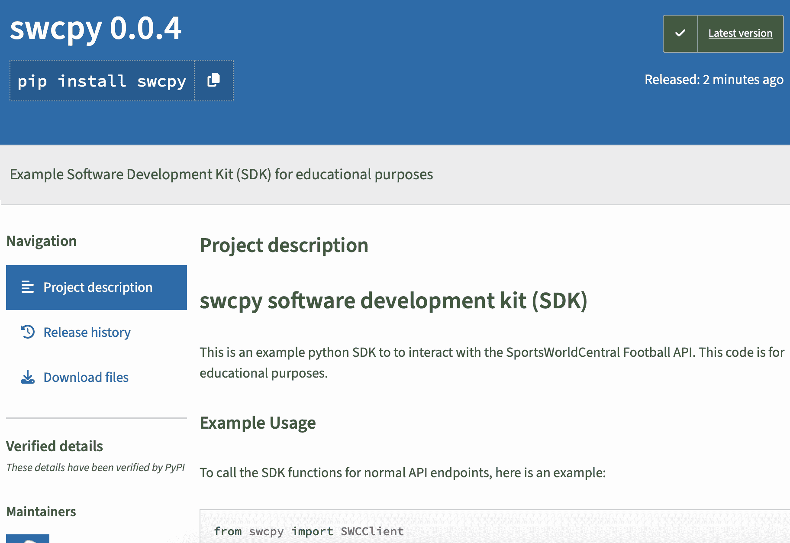
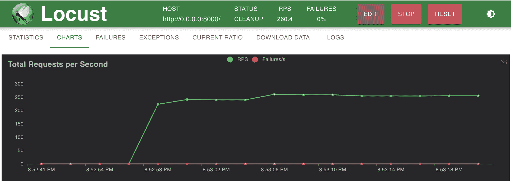
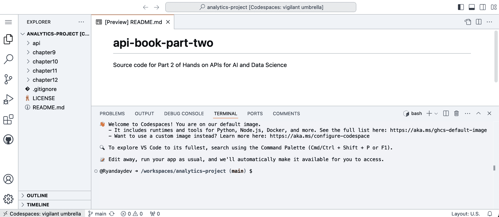

# 第八章\. 数据科学家应该了解的 API

> 与 API 一起工作对于所有数据科学家来说是一项必要的技能集。
> 
> Nate Rosidi，KDnuggets

API 专业知识对于成为一名有效的数据科学家至关重要。但数据科学家不能成为每个 API 专业领域的专家——API 领域几乎与数据科学领域一样广泛。幸运的是，如果您使用**模块化方法**，您不需要掌握每个 API 专业领域的知识：一次掌握一到两个 API 相关技能，并在您的技能增长时在这些技能之上堆叠额外的技能。根据我的经验，获取这些模块的最佳方式是通过与世界分享的动手编码项目，以获得快速反馈。（这就是本书标题中“动手”部分的原因。）

以下是一些对数据科学家最有用的模块化技能。

# 使用多种 API 风格

在野外，您可能会遇到几种主要的 API 架构风格。第二章讨论了为什么 API 提供商可能会创建 REST、GraphQL 或 gRPC API。作为 API 消费者，您需要灵活。本节解释了您如何使用可用的任何 API 风格。

最常见的 API 风格是 REST 或 RESTful。（为了简化，我在本章中将这两个术语交替使用。）REST API 有多个**端点**，它们是 HTTP 动词和 URL 的组合。例如，要从足球 API 读取联赛信息，你可能使用 HTTP GET 动词和 URL **[`api.sportsworldcentral.com/v0/leagues`](https://api.sportsworldcentral.com/v0/leagues)**。要创建一个新的联赛，你可能使用与相同 URL 的 POST 动词，并在 HTTP 正文中传递信息。

网页浏览器是向 API 发送 GET 请求的一种简单方式。例如，要查询具有`player_id`为 1491 的特定足球球员记录的幻想足球 API，您可以在网页浏览器中打开一个位于**[`api.sportsworldcentral.com/v0/players/1491`](https://api.sportsworldcentral.com/v0/players/1491)**的幻想体育 API，并得到如图 8-1 所示的结果。这是一个 HTTP GET 请求。



###### 图 8-1\. REST API 的 GET 请求

要使用 Python 以相同的方式发出请求，您可以使用 httpx 库如下所示：

```py
import httpx

rest_url = "https://api.sportsworldcentral.com/v0/players/1491"

api_response = httpx.get(rest_url)
print(api_response.json())
```

此 API 以 JSON 格式返回数据，并包含此 API 端点可用的标准字段。

无论您是从网页浏览器还是从 Python 调用此 API，您都执行了 HTTP GET 动词，该动词用于从 API 读取信息。如果您想调用 REST API 执行其他操作，您可能使用 HTTP 动词，如 POST、PUT 或 DELETE。您会注意到 REST API 为每个操作都有单独的端点。例如，此 API 将具有用于获取玩家或队伍列表的单独端点。API 定义了响应中的字段，并且它们对每个请求都是相同的。

另一种对数据科学有用的架构风格是 GraphQL，它与 REST 有几个不同之处。REST API 有多个端点，而 GraphQL API 只有一个端点。REST API 每次调用端点时都返回相同的字段，而 GraphQL 允许消费者定义他们想要的字段。REST 在读取数据时使用 HTTP GET，而 GraphQL 使用 HTTP POST。由于默认情况下网络浏览器发送 HTTP GET，因此你无法直接在浏览器中调用 GraphQL API。然而，一些 GraphQL API 提供了一个网络界面，允许你查询该 API。

要在 Python 中向 GraphQL API 发送请求，你可以使用 httpx 库通过 POST 命令发送查询，如下所示：

```py
import httpx

graphql_url = "https://countries.trevorblades.com"

json_query = {'query': '''
{
  country(code: "US") {
    name
    native
    currency
    languages {
      code
      name
    }
  }
}
'''}

api_response = httpx.post(graphql_url, json=json_query)
print(api_response.json())
```

数据以 JSON 格式返回，并且只包含你请求的字段，如下所示：

```py
{'data': {'country': {'name': 'United States', 'native': 'United States',
'currency': 'USD,USN,USS', 'languages': [{'code': 'en', 'name': 'English'}]}}}

```

(感谢 Trevor Blades 提供的 [示例 GraphQL API 和示例代码](https://github.com/trevorblades/countries)。)

我将要提到的最后一个 API 架构风格是 gRPC，它与 REST 或 GraphQL 有很大不同。gRPC 允许跨语言的 *远程过程调用*，这意味着你的程序代码可以像调用本地服务一样调用外部的 gRPC 服务。数据科学家在调用机器学习模型，如大型语言模型时，最有可能使用 gRPC。

gRPC 使用一种称为 *协议缓冲区* 的数据格式，而不是 JSON，并且它使用 HTTP/2，这是一种与 GraphQL 和 REST 通常使用的 HTTP/1 协议不同的通信协议。这两个差异使得 gRPC 能够实现非常快速的通信并支持双向数据流，而不是其他两个 API 所使用的请求/响应通信。

调用 gRPC API 的 Python 代码示例在这个介绍性章节中过于复杂，无法展示，但如果你想了解更多关于这个的信息，一个 [Python 快速入门](https://oreil.ly/nhwZ1) 是可用的。

# HTTP 基础

大多数 API 使用 HTTP，因此了解它很有帮助。第一个技巧很简单：只使用 URL 中的 *HTTPS* API——这意味着所有 API 流量在传输过程中都将被加密。

需要了解的两个更多 HTTP 项是 HTTP 动词和 HTTP 状态码。HTTP 动词在 [官方 HTTP 标准文档](https://oreil.ly/m5TTp)中被称作 *方法*，该文档表示方法“指示客户端请求的目的以及客户端期望的成功结果。”

当你在网络浏览器中调用 API 时，你正在使用 GET 方法，该方法请求资源的只读副本或资源列表。表 8-1 列出了用于 REST API 的常见 HTTP 动词。

表 8-1\. HTTP 动词和 REST API 使用

| HTTP 动词（方法） | 与 API 一起使用 | 示例 |
| --- | --- | --- |
| GET | 读取资源或资源列表。 | GET **api.sportsworldcentral.com.com/players/** |
| POST | 创建一个新的资源。 | PUT **api.sportsworldcentral.com.com/team/** |
| PUT | 更新现有的资源。 | PUT **api.sportsworldcentral.com.com/players/1234** |
| 删除 | 删除现有资源。 | DELETE *api.sportsworldcentral.com.com/players/1234* |

在表 8-1 中的 GET 和 DELETE 请求中，URL 中的信息足以执行命令，但 POST 和 PUT 需要信息来创建或更新玩家。这就是 HTTP 消息体的目的。对于 API，消息体包含 API 用于执行操作的 JSON 或 XML 数据。如前所述，对于 GraphQL API，你始终发送 POST 请求，消息体包含你发送给 API 的查询。

当请求由 API 服务器处理时，它会返回一个 HTTP 响应，其中包含一个*状态码*，这是一个数字代码，告诉您它是否能够处理您的请求。如果一切顺利，响应将具有状态码 200——表示成功——如果您期望任何数据，则会返回您请求的数据。成功并不总是发生，表 8-2 列出了在调用 API 时可能遇到的某些其他状态码。

表 8-2\. HTTP 状态码

| 状态码 | API 调用中的典型含义 |
| --- | --- |
| 2XX | 以 2 开头的状态码表示成功。 |
| 200 OK | 请求成功。 |
| 201 已创建 | POST 方法成功创建了一个资源。 |
| 3XX | 以 3 开头的状态码表示重定向。 |
| 301 或 308 永久移动 | API 地址已永久移动，因此你应该更改你的 API 调用。 |
| 302 找到移动 | API 地址临时重定向。继续使用您使用的地址。 |
| 4XX | 以 4 开头的状态码表示客户端错误。 |
| 400 错误请求 | 您的请求有错误或无效请求。 |
| 401 未授权 | 进行 API 调用时凭证无效。 |
| 404 未找到 | 资源不存在或地址错误。 |
| 5XX | 以 5 开头的状态码表示服务器错误。 |
| 500 内部服务器错误 | 服务器上发生意外失败。 |
| 503 服务不可用 | 服务存在暂时性问题。重试可能合适。 |

[官方 HTTP 标准文档](https://oreil.ly/rfc_1)提供了关于状态码的更详细信息。

# 负责任地消费 API

本章前面提供的代码示例表明，API 可以通过几行代码轻松调用。这种易用性可能是 API 在软件开发和数据科学中变得如此普遍的原因之一。

但在使用 API 进行实际分析和应用时，需要考虑额外的项目，包括以下内容：

遵守服务条款。

在使用新的 API 时，首先阅读服务条款。这将提前告诉您 API 提供商对您使用他们的 API 有什么期望和要求。例如，[MyFantasyLeague API 服务条款](https://oreil.ly/X3Jcf)声明 API 是免费使用的，但不能用于在您的幻想联赛中作弊或收集用户数据。服务条款通常会列出默认的速率限制，例如，表示用户每小时不应发出超过 1,000 次 API 请求。这防止了一个用户淹没服务，或者如果它们托管在相同的基础设施上，甚至可能淹没 API 提供商的网站。MyFantasyLeague 没有列出具体的速率限制，但禁止用户过载服务（即使是不小心造成的）并要求用户将缓慢变化的数据本地缓存以减少网络流量。

轻柔地处理重试。

在服务器端可能出现的临时错误情况下，您可能希望启用自动重试过程。为了避免服务过载（并可能使您的访问权限被禁用），请考虑实施退避和重试过程，如第七章第七章中所述。

安全地处理凭证。

大多数 API 发布者都有一些方法为他们的 API 注册用户，即使访问是免费的。这使他们能够监控您如何使用他们的 API，并就他们 API 的即将到来的更改与您联系。API 提供商使用各种 API 身份验证方法，例如用户名、密码、API 密钥、密钥、令牌等。所有 API 凭证都应安全存储，并在代码中使用密钥管理器或环境变量实现。凭证绝不应存储在程序代码中或包含在代码库中的文件中。如果凭证以某种方式被泄露，应立即停用它们并获取新的凭证。Google 在[“安全使用 API 密钥的最佳实践”](https://oreil.ly/E_WRf)中提供了额外的提示。

验证输入和输出。

作为 API 消费者，您应该小心处理从 API 接收到的数据，并考虑风险，例如*SQL 注入*，这是当恶意行为者试图在预期数据字段中发送破坏性的 SQL 命令时。您还应该确保发送给 API 的数据符合它们期望的数据类型。

记录和诊断错误。

如果您在重复数据管道中消费 API，您需要处理和记录错误。您的代码应该以有组织的方式处理日志记录，以跟踪错误消息和信息性消息。这将有助于调试您遇到的任何问题，并能够验证您代码的先前执行。 

# 关注点的分离：使用 SDK 或创建 API 客户端

软件开发中的一个重要原则是 *关注点分离*（SoC），这意味着计算机程序应该被分解成执行特定任务的块。负责任地使用 API 可能会涉及一些相当复杂的逻辑，调用 API 的代码应该与你的其他代码分离。对于喜欢在单个 Jupyter Notebook 中构建大型项目的数据科学家来说，这可能是一个难以调整的习惯。但实现所需的时间将节省你在操作中的麻烦。

如果 API 提供商发布了 SDK，你应该使用它。SDK 可以提供为与特定 API 一起使用而创建的高级功能。很多时候，它们发布在 [PyPI 软件包仓库](https://pypi.org) 上，并可以使用 `pip` 进行安装。

例如，为 SportsWorldCentral API 在 第七章 中创建的 Python SDK 可以发布在 PyPI 上。图 8-2 展示了此 SDK 在 PyPI 仓库中的样子。



###### 图 8-2\. PyPI 上的示例 SDK

要使用此 SDK 调用 API，以下 Python 代码将被使用：

```py
from pyswc import SWCClient
from pyswc import SWCConfig

config = SWCConfig()
client = SWCClient(config)
player_response = client.get_player_by_id(352)
```

SDK 调用简单，但它包括诸如回退和重试、数据验证、错误处理和日志记录等高级功能。这是当有 SDK 可用时的好处示例。

如果没有 SDK 可用，你可以将你自己的 API 调用代码分离成一个独立的客户端。你可以实现 API 提供商的 SDK 将包含的相同类型的功能，但这将是你需要维护的代码。你将在 第九章 中创建 SWC API 的 Python 客户端，并在 Jupyter Notebook 中使用它。你将在 第十一章 中重用此客户端，在 Streamlit 数据应用中调用 SWC API。这展示了如何将你的 API 调用代码分离到客户端文件中可以节省时间和精力。

# 如何构建 API

数据科学家越来越需要构建 API 来分享他们正在进行的工作。例如，你可能已经创建了自定义指标，并希望让其他数据科学家能够在他们的工作中使用这些指标。API 是共享这些数据的一种高效且实用的方式。除了共享数据之外，你可能还有一个你希望使其可用的统计模型或机器学习模型。你可以创建一个作为 *推理端点* 的 API，允许用户使用他们提交的数据来预测结果。你将在 第十二章 中学习这一点。即使你主要是 API 的使用者而不是构建者，通过自己构建一些 API 来从桌子的另一边观察，你也能从中受益。本书的第一部分 完全专注于构建 API——如果你还没有看过，不妨去看看！

# 如何测试 API

对 API 进行测试对于 API 生产者和消费者至关重要。API 生产者将在他们的 API 开发、部署和维护阶段进行测试。他们负责确保 API 的可靠性，并满足客户期望以及任何 *服务级别协议*（SLAs），这些是生产者与消费者就正常运行时间、性能或其他 API 服务方面达成的正式协议。API 消费者在使用 API 之前需要对其进行测试，以确保它们按预期工作。

[Postman 推荐的](https://oreil.ly/aET_m) 四种主要类型的 API 测试：

合同测试

验证每个端点的格式和行为

单元测试

确认单个端点的行为

端到端测试

测试使用多个端点的流程

压力测试

验证性能指标，例如在高峰时段可以处理的并发请求数量和单个请求的响应时间

pytest 库是一个易于使用的 Python 测试库。第三章和 4 章展示了如何使用它来测试 SQLAlchemy 数据库代码和 FastAPI API。一个 Python 压力测试库是 [Locust](https://locust.io)。图 8-3 展示了一个 Locust 压力测试示例，测量 API 在多个并发用户下每秒可以处理多少个请求。



###### 图 8-3\. 示例 Locust 压力测试报告

除了这四种类型之外，还有其他类型的测试。珍妮特·格雷戈里和丽莎·克里平的敏捷测试象限提供了一个宏观的测试视角。全面测试包括面向技术的测试，如单元测试和性能测试，以及面向业务的测试，如原型设计和可用性测试。不要忘记将您的 API 文档和 SDK 包含在测试中。要了解更多关于四个象限的信息，请阅读“敏捷测试的快速工具”（https://oreil.ly/j1ihN）。

# API 部署和容器化

要共享 API，您必须部署它。API 的典型部署模型是使用云主机，尽管如果您的用户是严格内部用户，您可能需要部署到本地服务器。许多云主机支持 *容器化*，即将您的程序代码打包成一个可重复使用的包，可以在本地或另一台服务器或云提供商上运行。Docker 是最流行的容器化软件。第六章展示了如何将您的 API 部署到两个不同的云平台，并使用 Docker 容器化您的 API。

# 使用版本控制

> 版本控制是一种跟踪代码库中已进行更改的方式，并允许多个人轻松地对同一代码进行工作。
> 
> 凯瑟琳·尼尔森，《数据科学家软件工程》（O’Reilly，2024）

这个项目不仅限于与 API 一起工作——它是一项所有数据科学家都将受益的基础技能。使用版本控制管理您的代码，当您单独工作时可以节省数小时的不满，当您作为团队工作时，这会使事情变得更容易。本书的这一部分继续使用 GitHub 作为您的代码版本控制仓库和展示您工作的场所。您也将所有开发工作都在 GitHub Codespaces 中完成。

# 介绍您的第二部分项目组合

在本书的这一部分，您将创建一个项目组合，以展示您创建使用 API 作为数据源的分析和其他数据科学产品的能力。以下是您接下来要完成的工作概述：

+   第九章：使用 Jupyter Notebooks 在数据分析产品中使用 API

+   第十章：使用 Apache Airflow 在数据管道中使用 API

+   第十一章：在 Streamlit 数据应用中使用 API

这些任务中的每一个都将使您能够以不同的方式展示您的 API 和数据科学技能。

###### 小贴士

在您浏览本部分的每一章时，请遵循说明并自行编写代码。通过这样做，您会比单独阅读学到更多。如果您遇到任何问题，*\complete*文件夹中的文件可供您检查工作。如果您想按顺序完成章节，您也可以使用前几章的完成文件作为起点。

# 开始使用您的 GitHub Codespace

正如您在第一部分中所做的那样，您将使用 GitHub Codespaces 来开发所有代码。如果您还没有创建 GitHub 账户，请现在创建一个。

## 克隆第二部分仓库

第二部分的所有代码示例都包含在本书的 GitHub 仓库中[这里](https://github.com/handsonapibook/api-book-part-two)。

要克隆仓库，请登录 GitHub 并转到[导入仓库页面](https://github.com/new/import)。输入以下信息：

+   *您的源代码仓库的 URL*：**`[*https://github.com/handsonapibook/api-book-part-two*](https://github.com/handsonapibook/api-book-part-two)`**

+   *您的源代码仓库的用户名*：留空。

+   *您的源代码仓库的访问令牌或密码*：留空。

+   *仓库名称*：**`analytics-project`**

+   *公开*：选择此选项，以便您可以分享您正在完成的工作的结果。

点击“开始导入”。导入过程将开始，并显示“准备您的新的仓库”的消息。几分钟后，您将收到一封电子邮件通知您导入已完成。点击链接访问您的新克隆仓库。

## 启动您的 GitHub Codespace

在您的新仓库中，点击代码按钮并选择 Codespaces 选项卡。点击“在主分支上创建 codespace”。您应该会看到一个状态为“设置您的 codespace”的页面。当设置完成时，您的 Codespace 窗口将打开。设置完成后，您的显示将类似于 图 8-4。



###### 图 8-4\. 第二部分的 GitHub Codespace

您的 Codespace 已创建，并克隆了仓库。这是您将用于本书这一部分的开发环境。打开 [GitHub Codespaces 页面](https://github.com/codespaces) 进行一些更新。滚动页面以找到这个新的 Codespace，点击名称右侧的省略号，并选择重命名。输入名称 **第二部分投资组合项目 codespace** 并点击保存。您应该会看到消息“您的 codespace *第二部分投资组合项目 codespace* 已更新。”再次点击省略号，然后点击“自动删除 codespace”旁边的彩带以关闭自动删除功能。

###### 注意

为了节省屏幕空间，我在示例中使用的 Codespace 的终端提示符中的目录列表进行了裁剪。您可以在您的 Codespace 中通过编辑 VS Code 中的 */home/codespace/.bashrc* 文件来实现这一点。找到 `export PROMPT_DIRTRIM` 语句并将其设置为 `export PROMPT_DIRTRIM=1`。要首次加载这些值，请执行以下终端命令：`source ~/.bashrc`。

# 在本地运行 SportsWorldCentral (SWC) API

在您完成第二部分的项目时，您将调用 SportsWorldCentral (SWC) API 的 0.2 版本，该版本位于 */api* 文件夹中。0.2 版本有几个端点，您在书的 第一部分 中没有创建。这些端点是为了展示数据科学和 AI 项目中的附加功能而创建的。它还添加了额外的示例数据。您将在您的 Codespace 中运行 API，然后从您在 Jupyter、Airflow 和 Streamlit 中创建的项目中调用它。

表 8-3\. SWC 梦想足球 API v0.2 更新的端点

| 端点描述 | HTTP 动词 | URL | 更新内容 |
| --- | --- | --- | --- |
| 阅读周列表 | GET | */v0/weeks/* | 新增具有最大潜在得分的端点 |
| 阅读计数 | GET | */v0/counts/* | 添加周计数 |
| 阅读团队列表 | GET | */v0/teams/* | 为每个团队添加 `weekly_scores` |
| 阅读联赛列表 | GET | */v0/leagues/* | 添加联赛规模以计算最大得分 |
| 阅读单个联赛 | GET | */v0/leagues/{league_id}* | 添加联赛规模 |

在终端中，按照所示使用提供的 *requirements.txt* 文件安装所需的库：

```py
.../analytics-project (main) $ cd api
.../api (main) $ pip3 install -r requirements.txt
```

验证 FastAPI CLI 是否已加载，以便您可以从命令行运行您的 API，如下所示：

```py
.../api (main) $ pip3 show fastapi-cli
Name: fastapi-cli
Version: 0.0.4
Summary: Run and manage FastAPI apps from the command line with FastAPI CLI.
[results truncated for space]
```

现在按照以下所示从命令行启动 API：

```py
.../api (main) $ fastapi run main.py
```

您将看到来自 FastAPI CLI 的几条消息，最后以以下内容结束：

```py
INFO:     Started server process [19192]
INFO:     Waiting for application startup.
INFO:     Application startup complete.
INFO:     Uvicorn running on http://0.0.0.0:8000 (Press CTRL+C to quit)
```

您将看到一个对话框，显示“您的运行在端口 8000 的应用程序可供访问”，如图图 8-5 所示。点击“公开”。


###### 图 8-5\. 使 API 公开

API 现在在 Codespaces 中以公共端口运行。要在浏览器中查看 API，请在终端中点击“端口”，并将鼠标悬停在 8000 端口上，如图图 8-6 所示。


###### 图 8-6\. 公共地址上的开放 API

点击地球图标。浏览器将显示以*app.github.dev*结尾的基本 URL，其中包含在 Codespaces 上运行的 API 的响应。您应该在您的网络浏览器中看到以下健康检查消息：

```py
{"message":"API health check successful"}
```

您的 API 正在云中公开运行。复制此基本 URL。您将在后续章节中使用它来连接到您的 API。

###### 注意

第二部分后面的章节将指导您在 Codespaces 中启动 API。按照以下说明运行 API。每次您重新连接到 Codespaces 时，都需要重新启动 API。

# 其他资源

要了解更多关于 REST、GraphQL 和 gRPC 的功能，请阅读第二章。

要了解如何创建数据 API，请阅读第一部分（并创建一个项目组合）。

要了解如何打包 API 客户端代码并创建 SDK，请阅读第七章。

# 摘要

本章涵盖了数据科学家需要了解的一些关于 API 的基本主题。您了解了主要的 API 架构风格，包括 REST、GraphQL 和 gRPC。您学习了 HTTP 动词和状态码的基础知识。您了解了负责任地使用 API 以及 SDK 的好处。最后，您看到了学习构建、测试和部署 API 的价值。

在第九章中，您将开始深入了解这些主题的细节，同时使用 API 进行数据分析。
