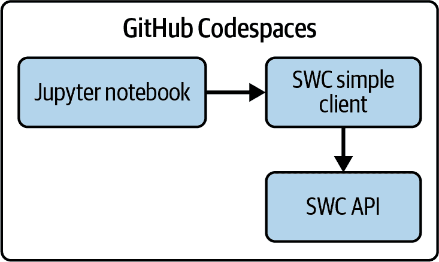

# 第九章。使用 API 进行数据分析

> 你的眼睛比数字更能看懂比赛。但数字能看到*所有*比赛。
> 
> 迪恩·奥利弗，体育统计学家

体育界喜欢所有形式的数据分析——图表、图形和统计数据，它们描述了事件的结果或预测接下来会发生什么。当体育迷查看这些数据分析时，他们可能从未考虑过用于创建它们的数据来源。在许多情况下，数据来源是一个 API。在本章中，你将学习使用 Jupyter Notebooks（数据科学家常用的流行工具）消费 API 和创建数据分析产品的最佳实践。

# 体育分析的自定义指标

最受赞誉的分析形式之一是*自定义指标*，这是一种将复杂的行为、能力和结果总结为数字的计算。每个运动都有玩家、教练、经理和球迷关注的指标。棒球在指标方面有着悠久的历史，从历史性的* earned run average*（ERA）到现代的*weighted runs created plus*（wRC+）和*wins against replacement*（WAR）。足球迷和专业人士都关注*expected goals*（xG），这是一种定义高质量射门的方法，它激发了各种[秘密酱模型](https://oreil.ly/HHSL0)。NBA 使用*player efficiency rating*（PER）来衡量篮球运动员的全局价值。

在自定义指标方面，一些最有趣的工作发生在足球领域，那里 NFL 赞助了一个名为[大数据碗](https://oreil.ly/5h1RE)的年度分析竞赛，数据学生和专业人士在这里研究和提出新的指标以换取奖金、就业前景以及看到他们的工作被纳入电视转播的兴奋。它有一个专门用于创建新自定义指标的赛道，例如*转换擒抱机会*和*通过群组擒抱准确性的路径分析*（PASTA）。一些指标已经进入了解说席，更多正在路上。

每个自定义指标都需要一些组件才能成功：

问题

它试图解决什么问题？它应该足够通用以具有广泛的应用，但也要足够具体，以向运动领域添加新知识。例如，[KenPom 排名](https://oreil.ly/2MIk3)回答了以下问题：哪些大学篮球队有资格进入 NCAA 锦标赛？

理论

通过选择特定的数字来衡量并将它们相互权衡，你做出了价值判断。你正在提出有助于回答问题的子组件。

有效的途径

基础计算是否支持指标的目的？

数据来源

你能否获取数据以合理频率计算指标？如果数据不可用，你的方法和支持的理论可能需要根据实用性进行调整。

名称

这是最有趣的部分。名字越有趣，它的影响力就越大。

# 使用 API 作为梦幻自定义指标的数据源

幻想体育爱好者也喜欢分析和指标。幻想联赛网站提供了大量的统计数据和图表，但委员会和管理员有时想创建自己的。由于幻想联赛数据频繁更新，自动化过程对于使计算可重复和一致至关重要。为了在软件代码中收集这些数据，有两种主要选择：API 或*网络抓取*。网络抓取涉及使用程序代码读取网站页面的 HTML 并提取数据。这项技术功能强大但脆弱：每次网站结构发生变化时，网络抓取代码就会停止工作，并需要修改和再次测试。但是，如果联赛网站维护 API，即使网页布局或结构发生变化，数据也是可用的。

网上搜索可以找到许多幻想经理分享他们自定义指标供他人使用的例子。我发现功能最丰富的指标是[Leeger Python 库](https://oreil.ly/leegpy)，由软件工程师乔伊·格雷科维护。这是一个开源项目，可以从六个幻想足球网站生成自定义指标。对于本章来说，Leeger 大量使用了 API。

你在第七章中阅读了一些关于 SDK 的乔伊的建议。我和他谈了他是如何使用 Leeger 的 API 来创建指标的。

乔伊创建的 Leeger 应用程序包含数十个从联盟网站 API 提取的数据计算出的自定义指标。它们有有趣的名字，例如调整后的团队运气和智能胜利。以下是格雷科提到的 AWAL 统计数据背后的计算方法：

```py
AWAL = (teams_outscored_in_week * (1/possible_opponents_in_week)) +
(teams_tied_in_week * (0.5/L))
```

# 创建自定义指标：鲨鱼联盟得分

现在轮到你自己创建一个自定义指标：鲨鱼联盟得分。图 9-1 显示了本章中你将创建的项目的高级架构。



###### 图 9-1\. 高级架构

它试图回答的问题是：“我们的幻想联赛有多艰难？”一个真正的幻想鲨鱼是知道自己的经理：他们为选秀做准备，他们搜寻弃权名单上的最佳球员，并且他们似乎总是能组建正确的阵容。一个充满这类所有者的联盟是鲨鱼联盟，在这个联盟中进入季后赛是一种荣誉的标志。在鲨鱼联盟中赢得冠军——这是一个值得终身回味的胜利。

鲨鱼联盟得分理论基于高效经理的一些属性。首先，鲨鱼联盟应该从上到下保持平衡——日程安排中不应该有容易的周。其次，整个联盟应该挑选最佳球员并将他们列入阵容以得分。一个支持理论是，幻想常规赛统计数据（通常是第 1 周至第 14 周）比幻想季后赛（第 15 周及以后）更合适，因为所有球队都在比赛。

有一些额外的项目可以被认为是可以包括在内的，但并不被 SportsWorldCentral API 支持。例如，鲨鱼联赛很少或永远不会在每周首发阵容中有空缺位置。高效所有者的另一个标志是在“热门自由球员”有大周之前就签下他们——这将特别难以衡量。

随着您在本章中的示例学习，您将开发鲨鱼联赛得分，以及两个支持性指标：联赛平衡得分和联赛活力得分。是时候开始了！

# 本章使用的软件

表 9-1 列出了您将在本章开始使用的几个软件组件。

表 9-1\. 本章使用的关键工具或服务

| 软件名称 | 用途 |
| --- | --- |
| backoff | 用于向网络调用添加回退和重试的 Python 库 |
| httpx | 用于进行网络调用的 Python 库 |
| Jupyter Notebooks | 交互式数据科学环境 |
| pandas | 数据分析和格式化库 |

## httpx

您将使用的用于调用 API 的 Python 库是 httpx。这个库与流行的 requests 库非常相似，但也支持异步 API 调用。有关 httpx 的更多信息，请参阅 第四章。

您将使用 httpx 的 27.x 版本，以保持与 第一部分 中使用的版本一致。

## Jupyter Notebooks

Jupyter Notebooks 支持一种独特的数据科学执行方式。这种模式被称为 *交互式计算*，它允许您混合代码单元、Markdown 注释单元和结果。单元从笔记本的顶部流向底部，之前运行过的变量和库对后续运行的单元可用。（如果您仅按顺序运行单元，则意味着下面的单元，但您可以按顺序外运行单元。）除了这种交互式模式之外，Jupyter Notebooks 还提供在代码单元之间运行的 Markdown 单元，这允许您创建丰富格式的文档，这些文档交织着代码、结果和文档。笔记本风格的编程被数据科学家广泛使用，他们重视其能够存储先前工作的结果以及创建它的代码。

Jupyter Notebooks 在您的 GitHub Codespace 的默认 VS Code 安装中直接支持。您将通过创建一个具有 *.ipynb* 扩展名的文件来直接在 VS Code 中运行笔记本。Project Jupyter 有许多更多选项和功能，超出了本章所学的范围；您可以在 [Jupyter 项目主页](https://jupyter.org) 上了解更多信息。

您将使用 Codespaces 中预装的 Jupyter 的默认版本。

## pandas

对于使用 Python 的数据科学家来说，最值得信赖的库之一是 pandas。对于数据科学家来说，它几乎是任何 Python 程序中第一个导入的库之一。pandas 库为 Python 提供了一种名为 `DataFrame` 的数据类型，它是一个具有行和列的二维结构。这种类似电子表格的格式是按行和列查看数据的一种自然方式。

该库还提供了许多用于数据处理、过滤和格式化的方法。正如本书第一章 Chapter 1 中提到的，数据科学家将超过三分之一的时光用于准备和清洗数据。pandas 库是这类工作的强大工具。该库的[官方用户指南](https://oreil.ly/X4vXa)是该库的优秀参考资料。

您将使用 GitHub Codespaces 中预装的 pandas 的默认版本。

# 在您的 Codespace 中安装新库

要安装本章所需的库，创建一个名为 *chapter9/requirements.txt* 的文件：

```py
.../analytics-project (main) $ cd chapter9
.../chapter9 (main) $ touch requirements.txt
```

更新 *chapter9/requirements.txt* 文件，内容如下：

```py
logging 
httpx>=0.27.0
backoff>=2.2.1 
```

#co_using_apis_for_data_analytics_CO1-1

这是标准的 Python 日志模块。

#co_using_apis_for_data_analytics_CO1-2

该库为 API 调用提供了退避和重试功能。有关更多详细信息，请参阅第七章。

执行以下命令以在您的 Codespace 中安装新库：

```py
.../chapter9 (main) $ pip3 install -r requirements.txt
```

您应该会看到一个消息，表明这些库已成功安装。

# 在 Codespaces 中启动您的 API

要访问您的 API 数据，您需要在终端中启动 API 的 0.2 版本。有关说明，请参阅“在本地运行 SportsWorldCentral (SWC) API” “Running the SportsWorldCentral (SWC) API Locally”。从浏览器地址栏复制您的 API URL，用作本章中的基本 URL。

# 创建 API 客户端文件

您将创建一个独立的 Python 文件来调用您的 API。通过将此文件与 Jupyter Notebook 保持分离，您可以将特殊的 API 相关逻辑放在一个地方，并使其可供多个笔记本使用。

您将使用 backoff 库来实现指数退避和带有抖动的重试，这使您的 API 调用更加可靠，而不会压倒源 API。您以上下文管理器风格使用 HTTPX 客户端。第七章 使用这些技术以及一些其他技术来创建一个功能齐全的 Python SDK。当可用时，使用 SDK 对 Jupyter Notebooks 也是很有帮助的，但在此章中，您将自行添加大多数功能。

###### 小贴士

API 的 0.2 版本有几个您在第一部分 Part I 中没有创建的新端点。要探索新端点的格式，请使用 Swagger UI 通过 API 的 */docs* 端点访问交互式 API 文档。

在终端中创建一个新的 Python 文件，如下所示：

```py
.../analytics-project (main) $ cd chapter9
.../chapter9 (main) $ mkdir notebooks
.../chapter9 (main) $ touch notebooks/swc_simple_client.py
```

使用以下代码更新 *swc_simple_client.py* 文件：

```py
import backoff
import logging
import httpx

HEALTH_CHECK_ENDPOINT = "/" 
LIST_LEAGUES_ENDPOINT = "/v0/leagues/"
LIST_PLAYERS_ENDPOINT = "/v0/players/"
LIST_PERFORMANCES_ENDPOINT = "/v0/performances/"
LIST_TEAMS_ENDPOINT = "/v0/teams/"
LIST_WEEKS_ENDPOINT = "/v0/weeks/"
GET_COUNTS_ENDPOINT = "/v0/counts/"

logger = logging.getLogger(__name__) 

@backoff.on_exception( 
    wait_gen=backoff.expo, 
    exception=(httpx.RequestError, httpx.HTTPStatusError),  
    max_time=5,  
    jitter=backoff.random_jitter  
)
def call_api_endpoint(
    base_url: str,
    api_endpoint: str, 
    api_params: dict = None 
) -> httpx.Response:

    try:
        with httpx.Client(base_url=base_url) as client: 
            logger.debug(f"base_url: {base_url}, api_endpoint: {api_endpoint}")
            response = client.get(api_endpoint, params=api_params)
            response.raise_for_status()
            logger.debug(f"Response JSON: {response.json()}") 
            return response
    except httpx.HTTPStatusError as e: 
        logger.error(f"HTTP status error occurred: {e.response.text}") 
return httpx.Response(status_code=e.response.status_code,
                             content=b"API error") 
    except httpx.RequestError as e:
        logger.error(f"Request error occurred: {str(e)}")
        return httpx.Response(status_code=500, content=b"Network error")
    except Exception as e:
        logger.error(f"Unexpected error occurred: {str(e)}")
        return httpx.Response(status_code=500, content=b"Unexpected error")
```

#co_using_apis_for_data_analytics_CO2-1

URL 端点被设置为变量，可以在调用客户端时使用。

(#co_using_apis_for_data_analytics_CO2-2)

此语句获取日志文件的引用。

(#co_using_apis_for_data_analytics_CO2-3)

此装饰器为`call_api_endpoint`函数添加了回退和重试功能。有关设置信息，请参阅[backoff 文档](https://oreil.ly/c_4yV)。

(#co_using_apis_for_data_analytics_CO2-4)

这允许您向 API 传递参数。

(#co_using_apis_for_data_analytics_CO2-5)

此语句使用 HTTPX 客户端以资源管理器风格，在 API 调用完成后清理资源。

(#co_using_apis_for_data_analytics_CO2-6)

此语句将 API 响应中的数据记录下来以供调试。

(#co_using_apis_for_data_analytics_CO2-7)

如果发生错误，它们将以`ERROR`类型记录。

(#co_using_apis_for_data_analytics_CO2-8)

如果发生错误，客户端将返回一个包含错误代码和信息的`httpx.response`对象。

# 创建您的 Jupyter 笔记本

要开始，请在屏幕底部的终端窗口中运行以下命令以创建新目录和您在本章中将使用的 Jupyter 笔记本：

```py
.../analytics-project (main) $ cd chapter9
.../chapter9 (main) $ mkdir notebooks
.../notebooks (main) $ touch notebooks/shark_league_notebook.ipynb
```

如果您在左侧的资源管理器中打开`chapter9/notebooks`文件夹，您应该能看到`shark_league_notebook.ipynb`。点击打开它。如图图 9-2 所示，您将看到一个空白单元格。Jupyter Notebook 由这样的单元格组成，您可以在其中填写软件代码以运行命令或 Markdown 格式的文本，以提供代码的上下文和解释。

在文件右上角，您将看到“选择内核”，如图图 9-2 所示。


###### 图 9-2\. 新笔记本文件

点击“选择内核”。Codespaces 应提示您“安装/启用建议的扩展 Python + Jupyter”，如图图 9-3 所示。选择“安装/启用建议的扩展 Python + Jupyter”。如果提示，在额外的弹出窗口中点击“安装”。


###### 图 9-3\. 安装/启用扩展

安装完成后，窗口标题将变为“选择另一个内核”，您将看到“Python 环境”选项。选择“Python 环境”。

窗口标题将变为“选择 Python 环境”。应该列出一个带有星号并标记为“推荐”的 Python 版本——选择此 Python 版本。

# 将通用配置添加到您的笔记本中

您的笔记本开头将包含通用配置和设置。将鼠标悬停在空 Python 单元格上方并点击+Markdown 创建一个新的 Markdown 单元格。在 Markdown 单元格中输入以下标题：

```py
# Shark League Score
## Import Python libraries
```

通过点击单元格左侧的播放图标或按 Shift-Enter 运行此单元格。您应该看到您的消息格式化为标题。

将光标悬停在下面的单元格下方，然后点击“+Code”创建一个新的 Python 单元格。在 Python 单元格中输入以下代码：

```py
import pandas as pd
import logging
import swc_simple_client as swc 
```


这引用了您创建的名为 *swc_simple_client.py* 的 Python 文件。

将所有导入放在笔记本顶部有助于跟踪您正在使用的库。这些导入将对本 Jupyter Notebook 中的所有单元格生效。

###### 小贴士

Jupyter Notebooks 从上到下执行。尽管 Jupyter Notebooks 之间的输出会被保存，但变量和导入的库不会。当您开始编码会话时，选择执行上面的单元格以重新运行您正在使用的单元格以上的所有单元格。

如第八章所述，日志是与 API 一起工作的重要组件。您将配置一个名为 *shark_notebook.log* 的日志文件来存储在笔记本中生成的日志消息。这些日志文件被您的仓库的 *.gitignore* 文件排除，因此它们不会被提交到您的仓库，这是一个好习惯。

添加一个包含以下文本的另一个 Markdown 单元格：

```py
## Configure logging
```

添加并运行以下 Python 代码单元格：

```py
for handler in logging.root.handlers[:]: 
    logging.root.removeHandler(handler)

logging.basicConfig(
    filename='shark_notebook.log',
    level=logging.INFO,  
)
```


此声明移除了由 Codespaces 配置的任何现有日志处理程序。


这将设置日志记录级别以记录到日志中。请参阅表 7-1 以获取有关 Python 日志记录的更多详细信息。

下一个代码单元格将包含共享变量，这些变量在导入语句之后添加是很好的。在本笔记本中，您为 API 的基本 URL 设置了一个可重用的变量，并创建了带有 API 端点的字符串常量。这两个步骤使 API 调用的目的更加清晰，并有助于避免手动输入错误。这些将在笔记本的所有单元格中可用。添加一个包含以下文本的另一个 Markdown 单元格：

```py
## Setup notebook variables
```

添加并运行以下 Python 代码单元格：

```py
base_url = "[insert your API base URL]" 
```


在引号内，您应该放入在 Codespaces 上本地运行的 API 的基本 URL，不要使用反斜杠，例如，*https://fluffy-lemur-12345-8000.app.github.dev*。

# 与您的 API 数据一起工作

下几个单元格使用导入的 `call_api_endpoint()` 函数调用 API 并获取一个 `httpx.Response` 对象。然后，它们使用 `Response.json()` 提取 API 数据并将其存储在一个 pandas DataFrame 中。

添加一个包含以下文本的 Markdown 单元格：

```py
## Get Max Scores
### Use endpoint: LIST_WEEKS_ENDPOINT
```

这段代码根据自定义评分类型检索 SportsWorldCentral 联赛的最高得分，这些得分将用于联赛果汁评分。这类高度自定义的值是最好从网站 API 中检索的数据示例。虽然你可以使用公开的 NFL 评分数据来估算总可能得分，但这需要大量努力，并且可能与网站计算出的最终总分略有不同。由于网站提供了这些数据，你可以轻松地获得与联赛总分的精确匹配。

###### 注意

从这一点开始，代码单元格的内容和输出将一起显示。代码将位于上方，输出将跟随 `OUTPUT` 语句。

添加并运行以下 Python 代码单元格：

```py
week_api_response = swc.call_api_endpoint(base_url,swc.LIST_WEEKS_ENDPOINT)
weeks_df = pd.DataFrame(week_api_response.json()) 
weeks_df['year'] = weeks_df['week_number'].str.slice(0, 4).astype(int) 

max_totals_grouped_df = weeks_df.groupby('year').agg( 
    ppr_12_max_points=('ppr_12_max_points', 'sum'),
    half_ppr_8_max_points=('half_ppr_8_max_points', 'sum'))

display(max_totals_grouped_df)

OUTPUT:
year ppr_12_max_points  half_ppr_8_max_points
2023            21048.0                14800.0
```


这以字典格式提取数据并创建一个 `DataFrame`。


这使用 pandas 的 `str.slice` 方法从 `week_number` 中获取年份子串。


这使用 pandas 的 `groupby().agg()` 方法按年份分组数据，并计算两种联赛类型的最大得分。

接下来，你将检索联赛信息。添加一个包含以下文本的 Markdown 单元格：

```py
## Get League Scoring Type
### Use Endpoint: LIST_LEAGUES_ENDPOINT
```

添加并运行以下 Python 代码单元格：

```py
league_api_response = swc.call_api_endpoint(base_url,swc.LIST_LEAGUES_ENDPOINT)
leagues_df = pd.DataFrame(league_api_response.json())
leagues_df = leagues_df.drop(columns=['teams','last_changed_date']) 
display(leagues_df)

OUTPUT:
    league_id                      league_name scoring_type  league_size
0       5001  Pigskin Prodigal Fantasy League          PPR           12
1       5002       Recurring Champions League     Half-PPR            8
2       5003                      AHAHFZZFFFL     Half-PPR            8
3       5004    Gridiron Gurus Fantasy League          PPR           12
4       5005                 Best League Ever          PPR           12
...
```


此语句使用 pandas 的 `drop` 方法从 DataFrame 中排除列。

接下来，你将检索每个联赛的总得分，以与最大潜在得分进行比较。添加一个包含以下文本的 Markdown 单元格：

```py
## Get Regular Season Scoring Totals - By Team
### Use Endpoint: LIST_TEAMS_ENDPOINT
```

这段代码包括两种在处理 API 数据时非常有用的技术。SportsWorldCentral API 在 `weekly_scores` 元素中返回包含多个嵌套字典的 JSON 数据，但你希望每周有一行。你还想从嵌套列中获取多个列。你将使用 pandas 的 `json_normalize()` 函数来完成这些任务。

本节还介绍了 pandas 的 `groupby().sum()` 方法，这与 SQL 的 `GROUP BY` 语句类似。你将使用此方法汇总所有周评分值，并为整个幻想常规赛给出总分。（NFL 比赛了 18 周，但 SportsWorldCentral 将第 1 至 14 周视为幻想常规赛，其余的是季后赛。）

添加并运行以下 Python 代码单元格：

```py
team_api_response = swc.call_api_endpoint(base_url,swc.LIST_TEAMS_ENDPOINT)

teams_parsed_df = pd.json_normalize(team_api_response.json(), 'weekly_scores',
                                   ['league_id', 'team_id', 'team_name'])  

teams_parsed_df['year'] = (teams_parsed_df['week_number']
                          .str.slice(0, 4).astype(int)) 
teams_parsed_df['week'] = (teams_parsed_df['week_number']
                          .str.slice(4, 6).astype(int))

#get only regular season teams
teams_regular_season_df = teams_parsed_df.query('week <= 14')

#get team season totals
team_totals_df = teams_regular_season_df.groupby(
   ['league_id', 'team_id', 'year'], as_index = False
   )['fantasy_points'].sum() 

team_totals_df.head()
```


pandas 的 `json_normalize()` 函数将嵌套 JSON 数据拆分为多行并提取新列。


pandas 的 `str.slice()` 方法用于从 `week_number` 字段中提取 `year` 和 `week` 值。


此 `groupby` 语句按联赛、球队和年份汇总幻想得分。

# 计算联赛平衡分数

在数据处理和格式化完成后，您可以计算第一个指标：联赛平衡分数。这个指标背后的直觉是，一个高质量的联赛是一个平衡的联赛。联赛不是被一两个顶级球队主导，而是拥有所有竞争性球队的平衡。

一个平衡的联赛在球队常规赛总积分之间的变异性较小。衡量变异性的一个方法是通过计算值的**标准差**。然而，得分系统高的联赛往往具有更高的变异性，这使得比较不同评分系统的联赛变得困难。为了调整这一点，您将使用每个联赛常规赛总积分的**变异系数**（CV）。这会将联赛总积分的**标准差**除以总积分的**平均值**。

这为您提供了一个衡量值之间相对变异性的度量，同时调整了整体评分系统。CV 之所以适用于这种情况，是因为它是**无量纲的**，这意味着它可以跨越不同大小的值进行比较——在这个例子中是评分系统。以下是您将使用的确切公式：

$upper L e a g u e upper B a l a n c e upper S c o r e equals 100 minus s t d e v left-parenthesis upper L e a g u e upper R e g u l a r upper S e a s o n upper T o t a l right-parenthesis slash m e a n left-parenthesis upper L e a g u e upper R e g u l a r upper S e a s o n upper T o t a l right-parenthesis asterisk 100$

CV 值越低，表示其变化越小，但您需要一个更高的数值表示更好的指标。您还希望它能与联赛果汁分数进行比较，该分数的最大值为 100。为了实现这一点，您将其乘以 100 并从 100 中减去，以得到一个与联赛果汁分数相似规模的数字，并且更大的数字表示更好，同时也与联赛果汁分数相匹配。

添加另一个 Markdown 单元格，内容如下：

```py
## League Balance Score
### Using the Coefficient of Variation (CV) of league regular season totals
```

本节还使用`lambda`命令在聚合期间执行 Python 代码。您将在其他几个位置使用它。

添加并运行以下 Python 代码单元格：

```py
league_stats_df = team_totals_df.groupby(['league_id','year']).agg(
    league_points_sum=('fantasy_points', 'sum'), 
    league_points_mean=('fantasy_points', 'mean'),
    league_points_stdev=('fantasy_points', 'std'), 
 league_balance_score=('fantasy_points',
                         lambda x: (100 -(x.std() / x.mean()) * 100)) 
).reset_index()

display(league_stats_df.sort_values(by='league_balance_score',
                                         ascending=False)) 
```

[#co_using_apis_for_data_analytics_CO9-1]

这个总和值将在下一个指标中使用，但这是一个方便计算它的地方。

[#co_using_apis_for_data_analytics_CO9-2]

这使用 pandas 内置的`GroupBy.std`计算联赛总积分的标准差。

[#co_using_apis_for_data_analytics_CO9-3]

这使用`lambda`对聚合值执行计算以计算联赛分数并将其缩放到与联赛果汁分数相匹配。

[#co_using_apis_for_data_analytics_CO9-4]

pandas 的`sort_values`方法不会改变底层结构；它只是在显示时进行排序。

此单元格的输出显示在图 9-4 中。


###### 图 9-4. 联赛平衡得分

# 计算联赛果汁得分

你将计算的第二个指标是联赛果汁得分，这是联赛在该赛季得分的潜在得分的百分比。这代表了联赛所有者从橙子中榨取了多少果汁，即起始阵容中有多少潜在得分。在梦幻足球中，如果本周的得分最高的球员坐在某人的板凳上，那么这对他们来说并没有太大的好处。在一个高质量的联赛中，经理们会设置能够从他们的球队中获得最大利益的起始阵容。

计算中的一个复杂之处在于，最高得分点数因联赛规模和得分类型而异。在你能够计算得分之前，你需要将你已经准备好的三个 DataFrame 合并成一个 DataFrame：

`league_stats_df`

包含每个队伍和每年的总得分

`max_totals_grouped_df`

包含常规赛的定制最高得分总和

`leagues_df`

包含每个联赛的得分类型和联赛规模，以匹配自定义最高得分

你将使用的确切公式如下：

$upper L e a g u e upper J u i c e upper S c o r e equals 100 asterisk left-parenthesis upper L e a g u e upper T o t a l upper P o i n t s right-parenthesis slash upper M a x upper P o t e n t i a l upper P o i n t s right-parenthesis$

添加另一个 Markdown 单元格，内容如下：

```py
## League Juice Score
### Compare league scoring to max potential scoring
```

添加并运行以下 Python 代码单元格：

```py
league_stats_with_league_max_df = (league_stats_df[
   ['league_id','year', 'league_points_sum','league_balance_score']]
              .merge(max_totals_grouped_df,left_on = 'year', right_on='year'))

combined_metrics_df = (leagues_df[
   ['league_id','league_name','scoring_type', 'league_size']]
   .merge(league_stats_with_league_max_df,
          left_on = 'league_id', right_on = 'league_id'))

combined_metrics_df['league_juice_score'] = combined_metrics_df.apply(
   lambda row: (
       100 * (row['league_points_sum'] / row['ppr_12_max_points'])
       if (row['scoring_type'] == 'PPR' and row['league_size'] == 12)
       else (
           100 * (row['league_points_sum'] / row['half_ppr_8_max_points'])
           if (row['scoring_type'] == 'Half-PPR' and row['league_size'] == 8)
           else None
       )
   ),
   axis=1
)

combined_metrics_df = (combined_metrics_df.drop(
   columns=['scoring_type','league_size','league_points_sum'
            ,'ppr_12_max_points','half_ppr_8_max_points',] )
)
display(combined_metrics_df)
```


第一步是将`league_stats_df`与`max_totals_grouped_df`合并。


接下来，你将`leagues_df`与上一步的输出合并。


本节使用`apply()`方法对每一行执行一个`lambda`函数来计算自定义的`league_juice+score`值。


你将这个比率乘以 100 使其成为百分比，并将其缩放以匹配联赛平衡得分。

本单元格的输出显示在图 9-5 中。


###### 图 9-5. 联赛果汁得分

# 创建 Shark League Score

在你的 API 数据已经被操作、整理和合并之后，你就可以准备收获：构建你的 Shark League Score。基于你决定将联赛果汁得分加倍的决定，你将使用的最终公式如下：

$upper S h a r k upper L e a g u e upper S c o r e equals 2 asterisk left-parenthesis upper L e a g u e upper J u i c e upper S c o r e right-parenthesis plus upper L e a g u e upper B a l a n c e upper S c o r e$

添加另一个 Markdown 单元格，内容如下：

```py
# Create Shark League Score
## Shark League Score = (2 * League Juice Score) + League Balance Score
```

添加并运行以下 Python 代码单元格：

```py
combined_metrics_df['shark_league_score'] = combined_metrics_df.apply(
    lambda league: (2 * league['league_juice_score']) +
    league['league_balance_score'],
    axis=1
)
display(combined_metrics_df.sort_values(by='shark_league_score',
ascending=False))
```

本单元格的输出显示在图 9-6 中。


###### 图 9-6. Shark League Score

恭喜你，你已经根据 SportsWorldCentral API 的定制数据计算了鲨鱼联盟得分。

# 其他资源

关于篮球中统计学价值的讨论，请阅读[“NBA 内部人士：是数字还是天赋？在 NBA 统计数据浪潮中区分事实与虚构”](https://oreil.ly/DqSG-)。

为了继续构建你对 pandas 的了解，我推荐*《Python 数据分析：使用 pandas、NumPy 和 Jupyter 进行数据处理》*（O’Reilly，2022）。这本书由 pandas 的创造者 Wes McKinney 所著。

要了解使用 nfl_data_py 从足球数据中可以创建的更详细的图表，我推荐书籍*《使用 Python 和 R 进行足球数据分析：通过体育视角学习数据科学》* Eager 和 Erickson（O’Reilly，2023）。

关于如何格式化 Markdown 以供你的笔记本使用，请阅读[Markdown 指南](https://oreil.ly/_7OgB)。

要了解其他领域中变异系数的更多信息，请阅读[“变异系数：含义及其使用方法”](https://oreil.ly/yO4zn)。

如果你想要探索更多使用 Python 在梦幻足球中数据分析的应用，Nathan Braun 在[*https://fantasycoding.com*](https://fantasycoding.com)提供了课程和书籍。

# 摘要

在本章中，你学习了如何使用 API 数据创建自定义指标。你计算了鲨鱼联盟得分，并在这个过程中学习了如何使用 pandas 和 Jupyter Notebooks。

在第十章中，你将通过在用 Apache Airflow 构建的数据管道中调用 API 来构建你的 API 和数据科学技能。
