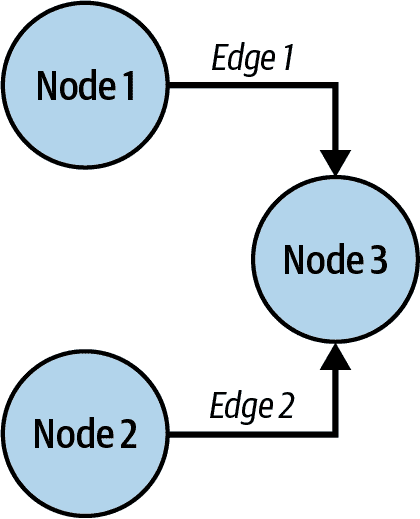
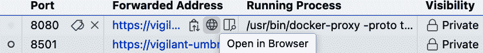
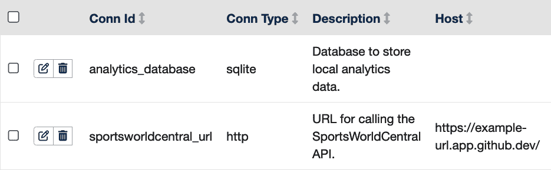
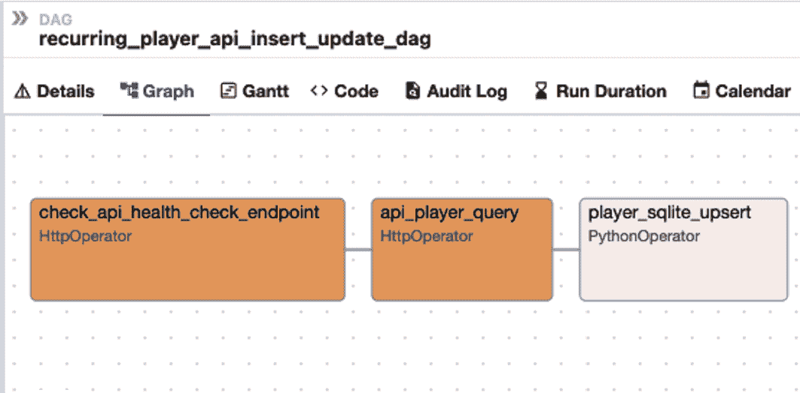

# 第十章。在数据管道中使用 API

> 在最简单的情况下，管道可能只从单个源（如 REST API）提取数据，并将其加载到目的地（如数据仓库中的 SQL 表）。然而，在实践中，管道通常由多个步骤组成...在将数据交付到最终目的地之前。
> 
> James Densmore *数据管道口袋参考* (O’Reilly, 2021)

在第九章中，您使用 Jupyter Notebook 查询 API 并创建数据分析。在笔记本中直接查询对于探索性数据分析很有用，但它要求您反复查询 API。当数据团队为生产创建分析产品时，他们实施计划流程以保持源数据的最新副本，并按所需格式准备和存储。这些结构化流程被称为*数据管道*，因为源数据流入管道并准备和存储以创建数据产品。这些流程的其他常见术语是*提取、转换、加载(ETL)*或*提取、加载、转换(ELT)*，具体取决于它们实施的详细技术。*数据工程师*是专注于数据管道开发和运营的专门角色，但在许多组织中，数据科学家、数据分析师和基础设施工程师也执行这项工作。

在本章中，您将使用 Apache Airflow 创建一个数据管道来读取 SportsWorldCentral 梦幻足球球员数据，Apache Airflow 是一个流行的开源工具，用于使用 Python 管理数据管道。

# 数据管道的数据源类型

数据管道的潜在数据源几乎是无限的。以下是一些示例：

API

REST API 是本书的重点，它们是数据管道的重要数据源。与全量加载相比，它们更适合增量更新，因为发送数据源的全部内容可能需要许多网络调用。其他 API 样式，如 GraphQL 和 SOAP，也很常见。

批量文件

大型数据集通常以某种批量文件的形式共享，可以下载和处理。这是一种处理非常大的数据源的高效方式。这些文件的格式可能不同，但 CSV 和 Parquet 是数据科学应用中流行的格式。

流数据和信息队列

对于近实时数据更新，Apache Kafka 或 AWS Kinesis 等流式源提供连续的更新流。

消息队列

消息队列软件，如 RabbitMQ 或 AWS SQS，提供异步消息传递，允许事务在暂存位置发布，并由订阅者稍后拾取。

直接数据库连接

与源数据库的连接允许消费者以原始格式获取数据。这些在组织内部共享数据比对外部消费者更常见。

您将在本章中创建一个使用 REST API 和批量文件的管道。

# 规划您的数据管道

你的目标是读取 SportsWorldCentral 数据并将其存储在你可以保持更新的本地数据库中。这允许你创建分析产品，如报告和仪表板。对于这个场景，你将假设 API 不允许完整下载数据，因此你需要使用批量文件进行初始加载。

在初始加载之后，你希望获取任何新记录或已更新记录的每日更新。这些更改记录通常被称为 *delta* 或 *deltas*，使用数学术语“变化”来表示。通过仅处理更改记录，更新过程将运行得更快，并使用更少的资源（并节省更多资金）。

图 10-1 显示了你计划中的数据管道。


###### 图 10-1\. 你的数据管道计划

管道包括两个来源：批量数据文件和 API。圆形框代表两个 ETL 流程，它们都将更新分析数据库，这是一个用于创建分析产品（如仪表板和报告）的本地数据库。

# 使用 Apache Airflow 编排数据管道

> Airflow 最好被看作是一个网络中的蜘蛛：它位于你的数据处理过程中间，协调跨不同（分布式）系统的工作。
> 
> Julian de Ruiter 和 Bas Harenslak 著，*Apache Airflow 数据管道*（Manning，2021）

在生产环境中运行多个数据处理工作流会迅速变得复杂。调度、错误处理和重启失败进程需要大量的规划和设计。这些任务被称为 *编排*，这正是 Apache Airflow 的用途。随着数据管道数量的增加，使用编排软件而不是自己编写所有这些任务将为你带来好处。Airflow 是一个功能齐全的开源引擎，它使用 Python 进行配置，并处理数据管道中涉及到的许多重复性任务。

Airflow 有一些专门的术语，这些术语在其它数据科学编程中并不常用。天文学家的 [Airflow 术语表](https://oreil.ly/IjTM4) 是这些术语的完整来源，但我会与你分享其中一些最重要的术语。

Airflow 使用来自数学图论的专业术语。在图论中，一个 *节点* 是一个进程，一个 *边* 是节点之间的流动。使用这个术语，一个 *有向无环图* (DAG) 是一个包含单向流程且没有循环或递归逻辑的最高级进程。

图 10-2 显示了 DAG 中节点和边之间的关系。



###### 图 10-2\. 有向无环图

你将为每个 DAG 创建一个 Python 文件。DAG 中的每个步骤都称为 *任务*，这是 Airflow 中执行的基本单元。每个任务将在 DAG 的图形图中显示为一个单独的框。

*operator* 是任务的一个预定义模板。在本章中，你将使用 `HttpOperator` 来调用你的 API 和 `PythonOperator` 来更新你的分析数据库。Airflow 内置了与数据库、S3 存储桶和几个其他功能交互的运算符。社区中还有更多，列在 [Airflow 运算符和钩子参考](https://oreil.ly/8k6mr) 中。

你将要学习的最后一件事情是使用 *XCom*，它代表 *跨通信*。XCom 用于在任务之间传递信息和数据。

# 在 GitHub Codespaces 中安装 Apache Airflow

图 10-3 展示了本章将创建的项目的高级架构。


###### 图 10-3\. Airflow 项目的架构

你将使用在 “开始使用您的 GitHub Codespace” 中创建的 Part II GitHub Codespace。如果你还没有创建你的 Part II Codespace，你现在可以完成该部分。

在启动 Codespace 之前，通过点击 Codespace 旁边的省略号并点击“更改机器类型”将机器类型更改为四核机器。这是必要的，因为 Airflow 同时运行多个服务。

你将在 Codespace 中安装 Airflow 并执行基本配置，这将允许你从图中创建数据管道。（这将是一个用于演示的非生产环境设置。在生产环境中使用 Airflow 之前，需要额外的设置。）

Airflow 可以使用 Docker 或 `pip` 安装。你将使用 Docker 版本。你将遵循 [“在 Docker 中运行 Airflow”](https://oreil.ly/ORZKy) 中的说明，并进行一些自定义。

首先，在 Codespace 的 *chapter10* 文件夹中创建一个 *airflow* 目录，并切换到该目录：

```py
.../chapter10 (main) $ mkdir airflow
.../chapter10 (main) $ cd airflow
.../airflow (main) $
```

接下来，使用 `curl` 命令检索用于运行 Airflow Docker 版本的 *docker-compose.yaml* 文件。从 [官方 Airflow 网站](https://airflow.apache.org) 获取此文件，并指定版本。本章使用的是版本 2.9.3，但你也可以遵循 [Airflow 文档](https://oreil.ly/QTlk_) 中列出的最新稳定版本：

```py
.../airflow (main) $ curl -LfO \
'https://airflow.apache.org/docs/apache-airflow/2.10.0/docker-compose.yaml'
  % Total    % Received % Xferd  Average Speed   Time    Time     Time  Current
                                 Dload  Upload   Total   Spent    Left  Speed
100 11342  100 11342    0     0   410k      0 --:--:-- --:--:-- --:--:--  410k
```

文件 *docker-compose.yaml* 包含从 [Docker Hub](https://oreil.ly/q7y53) 下载镜像的说明，以及配置软件的环境选项。

打开 *docker_compose.yaml* 并查看 `volumes:` 部分：

```py
  volumes:
    - ${AIRFLOW_PROJ_DIR:-.}/dags:/opt/airflow/dags
    - ${AIRFLOW_PROJ_DIR:-.}/logs:/opt/airflow/logs
    - ${AIRFLOW_PROJ_DIR:-.}/config:/opt/airflow/config
    - ${AIRFLOW_PROJ_DIR:-.}/plugins:/opt/airflow/plugins
```

本节创建 Docker *卷*，这些卷是 Docker 容器内部可用的虚拟驱动器，它们映射到你的 Codespace 存储中的文件。它们相对于 Airflow 项目目录，在你的 Codespace 中将是 *airflow*。例如，你的 Codespace 中的 *airflow/dags* 将被引用为 */opt/airflow/dags*，指向在 Docker 中运行的 Airflow 应用程序。（这在你在本章后面创建连接时将非常重要。）

创建映射到这些卷的目录，然后为 Airflow 用户 ID 配置一个环境变量：

```py
.../airflow (main) $ mkdir -p ./dags ./logs ./plugins ./config
.../airflow (main) $ echo -e "AIRFLOW_UID=$(id -u)" > .env
```

创建 *docker-compose.override.yaml*：

```py
.../airflow (main) $ touch docker-compose.override.yaml
```

你将使用此文件来覆盖从下载的 *docker-compose.yaml* 文件中的一些标准配置设置。使用覆盖文件允许你保持下载的 *docker-compose.yaml* 文件与原始文件完全一致，并将所有自定义设置集中在一起，这使得故障排除更容易。它还允许你在 Airflow 升级时使用新版本更新 *docker-compose.yaml*。使用以下内容更新 *docker-compose.override.yaml*：

```py
#these are overrides to the default docker compose
x-airflow-common:
  &airflow-common
  environment:
    &airflow-common-env
    AIRFLOW__CORE__LOAD_EXAMPLES: 'false' 

services:
  airflow-webserver:
    <<: *airflow-common
    command: webserver
    environment:
      <<: *airflow-common-env
      AIRFLOW__WEBSERVER__ENABLE_PROXY_FIX: 'True' 
  airflow-scheduler:
    <<: *airflow-common
    command: scheduler
    environment:
      <<: *airflow-common-env
      AIRFLOW__SCHEDULER__MIN_FILE_PROCESS_INTERVAL: '30' 
```


此设置将隐藏内置的 Airflow 示例，以便在本章中不会分散注意力。


此设置将允许你在 Codespaces 中使用 Airflow Web 界面。


此设置告诉 Airflow 在你开发时更频繁地查找代码更改。

现在，你可以使用 `docker-compose.yaml` 和 `docker-compose.override.yaml` 文件以及 `docker compose up airflow-init` 命令初始化 Docker 环境。此命令将下载 Airflow 软件，并配置用户 ID 和其他配置细节。执行以下命令：

```py
.../airflow (main) $ docker compose up airflow-init
[+] Running 44/3
  redis Pulled
  postgres Pulled
  airflow-init Pulled
...
airflow-init-1  | 2.10.0
airflow-init-1 exited with code 0
```

此命令将运行几分钟，执行许多命令。如果输出以“exited with code 0”结束，则表示成功。你的环境已初始化，你不需要再次执行此命令。

你现在可以运行 Airflow。要启动 Airflow Web 界面，执行以下命令：

```py
.../airflow (main) $ docker compose up -d
+] Running 7/7
 ✔ Container airflow-postgres-1           Healthy
 ✔ Container airflow-redis-1              Healthy
 ✔ Container airflow-airflow-init-1       Exited
 ✔ Container airflow-airflow-webserver-1  Started
 ✔ Container airflow-airflow-triggerer-1  Started
 ✔ Container airflow-airflow-scheduler-1  Started
 ✔ Container airflow-airflow-worker-1     Started
```

虽然你会看到一个弹出窗口来启动 Web UI，但我发现有时 Web UI 需要几分钟的准备时间，所以不要点击“确定”。相反，等待几分钟，然后选择你的 Codespace 中的“端口”选项卡。你将看到 Web 界面的转发地址。点击地球图标在浏览器中打开 UI，如图 图 10-4 所示。



###### 图 10-4\. 打开 Airflow Web 界面

您将看到登录页面。输入用户名**`airflow`**和密码**`airflow`**，然后点击“登录”。（这些初始凭据仅用于演示。）您将看到在您的 Codespace 中运行的 Airflow 应用程序的 Web 界面，如图图 10-5 所示。当您开始时，列表中没有 DAG。您将在创建 DAG 以完成您的数据管道需求时了解更多关于 Airflow 的功能。


###### 图 10-5\. Airflow 主页

# 创建您的本地分析数据库

您的数据管道将用于将球员记录插入和更新到本地数据库中。这是一个常见的数据科学模式：从源数据更新数据库，然后从数据库创建模型、指标和报告。将目录更改为*dags*并创建数据库和`player`表，如下所示：

```py
.../airflow (main) $ cd dags
.../dags (main) $ sqlite3 analytics_database.db
SQLite version 3.45.3 2024-04-15 13:34:05
Enter ".help" for usage hints.
sqlite> CREATE TABLE player (
    player_id INTEGER PRIMARY KEY,
    gsis_id TEXT,
    first_name TEXT,
    last_name TEXT,
    position TEXT,
    last_changed_date DATE
);
sqlite> .exit
```

# 在 Codespaces 中启动您的 API

您的 Airflow 管道需要一个 SportsWorldCentral API 的运行副本来收集更新。按照“在本地运行 SportsWorldCentral (SWC) API”中的说明，在 Codespaces 的另一个终端窗口中运行您的 API，并从浏览器栏中复制基本 URL。您将在下一节中将配置 Airflow 以引用该 API 的基本 URL。

# 配置 Airflow 连接

Airflow *连接*允许您在服务器中而不是在代码中存储有关数据源和目标的信息。这对于维护用于开发、测试和生产的不同 Airflow 环境非常有用。您将为您的 API 和分析数据库创建连接。

在 Airflow UI 中，选择 Admin > Connections。点击加号以添加新的连接记录。现在您将使用之前在*docker-compose.yaml*文件中查看的*volume*映射。使用以下值：

+   *连接 ID*：**`analytics_database`**

+   *连接类型*：Sqlite

+   *描述*：**`用于存储本地分析数据的数据库。`**

+   *模式*：**`/opt/airflow/dags/analytics_database.db`**

其余值留空，然后点击保存。

接下来，添加 API 连接的连接：

+   *连接 ID*：**`sportsworldcentral_url`**

+   *连接类型*：HTTP

+   *描述*：**`调用 SportsWorldCentral API 的 URL。`**

+   *主机*：输入运行在 Codespaces 中的 API 的基本 URL。

其余值留空，然后点击保存。您应该看到列出两个连接，如图图 10-6 所示。



###### 图 10-6\. 配置的 Airflow 连接

# 创建您的第一个 DAG

显示了使用 Airflow 实现您的管道的示例，使用两个 DAG。*bulk_player_file_load.py* DAG 将执行从提供的批量文件到分析数据库的初始加载，该文件在本书的第一部分中提供。该文件位于您的存储库的*chapter10/complete*文件夹中，但由于篇幅限制，本章没有介绍它。


###### 图 10-7\. 您的数据管道的 Airflow 组件

创建使用 API 数据的 DAG，*recurring_player_api_insert_update_dag.py*。此 DAG 使用 SportsWorldCentral API 执行数据库的增量更新。将目录更改为*dags*并创建*recurring_player_api_insert_update_dag.py*文件：

```py
.../airflow (main) $ cd dags
.../dags (main) $  touch recurring_player_api_insert_update_dag.py
```

将以下内容添加到*recurring_player_api_insert_update_dag.py*文件中：

```py
import datetime
import logging
from airflow.decorators import dag 
from airflow.providers.http.operators.http import HttpOperator 
from airflow.operators.python import PythonOperator
from shared_functions import upsert_player_data 

def health_check_response(response): 
    logging.info(f"Response status code: {response.status_code}")
    logging.info(f"Response body: {response.text}")
    return response.status_code == 200 and response.json() == {
        "message": "API health check successful"
    }

def insert_update_player_data(**context): 

    player_json = context["ti"].xcom_pull(task_ids="api_player_query") 

    if player_json:
        upsert_player_data(player_json) 
    else:
        logging.warning("No player data found.")

@dag(schedule_interval=None) 
def recurring_player_api_insert_update_dag():

    api_health_check_task = HttpOperator(  
        task_id="check_api_health_check_endpoint",
        http_conn_id="sportsworldcentral_url",
        endpoint="/",
        method="GET",
        headers={"Content-Type": "application/json"},
        response_check=health_check_response,
    )

    temp_min_last_change_date = "2024-04-01" 

    api_player_query_task = HttpOperator( 
       task_id="api_player_query",
       http_conn_id="sportsworldcentral_url",
       endpoint=(
           f"/v0/players/?skip=0&limit=100000&minimum_last_changed_date="
           f"{temp_min_last_change_date}"
       ),
       method="GET",
       headers={"Content-Type": "application/json"},
   )

    player_sqlite_upsert_task = PythonOperator( 
        task_id="player_sqlite_upsert",
        python_callable=insert_update_player_data,
        provide_context=True,
    )

    # Run order of tasks
    api_health_check_task >> api_player_query_task >> player_sqlite_upsert_task

# Instantiate the DAG
dag_instance = recurring_player_api_insert_update_dag() 
```

(#co_using_apis_in_data_pipelines_CO2-1)

此导入允许您使用`@dag`装饰器定义 DAG。

(#co_using_apis_in_data_pipelines_CO2-2)

这两个导入允许您在任务中使用预定义的操作符。

(#co_using_apis_in_data_pipelines_CO2-3)

这是一个导入包含在两个 DAG 之间共享的函数的单独 Python 文件。

(#co_using_apis_in_data_pipelines_CO2-4)

这是验证以下定义的`api_health_check_task`响应的代码。这是第一个任务，它允许 DAG 在执行其他任务之前验证 API 的状态。

(#co_using_apis_in_data_pipelines_CO2-5)

这定义了一个将被任务调用的函数。

(#co_using_apis_in_data_pipelines_CO2-6)

这行代码使用 XCom 从第二个任务检索数据。

(#co_using_apis_in_data_pipelines_CO2-7)

这里它将数据从 XCom 传递到共享的`upsert_player_data`函数，该函数定义在单独的文件中。

(#co_using_apis_in_data_pipelines_CO2-8)

这是主 DAG 定义。它使用`@dag`装饰器将 Python 函数定义为 DAG。任务定义在此方法内。

(#co_using_apis_in_data_pipelines_CO2-9)

第一个任务使用`HttpOperator`模板调用 API 的健康检查端点。它在继续之前添加了一个`response_check`方法来检查 API 的状态。

(#co_using_apis_in_data_pipelines_CO2-10)

在此示例中，最小最后更改日期是硬编码的。在生产中，可以使用[Airflow 模板变量](https://oreil.ly/pFHaG)来获取最后一天的更新。

(#co_using_apis_in_data_pipelines_CO2-11)

第二个任务使用`HttpOperator`调用 API 的玩家端点，并使用查询参数来限制返回的记录。

(#co_using_apis_in_data_pipelines_CO2-12)

第三个任务是一个 `PythonOperator`，它调用 `insert_update_player_data` 函数。

(#co_using_apis_in_data_pipelines_CO2-13)

该语句使用位移运算符设置任务的依赖关系。

(#co_using_apis_in_data_pipelines_CO2-14)

最后一条语句是必需的，用于实例化由 `@dag` 装饰器定义的 DAG。

抽空比较一下这段代码与 图 10-7。DAG 文件的关键部分位于文件底部：`@dag` 装饰器定义了主要的 DAG 包装器。在 DAG 内部有三个任务：两个使用 `HttpOperator` 连接到 API，一个使用 `PythonOperator` 连接到 SQLite 数据库。

语句 `api_health_check_task >> api_player_query_task >> player_sqlite_upsert_task` 使用右移运算符 `>>` 设置任务之间的依赖关系。这些任务具有非常简单的顺序依赖关系，但 Airflow 能够实现任务之间非常复杂的依赖关系。有关此功能的更多信息，请参阅 Astronomer 的 [“在 Airflow 中管理任务和任务组依赖”](https://oreil.ly/PTa4M)。

# 编写共享函数

尽管两个 DAG 的来源不同，但它们都在分析数据库上执行 *upsert* 操作，这意味着如果源记录已存在于数据库中，则代码会更新它，否则会插入一条新记录。因为此任务在两个 DAG 之间是共享的，所以你需要创建一个包含共享函数的单独 Python 文件。创建 *shared_functions.py* 文件：

```py
.../dags (main) $ touch shared_functions.py
```

将以下内容添加到 *shared_functions.py* 文件中：

```py
import logging
import json
from airflow.hooks.base import BaseHook 

def upsert_player_data(player_json):
    import sqlite3			
    import pandas as pd

# Fetch the connection object
    database_conn_id = 'analytics_database'
    connection = BaseHook.get_connection(database_conn_id) 

    sqlite_db_path = connection.schema

    if player_json:

        player_data = json.loads(player_json)

        # Use a context manager for the SQLite connection
        with sqlite3.connect(sqlite_db_path) as conn:
            cursor = conn.cursor()			

            # Insert each player record into the 'player' table
            for player in player_data:
                try:
                    cursor.execute(""" 
                        INSERT INTO player (
                            player_id, gsis_id, first_name, last_name, 
                            position, last_changed_date
                        ) 
                        VALUES (?, ?, ?, ?, ?, ?) 
                        ON CONFLICT(player_id) DO UPDATE 
                        SET
                            gsis_id = excluded.gsis_id,
                            first_name = excluded.first_name,
                            last_name = excluded.last_name,
                            position = excluded.position,
                            last_changed_date = excluded.last_changed_date
                    """, (
                       player['player_id'], player['gsis_id'],
                       player['first_name'],
                       player['last_name'],
                       player['position'],
                       player['last_changed_date']
                   ))
                except Exception as e:
                   logging.error(
                       f"Failed to insert player {player['player_id']}: {e}")
                   raise

    else:
        logging.warning("No player data found.")
         raise ValueError(
           "No player data found. Task failed due to missing data.")
```

(#co_using_apis_in_data_pipelines_CO3-1)

这两个导入语句被放置在 Python 方法内部。这是因为 Airflow 经常解析 DAG 代码，并将 Python 文件顶部的导入库重新加载。

(#co_using_apis_in_data_pipelines_CO3-2)

该语句使用 Airflow 钩子检索你在 Airflow 用户界面中定义的连接。

(#co_using_apis_in_data_pipelines_CO3-3)

这使用数据库游标在你的分析数据库上执行 SQL 查询。

(#co_using_apis_in_data_pipelines_CO3-4)

该语句使用数据库游标来执行参数化 SQL 查询。

(#co_using_apis_in_data_pipelines_CO3-5)

这个 SQL 语句提供了 upsert 功能，如果记录已存在则更新它，如果不存在则插入它。

此函数接收 API 的数据作为参数，然后使用你在用户界面中定义的 Airflow 连接将数据加载到 SQLite 数据库中。这是一个参数化 SQL 查询，其中输入数据通过 `VALUES (?, ?, ?, ?, ?, ?)` 引用。这是一项重要的措施，可以防止 SQL 注入攻击，如果恶意行为者将代码插入到源数据字段中，而你的进程期望数据，则可能会发生此类攻击。

# 运行你的 DAG

在运行 DAG 之前，请确保你的 API 正在运行。导航回 Airflow UI，你将看到你的 DAG 列出，如图 图 10-8 所示。用户界面功能众多，本章无法全部涵盖，但你可以在 [“UI / Screenshots”](https://oreil.ly/DfOSC) 中了解用户界面。


###### 图 10-8\. DAG 列在 Airflow 主页上

点击 `recurring_player_api_insert_update_dag`，然后点击图形。你将看到使用你在代码中指定的 `task_id` 名称的 Airflow 任务序列，如图 图 10-9 所示。



###### 图 10-9\. 第一个 DAG 的图形视图

点击触发 DAG 按钮，该按钮有一个指向你的 DAG 的三角形图标。如果代码和连接配置正确，你的 DAG 中的每个任务应在约一分钟内完成，绿色框表示成功。点击第一个框，标记为 `check_api_health_check_endpoint`。你的视图应类似于 图 10-10。如果你遇到错误，点击有错误的任务，然后点击日志来诊断问题。


###### 图 10-10\. 成功的 DAG 运行

为了确认你的分析数据库已成功更新，请回到终端并使用 SQLite 打开数据库。查询 Player 表，以确认表中存在 1,018 条玩家记录。这些是从你的 API 中检索到的记录：

```py
.../dags (main) $ sqlite3 analytics_database.db
SQLite version 3.45.3 2024-04-15 13:34:05
Enter ".help" for usage hints.
sqlite> select count(*) from player;
1018
```

恭喜！你创建了一个使用 API 记录更新数据库的数据管道！

# 摘要

在本章中，你学习了如何创建一个数据管道，通过调用 API 来维护分析产品的当前数据。你安装并配置了 Apache Airflow，并创建了一个包含多个任务的 DAG，用于从 API 更新你的数据库。

在 第十一章 中，你将使用 API 的数据创建一个 Streamlit 数据应用。
