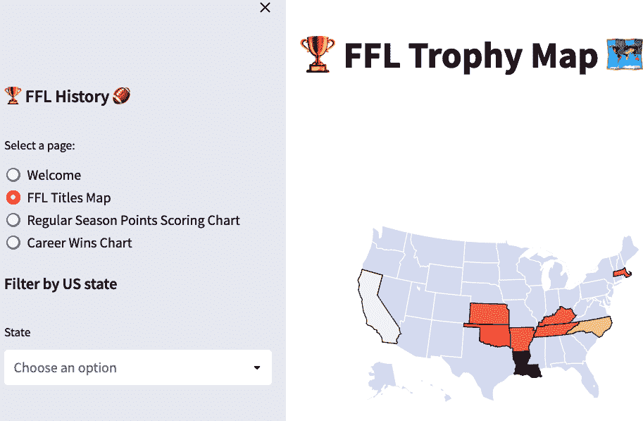
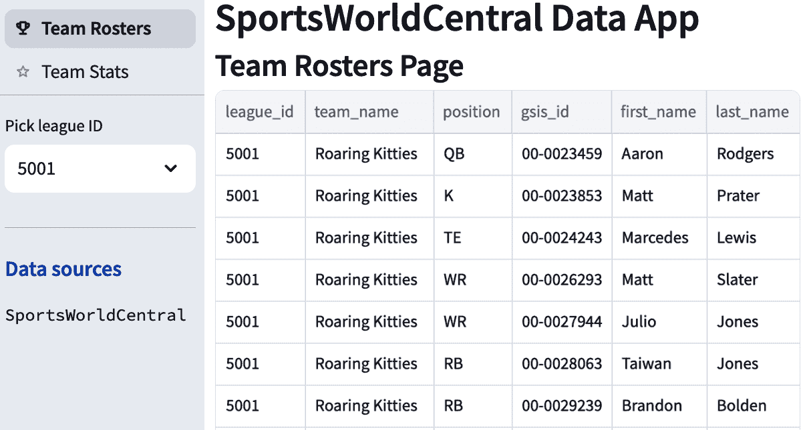
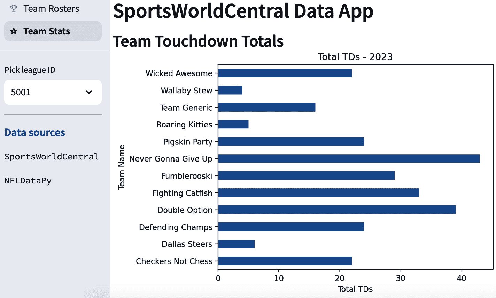

# 第十一章\. 在 Streamlit 数据应用中使用 API

> 现在的一个简单应用比三个月后一个过度设计的应用要好。
> 
> Thiago Teixeira，Streamlit 联合创始人

如果你想向其他人展示你的数据科学技能，没有比 *数据应用* 更好的方式——这是一个显示你的数据科学模型、图表、图表和电子表格的 Web 应用程序。向招聘人员或潜在客户发送你创建的数据应用的链接是吸引他们注意力的可靠方式。

在本章中，你将使用 Streamlit 构建一个数据应用，Streamlit 是一个开源库，它帮助你使用 Python 创建色彩丰富且交互式的 Web 应用程序。Streamlit 处理所有 Web 界面的复杂性，这样你就可以专注于数据后端代码，例如数据文件、pandas DataFrame 和 API。

Streamlit 应用可以免费在 Streamlit 社区云或付费 Web 托管平台上以有限的方式部署。

# 通过交互式可视化吸引用户

两种主要的分析产品类型是 *表格报告* 和 *可视化*。表格报告以电子表格格式呈现数据行和列，提供了数据的详细视图。可视化用图表、图形、地图和其他图像替换表格数据，为数据提供背景和色彩。可视化可以传达在电子表格中难以看到的思想。

Streamlit 以非常互动的方式支持表格数据和可视化。它提供了内置的 *小部件*，例如滑块和选择框，允许用户实时过滤和与数据交互。为了一个有趣的例子，请查看图 11-1，它展示了我为跟踪我长期运行的幻想联赛中的一个冠军头衔而构建的数据应用。



###### 图 11-1\. 幻想联赛数据应用

内置的小部件允许数据科学家专注于提供准确和有用的数据，而 Streamlit 组件则使应用看起来非常出色。Streamlit 设计其产品以具有简单的默认设置，以便用户能够快速上手；这是 Streamlit 的设计原则之一[促进进步](https://oreil.ly/strlit)。

# 本章使用的软件

本章基于你在前几章中学到的工具，特别是 pandas。表 11-1 显示了你将使用的新工具。

表 11-1\. 本章使用的关键工具或服务

| 软件名称 | 用途 |
| --- | --- |
| nfl_data_py | NFL 数据库 |
| Streamlit | 基于网络的分析软件 |

## nfl_data_py

为了进行数据分析，你通常希望从多个来源添加数据，以便使你的分析产品更具信息量或提供更广泛的背景。对于足球数据，[nflverse](https://oreil.ly/nfLV) 是一个包含 NFL 数据的丰富开源库和数据文件集。与数据交互的 Python 库是 [nfl_data_py](https://oreil.ly/2U7P8)。

你将使用当前可用的最新版本的 nfl_data_py。

## Streamlit

Streamlit 是一个开源的 Python 库，你可以使用`pip3`下载。通过包含这个库，一个单一的 Python 文件可以使用`streamlit run your_script.py`命令生成一个应用。这个库使用[Streamlit 入门指南](https://oreil.ly/-qxBe)很容易学习。

# 安装 Streamlit 和 nfl_data_py

要安装本章所需的库，创建一个名为*chapter11/requirements.txt*的文件：

```py
.../analytics-project (main) $ cd chapter11
.../chapter11 (main) $ touch requirements.txt
```

将以下内容更新到*chapter11/requirements.txt*：

```py
streamlit>=1.38.0
httpx>=0.27.0
nfl_data_py
matplotlib
backoff>=2.2.1
```

执行以下命令在你的 Codespace 中安装新的库：

```py
.../chapter11 (main) $ pip3 install -r requirements.txt
```

你应该会看到一个消息，表明这些库已成功安装。

# 在 Codespaces 中启动你的 API

图 11-2 显示了本章将创建的项目的高级架构。


###### 图 11-2\. Streamlit 项目的架构

要访问你的 API 数据，你需要在终端中启动你的 API 的 v0.2 版本。有关说明，请遵循“在本地运行 SportsWorldCentral (SWC) API”。当 API 运行时，从浏览器地址栏复制你的 API 的 URL 作为本章的基础 URL。

###### 小贴士

当你的 API 或 Streamlit 应用在终端运行时，如果你想停止它，请按 Ctrl-C。

# 重用第九章的 API 客户端文件

在第九章中，你创建了一个独立的 Python 客户端文件来调用你的 API，同时添加了日志记录、错误处理和回退重试功能。你将在你的 Streamlit 应用中重用这个文件。将 API 客户端文件放在 Streamlit 应用之外，可以提供可重用性。

将客户端文件从*chapter9/notebooks*目录（如果你还没有完成第九章，则从*chapter9/complete/notebooks*目录）复制到*chapter11/streamlit*目录：

```py
.../chapter11 (main) $ mkdir streamlit
.../chapter11 (main) $ cp ../chapter9/notebooks/swc_simple_client.py streamlit
```

# 创建你的 Streamlit 应用

你的 Streamlit 应用将包括一个*入口点文件*，这是 Streamlit 首先加载的文件。在这个应用中，你将使用入口点文件来设置初始配置和创建页面导航。你的应用还将包括执行工作的单个页面文件。

由于你的 API 在终端窗口中运行，你需要打开第二个终端窗口并执行以下命令：

```py
.../chapter11 (main) $ mkdir streamlit
.../chapter11 (main) $ cd streamlit
.../streamlit (main) $ touch streamlit_football_app.py
.../streamlit (main) $ touch page1.py
.../streamlit (main) $ touch page2.py
```

# 更新入口点文件

入口点文件包含了一些对 Streamlit 应用至关重要的项目。第一个是`st.session_state`，它是应用程序中页面间共享信息的机制。接下来是`st.navigation`，这是创建具有共享导航栏的多页应用的方式。

将以下代码添加到*streamlit_football_app.py*，并将语句`[insert your API base URL]`替换为本地运行的 API 的基础 API URL：

```py
import streamlit as st
import logging
import pandas as pd

if 'base_url' not in st.session_state:
    st.session_state['base_url'] = "[insert your API base URL]" 

logging.basicConfig( 
    filename='football_app.log',  
    level=logging.INFO,  
)

st.set_page_config(page_title="Football App",
                  page_icon=":material/sports_football:") 

page_1 = st.Page("page1.py", title="Team Rosters", icon=":material/trophy:") 

page_2 = st.Page("page2.py", title="Team Stats", icon=":material/star_border:")

pg = st.navigation([page_1, page_2]) 
pg.run() 
```


将语句 `[插入您的 API 基础 URL]` 替换为本地运行的 API 的基础 API URL。

(#co_using_apis_in_streamlit_data_apps_CO1-2)

这为应用程序设置日志记录配置。所有 `INFO` 级别或更严重的日志消息都将保存在此文件中。

(#co_using_apis_in_streamlit_data_apps_CO1-3)

这将为整个应用程序设置配置，包括在浏览器标签中显示的标题和图标。

(#co_using_apis_in_streamlit_data_apps_CO1-4)

此命令定义了第一个子页面的设置，包括在导航栏中显示的标题和图标。

(#co_using_apis_in_streamlit_data_apps_CO1-5)

这将创建导航栏并排列子页面。

(#co_using_apis_in_streamlit_data_apps_CO1-6)

这条语句执行当前页面。

# 运行您的 Streamlit 应用

要运行您的应用，请在终端中执行以下命令：

```py
.../streamlit (main) $ streamlit run streamlit_football_app.py
```

您将看到 图 11-3 中所示的显示。


###### 图 11-3\. 启动您的 Streamlit 应用

点击“在浏览器中打开”。您将看到一个空白浏览器窗口，右上角有一个垂直省略号。选择省略号并选择设置。在设置屏幕上选择“保存时运行”，然后关闭设置窗口以保存。

###### 小贴士

如果您被提示“源代码已更改”，请选择“始终重新运行”。这确保了代码更改立即应用于正在运行的应用程序。

您将看到带有导航栏的空白应用，如图 图 11-4 所示。


###### 图 11-4\. 初始空白数据应用

###### 小贴士

您可以打开 VS Code Simple Browser 并使其在代码窗口旁边运行。通过点击 Ctrl-Shift-P 打开 VS Code 命令面板。输入 **Simple Browser:Show**，然后输入应用程序的地址（以 *app.github.dev* 结尾）。

# 创建团队名单页面

当您的应用程序执行时，将显示团队名单子页面。它将调用 SportsWorldCentral API，使用 pandas 处理数据，然后显示 pandas DataFrame。

文件的前半部分执行一些库导入并设置日志记录。然后，它调用 API 以检索将在页面上用于过滤和显示的所有数据。数据被用来创建一个 pandas DataFrame，这是在 Python 中处理数据的一种方便方式。pandas 库支持许多强大的数据处理函数，您将在下一节中看到。

将以下代码添加到 *page1.py*：

```py
import streamlit as st
import swc_simple_client as swc
import pandas as pd
import logging

logger = logging.getLogger(__name__) 

st.header("SportsWorldCentral Data App") 
st.subheader("Team Rosters Page")

base_url = st.session_state['base_url'] 

try: 
   team_api_response = swc.call_api_endpoint(base_url,swc.LIST_TEAMS_ENDPOINT)

   if team_api_response.status_code == 200: 

       team_data = team_api_response.json() 

       teams_df = pd.DataFrame.from_dict(team_data) 

       unique_leagues = teams_df['league_id'].unique() 
       unique_leagues = sorted(unique_leagues.astype(str)) 

       if 'unique_leagues' not in st.session_state: 
           st.session_state['unique_leagues'] = unique_leagues
```

(#co_using_apis_in_streamlit_data_apps_CO2-1)

这条语句创建了对在入口文件中配置的日志文件的引用。

(#co_using_apis_in_streamlit_data_apps_CO2-2)

这些标题将打印在页面顶部。

(#co_using_apis_in_streamlit_data_apps_CO2-3)

这从会话状态中检索 `base_url` 变量。

(#co_using_apis_in_streamlit_data_apps_CO2-4)

页面上的所有代码都包含在 `try…except` 结构中。如果发生任何未处理的异常，它将记录错误并将错误消息写入屏幕。

(#co_using_apis_in_streamlit_data_apps_CO2-5)

这使用 *swc_simple_client.py* 调用 API 并将 `httpx.response` 存储在一个变量中。

(#co_using_apis_in_streamlit_data_apps_CO2-6)

`status_code` 中的 `200` 值表示成功的 API 调用。它继续填充页面。

(#co_using_apis_in_streamlit_data_apps_CO2-7)

这将 API 的 JSON 数据转换为数据的 Python 表示形式。`.json()` 名称有点令人困惑，因为它不返回 JSON 数据。可以将其视为“从 JSON 转换”方法。

(#co_using_apis_in_streamlit_data_apps_CO2-8)

这使用 pandas 的 `from_dict` 方法创建 DataFrame。pandas DataFrame 是方便的数据结构，用于操作数据。

(#co_using_apis_in_streamlit_data_apps_CO2-9)

这两条线获取唯一的 `league_id` 值列表，将它们转换为字符串，并排序。

(#co_using_apis_in_streamlit_data_apps_CO2-10)

此命令将独特的联赛列表存储在 `session_state` 对象中，以便应用中的所有页面都可以使用它们。

此页面包含一个带有标题为“选择联赛 ID”的选择框的导航栏。当用户选择具有阵容的联赛时，团队阵容页面将根据该 `league_id` 值进行过滤。此过滤是通过过滤 DataFrame 和 Streamlit 更新显示以匹配来完成的。

剩余的代码创建导航栏，然后使用 pandas 格式化数据并在页面上显示。它还包含与之前代码匹配的错误处理和异常处理语句。

将以下代码添加到 *page1.py*:

```py
        selected_league = st.sidebar.selectbox('Pick league ID',unique_leagues)

        st.sidebar.divider()
        st.sidebar.subheader(":blue[Data sources]")
        st.sidebar.text("SportsWorldCentral")

        flat_team_df = pd.json_normalize(
           team_data, 'players', ['team_id', 'team_name','league_id']) 
       column_order = ['league_id','team_id','team_name','position',
                       'player_id', 'gsis_id', 'first_name', 'last_name']
        flat_team_df_ordered = flat_team_df[column_order]

        if 'flat_team_df_ordered' not in st.session_state:
            st.session_state['flat_team_df_ordered'] = flat_team_df_ordered

        display_df = flat_team_df_ordered.drop(columns=['team_id','player_id'])

        display_df['league_id'] = display_df['league_id'].astype(str) 
        display_df = display_df[display_df['league_id'] == selected_league] 

        st.dataframe(display_df,hide_index=True) 

    else:
        logger.error(f"Error encountered: {team_api_response.status_code} 
                     {team_api_response.text}") 
        st.write("Error encountered while accessing data source.")

except Exception as e:
    logger.error(f"Exception encountered: {str(e)}") 
    st.write(f"An unexpected error occurred.")
```

(#co_using_apis_in_streamlit_data_apps_CO3-1)

在导航栏中创建一个选择框以选择 `league_id` 值。

(#co_using_apis_in_streamlit_data_apps_CO3-2)

使用 pandas 的 `json_normalize()` 函数将嵌套 JSON 数据重新格式化为行和列。然后创建一个新的变量，具有不同的列顺序。

(#co_using_apis_in_streamlit_data_apps_CO3-3)

创建一个只包含与用户在选择框中选择的 `selected_league` 匹配的值的过滤 DataFrame。

(#co_using_apis_in_streamlit_data_apps_CO3-4)

使用 Streamlit 内置的 `DataFrame()` 函数在页面上显示过滤后的 DataFrame。

(#co_using_apis_in_streamlit_data_apps_CO3-5)

如果 API 调用不成功并返回除 200 以外的 HTTP 状态码，将显示错误。

(#co_using_apis_in_streamlit_data_apps_CO3-6)

这是一个通用的异常处理块，如果页面主要处理过程中出现任何错误，将会进入此块。

当你在本页面上重新运行代码时，你会看到团队阵容页面的显示，如图 图 11-5 所示。



###### 图 11-5. 团队阵容页面

# 创建团队统计数据页面

当用户在导航栏中选择团队统计数据时，将显示团队统计数据页面。它不再调用 SportsWorldCentral API，而是重用存储在 `SessionState` 中的数据作为 pandas DataFrame。

文件的前部分导入库并设置日志记录。接下来，它为侧边栏创建项目并过滤数据集以匹配选择框中选择的条目。

将以下代码添加到 *page2.py*：

```py
import streamlit as st
import pandas as pd
import logging
import nfl_data_py as nfl
import matplotlib.pyplot as plt 

logger = logging.getLogger(__name__) 

st.header("SportsWorldCentral Data App")
st.subheader("Team Touchdown Totals")

try:

    flat_team_df_ordered = st.session_state['flat_team_df_ordered'] 

    unique_leagues = st.session_state['unique_leagues'] 
    selected_league = st.sidebar.selectbox('Pick league ID',unique_leagues)

    st.sidebar.divider()
    st.sidebar.subheader(":blue[Data sources]")
    st.sidebar.text("SportsWorldCentral")
    st.sidebar.text("NFLDataPy")

  flat_team_df_ordered['league_id'] = flat_team_df_ordered[
       'league_id'].astype(str) 
    flat_team_df_ordered = flat_team_df_ordered[
        flat_team_df_ordered['league_id'] == selected_league]
```

(#co_using_apis_in_streamlit_data_apps_CO4-1)

此库将用于在本页面上格式化条形图。

(#co_using_apis_in_streamlit_data_apps_CO4-2)

这将检索在团队阵容页面创建的 API 数据。

(#co_using_apis_in_streamlit_data_apps_CO4-3)

这将检索在团队阵容页面创建的 `unique_leagues`，并在侧边栏中添加一个选择框。

(#co_using_apis_in_streamlit_data_apps_CO4-4)

这些过滤器将 DataFrame 过滤以匹配导航栏中选择框中的 `league_id`。

你不仅限于 SportsWorldCentral API 中可用的数据——你可以将其与外部来源结合。对于团队统计数据页面，你将通过在 `GSIS_ID` 值上连接来丰富从 nfl_data_py 库中获取的数据。这允许你的应用程序构建一个包含触地数据的条形图，这些数据在 API 中不可用。

###### 注意

在本书的 第 I 部分 中，你选择在 API 中包含 `gsis_id`，它来自 NFL 的比赛统计数据和信息系统。你不需要它进行内部操作，但你决定它将有利于想要将数据与外部来源结合的数据科学用户。现在，这种额外的思考将为你的用户带来回报，因为它允许你将你的 API 数据与 nfl_data_py 的数据结合。

页面上的剩余代码首先将数据从 nfl_data_py 加载到 pandas DataFrame 中，选择四列，然后创建一个新的 `total_tds` 列。接下来，代码使用 `merge` 命令将 API 数据与 nfl_data_py 数据连接，聚合它并显示图表。

将以下代码添加到 *page2.py*：

```py
nfl_data_2023_df = nfl.import_seasonal_data([2023], 'REG') 

 columns_to_select = [
       'player_id', 'passing_tds', 'rushing_tds', 'receiving_tds'] 
    nfl_data_2023_subset_df = nfl_data_2023_df[columns_to_select].copy() 

    nfl_data_2023_subset_df['total_tds'] = ( 
        nfl_data_2023_subset_df['passing_tds'] + 
        nfl_data_2023_subset_df['rushing_tds'] + 
        nfl_data_2023_subset_df['receiving_tds']
    )

    merged_df = pd.merge(  
        flat_team_df_ordered,
        nfl_data_2023_subset_df,
        how='left',   
        left_on='gsis_id',
        right_on='player_id'
    )

    grouped_df = merged_df.groupby('team_name')['total_tds'].sum() 

    fig, ax = plt.subplots() 
    grouped_df.plot(kind="barh", xlabel='Total TDs', 
                    ylabel="Team Name", title="Total TDs - 2023", ax=ax)

    st.pyplot(fig) 

except Exception as e:
    st.write(f"An unexpected error occurred: {str(e)}")
```

(#co_using_apis_in_streamlit_data_apps_CO5-1)

此命令调用 nfl_data_py 的 `import_seasonal_data` 方法，并请求 2023 赛季的数据。

(#co_using_apis_in_streamlit_data_apps_CO5-2)

接下来的两行构建了一个包含你想要的列名的列表，并使用上一步中确定的列创建了一个 DataFrame。


这些语句向 DataFrame 添加一个新的计算字段，包含球队的总达阵数。


这条语句使用 `pandas.merge()` 函数，该函数允许你连接两个 DataFrame。你正在连接 API DataFrame 和 nfl_data_py DataFrame。


pandas 的 `groupby` 语句将每个团队的球员合并在一起，并计算 `total_tds` 列的总和。


下两条语句使用 pandas 和 matplotlib 库构建条形图。


这使用 Streamlit 的 `pyplot()` 函数显示在前面步骤中创建的图表。

你将看到团队阵容页面显示，如图 图 11-6 所示。



###### 图 11-6\. 团队统计页面

要查看 Streamlit 应用的最终结构，执行以下 `tree` 命令：

```py
.../streamlit (main) $  tree --prune -I 'build|*.egg-info|__pycache__'
.
├── football_app.log
├── page1.py
├── page2.py
├── streamlit_football_app.py
└── swc_simple_client.py

1 directory, 5 files
```

恭喜，你已经创建了一个使用 Streamlit 调用 SportsWorldCentral API 并将其与 nfl_data_py 库中的 NFL 数据结合的数据应用。

# 部署你的 Streamlit 应用

如果你打算展示你的数据科学应用，你需要将它们放在网上。Streamlit Community Cloud 是一个免费托管选项，允许你从你的 GitHub 仓库部署你的应用。一个缺点是应用不会持续运行——它定期进入休眠状态，用户需要唤醒它。要将应用部署到 Streamlit Community Cloud，请遵循 [Streamlit 文档中的说明](https://oreil.ly/rJgTG)。

除了这两个主机外，Streamlit 还链接到其他 [部署教程](https://oreil.ly/ZQXl4)，你可以遵循这些教程。大部分情况下，这些需要付费托管。

# 完成你的第二部分项目

你已经完成了第二部分，恭喜！就像你在 第一部分 所做的那样，你将进行一些维护工作，以便清理和准备项目以便分享。你将把代码从章节文件夹移动到功能文件夹中。

在进行这些更改之前，你将把你的文件复制到一个名为 *learning-branch* 的单独 GitHub 分支中，这样如果想要继续通过代码工作，文件仍然可用。

按照以下命令从命令行创建新分支：

```py
.../analytics-project/ (main) $ git checkout -b learning-branch 
Switched to a new branch 'learning-branch'
.../analytics-project/ (main) $ git push -u origin learning-branch 
 * [new branch]      learning-branch -> learning-branch
branch 'learning-branch' set up to track 'origin/learning-branch'.
```


在 *main* 分支的基础上在本地创建一个名为 *learning-branch* 的新分支。


将这个新分支推送到你的 GitHub.com 远程仓库。

接下来，你将对目录结构进行一些更改。输入以下命令：

```py
.../analytics-project/ (learning-branch) $ git checkout main 
Switched to branch 'main'
Your branch is up to date with 'origin/main'.
.../analytics-project/ (main) $ rm -rf chapter9/complete
.../analytics-project/ (main) $ rm -rf chapter10/complete
.../analytics-project/ (main) $ rm -rf chapter11/complete
.../analytics-project/ (main) $ mv chapter9/notebooks .
.../analytics-project/ (main) $ mkdir airflow 
.../analytics-project/ (main) $ mv chapter10/* airflow 
.../analytics-project/ (main) $ mv chapter11/streamlit . 
.../analytics-project/ (main) $ rm -rf chapter9 
.../analytics-project/ (main) $ rm -rf chapter10
.../analytics-project/ (main) $ rm -rf chapter11
```


将你的 Codespace 切换回你的仓库的 *main* 分支。

(#co_using_apis_in_streamlit_data_apps_CO7-2)

为第十章的文件创建一个新的目录。

(#co_using_apis_in_streamlit_data_apps_CO7-3)

将第十章的 *airflow* 文件移动到新文件夹。

(#co_using_apis_in_streamlit_data_apps_CO7-4)

将第十一章的 *streamlit* 文件夹移动到根目录。

(#co_using_apis_in_streamlit_data_apps_CO7-5)

删除所有子目录及其文件。

要查看已完成项目的目录结构，请运行以下命令：

```py
.../portfolio-project (main) $ tree -d  --prune -I 'build|*.egg-info|__pycache__'
.
├── airflow
├── api
├── notebooks
└── streamlit

4 directories
```

至少更新 *README.md* 文件中的以下内容，然后添加你对自己在项目中学习到的内容以及如何定制项目的个人思考：

```py
# Analytics Portfolio Project
This repository contains programs using industry-standard Python frameworks,
based on projects from the book _Hands-on APIs for AI and Data Science_
written by Ryan Day.
```

现在，将这些更改提交到 GitHub，你的第二部分项目组合就可以与世界分享了。恭喜你完成第二部分的项目！

# 其他资源

如果你想了解更多关于 Streamlit 组件的信息，[Streamlit 文档](https://docs.streamlit.io) 编写得很好，易于使用。

Tyler Richards 的 *Streamlit for Data Science, 2nd Edition*（Packt Publishing，2023）是使用 Streamlit 在数据科学应用中的全面参考。

要快速参考 Streamlit 命令，请查看官方 [Streamlit 快速参考](https://oreil.ly/RirMd)。

# 摘要

在本章中，你使用 Streamlit 构建了一个交互式数据应用。你从 SportsWorldCentral API 消费数据，并在你的应用中显示这些数据。然后，你将其与来自 Python 库的 NFL 数据结合，创建了一个图表。

在 第十二章 中，你将开始学习如何使用人工智能与 API 交互。
