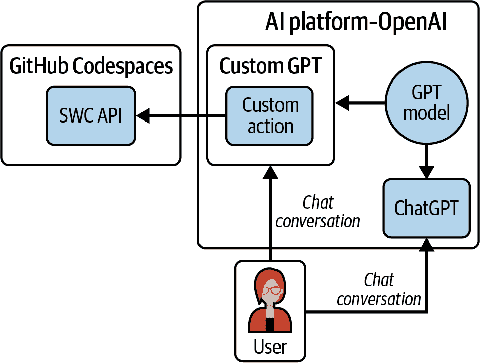
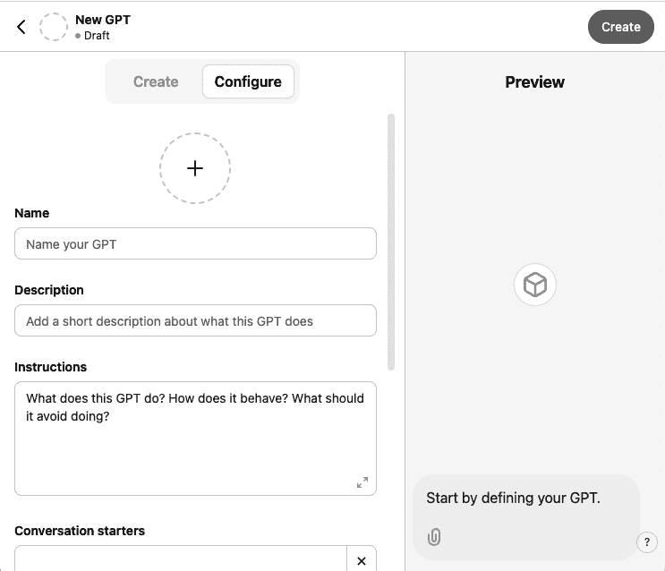
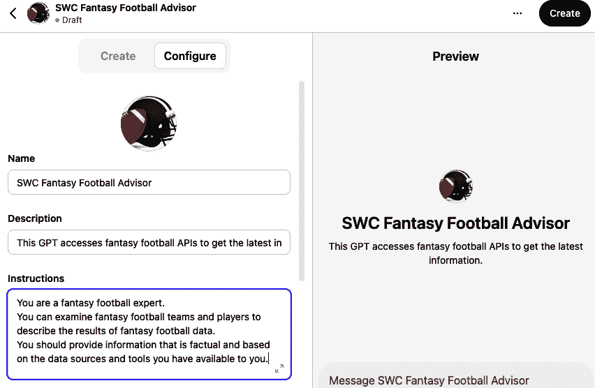
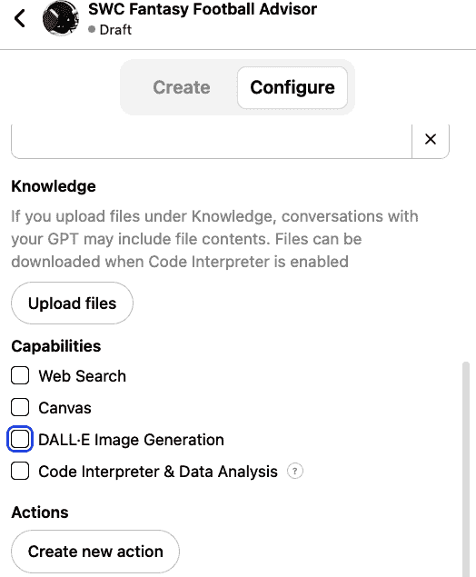
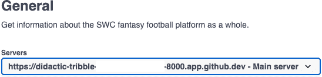
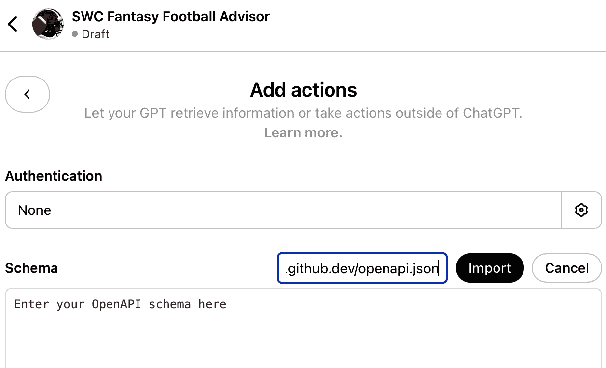
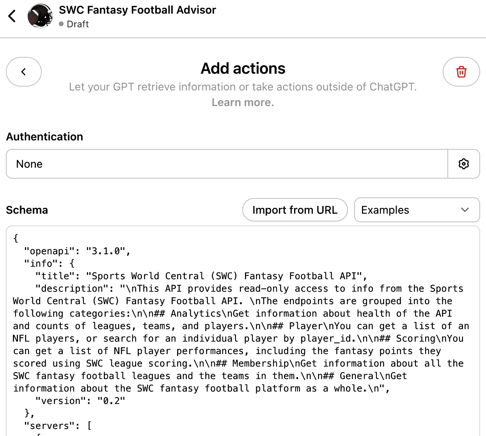
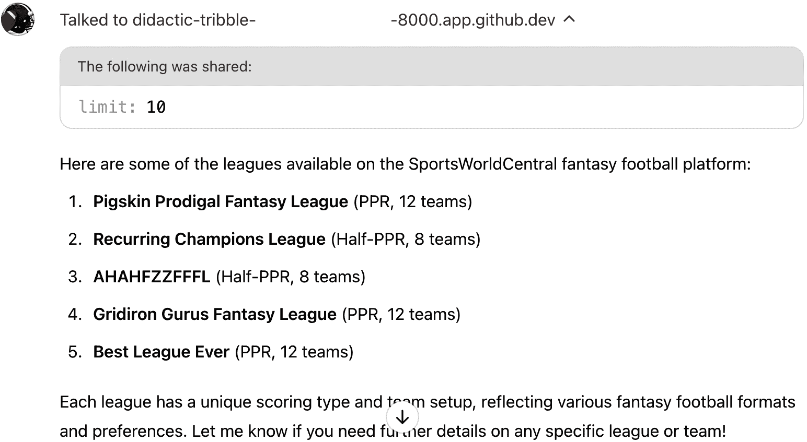

# 第十五章。使用 ChatGPT 调用您的 API

在上一章中，你构建了一个基本的生成式 AI 应用程序，它可以与模型进行自然语言聊天，并从 SportsWorldCentral API 中检索数据。你编写了大量的 Python 代码来完成这项任务。

在本章中，你将使用 OpenAI 的自定义 GPT 来完成这项任务，而无需创建任何除 SportsWorldCentral API 之外的 Python 代码。你可以将自定义 GPT 视为创建一个连接到你的 API 的生成式 AI 应用程序的低代码方法。

# 您的应用程序架构

图 15-1 展示了本章中你将创建的项目的高级架构。

如果你将此图与 图 14-1 进行比较，你会看到一些相似之处。在两种情况下，用户都在使用自然语言聊天来从 SportsWorldCentral API 中检索数据。在两种情况下，都使用了功能调用的 LLM 来与用户聊天并决定何时调用 API 以获取更多信息。尽管你在第十四章中使用了 Anthropic 模型，但你也可以使用本章中将要使用的相同的 OpenAI GPT-4o 模型。

然而，与第十四章的架构也有很大的不同。在第十四章中，需要开发并运行在 GitHub Codespaces 上的许多不同的 Python 组件，而本章中，只有 SportsWorldCentral API 将在那里运行。随着你继续阅读本章，我会分享更多与第十四章的对比。



###### 图 15-1。高级架构

###### 警告

与第十四章中使用的模型一样，你应该了解你所使用模型的局限性和风险。[GPT-4o 系统卡片](https://oreil.ly/v8SNX) 列出了包括虚假信息、暴力言论在内的风险。

# 开始使用 ChatGPT

第一步是注册一个 ChatGPT 用户账户，从 [OpenAI 主页](https://chat.openai.com) 开始。你需要选择一个包含创建 GPT 功能的计划。在撰写本文时，[ChatGPT 定价页面](https://oreil.ly/gptpri) 显示，Plus、Team 和 Enterprise 账户都有这个选项。按照注册说明激活你的账户。一旦注册，登录并导航回 [ChatGPT 主页](https://chat.openai.com)。

###### 小贴士

如果你希望阻止 OpenAI 使用你的聊天记录来训练其模型，你可以通过 [OpenAI 隐私门户](https://oreil.ly/2qLwN) 提出此请求。这样做可以降低你输入到 ChatGPT 或自定义 GPT 中的信息意外显示给其他用户的风险。

# 创建自定义 GPT

要创建你的第一个 GPT，点击你的个人照片并选择“我的 GPT”。你将看到“我的 GPT”页面，如图 图 15-2 所示。


###### 图 15-2\. 我的 GPT 页面

点击创建 GPT。新 GPT 页面将显示，配置选项被选中，如图 图 15-3 所示。



###### 图 15-3\. 创建新的 GPT

带有加号的大按钮用于选择你自定义 GPT 的图片。将公有领域图片下载到你的电脑上，然后点击该按钮。选择上传照片并上传本地文件。你可以在 [*https://oreil.ly/dItdO*](https://oreil.ly/dItdO) 上查看足球和头盔的公有领域图片示例。

要配置 GPT，请填写新 GPT 页面上的选项，如图 图 15-4 所示。



###### 图 15-4\. 新 GPT 信息，第一部分

将页面向下滚动以查看更多选项。在此阶段，请保持对话开始者为空。在功能部分，不要选择任何功能。显示应类似于 图 15-5。



###### 图 15-5\. 新 GPT 信息，第二部分

花一分钟时间看看你的自定义 GPT 能用你目前给出的信息做什么。在预览窗格中，输入以下提示：**`What are the specific league names from the SportsWorldCentral fantasy football platform?`**

执行此任务时获得的响应可能与另一个用户收到的不同。这是因为生成式 AI 响应是非确定性的。（如果你提出的问题太宽泛，你的 GPT 可能会幻想并提供不正确的信息。）图 15-6 展示了一个例子，其中 GPT 表示它没有关于团队名称的具体信息，因为它们不是公开可用的。这是正确的；要获取团队名称，它将需要调用一个 API。


###### 图 15-6\. 自定义 GPT 的提示和响应

这反映了**知识差距**，意味着模型尚未在需要回答你提示的信息上进行训练。为了克服这个知识差距，你需要创建一个自定义操作，使你的 GPT 能够调用 SWC API。

首先，你需要使用公开端点在你的 GitHub Codespaces 中启动你的 API，并将其更新到 OAS 文件中包含服务器 URL。

# 启动您的 GitHub Codespace

你将使用你在 “克隆第三部分存储库” 中创建的 Part III GitHub Codespace 进行工作。如果你还没有创建你的 Part III Codespace，你现在可以完成该部分。

# 在 GitHub Codespaces 中运行 SportsWorldCentral (SWC) API

在你的 Codespace 终端中，使用提供的 *requirements.txt* 文件安装所需的库，如下所示：

```py
.../ai-project (main) $ cd api
.../api (main) $ pip3 install -r requirements.txt
```

按如下所示从命令行启动 API：

```py
.../api (main) $ fastapi run main.py
```

你将看到几条消息，最后一条如下所示：

```py
INFO:     Started server process [19192]
INFO:     Waiting for application startup.
INFO:     Application startup complete.
INFO:     Uvicorn running on http://0.0.0.0:8000 (Press CTRL+C to quit)
```

您将看到一个对话框，显示“您的应用程序正在端口 8000 上运行”，如图 15-7 所示。点击“公开”。


###### 图 15-7\. 使 API 公开

API 现在在 Codespaces 中以公共端口运行。要在浏览器中查看 API，请点击终端中的“端口”，并将鼠标悬停在端口 8000 上（见图 15-8）。


###### 图 15-8\. API 在公共地址上

点击地球图标以在浏览器中打开。如果您收到消息“您即将访问由某人的 codespace 提供的服务器上的开发端口”，请点击继续。

浏览器将打开以*app.github.dev*结尾的 URL，您应该在您的网页浏览器中看到以下健康检查消息：

```py
{"message":"API health check successful"}
```

您的 API 正在云中公开运行。

接下来，您需要捕获您 API 的公共 URL，以便您可以在下一节中使用它。复制地址栏中的 URL 并保存该值。

通过在终端中按 Ctrl-C 停止 API。

# 将服务器部分添加到您的 OAS 文件中

要更新您的 OAS 文件，您需要更新您的 FastAPI 代码。打开*main.py*文件并更新构造函数，使其与以下内容匹配：

```py
app = FastAPI(
    description=api_description,
    title="Sports World Central (SWC) Fantasy Football API",
    version="0.2",
    servers=[
        {"url": "[your base URL from previous step]",
        "description": "Main server"} 
    ]

)
```


引号内的值应该是您在上一步中复制的完整公共 URL。

在代码中添加此部分会导致两个更改，您可以验证：

+   `Servers`部分将被添加到 OAS 文件中。

+   `Servers`部分将被添加到 API 文档中（该文档是从 OAS 文件自动生成的）。

为了验证这些，请在终端中再次启动您的 API：

```py
.../api (main) $ fastapi run main.py
```

通过将*/docs*添加到 URL 中，导航到 API 文档。在常规部分下方，您应该看到一个如图 15-9 所示的服务器选择框。



###### 图 15-9\. 服务器部分添加到 API 文档

要查看 OAS 文件，请点击文档页面顶部的*openapi.json*链接。（您可能需要添加浏览器扩展来格式化 JSON 以便阅读。）在 OAS 文件的`info`部分下方，您应该看到一个看起来如下所示的新`servers`部分：

```py
"servers": [
    {
      "url": "[your base URL]",
      "description": "Main server"
    }
]
```

从浏览器中复制 OAS 文件的完整路径，包括*openapi.json*。您将在下一步中使用它。

# 创建 GPT 动作

如图 15-1 所示，您的自定义 GPT 将包含一个自定义动作。这是调用您的 API 的组件。

在配置标签页的底部，点击“创建新动作”按钮。将显示添加动作页面。将认证条目保留为无，因为您的 API 不需要认证。

点击“导入 URL”，然后粘贴上一步中从您的 OAS 文件复制的完整地址。此时，您的显示应该看起来像图 15-10。



###### 图 15-10\. 导入 OAS 文件

点击导入。模式部分将填充您的 OAS 文件内容，如图 15-11 所示。



###### 图 15-11\. 已填充的 OAS 文件

在 OAS 文件文本下方滚动，您将看到可用操作的列表。图 15-12 显示了列表的顶部。


###### 图 15-12\. 可用操作列表

# 在您的 GPT 中测试 API

您会注意到“可用操作”部分列出了您 OAS 文件中的所有端点。如果您想限制 GPT 只使用 API 中的一部分端点，您可以手动编辑此模式以删除您不希望它使用的任何端点。所有这些端点都是公开只读的，所以您将保留它们在模式中。

要验证您的 API 连接是否设置正确，请点击*v0_health_check*旁边的测试按钮。您的 GPT 将调用 API 的健康检查端点并给出 API 的状态，如图图 15-13 所示。


###### 图 15-13\. GPT 调用健康检查端点

您可以将此操作添加到您的 GPT 中。点击保存按钮。将显示如图 15-14 所示的分享 GPT 对话框。


###### 图 15-14\. 分享 GPT 对话框

选择“仅我”以保持此 GPT 私密。点击保存。

设置保存对话框将显示一个直接链接到 GPT。您现在不需要使用此链接。点击查看 GPT。

# 与您的自定义 GPT 聊天

现在您已经创建了一个自定义 GPT，您将在导航侧边栏中看到它位于 ChatGPT 下方。如图图 15-1 所示，您的 GPT 是 ChatGPT 的一个独立应用程序。现在您的 GPT 有了访问 SWC 幻想足球 API 以获取信息的能力。

在导航中选择 SWC 幻想足球顾问。显示应类似于图 15-15。


###### 图 15-15\. 准备聊天的幻想足球顾问

###### 警告

不要错过此页底部的注释：“ChatGPT 可能会出错。检查重要信息。”需要重申的是，与 GPT 的对话令人印象深刻且相当令人信服，但 OpenAI 明确表示，LLMs 可能会提供不可靠的信息并在其响应中产生幻觉。

一些开发者发现，GPTs [在处理返回大量数据的 API 的统计数据时准确性存在困难](https://oreil.ly/Pncx5)。对于幻想体育来说，风险相对较低。但如果你的使用扩展到对准确性要求更高的任务，不要忽视 OpenAI 明确发布的警告。

通过重复您之前提出的问题开始您的对话：**`SportsWorldCentral Fantasy Football 平台中具体的联赛名称是什么？`**

GPT 会声明它想要调用您的 API 的权限。点击“始终允许”。

GPT 会声明它已经与您的 API 进行了交流。它还会显示它找到了`limit`参数并使用值为 10 来限制结果数量。

然后，它将使用从您的 API 返回的信息来回答问题，如图图 15-16 所示。它通过访问您的 API 数据来克服了知识差距。



###### 图 15-16. API 调用结果

要查看 GPT 做出的 API 调用，请查看您的 Codespace 中的终端输出。您将看到以下 API 调用：

```py
INFO:     10.240.2.131:0 - "GET / HTTP/1.1" 200 OK 
INFO:     10.240.4.161:0 - "GET /v0/leagues/?skip=0&limit=100 HTTP/1.1" 200 OK 
```


这是一个调用 health check 端点的请求。


这是一个调用 get leagues 端点的请求。

在这种情况下，定制的 GPT 做出了正确的选择：它使用健康检查端点来确保 API 可用，并使用 get leagues 端点来查看可用的 SWC 联赛。

恭喜！您已经创建了一个定制的 GPT，并通过自定义操作提供了对您的 API 的访问权限。

花时间并尝试一些能够鼓励代理使用更多您 API 端点的问题。查看终端输出以查看生成的 API 调用。您如何影响它调用哪个 API？您如何指导它使用工具回答更难的问题？您如何使其陷入困境？

# 完成您的第三部分组合项目

您已经完成了第三部分，恭喜！与第一部分和第二部分一样，需要做一些整理工作以使组合项目准备好分享。您将把代码从章节文件夹移到功能文件夹中，然后更新*README.md*。

在进行这些更改之前，您将保存您文件的副本到名为*learning-branch*的单独 GitHub 分支，以便在您想要继续处理代码时仍然可用。

按照以下命令从命令行创建新分支：

```py
.../ai-project/ (main) $ git checkout -b learning-branch 
Switched to a new branch 'learning-branch'
.../ai-project/ (main) $ git push -u origin learning-branch 
 * [new branch]      learning-branch -> learning-branch
branch 'learning-branch' set up to track 'origin/learning-branch'.
```


在本地基于*main*分支创建一个名为*learning-branch*的新分支。


将这个新分支推送到 GitHub.com 上的远程仓库。

接下来，您将对目录结构进行一些更改。输入以下命令：

```py
.../ai-project/ (learning-branch) $ git checkout main 
Switched to branch 'main'
Your branch is up to date with 'origin/main'.
.../ai-project/ (main) $ rm -rf chapter13/complete
.../ai-project/ (main) $ rm -rf chapter14/complete
.../ai-project/ (main) $ mkdir model-training 
.../ai-project/ (main) $ mv chapter13/* model-training 
.../ai-project/ (main) $ mkdir langchain 
.../ai-project/ (main) $ mv chapter14/* langchain 
.../ai-project/ (main) $ rm -rf chapter13 
.../ai-project/ (main) $ rm -rf chapter14
```


将您的 Codespace 切换回仓库的*main*分支。


为第十三章的文件创建一个新的目录。


将第十三章的文件移动到新文件夹中。


为第十四章的文件创建一个新的目录。


将第十四章的文件移动到新文件夹。


删除所有子目录及其文件。

要查看完成项目的目录结构，请运行以下命令：

```py
.../ai-project (main) $ tree -d  --prune -I 'build|*.egg-info|__pycache__'
.
├── api
├── langchain
└── model-training

3 directories
```

现在更新 *README.md* 文件以展示你的工作。这是一个开始，然后你可以添加你自己的想法：

```py
# AI Portfolio Project
This repository contains program using industry-standard Python frameworks,
based on projects from the book _Hands-on APIs for AI and Data Science_
written by Ryan Day.
```

现在将这些更改提交到 GitHub，你的第三部分项目组合就准备好与世界分享了。恭喜你完成第三部分的项目！

# 摘要

在本章中，你使用了 OpenAI 的 ChatGPT 与你的 API 进行交互：

+   你创建了一个自定义 GPT。

+   你创建了一个自定义操作，以便你的 GPT 可以访问 SWC API。

+   你更新了你的第三部分项目组合的内容。
