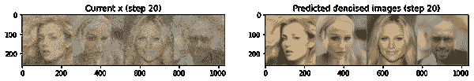
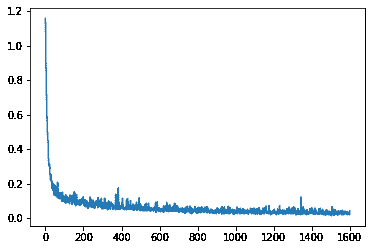

# 第一章。扩散模型

在 2020 年末，一个名为扩散模型的鲜为人知的模型类别开始在机器学习领域引起轰动。研究人员找出了如何使用这些模型生成比以前技术产生的合成图像质量更高的图像。随后出现了一系列论文，提出了改进和修改，进一步提高了质量。到 2021 年底，出现了像 GLIDE 这样的模型，展示了在文本到图像任务上令人难以置信的结果，几个月后，这些模型已经进入了主流，如 DALL-E 2 和 Stable Diffusion 等工具，使任何人都可以通过输入所需看到的文本描述来生成图像。

在本章中，我们将深入了解这些模型的工作原理。我们将概述使它们如此强大的关键见解，使用现有模型生成图像，以了解它们的工作方式，然后训练我们自己的模型，以进一步加深对此的理解。该领域仍在快速发展，但本章涵盖的主题应该为您打下坚实的基础。第五章将通过一个名为 Stable Diffusion 的模型，探索更高级的技术，第六章将探讨这些技术在简单图像生成之外的应用。

# 关键见解：迭代细化

那么，是什么使扩散模型如此强大呢？先前的技术，如 VAEs 或 GANs，通过模型的单次前向传递生成最终输出。这意味着模型必须在第一次尝试时就做到一切正确。如果它犯了一个错误，就无法返回并修复它。另一方面，扩散模型通过迭代多个步骤生成其输出。这种“迭代细化”允许模型纠正之前步骤中的错误，并逐渐改进输出。为了说明这一点，让我们看一个扩散模型的示例。

我们可以使用 Hugging Face 扩散器库加载预训练模型。该管道可用于直接创建图像，但这并不能显示出底层发生了什么：

```py
# Load the pipeline
image_pipe = DDPMPipeline.from_pretrained("google/ddpm-celebahq-256")
image_pipe.to(device);

# Sample an image
image_pipe().images[0]
```


我们可以逐步重新创建采样过程，以更好地了解模型生成图像时发生了什么。我们使用随机噪声初始化我们的样本 x，然后通过模型运行 30 步。在右侧，您可以看到模型对特定步骤的最终图像预测-请注意，最初的预测并不特别好！我们不是直接跳到最终预测的图像，而是只在预测的方向上稍微修改 x（显示在左侧）。然后，我们再次将这个新的、稍微更好的 x 通过模型进行下一步的处理，希望能产生稍微改进的预测，这可以用来进一步更新 x，依此类推。经过足够的步骤，模型可以生成一些令人印象深刻的逼真图像。

```py
# The random starting point for a batch of 4 images
x = torch.randn(4, 3, 256, 256).to(device)

# Set the number of timesteps lower
image_pipe.scheduler.set_timesteps(num_inference_steps=30)

# Loop through the sampling timesteps
for i, t in enumerate(image_pipe.scheduler.timesteps):

    # Get the prediction given the current sample x and the timestep t
    with torch.no_grad():
        noise_pred = image_pipe.unet(x, t)["sample"]

    # Calculate what the updated sample should look like with the scheduler
    scheduler_output = image_pipe.scheduler.step(noise_pred, t, x)

    # Update x
    x = scheduler_output.prev_sample

    # Occasionally display both x and the predicted denoised images
    if i % 10 == 0 or i == len(image_pipe.scheduler.timesteps) - 1:
        fig, axs = plt.subplots(1, 2, figsize=(12, 5))

        grid = torchvision.utils.make_grid(x, nrow=4).permute(1, 2, 0)
        axs[0].imshow(grid.cpu().clip(-1, 1) * 0.5 + 0.5)
        axs[0].set_title(f"Current x (step {i})")

        pred_x0 = scheduler_output.pred_original_sample
        grid = torchvision.utils.make_grid(pred_x0, nrow=4).permute(1, 2, 0)
        axs[1].imshow(grid.cpu().clip(-1, 1) * 0.5 + 0.5)
        axs[1].set_title(f"Predicted denoised images (step {i})")
        plt.show()
```





###### 注意

如果那段代码看起来有点吓人-我们将在本章中解释这一切是如何工作的。现在，只需专注于结果。

学习如何逐渐改进“损坏”的输入的核心思想可以应用于广泛的任务范围。在本章中，我们将专注于无条件图像生成-也就是说，生成类似训练数据的图像，而不对这些生成的样本的外观进行额外的控制。扩散模型也已应用于音频、视频、文本等。虽然大多数实现使用我们将在这里介绍的某种“去噪”方法的变体，但正在出现利用不同类型的“损坏”以及迭代细化的新方法，这可能会使该领域超越目前专注于去噪扩散的焦点。令人兴奋的时刻！

# 训练扩散模型

在本节中，我们将从头开始训练一个扩散模型，以更好地了解它们的工作原理。我们将首先使用 Hugging Face diffusers 库中的组件。随着本章的进行，我们将逐渐揭开每个组件的工作原理。与其他类型的生成模型相比，训练扩散模型相对简单。我们反复进行：

+   从训练数据中加载一些图像。

+   以不同的量添加噪音。记住，我们希望模型能够很好地估计如何“修复”（去噪）极其嘈杂的图像和接近完美的图像。

+   将输入的嘈杂版本馈送到模型中。

+   评估模型在去噪这些输入时的表现。

+   使用这些信息来更新模型权重。

要使用经过训练的模型生成新图像，我们从完全随机的输入开始，并通过模型重复地将其馈送到模型中，在每次迭代中根据模型预测更新输入的小量。正如我们将看到的，有许多采样方法试图简化这个过程，以便我们可以尽可能少的步骤生成好的图像。

## 数据

对于这个例子，我们将使用来自 Hugging Face Hub 的图像数据集-具体来说，[这个包含 1000 张蝴蝶图片的集合](https://huggingface.co/datasets/huggan/smithsonian_butterflies_subset)。在项目部分，您将看到如何使用自己的数据。

```py
dataset = load_dataset("huggan/smithsonian_butterflies_subset", split="train")
```

在使用这些数据训练模型之前，我们需要做一些准备。图像通常表示为一个“像素”网格，每个像素有三个颜色通道（红色、绿色和蓝色）的颜色值在 0 到 255 之间。为了处理这些图像并使它们准备好进行训练，我们需要： - 将它们调整为固定大小 - （可选）通过随机水平翻转来添加一些增强，有效地使我们的数据集大小加倍 - 将它们转换为 PyTorch 张量（表示颜色值为 0 到 1 之间的浮点数） - 将它们标准化为具有均值为 0 的值，值在-1 到 1 之间

我们可以使用`torchvision.transforms`来完成所有这些操作：

```py
image_size = 64

# Define data augmentations
preprocess = transforms.Compose(
    [
        transforms.Resize((image_size, image_size)),  # Resize
        transforms.RandomHorizontalFlip(),  # Randomly flip (data augmentation)
        transforms.ToTensor(),  # Convert to tensor (0, 1)
        transforms.Normalize([0.5], [0.5]),  # Map to (-1, 1)
    ]
)
```

接下来，我们需要创建一个数据加载器，以便加载应用了这些转换的数据批次：

```py
batch_size = 32

def transform(examples):
    images = [preprocess(image.convert("RGB")) for image in examples["image"]]
    return {"images": images}

dataset.set_transform(transform)

train_dataloader = torch.utils.data.DataLoader(
    dataset, batch_size=batch_size, shuffle=True
)
```

我们可以通过加载单个批次并检查图像来检查这是否有效。

```py
batch = next(iter(train_dataloader))
print('Shape:', batch['images'].shape,
      '\nBounds:', batch['images'].min().item(), 'to', batch['images'].max().item())
show_images(batch['images'][:8]*0.5 + 0.5) # NB: we map back to (0, 1) for display
```

```py
Shape: torch.Size([32, 3, 64, 64])
Bounds: -0.9921568632125854 to 1.0
```


## 添加噪音

我们如何逐渐破坏我们的数据？最常见的方法是向图像添加噪音。我们添加的噪音量由噪音时间表控制。不同的论文和方法以不同的方式处理这个问题，我们将在本章后面进行探讨。现在，让我们看看一种常见的方法，基于 Ho 等人的论文“去噪扩散概率模型”。在扩散器库中，添加噪音是由称为调度器的东西处理的，它接收一批图像和一个“时间步长”列表，并确定如何创建这些图像的嘈杂版本：

```py
scheduler = DDPMScheduler(num_train_timesteps=1000, beta_start=0.001, beta_end=0.02)
timesteps = torch.linspace(0, 999, 8).long()

x = batch['images'][:8]
noise = torch.rand_like(x)
noised_x = scheduler.add_noise(x, noise, timesteps)
show_images((noised_x*0.5 + 0.5).clip(0, 1))
```


在训练过程中，我们将随机选择时间步长。调度器接收一些参数（beta_start 和 beta_end），它用这些参数来确定给定时间步长应该存在多少噪音。我们将在第 X 节中更详细地介绍调度器。

## UNet

UNet 是一种卷积神经网络，用于诸如图像分割之类的任务，其中期望的输出与输入具有相同的空间范围。它由一系列“下采样”层组成，用于减小输入的空间大小，然后是一系列“上采样”层，用于再次增加输入的空间范围。下采样层通常也后面跟着一个“跳跃连接”，将下采样层的输出连接到上采样层的输入。这允许上采样层“看到”网络早期的高分辨率表示，这对于具有图像样式输出的任务特别有用，其中这些高分辨率信息尤为重要。

扩散库中使用的 UNet 架构比 2015 年 Ronneberger 等人提出的[原始 UNet](https://arxiv.org/abs/1505.04597)更先进，增加了注意力和残差块等功能。我们稍后会更仔细地看一下，但这里的关键特点是它可以接受一个输入（嘈杂的图像）并产生一个形状相同的预测（预测的噪音）。对于扩散模型，UNet 通常还接受时间步作为额外的条件，我们将在 UNet 深入探讨部分再次探讨这一点。

这是我们如何创建一个 UNet 并将我们的一批嘈杂图像输入其中的方法：

```py
# Create a UNet2DModel
model = UNet2DModel(
    in_channels=3,  # 3 channels for RGB images
    sample_size=64,  # Specify our input size
    block_out_channels=(64, 128, 256, 512), # N channels per layer
    down_block_types=("DownBlock2D", "DownBlock2D",
                      "AttnDownBlock2D", "AttnDownBlock2D"),
    up_block_types=("AttnUpBlock2D", "AttnUpBlock2D",
                    "UpBlock2D", "UpBlock2D"),
)

# Pass a batch of data through
with torch.no_grad():
    out = model(noised_x, timestep=timesteps).sample
out.shape
```

```py
torch.Size([8, 3, 64, 64])
```

注意输出与输入的形状相同，这正是我们想要的。

## 训练

现在我们的模型和数据准备好了，我们可以开始训练。我们将使用学习率为 3e-4 的 AdamW 优化器。对于每个训练步骤，我们：

+   加载一批图像。

+   向图像添加噪音，选择随机时间步来确定添加多少噪音。

+   将嘈杂图像输入模型。

+   计算损失，即模型预测与目标之间的均方误差 - 在这种情况下是我们添加到图像中的*噪音*。这被称为噪音或“epsilon”目标。您可以在第 X 节中找到有关不同训练目标的更多信息。

+   反向传播损失并使用优化器更新模型权重。

在代码中，所有这些看起来是这样的：

```py
num_epochs = 50 # How many runs through the data should we do?
lr = 1e-4 # What learning rate should we use
model = model.to(device) # The model we're training (defined in the previous section)
optimizer = torch.optim.AdamW(model.parameters(), lr=lr) # The optimizer
losses = [] # somewhere to store the loss values for later plotting

# Train the model (this takes a while!)
for epoch in range(num_epochs):
    for step, batch in enumerate(train_dataloader):

        # Load the input images
        clean_images = batch["images"].to(device)

        # Sample noise to add to the images
        noise = torch.randn(clean_images.shape).to(clean_images.device)

        # Sample a random timestep for each image
        timesteps = torch.randint(
            0,
            scheduler.num_train_timesteps,
            (clean_images.shape[0],),
            device=clean_images.device,
        ).long()

        # Add noise to the clean images according timestep
        noisy_images = scheduler.add_noise(clean_images, noise, timesteps)

        # Get the model prediction for the noise
        noise_pred = model(noisy_images, timesteps, return_dict=False)[0]

        # Compare the prediction with the actual noise:
        loss = F.mse_loss(noise_pred, noise)

        # Store the loss for later plotting
        losses.append(loss.item())

        # Update the model parameters with the optimizer based on this loss
        loss.backward(loss)
        optimizer.step()
        optimizer.zero_grad()
```

在 GPU 上运行上述代码大约需要一个小时，所以在等待时喝杯茶或者减少时代的数量。训练后损失曲线如下所示：

```py
# Plot the loss curve:
plt.plot(losses);
```



随着模型学习去噪图像，损失曲线呈下降趋势。由于根据每次迭代中随机时间步的随机抽样向图像添加不同数量的噪音，曲线相当嘈杂。仅通过观察噪音预测的均方误差很难判断这个模型是否能够很好地生成样本，所以让我们继续下一节，看看它的表现如何。

## 采样

扩散库使用了“管道”的概念，将生成扩散模型样本所需的所有组件捆绑在一起：

```py
pipeline = DDPMPipeline(unet=model, scheduler=scheduler)
ims = pipeline(batch_size=4).images
show_images(ims, nrows=1)
```


当然，将创建样本的工作交给管道并不能真正展示出我们正在进行的工作。因此，这里有一个简单的采样循环，展示了模型如何逐渐改进输入图像：

```py
# Random starting point (4 random images):
sample = torch.randn(4, 3, 64, 64).to(device)

for i, t in enumerate(scheduler.timesteps):

    # Get model pred
    with torch.no_grad():
        noise_pred = model(sample, t).sample

    # Update sample with step
    sample = scheduler.step(noise_pred, t, sample).prev_sample

show_images(sample.clip(-1, 1)*0.5 + 0.5, nrows=1)
```


这与我们在本章开头使用的代码相同，用来说明迭代改进的概念，但希望现在你对这里发生的事情有了更好的理解。我们从一个完全随机的输入开始，然后在一系列步骤中由模型进行改进。每一步都是对输入的小更新，基于模型对该时间步的噪音的预测。我们仍然在`pipeline.scheduler.step()`的调用背后抽象了一些复杂性 - 在后面的章节中，我们将更深入地探讨不同的采样方法以及它们的工作原理。

## 评估

可以使用 FID 分数（Fréchet Inception Distance）来评估生成模型的性能。FID 分数通过比较从预训练的神经网络中提取的特征图之间的统计数据，衡量生成样本与真实样本的相似程度。分数越低，给定模型生成的图像的质量和逼真度就越好。FID 分数因其能够提供对不同类型生成网络的“客观”比较指标而受到欢迎，而无需依赖人类判断。

尽管 FID 分数很方便，但也有一些重要的注意事项需要注意：

+   给定模型的 FID 分数取决于用于计算它的样本数量，因此在模型之间进行比较时，我们需要确保报告的分数都是使用相同数量的样本计算的。通常做法是在这个目的上使用 50,000 个样本，尽管为了节省时间，您可能在开发过程中评估较少数量的样本，只有在准备发布结果时才进行完整评估。

+   在计算 FID 时，图像被调整为 299 像素的正方形图像。这使得它对于极低分辨率或高分辨率图像的度量变得不太有用。不同的深度学习框架处理调整大小的方式也有细微差异，这可能导致 FID 分数有小的差异！我们建议使用`clean-fid`这样的库来标准化 FID 计算。

+   用作 FID 特征提取器的网络通常是在 Imagenet 分类任务上训练的模型。在生成不同领域的图像时，这个模型学到的特征可能不太有用。更准确的方法是在特定领域的数据上训练一个分类网络，但这会使得在不同论文和方法之间比较分数变得更加困难，所以目前 Imagenet 模型是标准选择。

+   如果您保存生成的样本以供以后评估，格式和压缩也会影响 FID 分数。尽量避免低质量的 JPEG 图像。

即使考虑了所有这些警告，FID 分数只是质量的粗略度量，不能完美地捕捉使图像看起来更“真实”的微妙之处。因此，用它们来了解一个模型相对于另一个模型的表现，但也要看看每个模型生成的实际图像，以更好地了解它们的比较。人类偏好仍然是质量的黄金标准，最终这是一个相当主观的领域！

# 深入：噪音时间表

在上面的训练示例中，其中一步是“添加不同数量的噪音”。我们通过在 0 到 1000 之间选择一个随机时间步长来实现这一点，然后依靠调度程序添加适当数量的噪音。同样，在采样过程中，我们再次依靠调度程序告诉我们使用哪些时间步长以及如何根据模型预测从一个时间步长移动到下一个时间步长。事实证明，选择添加多少噪音是一个重要的设计决策，可以极大地影响给定模型的性能。在本节中，我们将看到为什么会这样，并探讨实践中使用的一些不同方法。

## 为什么要添加噪音？

在本章的开头，我们说扩散模型背后的关键思想是迭代改进。在训练期间，我们通过不同的方式“腐败”输入。在推断期间，我们从“最大程度上腐败”的输入开始，迭代地“去腐败”它，希望最终得到一个不错的最终结果。

到目前为止，我们已经专注于一种特定的“腐败”：添加高斯噪声。这样做的一个原因是扩散模型的理论基础 - 如果我们使用不同的腐败方法，我们在技术上就不再做“扩散”了！然而，Bansal 等人的一篇题为[*Cold Diffusion*](https://arxiv.org/abs/2208.09392)的论文戏剧性地表明，我们不一定需要仅仅出于理论上的便利而限制自己使用这种方法。他们表明，类似扩散模型的方法适用于许多不同的“腐败”方法（见图 1-1）。最近，像[MUSE](https://arxiv.org/abs/2301.00704)、[MaskGIT](https://arxiv.org/abs/2202.04200)和[PAELLA](https://arxiv.org/abs/2211.07292)这样的模型已经使用了随机标记屏蔽或替换作为等效的“腐败”方法，用于量化数据 - 也就是说，用离散标记而不是连续值表示的数据。


###### 图 1-1。Cold Diffusion Paper 中使用的不同退化的示意图

尽管如此，出于几个原因，添加噪音仍然是最受欢迎的方法：

+   我们可以轻松控制添加的噪音量，从“完美”到“完全损坏”平稳过渡。这对于像减少图像分辨率这样的事情并不适用，这可能会导致“离散”的过渡。

+   我们可以有许多有效的随机起始点进行推断，不像一些方法可能只有有限数量的可能的初始（完全损坏）状态，比如完全黑色的图像或单像素图像。

所以，至少目前，我们将坚持添加噪音作为我们的损坏方法。接下来，让我们更仔细地看看如何向图像添加噪音。

## 开始简单

我们有一些图像（x），我们想以某种方式将它们与一些随机噪音结合起来。

```py
x = next(iter(train_dataloader))['images'][:8]
noise = torch.rand_like(x)
```

我们可以线性插值（lerp）它们之间的一些量。这给我们一个函数，它在“量”从 0 到 1 变化时，从原始图像 x 平稳过渡到纯噪音：

```py
def corrupt(x, noise, amount):
  amount = amount.view(-1, 1, 1, 1) # make sure it's broadcastable
  return x*(1-amount) + noise*amount
```

让我们在一批数据上看看这个过程，噪音的量从 0 到 1 变化：

```py
amount = torch.linspace(0, 1, 8)
noised_x = corrupt(x, noise, amount)
show_images(noised_x*0.5 + 0.5)
```


这似乎正是我们想要的，从原始图像平稳过渡到纯噪音。现在，我们在这里创建了一个噪音时间表，它接受从 0 到 1 的“量”值。这被称为“连续时间”方法，我们在时间尺度上表示从 0 到 1 的完整路径。其他方法使用离散时间方法，使用一些大整数的“时间步长”来定义噪音调度器。我们可以将我们的函数封装成一个类，将连续时间转换为离散时间步长，并适当添加噪音：

```py
class SimpleScheduler():
  def __init__(self):
    self.num_train_timesteps = 1000
  def add_noise(self, x, noise, timesteps):
    amount = timesteps / self.num_train_timesteps
    return corrupt(x, noise, amount)

scheduler = SimpleScheduler()
timesteps = torch.linspace(0, 999, 8).long()
noised_x = scheduler.add_noise(x, noise, timesteps)
show_images(noised_x*0.5 + 0.5)
```


现在我们有了一些可以直接与扩散库中使用的调度器进行比较的东西，比如我们在训练中使用的 DDPMScheduler。让我们看看它是如何比较的：

```py
scheduler = DDPMScheduler(beta_end=0.01)
timesteps = torch.linspace(0, 999, 8).long()
noised_x = scheduler.add_noise(x, noise, timesteps)
show_images((noised_x*0.5 + 0.5).clip(0, 1))
```


## 数学

文献中有许多竞争的符号和方法。例如，一些论文将噪音时间表参数化为“连续时间”，其中 t 从 0（无噪音）到 1（完全损坏）- 就像我们在上一节中的`corrupt`函数一样。其他人使用“离散时间”方法，其中整数时间步长从 0 到某个大数 T，通常为 1000。可以像我们的`SimpleScheduler`类一样在这两种方法之间进行转换-只需确保在比较不同模型时保持一致。我们将在这里坚持使用离散时间方法。

深入研究数学的一个很好的起点是之前提到的 DDPM 论文。您可以在这里找到[注释实现](https://huggingface.co/blog/annotated-diffusion)，这是一个很好的额外资源，可以帮助理解这种方法。

论文开始时指定了从时间步 t-1 到时间步 t 的单个噪音步骤。这是他们的写法：

<math display="block"><mrow><mi>q</mi> <mrow><mo>(</mo> <msub><mi>𝐱</mi> <mi>t</mi></msub> <mo>|</mo> <msub><mi>𝐱</mi> <mrow><mi>t</mi><mo>-</mo><mn>1</mn></mrow></msub> <mo>)</mo></mrow> <mo>=</mo> <mi>𝒩</mi> <mrow><mo>(</mo> <msub><mi>𝐱</mi> <mi>t</mi></msub> <mo>;</mo> <msqrt><mrow><mn>1</mn> <mo>-</mo> <msub><mi>β</mi> <mi>t</mi></msub></mrow></msqrt> <msub><mi>𝐱</mi> <mrow><mi>t</mi><mo>-</mo><mn>1</mn></mrow></msub> <mo>,</mo> <msub><mi>β</mi> <mi>t</mi></msub> <mi>𝐈</mi> <mo>)</mo></mrow> <mo>.</mo></mrow></math>

这里<math alttext="beta Subscript t"><msub><mi>β</mi> <mi>t</mi></msub></math>被定义为所有时间步长 t，并用于指定每个步骤添加多少噪声。这种符号可能有点令人生畏，但这个方程告诉我们的是，更嘈杂的<math alttext="bold x Subscript t"><msub><mi>𝐱</mi> <mi>t</mi></msub></math>是一个*分布*，其均值为<math alttext="StartRoot 1 minus beta Subscript t Baseline EndRoot bold x Subscript t minus 1"><mrow><msqrt><mrow><mn>1</mn> <mo>-</mo> <msub><mi>β</mi> <mi>t</mi></msub></mrow></msqrt> <msub><mi>𝐱</mi> <mrow><mi>t</mi><mo>-</mo><mn>1</mn></mrow></msub></mrow></math>，方差为<math alttext="beta Subscript t"><msub><mi>β</mi> <mi>t</mi></msub></math>。换句话说，<math alttext="bold x Subscript t"><msub><mi>𝐱</mi> <mi>t</mi></msub></math>是<math alttext="bold x Subscript t minus 1"><msub><mi>𝐱</mi> <mrow><mi>t</mi><mo>-</mo><mn>1</mn></mrow></msub></math>（按<math alttext="StartRoot 1 minus beta Subscript t Baseline EndRoot"><msqrt><mrow><mn>1</mn> <mo>-</mo> <msub><mi>β</mi> <mi>t</mi></msub></mrow></msqrt></math>缩放）和一些随机噪声的混合，我们可以将其视为按<math alttext="StartRoot beta Subscript t Baseline EndRoot"><msqrt><msub><mi>β</mi> <mi>t</mi></msub></msqrt></math>缩放的单位方差噪声。给定<math alttext="x Subscript t minus 1"><msub><mi>x</mi> <mrow><mi>t</mi><mo>-</mo><mn>1</mn></mrow></msub></math>和一些噪声<math alttext="epsilon"><mi>ϵ</mi></math>，我们可以从这个分布中采样得到<math alttext="x Subscript t"><msub><mi>x</mi> <mi>t</mi></msub></math>：

<math><mrow><msub><mi>𝐱</mi> <mi>t</mi></msub> <mo>=</mo> <msqrt><mrow><mn>1</mn> <mo>-</mo> <msub><mi>β</mi> <mi>t</mi></msub></mrow></msqrt> <msub><mi>𝐱</mi> <mrow><mi>t</mi><mo>-</mo><mn>1</mn></mrow></msub> <mo>+</mo> <msqrt><msub><mi>β</mi> <mi>t</mi></msub></msqrt> <mi>ϵ</mi></mrow></math>

要在时间步 t 获得嘈杂的输入，我们可以从 t=0 开始，并反复应用这一步，但这将非常低效。相反，我们可以找到一个公式一次性移动到任何时间步 t。我们定义<math alttext="alpha Subscript t Baseline equals 1 minus beta Subscript t"><mrow><msub><mi>α</mi> <mi>t</mi></msub> <mo>=</mo> <mn>1</mn> <mo>-</mo> <msub><mi>β</mi> <mi>t</mi></msub></mrow></math>，然后使用以下公式：

<math><mrow><msub><mi>x</mi> <mi>t</mi></msub> <mo>=</mo> <msqrt><msub><mover accent="true"><mi>α</mi> <mo>¯</mo></mover> <mi>t</mi></msub></msqrt> <msub><mi>x</mi> <mn>0</mn></msub> <mo>+</mo> <msqrt><mrow><mn>1</mn> <mo>-</mo> <msub><mover accent="true"><mi>α</mi> <mo>¯</mo></mover> <mi>t</mi></msub></mrow></msqrt> <mi>ϵ</mi></mrow></math>

在这里 - <math alttext="epsilon"><mi>ϵ</mi></math> 是一些方差为单位的高斯噪声 - <math alttext="alpha overbar"><mover accent="true"><mi>α</mi> <mo>¯</mo></mover></math>（'alpha_bar'）是直到时间<math alttext="t"><mi>t</mi></math>的所有<math alttext="alpha"><mi>α</mi></math>值的累积乘积。

因此，<math alttext="x Subscript t"><msub><mi>x</mi> <mi>t</mi></msub></math>是<math alttext="x 0"><msub><mi>x</mi> <mn>0</mn></msub></math>（由<math alttext="StartRoot alpha overbar Subscript t Baseline EndRoot"><msqrt><msub><mover accent="true"><mi>α</mi> <mo>¯</mo></mover> <mi>t</mi></msub></msqrt></math>缩放）和<math alttext="epsilon"><mi>ϵ</mi></math>（由<math alttext="StartRoot 1 minus alpha overbar Subscript t Baseline EndRoot"><msqrt><mrow><mn>1</mn> <mo>-</mo> <msub><mover accent="true"><mi>α</mi> <mo>¯</mo></mover> <mi>t</mi></msub></mrow></msqrt></math>缩放）的混合物。在 diffusers 库中，<math alttext="alpha overbar"><mover accent="true"><mi>α</mi> <mo>¯</mo></mover></math>值存储在`scheduler.alphas_cumprod`中。知道这一点，我们可以绘制给定调度程序的不同时间步骤中原始图像<math alttext="x 0"><msub><mi>x</mi> <mn>0</mn></msub></math>和噪音<math alttext="epsilon"><mi>ϵ</mi></math>的缩放因子：

```py
plot_scheduler(DDPMScheduler()) # The default scheduler
```


我们上面的 SimpleScheduler 只是在原始图像和噪音之间线性混合，我们可以看到如果我们绘制缩放因子（相当于<math alttext="StartRoot alpha overbar Subscript t Baseline EndRoot"><msqrt><msub><mover accent="true"><mi>α</mi> <mo>¯</mo></mover> <mi>t</mi></msub></msqrt></math>和<math alttext="StartRoot left-parenthesis 1 minus alpha overbar Subscript t Baseline right-parenthesis EndRoot"><msqrt><mrow><mo>(</mo> <mn>1</mn> <mo>-</mo> <msub><mover accent="true"><mi>α</mi> <mo>¯</mo></mover> <mi>t</mi></msub> <mo>)</mo></mrow></msqrt></math>在 DDPM 情况下）：

```py
plot_scheduler(SimpleScheduler())
```


一个良好的噪音调度将确保模型看到不同噪音水平的图像混合。最佳选择将根据训练数据而异。可视化一些更多选项，注意：

+   将 beta_end 设置得太低意味着我们永远不会完全擦除图像，因此模型永远不会看到任何类似于用作推理起点的随机噪音的东西。

+   将 beta_end 设置得非常高意味着大多数时间步骤都花在几乎完全的噪音上，这将导致训练性能不佳。

+   不同的 beta 调度给出不同的曲线。

“余弦”调度是一个受欢迎的选择，因为它可以使原始图像平稳过渡到噪音。

```py
fig, (ax) = plt.subplots(1, 1, figsize=(8, 5))
plot_scheduler(DDPMScheduler(beta_schedule="linear"),
               label = 'default schedule', ax=ax, plot_both=False)
plot_scheduler(DDPMScheduler(beta_schedule="squaredcos_cap_v2"),
               label = 'cosine schedule', ax=ax, plot_both=False)
plot_scheduler(DDPMScheduler(beta_end=0.003, beta_schedule="linear"),
               label = 'Low beta_end', ax=ax, plot_both=False)
plot_scheduler(DDPMScheduler(beta_end=0.1, beta_schedule="linear"),
               label = 'High beta_end', ax=ax, plot_both=False)
```


###### 注意

这里显示的所有调度都被称为“方差保持”（VP），这意味着模型输入的方差在整个调度过程中保持接近 1。您可能还会遇到“方差爆炸”（VE）公式，其中噪音只是以不同的量添加到原始图像（导致高方差输入）。我们将在采样章节中更详细地讨论这一点。我们的 SimpleScheduler 几乎是一个 VP 调度，但由于线性插值，方差并没有完全保持。

与许多与扩散相关的主题一样，不断有新的论文探讨噪音调度的主题，因此当您阅读本文时，可能会有大量的选项可供尝试！

## 输入分辨率和缩放的影响

直到最近，噪音调度的一个方面大多被忽视，即输入大小和缩放的影响。许多论文在小规模数据集和低分辨率上测试潜在的调度程序，然后使用表现最佳的调度程序来训练其最终模型的较大图像。这样做的问题在于，如果我们向两个不同大小的图像添加相同数量的噪音，就会看到问题。


###### 图 1-2。比较向不同大小的图像添加噪音的效果

高分辨率的图像往往包含大量冗余信息。这意味着即使单个像素被噪音遮挡，周围的像素也包含足够的信息来重建原始图像。但对于低分辨率图像来说并非如此，其中单个像素可能包含大量信息。这意味着向低分辨率图像添加相同量的噪音将导致比向高分辨率图像添加等量噪音更加损坏的图像。

这种效应在两篇独立的论文中得到了彻底的调查，这两篇论文分别于 2023 年 1 月发表。每篇论文都利用新的见解来训练能够生成高分辨率输出的模型，而无需任何以前必需的技巧。Hoogeboom 等人的《简单扩散》介绍了一种根据输入大小调整噪音计划的方法，允许在低分辨率图像上优化的计划适当地修改为新的目标分辨率。陈婷的一篇名为“关于扩散模型噪音调度的重要性”的论文进行了类似的实验，并注意到另一个关键变量：输入缩放。也就是说，我们如何表示我们的图像？如果图像表示为 0 到 1 之间的浮点数，那么它们的方差将低于噪音（通常是单位方差），因此对于给定的噪音水平，信噪比将低于如果图像表示为-1 到 1 之间的浮点数（我们在上面的训练示例中使用的方式）或其他方式。缩放输入图像会改变信噪比，因此修改这种缩放是我们在训练更大图像时可以调整的另一种方式。

# 深入了解：UNets 和替代方案

现在让我们来讨论真正进行重要预测的模型！回顾一下，这个模型必须能够接收嘈杂的图像并估计如何去除噪音。这需要一个能够接收任意大小的图像并输出相同大小的图像的模型。此外，该模型应能够在像素级别进行精确预测，同时也捕捉关于整个图像的更高级别信息。一个流行的方法是使用一种称为 UNet 的架构。UNet 是在 2015 年为医学图像分割而发明的，并且后来成为各种与图像相关的任务的流行选择。就像我们在上一章中看到的 AutoEncoders 和 VAEs 一样，UNets 由一系列“下采样”和“上采样”块组成。下采样块负责减小图像的大小，而上采样块负责增加图像的大小。下采样块通常由一系列卷积层组成，然后是池化或下采样层。上采样块通常由一系列卷积层组成，然后是上采样或“转置卷积”层。转置卷积层是一种特殊类型的卷积层，它增加图像的大小，而不是减小图像的大小。

常规的 AutoEncoder 或 VAE 之所以不适合这个任务，是因为它们在像素级别进行精确预测的能力较弱，因为输出必须完全从低维潜在空间重新构建。在 UNet 中，通过“跳跃连接”连接下采样和上采样块，允许信息直接从下采样块流向上采样块。这使得模型能够在像素级别进行精确预测，同时也捕捉关于整个图像的更高级别信息。

## 一个简单的 UNet

为了更好地理解 UNet 的结构，让我们从头开始构建一个简单的 UNet。


###### 图 1-3。我们简单的 UNet 架构

这个 UNet 以 32px 分辨率接收单通道输入，并以 32px 分辨率输出单通道输出，我们可以用它来构建 MNIST 数据集的扩散模型。编码路径中有三层，解码路径中也有三层。每一层由卷积后跟激活函数和上采样或下采样步骤（取决于我们是否在编码或解码路径中）组成。跳过连接允许信息直接从下采样块流向上采样块，并通过将下采样块的输出添加到相应上采样块的输入来实现。一些 UNet 将下采样块的输出连接到相应上采样块的输入，并可能还在跳过连接中包含额外的层。以下是这个网络的代码：

```py
from torch import nn

class BasicUNet(nn.Module):
    """A minimal UNet implementation."""
    def __init__(self, in_channels=1, out_channels=1):
        super().__init__()
        self.down_layers = torch.nn.ModuleList([
            nn.Conv2d(in_channels, 32, kernel_size=5, padding=2),
            nn.Conv2d(32, 64, kernel_size=5, padding=2),
            nn.Conv2d(64, 64, kernel_size=5, padding=2),
        ])
        self.up_layers = torch.nn.ModuleList([
            nn.Conv2d(64, 64, kernel_size=5, padding=2),
            nn.Conv2d(64, 32, kernel_size=5, padding=2),
            nn.Conv2d(32, out_channels, kernel_size=5, padding=2),
        ])
        self.act = nn.SiLU() # The activation function
        self.downscale = nn.MaxPool2d(2)
        self.upscale = nn.Upsample(scale_factor=2)

    def forward(self, x):
        h = []
        for i, l in enumerate(self.down_layers):
            x = self.act(l(x)) # Through the layer and the activation function
            if i < 2: # For all but the third (final) down layer:
              h.append(x) # Storing output for skip connection
              x = self.downscale(x) # Downscale ready for the next layer

        for i, l in enumerate(self.up_layers):
            if i > 0: # For all except the first up layer
              x = self.upscale(x) # Upscale
              x += h.pop() # Fetching stored output (skip connection)
            x = self.act(l(x)) # Through the layer and the activation function

        return x
```

在 MNIST 上使用这种架构训练的扩散模型产生以下样本（代码包含在补充材料中，这里为了简洁起见而省略）：

## 改进 UNet

这个简单的 UNet 适用于这个相对简单的任务，但远非理想。那么，我们可以做些什么来改进它呢？

+   添加更多参数。可以通过在每个块中使用多个卷积层，通过在每个卷积层中使用更多的滤波器，或者通过使网络更深来实现。

+   添加残差连接。使用 ResBlocks 而不是常规卷积层可以帮助模型学习更复杂的功能，同时保持训练稳定。

+   添加归一化，如批归一化。批归一化可以帮助模型更快、更可靠地学习，确保每一层的输出都围绕 0 中心，并具有标准差为 1。

+   添加正则化，如 dropout。Dropout 有助于防止模型过度拟合训练数据，这在处理较小的数据集时非常重要。

+   添加注意力。通过引入自注意力层，我们允许模型在不同时间集中关注图像的不同部分，这有助于学习更复杂的功能。类似变压器的注意力层的添加也可以增加可学习参数的数量，这有助于模型学习更复杂的功能。缺点是注意力层在更高分辨率时计算成本要比常规卷积层高得多，因此我们通常只在较低分辨率（即 UNet 中的较低分辨率块）使用它们。

+   添加一个额外的输入用于时间步长，这样模型可以根据噪音水平调整其预测。这称为时间步长调节，几乎所有最近的扩散模型都在使用。我们将在下一章中更多地了解有条件的模型。

作为对比，在 diffusers 库中使用 UNet 实现时，在 MNIST 上的结果如下，该库包含了上述所有改进：

###### 警告

这一部分可能会在未来通过结果和更多细节进行扩展。我们还没有开始训练具有不同改进的变体！

## 替代架构

最近，一些替代架构已被提出用于扩散模型。这些包括：

+   变压器。Peebles 和 Xie 的 DiT 论文（“具有变压器的可扩展扩散模型”）显示了基于变压器的架构可以用于训练扩散模型，并取得了很好的结果。然而，变压器架构的计算和内存需求仍然是非常高分辨率的挑战。

+   [Simple Diffusion paper](https://arxiv.org/abs/2301.11093)链接中的*UViT*架构旨在兼顾两者的优点，通过用一大堆变压器块替换 UNet 的中间层。该论文的一个关键见解是，将大部分计算集中在 UNet 的较低分辨率块上，可以更有效地训练高分辨率扩散模型。对于非常高的分辨率，他们使用称为小波变换的东西进行一些额外的预处理，以减少输入图像的空间分辨率，同时通过使用额外的通道尽可能保留更多信息，再次减少在更高空间分辨率上花费的计算量。

+   循环接口网络。[RIN paper](https://arxiv.org/abs/2212.11972)（Jabri 等）采用类似的方法，首先将高分辨率输入映射到更易处理和低维的“潜在”表示，然后通过一堆变压器块进行处理，然后解码回到图像。此外，RIN 论文引入了“循环”概念，其中信息从上一个处理步骤传递给模型，这对于扩散模型旨在执行的迭代改进可能是有益的。

尚不清楚基于变压器的方法是否会完全取代 UNet 作为扩散模型的首选架构，还是像 UViT 和 RIN 架构这样的混合方法将被证明是最有效的。

# 深入：目标和预处理

我们已经谈到扩散模型接受嘈杂的输入并“学会去噪”它。乍一看，你可能会认为网络的自然预测目标是图像的去噪版本，我们将其称为`x0`。然而，在代码中，我们将模型预测与用于创建嘈杂版本的单位方差噪声进行了比较（通常称为 epsilon 目标，`eps`）。这两者在数学上看起来是相同的，因为如果我们知道噪声和时间步长，我们可以推导出`x0`，反之亦然。虽然这是真的，但目标的选择对不同时间步的损失有一些微妙的影响，因此模型学习最佳去噪哪个噪声水平。为了获得一些直觉，让我们在不同的时间步上可视化一些不同的目标：


在极低的噪声水平下，`x0`目标是非常容易的，而准确预测噪声几乎是不可能的。同样，在极高的噪声水平下，`eps`目标是容易的，而准确预测去噪图像几乎是不可能的。两种情况都不理想，因此引入了其他目标，使模型在不同的时间步预测`x0`和`eps`的混合。[“用于快速采样扩散模型的渐进蒸馏。”](https://arxiv.org/abs/2202.00512)中引入的`v`目标是其中之一，它被定义为<math alttext="v equals StartRoot alpha overbar EndRoot dot epsilon plus StartRoot 1 minus alpha overbar EndRoot dot x 0"><mrow><mi>v</mi> <mo>=</mo> <msqrt><mover accent="true"><mi>α</mi> <mo>¯</mo></mover></msqrt> <mo>·</mo> <mi>ϵ</mi> <mo>+</mo> <msqrt><mrow><mn>1</mn> <mo>-</mo> <mover accent="true"><mi>α</mi> <mo>¯</mo></mover></mrow></msqrt> <mo>·</mo> <msub><mi>x</mi> <mn>0</mn></msub></mrow></math>。Karras 等人在[EDM paper](https://arxiv.org/abs/2206.00364)中通过一个称为`c_skip`的参数引入了类似的想法，并将不同的扩散模型公式统一到一个一致的框架中。如果您对了解不同目标、缩放和其他不同扩散模型公式的微妙之处感兴趣，我们建议阅读他们的论文以获得更深入的讨论。

# 项目时间：训练您自己的扩散模型

现在您已经了解了扩散模型的基础知识，现在是时候自己训练一些了！本章的补充材料包括一个笔记本，指导您如何在自己的数据集上训练扩散模型的过程。在您进行操作时，请回顾本章，看看不同部分是如何相互配合的。笔记本还包括许多建议的更改，以更好地探索不同的模型架构和训练策略如何影响结果。

# 总结

在本章中，我们看到了迭代改进的想法如何应用于训练扩散模型，使其能够将噪音转化为美丽的图像。您已经看到了一些设计选择，这些选择是创建成功的扩散模型所必需的，并希望通过训练自己的模型来实践这些选择。在下一章中，我们将看看一些更先进的技术，这些技术已经被开发出来，以改进扩散模型的性能，并赋予它们非凡的新能力！

# 参考文献

Ho, Jonathan, Ajay Jain, and Pieter Abbeel. “Denoising diffusion probabilistic models.” Advances in Neural Information Processing Systems 33 (2020): 6840-6851.

Ronneberger, O., Fischer, P. and Brox, T., 2015. U-net: Convolutional networks for biomedical image segmentation. In Medical Image Computing and Computer-Assisted Intervention–MICCAI 2015: 18th International Conference, Munich, Germany, October 5-9, 2015, Proceedings, Part III 18 (pp. 234-241). Springer International Publishing.

Bansal, Arpit, Eitan Borgnia, Hong-Min Chu, Jie S. Li, Hamid Kazemi, Furong Huang, Micah Goldblum, Jonas Geiping, and Tom Goldstein. “Cold diffusion: Inverting arbitrary image transforms without noise.” arXiv preprint arXiv:2208.09392 (2022).

Hoogeboom, Emiel, Jonathan Heek, and Tim Salimans. “simple diffusion: End-to-end diffusion for high resolution images.” arXiv preprint arXiv:2301.11093 (2023).

Chang, Huiwen, Han Zhang, Jarred Barber, A. J. Maschinot, Jose Lezama, Lu Jiang, Ming-Hsuan Yang et al. “Muse: Text-To-Image Generation via Masked Generative Transformers.” arXiv preprint arXiv:2301.00704 (2023).

Chang, Huiwen, Han Zhang, Lu Jiang, Ce Liu, and William T. Freeman. “Maskgit: Masked generative image transformer.” In Proceedings of the IEEE/CVF Conference on Computer Vision and Pattern Recognition, pp. 11315-11325. 2022.

Rampas, Dominic, Pablo Pernias, Elea Zhong, and Marc Aubreville. “Fast Text-Conditional Discrete Denoising on Vector-Quantized Latent Spaces.” arXiv preprint arXiv:2211.07292 (2022).

Chen, Ting “On the Importance of Noise Scheduling for Diffusion Models.” arXiv preprint arXiv:2301.10972 (2023).

Peebles, William, and Saining Xie. “Scalable Diffusion Models with Transformers.” arXiv preprint arXiv:2212.09748 (2022).

Jabri, Allan, David Fleet, and Ting Chen. “Scalable Adaptive Computation for Iterative Generation.” arXiv preprint arXiv:2212.11972 (2022).

Salimans, Tim, and Jonathan Ho. “Progressive distillation for fast sampling of diffusion models.” arXiv preprint arXiv:2202.00512 (2022).)

Karras, Tero, Miika Aittala, Timo Aila, and Samuli Laine. “Elucidating the design space of diffusion-based generative models.” arXiv preprint arXiv:2206.00364 (2022).
