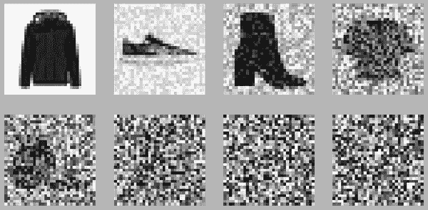

# 第二章。逐步构建稳定扩散

在上一章中，我们介绍了扩散模型和迭代细化的基本思想。在章节结束时，我们可以生成图像，但训练模型非常耗时，而且我们无法控制生成的图像。在本章中，我们将看到如何从这一点过渡到基于文本描述有效生成图像的条件化模型，以 Stable Diffusion（SD）模型作为案例研究。不过，在我们深入研究 SD 之前，我们将首先看一下条件化模型的工作原理，并回顾一些导致我们今天拥有文本到图像模型的创新。

# 添加控制：条件化扩散模型

在我们处理从文本描述生成图像的问题之前（这是一个非常具有挑战性的任务！），让我们先专注于一些稍微容易的事情。我们将看到如何引导我们模型的输出朝向特定类型或*类别*的图像。我们可以使用一种叫做*条件化*的方法，其思想是要求模型生成不仅仅是任何图像，而是属于预定义类别的图像。

模型*条件化*是一个简单但有效的想法。我们将从第三章中使用的相同扩散模型开始，只做了一些改变。首先，我们将使用一个叫做 Fashion MNIST 的新数据集，而不是蝴蝶，这样我们就可以轻松识别类别。然后，至关重要的是，我们将两个输入通过模型。我们不仅向它展示*真实*图像是什么样子的，还告诉它每个图像属于哪个类别。我们希望模型能够学会将图像和标签关联起来，这样它就能了解毛衣、靴子等的独特特征。

请注意，我们不感兴趣解决分类问题 - 我们不希望模型在给定输入图像的情况下告诉我们类别。我们仍然希望它执行与第三章相同的任务，即：*请生成看起来像来自这个数据集的可信图像*。唯一的区别是我们给它提供了关于这些图像的额外信息。我们将使用相同的损失函数和训练策略，因为这与以前的任务相同。

## 准备数据。

我们需要一个包含不同图像组的数据集。用于计算机视觉分类任务的数据集非常适合这个目的。我们可以从像 ImageNet 这样的数据集开始，该数据集包含了 1000 个类别的数百万张图像。然而，在这个数据集上训练模型需要非常长的时间。在解决新问题时，通常最好先从一个较小的数据集开始，以确保一切都按预期工作。这样可以保持反馈循环的短暂，这样我们可以快速迭代并确保我们走在正确的轨道上。

对于这个例子，我们可以像在第三章中那样选择 MNIST。为了稍微有些不同，我们将选择 Fashion MNIST。Fashion MNIST 是由 Zalando 开发并开源的，是 MNIST 的替代品，具有一些相同的特点：紧凑的大小，黑白图像和 10 个类别。主要区别在于，类别不是数字，而是对应于不同类型的服装，图像比简单的手写数字包含更多的细节。

让我们看一些例子。

```py
from datasets import load_dataset

fashion_mnist = load_dataset("fashion_mnist")
```

```py
clothes = fashion_mnist["train"]["image"][:8]
classes = fashion_mnist["train"]["label"][:8]
show_images(clothes, titles=classes, figsize=(4,2.5))
```


所以类别*0*表示 T 恤，*2*是毛衣，*9*表示靴子。以下是 Fashion MNIST 中的 10 个类别列表：[*https://huggingface.co/datasets/fashion_mnist#data-fields*](https://huggingface.co/datasets/fashion_mnist#data-fields)。我们准备我们的数据集和数据加载器，类似于我们在第三章中所做的，主要的区别是我们还将类别信息作为输入包含进去。在这种情况下，我们不是调整大小，而是将我们的图像输入（大小为*28×28*像素）填充到*32×32*，就像我们在第三章中所做的那样。

```py
preprocess = transforms.Compose([
    transforms.RandomHorizontalFlip(),   # Randomly flip (data augmentation)
    transforms.ToTensor(),               # Convert to tensor (0, 1)
    transforms.Pad(2),                   # Add 2 pixels on all sides
    transforms.Normalize([0.5], [0.5]),  # Map to (-1, 1)
])
```

```py
batch_size = 256

def transform(examples):
    images = [preprocess(image.convert("L")) for image in examples["image"]]
    return {"images": images, "labels": examples["label"]}

train_dataset = fashion_mnist["train"].with_transform(transform)

train_dataloader = torch.utils.data.DataLoader(
    train_dataset, batch_size=batch_size, shuffle=True
)
```

## 创建一个类别条件化模型

如果我们使用 diffusers 库中的*UNet*模型，我们可以提供自定义的条件信息。在这里，我们创建了一个类似于第三章中使用的模型，但我们在*UNet*构造函数中添加了一个*num_class_embeds*参数。该参数告诉模型我们想要使用类别标签作为额外的条件。我们将使用 10，因为 Fashion MNIST 中有 10 个类别。

```py
model = UNet2DModel(
    in_channels=1,   # 1 channel for grayscale images
    out_channels=1,  # output channels must also be 1
    sample_size=32,
    block_out_channels=(32, 64, 128, 256),
    norm_num_groups=8,
    num_class_embeds=10, # Enable class conditioning
)
```

要使用该模型进行预测，我们必须将类别标签作为*forward*方法的附加输入传递：

```py
x = torch.randn((1, 1, 32, 32))
with torch.no_grad():
    out = model(x, timestep=7, class_labels=torch.tensor([2])).sample
out.shape
```

```py
torch.Size([1, 1, 32, 32])
```

###### 注意

你会注意到我们还向模型传递了其他条件信息：时间步！没错，即使是第三章中的模型也可以被视为有条件的扩散模型！我们将其条件设置为时间步，希望知道我们在扩散过程中的进展有助于它生成更真实的图像。

在内部，时间步长和类别标签都被转换为模型在前向传递过程中使用的**嵌入**。在 UNet 的多个阶段，这些嵌入被投影到与给定层中通道数相匹配的维度，然后添加到该层的输出中。这意味着条件信息被馈送到 UNet 的每个块中，使模型有充分的机会学习如何有效地使用它。

## 训练模型

添加噪音对灰度图像的效果与第三章中的蝴蝶一样好。

```py
scheduler = DDPMScheduler(num_train_timesteps=1000, beta_start=0.0001, beta_end=0.02)
timesteps = torch.linspace(0, 999, 8).long()
batch = next(iter(train_dataloader))
x = batch['images'][:8]
noise = torch.rand_like(x)
noised_x = scheduler.add_noise(x, noise, timesteps)
show_images((noised_x*0.5 + 0.5).clip(0, 1))
```



我们的训练循环几乎与第三章中的相同，只是现在我们传递类别标签进行条件处理。请注意，这只是模型的附加信息，但并不以任何方式影响我们的损失函数。

```py
for step, batch in enumerate(train_dataloader):
        # Load the input images
        clean_images = batch["images"].to(device)
        class_labels = batch["labels"].to(device)

        # *Sample noise to add to the images*
        # *Sample a random timestep for each image*
        # *Add noise to the clean images according to the timestep*

        # Get the model prediction for the noise - note the use of class_labels
        noise_pred = model(noisy_images, timesteps, class_labels=class_labels, return_dict=False)[0]

        # *Calculate the loss and update the parameters as before*
        ...
```

在这种情况下，我们进行了 25 个时期的训练-完整的代码可以在补充材料中找到。

## 采样

现在我们有一个模型，当进行预测时需要两个输入：图像和类别标签。我们可以通过从随机噪声开始，然后迭代去噪，传入我们想要生成的任何类别标签来创建样本：

```py
def generate_from_class(class_to_generate, n_samples=8):
    sample = torch.randn(n_samples, 1, 32, 32).to(device)
    class_labels = [class_to_generate] * n_samples
    class_labels = torch.tensor(class_labels).to(device)

    for i, t in tqdm(enumerate(scheduler.timesteps)):
        # Get model pred
        with torch.no_grad():
            noise_pred = model(sample, t, class_labels=class_labels).sample

        # Update sample with step
        sample = scheduler.step(noise_pred, t, sample).prev_sample

    return sample.clip(-1, 1)*0.5 + 0.5
```

```py
# Generate t-shirts (class 0)
images = generate_from_class(0)
show_images(images, nrows=2)
```

```py
1000it [00:21, 47.25it/s]
```


```py
# Now generate some sneakers (class 7)
images = generate_from_class(7)
show_images(images, nrows=2)
```

```py
1000it [00:21, 47.20it/s]
```


```py
# ...or boots (class 9)
images = generate_from_class(9)
show_images(images, nrows=2)
```

```py
1000it [00:21, 47.26it/s]
```


正如你所看到的，生成的图像远非完美。如果我们探索架构并进行更长时间的训练，它们可能会变得更好。但令人惊讶的是，该模型不仅学会了不同类型的服装形状，还意识到形状*9*看起来与形状*0*不同，只是通过在训练数据旁边发送这些信息。换句话说：该模型习惯于看到数字*9*伴随着靴子。当我们要求它生成一张图像并提供*9*时，它会回应一个靴子。我们成功地构建了一个能够生成**基于 fashionMNIST 类别标签**的图像的有条件模型！

# 提高效率：潜在扩散

现在我们可以训练一个有条件的模型，我们所需要做的就是将其扩展并以文本而不是类别标签进行条件处理，对吗？嗯，并不完全是这样。随着图像尺寸的增加，处理这些图像所需的计算能力也会增加。这在一个称为自注意力的操作中尤为明显，其中操作的数量随着输入数量的增加呈二次增长。一个 128 像素的正方形图像有 4 倍于 64 像素正方形图像的像素数量，因此在自注意力层中需要 16 倍（即<math alttext="4 squared"><msup><mn>4</mn> <mn>2</mn></msup></math>）的内存和计算。这对于希望生成高分辨率图像的人来说是一个问题！


###### 图 2-1。[潜在扩散模型论文](https://arxiv.org/abs/2112.10752)中介绍的架构。请注意左侧的 VAE 编码器和解码器，用于在像素空间和潜在空间之间进行转换

潜在扩散试图通过使用称为变分自动编码器（VAE）的单独模型来缓解这个问题。正如我们在第二章中看到的，VAE 可以将图像压缩到较小的空间维度。其背后的原理是图像往往包含大量冗余信息 - 给定足够的训练数据，VAE 有望学会以更小的表示产生输入图像，并且然后基于这个小的潜在表示重构图像，并且具有高度的保真度。SD 中使用的 VAE 接收 3 通道图像，并产生一个 4 通道的潜在表示，每个空间维度的缩减因子为 8。也就是说，一个 512 像素的正方形输入图像将被压缩到一个 4x64x64 的潜在表示。

通过在**这些较小的潜在表示**上应用扩散过程，而不是在全分辨率图像上应用，我们可以获得许多使用较小图像所带来的好处（更低的内存使用、UNet 中需要更少的层、更快的生成时间...），并且一旦准备查看结果，仍然可以将结果解码回高分辨率图像。这种创新大大降低了训练和运行这些模型的成本。引入这一想法的论文（Rombach 等人的《使用潜在扩散模型进行高分辨率图像合成》）通过训练模型展示了这一技术的威力，这些模型是基于分割地图、类标签和文本的。令人印象深刻的结果导致作者与 RunwayML、LAION 和 EleutherAI 等合作伙伴进一步合作，以训练模型的更强大版本，后来成为 Stable Diffusion。

# Stable Diffusion：深入组件

Stable Diffusion 是一个文本条件的潜在扩散模型。由于其受欢迎程度，有数百个网站和应用程序可以让您使用它来创建图像，而无需任何技术知识。它还得到了像`diffusers`这样的库的很好支持，这些库让我们使用用户友好的管道来使用 SD 对图像进行采样：

```py
pipe("Watercolor illustration of a rose").images[0]
```

```py
  0%|          | 0/50 [00:00<?, ?it/s]
```


在本节中，我们将探讨使这一切成为可能的所有组件。

## 文本编码器

那么 Stable Diffusion 如何理解文本呢？我们早些时候展示了如何向 UNet 提供额外信息，使我们能够对生成的图像类型有一些额外的控制。给定图像的嘈杂版本，模型的任务是根据额外的线索（例如类标签）来预测去噪版本。在 SD 的情况下，额外的*线索*是文本提示。在推断时，我们可以提供想要查看的图像的描述以及一些纯噪声作为起点，模型会尽力将随机输入*去噪*成与说明相匹配的东西。


###### 图 2-2。文本编码器将输入字符串转换为文本嵌入，这些嵌入与时间步长和嘈杂的潜在一起输入 UNet。

为了使其工作，我们需要创建文本的数值表示，以捕获有关其描述的相关信息。为此，SD 利用了基于 CLIP 的预训练变压器模型，这也是在第二章中介绍的。文本编码器是一个变压器模型，它接受一系列标记，并为每个标记产生一个 1024 维的向量（或者在我们用于本节演示的 SD 版本 1 中为 768 维）。我们不是将这些向量组合成单个表示，而是保持它们分开，并将它们用作 UNet 的条件。这使得 UNet 可以单独使用每个标记中的信息，而不仅仅是整个提示的整体含义。因为我们从 CLIP 模型的内部表示中提取这些文本嵌入，它们通常被称为“编码器隐藏状态”。图 3 显示了文本编码器的架构。


###### 图 2-3。显示文本编码过程的图表，将输入提示转换为一组文本嵌入（编码器隐藏状态），然后可以将其作为条件输入到 UNet 中。

编码文本的第一步是遵循一个称为**分词**的过程。这将把一系列字符转换成一系列数字，其中每个数字代表一组不同的字符。通常一起出现的字符（如大多数常见单词）可以被分配一个代表整个单词或组的单个标记。长或复杂的单词，或者有许多屈折的单词，可以被翻译成多个标记，其中每个标记通常代表单词的一个有意义的部分。

没有单一的“最佳”分词器；相反，每个语言模型都有自己的分词器。差异在于支持的标记数量，以及分词策略 - 我们使用单个字符，正如我们刚刚描述的，还是应该考虑不同的基本单元。在下面的示例中，我们看到了如何使用 Stable Diffusion 的分词器对短语进行分词。我们句子中的每个单词都被分配一个唯一的标记号（例如，`photograph`在分词器的词汇表中是`8853`）。还有其他额外的标记，用于提供额外的上下文，比如句子结束的地方。

```py
prompt = 'A photograph of a puppy'
```

```py
# Turn the text into a sequence of tokens:
text_input = pipe.tokenizer(prompt, padding="max_length",
                            max_length=pipe.tokenizer.model_max_length,
                            truncation=True, return_tensors="pt")

# See the individual tokens
for t in text_input['input_ids'][0][:8]: # We'll just look at the first 7
    print(t, pipe.tokenizer.decoder.get(int(t)))
```

```py
tensor(49406) <|startoftext|>
tensor(320) a</w>
tensor(8853) photograph</w>
tensor(539) of</w>
tensor(320) a</w>
tensor(6829) puppy</w>
tensor(49407) <|endoftext|>
tensor(49407) <|endoftext|>
```

一旦文本被分词，我们就可以通过文本编码器将其传递，以获得将被馈送到 UNet 中的最终文本嵌入：

```py
# Grab the output embeddings
text_embeddings = pipe.text_encoder(text_input.input_ids.to(device))[0]
print('Text embeddings shape:', text_embeddings.shape)
```

```py
Text embeddings shape: torch.Size([1, 77, 768])
```

我们将在关于变压器模型处理标记字符串的章节中详细介绍。

## 无分类器引导

事实证明，即使在使文本条件尽可能有用的所有努力中，模型在进行预测时仍倾向于主要依赖于嘈杂的输入图像而不是提示。在某种程度上，这是有道理的 - 许多标题只与其相关联的图像松散相关，因此模型学会不要过于依赖描述！然而，当生成新图像时，这是不可取的 - 如果模型不遵循提示，那么我们可能得到与我们的描述毫不相关的图像。


###### 图 2-4。从提示“戴礼帽的牧羊犬的油画”生成的图像，CFG 比例为 0、1、2 和 10（从左到右）

为了解决这个问题，我们使用了一个叫做无分类器引导（CGF）的技巧。在训练期间，有时会保持文本条件为空，迫使模型学习无文本信息的图像去噪（无条件生成）。然后在推断时，我们进行两次单独的预测：一次是带有文本提示作为条件，一次是没有。然后我们可以使用这两次预测之间的差异来创建一个最终的组合预测，根据某个缩放因子（引导比例）进一步推动文本条件预测所指示的方向，希望得到更好地匹配提示的图像。图 4 显示了不同引导比例下提示的输出 - 如您所见，较高的值会产生更好地匹配描述的图像。

## VAE

VAE 的任务是将图像压缩成较小的潜在表示，然后再次解压缩。与 Stable Diffusion 一起使用的 VAE 是一个真正令人印象深刻的模型。我们不会在这里详细介绍训练细节，但除了第二章中描述的常规重建损失和 KL 散度之外，它们还使用了一个额外的基于补丁的鉴别器损失，以帮助模型学习输出合理的细节和纹理。这为训练增加了类似 GAN 的组件，并有助于避免以前 VAE 中典型的略模糊的输出。与文本编码器一样，VAE 通常是单独训练的，并在扩散模型的训练和采样过程中作为冻结组件使用。


###### 图 2-5\. 使用 VAE 对图像进行编码和解码

让我们加载一张图像，看看经过 VAE 压缩和解压后的样子：

```py
# NB, this will be our own image as part of the supplementary material to avoid external URLs
im = load_image('https://images.pexels.com/photos/14588602/pexels-photo-14588602.jpeg', size=(512, 512))
show_image(im);
```


```py
# Encode the image
with torch.no_grad():
    tensor_im = transforms.ToTensor()(im).unsqueeze(0).to(device)*2-1
    latent = vae.encode(tensor_im.half()) # Encode the image to a distribution
    latents = latent.latent_dist.sample() # Sampling from the distribution
    latents = latents * 0.18215 # This scaling factor was introduced by the SD authors to reduce the variance of the latents

latents.shape
```

```py
torch.Size([1, 4, 64, 64])
```

通过可视化低分辨率的潜在表示，我们可以看到输入图像的一些粗略结构仍然可见在不同的通道中：

```py
# Plot the individual channels of the latent representation
show_images([l for l in latents[0]], titles=[f'Channel {i}' for i in range(latents.shape[1])], ncols=4)
```


解码回图像空间，我们得到一个几乎与原始图像相同的输出图像。你能发现区别吗？

```py
# Decode the image
with torch.no_grad():
    image = vae.decode(latents / 0.18215).sample
image = (image / 2 + 0.5).clamp(0, 1)
show_image(image[0].float());
```


在从头开始生成图像时，我们创建一组随机潜变量作为起点。我们迭代地优化这些嘈杂的潜变量以生成一个样本，然后使用 VAE 解码器将这些最终潜变量解码成我们可以查看的图像。编码器仅在我们想要从现有图像开始该过程时使用，这是我们将在第五章中探讨的内容。

## UNet

稳定扩散中使用的 UNet 与我们在第三章中用于生成图像的 UNet 有些相似。我们不是以 3 通道图像作为输入，而是以 4 通道潜变量作为输入。时间步嵌入以与本章开头示例中的类别条件相同的方式输入。但是这个 UNet 还需要接受文本嵌入作为额外的条件。UNet 中散布着交叉注意力层。UNet 中的每个空间位置都可以*关注*文本条件中的不同标记，从提示中带入相关信息。图 7 中的图表显示了文本条件（以及基于时间步的条件）是如何在不同点输入的。


###### 图 2-6\. 稳定扩散 UNet

稳定扩散版本 1 和 2 的 UNet 大约有 8.6 亿个参数。更新更近期的 SD XL 拥有更多参数，大约为（详细信息待定），大部分额外参数是通过在残差块中添加额外通道（原始版本中的 N 对 1280）和添加变压器块来增加低分辨率阶段的。

注：稳定扩散 XL 尚未公开发布，因此当有更多信息公开时，本节将进行更新。

# 将所有内容放在一起：带注释的采样循环

现在我们知道每个组件的作用，让我们把它们放在一起，生成一张图像，而不依赖于管道。以下是我们将使用的设置：

```py
# Some settings
prompt = ["Acrylic palette knife painting of a flower"] # What we want to generate
height = 512                        # default height of Stable Diffusion
width = 512                         # default width of Stable Diffusion
num_inference_steps = 30            # Number of denoising steps
guidance_scale = 7.5                # Scale for classifier-free guidance
seed = 42                           # Seed for random number generator
```

第一步是对文本提示进行编码。因为我们计划进行无分类器的引导，实际上我们将创建两组文本嵌入：一组是提示，另一组代表空字符串。您还可以编码*负提示*来代替空字符串，或者结合多个提示以不同的权重，但这是最常见的用法：

```py
# Tokenize the input
text_input = pipe.tokenizer(prompt, padding="max_length", max_length=pipe.tokenizer.model_max_length, truncation=True, return_tensors="pt")

# Feed through the text encoder
with torch.no_grad():
    text_embeddings = pipe.text_encoder(text_input.input_ids.to(device))[0]

# Do the same for the unconditional input (a blank string)
uncond_input = pipe.tokenizer("", padding="max_length", max_length=pipe.tokenizer.model_max_length, return_tensors="pt")
with torch.no_grad():
    uncond_embeddings = pipe.text_encoder(uncond_input.input_ids.to(device))[0]

# Concatenate the two sets of text embeddings embeddings
text_embeddings = torch.cat([uncond_embeddings, text_embeddings])
```

接下来，我们创建我们的随机初始潜变量，并设置调度程序以使用所需数量的推断步骤：

```py
# Prepare the Scheduler
pipe.scheduler.set_timesteps(num_inference_steps)

# Prepare the random starting latents
latents = torch.randn(
    (1, pipe.unet.in_channels, height // 8, width // 8), # Shape of the latent representation
    generator=torch.manual_seed(32),  # Seed the random number generator
).to(device).half()
latents = latents * pipe.scheduler.init_noise_sigma
```

现在我们循环进行采样步骤，获取每个阶段的模型预测，并使用这些来更新潜变量：

```py
# Sampling loop
for i, t in enumerate(pipe.scheduler.timesteps):

    # Create two copies of the latents to match the two text embeddings (unconditional and conditional)
    latent_model_input = torch.cat([latents] * 2)
    latent_model_input = pipe.scheduler.scale_model_input(latent_model_input, t)

    # predict the noise residual for both sets of inputs
    with torch.no_grad():
        noise_pred = pipe.unet(latent_model_input, t, encoder_hidden_states=text_embeddings).sample

    # Split the prediction into unconditional and conditional versions:
    noise_pred_uncond, noise_pred_text = noise_pred.chunk(2)

    # perform classifier-free guidance
    noise_pred = noise_pred_uncond + guidance_scale * (noise_pred_text - noise_pred_uncond)

    # compute the previous noisy sample x_t -> x_t-1
    latents = pipe.scheduler.step(noise_pred, t, latents).prev_sample
```

注意无分类器引导步骤。我们最终的噪声预测是*noise_pred_uncond + guidance_scale * (noise_pred_text - noise_pred_uncond)*，将预测*远离*无条件预测，朝向基于提示的预测。尝试更改引导比例，看看这如何影响输出。

循环结束时，潜变量应该能够表示一个符合提示的合理图像。最后一步是使用 VAE 将潜变量解码成图像，以便我们可以看到结果：

```py
# scale and decode the image latents with vae
latents = 1 / 0.18215 * latents
with torch.no_grad():
    image = vae.decode(latents).sample
image = (image / 2 + 0.5).clamp(0, 1)

# Display
show_image(image[0].float());
```


如果您探索*StableDiffusionPipeline*的源代码，您会发现上面的代码与管道使用的**call**方法非常相似。希望这个带注释的版本显示了幕后并没有太神奇的事情发生！当我们遇到添加额外技巧的其他管道时，请将其用作参考。

# 文本到图像模型的训练数据（待定）

注：我们可能会在这里添加一个更深入的部分，介绍 LAION 是如何形成的历史和技术细节，以及一些关于在从互联网上抓取的公共数据上进行训练的细微差别和争论。

# 开放数据，开放模型

LAION-5B 数据集包括从互联网上抓取的 50 亿多个图像标题对。这个数据集是由开源社区创建的，他们认为有必要有这样一个公开可访问的数据集。在 LAION 计划之前，只有少数大公司的研究实验室才能访问这样的数据。这些组织将他们的私有数据集的细节保留给自己，这使得他们的结果无法验证或复制。通过创建一个公开可用的训练数据来源，LAION 使得一波较小的社区和组织能够进行训练模型和进行研究，否则这是不可能的。


###### 图 2-7。作者使用稳定扩散生成的“艺术创造力的爆发”

稳定扩散是这样一个模型，它是作为一个由发明了潜在扩散模型的研究人员和一个名为 Stability AI 的组织之间的合作的一部分，对 LAION 的子集进行训练的。像 SD 这样的模型需要大量的 GPU 时间来训练。即使有免费提供的 LAION 数据集，也没有多少人能够负担得起这样的投资。这就是为什么模型权重和代码的公开发布如此重要的原因——这标志着一个功能强大的文本到图像模型，具有类似于最好的闭源替代品的能力，首次对所有人都可用。稳定扩散的公开可用性使其成为过去一年来研究人员和开发人员探索这项技术的首选选择。数百篇论文都是基于基础模型，添加新的功能或找到改进其速度和质量的创新方法。无数初创公司已经找到了将这些快速改进的工具整合到其产品中的方法，从而产生了一个全新应用的生态系统。

稳定扩散推出后的几个月展示了在开放中分享这些技术的影响。SD 并不是最好的文本到图像模型，但它是大多数人可以访问到的最好的模型，因此成千上万的人花费了时间使其变得更好，并在此开放基础上构建。我们希望这个例子鼓励其他人效仿，并在未来与开源社区分享他们的工作！

# 总结

在本章中，我们已经看到*条件*如何为我们提供了控制扩散模型生成图像的新方法。我们已经看到潜在扩散如何让我们更有效地训练扩散模型。我们已经看到文本编码器如何被用来在文本提示上对扩散模型进行条件设定，实现强大的文本到图像的能力。我们已经探讨了所有这些是如何在稳定扩散模型中结合在一起的，通过深入研究采样循环并看到不同组件如何一起工作。在下一章中，我们将展示可以添加到扩散模型（如 SD）中的许多额外功能，使它们超越简单的图像生成。在本书的第二部分中，您将学习如何微调 SD，以向模型添加新的知识或功能。

# 关于作者

Pedro Cuenca 是一名机器学习工程师，他在 Hugging Face 公司负责扩散软件、模型和应用程序的工作。

Apolinário Passos 是 Hugging Face 公司的机器学习艺术工程师，他在多个机器学习艺术和创造性用例的团队之间工作。

Omar Sanseviero 是 Hugging Face 公司的首席机器学习工程师，他在开源、社区和产品的交叉领域工作。之前，Omar 曾在谷歌的 Google Assistant 和 TensorFlow 工作。

乔纳森·惠特克（Jonathan Whitaker）是一位专注于生成建模的数据科学家和深度学习研究员。除了他的研究和咨询工作外，他的主要关注点是分享知识，他通过 DataScienceCastnet YouTube 频道和他创建的各种免费在线资源来实现。
