# 第一章： 文本分类

自然语言处理和机器学习中最常见的任务之一是分类。该任务的目标是训练一个模型，为一些输入文本分配标签或类别。文本分类在全球范围内用于广泛的应用，从情感分析和意图检测到实体提取和语言检测。

大型语言模型对分类的影响不容小觑。这些模型的加入迅速成为这类任务的默认选择。

在本章中，我们将讨论使用大型语言模型进行文本分类的多种方法。由于文本分类的广泛领域，将讨论多种技术和应用案例。本章还可以很好地引入 LLM，因为大多数模型都可以用于分类。

我们将重点利用预训练的 LLM，这些模型已经在大量数据上进行训练，可以用于文本分类。对这些模型进行文本分类和领域适应的微调将在第十章中详细讨论。

让我们从最基本的应用和技术开始，完全监督的文本分类。

# 监督文本分类

分类有多种形式，例如稍微学习（few-shot）和零学习（zero-shot）分类，我们将在本章后面讨论，但最常用的方法是完全监督的分类。这意味着在训练过程中，每个输入都有一个目标类别，模型可以从中学习。

对于使用文本数据作为输入的监督分类，通常遵循一个常见的程序。如图 1-1 所示，我们首先使用特征提取模型将文本输入转换为数值表示。传统上，这样的模型将文本表示为词袋，简单地计算一个单词在文档中出现的次数。然而，在本书中，我们将重点关注 LLM 作为我们的特征提取模型。


###### 图 1-1\. 监督分类的示例。我们能否预测电影评论是正面还是负面？

然后，我们在数值表示上训练分类器，例如嵌入（还记得第 X 章吗？），以对文本数据进行分类。分类器可以是多种形式，例如神经网络或逻辑回归。它甚至可以是许多 Kaggle 竞赛中使用的分类器，即 XGBoost！

在这个流程中，我们总是需要训练分类器，但可以选择微调整个 LLM、其中某些部分或保持不变。如果我们选择不进行微调，我们称这一过程为*冻结其层*。这意味着在训练过程中这些层无法更新。然而，至少*解冻*一些层可能是有益的，这样大型语言模型就可以针对特定的分类任务进行*微调*。该过程在图 1-2 中有所说明。

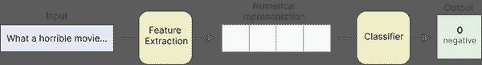

###### 图 1-2\. 监督文本分类的常见过程。我们通过特征提取将文本输入数据转换为数值表示。然后，训练分类器以预测标签。

## 模型选择

我们可以使用 LLM 来表示要输入到分类器中的文本。然而，这个模型的选择可能并不像您想象的那样简单。模型在可处理的语言、架构、大小、推理速度、架构、特定任务的准确性等方面存在差异，且还有许多其他差异。

BERT 是一个优秀的基础架构，可以针对多种任务进行微调，包括分类。尽管我们可以使用生成模型，比如知名的生成预训练变换器（GPT），例如 ChatGPT，但 BERT 模型通常在特定任务的微调上表现优越。相比之下，GPT 类模型通常在广泛的任务上表现突出。从某种意义上说，这是专业化与泛化的对比。

现在我们知道要为监督分类任务选择一个类似 BERT 的模型，我们将使用哪个呢？BERT 有多种变体，包括 BERT、RoBERTa、DistilBERT、ALBERT、DeBERTa，每种架构都以不同的形式进行了预训练，从特定领域的训练到多语言数据的训练。您可以在图 1-3 中找到一些著名大型语言模型的概述。

为工作选择合适的模型本身可以是一种艺术。尝试数千个可以在 HuggingFace Hub 上找到的预训练模型是不可行的，因此我们需要高效地选择模型。话虽如此，仍然有一些模型是很好的起点，并能让您了解这些模型的基础性能。将它们视为稳固的基线：

+   [BERT-base-uncased](https://huggingface.co/bert-base-uncased)

+   [Roberta-base](https://huggingface.co/roberta-base)

+   [Distilbert-base-uncased](https://huggingface.co/distilbert-base-uncased)

+   [Deberta-base](https://huggingface.co/microsoft/deberta-base)

+   [BERT-tiny](https://huggingface.co/prajjwal1/bert-tiny)

+   [Albert-base-v2](https://huggingface.co/albert-base-v2)

**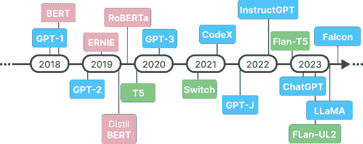

###### 图 1-3\. 常见大型语言模型发布的时间线。** **在本节中，我们将使用“bert-base-cased”进行一些示例。可以随意将“bert-base-cased”替换为上述任意模型。尝试不同的模型，以感受性能与训练速度之间的权衡。**  **## 数据

在本章中，我们将演示许多文本分类技术。我们将用来训练和评估模型的数据集是[“rotten_tomatoes”](https://huggingface.co/datasets/rotten_tomatoes)；pang2005seeing)数据集。它包含约 5000 条正面和 5000 条负面电影评论，来自[Rotten Tomatoes](https://www.rottentomatoes.com/)。

我们加载数据并将其转换为`pandas dataframe`以便于控制：

```py
import pandas as pd
from datasets import load_dataset
tomatoes = load_dataset("rotten_tomatoes")

# Pandas for easier control
train_df = pd.DataFrame(tomatoes["train"])
eval_df = pd.DataFrame(tomatoes["test"])
```

###### 提示

尽管本书专注于 LLMs，但强烈建议将这些示例与经典且强大的基准进行比较，例如使用 TF-IDF 表示文本并在其上训练 LogisticRegression 分类器。

## 分类头

使用 Rotten Tomatoes 数据集，我们可以从最简单的预测任务开始，即二分类。这通常应用于情感分析，检测某个文档是正面还是负面。这可以是带有指示该评论是正面还是负面的标签（0 或 1）的客户评论。在我们的案例中，我们将预测一条电影评论是负面（0）还是正面（1）。

使用基于变换器的模型训练分类器通常遵循两步法：

首先，如图 1-4 所示，我们采用现有的变换器模型，将文本数据转换为数值表示。

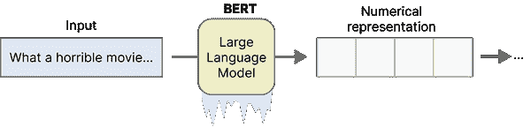

###### 图 1-4\. 首先，我们使用通用的预训练 LLM（例如 BERT）将我们的文本数据转换为更数值化的表示。在训练过程中，我们将“冻结”模型，以便其权重不会被更新。这显著加快了训练速度，但通常精度较低。

其次，如图 1-5 所示，我们在预训练模型的顶部添加一个分类头。这个分类头通常是一个单一的线性层，我们可以对其进行微调。

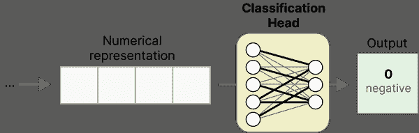

###### 图 1-5\. 在微调我们的 LLM 后，我们在数值表示和标签上训练分类器。通常，选择前馈神经网络作为分类器。

这两个步骤描述的是同一模型，因为分类头直接添加到 BERT 模型中。如图 1-6 所示，我们的分类器只不过是一个附加了线性层的预训练 LLM。它实现了特征提取和分类的结合。

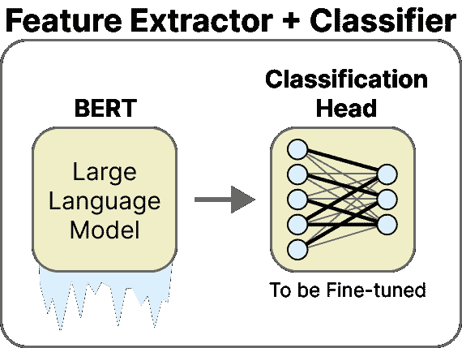

###### 图 1-6\. 我们采用 BERT 模型，其输出嵌入被输入到分类头中。该头通常由一个线性层组成，但可能会提前包含 dropout。

###### 注意

在第十章中，我们将使用图 2-4 和 2-5 中显示的相同管道，但将微调大型语言模型。在那里，我们将更深入地探讨微调的工作原理以及为什么它能改善这里展示的管道。目前，重要的是要知道，微调这个模型和分类头一起提高了分类任务的准确性。这是因为它使大型语言模型能够更好地表示文本以进行分类，针对特定领域文本进行微调。

### 示例

为了训练我们的模型，我们将使用[简单变换器包](https://github.com/ThilinaRajapakse/simpletransformers)。它抽象了大部分技术难点，让我们可以专注于当前的分类任务。我们从初始化模型开始：

```py
from simpletransformers.classification import ClassificationModel, ClassificationArgs

# Train only the classifier layers
model_args = ClassificationArgs()
model_args.train_custom_parameters_only = True
model_args.custom_parameter_groups = [
    {
        "params": ["classifier.weight"],
        "lr": 1e-3,
    },
    {
        "params": ["classifier.bias"],
        "lr": 1e-3,
        "weight_decay": 0.0,
    },
]

# Initializing pre-trained BERT model
model = ClassificationModel("bert", "bert-base-cased", args=model_args)
```

我们选择了流行的“bert-base-cased”，但如前所述，我们还有许多其他模型可以选择。可以随意尝试不同模型，以查看其对性能的影响。

接下来，我们可以在训练数据集上训练模型，并预测评估数据集的标签：

```py
import numpy as np
from sklearn.metrics import f1_score

# Train the model
model.train_model(train_df)

# Predict unseen instances
result, model_outputs, wrong_predictions = model.eval_model(eval_df, f1=f1_score)
y_pred = np.argmax(model_outputs, axis=1)
```

现在我们已经训练了模型，剩下的就是评估：

```py
>>> from sklearn.metrics import classification_report
>>> print(classification_report(eval_df.label, y_pred))
              precision    recall  f1-score   support

           0       0.84      0.86      0.85       533
           1       0.86      0.83      0.84       533

    accuracy                           0.85      1066
   macro avg       0.85      0.85      0.85      1066
weighted avg       0.85      0.85      0.85      1066
```

使用预训练的 BERT 模型进行分类使我们的 F-1 得分达到 0.85。我们可以将这个得分作为本节示例中的基准。

###### 提示

`simpletransformers`包提供了许多易于使用的功能来处理不同任务。例如，你也可以用它创建一个自定义的命名实体识别模型，只需几行代码。

## 预训练嵌入

与之前展示的示例不同，我们可以以更经典的形式进行监督分类。我们可以完全将特征提取与分类训练分开，而不是在训练前冻结层并在其上使用前馈神经网络。

这种两步法完全将特征提取与分类分开：

首先，正如我们在图 1-7 中看到的，我们使用一个专门训练以创建嵌入的 LLM，SBERT（[`www.sbert.net/`](https://www.sbert.net/)）。


###### 图 1-7\. 首先，我们使用一个专门训练用于生成准确数值表示的 LLM。这些通常比我们从像 BERT 这样的一般 Transformer 模型中获得的更具代表性。

其次，如图 1-8 所示，我们使用嵌入作为逻辑回归模型的输入。我们完全将特征提取模型与分类模型分开。

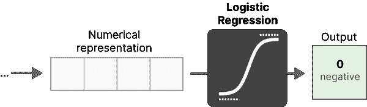

###### 图 1-8\. 使用嵌入作为特征，我们在训练数据上训练一个逻辑回归模型。

与我们之前的示例相比，这两个步骤分别描述了不同的模型。SBERT 用于生成特征，即嵌入，而逻辑回归则作为分类器。如图 2-9 所示，我们的分类器仅仅是一个附加了线性层的预训练 LLM。

**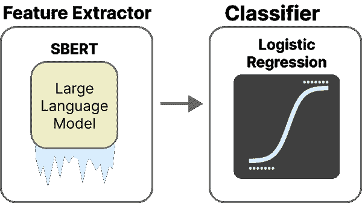**

###### 图 1-9\. 分类器是一个单独的模型，它利用来自 SBERT 的嵌入进行学习。**  **### 示例

使用句子转换器，我们可以在训练分类模型之前创建我们的特征：

```py
from sentence_transformers import SentenceTransformer, util
model = SentenceTransformer('all-mpnet-base-v2')
train_embeddings = model.encode(train_df.text)
eval_embeddings = model.encode(eval_df.text)
```

我们为训练（train_df）和评估（eval_df）数据创建了嵌入。生成的每个嵌入实例由 768 个值表示。我们将这些值视为可以用于训练模型的特征。

选择模型可以很简单。我们可以回归基础，使用逻辑回归，而不是使用前馈神经网络：

```py
from sklearn.linear_model import LogisticRegression
clf = LogisticRegression(random_state=42).fit(train_embeddings, train_df.label)
```

在实践中，你可以在我们生成的嵌入上使用任何分类器，例如决策树或神经网络。

接下来，让我们评估我们的模型：

```py
>>> from sklearn.metrics import classification_report
>>> y_pred = clf.predict(eval_embeddings)
>>> print(classification_report(eval_df.label, y_pred))

              precision    recall  f1-score   support

           0       0.84      0.86      0.85       151
           1       0.86      0.83      0.84       149

    accuracy                           0.85       300
   macro avg       0.85      0.85      0.85       300
weighted avg       0.85      0.85      0.85       300
```

在不需要微调我们的 LLM 的情况下，我们成功地达到了 0.85 的 F1 得分。这一点尤其令人印象深刻，因为它相比于我们的前一个示例，模型要小得多。****  ****# 零-shot 分类

本章开始时的例子中，我们所有的训练数据都有标签。然而，在实践中，这可能并不总是如此。获取标记数据是一项资源密集型任务，可能需要大量人力。相反，我们可以使用零样本分类模型。这种方法是迁移学习的一个良好例子，训练用于一项任务的模型被用于与其最初训练的任务不同的任务。零样本分类的概述在图 2-11 中给出。请注意，这个流程还展示了如果多个标签的概率超过给定阈值，则执行多标签分类的能力。

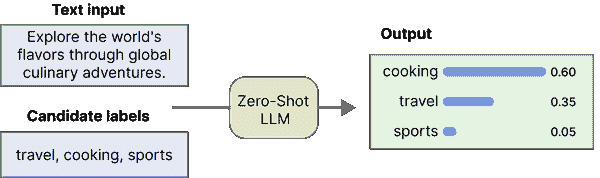

###### 图 1-10\. 图 2-11\. 在零样本分类中，LLM 并未在任何候选标签上进行训练。它从不同的标签中学习，并将这些信息推广到候选标签上。

通常，零样本分类任务与使用自然语言描述我们希望模型执行的操作的预训练 LLM 一起使用。随着模型规模的增加，这通常被称为 LLM 的涌现特性(wei2022emergent)。正如我们将在本章后面关于生成模型分类时看到的，类似 GPT 的模型通常能够很好地完成这些任务。

## 预训练嵌入

正如我们在监督分类示例中所看到的，嵌入是一种出色且常常准确地表示文本数据的方法。在处理没有标记的文档时，我们需要在如何使用预训练嵌入方面稍微富有创造性。由于没有可用的标记数据，分类器无法进行训练。

幸运的是，我们可以使用一个技巧。我们可以根据标签应表示的内容来描述它们。例如，电影评论的负面标签可以描述为“这是一条负面的电影评论”。通过描述和嵌入标签和文档，我们有了可以使用的数据。这个过程如图 1-11 所示，使我们能够生成自己的目标标签，而无需实际拥有任何标记数据。

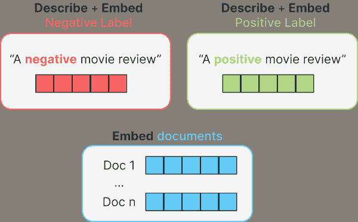

###### 图 1-11\. 要嵌入标签，我们首先需要给它们一个描述。例如，负面标签的描述可以是“负面的电影评论”。这个描述可以通过句子变换器嵌入。最后，标签和所有文档都会被嵌入。

要为文档分配标签，我们可以对文档标签对应用余弦相似度。余弦相似度是检查两个向量彼此相似程度的相似性度量，整个书中会经常使用。

这是向量之间角度的余弦，通过嵌入的点积计算，并除以它们长度的乘积。听起来确实比实际复杂，希望图 1-12 中的插图能提供额外的直觉。

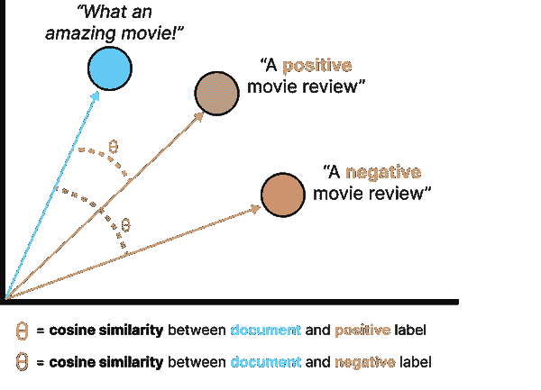

###### 图 1-12\. 余弦相似度是两个向量或嵌入之间的角度。在这个例子中，我们计算文档与两个可能标签（正面和负面）之间的相似度。

对于每个文档，它的嵌入与每个标签的嵌入进行比较。选择与文档相似度最高的标签。图 1-13 很好地展示了文档如何被分配标签。

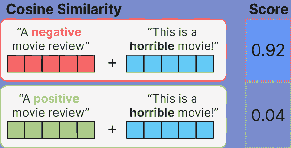

###### 图 1-13\. 在嵌入标签描述和文档后，我们可以对每个标签文档对使用余弦相似度。对于每个文档，选择与该文档相似度最高的标签。

### 示例

我们首先为评估数据集生成嵌入。这些嵌入是使用句子转换器生成的，因为它们相当准确且计算速度较快。

```py
from sentence_transformers import SentenceTransformer, util

# Create embeddings for the input documents
model = SentenceTransformer('all-mpnet-base-v2')
eval_embeddings = model.encode(eval_df.text)
```

接下来，需要生成标签的嵌入。然而，这些标签没有可以利用的文本表示，因此我们需要自己命名这些标签。

由于我们要处理正面和负面电影评论，我们将标签命名为“正面评论”和“负面评论”。这使我们能够嵌入这些标签：

```py
# Create embeddings for our labels
label_embeddings = model.encode(["A negative review", "A positive review"])
```

现在我们有了评论和标签的嵌入，我们可以在它们之间应用余弦相似度，以查看哪个标签最适合哪个评论。这样只需要几行代码：

```py
import numpy as np
from sklearn.metrics.pairwise import cosine_similarity

# Find the best matching label for each document
sim_matrix = cosine_similarity(eval_embeddings, label_embeddings)
y_pred = np.argmax(sim_matrix, axis=1)
```

就这样！我们只需为我们的标签想出名称，就可以执行分类任务。让我们看看这种方法效果如何：

```py
>>> print(classification_report(eval_df.label, y_pred))

              precision    recall  f1-score   support

           0       0.83      0.77      0.80       151
           1       0.79      0.84      0.81       149

    accuracy                           0.81       300
   macro avg       0.81      0.81      0.81       300
weighted avg       0.81      0.81      0.81       300
```

考虑到我们根本没有使用任何标记数据，0.81 的 F-1 分数相当令人印象深刻！这显示了嵌入的多功能性和实用性，尤其是当你在使用方式上稍微有点创意时。

让我们来测试一下这个创造力。我们决定将“负面/积极评论”作为我们的标签名称，但可以进一步改进。相反，我们可以通过使用“非常负面/积极的电影评论”使其更具体，更贴合我们的数据。这样，嵌入将捕捉到这是一个电影评论，并将更加关注两个标签的极端情况。

我们使用之前的代码来查看这是否真的有效：

```py
>>> # Create embeddings for our labels
>>> label_embeddings = model.encode(["A very negative movie review", "A very positive movie review"])
>>> 
>>> # Find the best matching label for each document
>>> sim_matrix = cosine_similarity(eval_embeddings, label_embeddings)
>>> y_pred = np.argmax(sim_matrix, axis=1)
>>> 
>>> # Report results
>>> print(classification_report(eval_df.label, y_pred))

              precision    recall  f1-score   support

           0       0.90      0.74      0.81       151
           1       0.78      0.91      0.84       149

    accuracy                           0.83       300
   macro avg       0.84      0.83      0.83       300
weighted avg       0.84      0.83      0.83       300
```

仅通过改变标签的措辞，我们大大提高了我们的 F-1 分数！

###### 提示

在这个例子中，我们通过命名标签并嵌入它们来应用零样本分类。当我们有少量标记的示例时，嵌入它们并将其添加到管道中可以帮助提高性能。例如，我们可以将标记示例的嵌入与标签嵌入进行平均。我们甚至可以通过创建不同类型的表示（标签嵌入、文档嵌入、平均嵌入等）进行投票程序，看看哪个标签最常被找到。这将使我们的零样本分类示例成为少样本方法。

## 自然语言推理

零样本分类也可以使用自然语言推理（NLI）进行，这指的是调查给定前提时，假设是否为真（蕴含）或为假（矛盾）的任务。图 1-14 展示了它们之间的良好示例。

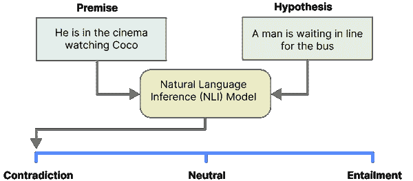

###### 图 1-14\. 自然语言推理（NLI）的示例。假设与前提相矛盾，彼此之间没有关联。

NLI 可以通过稍微创造性地使用前提/假设对进行零样本分类，如在图 1-15 中所示。我们使用输入文档，即我们想要提取情感的评论，并将其作为我们的前提（yin2019benchmarking）。然后，我们创建一个假设，询问前提是否与我们的目标标签有关。在我们的电影评论示例中，假设可以是：“这个例子是一个积极的电影评论”。当模型发现这是一个蕴含关系时，我们可以将评论标记为正面，而当其为矛盾时则标记为负面。使用 NLI 进行零样本分类的示例在图 1-15 中进行了说明。

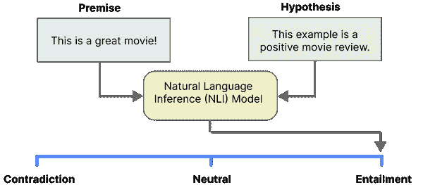

###### 图 1-15\. 自然语言推理（NLI）中的零样本分类示例。假设得到了前提的支持，模型将返回该评论确实是积极的电影评论。

### 示例

使用变压器，加载和运行预训练的 NLI 模型非常简单。我们选择“`facebook``/bart-large-mnli`”作为我们的预训练模型。该模型在超过 40 万个前提/假设对上进行了训练，应该非常适合我们的用例。

###### 注意

在过去的几年中，Hugging Face 努力成为机器学习的 Github，托管与机器学习相关的几乎所有内容。因此，他们的中心提供了大量预训练模型。对于零样本分类任务，您可以查看此链接：[`huggingface.co/models?pipeline_tag=zero-shot-classification`](https://huggingface.co/models?pipeline_tag=zero-shot-classification&sort=downloads)。

我们加载变压器管道，并在评估数据集上运行它：

```py
from transformers import pipeline

# Pre-trained MNLI model
pipe = pipeline(model="facebook/bart-large-mnli")

# Candidate labels
candidate_labels_dict = {"negative movie review": 0, "positive movie review": 1}
candidate_labels = ["negative movie review", "positive movie review"]

# Create predictions
predictions = pipe(eval_df.text.values.tolist(), candidate_labels=candidate_labels)
```

由于这是一个零样本分类任务，因此我们无需进行训练即可获得我们感兴趣的预测。预测变量不仅包含预测结果，还包含一个分数，指示候选标签（假设）蕴含输入文档（前提）的概率。

```py
>>> from sklearn.metrics import classification_report
>>> y_pred = [candidate_labels_dict[prediction["labels"][0]] for prediction in predictions]
>>> print(classification_report(eval_df.label, y_pred))

              precision    recall  f1-score   support

           0       0.77      0.89      0.83       151
           1       0.87      0.74      0.80       149

    accuracy                           0.81       300
   macro avg       0.82      0.81      0.81       300
weighted avg       0.82      0.81      0.81       300
```

完全没有进行微调，它的 F1 分数达到了 0.81\. 根据我们措辞候选标签的方式，可能能够提高这个值。例如，如果候选标签简单为“消极”和“积极”，会发生什么情况？

###### 提示

另一个优秀的零样本分类预训练模型是 sentence-transformers 的交叉编码器，即 '`cross-encoder/``nli``-deberta-base`'。由于训练 sentence-transformers 模型侧重于句子对，因此它自然而然地适用于利用前提/假设对的零样本分类任务。

# 使用生成模型进行分类

使用生成性大型语言模型（如 OpenAI 的 GPT 模型）进行分类，与我们之前所做的稍有不同。我们不是对模型进行微调以适应我们的数据，而是使用模型并尝试引导它朝向我们所寻找的答案类型。

这个引导过程主要通过您提供的提示来完成，例如模型。优化提示以使模型理解您所寻找的答案类型被称为 **提示工程**。本节将演示如何利用生成模型执行各种分类任务。

对于极大型语言模型，如 GPT-3，这一点尤其真实。一篇优秀的论文和相关阅读，“语言模型是少样本学习者”，描述了这些模型在下游任务上具有竞争力，同时需要更少的特定任务数据 (brown2020language)。

## 上下文学习

生成模型如此有趣的原因在于它们能够遵循给定的提示。生成模型甚至可以通过仅仅展示几个新任务的示例而做出完全新的事情。这一过程也称为上下文学习，指的是在不实际微调模型的情况下，让模型学习或做一些新的事情。

例如，如果我们要求生成模型写一首俳句（传统的日本诗歌形式），如果它之前没有见过俳句，可能无法做到。然而，如果提示中包含几条俳句的示例，那么模型就会“学习”并能够创作俳句。

我们故意将“学习”放在引号中，因为模型实际上并没有学习，而是遵循示例。在成功生成俳句后，我们仍需不断提供示例，因为内部模型并未更新。上下文学习的这些示例显示在图 1-16 中，展示了创作成功且高效提示所需的创造力。


###### 图 1-16\. 通过提示工程与生成模型进行零-shot 和少-shot 分类。

上下文学习在少量示例的少-shot 分类任务中尤其有用，生成模型可以跟随这些少量示例。

不需要对内部模型进行微调是上下文学习的一个主要优势。这些生成模型通常体积庞大，难以在消费者硬件上运行，更不用说微调它们了。优化你的提示以引导生成模型相对容易，通常不需要精通生成 AI 的人。

### 示例

在我们进入上下文学习的示例之前，首先创建一个允许我们使用 OpenAI 的 GPT 模型进行预测的函数。

```py
from tenacity import retry, stop_after_attempt, wait_random_exponential

@retry(wait=wait_random_exponential(min=1, max=60), stop=stop_after_attempt(6))
def gpt_prediction(prompt, document, model="gpt-3.5-turbo-0301"):
  messages=[
    {"role": "system", "content": "You are a helpful assistant."},
    {"role": "user", "content":   prompt.replace("[DOCUMENT]", document)}
  ]
  response = openai.ChatCompletion.create(model=model, messages=messages, temperature=0)
  return response["choices"][0]["message"]["content"]
```

这个函数允许我们传递一个特定的`prompt`和`document`，用于我们想要创建预测的内容。你在这里看到的`tenacity`模块帮助我们处理速率限制错误，这种错误发生在你调用 API 过于频繁时。OpenAI 和其他外部 API 通常希望限制调用其 API 的速率，以免过载其服务器。

这个`tenacity`模块本质上是一个“重试模块”，允许我们以特定方式重试 API 调用。在这里，我们在`gpt_prediction`函数中实现了一种叫做**指数退避**的机制。当我们遇到速率限制错误时，指数退避会进行短暂休眠，然后重试未成功的请求。每当请求未成功时，休眠时间会增加，直到请求成功或达到最大重试次数。

避免速率限制错误的一种简单方法是自动重试请求并使用随机指数退避。当遇到速率限制错误时，重试时会进行短暂的休眠，然后重试失败的请求。如果请求仍然失败，休眠时间将增加，并重复此过程。直到请求成功或达到最大重试次数为止。

最后，我们需要使用从你的账户获取的 API 密钥登录 OpenAI 的 API：

```py
import openai
openai.api_key = "sk-..."
```

###### 警告

在使用外部 API 时，始终跟踪你的使用情况。如果你频繁请求外部 API，如 OpenAI 或 Cohere，费用会迅速增加。

### 零样本分类

使用生成模型进行零样本分类本质上是我们与这些模型交互时通常所做的，简单地询问它们是否能执行某项任务。在我们的示例中，我们询问模型特定文档是否为积极或消极的电影评论。

为此，我们创建一个零样本分类提示的基础模板，并询问模型是否能预测评论是积极还是消极：

```py
# Define a zero-shot prompt as a base
zeroshot_prompt = """Predict whether the following document is a positive or negative movie review:

[DOCUMENT]

If it is positive say 1 and if it is negative say 0\. Do not give any other answers.
"""
```

你可能注意到我们明确要求不要提供其他答案。这些生成模型往往有自己的想法，会返回大量关于某事为何是或不是消极的解释。由于我们在评估其结果，我们希望返回的是 0 或 1。

接下来，让我们看看它是否能正确预测评论“谦逊、迷人、快速、原创”是积极的：

```py
# Define a zero-shot prompt as a base
zeroshot_prompt = """Predict whether the following document is a positive or negative movie review:

[DOCUMENT]

If it is positive say 1 and if it is negative say 0\. Do not give any other answers.
"""

# Predict the target using GPT
document = "unpretentious , charming , quirky , original"
gpt_prediction(zeroshot_prompt, document)
```

输出确实显示该评论被 OpenAI 的模型标记为积极！使用此提示模板，我们可以在“[DOCUMENT]”标签中插入任何文档。这些模型有令牌限制，这意味着我们可能无法将整本书插入提示中。幸运的是，评论通常不会像书那样长，而是相对较短。

接下来，我们可以对评估数据集中的所有评论进行此操作，并观察其性能。不过请注意，这需要向 OpenAI 的 API 发送 300 个请求：

```py
> from sklearn.metrics import classification_report
> from tqdm import tqdm
>
> y_pred = [int(gpt_prediction(zeroshot_prompt, doc)) for doc in tqdm(eval_df.text)]
> print(classification_report(eval_df.label, y_pred))

              precision    recall  f1-score   support

           0       0.86      0.96      0.91       151
           1       0.95      0.86      0.91       149

    accuracy                           0.91       300
   macro avg       0.91      0.91      0.91       300
weighted avg       0.91      0.91      0.91       300
```

F-1 分数为 0.91！这是我们迄今为止看到的最高分数，考虑到我们完全没有对模型进行微调，这实在令人印象深刻。

###### 注意

尽管这种基于 GPT 的零样本分类表现出色，但需要注意的是，微调通常优于本节中所述的上下文学习。特别是在涉及特定领域数据时，模型在预训练期间不太可能见过这些数据。当模型的参数未针对当前任务进行更新时，其对任务特定细微差别的适应性可能有限。理想情况下，我们希望在这些数据上对 GPT 模型进行微调，以进一步提升其性能！

### 少样本分类

在上下文学习中，少样本分类效果尤其好。与零样本分类相比，我们只需添加一些电影评论示例，以引导生成模型。这样，它对我们想要完成的任务有了更好的理解。

我们首先更新我们的提示模板，以包含几个精心挑选的示例：

```py
# Define a few-shot prompt as a base
fewshot_prompt = """Predict whether the following document is a positive or negative moview review:

[DOCUMENT]

Examples of negative reviews are:
- a film really has to be exceptional to justify a three hour running time , and this isn't .
- the film , like jimmy's routines , could use a few good laughs .

Examples of positive reviews are:
- very predictable but still entertaining
- a solid examination of the male midlife crisis .

If it is positive say 1 and if it is negative say 0\. Do not give any other answers.
"""
```

我们为每个类别选择了两个示例，以快速引导模型为电影评论分配情感。

###### 注意

由于我们在提示中添加了一些示例，生成模型消耗了更多的标记，因此可能会增加请求 API 的成本。然而，相较于微调和更新整个模型，这相对较少。

预测与之前相同，但将零样本提示替换为少样本提示：

```py
# Predict the target using GPT
document = "unpretentious , charming , quirky , original"
gpt_prediction(fewshot_prompt, document)
```

不出所料，它正确地为评论分配了情感。任务越困难或复杂，提供示例的效果就越显著，尤其是当示例质量较高时。

和以前一样，让我们对整个评估数据集运行改进的提示：

```py
>>> predictions = [gpt_prediction(fewshot_prompt, doc) for doc in tqdm(eval_df.text)]

              precision    recall  f1-score   support

           0       0.88      0.97      0.92       151
           1       0.96      0.87      0.92       149

    accuracy                           0.92       300
   macro avg       0.92      0.92      0.92       300
weighted avg       0.92      0.92      0.92       300
```

现在的 F1 分数为 0.92，与之前相比略有提高。这并不意外，因为之前的分数已经相当高，而手头的任务也不是特别复杂。

###### 注意

我们可以通过设计提示将上下文学习的示例扩展到多标签分类。例如，我们可以要求模型选择一个或多个标签，并将它们用逗号分隔返回。

## 命名实体识别

在之前的示例中，我们尝试对整个文本（如评论）进行分类。然而，有许多情况下，我们更关注这些文本中的具体信息。我们可能希望从文本电子健康记录中提取某些药物，或找出新闻帖子中提到的组织。

这些任务通常被称为标记分类或命名实体识别（NER），涉及在文本中检测这些实体。如图 1-17 所示，我们现在将对某些标记或标记集进行分类，而不是对整个文本进行分类。


###### 图 1-17\. 一个识别“地点”和“时间”实体的命名实体识别示例。

当我们想到标记分类时，一个主要框架浮现在脑海中，即 SpaCy ([`spacy.io/`](https://spacy.io/))。它是执行许多工业级自然语言处理应用的绝佳工具，并且一直是命名实体识别（NER）任务的首选框架。所以，让我们来使用它吧！

### 示例

要在 SpaCy 中使用 OpenAI 的模型，我们首先需要将 API 密钥保存为环境变量。这使得 SpaCy 更容易访问，而无需在本地保存：

```py
import os
os.environ['OPENAI_API_KEY'] = "sk-..."
```

接下来，我们需要配置我们的 SpaCy 管道。需要定义一个“任务”和一个“后端”。“任务”是我们希望 SpaCy 管道执行的内容，即命名实体识别。“后端”是用于执行该“任务”的基础 LLM，即 OpenAI 的 GPT-3.5-turbo 模型。在任务中，我们可以创建任何希望从文本中提取的标签。假设我们有关于患者的信息，我们希望提取一些个人信息，以及他们所患的疾病和症状。我们创建实体：日期、年龄、地点、疾病和症状：

```py
import spacy

nlp = spacy.blank("en")

# Create a Named Entity Recognition Task and define labels
task = {"task": {
            "@llm_tasks": "spacy.NER.v1",
            "labels": "DATE,AGE,LOCATION, DISEASE, SYMPTOM"}}

# Choose which backend to use
backend = {"backend": {
            "@llm_backends": "spacy.REST.v1",
            "api": "OpenAI",
            "config": {"model": "gpt-3.5-turbo"}}}

# Combine configurations and create SpaCy pipeline
config = task | backend
nlp.add_pipe("llm", config=config)
```

接下来，我们只需要两行代码即可自动提取我们感兴趣的实体：

```py
> doc = nlp("On February 11, 2020, a 73-year-old woman came to the hospital \n and was diagnosed with COVID-19 and has a cough.")
> print([(ent.text, ent.label_) for ent in doc.ents])

[('February 11', 'DATE'), ('2020', 'DATE'), ('73-year-old', 'AGE'), ('hospital', 'LOCATION'), ('COVID-19', ' DISEASE'), ('cough', ' SYMPTOM')]
```

它似乎能够正确提取实体，但很难立即看到一切是否顺利进行。幸运的是，SpaCy 有一个显示功能，可以让我们可视化文档中找到的实体（图 1-18）：

```py
from spacy import displacy
from IPython.core.display import display, HTML

# Display entities
html = displacy.render(doc, style="ent")
display(HTML(html))
```


###### 图 1-18\. 使用 OpenAI 的 GPT-3.5 模型的 SpaCy 输出。没有任何训练，它正确识别了我们的自定义实体。

这要好得多！图 2-X 显示我们可以清晰地看到模型正确识别了我们的自定义实体。在没有任何微调或模型训练的情况下，我们可以轻松检测到我们感兴趣的实体。

###### 提示

从头开始使用 SpaCy 训练一个 NER 模型并不能仅仅通过几行代码实现，但这也绝对不是困难的事情！他们的[文档和教程](https://spacy.io/usage/training)在我们看来是最先进的，并且在解释如何创建自定义模型方面做得非常出色。

# 总结

在本章中，我们看到了多种不同的技术来执行各种分类任务。从微调整个模型到完全不调优！对文本数据的分类并不像表面上看起来那么简单，而且有大量创造性的技术可以实现这一目标。

在下一章中，我们将继续讨论分类，但将重点放在无监督分类上。如果我们有没有任何标签的文本数据，我们该怎么办？我们可以提取什么信息？我们将重点关注对数据进行聚类，以及使用主题建模技术为聚类命名。
