# 第二章： 语义搜索

搜索是第一个被广泛采用的“大语言模型”（LLM）应用之一。在开创性论文[BERT：用于语言理解的深度双向变换器预训练](https://arxiv.org/abs/1810.04805)发布几个月后，谷歌宣布它在使用此模型来增强谷歌搜索，并且它[代表了](https://blog.google/products/search/search-language-understanding-bert/)“搜索历史上最大的飞跃之一”。微软必应也[表示](https://azure.microsoft.com/en-us/blog/bing-delivers-its-largest-improvement-in-search-experience-using-azure-gpus/)“从今年四月开始，我们使用大型变换器模型为我们的必应客户带来了过去一年最大的质量改进”。

这清楚地证明了这些模型的强大和实用性。它们的加入瞬间大幅提升了一些最成熟、维护良好的系统，这些系统是全球数十亿人依赖的。它们增加的能力称为*语义搜索*，使得根据意义进行搜索，而不仅仅是关键词匹配。

在本章中，我们将讨论使用语言模型增强搜索系统的三种主要方法。我们将介绍代码示例，您可以利用这些功能来增强自己的应用程序。请注意，这不仅对网页搜索有用，搜索还是大多数应用程序和产品的重要组成部分。因此，我们的重点不仅是构建一个网页搜索引擎，而是关注您自己的数据集。此功能为许多其他基于搜索的激动人心的 LLM 应用提供动力（例如，检索增强生成或文档问答）。让我们开始看看这三种使用 LLM 进行语义搜索的方法。

# 基于语言模型的搜索系统的三大类。

关于如何最好地使用 LLM 进行搜索的研究很多。这些模型的三大类是：

1- 密集检索

假设用户在搜索引擎中输入搜索查询。密集检索系统依赖于嵌入的概念，这是我们在前面的章节中遇到的相同概念，并将搜索问题转化为检索搜索查询的最近邻（在查询和文档都转换为嵌入后）。图 2-1 展示了密集检索如何获取搜索查询，查阅其文本档案，并输出一组相关结果。

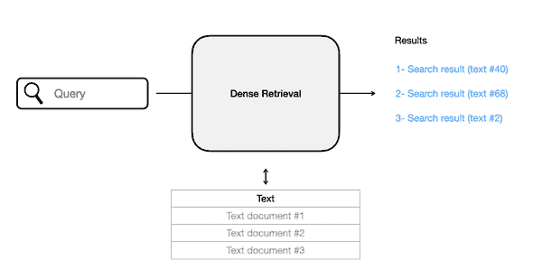

###### 图 2-1\. 密集检索是语义搜索的关键类型之一，依赖文本嵌入的相似性来检索相关结果。

2- 重新排序

这些系统是多个步骤的管道。重排序 LLM 是这些步骤之一，负责对结果子集相对于查询的相关性进行评分，然后根据这些评分更改结果的顺序。图 2-2 显示了重排序器如何不同于密集检索，因为它们需要额外的输入：来自搜索管道前一步的搜索结果集。

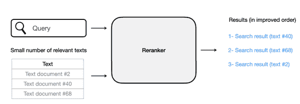

###### 图 2-2\. 重排序器，第二种关键的语义搜索类型，接收搜索查询和结果集合，并根据相关性重新排序，通常会显著改善结果。

3- 生成搜索

不断增长的文本生成 LLM 能力导致了一批新的搜索系统，其中包括一个生成模型，它简单地对查询生成答案。图 2-3 显示了一个生成搜索的例子。

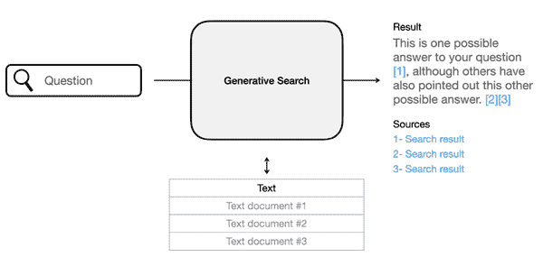

###### 图 2-3\. 生成搜索针对问题生成答案并引用其信息来源。

这三种概念都很强大，可以在同一流程中结合使用。本章其余部分将更详细地介绍这三种系统。虽然这些是主要类别，但它们并不是搜索领域中唯一的 LLM 应用。

# 密集检索

回想一下，嵌入将文本转换为数字表示。这些可以被视为空间中的点，如我们在图 2-4 中所见。接近的点意味着它们所代表的文本是相似的。因此在这个例子中，文本 1 和文本 2 彼此相似（因为它们靠近），而与文本 3 不同（因为它更远）。

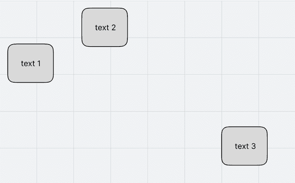

###### 图 2-4\. 嵌入的直观理解：每段文本都是一个点，含义相似的文本彼此接近。

这是用于构建搜索系统的属性。在这种情况下，当用户输入搜索查询时，我们将查询嵌入，从而将其投影到与我们的文本档案相同的空间中。然后，我们只需在该空间中找到与查询最接近的文档，这些文档就是搜索结果。

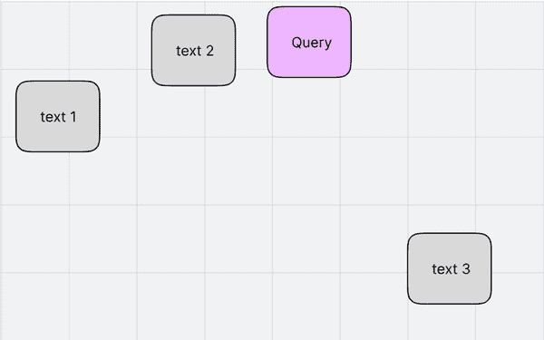

###### 图 2-5\. 密集检索依赖于搜索查询与相关结果之间的接近性。

根据图 2-5 中的距离，“文本 2”是这个查询的最佳结果，其次是“文本 1”。但是，这里可能会出现两个问题：

文本 3 是否应该被返回作为结果？这是你作为系统设计者的决定。有时需要设置一个最大相似度分数的阈值，以过滤掉不相关的结果（以防语料库中没有与查询相关的结果）。

查询及其最佳结果在语义上相似吗？不一定。这就是为什么语言模型需要在问答对上进行训练，以便在检索方面变得更好的原因。这个过程在第十三章中有更详细的说明。

## 密集检索示例

让我们通过使用 Cohere 搜索维基百科关于电影*星际穿越*的页面来看一个密集检索示例。在这个示例中，我们将执行以下操作：

1.  获取我们想要使其可搜索的文本，对其进行一些轻处理以将其拆分成句子。

1.  嵌入句子

1.  构建搜索索引

1.  搜索并查看结果

首先，我们需要安装示例所需的库：

```py
# Install Cohere for embeddings, Annoy for approximate nearest neighbor search
!pip install cohere tqdm Annoy
```

通过在 https://cohere.ai/注册获取你的 Cohere API 密钥。将其粘贴到下面的单元格中。你在运行这个示例时无需支付任何费用。

让我们导入所需的数据集：

```py
import cohere
import numpy as np
import re
import pandas as pd
from tqdm import tqdm
from sklearn.metrics.pairwise import cosine_similarity
from annoy import AnnoyIndex

# Paste your API key here. Remember to not share publicly
api_key = ''

# Create and retrieve a Cohere API key from os.cohere.ai
co = cohere.Client(api_key)

```

1.  获取文本档案

    让我们使用维基百科关于电影*星际穿越*的第一部分。https://en.wikipedia.org/wiki/Interstellar_(film)。我们将获取文本，然后将其拆分成句子。

    ```py
    text = """
    Interstellar is a 2014 epic science fiction film co-written, directed, and produced by Christopher Nolan. 
    It stars Matthew McConaughey, Anne Hathaway, Jessica Chastain, Bill Irwin, Ellen Burstyn, Matt Damon, and Michael Caine. 
    Set in a dystopian future where humanity is struggling to survive, the film follows a group of astronauts who travel through a wormhole near Saturn in search of a new home for mankind.

    Brothers Christopher and Jonathan Nolan wrote the screenplay, which had its origins in a script Jonathan developed in 2007\. 
    Caltech theoretical physicist and 2017 Nobel laureate in Physics[4] Kip Thorne was an executive producer, acted as a scientific consultant, and wrote a tie-in book, The Science of Interstellar. 
    Cinematographer Hoyte van Hoytema shot it on 35 mm movie film in the Panavision anamorphic format and IMAX 70 mm. 
    Principal photography began in late 2013 and took place in Alberta, Iceland, and Los Angeles. 
    Interstellar uses extensive practical and miniature effects and the company Double Negative created additional digital effects.

    Interstellar premiered on October 26, 2014, in Los Angeles. 
    In the United States, it was first released on film stock, expanding to venues using digital projectors. 
    The film had a worldwide gross over $677 million (and $773 million with subsequent re-releases), making it the tenth-highest grossing film of 2014\. 
    It received acclaim for its performances, direction, screenplay, musical score, visual effects, ambition, themes, and emotional weight. 
    It has also received praise from many astronomers for its scientific accuracy and portrayal of theoretical astrophysics. Since its premiere, Interstellar gained a cult following,[5] and now is regarded by many sci-fi experts as one of the best science-fiction films of all time.
    Interstellar was nominated for five awards at the 87th Academy Awards, winning Best Visual Effects, and received numerous other accolades"""
    # Split into a list of sentences
    texts = text.split('.')

    # Clean up to remove empty spaces and new lines
    texts = np.array([t.strip(' \n') for t in texts])
    ```

1.  嵌入文本

    让我们现在嵌入文本。我们将把它们发送到 Cohere API，并为每个文本返回一个向量。

    ```py
    # Get the embeddings
    response = co.embed(
      texts=texts,
    ).embeddings

    embeds = np.array(response)
    print(embeds.shape)
    ```

    输出如下：

    (15, 4096)

    表明我们有 15 个向量，每个向量的大小为 4096。

1.  构建搜索索引

    在我们可以搜索之前，我们需要构建一个搜索索引。索引存储嵌入，并被优化为快速检索最近邻，即使我们有非常大量的点。

    ```py
    # Create the search index, pass the size of embedding
    search_index = AnnoyIndex(embeds.shape[1], 'angular')

    # Add all the vectors to the search index
    for index, embed in enumerate(embeds):
        search_index.add_item(index, embed)

    search_index.build(10) 
    search_index.save('test.ann')
    ```

1.  搜索索引

    现在我们可以使用任何我们想要的查询来搜索数据集。我们只需嵌入查询，并将其嵌入呈现给索引，索引将检索出最相似的文本。

    让我们定义我们的搜索函数：

    ```py
    def search(query):

      # 1\. Get the query's embedding
      query_embed = co.embed(texts=[query]).embeddings[0]

      # 2\. Retrieve the nearest neighbors
      similar_item_ids = search_index.get_nns_by_vector(query_embed, n=3,
                                                      include_distances=True)
      # 3\. Format the results
      results = pd.DataFrame(data={'texts': texts[similar_item_ids[0]], 
                                  'distance': similar_item_ids[1]})

      # 4\. Print and return the results
      print(f"Query:'{query}'\nNearest neighbors:")
      return results
    ```

    我们现在准备好写查询并搜索文本了！

    ```py
    query = "How much did the film make?"
    search(query)
    ```

    这产生的输出为：

    ```py
    Query:'How much did the film make?'
    Nearest neighbors:
    ```

    |  |
    | --- |

    ```py
    texts
    ```

    |

    ```py
    distance
    ```

    |

    |

    ```py
    0
    ```

    |

    ```py
    The film had a worldwide gross over $677 million (and $773 million with subsequent re-releases), making it the tenth-highest grossing film of 2014
    ```

    |

    ```py
    0.815905
    ```

    |

    |

    ```py
    1
    ```

    |

    ```py
    It stars Matthew McConaughey, Anne Hathaway, Jessica Chastain, Bill Irwin, Ellen Burstyn, Matt Damon, and Michael Caine
    ```

    |

    ```py
    1.066861
    ```

    |

    |

    ```py
    2
    ```

    |

    ```py
    In the United States, it was first released on film stock, expanding to venues using digital projectors
    ```

    |

    ```py
    1.086919
    ```

    |

第一个结果的距离最小，因此与查询最相似。查看它，它完美地回答了问题。请注意，如果我们仅进行关键字搜索，这是不可能的，因为最佳结果中不包含“much”或“make”这两个词。

为了进一步说明密集检索的能力，这里有一个查询列表及每个查询的最佳结果：

查询：“告诉我关于$$$的事情？”

最佳结果：这部电影在全球的总票房超过 6.77 亿美元（与后来的重映一起为 7.73 亿美元），成为 2014 年票房第十高的电影。

距离：1.244138

查询：“哪些演员参与了？”

顶部结果：它由马修·麦康纳、安妮·海瑟薇、杰西卡·查斯坦、比尔·欧文、艾伦·伯斯廷、马特·达蒙和迈克尔·凯恩主演。

距离：0.917728

查询：“这部电影是如何上映的？”

顶部结果：在美国，它最初是在胶卷上发布的，扩展到使用数字放映机的场所。

距离：0.871881

### 密集检索的注意事项

了解密集检索的一些缺点及其解决方法是有用的。例如，如果文本中不包含答案，会发生什么？我们仍然会得到结果及其距离。例如：

```py
Query:'What is the mass of the moon?'
Nearest neighbors:
```

|  |
| --- |

```py
texts
```

|

```py
distance
```

|

|

```py
0
```

|

```py
The film had a worldwide gross over $677 million (and $773 million with subsequent re-releases), making it the tenth-highest grossing film of 2014
```

|

```py
1.298275
```

|

|

```py
1
```

|

```py
It has also received praise from many astronomers for its scientific accuracy and portrayal of theoretical astrophysics
```

|

```py
1.324389
```

|

|

```py
2
```

|

```py
Cinematographer Hoyte van Hoytema shot it on 35 mm movie film in the Panavision anamorphic format and IMAX 70 mm
```

|

```py
1.328375
```

|

在这种情况下，一个可能的启发式方法是设定一个阈值水平——例如，相关性的最大距离。许多搜索系统向用户提供他们能获取的最佳信息，并由用户决定其相关性。跟踪用户是否点击了结果（并对此感到满意）的信息，可以改善未来版本的搜索系统。

密集检索的另一个注意事项是用户希望找到与其正在寻找的文本完全匹配的情况。这种情况非常适合关键词匹配。这也是为什么同时包括语义搜索和关键词搜索的混合搜索被使用的原因之一。

密集检索系统在训练以外的领域中正常工作也面临挑战。例如，如果你在互联网和维基百科数据上训练检索模型，然后在法律文本上部署（而训练集中没有足够的法律数据），模型在法律领域的表现将不佳。

我们想指出的最后一点是，这是一个每个句子包含一条信息的情况，我们展示了具体询问这些信息的查询。那么，对于答案跨越多个句子的提问呢？这显示了密集检索系统的一个重要设计参数：分块长文本的最佳方法是什么？我们为什么要首先进行分块？

## 长文本分块

Transformer 语言模型的一个限制是它们的上下文大小有限。这意味着我们不能输入超过模型支持的某个字数或标记数量的非常长的文本。那么我们如何嵌入长文本呢？

有几种可能的方法，图 2-6 中展示的两种可能方法包括每个文档索引一个向量，以及每个文档索引多个向量。

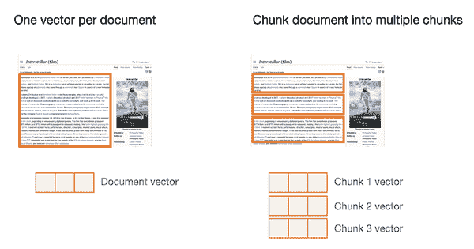

###### 图 2-6\. 可以创建一个向量来表示整个文档，但对于较长的文档，将其分割成较小的块以获取各自的嵌入更好。

### 每个文档一个向量

在这种方法中，我们使用单个向量来表示整个文档。这里的可能性包括：

+   仅嵌入文档的代表部分而忽略其余文本。这可能意味着仅嵌入标题或文档的开头。这对于快速开始构建演示非常有用，但会留下大量未索引的信息，因此不可搜索。作为一种方法，它可能更适合于那些开头捕获文档主要观点的文档（例如：维基百科文章）。但这并不是一个真正系统的最佳方法。

+   将文档分块、嵌入这些块，然后将这些块聚合为单个向量。这里常用的聚合方法是对这些向量取平均。该方法的一个缺点是会产生一个高度压缩的向量，导致文档中大量信息丢失。

这种方法可以满足某些信息需求，但不能满足其他需求。很多时候，搜索的是包含在文章中的特定信息，如果该概念有自己的向量，捕获效果会更好。

### 每个文档多个向量

在这种方法中，我们将文档分块为更小的部分，并嵌入这些块。我们的搜索索引因此变为块嵌入，而不是整个文档的嵌入。

分块方法更好，因为它全面覆盖了文本，并且向量倾向于捕获文本中的单个概念。这导致了更具表现力的搜索索引。图 X-3 展示了一些可能的方法。

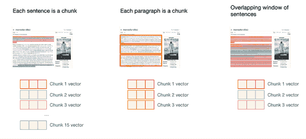

###### 图 2-7\. 多种用于嵌入文档的分块选项。

对长文本的最佳分块方式将取决于系统预期的文本类型和查询。方法包括：

+   每个句子是一个块。这里的问题是这可能过于细化，向量无法捕获足够的上下文。

+   每个段落是一个块。如果文本由短段落组成，这很棒。否则，可能每 4-8 句话是一个块。

+   一些块的意义来自于周围的文本。因此，我们可以通过以下方式结合一些上下文：

    +   将文档的标题添加到块中。

    +   在块中添加一些前后的文本。这样，块可以重叠，从而包括一些周围文本。这就是我们在图 2-8 中看到的。

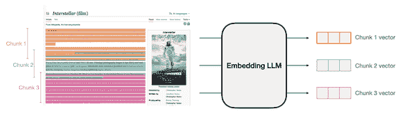

###### 图 2-8\. 将文本分块为重叠片段是一种保留不同片段周围更多上下文的策略。

随着该领域的发展，预计会出现更多的分块策略——其中一些甚至可能使用 LLM 动态地将文本分割成有意义的块。

## 最近邻搜索与向量数据库

找到最近邻的最简单方法是计算查询与档案之间的距离。这可以很容易地用 NumPy 实现，如果你的档案中有成千上万或几万个向量，这也是一种合理的方法。

当你扩展到数百万个向量时，优化检索的方式是依赖于近似最近邻搜索库，如 Annoy 或 FAISS。这些库允许你在毫秒内从巨大的索引中检索结果，有些可以扩展到 GPU 和机器集群，以服务非常大的索引。

另一类向量检索系统是像 Weaviate 或 Pinecone 这样的向量数据库。向量数据库允许你添加或删除向量，而无需重建索引。它们还提供了超越单纯向量距离的搜索过滤或自定义的方法。

## 为密集检索微调嵌入模型

就像我们在文本分类章节中看到的那样，我们可以通过微调提高大型语言模型在某项任务上的表现。和那种情况一样，检索需要优化文本嵌入，而不仅仅是令牌嵌入。这个微调过程的目标是获取由查询和相关结果组成的训练数据。

看一个来自我们数据集的例子，句子“《星际穿越》于 2014 年 10 月 26 日在洛杉矶首映。”。两个可能的相关查询是：

+   相关查询 1：“《星际穿越》发布日期”

+   相关查询 2：“《星际穿越》什么时候首映”

微调过程的目的是使这些查询的嵌入接近结果句子的嵌入。它还需要看到与句子不相关的查询的负示例。

+   无关查询：“星际穿越演员表”

有了这些示例，我们现在有三对——两对正样本和一对负样本。假设，如我们在图 2-9 中看到的，微调之前，这三条查询与结果文档的距离相同。这并不牵强，因为它们都是在谈论《星际穿越》。

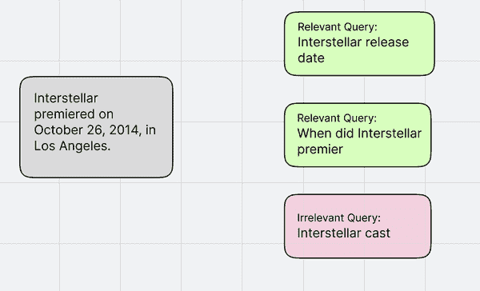

###### 图 2-9。微调之前，相关和无关查询的嵌入可能接近某个特定文档。

微调步骤的目的是使相关查询更靠近文档，同时使无关查询远离文档。我们可以在图 2-10 中看到这一效果。

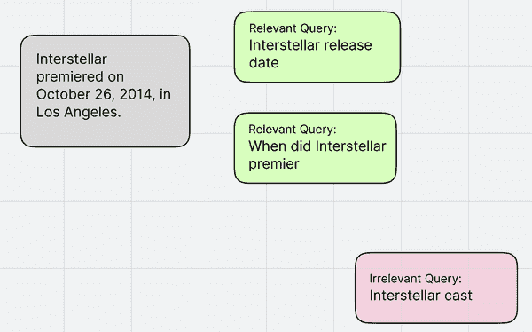

###### 图 2-10\. 经过微调过程后，文本嵌入模型通过结合我们使用相关和不相关文档的示例来定义数据集上的相关性，从而在这一搜索任务上变得更好。

# 重新排序

很多公司已经建立了搜索系统。对于这些公司，整合语言模型的更简单方法是作为其搜索管道中的最后一步。此步骤的任务是根据搜索查询的相关性改变搜索结果的顺序。这一步可以大大改善搜索结果，实际上这是微软必应为使用类似 BERT 模型改善搜索结果而添加的功能。

图 2-11 展示了作为两阶段搜索系统第二阶段的重新排序搜索系统的结构。

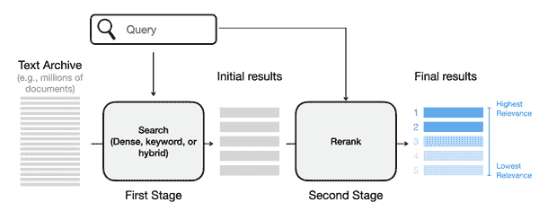

###### 图 2-11\. LLM 重新排序器作为搜索管道的一部分，旨在根据相关性重新排列一组筛选后的搜索结果

## 重新排序示例

重新排序模型接收搜索查询和多个搜索结果，并返回这些文档的最佳排序，使得与查询最相关的文档排名更高。

```py
import cohere as co
API_KEY = ""
co = cohere.Client(API_KEY)
MODEL_NAME = "rerank-english-02" # another option is rerank-multilingual-02

query = "film gross"
```

Cohere 的[Rerank](https://docs.cohere.com/reference/rerank-1)端点是开始使用第一重新排序模型的简单方式。我们只需传入查询和文本，就能得到结果。我们无需对其进行训练或调整。

```py
results = co.rerank(query=query, model=MODEL_NAME, documents=texts, top_n=3)
```

我们可以打印这些结果：

```py
results = co.rerank(query=query, model=MODEL_NAME, documents=texts, top_n=3) # Change top_n to change the number of results returned. If top_n is not passed, all results will be returned.
for idx, r in enumerate(results):
  print(f"Document Rank: {idx + 1}, Document Index: {r.index}")
  print(f"Document: {r.document['text']}")
  print(f"Relevance Score: {r.relevance_score:.2f}")
  print("\n")
```

输出：

```py
Document Rank: 1, Document Index: 10
Document: The film had a worldwide gross over $677 million (and $773 million with subsequent re-releases), making it the tenth-highest grossing film of 2014
Relevance Score: 0.92

Document Rank: 2, Document Index: 12
Document: It has also received praise from many astronomers for its scientific accuracy and portrayal of theoretical astrophysics
Relevance Score: 0.11

Document Rank: 3, Document Index: 2
Document: Set in a dystopian future where humanity is struggling to survive, the film follows a group of astronauts who travel through a wormhole near Saturn in search of a new home for mankind
Relevance Score: 0.03

```

这表明，重新排序模型对第一个结果的信心更高，为其分配了 0.92 的相关性评分，而其他结果的评分则明显较低。

然而，更常见的是，我们的索引会有数千或数百万个条目，我们需要筛选出，比如说一百或一千个结果，然后将这些结果呈现给重新排序模型。这个筛选过程被称为搜索管道的*第一阶段*。

我们在上一节中看到的密集检索器示例是一个可能的第一阶段检索器。在实践中，第一阶段也可以是一个结合了关键词搜索和密集检索的搜索系统。

## 使用句子转换器的开源检索和重新排序

如果你想在自己的机器上本地设置检索和重新排序，那么你可以使用句子转换器库。请参考 https://www.sbert.net/ 中的文档进行设置。查看[*检索与重新排序*部分](https://www.sbert.net/examples/applications/retrieve_rerank/README.html)以获取如何在库中进行这些步骤的说明和代码示例。

## 重新排序模型的工作原理

一种流行的构建 LLM 搜索重排序器的方法是将查询和每个结果同时呈现给作为*交叉编码器*工作的 LLM。这意味着查询和可能的结果同时呈现给模型，使其在分配相关性得分之前能够查看这两段文本的完整内容。该方法在一篇题为 [*多阶段文档排名与 BERT*](https://arxiv.org/abs/1910.14424) 的论文中有更详细的描述，有时被称为 monoBERT。

将搜索形式化为相关性评分基本上归结为分类问题。给定这些输入，模型输出一个从 0 到 1 的得分，其中 0 是不相关，1 是高度相关。这应该在查看分类章节时是熟悉的。

要了解更多关于使用 LLM 进行搜索的发展，可以参考 [*预训练变换器进行文本排名：BERT 及其后续*](https://arxiv.org/abs/2010.06467)，这是对这些模型直到 2021 年的发展进行的高度推荐的观察。

# 生成搜索

你可能注意到，密集检索和重排序都使用表示语言模型，而不是生成语言模型。这是因为它们在这些任务上比生成模型更优化。

然而，在某个规模上，生成 LLM 开始显得越来越能够进行有用的信息检索。人们开始向像 ChatGPT 这样的模型提问，有时得到了相关的答案。媒体开始将其描绘为对谷歌的威胁，这似乎引发了一场在搜索中使用语言模型的军备竞赛。微软 [推出](https://blogs.microsoft.com/blog/2023/02/07/reinventing-search-with-a-new-ai-powered-microsoft-bing-and-edge-your-copilot-for-the-web/) 了由生成模型驱动的 Bing AI。谷歌推出了 [Bard](https://blogs.microsoft.com/blog/2023/02/07/reinventing-search-with-a-new-ai-powered-microsoft-bing-and-edge-your-copilot-for-the-web/)，这是它在这个领域的回应。

## 什么是生成搜索？

生成搜索系统在搜索流程中包括文本生成步骤。然而，目前，生成 LLM 不是可靠的信息检索工具，容易生成连贯但通常不正确的文本来回应它们不知道答案的问题。

第一批生成搜索系统仅将搜索模型作为搜索流程末尾的总结步骤。我们可以在 图 2-12 中看到一个例子。

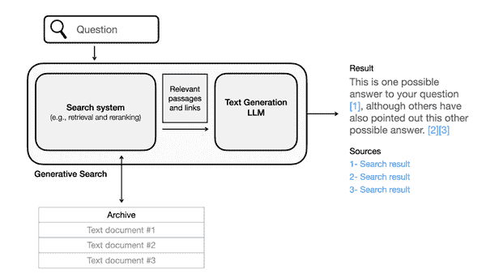

###### 图 2-12\. 生成搜索在搜索流程的末尾制定答案和摘要，同时引用其来源（由搜索系统之前的步骤返回）。

然而，在撰写本文时，语言模型在生成连贯文本方面表现出色，但在检索事实时并不可靠。它们尚未真正知道自己知道或不知道什么，往往用连贯的文本回答许多问题，但可能是错误的。这通常被称为*幻觉*。因此，由于搜索常常依赖于事实或引用现有文档，生成搜索模型被训练以引用其来源并在答案中包含链接。

生成搜索仍处于初期阶段，预计会随着时间的推移而改善。它源自一个叫做检索增强生成的机器学习研究领域。该领域的显著系统包括[RAG](https://ai.facebook.com/blog/retrieval-augmented-generation-streamlining-the-creation-of-intelligent-natural-language-processing-models/)、[RETRO](https://jalammar.github.io/illustrated-retrieval-transformer/)和[Atlas](https://arxiv.org/pdf/2208.03299.pdf)等。

# 搜索中其他 LLM 应用

除了这三类之外，还有很多其他方式可以使用 LLM 来推动或改善搜索系统。例子包括：

+   生成合成数据以改进嵌入模型。这包括像[GenQ](https://www.pinecone.io/learn/genq/)和[InPars-v2](https://arxiv.org/abs/2301.01820)等方法，它们查看文档，生成关于这些文档的可能查询和问题，然后使用生成的数据微调检索系统。

+   文本生成模型日益增长的推理能力使搜索系统能够通过将复杂问题和查询分解为多个子查询来逐步解决，最终得到原始问题的答案。该类别中的一种方法在[*Demonstrate-Search-Predict: 组合检索和语言模型以进行知识密集型 NLP*](https://arxiv.org/abs/2212.14024)中有所描述。

## 评估指标

语义搜索使用信息检索（IR）领域的指标进行评估。让我们讨论这两个流行指标：平均精确度（MAP）和标准化折扣累积增益（nDCG）。

评估搜索系统需要三个主要[组件](https://nlp.stanford.edu/IR-book/html/htmledition/irbook.html)：文本档案、一组查询和相关性判断，指示哪些文档与每个查询相关。我们在图 3-13 中看到了这些组件。


###### 图 2-13。要评估搜索系统，我们需要一个测试套件，包括查询和相关性判断，指示我们档案中的哪些文档与每个查询相关。

使用这个测试套件，我们可以开始探索评估搜索系统。让我们从一个简单的例子开始，假设我们将查询 1 传递给两个不同的搜索系统，并获得两个结果集。假设我们将结果数量限制为仅三个，如在图 2-14 中所示。

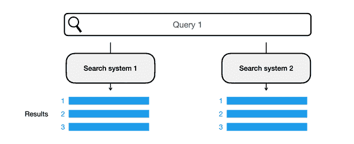

###### 图 2-14。为了比较两个搜索系统，我们将测试套件中的同一查询传递给两个系统，并查看它们的顶部结果。

为了判断哪个系统更好，我们查看针对该查询的相关性判断。图 2-15 显示了哪些返回的结果是相关的。

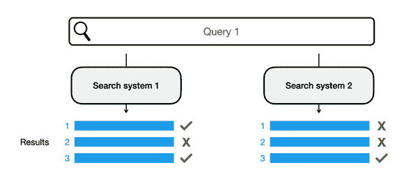

###### 图 2-15。从我们的测试套件查看相关性判断，我们可以看到系统 1 比系统 2 表现更好。

这向我们展示了一个清晰的案例，系统 1 优于系统 2。直观上，我们可能只计算每个系统检索到的相关结果数量。系统 A 正确获取了三个中的两个，而系统 2 仅正确获取了三个中的一个。

但是，对于像图 3-16 这样的情况，两个系统都只获得了三个中的一个相关结果，但它们的位置不同，该如何处理呢？

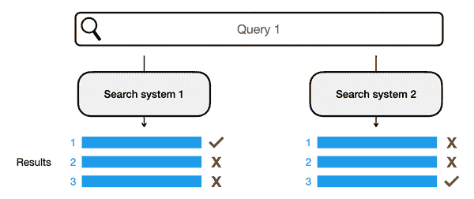

###### 图 2-16。我们需要一个评分系统，该系统奖励系统 1 为相关结果分配高位，即使两个系统在其前三个结果中仅检索到一个相关结果。

在这种情况下，我们可以直观地判断系统 1 比系统 2 表现更好，因为第一个位置（最重要的位置）的结果是正确的。但我们如何为该结果的优越性分配一个数字或评分呢？均值平均精度是一个能够量化这种区别的度量。

在这种情况下，分配数字评分的一个常见方法是平均精度，它评估系统 1 对该查询的结果为 0.6，而系统 2 的结果为 0.1。因此，让我们看看如何计算平均精度来评估一组结果，然后如何将其聚合以评估整个测试套件中的系统。

### 均值平均精度（MAP）

为了对系统 1 进行评分，我们需要首先计算多个分数。由于我们只关注三个结果，因此我们需要查看三个分数——与每个位置相关联的一个分数。

第一个很简单，只看第一个结果，我们计算精度分数：将正确结果的数量除以结果的总数（正确和不正确）。图 2-17 显示，在这种情况下，我们在第一个位置上有一个正确结果。因此，精度为 1/1 = 1。


###### 图 2-17\. 计算均值平均精度时，我们从计算每个位置的精度开始，从第 1 个位置开始。

我们需要继续计算其余位置的精度结果。第二个位置的计算考虑了第一个和第二个位置。这里的精度分数为 1（两个结果中有一个是正确的）除以 2（我们正在评估的两个结果）= 0.5。

图 2-18 继续计算第二和第三个位置的精度。接下来更进一步——在计算每个位置的精度后，我们将它们平均得到平均精度分数为 0.61。


###### 图 2-18\. 标题待补充

该计算显示了单个查询及其结果的平均精度。如果我们计算系统 1 在测试套件中所有查询的平均精度并得出它们的均值，我们可以得到均值平均精度分数，从而可以将系统 1 与测试套件中其他系统进行比较。

# 摘要

在本章中，我们探讨了使用语言模型来改善现有搜索系统的不同方法，甚至作为新型、更强大搜索系统的核心。这些包括：

+   密集检索依赖于文本嵌入的相似性。这些系统将搜索查询嵌入并检索与查询嵌入最接近的文档。

+   重新排序器（如 monoBERT），这些系统查看查询和候选结果，并对每个文档与该查询的相关性进行评分。这些相关性评分用于根据其与查询的相关性对入围结果进行排序，通常能产生改进的结果排名。

+   生成式搜索，指的是在管道末端具有生成性 LLM 的搜索系统，基于检索到的文档来形成答案，同时引用其来源。

我们还探讨了一种可能的搜索系统评估方法。均值平均精度允许我们为搜索系统评分，以便在查询的测试套件及其已知相关性之间进行比较。
