# 第三章： 文本聚类与主题建模

尽管监督技术，如分类，在过去几年中在行业中占据主导地位，但无监督技术（如文本聚类）的潜力不可低估。

文本聚类旨在根据其语义内容、意义和关系对相似文本进行分组，如图 3-1 所示。正如我们在第 XXX 章中使用文本嵌入之间的距离进行密集检索一样，聚类嵌入使我们能够根据相似性对档案中的文档进行分组。

语义相似文档的聚类结果不仅促进了对大量非结构化文本的高效分类，还允许快速的探索性数据分析。随着大型语言模型（LLMs）的出现，能够提供文本的上下文和语义表示，文本聚类的力量在过去几年中显著增强。语言不是一袋单词，大型语言模型已证明能够很好地捕捉这一概念。

文本聚类的一个被低估的方面是其创造性解决方案和实施的潜力。从某种意义上说，无监督意味着我们不受限于某个特定的任务或我们想要优化的事物。因此，文本聚类中有很大的自由度，使我们能够偏离常规路径。尽管文本聚类自然会用于文档的分组和分类，但它还可以用于算法性和视觉上发现不恰当的标签，进行主题建模，加速标记，以及许多其他有趣的用例。

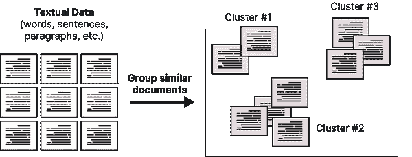

###### 图 3-1\. 聚类非结构化文本数据。

这种自由也带来了挑战。由于我们没有特定任务的指导，那么我们如何评估我们的无监督聚类输出？我们如何优化我们的算法？没有标签，我们在优化算法的目标是什么？我们什么时候知道我们的算法是正确的？算法“正确”意味着什么？尽管这些挑战可能相当复杂，但并非不可逾越，通常需要一些创造力和对用例的良好理解。

在文本聚类的自由与其带来的挑战之间取得平衡可能相当困难。如果我们进入主题建模的世界，这种平衡变得更加明显，因为主题建模开始采用“文本聚类”的思维方式。

通过主题建模，我们希望发现出现在大型文本数据集中的抽象主题。我们可以用多种方式描述主题，但它通常由一组关键字或短语描述。有关自然语言处理（NLP）的主题可以用“深度学习”、“变换器”和“自注意力”等术语来描述。传统上，我们期望关于特定主题的文档包含的术语出现频率高于其他术语。然而，这种期望忽略了文档可能包含的上下文信息。相反，我们可以利用大型语言模型结合文本聚类来建模上下文化的文本信息并提取语义相关的主题。图 3-2 展示了通过文本表示描述集群的想法。

*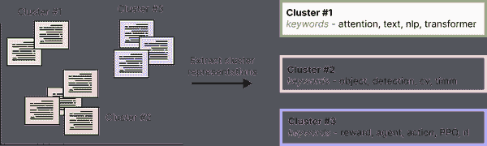 

###### 图 3-2\. 主题建模是一种赋予文本文件集群意义的方法。* *在本章中，我们将提供关于如何使用大型语言模型进行文本聚类的指南。然后，我们将转向一种受文本聚类启发的主题建模方法，即 BERTopic。*

# 文本聚类

NLP 中探索性数据分析的一个主要组成部分是文本聚类。这种无监督技术旨在将相似的文本或文档分组，以便轻松发现大量文本数据中的模式。在深入分类任务之前，文本聚类可以帮助我们直观理解任务及其复杂性。

从文本聚类中发现的模式可以应用于多种商业用例。从识别重复的支持问题和发现新内容以推动 SEO 实践，到检测社交媒体中的主题趋势和发现重复内容，可能性多种多样，运用这样的技术，创造力成为关键要素。因此，文本聚类不仅仅是快速进行探索性数据分析的方法。

## 数据

在描述如何进行文本聚类之前，我们将首先介绍在本章中将使用的数据。为了保持本书的主题，我们将对机器学习和自然语言处理领域的各种 ArXiv 文章进行聚类。该数据集包含大约**XXX**篇文章，时间跨度为**XXX**到**XXX**。

我们首先使用[HuggingFace 的数据集包](https://github.com/huggingface/datasets)导入我们的数据集，并提取稍后要使用的元数据，例如文章的摘要、年份和类别。

```py
# Load data from huggingface
from datasets import load_dataset
dataset = load_dataset("maartengr/arxiv_nlp")["train"]

# Extract specific metadata
abstracts = dataset["Abstracts"]
years = dataset["Years"]
categories = dataset["Categories"]
titles = dataset["Titles"]
```

## 我们如何进行文本聚类？

现在我们有了数据，可以进行文本聚类。进行文本聚类时，可以采用多种技术，从基于图的神经网络到基于中心的聚类技术。在这一部分，我们将介绍一种著名的文本聚类流程，包括三个主要步骤：

1.  嵌入文档

1.  降维

1.  聚类嵌入

### 1\. 嵌入文档

聚类文本数据的第一步是将我们的文本数据转换为文本嵌入。回想前面的章节，嵌入是文本的数值表示，捕捉其含义。为语义相似性任务优化的嵌入对于聚类尤为重要。通过将每个文档映射到数值表示，使语义相似的文档彼此接近，聚类将变得更加强大。一组为这些任务优化的流行大型语言模型可以在著名的句子转换器框架中找到（reimers2019sentence）。图 3-3 展示了将文档转换为数值表示的第一步。

*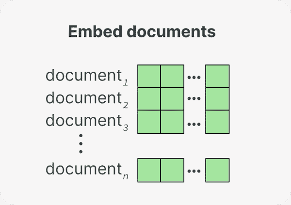

###### 图 3-3\. 第一步：我们将文档转换为数值表示，即嵌入。* *句子转换器具有清晰的 API，可以如下所示从文本片段生成嵌入：

```py
from sentence_transformers import SentenceTransformer

# We load our model
embedding_model = SentenceTransformer('all-MiniLM-L6-v2')

# The abstracts are converted to vector representations
embeddings = model.encode(abstracts)
```

这些嵌入的大小因模型而异，但通常每个句子或段落至少包含 384 个值。嵌入所包含的值的数量称为嵌入的维度。* *### 2\. 降维

在我们聚类从 ArXiv 摘要生成的嵌入之前，我们首先需要处理维度灾难。这个诅咒是在处理高维数据时出现的现象。随着维度的增加，每个维度内可能值的数量呈指数级增长。在每个维度内找到所有子空间变得越来越复杂。此外，随着维度的增加，点之间的距离概念变得越来越不精确。

因此，高维数据对于许多聚类技术来说可能是麻烦的，因为识别有意义的聚类变得更加困难。聚类变得更加分散和难以区分，使得准确识别和分离它们变得困难。

先前生成的嵌入具有较高的维度，通常会引发维度灾难。为了防止维度成为问题，我们聚类管道中的第二步是降维，如图 3-4 所示。

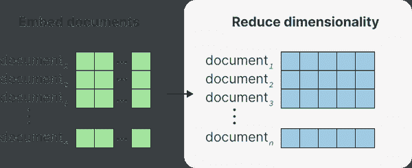

###### 图 3-4\. 第 2 步：嵌入通过维度减少被降低到一个低维空间。

维度减少技术旨在通过寻找低维表示来保留高维数据的全局结构。著名的方法包括主成分分析（PCA）和均匀流形近似与投影（UMAP; mcinnes2018umap）。对于这个流程，我们选择 UMAP，因为它通常比 PCA 更好地处理非线性关系和结构。

###### 注意

然而，维度减少技术并非完美无缺。它们无法完美地将高维数据捕捉到低维表示中。在这个过程中信息总会有所丢失。在减少维度和尽可能保留信息之间存在平衡。

为了进行维度减少，我们需要实例化我们的 UMAP 类并将生成的嵌入传递给它：

```py
from umap import UMAP

# We instantiate our UMAP model
umap_model = UMAP(n_neighbors=15, n_components=5, min_dist=0.0, metric='cosine')

# We fit and transform our embeddings to reduce them
reduced_embeddings = umap_model.fit_transform(embeddings)
```

我们可以使用``n_components``参数来决定低维空间的形状。在这里，我们使用了``n_components=5``，因为我们希望尽可能保留信息而不陷入维度灾难。没有哪个值比另一个更好，因此请随意尝试！

### 3\. 聚类嵌入

如图 3-5 所示，我们流程中的最后一步是对之前减少的嵌入进行聚类。许多算法能够很好地处理聚类任务，从基于质心的方法如 k-Means 到层次方法如凝聚聚类。选择取决于用户，并受到相应用例的高度影响。我们的数据可能包含一些噪声，因此更倾向于使用能检测异常值的聚类算法。如果我们的数据是每日产生的，我们可能希望寻找在线或增量的方法来建模是否创建了新的聚类。

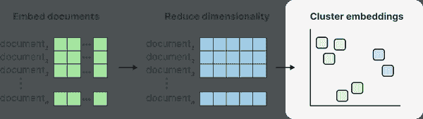

###### 图 3-5\. 第 3 步：我们使用减少维度的嵌入对文档进行聚类。

一个好的默认模型是基于密度的空间聚类算法（HDBSCAN; mcinnes2017hdbscan）。HDBSCAN 是名为 DBSCAN 的聚类算法的一种层次变体，允许找到密集（微）聚类，而无需明确指定聚类数量。作为一种基于密度的方法，它也可以检测数据中的异常值。数据点如果不属于任何聚类。这一点很重要，因为强行将数据归入聚类可能会产生噪声聚合。

与之前的包一样，使用 HDBSCAN 非常简单。我们只需实例化模型并将我们的减少嵌入传递给它：

```py
from hdbscan import HDBSCAN

# We instantiate our HDBSCAN model
hdbscan_model = HDBSCAN(min_cluster_size=15, metric='euclidean', cluster_selection_method='eom')

# We fit our model and extract the cluster labels
hdbscan_model.fit(reduced_embeddings)
labels = hdbscan_model.labels_
```

然后，利用我们之前生成的 2D 嵌入，我们可以可视化 HDBSCAN 如何对数据进行聚类：

```py
import seaborn as sns

# Reduce 384-dimensional embeddings to 2 dimensions for easier visualization
reduced_embeddings = UMAP(n_neighbors=15, n_components=2, 
min_dist=0.0, metric='cosine').fit_transform(embeddings)
df = pd.DataFrame(np.hstack([reduced_embeddings, clusters.reshape(-1, 1)]),
     columns=["x", "y", "cluster"]).sort_values("cluster")

# Visualize clusters
df.cluster = df.cluster.astype(int).astype(str)
sns.scatterplot(data=df, x='x', y='y', hue='cluster', 
   linewidth=0, legend=False, s=3, alpha=0.3)
```

如我们在图 3-6 中看到的，它能够很好地捕捉主要聚类。注意这些点的聚类被涂成相同的颜色，表明 HDBSCAN 将它们分为一组。由于我们有大量聚类，绘图库在聚类之间循环颜色，所以不要认为所有蓝色点都是一个聚类，例如。

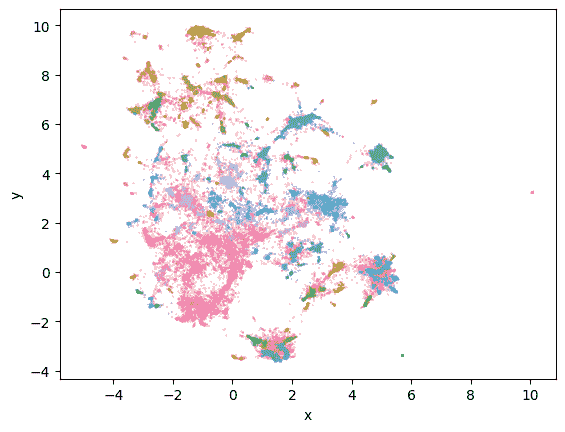

###### 图 3-6\. 生成的聚类（彩色）和离群点（灰色）作为 2D 可视化呈现。

###### 注意

任何用于可视化目的的降维技术都会导致信息损失。这仅仅是对我们原始嵌入的近似。尽管这很有信息量，但它可能将聚类推得更近或更远于它们实际的位置。因此，人类评估，亲自检查聚类，是聚类分析的关键组成部分！

我们可以手动检查每个聚类，以查看哪些文档在语义上足够相似以被聚类在一起。例如，让我们从聚类**XXX**中随机取出几个文档：

```py
>>> for index in np.where(labels==1)[0][:3]:
>>>    print(abstracts[index])
 Sarcasm is considered one of the most difficult problem in sentiment
analysis. In our ob-servation on Indonesian social media, for cer-tain topics,
people tend to criticize something using sarcasm. Here, we proposed two
additional features to detect sarcasm after a common sentiment analysis is
con...

  Automatic sarcasm detection is the task of predicting sarcasm in text. This
is a crucial step to sentiment analysis, considering prevalence and challenges
of sarcasm in sentiment-bearing text. Beginning with an approach that used
speech-based features, sarcasm detection has witnessed great interes...

  We introduce a deep neural network for automated sarcasm detection. Recent
work has emphasized the need for models to capitalize on contextual features,
beyond lexical and syntactic cues present in utterances. For example, different
speakers will tend to employ sarcasm regarding different subjects...
```

这些打印的文档告诉我们，该聚类可能包含关于**XXX**的文档。我们可以对每个创建的聚类执行此操作，但这可能会很繁琐，特别是如果我们想尝试调整超参数。相反，我们希望创建一种方法，能够自动从这些聚类中提取表示，而无需逐一检查所有文档。

这就是主题建模发挥作用的地方。它使我们能够对这些聚类进行建模，并赋予它们单一的意义。尽管有许多技术可供选择，我们选择了一种基于这种聚类理念的方法，因为它具有显著的灵活性。*  *# 主题建模

传统上，主题建模是一种旨在在一组文本数据中寻找潜在主题或主题的技术。对于每个主题，会识别出一组最佳代表该主题含义的关键词或短语。这种技术非常适合在大语料库中寻找共同主题，因为它为相似内容集赋予意义。关于主题建模实践的图示概述可以在图 3-7 中找到。

潜在狄利克雷分配（LDA；blei2003latent）是一种经典且流行的主题建模方法，它假设每个主题由语料库词汇中的单词概率分布特征化。每个文档被视为主题的混合。例如，关于大型语言模型的文档可能高度概率地包含“BERT”、“自注意力”和“变换器”等词，而关于强化学习的文档可能高度概率地包含“PPO”、“奖励”和“rlhf”等词。

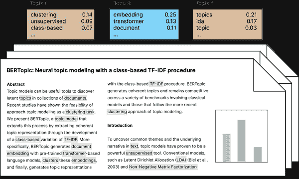

###### 图 3-7\. 传统主题建模概述。

至今，这项技术仍然是许多主题建模应用中的基础，凭借其强大的理论背景和实际应用，它不太可能很快消失。然而，随着大型语言模型的似乎呈指数增长，我们开始想知道是否可以在主题建模领域利用这些大型语言模型。

已经有几种模型采用大型语言模型进行主题建模，例如[嵌入式主题模型](https://github.com/adjidieng/ETM)和[上下文化主题模型](https://github.com/MilaNLProc/contextualized-topic-models)。然而，随着自然语言处理领域的快速发展，这些模型难以跟上。

解决此问题的方案是 BERTopic，这是一种利用高度灵活和模块化架构的主题建模技术。通过这种模块化，许多新发布的模型可以集成到其架构中。随着大型语言模型领域的发展，BERTopic 也在不断发展。这使得这些模型在主题建模中应用的方式变得有趣且意想不到。

## BERTopic

BERTopic 是一种主题建模技术，它假设语义相似文档的集群是生成和描述集群的有效方式。每个集群中的文档预计描述一个主要主题，合在一起可能代表一个主题。

正如我们在文本聚类中看到的，集群中的文档集合可能代表一个共同主题，但主题本身尚未被描述。通过文本聚类，我们必须逐一查看集群中的每个文档，以了解该集群的内容。要使一个集群被称为主题，我们需要一种以简洁且易于理解的方式描述该集群的方法。

尽管有很多方法可以做到这一点，但 BERTopic 中有一个技巧，可以快速描述一个集群，从而将其定义为一个主题，同时生成一个高度模块化的管道。BERTopic 的基础算法大致包含两个主要步骤。

首先，正如我们在文本聚类示例中所做的那样，我们嵌入文档以创建数值表示，然后降低它们的维度，最后对降维后的嵌入进行聚类。结果是语义上相似文档的聚类。

图 3-8 描述了与之前相同的步骤，即使用句子变换器对文档进行嵌入，使用 UMAP 进行降维，以及使用 HDBSCAN 进行聚类。

*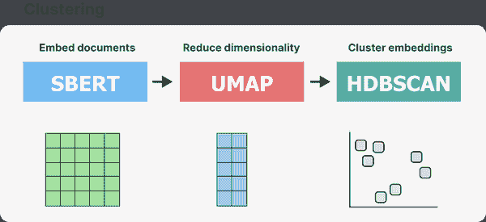

###### 图 3-8\. BERTopic 流程的第一部分是对文本数据进行聚类。* *第二，我们为每个聚类找到最佳匹配的关键词或短语。通常，我们会取一个聚类的中心点，寻找可能最好地代表它的单词、短语或甚至句子。然而，这有一个缺点：我们必须持续跟踪我们的嵌入，如果我们有数百万个文档，存储和跟踪变得计算上困难。相反，BERTopic 使用经典的词袋方法来表示聚类。词袋正是名称所暗示的，对于每个文档，我们简单地计算某个单词出现的频率，并将其用作我们的文本表示。

然而，“the”、“and”和“I”等词在大多数英语文本中出现相当频繁，可能会被过度代表。为了给予这些词适当的权重，BERTopic 使用了一种称为 c-TF-IDF 的技术，意为基于类别的词频逆文档频率。c-TF-IDF 是经典 TF-IDF 过程的类别适应版本。与考虑文档内单词的重要性不同，c-TF-IDF 考虑的是文档聚类之间单词的重要性。

要使用 c-TF-IDF，我们首先将聚类中的每个文档连接成一个长文档。然后，我们提取类别*c*中术语*f_x*的频率，其中*c*指的是我们之前创建的聚类之一。现在我们可以知道每个聚类中包含多少个和哪些单词，仅仅是一个计数。

为了加权这个计数，我们取一个加一后的聚类中平均单词数*A*的对数，然后除以所有聚类中术语*x*的频率。加一是在对数内添加的，以确保得到正值，这在 TF-IDF 中也是常见的做法。

如图 3-9 所示，c-TF-IDF 计算使我们能够为每个聚类中的单词生成一个对应于该聚类的权重。因此，我们为每个主题生成一个主题-词矩阵，描述它们所包含的最重要的单词。它本质上是每个主题中语料库词汇的排名。

*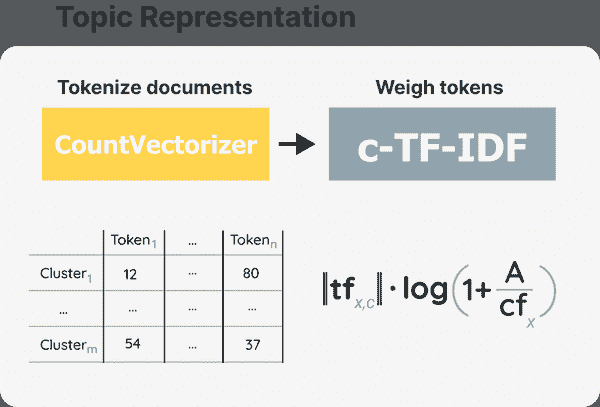

###### 图 3-9\. BERTopic 管道的第二部分是表示主题。计算术语*x*在类别*c*中的权重。*将这两个步骤结合起来，即聚类和表示主题，形成了 BERTopic 的完整管道，如图 3-10 所示。通过这个管道，我们可以对语义相似的文档进行聚类，并从这些聚类生成由多个关键词表示的主题。关键词对主题的权重越高，它就越能代表该主题。

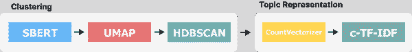

###### 图 3-10\. BERTopic 的完整管道大致由两个步骤组成：聚类和主题表示。

###### 注意

有趣的是，c-TF-IDF 技巧不使用大型语言模型，因此不考虑单词的上下文和语义特性。然而，就像神经搜索一样，它提供了一个高效的起点，之后我们可以使用计算量较大的技术，例如类似 GPT 的模型。

该管道的一个主要优点是这两个步骤，聚类和主题表示，相对独立。当我们使用 c-TF-IDF 生成主题时，不使用聚类步骤的模型，例如，不需要跟踪每个文档的嵌入。因此，这为主题生成过程以及整个管道提供了显著的模块化。

###### 注意

在聚类过程中，每个文档仅分配到一个单一的聚类或主题。在实践中，文档可能包含多个主题，将多主题文档分配到单一主题并不总是最准确的方法。我们稍后会深入讨论这一点，因为 BERTopic 有几种处理方法，但理解 BERTopic 的主题建模本质上是一项聚类任务是很重要的。

BERTopic 管道的模块化特性可以扩展到每个组件。尽管句子变换器作为默认嵌入模型用于将文档转换为数值表示，但我们并不受限于使用任何其他嵌入技术。维度减少、聚类和主题生成过程同样适用。无论用例是选择 k-Means 而不是 HDBSCAN，还是选择 PCA 而不是 UMAP，都是可能的。

你可以把这种模块化看作是用乐高积木构建，管道的每个部分都可以完全替换为另一个类似的算法。这种“乐高积木”思维方式在图 3-11 中得到了说明。该图还展示了我们可以使用的一个额外的算法乐高块。尽管我们使用 c-TF-IDF 来创建初始主题表示，但还有许多有趣的方法可以利用 LLMs 来微调这些表示。在下面的“**表示模型**”部分，我们将详细探讨这个算法乐高块的工作原理。

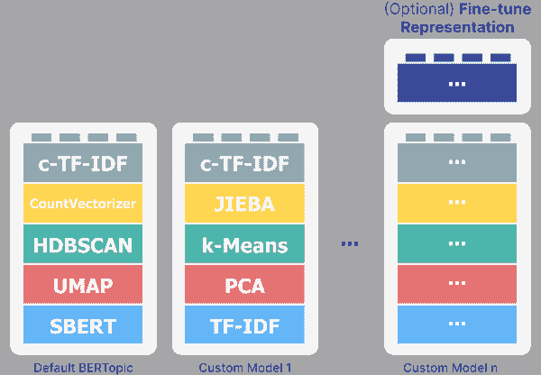

###### 图 3-11\. BERTopic 的模块化是一个关键组件，允许你根据需要构建自己的主题模型。

### 代码概述

够了，开始动手吧！这是一本实践型书籍，现在是时候进行一些实际编码了。默认管道，如之前在图 3-10 中所示，只需要几行代码：

```py
from bertopic import BERTopic

# Instantiate our topic model
topic_model = BERTopic()

# Fit our topic model on a list of documents
topic_model.fit(documents)
```

然而，BERTopic 的模块化特性以及我们迄今为止可视化的内容，也可以通过编码示例进行可视化。首先，让我们导入一些相关的包：

```py
from umap import UMAP
from hdbscan import HDBSCAN
from sentence_transformers import SentenceTransformer
from sklearn.feature_extraction.text import CountVectorizer

from bertopic import BERTopic
from bertopic.representation import KeyBERTInspired
from bertopic.vectorizers import ClassTfidfTransformer
```

正如你可能注意到的，大多数导入的包，如 UMAP 和 HDBSCAN，是默认 BERTopic 管道的一部分。接下来，让我们更明确地构建 BERTopic 的默认管道，逐步进行每个个体步骤：

```py
# Step 1 - Extract embeddings (blue block)
embedding_model = SentenceTransformer("all-MiniLM-L6-v2")

# Step 2 - Reduce dimensionality (red block)
umap_model = UMAP(n_neighbors=15, n_components=5, min_dist=0.0, metric='cosine')

# Step 3 - Cluster reduced embeddings (green block)
hdbscan_model = HDBSCAN(min_cluster_size=15, metric='euclidean', cluster_selection_method='eom', prediction_data=True)

# Step 4 - Tokenize topics (yellow block)
vectorizer_model = CountVectorizer(stop_words="english")

# Step 5 - Create topic representation (grey block)
ctfidf_model = ClassTfidfTransformer()

# Step 6 - (Optional) Fine-tune topic representations with 
# a `bertopic.representation` model (purple block)
representation_model = KeyBERTInspired()
# Combine the steps and build our own topic model
topic_model = BERTopic(
  embedding_model=embedding_model,          *# Step 1 - Extract embeddings*
  umap_model=umap_model,                    *# Step 2 - Reduce dimensionality*
  hdbscan_model=hdbscan_model,              *# Step 3 - Cluster reduced embeddings*
  vectorizer_model=vectorizer_model,        *# Step 4 - Tokenize topics*
  ctfidf_model=ctfidf_model,                *# Step 5 - Extract topic words*
  representation_model=representation_model *# Step 6 - Fine-tune topics*
)
```

这段代码使我们能够明确地经历算法的所有步骤，并且基本上让我们以任何我们想要的方式构建主题模型。所得到的主题模型，在变量`topic_model`中定义，现已代表 BERTopic 的基本管道，如之前在图 3-10 中所示。**  **## 示例

在整个使用案例中，我们将继续使用 ArXiv 文章的摘要。为了回顾我们在文本聚类中所做的工作，我们开始使用 HuggingFace 的数据集包导入数据集，并提取我们稍后要使用的元数据，如摘要、年份和文章类别。

```py
# Load data from huggingface
from datasets import load_dataset
dataset = load_dataset("maartengr/arxiv_nlp")

# Extract specific metadata
abstracts = dataset["Abstracts"]
years = dataset["Years"]
categories = dataset["Categories"]
titles = dataset["Titles"]
```

使用 BERTopic 非常简单，只需三行代码即可完成：

```py
# Train our topic model in only three lines of code
from bertopic import BERTopic

topic_model = BERTopic()
topics, probs = topic_model.fit_transform(abstracts)
```

使用这个管道，你将获得 3 个返回变量，即`topic_model`、`topics`和`probs`：

+   `topic_model`是我们刚刚训练的模型，包含有关模型和我们创建的主题的信息。

+   `topics`是每个摘要的主题。

+   `probs`是某个主题属于特定摘要的概率。

在我们开始探索主题模型之前，有一个变化需要使结果可复现。如前所述，BERTopic 的一个基础模型是 UMAP。这个模型具有随机性，这意味着每次运行 BERTopic 时，我们都会得到不同的结果。我们可以通过将`random_state`传递给 UMAP 模型来防止这种情况。

```py
from umap import UMAP
from bertopic import BERTopic

# Using a custom UMAP model
umap_model = UMAP(n_neighbors=15, n_components=5, min_dist=0.0, metric='cosine', random_state=42)

# Train our model
topic_model = BERTopic(umap_model=umap_model)
topics, probs = topic_model.fit_transform(abstracts)
```

现在，让我们开始探索创建的主题。`get_topic_info()`方法可以快速描述我们找到的主题：

```py
>>> topic_model.get_topic_info()
Topic    Count    Name
0    -1    11648    -1_of_the_and_to
1    0    1554    0_question_answer_questions_qa
2    1    620    1_hate_offensive_toxic_detection
3    2    578    2_summarization_summaries_summary_abstractive
4    3    568    3_parsing_parser_dependency_amr
...    ...    ...    ...
317    316    10    316_prf_search_conversational_spoke
318    317    10    317_crowdsourcing_workers_annotators_underline
319    318    10    318_curriculum_nmt_translation_dcl
320    319    10    319_botsim_menu_user_dialogue
321    320    10    320_color_colors_ib_naming
```

从我们的模型中生成了许多主题，**XXX**！每个主题由几个关键字表示，这些关键字在名称列中用“_”连接。这个名称列使我们能够快速了解主题内容，因为它显示了最能代表该主题的四个关键字。

###### 注意

你可能也注意到第一个主题标记为-1。这个主题包含所有无法归入某个主题的文档，并被视为离群值。这是聚类算法 HDBSCAN 的结果，它并不强制所有点都被聚类。为了去除离群值，我们可以使用非离群算法，如 k-Means，或使用 BERTopic 的`reduce_outliers()`函数去除一些离群值并将它们分配给主题。

例如，主题 2 包含关键字“summarization”、“summaries”、“summary”和“abstractive”。根据这些关键字，似乎这个主题是关于总结任务的。为了获取每个主题的前 10 个关键字及其 c-TF-IDF 权重，我们可以使用 get_topic()函数：

```py
>>> topic_model.get_topic(2)
[('summarization', 0.029974019692323675),
 ('summaries', 0.018938088406361412),
 ('summary', 0.018019112468622436),
 ('abstractive', 0.015758156442697138),
 ('document', 0.011038627359130419),
 ('extractive', 0.010607624721836042),
 ('rouge', 0.00936377058925341),
 ('factual', 0.005651676100789188),
 ('sentences', 0.005262910357048789),
 ('mds', 0.005050565343932314)]
```

这为我们提供了更多关于主题的背景，有助于我们理解主题的内容。例如，看到“rogue”这个词出现是很有趣的，因为这是评估摘要模型的一个常见指标。

我们可以使用`find_topics()`函数根据搜索词搜索特定主题。让我们搜索一个关于主题建模的主题：

```py
>>> topic_model.find_topics("topic modeling")
([17, 128, 116, 6, 235],
 [0.6753638370140129,
  0.40951682679389345,
  0.3985390076544335,
  0.37922002441932795,
  0.3769700288091359])
```

它返回主题 17 与我们的搜索词具有相对较高的相似度（0.675）。如果我们检查该主题，可以看到它确实是关于主题建模的主题：

```py
>>> topic_model.get_topic(17)
[('topic', 0.0503756681079549),
 ('topics', 0.02834246786579726),
 ('lda', 0.015441277604137684),
 ('latent', 0.011458141214781893),
 ('documents', 0.01013764950401255),
 ('document', 0.009854201885298964),
 ('dirichlet', 0.009521114618288628),
 ('modeling', 0.008775384549157435),
 ('allocation', 0.0077508974418589605),
 ('clustering', 0.005909325849593925)]
```

尽管我们知道这个主题是关于主题建模的，但让我们看看 BERTopic 的摘要是否也分配给了这个主题：

```py
>>> topics[titles.index('BERTopic: Neural topic modeling with a class-based TF-IDF procedure')]
17
```

是的！看起来这个主题不仅涉及基于 LDA 的方法，还有基于聚类的技术，比如 BERTopic。

最后，我们之前提到许多主题建模技术假设一个文档甚至一句话中可能包含多个主题。尽管 BERTopic 利用聚类，这假设每个数据点只有一个分配，但它可以近似主题分布。

我们可以使用这种技术查看 BERTopic 论文第一句话的主题分布：

```py
index = titles.index('BERTopic: Neural topic modeling with a class-based TF-IDF procedure')

# Calculate the topic distributions on a token-level
topic_distr, topic_token_distr = topic_model.approximate_distribution(abstracts[index][:90], calculate_tokens=True)
df = topic_model.visualize_approximate_distribution(abstracts[index][:90], topic_token_distr[0])
df
```

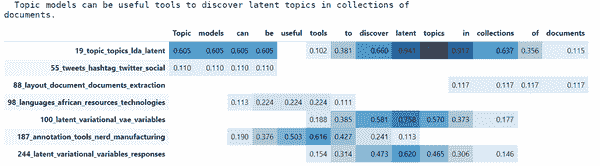

###### 图 3-12\. BERTopic 中提供了多种可视化选项。

如图 3-12 所示的输出表明，文档在一定程度上包含多个主题。此分配甚至是在令牌级别上完成的！

### （互动）可视化

手动处理**XXX**主题可能是一项艰巨的任务。相反，多个有用的可视化功能让我们能够广泛了解生成的主题。其中许多使用 Plotly 可视化框架进行互动。

图 3-13 显示了 BERTopic 中所有可能的可视化选项，从二维文档表示和主题条形图到主题层次和相似性。虽然我们没有逐一介绍所有可视化，但有些值得关注。

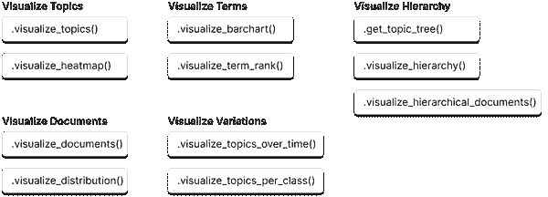

###### 图 3-13。BERTopic 中可用多种可视化选项。

首先，我们可以通过使用 UMAP 来减少每个主题的 c-TF-IDF 表示，创建主题的二维表示。

```py
topic_model.visualize_topics()
```

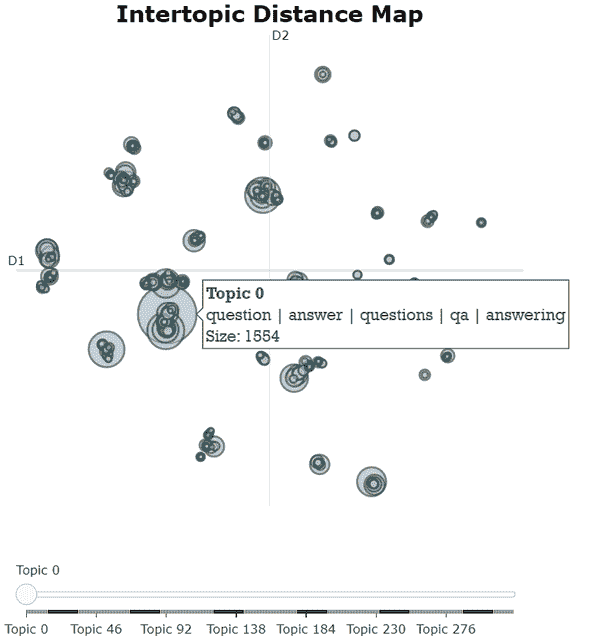

###### 图 3-14。主题在二维空间中的主题间距离图。

如图 3-14 所示，这生成了一个互动可视化，当鼠标悬停在一个圆圈上时，我们可以看到主题、其关键词及其大小。主题的圆圈越大，包含的文档越多。通过与此可视化的交互，我们可以快速看到相似主题的组。

我们可以使用`visualize_documents()`函数将分析提升到另一个层次，即在文档层面分析主题。

```py
# Visualize a selection of topics and documents
topic_model.visualize_documents(titles, 
      topics=[0, 1, 2, 3, 4, 6, 7, 10, 12, 
 13, 16, 33, 40, 45, 46, 65])
```

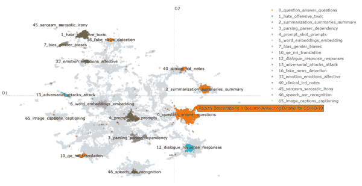

###### 图 3-15。摘要及其主题在二维可视化中表示。

图 3-15 演示了 BERTopic 如何在二维空间中可视化文档。

###### 注意

我们只可视化了部分主题，因为显示所有 300 个主题会导致可视化变得相当杂乱。此外，我们传递的是`titles`而不是`abstracts`，因为我们只想在鼠标悬停在文档上时查看每篇论文的标题，而不是整个摘要。

最后，我们可以使用 visualize_barchart()创建一个关键词的条形图，基于一部分主题：

```py
topic_model.visualize_barchart(topics=list(range(50, 58, 1)))
```

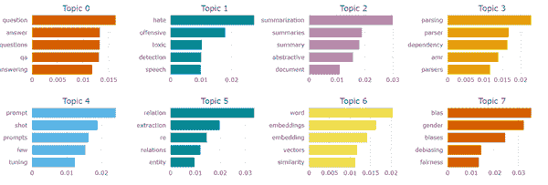

###### 图 3-16。前 8 个主题的前 5 个关键词。

图 3-16 中的柱状图很好地指示了哪些关键词对特定主题最重要。以主题 2 为例——似乎单词“总结”最能代表该主题，而其他单词在重要性上非常相似。

## 表示模型

借助 BERTopic 采用的神经搜索风格的模块化，它可以利用多种不同类型的大型语言模型，同时最小化计算。这使得各种主题微调方法得以实现，从词性标注到文本生成方法，例如 ChatGPT。图 3-17 展示了我们可以利用来微调主题表示的各种 LLM。

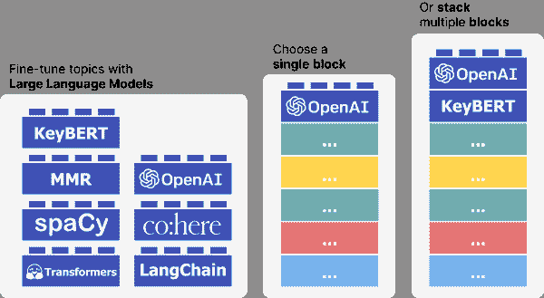

###### 图 3-17。在应用 c-TF-IDF 权重后，可以使用多种表示模型对主题进行微调。其中许多是大型语言模型。

使用 c-TF-IDF 生成的主题是与其主题相关的单词的良好初步排名。在本节中，这些单词的初步排名可以视为主题的候选关键词，因为我们可能会根据任何表示模型来改变它们的排名。我们将介绍几种可以在 BERTopic 中使用的表示模型，并且从大型语言模型的角度来看，这些模型也非常有趣。

在开始之前，我们首先需要做两件事。第一，我们将保存原始主题表示，这样与有无表示模型进行比较时将更容易：

```py
# Save original representations
from copy import deepcopy
original_topics = deepcopy(topic_model.topic_representations_)
```

第二，让我们创建一个简短的包装，以便快速可视化主题词的差异，以便比较有无表示模型的情况：

```py
def topic_differences(model, original_topics, max_length=75, nr_topics=10):
  """ For the first 10 topics, show the differences in 
  topic representations between two models """
  for topic in range(nr_topics):

    # Extract top 5 words per topic per model
    og_words = " | ".join(list(zip(*original_topics[topic]))[0][:5])
    new_words = " | ".join(list(zip(*model.get_topic(topic)))[0][:5])

    # Print a 'before' and 'after'
    whitespaces = " " * (max_length - len(og_words))
    print(f"Topic: {topic}    {og_words}{whitespaces}-->     {new_words}")
```

### KeyBERTInspired

c-TF-IDF 生成的主题并未考虑主题中单词的语义性质，这可能导致生成包含停用词的主题。我们可以使用模块 **bertopic.representation_model.KeyBERTInspired()** 根据关键词与主题的语义相似性来微调主题关键词。

KeyBERTInspired 是一种方法，正如你可能猜到的，灵感来自于 [关键词提取包 KeyBERT](https://github.com/MaartenGr/KeyBERT)。在最基本的形式中，KeyBERT 通过余弦相似度比较文档中单词的嵌入与文档嵌入，以查看哪些单词与文档最相关。这些最相似的单词被视为关键词。

在 BERTopic 中，我们希望使用类似的方法，但在主题层面而不是文档层面。如图 3-18 所示，KeyBERTInspired 使用 c-TF-IDF 为每个主题创建一组代表性文档，方法是随机抽取每个主题的 500 个文档，计算它们的 c-TF-IDF 值，并找到最具代表性的文档。这些文档被嵌入并平均，用作更新后的主题嵌入。然后，计算我们的候选关键词与更新后的主题嵌入之间的相似度，以重新排序我们的候选关键词。

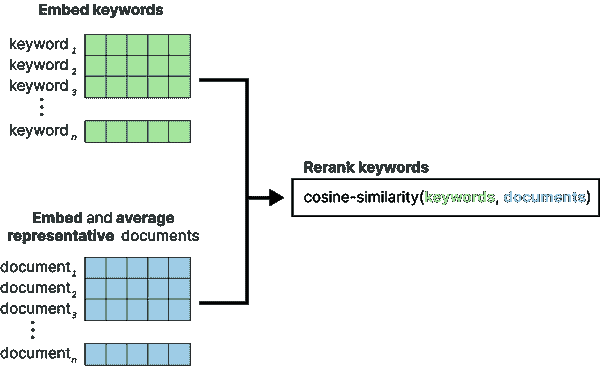

###### 图 3-18\. KeyBERTInspired 表示模型的过程

```py
# KeyBERTInspired
from bertopic.representation import KeyBERTInspired
representation_model = KeyBERTInspired()

# Update our topic representations
new_topic_model.update_topics(abstracts, representation_model=representation_model)

# Show topic differences
topic_differences(topic_model, new_topic_model)
```

`主题: 0 问题 | qa | 问题 | 答案 | 回答 --> 问答 | 回答 | 问答 | 注意 | 检索`

`主题: 1 仇恨 | 攻击性 | 言论 | 检测 | 有毒 --> 仇恨的 | 仇恨 | 网络欺凌 | 言论 | 推特`

`主题: 2 摘要 | 总结 | 总结 | 抽象 | 提取 --> 摘要生成器 | 摘要生成 | 摘要 | 摘要 | 总结`

`主题: 3 解析 | 解析器 | 依赖 | amr | 解析器 --> 解析器 | 解析 | 树库 | 解析器 | 树库`

`主题: 4 词 | 嵌入 | 嵌入 | 相似性 | 向量 --> word2vec | 嵌入 | 嵌入 | 相似性 | 语义`

`主题: 5 性别 | 偏见 | 偏差 | 去偏见 | 公平 --> 偏见 | 偏差 | 性别 | 性别 | 性别化`

`主题: 6 关系 | 提取 | re | 关系 | 实体 --> 关系 | 关系 | 实体 | 实体 | 关系的`

`主题: 7 提示 | 少量实例 | 提示 | 上下文 | 调整 --> 提示调整 | 提示 | 提示 | 提示中 | 基于提示`

`主题: 8 方面 | 情感 | absa | 基于方面 | 意见 --> 情感 | 方面 | 方面 | 方面级别 | 情感`

`主题: 9 解释 | 解释 | 理由 | 理由 | 可解释性 --> 解释 | 解释者 | 可解释性 | 解释 | 注意`

更新后的模型显示，与原始模型相比，主题的可读性大大提高。同时，它也显示了使用基于嵌入技术的缺点。原始模型中的词汇，例如“amr”和“qa”，都是合理的词汇。

### 词性

c-TF-IDF 并不区分其认为重要的词的类型。无论是名词、动词、形容词，甚至是介词，它们都可能成为重要关键词。当我们希望有易于人类理解的标签，简单直观时，我们可能希望主题仅由名词来描述。

这里就是著名的 SpaCy 包派上用场的地方。这是一个工业级的自然语言处理框架，提供多种管道、模型和部署选项。更具体地说，我们可以使用 SpaCy 加载一个能够检测词性（无论是名词、动词还是其他）的英语模型。

如图 3-19 所示，我们可以使用 SpaCy 确保只有名词进入我们的主题表示。与大多数表示模型一样，这种方法非常高效，因为名词仅从一个小而具有代表性的数据子集提取。

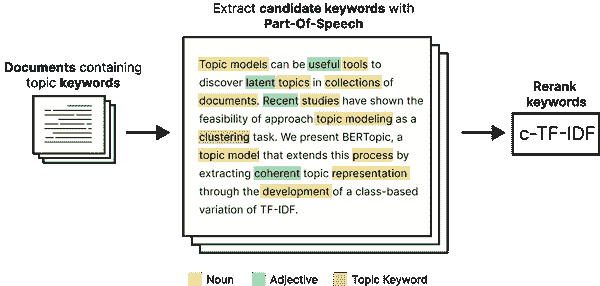

###### 图 3-19\. 词性表示模型的过程

```py
# Part-of-Speech tagging
from bertopic.representation import PartOfSpeech
representation_model = PartOfSpeech("en_core_web_sm")

# Use the representation model in BERTopic on top of the default pipeline
topic_model.update_topics(abstracts, representation_model=representation_model)

# Show topic differences
topic_differences(topic_model, original_topics)
```

`主题：0 问题 | qa | 问题 | 答案 | 回答 --> 问题 | 问题 | 答案 | 回答 | 答案`

`主题：1 仇恨 | 冒犯 | 言论 | 检测 | 有毒 --> 仇恨 | 冒犯 | 言论 | 检测 | 有毒`

`主题：2 摘要 | 摘要 | 总结 | 抽象 | 提取 --> 摘要 | 摘要 | 总结 | 抽象 | 提取`

`主题：3 解析 | 解析器 | 依赖 | amr | 解析器 --> 解析 | 解析器 | 依赖 | 解析器 | 树库`

`主题：4 单词 | 嵌入 | 嵌入 | 相似性 | 向量 --> 单词 | 嵌入 | 相似性 | 向量 | 单词`

`主题：5 性别 | 偏见 | 偏见 | 去偏见 | 公平 --> 性别 | 偏见 | 偏见 | 去偏见 | 公平`

`主题：6 关系 | 提取 | re | 关系 | 实体 --> 关系 | 提取 | 关系 | 实体 | 远程`

`主题：7 提示 | 少样本 | 提示 | 上下文 | 调整 --> 提示 | 提示 | 调整 | 提示 | 任务`

`主题：8 方面 | 情感 | absa | 基于方面 | 意见 --> 方面 | 情感 | 意见 | 方面 | 极性`

`主题：9 解释 | 解释 | 理由 | 理由 | 可解释性 --> 解释 | 解释 | 理由 | 理由 | 可解释性`

### 最大边际相关性

使用 c-TF-IDF，生成的关键词可能会有很多冗余，因为它不认为“车”和“汽车”本质上是相同的。换句话说，我们希望生成的主题具有足够的多样性，同时尽可能少重复。（图 3-20）

**

###### 图 3-20\. 最大边际相关性表示模型的过程。生成关键词的多样性由 λ（λ）表示。*我们可以使用一种名为最大边际相关性（MMR）的算法来使我们的主题表示多样化。该算法从与主题最匹配的关键词开始，然后迭代计算下一个最佳关键词，同时考虑一定程度的多样性。换句话说，它会取一些候选主题关键词，例如 30 个，并尝试选择最佳代表主题的前 10 个关键词，同时确保它们彼此多样化。*

```py
# Maximal Marginal Relevance
from bertopic.representation import MaximalMarginalRelevance
representation_model = MaximalMarginalRelevance(diversity=0.5)

# Use the representation model in BERTopic on top of the default pipeline
topic_model.update_topics(abstracts, representation_model=representation_model)

# Show topic differences
topic_differences(topic_model, original_topics)
```

`主题: 0 问题 | QA | 问题 | 回答 | 回答中 --> QA | 问题 | 回答 | 理解 | 检索`

`主题: 1 仇恨 | 冒犯 | 演讲 | 检测 | 有毒 --> 演讲 | 侮辱 | 毒性 | 平台 | 仇恨`

`主题: 2 总结 | 摘要 | 总结 | 抽象 | 提取 --> 总结 | 提取 | 多文档 | 文档 | 评估`

`主题: 3 解析 | 解析器 | 依赖 | AMR | 解析器 --> AMR | 解析器 | 语料库 | 句法 | 成分`

`主题: 4 词 | 嵌入 | 嵌入 | 相似性 | 向量 --> 嵌入 | 相似性 | 向量 | word2vec | glove`

`主题: 5 性别 | 偏见 | 偏见 | 去偏见 | 公平 --> 性别 | 偏见 | 公平 | 刻板印象 | 嵌入`

`主题: 6 关系 | 提取 | 关系 | 实体 --> 提取 | 关系 | 实体 | 文档级 | 文档提取`

`主题: 7 提示 | 少样本 | 提示 | 上下文 | 调整 --> 提示 | 零样本 | PLMs | 元学习 | 标签`

`主题: 8 方面 | 情感 | ABSA | 基于方面 | 观点 --> 情感 | ABSA | 方面 | 提取 | 极性`

`主题: 9 解释 | 解释 | 理由 | 理由 | 可解释性 --> 解释 | 可解释性 | 显著性 | 可信性 | 方法`

生成的主题更加多样化！主题**XXX**原本使用了很多“总结”相关的词汇，而现在该主题只包含“总结”这个词。同时，像“embedding”和“embeddings”的重复词汇也被移除了。*  *## 文本生成

文本生成模型在 2023 年显示出巨大的潜力。它们在广泛的任务中表现出色，并允许在提示中进行广泛的创造性。它们的能力不容小觑，而不在 BERTopic 中使用它们无疑是一种浪费。我们在**XXX**章中详细讨论了这些模型，但现在查看它们如何与主题建模过程结合是有益的。

如图 3-21 所示，我们可以通过专注于生成主题级输出而非文档级输出，来高效使用 BERTopic。这可以将 API 调用的数量从数百万（例如，数百万的摘要）减少到几百（例如，数百个主题）。这不仅显著加快了主题标签的生成速度，而且在使用外部 API（如 Cohere 或 OpenAI）时，也不需要大量的费用。

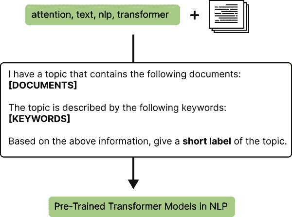

###### 图 3-21\. 使用文本生成 LLMs 和提示工程从与每个主题相关的关键词和文档中创建主题标签。

### 提示

正如在图 3-21 中所示，文本生成的一个主要组成部分是提示。在 BERTopic 中，这同样重要，因为我们希望向模型提供足够的信息，以便它能决定主题内容。BERTopic 中的提示通常看起来像这样：

```py
prompt = """
I have a topic that contains the following documents: \n[DOCUMENTS]
The topic is described by the following keywords: [KEYWORDS]

Based on the above information, give a short label of the topic.
"""
```

该提示包含三个组成部分。首先，它提到一些最能描述主题的文档。这些文档通过计算它们的 c-TF-IDF 表示并与主题的 c-TF-IDF 表示进行比较来选择。然后提取前四个最相似的文档，并使用“**[文档]**”标签进行引用。

```py
I have a topic that contains the following documents: \n[DOCUMENTS]
```

其次，构成主题的关键词也会传递给提示，并使用“**[关键词]**”标签进行引用。这些关键词也可以通过 KeyBERTInspired、词性或任何表示模型进行优化。

```py
The topic is described by the following keywords: [KEYWORDS]
```

第三，我们向大型语言模型提供具体指令。这与之前的步骤同样重要，因为这将决定模型如何生成标签。

```py
Based on the above information, give a short label of the topic.
```

该提示将被呈现为主题 XXX：

```py
"""
I have a topic that contains the following documents: 
- Our videos are also made possible by your support on patreon.co.
- If you want to help us make more videos, you can do so on patreon.com or get one of our posters from our shop.
- If you want to help us make more videos, you can do so there.
- And if you want to support us in our endeavor to survive in the world of online video, and make more videos, you can do so on patreon.com.

The topic is described by the following keywords: videos video you our support want this us channel patreon make on we if facebook to patreoncom can for and more watch 

Based on the above information, give a short label of the topic.
"""
```

### HuggingFace

幸运的是，与大多数大型语言模型一样，我们可以通过[HuggingFace 的 Modelhub](https://huggingface.co/models)使用大量开源模型。

最著名的开源大型语言模型之一是 Flan-T5 生成模型系列，它针对文本生成进行了优化。这些模型的有趣之处在于它们使用一种称为**指令调优**的方法进行训练。通过对许多以指令形式表达的任务进行微调，模型学会了遵循特定的指令和任务。

BERTopic 允许使用这样的模型生成主题标签。我们创建一个提示，请它根据每个主题的关键词生成主题，并标记为`[关键词]`。

```py
from transformers import pipeline
from bertopic.representation import TextGeneration

# Text2Text Generation with Flan-T5
generator = pipeline('text2text-generation', model='google/flan-t5-xl')
representation_model = TextGeneration(generator)

# Use the representation model in BERTopic on top of the default pipeline
topic_model.update_topics(abstracts, representation_model=representation_model)

# Show topic differences
topic_differences(topic_model, original_topics)
```

`主题：0 演讲 | asr | 识别 | 声学 | 端到端 --> 音频语法识别`

`主题：1 临床 | 医疗 | 生物医学 | 笔记 | 健康 --> ehr`

`主题：2 摘要 | 总结 | 总结 | 抽象 | 抽取 --> mds`

`主题：3 解析 | 解析器 | 依赖关系 | amr | 解析器 --> 解析器`

`主题：4 仇恨 | 攻击性 | 演讲 | 检测 | 有毒 --> Twitter`

`主题：5 词 | 嵌入 | 嵌入向量 | 相似性 --> word2vec`

`主题：6 性别 | 偏见 | 偏差 | 去偏见 | 公平性 --> 性别偏见`

`主题：7 命名 | 实体 | 识别 | 嵌套 --> ner`

`主题：8 提示 | 少样本 | 提示 | 上下文 | 调优 --> gpt3`

`主题：9 关系 | 提取 | re | 关系 | 远程 --> docre`

有趣的主题标签被创建，但我们也可以看到该模型并不是完美无缺的。

### OpenAI

当我们谈论生成性 AI 时，不能忘记 ChatGPT 及其惊人的表现。尽管不是开源的，但它是一个有趣的模型，在短短几个月内改变了 AI 领域。我们可以从 OpenAI 的集合中选择任何文本生成模型在 BERTopic 中使用。

由于该模型是基于 RLHF 训练的，并且优化用于聊天目的，因此使用该模型进行提示非常令人满意。

```py
from bertopic.representation import OpenAI

# OpenAI Representation Model
prompt = """
I have a topic that contains the following documents: \n[DOCUMENTS]
The topic is described by the following keywords: [KEYWORDS]

Based on the information above, extract a short topic label in the following format:
topic: <topic label>
"""
representation_model = OpenAI(model="gpt-3.5-turbo", delay_in_seconds=10, chat=True)

# Use the representation model in BERTopic on top of the default pipeline
topic_model.update_topics(abstracts, representation_model=representation_model)

# Show topic differences
topic_differences(topic_model, original_topics)
```

`主题：0 演讲 | asr | 识别 | 声学 | 端到端 --> 音频语法识别`

`主题：1 临床 | 医疗 | 生物医学 | 记录 | 健康 --> ehr`

`主题：2 总结 | 摘要 | 总结 | 抽象 | 提取 --> mds`

`主题：3 解析 | 解析器 | 依赖 | amr | 解析器 --> parser`

`主题：4 仇恨 | 攻击性 | 言论 | 检测 | 有毒 --> Twitter`

`主题：5 词 | 嵌入 | 嵌入向量 | 相似性 --> word2vec`

`主题：6 性别 | 偏见 | 偏差 | 去偏见 | 公平性 --> 性别偏见`

`主题：7 命名 | 实体 | 识别 | 嵌套 --> ner`

`主题：8 提示 | 少样本 | 提示 | 上下文 | 调优 --> gpt3`

`主题：9 关系 | 提取 | re | 关系 | 远程 --> docre`

由于我们期望 ChatGPT 以特定格式返回主题，即“主题：<主题标签>”，因此在创建自定义提示时，指示模型按此格式返回非常重要。请注意，我们还添加了`delay_in_seconds`参数，以便在 API 调用之间创建恒定的延迟，以防你使用的是免费账户。

### Cohere

与 OpenAI 一样，我们可以在 BERTopic 的管道中使用 Cohere 的 API，进一步微调主题表示，结合生成文本模型。确保获取 API 密钥，这样你就可以开始生成主题表示。

```py
import cohere
from bertopic.representation import Cohere

# Cohere Representation Model
co = cohere.Client(my_api_key)
representation_model = Cohere(co)

# Use the representation model in BERTopic on top of the default pipeline
topic_model.update_topics(abstracts, representation_model=representation_model)

# Show topic differences
topic_differences(topic_model, original_topics)
```

`主题：0 演讲 | asr | 识别 | 声学 | 端到端 --> 音频语法识别`

`主题：1 临床 | 医疗 | 生物医学 | 记录 | 健康 --> ehr`

`主题：2 总结 | 摘要 | 总结 | 抽象 | 提取 --> mds`

`主题：3 解析 | 解析器 | 依赖 | amr | 解析器 --> parser`

`主题：4 仇恨 | 攻击性 | 言论 | 检测 | 有毒 --> Twitter`

`主题：5 词 | 嵌入 | 嵌入向量 | 相似性 --> word2vec`

`主题：6 性别 | 偏见 | 偏差 | 去偏见 | 公平性 --> 性别偏见`

`主题：7 命名 | 实体 | 识别 | 嵌套 --> ner`

`主题：8 提示 | 少样本 | 提示 | 上下文 | 调优 --> gpt3`

`主题：9 关系 | 提取 | re | 关系 | 远程 --> docre`

### LangChain

为了进一步提升大型语言模型的能力，我们可以利用 LangChain 框架。它允许任何先前的文本生成方法补充额外信息，甚至链式结合。特别是，LangChain 将语言模型连接到其他数据源，使它们能够与环境互动。

例如，我们可以使用它与 OpenAI 构建一个向量数据库，并在该数据库上应用 ChatGPT。由于我们希望尽量减少 LangChain 所需的信息量，因此将最具代表性的文档传递给该软件包。然后，我们可以使用任何 LangChain 支持的语言模型来提取主题。下面的示例演示了如何将 OpenAI 与 LangChain 结合使用。

```py
from langchain.llms import OpenAI
from langchain.chains.question_answering import load_qa_chain
from bertopic.representation import LangChain

# Langchain representation model
chain = load_qa_chain(OpenAI(temperature=0, openai_api_key=MY_API_KEY), chain_type="stuff")
representation_model = LangChain(chain)

# Use the representation model in BERTopic on top of the default pipeline
topic_model.update_topics(abstracts, representation_model=representation_model)

# Show topic differences
topic_differences(topic_model, original_topics)
```

`Topic: 0 speech | asr | recognition | acoustic | endtoend --> audio grammatical recognition`

`Topic: 1 clinical | medical | biomedical | notes | health --> ehr`

`Topic: 2 summarization | summaries | summary | abstractive | extractive --> mds`

`Topic: 3 parsing | parser | dependency | amr | parsers --> parser`

`Topic: 4 hate | offensive | speech | detection | toxic --> Twitter`

`Topic: 5 word | embeddings | embedding | vectors | similarity --> word2vec`

`Topic: 6 gender | bias | biases | debiasing | fairness --> gender bias`

`Topic: 7 ner | named | entity | recognition | nested --> ner`

`Topic: 8 prompt | fewshot | prompts | incontext | tuning --> gpt3`

`Topic: 9 relation | extraction | re | relations | distant --> docre`

## 主题建模变体

主题建模的领域相当广泛，涵盖了许多不同的应用和同一模型的变体。BERTopic 也不例外，它为不同目的实现了多种变体，例如动态、（半）监督、在线、分层和引导的主题建模。图 3-22-X 展示了一些主题建模变体以及如何在 BERTopic 中实现它们。

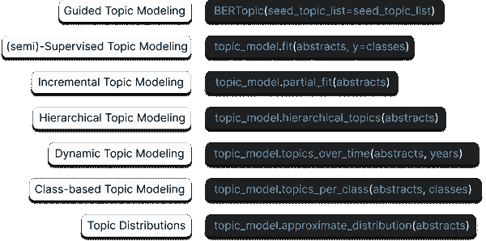

###### 图 3-22\. -X BERTopic 中的主题建模变体***  ***# 摘要

在本章中，我们讨论了一种基于聚类的主题建模方法，BERTopic。通过利用模块化结构，我们使用了多种大型语言模型来创建文档表示并微调主题表示。我们提取了 ArXiv 摘要中的主题，并观察了如何利用 BERTopic 的模块化结构来开发不同类型的主题表示。*****
