# 第四章：使用 GPT 模型进行文本生成

在本书的前几章中，我们已迈出了进入大型语言模型（LLMs）世界的第一步。我们深入探讨了各种应用，如分类和语义搜索，采用了专注于文本表示的模型，例如 BERT 及其衍生模型。

随着我们的进展，我们使用了主要用于文本生成的模型，这些模型通常被称为生成式预训练变换器（GPT）。这些模型具有响应用户*提示*生成文本的卓越能力。通过*提示工程*，我们可以以增强生成文本质量的方式设计这些提示。

在本章中，我们将更详细地探讨这些生成模型，并深入探讨提示工程、与生成模型推理、验证甚至评估其输出的领域。

# 使用文本生成模型

在开始提示工程的基本知识之前，探索如何利用文本生成模型的基础知识是至关重要的。我们如何选择使用的模型？我们是使用专有模型还是开源模型？我们如何控制生成的输出？这些问题将作为我们使用文本生成模型的垫脚石。

## 选择文本生成模型

选择文本生成模型始于在专有模型和开源模型之间进行选择。尽管专有模型通常性能更优，但我们在本书中更多地关注开源模型，因为它们提供了更多灵活性并且可以免费使用。

图 4-1 展示了一小部分具有影响力的基础模型，这些大型语言模型（LLMs）在大量文本数据上进行过预训练，并通常为特定应用进行了微调。

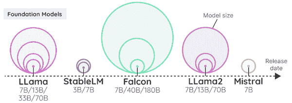

###### 图 4-1：基础模型

从这些基础模型中，数百个甚至数千个模型已被微调，使得某些模型更适合特定任务。选择使用的模型可能是一项艰巨的任务！

我们通常建议从小型且最近发布的基础模型开始，例如图 4-1 中的 Llama 2 或 Mistral 7B。这允许快速迭代，从而深入理解该模型是否适合你的用例。此外，小型模型需要更少的 GPU 内存（VRAM），如果你的 GPU 不大，这使得运行更加容易和快速。放大通常比缩小更令人愉快。

在本章的示例中，我们将采用来自 Zephyr 系列的模型，即[Zephyr 7B-beta](https://huggingface.co/HuggingFaceH4/zephyr-7b-beta)。这些模型是在 Mistral 7B 上经过微调的，Mistral 7B 是一个相对较小但相当强大的开源大型语言模型（LLM）。

如果你在生成 AI 领域刚起步，重要的是从一个较小的模型开始。这为初学者提供了很好的介绍，并为进阶到更大的模型打下坚实的基础。

## 加载文本生成模型

“如何加载文本生成模型”实际上可以单独成为一个章节。市面上有几十个包，各自拥有不同的压缩和推理策略来提高性能。

最简单的方法是通过众所周知的 HuggingFace Transformers 库：

```py
import torch
from transformers import pipeline
# Load our model
pipe = pipeline(
    "text-generation", 
    model="HuggingFaceH4/zephyr-7b-beta", 
    torch_dtype=torch.bfloat16, 
    device_map="auto"
)
```

要使用该模型，我们需要仔细查看它的提示模板。任何 LLM 都需要特定的模板，以便它能够区分最近和较旧的查询/响应对。

为了说明这一点，让我们请 LLM 讲个关于鸡的笑话：

```py
`def` format_prompt(query="", messages=`False`):
    """Use the internal chat template to format our query"""
    # The system prompt (what the LLM should know before answering) and our query:
    `if` `not` messages:
        messages = [
            {
                "role": "system",
                "content": "You are a helpful assistant.",
            },
            {"role": "user", "content": query},
        ]
    # We apply the LLMs internal chat template to our input prompt
    prompt = pipe.tokenizer.apply_chat_template(
        messages,
        tokenize=`False`,
        add_generation_prompt=`True`
    )
    `return` prompt
prompt = format_prompt("Write a short joke about chickens.")
```

除了我们的主要提示外，我们还生成了一个系统提示，为 LLM 提供生成响应的上下文或指导。如图 4-2 所示，提示模板帮助 LLM 理解不同类型提示之间的区别，以及 LLM 生成的文本与用户文本之间的区别。

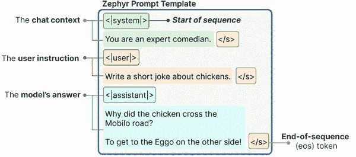

###### 图 4-2\. Zephyr 在与模型互动时所期望的模板。

使用该提示，我们可以让 LLM 给出答案：

```py
# Generate the output
outputs = pipe(
    prompt, 
    max_new_tokens=256, 
    do_sample=`True`, 
    temperature=0.1, 
    top_p=0.95
)
print(outputs[0]["generated_text"])
```

输出结果为：

```py
"""
<|system|>
You are a friendly chatbot.</s>
<|user|>
Write a joke about chickens.</s>
<|assistant|>
Why did the chicken cross the Mobilo?
Because the Eggspressway was closed for pavement!
"""
```

既然我们知道如何使用聊天模板创建提示，让我们深入探讨如何控制模型的输出。

## 控制模型输出

除了提示工程，我们还可以通过调整模型参数来控制我们想要的输出类型。在之前的示例中，你可能注意到我们在`pipe`函数中使用了多个参数，包括`temperature`和`top_p`。

这些参数控制输出的随机性。使 LLM 成为令人兴奋技术的一部分在于它可以为完全相同的提示生成不同的响应。每当 LLM 需要生成一个标记时，它会为每个可能的标记分配一个可能性数字。

如图 4-3 所示，在句子“*我正在开着一辆…*”中，后面跟上“*车*”或“*卡车*”等标记的可能性通常高于“*大象*”。然而，“*大象*”仍然有生成的可能性，但它的概率要低得多。

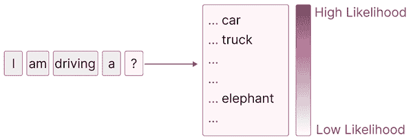

###### 图 4-3\. 模型根据它们的可能性评分选择生成下一个标记。

### 温度

`temperature` 控制生成文本的随机性或创造性。它定义了选择不太可能的标记的可能性。基本思想是，温度为 0 时每次都会生成相同的响应，因为它总是选择最可能的单词。如 图 4-4 所示，较高的值允许生成不太可能的单词。

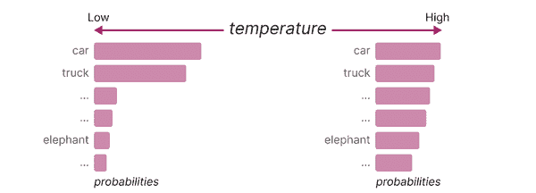

###### 图 4-4。较高的温度增加了生成不太可能的标记的可能性，反之亦然。

结果是，较高的温度（例如 0.8）通常会导致更具多样性的输出，而较低的温度（例如 0.2）则会产生更确定性的输出。

### top_p

`top_p`，也称为核采样，是一种控制 LLM 可以考虑哪些标记（核）的采样技术。它会考虑标记直到达到其累积概率。如果我们将 top_p 设置为 0.1，它会考虑标记直到达到该值。如果我们将 `top_p` 设置为 1，它会考虑所有标记。

如 图 4-5 所示，通过降低该值，将考虑更少的标记，通常会产生较少的“创造性”输出，而增加该值则允许 LLM 从更多的标记中进行选择。

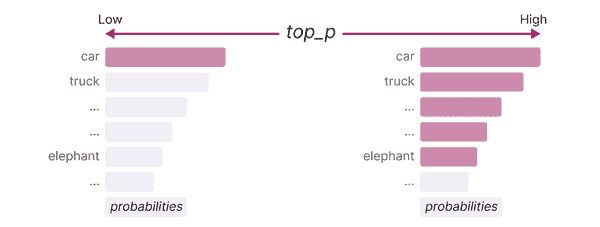

###### 图 4-5。较高的 top_p 增加了可以选择生成的标记数量，反之亦然。

同样，`top_k` 参数精确控制 LLM 可以考虑多少个标记。如果将其值更改为 100，LLM 将仅考虑前 100 个最可能的标记。

如表 5-1 所示，这些参数使用户在创造性（高 `temperature` 和 `top_p`）与可预测性（低 `temperature` 和 `top_p`）之间拥有一个滑动尺度。

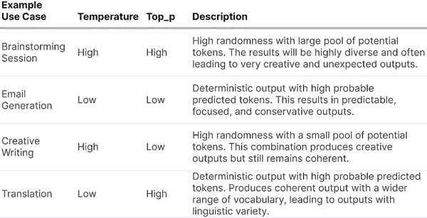

###### 图 4-6。选择 `temperature` 和 `top_p` 值时的使用案例示例。

# 提示工程简介

与文本生成 LLM 相关的重要部分是提示工程。通过仔细设计我们的提示，我们可以引导 LLM 生成所需的响应。无论提示是问题、陈述还是指令，提示工程的主要目标是从模型中引发有用的响应。

然而，提示工程不仅仅是设计有效的提示。它还可以作为评估模型输出、设计保护措施和安全缓解方法的工具。这是一个提示优化的迭代过程，需要实验。不存在，也不太可能有完美的提示设计。

在本节中，我们将讨论提示工程的常见方法，以及理解某些提示效果的小技巧。这些技能使我们能够理解 LLM 的能力，并构成与这些模型接口的基础。

我们首先回答问题：提示中应该包含什么？

## 提示的基本组成部分

LLM 是一种预测机器。根据特定输入（提示），它尝试预测可能跟随的词语。在其核心，正如图 4-7 所示，提示不需要超过几个词就能引出 LLM 的响应。

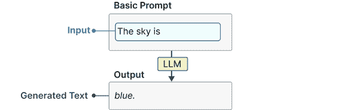

###### 图 4-7\. 提示的基本示例。没有给出指令，因此 LLM 将简单地尝试完成句子。

然而，尽管这个插图作为基本示例有效，但它无法完成特定任务。相反，我们通常通过询问一个特定问题或任务来进行提示工程，以便大型语言模型（LLM）可以完成。为了引出期望的响应，我们需要一个更结构化的提示。

例如，如图 4-8 所示，我们可以要求 LLM 将一个句子分类为具有正面或负面情感。

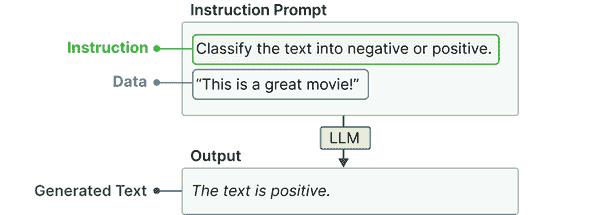

###### 图 4-8\. 基本指令提示的两个组成部分，即指令本身和它所指的数据。

这将最基本的提示扩展为由两个组成部分构成——指令本身和与指令相关的数据。

更复杂的使用案例可能需要提示中包含更多组成部分。例如，为确保模型只输出“负面”或“正面”，我们可以引入输出指示符来帮助指导模型。在图 4-9 中，我们在句子前加上“文本：”并添加“情感：”以防止模型生成完整句子。相反，这种结构表示我们期待“负面”或“正面”。

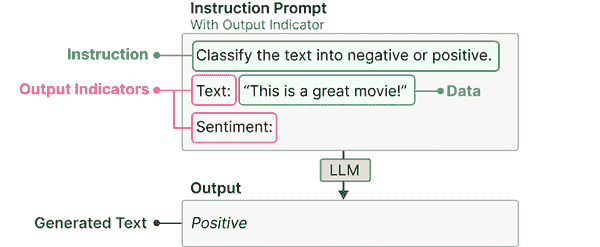

###### 图 4-9\. 通过输出指示符扩展提示，以允许特定输出。

我们可以继续添加或更新提示的元素，直到引出我们所寻找的响应。我们可以添加额外的示例，更详细地描述使用案例，提供额外的上下文等。这些组成部分仅是示例，并不是一个有限的可能集。设计这些组件所带来的创造力是关键。

尽管提示是单一的文本，但将提示视为更大拼图的一部分是非常有帮助的。我是否描述了我的问题的上下文？提示中是否包含了输出的示例？

## 基于指令的提示

尽管提示有很多种形式，从与 LLM 讨论哲学到与自己喜欢的超级英雄角色扮演，提示通常用于让 LLM 回答特定问题或解决某项任务。这被称为基于指令的提示。

图 4-10 展示了多个在基于指令的提示中发挥重要作用的用例。我们在之前的示例中已经进行了其中一个，即监督分类。

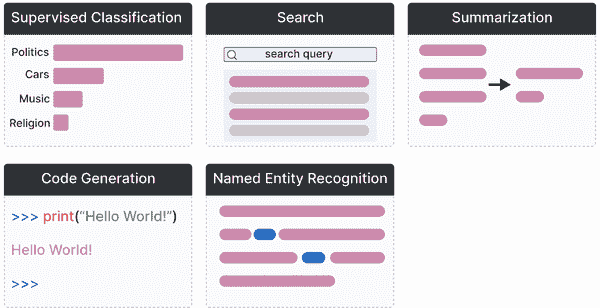

###### 图 4-10\. 使用基于指令的提示的用例示例。

这些任务每个都需要不同格式的提示，更具体地说，需要向 LLM 提出不同的问题。要求 LLM 总结一段文本并不会突然导致分类。为了说明，一些这些用例的提示示例可以在图 4-11 中找到。

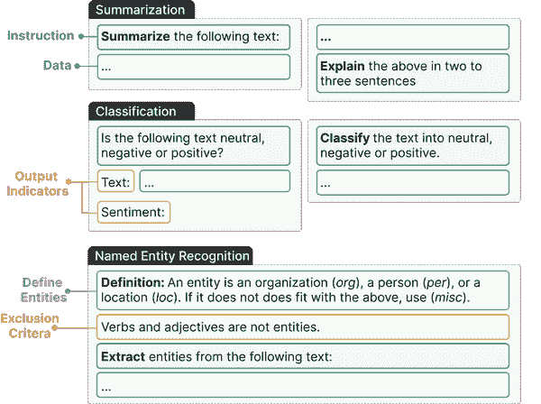

###### 图 4-11\. 常见用例的提示示例。注意在一个用例中，指令的结构和位置可以改变。

尽管这些任务需要不同的指令，但实际上在用于提高输出质量的提示技术上有很多重叠。这些技术的非详尽列表包括：

特异性

准确描述你想要实现的目标。与其问 LLM“写一个产品描述。”不如问它“用少于两句话写一个产品描述，并使用正式的语气。”。

幻觉

LLM 可能会自信地生成不正确的信息，这被称为幻觉。为了减少其影响，我们可以要求 LLM 仅在知道答案的情况下生成回答。如果它不知道答案，则回应“我不知道”。

顺序

要么在提示的开始或结束时给出指令。尤其是在长提示中，中间的信息往往被遗忘。LLM 倾向于关注提示开头（首因效应）或结尾（近因效应）中的信息。

在这里，特异性可以说是最重要的方面。一个大型语言模型（LLM）不知道你想要什么，除非你对自己想要实现的目标和原因非常具体。

# 高级提示工程

表面上，创建一个好的提示似乎很简单。问一个具体的问题，准确，添加一些示例，你就完成了！然而，提示很快就会变得复杂，因此常常被低估为利用 LLM 的一个组成部分。

在这里，我们将通过几种高级技术来构建你的提示，从构建复杂提示的迭代工作流程开始，一直到顺序使用 LLM 以获得更好的结果。最终，我们甚至将建立高级推理技术。

## 提示的潜在复杂性

正如我们在提示工程导言中探讨的，提示通常由多个组件组成。在我们的第一个示例中，提示由指令、数据和输出指标组成。正如我们之前提到的，没有提示仅限于这三种组件，你可以根据需要构建得越复杂越好。

这些高级组件可以快速使提示变得相当复杂。一些常见的组件包括：

*角色*

描述 LLM 应该扮演的角色。例如，如果你想问关于天体物理学的问题，可以使用*“你是天体物理学专家。”*

*指令*

任务本身。确保这一点尽可能具体。我们不想留太多解释的余地。

*上下文*

描述问题或任务上下文的额外信息。它回答类似*“指令的原因是什么？”*的问题。

*格式*

LLM 应使用的输出生成文本的格式。如果没有它，LLM 将自行生成格式，这在自动化系统中是麻烦的。

*受众*

生成文本应面向谁。这也描述了生成输出的级别。出于教育目的，使用 ELI5（*“像我 5 岁时那样解释。”*）往往很有帮助。

*语气*

LLM 在生成文本时应使用的语气。如果你正在给老板写正式邮件，可能不想使用非正式的语气。

*数据*

与任务本身相关的主要数据。

为了说明这一点，让我们扩展之前的分类提示，并使用上述所有组件。这在图 4-12 中展示。

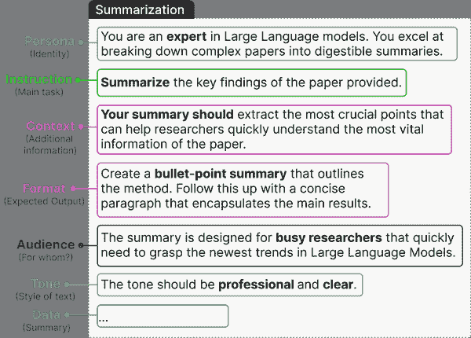

###### 图 4-12\. 一个包含多个组件的复杂提示示例。

这个复杂的提示展示了提示的模块化特性。我们可以自由添加和删除组件，并判断它们对输出的影响。如图 4-13 所示，我们可以逐步构建提示，并探索每次变化的影响。

**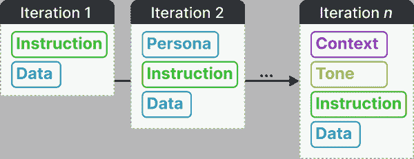**

###### 图 4-13\. 迭代模块组件是提示工程的重要组成部分。**  **这些变化不仅限于简单地引入或移除组件。正如我们之前看到的近期效应和首因效应，它们的顺序会影响 LLM 的输出质量。

换句话说，实验在找到适合你用例的最佳提示时至关重要。通过提示，我们实际上处于一个迭代实验的循环中。

尝试一下！使用复杂提示添加和/或移除部分，以观察其对生成提示的影响。当你发现拼图中值得保留的部分时，会很快注意到。你可以通过将自己的数据添加到`data`变量中来使用自己的数据：

```py
# Prompt components
persona = "You are an expert in Large Language models. You excel at breaking down complex papers into digestible summaries.`\n`"
instruction = "Summarize the key findings of the paper provided.`\n`"
context = "Your summary should extract the most crucial points that can help researchers quickly understand the most vital information of the paper.`\n`"
data_format = "Create a bullet-point summary that outlines the method. Follow this up with a concise paragraph that encapsulates the main results.`\n`"
audience = "The summary is designed for busy researchers that quickly need to grasp the newest trends in Large Language Models.`\n`"
tone = "The tone should be professional and clear.`\n`"
data = "Text to summarize: PUT_THE_DATA_TO_SUMMARIZE_HERE"
# The full prompt - remove and add pieces to view its impact on the generated output
query = persona + instruction + context + data_format + audience + tone + data
prompt = format_prompt(query)
```

###### 提示

几乎每周都有新的提示组件可能提高输出的准确性。我们可以添加各种各样的组件，每周都会发现使用情感刺激（例如，“这对我的职业非常重要。”）等创造性组件。

提示工程的一大乐趣在于你可以尽可能地富有创造力，以找出哪些提示组件的组合对你的用例有帮助。开发一个适合你的格式几乎没有约束。

然而，请注意，某些提示对特定模型的效果更好，因为它们的训练数据可能不同，或者它们的训练目的不同。**  **## 上下文学习：提供示例

在之前的章节中，我们试图准确描述大型语言模型（LLM）应该做什么。尽管准确和具体的描述有助于 LLM 理解用例，但我们可以更进一步。

我们为什么不直接展示任务，而是描述它呢？

我们可以向 LLM 提供我们想要实现的事物的确切示例。这通常被称为上下文学习，我们向模型提供正确的示例。

如图 4-14 所示，展示给 LLM 的示例数量会影响形式。零-shot 提示不利用示例，one-shot 提示使用一个示例，而 few-shot 提示使用两个或更多示例。


###### 图 4-14\. 复杂提示的示例，包含多个组件。

采用原始短语，我们认为“一个例子胜过千言万语”。这些示例提供了 LLM 应该如何实现的直接示例。

我们可以用一个简单的示例来说明这种方法，该示例取自描述此方法的原始论文。提示的目标是生成一个包含虚构单词的句子。为了提高生成句子的质量，我们可以向生成模型展示一个包含虚构单词的正确句子的示例。

为此，我们需要区分我们的提问（`user`）和模型提供的答案（`assistant`）：

```py
# Use a single example of using the made-up word in a sentence
one_shot_prompt = format_prompt(messages=[
    {"role": "user", "content": "Q: A 'Gigamuru' is a type of Japanese musical instrument. An example of a sentence that uses the word Gigamuru is:"},
    {"role": "assistant", "content": "A: I have a Gigamuru that my uncle gave me as a gift. I love to play it at home."},
    {"role": "user", "content": "Q: To 'screeg' something is to swing a sword at it. An example of a sentence that uses the word screeg is:"}
])
print(one_shot_prompt)
```

该提示说明了区分用户和助手的必要性。如果我们不这样做，就会似乎在自言自语：

```py
"""
<|user|>
Q: A 'Gigamuru' is a type of Japanese musical instrument. An example of a sentence that uses the word Gigamuru is:</s>
<|assistant|>
A: I have a Gigamuru that my uncle gave me as a gift. I love to play it at home.</s>
<|user|>
Q: To 'screeg' something is to swing a sword at it. An example of a sentence that uses the word screeg is:</s>
<|assistant|>
"""
```

我们可以使用这个提示来运行我们的模型：

```py
# Run generative model
outputs = pipe(one_shot_prompt, max_new_tokens=64, do_sample=`True`, return_full_text=`False`)
print(outputs[0]["generated_text"])
```

结果是一个使用虚构词“screeg”的正确句子：

```py
"A: I screeged the dragon's tail with my sword, but it only seemed to make it angrier."
```

与所有提示组件一样，一次或几次提示并不是提示工程的终极解决方案。我们可以将其作为增强我们给出的描述的拼图的一部分。模型仍然可以通过随机抽样“选择”忽略指令。

## 链式提示：拆分问题

在之前的示例中，我们探索了将提示拆分为模块化组件，以提高 LLM 的性能。尽管这在许多用例中效果很好，但对于高度复杂的提示或用例，这可能不可行。

我们可以在提示之间拆分问题，而不是在提示内部。基本上，我们将一个提示的输出作为下一个提示的输入，从而创建一个连续的交互链，解决我们的难题。

为了说明，假设我们希望使用 LLM 为我们根据一系列产品特征创建产品名称、口号和销售推介。尽管我们可以要求 LLM 一次性完成，但我们可以将问题拆分为多个部分。

因此，如在图 4-16 中所示，我们得到一个顺序管道，首先创建产品名称，然后将其与产品特征作为输入创建口号，最后使用特征、产品名称和口号来创建销售推介。

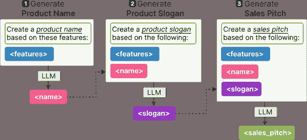

###### 图 4-15\. 使用产品特征的描述，链式提示创建合适的名称、口号和销售推介。

这种链式提示的技术使 LLM 能够在每个单独问题上花费更多时间，而不是处理整个问题。

让我们用一个小例子来说明。

```py
# Create name and slogan for a product
product_prompt = format_prompt("Create a name and slogan for a chatbot that leverages LLMs.")
outputs = pipe(product_prompt, max_new_tokens=32, do_sample=`True`, return_full_text=`False`)
product_description = outputs[0]["generated_text"]
# Use name and slogan as input for a sales pitch
sales_prompt = format_prompt(f"What would be a good sales pitch for the following product: '`{`product_description`}`'?")
outputs = pipe(sales_prompt, max_new_tokens=128, do_sample=`True`, return_full_text=`False`)
sales_pitch = outputs[0]["generated_text"]
# Results
print(product_description)
print(sales_pitch)
```

在这个例子中，我们首先要求模型创建名称和口号。然后，我们可以使用输出请求基于产品特征的良好销售推介。

这给我们带来了以下输出：

```py
"""
Name: LLM Assistant
Slogan: "Your go-to chatbot powered by cutting-edge language learning models."
Introducing LLM Assistant, the revolutionary chatbot that transforms the way you learn languages. Unlike traditional language learning methods, LLM Assistant utilizes the latest language learning models powered by Artificial Intelligence. With LLM Assistant, you can communicate with native speakers, practice real-life conversations, and receive instant feedback. Whether you're a novice or an advanced speaker, LLM Assistant caters to your unique learning needs, making language learning fun, interactive, and efficient. So, why wait? Say hello to LLM Assistant, your new language learning companion!
"""
```

虽然我们需要两次调用模型，但一个主要好处是我们可以给每次调用不同的参数。例如，名称和口号创建的令牌数量相对较少，而推介可以更长。

它可以用于多种用例，包括：

*响应验证*

请求 LLM 重新检查之前生成的输出

*并行提示*

并行创建多个提示，并进行最终合并。例如，请多个 LLM 并行生成多个食谱，并使用组合结果创建购物清单。

*写故事*

利用 LLM 撰写书籍或故事，可以将问题拆解为各个组成部分。例如，首先撰写摘要，再发展角色并构建故事情节，然后再深入创作对话。

在第六章中，我们将超越链接 LLM，连接其他技术组件，如内存、搜索等！在此之前，提示链的这一概念将在接下来的部分中进一步探讨，描述更复杂的提示链方法，如自一致性、链式思维和树状思维。**  **# 与生成模型的推理

在之前的部分中，我们主要集中于提示的模块化组件，通过迭代构建它们。这些先进的提示工程技术，如提示链，证明了实现生成模型复杂推理的第一步。

为了允许这种复杂的推理，现在是退后一步探讨推理内容的好时机。简单来说，我们的推理方法可以分为系统 1 和系统 2 思维过程，如图 5-X 所示。

系统 1 思维代表自动、直觉和几乎瞬时的反应。它与生成模型有相似之处，生成模型自动生成令牌而没有任何自我反思行为。相反，系统 2 思维是一个有意识、缓慢和逻辑的过程，类似于头脑风暴和自我反思。

如果我们能够赋予生成模型自我反思的能力，我们实际上是在模拟系统 2 的思维方式，这通常比系统 1 思维产生更深思熟虑的响应。

在本节中，我们将探讨几种技术，试图模仿这些人类推理者的思维过程，旨在提高模型的输出。

## 链式思维：回答前思考

实现生成模型复杂推理的第一大步骤是通过一种称为链式思维（CoT）的方法。CoT 旨在让生成模型“思考”后再回答问题，而不是直接回答而不进行任何推理。

如图 4-16 所示，它在提示中提供了示例，展示了模型在生成响应之前应进行的推理。这些推理过程被称为“思考”。这对涉及更高复杂度的任务（如数学问题）帮助巨大。增加这个推理步骤使模型能够在推理过程中分配更多计算资源。

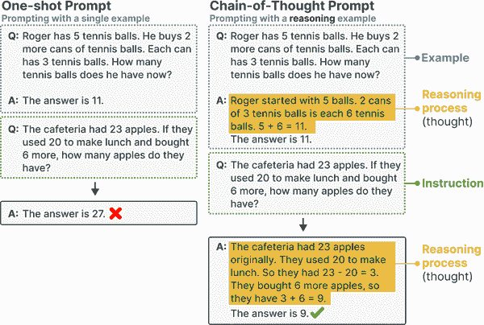

###### 图 4-16. 链式思维提示使用推理示例来说服生成模型在其回答中使用推理。

我们将使用他们在论文中使用的例子来演示这一现象。首先，让我们探讨一下没有 CoT 的标准提示的输出。我们在提供示例时，不仅提供单一查询，而是区分用户和助手：

```py
# Answering without explicit reasoning
standard_prompt = format_prompt(messages=[
    {"role": "user", "content": "Q: Roger has 5 tennis balls. He buys 2 more cans of tennis balls. Each can has 3 tennis balls. How many tennis balls does he have now?"},
    {"role": "assistant", "content": "A: The answer is 11."},
    {"role": "user", "content": "Q: The cafeteria had 23 apples. If they used 20 to make lunch and bought 6 more, how many apples do they have?"}
])
# Run generative model
outputs = pipe(standard_prompt, max_new_tokens=64, do_sample=`True`, return_full_text=`False`)
print(outputs[0]["generated_text"])
```

这给出了错误的答案：

```py
"A: The answer is 26."
```

相反，我们将使用 CoT 让模型在给出答案之前展示其推理过程：

```py
# Answering with chain-of-thought
cot_prompt = format_prompt(messages=[
    {"role": "user", "content": "Q: Roger has 5 tennis balls. He buys 2 more cans of tennis balls. Each can has 3 tennis balls. How many tennis balls does he have now?"},
    {"role": "assistant", "content": "A: Roger started with 5 balls. 2 cans of 3 tennis balls each is 6 tennis balls. 5 + 6 = 11\. The answer is 11."},
    {"role": "user", "content": "Q: The cafeteria had 23 apples. If they used 20 to make lunch and bought 6 more, how many apples do they have?"}
])
# Run generative model
outputs = pipe(cot_prompt, max_new_tokens=256, do_sample=`True`, return_full_text=`False`)
print(outputs[0]["generated_text"])
```

这次，我们得到了正确的响应：

```py
"A: Initially, there were 23 apples. They used 20 apples to make lunch, leaving 3 apples (23 - 20 = 3). Then they bought 6 more apples. So, in total, the cafeteria now has (3 + 6) apples, which is 9 apples in total. The answer is 9."
```

这个推理过程尤其有帮助，因为模型是在生成答案之前这样做的。通过这样做，它可以利用迄今为止生成的知识来计算正确的答案。

### 零-shot 思维链

尽管 CoT 是增强生成模型输出的好方法，但它确实需要一个或多个推理示例，而用户可能没有这些示例。

我们可以简单地要求生成模型提供推理，而不是提供示例。有许多不同的形式有效，但一个常见且有效的方法是使用短语“让我们一步一步思考”，如图 4-17 所示。

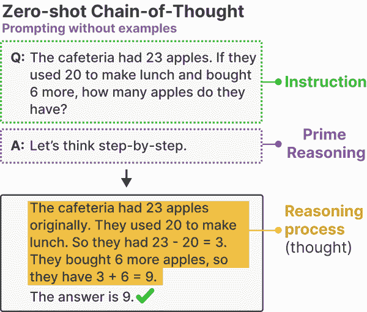

###### 图 4-17\. 不使用示例的思维链提示。相反，它使用短语“让我们一步一步思考”来激发其回答中的推理。

使用我们之前的例子，我们可以简单地将该短语附加到提示中，以启用类似 CoT 的推理：

```py
# Zero-shot Chain-of-Thought
zeroshot_cot = format_prompt(
    "The cafeteria had 23 apples. If they used 20 to make lunch and bought 6 more, how many apples do they have? Let's think step-by-step."
)
# Run generative model
outputs = pipe(zeroshot_cot, max_new_tokens=512, do_sample=`True`, return_full_text=`False`)
print(outputs[0]["generated_text"])
```

再次，我们得到了正确的响应，但现在不需要提供示例：

```py
"""
1\. We start with the original number of apples in the cafeteria: 23
2\. We determine how many apples were used to make lunch: 20
3\. We subtract the number of apples used to make lunch from the total number of apples to find the number of apples left in the cafeteria: 23 - 20 = 3
4\. We purchase 6 more apples: 3 + 6 = 9
5\. So the total number of apples now in the cafeteria is 23 (original number) - 20 (apples used for lunch) + 6 (apples purchased) = 9
6\. We can confirm that the calculation is correct by comparing the result with the original number of apples. Our answer is indeed closer to the original 23 apples than it was after we used 20 apples for lunch.
"""
```

这就是在进行计算时“展示你的过程”如此重要的原因。通过关注推理过程，我们可以为答案提供依据，更加确定答案的正确性。

###### 提示

尽管提示“*让我们一步一步思考*”可以改善输出，但你并不受限于这个确切的表述。还有替代方案，例如“*深呼吸一下，逐步思考*”和“*让我们逐步解决这个问题*”。作者证明了提出替代表述的实用性。

**自我一致性：抽样输出**

如果通过 `temperature` 和 `top_p` 等参数允许一定程度的创造性，使用相同的提示多次可能会导致不同的结果。因此，输出的质量可能会因随机选择的词元而提高或降低。换句话说，这全看运气！

为了抵消这种随机性并提高生成模型的性能，引入了自我一致性。这种方法多次向生成模型提出相同的提示，并将多数结果作为最终答案。在这个过程中，每个答案可能会受到不同 `temperature` 和 `top_p` 值的影响，以增加抽样的多样性。

如图 4-18 所示，通过添加链式思维提示，可以进一步改进此方法，以提高推理能力，同时仅使用答案进行投票程序。

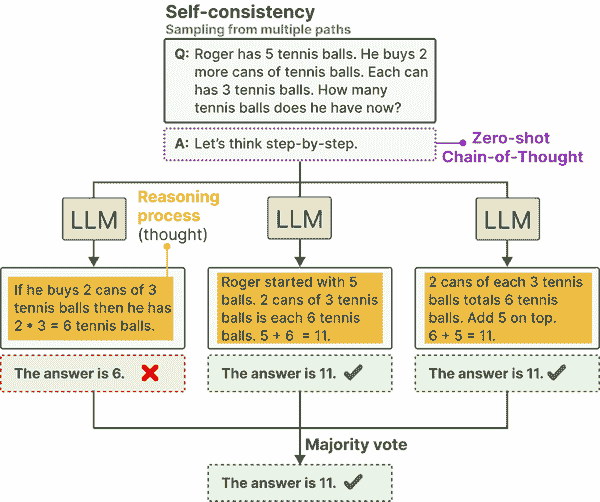

###### 图 4-18。通过从多个推理路径中采样，我们可以使用多数投票提取最可能的答案。

尽管此方法在提高输出方面效果良好，但确实需要对同一个问题进行多次提问。因此，尽管该方法可以提高性能，但它变得* n * 倍慢，其中 * n * 是输出样本的数量。

## 思维树：探索中间步骤

链式思维和自洽性旨在实现更复杂的推理。通过从多个“思想”中进行采样并使其更具思考性，我们旨在提高生成模型的输出。

这些技术仅仅触及了当前为实现这种复杂推理所做工作的表面。思维树对这些方法的改进使得多个想法的深入探索成为可能。

该方法的工作原理如下。当面临需要多次推理步骤的问题时，通常有助于将其拆分成几个部分。在每一步，如图 4-19 所示，生成模型被提示探索当前问题的不同解决方案。然后它投票选出最佳解决方案，接着继续到下一步。

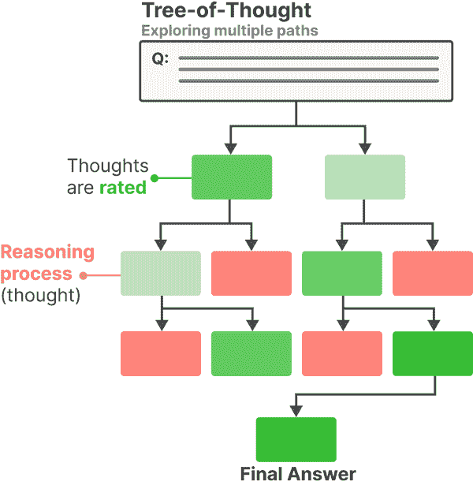

###### 图 4-19。通过利用基于树的结构，生成模型可以生成待评估的中间思想。最有前景的思想被保留，最差的被剪除。

当需要考虑多条路径时，这种方法非常有帮助，例如在编写故事或想出创意时。

这种方法的一个缺点是需要多次调用生成模型，这会显著减慢应用程序的运行速度。幸运的是，已经成功尝试将思维树框架转化为一种简单的提示技术。

与其多次调用生成模型，我们让模型通过模拟多个专家之间的对话来模仿这种行为。这些专家将相互质疑，直到达成共识。一个思维树提示的例子是：

```py
# Zero-shot Chain-of-Thought
zeroshot_tot = format_prompt(
    "Imagine three different experts are answering this question. All experts will write down 1 step of their thinking, then share it with the group. Then all experts will go on to the next step, etc. If any expert realises they're wrong at any point then they leave. The question is 'The cafeteria had 23 apples. If they used 20 to make lunch and bought 6 more, how many apples do they have?'"
)
```

我们可以使用此提示来探索大型语言模型（LLM）如何回应复杂问题：

```py
# Run generative model
outputs = pipe(zeroshot_tot, max_new_tokens=512, do_sample=`True`, return_full_text=`False`)
print(outputs[0]["generated_text"])
```

结果，它通过利用多个专家之间的讨论生成了正确答案：

```py
"""
Expert 1: The cafeteria started with 23 apples.
Expert 2: They used 20 of those apples to make lunch.
Expert 3: After making lunch, they bought 6 more apples to replenish their supply.
Expert 2: Now, they have a total of (23-20, initial apples minus apples used for lunch) plus 6, the additional apples they bought. That's a total of 23-20 + 6 = 9 apples left.
Expert 1: Wait a minute... If they started with 23 apples, how did they only have 9 left after buying more? That can't be right.
[Expert 1 realizes they made a math mistake and leaves.]
Expert 2: I'm going to double-check my math... [Takes out a calculator and verifies that they do indeed have 9 apples left.]
Expert 3: I'm confident in my figures, it's clear we have 9 apples left.
"""
```

看到“专家”之间如此详细的讨论是有趣的，并展示了提示工程带来的创造力。

# 输出验证

使用生成模型构建的系统和应用程序最终可能会投入生产。当发生这种情况时，验证和控制模型的输出以防止破坏应用程序并创建稳健的生成 AI 应用程序是重要的。

验证输出的原因可能包括：

*结构化输出*

默认情况下，大多数生成模型创建自由格式文本，而不遵循自然语言以外的特定结构。某些用例要求它们的输出以特定格式结构化，如 JSON。

*有效输出*

即使我们允许模型生成结构化输出，它仍然能够自由生成其内容。例如，当模型被要求输出两个选择之一时，它不应提出第三个选择。

*伦理*

一些开源生成模型没有安全限制，会生成不考虑安全或伦理的输出。例如，某些用例可能要求输出不包含亵渎、个人可识别信息（PII）、偏见、文化刻板印象等。

*准确性*

许多用例要求输出遵循特定标准或性能。其目的是仔细检查生成的信息是否在事实准确性、一致性或是否无幻觉方面。

控制生成模型的输出，如我们通过`top_p`和`temperature`等参数探讨的，并不是一件容易的事情。这些模型需要帮助才能生成符合某些指导方针的一致输出。

通常，有三种方式控制生成模型的输出：

*示例*

提供预期输出的多个示例。

*语法*

控制标记选择过程。

*微调*

在包含预期输出的数据上调优模型

在本节中，我们将讨论前两种方法。第三种方法，即微调模型，将留到第十二章，我们将在其中深入探讨微调方法。

## 提供示例

修复输出的一个简单明了的方法是向生成模型提供输出应有的示例。如前所述，少量示例学习是一种有效的技术，可以指导生成模型的输出。此方法也可以推广以指导输出的结构。

例如，让我们考虑一个示例，我们希望生成模型为 RPG 游戏创建角色档案。我们开始时不使用示例：

```py
# Zero-shot learning: Providing no examples
zero_shot = format_prompt("Create a character profile for an RPG game in JSON format.")
outputs = pipe(zero_shot, max_new_tokens=128, do_sample=`True`, return_full_text=`False`)
print(outputs[0]["generated_text"])
```

这给我们以下结构，我们截断了它以防止过长的描述：

```py
{
  "name": "Aurelia",
  "race": "Human",
  "class": "Mage",
  "age": 22,
  "gender": "Female",
  "description": "Aurelia is a young woman with a striking golden mane and...",
  "stats": {
    "strength": 8
  }
}
```

虽然这是有效的 JSON，但我们可能不希望某些属性，如“强度”或“年龄”。相反，我们可以向模型提供一些示例，指示预期的格式：

```py
# Providing an example of the output structure
one_shot_prompt = format_prompt("""Create a character profile for an RPG game. Make sure to only use this format:
{
  "description": "A SHORT DESCRIPTION",
  "name": "THE CHARACTER'S NAME",
  "armor": "ONE PIECE OF ARMOR",
  "weapon": "ONE OR MORE WEAPONS"
}
""")
outputs = pipe(one_shot_prompt, max_new_tokens=256, do_sample=`True`, return_full_text=`False`)
print(outputs[0]["generated_text"])
```

这给我们以下内容，我们再次截断了它以防止过长的描述：

```py
{
  "description": "A human wizard with long, wild grey hair and...",
  "name": "Sybil Astrid",
  "armor": "None",
  "weapon": [
    "Crystal Staff",
    "Oak Wand"
  ]
}
```

该模型完美遵循了我们给出的示例，从而实现了更一致的行为。这也展示了利用少量样本学习来改善输出结构而不仅仅是内容的重要性。

这里的重要说明是，模型是否遵循你建议的格式仍然取决于模型本身。有些模型在遵循指令方面表现得比其他模型更好。

## 语法：约束采样

少量样本学习有一个重大缺点：我们无法明确防止生成某些输出。尽管我们引导模型并给出指令，但它可能仍然不会完全遵循。

相反，许多工具迅速被开发出来以限制和验证生成模型的输出，如 Guidance、Guardrails 和 LMQL。部分上，它们利用生成模型验证自身输出，如图 4-20 所示。生成模型将输出作为新提示检索，并尝试根据一系列预定义的规则进行验证。

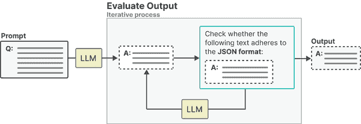

###### 图 4-20\. 使用 LLM 检查输出是否正确遵循我们的规则。

同样，如图 4-21 所示，它还可以通过生成我们已知应如何结构化的格式部分来控制输出格式。

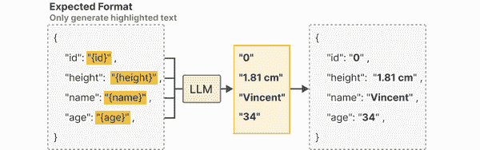

###### 图 4-21\. 使用 LLM 仅生成我们事先不知道的信息片段。

这个过程可以更进一步，而不是在输出验证后进行，我们可以在令牌采样过程中进行验证。在采样令牌时，我们可以定义一系列语法或规则，以便 LLM 在选择下一个令牌时遵循。例如，如果我们要求模型在执行情感分类时返回“正面”、“负面”或“中性”，它仍然可能返回其他内容。如图 4-22 所示，通过限制采样过程，我们可以让 LLM 只输出我们感兴趣的内容。


###### 图 4-22\. 将令牌选择限制为仅三个可能的令牌：“正面”、“中性”和“负面”。

请注意，这仍然受到`top_p`和`temperature`等参数的影响，所示内容非常受限。

让我们通过 llama-cpp-python 来说明这一现象，这是一种库，类似于 transformers，我们可以用它来加载我们的语言模型。它通常用于有效加载和使用压缩模型（通过量化；见第十三章）。

我们通过在终端中运行以下命令来下载模型的量化版本：

```py
wget https://huggingface.co/TheBloke/zephyr-7B-beta-GGUF/resolve/main/zephyr-7b-beta.Q4_K_M.gguf
```

```py`Then, we load the model using llama-cpp-python and choose a JSON grammar to use. This will ensure that the output of the model adheres to JSON:    ``` 从 llama_cpp.llama 导入 httpx、Llama 和 LlamaGrammar # 我们从官方的 llama.cpp 存储库加载 JSON 语法 grammar = httpx.get(     "https://raw.githubusercontent.com/ggerganov/llama.cpp/master/grammars/json_arr.gbnf" ) grammar = LlamaGrammar.from_string(grammar.text) # 加载一个预量化的 LLM llm = Llama("zephyr-7b-beta.Q4_K_M.gguf") ```py    The rules are described in the grammar file we downloaded.    Using the JSON grammar, we can ask the model for an RPG character in JSON format to be used in our Dungeons and Dragons session:    ``` 导入 json # 运行生成模型，并要求它以 JSON 格式创建一个角色 response = llm(     "为 RPG 创建一个 JSON 格式的战士。",     max_tokens=-1,     grammar=grammar ) # 以格式良好的 JSON 打印输出 print(json.dumps(json.loads(response['choices'][0]['text']), indent=4)) ```py    This gives us valid JSON:    ``` [     {         "name": "剑术大师",         "level": 10,         "health": 250,         "mana": 100,         "strength": 18,         "dexterity": 16,         "intelligence": 10,         "armor": 75,         "weapon": "双手剑",         "specialty": "单手剑"     } ] ```py    This allows us to more confidently use generative models in applications where we expect the output to adhere to certain formats.     ###### Note    Note that we set the number of tokens to be generated with `max_tokens` to be, in principle, unlimited. This means that the model will continue generating until is has completed its JSON output or until it reaches its context limit.````  `# 概要    在这一章中，我们通过提示工程和输出验证探讨了生成模型的基础知识。我们关注了提示工程带来的创造力和潜在复杂性。我们发现提示的组件是生成符合我们用例输出的关键。因此，在进行提示工程时，实验至关重要。    在下一章中，我们将探索利用生成模型的高级技术。这些技术超越了提示工程，旨在增强这些模型的能力。从给模型提供外部记忆到使用外部工具，我们旨在赋予生成模型超级能力！`**
