# 第五章： 多模态大型语言模型

当你想到大型语言模型（LLMs）时，多模态可能不是首先想到的事情。毕竟，它们是*语言*模型！

我们看到各种新兴行为从 LLMs 中涌现，包括概括能力、推理、算术和语言学。随着模型变得越来越大和智能，它们的技能集也随之增加。¹

接收和推理多模态输入的能力可能进一步增强，并帮助涌现出以前被锁定的能力。实际上，语言并不单独存在于真空中。例如，你的肢体语言、面部表情、语调等都是增强口语交流的沟通方式。

大型语言模型同样适用，如果我们能够使它们对多模态信息进行推理，它们的能力可能会增强。

在本章中，我们将探讨一些具有多模态能力的不同 LLMs，以及这对实际应用的意义。我们将首先探讨如何使用原始变换器技术的适应版将图像转换为数值表示。然后，我们将展示如何将 LLMs 扩展以包括视觉任务。

# 视觉的变换器

在本书的各章中，我们已经看到使用基于变换器的模型在各种语言建模任务中的成功，从分类和聚类到搜索和生成建模。

因此，研究人员一直在寻找将某些变换器的成功推广到计算机视觉领域的方法，这一点可能并不令人惊讶。

他们提出的方法被称为视觉变换器（ViT），与之前的默认卷积神经网络（CNNs）相比，它在图像识别任务上表现非常出色。² 像原始变换器一样，ViT 用于将非结构化数据（图像）转换为可用于各种任务的表示，例如分类，如图 5-1 所示。

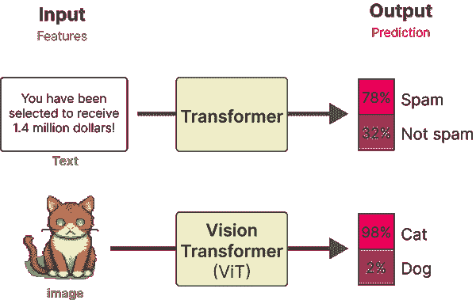

###### 图 5-1\. 原始变换器和视觉变换器都处理非结构化数据，将其转换为数值表示，最终用于分类等任务。

ViT 依赖于变换器架构中的一个重要组成部分，即编码器。正如我们在第一章看到的，编码器负责将文本输入转换为数字表示，然后传递给解码器。然而，在编码器执行其职能之前，文本输入需要首先进行标记化，如图 5-2 所示。

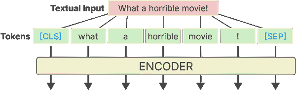

###### 图 5-2\. 文本通过使用标记器首先进行标记化，然后传递给一个或多个编码器。

由于图像不是由单词组成，因此这个标记化过程不能用于视觉数据。相反，ViT 的作者提出了一种将图像标记为“单词”的方法，这使他们能够使用原始的编码器结构。

想象一下你有一张猫的图片。这张图片由许多像素表示，假设为 512x512 像素。每个单独的像素并没有传达太多信息，但当你组合像素块时，你会逐渐看到更多的信息。

ViT 使用的原理与此类似。它不是将文本拆分成标记，而是将原始图像转换为图像块。换句话说，它将图像水平和垂直切割成多个部分，如图 5-3 所示。


###### 图 5-3\. 图像输入的“标记化”过程。它将图像转换为子图像的块。

就像我们将文本转换为文本标记一样，我们也将图像转换为图像块。图像块的扁平化输入可以被视为文本中的标记。

然而，与标记不同，我们不能仅仅给每个块分配一个 ID，因为这些块在其他图像中很少出现，这与文本的词汇不同。

相反，块被线性嵌入以创建数字表示，即嵌入。这些可以用作变换器模型的输入。这样，图像块被视为标记。整个过程如图 5-4 所示。

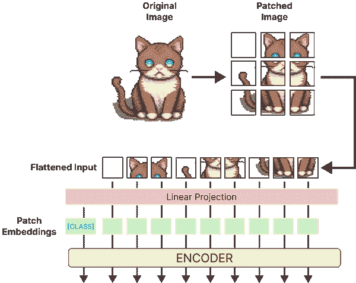

###### 图 5-4\. ViT 背后的主要算法。在对图像进行分块和线性投影后，块嵌入被传递给编码器，并被视为文本标记。

为了说明目的，示例中的图像被分割成 3x3 的补丁，但原始实现使用的是 16x16 的补丁。毕竟，这篇论文的标题是“图像价值 16x16 个词”。

这种方法有趣之处在于，当嵌入被传递给编码器时，它们被视为文本标记。从那时起，文本和图像的训练及其输出没有区别。

由于它们的相似性，ViT 通常用于使各种语言模型实现多模态。其中一种最简单的方法是在嵌入模型的训练过程中使用它们。

# 多模态嵌入模型

在之前的章节中，如章节 X、X 和 X，我们使用嵌入模型来捕捉文本表示的语义内容，例如书籍和文档。我们看到可以利用这些嵌入或数值表示找到相似文档，应用分类任务，甚至进行主题建模。

正如我们之前多次看到的，嵌入通常是 LLM 应用程序的重要驱动因素。它们是一种有效的方法，可以捕获大规模信息并在信息的海洋中寻找针。

也就是说，我们到目前为止只关注了单模态嵌入模型。嵌入模型仅专注于生成文本表示的嵌入。虽然存在仅用于嵌入图像的嵌入模型，但我们将关注能够同时捕捉文本和视觉表示的嵌入模型。我们在图 5-5 中对此进行了说明。

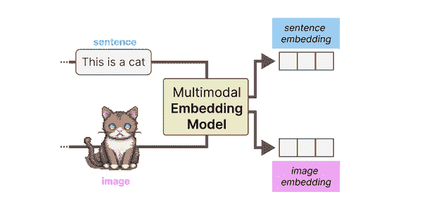

###### 图 5-5\. 多模态嵌入模型可以在同一向量空间中为多种模态创建嵌入。

一个大优势是，它允许比较多模态表示，因为结果嵌入位于同一向量空间中，如图 5-6 所示。例如，使用这样的多模态嵌入模型，我们可以根据输入文本找到图像。如果我们搜索与“狗狗的照片”相似的图像，会找到什么？反之亦然，哪些文档与这个问题最相关？

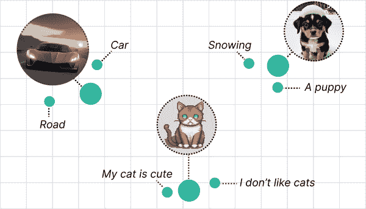

###### 图 5-6\. 多模态嵌入模型可以在同一向量空间中为多种模态创建嵌入。

目前有许多多模态嵌入模型，但最著名且目前使用最广泛的模型是 CLIP（对比语言-图像预训练）。

## CLIP：连接文本和图像

CLIP 是一个嵌入模型，可以计算图像和文本的嵌入。生成的嵌入位于同一向量空间，这意味着图像的嵌入可以与文本的嵌入进行比较。³

这种比较能力使得 CLIP 及类似模型可用于诸如以下任务：

零样本分类

我们可以将图像的嵌入与其可能类别的描述进行比较，以找出哪个类别最相似。

聚类

将图像和一组关键词进行聚类，以找出哪些关键词属于哪些图像集合。

搜索

在数十亿的文本或图像中，我们可以快速找到与输入文本或图像相关的内容。

生成

使用多模态嵌入来驱动图像生成（例如，稳定扩散）。

### CLIP 如何生成多模态嵌入？

CLIP 的过程实际上相当简单。想象一下，你有一个包含数百万张图片及其说明的数据集，如我们在图 5-7 中所示。

**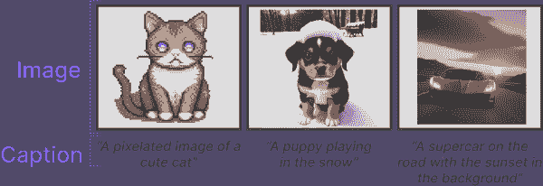

###### 图 5-7。训练多模态嵌入模型所需的数据类型。**  **这个数据集可以为每对数据创建两个表示，即图像及其说明。为此，CLIP 使用文本编码器来嵌入文本，使用图像编码器来嵌入图像。如图 5-8 所示，结果是图像及其对应说明的嵌入。

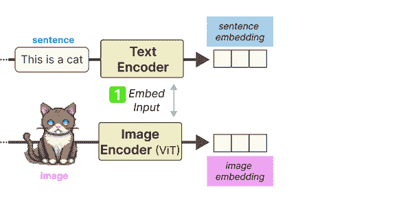

###### 图 5-8。在训练 CLIP 的第一步中，图像和文本分别使用图像编码器和文本编码器进行嵌入。

生成的嵌入对通过余弦相似度进行比较。正如我们在第二章中看到的，余弦相似度是向量之间角度的余弦，通过嵌入的点积计算，并除以它们长度的乘积。

当我们开始训练时，图像嵌入和文本嵌入之间的相似度较低，因为它们尚未优化到同一向量空间。在训练过程中，我们优化嵌入之间的相似度，希望对相似的图像/说明对最大化，而对不相似的图像/说明对最小化。

**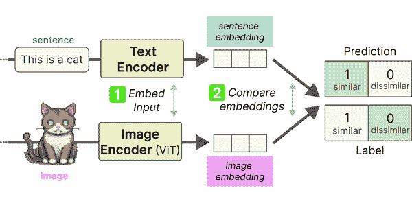

###### 图 5-9\. 在训练 CLIP 的第二步中，句子和图像嵌入之间的相似性使用余弦相似度进行计算。**  **在计算它们的相似性后，模型会更新，流程再次开始，使用新的数据批次和更新后的表示。此方法称为对比学习，我们将在第十三章深入探讨其内部工作原理，并创建自己的嵌入模型。

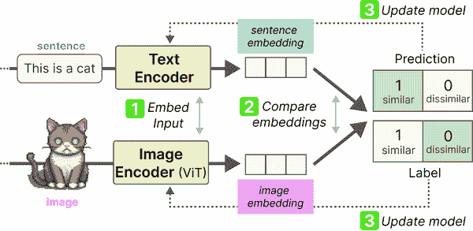

###### 图 5-10\. 在训练 CLIP 的第三步中，文本和图像编码器会更新，以匹配预期的相似性。这会更新嵌入，使其在向量空间中更接近，如果输入相似的话。

最终，我们期望猫的图像的嵌入与句子“猫的图片”的嵌入相似。正如我们将在第十三章看到的，为确保表示尽可能准确，训练过程中还应包括与之无关的图像和标题的负例。

建模相似性不仅是了解事物之间相似的原因，也包括它们不同和不相似的原因。****  ****### OpenCLIP

对于这个示例，我们将使用开源版本的 CLIP 模型，即 OpenCLIP（[`github.com/mlfoundations/open_clip`](https://github.com/mlfoundations/open_clip)）。

使用 OpenCLIP 或任何 CLIP 模型，归结为两件事：在将文本和图像输入传递给主模型之前，先对其进行处理。

在此之前，让我们看看一个小示例，我们将使用之前看到的其中一张图像。即，一张 AI 生成的图像（通过稳定扩散）显示一只小狗在雪地里玩耍，如图 5-11 所示：

```py
from urllib.request import urlopen
from PIL import Image

# Load an AI-generated image of a puppy playing in the snow
image = Image.open(urlopen("https://i.imgur.com/iQ5OtWi.png"))
caption = "a puppy playing in the snow"
```


###### 图 5-11\. 一只小狗在雪地里玩耍的 AI 生成图像。

由于我们有这张图像的标题，我们可以使用 OpenCLIP 为两者生成嵌入。

为此，我们加载三个模型：

一个用于对文本输入进行分词的分词器。

一个预处理器，用于预处理和调整图像大小。

将之前的输出转换为嵌入的主模型。

```py
from transformers import CLIPTokenizerFast, CLIPProcessor, CLIPModel

model_id = "openai/clip-vit-base-patch32"

# Load a tokenizer to preprocess the text
tokenizer = CLIPTokenizerFast.from_pretrained(model_id)

# Load a processor to preprocess the images
processor = CLIPProcessor.from_pretrained(model_id)

# Main model for generating text and image embeddings
model = CLIPModel.from_pretrained(model_id)
```

在加载模型后，对输入进行预处理是简单明了的。让我们从分词器开始，看看预处理输入时会发生什么：

```py
>>> # Tokenize our input
>>> inputs = tokenizer(caption, return_tensors="pt"); inputs

{'input_ids': tensor([[49406,   320,  6829,  1629,   530,   518,  2583, 49407]]), 'attention_mask': tensor([[1, 1, 1, 1, 1, 1, 1, 1]])}
```

我们的输入文本已被转换为输入 ID。为了查看它们所表示的内容，让我们将其转换为标记：

```py
>>> tokenizer.convert_ids_to_tokens(inputs["input_ids"][0])

['<|startoftext|>',
 'a</w>',
 'puppy</w>',
 'playing</w>',
 'in</w>',
 'the</w>',
 'snow</w>',
 '<|endoftext|>']
```

正如我们以前经常看到的，文本被拆分成了多个标记。此外，我们现在还可以看到，文本的开始和结束被标记出来，以将其与潜在的图像嵌入分开。你可能还会注意到`[CLS]`标记缺失。在 CLIP 中，`[CLS]`标记实际上用于表示图像嵌入。

现在我们已经预处理了标题，接下来是创建嵌入：

```py
>>> # Create a text embedding
>>> text_embedding = model.get_text_features(**inputs)
>>> text_embedding.shape

torch.Size([1, 512])
```

在我们创建图像嵌入之前，与文本嵌入一样，我们需要对其进行预处理，因为模型期望输入图像具有某些特征，如大小和形状。

为此，我们可以使用之前创建的处理器：

```py
>>> # Preprocess image
>>> processed_image = processor(text=None, images=image, return_tensors='pt')['pixel_values']
>>> processed_image.shape

torch.Size([1, 3, 224, 224])
```

原始图像为 512×512 像素。注意，这张图像的预处理将其大小减少到 224×224 像素，因为这是其预期的大小。

让我们在图 5-12 中可视化处理过的图像，以查看它实际上在做什么：

```py
import numpy as np

# Prepare image for visualization
img = processed_image.squeeze(0).T
img = np.einsum('ijk->jik', img)

# Visualize preprocessed image
plt.imshow(a)
plt.axis('off')
```


###### 图 5-12\. CLIP 处理过的输入图像。

为了将这个预处理过的图像转换为嵌入，我们可以像之前那样调用`model`：

```py
>>> # Create the image embedding
>>> image_embedding = model.get_image_features(processed_image)
>>> image_embedding.shape

torch.Size([1, 512])
```

请注意，生成的图像嵌入的形状与文本嵌入的形状完全相同。这一点很重要，因为它使我们能够比较它们的嵌入并查看它们是否确实相似。

我们可以使用这些嵌入来计算标题属于图像的概率，通过计算它们的点积并进行 softmax：

```py
>>> # Calculate the probability of the text belonging to the image
>>> text_probs = (100.0 * image_embedding @ text_embedding.T).softmax(dim=-1)
>>> text_probs

tensor([[1.]], grad_fn=<SoftmaxBackward0>)
```

它给我们返回了 1 的得分，表明模型确定该标题属于该图像。

我们可以通过计算嵌入之间的相似性来扩展这个例子。通过在计算点积之前先对嵌入进行归一化，我们得到一个介于 0 和 1 之间的值：

```py
>>> # Normalize the embeddings
>>> text_embedding /= text_embedding.norm(dim=-1, keepdim=True)
>>> image_embedding /= image_embedding.norm(dim=-1, keepdim=True)
>>> 
>>> # Calculate their similarity
>>> text_embedding = text_embedding.detach().cpu().numpy()
>>> image_embedding = image_embedding.detach().cpu().numpy()
>>> score = np.dot(text_embedding, image_embedding.T)
>>> score

array([[0.33149636]], dtype=float32)
```

我们得到的相似性得分是 0.33，这很难解释，因为我们不知道模型认为低相似性和高相似性得分的标准是什么。

相反，让我们通过在图 5-13 中展示更多图像和标题来扩展这个例子：

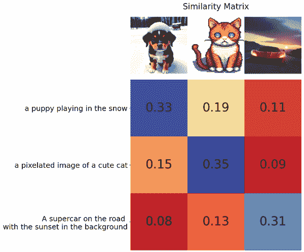

###### 图 5-13\. 三幅图像与三条标题之间的相似性矩阵。

考虑到其他图像的相似性要低得多，0.33 的得分似乎确实很高。

###### 提示

在 sentence-transformers 中，有几个基于 CLIP 的模型实现，使得创建嵌入变得更加容易。只需几行代码：

```py
from sentence_transformers import SentenceTransformer, util

# Load SBERT-compatible CLIP model
model = SentenceTransformer('clip-ViT-B-32')

# Encode the images
image_embeddings = model.encode(images)

# Encode the captions
text_embeddings = model.encode(captions)

#Compute cosine similarities 
sim_matrix = util.cos_sim(image_embeddings, text_embeddings)
print(sim_matrix)
```****  ****# 使文本生成模型多模态化

传统上，文本生成模型，如你所期望的，都是解释文本表示的模型。像 Llama 2 和 ChatGPT 这样的模型在推理文本信息和用自然语言响应方面表现出色。

然而，它们限于所训练的模态，即文本。正如我们之前看到的多模态嵌入模型，添加视觉可以增强模型的能力。

在文本生成模型的情况下，我们希望它能够对某些输入图像进行推理。例如，我们可以给它一张披萨的图片，问它包含哪些配料。你可以向它展示一张埃菲尔铁塔的照片，问它建于何时或位于何处。这种对话能力在图 5-14 中进一步说明。

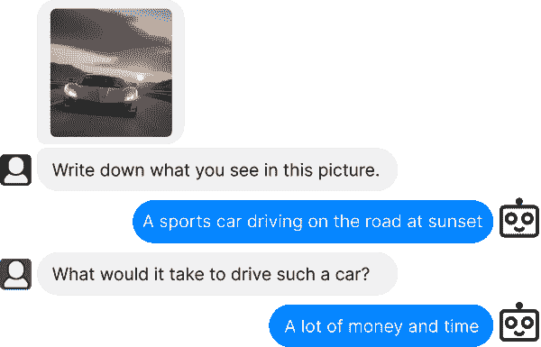

###### 图 5-14\. 一个可以对输入图像进行推理的多模态文本生成模型。

为了弥合这两个领域之间的差距，已经尝试向现有模型引入一种多模态形式。其中一种方法被称为 BLIP-2：*用于统一视觉-语言理解和生成的引导语言图像预训练 2*。BLIP-2 引入了一种易于使用的模块化技术，允许将视觉能力引入现有语言模型。

## BLIP-2：弥合模态差距

从零开始创建一个多模态语言模型需要大量的计算能力和数据。我们必须使用数十亿张图像、文本和图像-文本对来创建这样的模型。可以想象，这并不容易实现！

BLIP-2 通过构建一座名为 Q-former 的桥梁，连接一个预训练的图像编码器和一个预训练的 LLM，从而弥合视觉-语言之间的差距，而不是从头构建架构。

通过利用预训练模型，BLIP-2 只需训练这座桥，而无需从头开始训练图像编码器和 LLM。它充分利用了现有的技术和模型！这座桥在图 5-15 中有所示。

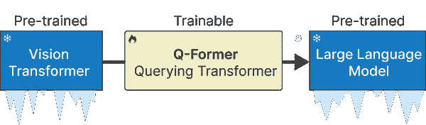

###### 图 5-15\. 查询变换器是视觉（ViT）和文本（LLM）之间的桥梁，是管道中唯一可训练的组件。

为了连接这两个预训练模型，Q-Former，也称为查询变换器，模仿了它们的架构。它有两个共享注意力层的模块：

+   一个图像变换器，与冻结的视觉变换器进行特征提取互动

+   一个可以与 LLM 互动的文本变换器

Q-Former 分两个阶段进行训练，每个阶段针对一种模态，如图 5-16 所示。

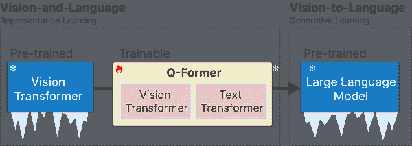

###### 图 5-16。在步骤 1 中，表示学习用于同时学习视觉和语言的表示。在步骤 2 中，这些表示被转换为软视觉提示，以供 LLM 使用。

在步骤 1 中，使用多个图像-文档对来训练 Q-Former，以表示图像和文本。这些对通常是图像的说明，正如我们之前在训练 CLIP 时看到的那样。

图像被馈送到冻结的视觉变换器以提取视觉嵌入。这些嵌入作为 Q-Former 视觉变换器的输入，说明作为 Q-Former 文本变换器的输入。

有了这些输入，Q-Former 随后在三个任务上进行训练：

1.  图像-文本对比学习

1.  图像-文本匹配

1.  基于图像的文本生成

这三个目标被联合优化，以改善从冻结视觉变换器提取的视觉表示。在某种程度上，我们试图将文本信息注入冻结视觉变换器的嵌入中，以便可以在 LLM 中使用它们。BLIP-2 的第一步在图 5-17 中进行了说明。

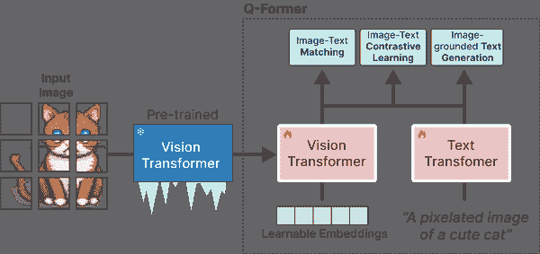

###### 图 5-17。在步骤 1 中，冻结的视觉变换器的输出与其说明一起使用，并在三个对比性任务上进行训练，以学习视觉-文本表示。

在步骤 2 中，来自步骤 1 的可学习嵌入现在在与其相应的文本信息相同的维度空间中包含视觉信息。

然后，将可学习的嵌入作为软提示传递给 LLM。在某种程度上，这些嵌入包含输入图像的文本表示。

然后，将可学习的嵌入传递给 LLM。在某种程度上，这些嵌入作为软视觉提示，使 LLM 基于 Q-Former 提取的视觉表示进行条件化。

它们之间还有一个全连接线性层，以确保可学习的嵌入具有 LLM 期望的相同形状。将视觉转换为语言的第二步在图 5-18 中表示。

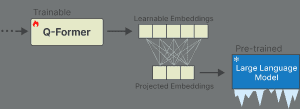

###### 图 5-18。在第 2 步中，Q-Former 学习到的嵌入通过投影层传递给 LLM。投影嵌入作为软视觉提示。

当我们将这些步骤结合起来时，它们使得 Q-Former 能够在相同的维度空间中学习视觉和文本表示，这可以作为对 LLM 的软提示。因此，LLM 将获得关于图像的信息，类似于你在提示 LLM 时提供的上下文。完整的深入过程在图 5-19 中进行了说明。

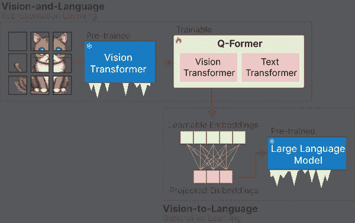

###### 图 5-19。BLIP-2 的完整过程。

## 预处理多模态输入

现在我们知道了 BLIP-2 是如何创建的，有许多有趣的用例可以使用这样的模型。这不仅限于对图像进行注释、回答视觉问题，甚至进行提示。

在我们讨论一些用例之前，让我们先加载模型并探索如何使用它：

```py
from transformers import AutoProcessor, Blip2ForConditionalGeneration
import torch

# Load processor and main model
processor = AutoProcessor.from_pretrained("Salesforce/blip2-opt-2.7b")
model = Blip2ForConditionalGeneration.from_pretrained("Salesforce/blip2-opt-2.7b", torch_dtype=torch.float16)

# Send the model to GPU to speed up inference
device = "cuda" if torch.cuda.is_available() else "cpu"
model.to(device)
```

###### 注意

使用`model.vision_model`和`model.language_model`，我们可以看到在我们加载的 BLIP-2 模型中，分别使用了哪个视觉变换器和大型语言模型。

我们加载了组成完整管道的两个组件，一个是`processor`，另一个是`model`。`processor`可以与语言模型的分词器进行比较。它将非结构化输入（如图像和文本）转换为模型通常期望的表示形式。

### 预处理图像

让我们先来探讨一下`processor`对图像的处理。我们首先加载一张非常宽的图像用于说明：

```py
from urllib.request import urlopen
from PIL import Image

# Load a wide image
link = "https://images.unsplash.com/photo-1524602010760-6eb67b3c63a0?ixlib=rb-4.0.3&ixid=M3wxMjA3fDB8MHxwaG90by1wYWdlfHx8fGVufDB8fHx8fA%3D%3D&auto=format&fit=crop&w=2631&q=80"
image = Image.open(urlopen(link)).convert("RGB")
image
```


###### 图 5-20。待添加说明

图像的尺寸为 520 乘 492 像素，这通常是一种不寻常的格式。那么让我们看看我们的`processor`对它做了什么。

```py
>>> np.array(image).shape

(520, 492, 3)
```

当我们将其转换为 Numpy 格式后检查形状时，显示出一个额外的维度，其大小为 3。这代表每个像素的 RGB 编码，即其颜色。

接下来，我们将原始图像传递给处理器，以便图像可以被处理成模型所期望的形状：

```py
>>> inputs = processor(image, return_tensors="pt").to(device, torch.float16)
>>> inputs["pixel_values"].shape

torch.Size([1, 3, 224, 224])
```

结果是一个 224 乘 224 像素的图像。比我们最初的图像要小得多！这也意味着所有不同形状的图像都将被处理为正方形。因此，输入非常宽或高的图像时要小心，因为它们可能会变形。

### 预处理文本

让我们继续探索`processor`对文本的处理。首先，我们可以访问用于对输入文本进行分词的分词器：

```py
>>> processor.tokenizer

GPT2TokenizerFast(name_or_path='Salesforce/blip2-opt-2.7b', vocab_size=50265, model_max_length=1000000000000000019884624838656, is_fast=True, padding_side='right', truncation_side='right', special_tokens={'bos_token': AddedToken("</s>", rstrip=False, lstrip=False, single_word=False, normalized=True), 'eos_token': AddedToken("</s>", rstrip=False, lstrip=False, single_word=False, normalized=True), 'unk_token': AddedToken("</s>", rstrip=False, lstrip=False, single_word=False, normalized=True), 'pad_token': AddedToken("<pad>", rstrip=False, lstrip=False, single_word=False, normalized=True)}, clean_up_tokenization_spaces=True)
```

我们使用的 BLIP-2 模型使用的是 GPT2Tokenizer。大多数分词器的工作方式非常相似，但在何时及如何对输入文本进行分词方面有细微差别。

为了探索这个 GPT2Tokenizer 是如何工作的，我们可以用一句小句子进行尝试。我们先将句子转换为 token ids，然后再转换回 tokens：

```py
# Preprocess the text
text = "Her vocalization was remarkably melodic"
token_ids = processor(image, text=text, return_tensors="pt").to(device, torch.float16)["input_ids"][0]

# Convert input ids back to tokens
tokens = processor.tokenizer.convert_ids_to_tokens(token_ids)
```

当我们检查标记时，可能会注意到某些标记开头有一个奇怪的符号，即 Ġ 符号。这实际上应该是一个空格。然而，一个内部函数将特定代码点中的字符向上移动 256，使其可打印。因此，空格（代码点 32）变成了 Ġ（代码点 288）。

我们将它们转换为下划线以便于说明：

```py
>>> tokens = [token.replace("Ġ", "_") for token in tokens]
>>> tokens

['</s>', 'Her', '_vocal', 'ization', '_was', '_remarkably', '_mel', 'odic']
```

输出显示下划线表示一个单词的开始。这样，由多个标记组成的单词就可以被识别。

## 用例 1：图像标注

使用像 BLIP-2 这样的模型最直接的用法是为您数据中的图像创建标题。您可能是一家想要为其服装创建描述的商店，或者您是一位没有时间手动标注其 1000 多张婚礼照片的摄影师。

图像标注的过程紧密跟随处理过程。图像被转换为模型可以读取的像素值。这些像素值被传递给 BLIP-2，以转换成 LLM 可用于决定适当标题的软视觉提示。

让我们处理一张超跑的图像，并使用处理器推导出预期形状的像素：

```py
from urllib.request import urlopen
from PIL import Image

# Load an AI-generated image of a supercar
image = Image.open(urlopen("https://i.imgur.com/zehSvAe.png")).convert("RGB")

# Convert an image into inputs and preprocess it
inputs = processor(image, return_tensors="pt").to(device, torch.float16)
image
```

下一步是使用 BLIP-2 模型将图像转换为标记 ID。完成后，我们可以将这些 ID 转换为生成的标题文本：

```py
# Generate token ids using the full BLIP-2 model
generated_ids = model.generate(**inputs, max_new_tokens=20)

# Convert the token ids to text
generated_text = processor.batch_decode(generated_ids, skip_special_tokens=True)[0].strip()
```

当我们打印出 `generated_text` 时，可以看看标题：

```py
>>> print(generated_text)

an orange supercar driving on the road at sunset
```

“一辆橙色超跑在日落时的公路上行驶”似乎是对这张图像的完美描述！

图像标注是学习这个模型的好方法，在进入更复杂的用例之前，自己尝试几张图像，看看它表现良好和不佳的地方。

特定领域的图像，如特定卡通角色或虚构创作的图片，可能会失败，因为该模型主要是基于公开数据进行训练的。

让我们用一个有趣的例子结束这个用例，即 Rorschach 测验中的图像，这个测试是一个古老的心理测试，用来测试个体对墨水斑点的感知。⁴ 人们在这样的墨水斑点中看到的东西据说能揭示出一个人的性格特征。

这是一项相当主观的测试，但这正使其更加有趣！

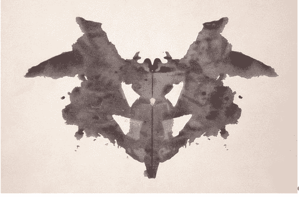

###### 图 5-21\. Rorschach 测验中的图像。你在里面看到了什么？

让我们以图 7-X 中的图像作为输入：

```py
# Load rorschach image
url = "https://upload.wikimedia.org/wikipedia/commons/7/70/Rorschach_blot_01.jpg"
image = Image.open(urlopen(url)).convert("RGB")

# Generate caption
inputs = processor(image, return_tensors="pt").to(device, torch.float16)
generated_ids = model.generate(**inputs, max_new_tokens=20)
generated_text = processor.batch_decode(generated_ids, skip_special_tokens=True)[0].strip()
```

与之前一样，当我们打印出 `generated_text` 时，可以看看标题：

```py
>>> print(generated_text)

"a black and white ink drawing of a bat"
```

“一幅黑白的蝙蝠墨水画”。我完全能理解模型会用这样的描述为这张图像标注。由于这是一个 Rorschach 测试，你认为这对模型意味着什么？

## 用例 2：多模态基于聊天的提示

尽管标题生成是一项重要任务，我们可以进一步扩展其应用案例。在那个示例中，我们展示了如何从一种模态（视觉，即图像）转向另一种模态（文本，即标题）。

我们可以尝试通过执行所谓的视觉问答，来同时呈现这两种模态，而不是遵循这种线性结构。在这个特定的用例中，我们给模型提供一张图像以及关于该特定图像的问题，让它回答。模型需要同时处理图像和问题。

为了演示，我们从一张汽车的图片开始，请 BLIP-2 描述该图像。为此，我们首先需要对图像进行预处理，就像我们之前做过几次一样：

```py
# Load an AI-generated image of a supercar and process it
image = Image.open(urlopen("https://i.imgur.com/zehSvAe.png")).convert("RGB")
inputs = processor(image, return_tensors="pt").to(device, torch.float16)
```

为了进行视觉问答，我们需要给 BLIP-2 的不仅仅是图像，还有提示语。如果没有提示，模型会像之前一样生成一个标题。

我们将请求模型描述我们刚刚处理的图像：

```py
# Visual Question Answering
prompt = "Question: Write down what you see in this picture. Answer:"

# Process both the image and the prompt
inputs = processor(image, text=prompt, return_tensors="pt").to(device, torch.float16)

# Generate text
generated_ids = model.generate(**inputs, max_new_tokens=30)
generated_text = processor.batch_decode(generated_ids, skip_special_tokens=True)[0].strip()
```

当我们打印出`generated_text`时，可以探索它对我们提问的回答：

```py
>>> print(generated_text)

A sports car driving on the road at sunset
```

它正确地描述了图像。然而，这是一个相对简单的例子，因为我们的问题本质上是在让模型创建一个标题。相反，我们可以以聊天的方式问它后续问题。

为此，我们可以将之前的对话，包括它对我们问题的回答，提供给模型。然后我们问它一个后续问题。

```py
>>> # Chat-like prompting
>>> prompt = "Question: Write down what you see in this picture. Answer: A sports car driving on the road >>> at sunset. Question: What would it cost me to drive that car? Answer:"
>>> 
>>> # Generate output
>>> inputs = processor(image, text=prompt, return_tensors="pt").to(device, torch.float16)
>>> generated_ids = model.generate(**inputs, max_new_tokens=30)
>>> generated_text = processor.batch_decode(generated_ids, skip_special_tokens=True)[0].strip()
>>> print(generated_text)

$1,000,000
```

$1,000,000 是高度具体的！这展示了 BLIP-2 更像聊天的行为，允许进行一些有趣的对话。

最后，我们可以通过使用 ipywidgets（Jupyter Notebooks 的一个扩展，允许我们制作交互按钮、输入文本等）来使这个过程变得更加顺畅。

```py
from IPython.display import HTML, display
import ipywidgets as widgets

def text_eventhandler(*args):
  question = args[0]["new"]
  if question:
    args[0]["owner"].value = ""

    # Create prompt
    if not memory:
      prompt = " Question: " + question + " Answer:"
    else:
      template = "Question: {} Answer: {}."
      prompt = " ".join([template.format(memory[i][0], memory[i][1]) for i in range(len(memory))]) + " Question: " + question + " Answer:"

    # Generate text
    inputs = processor(image, text=prompt, return_tensors="pt").to(device, torch.float16)
    generated_ids = model.generate(**inputs, max_new_tokens=100)
    generated_text = processor.batch_decode(generated_ids, skip_special_tokens=True)[0].strip().split("Question")[0]

    # Update memory
    memory.append((question, generated_text))

    # Assign to output
    output.append_display_data(HTML("<b>USER:</b> " + question))
    output.append_display_data(HTML("<b>BLIP-2:</b> " + generated_text))
    output.append_display_data(HTML("<br>"))

# Prepare widgets
in_text = widgets.Text()
in_text.continuous_update = False
in_text.observe(text_eventhandler, "value")
output = widgets.Output()
memory = []

# Display chat box
display(
    widgets.VBox(
        children=[output, in_text],
        layout=widgets.Layout(display="inline-flex", flex_flow="column-reverse"),
    )
)
```

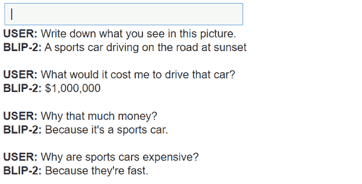

###### 图 5-22\. 图例说明待补充

看来我们可以继续对话，问它一堆问题。通过这种基于聊天的方式，我们实际上创建了一个可以推理图像的聊天机器人！

# 总结

在这一章中，我们探讨了两种使语言模型多模态的方法。

¹ Wei, J., Tay, Y., Bommasani, R., Raffel, C., Zoph, B., Borgeaud, S., Yogatama, D., Bosma, M., Zhou, D., Metzler, D., & others (2022). 大语言模型的涌现能力。arXiv 预印本 arXiv:2206.07682。

² Dosovitskiy, A., Beyer, L., Kolesnikov, A., Weissenborn, D., Zhai, X., Unterthiner, T., Dehghani, M., Minderer, M., Heigold, G., Gelly, S., & others (2020). 一张图像的价值相当于 16x16 个词：用于大规模图像识别的变换器。arXiv 预印本 arXiv:2010.11929。

³ Radford, A., Kim, J., Hallacy, C., Ramesh, A., Goh, G., Agarwal, S., Sastry, G., Askell, A., Mishkin, P., Clark, J., & others (2021). 从自然语言监督中学习可转移的视觉模型。在 *国际机器学习会议* (第 8748–8763 页)。

⁴ Schafer, R. (1954). 罗夏克测试中的精神分析解读：理论与应用。****
