# 第七章： 创建文本嵌入模型

文本嵌入模型是许多强大自然语言处理应用的基础。它们为赋能已经令人印象深刻的技术（如文本生成模型）奠定了基础。在本书中，我们已经在多种应用中使用了嵌入模型，如监督分类、无监督分类、语义搜索，甚至为像 ChatGPT 这样的文本生成模型提供记忆。

嵌入模型在该领域的重要性几乎无法过分强调，因为它们是许多应用背后的驱动力。因此，在本章中，我们将讨论多种创建和微调嵌入模型的方法，以增强其代表性和语义能力。

让我们开始探索嵌入模型是什么以及它们通常如何工作。

# 嵌入模型

嵌入和嵌入模型已经在之前的多个章节中讨论过（章节 X、X 和 X），这证明了它们的实用性。在训练这样的模型之前，让我们回顾一下之前对嵌入模型的学习。

非结构化文本数据本身通常很难处理。它们不是我们可以直接处理、可视化并创建可操作结果的值。我们首先必须将这些文本数据转换为我们可以轻松处理的内容，即数值表示。这一过程通常被称为**嵌入**输入以输出可用向量，称为**嵌入**，如图 7-1 所示。

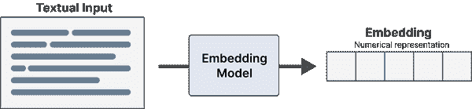

###### 图 7-1\. 我们使用嵌入模型将文本输入（如文档、句子和短语）转换为数值表示，称为嵌入。

嵌入输入的过程通常由一个大型语言模型（LLM）执行，我们称之为*嵌入模型*。这种模型的主要目的是尽可能准确地表示文本数据为嵌入。

然而，准确表示意味着什么呢？通常，我们希望捕捉文档的*语义特征*，即其含义。如果我们能够捕捉到文档所传达的核心内容，我们希望能捕捉到文档的主题。在实际操作中，这意味着我们希望相似文档的向量也要相似，而每个讨论完全不同主题的文档的嵌入则应不相似。这种语义相似性的理念在图 7-2 中得以可视化。


###### 图 7-2\. 语义相似性的概念是，我们期望具有相似意义的文本数据在 n 维空间中也彼此更接近。作为一个例子，这里在二维空间中进行了说明。请注意，这是一个简化的例子。虽然二维可视化有助于说明嵌入的接近性和相似性，但这些嵌入通常位于高维空间中。

然而，嵌入模型可以出于多种目的进行训练。例如，在构建情感分类器时，我们对文本的情感比其语义相似性更感兴趣。如图 7-3 所示，我们可以微调模型，使得文档根据其情感而不是语义特征更接近。

无论如何，嵌入模型的目标是学习某些文档彼此相似的原因，我们可以引导这一过程。通过向模型提供足够多的语义相似文档示例，我们可以朝着语义的方向引导，而使用情感示例则会引导它朝那个方向。


###### 图 7-3\. 相似性不仅仅可以通过语义来表达。可以训练一个嵌入模型，专注于情感相似性，即具有相似情感的文档在 n 维空间中彼此更接近，而与情感不同的文档则相距较远。在该图中，负面评价（红色）彼此接近，与正面评价（绿色）不同。

我们可以训练、微调和引导嵌入模型的方式有很多，但最强大且广泛使用的技术之一称为对比学习。

# 什么是对比学习？

训练和微调文本嵌入模型的一项主要技术称为对比学习。对比学习是一种旨在训练嵌入模型的技术，使得相似文档在向量空间中更接近，而不同文档则更远离。我们在图 13-X 和图 13-X 中之前见过这个概念。

对比学习的基本思想是，学习和建模文档之间相似性/不相似性的最佳方法是向模型提供相似和不相似对的示例。为了准确捕捉文档的语义性质，通常需要将其与另一文档进行对比，以便模型学习什么使其不同或相似。这个对比过程非常强大，并与文档撰写的背景相关。这个高级过程在图 7-4 中得到了展示。

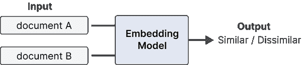

###### 图 7-4\. 对比学习旨在教导嵌入模型文档是否相似或不相似。对比学习通过向模型展示一定程度上相似或不相似的文档组来实现。

另一个看待对比学习的方法是通过解释的性质。一个很好的例子是一个记者问一个抢劫犯“你为什么抢银行”，他回答“因为那里有钱。”¹ 尽管这个回答在事实上是正确的，但问题的意图并不是问他为什么特定地抢银行，而是问他为什么会抢劫。这被称为对比解释，指的是理解一个特定案例，“为什么 P”与其他选择相比，“为什么 P 而不是 Q？”² 在这个例子中，问题可以有多种解读，可能最好的方式是提供一个替代选择：“你为什么抢银行（P）而不是遵守法律（Q）？”。

理解问题的替代方案的重要性同样适用于嵌入如何通过对比学习来学习。通过向模型展示相似和不相似的文档对，它开始学习什么使得事物相似/不相似，更重要的是，为什么。

例如，你可以让一个模型通过寻找“尾巴”、“鼻子”、“四条腿”等特征来理解什么是狗。这个学习过程可能相当困难，因为特征往往没有明确的定义，并且可以有多种解读。一个具有“尾巴”、“鼻子”和“四条腿”的生物也可能是一只猫。为了帮助模型朝着我们感兴趣的方向发展，我们基本上问它“为什么这是狗而不是猫？”通过提供两个概念之间的对比，它开始学习定义概念的特征，以及与之无关的特征。我们在图 7-5 中进一步说明了这一对比解释的概念。

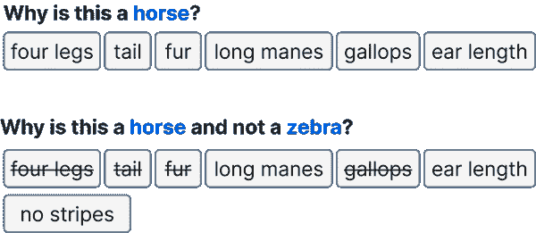

###### 图 7-5\. 解释通常通过其他可能性的对比来进行。因此，当我们将问题框架设为对比时，我们获得更多信息。嵌入模型也是如此。当我们提供不同的对比（相似度程度）时，它开始学习事物之间的差异，从而理解概念的独特特征。

###### 注意

对比学习在自然语言处理中的一个早期且最受欢迎的例子实际上是 Word2Vec。该模型通过在句子中的单个词上进行训练来学习词表示。接近目标词的词将被构建为正样本，而随机抽样的词构成不相似的样本。换句话说，相邻词的正例与随机选择的非邻近词进行了对比。尽管不广为人知，但这是利用对比学习与神经网络相结合的首个重大突破之一。

我们可以应用对比学习创建文本嵌入模型的方式有很多，但最著名的技术和框架是[sentence-transformers](https://github.com/UKPLab/sentence-transformers)。

# SBERT

尽管对比学习有很多形式，但在自然语言处理社区中流行化该技术的一个框架是 sentence-transformers。它的做法解决了创建句子嵌入的原始 BERT 实现的一个主要问题，即计算开销。在 sentence-transformers 之前，句子嵌入通常与 BERT 一起使用，采用一种称为交叉编码器的架构结构。

交叉编码器允许同时将两个句子传递给变换器网络，以预测这两个句子的相似程度。它通过在原始架构中添加一个分类头来实现，能够输出相似度分数。然而，当你想在 10,000 个句子的集合中找到最高配对时，计算数量迅速增加。这将需要 n·(n−1)/2 = 49 995 000 次推理计算，从而产生显著的开销。此外，交叉编码器通常不生成嵌入，如图 7-6 所示。

解决这个开销的方法是通过平均其输出层或使用[CLS]标记从 BERT 模型生成嵌入。然而，这显示出其效果不如简单地平均词向量，例如 GloVe.³

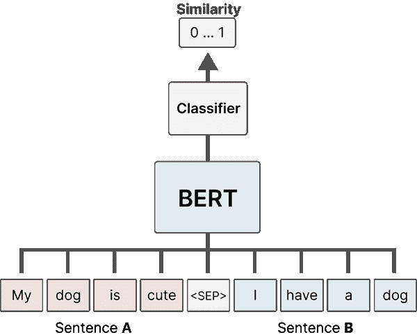

###### 图 7-6\. 交叉编码器的架构。两个句子被拼接，用 <SEP> 标记分隔，并同时输入模型。它输出的是输入句子之间的相似度分数，而不是嵌入。

相反，sentence-transformers 的作者以不同的方式处理这个问题，寻找一种快速且能够进行语义比较的嵌入方法。结果是对原始交叉编码器架构的一种优雅替代方案。在 sentence-transformers 中，与交叉编码器不同，分类头被省略，而是对最终输出层使用均值池化来生成嵌入。

Sentence-transformers 采用孪生架构进行训练。在这个架构中，如 图 7-7 所示，我们有两个相同的 BERT 模型，它们共享相同的权重和神经架构。由于两个 BERT 模型的权重是相同的，我们可以使用单个模型，并依次输入句子。

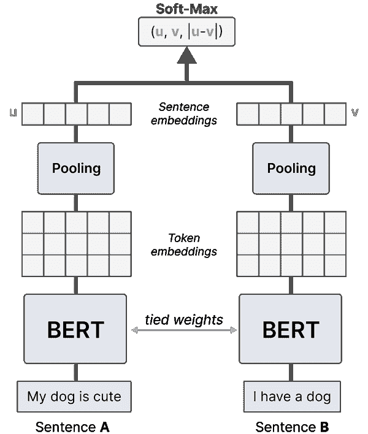

###### 图 7-7\. 原始 sentence-transformers 模型的架构，利用了一个叫做双编码器的孪生网络。共享权重的 BERT 模型接收句子，通过对标记嵌入的池化生成嵌入。然后，模型通过句子嵌入的相似性进行优化。

这些句子对的优化过程通过损失函数完成，这对模型的性能有重大影响。在训练过程中，每个句子的嵌入与其差异被拼接在一起。然后，这个结果嵌入通过 softmax 分类器进行优化。

结果架构也被称为双编码器或 SBERT（句子-BERT）。尽管双编码器非常快速并生成准确的句子表示，但交叉编码器通常比双编码器实现更好的性能，但不生成嵌入。

双编码器与交叉编码器一样，利用对比学习；通过优化句子对之间的（不）相似性，模型最终会学习使句子成为其本身的特征。

为了进行对比学习，我们需要两个东西。首先，我们需要构成相似/不相似对的数据。其次，我们需要定义模型如何定义和优化相似性。

# 创建嵌入模型

创建嵌入模型的方法有很多，但通常我们倾向于对比学习。这是许多嵌入模型的重要方面，因为这个过程使其能够高效地学习语义表示。

然而，这不是一个免费的过程。我们需要了解如何生成对比示例，如何训练模型，以及如何正确评估它。

## 生成对比示例

在预训练嵌入模型时，你通常会看到使用自然语言推理（NLI）数据中的数据。正如我们在第二章中描述的，NLI 是指调查给定前提是否蕴含假设（蕴含）、与之矛盾（矛盾）或两者皆不是（中立）的任务。

例如，当前提是“他在电影院观看*寻梦环游记*”而假设是“他在家观看*冰雪奇缘*”时，这些陈述是矛盾的。相比之下，当前提是“他在电影院观看*寻梦环游记*”而假设是“在电影院里他正在观看迪士尼电影*寻梦环游记*”时，这些陈述被视为蕴含。这个原则在图 7-8 中得到了说明。

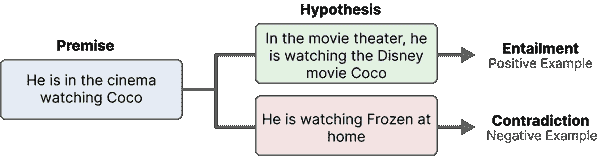

###### 图 7-8。我们可以利用 NLI 数据集的结构生成负例（矛盾）和正例（蕴含）用于对比学习。

如果你仔细观察蕴含和矛盾，那么它们描述的是两个输入之间的相似程度。因此，我们可以使用 NLI 数据集生成负例（矛盾）和正例（蕴含）用于对比学习。

###### 注意

如果你有标记的数据，也可以生成对比示例。在第二章中，我们使用 SetFit 通过句子变换器进行少量分类。在 SetFit 中，通过比较同类句子（正例）和不同类句子（负例）生成了对比示例。

我们在创建和微调嵌入模型时将使用的数据来自通用语言理解评估基准（[GLUE](https://gluebenchmark.com/)）。这个 GLUE 基准包含九个语言理解任务，用于评估和分析模型性能。

这些任务之一是多体裁自然语言推理（MNLI）语料库，它是一个包含带有蕴含关系（矛盾、中立、蕴含）的句子对的集合。我们将使用这些数据来训练我们的文本嵌入模型。让我们使用`datasets`包加载数据集：

```py
from datasets import load_dataset

# Load MNLI dataset from GLUE
# 0 = entailment, 1 = neutral, 2 = contradiction
dataset = load_dataset("glue", "mnli", split="train")
```

接下来，我们看一个蕴含的示例：

```py
>>> dataset[2]
{'premise': 'One of our number will carry out your instructions minutely.',
 'hypothesis': 'A member of my team will execute your orders with immense precision.',
 'label': 0,
 'idx': 2}
```

加载数据集后，我们需要以某种方式处理它，以便可以用 sentence-transformers 读取：

```py
from tqdm.auto import tqdm
from torch.utils.data import DataLoader
from sentence_transformers import InputExample

train_examples = [InputExample(texts=[row["premise"], row["hypothesis"]],  
                               label=row["label"]) for row in tqdm(dataset)]
train_dataloader = DataLoader(train_examples, shuffle=True, batch_size=32)
```

## 训练模型

现在我们有了包含训练示例的数据加载器，我们需要创建我们的嵌入模型。我们通常选择一个现有的 sentence-transformer 模型并进行微调，但在这个例子中，我们将从头开始训练一个嵌入模型。

这意味着我们需要定义两个东西。首先，一个预训练的变换器模型，用于嵌入单个词。正如我们在第二章中看到的，`“bert-base-uncased”`模型通常用于教程。然而，还有许多其他模型也经过[句子变换器](https://www.sbert.net/docs/training/overview.html#best-transformer-model)评估。特别是，`“microsoft/mpnet-base”`通常在用作词嵌入模型时表现良好。其次，我们需要定义池化策略。对词嵌入进行平均通常是在大多数嵌入模型中使用。

```py
from sentence_transformers import SentenceTransformer, models

# Define a model that will embed individual words
word_embedding_model = models.Transformer('bert-base-uncased', max_seq_length=256)

# Define a model that will pool each individual words
# NOTE: This automatically uses average pooling but other strategies exist
# such as taking the maximum or mode of word embeddings across all dimensions
pooling_model = models.Pooling(word_embedding_model.get_word_embedding_dimension())

# Create
model = SentenceTransformer(modules=[word_embedding_model, pooling_model])
```

###### 注意

默认情况下，sentence-transformers 中的 LLM 的所有层都是可训练的。虽然可以冻结某些层，但通常不建议这样做，因为解冻所有层时性能通常更好。

接下来，我们需要定义一个损失函数，以便优化模型。正如本节开头提到的，sentence-transformers 的第一个实例使用 soft-max 损失。为了说明，我们将暂时使用它，但稍后我们将讨论更高效的损失：

```py
from sentence_transformers import losses

# Define the loss function. In soft-max loss, we will also need to explicitly set the number of labels.
train_loss = losses.SoftmaxLoss(model=model, sentence_embedding_dimension=model.get_sentence_embedding_dimension(), num_labels=3)
```

现在我们定义了数据、嵌入模型和损失，可以开始训练我们的模型。我们可以使用`fit`函数进行训练：

```py
# Train our model for a single epoch
model.fit(train_objectives=[(train_dataloader, train_loss)], epochs=1, warmup_steps=100, show_progress_bar=True)
```

我们对模型进行单个周期的训练，大约需要一个小时左右，在 V100 GPU 上。就这样！我们现在从头开始训练了自己的嵌入模型。

###### 注意

sentence-transformers 框架允许多任务学习。`train_objectives`参数接受一个元组列表，这使得可以为其提供不同的数据集，每个数据集都有自己的优化目标。这意味着我们可以将整个 GLUE 基准提供给它进行训练。

我们可以快速评估模型的性能。可以进行很多任务，稍后我们将深入讨论，但一个好的起点是语义文本相似性基准（STSB），它在 GLUE 数据集中，如之前所见。

这是一个通过人工标注，带有相似性评分（1 到 5）的句子对集合。

我们可以利用这个数据集来观察我们的模型在语义相似性任务上的评分表现。首先，我们需要处理 STSB 数据集：

```py
import datasets
sts = datasets.load_dataset('glue', 'stsb', split='validation')

# Make sure every value is between 0 and 1
sts = sts.map(lambda x: {'label': x['label'] / 5.0})

# Process the data to be used from sentence_transformers
samples = [InputExample(texts=[sample['sentence1'], sample['sentence2']],
                        label=sample['label']) for sample in sts]
```

我们可以使用这些样本生成一个使用句子转换器的评估器：

```py
from sentence_transformers.evaluation import EmbeddingSimilarityEvaluator

# Create an embedding similarity evaluator for stsb
evaluator = EmbeddingSimilarityEvaluator.from_input_examples(samples)
```

这个评估器允许我们评估任何模型，因此我们来比较一下训练过的模型与其未训练的变体：

```py
>>> # Evaluate the original model
>>> orig_model = SentenceTransformer('bert-base-uncased')
>>> print("Baseline: ", evaluator(orig_model))
>>> 
>>> # Evaluate our trained model
>>> print("Trained model: ", evaluator(model))

"Baseline: 0.6146254081453191"
"Trained model: 0.7376971430125273"
```

这个训练过程将基线分数从 0.61 提高到了 0.74！

## 深入评估

一个好的嵌入模型不仅仅是 STSB 基准测试上的好成绩！正如我们之前看到的，GLUE 基准测试有许多任务可以评估我们的嵌入模型。然而，还有许多其他基准可以评估嵌入模型。为了统一这个评估过程，开发了大规模文本嵌入基准（MTEB）⁴。这个 MTEB 涵盖了 8 个嵌入任务，涉及 58 个数据集和 112 种语言。

为了公开比较最新的嵌入模型，创建了一个[排行榜](https://huggingface.co/spaces/mteb/leaderboard)，列出了各个嵌入模型在所有任务中的得分。

```py
from mteb import MTEB

# Choose evaluation task
evaluation = MTEB(tasks=["Banking77Classification"])

# Calculate results
results = evaluation.run(model)
```

当我们检查结果时，可以看到这个任务的一些评估指标：

```py
>>> results

{'Banking77Classification': {'mteb_version': '1.0.2',
  'dataset_revision': '0fd18e25b25c072e09e0d92ab615fda904d66300',
  'mteb_dataset_name': 'Banking77Classification',
  'test': {'accuracy': 0.7825324675324674,
   'f1': 0.782082703333302,
   'accuracy_stderr': 0.010099229383338676,
   'f1_stderr': 0.010381981136492737,
   'main_score': 0.7825324675324674,
   'evaluation_time': 23.44}}}
```

这个评估基准的伟大之处不仅在于任务和语言的多样性，还在于评估时间也得到了节省。虽然存在许多嵌入模型，但我们通常希望那些既准确又低延迟的模型。用于语义搜索等任务的嵌入模型，通常会受益于快速推理。

## 损失函数

我们使用 SoftMaxLoss 训练了[我们的模型](https://github.com/UKPLab/sentence-transformers/tree/master/examples/training/nli)，以说明如何训练第一个句子转换器模型之一。然而，虽然有很多损失函数可供选择，通常不建议使用 SoftMaxLoss，因为还有其他性能更优的损失。

不必逐一了解所有损失函数，通常有两个损失函数被广泛使用，并且表现良好，即：

+   余弦相似度

+   多重负样本排名损失

###### 注意

可供选择的损失函数远不止于此。例如，MarginMSE 损失在训练或微调交叉编码器时表现出色。在句子转换器框架中实现了许多有趣的[损失函数](https://www.sbert.net/docs/package_reference/losses.html)。

### 余弦相似度

余弦相似度损失是一种直观且易于使用的损失，适用于许多不同的用例和数据集。然而，这种损失通常用于语义文本相似性任务。在这些任务中，文本对会被分配一个相似度评分，以优化模型。

我们假设有句子对，它们在某种程度上是相似或不相似，而不是严格的正或负句对。通常，这个值在 0 和 1 之间，以分别表示不相似和相似（图 7-9）。

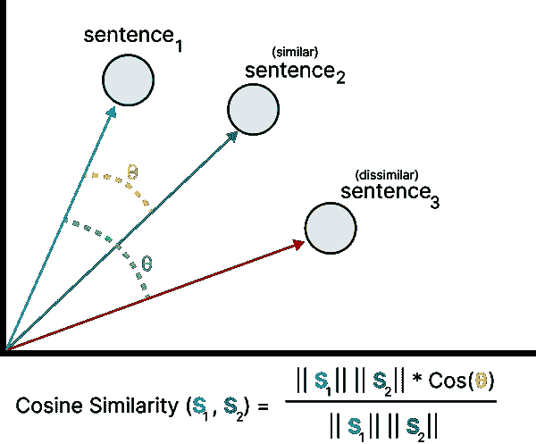

###### 图 7-9\. 余弦相似度损失旨在最小化语义相似句子之间的余弦距离，并最大化语义不相似句子之间的距离。

余弦相似度损失很简单——它计算两个文本的两个嵌入之间的余弦相似度，并将其与标记的相似度分数进行比较。模型将学习识别句子之间的相似度程度。

使用余弦相似度损失的一个最小示例是：

```py
# Prepare data
sts = datasets.load_dataset('glue', 'stsb', split='train')
sts = sts.map(lambda x: {'label': x['label'] / 5.0})
train_examples = [InputExample(texts=[sample['sentence1'], sample['sentence2']],
                               label=sample['label']) for sample in sts]
train_dataloader = DataLoader(train_examples, shuffle=True, batch_size=32)

# Define model
word_embedding_model = models.Transformer('bert-base-uncased', max_seq_length=256)
pooling_model = models.Pooling(word_embedding_model.get_word_embedding_dimension())
cosine_model = SentenceTransformer(modules=[word_embedding_model, pooling_model])

# Loss function
train_loss = losses.CosineSimilarityLoss(model=cosine_model)

# Fit model
cosine_model.fit(train_objectives=[(train_dataloader, train_loss)], epochs=1, warmup_steps=100, show_progress_bar=True)
```

我们在这个例子中使用 STSB 数据集。如我们之前所见，它们是带有注释相似度分数的句子对，自然适用于余弦相似度损失。

```py
>>> # Evaluate trained model with MNR loss
>>> print("Trained model + Cosine Similarity Loss: ", evaluator(mnr_model))

"Trained model + Cosine Similarity Loss: 0.848027994316"
```

得分 0.848 相比于 SoftMaxLoss 示例有了很大改善。然而，由于我们的训练和评估都在与 SoftMaxLoss 示例相同的任务上，比较它们是不公平的。

### 多重负面排名损失

多重负面排名（MNR⁵)损失，通常被称为 InfoNCE⁶或 NTXentLoss⁷，是一种原则上仅使用正句对的损失。

例如，你可能会有问题/答案、图像/图像标题、论文标题/论文摘要等的对。这些对的优点在于我们可以确信它们是难得的正对。在 MNR 损失中（图 7-10），负对是通过将一个正对与另一个正对混合而构造的。在论文标题和摘要的例子中，你会通过将论文的标题与完全不同的摘要组合来生成负对。这些负对称为批内负对。

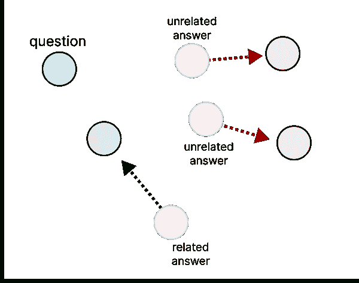

###### 图 7-10\. 多重负面排名损失旨在最小化相关文本对之间的距离，例如问题和答案，并最大化无关文本对之间的距离，例如问题和无关答案。

在生成这些正负对之后，我们计算它们的嵌入并应用余弦相似度。这些相似度得分随后用于回答问题，即这些对是负的还是正的？换句话说，这被视为分类任务，我们可以使用交叉熵损失来优化模型。

以下是使用 MNR 损失进行训练的一个最小示例：

```py
# Prepare data and only keep positive pairs
dataset = load_dataset("glue", "mnli", split="train")
dataset = dataset.filter(lambda x: True if x['label'] == 0 else False)
train_examples = [InputExample(texts=[row["premise"], row["hypothesis"]], label=row["label"]) for row in tqdm(dataset)]
train_dataloader = DataLoader(train_examples, shuffle=True, batch_size=32)

# Define model
word_embedding_model = models.Transformer('bert-base-uncased', max_seq_length=256)
pooling_model = models.Pooling(word_embedding_model.get_word_embedding_dimension())
mnr_model = SentenceTransformer(modules=[word_embedding_model, pooling_model])

# Loss function
train_loss = losses.MultipleNegativesRankingLoss(model=mnr_model)

# Fit model
mnr_model.fit(train_objectives=[(train_dataloader, train_loss)], epochs=1, warmup_steps=100, show_progress_bar=True)
```

请注意，我们使用的数据与我们的 SoftMaxLoss 示例相同。让我们比较这个模型与我们之前训练的模型的性能：

```py
>>> # Evaluate trained model with MNR loss
>>> print("Trained model + MNR Loss: ", evaluator(mnr_model))

"Trained model + MNR Loss: 0.8183052945831789"
```

与我们之前使用 SoftMaxLoss（0.74）训练的模型相比，我们使用 MNR 损失（0.82）的模型似乎准确得多！

###### 提示

较大的批量大小在 MNR 损失中通常效果更好，因为更大的批量使任务变得更加困难。原因在于模型需要从更大的一组潜在句子对中找到最佳匹配句子。您可以调整代码以尝试不同的批量大小，感受其效果。

我们使用这种损失函数有一个缺点。由于负例是从其他问答对中抽样的，这些批内或“简单”负例可能与问题完全无关。因此，嵌入模型找到问题正确答案的任务变得相对简单。相反，我们希望有与问题非常相关但不是正确答案的负例。这些负例称为困难负例。由于这使得嵌入模型的任务更加困难，因为它必须学习更细致的表示，嵌入模型的性能通常会有显著提升。

###### 注意

在 MNR 损失中，通常使用余弦相似度，但也可以用点积来替代。使用点积的一个优点是它通常对较长文本效果更好，因为点积会增加。然而，缺点是它通常在聚类任务中表现较差。

一个好的困难负例的例子如下。假设我们有这样一个问题：“阿姆斯特丹有多少人居住？”与这个问题相关的答案是：“阿姆斯特丹几乎有一百万人。”为了生成一个好的困难负例，我们理想上希望答案中包含一些关于阿姆斯特丹及其居住人数的信息。例如：“乌特勒支有超过一百万人居住，这比阿姆斯特丹还多。”这个答案与问题无关，但非常相似，因此这是一个好的困难负例。图 7-11 展示了简单负例和困难负例之间的区别。

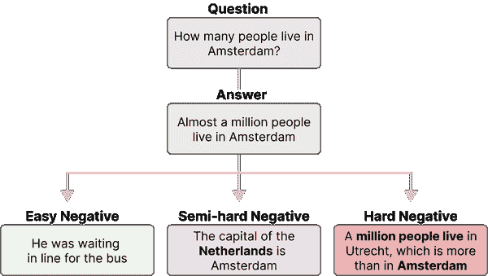

###### 图 7-11\. [negatives.png] 一个简单的负样本通常与问题和答案都没有关系。一个半困难的负样本与问题和答案的主题有些相似，但又稍微不相关。一个困难的负样本与问题非常相似，但通常是错误的答案。

使用困难负样本与此损失函数是相当简单的， вместо передачи двух связанных текстов в `InputExample`，我们传递三个文本，其中两个是相关文本，最后一个是困难负样本。

# 微调嵌入模型

在前面的部分，我们了解了从头开始训练嵌入模型的基础知识，并看到了如何利用损失函数进一步优化其性能。这种方法虽然相当强大，但需要从头开始创建嵌入模型。这个过程可能相当昂贵且耗时。

相反，句子变换器有多个预训练的嵌入模型，我们可以将其用作微调的基础。它们是在大量数据上训练的，并且开箱即用时就能产生良好的性能。

微调模型有多种方法，具体取决于数据的可用性和领域。我们将逐一介绍其中的一些方法，并展示利用预训练嵌入模型的优势。

## 有监督

微调嵌入模型的最简单方法是重复之前训练模型的过程，但将 `'bert-base-uncased'` 替换为预训练的句子变换器模型。有许多可供选择，但通常 `'all-mpnet-base-v2'` ([`www.sbert.net/docs/pretrained_models.html`](https://www.sbert.net/docs/pretrained_models.html)) 在许多用例中表现良好（见 [`huggingface.co/spaces/mteb/leaderboard`](https://huggingface.co/spaces/mteb/leaderboard)）。

实际上，我们只需运行以下命令即可微调我们的模型：

```py
from sentence_transformers import SentenceTransformer

# Prepare data and only keep positive pairs
dataset = load_dataset("glue", "mnli", split="train")
dataset = dataset.filter(lambda x: True if x['label'] == 0 else False)
train_examples = [InputExample(texts=[row["premise"], row["hypothesis"]], label=row["label"]) for row in tqdm(dataset)]
train_dataloader = DataLoader(train_examples, shuffle=True, batch_size=32)

# Load a pre-trained model
model = SentenceTransformer('all-mpnet-base-v2')

# Loss function
train_loss = losses.MultipleNegativesRankingLoss(model=model)

# Fine-tune our model for a single epoch
model.fit(train_objectives=[(train_dataloader, train_loss)], epochs=1, warmup_steps=100, show_progress_bar=True)
```

在这里，我们使用与在多负样本排名损失示例中训练模型时相同的数据。由于句子变换器包构建得相当出色，因此微调模型的代码相对简单。

###### 提示

与其使用预训练的 BERT 模型，如 `'``bert``-base-uncased'` 或可能是领域外模型如 `'all-mpnet-base-v2'`，你还可以对预训练的 BERT 模型进行掩码语言建模，首先将其适应到你的领域。然后，可以使用这个微调后的 BERT 模型作为训练嵌入模型的基础。这是一种领域适应。关于掩码语言建模的更多信息，请参见第 X 章。

微调/训练模型的主要困难在于找到合适的数据。对于这些模型，我们不仅希望拥有非常大的数据集，数据本身也需要高质量。开发正样本对通常比较简单，但添加困难负样本对则显著增加了创建高质量数据的难度。

###### 注意

如上所示，对数据进行训练有些多余，因为该模型已经在一个非常相似的 NLI 数据集上进行了训练。然而，对于特定领域的数据微调过程仍然是相同的。

## 增强型 SBERT

训练或微调这些嵌入模型的一个缺点是，它们通常需要大量的训练数据。这些模型中的许多在超过十亿对句子上进行训练。提取如此多的句子对以适应你的用例通常是不可行的，因为在许多情况下，只有很少的数据可用。

幸运的是，有一种方法可以增强你的数据，以便在只有少量标注数据可用时，可以对嵌入模型进行微调。这个过程称为增强型 SBERT。⁸

在此过程中，我们旨在增强少量标注数据，使其可以用于常规训练。它利用慢而更准确的交叉编码器架构（BERT）来增强和标注更大数量的输入对。这些新标注的对随后用于微调双编码器（SBERT）。

如图 7-12 所示，增强型 SBERT 涉及以下步骤：

1.  使用小型标注数据集（黄金数据集）对交叉编码器（BERT）进行微调

1.  创建新的句子对

1.  用微调后的交叉编码器标注新的句子对（银色数据集）

1.  在扩展数据集（黄金+银色数据集）上训练双编码器（SBERT）

此处，黄金数据集是一个小型但完全标注的数据集，包含真实的基础真相。银色数据集也完全标注，但不一定是基础真相，因为它是通过交叉编码器的预测生成的。

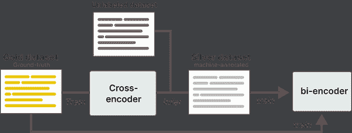

###### 图 7-12\. 增强型 SBERT 通过在小型黄金数据集上训练高性能的交叉编码器来工作。然后，训练好的交叉编码器可以用来标注未标注的数据集，以生成比黄金数据集大得多的银色数据集。最后，黄金和银色数据集都用于训练双编码器。

在进入上述步骤之前，首先准备数据：

```py
# Make sure every value is between 0 and 1
sts = datasets.load_dataset('glue', 'stsb', split='train')
sts = sts.map(lambda x: {'label': x['label'] / 5.0})

# Process the data to be used in sentence_transformers
gold_examples = [InputExample(texts=[sample['sentence1'], sample['sentence2']], label=sample['label']) for sample in sts]
gold_dataloader = DataLoader(gold_examples, shuffle=True, batch_size=32)

# Fully labeled gold dataset
gold = pd.DataFrame({'sentence1': sts['sentence1'], 'sentence2': sts['sentence2'], 'label': sts['label']})
```

我们使用 STSB 语料库的训练集作为我们的黄金数据集，并用它来训练我们的交叉编码器（步骤 1）：

```py
from sentence_transformers.cross_encoder import CrossEncoder

# Train a cross-encoder on the gold dataset
cross_encoder = CrossEncoder('bert-base-uncased', num_labels=1)
cross_encoder.fit(train_dataloader=gold_dataloader, epochs=1, warmup_steps=300)
```

在训练好我们的交叉编码器后，我们可以通过对每个输入句子随机抽取 10 个句子，生成新的候选句子对（步骤 2）：

```py
# Prepare unlabeled to-be silver dataset
silver = pd.DataFrame(columns=["sentence1", "sentence2"])
for sentence in gold.sentence1:
      sampled = gold[gold['sentence1'] != sentence].sample(10, random_state=42)
      sampled.sentence1 = sentence
      silver = pd.concat([silver, sampled], ignore_index=True, axis=0)
silver = silver.drop_duplicates()
```

###### 提示

我们可以使用预训练的句子转换器，而不是随机抽样银句子对。通过使用语义搜索从数据集中检索前 k 个句子，我们创建的银句子对往往更准确。虽然句子对仍然是基于近似选择的，但比随机抽样要好得多。

我们在第一步训练的交叉编码器可以用于给之前生成的候选句子对标记，以建立银数据集：

```py
# Predict labels for the unlabeled silver data
pairs = list(zip(silver['sentence1'], silver['sentence2']))
silver['label'] = cross_encoder.predict(pairs)
```

现在我们有了银和金数据集，我们只需将它们结合起来，像之前一样训练我们的嵌入模型：

```py
# Combine gold + silver
data = pd.concat([gold, silver], ignore_index=True, axis=0)
data = data.drop_duplicates(subset=['sentence1', 'sentence2'], keep="first")

# initialize dataloader
examples = [InputExample(texts=[sample['sentence1'], sample['sentence2']], label=sample['label']) for _, sample in data.iterrows()]
dataloader = DataLoader(examples, shuffle=True, batch_size=32)

# Initialize bi-encoder
word_embedding_model = models.Transformer('bert-base-uncased', max_seq_length=256)
pooling_model = models.Pooling(word_embedding_model.get_word_embedding_dimension())
model = SentenceTransformer(modules=[word_embedding_model, pooling_model])

# Loss function
loss = losses.CosineSimilarityLoss(model=model)

# Fine-tune our model for a single epoch
model.fit(train_objectives=[(dataloader, loss)], epochs=1, warmup_steps=200, show_progress_bar=True)
```

我们可以再次仅使用金数据集进行上述操作，看看添加这个银数据集如何影响性能。仅在金数据集上的训练性能为 0.804，而添加银数据集后性能提升至 0.830！

这种方法允许在不需要手动标记数十万句子对的情况下增加您现有的数据集。

# 无监督学习

要创建嵌入模型，通常需要标记数据。然而，并不是所有现实世界的数据集都带有我们可以使用的完整标签。我们会寻找无需预先确定标签的技术进行模型训练——无监督学习。

创建或微调嵌入模型的无监督技术通常表现不如其监督版本。存在许多方法，如简单对比学习句子嵌入（SimCSE）⁹、对比张力（CT）¹⁰、基于变换器的去噪自编码器（TSDAE）¹¹以及生成伪标记（GPL）¹²。

我们将讨论两种方法，TSDAE 和 GPL，甚至可以在后续进行组合。

## 基于变换器的去噪自编码器

TSDAE 是一种非常优雅的方法，用于创建无监督学习的嵌入模型。该方法假设我们完全没有标记数据，也不需要人为创建标签。

TSDAE 的基本思路是通过从输入句子中去除一定比例的词来添加噪声。这句“受损”的句子经过编码器处理，并在其上方加上一个池化层，以将其映射到句子嵌入。

从这个句子嵌入中，解码器尝试从“受损”句子中重建原始句子，但不包含人为噪声。

这种方法与掩蔽语言建模非常相似，我们试图重建和学习某些被掩蔽的词。这里，我们试图重建的是整个句子，而不是掩蔽的词。

训练后，我们可以使用编码器从文本中生成嵌入，因为解码器仅用于判断嵌入是否能准确重建原始句子（图 7-13）。

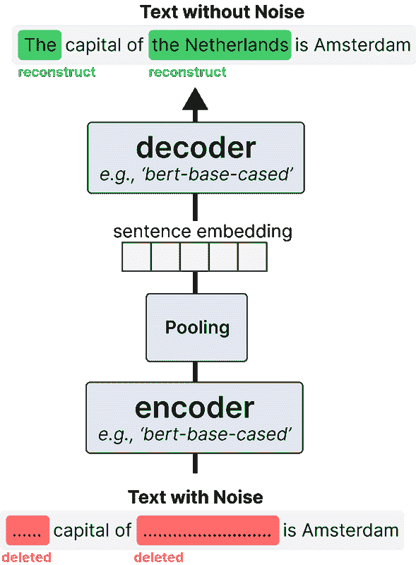

###### 图 7-13\. TSDAE 随机删除输入句子中的单词，这些句子通过编码器传递以生成句子嵌入。通过这个句子嵌入，重建原始句子。这里的主要思想是，句子嵌入越准确，重建的句子也会越准确。

由于我们只需要一堆没有标签的句子，因此训练这个模型非常简单。我们开始定义模型，方式与之前相同：

```py
# Create your embedding model
word_embedding_model = models.Transformer('bert-base-uncased')
pooling_model = models.Pooling(word_embedding_model.get_word_embedding_dimension(), 'cls')
model = SentenceTransformer(modules=[word_embedding_model, pooling_model])
```

###### 注意

请注意，我们使用的是 CLS 池化而不是平均池化。作者发现二者之间几乎没有区别，并且由于平均池化会丢失位置信息，因此选择了 CLS 池化。

接下来，我们使用之前的 STSB 数据集创建一堆句子来用于我们的模型：

```py
from sentence_transformers.datasets import DenoisingAutoEncoderDataset

# Extract training data, we ignore the labels that we have
train_data = datasets.load_dataset('glue', 'stsb', split='validation')["sentence1"]
train_data = train_data["sentence1"] + train_data["sentence2"]

# Add noise to our input data
train_dataset = DenoisingAutoEncoderDataset(list(set(train_data)))
train_dataloader = DataLoader(train_dataset, batch_size=8, shuffle=True)

# Use the denoising auto-encoder loss
train_loss = losses.DenoisingAutoEncoderLoss(model, 'bert-base-uncased', tie_encoder_decoder=True)
```

这与我们之前进行监督建模的主要区别在于，我们将数据传递给`DenoisingAutoEncoderDataset`。这将在训练期间为输入生成噪声。我们还使用与嵌入模型相同的基础模型定义了编码器损失。

最后，我们只需拟合和评估我们的模型：

```py
# Train our embedding model
model.fit(train_objectives=[(train_dataloader, train_loss)], epochs=1, show_progress_bar=True)

# Evaluate
evaluator(model)
```

在拟合我们的模型后，我们得到了 0.74 的分数，这在考虑到我们使用无标签数据进行所有训练的情况下相当令人印象深刻。

## 领域适应

当可用的标记数据非常少或没有时，通常使用无监督学习来创建文本嵌入模型。然而，无监督技术通常不如监督技术表现良好，并且在学习特定领域的概念时存在困难。

这就是*领域适应*的作用所在。它的目标是更新现有的嵌入模型，以适应包含与源领域不同主题的特定文本领域。图 7-14 展示了不同领域内容的差异。

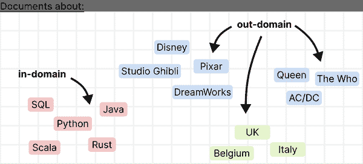

###### 图 7-14\. 在领域适应中，目标是从一个领域创建并泛化一个嵌入模型到另一个领域。目标领域或外部领域通常包含在源领域或内部领域中找不到的单词和主题。

领域适应的一种方法称为*自适应预训练*。你首先使用无监督技术（例如之前讨论的 TSDAE 或掩蔽语言模型）对领域特定语料库进行预训练。然后，如图 7-15 所示，你使用目标领域的训练数据集微调该模型。

该过程利用了我们之前看到的管道，首先使用 TSDAE 微调 LLM 或现有嵌入模型，然后使用监督或增强的 SBERT 训练进一步微调。

然而，这可能在计算上是昂贵的，因为我们必须首先在大型语料库上对数据进行预训练，然后使用带标记的数据集进行监督学习。通常，带标记的数据集需要很大，并可能需要数百万对训练样本。

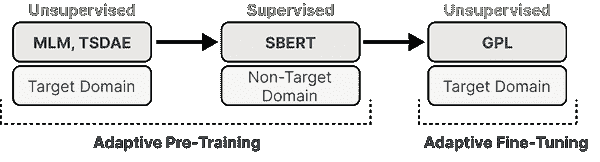

###### 图 7-15\. 领域适应可以通过自适应预训练和自适应微调来实现。通过自适应预训练，我们首先对目标领域进行无监督的 LLM 调优，然后在标记的非领域特定数据上微调该模型。通过自适应微调，我们可以使用任何现有的预训练嵌入模型，并使用未标记的领域特定数据进行微调。

相反，我们将使用一种可以在预训练嵌入模型之上运行的方法，即*生成伪标注*。

## 生成伪标注

生成伪标注假设尽管我们有数据，但这些数据都没有标记。它包括三个步骤，以生成我们可以用于训练嵌入模型的标记数据。

首先，对于你在特定领域数据中拥有的每一条未标记文本，我们使用生成模型，如 T5，生成若干查询。这些查询通常是可以用输入文本的部分回答的问题。例如，当你的文本是“《可可夜总会》是由皮克斯制作的”时，模型可能会生成类似“谁制作了电影《可可夜总会》？”的查询。这些是我们生成的正例，如图 7-16 所示。


###### 图 7-16\. 在 GPL 管道的第一步中，使用生成模型（如 T5）为每个未标记的输入文本生成查询。这些查询可以用作后续 GPL 管道中的句子对进行标记。

其次，我们还需要负样本，以便模型进行学习。理想情况下，负样本与查询相关，但不是相关答案。例如，查询“谁制作了电影*可可*？”的负样本可能是“*狮子王*是迪士尼制作的”。

为了提取这些负样本，我们使用预训练的嵌入模型来检索与查询相关的所有文本。在图 7-17 中，第二步展示了如何挖掘相关文本。


###### 图 7-17\. 在 GPL 管道的第二步中，使用预训练的嵌入模型挖掘负样本。该模型为输入查询和语料库生成嵌入，并找到与输入查询相关的样本。

第三，在生成负样本后，我们需要对其进行评分。一些负样本可能最终成为实际答案，或者可能与之不相关，而这两者都是我们希望避免的。正如图 7-18 所示，我们可以使用预训练的交叉编码器对通过前两个步骤创建的查询/段落对进行评分。

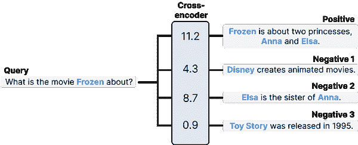

###### 图 7-18\. 在 GPL 管道的第三步中，我们使用交叉编码器对所有查询/段落对进行评分。此过程的目标是过滤掉任何假阴性。一些负样本可能会意外变成正样本。与负样本和正样本的标记过程相比，使用评分过程可以在表示中提供更多的细微差别。

在最后一步后，对于每个查询，我们现在有一个正样本（步骤 1）和一个挖掘出的负样本（步骤 2）。换句话说，我们有可以用于训练过程的三元组。

单独运行每一步确实很麻烦，但幸运的是，有一个 GPL 包可以抽象掉这种困难。然而，我们首先需要格式化我们的数据，以便该包能够读取。

```py
import json

# Convert training data to the right format for GPL
train_data = datasets.load_dataset('glue', 'stsb', split='validation')["sentence1"]
with open('corpus.jsonl', 'w') as jsonl:
    for index, sentence in enumerate(train_data):
        line = {'_id': str(index), 'title': "", 'text': sentence, 'metadata': ""}
        jsonl.write(json.dumps(line)+'\n')
```

我们再次使用 STSB 数据集，仅提取少量数据进行训练。这样做的原因是训练仍然可能相当昂贵。GPL 的作者在 V100 GPU 上训练了大约一天，因此建议在扩大规模之前先尝试较小的数据集。

接下来，我们可以导入 GPL，只需运行 `train` 即可开始：

```py
import gpl

# Train an embedding model with GPL
gpl.train(
    path_to_generated_data=".",
    batch_size_gpl=8,
    batch_size_generation=8,
    gpl_steps=10000,
    queries_per_passage=1,
    output_dir="output",
    do_evaluation=False,
    use_amp=True

    # The model that we will fine-tune as our embedding model
    base_ckpt="distilbert-base-uncased",  

    # The model used to generate queries
    generator="BeIR/query-gen-msmarco-t5-base-v1",

    # The model used for mining negatives
    retrievers=["msmarco-distilbert-base-v3", "msmarco-MiniLM-L-6-v3"],

    # The model  used for rating query/passage pairs
    cross_encoder="cross-encoder/ms-marco-MiniLM-L-6-v2",
)
```

有一些值得注意的子模型，描述了我们之前所看到的步骤。

+   `generator` 指的是 *步骤 1*，在此我们为我们的数据生成查询。

+   `retriever` 指的是 *步骤 2*，在此我们为我们的数据生成查询。

+   `cross_encoder` 指的是 *步骤 3*，在此我们为我们的数据生成查询。

+   `base_ckpt` 指的是训练我们嵌入模型的最后一步。

训练后，我们可以按如下方式加载和评估模型：

```py
>>> # Load our new model and evaluate it
>>> model = SentenceTransformer('output')
>>> evaluator(model)

0.8246360833250379
```

借助 GPL，我们在没有任何标注数据的情况下取得了 0.82 的分数！

# 摘要

在本章中，我们探讨了通过对比学习创建和微调嵌入模型，这是训练此类模型最重要的组成部分之一。通过无监督和有监督技术，我们能够创建针对我们数据集调优的嵌入模型。

¹ Alan Garfinkel. “解释的形式：重新思考社会理论中的问题。” (1981)。

² Tim Miller. “对比解释：结构模型方法”。*知识工程评论* 36 (2021): e14。

³ Jeffrey Pennington, Richard, Socher, 和 Christopher D, Manning. “Glove: 全局词向量表示。” 收录于 *2014 年自然语言处理实证方法会议论文集 (EMNLP)* (pp. 1532–1543). 2014。

⁴ Muennighoff, Niklas, Nouamane, Tazi, Loïc, Magne, 和 Nils, Reimers. “MTEB: 大规模文本嵌入基准”。*arXiv 预印本 arXiv:2210.07316* (2022)。

⁵ Matthew Henderson, Rami, Al-Rfou, Brian, Strope, Yun-Hsuan, Sung, László, Lukacs, Ruiqi, Guo, Sanjiv, Kumar, Balint, Miklos, 和 Ray, Kurzweil. “智能回复的高效自然语言响应建议。” *arXiv 预印本 arXiv:1705.00652* (2017)。

⁶ Oord, Aaron van den, Yazhe, Li, 和 Oriol, Vinyals. “使用对比预测编码的表示学习”。*arXiv 预印本 arXiv:1807.03748* (2018)。

⁷ Ting Chn, Simon, Kornblith, Mohammad, Norouzi, 和 Geoffrey, Hinton. “用于对比学习视觉表示的简单框架。” 收录于 *国际机器学习会议* (pp. 1597–1607). 2020。

⁸ Thakur, Nandan, Nils, Reimers, Johannes, Daxenberger, 和 Iryna, Gurevych. “增强的 sbert: 提升双编码器用于成对句子评分任务的数据增强方法”。*arXiv 预印本 arXiv:2010.08240* (2020)。

⁹ Gao, Tianyu, Xingcheng Yao 和 Danqi Chen. “Simcse: 简单对比学习句子嵌入”。*arXiv 预印本 arXiv:2104.08821* (2021)。

¹⁰ Janson, Sverker, Evangelina Gogoulou, Erik Ylipäa, Amaru Cuba Gyllensten 和 Magnus Sahlgren. “语义重调与对比张力。” 在 *国际学习表征会议, 2021*。2021。

¹¹ Kexin Wang, Nils Reimers 和 Iryna Gurevych. “Tsdae: 使用基于变换器的顺序去噪自编码器进行无监督句子嵌入学习”。*arXiv 预印本 arXiv:2104.06979* (2021)。

¹² Kexin Wang, Nandan Thakur, Nils Reimers 和 Iryna Gurevych. “Gpl: 生成伪标签用于无监督领域适应的密集检索”。*arXiv 预印本 arXiv:2112.07577* (2021)。

# 作者介绍

**Jay Alammar** 是 Cohere 的总监和工程院士（领先的语言模型 API 提供商）。在这个角色中，他为企业和开发者社区提供建议和教育，指导他们将语言模型应用于实际案例。通过他受欢迎的 AI/ML 博客，Jay 帮助数百万研究人员和工程师从基础（最终进入 NumPy 和 pandas 等包的文档）到前沿（变换器、BERT、GPT-3、Stable Diffusion）直观理解机器学习工具和概念。Jay 还是 Deeplearning.ai 和 Udacity 上受欢迎的机器学习和自然语言处理课程的共同创作者。

**Maarten Grootendorst** 是 IKNL（荷兰综合癌症组织）的高级临床数据科学家。他拥有组织心理学、临床心理学和数据科学的硕士学位，利用这些知识向广泛受众传达复杂的机器学习概念。通过他受欢迎的博客，他通过心理学视角解释人工智能的基本原理，触及了数百万读者。他是多个开源包的作者和维护者，这些包依赖于大型语言模型的强大功能，如 BERTopic、PolyFuzz 和 KeyBERT。他的包被全球的数据专业人士和组织下载数百万次。
