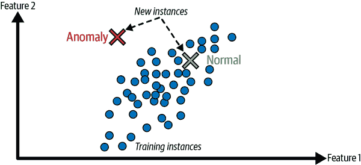
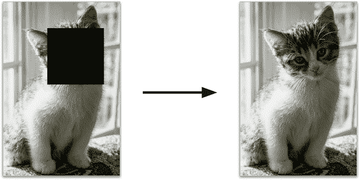
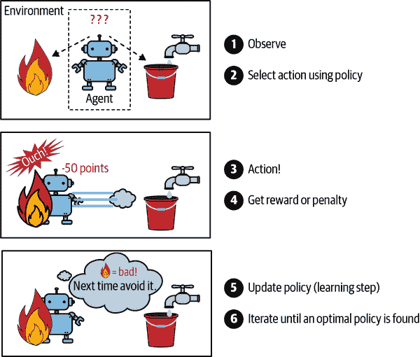
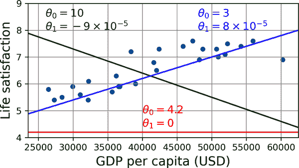
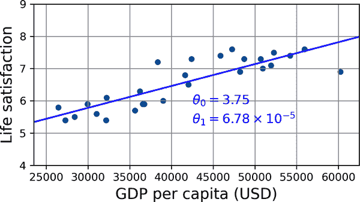

# 第一章：机器学习的景观

不久前，如果您拿起手机问路回家，它会无视您，人们会质疑您的理智。但是机器学习不再是科幻：数十亿人每天都在使用它。事实上，它实际上已经存在几十年，用于一些专业应用，比如光学字符识别（OCR）。第一个真正成为主流的机器学习应用是在上世纪 90 年代席卷全球的：*垃圾邮件过滤器*。它并不是一个自我意识的机器人，但从技术上讲它确实算是机器学习：它学习得如此出色，以至于您很少需要将电子邮件标记为垃圾邮件。它之后又出现了数百个机器学习应用，现在悄悄地支持着您经常使用的数百种产品和功能：语音提示、自动翻译、图像搜索、产品推荐等等。

机器学习从何开始，到何结束？机器*学习*某事究竟意味着什么？如果我下载了所有维基百科文章的副本，我的计算机真的学到了什么吗？它突然变聪明了吗？在本章中，我将首先澄清机器学习是什么，以及为什么您可能想要使用它。

然后，在我们开始探索机器学习大陆之前，我们将看一看地图，了解主要区域和最显著的地标：监督学习与无监督学习及其变体，在线学习与批量学习，基于实例与基于模型的学习。然后我们将看一看典型机器学习项目的工作流程，讨论您可能面临的主要挑战，并介绍如何评估和微调机器学习系统。

本章介绍了许多数据科学家应该牢记的基本概念（和行话）。这将是一个高层次的概述（这是唯一一个没有太多代码的章节），都相当简单，但我的目标是确保在继续阅读本书的其余部分之前，一切对您都是清晰的。所以泡杯咖啡，让我们开始吧！

###### 提示

如果您已经熟悉机器学习基础知识，您可能想直接跳到第二章。如果您不确定，尝试在继续之前回答本章末尾列出的所有问题。

# 什么是机器学习？

机器学习是编程计算机以便它们可以*从数据中学习*的科学（和艺术）。

以下是一个稍微更一般的定义：

> [机器学习是]一门研究领域，赋予计算机学习的能力，而无需明确编程。
> 
> 亚瑟·塞缪尔，1959

还有一个更加工程导向的定义：

> 如果一个计算机程序在某个任务*T*上通过经验*E*，根据性能度量*P*的表现随着经验*E*的增加而改善，那么就说它从经验*E*中学习。
> 
> 汤姆·米切尔，1997

您的垃圾邮件过滤器是一个机器学习程序，通过用户标记的垃圾邮件示例和常规邮件示例（非垃圾邮件，也称为“正常邮件”），可以学习如何标记垃圾邮件。系统用于学习的示例称为*训练集*。每个训练示例称为*训练实例*（或*样本*）。学习和预测的机器学习系统的部分称为*模型*。神经网络和随机森林是模型的示例。

在这种情况下，任务*T*是为新邮件标记垃圾邮件，经验*E*是*训练数据*，性能度量*P*需要定义；例如，您可以使用正确分类的邮件比率。这种特定的性能度量称为*准确度*，在分类任务中经常使用。

如果您只是下载了所有维基百科文章的副本，您的计算机拥有了更多数据，但它并不会突然在任何任务上变得更好。这不是机器学习。

# 为什么使用机器学习？

考虑如何使用传统编程技术编写垃圾邮件过滤器（图 1-1）：

1.  首先，您会检查垃圾邮件通常是什么样子的。您可能会注意到一些单词或短语（如“4U”、“信用卡”、“免费”和“惊人”）在主题行中经常出现。也许您还会注意到发件人姓名、电子邮件正文和其他部分中的一些其他模式。

1.  你会为你注意到的每个模式编写一个检测算法，如果检测到这些模式中的一些，你的程序将会标记电子邮件为垃圾邮件。

1.  您会测试您的程序，并重复步骤 1 和 2，直到它足够好以启动。


###### 图 1-1\. 传统方法

由于问题很难，您的程序很可能会变成一长串复杂规则——相当难以维护。

相比之下，基于机器学习技术的垃圾邮件过滤器会自动学习哪些单词和短语是垃圾邮件的良好预测器，通过检测垃圾邮件示例中单词的异常频繁模式与正常邮件示例进行比较（图 1-2）。该程序更短，更易于维护，而且很可能更准确。


###### 图 1-2\. 机器学习方法

如果垃圾邮件发送者注意到他们所有包含“4U”的电子邮件都被阻止了呢？他们可能会开始写“For U”代替。使用传统编程技术的垃圾邮件过滤器需要更新以标记“For U”电子邮件。如果垃圾邮件发送者不断绕过您的垃圾邮件过滤器，您将需要永远编写新规则。

相比之下，基于机器学习技术的垃圾邮件过滤器会自动注意到“For U”在用户标记的垃圾邮件中变得异常频繁，并开始在没有您干预的情况下标记它们（图 1-3）。


###### 图 1-3\. 自动适应变化

机器学习表现出色的另一个领域是对于那些对传统方法来说要么太复杂，要么没有已知算法的问题。例如，考虑语音识别。假设你想从简单开始，编写一个能够区分“one”和“two”这两个词的程序。你可能会注意到，“two”这个词以高音（“T”）开头，因此你可以硬编码一个算法来测量高音强度，并使用它来区分“one”和“two”——但显然，这种技术无法扩展到成千上万个单词，由数百万个非常不同的人在嘈杂环境中以及数十种语言中说出。最好的解决方案（至少是今天）是编写一个算法，通过给定每个单词的许多示例录音来自学习。

最后，机器学习可以帮助人类学习（图 1-4）。机器学习模型可以被检查以查看它们学到了什么（尽管对于某些模型来说可能有些棘手）。例如，一旦一个垃圾邮件过滤器已经在足够多的垃圾邮件上训练过，就可以轻松地检查它，以显示它认为是最佳垃圾邮件预测器的单词和单词组合的列表。有时这会揭示出意想不到的相关性或新趋势，从而更好地理解问题。挖掘大量数据以发现隐藏模式被称为*数据挖掘*，而机器学习在这方面表现出色。


###### 图 1-4\. 机器学习可以帮助人类学习

总之，机器学习非常适用于：

+   需要大量微调或长列表规则的现有解决方案的问题（机器学习模型通常可以简化代码并比传统方法表现更好）

+   对于使用传统方法得不到好解决方案的复杂问题（最好的机器学习技术或许可以找到解决方案）

+   波动的环境（机器学习系统可以轻松地在新数据上重新训练，始终保持最新状态）

+   获取关于复杂问题和大量数据的见解

# 应用示例

让我们看一些机器学习任务的具体示例，以及可以解决它们的技术：

分析生产线上产品的图像以自动分类它们

这是图像分类，通常使用卷积神经网络（CNN；参见第十四章）或有时使用Transformer（参见第十六章）进行处理。

检测脑部扫描中的肿瘤

这是语义图像分割，其中图像中的每个像素都被分类（因为我们想要确定肿瘤的确切位置和形状），通常使用 CNN 或Transformer。

自动分类新闻文章

这是自然语言处理（NLP），更具体地说是文本分类，可以使用循环神经网络（RNN）和 CNN 来解决，但Transformer效果更好（参见第十六章）。

自动标记讨论论坛上的攻击性评论

这也是文本分类，使用相同的 NLP 工具。

自动总结长文档

这是一种称为文本摘要的 NLP 分支，再次使用相同的工具。

创建一个聊天机器人或个人助手

这涉及许多 NLP 组件，包括自然语言理解（NLU）和问答模块。

根据许多绩效指标预测公司明年的收入

这是一个回归任务（即预测值），可以使用任何回归模型来解决，例如线性回归或多项式回归模型（参见第四章）、回归支持向量机（参见第五章）、回归随机森林（参见第七章）或人工神经网络（参见第十章）。如果您想考虑过去绩效指标的序列，可能需要使用 RNN、CNN 或Transformer（参见第十五章和第十六章）。

使您的应用程序对语音命令做出反应

这是语音识别，需要处理音频样本：由于它们是长而复杂的序列，通常使用 RNN、CNN 或Transformer进行处理（参见第十五章和第十六章）。

检测信用卡欺诈

这是异常检测，可以使用隔离森林、高斯混合模型或自编码器来解决（参见第九章）。

根据客户的购买情况对客户进行分段，以便为每个细分设计不同的营销策略

这是聚类，可以使用*k*-means、DBSCAN 等方法来实现（参见第九章）。

在清晰而富有洞察力的图表中表示复杂的高维数据集

这是数据可视化，通常涉及降维技术（参见第八章）。

根据过去的购买记录推荐客户可能感兴趣的产品

这是一个推荐系统。一种方法是将过去的购买记录（以及有关客户的其他信息）输入到人工神经网络中（参见第十章），并让其输出最可能的下一个购买。这种神经网络通常会在所有客户的过去购买序列上进行训练。

为游戏构建一个智能机器人

这通常是通过强化学习（RL）来解决的（请参阅第十八章），这是机器学习的一个分支，训练代理人（如机器人）选择能够随着时间最大化奖励的动作（例如，每次玩家失去一些生命值时机器人都会获得奖励），在给定环境（例如游戏）中。击败围棋世界冠军的著名 AlphaGo 程序就是使用 RL 构建的。

这个列表可以继续下去，但希望它能让您感受到机器学习可以处理的任务的广泛和复杂性，以及您将为每个任务使用的技术类型。

# 机器学习系统的类型

有许多不同类型的机器学习系统，将它们根据以下标准进行广泛分类是有用的：

+   它们在训练过程中如何受监督（监督、无监督、半监督、自监督等）

+   无论它们是否可以在飞行中逐步学习（在线与批量学习）

+   它们是通过简单地将新数据点与已知数据点进行比较，还是通过检测训练数据中的模式并构建预测模型，就像科学家所做的那样（基于实例与基于模型的学习）

这些标准并不是互斥的；您可以以任何您喜欢的方式组合它们。例如，一款最先进的垃圾邮件过滤器可能会使用深度神经网络模型进行在线学习，该模型是使用人类提供的垃圾邮件和正常邮件示例进行训练的；这使其成为一个在线、基于模型的监督学习系统。

让我们更仔细地看看这些标准中的每一个。

## 训练监督

ML 系统可以根据训练过程中获得的监督量和类型进行分类。有许多类别，但我们将讨论主要的类别：监督学习、无监督学习、自监督学习、半监督学习和强化学习。

### 监督学习

在*监督学习*中，您向算法提供的训练集包括所需的解决方案，称为*标签*（图 1-5）。


###### 图 1-5\. 用于垃圾邮件分类的带标签训练集（监督学习的示例）

典型的监督学习任务是*分类*。垃圾邮件过滤器就是一个很好的例子：它通过许多示例电子邮件及其*类别*（垃圾邮件或正常邮件）进行训练，并且必须学会如何对新邮件进行分类。

另一个典型的任务是预测一个*目标*数值，例如一辆汽车的价格，给定一组*特征*（里程、年龄、品牌等）。这种类型的任务被称为*回归*（图 1-6）。为了训练系统，您需要提供许多汽车的示例，包括它们的特征和目标（即它们的价格）。

请注意，一些回归模型也可以用于分类，反之亦然。例如，*逻辑回归*通常用于分类，因为它可以输出与属于给定类别的概率相对应的值（例如，属于垃圾邮件的概率为 20%）。


###### 图 1-6\. 一个回归问题：根据输入特征预测一个值（通常有多个输入特征，有时有多个输出值）

###### 注意

在监督学习中，*目标*和*标签*通常被视为同义词，但*目标*在回归任务中更常见，*标签*在分类任务中更常见。此外，*特征*有时被称为*预测变量*或*属性*。这些术语可能指个别样本（例如，“这辆车的里程特征等于 15,000”）或所有样本（例如，“里程特征与价格强相关”）。

### 无监督学习

在*无监督学习*中，正如您可能猜到的那样，训练数据是未标记的（图 1-7）。系统试图在没有老师的情况下学习。

例如，假设您有关于博客访问者的大量数据。您可能希望运行一个*聚类*算法来尝试检测相似访问者的群组。在任何时候，您都不告诉算法访问者属于哪个群组：它会在没有您帮助的情况下找到这些连接。例如，它可能注意到您的 40%访问者是喜欢漫画书并且通常在放学后阅读您的博客的青少年，而 20%是喜欢科幻并且在周末访问的成年人。如果使用*层次聚类*算法，它还可以将每个群组细分为更小的群组。这可能有助于您为每个群体定位您的帖子。


###### 图 1-7\. 无监督学习的未标记训练集


###### 图 1-8\. 聚类

*可视化*算法也是无监督学习的很好的例子：你向它们提供大量复杂且未标记的数据，它们会输出数据的二维或三维表示，可以轻松绘制出来。这些算法试图尽可能保留数据的结构（例如，尝试在可视化中保持输入空间中的不同簇不重叠），以便您可以了解数据的组织方式，也许还可以识别出意想不到的模式。

一个相关的任务是*降维*，其目标是简化数据而不丢失太多信息。一种方法是将几个相关特征合并为一个。例如，一辆汽车的里程可能与其年龄强相关，因此降维算法将它们合并为一个代表汽车磨损程度的特征。这被称为*特征提取*。


###### 图 1-9\. t-SNE 可视化示例，突出显示语义簇⁠²

###### 提示

在将训练数据提供给另一个机器学习算法（如监督学习算法）之前，尝试使用降维算法减少训练数据的维数通常是一个好主意。这样可以使运行速度更快，数据占用的磁盘和内存空间更少，并且在某些情况下可能表现更好。

另一个重要的无监督任务是*异常检测*——例如，检测异常的信用卡交易以防止欺诈，捕捉制造缺陷，或在将数据提供给另一个学习算法之前自动删除异常值。系统在训练期间主要展示正常实例，因此学会了识别它们；然后，当它看到一个新实例时，它可以判断它是否看起来像一个正常实例，或者它很可能是一个异常（见图 1-10）。一个非常相似的任务是*新颖性检测*：它旨在检测看起来与训练集中所有实例都不同的新实例。这需要一个非常“干净”的训练集，不包含您希望算法检测的任何实例。例如，如果您有成千上万张狗的图片，其中 1%的图片代表吉娃娃，那么新颖性检测算法不应该将新的吉娃娃图片视为新颖。另一方面，异常检测算法可能认为这些狗非常罕见，与其他狗有很大不同，因此很可能将它们分类为异常（对吉娃娃没有冒犯意图）。



###### 图 1-10\. 异常检测

最后，另一个常见的无监督任务是*关联规则学习*，其目标是挖掘大量数据并发现属性之间的有趣关系。例如，假设您拥有一家超市。在销售日志上运行关联规则可能会发现购买烧烤酱和薯片的人也倾向于购买牛排。因此，您可能希望将这些物品放在彼此附近。

### 半监督学习

由于标记数据通常耗时且昂贵，您通常会有大量未标记的实例和少量标记的实例。一些算法可以处理部分标记的数据。这被称为*半监督学习*（图 1-11）。


###### 图 1-11\. 两类（三角形和正方形）的半监督学习：未标记的示例（圆圈）有助于将新实例（十字）分类为三角形类，而不是正方形类，即使它更接近标记的正方形

一些照片托管服务，如 Google 相册，就是很好的例子。一旦您将所有家庭照片上传到该服务，它会自动识别出同一个人 A 出现在照片 1、5 和 11 中，而另一个人 B 出现在照片 2、5 和 7 中。这是算法的无监督部分（聚类）。现在系统只需要您告诉它这些人是谁。只需为每个人添加一个标签⁠³，它就能够为每张照片中的每个人命名，这对于搜索照片很有用。

大多数半监督学习算法是无监督和监督算法的组合。例如，可以使用聚类算法将相似的实例分组在一起，然后每个未标记的实例可以用其簇中最常见的标签进行标记。一旦整个数据集被标记，就可以使用任何监督学习算法。

### 自监督学习

另一种机器学习方法涉及从完全未标记的数据集中生成一个完全标记的数据集。再次，一旦整个数据集被标记，就可以使用任何监督学习算法。这种方法被称为*自监督学习*。

例如，如果您有一个大量未标记的图像数据集，您可以随机遮挡每个图像的一小部分，然后训练一个模型恢复原始图像（图 1-12）。在训练过程中，遮挡的图像被用作模型的输入，原始图像被用作标签。



###### 图 1-12\. 自监督学习示例：输入（左）和目标（右）

得到的模型本身可能非常有用，例如用于修复损坏的图像或从图片中删除不需要的物体。但通常情况下，使用自监督学习训练的模型并不是最终目标。通常您会想要微调和调整模型以执行一个略有不同的任务，一个您真正关心的任务。

例如，假设您真正想要的是一个宠物分类模型：给定任何宠物的图片，它将告诉您它属于哪个物种。如果您有一个大量未标记的宠物照片数据集，您可以通过使用自监督学习训练一个图像修复模型来开始。一旦表现良好，它应该能够区分不同的宠物物种：当它修复一个脸部被遮盖的猫的图像时，它必须知道不要添加狗的脸。假设您的模型架构允许这样做（大多数神经网络架构都允许），那么就可以调整模型，使其预测宠物物种而不是修复图像。最后一步是在一个标记的数据集上对模型进行微调：模型已经知道猫、狗和其他宠物物种的外观，因此这一步只是为了让模型学习它已经知道的物种与我们期望从中得到的标签之间的映射。

###### 注意

从一个任务中转移知识到另一个任务被称为*迁移学习*，这是当今机器学习中最重要的技术之一，特别是在使用*深度神经网络*（即由许多层神经元组成的神经网络）时。我们将在第二部分中详细讨论这个问题。

有些人认为自监督学习是无监督学习的一部分，因为它处理完全未标记的数据集。但是自监督学习在训练过程中使用（生成的）标签，因此在这方面更接近于监督学习。而“无监督学习”这个术语通常用于处理聚类、降维或异常检测等任务，而自监督学习侧重于与监督学习相同的任务：主要是分类和回归。简而言之，最好将自监督学习视为其自己的类别。

### 强化学习

*强化学习*是一种非常不同的学习方式。在这种情况下，学习系统被称为*代理*，它可以观察环境，选择和执行动作，并获得*奖励*（或以负奖励形式的*惩罚*，如图 1-13 所示）。然后，它必须自己学习什么是最佳策略，称为*策略*，以获得最大的奖励。策略定义了代理在特定情况下应该选择什么动作。



###### 图 1-13。强化学习

例如，许多机器人实现强化学习算法来学习如何行走。DeepMind 的 AlphaGo 程序也是强化学习的一个很好的例子：2017 年 5 月，它在围棋比赛中击败了当时世界排名第一的柯洁，成为头条新闻。它通过分析数百万场比赛学习了其获胜策略，然后对自己进行了许多场比赛。请注意，在与冠军对战时学习被关闭；AlphaGo 只是应用了它学到的策略。正如您将在下一节中看到的那样，这被称为*离线学习*。

## 批量学习与在线学习

用于分类机器学习系统的另一个标准是系统是否能够从不断涌入的数据流中逐步学习。

### 批量学习

在*批量学习*中，系统无法逐步学习：它必须使用所有可用数据进行训练。这通常需要大量时间和计算资源，因此通常在离线状态下进行。首先训练系统，然后将其投入生产并在不再学习的情况下运行；它只是应用它所学到的知识。这被称为*离线学习*。

不幸的是，模型的性能往往会随着时间的推移而缓慢下降，仅仅因为世界在不断发展，而模型保持不变。这种现象通常被称为*模型腐烂*或*数据漂移*。解决方案是定期使用最新数据对模型进行重新训练。您需要多久才能做到这一点取决于用例：如果模型对猫和狗的图片进行分类，其性能将会缓慢下降，但如果模型处理快速演变的系统，例如在金融市场上进行预测，那么它可能会迅速下降。

###### 警告

即使是训练用于分类猫和狗图片的模型，也可能需要定期重新训练，不是因为猫和狗会在一夜之间发生变异，而是因为相机不断变化，图像格式、清晰度、亮度和大小比例也在变化。此外，人们可能会在明年喜欢不同的品种，或者决定给他们的宠物戴上小帽子——谁知道呢？

如果您希望批量学习系统了解新数据（例如新类型的垃圾邮件），您需要从头开始对完整数据集进行新版本系统的训练（不仅仅是新数据，还包括旧数据），然后用新模型替换旧模型。幸运的是，整个机器学习系统的训练、评估和启动过程可以相当容易地自动化（正如我们在图 1-3 中看到的那样），因此即使是批量学习系统也可以适应变化。只需根据需要更新数据并从头开始训练新版本的系统。

这个解决方案简单且通常效果良好，但使用完整数据集进行训练可能需要很多小时，因此您通常只会每 24 小时或甚至每周训练一个新系统。如果您的系统需要适应快速变化的数据（例如，预测股票价格），那么您需要一个更具反应性的解决方案。

此外，对完整数据集进行训练需要大量的计算资源（CPU、内存空间、磁盘空间、磁盘 I/O、网络 I/O 等）。如果您有大量数据并且自动化系统每天从头开始训练，那么最终会花费很多钱。如果数据量很大，甚至可能无法使用批量学习算法。

最后，如果您的系统需要能够自主学习并且资源有限（例如，智能手机应用程序或火星车），那么携带大量训练数据并每天花费大量资源进行训练是一个障碍。

在所有这些情况下，更好的选择是使用能够增量学习的算法。

### 在线学习

在*在线学习*中，您通过顺序地逐个或以小组（称为*小批量*）的方式向系统提供数据实例来逐步训练系统。每个学习步骤都很快且便宜，因此系统可以在数据到达时即时学习新数据（参见图 1-14）。


###### 图 1-14。在在线学习中，模型经过训练并投入生产，然后随着新数据的到来而不断学习

在线学习对需要极快适应变化的系统非常有用（例如，检测股市中的新模式）。如果您的计算资源有限，例如在移动设备上训练模型，这也是一个不错的选择。

此外，可以使用在线学习算法在无法适应一台机器的主内存的大型数据集上训练模型（这称为*离线*学习）。该算法加载部分数据，在该数据上运行训练步骤，并重复该过程，直到在所有数据上运行完毕（参见图 1-15）。


###### 图 1-15。使用在线学习处理大型数据集

在线学习系统的一个重要参数是它们应该如何快速适应变化的数据：这被称为“学习率”。如果设置较高的学习率，那么您的系统将迅速适应新数据，但也会很快忘记旧数据（您不希望垃圾邮件过滤器只标记它所展示的最新类型的垃圾邮件）。相反，如果设置较低的学习率，系统将具有更多的惯性；也就是说，它将学习得更慢，但也会对新数据中的噪声或非代表性数据点序列（异常值）不太敏感。

###### 警告

离线学习通常是在离线系统上完成的（即不在实时系统上），因此“在线学习”可能是一个令人困惑的名称。将其视为“增量学习”。

在线学习的一个重大挑战是，如果向系统提供了错误数据，系统的性能将下降，可能会很快下降（取决于数据质量和学习率）。如果这是一个实时系统，您的客户会注意到。例如，错误的数据可能来自错误（例如，机器人上的传感器故障），也可能来自试图操纵系统的人（例如，通过垃圾信息搜索引擎以在搜索结果中排名靠前）。为了降低这种风险，您需要密切监控系统，并在检测到性能下降时及时关闭学习（并可能恢复到先前工作状态）。您还可能希望监控输入数据并对异常数据做出反应；例如，使用异常检测算法（参见第九章）。

## 基于实例与基于模型的学习

将机器学习系统分类的另一种方法是通过它们的*泛化*方式。大多数机器学习任务都是关于进行预测。这意味着给定一些训练示例，系统需要能够对它以前从未见过的示例进行良好的预测（泛化）。在训练数据上有一个良好的性能度量是好的，但不足够；真正的目标是在新实例上表现良好。

泛化有两种主要方法：基于实例的学习和基于模型的学习。

### 基于实例的学习

可能最琐碎的学习形式就是纯粹靠记忆学习。如果您按照这种方式创建垃圾邮件过滤器，它将只标记所有与用户已标记的电子邮件相同的电子邮件，这并不是最糟糕的解决方案，但肯定不是最好的解决方案。

而不仅仅是标记与已知垃圾邮件相同的电子邮件，您的垃圾邮件过滤器还可以被编程为标记与已知垃圾邮件非常相似的电子邮件。这需要两封电子邮件之间的*相似度度量*。两封电子邮件之间的（非常基本的）相似度度量可以是计算它们共同拥有的单词数量。如果一封电子邮件与已知的垃圾邮件有许多共同单词，系统将标记该电子邮件为垃圾邮件。

这称为*基于实例的学习*：系统通过记忆示例，然后使用相似度度量将新案例泛化到学习示例（或其中的一个子集）。例如，在图 1-16 中，新实例将被分类为三角形，因为大多数最相似的实例属于该类。


###### 图 1-16\. 基于实例的学习

### 基于模型的学习和典型的机器学习工作流程

从一组示例中泛化的另一种方法是构建这些示例的模型，然后使用该模型进行*预测*。这称为*基于模型的学习*（图 1-17）。


###### 图 1-17\. 基于模型的学习

例如，假设您想知道金钱是否让人们快乐，因此您从[OECD 网站](https://www.oecdbetterlifeindex.org)下载更美好生活指数数据和[世界银行统计数据](https://ourworldindata.org)关于人均国内生产总值（GDP）。然后您连接这些表格并按人均 GDP 排序。表 1-1 显示了您获得的摘录。

表 1-1\. 金钱让人更快乐吗？

| 国家 | 人均 GDP（美元） | 生活满意度 |
| --- | --- | --- |
| 土耳其 | 28,384 | 5.5 |
| 匈牙利 | 31,008 | 5.6 |
| 法国 | 42,026 | 6.5 |
| 美国 | 60,236 | 6.9 |
| 新西兰 | 42,404 | 7.3 |
| 澳大利亚 | 48,698 | 7.3 |
| 丹麦 | 55,938 | 7.6 |

让我们为这些国家的数据绘制图表（图 1-18）。


###### 图 1-18\. 你看到这里有一个趋势吗？

这里似乎有一个趋势！尽管数据是*嘈杂*的（即部分随机），但看起来生活满意度随着国家人均 GDP 的增加而更多或更少地呈线性增长。因此，您决定将生活满意度建模为国家人均 GDP 的线性函数。这一步称为*模型选择*：您选择了一个只有一个属性，即国家人均 GDP 的生活满意度的*线性模型*（方程 1-1）。

##### 方程 1-1\. 一个简单的线性模型

<math display="block"><mrow><mtext>life_satisfaction</mtext> <mo>=</mo> <msub><mi>θ</mi> <mn>0</mn></msub> <mo>+</mo> <msub><mi>θ</mi> <mn>1</mn></msub> <mo>×</mo> <mtext>GDP_per_capita</mtext></mrow></math>

该模型有两个*模型参数*，*θ*[0]和*θ*[1]。⁠⁴ 通过调整这些参数，您可以使您的模型表示任何线性函数，如图 1-19 所示。



###### 图 1-19\. 几种可能的线性模型

在使用模型之前，您需要定义参数值*θ*[0]和*θ*[1]。您如何知道哪些值会使您的模型表现最佳？要回答这个问题，您需要指定一个性能度量。您可以定义一个度量模型*好坏*的*效用函数*（或*适应函数*），也可以定义一个度量模型*坏*的*成本函数*。对于线性回归问题，人们通常使用一个测量线性模型预测与训练示例之间距离的成本函数；目标是最小化这个距离。

这就是线性回归算法的作用：您将训练示例提供给它，它会找到使线性模型最适合您的数据的参数。这称为*训练*模型。在我们的情况下，算法发现最佳参数值为*θ*[0] = 3.75 和*θ*[1] = 6.78 × 10^(–5)。

###### 警告

令人困惑的是，“模型”这个词可以指一个*模型类型*（例如线性回归），也可以指一个*完全指定的模型架构*（例如具有一个输入和一个输出的线性回归），或者指准备用于预测的*最终训练好的模型*（例如具有一个输入和一个输出的线性回归，使用*θ*[0] = 3.75 和*θ*[1] = 6.78 × 10^(–5)）。模型选择包括选择模型类型和完全指定其架构。训练模型意味着运行算法以找到使其最佳拟合训练数据的模型参数，并希望在新数据上做出良好的预测。

现在模型尽可能地拟合训练数据（对于线性模型），如您在图 1-20 中所见。



###### 图 1-20。最佳拟合训练数据的线性模型

您现在准备运行模型进行预测。例如，假设您想知道塞浦路斯人有多幸福，而 OECD 数据没有答案。幸运的是，您可以使用您的模型进行良好的预测：查找塞浦路斯的人均 GDP，找到 37655 美元，然后应用您的模型，发现生活满意度可能在 3.75 + 37655 × 6.78 × 10^(–5) = 6.30 左右。

为了激起您的兴趣，示例 1-1 展示了加载数据、将输入`X`与标签`y`分开、创建散点图进行可视化、然后训练线性模型并进行预测的 Python 代码。⁠⁵

##### 示例 1-1。使用 Scikit-Learn 训练和运行线性模型

```py
import matplotlib.pyplot as plt
import numpy as np
import pandas as pd
from sklearn.linear_model import LinearRegression

# Download and prepare the data
data_root = "https://github.com/ageron/data/raw/main/"
lifesat = pd.read_csv(data_root + "lifesat/lifesat.csv")
X = lifesat[["GDP per capita (USD)"]].values
y = lifesat[["Life satisfaction"]].values

# Visualize the data
lifesat.plot(kind='scatter', grid=True,
             x="GDP per capita (USD)", y="Life satisfaction")
plt.axis([23_500, 62_500, 4, 9])
plt.show()

# Select a linear model
model = LinearRegression()

# Train the model
model.fit(X, y)

# Make a prediction for Cyprus
X_new = [[37_655.2]]  # Cyprus' GDP per capita in 2020
print(model.predict(X_new)) # output: [[6.30165767]]
```

###### 注意

如果您使用了基于实例的学习算法，您会发现以色列的人均 GDP 最接近塞浦路斯的人均 GDP（38341 美元），由于 OECD 数据告诉我们以色列人的生活满意度为 7.2，您可能会预测塞浦路斯的生活满意度为 7.2。如果您稍微放大一点并查看两个最接近的国家，您会发现立陶宛和斯洛文尼亚，两者的生活满意度都为 5.9。将这三个值平均，您会得到 6.33，这与基于模型的预测非常接近。这个简单的算法称为*k-最近邻*回归（在这个例子中，*k* = 3）。

在前面的代码中用*k*-最近邻回归替换线性回归模型就像替换这些行一样容易：

```py
from sklearn.linear_model import LinearRegression
model = LinearRegression()
```

这两个：

```py
from sklearn.neighbors import KNeighborsRegressor
model = KNeighborsRegressor(n_neighbors=3)
```

如果一切顺利，您的模型将做出良好的预测。如果不是，您可能需要使用更多属性（就业率、健康、空气污染等）、获取更多或更高质量的训练数据，或者选择一个更强大的模型（例如多项式回归模型）。

总结：

+   您研究了数据。

+   您选择了一个模型。

+   您在训练数据上对其进行了训练（即，学习算法搜索使模型参数值最小化成本函数）。

+   最后，您应用模型对新案例进行预测（这称为*推断*），希望这个模型能很好地泛化。

这是一个典型的机器学习项目的样子。在第二章中，您将通过从头到尾完成一个项目来亲身体验这一过程。

到目前为止，我们已经涵盖了很多内容：您现在知道机器学习真正关注的是什么，为什么它有用，一些最常见的 ML 系统类别是什么，以及典型项目工作流程是什么样的。现在让我们看看在学习过程中可能出现的问题，阻止您做出准确的预测。

# 机器学习的主要挑战

简而言之，由于您的主要任务是选择一个模型并在一些数据上进行训练，可能出错的两个因素是“坏模型”和“坏数据”。让我们从坏数据的例子开始。

## 训练数据数量不足

对于一个幼儿来学习什么是苹果，只需要您指向一个苹果并说“苹果”（可能需要重复几次这个过程）。现在孩子能够识别各种颜色和形状的苹果了。天才。

机器学习还没有完全成熟；大多数机器学习算法需要大量数据才能正常工作。即使对于非常简单的问题，您通常也需要成千上万的示例，而对于像图像或语音识别这样的复杂问题，您可能需要数百万的示例（除非您可以重用现有模型的部分）。

## 非代表性训练数据

为了很好地泛化，您的训练数据必须代表您想要泛化到的新案例。无论您使用基于实例的学习还是基于模型的学习，这一点都是真实的。

例如，您之前用于训练线性模型的国家集合并不完全代表性；它不包含人均 GDP 低于 23,500 美元或高于 62,500 美元的任何国家。图 1-22 展示了当您添加这样的国家时数据的样子。

如果您在这些数据上训练线性模型，您将得到实线，而旧模型由虚线表示。正如您所看到的，不仅添加一些缺失的国家会显著改变模型，而且清楚地表明这样一个简单的线性模型可能永远不会很好地工作。似乎非常富裕的国家并不比中等富裕的国家更幸福（事实上，它们似乎稍微不那么幸福！），反之，一些贫穷的国家似乎比许多富裕国家更幸福。

通过使用非代表性的训练集，您训练了一个不太可能做出准确预测的模型，特别是对于非常贫穷和非常富裕的国家。


###### 图 1-22。更具代表性的训练样本

使用代表您想要泛化到的案例的训练集至关重要。这通常比听起来更难：如果样本太小，您将会有*抽样误差*（即由于偶然性导致的非代表性数据），但即使是非常大的样本也可能是非代表性的，如果抽样方法有缺陷的话。这被称为*抽样偏差*。

## 低质量数据

显然，如果您的训练数据中充满错误、异常值和噪音（例如，由于质量不佳的测量），这将使系统更难检测到潜在的模式，因此您的系统更不可能表现良好。花时间清理训练数据通常是非常值得的。事实上，大多数数据科学家花费大部分时间就是在做这件事。以下是您需要清理训练数据的几个例子：

+   如果一些实例明显是异常值，简单地丢弃它们或尝试手动修复错误可能有所帮助。

+   如果一些实例缺少一些特征（例如，5%的客户没有指定年龄），您必须决定是否要完全忽略这个属性，忽略这些实例，填补缺失值（例如，用中位数年龄），或者训练一个带有该特征的模型和一个不带该特征的模型。

## 无关特征

俗话说：垃圾进，垃圾出。只有当训练数据包含足够相关的特征而不包含太多无关的特征时，您的系统才能学习。机器学习项目成功的关键部分之一是提出一组良好的特征进行训练。这个过程被称为*特征工程*，包括以下步骤：

+   *特征选择*（在现有特征中选择最有用的特征进行训练）

+   *特征提取*（将现有特征组合以生成更有用的特征——正如我们之前看到的，降维算法可以帮助）

+   通过收集新数据创建新特征

现在我们已经看了很多坏数据的例子，让我们看一看一些坏算法的例子。

## 过拟合训练数据

假设您正在访问一个外国国家，出租车司机宰客。您可能会说那个国家的*所有*出租车司机都是小偷。过度概括是我们人类经常做的事情，不幸的是，如果我们不小心，机器也会陷入同样的陷阱。在机器学习中，这被称为*过拟合*：这意味着模型在训练数据上表现良好，但在泛化上表现不佳。

图 1-23 显示了一个高次多项式生活满意度模型的例子，它在训练数据上过拟合。尽管它在训练数据上的表现比简单线性模型要好得多，但您真的会相信它的预测吗？


###### 图 1-23\. 过拟合训练数据

像深度神经网络这样的复杂模型可以检测数据中的微妙模式，但如果训练集存在噪声，或者太小，引入了抽样误差，那么模型很可能会检测到噪声本身中的模式（就像出租车司机的例子）。显然，这些模式不会推广到新实例。例如，假设您向生活满意度模型提供了更多属性，包括无信息的属性，如国家名称。在这种情况下，复杂模型可能会检测到模式，比如训练数据中所有带有*W*的国家名称的生活满意度大于 7：新西兰（7.3）、挪威（7.6）、瑞典（7.3）和瑞士（7.5）。您有多大信心认为*W*-满意度规则适用于卢旺达或津巴布韦？显然，这种模式纯粹是偶然出现在训练数据中，但模型无法判断一个模式是真实的还是仅仅是数据中的噪声所致。

###### 警告

过拟合发生在模型相对于训练数据的数量和噪声过多时。以下是可能的解决方案：

+   通过选择具有较少参数的模型（例如，线性模型而不是高次多项式模型）、减少训练数据中的属性数量或约束模型来简化模型。

+   收集更多的训练数据。

+   减少训练数据中的噪声（例如，修复数据错误和删除异常值）。

通过对模型进行约束使其变得更简单并减少过拟合风险称为*正则化*。例如，我们之前定义的线性模型有两个参数，*θ*[0]和*θ*[1]。这给学习算法两个*自由度*来调整模型以适应训练数据：它可以调整线的高度（*θ*[0]）和斜率（*θ*[1]）。如果我们强制*θ*[1] = 0，算法将只有一个自由度，并且更难正确拟合数据：它只能上下移动线以尽可能接近训练实例，因此最终会在均值附近。一个非常简单的模型！如果允许算法修改*θ*[1]但强制保持较小，则学习算法实际上将在一个自由度和两个自由度之间。它将产生一个比具有两个自由度的模型更简单，但比只有一个自由度的模型更复杂的模型。您希望找到完全拟合训练数据并保持模型足够简单以确保其良好泛化的正确平衡。

图 1-24 展示了三个模型。虚线代表原始模型，该模型是在以圆圈表示的国家上进行训练的（不包括以方块表示的国家），实线是我们的第二个模型，训练了所有国家（圆圈和方块），虚线是一个使用与第一个模型相同数据进行训练但带有正则化约束的模型。您可以看到正则化强制模型具有较小的斜率：这个模型不像第一个模型那样很好地拟合训练数据（圆圈），但实际上更好地泛化到在训练过程中没有见过的新示例（方块）。


###### 图 1-24\. 正则化减少过拟合风险

在学习过程中应用的正则化量可以通过*超参数*来控制。超参数是学习算法的参数（而不是模型的参数）。因此，它不受学习算法本身的影响；它必须在训练之前设置，并在训练过程中保持不变。如果将正则化超参数设置为非常大的值，您将得到一个几乎平坦的模型（斜率接近零）；学习算法几乎肯定不会过度拟合训练数据，但更不太可能找到一个好的解决方案。调整超参数是构建机器学习系统的重要部分（您将在下一章中看到一个详细的示例）。

## 训练数据欠拟合

正如您可能猜到的，*欠拟合*是过拟合的相反：当您的模型过于简单而无法学习数据的基本结构时，就会发生欠拟合。例如，对生活满意度的线性模型容易发生欠拟合；现实比模型更复杂，因此其预测很可能不准确，即使在训练示例上也是如此。

以下是解决此问题的主要选项：

+   选择一个更强大的模型，具有更多参数。

+   向学习算法提供更好的特征（特征工程）。

+   减少模型的约束（例如通过减少正则化超参数）。

## 退一步

到目前为止，您已经了解了很多关于机器学习的知识。然而，我们讨论了许多概念，您可能感到有点迷茫，所以让我们退一步，看看整体情况：

+   机器学习是通过从数据中学习来使机器在某些任务上变得更好，而不是必须明确编写规则。

+   有许多不同类型的 ML 系统：监督或非监督，批处理或在线，基于实例或基于模型。

+   在一个机器学习项目中，你在训练集中收集数据，并将训练集提供给学习算法。如果算法是基于模型的，它会调整一些参数以使模型适应训练集（即，在训练集上做出良好的预测），然后希望它也能在新案例上做出良好的预测。如果算法是基于实例的，它只是通过记忆例子并使用相似度度量来将它们与学习的实例进行比较，从而推广到新实例。

+   如果你的训练集太小，或者数据不具代表性，噪音太大，或者包含无关特征（垃圾进，垃圾出），系统将无法表现良好。最后，你的模型既不能太简单（这样它会欠拟合），也不能太复杂（这样它会过拟合）。

最后一个重要的主题要讨论：一旦你训练了一个模型，你不希望只是“希望”它能推广到新案例。你希望对其进行评估，并在必要时进行微调。让我们看看如何做到这一点。

# 测试和验证

了解一个模型将如何推广到新案例的唯一方法是实际在新案例上尝试。一种方法是将你的模型投入生产并监控其表现。这种方法效果很好，但如果你的模型非常糟糕，用户会抱怨——这不是最好的主意。

更好的选择是将数据分为两组：*训练集*和*测试集*。正如这些名称所暗示的，你使用训练集训练你的模型，并使用测试集测试它。新案例的错误率称为*泛化误差*（或*样本外误差*），通过在测试集上评估你的模型，你可以得到这个误差的估计。这个值告诉你你的模型在它从未见过的实例上的表现如何。

如果训练误差很低（即，你的模型在训练集上犯了很少的错误），但泛化误差很高，这意味着你的模型正在过拟合训练数据。

###### 提示

通常使用 80%的数据进行训练，*保留*20%用于测试。但是，这取决于数据集的大小：如果包含 1000 万个实例，那么保留 1%意味着你的测试集将包含 100,000 个实例，可能足够得到泛化误差的良好估计。

## 超参数调整和模型选择

评估一个模型很简单：只需使用一个测试集。但是假设你在两种类型的模型之间犹豫不决（比如，线性模型和多项式模型）：你如何决定呢？一种选择是训练两种模型，并比较它们在测试集上的泛化效果。

现在假设线性模型泛化效果更好，但你想应用一些正则化来避免过拟合。问题是，你如何选择正则化超参数的值？一种选择是使用 100 个不同的值训练 100 个不同的模型。假设你找到了一个最佳的超参数值，可以产生泛化误差最低的模型——比如，只有 5%的误差。你将这个模型投入生产，但不幸的是它的表现并不如预期，产生了 15%的错误。发生了什么？

问题在于你在测试集上多次测量了泛化误差，并且调整了模型和超参数以产生最佳模型*针对那个特定集合*。这意味着该模型不太可能在新数据上表现得很好。

解决这个问题的常见方法称为*留出验证*（图 1-25）：您只需留出部分训练集来评估几个候选模型并选择最佳模型。新的留出集称为*验证集*（或*开发集*，或*开发集*）。更具体地说，您在减少的训练集上（即完整训练集减去验证集）上训练多个具有不同超参数的模型，并选择在验证集上表现最佳的模型。在进行留出验证过程之后，您在完整训练集上（包括验证集）训练最佳模型，这将为您提供最终模型。最后，您评估这个最终模型在测试集上，以获得泛化误差的估计。


###### 图 1-25\. 使用留出验证进行模型选择

这种解决方案通常效果很好。然而，如果验证集太小，则模型评估将不够精确：您可能会错误地选择次优模型。相反，如果验证集太大，则剩余的训练集将比完整训练集小得多。为什么这样不好呢？因为最终模型将在完整训练集上训练，所以将候选模型训练在一个小得多的训练集上进行比较并不理想。这就好比选择最快的短跑选手参加马拉松比赛。解决这个问题的一种方法是执行重复的*交叉验证*，使用许多小的验证集。每个模型在其余数据上训练后，每个验证集对其进行一次评估。通过对模型的所有评估进行平均，您将获得更准确的性能度量。然而，这种方法的一个缺点是：训练时间将乘以验证集的数量。

## 数据不匹配

在某些情况下，很容易获得大量用于训练的数据，但这些数据可能不会完全代表将在生产中使用的数据。例如，假设您想创建一个移动应用程序来拍摄花朵并自动确定它们的种类。您可以轻松地在网上下载数百万张花朵图片，但它们不会完全代表实际使用移动设备上应用程序拍摄的图片。也许您只有 1,000 张代表性图片（即实际使用应用程序拍摄的图片）。

在这种情况下，最重要的规则是记住验证集和测试集必须尽可能代表您预期在生产中使用的数据，因此它们应该完全由代表性图片组成：您可以对它们进行洗牌，并将一半放入验证集，一半放入测试集（确保没有重复或近似重复的图片同时出现在两个集合中）。在对网络图片训练模型后，如果您观察到模型在验证集上的表现令人失望，您将不知道这是因为您的模型已经过度拟合训练集，还是仅仅是由于网络图片和移动应用程序图片之间的不匹配。

一种解决方案是在另一个由 Andrew Ng 命名为*训练-开发集*的集合中保留一些训练图片（来自网络）（图 1-26）。在模型训练完成后（在训练集上，*不是*在训练-开发集上），您可以在训练-开发集上评估它。如果模型表现不佳，则必须过度拟合训练集，因此应尝试简化或正则化模型，获取更多训练数据，并清理训练数据。但如果模型在训练-开发集上表现良好，则可以在开发集上评估模型。如果模型在开发集上表现不佳，则问题可能来自数据不匹配。您可以尝试通过预处理网络图像使其看起来更像移动应用程序将拍摄的图片，然后重新训练模型来解决此问题。一旦您有一个在训练-开发集和开发集上表现良好的模型，您可以最后一次在测试集上评估它，以了解它在生产中的表现如何。


###### 图 1-26。当真实数据稀缺时（右侧），您可以使用类似丰富的数据（左侧）进行训练，并在训练-开发集中保留一些数据以评估过拟合；然后使用真实数据来评估数据不匹配（开发集）并评估最终模型的性能（测试集）

# 练习

在本章中，我们已经介绍了机器学习中一些最重要的概念。在接下来的章节中，我们将深入探讨并编写更多代码，但在此之前，请确保您能回答以下问题：

1.  您如何定义机器学习？

1.  您能否列出四种应用程序的类型，它们在哪些方面表现出色？

1.  什么是标记训练集？

1.  最常见的两种监督任务是什么？

1.  您能否列出四种常见的无监督任务？

1.  您会使用什么类型的算法来允许机器人在各种未知地形中行走？

1.  您会使用什么类型的算法将客户分成多个群组？

1.  您会将垃圾邮件检测问题框定为监督学习问题还是无监督学习问题？

1.  什么是在线学习系统？

1.  什么是离线学习？

1.  依赖相似度度量进行预测的算法类型是什么？

1.  模型参数和模型超参数之间有什么区别？

1.  基于模型的算法搜索什么？它们成功的最常见策略是什么？它们如何进行预测？

1.  您能否列出机器学习中的四个主要挑战？

1.  如果您的模型在训练数据上表现良好，但对新实例的泛化能力差，那么发生了什么？您能否列出三种可能的解决方案？

1.  什么是测试集，为什么要使用它？

1.  验证集的目的是什么？

1.  什么是训练-开发集，何时需要它，以及如何使用它？

1.  如果使用测试集调整超参数会出现什么问题？

这些练习的解决方案可以在本章笔记本的末尾找到，网址为[*https://homl.info/colab3*](https://homl.info/colab3)。

¹ 有趣的事实：这个听起来奇怪的名字是由弗朗西斯·高尔顿引入的统计术语，当时他正在研究高个子父母的孩子往往比父母矮的事实。由于孩子们较矮，他将此称为*回归到平均值*。然后，这个名字被应用于他用来分析变量之间相关性的方法。

² 请注意，动物与车辆相当分离，马与鹿接近但与鸟类相距甚远。图由 Richard Socher 等人允许复制，来源于“通过跨模态转移实现零样本学习”，*第 26 届国际神经信息处理系统会议论文集* 1（2013）：935-943。

³ 这就是系统完美运行的时候。在实践中，它经常为每个人创建几个簇，并有时会混淆看起来相似的两个人，因此您可能需要为每个人提供一些标签，并手动清理一些簇。

⁴ 按照惯例，希腊字母*θ*（theta）经常用于表示模型参数。

⁵ 如果您还不理解所有的代码，没关系；我将在接下来的章节中介绍 Scikit-Learn。

⁶ 例如，根据上下文知道是写“to”、“two”还是“too”。

⁷ Peter Norvig 等，“数据的不合理有效性”，《IEEE 智能系统》24 卷 2 期（2009 年）：8–12。

⁸ 图片经 Michele Banko 和 Eric Brill 许可重印，“用于自然语言消歧的非常大的语料库的扩展”，《计算语言学协会第 39 届年会论文集》（2001 年）：26–33。

⁹ David Wolpert，“学习算法之间缺乏先验区别”，《神经计算》8 卷 7 期（1996 年）：1341–1390。
