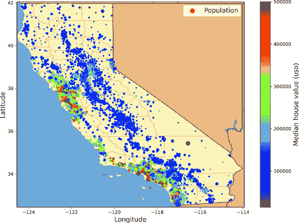
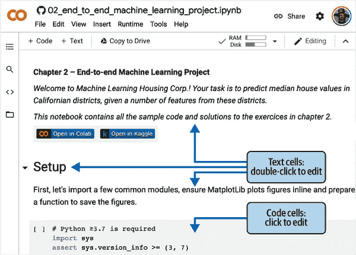
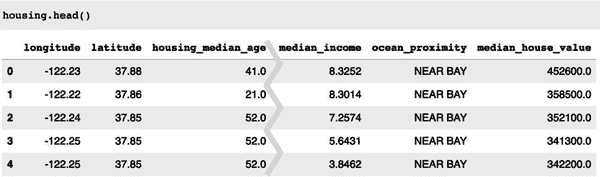
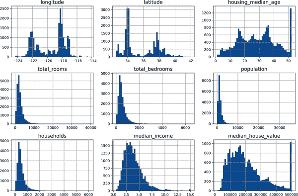
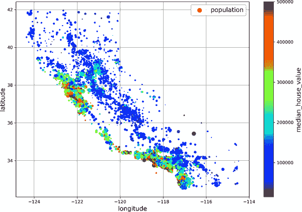
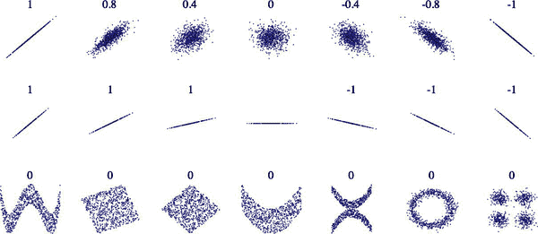
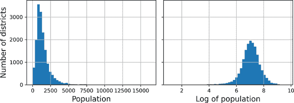
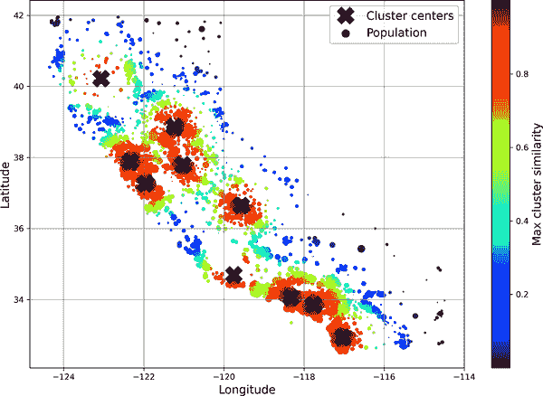

# 第二章：端到端的机器学习项目

在本章中，您将通过一个示例项目端到端地工作，假装自己是一家房地产公司最近雇用的数据科学家。这个例子是虚构的；目标是说明机器学习项目的主要步骤，而不是了解房地产业务。以下是我们将要走过的主要步骤：

1.  看大局。

1.  获取数据。

1.  探索和可视化数据以获得洞见。

1.  为机器学习算法准备数据。

1.  选择模型并训练它。

1.  微调您的模型。

1.  呈现解决方案。

1.  启动、监控和维护您的系统。

# 使用真实数据

当您学习机器学习时，最好尝试使用真实世界的数据，而不是人工数据集。幸运的是，有成千上万的开放数据集可供选择，涵盖各种领域。以下是您可以查找数据的一些地方：

+   流行的开放数据存储库：

    +   [OpenML.org](https://openml.org)

    +   [Kaggle.com](https://kaggle.com/datasets)

    +   [PapersWithCode.com](https://paperswithcode.com/datasets)

    +   [UC Irvine 机器学习存储库](https://archive.ics.uci.edu/ml)

    +   [亚马逊的 AWS 数据集](https://registry.opendata.aws)

    +   [TensorFlow 数据集](https://tensorflow.org/datasets)

+   元门户网站（它们列出开放数据存储库）：

    +   [DataPortals.org](https://dataportals.org)

    +   [OpenDataMonitor.eu](https://opendatamonitor.eu)

+   其他页面列出了许多流行的开放数据存储库：

    +   [维基百科的机器学习数据集列表](https://homl.info/9)

    +   [Quora.com](https://homl.info/10)

    +   [数据集的 subreddit](https://reddit.com/r/datasets)

在本章中，我们将使用 StatLib 存储库中的加利福尼亚房价数据集（见图 2-1）。该数据集基于 1990 年加利福尼亚人口普查数据。虽然不是最新的（在那个时候，旧金山湾区的漂亮房子仍然是负担得起的），但它具有许多学习的优点，因此我们将假装它是最新的数据。出于教学目的，我添加了一个分类属性并删除了一些特征。



###### 图 2-1。加利福尼亚房屋价格

# 看大局

欢迎来到机器学习房地产公司！您的第一个任务是使用加利福尼亚人口普查数据来建立该州房价模型。这些数据包括加利福尼亚每个街区组的人口、中位收入和中位房价等指标。街区组是美国人口普查局发布样本数据的最小地理单位（一个街区组通常有 600 到 3000 人口）。我会简称它们为“区”。

您的模型应该从这些数据中学习，并能够预测任何地区的房屋中位数价格，考虑到所有其他指标。

###### 提示

由于您是一个组织良好的数据科学家，您应该做的第一件事是拿出您的机器学习项目清单。您可以从附录 A 开始；对于大多数机器学习项目来说，这应该运行得相当顺利，但请确保根据您的需求进行调整。在本章中，我们将逐个检查许多项目，但也会跳过一些，要么是因为它们是不言自明的，要么是因为它们将在后续章节中讨论。

## 构建问题框架

向老板提出问题的第一个问题是业务目标究竟是什么。构建模型可能不是最终目标。公司希望如何使用和从这个模型中受益？知道目标很重要，因为它将决定您如何构建问题，选择哪些算法，使用哪种性能度量来评估您的模型，以及您将花费多少精力来调整它。

你的老板回答说，你模型的输出（一个区域的中位房价的预测）将被馈送到另一个机器学习系统（见图 2-2），以及许多其他信号。这个下游系统将确定是否值得在一个给定区域进行投资。做对这一点至关重要，因为它直接影响收入。

下一个问题要问你的老板是，当前的解决方案是什么样子的（如果有的话）。当前情况通常会给你一个性能的参考，以及解决问题的见解。你的老板回答说，目前专家们手动估计区域房价：一个团队收集关于一个区域的最新信息，当他们无法获得中位房价时，他们使用复杂的规则来估计。


###### 图 2-2。房地产投资的机器学习流程

这是昂贵且耗时的，他们的估计并不好；在他们设法找出实际的中位房价的情况下，他们经常意识到他们的估计偏差超过 30%。这就是为什么公司认为训练一个模型来预测一个区域的中位房价，给出该区域的其他数据，将是有用的。人口普查数据看起来是一个很好的数据集，可以用来实现这个目的，因为它包括数千个区域的中位房价，以及其他数据。

有了所有这些信息，你现在可以开始设计你的系统了。首先，确定模型将需要什么样的训练监督：是监督、无监督、半监督、自监督还是强化学习任务？这是一个分类任务、回归任务还是其他任务？应该使用批量学习还是在线学习技术？在继续阅读之前，暂停一下，尝试自己回答这些问题。

你找到答案了吗？让我们看看。这显然是一个典型的监督学习任务，因为模型可以通过*标记*的示例进行训练（每个实例都带有预期的输出，即区域的中位房价）。这是一个典型的回归任务，因为模型将被要求预测一个值。更具体地说，这是一个*多元回归*问题，因为系统将使用多个特征来进行预测（区域的人口，中位收入等）。这也是一个*单变量回归*问题，因为我们只是尝试预测每个区域的一个单一值。如果我们试图预测每个区域的多个值，那么它将是一个*多元回归*问题。最后，系统中没有连续的数据流进入，没有特别需要快速调整到变化的数据，数据足够小以适应内存，因此普通的批量学习应该做得很好。

###### 提示

如果数据很大，你可以将批量学习工作分配到多台服务器上（使用 MapReduce 技术），或者使用在线学习技术。

## 选择一个性能度量

你的下一步是选择一个性能度量。回归问题的一个典型性能度量是*均方根误差*（RMSE）。它给出了系统在预测中通常产生多少误差的概念，对大误差给予更高的权重。方程 2-1 显示了计算 RMSE 的数学公式。

##### 方程 2-1。均方根误差（RMSE）

<math display="block"><mrow><mtext>RMSE</mtext> <mrow><mo>(</mo> <mi mathvariant="bold">X</mi> <mo>,</mo> <mi>h</mi> <mo>)</mo></mrow> <mo>=</mo> <msqrt><mrow><mfrac><mn>1</mn> <mi>m</mi></mfrac> <munderover><mo>∑</mo> <mrow><mi>i</mi><mo>=</mo><mn>1</mn></mrow> <mi>m</mi></munderover> <msup><mfenced separators="" open="(" close=")"><mi>h</mi><mrow><mo>(</mo><msup><mi mathvariant="bold">x</mi> <mrow><mo>(</mo><mi>i</mi><mo>)</mo></mrow></msup> <mo>)</mo></mrow><mo>-</mo><msup><mi>y</mi> <mrow><mo>(</mo><mi>i</mi><mo>)</mo></mrow></msup></mfenced> <mn>2</mn></msup></mrow></msqrt></mrow></math>

尽管均方根误差通常是回归任务的首选性能度量，但在某些情况下，您可能更喜欢使用另一个函数。例如，如果有许多异常值区域。在这种情况下，您可能考虑使用*平均绝对误差*（MAE，也称为*平均绝对偏差*），如方程 2-2 所示：

##### 方程 2-2. 平均绝对误差（MAE）

<math display="block"><mrow><mtext>MAE</mtext> <mrow><mo>(</mo> <mi mathvariant="bold">X</mi> <mo>,</mo> <mi>h</mi> <mo>)</mo></mrow> <mo>=</mo> <mfrac><mn>1</mn> <mi>m</mi></mfrac> <munderover><mo>∑</mo> <mrow><mi>i</mi><mo>=</mo><mn>1</mn></mrow> <mi>m</mi></munderover> <mfenced separators="" open="|" close="|"><mi>h</mi> <mrow><mo>(</mo> <msup><mi mathvariant="bold">x</mi> <mrow><mo>(</mo><mi>i</mi><mo>)</mo></mrow></msup> <mo>)</mo></mrow> <mo>-</mo> <msup><mi>y</mi> <mrow><mo>(</mo><mi>i</mi><mo>)</mo></mrow></msup></mfenced></mrow></math>

均方根误差（RMSE）和平均绝对误差（MAE）都是衡量两个向量之间距离的方法：预测向量和目标值向量。各种距离度量，或*范数*，都是可能的：

+   计算平方和的根（RMSE）对应于*欧几里德范数*：这是我们都熟悉的距离概念。它也被称为ℓ[2] *范数*，表示为∥ · ∥[2]（或只是∥ · ∥）。

+   计算绝对值之和（MAE）对应于ℓ[1] *范数*，表示为∥ · ∥[1]。这有时被称为*曼哈顿范数*，因为它测量了在城市中两点之间的距离，如果您只能沿着正交的城市街区行驶。

+   更一般地，包含*n*个元素的向量**v**的ℓ[*k*] *范数*被定义为∥**v**∥[*k*] = (|*v*[1]|^(*k*) + |*v*[2]|^(*k*) + ... + |*v*[*n*]|^(*k*))^(1/*k*)。ℓ[0]给出向量中非零元素的数量，ℓ[∞]给出向量中的最大绝对值。

范数指数越高，就越关注大值并忽略小值。这就是为什么均方根误差（RMSE）比平均绝对误差（MAE）更容易受到异常值的影响。但是当异常值呈指数稀有性（如钟形曲线）时，均方根误差表现非常好，通常更受青睐。

## 检查假设

最后，列出并验证迄今为止已经做出的假设（由您或他人）是一个很好的做法；这可以帮助您及早发现严重问题。例如，您的系统输出的区域价格将被馈送到下游机器学习系统中，您假设这些价格将被如此使用。但是，如果下游系统将价格转换为类别（例如，“便宜”，“中等”或“昂贵”），然后使用这些类别而不是价格本身呢？在这种情况下，完全准确地获取价格并不重要；您的系统只需要获取正确的类别。如果是这样，那么问题应该被定义为一个分类任务，而不是一个回归任务。您不希望在为回归系统工作数月后才发现这一点。

幸运的是，在与负责下游系统的团队交谈后，您确信他们确实需要实际价格，而不仅仅是类别。太好了！您已经准备就绪，灯光是绿色的，现在可以开始编码了！

# 获取数据

现在是动手的时候了。毫不犹豫地拿起你的笔记本电脑，浏览代码示例。正如我在前言中提到的，本书中的所有代码示例都是开源的，可在[在线](https://github.com/ageron/handson-ml3)作为 Jupyter 笔记本使用，这些笔记本是交互式文档，包含文本、图像和可执行代码片段（在我们的情况下是 Python）。在本书中，我假设您正在 Google Colab 上运行这些笔记本，这是一个免费服务，让您可以直接在线运行任何 Jupyter 笔记本，而无需在您的计算机上安装任何东西。如果您想使用另一个在线平台（例如 Kaggle），或者如果您想在自己的计算机上本地安装所有内容，请参阅本书 GitHub 页面上的说明。

## 使用 Google Colab 运行代码示例

首先，打开一个网络浏览器，访问[*https://homl.info/colab3*](https://homl.info/colab3)：这将带您到 Google Colab，并显示本书的 Jupyter 笔记本列表（参见图 2-3）。您将在每章找到一个笔记本，以及一些额外的笔记本和 NumPy、Matplotlib、Pandas、线性代数和微积分的教程。例如，如果您点击*02_end_to_end_machine_learning_project.ipynb*，将会在 Google Colab 中打开第二章的笔记本（参见图 2-4）。

Jupyter 笔记本由一系列单元格组成。每个单元格包含可执行代码或文本。尝试双击第一个文本单元格（其中包含句子“欢迎来到机器学习房地产公司！”）。这将打开单元格进行编辑。请注意，Jupyter 笔记本使用 Markdown 语法进行格式化（例如，`**粗体**`，`*斜体*`，`# 标题`，`url`等）。尝试修改这段文本，然后按 Shift-Enter 查看结果。


###### 图 2-3\. Google Colab 中的笔记本列表



###### 图 2-4\. 在 Google Colab 中的笔记本

接下来，通过选择插入→“代码单元格”菜单来创建一个新的代码单元格。或者，您可以在工具栏中点击+代码按钮，或者将鼠标悬停在单元格底部直到看到+代码和+文本出现，然后点击+代码。在新的代码单元格中，输入一些 Python 代码，例如`print("Hello World")`，然后按 Shift-Enter 运行此代码（或者点击单元格左侧的▷按钮）。

如果您尚未登录 Google 账户，现在将被要求登录（如果您尚未拥有 Google 账户，您需要创建一个）。一旦您登录，当您尝试运行代码时，您将看到一个安全警告，告诉您这个笔记本不是由 Google 编写的。一个恶意的人可能会创建一个试图欺骗您输入 Google 凭据的笔记本，以便访问您的个人数据，因此在运行笔记本之前，请务必确保信任其作者（或在运行之前仔细检查每个代码单元格将执行的操作）。假设您信任我（或者您计划检查每个代码单元格），现在可以点击“仍然运行”。

Colab 将为您分配一个新的*运行时*：这是位于 Google 服务器上的免费虚拟机，包含一堆工具和 Python 库，包括大多数章节所需的一切（在某些章节中，您需要运行一个命令来安装额外的库）。这将需要几秒钟。接下来，Colab 将自动连接到此运行时，并使用它来执行您的新代码单元格。重要的是，代码在运行时上运行，*而不是*在您的计算机上。代码的输出将显示在单元格下方。恭喜，您已在 Colab 上运行了一些 Python 代码！

###### 提示

要插入新的代码单元格，您也可以键入 Ctrl-M（或 macOS 上的 Cmd-M），然后按 A（在活动单元格上方插入）或 B（在下方插入）。还有许多其他可用的键盘快捷键：您可以通过键入 Ctrl-M（或 Cmd-M）然后 H 来查看和编辑它们。如果您选择在 Kaggle 上或使用 JupyterLab 或带有 Jupyter 扩展的 IDE（如 Visual Studio Code）在自己的机器上运行笔记本，您将看到一些细微差异——运行时称为*内核*，用户界面和键盘快捷键略有不同等等——但从一个 Jupyter 环境切换到另一个并不太困难。

## 保存您的代码更改和数据

您可以对 Colab 笔记本进行更改，并且只要保持浏览器标签打开，这些更改将持续存在。但一旦关闭它，更改将丢失。为了避免这种情况，请确保通过选择文件→“在驱动器中保存副本”将笔记本保存到您的谷歌驱动器。或者，您可以通过选择文件→下载→“下载.ipynb”将笔记本下载到计算机。然后，您可以稍后访问[*https://colab.research.google.com*](https://colab.research.google.com)并再次打开笔记本（从谷歌驱动器或通过从计算机上传）。

###### 警告

Google Colab 仅用于交互使用：您可以在笔记本中玩耍并调整代码，但不能让笔记本在长时间内无人看管运行，否则运行时将关闭并丢失所有数据。

如果笔记本生成了您关心的数据，请确保在运行时关闭之前下载这些数据。要做到这一点，请点击文件图标（参见图 2-5 中的步骤 1），找到要下载的文件，点击其旁边的垂直点（步骤 2），然后点击下载（步骤 3）。或者，您可以在运行时挂载您的谷歌驱动器，使笔记本能够直接读写文件到谷歌驱动器，就像它是一个本地目录一样。为此，请点击文件图标（步骤 1），然后点击谷歌驱动器图标（在图 2-5 中用圈圈圈出）并按照屏幕上的说明操作。


###### 图 2-5。从 Google Colab 运行时下载文件（步骤 1 至 3），或挂载您的谷歌驱动器（圈圈图标）

默认情况下，您的谷歌驱动器将挂载在*/content/drive/MyDrive*。如果要备份数据文件，只需通过运行`!cp /content/my_great_model /content/drive/MyDrive`将其复制到此目录。任何以感叹号（`!`）开头的命令都被视为 shell 命令，而不是 Python 代码：`cp`是 Linux shell 命令，用于将文件从一个路径复制到另一个路径。请注意，Colab 运行时在 Linux 上运行（具体来说是 Ubuntu）。

## 交互性的力量和危险

Jupyter 笔记本是交互式的，这是一件好事：您可以逐个运行每个单元格，在任何时候停止，插入单元格，玩弄代码，返回并再次运行相同的单元格等等，我强烈鼓励您这样做。如果您只是逐个运行单元格而从不玩弄它们，您学习速度不会那么快。然而，这种灵活性是有代价的：很容易按错误的顺序运行单元格，或者忘记运行一个单元格。如果发生这种情况，后续的代码单元格很可能会失败。例如，每个笔记本中的第一个代码单元格包含设置代码（如导入），因此请确保首先运行它，否则什么都不会起作用。

###### 提示

如果您遇到奇怪的错误，请尝试重新启动运行时（通过选择运行时→“重新启动运行时”菜单）然后再次从笔记本开头运行所有单元格。这通常可以解决问题。如果不行，很可能是您所做的更改之一破坏了笔记本：只需恢复到原始笔记本并重试。如果仍然失败，请在 GitHub 上提交问题。

## 书中代码与笔记本代码

您有时可能会注意到本书中的代码与笔记本中的代码之间存在一些小差异。这可能是由于以下几个原因：

+   图书馆可能在您阅读这些文字时略有变化，或者尽管我尽力了，但书中可能存在错误。遗憾的是，我不能在您的这本书中神奇地修复代码（除非您正在阅读电子副本并且可以下载最新版本），但我可以修复笔记本。因此，如果您在从本书中复制代码后遇到错误，请查找笔记本中的修复代码：我将努力保持它们没有错误，并与最新的库版本保持同步。

+   笔记本包含一些额外的代码来美化图形（添加标签，设置字体大小等）并将它们保存为高分辨率以供本书使用。如果您愿意，可以安全地忽略这些额外的代码。

我优化了代码以提高可读性和简单性：我尽可能将其线性化和扁平化，定义了很少的函数或类。目标是确保您运行的代码通常就在您眼前，而不是嵌套在几层抽象中，需要搜索。这也使您更容易玩弄代码。为简单起见，我没有进行太多的错误处理，并且将一些不常见的导入放在需要它们的地方（而不是像 PEP 8 Python 风格指南建议的那样将它们放在文件顶部）。也就是说，您的生产代码不会有太大的不同：只是更模块化，还有额外的测试和错误处理。

好了！一旦您熟悉了 Colab，您就可以下载数据了。

## 下载数据

在典型环境中，您的数据可能存储在关系数据库或其他常见数据存储中，并分布在多个表/文档/文件中。要访问它，您首先需要获取您的凭据和访问授权，并熟悉数据模式。然而，在这个项目中，情况要简单得多：您只需下载一个压缩文件*housing.tgz*，其中包含一个名为*housing.csv*的逗号分隔值（CSV）文件，其中包含所有数据。

与手动下载和解压数据相比，通常最好编写一个函数来执行此操作。特别是如果数据经常更改，这将非常有用：您可以编写一个小脚本，使用该函数获取最新数据（或者您可以设置定期自动执行此操作的计划任务）。自动获取数据的过程也很有用，如果您需要在多台机器上安装数据集。

这是用于获取和加载数据的函数：

```py
from pathlib import Path
import pandas as pd
import tarfile
import urllib.request

def load_housing_data():
    tarball_path = Path("datasets/housing.tgz")
    if not tarball_path.is_file():
        Path("datasets").mkdir(parents=True, exist_ok=True)
        url = "https://github.com/ageron/data/raw/main/housing.tgz"
        urllib.request.urlretrieve(url, tarball_path)
        with tarfile.open(tarball_path) as housing_tarball:
            housing_tarball.extractall(path="datasets")
    return pd.read_csv(Path("datasets/housing/housing.csv"))

housing = load_housing_data()
```

当调用`load_housing_data()`时，它会查找*datasets/housing.tgz*文件。如果找不到该文件，它会在当前目录内创建*datasets*目录（默认为*/content*，在 Colab 中），从*ageron/data* GitHub 存储库下载*housing.tgz*文件，并将其内容提取到*datasets*目录中；这将创建*datasets*/*housing*目录，并在其中包含*housing.csv*文件。最后，该函数将此 CSV 文件加载到一个包含所有数据的 Pandas DataFrame 对象中，并返回它。

## 快速查看数据结构

您可以通过使用 DataFrame 的`head()`方法来查看数据的前五行（请参见图 2-6）。



###### 图 2-6。数据集中的前五行

每一行代表一个地区。有 10 个属性（并非所有属性都显示在屏幕截图中）：`longitude`、`latitude`、`housing_median_age`、`total_rooms`、`total_bedrooms`、`population`、`households`、`median_income`、`median_house_value`和`ocean_proximity`。

`info()`方法对于快速获取数据的简要描述非常有用，特别是总行数、每个属性的类型和非空值的数量：

```py
>>> housing.info()
<class 'pandas.core.frame.DataFrame'>
RangeIndex: 20640 entries, 0 to 20639
Data columns (total 10 columns):
 #   Column              Non-Null Count  Dtype
---  ------              --------------  -----
 0   longitude           20640 non-null  float64
 1   latitude            20640 non-null  float64
 2   housing_median_age  20640 non-null  float64
 3   total_rooms         20640 non-null  float64
 4   total_bedrooms      20433 non-null  float64
 5   population          20640 non-null  float64
 6   households          20640 non-null  float64
 7   median_income       20640 non-null  float64
 8   median_house_value  20640 non-null  float64
 9   ocean_proximity     20640 non-null  object
dtypes: float64(9), object(1)
memory usage: 1.6+ MB
```

###### 注意

在本书中，当代码示例包含代码和输出混合时，就像这里一样，它的格式类似于 Python 解释器，以便更好地阅读：代码行以`>>>`（或缩进块的情况下为`...`）为前缀，输出没有前缀。

数据集中有 20,640 个实例，这意味着按照机器学习的标准来说，它相当小，但是非常适合入门。您会注意到`total_bedrooms`属性只有 20,433 个非空值，这意味着有 207 个地区缺少这个特征。您需要稍后处理这个问题。

所有属性都是数字的，除了`ocean_proximity`。它的类型是`object`，因此它可以保存任何类型的 Python 对象。但是由于您从 CSV 文件中加载了这些数据，您知道它必须是一个文本属性。当您查看前五行时，您可能会注意到`ocean_proximity`列中的值是重复的，这意味着它可能是一个分类属性。您可以使用`value_counts()`方法找出存在哪些类别以及每个类别包含多少个地区：

```py
>>> housing["ocean_proximity"].value_counts()
<1H OCEAN     9136
INLAND        6551
NEAR OCEAN    2658
NEAR BAY      2290
ISLAND           5
Name: ocean_proximity, dtype: int64
```

让我们看看其他字段。`describe()`方法显示了数字属性的摘要（图 2-7）。


###### 图 2-7。每个数字属性的总结

`count`、`mean`、`min`和`max`行是不言自明的。请注意，空值被忽略了（因此，例如，`total_bedrooms`的`count`是 20,433，而不是 20,640）。`std`行显示了*标准差*，它衡量了值的分散程度。⁠⁵ `25%`、`50%`和`75%`行显示了相应的*百分位数*：百分位数表示给定百分比的观察值中有多少落在一组观察值之下。例如，25%的地区的`housing_median_age`低于 18，而 50%低于 29，75%低于 37。这些通常被称为第 25 百分位数（或第一个*四分位数*）、中位数和第 75 百分位数（或第三四分位数）。

另一种快速了解您正在处理的数据类型的方法是为每个数字属性绘制直方图。直方图显示了具有给定值范围的实例数量（在水平轴上）（在垂直轴上）。您可以一次绘制一个属性，也可以在整个数据集上调用`hist()`方法（如下面的代码示例所示），它将为每个数字属性绘制一个直方图（参见图 2-8）：

```py
import matplotlib.pyplot as plt

housing.hist(bins=50, figsize=(12, 8))
plt.show()
```



###### 图 2-8。每个数字属性的直方图

查看这些直方图，您会注意到一些事情：

+   首先，中位收入属性看起来不像是以美元（USD）表示的。在与收集数据的团队核实后，他们告诉您数据已经被缩放，并且对于更高的中位收入，已经被限制在 15（实际上是 15.0001），对于更低的中位收入，已经被限制在 0.5（实际上是 0.4999）。这些数字大致表示数万美元（例如，3 实际上表示约 30,000 美元）。在机器学习中使用预处理的属性是很常见的，这并不一定是问题，但您应该尝试了解数据是如何计算的。

+   房屋中位年龄和房屋中位价值也被限制了。后者可能是一个严重的问题，因为它是您的目标属性（您的标签）。您的机器学习算法可能会学习到价格永远不会超过那个限制。您需要与客户团队（将使用您系统输出的团队）核实，看看这是否是一个问题。如果他们告诉您他们需要精确的预测，甚至超过 50 万美元，那么您有两个选择：

    +   收集那些标签被限制的地区的正确标签。

    +   从训练集中删除这些地区（也从测试集中删除，因为如果您的系统预测超过 50 万美元的值，它不应该被评估不良）。

+   这些属性具有非常不同的比例。当我们探索特征缩放时，我们将在本章后面讨论这一点。

+   最后，许多直方图是*右偏的*：它们在中位数的右侧延伸得更远，而不是左侧。这可能会使一些机器学习算法更难检测到模式。稍后，您将尝试转换这些属性，使其具有更对称和钟形分布。

现在您应该对您正在处理的数据有更好的了解。

###### 警告

等等！在进一步查看数据之前，您需要创建一个测试集，将其放在一边，永远不要查看它。

## 创建一个测试集

在这个阶段自愿设置一部分数据似乎有点奇怪。毕竟，您只是快速浏览了数据，而在决定使用什么算法之前，您肯定应该更多地了解它，对吧？这是真的，但您的大脑是一个惊人的模式检测系统，这也意味着它很容易过拟合：如果您查看测试集，您可能会在测试数据中发现一些看似有趣的模式，导致您选择特定类型的机器学习模型。当您使用测试集估计泛化误差时，您的估计将过于乐观，您将启动一个性能不如预期的系统。这被称为*数据窥探*偏差。

创建测试集在理论上很简单；随机选择一些实例，通常是数据集的 20％（如果您的数据集非常大，则可以更少），并将它们放在一边：

```py
import numpy as np

def shuffle_and_split_data(data, test_ratio):
    shuffled_indices = np.random.permutation(len(data))
    test_set_size = int(len(data) * test_ratio)
    test_indices = shuffled_indices[:test_set_size]
    train_indices = shuffled_indices[test_set_size:]
    return data.iloc[train_indices], data.iloc[test_indices]
```

然后，您可以像这样使用这个函数：

```py
>>> train_set, test_set = shuffle_and_split_data(housing, 0.2)
>>> len(train_set)
16512
>>> len(test_set)
4128
```

好吧，这样做是有效的，但并不完美：如果再次运行程序，它将生成不同的测试集！随着时间的推移，您（或您的机器学习算法）将看到整个数据集，这是您要避免的。

一种解决方案是在第一次运行时保存测试集，然后在后续运行中加载它。另一个选项是在调用`np.random.permutation()`之前设置随机数生成器的种子（例如，使用`np.random.seed(42)`）⁠^（[6]（ch02.html#idm45720239285936）），以便它始终生成相同的洗牌索引。

然而，这两种解决方案在获取更新的数据集后会失效。为了在更新数据集后仍然保持稳定的训练/测试分割，一个常见的解决方案是使用每个实例的标识符来决定是否应该放入测试集中（假设实例具有唯一且不可变的标识符）。例如，您可以计算每个实例标识符的哈希值，并且如果哈希值低于或等于最大哈希值的 20％，则将该实例放入测试集中。这确保了测试集将在多次运行中保持一致，即使您刷新数据集。新的测试集将包含新实例的 20％，但不会包含以前在训练集中的任何实例。

这是一个可能的实现：

```py
from zlib import crc32

def is_id_in_test_set(identifier, test_ratio):
    return crc32(np.int64(identifier)) < test_ratio * 2**32

def split_data_with_id_hash(data, test_ratio, id_column):
    ids = data[id_column]
    in_test_set = ids.apply(lambda id_: is_id_in_test_set(id_, test_ratio))
    return data.loc[~in_test_set], data.loc[in_test_set]
```

不幸的是，住房数据集没有标识符列。最简单的解决方案是使用行索引作为 ID：

```py
housing_with_id = housing.reset_index()  # adds an `index` column
train_set, test_set = split_data_with_id_hash(housing_with_id, 0.2, "index")
```

如果使用行索引作为唯一标识符，您需要确保新数据附加到数据集的末尾，并且永远不会删除任何行。如果这不可能，那么您可以尝试使用最稳定的特征来构建唯一标识符。例如，一个地区的纬度和经度保证在几百万年内保持稳定，因此您可以将它们组合成一个 ID，如下所示：⁠^（[7]（ch02.html#idm45720242437568））

```py
housing_with_id["id"] = housing["longitude"] * 1000 + housing["latitude"]
train_set, test_set = split_data_with_id_hash(housing_with_id, 0.2, "id")
```

Scikit-Learn 提供了一些函数，以各种方式将数据集拆分为多个子集。最简单的函数是`train_test_split()`，它基本上与我们之前定义的`shuffle_and_split_data()`函数做的事情差不多，但有一些额外的功能。首先，有一个`random_state`参数，允许您设置随机生成器种子。其次，您可以传递多个具有相同行数的数据集，并且它将在相同的索引上拆分它们（例如，如果您有一个单独的标签 DataFrame，这是非常有用的）：

```py
from sklearn.model_selection import train_test_split

train_set, test_set = train_test_split(housing, test_size=0.2, random_state=42)
```

到目前为止，我们已经考虑了纯随机抽样方法。如果您的数据集足够大（尤其是相对于属性数量），这通常是可以接受的，但如果不是，您就有可能引入显著的抽样偏差。当调查公司的员工决定打电话给 1,000 人询问一些问题时，他们不会仅仅在电话簿中随机挑选 1,000 人。他们会努力确保这 1,000 人在问题上代表整个人口。例如，美国人口中 51.1%是女性，48.9%是男性，因此在美国进行良好的调查将尝试保持这个比例在样本中：511 名女性和 489 名男性（至少如果可能的话，答案可能会因性别而有所不同）。这被称为*分层抽样*：人口被划分为称为*层*的同质子群，从每个层中抽取正确数量的实例以确保测试集代表整体人口。如果进行调查的人员使用纯随机抽样，那么抽取一个偏斜的测试集，女性参与者少于 48.5%或多于 53.5%的概率约为 10.7%。无论哪种方式，调查结果可能会相当偏倚。

假设您与一些专家交谈过，他们告诉您，中位收入是预测中位房价的一个非常重要的属性。您可能希望确保测试集代表整个数据集中各种收入类别。由于中位收入是一个连续的数值属性，您首先需要创建一个收入类别属性。让我们更仔细地看一下中位收入直方图（回到图 2-8）：大多数中位收入值聚集在 1.5 到 6 之间（即 15,000 美元至 60,000 美元），但有些中位收入远远超过 6。对于每个层，您的数据集中应该有足够数量的实例，否则对层重要性的估计可能会有偏差。这意味着您不应该有太多层，并且每个层应该足够大。以下代码使用`pd.cut()`函数创建一个具有五个类别（从 1 到 5 标记）的收入类别属性；类别 1 范围从 0 到 1.5（即 15,000 美元以下），类别 2 从 1.5 到 3，依此类推：

```py
housing["income_cat"] = pd.cut(housing["median_income"],
                               bins=[0., 1.5, 3.0, 4.5, 6., np.inf],
                               labels=[1, 2, 3, 4, 5])
```

这些收入类别在图 2-9 中表示：

```py
housing["income_cat"].value_counts().sort_index().plot.bar(rot=0, grid=True)
plt.xlabel("Income category")
plt.ylabel("Number of districts")
plt.show()
```

现在您可以根据收入类别进行分层抽样。Scikit-Learn 在`sklearn.model_selection`包中提供了许多拆分器类，实现了各种策略来将数据集拆分为训练集和测试集。每个拆分器都有一个`split()`方法，返回相同数据的不同训练/测试拆分的迭代器。


###### 图 2-9。收入类别直方图

要准确，`split()`方法产生训练和测试*索引*，而不是数据本身。如果您想更好地估计模型的性能，拥有多个拆分可能是有用的，这将在本章后面讨论交叉验证时看到。例如，以下代码生成了同一数据集的 10 个不同的分层拆分：

```py
from sklearn.model_selection import StratifiedShuffleSplit

splitter = StratifiedShuffleSplit(n_splits=10, test_size=0.2, random_state=42)
strat_splits = []
for train_index, test_index in splitter.split(housing, housing["income_cat"]):
    strat_train_set_n = housing.iloc[train_index]
    strat_test_set_n = housing.iloc[test_index]
    strat_splits.append([strat_train_set_n, strat_test_set_n])
```

现在，您可以使用第一个拆分：

```py
strat_train_set, strat_test_set = strat_splits[0]
```

或者，由于分层抽样相当常见，可以使用`train_test_split()`函数的`stratify`参数来更快地获得单个拆分：

```py
strat_train_set, strat_test_set = train_test_split(
    housing, test_size=0.2, stratify=housing["income_cat"], random_state=42)
```

让我们看看这是否按预期工作。您可以从测试集中查看收入类别的比例：

```py
>>> strat_test_set["income_cat"].value_counts() / len(strat_test_set)
3    0.350533
2    0.318798
4    0.176357
5    0.114341
1    0.039971
Name: income_cat, dtype: float64
```

使用类似的代码，您可以测量完整数据集中的收入类别比例。图 2-10 比较了整体数据集中的收入类别比例，使用分层抽样生成的测试集以及使用纯随机抽样生成的测试集。如您所见，使用分层抽样生成的测试集的收入类别比例几乎与完整数据集中的相同，而使用纯随机抽样生成的测试集则有所偏差。


###### 图 2-10。分层与纯随机抽样的抽样偏差比较

您不会再使用`income_cat`列，因此可以将其删除，将数据恢复到原始状态：

```py
for set_ in (strat_train_set, strat_test_set):
    set_.drop("income_cat", axis=1, inplace=True)
```

我们花了相当多的时间在测试集生成上，这是一个经常被忽视但至关重要的机器学习项目的关键部分。此外，当我们讨论交叉验证时，许多这些想法将在以后派上用场。现在是时候进入下一个阶段了：探索数据。

# 探索和可视化数据以获得洞见

到目前为止，您只是快速浏览了数据，以对您正在处理的数据类型有一个大致了解。现在的目标是深入一点。

首先，请确保您已经将测试集放在一边，只探索训练集。此外，如果训练集非常庞大，您可能希望对探索集进行抽样，以便在探索阶段进行操作更加轻松和快速。在这种情况下，训练集相当小，因此您可以直接在完整集上工作。由于您将尝试对完整训练集进行各种转换，因此应该先复制原始数据，以便之后可以恢复到原始状态：

```py
housing = strat_train_set.copy()
```

## 可视化地理数据

由于数据集包含地理信息（纬度和经度），因此创建一个散点图来可视化所有地区是一个好主意（图 2-11）：

```py
housing.plot(kind="scatter", x="longitude", y="latitude", grid=True)
plt.show()
```


###### 图 2-11。数据的地理散点图

这看起来确实像加利福尼亚，但除此之外很难看出任何特定的模式。将`alpha`选项设置为`0.2`可以更容易地可视化数据点密度较高的地方（图 2-12）：

```py
housing.plot(kind="scatter", x="longitude", y="latitude", grid=True, alpha=0.2)
plt.show()
```

现在好多了：您可以清楚地看到高密度区域，即旧金山湾区、洛杉矶周围和圣迭戈周围，以及中央谷地（特别是萨克拉门托和弗雷斯诺周围）的一长串相当高密度区域。

我们的大脑非常擅长发现图片中的模式，但您可能需要调整可视化参数来突出这些模式。


###### 图 2-12。一个更好的可视化，突出显示高密度区域

接下来，您将查看房屋价格（图 2-13）。每个圆的半径代表地区的人口（选项`s`），颜色代表价格（选项`c`）。在这里，您使用了一个预定义的颜色映射（选项`cmap`）称为`jet`，从蓝色（低值）到红色（高价格）：⁠⁸

```py
housing.plot(kind="scatter", x="longitude", y="latitude", grid=True,
             s=housing["population"] / 100, label="population",
             c="median_house_value", cmap="jet", colorbar=True,
             legend=True, sharex=False, figsize=(10, 7))
plt.show()
```

这幅图告诉你，房价与位置（例如靠近海洋）和人口密度密切相关，这可能是你已经知道的。聚类算法应该对检测主要集群和添加衡量到集群中心距离的新特征很有用。海洋接近度属性也可能有用，尽管在加利福尼亚北部，沿海地区的房价并不太高，所以这并不是一个简单的规则。



###### 图 2-13\. 加利福尼亚房价：红色是昂贵的，蓝色是便宜的，较大的圆圈表示人口较多的地区

## 寻找相关性

由于数据集不太大，你可以使用`corr()`方法轻松计算每对属性之间的*标准相关系数*（也称为*皮尔逊相关系数*）：

```py
corr_matrix = housing.corr()
```

现在你可以看看每个属性与房屋中位价值的相关程度：

```py
>>> corr_matrix["median_house_value"].sort_values(ascending=False)
median_house_value    1.000000
median_income         0.688380
total_rooms           0.137455
housing_median_age    0.102175
households            0.071426
total_bedrooms        0.054635
population           -0.020153
longitude            -0.050859
latitude             -0.139584
Name: median_house_value, dtype: float64
```

相关系数的范围是-1 到 1。当它接近 1 时，意味着有很强的正相关性；例如，当中位收入上升时，中位房价往往会上涨。当系数接近-1 时，意味着有很强的负相关性；你可以看到纬度和中位房价之间存在微弱的负相关性（即，当你向北走时，价格略有下降的趋势）。最后，接近 0 的系数意味着没有线性相关性。

检查属性之间的相关性的另一种方法是使用 Pandas 的`scatter_matrix()`函数，它将每个数值属性与其他每个数值属性绘制在一起。由于现在有 11 个数值属性，你将得到 11² = 121 个图，这些图无法放在一页上，所以你决定专注于一些看起来与房屋中位价值最相关的有希望的属性（图 2-14）：

```py
from pandas.plotting import scatter_matrix

attributes = ["median_house_value", "median_income", "total_rooms",
              "housing_median_age"]
scatter_matrix(housing[attributes], figsize=(12, 8))
plt.show()
```


###### 图 2-14\. 这个散点矩阵将每个数值属性与其他每个数值属性绘制在一起，主对角线上是每个数值属性值的直方图（从左上到右下）

如果 Pandas 将每个变量与自身绘制在一起，主对角线将充满直线，这将没有太大用处。因此，Pandas 显示了每个属性的直方图（还有其他选项可用；请参阅 Pandas 文档以获取更多详细信息）。

看着相关性散点图，似乎最有希望预测房屋中位价值的属性是中位收入，所以你放大了它们的散点图（图 2-15）：

```py
housing.plot(kind="scatter", x="median_income", y="median_house_value",
             alpha=0.1, grid=True)
plt.show()
```


###### 图 2-15\. 中位收入与中位房价

这个图揭示了一些事情。首先，相关性确实非常强；你可以清楚地看到上升趋势，点的分散程度也不大。其次，你之前注意到的价格上限在$500,000 处清晰可见。但这个图还显示了其他不太明显的直线：一个在$450,000 左右的水平线，另一个在$350,000 左右，也许还有一个在$280,000 左右，以及一些更低的线。你可能想尝试删除相应的地区，以防止你的算法学习复制这些数据怪癖。

###### 警告

相关系数只能测量线性相关性（“随着*x*的增加，*y*通常上升/下降”）。它可能完全忽略非线性关系（例如，“随着*x*接近 0，*y*通常上升”）。图 2-16 展示了各种数据集以及它们的相关系数。请注意，尽管底部行的所有图都具有相关系数为 0，但它们的坐标轴显然*不*是独立的：这些是非线性关系的示例。此外，第二行显示了相关系数等于 1 或-1 的示例；请注意，这与斜率无关。例如，您的身高以英寸为单位与以英尺或纳米为单位的身高的相关系数为 1。



###### 图 2-16\. 各种数据集的标准相关系数（来源：维基百科；公共领域图像）

## 尝试属性组合

希望前面的部分给您提供了一些探索数据和获得见解的方法。您发现了一些可能需要在将数据馈送到机器学习算法之前清理的数据怪癖，并且找到了属性之间的有趣相关性，特别是与目标属性相关的。您还注意到一些属性具有右偏分布，因此您可能希望对其进行转换（例如，通过计算其对数或平方根）。当然，每个项目的情况会有很大不同，但总体思路是相似的。

在准备数据用于机器学习算法之前，您可能希望尝试各种属性组合。例如，一个地区的总房间数如果不知道有多少户，就不是很有用。您真正想要的是每户的房间数。同样，单独的卧室总数并不是很有用：您可能想要将其与房间数进行比较。每户人口也似乎是一个有趣的属性组合。您可以按照以下方式创建这些新属性：

```py
housing["rooms_per_house"] = housing["total_rooms"] / housing["households"]
housing["bedrooms_ratio"] = housing["total_bedrooms"] / housing["total_rooms"]
housing["people_per_house"] = housing["population"] / housing["households"]
```

然后再次查看相关矩阵：

```py
>>> corr_matrix = housing.corr()
>>> corr_matrix["median_house_value"].sort_values(ascending=False)
median_house_value    1.000000
median_income         0.688380
rooms_per_house       0.143663
total_rooms           0.137455
housing_median_age    0.102175
households            0.071426
total_bedrooms        0.054635
population           -0.020153
people_per_house     -0.038224
longitude            -0.050859
latitude             -0.139584
bedrooms_ratio       -0.256397
Name: median_house_value, dtype: float64
```

嘿，不错！新的`bedrooms_ratio`属性与房屋中位数的相关性要比总房间数或卧室总数高得多。显然，卧室/房间比例较低的房屋往往更昂贵。每户房间数也比一个地区的总房间数更具信息量——显然，房屋越大，价格越高。

这一轮探索不必绝对彻底；重点是要以正确的方式开始，并迅速获得有助于获得第一个相当不错原型的见解。但这是一个迭代过程：一旦您建立起一个原型并使其运行起来，您可以分析其输出以获得更多见解，并回到这一探索步骤。

# 为机器学习算法准备数据

现在是为您的机器学习算法准备数据的时候了。您应该为此目的编写函数，而不是手动操作，有几个很好的理由：

+   这将使您能够轻松在任何数据集上重现这些转换（例如，下次获取新数据集时）。

+   您将逐渐构建一个转换函数库，可以在将来的项目中重复使用。

+   您可以在实时系统中使用这些函数，在将新数据馈送到算法之前对其进行转换。

+   这将使您能够轻松尝试各种转换，并查看哪种转换组合效果最好。

但首先，恢复到一个干净的训练集（再次复制`strat_train_set`）。您还应该分开预测变量和标签，因为您不一定希望对预测变量和目标值应用相同的转换（请注意，`drop()`会创建数据的副本，不会影响`strat_train_set`）：

```py
housing = strat_train_set.drop("median_house_value", axis=1)
housing_labels = strat_train_set["median_house_value"].copy()
```

## 清理数据

大多数机器学习算法无法处理缺失特征，因此您需要处理这些问题。例如，您之前注意到`total_bedrooms`属性有一些缺失值。您有三种选项来解决这个问题：

1.  摆脱相应的地区。

1.  摆脱整个属性。

1.  将缺失值设置为某个值（零、均值、中位数等）。这称为*填充*。

使用 Pandas DataFrame 的`dropna()`、`drop()`和`fillna()`方法可以轻松实现这些功能：

```py
housing.dropna(subset=["total_bedrooms"], inplace=True)  # option 1

housing.drop("total_bedrooms", axis=1)  # option 2

median = housing["total_bedrooms"].median()  # option 3
housing["total_bedrooms"].fillna(median, inplace=True)
```

您决定选择第 3 个选项，因为它是最不破坏性的，但是不使用前面的代码，而是使用一个方便的 Scikit-Learn 类：`SimpleImputer`。好处是它将存储每个特征的中位数值：这将使得不仅可以在训练集上填补缺失值，还可以在验证集、测试集和任何输入到模型的新数据上填补缺失值。要使用它，首先需要创建一个`SimpleImputer`实例，指定您要用该属性的中位数替换每个属性的缺失值：

```py
from sklearn.impute import SimpleImputer

imputer = SimpleImputer(strategy="median")
```

由于中位数只能计算在数值属性上，因此您需要创建一个仅包含数值属性的数据副本（这将排除文本属性`ocean_proximity`）：

```py
housing_num = housing.select_dtypes(include=[np.number])
```

现在，您可以使用`fit()`方法将`imputer`实例拟合到训练数据中：

```py
imputer.fit(housing_num)
```

`imputer`只是计算了每个属性的中位数，并将结果存储在其`statistics_`实例变量中。只有`total_bedrooms`属性有缺失值，但是您不能确定系统上线后新数据中是否会有缺失值，因此最好将`imputer`应用于所有数值属性：

```py
>>> imputer.statistics_
array([-118.51 , 34.26 , 29\. , 2125\. , 434\. , 1167\. , 408\. , 3.5385])
>>> housing_num.median().values
array([-118.51 , 34.26 , 29\. , 2125\. , 434\. , 1167\. , 408\. , 3.5385])
```

现在，您可以使用这个“训练好的”`imputer`来转换训练集，用学习到的中位数替换缺失值：

```py
X = imputer.transform(housing_num)
```

缺失值也可以用均值（`strategy="mean"`）、最频繁值（`strategy="most_frequent"`）或常数值（`strategy="constant", fill_value=`…）替换。最后两种策略支持非数值数据。

###### 提示

`sklearn.impute`包中还有更强大的填充器（仅适用于数值特征）：

+   `KNNImputer`用该特征的*k*个最近邻值的均值替换每个缺失值。距离基于所有可用的特征。

+   `IterativeImputer`为每个特征训练一个回归模型，以预测基于所有其他可用特征的缺失值。然后，它再次在更新后的数据上训练模型，并在每次迭代中重复这个过程，改进模型和替换值。

Scikit-Learn 转换器输出 NumPy 数组（有时候也输出 SciPy 稀疏矩阵），即使它们以 Pandas DataFrame 作为输入。因此，`imputer.transform(housing_num)`的输出是一个 NumPy 数组：`X`既没有列名也没有索引。幸运的是，将`X`包装在 DataFrame 中并从`housing_num`中恢复列名和索引并不太困难：

```py
housing_tr = pd.DataFrame(X, columns=housing_num.columns,
                          index=housing_num.index)
```

## 处理文本和分类属性

到目前为止，我们只处理了数值属性，但是您的数据可能还包含文本属性。在这个数据集中，只有一个：`ocean_proximity`属性。让我们看一下前几个实例的值：

```py
>>> housing_cat = housing[["ocean_proximity"]]
>>> housing_cat.head(8)
 ocean_proximity
13096        NEAR BAY
14973       <1H OCEAN
3785           INLAND
14689          INLAND
20507      NEAR OCEAN
1286           INLAND
18078       <1H OCEAN
4396         NEAR BAY
```

这不是任意的文本：可能的值有限，每个值代表一个类别。因此，这个属性是一个分类属性。大多数机器学习算法更喜欢使用数字，所以让我们将这些类别从文本转换为数字。为此，我们可以使用 Scikit-Learn 的`OrdinalEncoder`类：

```py
from sklearn.preprocessing import OrdinalEncoder

ordinal_encoder = OrdinalEncoder()
housing_cat_encoded = ordinal_encoder.fit_transform(housing_cat)
```

这是`housing_cat_encoded`中前几个编码值的样子：

```py
>>> housing_cat_encoded[:8]
array([[3.],
 [0.],
 [1.],
 [1.],
 [4.],
 [1.],
 [0.],
 [3.]])
```

您可以使用`categories_`实例变量获取类别列表。它是一个包含每个分类属性的类别的 1D 数组的列表（在这种情况下，由于只有一个分类属性，因此包含一个单一数组的列表）：

```py
>>> ordinal_encoder.categories_
[array(['<1H OCEAN', 'INLAND', 'ISLAND', 'NEAR BAY', 'NEAR OCEAN'],
 dtype=object)]
```

这种表示的一个问题是，机器学习算法会假设两个相邻的值比两个远离的值更相似。在某些情况下这可能没问题（例如，对于有序类别如“bad”、“average”、“good”和“excellent”），但显然不适用于`ocean_proximity`列（例如，类别 0 和 4 明显比类别 0 和 1 更相似）。为了解决这个问题，一个常见的解决方案是为每个类别创建一个二进制属性：当类别是`"<1H OCEAN"`时一个属性等于 1（否则为 0），当类别是`"INLAND"`时另一个属性等于 1（否则为 0），依此类推。这被称为*独热编码*，因为只有一个属性将等于 1（热），而其他属性将等于 0（冷）。新属性有时被称为*虚拟*属性。Scikit-Learn 提供了一个`OneHotEncoder`类来将分类值转换为独热向量：

```py
from sklearn.preprocessing import OneHotEncoder

cat_encoder = OneHotEncoder()
housing_cat_1hot = cat_encoder.fit_transform(housing_cat)
```

默认情况下，`OneHotEncoder`的输出是 SciPy 的*稀疏矩阵*，而不是 NumPy 数组：

```py
>>> housing_cat_1hot
<16512x5 sparse matrix of type '<class 'numpy.float64'>'
 with 16512 stored elements in Compressed Sparse Row format>
```

稀疏矩阵是包含大部分零的矩阵的非常高效的表示。实际上，它内部只存储非零值及其位置。当一个分类属性有数百或数千个类别时，对其进行独热编码会导致一个非常大的矩阵，除了每行一个单独的 1 之外，其他都是 0。在这种情况下，稀疏矩阵正是你需要的：它将节省大量内存并加快计算速度。你可以像使用普通的 2D 数组一样使用稀疏矩阵，但如果你想将其转换为（密集的）NumPy 数组，只需调用`toarray()`方法：

```py
>>> housing_cat_1hot.toarray()
array([[0., 0., 0., 1., 0.],
 [1., 0., 0., 0., 0.],
 [0., 1., 0., 0., 0.],
 ...,
 [0., 0., 0., 0., 1.],
 [1., 0., 0., 0., 0.],
 [0., 0., 0., 0., 1.]])
```

或者，当创建`OneHotEncoder`时设置`sparse=False`，在这种情况下，`transform()`方法将直接返回一个常规（密集的）NumPy 数组。

与`OrdinalEncoder`一样，你可以使用编码器的`categories_`实例变量获取类别列表：

```py
>>> cat_encoder.categories_
[array(['<1H OCEAN', 'INLAND', 'ISLAND', 'NEAR BAY', 'NEAR OCEAN'],
 dtype=object)]
```

Pandas 有一个名为`get_dummies()`的函数，它也将每个分类特征转换为一种独热表示，每个类别一个二进制特征：

```py
>>> df_test = pd.DataFrame({"ocean_proximity": ["INLAND", "NEAR BAY"]})
>>> pd.get_dummies(df_test)
 ocean_proximity_INLAND  ocean_proximity_NEAR BAY
0                       1                         0
1                       0                         1
```

看起来很简单漂亮，那为什么不使用它而不是`OneHotEncoder`呢？嗯，`OneHotEncoder`的优势在于它记住了它训练过的类别。这非常重要，因为一旦你的模型投入生产，它应该被喂入与训练期间完全相同的特征：不多，也不少。看看我们训练过的`cat_encoder`在我们让它转换相同的`df_test`时输出了什么（使用`transform()`，而不是`fit_transform()`）：

```py
>>> cat_encoder.transform(df_test)
array([[0., 1., 0., 0., 0.],
 [0., 0., 0., 1., 0.]])
```

看到区别了吗？`get_dummies()`只看到了两个类别，所以输出了两列，而`OneHotEncoder`按正确顺序输出了每个学习类别的一列。此外，如果你给`get_dummies()`一个包含未知类别（例如`"<2H OCEAN"`）的 DataFrame，它会高兴地为其生成一列：

```py
>>> df_test_unknown = pd.DataFrame({"ocean_proximity": ["<2H OCEAN", "ISLAND"]})
>>> pd.get_dummies(df_test_unknown)
 ocean_proximity_<2H OCEAN  ocean_proximity_ISLAND
0                          1                       0
1                          0                       1
```

但是`OneHotEncoder`更聪明：它会检测到未知类别并引发异常。如果你愿意，你可以将`handle_unknown`超参数设置为`"ignore"`，在这种情况下，它将只用零表示未知类别：

```py
>>> cat_encoder.handle_unknown = "ignore"
>>> cat_encoder.transform(df_test_unknown)
array([[0., 0., 0., 0., 0.],
 [0., 0., 1., 0., 0.]])
```

###### 提示

如果一个分类属性有大量可能的类别（例如，国家代码，职业，物种），那么独热编码将导致大量的输入特征。这可能会减慢训练速度并降低性能。如果发生这种情况，您可能希望用与类别相关的有用的数值特征替换分类输入：例如，您可以用到海洋的距离替换`ocean_proximity`特征（类似地，国家代码可以用国家的人口和人均 GDP 替换）。或者，您可以使用`category_encoders`包在[GitHub](https://github.com/scikit-learn-contrib/category_encoders)上提供的编码器之一。或者，在处理神经网络时，您可以用一个可学习的低维向量替换每个类别，称为*嵌入*。这是*表示学习*的一个例子（有关更多详细信息，请参见第十三章和第十七章）。

当您使用 DataFrame 拟合任何 Scikit-Learn 估计器时，估计器会将列名存储在`feature_names_in_`属性中。然后，Scikit-Learn 确保在此之后将任何 DataFrame 提供给该估计器（例如，用于`transform()`或`predict()`）具有相同的列名。转换器还提供了一个`get_feature_names_out()`方法，您可以使用它来构建围绕转换器输出的 DataFrame：

```py
>>> cat_encoder.feature_names_in_
array(['ocean_proximity'], dtype=object)
>>> cat_encoder.get_feature_names_out()
array(['ocean_proximity_<1H OCEAN', 'ocean_proximity_INLAND',
 'ocean_proximity_ISLAND', 'ocean_proximity_NEAR BAY',
 'ocean_proximity_NEAR OCEAN'], dtype=object)
>>> df_output = pd.DataFrame(cat_encoder.transform(df_test_unknown),
...                          columns=cat_encoder.get_feature_names_out(),
...                          index=df_test_unknown.index)
...
```

## 特征缩放和转换

您需要对数据应用的最重要的转换之一是*特征缩放*。除了少数例外，当输入的数值属性具有非常不同的比例时，机器学习算法的表现不佳。这适用于房屋数据：房间总数的范围大约从 6 到 39,320，而中位收入的范围仅从 0 到 15。如果没有进行任何缩放，大多数模型将倾向于忽略中位收入，更多地关注房间数量。

有两种常见的方法可以使所有属性具有相同的比例：*最小-最大缩放*和*标准化*。

###### 警告

与所有估计器一样，将缩放器仅适配于训练数据非常重要：永远不要对除训练集以外的任何内容使用`fit()`或`fit_transform()`。一旦您有了一个经过训练的缩放器，您就可以使用它来`transform()`任何其他集合，包括验证集，测试集和新数据。请注意，虽然训练集的值将始终缩放到指定的范围内，但如果新数据包含异常值，则这些值可能会缩放到范围之外。如果要避免这种情况，只需将`clip`超参数设置为`True`。

最小-最大缩放（许多人称之为*归一化*）是最简单的：对于每个属性，值被移动和重新缩放，以便最终范围为 0 到 1。这是通过减去最小值并除以最小值和最大值之间的差异来执行的。Scikit-Learn 提供了一个名为`MinMaxScaler`的转换器。它有一个`feature_range`超参数，让您更改范围，如果出于某种原因，您不想要 0-1（例如，神经网络最适合具有零均值输入，因此-1 到 1 的范围更可取）。使用起来非常简单：

```py
from sklearn.preprocessing import MinMaxScaler

min_max_scaler = MinMaxScaler(feature_range=(-1, 1))
housing_num_min_max_scaled = min_max_scaler.fit_transform(housing_num)
```

标准化是不同的：首先它减去均值（因此标准化值具有零均值），然后将结果除以标准差（因此标准化值的标准差等于 1）。与最小-最大缩放不同，标准化不限制值到特定范围。然而，标准化受异常值的影响要小得多。例如，假设一个地区的中位收入等于 100（错误），而不是通常的 0-15。将最小-最大缩放到 0-1 范围会将这个异常值映射到 1，并将所有其他值压缩到 0-0.15，而标准化不会受到太大影响。Scikit-Learn 提供了一个名为`StandardScaler`的标准化器：

```py
from sklearn.preprocessing import StandardScaler

std_scaler = StandardScaler()
housing_num_std_scaled = std_scaler.fit_transform(housing_num)
```

###### 提示

如果要对稀疏矩阵进行缩放而不先将其转换为密集矩阵，可以使用`StandardScaler`，并将其`with_mean`超参数设置为`False`：它只会通过标准差除以数据，而不会减去均值（因为这样会破坏稀疏性）。

当一个特征的分布具有*重尾*（即远离均值的值并不呈指数稀有）时，最小-最大缩放和标准化会将大多数值压缩到一个小范围内。机器学习模型通常不喜欢这种情况，正如您将在第四章中看到的那样。因此，在对特征进行缩放之前，您应该首先对其进行转换以缩小重尾，并尽可能使分布大致对称。例如，对于具有右侧重尾的正特征，常见的做法是用其平方根替换特征（或将特征提升到 0 到 1 之间的幂）。如果特征具有非常长且重尾的分布，例如*幂律分布*，那么用其对数替换特征可能有所帮助。例如，`population`特征大致遵循幂律：拥有 1 万居民的地区只比拥有 1,000 居民的地区少 10 倍，而不是指数级别少。图 2-17 显示了当计算其对数时，这个特征看起来更好多少：它非常接近高斯分布（即钟形）。



###### 图 2-17。将特征转换为更接近高斯分布

处理重尾特征的另一种方法是*将特征分桶*。这意味着将其分布分成大致相等大小的桶，并用桶的索引替换每个特征值，就像我们创建`income_cat`特征时所做的那样（尽管我们只用它进行分层抽样）。例如，您可以用百分位数替换每个值。使用等大小的桶进行分桶会产生一个几乎均匀分布的特征，因此不需要进一步缩放，或者您可以只除以桶的数量以将值强制为 0-1 范围。

当一个特征具有多峰分布（即有两个或更多明显峰值，称为*模式*）时，例如`housing_median_age`特征，将其分桶也可能有所帮助，但这次将桶 ID 视为类别而不是数值值。这意味着桶索引必须进行编码，例如使用`OneHotEncoder`（因此通常不希望使用太多桶）。这种方法将使回归模型更容易学习不同范围的特征值的不同规则。例如，也许大约 35 年前建造的房屋有一种不合时宜的风格，因此它们比其年龄单独表明的要便宜。

将多模态分布转换的另一种方法是为每个模式（至少是主要的模式）添加一个特征，表示房屋年龄中位数与该特定模式之间的相似性。相似性度量通常使用*径向基函数*（RBF）计算 - 任何仅取决于输入值与固定点之间距离的函数。最常用的 RBF 是高斯 RBF，其输出值随着输入值远离固定点而指数衰减。例如，房龄*x*与 35 之间的高斯 RBF 相似性由方程 exp(–*γ*(*x* – 35)²)给出。超参数*γ*（gamma）确定随着*x*远离 35，相似性度量衰减的速度。使用 Scikit-Learn 的`rbf_kernel()`函数，您可以创建一个新的高斯 RBF 特征，衡量房屋年龄中位数与 35 之间的相似性：

```py
from sklearn.metrics.pairwise import rbf_kernel

age_simil_35 = rbf_kernel(housing[["housing_median_age"]], [[35]], gamma=0.1)
```

图 2-18 显示了这个新特征作为房屋年龄中位数的函数（实线）。它还显示了如果使用较小的`gamma`值，该特征会是什么样子。正如图表所示，新的年龄相似性特征在 35 岁时达到峰值，正好在房屋年龄中位数分布的峰值附近：如果这个特定年龄组与较低价格有很好的相关性，那么这个新特征很可能会有所帮助。


###### 图 2-18\. 高斯 RBF 特征，衡量房屋年龄中位数与 35 之间的相似性

到目前为止，我们只看了输入特征，但目标值可能也需要转换。例如，如果目标分布具有重尾，您可能选择用其对数替换目标。但是，如果这样做，回归模型现在将预测*中位数房价的对数*，而不是中位数房价本身。如果您希望预测的中位数房价，您需要计算模型预测的指数。

幸运的是，大多数 Scikit-Learn 的转换器都有一个`inverse_transform()`方法，使得计算其转换的逆变换变得容易。例如，以下代码示例显示如何使用`StandardScaler`缩放标签（就像我们为输入做的那样），然后在生成的缩放标签上训练一个简单的线性回归模型，并使用它对一些新数据进行预测，然后使用训练好的缩放器的`inverse_transform()`方法将其转换回原始比例。请注意，我们将标签从 Pandas Series 转换为 DataFrame，因为`StandardScaler`需要 2D 输入。此外，在此示例中，我们只对单个原始输入特征（中位收入）进行了模型训练，以简化问题：

```py
from sklearn.linear_model import LinearRegression

target_scaler = StandardScaler()
scaled_labels = target_scaler.fit_transform(housing_labels.to_frame())

model = LinearRegression()
model.fit(housing[["median_income"]], scaled_labels)
some_new_data = housing[["median_income"]].iloc[:5]  # pretend this is new data

scaled_predictions = model.predict(some_new_data)
predictions = target_scaler.inverse_transform(scaled_predictions)
```

这样做效果很好，但更简单的选择是使用`TransformedTargetRegressor`。我们只需要构建它，给定回归模型和标签转换器，然后在训练集上拟合它，使用原始未缩放的标签。它将自动使用转换器来缩放标签，并在生成的缩放标签上训练回归模型，就像我们之前做的那样。然后，当我们想要进行预测时，它将调用回归模型的`predict()`方法，并使用缩放器的`inverse_transform()`方法来生成预测：

```py
from sklearn.compose import TransformedTargetRegressor

model = TransformedTargetRegressor(LinearRegression(),
                                   transformer=StandardScaler())
model.fit(housing[["median_income"]], housing_labels)
predictions = model.predict(some_new_data)
```

## 自定义转换器

尽管 Scikit-Learn 提供了许多有用的转换器，但对于自定义转换、清理操作或组合特定属性等任务，您可能需要编写自己的转换器。

对于不需要任何训练的转换，您可以编写一个函数，该函数以 NumPy 数组作为输入，并输出转换后的数组。例如，如前一节所讨论的，通常最好通过用其对数替换具有重尾分布的特征（假设特征为正且尾部在右侧）来转换特征。让我们创建一个对数转换器，并将其应用于`population`特征：

```py
from sklearn.preprocessing import FunctionTransformer

log_transformer = FunctionTransformer(np.log, inverse_func=np.exp)
log_pop = log_transformer.transform(housing[["population"]])
```

`inverse_func`参数是可选的。它允许您指定一个逆转换函数，例如，如果您计划在`TransformedTargetRegressor`中使用您的转换器。

您的转换函数可以将超参数作为额外参数。例如，以下是如何创建一个与之前相同的高斯 RBF 相似性度量的转换器：

```py
rbf_transformer = FunctionTransformer(rbf_kernel,
                                      kw_args=dict(Y=[[35.]], gamma=0.1))
age_simil_35 = rbf_transformer.transform(housing[["housing_median_age"]])
```

请注意，RBF 核函数没有逆函数，因为在固定点的给定距离处始终存在两个值（除了距离为 0 的情况）。还要注意，`rbf_kernel()`不会单独处理特征。如果您传递一个具有两个特征的数组，它将测量 2D 距离（欧几里得距离）以衡量相似性。例如，以下是如何添加一个特征，用于衡量每个地区与旧金山之间的地理相似性：

```py
sf_coords = 37.7749, -122.41
sf_transformer = FunctionTransformer(rbf_kernel,
                                     kw_args=dict(Y=[sf_coords], gamma=0.1))
sf_simil = sf_transformer.transform(housing[["latitude", "longitude"]])
```

自定义转换器也可用于组合特征。例如，这里有一个`FunctionTransformer`，计算输入特征 0 和 1 之间的比率：

```py
>>> ratio_transformer = FunctionTransformer(lambda X: X[:, [0]] / X[:, [1]])
>>> ratio_transformer.transform(np.array([[1., 2.], [3., 4.]]))
array([[0.5 ],
 [0.75]])
```

`FunctionTransformer`非常方便，但如果您希望您的转换器是可训练的，在`fit()`方法中学习一些参数，并在`transform()`方法中稍后使用它们，该怎么办？为此，您需要编写一个自定义类。Scikit-Learn 依赖于鸭子类型，因此这个类不必继承自任何特定的基类。它只需要三个方法：`fit()`（必须返回`self`）、`transform()`和`fit_transform()`。

只需将`TransformerMixin`作为基类添加进去，就可以免费获得`fit_transform()`：默认实现只会调用`fit()`，然后调用`transform()`。如果将`BaseEstimator`作为基类（并且避免在构造函数中使用`*args`和`**kwargs`），还会获得两个额外的方法：`get_params()`和`set_params()`。这些对于自动超参数调整会很有用。

例如，这里有一个自定义的转换器，它的功能类似于`StandardScaler`：

```py
from sklearn.base import BaseEstimator, TransformerMixin
from sklearn.utils.validation import check_array, check_is_fitted

class StandardScalerClone(BaseEstimator, TransformerMixin):
    def __init__(self, with_mean=True):  # no *args or **kwargs!
        self.with_mean = with_mean

    def fit(self, X, y=None):  # y is required even though we don't use it
        X = check_array(X)  # checks that X is an array with finite float values
        self.mean_ = X.mean(axis=0)
        self.scale_ = X.std(axis=0)
        self.n_features_in_ = X.shape[1]  # every estimator stores this in fit()
        return self  # always return self!

    def transform(self, X):
        check_is_fitted(self)  # looks for learned attributes (with trailing _)
        X = check_array(X)
        assert self.n_features_in_ == X.shape[1]
        if self.with_mean:
            X = X - self.mean_
        return X / self.scale_
```

以下是一些需要注意的事项：

+   `sklearn.utils.validation`包含了几个我们可以用来验证输入的函数。为简单起见，我们将在本书的其余部分跳过这些测试，但生产代码应该包含它们。

+   Scikit-Learn 管道要求`fit()`方法有两个参数`X`和`y`，这就是为什么我们需要`y=None`参数，即使我们不使用`y`。

+   所有 Scikit-Learn 估计器在`fit()`方法中设置`n_features_in_`，并确保传递给`transform()`或`predict()`的数据具有这个特征数量。

+   `fit()`方法必须返回`self`。

+   这个实现并不完全：所有的估计器在传入 DataFrame 时应该在`fit()`方法中设置`feature_names_in_`。此外，所有的转换器应该提供一个`get_feature_names_out()`方法，以及一个`inverse_transform()`方法，当它们的转换可以被逆转时。更多细节请参考本章末尾的最后一个练习。

一个自定义转换器可以（并经常）在其实现中使用其他估计器。例如，以下代码演示了一个自定义转换器，在`fit()`方法中使用`KMeans`聚类器来识别训练数据中的主要聚类，然后在`transform()`方法中使用`rbf_kernel()`来衡量每个样本与每个聚类中心的相似程度：

```py
from sklearn.cluster import KMeans

class ClusterSimilarity(BaseEstimator, TransformerMixin):
    def __init__(self, n_clusters=10, gamma=1.0, random_state=None):
        self.n_clusters = n_clusters
        self.gamma = gamma
        self.random_state = random_state

    def fit(self, X, y=None, sample_weight=None):
        self.kmeans_ = KMeans(self.n_clusters, random_state=self.random_state)
        self.kmeans_.fit(X, sample_weight=sample_weight)
        return self  # always return self!

    def transform(self, X):
        return rbf_kernel(X, self.kmeans_.cluster_centers_, gamma=self.gamma)

    def get_feature_names_out(self, names=None):
        return [f"Cluster {i} similarity" for i in range(self.n_clusters)]
```

###### 提示

您可以通过将一个实例传递给`sklearn.utils.estimator_checks`包中的`check_estimator()`来检查您的自定义估计器是否符合 Scikit-Learn 的 API。有关完整的 API，请查看[*https://scikit-learn.org/stable/developers*](https://scikit-learn.org/stable/developers)。

正如您将在第九章中看到的，*k*-means 是一种在数据中定位聚类的算法。它搜索的聚类数量由`n_clusters`超参数控制。训练后，聚类中心可以通过`cluster_centers_`属性获得。`KMeans`的`fit()`方法支持一个可选参数`sample_weight`，让用户指定样本的相对权重。*k*-means 是一种随机算法，意味着它依赖于随机性来定位聚类，因此如果您想要可重现的结果，必须设置`random_state`参数。正如您所看到的，尽管任务复杂，代码还是相当简单的。现在让我们使用这个自定义转换器：

```py
cluster_simil = ClusterSimilarity(n_clusters=10, gamma=1., random_state=42)
similarities = cluster_simil.fit_transform(housing[["latitude", "longitude"]],
                                           sample_weight=housing_labels)
```

这段代码创建了一个`ClusterSimilarity`转换器，将聚类数设置为 10。然后它使用训练集中每个区域的纬度和经度调用`fit_transform()`，通过每个区域的中位房价加权。转换器使用*k*-means 来定位聚类，然后测量每个区域与所有 10 个聚类中心之间的高斯 RBF 相似性。结果是一个矩阵，每个区域一行，每个聚类一列。让我们看一下前三行，四舍五入到两位小数：

```py
>>> similarities[:3].round(2)
array([[0\.  , 0.14, 0\.  , 0\.  , 0\.  , 0.08, 0\.  , 0.99, 0\.  , 0.6 ],
 [0.63, 0\.  , 0.99, 0\.  , 0\.  , 0\.  , 0.04, 0\.  , 0.11, 0\.  ],
 [0\.  , 0.29, 0\.  , 0\.  , 0.01, 0.44, 0\.  , 0.7 , 0\.  , 0.3 ]])
```

图 2-19 显示了*k*-means 找到的 10 个聚类中心。根据它们与最近聚类中心的地理相似性，地区被着色。如您所见，大多数聚类位于人口稠密和昂贵的地区。



###### 图 2-19. 高斯 RBF 相似度到最近的聚类中心

## 转换管道

如您所见，有许多数据转换步骤需要按正确顺序执行。幸运的是，Scikit-Learn 提供了`Pipeline`类来帮助处理这样的转换序列。这是一个用于数值属性的小管道，它将首先填充然后缩放输入特征：

```py
from sklearn.pipeline import Pipeline

num_pipeline = Pipeline([
    ("impute", SimpleImputer(strategy="median")),
    ("standardize", StandardScaler()),
])
```

`Pipeline`构造函数接受一系列步骤定义的名称/估计器对（2 元组）列表。名称可以是任何您喜欢的内容，只要它们是唯一的且不包含双下划线（`__`）。稍后在我们讨论超参数调整时，它们将很有用。所有估计器必须是转换器（即，它们必须具有`fit_transform()`方法），除了最后一个，它可以是任何东西：一个转换器，一个预测器或任何其他类型的估计器。

###### 提示

在 Jupyter 笔记本中，如果`import` `sklearn`并运行`sklearn.​set_config(display="diagram")`，则所有 Scikit-Learn 估计器都将呈现为交互式图表。这对于可视化管道特别有用。要可视化`num_pipeline`，请在最后一行中运行一个包含`num_pipeline`的单元格。单击估计器将显示更多详细信息。

如果您不想为转换器命名，可以使用`make_pipeline()`函数；它将转换器作为位置参数，并使用转换器类的名称创建一个`Pipeline`，名称为小写且没有下划线（例如，`"simpleimputer"`）：

```py
from sklearn.pipeline import make_pipeline

num_pipeline = make_pipeline(SimpleImputer(strategy="median"), StandardScaler())
```

如果多个转换器具有相同的名称，将在它们的名称后附加索引（例如，`"foo-1"`，`"foo-2"`等）。

当您调用管道的`fit()`方法时，它会按顺序在所有转换器上调用`fit_transform()`，将每次调用的输出作为下一次调用的参数，直到达到最终的估计器，对于最终的估计器，它只调用`fit()`方法。

管道公开与最终估计器相同的方法。在这个例子中，最后一个估计器是`StandardScaler`，它是一个转换器，因此管道也像一个转换器。如果调用管道的`transform()`方法，它将顺序应用所有转换到数据。如果最后一个估计器是预测器而不是转换器，则管道将具有`predict()`方法而不是`transform()`方法。调用它将顺序应用所有转换到数据，并将结果传递给预测器的`predict()`方法。

让我们调用管道的`fit_transform()`方法，并查看输出的前两行，保留两位小数：

```py
>>> housing_num_prepared = num_pipeline.fit_transform(housing_num)
>>> housing_num_prepared[:2].round(2)
array([[-1.42,  1.01,  1.86,  0.31,  1.37,  0.14,  1.39, -0.94],
 [ 0.6 , -0.7 ,  0.91, -0.31, -0.44, -0.69, -0.37,  1.17]])
```

如您之前所见，如果要恢复一个漂亮的 DataFrame，可以使用管道的`get_feature_names_out()`方法：

```py
df_housing_num_prepared = pd.DataFrame(
    housing_num_prepared, columns=num_pipeline.get_feature_names_out(),
    index=housing_num.index)
```

管道支持索引；例如，`pipeline[1]`返回管道中的第二个估计器，`pipeline[:-1]`返回一个包含除最后一个估计器之外的所有估计器的`Pipeline`对象。您还可以通过`steps`属性访问估计器，该属性是名称/估计器对的列表，或者通过`named_steps`字典属性访问估计器，该属性将名称映射到估计器。例如，`num_pipeline["simpleimputer"]`返回名为`"simpleimputer"`的估计器。

到目前为止，我们已经分别处理了分类列和数值列。有一个单一的转换器可以处理所有列，对每一列应用适当的转换会更方便。为此，您可以使用`ColumnTransformer`。例如，以下`ColumnTransformer`将`num_pipeline`（我们刚刚定义的）应用于数值属性，将`cat_pipeline`应用于分类属性：

```py
from sklearn.compose import ColumnTransformer

num_attribs = ["longitude", "latitude", "housing_median_age", "total_rooms",
               "total_bedrooms", "population", "households", "median_income"]
cat_attribs = ["ocean_proximity"]

cat_pipeline = make_pipeline(
    SimpleImputer(strategy="most_frequent"),
    OneHotEncoder(handle_unknown="ignore"))

preprocessing = ColumnTransformer([
    ("num", num_pipeline, num_attribs),
    ("cat", cat_pipeline, cat_attribs),
])
```

首先我们导入 `ColumnTransformer` 类，然后定义数值和分类列名的列表，并为分类属性构建一个简单的管道。最后，我们构建一个 `ColumnTransformer`。它的构造函数需要一个三元组（3 元组）的列表，每个三元组包含一个名称（必须是唯一的，不包含双下划线）、一个转换器和一个应用转换器的列名（或索引）列表。

###### 提示

如果你想要删除列，可以指定字符串 `"drop"`，如果你想要保留列不变，可以指定 `"passthrough"`。默认情况下，剩余的列（即未列出的列）将被删除，但是如果你想要这些列被处理方式不同，可以将 `remainder` 超参数设置为任何转换器（或 `"passthrough"`）。

由于列名的列举并不是很方便，Scikit-Learn 提供了一个 `make_column_selector()` 函数，返回一个选择器函数，你可以用它自动选择给定类型的所有特征，比如数值或分类。你可以将这个选择器函数传递给 `ColumnTransformer`，而不是列名或索引。此外，如果你不关心命名转换器，你可以使用 `make_column_transformer()`，它会为你选择名称，就像 `make_pipeline()` 一样。例如，以下代码创建了与之前相同的 `ColumnTransformer`，只是转换器自动命名为 `"pipeline-1"` 和 `"pipeline-2"`，而不是 `"num"` 和 `"cat"`：

```py
from sklearn.compose import make_column_selector, make_column_transformer

preprocessing = make_column_transformer(
    (num_pipeline, make_column_selector(dtype_include=np.number)),
    (cat_pipeline, make_column_selector(dtype_include=object)),
)
```

现在我们准备将这个 `ColumnTransformer` 应用到房屋数据中：

```py
housing_prepared = preprocessing.fit_transform(housing)
```

太棒了！我们有一个预处理管道，它接受整个训练数据集，并将每个转换器应用于适当的列，然后水平连接转换后的列（转换器绝不能改变行数）。再次返回一个 NumPy 数组，但你可以使用 `preprocessing.get_feature_names_out()` 获取列名，并像之前一样将数据包装在一个漂亮的 DataFrame 中。

###### 注意

`OneHotEncoder` 返回一个稀疏矩阵，而 `num_pipeline` 返回一个密集矩阵。当存在稀疏和密集矩阵混合时，`ColumnTransformer` 会估计最终矩阵的密度（即非零单元格的比例），如果密度低于给定阈值（默认为 `sparse_threshold=0.3`），则返回稀疏矩阵。在这个例子中，返回一个密集矩阵。

你的项目进展得很顺利，你几乎可以开始训练一些模型了！现在你想创建一个单一的管道，执行到目前为止你已经尝试过的所有转换。让我们回顾一下管道将做什么以及为什么：

+   数值特征中的缺失值将被中位数替换，因为大多数 ML 算法不希望有缺失值。在分类特征中，缺失值将被最频繁的类别替换。

+   分类特征将被独热编码，因为大多数 ML 算法只接受数值输入。

+   将计算并添加一些比率特征：`bedrooms_ratio`、`rooms_per_house` 和 `people_per_house`。希望这些特征与房屋价值中位数更好地相关，并帮助 ML 模型。

+   还将添加一些集群相似性特征。这些特征可能对模型比纬度和经度更有用。

+   具有长尾的特征将被其对数替换，因为大多数模型更喜欢具有大致均匀或高斯分布的特征。

+   所有数值特征将被标准化，因为大多数 ML 算法更喜欢所有特征具有大致相同的尺度。

构建执行所有这些操作的管道的代码现在应该对你来说很熟悉：

```py
def column_ratio(X):
    return X[:, [0]] / X[:, [1]]

def ratio_name(function_transformer, feature_names_in):
    return ["ratio"]  # feature names out

def ratio_pipeline():
    return make_pipeline(
        SimpleImputer(strategy="median"),
        FunctionTransformer(column_ratio, feature_names_out=ratio_name),
        StandardScaler())

log_pipeline = make_pipeline(
    SimpleImputer(strategy="median"),
    FunctionTransformer(np.log, feature_names_out="one-to-one"),
    StandardScaler())
cluster_simil = ClusterSimilarity(n_clusters=10, gamma=1., random_state=42)
default_num_pipeline = make_pipeline(SimpleImputer(strategy="median"),
                                     StandardScaler())
preprocessing = ColumnTransformer([
        ("bedrooms", ratio_pipeline(), ["total_bedrooms", "total_rooms"]),
        ("rooms_per_house", ratio_pipeline(), ["total_rooms", "households"]),
        ("people_per_house", ratio_pipeline(), ["population", "households"]),
        ("log", log_pipeline, ["total_bedrooms", "total_rooms", "population",
                               "households", "median_income"]),
        ("geo", cluster_simil, ["latitude", "longitude"]),
        ("cat", cat_pipeline, make_column_selector(dtype_include=object)),
    ],
    remainder=default_num_pipeline)  # one column remaining: housing_median_age
```

如果你运行这个 `ColumnTransformer`，它将执行所有转换并输出一个具有 24 个特征的 NumPy 数组：

```py
>>> housing_prepared = preprocessing.fit_transform(housing)
>>> housing_prepared.shape
(16512, 24)
>>> preprocessing.get_feature_names_out()
array(['bedrooms__ratio', 'rooms_per_house__ratio',
 'people_per_house__ratio', 'log__total_bedrooms',
 'log__total_rooms', 'log__population', 'log__households',
 'log__median_income', 'geo__Cluster 0 similarity', [...],
 'geo__Cluster 9 similarity', 'cat__ocean_proximity_<1H OCEAN',
 'cat__ocean_proximity_INLAND', 'cat__ocean_proximity_ISLAND',
 'cat__ocean_proximity_NEAR BAY', 'cat__ocean_proximity_NEAR OCEAN',
 'remainder__housing_median_age'], dtype=object)
```

# 选择并训练模型

终于！你确定了问题，获取了数据并对其进行了探索，对训练集和测试集进行了抽样，并编写了一个预处理管道来自动清理和准备数据以供机器学习算法使用。现在你准备好选择和训练一个机器学习模型了。

## 在训练集上训练和评估

好消息是，由于之前的所有步骤，现在事情将变得容易！你决定训练一个非常基本的线性回归模型来开始：

```py
from sklearn.linear_model import LinearRegression

lin_reg = make_pipeline(preprocessing, LinearRegression())
lin_reg.fit(housing, housing_labels)
```

完成了！你现在有一个可用的线性回归模型。你可以在训练集上尝试一下，查看前五个预测值，并将其与标签进行比较：

```py
>>> housing_predictions = lin_reg.predict(housing)
>>> housing_predictions[:5].round(-2)  # -2 = rounded to the nearest hundred
array([243700., 372400., 128800.,  94400., 328300.])
>>> housing_labels.iloc[:5].values
array([458300., 483800., 101700.,  96100., 361800.])
```

好吧，它起作用了，但并不总是：第一个预测结果相差太远（超过 20 万美元！），而其他预测结果更好：两个相差约 25%，两个相差不到 10%。记住你选择使用 RMSE 作为性能指标，所以你想使用 Scikit-Learn 的`mean_squared_error()`函数在整个训练集上测量这个回归模型的 RMSE，将`squared`参数设置为`False`：

```py
>>> from sklearn.metrics import mean_squared_error
>>> lin_rmse = mean_squared_error(housing_labels, housing_predictions,
...                               squared=False)
...
>>> lin_rmse
68687.89176589991
```

这比没有好，但显然不是一个很好的分数：大多数地区的`median_housing_values`在 12 万美元到 26.5 万美元之间，因此典型的预测误差 68,628 美元确实令人不满意。这是一个模型欠拟合训练数据的例子。当这种情况发生时，可能意味着特征提供的信息不足以做出良好的预测，或者模型不够强大。正如我们在前一章中看到的，修复欠拟合的主要方法是选择更强大的模型，用更好的特征来训练算法，或者减少模型的约束。这个模型没有正则化，这排除了最后一个选项。你可以尝试添加更多特征，但首先你想尝试一个更复杂的模型看看它的表现如何。

你决定尝试一个`DecisionTreeRegressor`，因为这是一个相当强大的模型，能够在数据中找到复杂的非线性关系（决策树在第六章中有更详细的介绍）：

```py
from sklearn.tree import DecisionTreeRegressor

tree_reg = make_pipeline(preprocessing, DecisionTreeRegressor(random_state=42))
tree_reg.fit(housing, housing_labels)
```

现在模型已经训练好了，你可以在训练集上评估它：

```py
>>> housing_predictions = tree_reg.predict(housing)
>>> tree_rmse = mean_squared_error(housing_labels, housing_predictions,
...                                squared=False)
...
>>> tree_rmse
0.0
```

等等，什么！？一点错误都没有？这个模型真的完全完美吗？当然，更有可能的是模型严重过拟合了数据。你怎么确定？正如你之前看到的，你不想在准备启动一个你有信心的模型之前触摸测试集，所以你需要使用部分训练集进行训练和部分进行模型验证。

## 使用交叉验证进行更好的评估

评估决策树模型的一种方法是使用`train_​test_split()`函数将训练集分成一个较小的训练集和一个验证集，然后针对较小的训练集训练模型，并针对验证集评估模型。这需要一些努力，但并不太困难，而且效果还不错。

一个很好的选择是使用 Scikit-Learn 的*k_-fold 交叉验证*功能。以下代码将训练集随机分成 10 个不重叠的子集，称为*folds*，然后对决策树模型进行 10 次训练和评估，每次选择一个不同的 fold 进行评估，并使用其他 9 个 folds 进行训练。结果是一个包含 10 个评估分数的数组：

```py
from sklearn.model_selection import cross_val_score

tree_rmses = -cross_val_score(tree_reg, housing, housing_labels,
                              scoring="neg_root_mean_squared_error", cv=10)
```

###### 警告

Scikit-Learn 的交叉验证功能期望一个效用函数（值越大越好）而不是成本函数（值越小越好），因此评分函数实际上与 RMSE 相反。它是一个负值，因此您需要改变输出的符号以获得 RMSE 分数。

让我们看看结果：

```py
>>> pd.Series(tree_rmses).describe()
count       10.000000
mean     66868.027288
std       2060.966425
min      63649.536493
25%      65338.078316
50%      66801.953094
75%      68229.934454
max      70094.778246
dtype: float64
```

现在决策树看起来不像之前那么好。事实上，它似乎表现几乎和线性回归模型一样糟糕！请注意，交叉验证允许您不仅获得模型性能的估计，还可以获得这个估计的精确度（即其标准偏差）。决策树的 RMSE 约为 66,868，标准偏差约为 2,061。如果您只使用一个验证集，您将无法获得这些信息。但是交叉验证的代价是多次训练模型，因此并非总是可行。

如果您对线性回归模型计算相同的度量，您会发现均值 RMSE 为 69,858，标准偏差为 4,182。因此，决策树模型似乎比线性模型表现稍微好一些，但由于严重过拟合，差异很小。我们知道存在过拟合问题，因为训练误差很低（实际上为零），而验证误差很高。

现在让我们尝试最后一个模型：`RandomForestRegressor`。正如你将在第七章中看到的，随机森林通过在特征的随机子集上训练许多决策树，然后平均它们的预测来工作。这种由许多其他模型组成的模型被称为*集成*：它们能够提升底层模型的性能（在本例中是决策树）。代码与之前基本相同：

```py
from sklearn.ensemble import RandomForestRegressor

forest_reg = make_pipeline(preprocessing,
                           RandomForestRegressor(random_state=42))
forest_rmses = -cross_val_score(forest_reg, housing, housing_labels,
                                scoring="neg_root_mean_squared_error", cv=10)
```

让我们看一下分数：

```py
>>> pd.Series(forest_rmses).describe()
count       10.000000
mean     47019.561281
std       1033.957120
min      45458.112527
25%      46464.031184
50%      46967.596354
75%      47325.694987
max      49243.765795
dtype: float64
```

哇，这好多了：随机森林看起来对这个任务非常有前途！然而，如果你训练一个`RandomForest`并在训练集上测量 RMSE，你会发现大约为 17,474：这个值要低得多，这意味着仍然存在相当多的过拟合。可能的解决方案是简化模型，约束它（即对其进行正则化），或者获得更多的训练数据。然而，在深入研究随机森林之前，你应该尝试许多其他来自各种机器学习算法类别的模型（例如，几个具有不同核的支持向量机，可能还有一个神经网络），而不要花费太多时间调整超参数。目标是列出几个（两到五个）有前途的模型。

# 调整模型

假设您现在有了几个有前途的模型的候选名单。现在您需要对它们进行微调。让我们看看您可以这样做的几种方法。

## 网格搜索

一种选择是手动调整超参数，直到找到一组很好的超参数值的组合。这将是非常繁琐的工作，你可能没有时间去探索很多组合。

相反，您可以使用 Scikit-Learn 的`GridSearchCV`类来为您搜索。您只需要告诉它您想要尝试哪些超参数以及要尝试的值，它将使用交叉验证来评估所有可能的超参数值组合。例如，以下代码搜索`RandomForestRegressor`的最佳超参数值组合：

```py
from sklearn.model_selection import GridSearchCV

full_pipeline = Pipeline([
    ("preprocessing", preprocessing),
    ("random_forest", RandomForestRegressor(random_state=42)),
])
param_grid = [
    {'preprocessing__geo__n_clusters': [5, 8, 10],
     'random_forest__max_features': [4, 6, 8]},
    {'preprocessing__geo__n_clusters': [10, 15],
     'random_forest__max_features': [6, 8, 10]},
]
grid_search = GridSearchCV(full_pipeline, param_grid, cv=3,
                           scoring='neg_root_mean_squared_error')
grid_search.fit(housing, housing_labels)
```

请注意，您可以引用管道中任何估计器的任何超参数，即使这个估计器深度嵌套在多个管道和列转换器中。例如，当 Scikit-Learn 看到`"preprocessing__geo__n_clusters"`时，它会在双下划线处拆分这个字符串，然后在管道中查找名为`"preprocessing"`的估计器，并找到预处理`ColumnTransformer`。接下来，它在这个`ColumnTransformer`中查找名为`"geo"`的转换器，并找到我们在纬度和经度属性上使用的`ClusterSimilarity`转换器。然后找到这个转换器的`n_clusters`超参数。类似地，`random_forest__max_features`指的是名为`"random_forest"`的估计器的`max_features`超参数，这当然是`RandomForest`模型（`max_features`超参数将在第七章中解释）。

###### 提示

将预处理步骤包装在 Scikit-Learn 管道中允许您调整预处理超参数以及模型超参数。这是一个好事，因为它们经常互动。例如，也许增加`n_clusters`需要增加`max_features`。如果适合管道转换器计算成本很高，您可以将管道的`memory`超参数设置为缓存目录的路径：当您首次适合管道时，Scikit-Learn 将保存适合的转换器到此目录。然后，如果您再次使用相同的超参数适合管道，Scikit-Learn 将只加载缓存的转换器。

在这个`param_grid`中有两个字典，所以`GridSearchCV`将首先评估第一个`dict`中指定的`n_clusters`和`max_features`超参数值的所有 3×3=9 个组合，然后它将尝试第二个`dict`中超参数值的所有 2×3=6 个组合。因此，总共网格搜索将探索 9+6=15 个超参数值的组合，并且它将对每个组合进行 3 次管道训练，因为我们使用 3 折交叉验证。这意味着将有总共 15×3=45 轮训练！可能需要一段时间，但完成后，您可以像这样获得最佳参数组合：

```py
>>> grid_search.best_params_
{'preprocessing__geo__n_clusters': 15, 'random_forest__max_features': 6}
```

在这个示例中，通过将`n_clusters`设置为 15 并将`max_features`设置为 8 获得了最佳模型。

###### 提示

由于 15 是为`n_clusters`评估的最大值，您可能应该尝试使用更高的值进行搜索；分数可能会继续提高。

您可以使用`grid_search.best_estimator_`访问最佳估计器。如果`GridSearchCV`初始化为`refit=True`（这是默认值），那么一旦它使用交叉验证找到最佳估计器，它将在整个训练集上重新训练。这通常是一个好主意，因为提供更多数据可能会提高其性能。

评估分数可使用`grid_search.cv_results_`获得。这是一个字典，但如果将其包装在 DataFrame 中，您将获得所有测试分数的一个很好的列表，每个超参数组合和每个交叉验证拆分的平均测试分数：

```py
>>> cv_res = pd.DataFrame(grid_search.cv_results_)
>>> cv_res.sort_values(by="mean_test_score", ascending=False, inplace=True)
>>> [...]  # change column names to fit on this page, and show rmse = -score
>>> cv_res.head()  # note: the 1st column is the row ID
 n_clusters max_features  split0  split1  split2  mean_test_rmse
12         15            6   43460   43919   44748           44042
13         15            8   44132   44075   45010           44406
14         15           10   44374   44286   45316           44659
7          10            6   44683   44655   45657           44999
9          10            6   44683   44655   45657           44999
```

最佳模型的平均测试 RMSE 分数为 44,042，比使用默认超参数值（47,019）获得的分数更好。恭喜，您已成功微调了最佳模型！

## 随机搜索

当您探索相对较少的组合时，像在先前的示例中一样，网格搜索方法是可以接受的，但是`RandomizedSearchCV`通常更可取，特别是当超参数搜索空间很大时。这个类可以像`GridSearchCV`类一样使用，但是它不是尝试所有可能的组合，而是评估固定数量的组合，在每次迭代中为每个超参数选择一个随机值。这可能听起来令人惊讶，但这种方法有几个好处：

+   如果您的一些超参数是连续的（或离散的但具有许多可能的值），并且让随机搜索运行，比如说，1,000 次迭代，那么它将探索每个超参数的 1,000 个不同值，而网格搜索只会探索您为每个超参数列出的少量值。

+   假设一个超参数实际上并没有太大的差异，但您还不知道。如果它有 10 个可能的值，并且您将其添加到网格搜索中，那么训练将需要更长时间。但如果将其添加到随机搜索中，将不会有任何区别。

+   如果有 6 个要探索的超参数，每个超参数有 10 个可能的值，那么网格搜索除了训练模型一百万次之外别无选择，而随机搜索可以根据您选择的任意迭代次数运行。

对于每个超参数，您必须提供可能值的列表或概率分布：

```py
from sklearn.model_selection import RandomizedSearchCV
from scipy.stats import randint

param_distribs = {'preprocessing__geo__n_clusters': randint(low=3, high=50),
                  'random_forest__max_features': randint(low=2, high=20)}

rnd_search = RandomizedSearchCV(
    full_pipeline, param_distributions=param_distribs, n_iter=10, cv=3,
    scoring='neg_root_mean_squared_error', random_state=42)

rnd_search.fit(housing, housing_labels)
```

Scikit-Learn 还有`HalvingRandomSearchCV`和`HalvingGridSearchCV`超参数搜索类。它们的目标是更有效地利用计算资源，要么训练更快，要么探索更大的超参数空间。它们的工作原理如下：在第一轮中，使用网格方法或随机方法生成许多超参数组合（称为“候选”）。然后使用这些候选来训练模型，并像往常一样使用交叉验证进行评估。然而，训练使用有限资源，这显著加快了第一轮的速度。默认情况下，“有限资源”意味着模型在训练集的一小部分上进行训练。然而，也可能存在其他限制，比如如果模型有一个超参数来设置它，则减少训练迭代次数。一旦每个候选都被评估过，只有最好的候选才能进入第二轮，他们被允许使用更多资源进行竞争。经过几轮后，最终的候选将使用全部资源进行评估。这可能会节省一些调整超参数的时间。

## 集成方法

微调系统的另一种方法是尝试组合表现最佳的模型。该组（或“集成”）通常比最佳单个模型表现更好——就像随机森林比它们依赖的单个决策树表现更好一样——特别是如果单个模型产生非常不同类型的错误。例如，您可以训练和微调一个*k*最近邻模型，然后创建一个集成模型，该模型只预测随机森林预测和该模型的预测的平均值。我们将在第七章中更详细地介绍这个主题。

## 分析最佳模型及其错误

通过检查最佳模型，您通常会对问题有很好的洞察。例如，`RandomForestRegressor`可以指示每个属性对于进行准确预测的相对重要性：

```py
>>> final_model = rnd_search.best_estimator_  # includes preprocessing
>>> feature_importances = final_model["random_forest"].feature_importances_
>>> feature_importances.round(2)
array([0.07, 0.05, 0.05, 0.01, 0.01, 0.01, 0.01, 0.19, [...], 0.01])
```

让我们按降序对这些重要性分数进行排序，并将它们显示在其对应的属性名称旁边：

```py
>>> sorted(zip(feature_importances,
...            final_model["preprocessing"].get_feature_names_out()),
...            reverse=True)
...
[(0.18694559869103852, 'log__median_income'),
 (0.0748194905715524, 'cat__ocean_proximity_INLAND'),
 (0.06926417748515576, 'bedrooms__ratio'),
 (0.05446998753775219, 'rooms_per_house__ratio'),
 (0.05262301809680712, 'people_per_house__ratio'),
 (0.03819415873915732, 'geo__Cluster 0 similarity'),
 [...]
 (0.00015061247730531558, 'cat__ocean_proximity_NEAR BAY'),
 (7.301686597099842e-05, 'cat__ocean_proximity_ISLAND')]
```

有了这些信息，您可能想尝试删除一些不太有用的特征（例如，显然只有一个`ocean_proximity`类别是真正有用的，因此您可以尝试删除其他类别）。

###### 提示

`sklearn.feature_selection.SelectFromModel`转换器可以自动为您删除最不重要的特征：当您拟合它时，它会训练一个模型（通常是随机森林），查看其`feature_importances_`属性，并选择最有用的特征。然后当您调用`transform()`时，它会删除其他特征。

您还应该查看系统产生的具体错误，然后尝试理解为什么会出错以及如何解决问题：添加额外特征或去除无信息的特征，清理异常值等。

现在也是一个好时机确保您的模型不仅在平均情况下表现良好，而且在所有类型的地区（无论是农村还是城市，富裕还是贫穷，北方还是南方，少数民族还是非少数民族等）中都表现良好。为每个类别创建验证集的子集需要一些工作，但这很重要：如果您的模型在某个地区类别上表现不佳，那么在解决问题之前可能不应部署该模型，或者至少不应用于为该类别做出预测，因为这可能会带来更多伤害而不是好处。

## 在测试集上评估您的系统

调整模型一段时间后，最终你有了一个表现足够好的系统。你准备在测试集上评估最终模型。这个过程没有什么特别的；只需从测试集中获取预测变量和标签，运行你的`final_model`来转换数据并进行预测，然后评估这些预测结果：

```py
X_test = strat_test_set.drop("median_house_value", axis=1)
y_test = strat_test_set["median_house_value"].copy()

final_predictions = final_model.predict(X_test)

final_rmse = mean_squared_error(y_test, final_predictions, squared=False)
print(final_rmse)  # prints 41424.40026462184
```

在某些情况下，这种泛化误差的点估计可能不足以说服您启动：如果它比当前生产中的模型仅好 0.1%怎么办？您可能想要知道这个估计有多精确。为此，您可以使用`scipy.stats.t.interval()`计算泛化误差的 95%*置信区间*。您得到一个相当大的区间，从 39,275 到 43,467，而您之前的点估计为 41,424 大致位于其中间：

```py
>>> from scipy import stats
>>> confidence = 0.95
>>> squared_errors = (final_predictions - y_test) ** 2
>>> np.sqrt(stats.t.interval(confidence, len(squared_errors) - 1,
...                          loc=squared_errors.mean(),
...                          scale=stats.sem(squared_errors)))
...
array([39275.40861216, 43467.27680583])
```

如果您进行了大量的超参数调整，性能通常会略低于使用交叉验证测量的性能。这是因为您的系统最终被微调以在验证数据上表现良好，可能不会在未知数据集上表现得那么好。在这个例子中并非如此，因为测试 RMSE 低于验证 RMSE，但当发生这种情况时，您必须抵制调整超参数以使测试集上的数字看起来好的诱惑；这种改进不太可能推广到新数据。

现在是项目预启动阶段：您需要展示您的解决方案（突出显示您学到了什么，什么有效，什么无效，做出了什么假设以及您的系统有什么限制），记录一切，并创建具有清晰可视化和易于记忆的陈述的漂亮演示文稿（例如，“收入中位数是房价的头号预测因子”）。在这个加利福尼亚州住房的例子中，系统的最终性能并不比专家的价格估计好多少，这些估计通常偏离 30%，但如果这样做可以为专家节省一些时间，让他们可以从事更有趣和更有成效的任务，那么启动它可能仍然是一个好主意。

# 启动、监控和维护您的系统

完美，您已获得启动批准！现在您需要准备好将解决方案投入生产（例如，完善代码，编写文档和测试等）。然后，您可以将模型部署到生产环境。最基本的方法就是保存您训练的最佳模型，将文件传输到生产环境，并加载它。要保存模型，您可以像这样使用`joblib`库：

```py
import joblib

joblib.dump(final_model, "my_california_housing_model.pkl")
```

###### 提示

通常最好保存您尝试的每个模型，这样您就可以轻松地返回到您想要的任何模型。您还可以保存交叉验证分数，也许是验证集上的实际预测结果。这将使您能够轻松比较不同模型类型之间的分数，并比较它们所产生的错误类型。

一旦您的模型转移到生产环境，您就可以加载并使用它。为此，您必须首先导入模型依赖的任何自定义类和函数（这意味着将代码转移到生产环境），然后使用`joblib`加载模型并用它进行预测：

```py
import joblib
[...]  # import KMeans, BaseEstimator, TransformerMixin, rbf_kernel, etc.

def column_ratio(X): [...]
def ratio_name(function_transformer, feature_names_in): [...]
class ClusterSimilarity(BaseEstimator, TransformerMixin): [...]

final_model_reloaded = joblib.load("my_california_housing_model.pkl")

new_data = [...]  # some new districts to make predictions for
predictions = final_model_reloaded.predict(new_data)
```

例如，也许该模型将在网站内使用：用户将输入有关新区域的一些数据，然后点击“估算价格”按钮。这将向包含数据的查询发送到 Web 服务器，Web 服务器将其转发到您的 Web 应用程序，最后您的代码将简单地调用模型的`predict()`方法（您希望在服务器启动时加载模型，而不是每次使用模型时都加载）。或者，您可以将模型封装在专用的 Web 服务中，您的 Web 应用程序可以通过 REST API 查询该服务⁠¹³（请参见图 2-20）。这样可以更容易地将模型升级到新版本，而不会中断主要应用程序。它还简化了扩展，因为您可以启动所需数量的 Web 服务，并将来自 Web 应用程序的请求负载均衡到这些 Web 服务中。此外，它允许您的 Web 应用程序使用任何编程语言，而不仅仅是 Python。


###### 图 2-20\. 作为 Web 服务部署并由 Web 应用程序使用的模型

另一种流行的策略是将模型部署到云端，例如在 Google 的 Vertex AI 上（以前称为 Google Cloud AI 平台和 Google Cloud ML 引擎）：只需使用`joblib`保存您的模型并将其上传到 Google Cloud Storage（GCS），然后转到 Vertex AI 并创建一个新的模型版本，将其指向 GCS 文件。就是这样！这为您提供了一个简单的网络服务，可以为您处理负载平衡和扩展。它接受包含输入数据（例如一个地区的数据）的 JSON 请求，并返回包含预测的 JSON 响应。然后，您可以在您的网站（或您正在使用的任何生产环境）中使用此网络服务。正如您将在第十九章中看到的那样，将 TensorFlow 模型部署到 Vertex AI 与部署 Scikit-Learn 模型并没有太大不同。

但部署并不是故事的终点。您还需要编写监控代码，定期检查系统的实时性能，并在性能下降时触发警报。它可能会非常快速地下降，例如如果您的基础设施中的某个组件出现故障，但请注意，它也可能会非常缓慢地衰减，这很容易在很长一段时间内不被注意到。这是很常见的，因为模型腐烂：如果模型是使用去年的数据训练的，那么它可能不适应今天的数据。

因此，您需要监控模型的实时性能。但如何做到这一点呢？嗯，这取决于情况。在某些情况下，可以从下游指标推断模型的性能。例如，如果您的模型是推荐系统的一部分，并且建议用户可能感兴趣的产品，那么每天销售的推荐产品数量很容易监控。如果这个数字下降（与非推荐产品相比），那么主要嫌疑人就是模型。这可能是因为数据管道出现问题，或者可能是模型需要重新训练以适应新数据（我们将很快讨论）。

但是，您可能还需要人工分析来评估模型的性能。例如，假设您训练了一个图像分类模型（我们将在第三章中讨论这些内容）来检测生产线上各种产品缺陷。在数千个有缺陷的产品运送给客户之前，如何在模型性能下降时获得警报？一个解决方案是向人工评分员发送模型分类的所有图片样本（特别是模型不太确定的图片）。根据任务的不同，评分员可能需要是专家，也可能是非专业人员，例如众包平台上的工人（例如，亚马逊 Mechanical Turk）。在某些应用中，甚至可以是用户自己，例如通过调查或重新利用的验证码进行回应。

无论如何，您都需要建立一个监控系统（无论是否有人工评分员来评估实时模型），以及定义在发生故障时应该采取的所有相关流程以及如何为其做好准备。不幸的是，这可能是一项很多工作。事实上，通常比构建和训练模型要多得多。

如果数据不断发展，您将需要定期更新数据集并重新训练模型。您应该尽可能自动化整个过程。以下是一些您可以自动化的事项：

+   定期收集新数据并对其进行标记（例如，使用人工评分员）。

+   编写一个脚本来自动训练模型并微调超参数。该脚本可以自动运行，例如每天或每周一次，具体取决于您的需求。

+   编写另一个脚本，将在更新的测试集上评估新模型和先前模型，并在性能没有下降时将模型部署到生产环境（如果性能下降了，请确保调查原因）。该脚本可能会测试模型在测试集的各种子集上的性能，例如贫困或富裕地区，农村或城市地区等。

您还应该确保评估模型的输入数据质量。有时性能会因为信号质量不佳（例如，故障传感器发送随机值，或其他团队的输出变得陈旧）而略微下降，但可能需要一段时间，直到系统性能下降到足以触发警报。如果监控模型的输入，您可能会更早地发现这一点。例如，如果越来越多的输入缺少某个特征，或者均值或标准差与训练集相差太远，或者分类特征开始包含新类别，您可以触发警报。

最后，确保您保留您创建的每个模型的备份，并具备回滚到先前模型的过程和工具，以防新模型因某种原因开始严重失败。备份还使得可以轻松地将新模型与先前模型进行比较。同样，您应该保留每个数据集版本的备份，以便在新数据集损坏时（例如，如果添加到其中的新数据被证明充满异常值），可以回滚到先前数据集。备份数据集还可以让您评估任何模型与任何先前数据集的关系。

正如您所看到的，机器学习涉及相当多的基础设施。第十九章讨论了其中的一些方面，但这是一个名为*ML Operations*（MLOps）的非常广泛的主题，值得有一本专门的书来讨论。因此，如果您的第一个机器学习项目需要大量的工作和时间来构建和部署到生产环境，也不要感到惊讶。幸运的是，一旦所有基础设施就绪，从构思到生产将会更快。

# 试一试！

希望本章让您对机器学习项目的外观有了一个很好的了解，并向您展示了一些可以用来训练出色系统的工具。正如您所看到的，大部分工作在数据准备阶段：构建监控工具，设置人工评估流水线，以及自动化常规模型训练。当然，机器学习算法很重要，但可能更好的是熟悉整个过程，并且对三四种算法很熟悉，而不是花费所有时间探索高级算法。

因此，如果您还没有这样做，现在是时候拿起笔记本电脑，选择您感兴趣的数据集，并尝试从头到尾完成整个过程。一个很好的开始地方是在竞赛网站上，比如[Kaggle](https://kaggle.com)：您将有一个数据集可以使用，一个明确的目标，以及可以分享经验的人。玩得开心！

# 练习

以下练习基于本章的房屋数据集：

1.  尝试使用各种超参数的支持向量机回归器（`sklearn.svm.SVR`），例如`kernel="linear"`（对于`C`超参数的各种值）或`kernel="rbf"`（对于`C`和`gamma`超参数的各种值）。请注意，支持向量机在大型数据集上不容易扩展，因此您可能应该仅在训练集的前 5,000 个实例上训练模型，并仅使用 3 折交叉验证，否则将需要数小时。现在不用担心超参数的含义；我们将在第五章中讨论它们。最佳`SVR`预测器的表现如何？

1.  尝试用`RandomizedSearchCV`替换`GridSearchCV`。

1.  尝试在准备流水线中添加`SelectFromModel`转换器，仅选择最重要的属性。

1.  尝试创建一个自定义转换器，在其`fit()`方法中训练一个*k*最近邻回归器（`sklearn.neighbors.KNeighborsRegressor`），并在其`transform()`方法中输出模型的预测。然后将此功能添加到预处理流水线中，使用纬度和经度作为该转换器的输入。这将在模型中添加一个特征，该特征对应于最近地区的房屋中位数价格。

1.  使用`GridSearchCV`自动探索一些准备选项。

1.  尝试从头开始再次实现`StandardScalerClone`类，然后添加对`inverse_transform()`方法的支持：执行`scaler.​inverse_transform(scaler.fit_transform(X))`应该返回一个非常接近`X`的数组。然后添加特征名称的支持：如果输入是 DataFrame，则在`fit()`方法中设置`feature_names_in_`。该属性应该是一个列名的 NumPy 数组。最后，实现`get_feature_names_out()`方法：它应该有一个可选的`input_features=None`参数。如果传递了，该方法应该检查其长度是否与`n_features_in_`匹配，并且如果定义了`feature_names_in_`，则应该匹配；然后返回`input_features`。如果`input_features`是`None`，那么该方法应该返回`feature_names_in_`（如果定义了）或者长度为`n_features_in_`的`np.array(["x0", "x1", ...])`。

这些练习的解决方案可以在本章笔记本的末尾找到，网址为[*https://homl.info/colab3*](https://homl.info/colab3)。

原始数据集出现在 R. Kelley Pace 和 Ronald Barry 的“稀疏空间自回归”中，*统计与概率信件* 33，第 3 期（1997 年）：291-297。

馈送给机器学习系统的信息片段通常称为*信号*，这是指克劳德·香农在贝尔实验室开发的信息论，他的理论是：您希望有高的信噪比。

记住，转置运算符将列向量翻转为行向量（反之亦然）。

您可能还需要检查法律约束，例如不应将私有字段复制到不安全的数据存储中。

标准差通常用*σ*（希腊字母 sigma）表示，它是*方差*的平方根，即与均值的平方偏差的平均值。当一个特征具有钟形的*正态分布*（也称为*高斯分布*）时，这是非常常见的，“68-95-99.7”规则适用：大约 68%的值落在均值的 1*σ*范围内，95%在 2*σ*范围内，99.7%在 3*σ*范围内。

经常会看到人们将随机种子设置为 42。这个数字没有特殊的属性，除了它是生命、宇宙和一切终极问题的答案。

位置信息实际上相当粗糙，因此许多地区将具有相同的 ID，因此它们最终会进入相同的集合（测试或训练）。这引入了一些不幸的抽样偏差。

如果您是在灰度模式下阅读本文，请拿一支红笔，在从旧金山湾到圣迭戈的大部分海岸线上涂鸦（正如您所期望的那样）。您也可以在萨克拉门托周围添加一块黄色的区域。

有关设计原则的更多详细信息，请参阅 Lars Buitinck 等人的“机器学习软件的 API 设计经验：来自 Scikit-Learn 项目的经验”，arXiv 预印本 arXiv:1309.0238（2013）。

一些预测器还提供测量其预测置信度的方法。

当您阅读这些文字时，可能会有可能使所有的转换器在接收到 DataFrame 作为输入时输出 Pandas DataFrames：Pandas 输入，Pandas 输出。可能会有一个全局配置选项：`sklearn.set_config(pandas_in_out=True)`。

查看 SciPy 的文档以获取更多详细信息。

¹³ 简而言之，REST（或 RESTful）API 是基于 HTTP 的 API，遵循一些约定，例如使用标准的 HTTP 动词来读取、更新、创建或删除资源（GET、POST、PUT 和 DELETE），并使用 JSON 作为输入和输出。

¹⁴ 验证码是一种测试，用于确保用户不是机器人。这些测试经常被用作标记训练数据的廉价方式。
