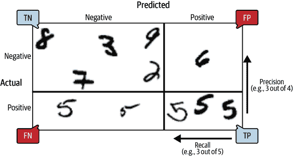
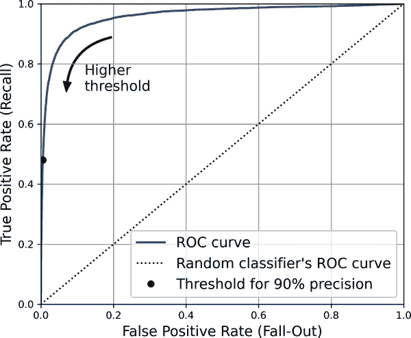
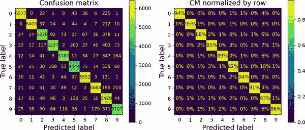

# 第三章：分类

在第一章中，我提到最常见的监督学习任务是回归（预测值）和分类（预测类）。在第二章中，我们探讨了一个回归任务，使用各种算法（如线性回归、决策树和随机森林）来预测房屋价值（这将在后面的章节中进一步详细解释）。现在我们将把注意力转向分类系统。

# MNIST

在本章中，我们将使用 MNIST 数据集，这是由美国人口普查局的高中学生和员工手写的 70,000 张小数字图像集。每个图像都带有它代表的数字标签。这个数据集已经被研究了很多次，通常被称为机器学习的“hello world”：每当人们提出一个新的分类算法时，他们都很好奇它在 MNIST 上的表现如何，任何学习机器学习的人迟早都会处理这个数据集。

Scikit-Learn 提供许多辅助函数来下载流行的数据集。MNIST 就是其中之一。以下代码从 OpenML.org 获取 MNIST 数据集：¹

```py
from sklearn.datasets import fetch_openml

mnist = fetch_openml('mnist_784', as_frame=False)
```

`sklearn.datasets`包主要包含三种类型的函数：`fetch_*`函数，如`fetch_openml()`用于下载真实数据集，`load_*`函数用于加载与 Scikit-Learn 捆绑的小型玩具数据集（因此不需要通过互联网下载），以及`make_*`函数用于生成虚假数据集，对测试很有用。生成的数据集通常作为包含输入数据和目标的`(X, y)`元组返回，都作为 NumPy 数组。其他数据集作为`sklearn.utils.Bunch`对象返回，这些对象是字典，其条目也可以作为属性访问。它们通常包含以下条目：

`"DESCR"`

数据集描述

“数据”

输入数据，通常作为 2D NumPy 数组

“目标”

标签，通常作为 1D NumPy 数组

`fetch_openml()`函数有点不同，因为默认情况下它将输入返回为 Pandas DataFrame，将标签返回为 Pandas Series（除非数据集是稀疏的）。但是 MNIST 数据集包含图像，而 DataFrame 并不理想，因此最好设置`as_frame=False`以将数据作为 NumPy 数组获取。让我们看看这些数组：

```py
>>> X, y = mnist.data, mnist.target
>>> X
array([[0., 0., 0., ..., 0., 0., 0.],
 [0., 0., 0., ..., 0., 0., 0.],
 [0., 0., 0., ..., 0., 0., 0.],
 ...,
 [0., 0., 0., ..., 0., 0., 0.],
 [0., 0., 0., ..., 0., 0., 0.],
 [0., 0., 0., ..., 0., 0., 0.]])
>>> X.shape
(70000, 784)
>>> y
array(['5', '0', '4', ..., '4', '5', '6'], dtype=object)
>>> y.shape
(70000,)
```

共有 70,000 张图像，每张图像有 784 个特征。这是因为每个图像是 28×28 像素，每个特征只是表示一个像素的强度，从 0（白色）到 255（黑色）。让我们看一下数据集中的一个数字（图 3-1）。我们只需要获取一个实例的特征向量，将其重塑为 28×28 数组，并使用 Matplotlib 的`imshow()`函数显示它。我们使用`cmap="binary"`来获取一个灰度色图，其中 0 是白色，255 是黑色：

```py
import matplotlib.pyplot as plt

def plot_digit(image_data):
    image = image_data.reshape(28, 28)
    plt.imshow(image, cmap="binary")
    plt.axis("off")

some_digit = X[0]
plot_digit(some_digit)
plt.show()
```


###### 图 3-1。MNIST 图像示例

这看起来像一个 5，事实上标签告诉我们是这样的：

```py
>>> y[0]
'5'
```

为了让您感受分类任务的复杂性，图 3-2 显示了 MNIST 数据集中的更多图像。

但是！在仔细检查数据之前，您应该始终创建一个测试集并将其放在一边。`fetch_openml()`返回的 MNIST 数据集实际上已经分为训练集（前 60,000 张图像）和测试集（最后 10,000 张图像）：²

```py
X_train, X_test, y_train, y_test = X[:60000], X[60000:], y[:60000], y[60000:]
```

训练集已经为我们洗牌，这很好，因为这保证了所有交叉验证折叠将是相似的（我们不希望一个折叠缺少一些数字）。此外，一些学习算法对训练实例的顺序敏感，如果它们连续获得许多相似实例，则表现会很差。洗牌数据集确保这种情况不会发生。³


###### 图 3-2。来自 MNIST 数据集的数字

# 训练二元分类器

现在，让我们简化问题，只尝试识别一个数字，例如数字 5。这个“5 检测器”将是一个*二元分类器*的示例，能够区分只有两个类别的 5 和非 5。首先，我们将为这个分类任务创建目标向量：

```py
y_train_5 = (y_train == '5')  # True for all 5s, False for all other digits
y_test_5 = (y_test == '5')
```

现在让我们选择一个分类器并对其进行训练。一个很好的开始地方是使用*随机梯度下降*（SGD，或随机 GD）分类器，使用 Scikit-Learn 的`SGDClassifier`类。这个分类器能够高效处理非常大的数据集。部分原因是因为 SGD 独立处理训练实例，一次一个，这也使得 SGD 非常适合在线学习，稍后您将看到。让我们创建一个`SGDClassifier`并在整个训练集上对其进行训练：

```py
from sklearn.linear_model import SGDClassifier

sgd_clf = SGDClassifier(random_state=42)
sgd_clf.fit(X_train, y_train_5)
```

现在我们可以使用它来检测数字 5 的图像：

```py
>>> sgd_clf.predict([some_digit])
array([ True])
```

分类器猜测这幅图像代表数字 5（`True`）。在这种特殊情况下，看起来它猜对了！现在，让我们评估这个模型的性能。

# 性能指标

评估分类器通常比评估回归器要困难得多，因此我们将在本章的大部分时间中讨论这个主题。有许多性能指标可用，所以抓杯咖啡，准备学习一堆新概念和首字母缩略词！

## 使用交叉验证测量准确率

评估模型的一个好方法是使用交叉验证，就像您在第二章中所做的那样。让我们使用`cross_val_score()`函数来评估我们的`SGDClassifier`模型，使用三折交叉验证。请记住，*k*-fold 交叉验证意味着将训练集分成*k*折（在本例中为三折），然后训练模型*k*次，每次保留一个不同的折叠用于评估（参见第二章）：

```py
>>> from sklearn.model_selection import cross_val_score
>>> cross_val_score(sgd_clf, X_train, y_train_5, cv=3, scoring="accuracy")
array([0.95035, 0.96035, 0.9604 ])
```

哇！在所有交叉验证折叠中超过 95％的准确率（正确预测的比例）？看起来很惊人，不是吗？好吧，在你太兴奋之前，让我们看一个只将每个图像分类为最频繁类别的虚拟分类器，这种情况下是负类别（即*非* 5）：

```py
from sklearn.dummy import DummyClassifier

dummy_clf = DummyClassifier()
dummy_clf.fit(X_train, y_train_5)
print(any(dummy_clf.predict(X_train)))  # prints False: no 5s detected
```

您能猜到这个模型的准确率吗？让我们找出来：

```py
>>> cross_val_score(dummy_clf, X_train, y_train_5, cv=3, scoring="accuracy")
array([0.90965, 0.90965, 0.90965])
```

没错，它的准确率超过 90％！这仅仅是因为大约 10％的图像是 5，所以如果您总是猜测一幅图像*不*是 5，您将有 90％的准确率。胜过诺斯特拉达姆。

这说明为什么准确率通常不是分类器的首选性能指标，特别是当您处理*倾斜数据集*（即某些类别比其他类别更频繁时）。评估分类器性能的一个更好方法是查看*混淆矩阵*（CM）。

## 混淆矩阵

混淆矩阵的一般思想是计算类 A 的实例被分类为类 B 的次数，对于所有 A/B 对。例如，要知道分类器将 8 的图像误判为 0 的次数，您将查看混淆矩阵的第 8 行，第 0 列。

计算混淆矩阵，首先需要一组预测结果，以便与实际目标进行比较。您可以对测试集进行预测，但最好现在保持不变（记住，您只想在项目的最后阶段使用测试集，一旦您准备启动分类器）。相反，您可以使用`cross_val_predict()`函数：

```py
from sklearn.model_selection import cross_val_predict

y_train_pred = cross_val_predict(sgd_clf, X_train, y_train_5, cv=3)
```

就像`cross_val_score()`函数一样，`cross_val_predict()`执行*k*-fold 交叉验证，但不返回评估分数，而是返回在每个测试折叠上做出的预测。这意味着您可以获得训练集中每个实例的干净预测（“干净”是指“样本外”：模型对训练期间从未见过的数据进行预测）。

现在您已经准备好使用`confusion_matrix()`函数获取混淆矩阵。只需将目标类（`y_train_5`）和预测类（`y_train_pred`）传递给它：

```py
>>> from sklearn.metrics import confusion_matrix
>>> cm = confusion_matrix(y_train_5, y_train_pred)
>>> cm
array([[53892,   687],
 [ 1891,  3530]])
```

混淆矩阵中的每一行代表一个*实际类别*，而每一列代表一个*预测类别*。该矩阵的第一行考虑了非 5 的图像（*负类*）：其中 53,892 个被正确分类为非 5（称为*真负例*），而剩下的 687 个被错误分类为 5（*假正例*，也称为*类型 I 错误*）。第二行考虑了 5 的图像（*正类*）：其中 1,891 个被错误分类为非 5（*假阴性*，也称为*类型 II 错误*），而剩下的 3,530 个被正确分类为 5（*真正例*）。一个完美的分类器只会有真正例和真负例，因此其混淆矩阵只会在其主对角线上有非零值（从左上到右下）：

```py
>>> y_train_perfect_predictions = y_train_5  # pretend we reached perfection
>>> confusion_matrix(y_train_5, y_train_perfect_predictions)
array([[54579,     0],
 [    0,  5421]])
```

混淆矩阵提供了很多信息，但有时您可能更喜欢一个更简洁的指标。一个有趣的指标是正预测的准确率；这被称为分类器的*精度*（方程 3-1）。

##### 方程 3-1。精度

<math display="block"><mrow><mtext>精度</mtext> <mo>=</mo> <mfrac><mrow><mi>T</mi><mi>P</mi></mrow> <mrow><mi>T</mi><mi>P</mi><mo>+</mo><mi>F</mi><mi>P</mi></mrow></mfrac></mrow></math>

*TP*是真正例的数量，*FP*是假正例的数量。

实现完美精度的一个微不足道的方法是创建一个分类器，总是做出负预测，除了在它最有信心的实例上做出一个单一的正预测。如果这一个预测是正确的，那么分类器的精度就是 100%（精度=1/1=100%）。显然，这样的分类器不会很有用，因为它会忽略除了一个正实例之外的所有实例。因此，精度通常与另一个指标一起使用，该指标称为*召回率*，也称为*敏感度*或*真正例率*（TPR）：这是分类器正确检测到的正实例的比率（方程 3-2）。

##### 方程 3-2。回想一下

<math display="block"><mrow><mtext>召回率</mtext> <mo>=</mo> <mfrac><mrow><mi>T</mi><mi>P</mi></mrow> <mrow><mi>T</mi><mi>P</mi><mo>+</mo><mi>F</mi><mi>N</mi></mrow></mfrac></mrow></math>

*FN*，当然，是假阴性的数量。

如果您对混淆矩阵感到困惑，图 3-3 可能会有所帮助。



###### 图 3-3。一个说明混淆矩阵的示例，显示真负例（左上）、假正例（右上）、假阴性（左下）和真正例（右下）

## 精度和召回率

Scikit-Learn 提供了几个函数来计算分类器的指标，包括精度和召回率：

```py
>>> from sklearn.metrics import precision_score, recall_score
>>> precision_score(y_train_5, y_train_pred)  # == 3530 / (687 + 3530)
0.8370879772350012
>>> recall_score(y_train_5, y_train_pred)  # == 3530 / (1891 + 3530)
0.6511713705958311
```

现在我们的 5 检测器看起来并不像我们在查看其准确性时那么出色。当它声称一幅图像代表 5 时，它只有 83.7%的时间是正确的。此外，它只能检测到 65.1%的 5。

通常方便将精度和召回率结合成一个称为*F[1]分数*的单一指标，特别是当您需要一个单一指标来比较两个分类器时。 F[1]分数是精度和召回率的*调和平均*（方程 3-3）。而普通平均值对所有值都一视同仁，调和平均值更加重视低值。因此，只有当召回率和精度都很高时，分类器才会获得高的 F[1]分数。

##### 方程 3-3。F[1]分数

<math display="block"><mrow><msub><mi mathvariant="italic">F</mi> <mn>1</mn></msub> <mo>=</mo> <mfrac><mn>2</mn> <mrow><mfrac><mn>1</mn> <mtext>精度</mtext></mfrac><mo>+</mo><mfrac><mn>1</mn> <mtext>召回率</mtext></mfrac></mrow></mfrac> <mo>=</mo> <mn>2</mn> <mo>×</mo> <mfrac><mrow><mtext>精度</mtext><mo>×</mo><mtext>召回率</mtext></mrow> <mrow><mtext>精度</mtext><mo>+</mo><mtext>召回率</mtext></mrow></mfrac> <mo>=</mo> <mfrac><mrow><mi>T</mi><mi>P</mi></mrow> <mrow><mi>T</mi><mi>P</mi><mo>+</mo><mfrac><mrow><mi>F</mi><mi>N</mi><mo>+</mo><mi>F</mi><mi>P</mi></mrow> <mn>2</mn></mfrac></mrow></mfrac></mrow></math>

要计算 F[1]分数，只需调用`f1_score()`函数：

```py
>>> from sklearn.metrics import f1_score
>>> f1_score(y_train_5, y_train_pred)
0.7325171197343846
```

F[1]分数偏向于具有类似精度和召回率的分类器。这并不总是你想要的：在某些情境下，你更关心精度，而在其他情境下，你真的很在意召回率。例如，如果你训练一个用于检测适合儿童观看的视频的分类器，你可能更喜欢一个拒绝许多好视频（低召回率）但仅保留安全视频（高精度）的分类器，而不是一个召回率更高但让一些非常糟糕的视频出现在你的产品中的分类器（在这种情况下，你甚至可能想添加一个人工流水线来检查分类器的视频选择）。另一方面，假设你训练一个用于在监控图像中检测扒手的分类器：如果你的分类器只有 30%的精度，只要召回率达到 99%就可以了（当然，保安人员会收到一些错误警报，但几乎所有扒手都会被抓住）。

不幸的是，你不能两全其美：提高精度会降低召回率，反之亦然。这被称为*精度/召回率权衡*。

## 精度/召回率权衡

为了理解这种权衡，让我们看看`SGDClassifier`是如何做出分类决策的。对于每个实例，它根据*决策函数*计算得分。如果该得分大于阈值，则将实例分配给正类；否则将其分配给负类。图 3-4 显示了一些数字，从最低得分的左侧到最高得分的右侧。假设*决策阈值*位于中间箭头处（两个 5 之间）：你会发现在该阈值右侧有 4 个真正例（实际为 5），以及 1 个假正例（实际上是 6）。因此，使用该阈值，精度为 80%（5 个中的 4 个）。但在 6 个实际为 5 的情况下，分类器只检测到 4 个，因此召回率为 67%（6 个中的 4 个）。如果提高阈值（将其移动到右侧的箭头处），假正例（6）变为真负例，从而增加精度（在这种情况下最高可达 100%），但一个真正例变为假负例，将召回率降低到 50%。相反，降低阈值会增加召回率并降低精度。


###### 图 3-4。精度/召回率权衡：图像按其分类器得分排名，高于所选决策阈值的图像被视为正例；阈值越高，召回率越低，但（一般而言）精度越高

Scikit-Learn 不允许直接设置阈值，但它确实让您访问它用于做出预测的决策得分。您可以调用分类器的`decision_function()`方法，而不是调用`predict()`方法，该方法返回每个实例的得分，然后根据这些得分使用任何阈值进行预测：

```py
>>> y_scores = sgd_clf.decision_function([some_digit])
>>> y_scores
array([2164.22030239])
>>> threshold = 0
>>> y_some_digit_pred = (y_scores > threshold)
array([ True])
```

`SGDClassifier`使用阈值等于 0，因此前面的代码返回与`predict()`方法相同的结果（即`True`）。让我们提高阈值：

```py
>>> threshold = 3000
>>> y_some_digit_pred = (y_scores > threshold)
>>> y_some_digit_pred
array([False])
```

这证实了提高阈值会降低召回率。图像实际上代表一个 5，当阈值为 0 时分类器检测到它，但当阈值增加到 3,000 时却错过了它。

如何决定使用哪个阈值？首先，使用`cross_val_predict()`函数获取训练集中所有实例的分数，但是这次指定要返回决策分数而不是预测：

```py
y_scores = cross_val_predict(sgd_clf, X_train, y_train_5, cv=3,
                             method="decision_function")
```

使用这些分数，使用`precision_recall_curve()`函数计算所有可能阈值的精度和召回率（该函数添加最后一个精度为 0 和最后一个召回率为 1，对应于无限阈值）：

```py
from sklearn.metrics import precision_recall_curve

precisions, recalls, thresholds = precision_recall_curve(y_train_5, y_scores)
```

最后，使用 Matplotlib 绘制精度和召回率作为阈值值的函数（图 3-5）。让我们展示我们选择的 3,000 的阈值：

```py
plt.plot(thresholds, precisions[:-1], "b--", label="Precision", linewidth=2)
plt.plot(thresholds, recalls[:-1], "g-", label="Recall", linewidth=2)
plt.vlines(threshold, 0, 1.0, "k", "dotted", label="threshold")
[...]  # beautify the figure: add grid, legend, axis, labels, and circles
plt.show()
```


###### 图 3-5. 精度和召回率与决策阈值

###### 注意

你可能会想知道为什么图 3-5 中的精度曲线比召回率曲线更加崎岖。原因是当你提高阈值时，精度有时会下降（尽管通常会上升）。要理解原因，请回顾图 3-4，注意当你从中心阈值开始，将其向右移动一个数字时会发生什么：精度从 4/5（80%）下降到 3/4（75%）。另一方面，当增加阈值时，召回率只能下降，这解释了为什么其曲线看起来平滑。

在这个阈值下，精度接近 90%，召回率约为 50%。选择一个良好的精度/召回率折衷的另一种方法是直接绘制精度与召回率的图表，如图 3-6 所示（显示相同的阈值）：

```py
plt.plot(recalls, precisions, linewidth=2, label="Precision/Recall curve")
[...]  # beautify the figure: add labels, grid, legend, arrow, and text
plt.show()
```


###### 图 3-6. 精度与召回率

你可以看到精度在约 80%的召回率处开始急剧下降。你可能希望在该下降之前选择一个精度/召回率折衷，例如在约 60%的召回率处。但是，选择取决于你的项目。

假设你决定追求 90%的精度。你可以使用第一个图表找到需要使用的阈值，但这不太精确。或者，你可以搜索给出至少 90%精度的最低阈值。为此，你可以使用 NumPy 数组的`argmax()`方法。这将返回最大值的第一个索引，这在这种情况下意味着第一个`True`值：

```py
>>> idx_for_90_precision = (precisions >= 0.90).argmax()
>>> threshold_for_90_precision = thresholds[idx_for_90_precision]
>>> threshold_for_90_precision
3370.0194991439557
```

要进行预测（目前只是在训练集上），而不是调用分类器的`predict()`方法，你可以运行这段代码：

```py
y_train_pred_90 = (y_scores >= threshold_for_90_precision)
```

让我们检查这些预测的精度和召回率：

```py
>>> precision_score(y_train_5, y_train_pred_90)
0.9000345901072293
>>> recall_at_90_precision = recall_score(y_train_5, y_train_pred_90)
>>> recall_at_90_precision
0.4799852425751706
```

太棒了，你有一个 90%的精度分类器！正如你所看到的，几乎可以轻松地创建一个任意精度的分类器：只需设置足够高的阈值，就可以了。但是等等，不要那么快——如果召回率太低，高精度的分类器就不太有用！对于许多应用程序来说，48%的召回率根本不好。

###### 提示

如果有人说：“让我们达到 99%的精度”，你应该问：“召回率是多少？”

## ROC 曲线

*接收者操作特征*（ROC）曲线是与二元分类器一起使用的另一个常见工具。它与精度/召回率曲线非常相似，但是 ROC 曲线不是绘制精度与召回率，而是绘制*真正例率*（召回率的另一个名称）与*假正例率*（FPR）。FPR（也称为*误报率*）是被错误分类为正例的负实例的比率。它等于 1 减去*真负例率*（TNR），即被正确分类为负例的负实例的比率。TNR 也称为*特异性*。因此，ROC 曲线绘制*灵敏度*（召回率）与 1-*特异性*。

要绘制 ROC 曲线，首先使用`roc_curve()`函数计算各种阈值的 TPR 和 FPR：

```py
from sklearn.metrics import roc_curve

fpr, tpr, thresholds = roc_curve(y_train_5, y_scores)
```

然后，您可以使用 Matplotlib 绘制 FPR 与 TPR。以下代码生成图 3-7 中的图。要找到对应于 90%精确度的点，我们需要查找所需阈值的索引。由于在这种情况下，阈值按降序列出，因此我们在第一行上使用`<=`而不是`>=`：

```py
idx_for_threshold_at_90 = (thresholds <= threshold_for_90_precision).argmax()
tpr_90, fpr_90 = tpr[idx_for_threshold_at_90], fpr[idx_for_threshold_at_90]

plt.plot(fpr, tpr, linewidth=2, label="ROC curve")
plt.plot([0, 1], [0, 1], 'k:', label="Random classifier's ROC curve")
plt.plot([fpr_90], [tpr_90], "ko", label="Threshold for 90% precision")
[...]  # beautify the figure: add labels, grid, legend, arrow, and text
plt.show()
```



###### 图 3-7。ROC 曲线绘制了所有可能阈值的假阳性率与真阳性率之间的关系；黑色圆圈突出显示了选择的比率（在 90%精确度和 48%召回率处）

再次存在权衡：召回率（TPR）越高，分类器产生的假阳性（FPR）就越多。虚线代表纯随机分类器的 ROC 曲线；一个好的分类器尽可能远离该线（朝向左上角）。

比较分类器的一种方法是测量*曲线下面积*（AUC）。完美的分类器的 ROC AUC 等于 1，而纯随机分类器的 ROC AUC 等于 0.5。Scikit-Learn 提供了一个估计 ROC AUC 的函数：

```py
>>> from sklearn.metrics import roc_auc_score
>>> roc_auc_score(y_train_5, y_scores)
0.9604938554008616
```

###### 提示

由于 ROC 曲线与精确率/召回率（PR）曲线非常相似，您可能想知道如何决定使用哪个。作为经验法则，当正类别很少或您更关心假阳性而不是假阴性时，应优先选择 PR 曲线。否则，请使用 ROC 曲线。例如，查看先前的 ROC 曲线（以及 ROC AUC 分数），您可能会认为分类器非常好。但这主要是因为与负例（非 5）相比，正例（5）很少。相比之下，PR 曲线清楚地表明分类器有改进的空间：曲线实际上可以更接近右上角（再次参见图 3-6）。

现在让我们创建一个`RandomForestClassifier`，我们可以将其 PR 曲线和 F[1]分数与`SGDClassifier`的进行比较：

```py
from sklearn.ensemble import RandomForestClassifier

forest_clf = RandomForestClassifier(random_state=42)
```

`precision_recall_curve()`函数期望每个实例的标签和分数，因此我们需要训练随机森林分类器并使其为每个实例分配一个分数。但是，由于`RandomForestClassifier`类的工作方式（我们将在第七章中介绍），它没有`decision_function()`方法。幸运的是，它有一个`predict_proba()`方法，为每个实例返回类概率，并且我们可以将正类别的概率作为分数，因此它将正常工作。⁴我们可以调用`cross_val_predict()`函数，使用交叉验证训练`RandomForestClassifier`，并使其为每个图像预测类概率，如下所示：

```py
y_probas_forest = cross_val_predict(forest_clf, X_train, y_train_5, cv=3,
                                    method="predict_proba")
```

让我们看看训练集中前两个图像的类概率：

```py
>>> y_probas_forest[:2]
array([[0.11, 0.89],
 [0.99, 0.01]])
```

模型预测第一幅图像为正面的概率为 89%，并且预测第二幅图像为负面的概率为 99%。由于每幅图像要么是正面要么是负面，因此每行中的概率总和为 100%。

###### 警告

这些是*估计*概率，而不是实际概率。例如，如果您查看模型将其分类为正面的所有图像，其估计概率在 50%到 60%之间，大约 94%实际上是正面的。因此，在这种情况下，模型的估计概率要低得多，但模型也可能过于自信。`sklearn.calibration`包含工具，可以校准估计的概率，使其更接近实际概率。有关更多详细信息，请参阅[本章笔记本](https://homl.info/colab3)中的额外材料部分。

第二列包含正类别的估计概率，因此让我们将它们传递给`precision_recall_curve()`函数：

```py
y_scores_forest = y_probas_forest[:, 1]
precisions_forest, recalls_forest, thresholds_forest = precision_recall_curve(
    y_train_5, y_scores_forest)
```

现在我们准备绘制 PR 曲线。为了查看它们的比较，也有必要绘制第一个 PR 曲线（图 3-8）： 

```py
plt.plot(recalls_forest, precisions_forest, "b-", linewidth=2,
         label="Random Forest")
plt.plot(recalls, precisions, "--", linewidth=2, label="SGD")
[...]  # beautify the figure: add labels, grid, and legend
plt.show()
```


###### 图 3-8。比较 PR 曲线：随机森林分类器优于 SGD 分类器，因为其 PR 曲线更接近右上角，并且具有更大的 AUC

正如您在图 3-8 中所看到的，`RandomForestClassifier`的 PR 曲线看起来比`SGDClassifier`的要好得多：它更接近右上角。它的 F[1]分数和 ROC AUC 分数也显著更好：

```py
>>> y_train_pred_forest = y_probas_forest[:, 1] >= 0.5  # positive proba ≥ 50%
>>> f1_score(y_train_5, y_pred_forest)
0.9242275142688446
>>> roc_auc_score(y_train_5, y_scores_forest)
0.9983436731328145
```

尝试测量精确度和召回率得分：您应该会发现大约 99.1%的精确度和 86.6%的召回率。还不错！

您现在知道如何训练二元分类器，选择适合您任务的适当度量标准，使用交叉验证评估您的分类器，选择适合您需求的精确度/召回率折衷，并使用多种指标和曲线比较各种模型。您已经准备好尝试检测不仅仅是数字 5 了。

# 多类分类

而二元分类器区分两个类别，*多类分类器*（也称为*多项分类器*）可以区分两个以上的类别。

一些 Scikit-Learn 分类器（例如`LogisticRegression`、`RandomForestClassifier`和`GaussianNB`）能够本地处理多个类别。其他严格的二元分类器（例如`SGDClassifier`和`SVC`）。然而，有各种策略可用于使用多个二元分类器执行多类分类。

创建一个能够将数字图像分类为 10 个类别（从 0 到 9）的系统的一种方法是训练 10 个二元分类器，每个数字一个（一个 0 检测器，一个 1 检测器，一个 2 检测器，依此类推）。然后，当您想要对一幅图像进行分类时，您会从每个分类器中获取该图像的决策分数，并选择输出最高分数的类别。这被称为*一对剩余*（OvR）策略，有时也称为*一对所有*（OvA）。

另一种策略是为每对数字训练一个二元分类器：一个用于区分 0 和 1，另一个用于区分 0 和 2，另一个用于 1 和 2，依此类推。这被称为*一对一*（OvO）策略。如果有*N*个类别，您需要训练*N*×（*N* - 1）/ 2 个分类器。对于 MNIST 问题，这意味着训练 45 个二元分类器！当您想要对一幅图像进行分类时，您必须通过所有 45 个分类器并查看哪个类别赢得了最多的决斗。OvO 的主要优势在于每个分类器只需要在包含它必须区分的两个类别的训练集部分上进行训练。

一些算法（如支持向量机分类器）随着训练集的大小而扩展得很差。对于这些算法，OvO 更受青睐，因为在小训练集上训练许多分类器比在大训练集上训练少数分类器要快。然而，对于大多数二元分类算法，OvR 更受青睐。

Scikit-Learn 会检测到您尝试将二元分类算法用于多类分类任务时，并根据算法自动运行 OvR 或 OvO。让我们尝试使用`sklearn.svm.SVC`类中的支持向量机分类器（参见第五章）。我们只会在前 2,000 幅图像上进行训练，否则会花费很长时间：

```py
from sklearn.svm import SVC

svm_clf = SVC(random_state=42)
svm_clf.fit(X_train[:2000], y_train[:2000])  # y_train, not y_train_5
```

这很容易！我们使用原始目标类别从 0 到 9（`y_train`）来训练`SVC`，而不是使用 5 对剩余目标类别（`y_train_5`）。由于有 10 个类别（即超过 2 个），Scikit-Learn 使用了 OvO 策略并训练了 45 个二元分类器。现在让我们对一幅图像进行预测：

```py
>>> svm_clf.predict([some_digit])
array(['5'], dtype=object)
```

这是正确的！这段代码实际上进行了 45 次预测——每对类别一次——并选择了赢得最多决斗的类别。如果调用`decision_function()`方法，您会看到它为每个实例返回 10 个分数：每个类别一个。每个类别得分等于赢得的决斗数加上或减去一个小调整（最大±0.33）以打破平局，基于分类器的分数：

```py
>>> some_digit_scores = svm_clf.decision_function([some_digit])
>>> some_digit_scores.round(2)
array([[ 3.79,  0.73,  6.06,  8.3 , -0.29,  9.3 ,  1.75,  2.77,  7.21,
 4.82]])
```

最高分是 9.3，确实对应于类别 5：

```py
>>> class_id = some_digit_scores.argmax()
>>> class_id
5
```

当分类器训练完成时，它会将目标类别列表存储在其`classes_`属性中，按值排序。在 MNIST 的情况下，`classes_`数组中每个类别的索引恰好与类别本身匹配（例如，索引为 5 的类在数组中是类`'5'`），但通常您不会那么幸运；您需要像这样查找类标签：

```py
>>> svm_clf.classes_
array(['0', '1', '2', '3', '4', '5', '6', '7', '8', '9'], dtype=object)
>>> svm_clf.classes_[class_id]
'5'
```

如果您想强制 Scikit-Learn 使用一对一或一对多，您可以使用`OneVsOneClassifier`或`OneVsRestClassifier`类。只需创建一个实例并将分类器传递给其构造函数（甚至不必是二元分类器）。例如，此代码使用 OvR 策略基于`SVC`创建一个多类分类器：

```py
from sklearn.multiclass import OneVsRestClassifier

ovr_clf = OneVsRestClassifier(SVC(random_state=42))
ovr_clf.fit(X_train[:2000], y_train[:2000])
```

让我们进行预测，并检查训练过的分类器数量：

```py
>>> ovr_clf.predict([some_digit])
array(['5'], dtype='<U1')
>>> len(ovr_clf.estimators_)
10
```

在多类数据集上训练`SGDClassifier`并使用它进行预测同样简单：

```py
>>> sgd_clf = SGDClassifier(random_state=42)
>>> sgd_clf.fit(X_train, y_train)
>>> sgd_clf.predict([some_digit])
array(['3'], dtype='<U1')
```

哎呀，那是错误的。预测错误确实会发生！这次 Scikit-Learn 在幕后使用了 OvR 策略：由于有 10 个类别，它训练了 10 个二元分类器。`decision_function()`方法现在返回每个类别的一个值。让我们看看 SGD 分类器为每个类别分配的分数：

```py
>>> sgd_clf.decision_function([some_digit]).round()
array([[-31893., -34420.,  -9531.,   1824., -22320.,  -1386., -26189.,
 -16148.,  -4604., -12051.]])
```

您可以看到分类器对其预测并不是很自信：几乎所有分数都非常负面，而类别 3 的分数为+1,824，类别 5 也不远处为-1,386。当然，您会希望对这个分类器进行多个图像的评估。由于每个类别中的图像数量大致相同，准确度指标是可以接受的。通常情况下，您可以使用`cross_val_score()`函数来评估模型：

```py
>>> cross_val_score(sgd_clf, X_train, y_train, cv=3, scoring="accuracy")
array([0.87365, 0.85835, 0.8689 ])
```

它在所有测试折叠上都超过了 85.8%。如果使用随机分类器，您将获得 10%的准确率，因此这并不是一个很差的分数，但您仍然可以做得更好。简单地缩放输入（如第二章中讨论的）可以将准确率提高到 89.1%以上：

```py
>>> from sklearn.preprocessing import StandardScaler
>>> scaler = StandardScaler()
>>> X_train_scaled = scaler.fit_transform(X_train.astype("float64"))
>>> cross_val_score(sgd_clf, X_train_scaled, y_train, cv=3, scoring="accuracy")
array([0.8983, 0.891 , 0.9018])
```

# 错误分析

如果这是一个真实的项目，您现在将按照机器学习项目清单中的步骤进行操作（请参阅附录 A）。您将探索数据准备选项，尝试多个模型，列出最佳模型，使用`GridSearchCV`微调其超参数，并尽可能自动化。在这里，我们假设您已经找到了一个有希望的模型，并且想要找到改进它的方法。其中一种方法是分析它所犯的错误类型。

首先，看一下混淆矩阵。为此，您首先需要使用`cross_val_predict()`函数进行预测；然后您可以将标签和预测传递给`confusion_matrix()`函数，就像您之前所做的那样。然而，由于现在有 10 个类别而不是 2 个，混淆矩阵将包含相当多的数字，可能很难阅读。

彩色混淆矩阵图表更容易分析。要绘制这样的图表，请使用`ConfusionMatrixDisplay.from_predictions()`函数，如下所示：

```py
from sklearn.metrics import ConfusionMatrixDisplay

y_train_pred = cross_val_predict(sgd_clf, X_train_scaled, y_train, cv=3)
ConfusionMatrixDisplay.from_predictions(y_train, y_train_pred)
plt.show()
```

这将生成图 3-9 中的左侧图。这个混淆矩阵看起来相当不错：大多数图像都在主对角线上，这意味着它们被正确分类了。请注意，对角线上的第 5 行和第 5 列的单元格看起来比其他数字稍暗。这可能是因为模型在 5 上犯了更多错误，或者因为数据集中的 5 比其他数字少。这就是通过将每个值除以相应（真实）类别中图像的总数（即除以行的总和）来对混淆矩阵进行归一化的重要性。这可以通过简单地设置`normalize="true"`来完成。我们还可以指定`values_format=".0%"`参数以显示没有小数的百分比。以下代码生成图 3-9 中右侧的图表：

```py
ConfusionMatrixDisplay.from_predictions(y_train, y_train_pred,
                                        normalize="true", values_format=".0%")
plt.show()
```

现在我们可以很容易地看到，只有 82%的 5 的图像被正确分类。模型在 5 的图像中最常见的错误是将它们错误分类为 8：这发生在所有 5 的 10%中。但只有 2%的 8 被错误分类为 5；混淆矩阵通常不是对称的！如果你仔细观察，你会注意到许多数字被错误分类为 8，但从这个图表中并不立即明显。如果你想让错误更加突出，你可以尝试在正确预测上设置零权重。以下代码就是这样做的，并生成了图 3-10 中左边的图表：

```py
sample_weight = (y_train_pred != y_train)
ConfusionMatrixDisplay.from_predictions(y_train, y_train_pred,
                                        sample_weight=sample_weight,
                                        normalize="true", values_format=".0%")
plt.show()
```



###### 图 3-9。混淆矩阵（左）和相同的通过行归一化的 CM（右）


###### 图 3-10。仅显示错误的混淆矩阵，通过行归一化（左）和通过列归一化（右）

现在你可以更清楚地看到分类器所犯的错误类型。类别 8 的列现在非常亮，这证实了许多图像被错误分类为 8。事实上，这是几乎所有类别中最常见的错误分类。但要注意如何解释这个图表中的百分比：记住我们已经排除了正确的预测。例如，第 7 行第 9 列的 36% *不*意味着 36%的所有 7 的图像被错误分类为 9。它意味着 36%的模型在 7 的图像上犯的*错误*被错误分类为 9。实际上，只有 3%的 7 的图像被错误分类为 9，你可以在右边的图表中看到图 3-9。

也可以通过列而不是通过行对混淆矩阵进行归一化：如果设置`normalize="pred"`，你会得到图 3-10 中右边的图表。例如，你可以看到 56%的错误分类的 7 实际上是 9。

分析混淆矩阵通常可以让你了解如何改进你的分类器。从这些图表中看，你的努力应该花在减少错误的 8 上。例如，你可以尝试收集更多看起来像 8 的（但实际上不是）数字的训练数据，这样分类器就可以学会区分它们和真正的 8。或者你可以设计新的特征来帮助分类器，例如，编写一个算法来计算闭环的数量（例如，8 有两个，6 有一个，5 没有）。或者你可以预处理图像（例如，使用 Scikit-Image、Pillow 或 OpenCV）使一些模式，如闭环，更加突出。

分析单个错误也是了解你的分类器在做什么以及为什么失败的好方法。例如，让我们以混淆矩阵样式绘制 3 和 5 的示例（图 3-11）：

```py
cl_a, cl_b = '3', '5'
X_aa = X_train[(y_train == cl_a) & (y_train_pred == cl_a)]
X_ab = X_train[(y_train == cl_a) & (y_train_pred == cl_b)]
X_ba = X_train[(y_train == cl_b) & (y_train_pred == cl_a)]
X_bb = X_train[(y_train == cl_b) & (y_train_pred == cl_b)]
[...]  # plot all images in X_aa, X_ab, X_ba, X_bb in a confusion matrix style
```


###### 图 3-11。一些 3 和 5 的图像以混淆矩阵的方式组织

正如你所看到的，分类器错误分类的一些数字（即，左下角和右上角的块）写得非常糟糕，即使是人类也会难以分类。然而，大多数错误分类的图像对我们来说似乎是明显的错误。理解分类器为什么犯错可能很困难，但请记住，人类大脑是一个出色的模式识别系统，我们的视觉系统在任何信息到达我们的意识之前都进行了大量复杂的预处理。因此，这个任务看起来简单并不意味着它是简单的。回想一下，我们使用了一个简单的`SGDClassifier`，它只是一个线性模型：它只是为每个像素分配一个类别权重，当它看到一个新的图像时，它只是将加权像素强度相加以获得每个类别的得分。由于 3 和 5 之间只相差几个像素，这个模型很容易混淆它们。

3s 和 5s 之间的主要区别是连接顶线和底部弧线的小线的位置。如果你画一个 3，连接处稍微向左移动，分类器可能会将其分类为 5，反之亦然。换句话说，这个分类器对图像的移动和旋转非常敏感。减少 3/5 混淆的一种方法是预处理图像，确保它们居中且旋转不太多。然而，这可能并不容易，因为它需要预测每个图像的正确旋转。一个更简单的方法是通过增加训练集中略微移动和旋转的变体来增强训练集。这将迫使模型学会更容忍这些变化。这被称为*数据增强*（我们将在第十四章中介绍；也请参见本章末尾的练习 2）。

# 多标签分类

到目前为止，每个实例总是被分配到一个类。但在某些情况下，您可能希望您的分类器为每个实例输出多个类。考虑一个人脸识别分类器：如果它在同一张图片中识别出几个人，它应该做什么？它应该为它识别出的每个人附上一个标签。假设分类器已经训练好了识别三张脸：Alice、Bob 和 Charlie。那么当分类器看到 Alice 和 Charlie 的图片时，它应该输出`[True, False, True]`（意思是“Alice 是，Bob 不是，Charlie 是”）。这样一个输出多个二进制标签的分类系统被称为*多标签分类*系统。

我们暂时不会讨论人脸识别，但让我们看一个更简单的例子，仅供说明目的：

```py
import numpy as np
from sklearn.neighbors import KNeighborsClassifier

y_train_large = (y_train >= '7')
y_train_odd = (y_train.astype('int8') % 2 == 1)
y_multilabel = np.c_[y_train_large, y_train_odd]

knn_clf = KNeighborsClassifier()
knn_clf.fit(X_train, y_multilabel)
```

这段代码创建一个包含每个数字图像两个目标标签的`y_multilabel`数组：第一个指示数字是否大（7、8 或 9），第二个指示数字是否奇数。然后代码创建一个`KNeighborsClassifier`实例，支持多标签分类（并非所有分类器都支持），并使用多目标数组训练这个模型。现在您可以进行预测，并注意到它输出了两个标签：

```py
>>> knn_clf.predict([some_digit])
array([[False,  True]])
```

而且它预测正确了！数字 5 确实不是大的（`False`）且是奇数（`True`）。

有许多方法可以评估多标签分类器，选择正确的度量标准取决于您的项目。一种方法是测量每个单独标签的 F[1]分数（或之前讨论过的任何其他二元分类器度量标准），然后简单地计算平均分数。以下代码计算所有标签的平均 F[1]分数：

```py
>>> y_train_knn_pred = cross_val_predict(knn_clf, X_train, y_multilabel, cv=3)
>>> f1_score(y_multilabel, y_train_knn_pred, average="macro")
0.976410265560605
```

这种方法假设所有标签都同等重要，但这可能并非总是如此。特别是，如果您有比 Bob 或 Charlie 更多的 Alice 图片，您可能希望在 Alice 图片上给分类器的分数更多的权重。一个简单的选择是为每个标签赋予一个权重，等于其*支持*（即具有该目标标签的实例数）。要做到这一点，只需在调用`f1_score()`函数时设置`average="weighted"`。⁠⁵

如果您希望使用不原生支持多标签分类的分类器，比如`SVC`，一种可能的策略是为每个标签训练一个模型。然而，这种策略可能难以捕捉标签之间的依赖关系。例如，一个大数字（7、8 或 9）是奇数的可能性是偶数的两倍，但“奇数”标签的分类器不知道“大”标签的分类器预测了什么。为了解决这个问题，模型可以被组织成一个链：当一个模型做出预测时，它使用输入特征加上链中之前所有模型的预测。

好消息是，Scikit-Learn 有一个名为`ChainClassifier`的类，它就是做这个的！默认情况下，它将使用真实标签进行训练，根据它们在链中的位置为每个模型提供适当的标签。但是，如果设置`cv`超参数，它将使用交叉验证为训练集中的每个实例获取“干净”（样本外）预测，并且这些预测将用于以后在链中训练所有模型。以下是一个示例，展示如何使用交叉验证策略创建和训练`ChainClassifier`。与之前一样，我们将只使用训练集中的前 2,000 幅图像以加快速度：

```py
from sklearn.multioutput import ClassifierChain

chain_clf = ClassifierChain(SVC(), cv=3, random_state=42)
chain_clf.fit(X_train[:2000], y_multilabel[:2000])
```

现在我们可以使用这个`ChainClassifier`进行预测：

```py
>>> chain_clf.predict([some_digit])
array([[0., 1.]])
```

# 多输出分类

我们将在这里讨论的最后一种分类任务类型称为*多输出-多类别分类*（或*多输出分类*）。这是多标签分类的一种泛化，其中每个标签可以是多类别的（即，它可以有两个以上的可能值）。

为了说明这一点，让我们构建一个从图像中去除噪声的系统。它将以嘈杂的数字图像作为输入，然后（希望）输出一个干净的数字图像，表示为像 MNIST 图像一样的像素强度数组。请注意，分类器的输出是多标签的（每个像素一个标签），每个标签可以有多个值（像素强度范围从 0 到 255）。因此，这是一个多输出分类系统的示例。

###### 注意

分类和回归之间的界限有时是模糊的，比如在这个例子中。可以说，预测像素强度更类似于回归而不是分类。此外，多输出系统不仅限于分类任务；您甚至可以拥有一个系统，它为每个实例输出多个标签，包括类标签和值标签。

让我们从使用 NumPy 的`randint()`函数向 MNIST 图像添加噪声来创建训练集和测试集。目标图像将是原始图像：

```py
np.random.seed(42)  # to make this code example reproducible
noise = np.random.randint(0, 100, (len(X_train), 784))
X_train_mod = X_train + noise
noise = np.random.randint(0, 100, (len(X_test), 784))
X_test_mod = X_test + noise
y_train_mod = X_train
y_test_mod = X_test
```

让我们看一下测试集中的第一幅图像（图 3-12）。是的，我们正在窥探测试数据，所以您现在应该皱起眉头。


###### 图 3-12\. 一幅嘈杂的图像（左）和目标干净图像（右）

左边是嘈杂的输入图像，右边是干净的目标图像。现在让我们训练分类器，让它清理这幅图像（图 3-13）：

```py
knn_clf = KNeighborsClassifier()
knn_clf.fit(X_train_mod, y_train_mod)
clean_digit = knn_clf.predict([X_test_mod[0]])
plot_digit(clean_digit)
plt.show()
```


###### 图 3-13\. 清理后的图像

看起来接近目标了！这结束了我们的分类之旅。您现在知道如何为分类任务选择良好的度量标准，选择适当的精确度/召回率折衷，比较分类器，以及更一般地构建各种任务的良好分类系统。在接下来的章节中，您将了解您一直在使用的所有这些机器学习模型实际上是如何工作的。

# 练习

1.  尝试为 MNIST 数据集构建一个分类器，在测试集上实现超过 97%的准确率。提示：`KNeighborsClassifier`对这个任务效果很好；您只需要找到好的超参数值（尝试在`weights`和`n_neighbors`超参数上进行网格搜索）。

1.  编写一个函数，可以将 MNIST 图像向任何方向（左、右、上或下）移动一个像素。然后，对于训练集中的每个图像，创建四个移位副本（每个方向一个）并将它们添加到训练集中。最后，在这个扩展的训练集上训练您最好的模型，并在测试集上测量其准确率。您应该观察到您的模型现在表现得更好了！这种人为扩展训练集的技术称为*数据增强*或*训练集扩展*。

1.  解决泰坦尼克号数据集。一个很好的开始地方是[Kaggle](https://kaggle.com/c/titanic)。或者，您可以从[*https://homl.info/titanic.tgz*](https://homl.info/titanic.tgz)下载数据并解压缩这个 tarball，就像您在第二章中为房屋数据所做的那样。这将给您两个 CSV 文件，*train.csv*和*test.csv*，您可以使用`pandas.read_csv()`加载。目标是训练一个分类器，可以根据其他列预测`Survived`列。

1.  构建一个垃圾邮件分类器（一个更具挑战性的练习）：

    1.  从[Apache SpamAssassin 的公共数据集](https://homl.info/spamassassin)下载垃圾邮件和正常邮件的示例。

    1.  解压数据集并熟悉数据格式。

    1.  将数据分割为训练集和测试集。

    1.  编写一个数据准备流水线，将每封电子邮件转换为特征向量。您的准备流水线应该将一封电子邮件转换为一个（稀疏）向量，指示每个可能单词的存在或不存在。例如，如果所有电子邮件只包含四个单词，“Hello”、“how”、“are”、“you”，那么电子邮件“Hello you Hello Hello you”将被转换为向量[1, 0, 0, 1]（表示[“Hello”存在，“how”不存在，“are”不存在，“you”存在]），或者如果您更喜欢计算每个单词出现的次数，则为[3, 0, 0, 2]。

        您可能希望在准备流水线中添加超参数，以控制是否剥离电子邮件头部，将每封电子邮件转换为小写，删除标点符号，用“URL”替换所有 URL，用“NUMBER”替换所有数字，甚至执行*词干提取*（即修剪单词结尾；有 Python 库可用于执行此操作）。

    1.  最后，尝试几种分类器，看看是否可以构建一个既具有高召回率又具有高精度的垃圾邮件分类器。

这些练习的解决方案可以在本章笔记本的末尾找到，网址为[*https://homl.info/colab3*](https://homl.info/colab3)。

¹ 默认情况下，Scikit-Learn 会将下载的数据集缓存到名为*scikit_learn_data*的目录中，该目录位于您的主目录中。

² `fetch_openml()`返回的数据集并不总是被洗牌或分割。

³ 在某些情况下，洗牌可能不是一个好主意——例如，如果您正在处理时间序列数据（如股票市场价格或天气状况）。我们将在第十五章中探讨这个问题。

⁴ Scikit-Learn 分类器总是具有`decision_function()`方法或`predict_proba()`方法，有时两者都有。

⁵ Scikit-Learn 提供了一些其他平均选项和多标签分类器指标；更多细节请参阅文档。

⁶ 您可以使用`scipy.ndimage.interpolation`模块中的`shift()`函数。例如，`shift(image, [2, 1], cval=0)`将图像向下移动两个像素，向右移动一个像素。
