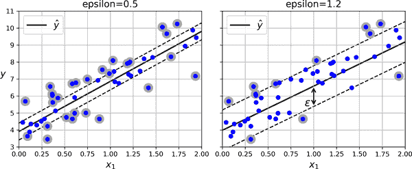

# 第五章. 支持向量机

*支持向量机*（SVM）是一个强大且多功能的机器学习模型，能够执行线性或非线性分类、回归，甚至新颖性检测。SVM 在小到中等大小的非线性数据集（即，数百到数千个实例）上表现出色，尤其适用于分类任务。然而，它们在处理非常大的数据集时并不很好，您将看到。

本章将解释 SVM 的核心概念，如何使用它们以及它们的工作原理。让我们开始吧！

# 线性 SVM 分类

支持向量机背后的基本思想最好通过一些可视化来解释。图 5-1 展示了在第四章末尾介绍的鸢尾花数据集的一部分。这两个类可以很容易地用一条直线分开（它们是*线性可分*的）。左图显示了三种可能线性分类器的决策边界。决策边界由虚线表示的模型非常糟糕，甚至不能正确地分开这两个类。其他两个模型在这个训练集上表现完美，但它们的决策边界与实例非常接近，因此这些模型在新实例上可能表现不佳。相比之下，右图中的实线代表 SVM 分类器的决策边界；这条线不仅分开了两个类，而且尽可能远离最接近的训练实例。您可以将 SVM 分类器视为在类之间拟合最宽可能的街道（由平行虚线表示）。这被称为*大边距分类*。


###### 图 5-1. 大边距分类

请注意，添加更多训练实例“离开街道”不会对决策边界产生任何影响：它完全由位于街道边缘的实例决定（或“支持”）。这些实例被称为*支持向量*（它们在图 5-1 中被圈出）。

###### 警告

支持向量机对特征的尺度敏感，如您可以在图 5-2 中看到。在左图中，垂直尺度远大于水平尺度，因此最宽可能的街道接近水平。经过特征缩放（例如，使用 Scikit-Learn 的`StandardScaler`），右图中的决策边界看起来好多了。


###### 图 5-2. 特征尺度的敏感性

## 软边距分类

如果我们严格要求所有实例必须远离街道并位于正确的一侧，这被称为*硬边距分类*。硬边距分类存在两个主要问题。首先，它仅在数据线性可分时有效。其次，它对异常值敏感。图 5-3 展示了鸢尾花数据集中仅有一个额外异常值的情况：在左侧，找到硬边距是不可能的；在右侧，决策边界与图 5-1 中看到的没有异常值的情决策边界非常不同，模型可能不会很好地泛化。


###### 图 5-3. 硬边距对异常值的敏感性

为了避免这些问题，我们需要使用一个更灵活的模型。目标是在尽可能保持街道尽可能宽阔和限制*边距违规*（即，最终位于街道中间甚至错误一侧的实例）之间找到一个良好的平衡。这被称为*软边距分类*。

在使用 Scikit-Learn 创建 SVM 模型时，您可以指定几个超参数，包括正则化超参数`C`。如果将其设置为较低的值，则会得到左侧图 5-4 中的模型。如果设置为较高的值，则会得到右侧的模型。正如您所看到的，减少`C`会使街道变宽，但也会导致更多的间隔违规。换句话说，减少`C`会导致更多的实例支持街道，因此过拟合的风险较小。但是，如果减少得太多，那么模型最终会欠拟合，就像这里的情况一样：`C=100`的模型看起来比`C=1`的模型更容易泛化。


###### 图 5-4\. 大间隔（左）与较少间隔违规（右）

###### 提示

如果您的 SVM 模型过拟合，可以尝试通过减少`C`来对其进行正则化。

以下 Scikit-Learn 代码加载了鸢尾花数据集，并训练了一个线性 SVM 分类器来检测*Iris virginica*花。该流水线首先对特征进行缩放，然后使用`LinearSVC`和`C=1`进行训练：

```py
from sklearn.datasets import load_iris
from sklearn.pipeline import make_pipeline
from sklearn.preprocessing import StandardScaler
from sklearn.svm import LinearSVC

iris = load_iris(as_frame=True)
X = iris.data[["petal length (cm)", "petal width (cm)"]].values
y = (iris.target == 2)  # Iris virginica

svm_clf = make_pipeline(StandardScaler(),
                        LinearSVC(C=1, random_state=42))
svm_clf.fit(X, y)
```

生成的模型在图 5-4 的左侧表示。

然后，像往常一样，您可以使用模型进行预测：

```py
>>> X_new = [[5.5, 1.7], [5.0, 1.5]]
>>> svm_clf.predict(X_new)
array([ True, False])
```

第一个植物被分类为*Iris virginica*，而第二个没有。让我们看看 SVM 用于做出这些预测的分数。这些分数衡量了每个实例与决策边界之间的有符号距离：

```py
>>> svm_clf.decision_function(X_new)
array([ 0.66163411, -0.22036063])
```

与`LogisticRegression`不同，`LinearSVC`没有`predict_proba()`方法来估计类概率。也就是说，如果您使用`SVC`类（稍后讨论）而不是`LinearSVC`，并将其`probability`超参数设置为`True`，那么模型将在训练结束时拟合一个额外的模型，将 SVM 决策函数分数映射到估计概率。在幕后，这需要使用 5 倍交叉验证为训练集中的每个实例生成样本外预测，然后训练一个`LogisticRegression`模型，因此会显著减慢训练速度。之后，`predict_proba()`和`predict_log_proba()`方法将可用。

# 非线性 SVM 分类

尽管线性 SVM 分类器高效且通常表现出色，但许多数据集甚至远非线性可分。处理非线性数据集的一种方法是添加更多特征，例如多项式特征（就像我们在第四章中所做的那样）；在某些情况下，这可能会导致一个线性可分的数据集。考虑图 5-5 中的左侧图：它代表一个只有一个特征*x*[1]的简单数据集。正如您所看到的，这个数据集是线性不可分的。但是，如果添加第二个特征*x*[2] = (*x*[1])²，那么得到的 2D 数据集就是完全线性可分的。


###### 图 5-5\. 添加特征使数据集线性可分

要使用 Scikit-Learn 实现这个想法，您可以创建一个包含`PolynomialFeatures`转换器（在“多项式回归”中讨论）、`StandardScaler`和`LinearSVC`分类器的流水线。让我们在 moons 数据集上测试这个流水线，这是一个用于二元分类的玩具数据集，其中数据点呈两个交错新月形状（参见图 5-6）。您可以使用`make_moons()`函数生成这个数据集：

```py
from sklearn.datasets import make_moons
from sklearn.preprocessing import PolynomialFeatures

X, y = make_moons(n_samples=100, noise=0.15, random_state=42)

polynomial_svm_clf = make_pipeline(
    PolynomialFeatures(degree=3),
    StandardScaler(),
    LinearSVC(C=10, max_iter=10_000, random_state=42)
)
polynomial_svm_clf.fit(X, y)
```


###### 图 5-6\. 使用多项式特征的线性 SVM 分类器

## 多项式核

添加多项式特征很容易实现，并且可以与各种机器学习算法（不仅仅是 SVM）很好地配合。也就是说，在低多项式度数下，这种方法无法处理非常复杂的数据集，而在高多项式度数下，它会创建大量特征，使模型变得过于缓慢。

幸运的是，在使用 SVM 时，你可以应用一种几乎神奇的数学技术，称为*核技巧*（稍后在本章中解释）。核技巧使得可以获得与添加许多多项式特征相同的结果，即使是非常高次的，而无需实际添加它们。这意味着特征数量不会组合爆炸。这个技巧由`SVC`类实现。让我们在 moons 数据集上测试一下：

```py
from sklearn.svm import SVC

poly_kernel_svm_clf = make_pipeline(StandardScaler(),
                                    SVC(kernel="poly", degree=3, coef0=1, C=5))
poly_kernel_svm_clf.fit(X, y)
```

这段代码使用三次多项式核训练了一个 SVM 分类器，左侧在图 5-7 中表示。右侧是另一个使用十次多项式核的 SVM 分类器。显然，如果你的模型出现过拟合，你可能需要降低多项式次数。相反，如果出现欠拟合，你可以尝试增加它。超参数`coef0`控制模型受高次项和低次项影响的程度。


###### 图 5-7\. 使用多项式核的 SVM 分类器

###### 提示

虽然超参数通常会自动调整（例如使用随机搜索），但了解每个超参数实际上是做什么以及它如何与其他超参数交互是很有帮助的：这样，你可以将搜索范围缩小到一个更小的空间。

## 相似性特征

解决非线性问题的另一种技术是添加使用相似性函数计算的特征，该函数衡量每个实例与特定“地标”的相似程度，就像我们在第二章中添加地理相似性特征时所做的那样。例如，让我们取之前的一维数据集，在*x*[1] = -2 和*x*[1] = 1 处添加两个地标（参见图 5-8 中的左图）。接下来，我们将定义相似性函数为带有*γ* = 0.3 的高斯 RBF。这是一个钟形函数，从 0（远离地标）变化到 1（在地标处）。

现在我们准备计算新特征。例如，让我们看一下实例*x*[1] = -1：它距离第一个地标 1，距离第二个地标 2。因此，它的新特征是*x*[2] = exp(–0.3 × 1²) ≈ 0.74 和*x*[3] = exp(–0.3 × 2²) ≈ 0.30。图 5-8 中右侧的图显示了转换后的数据集（放弃了原始特征）。如你所见，现在它是线性可分的。


###### 图 5-8\. 使用高斯 RBF 的相似性特征

你可能想知道如何选择地标。最简单的方法是在数据集中的每个实例位置创建一个地标。这样做会创建许多维度，从而增加转换后的训练集线性可分的机会。缺点是，一个包含*m*个实例和*n*个特征的训练集会转换为一个包含*m*个实例和*m*个特征的训练集（假设你放弃了原始特征）。如果你的训练集非常大，最终会得到同样数量的特征。

## 高斯 RBF 核

与多项式特征方法一样，相似性特征方法可以与任何机器学习算法一起使用，但计算所有额外特征可能会很昂贵（尤其是在大型训练集上）。再次，核技巧发挥了 SVM 的魔力，使得可以获得与添加许多相似性特征相同的结果，但实际上并没有这样做。让我们尝试使用高斯 RBF 核的`SVC`类：

```py
rbf_kernel_svm_clf = make_pipeline(StandardScaler(),
                                   SVC(kernel="rbf", gamma=5, C=0.001))
rbf_kernel_svm_clf.fit(X, y)
```

这个模型在图 5-9 的左下角表示。其他图显示了使用不同超参数`gamma`（*γ*）和`C`训练的模型。增加`gamma`会使钟形曲线变窄（参见图 5-8 中的左侧图）。因此，每个实例的影响范围更小：决策边界最终变得更加不规则，围绕个别实例摆动。相反，较小的`gamma`值会使钟形曲线变宽：实例的影响范围更大，决策边界变得更加平滑。因此，*γ*就像一个正则化超参数：如果你的模型过拟合，应该减小*γ*；如果欠拟合，应该增加*γ*（类似于`C`超参数）。


###### 图 5-9。使用 RBF 核的 SVM 分类器

其他核存在，但使用得更少。一些核专门用于特定的数据结构。*字符串核*有时用于对文本文档或 DNA 序列进行分类（例如，使用字符串子序列核或基于 Levenshtein 距离的核）。

###### 提示

有这么多核可供选择，你如何决定使用哪一个？作为一个经验法则，你应该始终首先尝试线性核。`LinearSVC`类比`SVC(kernel="linear")`快得多，特别是当训练集非常大时。如果不太大，你也应该尝试核化的 SVM，首先使用高斯 RBF 核；它通常效果很好。然后，如果你有多余的时间和计算能力，你可以尝试使用一些其他核进行超参数搜索。如果有专门针对你的训练集数据结构的核，也要试一试。

## SVM 类和计算复杂度

`LinearSVC`类基于`liblinear`库，该库实现了线性 SVM 的[优化算法](https://homl.info/13)。⁠¹ 它不支持核技巧，但随着训练实例数量和特征数量的增加，它的缩放几乎是线性的。其训练时间复杂度大约为*O*(*m* × *n*)。如果需要非常高的精度，算法会花费更长的时间。这由容差超参数*ϵ*（在 Scikit-Learn 中称为`tol`）控制。在大多数分类任务中，默认容差是可以接受的。

`SVC`类基于`libsvm`库，该库实现了一个支持核技巧的[算法](https://homl.info/14)。⁠² 训练时间复杂度通常在*O*(*m*² × *n*)和*O*(*m*³ × *n*)之间。不幸的是，这意味着当训练实例数量变大时（例如，数十万个实例），算法会变得非常慢，因此这个算法最适合小型或中等大小的非线性训练集。它对特征数量的缩放效果很好，特别是对于稀疏特征（即每个实例具有很少的非零特征）。在这种情况下，算法的缩放大致与每个实例的平均非零特征数量成比例。

`SGDClassifier`类默认也执行大边距分类，其超参数，特别是正则化超参数（`alpha`和`penalty`）和`learning_rate`，可以调整以产生与线性 SVM 类似的结果。它使用随机梯度下降进行训练（参见第四章），允许增量学习并且使用很少的内存，因此可以用于在 RAM 中无法容纳的大型数据集上训练模型（即用于外存学习）。此外，它的缩放非常好，因为其计算复杂度为*O*(*m* × *n*)。表 5-1 比较了 Scikit-Learn 的 SVM 分类类。

表 5-1。Scikit-Learn 用于 SVM 分类的类比较

| 类别 | 时间复杂度 | 外存支持 | 需要缩放 | 核技巧 |
| --- | --- | --- | --- | --- |
| `LinearSVC` | *O*(*m* × *n*) | 否 | 是 | 否 |
| `SVC` | *O*(*m*² × *n*) 到 *O*(*m*³ × *n*) | 否 | 是 | 是 |
| `SGDClassifier` | *O*(*m* × *n*) | 是 | 是 | 否 |

现在让我们看看 SVM 算法如何用于线性和非线性回归。

# SVM 回归

要将 SVM 用于回归而不是分类，关键是调整目标：不再试图在两个类之间拟合尽可能大的间隔同时限制间隔违规，SVM 回归试图在尽可能多的实例*在*间隔上拟合，同时限制间隔违规（即实例*在*间隔之外）。间隔的宽度由超参数*ϵ*控制。图 5-10 显示了在一些线性数据上训练的两个线性 SVM 回归模型，一个具有较小的间隔（*ϵ* = 0.5），另一个具有较大的间隔（*ϵ* = 1.2）。



###### 图 5-10。SVM 回归

减小*ϵ*会增加支持向量的数量，从而对模型进行正则化。此外，如果在间隔内添加更多训练实例，不会影响模型的预测；因此，该模型被称为*ϵ-不敏感*。

您可以使用 Scikit-Learn 的`LinearSVR`类执行线性 SVM 回归。以下代码生成了左侧图中表示的模型图 5-10：

```py
from sklearn.svm import LinearSVR

X, y = [...]  # a linear dataset
svm_reg = make_pipeline(StandardScaler(),
                        LinearSVR(epsilon=0.5, random_state=42))
svm_reg.fit(X, y)
```

为了处理非线性回归任务，您可以使用核化的 SVM 模型。图 5-11 显示了在随机二次训练集上使用二次多项式核进行 SVM 回归。左图中有一些正则化（即较小的`C`值），右图中的正则化要少得多（即较大的`C`值）。


###### 图 5-11。使用二次多项式核的 SVM 回归

以下代码使用 Scikit-Learn 的`SVR`类（支持核技巧）生成了左侧图中表示的模型图 5-11：

```py
from sklearn.svm import SVR

X, y = [...]  # a quadratic dataset
svm_poly_reg = make_pipeline(StandardScaler(),
                             SVR(kernel="poly", degree=2, C=0.01, epsilon=0.1))
svm_poly_reg.fit(X, y)
```

`SVR`类是`SVC`类的回归等价物，`LinearSVR`类是`LinearSVC`类的回归等价物。`LinearSVR`类与训练集的大小呈线性比例（就像`LinearSVC`类一样），而`SVR`类在训练集增长非常大时变得非常慢（就像`SVC`类一样）。

###### 注意

支持向量机也可以用于新颖性检测，正如您将在第九章中看到的那样。

本章的其余部分将解释 SVM 如何进行预测以及它们的训练算法是如何工作的，从线性 SVM 分类器开始。如果您刚开始学习机器学习，可以安全地跳过这部分，直接转到本章末尾的练习，并在以后想要更深入地了解 SVM 时再回来。

# 线性 SVM 分类器的内部工作原理

线性 SVM 分类器通过首先计算决策函数**θ**^⊺ **x** = *θ*[0] *x*[0] + ⋯ + *θ*[*n*] *x*[*n*]来预测新实例**x**的类别，其中*x*[0]是偏置特征（始终等于 1）。如果结果为正，则预测的类别*ŷ*为正类（1）；否则为负类（0）。这与`LogisticRegression`（在第四章中讨论）完全相同。

###### 注意

到目前为止，我一直使用将所有模型参数放在一个向量**θ**中的约定，包括偏置项**θ**[0]和输入特征权重**θ**[1]到**θ**[*n*]。这需要向所有实例添加一个偏置输入*x*[0] = 1。另一个非常常见的约定是将偏置项*b*（等于**θ**[0]）和特征权重向量**w**（包含**θ**[1]到**θ**[*n*]）分开。在这种情况下，不需要向输入特征向量添加偏置特征，线性 SVM 的决策函数等于**w**^⊺ **x** + *b* = *w*[1] *x*[1] + ⋯ + *w*[*n*] *x*[*n*] + *b*。我将在本书的其余部分中使用这种约定。

因此，使用线性 SVM 分类器进行预测非常简单。那么训练呢？这需要找到使街道或边界尽可能宽阔的权重向量**w**和偏置项*b*，同时限制边界违规的数量。让我们从街道的宽度开始：为了使其更宽，我们需要使**w**更小。这在 2D 中可能更容易可视化，如图 5-12 所示。让我们将街道的边界定义为决策函数等于-1 或+1 的点。在左图中，权重*w[1]*为 1，因此*w*[1] *x*[1] = -1 或+1 的点是*x*[1] = -1 和+1：因此边界的大小为 2。在右图中，权重为 0.5，因此*w*[1] *x*[1] = -1 或+1 的点是*x*[1] = -2 和+2：边界的大小为 4。因此，我们需要尽可能保持**w**较小。请注意，偏置项*b*对边界的大小没有影响：调整它只是移动边界，而不影响其大小。


###### 图 5-12\. 较小的权重向量导致较大的边界

我们还希望避免边界违规，因此我们需要决策函数对所有正训练实例大于 1，对负训练实例小于-1。如果我们定义*t*^((*i*)) = -1 为负实例（当*y*^((*i*)) = 0 时），*t*^((*i*)) = 1 为正实例（当*y*^((*i*)) = 1 时），那么我们可以将这个约束写为*t*^((*i*))(**w**^⊺ **x**^((*i*)) + *b*) ≥ 1 对所有实例成立。

因此，我们可以将硬间隔线性 SVM 分类器的目标表达为方程 5-1 中的约束优化问题。

##### 方程 5-1\. 硬间隔线性 SVM 分类器目标

<math display="block"><mtable displaystyle="true"><mtr><mtd columnalign="left"><mrow><munder><mo form="prefix">minimize</mo> <mrow><mi mathvariant="bold">w</mi><mo>,</mo><mi>b</mi></mrow></munder> <mrow><mfrac><mn>1</mn> <mn>2</mn></mfrac> <msup><mi mathvariant="bold">w</mi> <mo>⊺</mo></msup> <mi mathvariant="bold">w</mi></mrow></mrow></mtd></mtr> <mtr><mtd columnalign="left"><mrow><mtext>subject</mtext> <mtext>to</mtext> <msup><mi>t</mi> <mrow><mo>(</mo><mi>i</mi><mo>)</mo></mrow></msup> <mrow><mo>(</mo> <msup><mi mathvariant="bold">w</mi> <mo>⊺</mo></msup> <msup><mi mathvariant="bold">x</mi> <mrow><mo>(</mo><mi>i</mi><mo>)</mo></mrow></msup> <mo>+</mo> <mi>b</mi> <mo>)</mo></mrow> <mo>≥</mo> <mn>1</mn> <mtext>for</mtext> <mi>i</mi> <mo>=</mo> <mn>1</mn> <mo>,</mo> <mn>2</mn> <mo>,</mo> <mo>⋯</mo> <mo>,</mo> <mi>m</mi></mrow></mtd></mtr></mtable></math>

###### 注意

我们最小化的是½ **w**^⊺ **w**，它等于½∥ **w** ∥²，而不是最小化∥ **w** ∥（**w**的范数）。实际上，½∥ **w** ∥²具有一个简单的导数（就是**w**），而∥ **w** ∥在**w** = 0 处不可微。优化算法在可微函数上通常效果更好。

为了得到软间隔目标，我们需要为每个实例引入一个*松弛变量* *ζ*^((*i*)) ≥ 0：⁠³ *ζ*^((*i*))衡量第*i*个实例允许违反边界的程度。现在我们有两个相互冲突的目标：尽量减小松弛变量以减少边界违规，同时尽量减小½ **w**^⊺ **w**以增加边界。这就是`C`超参数的作用：它允许我们定义这两个目标之间的权衡。这给我们带来了方程 5-2 中的约束优化问题。

##### 方程 5-2. 软间隔线性 SVM 分类器目标

<math display="block"><mtable displaystyle="true"><mtr><mtd columnalign="left"><mrow><munder><mo form="prefix">最小化</mo> <mrow><mi mathvariant="bold">w</mi><mo>,</mo><mi>b</mi><mo>,</mo><mi>ζ</mi></mrow></munder> <mrow><mstyle scriptlevel="0" displaystyle="true"><mfrac><mn>1</mn> <mn>2</mn></mfrac></mstyle> <msup><mi mathvariant="bold">w</mi> <mo>⊺</mo></msup> <mi mathvariant="bold">w</mi> <mo>+</mo> <mi>C</mi> <munderover><mo>∑</mo> <mrow><mi>i</mi><mo>=</mo><mn>1</mn></mrow> <mi>m</mi></munderover> <msup><mi>ζ</mi> <mrow><mo>(</mo><mi>i</mi><mo>)</mo></mrow></msup></mrow></mrow></mtd></mtr> <mtr><mtd columnalign="left"><mrow><mtext>受限于</mtext> <mtext>满足</mtext> <msup><mi>t</mi> <mrow><mo>(</mo><mi>i</mi><mo>)</mo></mrow></msup> <mrow><mo>(</mo> <msup><mi mathvariant="bold">w</mi> <mo>⊺</mo></msup> <msup><mi mathvariant="bold">x</mi> <mrow><mo>(</mo><mi>i</mi><mo>)</mo></mrow></msup> <mo>+</mo> <mi>b</mi> <mo>)</mo></mrow> <mo>≥</mo> <mn>1</mn> <mo>-</mo> <msup><mi>ζ</mi> <mrow><mo>(</mo><mi>i</mi><mo>)</mo></mrow></msup> <mtext>且</mtext> <msup><mi>ζ</mi> <mrow><mo>(</mo><mi>i</mi><mo>)</mo></mrow></msup> <mo>≥</mo> <mn>0</mn> <mtext>对于</mtext> <mi>i</mi> <mo>=</mo> <mn>1</mn> <mo>,</mo> <mn>2</mn> <mo>,</mo> <mo>⋯</mo> <mo>,</mo> <mi>m</mi></mrow></mtd></mtr></mtable></math>

硬间隔和软间隔问题都是具有线性约束的凸二次优化问题。这些问题被称为*二次规划*（QP）问题。许多现成的求解器可用于通过使用本书范围之外的各种技术来解决 QP 问题。⁠⁴

使用 QP 求解器是训练 SVM 的一种方法。另一种方法是使用梯度下降来最小化*铰链损失*或*平方铰链损失*（见图 5-13）。给定正类别（即，*t*=1）的实例**x**，如果决策函数的输出*s*（*s* = **w**^⊺ **x** + *b*）大于或等于 1，则损失为 0。这发生在实例偏离街道并位于正侧时。给定负类别（即，*t*=-1）的实例，如果*s* ≤ -1，则损失为 0。这发生在实例偏离街道并位于负侧时。实例距离正确边界越远，损失越高：对于铰链损失，它线性增长，对于平方铰链损失，它二次增长。这使得平方铰链损失对异常值更敏感。但是，如果数据集干净，它往往会更快地收敛。默认情况下，`LinearSVC`使用平方铰链损失，而`SGDClassifier`使用铰链损失。这两个类允许您通过将`loss`超参数设置为`"hinge"`或`"squared_hinge"`来选择损失。`SVC`类的优化算法找到了与最小化铰链损失类似的解。


###### 图 5-13. 铰链损失（左）和平方铰链损失（右）

接下来，我们将看另一种训练线性 SVM 分类器的方法：解决对偶问题。

# 对偶问题

给定一个约束优化问题，称为*原始问题*，可以表达一个不同但密切相关的问题，称为*对偶问题*。对于对偶问题的解通常给出原始问题解的下界，但在某些条件下，它可以与原始问题具有相同的解。幸运的是，SVM 问题恰好符合这些条件，⁠⁵，因此您可以选择解决原始问题或对偶问题；两者都将有相同的解。方程 5-3 显示了线性 SVM 目标的对偶形式。如果您想了解如何从原始问题推导出对偶问题，请参阅[本章笔记本](https://homl.info/colab3)中的额外材料部分。

##### 方程 5-3. 线性 SVM 目标的对偶形式

<math display="block"><munder><mtext>最小化 </mtext><mi mathvariant="bold">α</mi></munder><mfrac><mn>1</mn><mn>2</mn></mfrac><munderover><mo>∑</mo><mrow><mi>i</mi><mo>=</mo><mn>1</mn></mrow><mi>m</mi></munderover><munderover><mo>∑</mo><mrow><mi>j</mi><mo>=</mo><mn>1</mn></mrow><mi>m</mi></munderover><msup><mi>α</mi><mrow><mo>(</mo><mi>i</mi><mo>)</mo></mrow></msup><msup><mi>α</mi><mrow><mo>(</mo><mi>j</mi><mo>)</mo></mrow></msup><msup><mi>t</mi><mrow><mo>(</mo><mi>i</mi><mo>)</mo></mrow></msup><msup><mi>t</mi><mrow><mo>(</mo><mi>j</mi><mo>)</mrow></msup><msup><msup><mi mathvariant="bold">x</mi><mrow><mo>(</mo><mi>i</mi><mo>)</mo></mrow></msup><mo>⊺</mo></msup><msup><mi mathvariant="bold">x</mi><mrow><mo>(</mo><mi>j</mi><mo>)</mo></mrow></msup><mo>-</mo><munderover><mo>∑</mo><mrow><mi>i</mi><mo>=</mo><mn>1</mn></mrow><mi>m</mi></munderover><msup><mi>α</mi><mrow><mo>(</mo><mi>i</mi><mo>)</mo></mrow></msup><mtext>受限于 </mtext><msup><mi>α</mi><mrow><mo>(</mo><mi>i</mi><mo>)</mo></mrow></msup><mo>≥</mo><mn>0</mn><mtext> 对于所有 </mtext><mi>i</mi><mo>=</mo><mn>1</mn><mo>,</mo><mn>2</mn><mo>,</mo><mo>…</mo><mo>,</mo><mi>m</mi><mtext> 和 </mtext><munderover><mo>∑</mo><mrow><mi>i</mi><mo>=</mo><mn>1</mn></mrow><mi>m</mi></munderover><msup><mi>α</mi><mrow><mo>(</mo><mi>i</mi><mo>)</mo></mrow></msup><msup><mi>t</mi><mrow><mo>(</mo><mi>i</mi><mo>)</mo></mrow></msup><mo>=</mo><mn>0</mn></math>

一旦找到最小化这个方程的向量<math><mover accent="true"><mi mathvariant="bold">α</mi> <mo>^</mo></mover></math>（使用 QP 求解器），使用方程 5-4 来计算最小化原始问题的<math><mover accent="true"><mi mathvariant="bold">w</mi> <mo>^</mo></mover></math>和<math><mover accent="true"><mi>b</mi><mo>^</mo></mover></math>。在这个方程中，*n*[*s*]代表支持向量的数量。

##### 方程 5-4. 从对偶解到原始解

<math display="block"><mtable displaystyle="true"><mtr><mtd columnalign="left"><mrow><mover accent="true"><mi mathvariant="bold">w</mi> <mo>^</mo></mover> <mo>=</mo> <munderover><mo>∑</mo> <mrow><mi>i</mi><mo>=</mo><mn>1</mn></mrow> <mi>m</mi></munderover> <msup><mrow><mover accent="true"><mi>α</mi> <mo>^</mo></mover></mrow> <mrow><mo>(</mo><mi>i</mi><mo>)</mo></mrow></msup> <msup><mi>t</mi> <mrow><mo>(</mo><mi>i</mi><mo>)</mo></mrow></msup> <msup><mi mathvariant="bold">x</mi> <mrow><mo>(</mo><mi>i</mi><mo>)</mo></mrow></msup></mrow></mtd></mtr> <mtr><mtd columnalign="left"><mrow><mover accent="true"><mi>b</mi> <mo>^</mo></mover> <mo>=</mo> <mstyle scriptlevel="0" displaystyle="true"><mfrac><mn>1</mn> <msub><mi>n</mi> <mi>s</mi></msub></mfrac></mstyle> <munderover><mo>∑</mo> <mfrac linethickness="0pt"><mstyle scriptlevel="1" displaystyle="false"><mrow><mi>i</mi><mo>=</mo><mn>1</mn></mrow></mstyle> <mstyle scriptlevel="1" displaystyle="false"><mrow><msup><mrow><mover accent="true"><mi>α</mi> <mo>^</mo></mover></mrow> <mrow><mo>(</mo><mi>i</mi><mo>)</mo></mrow></msup> <mo>></mo><mn>0</mn></mrow></mstyle></mfrac> <mi>m</mi></munderover> <mfenced separators="" open="(" close=")"><msup><mi>t</mi> <mrow><mo>(</mo><mi>i</mi><mo>)</mo></mrow></msup> <mo>-</mo> <mrow><msup><mrow><mover accent="true"><mi mathvariant="bold">w</mi> <mo>^</mo></mover></mrow> <mo>⊺</mo></msup> <msup><mi mathvariant="bold">x</mi> <mrow><mo>(</mo><mi>i</mi><mo>)</mo></mrow></msup></mrow></mfenced></mrow></mtd></mtr></mtable></math>

当训练实例的数量小于特征数量时，对偶问题比原始问题更快解决。更重要的是，对偶问题使核技巧成为可能，而原始问题则不行。那么这个核技巧到底是什么呢？

## 核化支持向量机

假设你想对一个二维训练集（比如 moons 训练集）应用二次多项式转换，然后在转换后的训练集上训练一个线性 SVM 分类器。方程 5-5 展示了你想应用的二次多项式映射函数*ϕ*。

##### 方程 5-5. 二次多项式映射

<math display="block"><mrow><mi>ϕ</mi> <mfenced open="(" close=")"><mi mathvariant="bold">x</mi></mfenced> <mo>=</mo> <mi>ϕ</mi> <mfenced open="(" close=")"><mfenced open="(" close=")"><mtable><mtr><mtd><msub><mi>x</mi> <mn>1</mn></msub></mtd></mtr> <mtr><mtd><msub><mi>x</mi> <mn>2</mn></msub></mtd></mtr></mtable></mfenced></mfenced> <mo>=</mo> <mfenced open="(" close=")"><mtable><mtr><mtd><msup><mrow><msub><mi>x</mi> <mn>1</mn></msub></mrow> <mn>2</mn></msup></mtd></mtr> <mtr><mtd><mrow><msqrt><mn>2</mn></msqrt> <msub><mi>x</mi> <mn>1</mn></msub> <msub><mi>x</mi> <mn>2</mn></msub></mrow></mtd></mtr> <mtr><mtd><msup><mrow><msub><mi>x</mi> <mn>2</mn></msub></mrow> <mn>2</mn></msup></mtd></mtr></mtable></mfenced></mrow></math>

请注意，转换后的向量是 3D 而不是 2D。现在让我们看看如果我们应用这个二次多项式映射，然后计算转换后向量的点积，2D 向量**a**和**b**会发生什么（参见方程 5-6）。

##### 方程 5-6. 二次多项式映射的核技巧

<math display="block"><mtable displaystyle="true"><mtr><mtd columnalign="right"><mrow><mi>ϕ</mi> <msup><mrow><mo>(</mo><mi mathvariant="bold">a</mi><mo>)</mo></mrow> <mo>⊺</mo></msup> <mi>ϕ</mi> <mrow><mo>(</mo> <mi mathvariant="bold">b</mi> <mo>)</mo></mrow></mrow></mtd> <mtd columnalign="left"><mrow><mo>=</mo> <msup><mfenced open="(" close=")"><mtable><mtr><mtd><msup><mrow><msub><mi>a</mi> <mn>1</mn></msub></mrow> <mn>2</mn></sup></mtd></mtr> <mtr><mtd><mrow><msqrt><mn>2</mn></msqrt><msub><mi>a</mi> <mn>1</mn></msub> <msub><mi>a</mi> <mn>2</mn></msub></mrow></mtd></mtr> <mtr><mtd><msup><mrow><msub><mi>a</mi> <mn>2</mn></msub></mrow> <mn>2</mn></sup></mtd></mtr></mtable></mfenced> <mo>⊺</mo></msup> <mfenced open="(" close=")"><mtable><mtr><mtd><msup><mrow><msub><mi>b</mi> <mn>1</mn></sub></mrow> <mn>2</mn></sup></mtd></mtr> <mtr><mtd><mrow><msqrt><mn>2</mn></msqrt> <msub><mi>b</mi> <mn>1</mn></sub> <msub><mi>b</mi> <mn>2</mn></sub></mrow></mtd></mtr> <mtr><mtd><msup><mrow><msub><mi>b</mi> <mn>2</mn></sub></mrow> <mn>2</mn></sup></mtd></mtr></mtable></mfenced> <mo>=</mo> <msup><mrow><msub><mi>a</mi> <mn>1</mn></sub></mrow> <mn>2</mn></sup> <msup><mrow><msub><mi>b</mi> <mn>1</mn></sub></mrow> <mn>2</mn></sup> <mo>+</mo> <mn>2</mn> <msub><mi>a</mi> <mn>1</mn></sub> <msub><mi>b</mi> <mn>1</mn></sub> <msub><mi>a</mi> <mn>2</mn></sub> <msub><mi>b</mi> <mn>2</mn></sub> <mo>+</mo> <msup><mrow><msub><mi>a</mi> <mn>2</mn></sub></mrow> <mn>2</mn></sup> <msup><mrow><msub><mi>b</mi> <mn>2</mn></sub></mrow> <mn>2</mn></sup></mrow></mtd></mtr> <mtr><mtd columnalign="left"><mrow><mo>=</mo> <msup><mfenced separators="" open="(" close=")"><msub><mi>a</mi> <mn>1</mn></sub> <msub><mi>b</mi> <mn>1</mn></sub> <mo>+</mo><msub><mi>a</mi> <mn>2</mn></sub> <msub><mi>b</mi> <mn>2</mn></sub></mfenced> <mn>2</mn></sup> <mo>=</mo> <msup><mfenced separators="" open="(" close=")"><msup><mfenced open="(" close=")"><mtable><mtr><mtd><msub><mi>a</mi> <mn>1</mn></sub></mtd></mtr> <mtr><mtd><msub><mi>a</mi> <mn>2</mn></sub></mtd></mtr></mtable></mfenced> <mo>⊺</mo></sup> <mfenced open="(" close=")"><mtable><mtr><mtd><msub><mi>b</mi> <mn>1</mn></sub></mtd></mtr> <mtr><mtd><msub><mi>b</mi> <mn>2</mn></sub></mtd></mtr></mtable></mfenced></mfenced> <mn>2</mn></sup> <mo>=</mo> <msup><mrow><mo>(</mo><msup><mi mathvariant="bold">a</mi> <mo>⊺</mo></sup> <mi mathvariant="bold">b</mi><mo>)</mo></mrow> <mn>2</mn></sup></mrow></mtd></mtr></mtable></math>

如何？转换后的向量的点积等于原始向量的点积的平方：*ϕ*(**a**)^⊺ *ϕ*(**b**) = (**a**^⊺ **b**)²。

这里的关键见解是：如果将转换 *ϕ* 应用于所有训练实例，那么对偶问题（参见方程 5-3）将包含点积 *ϕ*(**x**^((*i*)))^⊺ *ϕ*(**x**^((*j*)))。但如果 *ϕ* 是在方程 5-5 中定义的二次多项式变换，那么你可以简单地用<math><msup><mrow><mo>(</mo><msup><mrow><msup><mi mathvariant="bold">x</mi> <mrow><mo>(</mo><mi>i</mi><mo>)</mo></mrow></msup></mrow> <mo>⊺</mo></msup> <msup><mi mathvariant="bold">x</mi> <mrow><mo>(</mo><mi>j</mi><mo>)</mrow></msup> <mo>)</mo></mrow> <mn>2</mn></msup></math>来替换这些转换后向量的点积。因此，你根本不需要转换训练实例；只需在方程 5-3 中用其平方替换点积。结果将严格与你经历转换训练集然后拟合线性 SVM 算法的麻烦完全相同，但这个技巧使整个过程更加高效。

函数*K*（**a**，**b**）=（**a**^⊺ **b**）²是一个二次多项式核。在机器学习中，*核*是一个能够基于原始向量**a**和**b**计算点积*ϕ*（**a**）^⊺ *ϕ*（**b**）的函数，而无需计算（甚至了解）变换*ϕ*。方程 5-7 列出了一些最常用的核。

##### 方程 5-7。常见核

<math display="block"><mtable displaystyle="true"><mtr><mtd columnalign="right"><mtext>线性：</mtext></mtd> <mtd columnalign="left"><mrow><mi>K</mi> <mrow><mo>(</mo> <mi mathvariant="bold">a</mi> <mo>,</mo> <mi mathvariant="bold">b</mi> <mo>)</mo></mrow> <mo>=</mo> <msup><mi mathvariant="bold">a</mi> <mo>⊺</mo></msup> <mi mathvariant="bold">b</mi></mrow></mtd></mtr> <mtr><mtd columnalign="right"><mtext>多项式：</mtext></mtd> <mtd columnalign="left"><mrow><mi>K</mi> <mrow><mo>(</mo> <mi mathvariant="bold">a</mi> <mo>,</mo> <mi mathvariant="bold">b</mi> <mo>)</mo></mrow> <mo>=</mo> <msup><mfenced separators="" open="(" close=")"><mi>γ</mi><msup><mi mathvariant="bold">a</mi> <mo>⊺</mo></msup> <mi mathvariant="bold">b</mi><mo>+</mo><mi>r</mi></mfenced> <mi>d</mi></msup></mrow></mtd></mtr> <mtr><mtd columnalign="right"><mrow><mtext>高斯</mtext> <mtext>RBF：</mtext></mrow></mtd> <mtd columnalign="left"><mrow><mi>K</mi> <mrow><mo>(</mo> <mi mathvariant="bold">a</mi> <mo>,</mo> <mi mathvariant="bold">b</mi> <mo>)</mo></mrow> <mo>=</mo> <mo form="prefix">exp</mo> <mrow><mo>(</mo> <mstyle scriptlevel="0" displaystyle="true"><mrow><mo>-</mo> <mi>γ</mi> <msup><mfenced separators="" open="∥" close="∥"><mi mathvariant="bold">a</mi><mo>-</mo><mi mathvariant="bold">b</mi></mfenced> <mn>2</mn></msup></mrow></mstyle> <mo>)</mo></mrow></mrow></mtd></mtr> <mtr><mtd columnalign="right"><mtext>双曲正切：</mtext></mtd> <mtd columnalign="left"><mrow><mi>K</mi> <mrow><mo>(</mo> <mi mathvariant="bold">a</mi> <mo>,</mo> <mi mathvariant="bold">b</mi> <mo>)</mo></mrow> <mo>=</mo> <mo form="prefix">tanh</mo> <mfenced separators="" open="(" close=")"><mi>γ</mi> <msup><mi mathvariant="bold">a</mi> <mo>⊺</mo></msup> <mi mathvariant="bold">b</mi> <mo>+</mo> <mi>r</mi></mfenced></mrow></mtd></mtr></mtable></math>

我们还有一个问题要解决。方程 5-4 展示了如何在线性 SVM 分类器的情况下从对偶解到原始解的转换。但是如果应用核技巧，你会得到包含*ϕ*（*x*^((*i*)))的方程。事实上，<math><mover accent="true"><mi mathvariant="bold">w</mi> <mo>^</mo></mover></math>必须具有与*ϕ*（*x*^((*i*)))相同数量的维度，这可能非常庞大甚至无限，因此无法计算。但是，如何在不知道<math><mover accent="true"><mi mathvariant="bold">w</mi> <mo>^</mo></mover></math>的情况下进行预测呢？好消息是，你可以将方程 5-4 中的<math><mover accent="true"><mi mathvariant="bold">w</mi> <mo>^</mo></mover></math>公式代入新实例**x**^((*n*))的决策函数中，得到一个只涉及输入向量点积的方程。这使得可以使用核技巧（方程 5-8）。

##### 方程 5-8。使用核化 SVM 进行预测

<math display="block"><mtable displaystyle="true"><mtr><mtd columnalign="right"><mrow><msub><mi>h</mi> <mrow><mover accent="true"><mi mathvariant="bold">w</mi> <mo>^</mo></mover><mo>,</mo><mover accent="true"><mi>b</mi> <mo>^</mo></mover></mrow></msub> <mfenced separators="" open="(" close=")"><mi>ϕ</mi> <mo>(</mo> <msup><mi mathvariant="bold">x</mi> <mrow><mo>(</mo><mi>n</mi><mo>)</mo></mrow></msup> <mo>)</mo></mfenced></mrow></mtd> <mtd columnalign="left"><mrow><mo>=</mo> <msup><mover accent="true"><mi mathvariant="bold">w</mi> <mo>^</mo></mover> <mo>⊺</mo></msup> <mi>ϕ</mi> <mrow><mo>(</mo> <msup><mi mathvariant="bold">x</mi> <mrow><mo>(</mo><mi>n</mi><mo>)</mrow></msup> <mo>)</mo></mrow> <mo>+</mo> <mover accent="true"><mi>b</mi> <mo>^</mo></mover> <mo>=</mo> <msup><mfenced separators="" open="(" close=")"><munderover><mo>∑</mo> <mrow><mi>i</mi><mo>=</mo><mn>1</mn></mrow> <mi>m</mi></munderover> <msup><mrow><mover accent="true"><mi>α</mi> <mo>^</mo></mover></mrow> <mrow><mo>(</mo><mi>i</mi><mo>)</mo></mrow></msup> <msup><mi>t</mi> <mrow><mo>(</mo><mi>i</mi><mo>)</mo></mrow></msup> <mi>ϕ</mi><mrow><mo>(</mo><msup><mi mathvariant="bold">x</mi> <mrow><mo>(</mo><mi>i</mi><mo>)</mo></mrow></msup> <mo>)</mo></mrow></mfenced> <mo>⊺</mo></msup> <mi>ϕ</mi> <mrow><mo>(</mo> <msup><mi mathvariant="bold">x</mi> <mrow><mo>(</mo><mi>n</mi><mo>)</mrow></msup> <mo>)</mo></mrow> <mo>+</mo> <mover accent="true"><mi>b</mi> <mo>^</mo></mover></mrow></mtd></mtr> <mtr><mtd columnalign="left"><mrow><mo>=</mo> <munderover><mo>∑</mo> <mrow><mi>i</mi><mo>=</mo><mn>1</mn></mrow> <mi>m</mi></munderover> <msup><mrow><mover accent="true"><mi>α</mi> <mo>^</mo></mover></mrow> <mrow><mo>(</mo><mi>i</mi><mo>)</mo></mrow></msup> <msup><mi>t</mi> <mrow><mo>(</mo><mi>i</mi><mo>)</mo></mrow></msup> <mfenced separators="" open="(" close=")"><mi>ϕ</mi> <msup><mrow><mo>(</mo><msup><mi mathvariant="bold">x</mi> <mrow><mo>(</mo><mi>i</mi><mo>)</mo></mrow></msup> <mo>)</mo></mrow> <mo>⊺</mo></msup> <mi>ϕ</mi> <mrow><mo>(</mo> <msup><mi mathvariant="bold">x</mi> <mrow><mo>(</mo><mi>n</mi><mo>)</mrow></msup> <mo>)</mo></mrow></mfenced> <mo>+</mo> <mover accent="true"><mi>b</mi> <mo>^</mo></mover></mrow></mtd></mtr> <mtr><mtd columnalign="left"><mrow><mo>=</mo> <munderover><mo>∑</mo> <mfrac linethickness="0pt"><mstyle scriptlevel="1" displaystyle="false"><mrow><mi>i</mi><mo>=</mo><mn>1</mn></mrow></mstyle> <mstyle scriptlevel="1" displaystyle="false"><mrow><msup><mrow><mover accent="true"><mi>α</mi> <mo>^</mo></mover></mrow> <mrow><mo>(</mo><mi>i</mi><mo>)</mo></mrow></msup> <mo>></mo><mn>0</mn></mrow></mstyle></mfrac> <mi>m</mi></munderover> <msup><mrow><mover accent="true"><mi>α</mi> <mo>^</mo></mover></mrow> <mrow><mo>(</mo><mi>i</mi><mo>)</mo></mrow></msup> <msup><mi>t</mi> <mrow><mo>(</mo><mi>i</mi><mo>)</mo></mrow></msup> <mi>K</mi> <mrow><mo>(</mo> <msup><mi mathvariant="bold">x</mi> <mrow><mo>(</mo><mi>i</mi><mo>)</mrow></msup> <mo>,</mo> <msup><mi mathvariant="bold">x</mi> <mrow><mo>(</mo><mi>n</mi><mo>)</mrow></msup> <mo>)</mo></mrow> <mo>+</mo> <mover accent="true"><mi>b</mi> <mo>^</mo></mover></mrow></mtd></mtr></mtable></math>

请注意，由于*α*^((*i*)) ≠ 0 仅对支持向量有效，因此进行预测涉及计算新输入向量 **x**^((*n*)) 与仅支持向量的点积，而不是所有训练实例。当然，您需要使用相同的技巧来计算偏置项 <math><mover><mi>b</mi><mo>^</mo></mover></math>（方程 5-9）。

##### 方程 5-9。使用核技巧计算偏置项

<math display="block"><mtable displaystyle="true"><mtr><mtd columnalign="right"><mover accent="true"><mi>b</mi> <mo>^</mo></mover></mtd> <mtd columnalign="left"><mrow><mo>=</mo> <mstyle scriptlevel="0" displaystyle="true"><mfrac><mn>1</mn> <msub><mi>n</mi> <mi>s</mi></msub></mfrac></mstyle> <munderover><mo>∑</mo> <mfrac linethickness="0pt"><mstyle scriptlevel="1" displaystyle="false"><mrow><mi>i</mi><mo>=</mo><mn>1</mn></mrow></mstyle> <mstyle scriptlevel="1" displaystyle="false"><mrow><msup><mrow><mover accent="true"><mi>α</mi> <mo>^</mo></mover></mrow> <mrow><mo>(</mo><mi>i</mi><mo>)</mo></mrow></msup> <mo>></mo><mn>0</mn></row></mstyle></mfrac> <mi>m</mi></munderover> <mfenced separators="" open="(" close=")"><msup><mi>t</mi> <mrow><mo>(</mo><mi>i</mi><mo>)</mo></mrow></msup> <mo>-</mo> <msup><mrow><mover accent="true"><mi mathvariant="bold">w</mi> <mo>^</mo></mover></mrow> <mo>⊺</mo></msup> <mi>ϕ</mi> <mrow><mo>(</mo> <msup><mi mathvariant="bold">x</mi> <mrow><mo>(</mo><mi>i</mi><mo>)</mo></mrow></msup> <mo>)</mo></mrow></mfenced> <mo>=</mo> <mstyle scriptlevel="0" displaystyle="true"><mfrac><mn>1</mn> <msub><mi>n</mi> <mi>s</mi></msub></mfrac></mstyle> <munderover><mo>∑</mo> <mfrac linethickness="0pt"><mstyle scriptlevel="1" displaystyle="false"><mrow><mi>i</mi><mo>=</mo><mn>1</mn></mrow></mstyle> <mstyle scriptlevel="1" displaystyle="false"><mrow><msup><mrow><mover accent="true"><mi>α</mi> <mo>^</mo></mover></mrow> <mrow><mo>(</mo><mi>i</mi><mo>)</mo></mrow></msup> <mo>></mo><mn>0</mn></row></mstyle></mfrac> <mi>m</mi></munderover> <mfenced separators="" open="(" close=")"><msup><mi>t</mi> <mrow><mo>(</mo><mi>i</mi><mo>)</mo></mrow></msup> <mo>-</mo> <msup><mrow><mfenced separators="" open="(" close=")"><munderover><mo>∑</mo> <mrow><mi>j</mi><mo>=</mo><mn>1</mn></mrow> <mi>m</mi></munderover> <msup><mrow><mover accent="true"><mi>α</mi> <mo>^</mo></mover></mrow> <mrow><mo>(</mo><mi>j</mi><mo>)</mo></mrow></msup> <msup><mi>t</mi> <mrow><mo>(</mo><mi>j</mi><mo>)</mo></mrow></msup> <mi>ϕ</mi><mrow><mo>(</mo><msup><mi mathvariant="bold">x</mi> <mrow><mo>(</mo><mi>j</mi><mo>)</mo></mrow></msup> <mo>)</mo></mrow></mfenced></mrow> <mo>⊺</mo></msup> <mi>ϕ</mi> <mrow><mo>(</mo> <msup><mi mathvariant="bold">x</mi> <mrow><mo>(</mo><mi>i</mi><mo>)</mo></mrow></msup> <mo>)</mo></mrow></mfenced></mrow></mtd></mtr> <mtr><mtd columnalign="left"><mrow><mo>=</mo> <mstyle scriptlevel="0" displaystyle="true"><mfrac><mn>1</mn> <msub><mi>n</mi> <mi>s</mi></msub></mfrac></mstyle> <munderover><mo>∑</mo> <mfrac linethickness="0pt"><mstyle scriptlevel="1" displaystyle="false"><mrow><mi>i</mi><mo>=</mo><mn>1</mn></mrow></mstyle> <mstyle scriptlevel="1" displaystyle="false"><mrow><msup><mrow><mover accent="true"><mi>α</mi> <mo>^</mo></mover></mrow> <mrow><mo>(</mo><mi>i</mi><mo>)</mo></mrow></msup> <mo>></mo><mn>0</mn></row></mstyle></mfrac> <mi>m</mi></munderover> <mfenced separators="" open="(" close=")"><msup><mi>t</mi> <mrow><mo>(</mo><mi>i</mi><mo>)</mo></mrow></msup> <mo>-</mo> <munderover><mo>∑</mo> <mfrac linethickness="0pt"><mstyle scriptlevel="1" displaystyle="false"><mrow><mi>j</mi><mo>=</mo><mn>1</mn></mrow></mstyle> <mstyle scriptlevel="1" displaystyle="false"><mrow><msup><mrow><mover accent="true"><mi>α</mi> <mo>^</mo></mover></mrow> <mrow><mo>(</mo><mi>j</mi><mo>)</mo></mrow></msup> <mo>></mo><mn>0</mn></row></mstyle></mfrac> <mi>m</mi></munderover> <mrow><msup><mrow><mover accent="true"><mi>α</mi> <mo>^</mo></mover></mrow> <mrow><mo>(</mo><mi>j</mi><mo>)</mo></mrow></msup> <msup><mi>t</mi> <mrow><mo>(</mo><mi>j</mi><mo>)</mo></mrow></msup> <mi>K</mi> <mrow><mo>(</mo> <msup><mi mathvariant="bold">x</mi> <mrow><mo>(</mo><mi>i</mi><mo>)</mo></mrow></msup> <mo>,</mo> <msup><mi mathvariant="bold">x</mi> <mrow><mo>(</mo><mi>j</mi><mo>)</mo></mrow></msup> <mo>)</mo></mrow></mrow></mfenced></mrow></mtd></mtr></mtable></math>

如果您开始头痛，那是完全正常的：这是核技巧的一个不幸的副作用。

###### 注意

还可以实现在线核化 SVM，能够进行增量学习，如论文[“增量和减量支持向量机学习”](https://homl.info/17)⁠⁷和[“具有在线和主动学习的快速核分类器”](https://homl.info/18)中所述。⁠⁸这些核化 SVM 是用 Matlab 和 C++实现的。但对于大规模非线性问题，您可能需要考虑使用随机森林（参见第七章）或神经网络（参见第 II 部分）。

# 练习

1.  支持向量机背后的基本思想是什么？

1.  支持向量是什么？

1.  在使用 SVM 时为什么重要对输入进行缩放？

1.  SVM 分类器在对一个实例进行分类时能输出置信度分数吗？概率呢？

1.  您如何在`LinearSVC`、`SVC`和`SGDClassifier`之间进行选择？

1.  假设您使用 RBF 核训练了一个 SVM 分类器，但似乎对训练集欠拟合。您应该增加还是减少*γ*（`gamma`）？`C`呢？

1.  模型是*ϵ-insensitive*是什么意思？

1.  使用核技巧的目的是什么？

1.  在一个线性可分数据集上训练一个`LinearSVC`。然后在相同数据集上训练一个`SVC`和一个`SGDClassifier`。看看是否可以让它们产生大致相同的模型。

1.  在葡萄酒数据集上训练一个 SVM 分类器，您可以使用`sklearn.datasets.load_wine()`加载该数据集。该数据集包含了由 3 个不同的种植者生产的 178 个葡萄酒样本的化学分析：目标是训练一个能够根据葡萄酒的化学分析预测种植者的分类模型。由于 SVM 分类器是二元分类器，您需要使用一对所有来对所有三个类进行分类。您能达到什么准确度？

1.  在加利福尼亚住房数据集上训练和微调一个 SVM 回归器。您可以使用原始数据集，而不是我们在第二章中使用的调整版本，您可以使用`sklearn.datasets.fetch_california_housing()`加载该数据集。目标代表数十万美元。由于有超过 20,000 个实例，SVM 可能会很慢，因此在超参数调整中，您应该使用更少的实例（例如 2,000）来测试更多的超参数组合。您最佳模型的 RMSE 是多少？

这些练习的解决方案可以在本章笔记本的末尾找到，网址为[*https://homl.info/colab3*](https://homl.info/colab3)。

¹ Chih-Jen Lin 等人，“用于大规模线性 SVM 的双坐标下降方法”，*第 25 届国际机器学习会议论文集*（2008 年）：408–415。

² John Platt，“顺序最小优化：用于训练支持向量机的快速算法”（微软研究技术报告，1998 年 4 月 21 日）。

³ Zeta（*ζ*）是希腊字母表的第六个字母。

⁴ 要了解更多关于二次规划的知识，您可以开始阅读 Stephen Boyd 和 Lieven Vandenberghe 的书籍[*凸优化*](https://homl.info/15)（剑桥大学出版社）或观看 Richard Brown 的[系列视频讲座](https://homl.info/16)。

⁵ 目标函数是凸函数，不等式约束是连续可微的凸函数。

⁶ 如第四章中所解释的，两个向量**a**和**b**的点积通常表示为**a**·**b**。然而，在机器学习中，向量经常被表示为列向量（即单列矩阵），因此点积通过计算**a**^⊺**b**来实现。为了与本书的其余部分保持一致，我们将在这里使用这种表示法，忽略了这实际上导致了一个单元格矩阵而不是标量值的事实。

⁷ Gert Cauwenberghs 和 Tomaso Poggio，“增量和减量支持向量机学习”，《第 13 届国际神经信息处理系统会议论文集》（2000 年）：388–394。

⁸ Antoine Bordes 等人，“具有在线和主动学习的快速核分类器”，《机器学习研究杂志》6（2005 年）：1579–1619。
