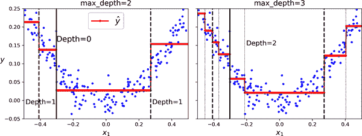

# 第六章：决策树

*决策树*是多功能的机器学习算法，可以执行分类和回归任务，甚至多输出任务。它们是强大的算法，能够拟合复杂的数据集。例如，在第二章中，你在加利福尼亚住房数据集上训练了一个`DecisionTreeRegressor`模型，完美拟合了它（实际上，过度拟合了）。

决策树也是随机森林（参见第七章）的基本组件之一，随机森林是当今最强大的机器学习算法之一。

在本章中，我们将首先讨论如何训练、可视化和使用决策树进行预测。然后我们将介绍 Scikit-Learn 使用的 CART 训练算法，并探讨如何正则化树并将其用于回归任务。最后，我们将讨论决策树的一些局限性。

# 训练和可视化决策树

为了理解决策树，让我们构建一个并看看它如何进行预测。以下代码在鸢尾数据集上训练了一个`DecisionTreeClassifier`（参见第四章）：

```py
from sklearn.datasets import load_iris
from sklearn.tree import DecisionTreeClassifier

iris = load_iris(as_frame=True)
X_iris = iris.data[["petal length (cm)", "petal width (cm)"]].values
y_iris = iris.target

tree_clf = DecisionTreeClassifier(max_depth=2, random_state=42)
tree_clf.fit(X_iris, y_iris)
```

你可以通过首先使用`export_graphviz()`函数输出一个名为*iris_tree.dot*的图形定义文件来可视化训练好的决策树：

```py
from sklearn.tree import export_graphviz

export_graphviz(
        tree_clf,
        out_file="iris_tree.dot",
        feature_names=["petal length (cm)", "petal width (cm)"],
        class_names=iris.target_names,
        rounded=True,
        filled=True
    )
```

然后你可以使用`graphviz.Source.from_file()`来加载并在 Jupyter 笔记本中显示文件：

```py
from graphviz import Source

Source.from_file("iris_tree.dot")
```

[Graphviz](https://graphviz.org)是一个开源图形可视化软件包。它还包括一个`dot`命令行工具，可以将*.dot*文件转换为各种格式，如 PDF 或 PNG。

你的第一个决策树看起来像图 6-1。


###### 图 6-1. 鸢尾决策树

# 进行预测

让我们看看图 6-1 中表示的树如何进行预测。假设你找到一朵鸢尾花，想根据其花瓣对其进行分类。你从*根节点*（深度 0，顶部）开始：这个节点询问花瓣长度是否小于 2.45 厘米。如果是，那么你向下移动到根节点的左子节点（深度 1，左侧）。在这种情况下，它是一个*叶节点*（即，它没有任何子节点），所以它不会提出任何问题：只需查看该节点的预测类别，决策树预测你的花是*鸢尾山鸢尾*（`class=setosa`）。

现在假设你找到另一朵花，这次花瓣长度大于 2.45 厘米。你再次从根节点开始，但现在向下移动到右侧子节点（深度 1，右侧）。这不是一个叶节点，它是一个*分裂节点*，所以它提出另一个问题：花瓣宽度是否小于 1.75 厘米？如果是，那么你的花很可能是*鸢尾杂色*（深度 2，左侧）。如果不是，它很可能是*鸢尾维吉尼亚*（深度 2，右侧）。就是这么简单。

###### 注意

决策树的许多优点之一是它们几乎不需要数据准备。事实上，它们根本不需要特征缩放或居中。

节点的`samples`属性计算它适用于多少训练实例。例如，有 100 个训练实例的花瓣长度大于 2.45 厘米（深度 1，右侧），其中有 100 个训练实例的花瓣宽度小于 1.75 厘米（深度 2，左侧）。节点的`value`属性告诉您此节点适用于每个类别的训练实例数量：例如，右下节点适用于 0 个*Iris setosa*，1 个*Iris versicolor*和 45 个*Iris virginica*的训练实例。最后，节点的`gini`属性测量其*基尼不纯度*：如果所有适用于该节点的训练实例属于同一类，则节点是“纯净的”（`gini=0`）。例如，由于深度为 1 的左节点仅适用于*Iris setosa*训练实例，因此它是纯净的，其基尼不纯度为 0。方程 6-1 显示了训练算法如何计算第*i*个节点的基尼不纯度*G*[*i*]。深度为 2 的左节点的基尼不纯度等于 1 - (0/54)² - (49/54)² - (5/54)² ≈ 0.168。

##### 方程 6-1\. 基尼不纯度

<math display="block"><mrow><msub><mi>G</mi> <mi>i</mi></msub> <mo>=</mo> <mn>1</mn> <mo>-</mo> <munderover><mo>∑</mo> <mrow><mi>k</mi><mo>=</mo><mn>1</mn></mrow> <mi>n</mi></munderover> <msup><mrow><msub><mi>p</mi> <mrow><mi>i</mi><mo>,</mo><mi>k</mi></mrow></msub></mrow> <mn>2</mn></msup></mrow></math>

在这个方程中：

+   *G*[*i*]是第*i*个节点的基尼不纯度。

+   *p*[*i*,*k*]是第*i*个节点中训练实例中类*k*实例的比率。

###### 注意

Scikit-Learn 使用 CART 算法，该算法仅生成*二叉树*，即分裂节点始终具有两个子节点（即问题只有是/否答案）。但是，其他算法（如 ID3）可以生成具有多于两个子节点的决策树。

图 6-2 显示了此决策树的决策边界。粗垂直线代表根节点（深度 0）的决策边界：花瓣长度=2.45 厘米。由于左侧区域是纯净的（仅*Iris setosa*），因此无法进一步分裂。但是，右侧区域是不纯的，因此深度为 1 的右节点在花瓣宽度=1.75 厘米处分裂（由虚线表示）。由于`max_depth`设置为 2，决策树在那里停止。如果将`max_depth`设置为 3，则两个深度为 2 的节点将分别添加另一个决策边界（由两个垂直虚线表示）。


###### 图 6-2\. 决策树决策边界

###### 提示

决策树结构，包括图 6-1 中显示的所有信息，可以通过分类器的`tree_`属性获得。输入**`help(tree_clf.tree_)`**以获取详细信息，并查看[本章笔记本](https://homl.info/colab3)中的示例。

# 估计类别概率

决策树还可以估计一个实例属于特定类*k*的概率。首先，它遍历树以找到此实例的叶节点，然后返回该节点中类*k*的训练实例的比率。例如，假设您找到了一朵花，其花瓣长 5 厘米，宽 1.5 厘米。相应的叶节点是深度为 2 的左节点，因此决策树输出以下概率：*Iris setosa*为 0%（0/54），*Iris versicolor*为 90.7%（49/54），*Iris virginica*为 9.3%（5/54）。如果要求它预测类别，则输出*Iris versicolor*（类别 1），因为它具有最高概率。让我们来检查一下：

```py
>>> tree_clf.predict_proba([[5, 1.5]]).round(3)
array([[0\.   , 0.907, 0.093]])
>>> tree_clf.predict([[5, 1.5]])
array([1])
```

完美！请注意，在图 6-2 的右下矩形中的任何其他位置，估计的概率将是相同的——例如，如果花瓣长 6 厘米，宽 1.5 厘米（即使在这种情况下，很明显它很可能是*Iris virginica*）。

# CART 训练算法

Scikit-Learn 使用*分类和回归树*（CART）算法来训练决策树（也称为“生长”树）。该算法首先通过使用单个特征*k*和阈值*t*[*k*]（例如，“花瓣长度≤2.45 厘米”）将训练集分成两个子集。它如何选择*k*和*t*[*k*]？它搜索产生最纯净子集的配对（*k*，*t*[*k*]），并根据它们的大小加权。方程 6-2 给出了算法试图最小化的成本函数。

##### 方程 6-2\. 用于分类的 CART 成本函数

<math display="block"><mtable displaystyle="true"><mtr><mtd columnalign="left"><mrow><mi>J</mi> <mrow><mo>(</mo> <mi>k</mi> <mo>,</mo> <msub><mi>t</mi> <mi>k</mi></msub> <mo>)</mo></mrow> <mo>=</mo> <mstyle scriptlevel="0" displaystyle="true"><mfrac><msub><mi>m</mi> <mtext>left</mtext></msub> <mi>m</mi></mfrac></mstyle> <msub><mi>G</mi> <mtext>left</mtext></msub> <mo>+</mo> <mstyle scriptlevel="0" displaystyle="true"><mfrac><msub><mi>m</mi> <mtext>right</mtext></msub> <mi>m</mi></mfrac></mstyle> <msub><mi>G</mi> <mtext>right</mtext></msub></mrow></mtd></mtr> <mtr><mtd columnalign="left"><mrow><mtext>其中</mtext> <mfenced separators="" open="{" close=""><mtable><mtr><mtd columnalign="left"><mrow><msub><mi>G</mi> <mtext>left/right</mtext></msub> <mtext>衡量</mtext> <mtext>左/右</mtext> <mtext>子集的不纯度</mtext></mrow></mtd></mtr> <mtr><mtd columnalign="left"><mrow><msub><mi>m</mi> <mtext>left/right</mtext></msub> <mtext>是</mtext> <mtext>左/右</mtext> <mtext>子集中实例的数量</mtext></mrow></mtd></mtr></mtable></mfenced></mrow></mtd></mtr></mtable></math>

一旦 CART 算法成功将训练集分成两部分，它会使用相同的逻辑分割子集，然后是子子集，依此类推，递归地进行。一旦达到最大深度（由`max_depth`超参数定义），或者无法找到能够减少不纯度的分割时，递归停止。另外几个超参数（稍后描述）控制额外的停止条件：`min_samples_split`，`min_samples_leaf`，`min_weight_fraction_leaf`和`max_leaf_nodes`。

###### 警告

正如您所看到的，CART 算法是一种*贪婪算法*：它贪婪地在顶层搜索最佳分割，然后在每个后续级别重复该过程。它不检查分割是否会导致几个级别下可能的最低不纯度。贪婪算法通常会产生一个相当好但不能保证是最佳的解决方案。

不幸的是，找到最佳树被认为是一个*NP 完全*问题。⁠¹ 它需要*O*(exp(*m*))的时间，使得即使对于小型训练集，问题也难以解决。这就是为什么在训练决策树时我们必须接受“相当好”的解决方案。

# 计算复杂度

进行预测需要从根节点到叶节点遍历决策树。决策树通常大致平衡，因此遍历决策树需要经过大约*O*(log2)个节点，其中 log2 是*m*的*二进制对数*，等于 log(*m*) / log(2)。由于每个节点只需要检查一个特征的值，因此整体预测复杂度为*O*(log2)，与特征数量无关。因此，即使处理大型训练集，预测也非常快速。

训练算法在每个节点上比较所有特征（或少于`max_features`设置的特征）的所有样本。在每个节点上比较所有特征的所有样本会导致训练复杂度为*O*(*n* × *m* log2）。

# 基尼不纯度还是熵？

默认情况下，`DecisionTreeClassifier`类使用基尼不纯度度量，但您可以通过将`criterion`超参数设置为`"entropy"`来选择*熵*不纯度度量。熵的概念起源于热力学，作为分子无序性的度量：当分子静止且有序时，熵接近零。熵后来传播到各种领域，包括香农的信息论，在那里它衡量消息的平均信息内容，正如我们在第四章中看到的那样。当所有消息相同时，熵为零。在机器学习中，熵经常用作不纯度度量：当集合中只包含一个类的实例时，其熵为零。方程 6-3 显示了*i*^(th)节点熵的定义。例如，图 6-1 中深度为 2 的左节点的熵等于-(49/54) log[2] (49/54) - (5/54) log[2] (5/54) ≈ 0.445。

##### 方程 6-3\. 熵

<math display="block"><mrow><msub><mi>H</mi> <mi>i</mi></msub> <mo>=</mo> <mo>-</mo> <munderover><mo>∑</mo> <mfrac linethickness="0pt"><mrow><mi>k</mi><mo>=</mo><mn>1</mn></mrow> <mrow><msub><mi>p</mi> <mrow><mi>i</mi><mo>,</mo><mi>k</mi></mrow></msub> <mo>≠</mo><mn>0</mn></mrow></mfrac> <mi>n</mi></munderover> <mrow><msub><mi>p</mi> <mrow><mi>i</mi><mo>,</mo><mi>k</mi></mrow></msub> <msub><mo form="prefix">log</mo> <mn>2</mn></msub> <mrow><mo>(</mo> <msub><mi>p</mi> <mrow><mi>i</mi><mo>,</mo><mi>k</mi></mrow></msub> <mo>)</mo></mrow></mrow></mrow></math>

那么，您应该使用基尼不纯度还是熵？事实是，大多数情况下并没有太大的区别：它们导致类似的树。基尼不纯度计算速度稍快，因此是一个很好的默认选择。然而，当它们不同时，基尼不纯度倾向于将最频繁的类隔离在树的自己分支中，而熵倾向于产生稍微更平衡的树。

# 正则化超参数

决策树对训练数据做出很少的假设（与线性模型相反，线性模型假设数据是线性的，例如）。如果不加约束，树结构将自适应于训练数据，非常紧密地拟合它——事实上，很可能过度拟合。这样的模型通常被称为*非参数模型*，不是因为它没有任何参数（通常有很多），而是因为参数的数量在训练之前不确定，因此模型结构可以自由地紧密地贴近数据。相比之下，*参数模型*，如线性模型，具有预先确定的参数数量，因此其自由度受限，减少了过度拟合的风险（但增加了欠拟合的风险）。

为了避免过度拟合训练数据，您需要在训练期间限制决策树的自由度。正如您现在所知，这被称为正则化。正则化超参数取决于所使用的算法，但通常您至少可以限制决策树的最大深度。在 Scikit-Learn 中，这由`max_depth`超参数控制。默认值为`None`，表示无限制。减少`max_depth`将使模型正则化，从而减少过度拟合的风险。

`DecisionTreeClassifier`类还有一些其他参数，类似地限制了决策树的形状：

`max_features`

在每个节点评估用于分裂的最大特征数

`max_leaf_nodes`

叶节点的最大数量

`min_samples_split`

节点在可以分裂之前必须具有的最小样本数

`min_samples_leaf`

叶节点必须具有的最小样本数

`min_weight_fraction_leaf`

与`min_samples_leaf`相同，但表示为加权实例总数的分数

增加`min_*`超参数或减少`max_*`超参数将使模型正则化。

###### 注意

其他算法首先训练没有限制的决策树，然后*修剪*（删除）不必要的节点。如果一个节点的子节点都是叶节点，并且它提供的纯度改进不具有统计显著性，则认为该节点是不必要的。标准统计检验，如*χ*²*检验*（卡方检验），用于估计改进纯粹是由于偶然性导致的概率（称为*零假设*）。如果这个概率，称为*p 值*，高于给定阈值（通常为 5%，由超参数控制），则认为该节点是不必要的，其子节点将被删除。修剪将继续进行，直到所有不必要的节点都被修剪。

让我们在 moons 数据集上测试正则化，该数据集在第五章中介绍。我们将训练一个没有正则化的决策树，另一个使用`min_samples_leaf=5`。以下是代码；图 6-3 显示了每棵树的决策边界：

```py
from sklearn.datasets import make_moons

X_moons, y_moons = make_moons(n_samples=150, noise=0.2, random_state=42)

tree_clf1 = DecisionTreeClassifier(random_state=42)
tree_clf2 = DecisionTreeClassifier(min_samples_leaf=5, random_state=42)
tree_clf1.fit(X_moons, y_moons)
tree_clf2.fit(X_moons, y_moons)
```


###### 图 6-3\. 未正则化树的决策边界（左）和正则化树（右）

左边的未正则化模型明显过拟合，右边的正则化模型可能会更好地泛化。我们可以通过在使用不同随机种子生成的测试集上评估这两棵树来验证这一点：

```py
>>> X_moons_test, y_moons_test = make_moons(n_samples=1000, noise=0.2,
...                                         random_state=43)
...
>>> tree_clf1.score(X_moons_test, y_moons_test)
0.898
>>> tree_clf2.score(X_moons_test, y_moons_test)
0.92
```

事实上，第二棵树在测试集上有更好的准确性。

# 回归

决策树也能够执行回归任务。让我们使用 Scikit-Learn 的`DecisionTreeRegressor`类构建一个回归树，对一个带有`max_depth=2`的嘈杂二次数据集进行训练：

```py
import numpy as np
from sklearn.tree import DecisionTreeRegressor

np.random.seed(42)
X_quad = np.random.rand(200, 1) - 0.5  # a single random input feature
y_quad = X_quad ** 2 + 0.025 * np.random.randn(200, 1)

tree_reg = DecisionTreeRegressor(max_depth=2, random_state=42)
tree_reg.fit(X_quad, y_quad)
```

生成的树在图 6-4 中表示。


###### 图 6-4\. 用于回归的决策树

这棵树看起来与您之前构建的分类树非常相似。主要区别在于，每个节点不是预测一个类别，而是预测一个值。例如，假设您想对一个新实例进行预测，其中*x*[1] = 0.2。根节点询问*x*[1] ≤ 0.197。由于不是，算法转到右子节点，询问*x*[1] ≤ 0.772。由于是，算法转到左子节点。这是一个叶节点，它预测`value=0.111`。这个预测是与该叶节点关联的 110 个训练实例的目标值的平均值，导致这 110 个实例的均方误差等于 0.015。

这个模型的预测在左边的图 6-5 中表示。如果设置`max_depth=3`，则得到右边的预测。请注意，每个区域的预测值始终是该区域实例的目标值的平均值。该算法分割每个区域的方式是使大多数训练实例尽可能接近该预测值。



###### 图 6-5\. 两个决策树回归模型的预测

CART 算法的工作方式与之前描述的相同，只是现在它试图以最小化 MSE 的方式分割训练集，而不是试图最小化不纯度。方程 6-4 显示了算法试图最小化的成本函数。

##### 方程 6-4\. CART 回归的成本函数

<math display="block"><mi>J</mi><mrow><mo>(</mo><mi>k</mi><mo>,</mo><msub><mi>t</mi><mi>k</mi></msub><mo>)</mo></mrow><mo>=</mo><mfrac><msub><mi>m</mi><mtext>left</mtext></msub><mi>m</mi></mfrac><msub><mtext>MSE</mtext><mtext>left</mtext></msub><mo>+</mo><mfrac><msub><mi>m</mi><mtext>right</mtext></msub><mi>m</mi></mfrac><msub><mtext>MSE</mtext><mtext>right</mtext></msub><mtext>where</mtext><mfenced open="{" close="" separators=""><mtable><mtr><mtd><msub><mtext>MSE</mtext><mtext>node</mtext></msub><mo>=</mo><mfrac><mrow><munder><mo>∑</mo><mrow><mi>i</mi><mo>∈</mo><mtext>node</mtext></mrow></munder><msup><mrow><mo>(</mo><msub><mover><mi>y</mi><mo>^</mo></mover><mtext>node</mtext></msub><mo>-</mo><msup><mi>y</mi><mrow><mo>(</mo><mi>i</mi><mo>)</mo></mrow></msup><mo>)</mo></mrow><mn>2</mn></msup></mrow><msub><mi>m</mi><mi>node</mi></msub></mfrac></mtd></mtr><mtr><mtd><msub><mover><mi>y</mi><mo>^</mo></mover><mtext>node</mtext></msub><mo>=</mo><mfrac><mrow><munder><mo>∑</mo><mrow><mi>i</mi><mo>∈</mo><mtext>node</mtext></mrow></munder><msup><mi>y</mi><mrow><mo>(</mo><mi>i</mi><mo>)</mo></mrow></msup></mrow><msub><mi>m</mi><mi>node</mi></msub></mfrac></mtd></mtr></mtable></mfenced></math>

就像分类任务一样，决策树在处理回归任务时容易过拟合。没有任何正则化（即使用默认超参数），您会得到图 6-6 左侧的预测结果。这些预测显然严重过拟合了训练集。只需设置`min_samples_leaf=10`就会得到一个更合理的模型，如图 6-6 右侧所示。


###### 图 6-6。未正则化回归树的预测（左）和正则化树（右）

# 对轴方向的敏感性

希望到目前为止您已经相信决策树有很多优点：它们相对容易理解和解释，简单易用，多功能且强大。然而，它们也有一些局限性。首先，正如您可能已经注意到的，决策树喜欢正交的决策边界（所有分割都垂直于一个轴），这使它们对数据的方向敏感。例如，图 6-7 显示了一个简单的线性可分数据集：在左侧，决策树可以轻松分割它，而在右侧，数据集旋转了 45°后，决策边界看起来过于复杂。尽管两个决策树都完美拟合了训练集，但右侧的模型很可能泛化效果不佳。


###### 图 6-7。对训练集旋转的敏感性

限制这个问题的一种方法是对数据进行缩放，然后应用主成分分析转换。我们将在第八章中详细讨论 PCA，但现在您只需要知道它以一种减少特征之间相关性的方式旋转数据，这通常（不总是）使决策树更容易处理。

让我们创建一个小型流水线，对数据进行缩放并使用 PCA 进行旋转，然后在该数据上训练`DecisionTreeClassifier`。图 6-8 显示了该树的决策边界：正如您所看到的，旋转使得只使用一个特征*z*[1]就可以很好地拟合数据集，该特征是原始花瓣长度和宽度的线性函数。以下是代码：

```py
from sklearn.decomposition import PCA
from sklearn.pipeline import make_pipeline
from sklearn.preprocessing import StandardScaler

pca_pipeline = make_pipeline(StandardScaler(), PCA())
X_iris_rotated = pca_pipeline.fit_transform(X_iris)
tree_clf_pca = DecisionTreeClassifier(max_depth=2, random_state=42)
tree_clf_pca.fit(X_iris_rotated, y_iris)
```


###### 图 6-8。树在经过缩放和 PCA 旋转的鸢尾花数据集上的决策边界

# 决策树具有高方差

更一般地，决策树的主要问题是它们具有相当高的方差：对超参数或数据进行微小更改可能会产生非常不同的模型。实际上，由于 Scikit-Learn 使用的训练算法是随机的——它在每个节点随机选择要评估的特征集，即使在完全相同的数据上重新训练相同的决策树也可能产生非常不同的模型，例如图 6-9 中所示的模型（除非您设置`random_state`超参数）。如您所见，它看起来与先前的决策树非常不同（图 6-2）。


###### 图 6-9\. 在相同数据上重新训练相同模型可能会产生非常不同的模型

幸运的是，通过对许多树的预测进行平均，可以显著减少方差。这样的树*集成*称为*随机森林*，它是当今最强大的模型之一，您将在下一章中看到。

# 练习

1.  在一个包含一百万实例的训练集上训练（无限制）的决策树的大致深度是多少？

1.  节点的基尼不纯度通常低于还是高于其父节点的？它*通常*低于/高于，还是*总是*低于/高于？

1.  如果一个决策树对训练集过拟合，尝试减小`max_depth`是一个好主意吗？

1.  如果一个决策树对训练集欠拟合，尝试对输入特征进行缩放是一个好主意吗？

1.  在包含一百万实例的训练集上训练一个决策树需要一个小时，那么在包含一千万实例的训练集上训练另一个决策树大约需要多长时间？提示：考虑 CART 算法的计算复杂度。

1.  在给定训练集上训练一个决策树需要一个小时，如果您增加特征数量会需要多长时间？

1.  按照以下步骤为 moons 数据集训练和微调决策树：

    1.  使用`make_moons(n_samples=10000, noise=0.4)`生成一个 moons 数据集。

    1.  使用`train_test_split()`将数据集分割为训练集和测试集。

    1.  使用网格搜索结合交叉验证（借助`GridSearchCV`类）来找到`DecisionTreeClassifier`的良好超参数值。提示：尝试不同的`max_leaf_nodes`值。

    1.  使用这些超参数在完整的训练集上训练模型，并在测试集上评估模型的性能。您应该获得大约 85%到 87%的准确率。

1.  按照以下步骤生成一个森林：

    1.  继续上一个练习，生成 1,000 个训练集的子集，每个子集包含随机选择的 100 个实例。提示：您可以使用 Scikit-Learn 的`ShuffleSplit`类来实现。

    1.  在每个子集上训练一个决策树，使用在前一个练习中找到的最佳超参数值。在测试集上评估这 1,000 个决策树。由于它们是在较小的数据集上训练的，这些决策树可能表现得比第一个决策树更差，仅获得大约 80%的准确率。

    1.  现在是魔法时刻。对于每个测试集实例，生成 1,000 个决策树的预测，并仅保留最频繁的预测（您可以使用 SciPy 的`mode()`函数）。这种方法为您提供了测试集上的*多数投票预测*。

    1.  在测试集上评估这些预测：您应该获得比第一个模型稍高的准确率（大约高 0.5%到 1.5%）。恭喜，您已经训练了一个随机森林分类器！

这些练习的解决方案可在本章笔记本的末尾找到，网址为[*https://homl.info/colab3*](https://homl.info/colab3)。

¹ P 是可以在*多项式时间*内解决的问题集（即数据集大小的多项式）。NP 是可以在多项式时间内验证解决方案的问题集。NP-hard 问题是可以在多项式时间内减少到已知 NP-hard 问题的问题。NP-complete 问题既是 NP 又是 NP-hard。一个重要的数学问题是 P 是否等于 NP。如果 P ≠ NP（这似乎是可能的），那么任何 NP-complete 问题都不会找到多项式算法（除非有一天在量子计算机上）。

² 有关更多细节，请参阅 Sebastian Raschka 的[有趣分析](https://homl.info/19)。
