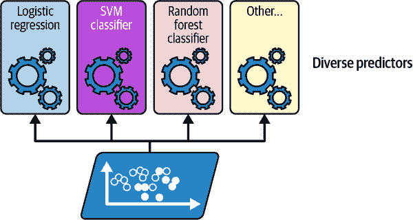
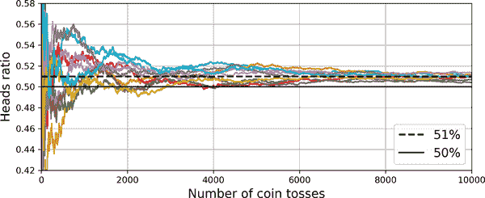
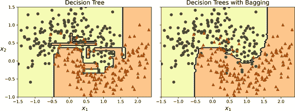
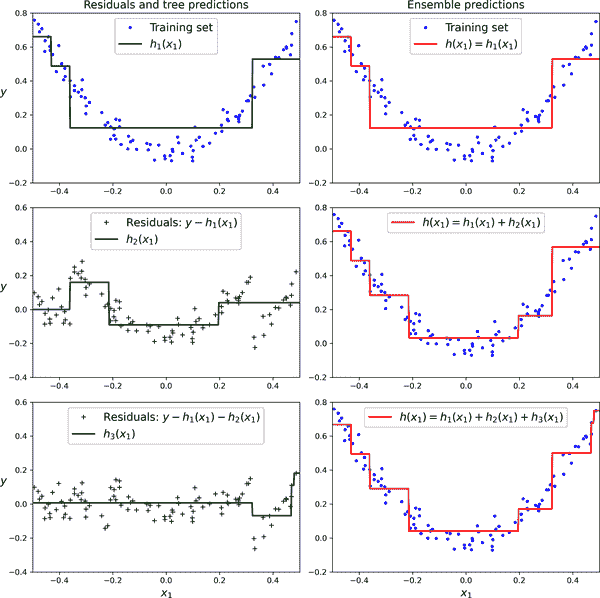
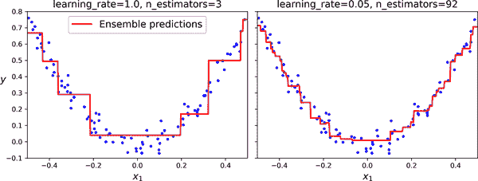
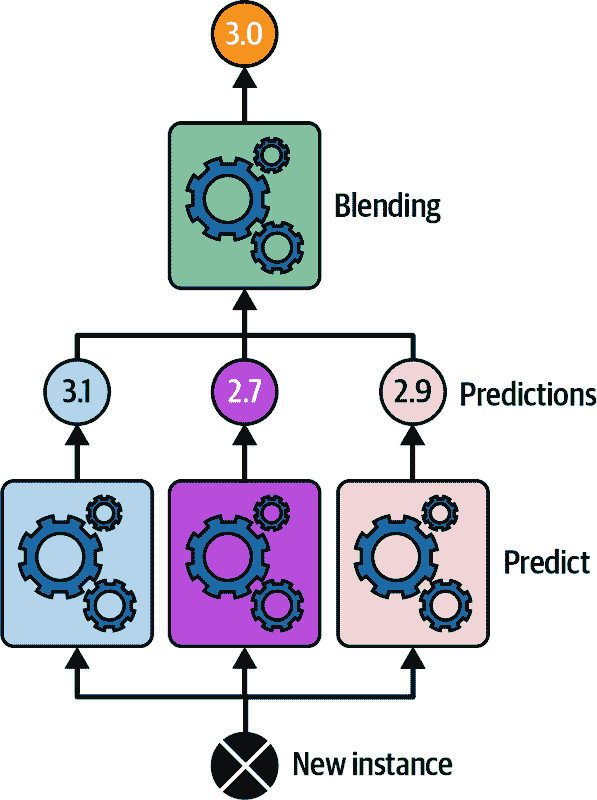

# 第七章：集成学习和随机森林

假设您向成千上万的随机人提出一个复杂的问题，然后汇总他们的答案。在许多情况下，您会发现这种汇总的答案比专家的答案更好。这被称为*群体的智慧*。类似地，如果您汇总一组预测器（如分类器或回归器）的预测，通常会比最佳个体预测器的预测更好。一组预测器称为*集成*；因此，这种技术称为*集成学习*，集成学习算法称为*集成方法*。

作为集成方法的一个示例，您可以训练一组决策树分类器，每个分类器在训练集的不同随机子集上训练。然后，您可以获得所有单独树的预测，得到得票最多的类别就是集成的预测（请参见第六章中的最后一个练习）。这样的决策树集成称为*随机森林*，尽管它很简单，但这是当今最强大的机器学习算法之一。

正如在第二章中讨论的那样，您通常会在项目结束时使用集成方法，一旦您已经构建了几个良好的预测器，将它们组合成一个更好的预测器。事实上，在机器学习竞赛中获胜的解决方案通常涉及几种集成方法，最著名的是[Netflix Prize 竞赛](https://en.wikipedia.org/wiki/Netflix_Prize)。

在本章中，我们将研究最流行的集成方法，包括投票分类器、装袋和粘贴集成、随机森林和提升，以及堆叠集成。

# 投票分类器

假设您已经训练了几个分类器，每个分类器的准确率约为 80%。您可能有一个逻辑回归分类器，一个 SVM 分类器，一个随机森林分类器，一个*k*最近邻分类器，也许还有几个（请参见图 7-1）。



###### 图 7-1\. 训练多样化的分类器

创建一个更好的分类器的一个非常简单的方法是汇总每个分类器的预测：得票最多的类别是集成的预测。这种多数投票分类器称为*硬投票*分类器（请参见图 7-2）。


###### 图 7-2\. 硬投票分类器预测

令人惊讶的是，这种投票分类器通常比集成中最好的分类器的准确率更高。事实上，即使每个分类器都是*弱学习器*（意味着它的表现仅略好于随机猜测），只要集成中有足够数量的弱学习器并且它们足够多样化，集成仍然可以是一个*强学习器*（实现高准确率）。

这是如何可能的？以下类比可以帮助解开这个谜团。假设您有一个略带偏见的硬币，正面朝上的概率为 51%，反面朝上的概率为 49%。如果您抛掷它 1,000 次，通常会得到大约 510 次正面和 490 次反面，因此大多数是正面。如果您进行计算，您会发现在 1,000 次抛掷后获得大多数正面的概率接近 75%。您抛掷硬币的次数越多，概率就越高（例如，进行 10,000 次抛掷后，概率超过 97%）。这是由于*大数定律*：随着您不断抛掷硬币，正面的比例越来越接近正面的概率（51%）。图 7-3 显示了 10 组有偏硬币抛掷。您可以看到随着抛掷次数的增加，正面的比例接近 51%。最终，所有 10 组数据最终都接近 51%，它们始终保持在 50%以上。



###### 图 7-3\. 大数定律

类似地，假设你构建一个包含 1,000 个分类器的集成，这些分类器单独的正确率仅为 51%（略高于随机猜测）。如果你预测多数投票的类别，你可以期望达到高达 75%的准确性！然而，这仅在所有分类器完全独立，产生不相关错误时才成立，而这显然不是事实，因为它们是在相同数据上训练的。它们很可能会产生相同类型的错误，因此会有很多错误类别的多数投票，降低了集成的准确性。

###### 提示

集成方法在预测器尽可能独立时效果最好。获得多样化分类器的一种方法是使用非常不同的算法对它们进行训练。这增加了它们会产生非常不同类型错误的机会，提高了集成的准确性。

Scikit-Learn 提供了一个非常容易使用的`VotingClassifier`类：只需给它一个名称/预测器对的列表，然后像普通分类器一样使用它。让我们在 moons 数据集上尝试一下（在第五章介绍）。我们将加载并拆分 moons 数据集为训练集和测试集，然后创建和训练一个由三个不同分类器组成的投票分类器：

```py
from sklearn.datasets import make_moons
from sklearn.ensemble import RandomForestClassifier, VotingClassifier
from sklearn.linear_model import LogisticRegression
from sklearn.model_selection import train_test_split
from sklearn.svm import SVC

X, y = make_moons(n_samples=500, noise=0.30, random_state=42)
X_train, X_test, y_train, y_test = train_test_split(X, y, random_state=42)

voting_clf = VotingClassifier(
    estimators=[
        ('lr', LogisticRegression(random_state=42)),
        ('rf', RandomForestClassifier(random_state=42)),
        ('svc', SVC(random_state=42))
    ]
)
voting_clf.fit(X_train, y_train)
```

当你拟合`VotingClassifier`时，它会克隆每个估计器并拟合这些克隆。原始估计器可以通过`estimators`属性获得，而拟合的克隆可以通过`estimators_`属性获得。如果你更喜欢字典而不是列表，可以使用`named_estimators`或`named_estimators_`。首先，让我们看看每个拟合分类器在测试集上的准确性：

```py
>>> for name, clf in voting_clf.named_estimators_.items():
...     print(name, "=", clf.score(X_test, y_test))
...
lr = 0.864
rf = 0.896
svc = 0.896
```

当你调用投票分类器的`predict()`方法时，它执行硬投票。例如，投票分类器为测试集的第一个实例预测类别 1，因为三个分类器中有两个预测该类别：

```py
>>> voting_clf.predict(X_test[:1])
array([1])
>>> [clf.predict(X_test[:1]) for clf in voting_clf.estimators_]
[array([1]), array([1]), array([0])]
```

现在让我们看看投票分类器在测试集上的表现：

```py
>>> voting_clf.score(X_test, y_test)
0.912
```

就是这样！投票分类器的表现优于所有个体分类器。

如果所有分类器都能估计类别概率（即它们都有`predict_proba()`方法），那么你可以告诉 Scikit-Learn 预测具有最高类别概率的类别，这是所有个体分类器的平均值。这被称为*软投票*。它通常比硬投票表现更好，因为它更加重视高置信度的投票。你只需要将投票分类器的`voting`超参数设置为`"soft"`，并确保所有分类器都能估计类别概率。这在`SVC`类中默认情况下不适用，因此你需要将其`probability`超参数设置为`True`（这将使`SVC`类使用交叉验证来估计类别概率，从而减慢训练速度，并添加一个`predict_proba()`方法）。让我们试一试：

```py
>>> voting_clf.voting = "soft"
>>> voting_clf.named_estimators["svc"].probability = True
>>> voting_clf.fit(X_train, y_train)
>>> voting_clf.score(X_test, y_test)
0.92
```

仅通过使用软投票，我们达到了 92%的准确性，不错！

# Bagging 和 Pasting

获得多样化分类器的一种方法是使用非常不同的训练算法，正如刚才讨论的。另一种方法是对每个预测器使用相同的训练算法，但在训练集的不同随机子集上训练它们。当采样*有*替换时，这种方法称为[*bagging*](https://homl.info/20)（bootstrap 聚合的缩写）⁠。当采样*无*替换时，它被称为[*pasting*](https://homl.info/21)。

换句话说，bagging 和 pasting 都允许训练实例在多个预测器之间多次采样，但只有 bagging 允许训练实例在同一个预测器中多次采样。这种采样和训练过程在图 7-4 中表示。


###### 图 7-4。Bagging 和 Pasting 涉及在训练集的不同随机样本上训练多个预测器

一旦所有预测器都训练完毕，集成可以通过简单地聚合所有预测器的预测来对新实例进行预测。聚合函数通常是分类的*统计模式*（即最频繁的预测，就像硬投票分类器一样），或者是回归的平均值。每个单独的预测器的偏差比在原始训练集上训练时更高，但聚合减少了偏差和方差。通常，集成的结果是，与在原始训练集上训练的单个预测器相比，集成具有类似的偏差但更低的方差。

正如你在图 7-4 中看到的，预测器可以通过不同的 CPU 核心甚至不同的服务器并行训练。同样，预测也可以并行进行。这是 Bagging 和 Pasting 如此受欢迎的原因之一：它们的扩展性非常好。

## Scikit-Learn 中的 Bagging 和 Pasting

Scikit-Learn 为 Bagging 和 Pasting 提供了一个简单的 API：`BaggingClassifier`类（或用于回归的`BaggingRegressor`）。以下代码训练了一个由 500 个决策树分类器组成的集成：每个分类器都是在从训练集中随机抽取的 100 个训练实例上进行训练的（这是 Bagging 的一个示例，但如果你想使用 Pasting，只需设置`bootstrap=False`）。`n_jobs`参数告诉 Scikit-Learn 要使用多少 CPU 核心进行训练和预测，`-1`告诉 Scikit-Learn 使用所有可用的核心：

```py
from sklearn.ensemble import BaggingClassifier
from sklearn.tree import DecisionTreeClassifier

bag_clf = BaggingClassifier(DecisionTreeClassifier(), n_estimators=500,
                            max_samples=100, n_jobs=-1, random_state=42)
bag_clf.fit(X_train, y_train)
```

###### 注意

如果基本分类器可以估计类概率（即具有`predict_proba()`方法），`BaggingClassifier`会自动执行软投票而不是硬投票，决策树分类器就是这种情况。

图 7-5 比较了单个决策树的决策边界和一个由 500 棵树组成的 Bagging 集成的决策边界（来自前面的代码），它们都是在 moons 数据集上训练的。正如你所看到的，集成的预测很可能比单个决策树的预测更好地泛化：集成具有可比较的偏差，但方差更小（在训练集上大致产生相同数量的错误，但决策边界不那么不规则）。

Bagging 在每个预测器训练的子集中引入了更多的多样性，因此 Bagging 的偏差比 Pasting 略高；但额外的多样性也意味着预测器之间的相关性更低，因此集成的方差降低。总的来说，Bagging 通常会产生更好的模型，这解释了为什么通常会优先选择它。但是如果你有多余的时间和 CPU 计算能力，你可以使用交叉验证来评估 Bagging 和 Pasting，并选择最好的方法。



###### 图 7-5。单个决策树（左）与由 500 棵树组成的 Bagging 集成（右）

## 袋外评估

在 Bagging 中，某些训练实例可能会被任何给定的预测器多次抽样，而其他实例可能根本不被抽样。默认情况下，`BaggingClassifier`使用替换抽样（`bootstrap=True`）对*m*个训练实例进行抽样，其中*m*是训练集的大小。通过这个过程，可以在数学上证明，每个预测器平均只有约 63%的训练实例被抽样。剩下的 37%未被抽样的训练实例被称为*袋外*（OOB）实例。请注意，它们对于所有预测器来说并不是相同的 37%。

可以使用 OOB 实例评估装袋集成，无需单独的验证集：实际上，如果有足够的估计器，那么训练集中的每个实例很可能是几个估计器的 OOB 实例，因此这些估计器可以用于为该实例进行公平的集成预测。一旦您对每个实例进行了预测，就可以计算集成的预测准确性（或任何其他度量）。

在 Scikit-Learn 中，您可以在创建`BaggingClassifier`时设置`oob_score=True`来请求训练后自动进行 OOB 评估。以下代码演示了这一点。生成的评估分数可在`oob_score_`属性中获得：

```py
>>> bag_clf = BaggingClassifier(DecisionTreeClassifier(), n_estimators=500,
...                             oob_score=True, n_jobs=-1, random_state=42)
...
>>> bag_clf.fit(X_train, y_train)
>>> bag_clf.oob_score_
0.896
```

根据这个 OOB 评估，这个`BaggingClassifier`在测试集上可能会达到约 89.6%的准确率。让我们验证一下：

```py
>>> from sklearn.metrics import accuracy_score
>>> y_pred = bag_clf.predict(X_test)
>>> accuracy_score(y_test, y_pred)
0.92
```

我们在测试中获得了 92%的准确率。OOB 评估有点太悲观了，低了 2%多一点。

每个训练实例的 OOB 决策函数也可以通过`oob_decision_function_`属性获得。由于基本估计器具有`predict_proba()`方法，决策函数返回每个训练实例的类概率。例如，OOB 评估估计第一个训练实例属于正类的概率为 67.6%，属于负类的概率为 32.4%：

```py
>>> bag_clf.oob_decision_function_[:3]  # probas for the first 3 instances
array([[0.32352941, 0.67647059],
 [0.3375    , 0.6625    ],
 [1\.        , 0\.        ]])
```

## 随机补丁和随机子空间

`BaggingClassifier`类还支持对特征进行抽样。抽样由两个超参数控制：`max_features`和`bootstrap_features`。它们的工作方式与`max_samples`和`bootstrap`相同，但用于特征抽样而不是实例抽样。因此，每个预测器将在输入特征的随机子集上进行训练。

当处理高维输入（例如图像）时，这种技术特别有用，因为它可以显着加快训练速度。对训练实例和特征进行抽样被称为[*随机补丁*方法](https://homl.info/22)。保留所有训练实例（通过设置`bootstrap=False`和`max_samples=1.0`）但对特征进行抽样（通过将`bootstrap_features`设置为`True`和/或将`max_features`设置为小于`1.0`的值）被称为[*随机子空间*方法](https://homl.info/23)。

对特征进行抽样会导致更多的预测器多样性，以换取更低的方差稍微增加一点偏差。

# 随机森林

正如我们所讨论的，[随机森林](https://homl.info/24)是一组决策树的集成，通常通过装袋方法（有时是粘贴）进行训练，通常将`max_samples`设置为训练集的大小。您可以使用`RandomForestClassifier`类来训练随机森林分类器，该类更方便且针对决策树进行了优化（类似地，还有一个用于回归任务的`RandomForestRegressor`类）。以下代码使用 500 棵树训练了一个随机森林分类器，每棵树最多限制为 16 个叶节点，使用所有可用的 CPU 核心：

```py
from sklearn.ensemble import RandomForestClassifier

rnd_clf = RandomForestClassifier(n_estimators=500, max_leaf_nodes=16,
                                 n_jobs=-1, random_state=42)
rnd_clf.fit(X_train, y_train)

y_pred_rf = rnd_clf.predict(X_test)
```

除了一些例外，`RandomForestClassifier`具有`DecisionTreeClassifier`的所有超参数（用于控制树的生长方式），以及`BaggingClassifier`的所有超参数来控制集成本身。

随机森林算法在生长树时引入了额外的随机性；在分裂节点时不是搜索最佳特征（参见第六章），而是在一组随机特征中搜索最佳特征。默认情况下，它对特征进行采样<math><msqrt><mi>n</mi></msqrt></math>（其中*n*是特征的总数）。该算法导致更大的树多样性，这（再次）以更低的方差换取更高的偏差，通常产生更好的模型。因此，以下`BaggingClassifier`等同于之前的`RandomForestClassifier`：

```py
bag_clf = BaggingClassifier(
    DecisionTreeClassifier(max_features="sqrt", max_leaf_nodes=16),
    n_estimators=500, n_jobs=-1, random_state=42)
```

## 额外树

在随机森林中生长树时，在每个节点只考虑一组随机特征进行分裂（如前所述）。还可以通过为每个特征使用随机阈值而不是搜索最佳阈值（正如常规决策树所做）来使树更加随机。为此，只需在创建`DecisionTreeClassifier`时设置`splitter="random"`。

这样极端随机树的森林被称为[*极端随机树*](https://homl.info/25)（或简称为*额外树*）集成。再次，这种技术以更低的方差换取更高的偏差。相比于常规随机森林，额外树分类器的训练速度也更快，因为在每个节点为每个特征找到最佳阈值是生长树中最耗时的任务之一。

您可以使用 Scikit-Learn 的`ExtraTreesClassifier`类创建一个额外树分类器。其 API 与`RandomForestClassifier`类相同，只是`bootstrap`默认为`False`。同样，`ExtraTreesRegressor`类与`RandomForestRegressor`类具有相同的 API，只是`bootstrap`默认为`False`。

###### 提示

很难事先确定`RandomForestClassifier`的表现是好还是坏于`ExtraTreesClassifier`。通常，唯一的方法是尝试两者并使用交叉验证进行比较。

## 特征重要性

随机森林的另一个很好的特性是它可以轻松测量每个特征的相对重要性。Scikit-Learn 通过查看使用该特征的树节点平均减少不纯度的程度来衡量特征的重要性，跨森林中的所有树。更准确地说，这是一个加权平均值，其中每个节点的权重等于与其相关联的训练样本数（参见第六章）。

Scikit-Learn 在训练后自动计算每个特征的重要性得分，然后将结果进行缩放，使所有重要性的总和等于 1。您可以使用`feature_importances_`变量访问结果。例如，以下代码在鸢尾花数据集上训练一个`RandomForestClassifier`（在第四章介绍），并输出每个特征的重要性。看起来最重要的特征是花瓣长度（44%）和宽度（42%），而花萼长度和宽度相比之下不太重要（分别为 11%和 2%）：

```py
>>> from sklearn.datasets import load_iris
>>> iris = load_iris(as_frame=True)
>>> rnd_clf = RandomForestClassifier(n_estimators=500, random_state=42)
>>> rnd_clf.fit(iris.data, iris.target)
>>> for score, name in zip(rnd_clf.feature_importances_, iris.data.columns):
...     print(round(score, 2), name)
...
0.11 sepal length (cm)
0.02 sepal width (cm)
0.44 petal length (cm)
0.42 petal width (cm)
```

同样，如果您在 MNIST 数据集上训练随机森林分类器（在第三章介绍），并绘制每个像素的重要性，则会得到图 7-6 中所代表的图像。


###### 图 7-6. MNIST 像素重要性（根据随机森林分类器）

随机森林非常方便，可以快速了解哪些特征实际上很重要，特别是如果您需要执行特征选择时。

# 提升

*Boosting*（最初称为*hypothesis boosting*）指的是任何可以将几个弱学习器组合成一个强学习器的集成方法。大多数提升方法的一般思想是顺序训练预测器，每个预测器都试图纠正其前身。有许多提升方法可用，但目前最流行的是[*AdaBoost*](https://homl.info/26)（缩写为*adaptive boosting*）和*gradient boosting*。让我们从 AdaBoost 开始。

## AdaBoost

新预测器纠正其前身的一种方法是更多地关注前身欠拟合的训练实例。这导致新的预测器越来越关注困难的情况。这是 AdaBoost 使用的技术。

例如，在训练 AdaBoost 分类器时，算法首先训练一个基本分类器（如决策树），并使用它对训练集进行预测。然后增加被错误分类的训练实例的相对权重。然后训练第二个分类器，使用更新后的权重，再次对训练集进行预测，更新实例权重，依此类推（参见图 7-7）。

图 7-8 显示了在 moons 数据集上的五个连续预测器的决策边界（在这个例子中，每个预测器都是一个具有 RBF 核的高度正则化的 SVM 分类器）。第一个分类器错误地预测了许多实例，因此它们的权重被提升。因此，第二个分类器在这些实例上做得更好，依此类推。右侧的图表示相同序列的预测器，只是学习率减半（即，在每次迭代中，错误分类的实例权重提升要少得多）。正如您所看到的，这种顺序学习技术与梯度下降有一些相似之处，只是 AdaBoost 不是调整单个预测器的参数以最小化成本函数，而是逐渐将预测器添加到集成中，使其变得更好。


###### 图 7-7。AdaBoost 顺序训练与实例权重更新

一旦所有预测器都训练完毕，集成就会像装袋或粘贴一样进行预测，只是预测器根据它们在加权训练集上的整体准确性具有不同的权重。


###### 图 7-8。连续预测器的决策边界

###### 警告

这种顺序学习技术有一个重要的缺点：训练不能并行化，因为每个预测器只能在前一个预测器训练和评估之后进行训练。因此，它的扩展性不如装袋或粘贴。

让我们更仔细地看看 AdaBoost 算法。每个实例权重*w*^((*i*))最初设置为 1/*m*。首先训练一个预测器，并在训练集上计算其加权错误率*r*[1]；参见方程 7-1。

##### 方程 7-1。第 j 个预测器的加权错误率

<math display="block"><mrow><msub><mi>r</mi><mi>j</mi></msub> <mo>=</mo> <mstyle scriptlevel="0" displaystyle="true"><mrow><munderover><mo>∑</mo> <mstyle scriptlevel="0" displaystyle="false"><mrow><mfrac linethickness="0pt"><mrow><mi>i</mi><mo>=</mo><mn>1</mn></mrow> <mrow><msubsup><mover accent="true"><mi>y</mi><mo>^</mo></mover> <mi>j</mi> <mrow><mo>(</mo><mi>i</mi><mo>)</mo></mrow></msubsup> <mo>≠</mo> <msup><mi>y</mi> <mrow><mo>(</mo><mi>i</mi><mo>)</mo></mrow></msup></mrow></mfrac></mrow></mstyle> <mi>m</mi></munderover> <msup><mi>w</mi><mrow><mo>(</mo><mi>i</mi><mo>)</mo></mrow></msup></mrow></mstyle> <mtext>其中</mtext> <msubsup><mover accent="true"><mi>y</mi><mo>^</mo></mover> <mi>j</mi><mrow><mo>(</mo><mi>i</mi><mo>)</mo></mrow></msubsup> <mtext>是</mtext> <mtext>第</mtext> <msup><mi>j</mi><mtext>th</mtext></msup> <mtext>预测器的</mtext> <mtext>预测</mtext><mtext>对于</mtext> <mtext>第</mtext> <msup><mi>i</mi> <mtext>th</mtext></msup> <mtext>实例</mtext></mrow></math>

然后使用方程 7-2 计算预测器的权重*α*[*j*]，其中*η*是学习率超参数（默认为 1）。⁠¹⁵ 预测器越准确，其权重就越高。如果它只是随机猜测，那么它的权重将接近于零。然而，如果它经常错误（即比随机猜测更不准确），那么它的权重将是负数。

##### 方程 7-2. 预测器权重

<math display="block"><mtable displaystyle="true"><mtr><mtd columnalign="right"><mrow><msub><mi>α</mi> <mi>j</mi></msub> <mo>=</mo> <mi>η</mi> <mo form="prefix">log</mo> <mstyle scriptlevel="0" displaystyle="true"><mfrac><mrow><mn>1</mn><mo>-</mo><msub><mi>r</mi> <mi>j</mi></msub></mrow> <msub><mi>r</mi> <mi>j</mi></msub></mfrac></mstyle></mrow></mtd></mtr></mtable></math>

接下来，AdaBoost 算法使用方程 7-3 更新实例权重，提升错误分类实例的权重。

##### 方程 7-3. 权重更新规则

<math display="block"><mtable displaystyle="true"><mtr><mtd columnalign="left"><mrow><mtext>对于</mtext> <mi>i</mi> <mo>=</mo> <mn>1</mn> <mo>,</mo> <mn>2</mn> <mo>,</mo> <mo>⋯</mo> <mo>,</mo> <mi>m</mi></mrow></mtd></mtr> <mtr><mtd columnalign="left"><mrow><msup><mi>w</mi> <mrow><mo>(</mo><mi>i</mi><mo>)</mo></mrow></msup> <mo>←</mo> <mfenced separators="" open="{" close=""><mtable><mtr><mtd columnalign="left"><msup><mi>w</mi> <mrow><mo>(</mo><mi>i</mi><mo>)</mo></mrow></msup></mtd> <mtd columnalign="left"><mrow><mtext>如果</mtext> <msup><mover accent="true"><msub><mi>y</mi> <mi>j</mi></msub> <mo>^</mo></mover> <mrow><mo>(</mo><mi>i</mi><mo>)</mo></mrow></msup> <mo>=</mo> <msup><mi>y</mi> <mrow><mo>(</mo><mi>i</mi><mo>)</mo></mrow></msup></mrow></mtd></mtr> <mtr><mtd columnalign="left"><mrow><msup><mi>w</mi> <mrow><mo>(</mo><mi>i</mi><mo>)</mo></mrow></msup> <mo form="prefix">exp</mo> <mrow><mo>(</mo> <msub><mi>α</mi> <mi>j</mi></msub> <mo>)</mo></mrow></mrow></mtd> <mtd columnalign="left"><mrow><mtext>如果</mtext> <msup><mover accent="true"><msub><mi>y</mi> <mi>j</mi></msub> <mo>^</mo></mover> <mrow><mo>(</mo><mi>i</mi><mo>)</mo></mrow></msup> <mo>≠</mo> <msup><mi>y</mi> <mrow><mo>(</mo><mi>i</mi><mo>)</mo></mrow></msup></mrow></mtd></mtr></mtable></mfenced></mrow></mtd></mtr></mtable></math>

然后对所有实例权重进行归一化（即除以<math><munderover><mo>∑</mo><mrow><mi>i</mi><mo>=</mo><mn>1</mn></mrow><mi>m</mi></munderover><msup><mi>w</mi><mrow><mo>(</mo><mi>i</mi><mo>)</mo></mrow></msup></math>）。

最后，使用更新后的权重训练一个新的预测器，并重复整个过程：计算新预测器的权重，更新实例权重，然后训练另一个预测器，依此类推。当达到所需数量的预测器或找到一个完美的预测器时，算法停止。

为了进行预测，AdaBoost 简单地计算所有预测器的预测值，并使用预测器权重*α*[*j*]对它们进行加权。预测的类别是获得加权投票多数的类别（参见方程 7-4）。

##### 方程 7-4\. AdaBoost 预测

<math display="block"><mrow><mover accent="true"><mi>y</mi> <mo>^</mo></mover> <mrow><mo>(</mo> <mi mathvariant="bold">x</mi> <mo>)</mo></mrow> <mo>=</mo> <munder><mo form="prefix">argmax</mo> <mi>k</mi></munder> <mrow><munderover><mo>∑</mo> <mfrac linethickness="0pt"><mstyle scriptlevel="1" displaystyle="false"><mrow><mi>j</mi><mo>=</mo><mn>1</mn></mrow></mstyle> <mstyle scriptlevel="1" displaystyle="false"><mrow><msub><mover accent="true"><mi>y</mi> <mo>^</mo></mover> <mi>j</mi></msub> <mrow><mo>(</mo><mi mathvariant="bold">x</mi><mo>)</mo></mrow><mo>=</mo><mi>k</mi></mrow></mstyle></mfrac> <mi>N</mi></munderover> <msub><mi>α</mi> <mi>j</mi></msub></mrow> <mtext>where</mtext> <mi>N</mi> <mtext>is</mtext> <mtext>the</mtext> <mtext>number</mtext> <mtext>of</mtext> <mtext>predictors</mtext></mrow></math>

Scikit-Learn 使用了 AdaBoost 的多类版本称为[*SAMME*](https://homl.info/27)⁠¹⁶（代表*使用多类指数损失函数的逐步增加建模*）。当只有两个类别时，SAMME 等同于 AdaBoost。如果预测器可以估计类别概率（即，如果它们有一个`predict_proba()`方法），Scikit-Learn 可以使用 SAMME 的变体称为*SAMME.R*（*R*代表“真实”），它依赖于类别概率而不是预测，并通常表现更好。

以下代码基于 Scikit-Learn 的`AdaBoostClassifier`类训练了一个基于 30 个*决策树桩*的 AdaBoost 分类器（正如您所期望的那样，还有一个`AdaBoostRegressor`类）。决策树桩是一个`max_depth=1`的决策树——换句话说，由一个决策节点和两个叶节点组成的树。这是`AdaBoostClassifier`类的默认基础估计器：

```py
from sklearn.ensemble import AdaBoostClassifier

ada_clf = AdaBoostClassifier(
    DecisionTreeClassifier(max_depth=1), n_estimators=30,
    learning_rate=0.5, random_state=42)
ada_clf.fit(X_train, y_train)
```

###### 提示

如果您的 AdaBoost 集成对训练集过拟合，可以尝试减少估计器的数量或更强烈地正则化基础估计器。

## 梯度提升

另一个非常流行的提升算法是[*梯度提升*](https://homl.info/28)。⁠¹⁷ 就像 AdaBoost 一样，梯度提升通过顺序添加预测器到集成中，每个预测器都纠正其前任。然而，与 AdaBoost 在每次迭代中调整实例权重不同，这种方法试图将新的预测器拟合到前一个预测器产生的*残差错误*上。

让我们通过一个简单的回归示例，使用决策树作为基础预测器；这被称为*梯度树提升*，或*梯度提升回归树*（GBRT）。首先，让我们生成一个带有噪声的二次数据集，并将`DecisionTreeRegressor`拟合到它：

```py
import numpy as np
from sklearn.tree import DecisionTreeRegressor

np.random.seed(42)
X = np.random.rand(100, 1) - 0.5
y = 3 * X[:, 0] ** 2 + 0.05 * np.random.randn(100)  # y = 3x² + Gaussian noise

tree_reg1 = DecisionTreeRegressor(max_depth=2, random_state=42)
tree_reg1.fit(X, y)
```

接下来，我们将在第一个预测器产生的残差错误上训练第二个`DecisionTreeRegressor`：

```py
y2 = y - tree_reg1.predict(X)
tree_reg2 = DecisionTreeRegressor(max_depth=2, random_state=43)
tree_reg2.fit(X, y2)
```

然后我们将在第二个预测器产生的残差错误上训练第三个回归器：

```py
y3 = y2 - tree_reg2.predict(X)
tree_reg3 = DecisionTreeRegressor(max_depth=2, random_state=44)
tree_reg3.fit(X, y3)
```

现在我们有一个包含三棵树的集成。它可以通过简单地将所有树的预测相加来对新实例进行预测：

```py
>>> X_new = np.array([[-0.4], [0.], [0.5]])
>>> sum(tree.predict(X_new) for tree in (tree_reg1, tree_reg2, tree_reg3))
array([0.49484029, 0.04021166, 0.75026781])
```

图 7-9 在左列中表示这三棵树的预测，右列中表示集成的预测。在第一行中，集成只有一棵树，因此其预测与第一棵树的预测完全相同。在第二行中，新树是在第一棵树的残差错误上训练的。您可以看到集成的预测等于前两棵树的预测之和。类似地，在第三行中，另一棵树是在第二棵树的残差错误上训练的。您可以看到随着树被添加到集成中，集成的预测逐渐变得更好。

您可以使用 Scikit-Learn 的`GradientBoostingRegressor`类更轻松地训练 GBRT 集合（还有一个用于分类的`GradientBoostingClassifier`类）。就像`RandomForestRegressor`类一样，它有用于控制决策树增长的超参数（例如`max_depth`，`min_samples_leaf`），以及用于控制集合训练的超参数，比如树的数量（`n_estimators`）。以下代码创建了与前一个相同的集合：

```py
from sklearn.ensemble import GradientBoostingRegressor

gbrt = GradientBoostingRegressor(max_depth=2, n_estimators=3,
                                 learning_rate=1.0, random_state=42)
gbrt.fit(X, y)
```



###### 图 7-9。在这个梯度提升的描述中，第一个预测器（左上角）被正常训练，然后每个连续的预测器（左中和左下）都是在前一个预测器的残差上进行训练；右列显示了结果集合的预测

`learning_rate`超参数缩放每棵树的贡献。如果将其设置为一个较低的值，比如`0.05`，则需要更多的树来拟合训练集，但预测通常会更好地泛化。这是一种称为*缩减*的正则化技术。图 7-10 显示了使用不同超参数训练的两个 GBRT 集合：左侧的集合没有足够的树来拟合训练集，而右侧的集合有大约适量的树。如果添加更多的树，GBRT 将开始过拟合训练集。



###### 图 7-10。GBRT 集合，预测器不足（左）和刚好足够（右）

要找到最佳数目的树，可以像往常一样使用`GridSearchCV`或`RandomizedSearchCV`进行交叉验证，但也有一种更简单的方法：如果将`n_iter_no_change`超参数设置为一个整数值，比如 10，那么`GradientBoostingRegressor`将在训练过程中自动停止添加更多的树，如果看到最后的 10 棵树没有帮助。这只是早停（在第四章中介绍），但需要一点耐心：它容忍在停止之前几次迭代没有进展。让我们使用早停来训练集合：

```py
gbrt_best = GradientBoostingRegressor(
    max_depth=2, learning_rate=0.05, n_estimators=500,
    n_iter_no_change=10, random_state=42)
gbrt_best.fit(X, y)
```

如果将`n_iter_no_change`设置得太低，训练可能会过早停止，模型会欠拟合。但如果设置得太高，它将过拟合。我们还设置了一个相当小的学习率和一个较高数量的估计器，但由于早停，训练集合中实际的估计器数量要低得多：

```py
>>> gbrt_best.n_estimators_
92
```

当设置了`n_iter_no_change`时，`fit()`方法会自动将训练集分成一个较小的训练集和一个验证集：这使得它可以在每次添加新树时评估模型的性能。验证集的大小由`validation_fraction`超参数控制，默认为 10%。`tol`超参数确定了仍然被视为微不足道的最大性能改进。默认值为 0.0001。

`GradientBoostingRegressor`类还支持一个`subsample`超参数，指定用于训练每棵树的训练实例的分数。例如，如果`subsample=0.25`，则每棵树都是在选择的 25%训练实例上随机训练的。现在你可能已经猜到了，这种技术以更低的方差换取更高的偏差。它还显著加快了训练速度。这被称为*随机梯度提升*。

## 基于直方图的梯度提升

Scikit-Learn 还提供了另一种针对大型数据集进行优化的 GBRT 实现：*基于直方图的梯度提升*（HGB）。它通过对输入特征进行分箱，用整数替换它们来工作。箱数由`max_bins`超参数控制，默认为 255，不能设置得比这更高。分箱可以大大减少训练算法需要评估的可能阈值数量。此外，使用整数可以使用更快速和更节省内存的数据结构。构建箱的方式消除了在训练每棵树时对特征进行排序的需要。

因此，这种实现的计算复杂度为*O*(*b*×*m*)，而不是*O*(*n*×*m*×log(*m*))，其中*b*是箱数，*m*是训练实例数，*n*是特征数。实际上，这意味着 HGB 在大型数据集上的训练速度可以比常规 GBRT 快数百倍。然而，分箱会导致精度损失，这起到了正则化的作用：根据数据集的不同，这可能有助于减少过拟合，也可能导致欠拟合。

Scikit-Learn 提供了两个 HGB 类：`HistGradientBoostingRegressor`和`HistGradientBoostingClassifier`。它们类似于`GradientBoostingRegressor`和`GradientBoostingClassifier`，但有一些显著的区别：

+   如果实例数大于 10,000，则自动启用提前停止。您可以通过将`early_stopping`超参数设置为`True`或`False`来始终启用或关闭提前停止。

+   不支持子采样。

+   `n_estimators`被重命名为`max_iter`。

+   唯一可以调整的决策树超参数是`max_leaf_nodes`、`min_samples_leaf`和`max_depth`。

HGB 类还有两个很好的特性：它们支持分类特征和缺失值。这在预处理方面简化了很多。但是，分类特征必须表示为从 0 到小于`max_bins`的整数。您可以使用`OrdinalEncoder`来实现。例如，以下是如何为第二章介绍的加利福尼亚住房数据集构建和训练完整管道的方法：

```py
from sklearn.pipeline import make_pipeline
from sklearn.compose import make_column_transformer
from sklearn.ensemble import HistGradientBoostingRegressor
from sklearn.preprocessing import OrdinalEncoder

hgb_reg = make_pipeline(
    make_column_transformer((OrdinalEncoder(), ["ocean_proximity"]),
                            remainder="passthrough"),
    HistGradientBoostingRegressor(categorical_features=[0], random_state=42)
)
hgb_reg.fit(housing, housing_labels)
```

整个管道和导入一样简短！不需要填充器、缩放器或独热编码器，非常方便。请注意，`categorical_features`必须设置为分类列的索引（或布尔数组）。在没有进行任何超参数调整的情况下，该模型的 RMSE 约为 47,600，这还算不错。

###### 提示

Python ML 生态系统中还提供了几种经过优化的梯度提升实现：特别是[XGBoost](https://github.com/dmlc/xgboost)、[CatBoost](https://catboost.ai)和[LightGBM](https://lightgbm.readthedocs.io)。这些库已经存在了几年。它们都专门用于梯度提升，它们的 API 与 Scikit-Learn 的非常相似，并提供许多附加功能，包括 GPU 加速；您一定要去了解一下！此外，[TensorFlow 随机森林库](https://tensorflow.org/decision_forests)提供了各种随机森林算法的优化实现，包括普通随机森林、极端树、GBRT 等等。

# 堆叠

本章我们将讨论的最后一种集成方法称为*堆叠*（缩写为[*堆叠泛化*](https://homl.info/29)）。它基于一个简单的想法：不要使用微不足道的函数（如硬投票）来聚合集成中所有预测器的预测，为什么不训练一个模型来执行这种聚合呢？图 7-11 展示了这样一个集成在新实例上执行回归任务。底部的三个预测器中的每一个都预测不同的值（3.1、2.7 和 2.9），然后最终的预测器（称为*混合器*或*元学习器*）将这些预测作为输入，做出最终的预测（3.0）。



###### 图 7-11。使用混合预测器聚合预测

要训练混合器，首先需要构建混合训练集。您可以对集成中的每个预测器使用`cross_val_predict()`，以获取原始训练集中每个实例的样本外预测（图 7-12），并将这些用作输入特征来训练混合器；目标可以简单地从原始训练集中复制。请注意，无论原始训练集中的特征数量如何（在本例中只有一个），混合训练集将包含每个预测器的一个输入特征（在本例中为三个）。一旦混合器训练完成，基本预测器将最后一次在完整的原始训练集上重新训练。


###### 图 7-12。在堆叠集成中训练混合器

实际上可以通过这种方式训练几个不同的混合器（例如，一个使用线性回归，另一个使用随机森林回归），以获得一个完整的混合器层，并在其上再添加另一个混合器以生成最终预测，如图 7-13 所示。通过这样做，您可能会挤出更多的性能，但这将在训练时间和系统复杂性方面付出代价。


###### 图 7-13。多层堆叠集成中的预测

Scikit-Learn 提供了两个用于堆叠集成的类：`StackingClassifier`和`StackingRegressor`。例如，我们可以用`StackingClassifier`替换本章开始时在 moons 数据集上使用的`VotingClassifier`：

```py
from sklearn.ensemble import StackingClassifier

stacking_clf = StackingClassifier(
    estimators=[
        ('lr', LogisticRegression(random_state=42)),
        ('rf', RandomForestClassifier(random_state=42)),
        ('svc', SVC(probability=True, random_state=42))
    ],
    final_estimator=RandomForestClassifier(random_state=43),
    cv=5  # number of cross-validation folds
)
stacking_clf.fit(X_train, y_train)
```

对于每个预测器，堆叠分类器将调用`predict_proba()`（如果可用）；如果不可用，它将退而求其次调用`decision_function()`，或者作为最后手段调用`predict()`。如果您没有提供最终的估计器，`StackingClassifier`将使用`LogisticRegression`，而`StackingRegressor`将使用`RidgeCV`。

如果您在测试集上评估这个堆叠模型，您会发现 92.8%的准确率，比使用软投票的投票分类器稍好，后者获得了 92%。

总之，集成方法是多才多艺、强大且相当简单易用的。随机森林、AdaBoost 和 GBRT 是您应该为大多数机器学习任务测试的第一批模型，它们在异构表格数据方面表现尤为出色。此外，由于它们需要非常少的预处理，因此非常适合快速搭建原型。最后，像投票分类器和堆叠分类器这样的集成方法可以帮助将系统的性能推向极限。

# 练习

1.  如果您在完全相同的训练数据上训练了五个不同的模型，并且它们都达到了 95%的精度，是否有可能将这些模型组合以获得更好的结果？如果可以，如何？如果不行，为什么？

1.  硬投票分类器和软投票分类器之间有什么区别？

1.  将一个装袋集成的训练分布到多个服务器上是否可以加快训练速度？那么对于粘贴集成、提升集成、随机森林或堆叠集成呢？

1.  什么是袋外评估的好处？

1.  什么使得额外树集成比常规随机森林更随机？这种额外的随机性如何帮助？额外树分类器比常规随机森林慢还是快？

1.  如果您的 AdaBoost 集成对训练数据拟合不足，应该调整哪些超参数，如何调整？

1.  如果您的梯度提升集成对训练集过拟合，应该增加还是减少学习率？

1.  加载 MNIST 数据集（在第三章中介绍），将其分为训练集、验证集和测试集（例如，使用 50,000 个实例进行训练，10,000 个用于验证，10,000 个用于测试）。然后训练各种分类器，如随机森林分类器、额外树分类器和 SVM 分类器。接下来，尝试将它们组合成一个集成，使用软投票或硬投票在验证集上优于每个单独的分类器。一旦找到一个，尝试在测试集上运行。它的表现比单个分类器好多少？

1.  运行上一个练习中的各个分类器，对验证集进行预测，并使用结果预测创建一个新的训练集：每个训练实例是一个向量，包含所有分类器对图像的预测集合，目标是图像的类别。在这个新的训练集上训练一个分类器。恭喜您——您刚刚训练了一个混合器，它与分类器一起形成了一个堆叠集成！现在在测试集上评估集成。对于测试集中的每个图像，使用所有分类器进行预测，然后将预测结果输入混合器以获得集成的预测。它与您之前训练的投票分类器相比如何？现在尝试使用`StackingClassifier`。性能更好吗？如果是，为什么？

这些练习的解决方案可以在本章笔记本的末尾找到，网址为[*https://homl.info/colab3*](https://homl.info/colab3)。

¹ 想象从一副牌中随机抽取一张卡片，写下来，然后将其放回到牌组中再抽取下一张卡片：同一张卡片可能被多次抽样。

² Leo Breiman，“Bagging 预测器”，*机器学习* 24, no. 2 (1996): 123–140。

³ 在统计学中，带替换的重采样被称为*自助法*。

⁴ Leo Breiman，“在大型数据库和在线分类中粘贴小投票”，*机器学习* 36, no. 1–2 (1999): 85–103。

⁵ 偏差和方差在第四章中介绍过。

⁶ `max_samples`也可以设置为 0.0 到 1.0 之间的浮点数，此时采样实例的最大数量等于训练集大小乘以`max_samples`。

⁷ 当*m*增长时，这个比率接近 1 – exp(–1) ≈ 63%。

⁸ Gilles Louppe 和 Pierre Geurts，“随机补丁上的集成”，*计算机科学讲义* 7523 (2012): 346–361。

⁹ 何天金，“用于构建决策森林的随机子空间方法”，*IEEE 模式分析与机器智能* 20, no. 8 (1998): 832–844。

¹⁰ 何天金，“随机决策森林”，*第三届文档分析与识别国际会议论文集* 1 (1995): 278。

¹¹ 如果您想要一个除决策树以外的袋子，`BaggingClassifier` 类仍然很有用。

¹² Pierre Geurts 等，“极端随机树”，*机器学习* 63, no. 1 (2006): 3–42。

¹³ Yoav Freund 和 Robert E. Schapire, “一个决策理论的在线学习泛化及其在 Boosting 中的应用”, *计算机与系统科学杂志* 55, no. 1 (1997): 119–139.

¹⁴ 这仅供说明目的。SVMs 通常不是 AdaBoost 的好基础预测器；它们速度慢且在其中不稳定。

¹⁵ 原始的 AdaBoost 算法不使用学习率超参数。

¹⁶ 更多细节请参见 Ji Zhu 等人的 “多类别 AdaBoost”, *统计学及其界面* 2, no. 3 (2009): 349–360.

¹⁷ 梯度提升首次在 Leo Breiman 的 [1997 年论文](https://homl.info/arcing) “Arcing the Edge” 中引入，并在 Jerome H. Friedman 的 [1999 年论文](https://homl.info/gradboost) “Greedy Function Approximation: A Gradient Boosting Machine” 中进一步发展。

¹⁸ David H. Wolpert, “堆叠泛化”, *神经网络* 5, no. 2 (1992): 241–259.
