# 第八章. 降维

许多机器学习问题涉及每个训练实例数千甚至数百万个特征。所有这些特征不仅使训练变得极其缓慢，而且还会使找到一个好的解决方案变得更加困难，您将会看到。这个问题通常被称为*维度灾难*。

幸运的是，在现实世界的问题中，通常可以大大减少特征的数量，将一个棘手的问题转变为一个可处理的问题。例如，考虑 MNIST 图像（在第三章介绍）：图像边缘的像素几乎总是白色，因此您可以完全从训练集中删除这些像素，而不会丢失太多信息。正如我们在上一章中看到的，(图 7-6)证实这些像素对于分类任务是完全不重要的。此外，两个相邻的像素通常高度相关：如果将它们合并成一个像素（例如，通过取两个像素强度的平均值），您不会丢失太多信息。

###### 警告

降低维度确实会导致一些信息丢失，就像将图像压缩为 JPEG 可能会降低其质量一样，因此，即使它会加快训练速度，但可能会使您的系统表现稍微变差。它还会使您的流程管道变得更加复杂，因此更难维护。因此，我建议您在考虑使用降维之前，首先尝试使用原始数据训练系统。在某些情况下，降低训练数据的维度可能会过滤掉一些噪音和不必要的细节，从而导致更高的性能，但一般情况下不会；它只会加快训练速度。

除了加快训练速度，降维对于数据可视化也非常有用。将维度降低到二维（或三维）使得可以在图表上绘制高维训练集的简化视图，并经常通过直观地检测模式（如聚类）获得一些重要的见解。此外，数据可视化对于向非数据科学家（特别是将使用您的结果的决策者）传达您的结论至关重要。

在本章中，我们将首先讨论维度灾难，并了解高维空间中发生的情况。然后我们将考虑降维的两种主要方法（投影和流形学习），并将介绍三种最流行的降维技术：PCA、随机投影和局部线性嵌入（LLE）。

# 维度灾难

我们习惯于生活在三维空间中⁠¹，当我们尝试想象高维空间时，我们的直觉会失败。即使是基本的四维超立方体在我们的脑海中也难以想象（见图 8-1），更不用说一个弯曲在 1000 维空间中的 200 维椭球了。

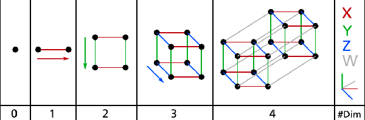

###### 图 8-1. 点、线段、正方形、立方体和四维立方体（0D 到 4D 超立方体）⁠²

事实证明，许多事物在高维空间中表现出非常不同。例如，如果在一个单位正方形（一个 1×1 的正方形）中随机选择一个点，它只有约 0.4%的机会位于距离边界不到 0.001 的位置（换句话说，随机点在任何维度上“极端”的可能性非常小）。但在一个 10000 维单位超立方体中，这个概率大于 99.999999%。高维超立方体中的大多数点都非常靠近边界。⁠³

这里有一个更棘手的差异：如果你在单位正方形中随机选择两个点，这两点之间的距离平均约为 0.52。如果你在 3D 单位立方体中随机选择两个点，平均距离将约为 0.66。但是如果你在一个 100 万维单位超立方体中随机选择两个点呢？平均距离，信不信由你，将约为 408.25（大约<math><msqrt><mfrac bevelled="true"><mrow><mn>1</mn><mo>,</mo><mn>000</mn><mo>,</mo><mn>000</mn></mrow><mn>6</mn></mfrac></msqrt></math>)！这是违反直觉的：当两点都位于同一个单位超立方体内时，它们怎么会相距如此遥远呢？嗯，在高维空间中有很多空间。因此，高维数据集很可能非常稀疏：大多数训练实例可能相互之间相距很远。这也意味着新实例很可能与任何训练实例相距很远，使得预测比在低维度中不可靠得多，因为它们将基于更大的外推。简而言之，训练集的维度越高，过拟合的风险就越大。

理论上，解决维度灾难的一个方法可能是增加训练集的大小，以达到足够密度的训练实例。不幸的是，在实践中，达到给定密度所需的训练实例数量随着维度的增加呈指数增长。仅仅具有 100 个特征——明显少于 MNIST 问题中的特征数量——这些特征范围从 0 到 1，你需要的训练实例数量将超过可观察宇宙中的原子数量，以便训练实例在平均情况下相距 0.1，假设它们均匀分布在所有维度上。

# 降维的主要方法

在我们深入研究具体的降维算法之前，让我们看一看降维的两种主要方法：投影和流形学习。

## 投影

在大多数实际问题中，训练实例并*不*均匀分布在所有维度上。许多特征几乎是恒定的，而其他特征高度相关（正如前面讨论的 MNIST）。因此，所有训练实例都位于（或接近）高维空间中的一个更低维度*子空间*内。这听起来很抽象，让我们看一个例子。在图 8-2 中，你可以看到由小球表示的 3D 数据集。

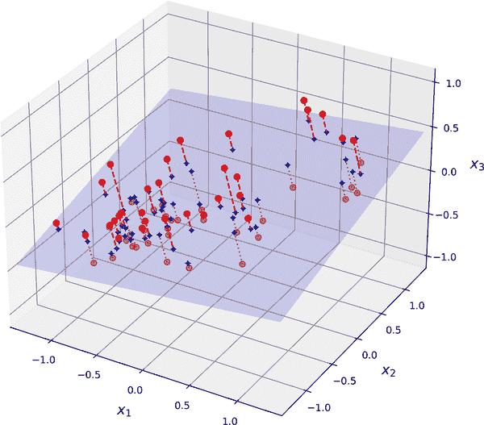

###### 图 8-2\. 一个接近 2D 子空间的 3D 数据集

注意到所有训练实例都接近一个平面：这是高维（3D）空间中的一个低维（2D）子空间。如果我们将每个训练实例垂直投影到这个子空间上（如短虚线连接实例到平面），我们得到了在图 8-3 中显示的新的 2D 数据集。哇！我们刚刚将数据集的维度从 3D 降低到 2D。请注意，轴对应于新特征*z*[1]和*z*[2]：它们是平面上投影的坐标。

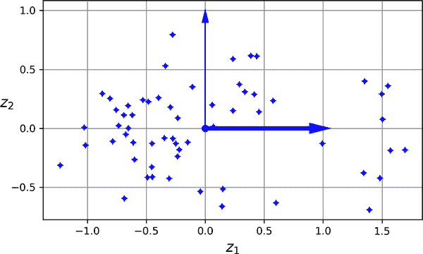

###### 图 8-3\. 投影后的新 2D 数据集

## 流形学习

然而，投影并不总是降维的最佳方法。在许多情况下，子空间可能扭曲变化，例如在著名的瑞士卷玩具数据集中所示的图 8-4。

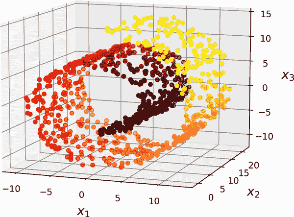

###### 图 8-4\. 瑞士卷数据集

简单地投影到平面上（例如，通过删除*x*[3]）会将瑞士卷的不同层压缩在一起，如图 8-5 的左侧所示。你可能想要的是展开瑞士卷，以获得图 8-5 右侧的 2D 数据集。

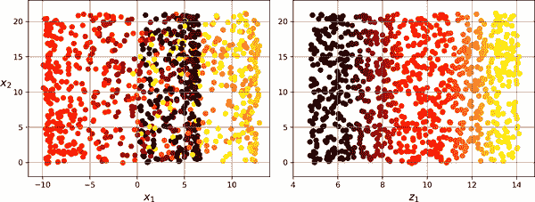

###### 图 8-5\. 投影到平面上压缩（左）与展开瑞士卷（右）

瑞士卷是一个 2D *流形*的例子。简单地说，一个 2D 流形是一个可以在更高维空间中弯曲和扭曲的 2D 形状。更一般地，一个*d*维流形是一个*n*维空间的一部分（其中*d* < *n*），在局部上类似于一个*d*维超平面。在瑞士卷的情况下，*d* = 2，*n* = 3：它在局部上类似于一个 2D 平面，但在第三维中卷曲。

许多降维算法通过对训练实例所在的流形进行建模来工作；这称为*流形学习*。它依赖于*流形假设*，也称为*流形假设*，即大多数真实世界的高维数据集接近一个低维流形。这种假设经常在实践中被观察到。

再次想想 MNIST 数据集：所有手写数字图像都有一些相似之处。它们由连接的线条组成，边界是白色的，它们大致居中。如果您随机生成图像，只有极小的一部分会看起来像手写数字。换句话说，如果您尝试创建一个数字图像，可用的自由度要比您允许生成任何图像时的自由度大大降低。这些约束往往会将数据集压缩到一个低维流形中。

流形假设通常伴随着另一个隐含的假设：如果在流形的低维空间中表达任务（例如分类或回归），那么任务会更简单。例如，在图 8-6 的顶部行中，瑞士卷被分为两类：在 3D 空间中（左侧）决策边界会相当复杂，但在 2D 展开的流形空间中（右侧）决策边界是一条直线。

然而，这种隐含的假设并不总是成立。例如，在图 8-6 的底部行，决策边界位于*x*[1] = 5。这个决策边界在原始的 3D 空间中看起来非常简单（一个垂直平面），但在展开的流形中看起来更复杂（四个独立线段的集合）。

简而言之，在训练模型之前减少训练集的维度通常会加快训练速度，但并不总是会导致更好或更简单的解决方案；这完全取决于数据集。

希望您现在对维度诅咒有了一个很好的理解，以及降维算法如何对抗它，特别是在流形假设成立时。本章的其余部分将介绍一些最流行的降维算法。

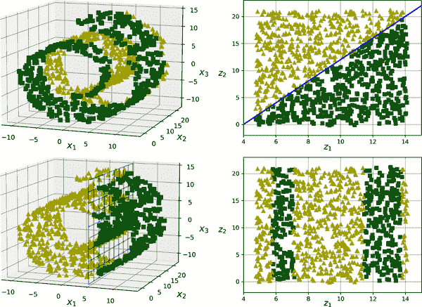

###### 图 8-6。降维后决策边界可能并不总是更简单

# PCA

*主成分分析*（PCA）是迄今为止最流行的降维算法。首先它确定与数据最接近的超平面，然后将数据投影到该超平面上，就像在图 8-2 中一样。

## 保留方差

在将训练集投影到低维超平面之前，您首先需要选择正确的超平面。例如，一个简单的 2D 数据集在图 8-7 的左侧表示，以及三个不同的轴（即 1D 超平面）。右侧是数据集投影到每个轴上的结果。正如您所看到的，对实线的投影保留了最大的方差（顶部），而对虚线的投影保留了很少的方差（底部），对虚线的投影保留了中等数量的方差（中部）。

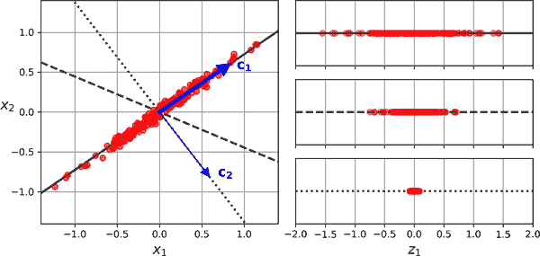

###### 图 8-7。选择要投影的子空间

选择保留最大方差量的轴似乎是合理的，因为它很可能会比其他投影丢失更少的信息。另一个证明这种选择的方法是，它是最小化原始数据集与其在该轴上的投影之间的均方距离的轴。这是[PCA](https://homl.info/pca)背后的相当简单的想法。⁠⁴

## 主成分

PCA 确定在训练集中占据最大方差量的轴。在图 8-7 中，它是实线。它还找到第二个轴，与第一个轴正交，占剩余方差的最大部分。在这个 2D 示例中没有选择：它是虚线。如果是高维数据集，PCA 还会找到第三个轴，与前两个轴正交，以及第四个、第五个等等——与数据集中的维数一样多的轴。

第*i*轴称为数据的第*i*个*主成分*（PC）。在图 8-7 中，第一个 PC 是向量**c**[**1**]所在的轴，第二个 PC 是向量**c**[**2**]所在的轴。在图 8-2 中，前两个 PC 位于投影平面上，第三个 PC 是与该平面正交的轴。在投影之后，在图 8-3 中，第一个 PC 对应于*z*[1]轴，第二个 PC 对应于*z*[2]轴。

###### 注意

对于每个主成分，PCA 找到一个指向 PC 方向的零中心单位向量。由于两个相对的单位向量位于同一轴上，PCA 返回的单位向量的方向不稳定：如果稍微扰动训练集并再次运行 PCA，则单位向量可能指向与原始向量相反的方向。但是，它们通常仍然位于相同的轴上。在某些情况下，一对单位向量甚至可能旋转或交换（如果沿这两个轴的方差非常接近），但是它们定义的平面通常保持不变。

那么如何找到训练集的主成分呢？幸运的是，有一种称为*奇异值分解*（SVD）的标准矩阵分解技术，可以将训练集矩阵**X**分解为三个矩阵**U** **Σ** **V**^⊺的矩阵乘法，其中**V**包含定义您正在寻找的所有主成分的单位向量，如方程 8-1 所示。

##### 第 8-1 方程。主成分矩阵

<math display="block"><mrow><mi mathvariant="bold">V</mi> <mo>=</mo> <mfenced open="(" close=")"><mtable><mtr><mtd><mo>∣</mo></mtd> <mtd><mo>∣</mo></mtd> <mtd><mo>∣</mo></mtd></mtr> <mtr><mtd><msub><mi mathvariant="bold">c</mi> <mn>1</mn></msub></mtd> <mtd><msub><mi mathvariant="bold">c</mi> <mn>2</mn></msub></td> <mtd><mo>⋯</mo></mtd> <mtd><msub><mi mathvariant="bold">c</mi> <mi mathvariant="italic">n</mi></msub></mtd></mtr> <mtr><mtd><mo>∣</mo></mtd> <mtd><mo>∣</mo></mtd> <mtd><mo>∣</mo></mtd></mtr></mtable></mfenced></mrow></math>

以下 Python 代码使用 NumPy 的`svd()`函数获取在图 8-2 中表示的 3D 训练集的所有主成分，然后提取定义前两个 PC 的两个单位向量：

```py
import numpy as np

X = [...]  # create a small 3D dataset
X_centered = X - X.mean(axis=0)
U, s, Vt = np.linalg.svd(X_centered)
c1 = Vt[0]
c2 = Vt[1]
```

###### 警告

PCA 假定数据集围绕原点居中。正如您将看到的，Scikit-Learn 的 PCA 类会为您处理数据的中心化。如果您自己实现 PCA（如前面的示例中），或者使用其他库，请不要忘记首先对数据进行中心化。

## 投影到 d 维

一旦确定了所有主成分，您可以通过将数据集投影到由前 *d* 个主成分定义的超平面上来将数据集的维度降低到 *d* 维。选择这个超平面可以确保投影尽可能保留更多的方差。例如，在 Figure 8-2 中，3D 数据集被投影到由前两个主成分定义的 2D 平面上，保留了数据集大部分的方差。因此，2D 投影看起来非常像原始的 3D 数据集。

将训练集投影到超平面上，并获得降维后的数据集 **X**[*d*-proj]，维度为 *d*，计算训练集矩阵 **X** 与矩阵 **W**[*d*] 的矩阵乘法，其中 **W**[*d*] 定义为包含 **V** 的前 *d* 列的矩阵，如 Equation 8-2 所示。

##### Equation 8-2\. 将训练集投影到 *d* 维

<math display="block"><mrow><msub><mi mathvariant="bold">X</mi> <mrow><mi>d</mi><mtext>-proj</mtext></mrow></msub> <mo>=</mo> <mi mathvariant="bold">X</mi> <msub><mi mathvariant="bold">W</mi> <mi>d</mi></msub></mrow></math>

以下 Python 代码将训练集投影到由前两个主成分定义的平面上：

```py
W2 = Vt[:2].T
X2D = X_centered @ W2
```

就是这样！现在你知道如何通过将数据集投影到任意维度来降低数据集的维度，同时尽可能保留更多的方差。

## 使用 Scikit-Learn

Scikit-Learn 的 `PCA` 类使用 SVD 来实现 PCA，就像我们在本章中之前所做的那样。以下代码应用 PCA 将数据集的维度降低到两个维度（请注意，它会自动处理数据的居中）：

```py
from sklearn.decomposition import PCA

pca = PCA(n_components=2)
X2D = pca.fit_transform(X)
```

在将 `PCA` 转换器拟合到数据集后，其 `components_` 属性保存了 **W**[*d*] 的转置：它包含了前 *d* 个主成分的每一行。

## 解释方差比

另一个有用的信息是每个主成分的*解释方差比*，可以通过 `explained_variance_ratio_` 变量获得。该比率表示数据集方差沿着每个主成分的比例。例如，让我们看看在 Figure 8-2 中表示的 3D 数据集的前两个主成分的解释方差比：

```py
>>> pca.explained_variance_ratio_
array([0.7578477 , 0.15186921])
```

这个输出告诉我们大约 76% 的数据集方差沿着第一个主成分，大约 15% 沿着第二个主成分。这留下了约 9% 给第三个主成分，因此可以合理地假设第三个主成分可能携带的信息很少。

## 选择正确的维度数量

不要随意选择要降维到的维度数量，更简单的方法是选择维度数量，使其总和占方差的足够大比例，比如 95%（当然，有一个例外，如果你是为了数据可视化而降维，那么你会希望将维度降低到 2 或 3）。

以下代码加载并拆分 MNIST 数据集（在 Chapter 3 中介绍），并在不降维的情况下执行 PCA，然后计算保留训练集 95% 方差所需的最小维度数量：

```py
from sklearn.datasets import fetch_openml

mnist = fetch_openml('mnist_784', as_frame=False)
X_train, y_train = mnist.data[:60_000], mnist.target[:60_000]
X_test, y_test = mnist.data[60_000:], mnist.target[60_000:]

pca = PCA()
pca.fit(X_train)
cumsum = np.cumsum(pca.explained_variance_ratio_)
d = np.argmax(cumsum >= 0.95) + 1  # d equals 154
```

然后，您可以将 `n_components=d`，再次运行 PCA，但有一个更好的选择。而不是指定要保留的主成分数量，您可以将 `n_components` 设置为介于 0.0 和 1.0 之间的浮点数，表示您希望保留的方差比例：

```py
pca = PCA(n_components=0.95)
X_reduced = pca.fit_transform(X_train)
```

实际的主成分数量是在训练过程中确定的，并存储在 `n_components_` 属性中：

```py
>>> pca.n_components_
154
```

另一个选项是将解释的方差作为维度数量的函数绘制出来（简单地绘制`cumsum`；参见图 8-8）。曲线通常会出现一个拐点，解释的方差增长速度会变慢。在这种情况下，您可以看到将维度降低到约 100 维不会丢失太多解释的方差。

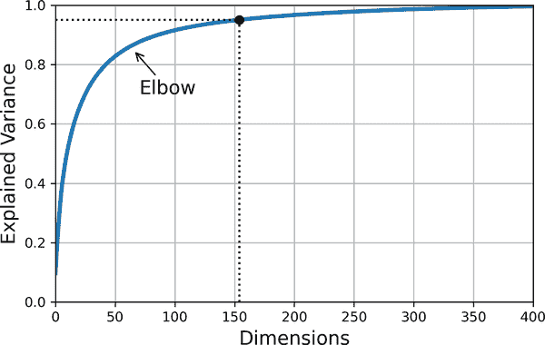

###### 图 8-8。解释的方差作为维度数量的函数

最后，如果您将降维作为监督学习任务（例如分类）的预处理步骤，则可以像调整任何其他超参数一样调整维度数量（参见第二章）。例如，以下代码示例创建了一个两步流水线，首先使用 PCA 降低维度，然后使用随机森林进行分类。接下来，它使用`RandomizedSearchCV`来找到 PCA 和随机森林分类器的超参数的良好组合。此示例进行了快速搜索，仅调整了 2 个超参数，在仅训练了 1,000 个实例的情况下运行了仅 10 次迭代，但如果您有时间，请随时进行更彻底的搜索：

```py
from sklearn.ensemble import RandomForestClassifier
from sklearn.model_selection import RandomizedSearchCV
from sklearn.pipeline import make_pipeline

clf = make_pipeline(PCA(random_state=42),
                    RandomForestClassifier(random_state=42))
param_distrib = {
    "pca__n_components": np.arange(10, 80),
    "randomforestclassifier__n_estimators": np.arange(50, 500)
}
rnd_search = RandomizedSearchCV(clf, param_distrib, n_iter=10, cv=3,
                                random_state=42)
rnd_search.fit(X_train[:1000], y_train[:1000])
```

让我们看看找到的最佳超参数：

```py
>>> print(rnd_search.best_params_)
{'randomforestclassifier__n_estimators': 465, 'pca__n_components': 23}
```

有趣的是最佳组件数量是多么低：我们将一个 784 维数据集减少到只有 23 维！这与我们使用了随机森林这一强大模型有关。如果我们改用线性模型，例如`SGDClassifier`，搜索会发现我们需要保留更多维度（约 70 个）。

## 用于压缩的 PCA

降维后，训练集占用的空间大大减少。例如，将 PCA 应用于 MNIST 数据集并保留 95%的方差后，我们只剩下 154 个特征，而不是原始的 784 个特征。因此，数据集现在不到原始大小的 20%，而且我们仅损失了 5%的方差！这是一个合理的压缩比率，很容易看出这种大小的减小会极大地加快分类算法的速度。

还可以通过应用 PCA 投影的逆变换将缩减的数据集解压缩回 784 维。这不会给您原始数据，因为投影丢失了一些信息（在丢弃的 5%方差内），但它可能接近原始数据。原始数据和重构数据（压缩然后解压缩）之间的均方距离称为*重构误差*。

`inverse_transform()`方法让我们将降维后的 MNIST 数据集解压缩回 784 维：

```py
X_recovered = pca.inverse_transform(X_reduced)
```

图 8-9 展示了原始训练集中的一些数字（左侧），以及压缩和解压缩后的相应数字。您可以看到存在轻微的图像质量损失，但数字仍然基本完整。

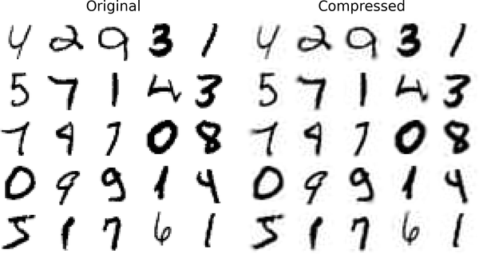

###### 图 8-9。保留 95%方差的 MNIST 压缩

逆变换的方程式显示在方程 8-3 中。

##### 方程 8-3。PCA 逆变换，回到原始维度数量

<math display="block"><mrow><msub><mi mathvariant="bold">X</mi> <mtext>recovered</mtext></msub> <mo>=</mo> <msub><mi mathvariant="bold">X</mi> <mrow><mi>d</mi><mtext>-proj</mtext></mrow></msub> <msup><mrow><msub><mi mathvariant="bold">W</mi> <mi>d</mi></msub></mrow> <mo>⊺</mo></msup></mrow></math>

## 随机 PCA

如果将`svd_solver`超参数设置为`"randomized"`，Scikit-Learn 将使用一种称为*随机 PCA*的随机算法，快速找到前*d*个主成分的近似值。其计算复杂度为*O*(*m* × *d*²) + *O*(*d*³)，而不是完整 SVD 方法的*O*(*m* × *n*²) + *O*(*n*³)，因此当*d*远小于*n*时，它比完整 SVD 快得多：

```py
rnd_pca = PCA(n_components=154, svd_solver="randomized", random_state=42)
X_reduced = rnd_pca.fit_transform(X_train)
```

###### 提示

默认情况下，`svd_solver` 实际上设置为 `"auto"`：Scikit-Learn 在 max(*m*, *n*) > 500 且 `n_components` 是小于 min(*m*, *n*) 的 80%的整数时，自动使用随机化 PCA 算法，否则使用完整的 SVD 方法。因此，即使删除了 `svd_solver="randomized"` 参数，上述代码也会使用随机化 PCA 算法，因为 154 < 0.8 × 784。如果要强制 Scikit-Learn 使用完整的 SVD 以获得稍微更精确的结果，可以将 `svd_solver` 超参数设置为 `"full"`。

## 增量 PCA

PCA 的前述实现的一个问题是，为了使算法运行，整个训练集必须适合内存。幸运的是，已经开发出了*增量 PCA*（IPCA）算法，允许您将训练集分成小批次，并逐个小批次馈送这些数据。这对于大型训练集以及在线应用 PCA（即，随着新实例的到来而进行）非常有用。

以下代码将 MNIST 训练集分成 100 个小批次（使用 NumPy 的 `array_split()` 函数），并将它们馈送给 Scikit-Learn 的 `IncrementalPCA` 类来将 MNIST 数据集的维度降低到 154 维，就像以前一样。请注意，您必须对每个小批次调用 `partial_fit()` 方法，而不是对整个训练集调用 `fit()` 方法：

```py
from sklearn.decomposition import IncrementalPCA

n_batches = 100
inc_pca = IncrementalPCA(n_components=154)
for X_batch in np.array_split(X_train, n_batches):
    inc_pca.partial_fit(X_batch)

X_reduced = inc_pca.transform(X_train)
```

或者，您可以使用 NumPy 的 `memmap` 类，它允许您像在内存中一样操作存储在磁盘上的二进制文件中的大数组；该类仅在需要时将数据加载到内存中。为了演示这一点，让我们首先创建一个内存映射（memmap）文件，并将 MNIST 训练集复制到其中，然后调用 `flush()` 来确保任何仍在缓存中的数据被保存到磁盘。在现实生活中，`X_train` 通常不会完全适合内存，因此您需要逐块加载它并将每个块保存到 memmap 数组的正确部分：

```py
filename = "my_mnist.mmap"
X_mmap = np.memmap(filename, dtype='float32', mode='write', shape=X_train.shape)
X_mmap[:] = X_train  # could be a loop instead, saving the data chunk by chunk
X_mmap.flush()
```

接下来，我们可以加载 memmap 文件并像常规 NumPy 数组一样使用它。让我们使用 `IncrementalPCA` 类来降低其维度。由于该算法在任何给定时间仅使用数组的一小部分，内存使用保持在控制之下。这使得可以调用通常的 `fit()` 方法而不是 `partial_fit()` 方法，这非常方便：

```py
X_mmap = np.memmap(filename, dtype="float32", mode="readonly").reshape(-1, 784)
batch_size = X_mmap.shape[0] // n_batches
inc_pca = IncrementalPCA(n_components=154, batch_size=batch_size)
inc_pca.fit(X_mmap)
```

###### 警告

只有原始的二进制数据保存在磁盘上，因此在加载时需要指定数组的数据类型和形状。如果省略形状，`np.memmap()` 将返回一个一维数组。

对于非常高维的数据集，PCA 可能太慢了。正如您之前看到的，即使使用随机化 PCA，其计算复杂度仍然是 *O*(*m* × *d*²) + *O*(*d*³)，因此目标维数 *d* 不应太大。如果您处理的数据集具有成千上万个特征或更多（例如，图像），那么训练可能会变得非常缓慢：在这种情况下，您应该考虑使用随机投影。

# 随机投影

正如其名称所示，随机投影算法使用随机线性投影将数据投影到较低维度的空间。这听起来可能很疯狂，但事实证明，这样的随机投影实际上很可能相当好地保留距离，正如 William B. Johnson 和 Joram Lindenstrauss 在一个著名的引理中数学上证明的那样。因此，两个相似的实例在投影后仍然保持相似，而两个非常不同的实例在投影后仍然保持非常不同。

显然，你丢弃的维度越多，丢失的信息就越多，距离就会变得更加扭曲。那么你如何选择最佳的维度数量呢？Johnson 和 Lindenstrauss 提出了一个方程，确定保留的最小维度数量，以确保——高概率下——距离不会改变超过给定的容差。例如，如果你有一个包含*m*=5,000 个实例，每个实例有*n*=20,000 个特征的数据集，你不希望任意两个实例之间的平方距离变化超过*ε*=10%，⁶，那么你应该将数据投影到*d*维度，其中*d*≥4 log(*m*) / (½ *ε*² - ⅓ *ε*³)，即 7,300 维度。这是一个相当显著的降维！请注意，这个方程不使用*n*，它只依赖于*m*和*ε*。这个方程由`johnson_lindenstrauss_min_dim()`函数实现：

```py
>>> from sklearn.random_projection import johnson_lindenstrauss_min_dim
>>> m, ε = 5_000, 0.1
>>> d = johnson_lindenstrauss_min_dim(m, eps=ε)
>>> d
7300
```

现在我们可以生成一个形状为[*d*, *n*]的随机矩阵**P**，其中每个项都是从均值为 0，方差为 1 / *d*的高斯分布中随机抽样的，然后用它将数据集从*n*维度投影到*d*维度：

```py
n = 20_000
np.random.seed(42)
P = np.random.randn(d, n) / np.sqrt(d)  # std dev = square root of variance

X = np.random.randn(m, n)  # generate a fake dataset
X_reduced = X @ P.T
```

这就是全部！它简单高效，无需训练：算法需要创建随机矩阵的唯一信息是数据集的形状。数据本身根本没有被使用。

Scikit-Learn 提供了一个`GaussianRandomProjection`类，可以做我们刚才做的事情：当你调用它的`fit()`方法时，它使用`johnson_lindenstrauss_min_dim()`来确定输出的维度，然后生成一个随机矩阵，存储在`components_`属性中。然后当你调用`transform()`时，它使用这个矩阵来执行投影。在创建转换器时，如果你想调整*ε*，可以设置`eps`（默认为 0.1），如果你想强制特定的目标维度*d*，可以设置`n_components`。以下代码示例给出了与前面代码相同的结果（你也可以验证`gaussian_rnd_proj.components_`等于`P`）：

```py
from sklearn.random_projection import GaussianRandomProjection

gaussian_rnd_proj = GaussianRandomProjection(eps=ε, random_state=42)
X_reduced = gaussian_rnd_proj.fit_transform(X)  # same result as above
```

Scikit-Learn 还提供了第二个随机投影转换器，称为`SparseRandomProjection`。它以相同的方式确定目标维度，生成相同形状的随机矩阵，并执行相同的投影。主要区别在于随机矩阵是稀疏的。这意味着它使用的内存要少得多：在前面的例子中，约 25 MB，而不是将近 1.2 GB！而且它也更快，无论是生成随机矩阵还是降维：在这种情况下，大约快 50%。此外，如果输入是稀疏的，转换会保持稀疏（除非你设置`dense_output=True`）。最后，它享有与之前方法相同的保持距离性质，降维的质量是可比较的。简而言之，通常最好使用这个转换器而不是第一个，特别是对于大型或稀疏数据集。

稀疏随机矩阵中非零项的比率*r*称为其*密度*。默认情况下，它等于<math><mn>1</mn><mo>/</mo><msqrt><mi>n</mi></msqrt></math>。有了 20,000 个特征，这意味着随机矩阵中大约 141 个单元格中只有 1 个是非零的：这是相当稀疏的！如果你愿意，你可以将`density`超参数设置为另一个值。稀疏随机矩阵中的每个单元格有一个概率*r*是非零的，每个非零值要么是–*v*，要么是+*v*（两者概率相等），其中*v*=<math><mn>1</mn><mo>/</mo><msqrt><mi>d</mi><mi>r</mi></msqrt></math>。

如果你想执行逆变换，你首先需要使用 SciPy 的`pinv()`函数计算组件矩阵的伪逆，然后将减少的数据乘以伪逆的转置：

```py
components_pinv = np.linalg.pinv(gaussian_rnd_proj.components_)
X_recovered = X_reduced @ components_pinv.T
```

###### 警告

如果组件矩阵很大，计算伪逆可能需要很长时间，因为`pinv()`的计算复杂度是*O*(*dn*²)（如果*d*<*n*），否则是*O*(*nd*²)。

总之，随机投影是一种简单、快速、内存高效且令人惊讶地强大的降维算法，尤其在处理高维数据集时应该牢记。

###### 注意

随机投影并不总是用于降低大型数据集的维度。例如，Sanjoy Dasgupta 等人的一篇[2017 年论文](https://homl.info/flies)显示，果蝇的大脑实现了一种类似随机投影的模拟，将密集的低维嗅觉输入映射到稀疏的高维二进制输出：对于每种气味，只有少数输出神经元被激活，但相似的气味会激活许多相同的神经元。这类似于一个名为*局部敏感哈希*（LSH）的著名算法，通常用于搜索引擎以将相似的文档分组。

# LLE

[*局部线性嵌入*（LLE）](https://homl.info/lle)是一种*非线性降维*（NLDR）技术。它是一种流形学习技术，不依赖于投影，不同于 PCA 和随机投影。简而言之，LLE 首先衡量每个训练实例与其最近邻的线性关系，然后寻找训练集的低维表示，以便最好地保留这些局部关系（稍后详细介绍）。这种方法使其特别擅长展开扭曲的流形，尤其是在噪声不多时。

以下代码制作了一个瑞士卷，然后使用 Scikit-Learn 的`LocallyLinearEmbedding`类来展开它：

```py
from sklearn.datasets import make_swiss_roll
from sklearn.manifold import LocallyLinearEmbedding

X_swiss, t = make_swiss_roll(n_samples=1000, noise=0.2, random_state=42)
lle = LocallyLinearEmbedding(n_components=2, n_neighbors=10, random_state=42)
X_unrolled = lle.fit_transform(X_swiss)
```

变量`t`是一个包含每个实例沿瑞士卷轴位置的 1D NumPy 数组。在这个示例中我们没有使用它，但它可以用作非线性回归任务的目标。

生成的 2D 数据集显示在图 8-10 中。如您所见，瑞士卷完全展开，实例之间的距离在局部上得到很好保留。然而，在较大尺度上距离并没有得到保留：展开的瑞士卷应该是一个矩形，而不是这种被拉伸和扭曲的带状。尽管如此，LLE 在对流形建模方面做得相当不错。

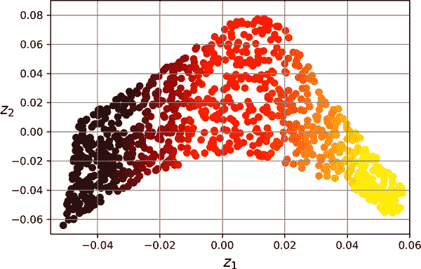

###### 图 8-10。使用 LLE 展开的瑞士卷

LLE 的工作原理如下：对于每个训练实例**x**^((*i*))，算法识别其*k*个最近邻居（在前面的代码中*k*=10），然后尝试将**x**^((*i*))重构为这些邻居的线性函数。更具体地说，它尝试找到权重*w*[*i,j*]，使得**x**^((*i*))和<math><mrow><msubsup><mo>∑</mo> <mrow><mi>j</mi><mo>=</mo><mn>1</mn></mrow> <mi>m</mi></msubsup> <mrow><msub><mi>w</mi> <mrow><mi>i</mi><mo>,</mo><mi>j</mi></mrow></msub> <msup><mi mathvariant="bold">x</mi> <mrow><mo>(</mo><mi>j</mi><mo>)</mo></mrow></msup></mrow></mrow></math>的平方距离尽可能小，假设如果**x**^((*j*))不是**x**^((*i*))的*k*个最近邻居之一，则*w*[*i,j*]=0。因此，LLE 的第一步是方程 8-4 中描述的约束优化问题，其中**W**是包含所有权重*w*[*i,j*]的权重矩阵。第二个约束只是为每个训练实例**x**^((*i*))归一化权重。

##### 方程 8-4。LLE 第 1 步：线性建模局部关系

<math display="block"><mtable displaystyle="true"><mtr><mtd columnalign="left"><mrow><mover accent="true"><mi mathvariant="bold">W</mi> <mo>^</mo></mover> <mo>=</mo> <munder><mo form="prefix">argmin</mo> <mi mathvariant="bold">W</mi></munder> <mstyle scriptlevel="0" displaystyle="true"><munderover><mo>∑</mo> <mrow><mi>i</mi><mo>=</mo><mn>1</mn></mrow> <mi>m</mi></munderover></mstyle> <msup><mfenced separators="" open="(" close=")"><msup><mi mathvariant="bold">x</mi> <mrow><mo>(</mo><mi>i</mi><mo>)</mrow></msup> <mo>-</mo><munderover><mo>∑</mo> <mrow><mi>j</mi><mo>=</mo><mn>1</mn></mrow> <mi>m</mi></munderover> <msub><mi>w</mi> <mrow><mi>i</mi><mo>,</mo><mi>j</mi></mrow></msub> <msup><mi mathvariant="bold">x</mi> <mrow><mo>(</mo><mi>j</mi><mo>)</mrow></msup></mfenced> <mn>2</mn></msup></mrow></mtd></mtr> <mtr><mtd columnalign="left"><mrow><mtext>subject</mtext> <mtext>to</mtext> <mfenced separators="" open="{" close=""><mtable><mtr><mtd columnalign="left"><mrow><msub><mi>w</mi> <mrow><mi>i</mi><mo>,</mo><mi>j</mi></mrow></msub> <mo>=</mo> <mn>0</mn></mrow></mtd> <mtd columnalign="left"><mrow><mtext>if</mtext> <msup><mi mathvariant="bold">x</mi> <mrow><mo>(</mo><mi>j</mi><mo>)</mrow></msup> <mtext>is</mtext> <mtext>not</mtext> <mtext>one</mtext> <mtext>of</mtext> <mtext>the</mtext> <mi>k</mi> <mtext>n.n.</mtext> <mtext>of</mtext> <msup><mi mathvariant="bold">x</mi> <mrow><mo>(</mo><mi>i</mi><mo>)</mrow></msup></mrow></mtd></mtr> <mtr><mtd columnalign="left"><mrow><munderover><mo>∑</mo> <mrow><mi>j</mi><mo>=</mo><mn>1</mn></mrow> <mi>m</mi></munderover> <msub><mi>w</mi> <mrow><mi>i</mi><mo>,</mo><mi>j</mi></mrow></msub> <mo>=</mo> <mn>1</mn></mrow></mtd> <mtd columnalign="left"><mrow><mtext>for</mtext> <mi>i</mi> <mo>=</mo> <mn>1</mn> <mo>,</mo> <mn>2</mn> <mo>,</mo> <mo>⋯</mo> <mo>,</mo> <mi>m</mi></mrow></mtd></mtr></mtable></mfenced></mrow></mtd></mtr></mtable></math>

在这一步之后，权重矩阵 <math><mover accent="true"><mi mathvariant="bold">W</mi> <mo>^</mo></mover></math>（包含权重 <math><msub><mover><mi>w</mi><mo>^</mo></mover><mrow><mi>i</mi><mo>,</mo><mi>j</mi></mrow></msub></math>）编码了训练实例之间的局部线性关系。第二步是将训练实例映射到一个 *d* 维空间（其中 *d* < *n*），同时尽可能保持这些局部关系。如果 **z**^((*i*)) 是在这个 *d* 维空间中 **x**^((*i*)) 的映像，那么我们希望 **z**^((*i*)) 和 <math><mrow><msubsup><mo>∑</mo> <mrow><mi>j</mi><mo>=</mo><mn>1</mn></row> <mi>m</mi></msubsup> <mrow><msub><mover accent="true"><mi>w</mi> <mo>^</mo></mover> <mrow><mi>i</mi><mo>,</mo><mi>j</mi></mrow></msub> <msup><mi mathvariant="bold">z</mi> <mrow><mo>(</mo><mi>j</mi><mo>)</mo></mrow></msup></mrow></mrow></math> 之间的平方距离尽可能小。这个想法导致了方程 8-5 中描述的无约束优化问题。它看起来与第一步非常相似，但是不是保持实例固定并找到最佳权重，而是相反的：保持权重固定并找到实例映像在低维空间中的最佳位置。注意，**Z** 是包含所有 **z**^((*i*)) 的矩阵。

##### 方程 8-5\. LLE 步骤 2：在保持关系的同时降低维度

<math display="block"><mrow><mover accent="true"><mi mathvariant="bold">Z</mi> <mo>^</mo></mover> <mo>=</mo> <munder><mo form="prefix">argmin</mo> <mi mathvariant="bold">Z</mi></munder> <mstyle scriptlevel="0" displaystyle="true"><munderover><mo>∑</mo> <mrow><mi>i</mi><mo>=</mo><mn>1</mn></mrow> <mi>m</mi></munderover></mstyle> <msup><mfenced separators="" open="(" close=")"><msup><mi mathvariant="bold">z</mi> <mrow><mo>(</mo><mi>i</mi><mo>)</mo></mrow></msup> <mo>-</mo><munderover><mo>∑</mo> <mrow><mi>j</mi><mo>=</mo><mn>1</mn></mrow> <mi>m</mi></munderover> <msub><mover accent="true"><mi>w</mi> <mo>^</mo></mover> <mrow><mi>i</mi><mo>,</mo><mi>j</mi></mrow></msub> <msup><mi mathvariant="bold">z</mi> <mrow><mo>(</mo><mi>j</mi><mo>)</mo></mrow></msup></mfenced> <mn>2</mn></msup></mrow></math>

Scikit-Learn 的 LLE 实现具有以下计算复杂度：*O*(*m* log(*m*)*n* log(*k*))用于查找*k*个最近邻居，*O*(*mnk*³)用于优化权重，*O*(*dm*²)用于构建低维表示。不幸的是，最后一项中的*m*²使得这个算法在处理非常大的数据集时效率低下。

正如您所看到的，LLE 与投影技术有很大不同，它显著更复杂，但也可以构建更好的低维表示，特别是在数据是非线性的情况下。

# 其他降维技术

在我们结束本章之前，让我们快速看一下 Scikit-Learn 中提供的其他几种流行的降维技术：

`sklearn.manifold.MDS`

*多维缩放*（MDS）在尝试保持实例之间的距离的同时降低维度。随机投影可以用于高维数据，但在低维数据上效果不佳。

`sklearn.manifold.Isomap`

*Isomap*通过将每个实例连接到其最近邻来创建图，然后在尝试保持实例之间的*测地距离*的同时降低维度。图中两个节点之间的测地距离是这两个节点之间最短路径上的节点数。

`sklearn.manifold.TSNE`

*t-分布随机邻域嵌入*（t-SNE）在尝试保持相似实例接近和不相似实例分开的同时降低维度。它主要用于可视化，特别是用于在高维空间中可视化实例的聚类。例如，在本章末尾的练习中，您将使用 t-SNE 来可视化 MNIST 图像的 2D 地图。

`sklearn.discriminant_analysis.LinearDiscriminantAnalysis`

*线性判别分析*（LDA）是一种线性分类算法，在训练过程中学习类别之间最具区分性的轴。然后可以使用这些轴来定义一个超平面，将数据投影到该超平面上。这种方法的好处是投影将尽可能地使类别保持分开，因此 LDA 是在运行另一个分类算法之前降低维度的好技术（除非仅使用 LDA 就足够）。

图 8-11 展示了 MDS、Isomap 和 t-SNE 在瑞士卷上的结果。MDS 成功将瑞士卷展平而不丢失其全局曲率，而 Isomap 则完全丢失了曲率。根据下游任务的不同，保留大尺度结构可能是好事或坏事。t-SNE 在展平瑞士卷方面做得相当不错，保留了一些曲率，并且还放大了聚类，将卷撕裂开。同样，这可能是好事或坏事，取决于下游任务。

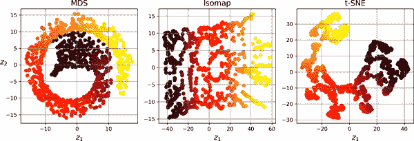

###### 图 8-11。使用各种技术将瑞士卷降维为 2D

# 练习

1.  降低数据集维度的主要动机是什么？主要缺点是什么？

1.  维度诅咒是什么？

1.  一旦数据集的维度降低了，是否可以反转操作？如果可以，如何操作？如果不行，为什么？

1.  PCA 能用于降低高度非线性数据集的维度吗？

1.  假设您对一个 1000 维数据集执行 PCA，将解释的方差比设置为 95%。结果数据集将有多少维度？

1.  在什么情况下会使用常规 PCA、增量 PCA、随机 PCA 或随机投影？

1.  如何评估数据集上降维算法的性能？

1.  链两种不同的降维算法有意义吗？

1.  加载 MNIST 数据集（在第三章介绍）并将其分为训练集和测试集（取前 60000 个实例进行训练，剩下的 10000 个进行测试）。在数据集上训练一个随机森林分类器并计时，然后评估测试集上的结果模型。接下来，使用 PCA 降低数据集的维度，解释方差比为 95%。在降维后的数据集上训练一个新的随机森林分类器并查看所需时间。训练速度快了吗？接下来，在测试集上评估分类器。与之前的分类器相比如何？再尝试使用`SGDClassifier`。现在 PCA 有多大帮助？

1.  使用 t-SNE 将 MNIST 数据集的前 5000 个图像降至 2 维，并使用 Matplotlib 绘制结果。您可以使用散点图，使用 10 种不同的颜色表示每个图像的目标类别。或者，您可以用散点图中的每个点替换为相应实例的类别（从 0 到 9 的数字），甚至绘制数字图像本身的缩小版本（如果绘制所有数字，可视化将太混乱，因此您应该绘制一个随机样本或仅在没有其他实例已经绘制在附近距离的情况下绘制一个实例）。您应该得到一个具有良好分离的数字簇的漂亮可视化效果。尝试使用其他降维算法，如 PCA、LLE 或 MDS，并比较结果的可视化效果。

这些练习的解决方案可在本章笔记本的末尾找到，网址为[*https://homl.info/colab3*](https://homl.info/colab3)。

（[1]）嗯，如果计算时间，那就是四维，如果你是弦理论学家，那就更多了。

（[2]）在[*https://homl.info/30*](https://homl.info/30)观看一个在 3D 空间中投影的旋转四维立方体。图片由维基百科用户 NerdBoy1392 提供（[知识共享署名-相同方式共享 3.0](https://creativecommons.org/licenses/by-sa/3.0)）。转载自[*https://en.wikipedia.org/wiki/Tesseract*](https://en.wikipedia.org/wiki/Tesseract)。

（[3]）有趣的事实：如果考虑足够多的维度，你认识的任何人可能在至少一个维度上是极端的（例如，他们在咖啡中放多少糖）。

（[4]）Karl Pearson，“关于空间中点系统的最佳拟合线和平面”，*伦敦、爱丁堡和都柏林哲学杂志和科学杂志* 2，第 11 号（1901 年）：559-572。

（[5]）Scikit-Learn 使用 David A. Ross 等人描述的[算法](https://homl.info/32)，“用于稳健视觉跟踪的增量学习”，*国际计算机视觉杂志* 77，第 1-3 号（2008 年）：125-141。

（[6]）*ε*是希腊字母ε，通常用于表示微小值。

（[7]）Sanjoy Dasgupta 等人，“一个基本计算问题的神经算法”，*Science* 358，第 6364 号（2017 年）：793-796。

（[8]）Sam T. Roweis 和 Lawrence K. Saul，“通过局部线性嵌入进行非线性降维”，*Science* 290，第 5500 号（2000 年）：2323-2326。
