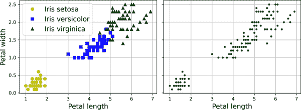
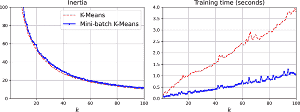
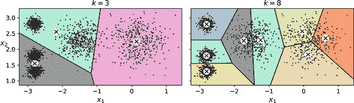
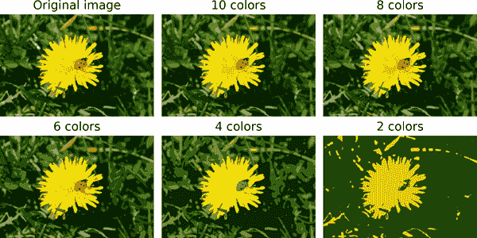
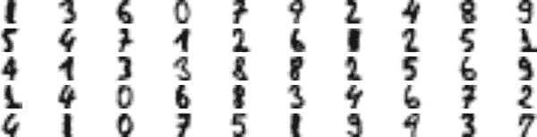
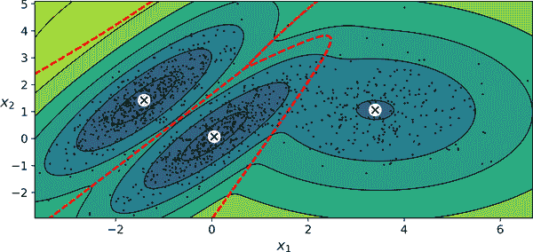
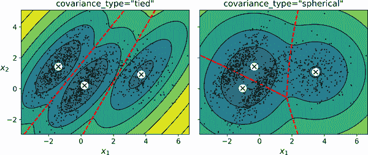
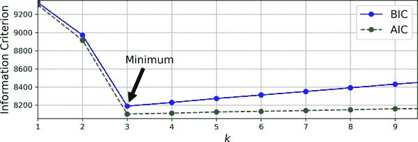
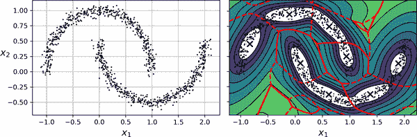

# 第九章 无监督学习技术

尽管今天大多数机器学习应用都是基于监督学习的（因此，这也是大部分投资的方向），但绝大多数可用数据是无标签的：我们有输入特征**X**，但没有标签**y**。计算机科学家 Yann LeCun 曾经说过，“如果智能是一个蛋糕，无监督学习就是蛋糕，监督学习就是蛋糕上的糖衣，而强化学习就是蛋糕上的樱桃。”换句话说，无监督学习中有巨大的潜力，我们只是刚刚开始探索。

假设你想创建一个系统，该系统将拍摄制造生产线上每个物品的几张照片，并检测哪些物品有缺陷。你可以相当容易地创建一个系统，自动拍照，这可能每天给你数千张照片。然后你可以在短短几周内构建一个相当大的数据集。但是等等，没有标签！如果你想训练一个普通的二元分类器，预测物品是否有缺陷，你需要将每张图片标记为“有缺陷”或“正常”。这通常需要人类专家坐下来手动查看所有图片。这是一项漫长、昂贵和繁琐的任务，因此通常只会在可用图片的一小部分上进行。结果，标记的数据集将非常小，分类器的性能将令人失望。此外，每当公司对其产品进行任何更改时，整个过程都需要从头开始。如果算法只能利用无标签数据而无需人类标记每张图片，那不是很好吗？这就是无监督学习的作用。

在第八章中，我们看了最常见的无监督学习任务：降维。在本章中，我们将看一些更多的无监督任务：

聚类

目标是将相似的实例分组到*簇*中。聚类是数据分析、客户细分、推荐系统、搜索引擎、图像分割、半监督学习、降维等领域的重要工具。

异常检测（也称为*离群检测*）

目标是学习“正常”数据的外观，然后利用它来检测异常实例。这些实例被称为*异常值*或*离群值*，而正常实例被称为*内群值*。异常检测在各种应用中非常有用，如欺诈检测、制造中检测有缺陷的产品、识别时间序列中的新趋势，或在训练另一个模型之前从数据集中去除离群值，这可以显著提高结果模型的性能。

密度估计

这是估计生成数据集的随机过程的*概率密度函数*（PDF）的任务。密度估计通常用于异常检测：位于非常低密度区域的实例可能是异常值。它还可用于数据分析和可视化。

准备好享用蛋糕了吗？我们将从两个聚类算法*k*-means 和 DBSCAN 开始，然后讨论高斯混合模型，看看它们如何用于密度估计、聚类和异常检测。

# 聚类算法：k 均值和 DBSCAN

当您在山上徒步时，偶然发现了一种您以前从未见过的植物。您四处看看，发现了更多。它们并不完全相同，但它们足够相似，让您知道它们很可能属于同一物种（或至少同一属）。您可能需要植物学家告诉您那是什么物种，但您肯定不需要专家来识别相似外观的对象组。这就是*聚类*：识别相似实例并将它们分配到*集群*或相似实例组的任务。

就像分类一样，每个实例被分配到一个组。但是，与分类不同，聚类是一个无监督的任务。考虑图 9-1：左边是鸢尾花数据集（在第四章介绍），其中每个实例的物种（即其类）用不同的标记表示。这是一个带标签的数据集，适合使用逻辑回归、SVM 或随机森林分类器等分类算法。右边是相同的数据集，但没有标签，因此您不能再使用分类算法。这就是聚类算法介入的地方：其中许多算法可以轻松检测到左下角的集群。这也很容易用我们的眼睛看到，但上右角的集群由两个不同的子集群组成并不那么明显。也就是说，数据集有两个额外的特征（萼片长度和宽度）在这里没有表示，聚类算法可以很好地利用所有特征，因此实际上它们相当好地识别了三个集群（例如，使用高斯混合模型，150 个实例中只有 5 个被分配到错误的集群）。



###### 图 9-1\. 分类（左）与聚类（右）

聚类在各种应用中使用，包括：

客户细分

您可以根据客户的购买和在您网站上的活动对其进行聚类。这有助于了解您的客户是谁以及他们需要什么，这样您就可以根据每个细分调整您的产品和营销活动。例如，客户细分在*推荐系统*中可能很有用，以建议其他同一集群中的用户喜欢的内容。

数据分析

当您分析新数据集时，运行聚类算法然后分析每个集群单独可能会有所帮助。

降维

一旦数据集被聚类，通常可以测量每个实例与每个集群的*亲和力*；亲和力是衡量实例适合集群程度的任何度量。然后，每个实例的特征向量**x**可以用其集群亲和力的向量替换。如果有*k*个集群，那么这个向量是*k*维的。新向量通常比原始特征向量低得多，但它可以保留足够的信息供进一步处理。

特征工程

集群亲和力通常作为额外特征是有用的。例如，我们在第二章中使用*k*-means 将地理集群亲和特征添加到加利福尼亚住房数据集中，这有助于我们获得更好的性能。

*异常检测*（也称为*离群值检测*）

任何对所有集群的亲和力较低的实例可能是异常值。例如，如果您根据网站用户的行为对其进行了聚类，您可以检测到具有异常行为的用户，例如每秒请求的异常数量。

半监督学习

如果您只有少量标签，您可以执行聚类并将标签传播到同一集群中的所有实例。这种技术可以大大增加后续监督学习算法可用的标签数量，从而提高其性能。

搜索引擎

一些搜索引擎允许您搜索与参考图像相似的图像。要构建这样一个系统，您首先需要将聚类算法应用于数据库中的所有图像；相似的图像将最终位于同一聚类中。然后，当用户提供一个参考图像时，您只需要使用训练过的聚类模型来找到这个图像的聚类，然后简单地返回该聚类中的所有图像。

图像分割

通过根据它们的颜色对像素进行聚类，然后用其聚类的平均颜色替换每个像素的颜色，可以大大减少图像中不同颜色的数量。图像分割在许多对象检测和跟踪系统中使用，因为它使得更容易检测每个对象的轮廓。

对于聚类的定义并没有普遍的定义：它真的取决于上下文，不同的算法将捕捉不同类型的聚类。一些算法寻找围绕特定点集中的实例，称为*中心点*。其他算法寻找连续的密集实例区域：这些聚类可以采用任何形状。一些算法是分层的，寻找聚类的聚类。等等。

在本节中，我们将介绍两种流行的聚类算法，*k*-均值和 DBSCAN，并探讨它们的一些应用，如非线性降维、半监督学习和异常检测。

## k-均值

考虑在图 9-2 中表示的无标签数据集：您可以清楚地看到五个实例的聚类。*k*-均值算法是一种简单的算法，能够非常快速和高效地对这种数据集进行聚类，通常只需几次迭代。它是由贝尔实验室的斯图尔特·劳埃德（Stuart Lloyd）在 1957 年提出的，作为脉冲编码调制的技术，但直到 1982 年才在公司外部[发表](https://homl.info/36)。在 1965 年，爱德华·W·福吉（Edward W. Forgy）几乎发表了相同的算法，因此*k*-均值有时被称为劳埃德-福吉算法。


###### 图 9-2。由五个实例聚类组成的无标签数据集

让我们在这个数据集上训练一个*k*-均值聚类器。它将尝试找到每个聚类的中心，并将每个实例分配给最近的聚类：

```py
from sklearn.cluster import KMeans
from sklearn.datasets import make_blobs

X, y = make_blobs([...])  # make the blobs: y contains the cluster IDs, but we
                          # will not use them; that's what we want to predict
k = 5
kmeans = KMeans(n_clusters=k, random_state=42)
y_pred = kmeans.fit_predict(X)
```

请注意，您必须指定算法必须找到的聚类数*k*。在这个例子中，从数据看，*k*应该设置为 5 是相当明显的，但一般来说并不那么容易。我们将很快讨论这个问题。

每个实例将被分配到五个聚类中的一个。在聚类的上下文中，实例的*标签*是算法分配给该实例的聚类的索引；这不应与分类中使用的类标签混淆（请记住，聚类是一种无监督学习任务）。`KMeans`实例保留了它训练过的实例的预测标签，可以通过`labels_`实例变量获得：

```py
>>> y_pred
array([4, 0, 1, ..., 2, 1, 0], dtype=int32)
>>> y_pred is kmeans.labels_
True
```

我们还可以看一下算法找到的五个中心点：

```py
>>> kmeans.cluster_centers_
array([[-2.80389616,  1.80117999],
 [ 0.20876306,  2.25551336],
 [-2.79290307,  2.79641063],
 [-1.46679593,  2.28585348],
 [-2.80037642,  1.30082566]])
```

您可以轻松地将新实例分配给最接近的中心点的聚类：

```py
>>> import numpy as np
>>> X_new = np.array([[0, 2], [3, 2], [-3, 3], [-3, 2.5]])
>>> kmeans.predict(X_new)
array([1, 1, 2, 2], dtype=int32)
```

如果绘制聚类的决策边界，您将得到一个 Voronoi 图：请参见图 9-3，其中每个中心点用 X 表示。


###### 图 9-3。k-均值决策边界（Voronoi 图）

绝大多数实例明显被分配到了适当的聚类中，但有一些实例可能被错误标记，特别是在左上角聚类和中心聚类之间的边界附近。事实上，当聚类的直径差异很大时，*k*-均值算法的表现并不好，因为在将实例分配给聚类时，它只关心到中心点的距离。

与将每个实例分配到单个簇不同，即所谓的*硬聚类*，给每个实例分配每个簇的分数可能很有用，即所谓的*软聚类*。分数可以是实例与质心之间的距离或相似度分数（或亲和度），例如我们在第二章中使用的高斯径向基函数。在`KMeans`类中，`transform()`方法测量每个实例到每个质心的距离：

```py
>>> kmeans.transform(X_new).round(2)
array([[2.81, 0.33, 2.9 , 1.49, 2.89],
 [5.81, 2.8 , 5.85, 4.48, 5.84],
 [1.21, 3.29, 0.29, 1.69, 1.71],
 [0.73, 3.22, 0.36, 1.55, 1.22]])
```

在这个例子中，`X_new`中的第一个实例距离第一个质心约为 2.81，距离第二个质心约为 0.33，距离第三个质心约为 2.90，距离第四个质心约为 1.49，距离第五个质心约为 2.89。如果你有一个高维数据集，并以这种方式进行转换，你最终会得到一个*k*维的数据集：这种转换可以是一种非常有效的非线性降维技术。或者，你可以使用这些距离作为额外特征来训练另一个模型，就像第二章中那样。

### k 均值算法

那么，算法是如何工作的呢？假设你已经得到了质心。你可以通过将每个实例分配到最接近的质心的簇中来轻松地为数据集中的所有实例打上标签。相反，如果你已经得到了所有实例的标签，你可以通过计算该簇中实例的平均值来轻松地找到每个簇的质心。但是你既没有标签也没有质心，那么你该如何继续呢？首先随机放置质心（例如，通过从数据集中随机选择*k*个实例并使用它们的位置作为质心）。然后给实例打标签，更新质心，给实例打标签，更新质心，依此类推，直到质心不再移动。该算法保证会在有限步数内收敛（通常非常小）。这是因为实例与最接近的质心之间的均方距离在每一步都只能减小，而且由于它不能为负，因此保证会收敛。

你可以在图 9-4 中看到算法的运行过程：质心被随机初始化（左上角），然后实例被标记（右上角），然后质心被更新（左中），实例被重新标记（右中），依此类推。正如你所看到的，在仅三次迭代中，算法已经达到了一个看似接近最优的聚类。

###### 注意

该算法的计算复杂度通常与实例数*m*、簇数*k*和维度数*n*成线性关系。然而，这仅在数据具有聚类结构时才成立。如果没有，那么在最坏情况下，复杂度可能会随实例数呈指数增长。在实践中，这种情况很少发生，*k*-均值通常是最快的聚类算法之一。


###### 图 9-4。*k*-均值算法

尽管算法保证会收敛，但它可能不会收敛到正确的解决方案（即可能会收敛到局部最优解）：它是否这样做取决于质心初始化。如果在随机初始化步骤中不幸的话，算法可能会收敛到两种次优解决方案，如图 9-5 所示。


###### 图 9-5。由于不幸的质心初始化而导致次优解决方案

让我们看看通过改进质心初始化方式来减轻这种风险的几种方法。

### 质心初始化方法

如果你大致知道质心应该在哪里（例如，如果你之前运行过另一个聚类算法），那么你可以将`init`超参数设置为包含质心列表的 NumPy 数组，并将`n_init`设置为`1`：

```py
good_init = np.array([[-3, 3], [-3, 2], [-3, 1], [-1, 2], [0, 2]])
kmeans = KMeans(n_clusters=5, init=good_init, n_init=1, random_state=42)
kmeans.fit(X)
```

另一个解决方案是使用不同的随机初始化多次运行算法，并保留最佳解决方案。随机初始化的次数由`n_init`超参数控制：默认情况下等于`10`，这意味着当您调用`fit()`时，先前描述的整个算法会运行 10 次，Scikit-Learn 会保留最佳解决方案。但它究竟如何知道哪个解决方案最佳呢？它使用性能指标！该指标称为模型的*惯性*，它是实例与其最近质心之间的平方距离之和。对于左侧的模型，它大约等于 219.4，在图 9-5 中的右侧模型为 258.6，在图 9-3 中的模型仅为 211.6。`KMeans`类运行算法`n_init`次，并保留具有最低惯性的模型。在这个例子中，将选择图 9-3 中的模型（除非我们在`n_init`连续的随机初始化中非常不幸）。如果您感兴趣，可以通过`inertia_`实例变量访问模型的惯性：

```py
>>> kmeans.inertia_
211.59853725816836
```

`score()`方法返回负惯性（它是负数，因为预测器的`score()`方法必须始终遵守 Scikit-Learn 的“分数越高越好”的规则：如果一个预测器比另一个更好，则其`score()`方法应返回更高的分数）：

```py
>>> kmeans.score(X)
-211.5985372581684
```

*k*-means 算法的一个重要改进*k-means++*是由 David Arthur 和 Sergei Vassilvitskii 在[2006 年的一篇论文](https://homl.info/37)中提出的。他们引入了一个更智能的初始化步骤，倾向于选择彼此相距较远的质心，这一改进使*k*-means 算法更不可能收敛到次优解。该论文表明，为更智能的初始化步骤所需的额外计算是非常值得的，因为这使得可以大大减少运行算法以找到最佳解决方案的次数。*k*-means++初始化算法的工作方式如下：

1.  从数据集中均匀随机选择一个质心**c**^((1))。

1.  选择一个新的质心**c**^((*i*))，以概率选择实例**x**^((*i*)) <math><mi>D</mi><msup><mfenced><msup><mi mathvariant="bold">x</mi><mrow><mo>(</mo><mi>i</mi><mo>)</mo></mrow></msup></mfenced><mn>2</mn></msup></math> / <math><munderover><mo>∑</mo><mrow><mi>j</mi><mo>=</mo><mn>1</mn></mrow><mi>m</mi></munderover><mi>D</mi><msup><mfenced><msup><mi mathvariant="bold">x</mi><mrow><mo>(</mo><mi>j</mi><mo>)</mo></mrow></msup></mfenced><mn>2</mn></msup></math>的概率，其中 D(**x**^((*i*)))是实例**x**^((*i*))与已选择的最近质心之间的距离。这种概率分布确保距离已选择的质心更远的实例更有可能被选择为质心。

1.  重复上一步，直到所有*k*个质心都被选择。

`KMeans`类默认使用此初始化方法。

### 加速的 k 均值和小批量 k 均值

另一个对*k*-means 算法的改进是由 Charles Elkan 在[2003 年的一篇论文](https://homl.info/38)中提出的。在一些具有许多簇的大型数据集上，通过避免许多不必要的距离计算，可以加速算法。Elkan 通过利用三角不等式（即，直线始终是两点之间的最短距离⁠^(4）并跟踪实例和质心之间的距离的下限和上限来实现这一点。但是，Elkan 的算法并不总是加速训练，有时甚至会显著减慢训练速度；这取决于数据集。但是，如果您想尝试一下，请设置`algorithm="elkan"`。

*k*-means 算法的另一个重要变体是由 David Sculley 在[2010 年的一篇论文](https://homl.info/39)中提出的。⁠⁵ 该算法不是在每次迭代中使用完整数据集，而是能够使用小批量数据，每次迭代时轻微移动质心。这加快了算法的速度（通常提高了三到四倍），并使其能够对不适合内存的大型数据集进行聚类。Scikit-Learn 在`MiniBatchKMeans`类中实现了这个算法，您可以像使用`KMeans`类一样使用它：

```py
from sklearn.cluster import MiniBatchKMeans

minibatch_kmeans = MiniBatchKMeans(n_clusters=5, random_state=42)
minibatch_kmeans.fit(X)
```

如果数据集不适合内存，最简单的选择是使用`memmap`类，就像我们在第八章中对增量 PCA 所做的那样。或者，您可以一次传递一个小批量到`partial_fit()`方法，但这将需要更多的工作，因为您需要执行多次初始化并自行选择最佳的初始化。

尽管小批量*k*-means 算法比常规*k*-means 算法快得多，但其惯性通常略差一些。您可以在图 9-6 中看到这一点：左侧的图比较了在先前的五个斑点数据集上使用不同数量的簇*k*训练的小批量*k*-means 和常规*k*-means 模型的惯性。两条曲线之间的差异很小，但是可见的。在右侧的图中，您可以看到小批量*k*-means 在这个数据集上大约比常规*k*-means 快 3.5 倍。



###### 图 9-6。小批量*k*-means 的惯性高于*k*-means（左侧），但速度更快（右侧），特别是当*k*增加时

### 寻找最佳簇的数量

到目前为止，我们将簇的数量*k*设置为 5，因为通过观察数据，很明显这是正确的簇数量。但通常情况下，要知道如何设置*k*并不那么容易，如果将其设置为错误的值，结果可能会非常糟糕。如您在图 9-7 中所见，对于这个数据集，将*k*设置为 3 或 8 会导致相当糟糕的模型。

您可能会认为您可以选择惯性最低的模型。不幸的是，事情并不那么简单。*k*=3 的惯性约为 653.2，远高于*k*=5（211.6）。但是对于*k*=8，惯性只有 119.1。当我们增加*k*时，惯性并不是一个好的性能指标，因为它会不断降低。事实上，簇越多，每个实例距离其最近的质心就越近，因此惯性就会越低。让我们将惯性作为*k*的函数绘制出来。当我们这样做时，曲线通常包含一个称为“拐点”的拐点（见图 9-8）。



###### 图 9-7。簇数量的错误选择：当*k*太小时，独立的簇会合并在一起（左侧），当*k*太大时，一些簇会被切割成多个部分（右侧）


###### 图 9-8。将惯性作为簇数量*k*的函数绘制出来

正如您所看到的，随着*k*增加到 4，惯性迅速下降，但随着继续增加*k*，下降速度变得更慢。这条曲线大致呈手臂形状，并且在*k*=4 处有一个拐点。因此，如果我们不知道更好的选择，我们可能会认为 4 是一个不错的选择：任何更低的值都会有戏剧性的效果，而任何更高的值都不会有太大帮助，我们可能只是无缘无故地将完全良好的簇一分为二。

选择最佳聚类数值的技术相当粗糙。一个更精确（但也更耗费计算资源）的方法是使用*轮廓分数*，它是所有实例的平均*轮廓系数*。实例的轮廓系数等于（*b* - *a*）/ max(*a*, *b*)，其中*a*是同一簇中其他实例的平均距离（即平均簇内距离），*b*是最近簇的平均距离（即到下一个最近簇实例的平均距离，定义为最小化*b*的簇，不包括实例自己的簇）。轮廓系数的取值范围在-1 到+1 之间。接近+1 的系数意味着实例很好地位于自己的簇内，并远离其他簇，而接近 0 的系数意味着它靠近簇边界；最后，接近-1 的系数意味着实例可能被分配到错误的簇。

要计算轮廓分数，您可以使用 Scikit-Learn 的`silhouette_score()`函数，将数据集中的所有实例和它们被分配的标签传递给它：

```py
>>> from sklearn.metrics import silhouette_score
>>> silhouette_score(X, kmeans.labels_)
0.655517642572828
```

让我们比较不同聚类数的轮廓分数（参见图 9-9）。


###### 图 9-9. 使用轮廓分数选择聚类数*k*

正如您所看到的，这种可视化比之前的更丰富：虽然它确认*k*=4 是一个非常好的选择，但它也突出了*k*=5 也相当不错，比*k*=6 或 7 好得多。这在比较惯性时是看不到的。

当我们绘制每个实例的轮廓系数时，按照它们被分配的簇和系数值进行排序，可以获得更具信息量的可视化结果。这被称为*轮廓图*（参见图 9-10）。每个图包含一个刀形图形，表示一个簇。形状的高度表示簇中实例的数量，宽度代表簇中实例的轮廓系数排序（宽度越宽越好）。

垂直虚线代表每个聚类数的平均轮廓分数。当一个簇中的大多数实例的系数低于这个分数时（即如果许多实例停在虚线之前，停在左边），那么这个簇就相当糟糕，因为这意味着它的实例与其他簇太接近。在这里我们可以看到当*k*=3 或 6 时，我们得到了糟糕的簇。但是当*k*=4 或 5 时，簇看起来相当不错：大多数实例延伸到虚线右侧，接近 1.0。当*k*=4 时，索引为 1 的簇（从底部数第二个）相当大。当*k*=5 时，所有簇的大小相似。因此，尽管*k*=4 的整体轮廓分数略高于*k*=5，但使用*k*=5 似乎是个好主意，以获得大小相似的簇。


###### 图 9-10. 分析不同*k*值的轮廓图

## k 均值的限制

尽管 k 均值有许多优点，尤其是快速和可扩展，但并不完美。正如我们所看到的，需要多次运行算法以避免次优解，而且您需要指定聚类数，这可能会很麻烦。此外，当聚类具有不同大小、不同密度或非球形形状时，k 均值的表现并不好。例如，图 9-11 显示了 k 均值如何对包含三个椭圆形簇的数据集进行聚类，这些簇具有不同的维度、密度和方向。

正如您所看到的，这两种解决方案都不太好。左侧的解决方案更好，但仍然将中间簇的 25%切断并分配给右侧的簇。右侧的解决方案只是糟糕透顶，尽管其惯性更低。因此，根据数据的不同，不同的聚类算法可能表现更好。在这些类型的椭圆形簇上，高斯混合模型效果很好。


###### 图 9-11。k-means 未能正确聚类这些椭圆形斑点

###### 提示

在运行*k*-means 之前，对输入特征进行缩放很重要（请参阅第二章）。否则，聚类可能会被拉伸得很长，*k*-means 的性能会很差。缩放特征并不能保证所有聚类都是漂亮的球形，但通常有助于*k*-means。

现在让我们看看我们可以从聚类中受益的几种方式。我们将使用*k*-means，但请随意尝试其他聚类算法。

## 使用聚类进行图像分割

*图像分割*是将图像分割成多个段的任务。有几种变体：

+   在*颜色分割*中，具有相似颜色的像素被分配到同一段。在许多应用中，这已经足够了。例如，如果您想要分析卫星图像以测量某个区域的总森林面积，颜色分割可能就足够了。

+   在*语义分割*中，属于相同对象类型的所有像素都被分配到同一段。例如，在自动驾驶汽车的视觉系统中，所有属于行人图像的像素可能被分配到“行人”段（将包含所有行人的一个段）。

+   在*实例分割*中，属于同一独立对象的所有像素都分配给同一段。在这种情况下，每个行人将有一个不同的段。

今天在语义或实例分割方面的最新技术是基于卷积神经网络的复杂架构（请参阅第十四章）。在本章中，我们将专注于（简单得多的）颜色分割任务，使用*k*-means。

我们将首先导入 Pillow 包（Python Imaging Library 的继任者），然后使用它加载*ladybug.png*图像（请参见图 9-12 中左上角的图像），假设它位于`filepath`处：

```py
>>> import PIL
>>> image = np.asarray(PIL.Image.open(filepath))
>>> image.shape
(533, 800, 3)
```

图像表示为 3D 数组。第一维的大小是高度；第二维是宽度；第三维是颜色通道的数量，在这种情况下是红色、绿色和蓝色（RGB）。换句话说，对于每个像素，有一个包含红色、绿色和蓝色强度的 3D 向量，取值范围为 0 到 255 的无符号 8 位整数。一些图像可能具有较少的通道（例如灰度图像，只有一个通道），而一些图像可能具有更多的通道（例如具有额外*alpha 通道*用于透明度的图像，或者卫星图像，通常包含用于额外光频率的通道（如红外线））。

以下代码将数组重塑为 RGB 颜色的长列表，然后使用*k*-means 将这些颜色聚类为八个簇。它创建一个`segmented_img`数组，其中包含每个像素的最近簇中心（即每个像素的簇的平均颜色），最后将此数组重塑为原始图像形状。第三行使用了高级 NumPy 索引；例如，如果`kmeans_.labels_`中的前 10 个标签等于 1，则`segmented_img`中的前 10 种颜色等于`kmeans.cluster_centers_[1]`：

```py
X = image.reshape(-1, 3)
kmeans = KMeans(n_clusters=8, random_state=42).fit(X)
segmented_img = kmeans.cluster_centers_[kmeans.labels_]
segmented_img = segmented_img.reshape(image.shape)
```

这输出了图 9-12 右上方显示的图像。您可以尝试不同数量的簇，如图所示。当您使用少于八个簇时，请注意瓢虫鲜艳的红色未能获得自己的簇：它与环境中的颜色合并在一起。这是因为*k*-means 更喜欢相似大小的簇。瓢虫很小——比图像的其他部分小得多——所以即使它的颜色很鲜艳，*k*-means 也无法为其分配一个簇。



###### 图 9-12\. 使用*k*-means 进行图像分割，使用不同数量的颜色簇

这并不太难，对吧？现在让我们看看聚类的另一个应用。

## 使用聚类进行半监督学习

聚类的另一个用例是在半监督学习中，当我们有大量未标记的实例和很少带标签的实例时。在本节中，我们将使用数字数据集，这是一个简单的类似 MNIST 的数据集，包含 1,797 个灰度 8×8 图像，代表数字 0 到 9。首先，让我们加载并拆分数据集（已经洗牌）：

```py
from sklearn.datasets import load_digits

X_digits, y_digits = load_digits(return_X_y=True)
X_train, y_train = X_digits[:1400], y_digits[:1400]
X_test, y_test = X_digits[1400:], y_digits[1400:]
```

我们假装只有 50 个实例的标签。为了获得基准性能，让我们在这 50 个带标签的实例上训练一个逻辑回归模型：

```py
from sklearn.linear_model import LogisticRegression

n_labeled = 50
log_reg = LogisticRegression(max_iter=10_000)
log_reg.fit(X_train[:n_labeled], y_train[:n_labeled])
```

然后我们可以在测试集上测量这个模型的准确率（请注意测试集必须带标签）：

```py
>>> log_reg.score(X_test, y_test)
0.7481108312342569
```

模型的准确率只有 74.8%。这并不好：实际上，如果您尝试在完整的训练集上训练模型，您会发现它将达到约 90.7%的准确率。让我们看看如何做得更好。首先，让我们将训练集聚类成 50 个簇。然后，对于每个簇，我们将找到距离质心最近的图像。我们将称这些图像为*代表性图像*：

```py
k = 50
kmeans = KMeans(n_clusters=k, random_state=42)
X_digits_dist = kmeans.fit_transform(X_train)
representative_digit_idx = np.argmin(X_digits_dist, axis=0)
X_representative_digits = X_train[representative_digit_idx]
```

图 9-13 显示了 50 个代表性图像。



###### 图 9-13\. 五十个代表性数字图像（每个簇一个）

让我们看看每个图像并手动标记它们：

```py
y_representative_digits = np.array([1, 3, 6, 0, 7, 9, 2, ..., 5, 1, 9, 9, 3, 7])
```

现在我们有一个只有 50 个带标签实例的数据集，但它们不是随机实例，而是每个实例都是其簇的代表性图像。让我们看看性能是否有所提高：

```py
>>> log_reg = LogisticRegression(max_iter=10_000)
>>> log_reg.fit(X_representative_digits, y_representative_digits)
>>> log_reg.score(X_test, y_test)
0.8488664987405542
```

哇！我们的准确率从 74.8%跳升到 84.9%，尽管我们仍然只在 50 个实例上训练模型。由于标记实例通常成本高昂且繁琐，特别是当必须由专家手动完成时，将代表性实例标记而不仅仅是随机实例是一个好主意。

但也许我们可以再进一步：如果我们将标签传播到同一簇中的所有其他实例怎么办？这被称为*标签传播*：

```py
y_train_propagated = np.empty(len(X_train), dtype=np.int64)
for i in range(k):
    y_train_propagated[kmeans.labels_ == i] = y_representative_digits[i]
```

现在让我们再次训练模型并查看其性能：

```py
>>> log_reg = LogisticRegression()
>>> log_reg.fit(X_train, y_train_propagated)
>>> log_reg.score(X_test, y_test)
0.8942065491183879
```

我们又获得了显著的准确率提升！让我们看看如果忽略距离其簇中心最远的 1%实例是否能做得更好：这应该消除一些异常值。以下代码首先计算每个实例到其最近簇中心的距离，然后对于每个簇，将 1%最大的距离设置为-1。最后，它创建一个不包含这些标记为-1 距离的实例的集合：

```py
percentile_closest = 99

X_cluster_dist = X_digits_dist[np.arange(len(X_train)), kmeans.labels_]
for i in range(k):
    in_cluster = (kmeans.labels_ == i)
    cluster_dist = X_cluster_dist[in_cluster]
    cutoff_distance = np.percentile(cluster_dist, percentile_closest)
    above_cutoff = (X_cluster_dist > cutoff_distance)
    X_cluster_dist[in_cluster & above_cutoff] = -1

partially_propagated = (X_cluster_dist != -1)
X_train_partially_propagated = X_train[partially_propagated]
y_train_partially_propagated = y_train_propagated[partially_propagated]
```

现在让我们再次在这部分传播的数据集上训练模型，看看我们能获得什么准确率：

```py
>>> log_reg = LogisticRegression(max_iter=10_000)
>>> log_reg.fit(X_train_partially_propagated, y_train_partially_propagated)
>>> log_reg.score(X_test, y_test)
0.9093198992443325
```

很棒！只有 50 个带标签的实例（平均每类只有 5 个示例！）我们获得了 90.9%的准确率，实际上略高于我们在完全带标签的数字数据集上获得的性能（90.7%）。这在一定程度上要归功于我们删除了一些异常值，另一部分原因是传播的标签实际上相当不错——它们的准确率约为 97.5%，如下面的代码所示：

```py
>>> (y_train_partially_propagated == y_train[partially_propagated]).mean()
0.9755555555555555
```

###### 提示

Scikit-Learn 还提供了两个可以自动传播标签的类：`sklearn.semi_supervised`包中的`LabelSpreading`和`LabelPropagation`。这两个类构建了所有实例之间的相似性矩阵，并迭代地将标签从有标签的实例传播到相似的无标签实例。还有一个非常不同的类叫做`SelfTrainingClassifier`，在相同的包中：你给它一个基础分类器（比如`RandomForestClassifier`），它会在有标签的实例上训练它，然后用它来预测无标签样本的标签。然后，它会使用它最有信心的标签更新训练集，并重复这个训练和标记的过程，直到不能再添加标签为止。这些技术并非万能之策，但它们偶尔可以为你的模型提供一点提升。

在我们继续讨论高斯混合模型之前，让我们看一下 DBSCAN，这是另一种流行的聚类算法，它基于局部密度估计展示了一种非常不同的方法。这种方法允许算法识别任意形状的簇。

## DBSCAN

*带有噪声的基于密度的空间聚类应用*（DBSCAN）算法将连续的高密度区域定义为簇。它的工作原理如下：

+   对于每个实例，算法计算距离它小于一个小距离ε（epsilon）的实例有多少个。这个区域被称为实例的*ε-邻域*。

+   如果一个实例在其ε-邻域中至少有`min_samples`个实例（包括自身），那么它被视为*核心实例*。换句话说，核心实例是位于密集区域的实例。

+   所有在核心实例邻域中的实例都属于同一个簇。这个邻域可能包括其他核心实例；因此，一长串相邻的核心实例形成一个单一的簇。

+   任何不是核心实例且其邻域中没有核心实例的实例都被视为异常。

如果所有簇都被低密度区域很好地分隔开，这个算法就会很有效。Scikit-Learn 中的`DBSCAN`类使用起来就像你期望的那样简单。让我们在第五章中介绍的 moons 数据集上测试一下：

```py
from sklearn.cluster import DBSCAN
from sklearn.datasets import make_moons

X, y = make_moons(n_samples=1000, noise=0.05)
dbscan = DBSCAN(eps=0.05, min_samples=5)
dbscan.fit(X)
```

现在所有实例的标签都可以在`labels_`实例变量中找到：

```py
>>> dbscan.labels_
array([ 0,  2, -1, -1,  1,  0,  0,  0,  2,  5, [...], 3,  3,  4,  2,  6,  3])
```

请注意，一些实例的簇索引等于-1，这意味着它们被算法视为异常值。核心实例的索引可以在`core_sample_indices_`实例变量中找到，核心实例本身可以在`components_`实例变量中找到：

```py
>>> dbscan.core_sample_indices_
array([  0,   4,   5,   6,   7,   8,  10,  11, [...], 993, 995, 997, 998, 999])
>>> dbscan.components_
array([[-0.02137124,  0.40618608],
 [-0.84192557,  0.53058695],
 [...],
 [ 0.79419406,  0.60777171]])
```

这种聚类在图 9-14 的左图中表示。正如你所看到的，它识别出了相当多的异常值，以及七个不同的簇。多么令人失望！幸运的是，如果我们通过增加`eps`到 0.2 来扩大每个实例的邻域，我们得到了右侧的聚类，看起来完美。让我们继续使用这个模型。


###### 图 9-14。使用两个不同邻域半径的 DBSCAN 聚类

令人惊讶的是，`DBSCAN`类没有`predict()`方法，尽管它有一个`fit_predict()`方法。换句话说，它不能预测一个新实例属于哪个簇。这个决定是因为不同的分类算法对不同的任务可能更好，所以作者决定让用户选择使用哪个。此外，这并不难实现。例如，让我们训练一个`KNeighborsClassifier`：

```py
from sklearn.neighbors import KNeighborsClassifier

knn = KNeighborsClassifier(n_neighbors=50)
knn.fit(dbscan.components_, dbscan.labels_[dbscan.core_sample_indices_])
```

现在，给定一些新实例，我们可以预测它们最有可能属于哪些簇，甚至为每个簇估计一个概率：

```py
>>> X_new = np.array([[-0.5, 0], [0, 0.5], [1, -0.1], [2, 1]])
>>> knn.predict(X_new)
array([1, 0, 1, 0])
>>> knn.predict_proba(X_new)
array([[0.18, 0.82],
 [1\.  , 0\.  ],
 [0.12, 0.88],
 [1\.  , 0\.  ]])
```

请注意，我们只在核心实例上训练了分类器，但我们也可以选择在所有实例上或除异常值外的所有实例上进行训练：这个选择取决于最终的任务。

决策边界在图 9-15 中表示（十字表示`X_new`中的四个实例）。请注意，由于训练集中没有异常值，分类器总是选择一个集群，即使该集群很远。很容易引入一个最大距离，这样远离两个集群的两个实例将被分类为异常值。要做到这一点，使用`KNeighborsClassifier`的`kneighbors()`方法。给定一组实例，它返回训练集中*k*个最近邻居的距离和索引（两个矩阵，每个有*k*列）：

```py
>>> y_dist, y_pred_idx = knn.kneighbors(X_new, n_neighbors=1)
>>> y_pred = dbscan.labels_[dbscan.core_sample_indices_][y_pred_idx]
>>> y_pred[y_dist > 0.2] = -1
>>> y_pred.ravel()
array([-1,  0,  1, -1])
```


###### 图 9-15\. 两个集群之间的决策边界

简而言之，DBSCAN 是一个非常简单但功能强大的算法，能够识别任意形状的任意数量的集群。它对异常值具有鲁棒性，只有两个超参数（`eps`和`min_samples`）。然而，如果集群之间的密度差异显著，或者某些集群周围没有足够低密度的区域，DBSCAN 可能无法正确捕捉所有集群。此外，它的计算复杂度大约为*O*(*m*²*n*)，因此不适用于大型数据集。

###### 提示

您可能还想尝试*层次 DBSCAN*（HDBSCAN），它在[`scikit-learn-contrib`项目](https://github.com/scikit-learn-contrib/hdbscan)中实现，通常比 DBSCAN 更好地找到不同密度的集群。

## 其他聚类算法

Scikit-Learn 实现了几种更多的聚类算法，你应该看一看。我无法在这里详细介绍它们所有，但这里是一个简要概述：

凝聚聚类

从底向上构建一个集群的层次结构。想象许多微小的气泡漂浮在水面上，逐渐相互连接，直到形成一个大的气泡群。类似地，在每次迭代中，凝聚聚类将最近的一对集群连接起来（从单个实例开始）。如果你画出一棵树，每对合并的集群都有一个分支，你将得到一个二叉树的集群，其中叶子是单个实例。这种方法可以捕捉各种形状的集群；它还会生成一个灵活且信息丰富的集群树，而不是强迫你选择特定的集群规模，并且可以与任何成对距离一起使用。如果提供一个连接矩阵，它可以很好地扩展到大量实例，连接矩阵是一个稀疏的 *m* × *m* 矩阵，指示哪些实例对是邻居（例如，由 `sklearn.neighbors.kneighbors_graph()` 返回）。没有连接矩阵，该算法在大型数据集上的扩展性不佳。

BIRCH

平衡迭代减少和层次聚类（BIRCH）算法专门设计用于非常大的数据集，只要特征数量不太大（<20），它可能比批量*k*-means 更快，结果类似。在训练过程中，它构建一个树结构，包含足够的信息，可以快速将每个新实例分配到一个集群，而无需将所有实例存储在树中：这种方法允许它在处理大型数据集时使用有限的内存。

均值漂移

该算法首先在每个实例上放置一个圆圈；然后对于每个圆圈，计算其中所有实例的平均值，并将圆圈移动，使其位于平均值中心。接下来，迭代这个平移步骤，直到所有圆圈停止移动（即，直到它们每个都位于包含的实例的平均值上）。均值漂移将圆圈移动到更高密度的方向，直到每个圆圈找到局部密度最大值。最后，所有圆圈已经定居在同一位置（或足够接近）的实例被分配到同一个簇。均值漂移具有与 DBSCAN 相同的一些特性，例如它可以找到任意形状的任意数量的簇，它只有很少的超参数（只有一个——圆圈的半径，称为*带宽*），并且依赖于局部密度估计。但与 DBSCAN 不同的是，均值漂移在簇内密度变化时倾向于将簇切割成片。不幸的是，它的计算复杂度为*O*(*m*²*n*)，因此不适用于大型数据集。

亲和传播

在这个算法中，实例之间反复交换消息，直到每个实例都选出另一个实例（或自己）来代表它。这些被选出的实例被称为*典范*。每个典范和所有选举它的实例形成一个簇。在现实生活中的政治中，你通常希望投票给一个观点与你相似的候选人，但你也希望他们赢得选举，所以你可能会选择一个你不完全同意的候选人，但他更受欢迎。你通常通过民意调查来评估受欢迎程度。亲和传播以类似的方式工作，它倾向于选择位于簇中心附近的典范，类似于*k*-means。但与*k*-means 不同的是，你不必提前选择簇的数量：它是在训练过程中确定的。此外，亲和传播可以很好地处理不同大小的簇。不幸的是，这个算法的计算复杂度为*O*(*m*²)，因此不适用于大型数据集。

谱聚类

该算法使用实例之间的相似性矩阵，并从中创建一个低维嵌入（即，降低矩阵的维度），然后在这个低维空间中使用另一个聚类算法（Scikit-Learn 的实现使用*k*-means）。谱聚类可以捕捉复杂的簇结构，也可以用于切割图形（例如，识别社交网络上的朋友簇）。当实例数量较大时，它不会很好地扩展，并且当簇的大小差异很大时，它的表现也不好。

现在让我们深入研究高斯混合模型，它可以用于密度估计、聚类和异常检测。

# 高斯混合模型

*高斯混合模型*（GMM）是一个概率模型，假设实例是从几个高斯分布的混合中生成的，这些分布的参数是未知的。从单个高斯分布生成的所有实例形成一个簇，通常看起来像一个椭圆体。每个簇可以具有不同的椭圆形状、大小、密度和方向，就像图 9-11 中所示。当你观察一个实例时，你知道它是从高斯分布中生成的一个，但你不知道是哪一个，也不知道这些分布的参数是什么。

有几种 GMM 变体。在`GaussianMixture`类中实现的最简单的变体中，你必须事先知道高斯分布的数量*k*。假定数据集**X**是通过以下概率过程生成的：

+   对于每个实例，从*k*个簇中随机选择一个。选择第*j*个簇的概率是簇的权重*ϕ*^((*j*)).⁠⁶ 选择第*i*个实例的簇的索引被记为*z*^((*i*)).

+   如果第*i*个实例被分配到第*j*个聚类（即*z*^((*i*)) = *j*），则该实例的位置**x**^((*i*))是从具有均值**μ**^((*j*))和协方差矩阵**Σ**^((*j*))的高斯分布中随机抽样的。这表示**x**^((*i*)) ~ 𝒩(**μ**^((*j*)), **Σ**^((*j*))).

那么，您可以用这样的模型做什么呢？嗯，给定数据集**X**，您通常会从估计权重**ϕ**和所有分布参数**μ**^((1))到**μ**^((*k*))和**Σ**^((1))到**Σ**^((*k*))开始。Scikit-Learn 的`GaussianMixture`类使这变得非常容易：

```py
from sklearn.mixture import GaussianMixture

gm = GaussianMixture(n_components=3, n_init=10)
gm.fit(X)
```

让我们看看算法估计的参数：

```py
>>> gm.weights_
array([0.39025715, 0.40007391, 0.20966893])
>>> gm.means_
array([[ 0.05131611,  0.07521837],
 [-1.40763156,  1.42708225],
 [ 3.39893794,  1.05928897]])
>>> gm.covariances_
array([[[ 0.68799922,  0.79606357],
 [ 0.79606357,  1.21236106]],

 [[ 0.63479409,  0.72970799],
 [ 0.72970799,  1.1610351 ]],

 [[ 1.14833585, -0.03256179],
 [-0.03256179,  0.95490931]]])
```

太好了，运行得很顺利！事实上，三个聚类中有两个分别生成了 500 个实例，而第三个聚类只包含 250 个实例。因此，真实的聚类权重分别为 0.4、0.4 和 0.2，这大致是算法找到的。同样，真实的均值和协方差矩阵与算法找到的相当接近。但是如何实现的呢？这个类依赖于*期望最大化*（EM）算法，它与*k*-means 算法有许多相似之处：它也随机初始化聚类参数，然后重复两个步骤直到收敛，首先将实例分配给聚类（这称为*期望步骤*），然后更新聚类（这称为*最大化步骤*）。听起来很熟悉，对吧？在聚类的背景下，您可以将 EM 视为*k*-means 的一种泛化，它不仅找到聚类中心（**μ**^((1))到**μ**^((*k*))），还找到它们的大小、形状和方向（**Σ**^((1))到**Σ**^((*k*))），以及它们的相对权重（*ϕ*^((1))到*ϕ*^((*k*))）。不过，与*k*-means 不同，EM 使用软聚类分配，而不是硬分配。对于每个实例，在期望步骤中，算法根据当前的聚类参数估计它属于每个聚类的概率。然后，在最大化步骤中，每个聚类使用数据集中的*所有*实例进行更新，每个实例的权重由估计的属于该聚类的概率加权。这些概率称为聚类对实例的*责任*。在最大化步骤中，每个聚类的更新将主要受到它最负责的实例的影响。

###### 警告

不幸的是，就像*k*-means 一样，EM 可能会收敛到较差的解决方案，因此需要多次运行，仅保留最佳解决方案。这就是为什么我们将`n_init`设置为 10。请注意：默认情况下，`n_init`设置为 1。

您可以检查算法是否收敛以及需要多少次迭代：

```py
>>> gm.converged_
True
>>> gm.n_iter_
4
```

现在您已经估计了每个聚类的位置、大小、形状、方向和相对权重，模型可以轻松地将每个实例分配到最可能的聚类（硬聚类），或者估计它属于特定聚类的概率（软聚类）。只需使用`predict()`方法进行硬聚类，或者使用`predict_proba()`方法进行软聚类：

```py
>>> gm.predict(X)
array([0, 0, 1, ..., 2, 2, 2])
>>> gm.predict_proba(X).round(3)
array([[0.977, 0\.   , 0.023],
 [0.983, 0.001, 0.016],
 [0\.   , 1\.   , 0\.   ],
 ...,
 [0\.   , 0\.   , 1\.   ],
 [0\.   , 0\.   , 1\.   ],
 [0\.   , 0\.   , 1\.   ]])
```

高斯混合模型是一种*生成模型*，这意味着您可以从中抽样新实例（请注意，它们按簇索引排序）：

```py
>>> X_new, y_new = gm.sample(6)
>>> X_new
array([[-0.86944074, -0.32767626],
 [ 0.29836051,  0.28297011],
 [-2.8014927 , -0.09047309],
 [ 3.98203732,  1.49951491],
 [ 3.81677148,  0.53095244],
 [ 2.84104923, -0.73858639]])
>>> y_new
array([0, 0, 1, 2, 2, 2])
```

还可以估计模型在任何给定位置的密度。这是通过使用`score_samples()`方法实现的：对于给定的每个实例，该方法估计该位置处的*概率密度函数*（PDF）的对数。得分越高，密度越大：

```py
>>> gm.score_samples(X).round(2)
array([-2.61, -3.57, -3.33, ..., -3.51, -4.4 , -3.81])
```

如果计算这些分数的指数，您将得到给定实例位置处 PDF 的值。这些不是概率，而是概率*密度*：它们可以取任何正值，而不仅仅是 0 到 1 之间的值。要估计实例将落入特定区域的概率，您需要在该区域上积分（如果在可能实例位置的整个空间上这样做，结果将为 1）。

图 9-16 显示了聚类均值、决策边界（虚线）和该模型的密度轮廓。



###### 图 9-16\. 训练的高斯混合模型的聚类均值、决策边界和密度轮廓

太棒了！算法显然找到了一个很好的解决方案。当然，我们通过使用一组二维高斯分布生成数据使其任务变得容易（不幸的是，现实生活中的数据并不总是如此高斯和低维）。我们还给出了正确的聚类数。当维度很多、聚类很多或实例很少时，EM 可能会难以收敛到最佳解决方案。您可能需要通过限制算法需要学习的参数数量来降低任务的难度。一种方法是限制聚类可以具有的形状和方向的范围。这可以通过对协方差矩阵施加约束来实现。为此，请将`covariance_type`超参数设置为以下值之一：

`"spherical"`

所有聚类必须是球形的，但它们可以具有不同的直径（即，不同的方差）。

`"diag"`

聚类可以采用任何椭球形状的任何大小，但椭球体的轴必须与坐标轴平行（即，协方差矩阵必须是对角线的）。

`"tied"`

所有聚类必须具有相同的椭球形状、大小和方向（即，所有聚类共享相同的协方差矩阵）。

默认情况下，`covariance_type`等于`"full"`，这意味着每个聚类可以采用任何形状、大小和方向（它有自己的无约束协方差矩阵）。图 9-17 显示了当`covariance_type`设置为`"tied"`或`"spherical"`时 EM 算法找到的解决方案。



###### 图 9-17\. 绑定聚类（左）和球形聚类（右）的高斯混合模型

###### 注意

训练`GaussianMixture`模型的计算复杂度取决于实例数*m*、维度数*n*、聚类数*k*以及协方差矩阵的约束。如果`covariance_type`为`"spherical"`或`"diag"`，则为*O*(*kmn*)，假设数据具有聚类结构。如果`covariance_type`为`"tied"`或`"full"`，则为*O*(*kmn*² + *kn*³)，因此不适用于大量特征。

高斯混合模型也可以用于异常检测。我们将在下一节中看到如何使用。

## 使用高斯混合模型进行异常检测

使用高斯混合模型进行异常检测非常简单：位于低密度区域的任何实例都可以被视为异常。您必须定义要使用的密度阈值。例如，在一个试图检测有缺陷产品的制造公司中，有缺陷产品的比例通常是众所周知的。假设等于 2%。然后，您将密度阈值设置为导致有 2%的实例位于低于该阈值密度区域的值。如果您注意到您得到了太多的假阳性（即被标记为有缺陷的完全良好产品），您可以降低阈值。相反，如果您有太多的假阴性（即系统未标记为有缺陷的有缺陷产品），您可以增加阈值。这是通常的精确度/召回率权衡（参见第三章）。以下是使用第四百分位数最低密度作为阈值（即，大约 4%的实例将被标记为异常）来识别异常值的方法：

```py
densities = gm.score_samples(X)
density_threshold = np.percentile(densities, 2)
anomalies = X[densities < density_threshold]
```

图 9-18 将这些异常值表示为星号。

一个密切相关的任务是*新颖性检测*：它与异常检测不同之处在于，算法被假定在一个未被异常值污染的“干净”数据集上进行训练，而异常检测则不做出这种假设。事实上，异常值检测通常用于清理数据集。

###### 提示

高斯混合模型尝试拟合所有数据，包括异常值；如果异常值过多，这将使模型对“正常性”的看法产生偏见，一些异常值可能会被错误地视为正常值。如果发生这种情况，您可以尝试拟合模型一次，使用它来检测并删除最极端的异常值，然后再次在清理后的数据集上拟合模型。另一种方法是使用鲁棒协方差估计方法（参见`EllipticEnvelope`类）。


###### 图 9-18\. 使用高斯混合模型进行异常检测

就像*k*-means 一样，`GaussianMixture`算法要求您指定聚类数。那么如何找到那个数字呢？

## 选择聚类数

使用*k*-means，您可以使用惯性或轮廓分数来选择适当的聚类数。但是对于高斯混合，当聚类不是球形或大小不同时，使用这些度量是不可靠的。相反，您可以尝试找到最小化*理论信息准则*的模型，例如*贝叶斯信息准则*（BIC）或*阿凯克信息准则*（AIC），在方程 9-1 中定义。

##### 方程 9-1\. 贝叶斯信息准则（BIC）和阿凯克信息准则（AIC）

<math display="block"><mtable displaystyle="true"><mtr><mtd columnalign="right"><mrow><mi>B</mi> <mi>I</mi> <mi>C</mi> <mo>=</mo></mrow></mtd> <mtd columnalign="left"><mrow><mo form="prefix">log</mo> <mrow><mo>(</mo> <mi>m</mi> <mo>)</mo></mrow> <mi>p</mi> <mo>-</mo> <mn>2</mn> <mo form="prefix">log</mo> <mrow><mo>(</mo> <mover accent="true"><mi mathvariant="script">L</mi> <mo>^</mo></mover> <mo>)</mo></mrow></mrow></mtd></mtr> <mtr><mtd columnalign="right"><mrow><mi>A</mi> <mi>I</mi> <mi>C</mi> <mo>=</mo></mrow></mtd> <mtd columnalign="left"><mrow><mn>2</mn> <mi>p</mi> <mo>-</mo> <mn>2</mn> <mo form="prefix">log</mo> <mo>(</mo> <mover accent="true"><mi mathvariant="script">L</mi> <mo>^</mo></mover> <mo>)</mo></mrow></mtd></mtr></mtable></math>

在这些方程中：

+   *m* 一如既往是实例的数量。

+   *p* 是模型学习的参数数量。

+   <math><mover><mi mathvariant="script">L</mi><mo>^</mo></mover></math> 是模型的*似然函数*的最大化值。

BIC 和 AIC 都惩罚具有更多要学习的参数（例如更多聚类）的模型，并奖励拟合数据良好的模型。它们通常选择相同的模型。当它们不同时，BIC 选择的模型往往比 AIC 选择的模型更简单（参数更少），但往往不那么适合数据（特别是对于更大的数据集）。

要计算 BIC 和 AIC，请调用`bic()`和`aic()`方法：

```py
>>> gm.bic(X)
8189.747000497186
>>> gm.aic(X)
8102.521720382148
```

图 9-20 显示了不同聚类数*k*的 BIC。如您所见，当*k*=3 时，BIC 和 AIC 都最低，因此这很可能是最佳选择。



###### 图 9-20\. 不同聚类数*k*的 AIC 和 BIC

## 贝叶斯高斯混合模型

与手动搜索最佳聚类数不同，您可以使用`BayesianGaussianMixture`类，该类能够将权重等于（或接近）零的不必要聚类。将聚类数`n_components`设置为一个您有充分理由认为大于最佳聚类数的值（这假设对问题有一些最小的了解），算法将自动消除不必要的聚类。例如，让我们将聚类数设置为 10，看看会发生什么：

```py
>>> from sklearn.mixture import BayesianGaussianMixture
>>> bgm = BayesianGaussianMixture(n_components=10, n_init=10, random_state=42)
>>> bgm.fit(X)
>>> bgm.weights_.round(2)
array([0.4 , 0.21, 0.4 , 0\.  , 0\.  , 0\.  , 0\.  , 0\.  , 0\.  , 0\.  ])
```

完美：该算法自动检测到只需要三个簇，并且得到的簇几乎与图 9-16 中的簇相同。

关于高斯混合模型的最后一点说明：尽管它们在具有椭圆形状的簇上表现很好，但在形状非常不同的簇上表现不佳。例如，让我们看看如果我们使用贝叶斯高斯混合模型来对月亮数据集进行聚类会发生什么（参见图 9-21）。

糟糕！该算法拼命搜索椭圆体，因此找到了八个不同的簇，而不是两个。密度估计并不太糟糕，因此这个模型可能可以用于异常检测，但它未能识别出这两个月亮。为了结束本章，让我们快速看一下几种能够处理任意形状簇的算法。



###### 图 9-21. 将高斯混合拟合到非椭圆形簇

## 其他用于异常和新颖性检测的算法

Scikit-Learn 实现了其他专门用于异常检测或新颖性检测的算法：

快速 MCD（最小协方差行列式）

由`EllipticEnvelope`类实现，该算法对于异常值检测很有用，特别是用于清理数据集。它假设正常实例（内点）是从单个高斯分布（而不是混合）生成的。它还假设数据集中混入了未从该高斯分布生成的异常值。当算法估计高斯分布的参数（即围绕内点的椭圆包络的形状）时，它会小心地忽略那些最有可能是异常值的实例。这种技术提供了对椭圆包络更好的估计，从而使算法更好地识别异常值。

孤立森林

这是一种用于异常值检测的高效算法，特别适用于高维数据集。该算法构建了一个随机森林，其中每棵决策树都是随机生长的：在每个节点，它随机选择一个特征，然后选择一个随机阈值（在最小值和最大值之间）来将数据集分成两部分。数据集逐渐以这种方式被切割成片段，直到所有实例最终与其他实例隔离开来。异常通常远离其他实例，因此平均而言（在所有决策树中），它们往往比正常实例更快地被隔离。

局部离群因子（LOF）

这个算法也适用于异常值检测。它比较了给定实例周围的实例密度与其邻居周围的密度。异常通常比其*k*个最近邻更孤立。

一类 SVM

这个算法更适合用于新颖性检测。回想一下，一个核化的 SVM 分类器通过首先（隐式地）将所有实例映射到高维空间，然后在这个高维空间中使用线性 SVM 分类器来分离两个类别（参见第五章）。由于我们只有一个类的实例，一类 SVM 算法尝试在高维空间中将实例与原点分离。在原始空间中，这将对应于找到一个包含所有实例的小区域。如果一个新实例不在这个区域内，那么它就是异常值。有一些需要调整的超参数：用于核化 SVM 的通常超参数，以及一个边际超参数，对应于新实例被错误地认为是新颖的概率，而实际上是正常的。它的效果很好，特别是对于高维数据集，但像所有的 SVM 一样，它不适用于大型数据集。

PCA 和其他具有`inverse_transform()`方法的降维技术

如果将正常实例的重建误差与异常的重建误差进行比较，后者通常会大得多。这是一种简单而通常相当有效的异常检测方法（请参阅本章的练习以获取示例）。

# 练习

1.  你如何定义聚类？你能说出几种聚类算法吗？

1.  聚类算法的主要应用有哪些？

1.  描述两种在使用*k*-means 时选择正确聚类数量的技术。

1.  什么是标签传播？为什么要实现它，以及如何实现？

1.  你能说出两种可以扩展到大型数据集的聚类算法吗？还有两种寻找高密度区域的算法吗？

1.  你能想到一个使用主动学习会有用的用例吗？你会如何实现它？

1.  异常检测和新颖性检测之间有什么区别？

1.  什么是高斯混合模型？可以用它来做什么任务？

1.  你能说出使用高斯混合模型时找到正确聚类数量的两种技术吗？

1.  经典的 Olivetti 人脸数据集包含 400 张灰度 64×64 像素的人脸图像。每个图像被展平为大小为 4,096 的 1D 向量。共有 40 个不同的人被拍摄（每人 10 次），通常的任务是训练一个模型，可以预测每张图片中代表的是哪个人。使用`sklearn.datasets.fetch_olivetti_faces()`函数加载数据集，然后将其分为训练集、验证集和测试集（注意数据集已经在 0 到 1 之间缩放）。由于数据集相当小，您可能希望使用分层抽样来确保每个集合中每个人的图像数量相同。接下来，使用*k*-means 对图像进行聚类，并确保有一个良好数量的聚类（使用本章讨论的技术之一）。可视化聚类：您是否在每个聚类中看到相似的面孔？

1.  继续使用 Olivetti 人脸数据集，训练一个分类器来预测每张图片中代表的是哪个人，并在验证集上评估它。接下来，使用*k*-means 作为降维工具，并在减少的集合上训练一个分类器。寻找能让分类器获得最佳性能的聚类数量：你能达到什么性能？如果将减少集合的特征附加到原始特征上（再次搜索最佳聚类数量），会怎样？

1.  在 Olivetti 人脸数据集上训练一个高斯混合模型。为了加快算法速度，您可能需要降低数据集的维度（例如，使用 PCA，保留 99%的方差）。使用模型生成一些新的面孔（使用`sample()`方法），并可视化它们（如果使用了 PCA，您需要使用其`inverse_transform()`方法）。尝试修改一些图像（例如旋转、翻转、变暗）并查看模型是否能检测到异常（即，比较正常图像和异常的`score_samples()`方法的输出）。

1.  一些降维技术也可以用于异常检测。例如，取 Olivetti 人脸数据集并使用 PCA 进行降维，保留 99%的方差。然后计算每个图像的重建误差。接下来，取出前面练习中构建的一些修改后的图像，并查看它们的重建误差：注意它有多大。如果绘制一个重建图像，你会看到原因：它试图重建一个正常的脸。

这些练习的解决方案可在本章笔记本的末尾找到，网址为[*https://homl.info/colab3*](https://homl.info/colab3)。

¹ 斯图尔特·P·劳埃德，“PCM 中的最小二乘量化”，*IEEE 信息理论交易* 28, no. 2（1982）：129–137。

² 大卫·阿瑟和谢尔盖·瓦西利维茨基，“k-Means++: 小心播种的优势”，*第 18 届 ACM-SIAM 离散算法研讨会论文集*（2007 年）：1027–1035。

³ 查尔斯·埃尔坎，“使用三角不等式加速 k 均值”，*第 20 届国际机器学习会议论文集*（2003 年）：147–153。

⁴ 三角不等式是 AC ≤ AB + BC，其中 A、B 和 C 是三个点，AB、AC 和 BC 是这些点之间的距离。

⁵ 大卫·斯卡利，“Web 规模的 K 均值聚类”，*第 19 届国际万维网会议论文集*（2010 年）：1177–1178。

⁶ Phi（*ϕ*或*φ*）是希腊字母表的第 21 个字母。
