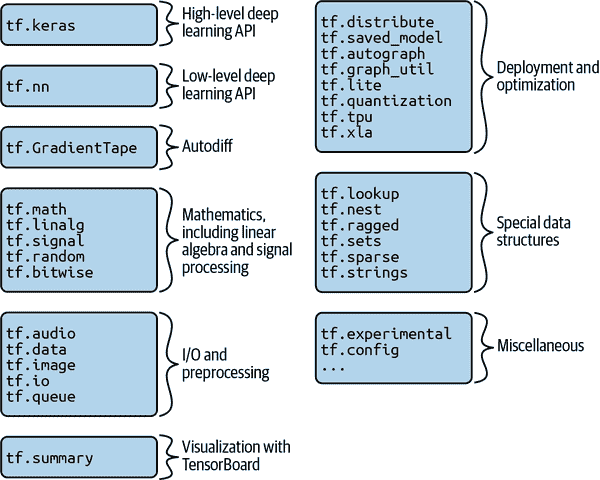
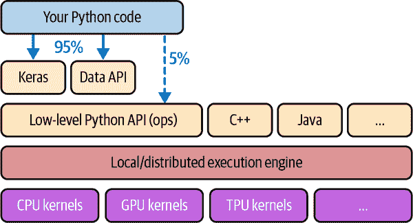
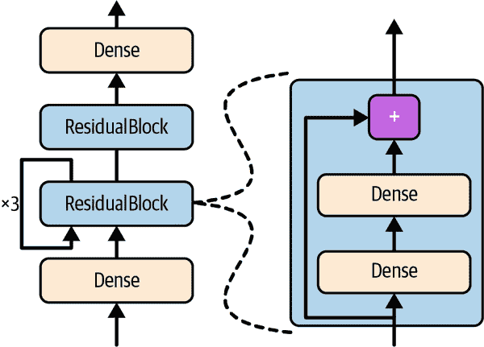
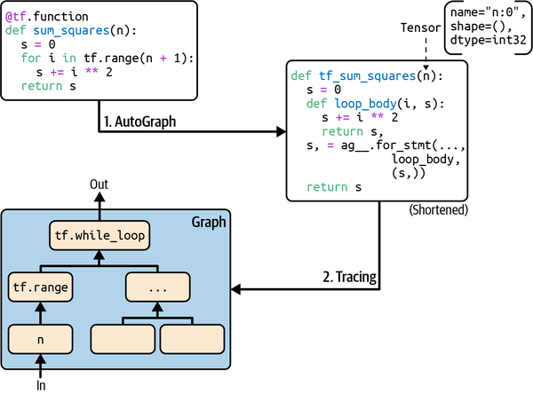

# 第十二章：使用 TensorFlow 进行自定义模型和训练

到目前为止，我们只使用了 TensorFlow 的高级 API，Keras，但它已经让我们走得很远：我们构建了各种神经网络架构，包括回归和分类网络，Wide & Deep 网络，自正则化网络，使用各种技术，如批量归一化，dropout 和学习率调度。事实上，您将遇到的 95%用例不需要除了 Keras（和 tf.data）之外的任何东西（请参见第十三章）。但现在是时候深入研究 TensorFlow，看看它的低级[Python API](https://homl.info/tf2api)。当您需要额外控制以编写自定义损失函数，自定义指标，层，模型，初始化程序，正则化器，权重约束等时，这将非常有用。您甚至可能需要完全控制训练循环本身；例如，应用特殊的转换或约束到梯度（超出仅仅剪切它们）或为网络的不同部分使用多个优化器。我们将在本章中涵盖所有这些情况，并且还将看看如何使用 TensorFlow 的自动生成图功能来提升您的自定义模型和训练算法。但首先，让我们快速浏览一下 TensorFlow。

# TensorFlow 的快速浏览

正如您所知，TensorFlow 是一个强大的用于数值计算的库，特别适用于大规模机器学习（但您也可以用它来进行需要大量计算的任何其他任务）。它由 Google Brain 团队开发，驱动了谷歌许多大规模服务，如 Google Cloud Speech，Google Photos 和 Google Search。它于 2015 年 11 月开源，现在是业界最广泛使用的深度学习库：无数项目使用 TensorFlow 进行各种机器学习任务，如图像分类，自然语言处理，推荐系统和时间序列预测。

那么 TensorFlow 提供了什么？以下是一个摘要：

+   它的核心与 NumPy 非常相似，但支持 GPU。

+   它支持分布式计算（跨多个设备和服务器）。

+   它包括一种即时（JIT）编译器，允许它优化计算以提高速度和内存使用。它通过从 Python 函数中提取*计算图*，优化它（例如通过修剪未使用的节点），并有效地运行它（例如通过自动并行运行独立操作）来工作。

+   计算图可以导出为可移植格式，因此您可以在一个环境中训练 TensorFlow 模型（例如在 Linux 上使用 Python），并在另一个环境中运行它（例如在 Android 设备上使用 Java）。

+   它实现了反向模式自动微分（请参见第十章和附录 B）并提供了一些优秀的优化器，如 RMSProp 和 Nadam（请参见第十一章），因此您可以轻松最小化各种损失函数。

TensorFlow 提供了许多建立在这些核心功能之上的功能：最重要的当然是 Keras，但它还有数据加载和预处理操作（tf.data，tf.io 等），图像处理操作（tf.image），信号处理操作（tf.signal）等等（请参见图 12-1 以获取 TensorFlow 的 Python API 概述）。

###### 提示

我们将涵盖 TensorFlow API 的许多包和函数，但不可能覆盖所有内容，因此您应该花些时间浏览 API；您会发现它非常丰富且有很好的文档。

在最低级别上，每个 TensorFlow 操作（简称 op）都是使用高效的 C++代码实现的。许多操作有多个称为内核的实现：每个内核专门用于特定设备类型，如 CPU、GPU，甚至 TPU（张量处理单元）。正如您可能知道的，GPU 可以通过将计算分成许多较小的块并在许多 GPU 线程上并行运行来显着加快计算速度。TPU 速度更快：它们是专门用于深度学习操作的定制 ASIC 芯片（我们将在第十九章讨论如何使用 GPU 或 TPU 与 TensorFlow）。



###### 图 12-1\. TensorFlow 的 Python API

TensorFlow 的架构如图 12-2 所示。大部分时间，您的代码将使用高级 API（特别是 Keras 和 tf.data），但当您需要更灵活性时，您将使用较低级别的 Python API，直接处理张量。无论如何，TensorFlow 的执行引擎将有效地运行操作，即使跨多个设备和机器，如果您告诉它的话。

TensorFlow 不仅可以在 Windows、Linux 和 macOS 上运行，还可以在移动设备上运行（使用 TensorFlow Lite），包括 iOS 和 Android（请参阅第十九章）。请注意，如果您不想使用 Python API，还可以使用其他语言的 API：有 C++、Java 和 Swift 的 API。甚至还有一个名为 TensorFlow.js 的 JavaScript 实现，可以直接在浏览器中运行您的模型。



###### 图 12-2\. TensorFlow 的架构

TensorFlow 不仅仅是一个库。TensorFlow 是一个庞大生态系统中心。首先，有用于可视化的 TensorBoard（请参阅第十章）。接下来，有由 Google 构建的用于将 TensorFlow 项目投入生产的一套库，称为[TensorFlow Extended (TFX)](https://tensorflow.org/tfx)：它包括用于数据验证、预处理、模型分析和服务的工具（使用 TF Serving；请参阅第十九章）。Google 的 TensorFlow Hub 提供了一种轻松下载和重复使用预训练神经网络的方式。您还可以在 TensorFlow 的[model garden](https://github.com/tensorflow/models)中获得许多神经网络架构，其中一些是预训练的。查看[TensorFlow 资源](https://tensorflow.org/resources)和[*https://github.com/jtoy/awesome-tensorflow*](https://github.com/jtoy/awesome-tensorflow)以获取更多基于 TensorFlow 的项目。您可以在 GitHub 上找到数百个 TensorFlow 项目，因此通常很容易找到您正在尝试做的任何事情的现有代码。

###### 提示

越来越多的机器学习论文随着它们的实现发布，有时甚至附带预训练模型。请查看[*https://paperswithcode.com*](https://paperswithcode.com)以轻松找到它们。

最后但并非最不重要的是，TensorFlow 拥有一支充满激情和乐于助人的开发团队，以及一个庞大的社区为其改进做出贡献。要提出技术问题，您应该使用[*https://stackoverflow.com*](https://stackoverflow.com)，并在问题中标记*tensorflow*和*python*。您可以通过[GitHub](https://github.com/tensorflow/tensorflow)提交错误和功能请求。要进行一般讨论，请加入[TensorFlow 论坛](https://discuss.tensorflow.org)。

好了，现在是开始编码的时候了！

# 像 NumPy 一样使用 TensorFlow

TensorFlow 的 API 围绕着*张量*展开，这些张量从操作流向操作，因此得名 Tensor*Flow*。张量与 NumPy 的`ndarray`非常相似：通常是一个多维数组，但也可以保存标量（例如`42`）。当我们创建自定义成本函数、自定义指标、自定义层等时，这些张量将非常重要，让我们看看如何创建和操作它们。

## 张量和操作

您可以使用`tf.constant()`创建一个张量。例如，这里是一个表示具有两行三列浮点数的矩阵的张量：

```py
>>> import tensorflow as tf
>>> t = tf.constant([[1., 2., 3.], [4., 5., 6.]])  # matrix
>>> t
<tf.Tensor: shape=(2, 3), dtype=float32, numpy=
array([[1., 2., 3.],
 [4., 5., 6.]], dtype=float32)>
```

就像`ndarray`一样，`tf.Tensor`有一个形状和一个数据类型（`dtype`）：

```py
>>> t.shape
TensorShape([2, 3])
>>> t.dtype
tf.float32
```

索引工作方式与 NumPy 类似：

```py
>>> t[:, 1:]
<tf.Tensor: shape=(2, 2), dtype=float32, numpy=
array([[2., 3.],
 [5., 6.]], dtype=float32)>
>>> t[..., 1, tf.newaxis]
<tf.Tensor: shape=(2, 1), dtype=float32, numpy=
array([[2.],
 [5.]], dtype=float32)>
```

最重要的是，各种张量操作都是可用的：

```py
>>> t + 10
<tf.Tensor: shape=(2, 3), dtype=float32, numpy=
array([[11., 12., 13.],
 [14., 15., 16.]], dtype=float32)>
>>> tf.square(t)
<tf.Tensor: shape=(2, 3), dtype=float32, numpy=
array([[ 1.,  4.,  9.],
 [16., 25., 36.]], dtype=float32)>
>>> t @ tf.transpose(t)
<tf.Tensor: shape=(2, 2), dtype=float32, numpy=
array([[14., 32.],
 [32., 77.]], dtype=float32)>
```

请注意，编写`t + 10`等同于调用`tf.add(t, 10)`（实际上，Python 调用了魔术方法`t.__add__(10)`，它只是调用了`tf.add(t, 10)`）。其他运算符，如`-`和`*`，也受支持。`@`运算符在 Python 3.5 中添加，用于矩阵乘法：它等同于调用`tf.matmul()`函数。

###### 注意

许多函数和类都有别名。例如，`tf.add()`和`tf.math.add()`是相同的函数。这使得 TensorFlow 可以为最常见的操作保留简洁的名称，同时保持良好组织的包。

张量也可以保存标量值。在这种情况下，形状为空：

```py
>>> tf.constant(42)
<tf.Tensor: shape=(), dtype=int32, numpy=42>
```

###### 注意

Keras API 有自己的低级 API，位于`tf.keras.backend`中。这个包通常被导入为`K`，以简洁为主。它曾经包括函数如`K.square()`、`K.exp()`和`K.sqrt()`，您可能在现有代码中遇到：这在 Keras 支持多个后端时编写可移植代码很有用，但现在 Keras 只支持 TensorFlow，您应该直接调用 TensorFlow 的低级 API（例如，使用`tf.square()`而不是`K.square()`）。从技术上讲，`K.square()`及其相关函数仍然存在以保持向后兼容性，但`tf.keras.backend`包的文档只列出了一些实用函数，例如`clear_session()`（在第十章中提到）。

您将找到所有您需要的基本数学运算（`tf.add()`、`tf.multiply()`、`tf.square()`、`tf.exp()`、`tf.sqrt()`等）以及大多数您可以在 NumPy 中找到的操作（例如`tf.reshape()`、`tf.squeeze()`、`tf.tile()`）。一些函数的名称与 NumPy 中的名称不同；例如，`tf.reduce_mean()`、`tf.reduce_sum()`、`tf.reduce_max()`和`tf.math.log()`相当于`np.mean()`、`np.sum()`、`np.max()`和`np.log()`。当名称不同时，通常有很好的理由。例如，在 TensorFlow 中，您必须编写`tf.transpose(t)`；您不能像在 NumPy 中那样只写`t.T`。原因是`tf.transpose()`函数与 NumPy 的`T`属性并不完全相同：在 TensorFlow 中，将创建一个具有其自己的转置数据副本的新张量，而在 NumPy 中，`t.T`只是相同数据的一个转置视图。同样，`tf.reduce_sum()`操作之所以被命名为这样，是因为其 GPU 核心（即 GPU 实现）使用的减少算法不保证元素添加的顺序：因为 32 位浮点数的精度有限，每次调用此操作时结果可能会发生微小变化。`tf.reduce_mean()`也是如此（当然`tf.reduce_max()`是确定性的）。

## 张量和 NumPy

张量与 NumPy 兼容：您可以从 NumPy 数组创建张量，反之亦然。您甚至可以将 TensorFlow 操作应用于 NumPy 数组，将 NumPy 操作应用于张量：

```py
>>> import numpy as np
>>> a = np.array([2., 4., 5.])
>>> tf.constant(a)
<tf.Tensor: id=111, shape=(3,), dtype=float64, numpy=array([2., 4., 5.])>
>>> t.numpy()  # or np.array(t)
array([[1., 2., 3.],
 [4., 5., 6.]], dtype=float32)
>>> tf.square(a)
<tf.Tensor: id=116, shape=(3,), dtype=float64, numpy=array([4., 16., 25.])>
>>> np.square(t)
array([[ 1.,  4.,  9.],
 [16., 25., 36.]], dtype=float32)
```

###### 警告

请注意，NumPy 默认使用 64 位精度，而 TensorFlow 使用 32 位。这是因为 32 位精度通常对神经网络来说足够了，而且运行速度更快，使用的内存更少。因此，当您从 NumPy 数组创建张量时，请确保设置`dtype=tf.float32`。

## 类型转换

类型转换可能会严重影响性能，并且当它们自动完成时很容易被忽略。为了避免这种情况，TensorFlow 不会自动执行任何类型转换：如果您尝试在具有不兼容类型的张量上执行操作，它只会引发异常。例如，您不能将浮点张量和整数张量相加，甚至不能将 32 位浮点数和 64 位浮点数相加：

```py
>>> tf.constant(2.) + tf.constant(40)
[...] InvalidArgumentError: [...] expected to be a float tensor [...]
>>> tf.constant(2.) + tf.constant(40., dtype=tf.float64)
[...] InvalidArgumentError: [...] expected to be a float tensor [...]
```

这可能一开始有点烦人，但请记住这是为了一个好的目的！当然，当您真正需要转换类型时，您可以使用`tf.cast()`：

```py
>>> t2 = tf.constant(40., dtype=tf.float64)
>>> tf.constant(2.0) + tf.cast(t2, tf.float32)
<tf.Tensor: id=136, shape=(), dtype=float32, numpy=42.0>
```

## 变量

到目前为止，我们看到的`tf.Tensor`值是不可变的：我们无法修改它们。这意味着我们不能使用常规张量来实现神经网络中的权重，因为它们需要通过反向传播进行调整。此外，其他参数可能也需要随时间变化（例如，动量优化器会跟踪过去的梯度）。我们需要的是`tf.Variable`：

```py
>>> v = tf.Variable([[1., 2., 3.], [4., 5., 6.]])
>>> v
<tf.Variable 'Variable:0' shape=(2, 3) dtype=float32, numpy=
array([[1., 2., 3.],
 [4., 5., 6.]], dtype=float32)>
```

`tf.Variable`的行为很像`tf.Tensor`：您可以执行相同的操作，它与 NumPy 很好地配合，对类型也一样挑剔。但是它也可以使用`assign()`方法（或`assign_add()`或`assign_sub()`，它们会增加或减少给定值来就地修改变量）。您还可以使用单个单元格（或切片）的`assign()`方法或使用`scatter_update()`或`scatter_nd_update()`方法来修改单个单元格（或切片）：

```py
v.assign(2 * v)           # v now equals [[2., 4., 6.], [8., 10., 12.]]
v[0, 1].assign(42)        # v now equals [[2., 42., 6.], [8., 10., 12.]]
v[:, 2].assign([0., 1.])  # v now equals [[2., 42., 0.], [8., 10., 1.]]
v.scatter_nd_update(      # v now equals [[100., 42., 0.], [8., 10., 200.]]
    indices=[[0, 0], [1, 2]], updates=[100., 200.])
```

直接赋值不起作用：

```py
>>> v[1] = [7., 8., 9.]
[...] TypeError: 'ResourceVariable' object does not support item assignment
```

###### 注意

在实践中，您很少需要手动创建变量；Keras 提供了一个`add_weight()`方法，它会为您处理，您将看到。此外，模型参数通常会直接由优化器更新，因此您很少需要手动更新变量。

## 其他数据结构

TensorFlow 支持几种其他数据结构，包括以下内容（请参阅本章笔记本中的“其他数据结构”部分或附录 C 了解更多详细信息）：

稀疏张量（`tf.SparseTensor`）

高效地表示大部分为零的张量。`tf.sparse`包含了稀疏张量的操作。

张量数组（`tf.TensorArray`）

是张量列表。它们默认具有固定长度，但可以选择性地扩展。它们包含的所有张量必须具有相同的形状和数据类型。

不规则张量（`tf.RaggedTensor`）

表示张量列表，所有张量的秩和数据类型相同，但大小不同。张量大小变化的维度称为*不规则维度*。`tf.ragged`包含了不规则张量的操作。

字符串张量

是类型为`tf.string`的常规张量。这些表示字节字符串，而不是 Unicode 字符串，因此如果您使用 Unicode 字符串（例如，像`"café"`这样的常规 Python 3 字符串）创建字符串张量，那么它将自编码为 UTF-8（例如，`b"caf\xc3\xa9"`）。或者，您可以使用类型为`tf.int32`的张量来表示 Unicode 字符串，其中每个项目表示一个 Unicode 代码点（例如，`[99, 97, 102, 233]`）。`tf.strings`包（带有`s`）包含用于字节字符串和 Unicode 字符串的操作（以及将一个转换为另一个的操作）。重要的是要注意`tf.string`是原子的，这意味着其长度不会出现在张量的形状中。一旦您将其转换为 Unicode 张量（即，一个包含 Unicode 代码点的`tf.int32`类型的张量），长度将出现在形状中。

集合

表示为常规张量（或稀疏张量）。例如，`tf.constant([[1, 2], [3, 4]])`表示两个集合{1, 2}和{3, 4}。更一般地，每个集合由张量的最后一个轴中的向量表示。您可以使用`tf.sets`包中的操作来操作集合。

队列

在多个步骤中存储张量。TensorFlow 提供各种类型的队列：基本的先进先出（FIFO）队列（`FIFOQueue`），以及可以优先处理某些项目的队列（`PriorityQueue`），对其项目进行洗牌的队列（`RandomShuffleQueue`），以及通过填充来批处理不同形状的项目的队列（`PaddingFIFOQueue`）。这些类都在`tf.queue`包中。

有了张量、操作、变量和各种数据结构，你现在可以定制你的模型和训练算法了！

# 自定义模型和训练算法

你将首先创建一个自定义损失函数，这是一个简单而常见的用例。

## 自定义损失函数

假设你想训练一个回归模型，但你的训练集有点嘈杂。当然，你首先尝试通过删除或修复异常值来清理数据集，但结果还不够好；数据集仍然很嘈杂。你应该使用哪种损失函数？均方误差可能会过分惩罚大误差，导致模型不够精确。平均绝对误差不会像惩罚异常值那样严重，但训练可能需要一段时间才能收敛，训练出的模型可能不够精确。这可能是使用 Huber 损失的好时机（在第十章介绍）。Huber 损失在 Keras 中是可用的（只需使用`tf.keras.losses.Huber`类的实例），但让我们假装它不存在。要实现它，只需创建一个函数，该函数将标签和模型预测作为参数，并使用 TensorFlow 操作来计算包含所有损失的张量（每个样本一个）：

```py
def huber_fn(y_true, y_pred):
    error = y_true - y_pred
    is_small_error = tf.abs(error) < 1
    squared_loss = tf.square(error) / 2
    linear_loss  = tf.abs(error) - 0.5
    return tf.where(is_small_error, squared_loss, linear_loss)
```

###### 警告

为了获得更好的性能，你应该使用矢量化的实现，就像这个例子一样。此外，如果你想要从 TensorFlow 的图优化功能中受益，你应该只使用 TensorFlow 操作。

也可以返回平均损失而不是单个样本损失，但这不推荐，因为这样做会使在需要时无法使用类权重或样本权重（参见第十章）。

现在你可以在编译 Keras 模型时使用这个 Huber 损失函数，然后像往常一样训练你的模型：

```py
model.compile(loss=huber_fn, optimizer="nadam")
model.fit(X_train, y_train, [...])
```

就是这样！在训练期间的每个批次中，Keras 将调用`huber_fn()`函数来计算损失，然后使用反向模式自动微分来计算损失相对于所有模型参数的梯度，最后执行梯度下降步骤（在这个例子中使用 Nadam 优化器）。此外，它将跟踪自从 epoch 开始以来的总损失，并显示平均损失。

但是当你保存模型时，这个自定义损失会发生什么？

## 保存和加载包含自定义组件的模型

保存包含自定义损失函数的模型可以正常工作，但是当你加载它时，你需要提供一个将函数名称映射到实际函数的字典。更一般地，当你加载包含自定义对象的模型时，你需要将名称映射到对象：

```py
model = tf.keras.models.load_model("my_model_with_a_custom_loss",
                                   custom_objects={"huber_fn": huber_fn})
```

###### 提示

如果你用`@keras.utils.​reg⁠ister_keras_serializable()`装饰`huber_fn()`函数，它将自动可用于`load_model()`函数：不需要将其包含在`custom_objects`字典中。

使用当前的实现，任何在-1 和 1 之间的错误都被认为是“小”。但是如果你想要一个不同的阈值呢？一个解决方案是创建一个函数来创建一个配置好的损失函数：

```py
def create_huber(threshold=1.0):
    def huber_fn(y_true, y_pred):
        error = y_true - y_pred
        is_small_error = tf.abs(error) < threshold
        squared_loss = tf.square(error) / 2
        linear_loss  = threshold * tf.abs(error) - threshold ** 2 / 2
        return tf.where(is_small_error, squared_loss, linear_loss)
    return huber_fn

model.compile(loss=create_huber(2.0), optimizer="nadam")
```

不幸的是，当你保存模型时，`threshold`不会被保存。这意味着在加载模型时你将需要指定`threshold`的值（注意要使用的名称是`"huber_fn"`，这是你给 Keras 的函数的名称，而不是创建它的函数的名称）：

```py
model = tf.keras.models.load_model(
    "my_model_with_a_custom_loss_threshold_2",
    custom_objects={"huber_fn": create_huber(2.0)}
)
```

你可以通过创建`tf.keras.losses.Loss`类的子类，然后实现它的`get_config()`方法来解决这个问题：

```py
class HuberLoss(tf.keras.losses.Loss):
    def __init__(self, threshold=1.0, **kwargs):
        self.threshold = threshold
        super().__init__(**kwargs)

    def call(self, y_true, y_pred):
        error = y_true - y_pred
        is_small_error = tf.abs(error) < self.threshold
        squared_loss = tf.square(error) / 2
        linear_loss  = self.threshold * tf.abs(error) - self.threshold**2 / 2
        return tf.where(is_small_error, squared_loss, linear_loss)

    def get_config(self):
        base_config = super().get_config()
        return {**base_config, "threshold": self.threshold}
```

让我们来看看这段代码：

+   构造函数接受`**kwargs`并将它们传递给父构造函数，父构造函数处理标准超参数：损失的`name`和用于聚合单个实例损失的`reduction`算法。默认情况下，这是`"AUTO"`，等同于`"SUM_OVER_BATCH_SIZE"`：损失将是实例损失的总和，加权后再除以批量大小（而不是加权平均）。其他可能的值是`"SUM"`和`"NONE"`。

+   `call()`方法接受标签和预测值，计算所有实例损失，并返回它们。

+   `get_config()`方法返回一个字典，将每个超参数名称映射到其值。它首先调用父类的`get_config()`方法，然后将新的超参数添加到此字典中。

然后您可以在编译模型时使用此类的任何实例：

```py
model.compile(loss=HuberLoss(2.), optimizer="nadam")
```

当您保存模型时，阈值将与模型一起保存；当您加载模型时，您只需要将类名映射到类本身：

```py
model = tf.keras.models.load_model("my_model_with_a_custom_loss_class",
                                   custom_objects={"HuberLoss": HuberLoss})
```

当您保存模型时，Keras 会调用损失实例的`get_config()`方法，并以 SavedModel 格式保存配置。当您加载模型时，它会在`HuberLoss`类上调用`from_config()`类方法：这个方法由基类（`Loss`）实现，并创建一个类的实例，将`**config`传递给构造函数。

损失就是这样了！正如您现在将看到的，自定义激活函数、初始化器、正则化器和约束并没有太大不同。

## 自定义激活函数、初始化器、正则化器和约束

大多数 Keras 功能，如损失、正则化器、约束、初始化器、指标、激活函数、层，甚至完整模型，都可以以类似的方式进行自定义。大多数情况下，您只需要编写一个带有适当输入和输出的简单函数。这里有一个自定义激活函数的示例（相当于`tf.keras.activations.softplus()`或`tf.nn.softplus()`）、一个自定义 Glorot 初始化器的示例（相当于`tf.keras.initializers.glorot_normal()`）、一个自定义ℓ[1]正则化器的示例（相当于`tf.keras.regularizers.l1(0.01)`）以及一个确保权重都为正的自定义约束的示例（相当于`tf.keras.​con⁠straints.nonneg()`或`tf.nn.relu()`）：

```py
def my_softplus(z):
    return tf.math.log(1.0 + tf.exp(z))

def my_glorot_initializer(shape, dtype=tf.float32):
    stddev = tf.sqrt(2. / (shape[0] + shape[1]))
    return tf.random.normal(shape, stddev=stddev, dtype=dtype)

def my_l1_regularizer(weights):
    return tf.reduce_sum(tf.abs(0.01 * weights))

def my_positive_weights(weights):  # return value is just tf.nn.relu(weights)
    return tf.where(weights < 0., tf.zeros_like(weights), weights)
```

正如您所看到的，参数取决于自定义函数的类型。然后可以像这里展示的那样正常使用这些自定义函数：

```py
layer = tf.keras.layers.Dense(1, activation=my_softplus,
                              kernel_initializer=my_glorot_initializer,
                              kernel_regularizer=my_l1_regularizer,
                              kernel_constraint=my_positive_weights)
```

激活函数将应用于此`Dense`层的输出，并将其结果传递给下一层。层的权重将使用初始化器返回的值进行初始化。在每个训练步骤中，权重将传递给正则化函数以计算正则化损失，然后将其添加到主损失中以获得用于训练的最终损失。最后，在每个训练步骤之后，将调用约束函数，并将层的权重替换为受约束的权重。

如果一个函数有需要与模型一起保存的超参数，那么您将希望子类化适当的类，比如`tf.keras.regu⁠larizers.​​Reg⁠⁠ularizer`、`tf.keras.constraints.Constraint`、`tf.keras.initializers.​Ini⁠tializer`或`tf.keras.layers.Layer`（适用于任何层，包括激活函数）。就像您为自定义损失所做的那样，这里是一个简单的ℓ[1]正则化类，它保存了其`factor`超参数（这次您不需要调用父构造函数或`get_config()`方法，因为它们不是由父类定义的）：

```py
class MyL1Regularizer(tf.keras.regularizers.Regularizer):
    def __init__(self, factor):
        self.factor = factor

    def __call__(self, weights):
        return tf.reduce_sum(tf.abs(self.factor * weights))

    def get_config(self):
        return {"factor": self.factor}
```

请注意，您必须为损失、层（包括激活函数）和模型实现`call()`方法，或者为正则化器、初始化器和约束实现`__call__()`方法。对于指标，情况有些不同，您将立即看到。

## 自定义指标

损失和指标在概念上并不相同：损失（例如，交叉熵）被梯度下降用来*训练*模型，因此它们必须是可微的（至少在评估它们的点上），它们的梯度不应该在任何地方都为零。此外，如果它们不容易被人类解释也是可以的。相反，指标（例如，准确率）用于*评估*模型：它们必须更容易被解释，可以是不可微的或者在任何地方梯度为零。

也就是说，在大多数情况下，定义一个自定义指标函数与定义一个自定义损失函数完全相同。实际上，我们甚至可以使用我们之前创建的 Huber 损失函数作为指标；它会工作得很好（在这种情况下，持久性也会以相同的方式工作，只保存函数的名称`"huber_fn"`，而不是阈值）：

```py
model.compile(loss="mse", optimizer="nadam", metrics=[create_huber(2.0)])
```

在训练期间的每个批次，Keras 将计算这个指标并跟踪自开始时的平均值。大多数情况下，这正是你想要的。但并非总是如此！例如，考虑一个二元分类器的精度。正如你在第三章中看到的，精度是真正例的数量除以正例的预测数量（包括真正例和假正例）。假设模型在第一个批次中做出了五个正面预测，其中四个是正确的：这是 80%的精度。然后假设模型在第二个批次中做出了三个正面预测，但它们全部是错误的：这是第二个批次的 0%精度。如果你只计算这两个精度的平均值，你会得到 40%。但等一下——这*不是*这两个批次的模型精度！事实上，总共有四个真正例（4 + 0）中的八个正面预测（5 + 3），所以总体精度是 50%，而不是 40%。我们需要的是一个对象，它可以跟踪真正例的数量和假正例的数量，并且可以在需要时基于这些数字计算精度。这正是`tf.keras.metrics.Precision`类所做的：

```py
>>> precision = tf.keras.metrics.Precision()
>>> precision([0, 1, 1, 1, 0, 1, 0, 1], [1, 1, 0, 1, 0, 1, 0, 1])
<tf.Tensor: shape=(), dtype=float32, numpy=0.8>
>>> precision([0, 1, 0, 0, 1, 0, 1, 1], [1, 0, 1, 1, 0, 0, 0, 0])
<tf.Tensor: shape=(), dtype=float32, numpy=0.5>
```

在这个例子中，我们创建了一个`Precision`对象，然后像一个函数一样使用它，为第一个批次传递标签和预测，然后为第二个批次（如果需要，还可以传递样本权重）。我们使用了与刚才讨论的示例中相同数量的真正例和假正例。在第一个批次之后，它返回 80%的精度；然后在第二个批次之后，它返回 50%（这是到目前为止的总体精度，而不是第二个批次的精度）。这被称为*流式指标*（或*有状态指标*），因为它逐渐更新，批次之后。

在任何时候，我们可以调用`result()`方法来获取指标的当前值。我们还可以通过使用`variables`属性查看其变量（跟踪真正例和假正例的数量），并可以使用`reset_states()`方法重置这些变量：

```py
>>> precision.result()
<tf.Tensor: shape=(), dtype=float32, numpy=0.5>
>>> precision.variables
[<tf.Variable 'true_positives:0' [...], numpy=array([4.], dtype=float32)>,
 <tf.Variable 'false_positives:0' [...], numpy=array([4.], dtype=float32)>]
>>> precision.reset_states()  # both variables get reset to 0.0
```

如果需要定义自己的自定义流式指标，创建`tf.keras.metrics.Metric`类的子类。这里是一个基本示例，它跟踪总 Huber 损失和迄今为止看到的实例数量。当要求结果时，它返回比率，这只是平均 Huber 损失：

```py
class HuberMetric(tf.keras.metrics.Metric):
    def __init__(self, threshold=1.0, **kwargs):
        super().__init__(**kwargs)  # handles base args (e.g., dtype)
        self.threshold = threshold
        self.huber_fn = create_huber(threshold)
        self.total = self.add_weight("total", initializer="zeros")
        self.count = self.add_weight("count", initializer="zeros")

    def update_state(self, y_true, y_pred, sample_weight=None):
        sample_metrics = self.huber_fn(y_true, y_pred)
        self.total.assign_add(tf.reduce_sum(sample_metrics))
        self.count.assign_add(tf.cast(tf.size(y_true), tf.float32))

    def result(self):
        return self.total / self.count

    def get_config(self):
        base_config = super().get_config()
        return {**base_config, "threshold": self.threshold}
```

让我们走一遍这段代码：

+   构造函数使用`add_weight()`方法创建需要在多个批次中跟踪指标状态的变量——在这种情况下，所有 Huber 损失的总和（`total`）和迄今为止看到的实例数量（`count`）。如果愿意，你也可以手动创建变量。Keras 跟踪任何设置为属性的`tf.Variable`（更一般地，任何“可跟踪”的对象，如层或模型）。

+   当你将这个类的实例用作函数时（就像我们用`Precision`对象做的那样），`update_state()`方法会被调用。它根据一个批次的标签和预测更新变量（以及样本权重，但在这种情况下我们忽略它们）。

+   `result()`方法计算并返回最终结果，在这种情况下是所有实例上的平均 Huber 指标。当你将指标用作函数时，首先调用`update_state()`方法，然后调用`result()`方法，并返回其输出。

+   我们还实现了`get_config()`方法，以确保`threshold`与模型一起保存。

+   `reset_states()`方法的默认实现将所有变量重置为 0.0（但如果需要，你可以覆盖它）。

###### 注意

Keras 会无缝处理变量持久性；不需要任何操作。

当你使用简单函数定义指标时，Keras 会自动为每个批次调用它，并在每个时期期间跟踪平均值，就像我们手动做的那样。因此，我们的`HuberMetric`类的唯一好处是`threshold`将被保存。但当然，有些指标，比如精度，不能简单地在批次上进行平均：在这些情况下，除了实现流式指标之外别无选择。

现在你已经构建了一个流式指标，构建一个自定义层将会变得轻而易举！

## 自定义层

有时候你可能想要构建一个包含一种 TensorFlow 没有提供默认实现的奇特层的架构。或者你可能只是想要构建一个非常重复的架构，在这种架构中，一个特定的层块被重复多次，将每个块视为单个层会很方便。对于这些情况，你会想要构建一个自定义层。

有一些没有权重的层，比如`tf.keras.layers.Flatten`或`tf.keras.layers.ReLU`。如果你想创建一个没有任何权重的自定义层，最简单的方法是编写一个函数并将其包装在`tf.keras.layers.Lambda`层中。例如，以下层将对其输入应用指数函数：

```py
exponential_layer = tf.keras.layers.Lambda(lambda x: tf.exp(x))
```

然后，这个自定义层可以像任何其他层一样使用，使用序贯 API、函数式 API 或子类 API。你也可以将它用作激活函数，或者你可以使用`activation=tf.exp`。指数层有时用于回归模型的输出层，当要预测的值具有非常不同的规模时（例如，0.001、10.、1,000.）。事实上，指数函数是 Keras 中的标准激活函数之一，所以你可以简单地使用`activation="exponential"`。

你可能会猜到，要构建一个自定义的有状态层（即带有权重的层），你需要创建`tf.keras.layers.Layer`类的子类。例如，以下类实现了`Dense`层的简化版本：

```py
class MyDense(tf.keras.layers.Layer):
    def __init__(self, units, activation=None, **kwargs):
        super().__init__(**kwargs)
        self.units = units
        self.activation = tf.keras.activations.get(activation)

    def build(self, batch_input_shape):
        self.kernel = self.add_weight(
            name="kernel", shape=[batch_input_shape[-1], self.units],
            initializer="glorot_normal")
        self.bias = self.add_weight(
            name="bias", shape=[self.units], initializer="zeros")

    def call(self, X):
        return self.activation(X @ self.kernel + self.bias)

    def get_config(self):
        base_config = super().get_config()
        return {**base_config, "units": self.units,
                "activation": tf.keras.activations.serialize(self.activation)}
```

让我们来看看这段代码：

+   构造函数将所有超参数作为参数（在这个例子中是`units`和`activation`），并且重要的是它还接受一个`**kwargs`参数。它调用父构造函数，将`kwargs`传递给它：这会处理标准参数，如`input_shape`、`trainable`和`name`。然后它将超参数保存为属性，使用`tf.keras.activations.get()`函数将`activation`参数转换为适当的激活函数（它接受函数、标准字符串如`"relu"`或`"swish"`，或者简单地`None`）。

+   `build()`方法的作用是通过为每个权重调用`add_weight()`方法来创建层的变量。`build()`方法在第一次使用该层时被调用。在那时，Keras 将知道该层输入的形状，并将其传递给`build()`方法，这通常是创建一些权重所必需的。例如，我们需要知道前一层中的神经元数量以创建连接权重矩阵（即`"kernel"`）：这对应于输入的最后一个维度的大小。在`build()`方法的最后（仅在最后），您必须调用父类的`build()`方法：这告诉 Keras 该层已构建（它只是设置`self.built = True`）。

+   `call()`方法执行所需的操作。在这种情况下，我们计算输入`X`和层的内核的矩阵乘法，添加偏置向量，并将激活函数应用于结果，这给出了层的输出。

+   `get_config()`方法与以前的自定义类中的方法一样。请注意，通过调用`tf.keras.​activa⁠tions.serialize()`保存激活函数的完整配置。

现在您可以像使用任何其他层一样使用`MyDense`层！

###### 注意

Keras 会自动推断输出形状，除非该层是动态的（稍后将看到）。在这种（罕见）情况下，您需要实现`compute_output_shape()`方法，该方法必须返回一个`TensorShape`对象。

要创建具有多个输入的层（例如，`Concatenate`），`call()`方法的参数应该是一个包含所有输入的元组。要创建具有多个输出的层，`call()`方法应该返回输出的列表。例如，以下示例玩具层接受两个输入并返回三个输出：

```py
class MyMultiLayer(tf.keras.layers.Layer):
    def call(self, X):
        X1, X2 = X
        return X1 + X2, X1 * X2, X1 / X2
```

这个层现在可以像任何其他层一样使用，但当然只能使用功能 API 和子类 API，而不能使用顺序 API（顺序 API 只接受具有一个输入和一个输出的层）。

如果您的层在训练和测试期间需要具有不同的行为（例如，如果它使用`Dropout`或`BatchNormalization`层），那么您必须在`call()`方法中添加一个`training`参数，并使用此参数来决定要执行什么操作。例如，让我们创建一个在训练期间添加高斯噪声（用于正则化）但在测试期间不执行任何操作的层（Keras 有一个执行相同操作的层，`tf.keras.layers.GaussianNoise`）：

```py
class MyGaussianNoise(tf.keras.layers.Layer):
    def __init__(self, stddev, **kwargs):
        super().__init__(**kwargs)
        self.stddev = stddev

    def call(self, X, training=False):
        if training:
            noise = tf.random.normal(tf.shape(X), stddev=self.stddev)
            return X + noise
        else:
            return X
```

有了这个，您现在可以构建任何您需要的自定义层！现在让我们看看如何创建自定义模型。

## 自定义模型

我们已经在第十章中讨论了使用子类 API 创建自定义模型类。这很简单：子类化`tf.keras.Model`类，在构造函数中创建层和变量，并实现`call()`方法以执行您希望模型执行的操作。例如，假设我们想要构建图 12-3 中表示的模型。



###### 图 12-3。自定义模型示例：一个包含跳过连接的自定义`ResidualBlock`层的任意模型

输入首先经过一个密集层，然后通过由两个密集层和一个加法操作组成的*残差块*（如您将在第十四章中看到的，残差块将其输入添加到其输出中），然后通过这个相同的残差块再进行三次，然后通过第二个残差块，最终结果通过一个密集输出层。如果这个模型看起来没有太多意义，不要担心；这只是一个示例，说明您可以轻松构建任何您想要的模型，甚至包含循环和跳过连接的模型。要实现这个模型，最好首先创建一个`ResidualBlock`层，因为我们将创建一对相同的块（并且可能希望在另一个模型中重用它）：

```py
class ResidualBlock(tf.keras.layers.Layer):
    def __init__(self, n_layers, n_neurons, **kwargs):
        super().__init__(**kwargs)
        self.hidden = [tf.keras.layers.Dense(n_neurons, activation="relu",
                                             kernel_initializer="he_normal")
                       for _ in range(n_layers)]

    def call(self, inputs):
        Z = inputs
        for layer in self.hidden:
            Z = layer(Z)
        return inputs + Z
```

这个层有点特殊，因为它包含其他层。Keras 会自动处理这一点：它会自动检测`hidden`属性包含可跟踪对象（在这种情况下是层），因此它们的变量会自动添加到此层的变量列表中。这个类的其余部分是不言自明的。接下来，让我们使用子类 API 来定义模型本身：

```py
class ResidualRegressor(tf.keras.Model):
    def __init__(self, output_dim, **kwargs):
        super().__init__(**kwargs)
        self.hidden1 = tf.keras.layers.Dense(30, activation="relu",
                                             kernel_initializer="he_normal")
        self.block1 = ResidualBlock(2, 30)
        self.block2 = ResidualBlock(2, 30)
        self.out = tf.keras.layers.Dense(output_dim)

    def call(self, inputs):
        Z = self.hidden1(inputs)
        for _ in range(1 + 3):
            Z = self.block1(Z)
        Z = self.block2(Z)
        return self.out(Z)
```

我们在构造函数中创建层，并在`call()`方法中使用它们。然后可以像任何其他模型一样使用此模型（编译、拟合、评估和使用它进行预测）。如果您还希望能够使用`save()`方法保存模型，并使用`tf.keras.models.load_model()`函数加载模型，则必须在`ResidualBlock`类和`ResidualRegressor`类中实现`get_config()`方法（就像我们之前做的那样）。或者，您可以使用`save_weights()`和`load_weights()`方法保存和加载权重。

`Model`类是`Layer`类的子类，因此模型可以像层一样定义和使用。但是模型具有一些额外的功能，包括当然包括`compile()`、`fit()`、`evaluate()`和`predict()`方法（以及一些变体），还有`get_layer()`方法（可以通过名称或索引返回模型的任何层）和`save()`方法（以及对`tf.keras.models.load_model()`和`tf.keras.models.clone_model()`的支持）。

###### 提示

如果模型提供的功能比层更多，为什么不将每个层都定义为模型呢？技术上您可以这样做，但通常更清晰的做法是区分模型的内部组件（即层或可重用的层块）和模型本身（即您将训练的对象）。前者应该是`Layer`类的子类，而后者应该是`Model`类的子类。

有了这些，您可以自然而简洁地构建几乎任何您在论文中找到的模型，使用顺序 API、函数 API、子类 API，甚至这些的混合。“几乎”任何模型？是的，还有一些事情我们需要看一下：首先是如何基于模型内部定义损失或指标，其次是如何构建自定义训练循环。

## 基于模型内部的损失和指标

我们之前定义的自定义损失和指标都是基于标签和预测（以及可选的样本权重）。有时您可能希望基于模型的其他部分（例如其隐藏层的权重或激活）定义损失。这可能对正则化目的或监视模型的某些内部方面很有用。

要基于模型内部定义自定义损失，可以根据模型的任何部分计算损失，然后将结果传递给`add_loss()`方法。例如，让我们构建一个由五个隐藏层堆叠加一个输出层组成的自定义回归 MLP 模型。这个自定义模型还将在最上面的隐藏层之上具有一个辅助输出。与这个辅助输出相关联的损失将被称为*重建损失*（参见第十七章）：它是重建和输入之间的均方差差异。通过将这个重建损失添加到主要损失中，我们将鼓励模型通过隐藏层尽可能保留更多信息，即使这些信息对于回归任务本身并不直接有用。在实践中，这种损失有时会改善泛化能力（它是一种正则化损失）。还可以使用模型的`add_metric()`方法添加自定义指标。以下是具有自定义重建损失和相应指标的自定义模型的代码：

```py
class ReconstructingRegressor(tf.keras.Model):
    def __init__(self, output_dim, **kwargs):
        super().__init__(**kwargs)
        self.hidden = [tf.keras.layers.Dense(30, activation="relu",
                                             kernel_initializer="he_normal")
                       for _ in range(5)]
        self.out = tf.keras.layers.Dense(output_dim)
        self.reconstruction_mean = tf.keras.metrics.Mean(
            name="reconstruction_error")

    def build(self, batch_input_shape):
        n_inputs = batch_input_shape[-1]
        self.reconstruct = tf.keras.layers.Dense(n_inputs)

    def call(self, inputs, training=False):
        Z = inputs
        for layer in self.hidden:
            Z = layer(Z)
        reconstruction = self.reconstruct(Z)
        recon_loss = tf.reduce_mean(tf.square(reconstruction - inputs))
        self.add_loss(0.05 * recon_loss)
        if training:
            result = self.reconstruction_mean(recon_loss)
            self.add_metric(result)
        return self.out(Z)
```

让我们来看一下这段代码：

+   构造函数创建了一个具有五个密集隐藏层和一个密集输出层的 DNN。我们还创建了一个`Mean`流式指标，用于在训练过程中跟踪重建误差。

+   `build()`方法创建一个额外的密集层，用于重构模型的输入。它必须在这里创建，因为其单元数必须等于输入的数量，在调用`build()`方法之前这个数量是未知的。

+   `call()`方法通过所有五个隐藏层处理输入，然后将结果传递给重构层，该层生成重构。

+   然后`call()`方法计算重构损失（重构和输入之间的均方差），并使用`add_loss()`方法将其添加到模型的损失列表中。请注意，我们通过将重构损失乘以 0.05 来缩小重构损失（这是一个可以调整的超参数）。这确保了重构损失不会主导主要损失。

+   接下来，在训练过程中，`call()`方法更新重构度量并将其添加到模型中以便显示。这段代码示例实际上可以通过调用`self.add_metric(recon_loss)`来简化：Keras 将自动为您跟踪均值。

+   最后，`call()`方法将隐藏层的输出传递给输出层，并返回其输出。

在训练过程中，总损失和重构损失都会下降：

```py
Epoch 1/5
363/363 [========] - 1s 820us/step - loss: 0.7640 - reconstruction_error: 1.2728
Epoch 2/5
363/363 [========] - 0s 809us/step - loss: 0.4584 - reconstruction_error: 0.6340
[...]
```

在大多数情况下，到目前为止我们讨论的一切将足以实现您想构建的任何模型，即使是具有复杂架构、损失和指标。然而，对于一些架构，如 GANs（参见第十七章），您将不得不自定义训练循环本身。在我们到达那里之前，我们必须看看如何在 TensorFlow 中自动计算梯度。

## 使用自动微分计算梯度

要了解如何使用自动微分（参见第十章和附录 B）自动计算梯度，让我们考虑一个简单的玩具函数：

```py
def f(w1, w2):
    return 3 * w1 ** 2 + 2 * w1 * w2
```

如果你懂微积分，你可以分析地找到这个函数相对于`w1`的偏导数是`6 * w1` `+` `2 * w2`。你也可以找到它相对于`w2`的偏导数是`2 * w1`。例如，在点`(w1, w2)` `=` `(5, 3)`，这些偏导数分别等于 36 和 10，因此在这一点的梯度向量是（36，10）。但如果这是一个神经网络，这个函数会复杂得多，通常有数万个参数，通过手工分析找到偏导数将是一个几乎不可能的任务。一个解决方案是通过测量当你微调相应参数一点点时函数的输出如何变化来计算每个偏导数的近似值：

```py
>>> w1, w2 = 5, 3
>>> eps = 1e-6
>>> (f(w1 + eps, w2) - f(w1, w2)) / eps
36.000003007075065
>>> (f(w1, w2 + eps) - f(w1, w2)) / eps
10.000000003174137
```

看起来不错！这个方法运行得相当好，而且易于实现，但它只是一个近似值，重要的是你需要至少针对每个参数调用一次`f()`（不是两次，因为我们可以只计算一次`f(w1, w2)`）。每个参数至少调用一次`f()`使得这种方法在大型神经网络中变得难以处理。因此，我们应该使用反向模式自动微分。TensorFlow 使这变得非常简单：

```py
w1, w2 = tf.Variable(5.), tf.Variable(3.)
with tf.GradientTape() as tape:
    z = f(w1, w2)

gradients = tape.gradient(z, [w1, w2])
```

首先我们定义两个变量`w1`和`w2`，然后我们创建一个`tf.GradientTape`上下文，它将自动记录涉及变量的每个操作，最后我们要求这个磁带计算结果`z`相对于两个变量`[w1, w2]`的梯度。让我们看看 TensorFlow 计算的梯度：

```py
>>> gradients
[<tf.Tensor: shape=(), dtype=float32, numpy=36.0>,
 <tf.Tensor: shape=(), dtype=float32, numpy=10.0>]
```

太棒了！结果不仅准确（精度仅受浮点误差限制），而且`gradient()`方法只需通过记录的计算一次（按相反顺序），无论有多少变量，因此非常高效。就像魔术一样！

###### 提示

为了节省内存，在`tf.GradientTape()`块中只放入严格的最小值。或者，通过在`tf.GradientTape()`块内创建一个`with tape.stop_recording()`块来暂停记录。

在调用其`gradient()`方法后，磁带会立即被擦除，因此如果尝试两次调用`gradient()`，将会收到异常：

```py
with tf.GradientTape() as tape:
    z = f(w1, w2)

dz_dw1 = tape.gradient(z, w1)  # returns tensor 36.0
dz_dw2 = tape.gradient(z, w2)  # raises a RuntimeError!
```

如果您需要多次调用`gradient()`，您必须使磁带持久化，并在每次完成后删除它以释放资源：

```py
with tf.GradientTape(persistent=True) as tape:
    z = f(w1, w2)

dz_dw1 = tape.gradient(z, w1)  # returns tensor 36.0
dz_dw2 = tape.gradient(z, w2)  # returns tensor 10.0, works fine now!
del tape
```

默认情况下，磁带只会跟踪涉及变量的操作，因此，如果您尝试计算`z`相对于除变量以外的任何东西的梯度，结果将是`None`：

```py
c1, c2 = tf.constant(5.), tf.constant(3.)
with tf.GradientTape() as tape:
    z = f(c1, c2)

gradients = tape.gradient(z, [c1, c2])  # returns [None, None]
```

但是，您可以强制磁带监视任何您喜欢的张量，记录涉及它们的每个操作。然后，您可以计算相对于这些张量的梯度，就像它们是变量一样：

```py
with tf.GradientTape() as tape:
    tape.watch(c1)
    tape.watch(c2)
    z = f(c1, c2)

gradients = tape.gradient(z, [c1, c2])  # returns [tensor 36., tensor 10.]
```

在某些情况下，这可能很有用，比如如果您想要实现一个正则化损失，惩罚激活在输入变化很小时变化很大的情况：损失将基于激活相对于输入的梯度。由于输入不是变量，您需要告诉磁带监视它们。

大多数情况下，梯度磁带用于计算单个值（通常是损失）相对于一组值（通常是模型参数）的梯度。这就是反向模式自动微分的优势所在，因为它只需要进行一次前向传递和一次反向传递就可以一次性获得所有梯度。如果尝试计算向量的梯度，例如包含多个损失的向量，那么 TensorFlow 将计算向量总和的梯度。因此，如果您需要获取各个梯度（例如，每个损失相对于模型参数的梯度），您必须调用磁带的`jacobian()`方法：它将为向量中的每个损失执行一次反向模式自动微分（默认情况下全部并行）。甚至可以计算二阶偏导数（Hessians，即偏导数的偏导数），但在实践中很少需要（请参阅本章笔记本的“使用自动微分计算梯度”部分以获取示例）。

在某些情况下，您可能希望阻止梯度通过神经网络的某些部分进行反向传播。为此，您必须使用`tf.stop_gradient()`函数。该函数在前向传递期间返回其输入（类似于`tf.identity()`），但在反向传播期间不允许梯度通过（它的作用类似于常数）：

```py
def f(w1, w2):
    return 3 * w1 ** 2 + tf.stop_gradient(2 * w1 * w2)

with tf.GradientTape() as tape:
    z = f(w1, w2)  # the forward pass is not affected by stop_gradient()

gradients = tape.gradient(z, [w1, w2])  # returns [tensor 30., None]
```

最后，当计算梯度时，您可能偶尔会遇到一些数值问题。例如，如果在*x*=10^（-50）处计算平方根函数的梯度，结果将是无穷大。实际上，该点的斜率并不是无穷大，但它超过了 32 位浮点数的处理能力：

```py
>>> x = tf.Variable(1e-50)
>>> with tf.GradientTape() as tape:
...     z = tf.sqrt(x)
...
>>> tape.gradient(z, [x])
[<tf.Tensor: shape=(), dtype=float32, numpy=inf>]
```

为了解决这个问题，在计算平方根时，通常建议向*x*（例如 10^（-6））添加一个微小值。

指数函数也经常引起头痛，因为它增长非常快。例如，之前定义的`my_softplus()`的方式在数值上不稳定。如果计算`my_softplus(100.0)`，您将得到无穷大而不是正确的结果（约为 100）。但是可以重写该函数以使其在数值上稳定：softplus 函数被定义为 log(1 + exp(*z*))，这也等于 log(1 + exp(–|*z*|)) + max(*z*, 0)（请参阅数学证明的笔记本），第二种形式的优势在于指数项不会爆炸。因此，这是`my_softplus()`函数的更好实现：

```py
def my_softplus(z):
    return tf.math.log(1 + tf.exp(-tf.abs(z))) + tf.maximum(0., z)
```

在一些罕见的情况下，一个数值稳定的函数可能仍然具有数值不稳定的梯度。在这种情况下，你将不得不告诉 TensorFlow 使用哪个方程来计算梯度，而不是让它使用自动微分。为此，你必须在定义函数时使用`@tf.​cus⁠tom_gradient`装饰器，并返回函数的通常结果以及计算梯度的函数。例如，让我们更新`my_softplus()`函数，使其也返回一个数值稳定的梯度函数：

```py
@tf.custom_gradient
def my_softplus(z):
    def my_softplus_gradients(grads):  # grads = backprop'ed from upper layers
        return grads * (1 - 1 / (1 + tf.exp(z)))  # stable grads of softplus

    result = tf.math.log(1 + tf.exp(-tf.abs(z))) + tf.maximum(0., z)
    return result, my_softplus_gradients
```

如果你懂微积分（参见关于这个主题的教程笔记本），你会发现 log(1 + exp(*z*))的导数是 exp(*z*) / (1 + exp(*z*))。但这种形式是不稳定的：对于较大的*z*值，它最终会计算出无穷大除以无穷大，返回 NaN。然而，通过一点代数操作，你可以证明它也等于 1 - 1 / (1 + exp(*z*))，这是稳定的。`my_softplus_gradients()`函数使用这个方程来计算梯度。请注意，这个函数将接收到目前为止反向传播的梯度，一直到`my_softplus()`函数，并根据链式法则，我们必须将它们与这个函数的梯度相乘。

现在当我们计算`my_softplus()`函数的梯度时，即使对于较大的输入值，我们也会得到正确的结果。

恭喜！现在你可以计算任何函数的梯度（只要在计算时它是可微的），甚至在需要时阻止反向传播，并编写自己的梯度函数！这可能比你需要的灵活性更多，即使你构建自己的自定义训练循环。接下来你将看到如何做到这一点。

## 自定义训练循环

在某些情况下，`fit()`方法可能不够灵活以满足你的需求。例如，我们在第十章中讨论的[Wide & Deep 论文](https://homl.info/widedeep)使用了两种不同的优化器：一种用于宽路径，另一种用于深路径。由于`fit()`方法只使用一个优化器（在编译模型时指定的那个），实现这篇论文需要编写自己的自定义循环。

你可能也喜欢编写自定义训练循环，只是为了更有信心地确保它们确实按照你的意图执行（也许你对`fit()`方法的一些细节不确定）。有时候，让一切都显式化可能会感觉更安全。然而，请记住，编写自定义训练循环会使你的代码变得更长、更容易出错，并且更难维护。

###### 提示

除非你在学习或确实需要额外的灵活性，否则应该优先使用`fit()`方法而不是实现自己的训练循环，特别是如果你在团队中工作。

首先，让我们构建一个简单的模型。不需要编译它，因为我们将手动处理训练循环：

```py
l2_reg = tf.keras.regularizers.l2(0.05)
model = tf.keras.models.Sequential([
    tf.keras.layers.Dense(30, activation="relu", kernel_initializer="he_normal",
                          kernel_regularizer=l2_reg),
    tf.keras.layers.Dense(1, kernel_regularizer=l2_reg)
])
```

接下来，让我们创建一个小函数，从训练集中随机抽取一个批次的实例（在第十三章中，我们将讨论 tf.data API，它提供了一个更好的替代方案）：

```py
def random_batch(X, y, batch_size=32):
    idx = np.random.randint(len(X), size=batch_size)
    return X[idx], y[idx]
```

让我们还定义一个函数，用于显示训练状态，包括步数、总步数、自开始时的平均损失（我们将使用`Mean`指标来计算），以及其他指标：

```py
def print_status_bar(step, total, loss, metrics=None):
    metrics = " - ".join([f"{m.name}: {m.result():.4f}"
                          for m in [loss] + (metrics or [])])
    end = "" if step < total else "\n"
    print(f"\r{step}/{total} - " + metrics, end=end)
```

这段代码很容易理解，除非你不熟悉 Python 的字符串格式化：`{m.result():.4f}`将指标的结果格式化为小数点后四位的浮点数，使用`\r`（回车）和`end=""`确保状态栏始终打印在同一行上。

有了这个，让我们开始吧！首先，我们需要定义一些超参数，并选择优化器、损失函数和指标（在这个例子中只有 MAE）：

```py
n_epochs = 5
batch_size = 32
n_steps = len(X_train) // batch_size
optimizer = tf.keras.optimizers.SGD(learning_rate=0.01)
loss_fn = tf.keras.losses.mean_squared_error
mean_loss = tf.keras.metrics.Mean(name="mean_loss")
metrics = [tf.keras.metrics.MeanAbsoluteError()]
```

现在我们准备构建自定义循环了！

```py
for epoch in range(1, n_epochs + 1):
    print("Epoch {}/{}".format(epoch, n_epochs))
    for step in range(1, n_steps + 1):
        X_batch, y_batch = random_batch(X_train_scaled, y_train)
        with tf.GradientTape() as tape:
            y_pred = model(X_batch, training=True)
            main_loss = tf.reduce_mean(loss_fn(y_batch, y_pred))
            loss = tf.add_n([main_loss] + model.losses)

        gradients = tape.gradient(loss, model.trainable_variables)
        optimizer.apply_gradients(zip(gradients, model.trainable_variables))
        mean_loss(loss)
        for metric in metrics:
            metric(y_batch, y_pred)

        print_status_bar(step, n_steps, mean_loss, metrics)

    for metric in [mean_loss] + metrics:
        metric.reset_states()
```

这段代码中有很多内容，让我们来逐步解释一下：

+   我们创建两个嵌套循环：一个用于时期，另一个用于时期内的批次。

+   然后我们从训练集中抽取一个随机批次。

+   在 `tf.GradientTape()` 块内，我们对一个批次进行预测，使用模型作为一个函数，并计算损失：它等于主要损失加上其他损失（在这个模型中，每层有一个正则化损失）。由于 `mean_squared_error()` 函数返回每个实例的一个损失，我们使用 `tf.reduce_mean()` 计算批次的平均值（如果您想对每个实例应用不同的权重，这就是您应该做的地方）。正则化损失已经被减少为每个单一标量，所以我们只需要对它们求和（使用 `tf.add_n()`，它对相同形状和数据类型的多个张量求和）。

+   接下来，我们要求磁带计算损失相对于每个可训练变量的梯度——*不是*所有变量！——并将它们应用于优化器以执行梯度下降步骤。

+   然后我们更新平均损失和指标（在当前时期内），并显示状态栏。

+   在每个时期结束时，我们重置平均损失和指标的状态。

如果您想应用梯度裁剪（参见第十一章），请设置优化器的 `clipnorm` 或 `clipvalue` 超参数。如果您想对梯度应用任何其他转换，只需在调用 `apply_gradients()` 方法之前这样做。如果您想向模型添加权重约束（例如，在创建层时设置 `kernel_constraint` 或 `bias_constraint`），您应该更新训练循环以在 `apply_gradients()` 之后应用这些约束，就像这样：

```py
for variable in model.variables:
    if variable.constraint is not None:
        variable.assign(variable.constraint(variable))
```

###### 警告

在训练循环中调用模型时不要忘记设置 `training=True`，特别是如果您的模型在训练和测试期间表现不同（例如，如果它使用 `BatchNormalization` 或 `Dropout`）。如果是自定义模型，请确保将 `training` 参数传播到您的模型调用的层。

正如您所看到的，有很多事情需要做对，很容易出错。但好的一面是，您可以完全控制。

现在您知道如何自定义模型的任何部分⁠¹⁵和训练算法，让我们看看如何使用 TensorFlow 的自动生成图形功能：它可以显著加快您的自定义代码，并且还将其移植到 TensorFlow 支持的任何平台（参见第十九章）。

# TensorFlow 函数和图形

回到 TensorFlow 1，图形是不可避免的（伴随着复杂性），因为它们是 TensorFlow API 的核心部分。自从 TensorFlow 2（2019 年发布）以来，图形仍然存在，但不再是核心部分，而且使用起来简单得多（多得多！）。为了展示它们有多简单，让我们从一个计算其输入的立方的微不足道的函数开始：

```py
def cube(x):
    return x ** 3
```

我们显然可以使用 Python 值（如整数或浮点数）调用此函数，或者我们可以使用张量调用它：

```py
>>> cube(2)
8
>>> cube(tf.constant(2.0))
<tf.Tensor: shape=(), dtype=float32, numpy=8.0>
```

现在，让我们使用 `tf.function()` 将这个 Python 函数转换为 *TensorFlow* *函数*：

```py
>>> tf_cube = tf.function(cube)
>>> tf_cube
<tensorflow.python.eager.def_function.Function at 0x7fbfe0c54d50>
```

然后，这个 TF 函数可以像原始的 Python 函数一样使用，并且将返回相同的结果（但始终作为张量）：

```py
>>> tf_cube(2)
<tf.Tensor: shape=(), dtype=int32, numpy=8>
>>> tf_cube(tf.constant(2.0))
<tf.Tensor: shape=(), dtype=float32, numpy=8.0>
```

在幕后，`tf.function()` 分析了 `cube()` 函数执行的计算，并生成了一个等效的计算图！正如您所看到的，这是相当轻松的（我们很快会看到这是如何工作的）。或者，我们也可以将 `tf.function` 用作装饰器；这实际上更常见：

```py
@tf.function
def tf_cube(x):
    return x ** 3
```

原始的 Python 函数仍然可以通过 TF 函数的 `python_function` 属性访问，以防您需要它：

```py
>>> tf_cube.python_function(2)
8
```

TensorFlow 优化计算图，修剪未使用的节点，简化表达式（例如，1 + 2 将被替换为 3）等。一旦优化的图准备就绪，TF 函数将有效地执行图中的操作，按适当的顺序（并在可能时并行执行）。因此，TF 函数通常比原始 Python 函数运行得快得多，特别是如果它执行复杂计算。大多数情况下，您实际上不需要知道更多：当您想要提升 Python 函数时，只需将其转换为 TF 函数。就这样！

此外，如果在调用`tf.function()`时设置`jit_compile=True`，那么 TensorFlow 将使用*加速线性代数*（XLA）为您的图编译专用内核，通常融合多个操作。例如，如果您的 TF 函数调用`tf.reduce_sum(a * b + c)`，那么没有 XLA，函数首先需要计算`a * b`并将结果存储在临时变量中，然后将`c`添加到该变量中，最后调用`tf.reduce_sum()`处理结果。使用 XLA，整个计算将编译为单个内核，该内核将一次性计算`tf.reduce_sum(a * b + c)`，而不使用任何大型临时变量。这不仅速度更快，而且使用的 RAM 大大减少。

当您编写自定义损失函数、自定义指标、自定义层或任何其他自定义函数，并在 Keras 模型中使用它（就像我们在本章中一直做的那样），Keras 会自动将您的函数转换为 TF 函数——无需使用`tf.function()`。因此，大多数情况下，这种魔术是 100%透明的。如果您希望 Keras 使用 XLA，只需在调用`compile()`方法时设置`jit_compile=True`。简单！

###### 提示

您可以通过在创建自定义层或自定义模型时设置`dynamic=True`来告诉 Keras*不*将您的 Python 函数转换为 TF 函数。或者，您可以在调用模型的`compile()`方法时设置`run_eagerly=True`。

默认情况下，TF 函数为每个唯一的输入形状和数据类型生成一个新图，并将其缓存以供后续调用。例如，如果您调用`tf_cube(tf.constant(10))`，将为形状为[]的 int32 张量生成一个图。然后，如果您调用`tf_cube(tf.constant(20))`，将重用相同的图。但是，如果您随后调用`tf_cube(tf.constant([10, 20]))`，将为形状为[2]的 int32 张量生成一个新图。这就是 TF 函数处理多态性（即不同的参数类型和形状）的方式。但是，这仅适用于张量参数：如果将数值 Python 值传递给 TF 函数，则将为每个不同的值生成一个新图：例如，调用`tf_cube(10)`和`tf_cube(20)`将生成两个图。

###### 警告

如果您多次使用不同的数值 Python 值调用 TF 函数，则将生成许多图，减慢程序速度并使用大量 RAM（您必须删除 TF 函数才能释放它）。Python 值应保留用于将具有少量唯一值的参数，例如每层神经元的数量之类的超参数。这样可以使 TensorFlow 更好地优化模型的每个变体。

## AutoGraph 和跟踪

那么 TensorFlow 如何生成图呢？它首先通过分析 Python 函数的源代码来捕获所有控制流语句，比如`for`循环、`while`循环和`if`语句，以及`break`、`continue`和`return`语句。这第一步被称为*AutoGraph*。TensorFlow 必须分析源代码的原因是 Python 没有提供其他捕获控制流语句的方法：它提供了像`__add__()`和`__mul__()`这样的魔术方法来捕获`+`和`*`等运算符，但没有`__while__()`或`__if__()`这样的魔术方法。在分析函数代码之后，AutoGraph 会输出一个升级版本的函数，其中所有控制流语句都被适当的 TensorFlow 操作替换，比如`tf.while_loop()`用于循环，`tf.cond()`用于`if`语句。例如，在图 12-4 中，AutoGraph 分析了`sum_squares()` Python 函数的源代码，并生成了`tf__sum_squares()`函数。在这个函数中，`for`循环被替换为`loop_body()`函数的定义（包含原始`for`循环的主体），然后调用`for_stmt()`函数。这个调用将在计算图中构建适当的`tf.while_loop()`操作。



###### 图 12-4\. TensorFlow 如何使用 AutoGraph 和跟踪生成图

接下来，TensorFlow 调用这个“升级”函数，但不是传递参数，而是传递一个*符号张量*—一个没有实际值的张量，只有一个名称、一个数据类型和一个形状。例如，如果您调用`sum_squares(tf.constant(10))`，那么`tf__sum_squares()`函数将被调用，传递一个类型为 int32、形状为[]的符号张量。该函数将在*图模式*下运行，这意味着每个 TensorFlow 操作都会在图中添加一个节点来表示自己和其输出张量（与常规模式相反，称为*急切执行*或*急切模式*）。在图模式下，TF 操作不执行任何计算。图模式是 TensorFlow 1 中的默认模式。在图 12-4 中，您可以看到`tf__sum_squares()`函数被调用，其参数是一个符号张量（在这种情况下，一个形状为[]的 int32 张量），以及在跟踪期间生成的最终图。节点表示操作，箭头表示张量（生成的函数和图都被简化了）。

###### 提示

为了查看生成的函数源代码，您可以调用`tf.autograph.to_code(sum_squares.python_function)`。代码并不一定要漂亮，但有时可以帮助调试。

## TF 函数规则

大多数情况下，将执行 TensorFlow 操作的 Python 函数转换为 TF 函数是微不足道的：用`@tf.function`装饰它，或者让 Keras 为您处理。但是，有一些规则需要遵守：

+   如果调用任何外部库，包括 NumPy 甚至标准库，这个调用只会在跟踪期间运行；它不会成为图的一部分。实际上，TensorFlow 图只能包括 TensorFlow 构造（张量、操作、变量、数据集等）。因此，请确保使用`tf.reduce_sum()`而不是`np.sum()`，`tf.sort()`而不是内置的`sorted()`函数，等等（除非您真的希望代码只在跟踪期间运行）。这还有一些额外的影响：

    +   如果您定义了一个 TF 函数`f(*x*)`，它只返回`np.random.rand()`，那么只有在跟踪函数时才会生成一个随机数，因此`f(tf.constant(2.))`和`f(tf.constant(3.))`将返回相同的随机数，但`f(tf.constant([2., 3.]))`将返回一个不同的随机数。如果将`np.random.rand()`替换为`tf.random.uniform([])`，那么每次调用都会生成一个新的随机数，因为该操作将成为图的一部分。

    +   如果您的非 TensorFlow 代码具有副作用（例如记录某些内容或更新 Python 计数器），那么您不应该期望每次调用 TF 函数时都会发生这些副作用，因为它们只会在函数被跟踪时发生。

    +   您可以在 `tf.py_function()` 操作中包装任意的 Python 代码，但这样做会影响性能，因为 TensorFlow 将无法对此代码进行任何图优化。这也会降低可移植性，因为图仅在安装了正确库的平台上运行 Python 可用（和 Python 可用的平台）。

+   您可以调用其他 Python 函数或 TF 函数，但它们应该遵循相同的规则，因为 TensorFlow 将捕获它们的操作在计算图中。请注意，这些其他函数不需要用 `@tf.function` 装饰。

+   如果函数创建了 TensorFlow 变量（或任何其他有状态的 TensorFlow 对象，例如数据集或队列），它必须在第一次调用时才能这样做，否则您将收到异常。通常最好在 TF 函数之外创建变量（例如，在自定义层的 `build()` 方法中）。如果要为变量分配新值，请确保调用其 `assign()` 方法，而不是使用 `=` 运算符。

+   您的 Python 函数的源代码应该对 TensorFlow 可用。如果源代码不可用（例如，如果您在 Python shell 中定义函数，无法访问源代码，或者如果您仅将编译后的 **.pyc* Python 文件部署到生产环境），则图生成过程将失败或功能有限。

+   TensorFlow 仅会捕获对张量或 `tf.data.Dataset` 进行迭代的 `for` 循环（请参见第十三章）。因此，请确保使用 `for i in tf.range(*x*)` 而不是 `for i in range(*x*)`，否则循环将不会在图中被捕获。相反，它将在跟踪期间运行。（如果 `for` 循环旨在构建图，例如在神经网络中创建每个层，那么这可能是您想要的。）

+   一如既往，出于性能原因，您应该尽可能使用矢量化实现，而不是使用循环。

是时候总结了！在本章中，我们从 TensorFlow 的简要概述开始，然后看了 TensorFlow 的低级 API，包括张量、操作、变量和特殊数据结构。然后我们使用这些工具来自定义 Keras API 中的几乎每个组件。最后，我们看了 TF 函数如何提升性能，如何使用 AutoGraph 和跟踪生成图形，以及编写 TF 函数时应遵循的规则（如果您想进一步打开黑匣子并探索生成的图形，您将在附录 D 中找到技术细节）。

在下一章中，我们将学习如何使用 TensorFlow 高效加载和预处理数据。

# 练习

1.  您如何用简短的句子描述 TensorFlow？它的主要特点是什么？您能否列出其他流行的深度学习库？

1.  TensorFlow 是否可以替代 NumPy？它们之间的主要区别是什么？

1.  `tf.range(10)` 和 `tf.constant(np.​ara⁠nge(10))` 会得到相同的结果吗？

1.  您能否列出 TensorFlow 中除了常规张量之外的其他六种数据结构？

1.  您可以通过编写函数或子类化 `tf.keras.losses.Loss` 类来定义自定义损失函数。您会在什么时候使用每个选项？

1.  同样，您可以在函数中定义自定义指标，也可以作为 `tf.keras.metrics.Metric` 的子类。您会在什么时候使用每个选项？

1.  何时应该创建自定义层而不是自定义模型？

1.  有哪些需要编写自定义训练循环的用例？

1.  自定义 Keras 组件可以包含任意的 Python 代码吗，还是必须可转换为 TF 函数？

1.  如果您希望函数可转换为 TF 函数，主要需要遵守哪些规则？

1.  何时需要创建一个动态的 Keras 模型？如何做到这一点？为什么不将所有模型都设置为动态的呢？

1.  实现一个执行*层归一化*的自定义层（我们将在第十五章中使用这种类型的层）：

    1.  `build()`方法应该定义两个可训练的权重**α**和**β**，形状都是`input_shape[-1:]`，数据类型为`tf.float32`。**α**应该初始化为 1，**β**初始化为 0。

    1.  `call()`方法应该计算每个实例特征的平均值*μ*和标准差*σ*。为此，您可以使用`tf.nn.moments(inputs, axes=-1, keepdims=True)`，它返回所有实例的平均值*μ*和方差*σ*²（计算方差的平方根以获得标准差）。然后函数应该计算并返回**α** ⊗ (**X** - *μ*)/(*σ* + *ε*) + **β**，其中 ⊗ 表示逐元素乘法（`*`），*ε*是一个平滑项（一个小常数，避免除以零，例如 0.001）。

    1.  确保您的自定义层产生与`tf.keras.layers.LayerNormalization`层相同（或非常接近）的输出。

1.  使用自定义训练循环训练一个模型，以处理 Fashion MNIST 数据集（参见第十章）：

    1.  显示每个时代、迭代、平均训练损失和每个时代的平均准确率（在每次迭代更新），以及每个时代结束时的验证损失和准确率。

    1.  尝试使用不同的优化器以及不同的学习率来处理上层和下层。

这些练习的解决方案可以在本章笔记本的末尾找到，网址为[*https://homl.info/colab3*](https://homl.info/colab3)。

然而，Facebook 的 PyTorch 库目前在学术界更受欢迎：比起 TensorFlow 或 Keras，更多的论文引用 PyTorch。此外，Google 的 JAX 库正在获得动力，尤其是在学术界。

TensorFlow 包括另一个名为*estimators API*的深度学习 API，但现在已经不推荐使用。

如果您有需要（但您可能不会），您可以使用 C++ API 编写自己的操作。

要了解更多关于 TPU 以及它们如何工作的信息，请查看[*https://homl.info/tpus*](https://homl.info/tpus)。

`tf.math.log()`是一个值得注意的例外，它通常被使用，但没有`tf.log()`的别名，因为这可能会与日志记录混淆。

使用加权平均值不是一个好主意：如果这样做，那么具有相同权重但在不同批次中的两个实例将对训练产生不同的影响，这取决于每个批次的总权重。

`{**x, [...]}`语法是在 Python 3.5 中添加的，用于将字典`x`中的所有键/值对合并到另一个字典中。自 Python 3.9 起，您可以使用更好的`x | y`语法（其中`x`和`y`是两个字典）。

然而，Huber 损失很少用作度量标准——通常更喜欢使用 MAE 或 MSE。

这个类仅用于说明目的。一个更简单和更好的实现方法是只需子类化`tf.keras.metrics.Mean`类；请参阅本章笔记本的“流式指标”部分以获取示例。

Keras API 将此参数称为`input_shape`，但由于它还包括批量维度，我更喜欢将其称为`batch_input_shape`。

在 Keras 中，“子类 API”通常只指通过子类化创建自定义模型，尽管在本章中您已经看到，许多其他东西也可以通过子类化创建。

由于 TensorFlow 问题＃46858，这种情况下调用`super().build()`可能会失败，除非在您阅读此内容时已修复该问题。如果没有，请将此行替换为`self.built = True`。

您还可以在模型内的任何层上调用`add_loss()`，因为模型会递归地从所有层中收集损失。

如果磁带超出范围，例如当使用它的函数返回时，Python 的垃圾收集器会为您删除它。

除了优化器之外，很少有人会自定义这些；请参阅笔记本中的“自定义优化器”部分以获取示例。

然而，在这个简单的例子中，计算图非常小，几乎没有任何优化的空间，所以`tf_cube()`实际上比`cube()`运行得慢得多。
