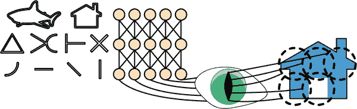
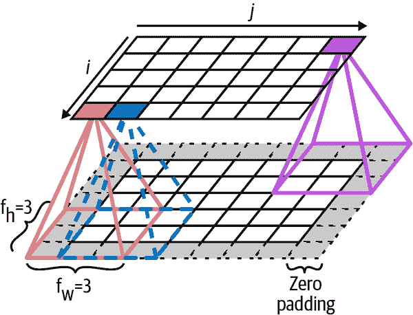
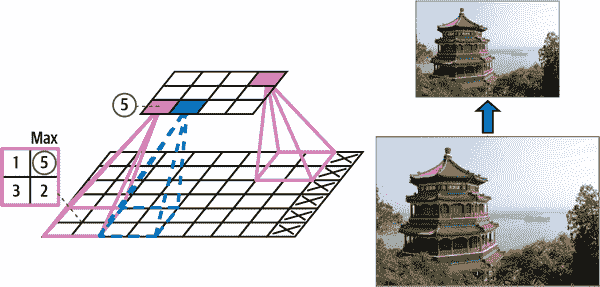
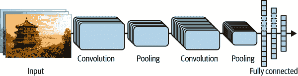
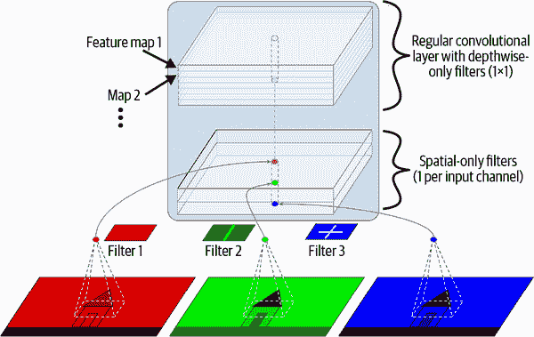
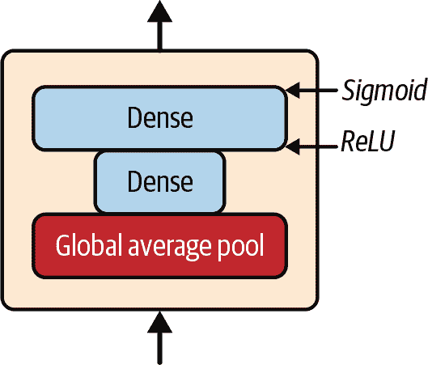

# 第十四章。使用卷积神经网络进行深度计算机视觉

尽管 IBM 的 Deep Blue 超级计算机在 1996 年击败了国际象棋世界冠军加里·卡斯帕罗夫，但直到最近计算机才能可靠地执行看似微不足道的任务，比如在图片中检测小狗或识别口语。为什么这些任务对我们人类来说如此轻松？答案在于感知主要发生在我们的意识领域之外，在我们大脑中专门的视觉、听觉和其他感觉模块中。当感觉信息达到我们的意识时，它已经被赋予高级特征；例如，当你看到一张可爱小狗的图片时，你无法选择*不*看到小狗，*不*注意到它的可爱。你也无法解释*如何*识别一个可爱的小狗；对你来说这是显而易见的。因此，我们不能信任我们的主观经验：感知并不是微不足道的，要理解它，我们必须看看我们的感觉模块是如何工作的。

*卷积神经网络*（CNNs）起源于对大脑视觉皮层的研究，自上世纪 80 年代以来就被用于计算机图像识别。在过去的 10 年里，由于计算能力的增加、可用训练数据的增加，以及第十一章中介绍的用于训练深度网络的技巧，CNNs 已经成功在一些复杂的视觉任务上实现了超人类表现。它们驱动着图像搜索服务、自动驾驶汽车、自动视频分类系统等。此外，CNNs 并不局限于视觉感知：它们在许多其他任务上也取得了成功，比如语音识别和自然语言处理。然而，我们现在将专注于视觉应用。

在本章中，我们将探讨 CNNs 的起源，它们的构建模块是什么样的，以及如何使用 Keras 实现它们。然后我们将讨论一些最佳的 CNN 架构，以及其他视觉任务，包括目标检测（对图像中的多个对象进行分类并在其周围放置边界框）和语义分割（根据对象所属的类别对每个像素进行分类）。

# 视觉皮层的结构

David H. Hubel 和 Torsten Wiesel 在[1958 年](https://homl.info/71)对猫进行了一系列实验⁠¹，[1959 年](https://homl.info/72)（以及[几年后对猴子进行的实验](https://homl.info/73)⁠^(3）），为视觉皮层的结构提供了关键见解（这两位作者因其工作于 1981 年获得了诺贝尔生理学或医学奖）。特别是，他们表明视觉皮层中许多神经元具有小的*局部感受野*，这意味着它们只对位于视觉场有限区域内的视觉刺激做出反应（见图 14-1，其中五个神经元的局部感受野由虚线圈表示）。不同神经元的感受野可能重叠，它们共同覆盖整个视觉场。



###### 图 14-1\. 视觉皮层中的生物神经元对视觉场中称为感受野的小区域中的特定模式做出反应；随着视觉信号通过连续的大脑模块，神经元对更大感受野中的更复杂模式做出反应

此外，作者们表明，一些神经元只对水平线的图像做出反应，而另一些只对具有不同方向的线做出反应（两个神经元可能具有相同的感受野，但对不同的线方向做出反应）。他们还注意到一些神经元具有更大的感受野，它们对更复杂的模式做出反应，这些模式是低级模式的组合。这些观察结果导致了这样一个想法，即高级神经元基于相邻低级神经元的输出（在图 14-1 中，注意到每个神经元只连接到前一层附近的神经元）。这种强大的架构能够在视觉领域的任何区域检测各种复杂的模式。

这些对视觉皮层的研究启发了 1980 年引入的[neocognitron](https://homl.info/74)，逐渐演变成我们现在称之为卷积神经网络的东西。一个重要的里程碑是 Yann LeCun 等人在 1998 年发表的一篇[论文](https://homl.info/75)，介绍了著名的*LeNet-5*架构，这种架构被银行广泛用于识别支票上的手写数字。这种架构具有一些你已经了解的构建块，如全连接层和 Sigmoid 激活函数，但它还引入了两个新的构建块：*卷积层*和*池化层*。现在让我们来看看它们。

###### 注意

为什么不简单地使用具有全连接层的深度神经网络来进行图像识别任务呢？不幸的是，尽管这对于小图像（例如 MNIST）效果很好，但对于较大的图像来说，由于需要的参数数量巨大，它会崩溃。例如，一个 100×100 像素的图像有 10,000 个像素，如果第一层只有 1,000 个神经元（这已经严重限制了传递到下一层的信息量），这意味着总共有 1 千万个连接。而这只是第一层。CNN 通过部分连接的层和权重共享来解决这个问题。

# 卷积层

CNN 最重要的构建块是*卷积层*：第一个卷积层中的神经元不与输入图像中的每个像素相连接（就像在前几章讨论的层中那样），而只与其感受野中的像素相连接（参见图 14-2）。反过来，第二个卷积层中的每个神经元只与第一层中一个小矩形内的神经元相连接。这种架构允许网络在第一个隐藏层集中于小的低级特征，然后在下一个隐藏层中将它们组合成更大的高级特征，依此类推。这种分层结构在现实世界的图像中很常见，这也是 CNN 在图像识别方面表现出色的原因之一。


###### 图 14-2。具有矩形局部感受野的 CNN 层

###### 注意

到目前为止，我们看到的所有多层神经网络都由一长串神经元组成，我们必须在将输入图像馈送到神经网络之前将其展平为 1D。在 CNN 中，每一层都以 2D 表示，这使得更容易将神经元与其对应的输入匹配。

给定层中位于第*i*行，第*j*列的神经元连接到前一层中位于第*i*到第*i* + *f*[*h*] – 1 行，第*j*到第*j* + *f*[*w*] – 1 列的神经元的输出，其中*f*[*h*]和*f*[*w*]是感受野的高度和宽度（参见图 14-3）。为了使一层具有与前一层相同的高度和宽度，通常在输入周围添加零，如图中所示。这称为*零填充*。

还可以通过间隔感受野来将大输入层连接到一个较小的层，如图 14-4 所示。这显着降低了模型的计算复杂性。从一个感受野到下一个感受野的水平或垂直步长称为*步幅*。在图中，一个 5×7 的输入层（加上零填充）连接到一个 3×4 的层，使用 3×3 的感受野和步幅为 2（在这个例子中，步幅在两个方向上是相同的，但不一定要这样）。上层中位于第*i*行，第*j*列的神经元连接到前一层中位于第*i*×*s*[*h*]到第*i*×*s*[*h*]+*f*[*h*]–1 行，第*j*×*s*[*w*]到第*j*×*s*[*w*]+*f*[*w*]–1 列的神经元的输出，其中*s*[*h*]和*s*[*w*]是垂直和水平步幅。



###### 图 14-3。层与零填充之间的连接


###### 图 14-4。使用步幅为 2 降低维度

## 滤波器

一个神经元的权重可以表示为一个与感受野大小相同的小图像。例如，图 14-5 显示了两组可能的权重，称为*滤波器*（或*卷积核*，或只是*内核*）。第一个滤波器表示为一个黑色正方形，中间有一条垂直白线（它是一个 7×7 的矩阵，除了中间列全是 1，其他都是 0）；使用这些权重的神经元将忽略其感受野中的所有内容，除了中间的垂直线（因为所有输入将被乘以 0，除了中间的垂直线）。第二个滤波器是一个黑色正方形，中间有一条水平白线。使用这些权重的神经元将忽略其感受野中的所有内容，除了中间的水平线。


###### 图 14-5。应用两个不同的滤波器以获得两个特征图

现在，如果一个层中的所有神经元使用相同的垂直线滤波器（和相同的偏置项），并且您将输入图像输入到网络中，如图 14-5 所示（底部图像），该层将输出左上角的图像。请注意，垂直白线得到增强，而其余部分变得模糊。类似地，如果所有神经元使用相同的水平线滤波器，则会得到右上角的图像；请注意，水平白线得到增强，而其余部分被模糊化。因此，一个充满使用相同滤波器的神经元的层会输出一个*特征图*，突出显示激活滤波器最多的图像区域。但不用担心，您不必手动定义滤波器：相反，在训练期间，卷积层将自动学习其任务中最有用的滤波器，上面的层将学会将它们组合成更复杂的模式。

## 堆叠多个特征图

到目前为止，为了简单起见，我已经将每个卷积层的输出表示为一个 2D 层，但实际上，卷积层有多个滤波器（您决定有多少个），并且每个滤波器输出一个特征图，因此在 3D 中更准确地表示（请参见图 14-6）。每个特征图中的每个像素都有一个神经元，并且给定特征图中的所有神经元共享相同的参数（即相同的内核和偏置项）。不同特征图中的神经元使用不同的参数。神经元的感受野与之前描述的相同，但它跨越了前一层的所有特征图。简而言之，卷积层同时将多个可训练滤波器应用于其输入，使其能够在其输入的任何位置检测多个特征。


###### 图 14-6。两个具有多个滤波器（内核）的卷积层，处理具有三个颜色通道的彩色图像；每个卷积层输出一个特征图每个滤波器

###### 注意

所有特征图中的所有神经元共享相同的参数，这显著减少了模型中的参数数量。一旦 CNN 学会在一个位置识别模式，它就可以在任何其他位置识别它。相比之下，一旦全连接的神经网络学会在一个位置识别模式，它只能在那个特定位置识别它。

输入图像也由多个子层组成：每个*颜色通道*一个。如第九章中所述，通常有三个：红色、绿色和蓝色（RGB）。灰度图像只有一个通道，但有些图像可能有更多通道，例如捕捉额外光频率（如红外线）的卫星图像。

具体来说，在给定卷积层*l*中特征图*k*中第*i*行、第*j*列的神经元与前一层*l* – 1 中位于第*i* × *s*[*h*]至*i* × *s*[*h*] + *f*[*h*] – 1 行和第*j* × *s*[*w*]至*j* × *s*[*w*] + *f*[*w*] – 1 列的神经元的输出相连，跨所有特征图（在第*l* – 1 层）。请注意，在同一层中，位于相同行*i*和列*j*但在不同特征图中的所有神经元与前一层中相同位置的神经元的输出相连。

方程 14-1 总结了前面的解释，用一个大数学方程表示：它展示了如何计算卷积层中给定神经元的输出。由于所有不同的索引，它看起来有点丑陋，但它的作用只是计算所有输入的加权和，再加上偏置项。

##### 方程 14-1。计算卷积层中神经元的输出

<math display="block"><mrow><msub><mi>z</mi> <mrow><mi>i</mi><mo>,</mo><mi>j</mi><mo>,</mo><mi>k</mi></mrow></msub> <mo>=</mo> <msub><mi>b</mi> <mi>k</mi></msub> <mo>+</mo> <munderover><mo>∑</mo> <mrow><mi>u</mi><mo>=</mo><mn>0</mn></mrow> <mrow><msub><mi>f</mi> <mi>h</mi></msub> <mo>-</mo><mn>1</mn></mrow></munderover> <munderover><mo>∑</mo> <mrow><mi>v</mi><mo>=</mo><mn>0</mn></mrow> <mrow><msub><mi>f</mi> <mi>w</mi></msub> <mo>-</mo><mn>1</mn></mrow></munderover> <munderover><mo>∑</mo> <mrow><mi>k</mi><mo>'</mo><mo>=</mo><mn>0</mn></mrow> <mrow><msub><mi>f</mi> <msup><mi>n</mi> <mo>'</mo></msup></msub> <mo>-</mo><mn>1</mn></mrow></munderover> <msub><mi>x</mi> <mrow><msup><mi>i</mi> <mo>'</mo></msup> <mo>,</mo><msup><mi>j</mi> <mo>'</mo></msup> <mo>,</mo><msup><mi>k</mi> <mo>'</mo></msup></mrow></msub> <mo>×</mo> <msub><mi>w</mi> <mrow><mi>u</mi><mo>,</mo><mi>v</mi><mo>,</mo><msup><mi>k</mi> <mo>'</mo></msup> <mo>,</mo><mi>k</mi></mrow></msub> <mtext>with</mtext> <mfenced separators="" open="{" close=""><mtable><mtr><mtd columnalign="left"><mrow><mi>i</mi> <mo>'</mo> <mo>=</mo> <mi>i</mi> <mo>×</mo> <msub><mi>s</mi> <mi>h</mi></msub> <mo>+</mo> <mi>u</mi></mrow></mtd></mtr> <mtr><mtd columnalign="left"><mrow><mi>j</mi> <mo>'</mo> <mo>=</mo> <mi>j</mi> <mo>×</mo> <msub><mi>s</mi> <mi>w</mi></msub> <mo>+</mo> <mi>v</mi></mrow></mtd></mtr></mtable></mfenced></mrow></math>

在这个方程中：

+   *z*[*i*,] [*j*,] [*k*] 是位于卷积层（第*l*层）特征图*k*中第*i*行、第*j*列的神经元的输出。

+   如前所述，*s*[*h*] 和 *s*[*w*] 是垂直和水平步幅，*f*[*h*] 和 *f*[*w*] 是感受野的高度和宽度，*f*[*n*′] 是前一层（第*l* – 1 层）中特征图的数量。

+   *x*[*i*′,] [*j*′,] [*k*′] 是位于第*l* – 1 层，第*i*′行、第*j*′列、特征图*k*′（或通道*k*′，如果前一层是输入层）的神经元的输出。

+   *b*[*k*] 是特征图*k*（在第*l*层）的偏置项。您可以将其视为微调特征图*k*的整体亮度的旋钮。

+   *w*[*u*,] [*v*,] [*k*′,] [*k*]是层*l*中特征图*k*中的任何神经元与其输入之间的连接权重，该输入位于行*u*、列*v*（相对于神经元的感受野），以及特征图*k*′。

让我们看看如何使用 Keras 创建和使用卷积层。

## 使用 Keras 实现卷积层

首先，让我们加载和预处理一些样本图像，使用 Scikit-Learn 的`load_sample_image()`函数和 Keras 的`CenterCrop`和`Rescaling`层（这些都是在第十三章中介绍的）：

```py
from sklearn.datasets import load_sample_images
import tensorflow as tf

images = load_sample_images()["images"]
images = tf.keras.layers.CenterCrop(height=70, width=120)(images)
images = tf.keras.layers.Rescaling(scale=1 / 255)(images)
```

让我们看一下`images`张量的形状：

```py
>>> images.shape
TensorShape([2, 70, 120, 3])
```

哎呀，这是一个 4D 张量；我们以前从未见过这个！所有这些维度是什么意思？嗯，有两个样本图像，这解释了第一个维度。然后每个图像是 70×120，因为这是我们在创建`CenterCrop`层时指定的大小（原始图像是 427×640）。这解释了第二和第三维度。最后，每个像素在每个颜色通道上保存一个值，有三个颜色通道——红色、绿色和蓝色，这解释了最后一个维度。

现在让我们创建一个 2D 卷积层，并将这些图像输入其中，看看输出是什么。为此，Keras 提供了一个`Convolution2D`层，别名为`Conv2D`。在幕后，这个层依赖于 TensorFlow 的`tf.nn.conv2d()`操作。让我们创建一个具有 32 个滤波器的卷积层，每个滤波器大小为 7×7（使用`kernel_size=7`，相当于使用`kernel_size=(7 , 7)`），并将这个层应用于我们的两个图像的小批量：

```py
conv_layer = tf.keras.layers.Conv2D(filters=32, kernel_size=7)
fmaps = conv_layer(images)
```

###### 注意

当我们谈论 2D 卷积层时，“2D”指的是*空间*维度（高度和宽度），但正如你所看到的，该层接受 4D 输入：正如我们所看到的，另外两个维度是批量大小（第一个维度）和通道数（最后一个维度）。

现在让我们看一下输出的形状：

```py
>>> fmaps.shape
TensorShape([2, 64, 114, 32])
```

输出形状与输入形状类似，有两个主要区别。首先，有 32 个通道而不是 3 个。这是因为我们设置了`filters=32`，所以我们得到 32 个输出特征图：在每个位置的红色、绿色和蓝色的强度代替，我们现在有每个位置的每个特征的强度。其次，高度和宽度都减小了 6 个像素。这是因为`Conv2D`层默认不使用任何零填充，这意味着我们在输出特征图的两侧丢失了一些像素，取决于滤波器的大小。在这种情况下，由于卷积核大小为 7，我们水平和垂直各丢失 6 个像素（即每侧 3 个像素）。

###### 警告

默认选项令人惊讶地被命名为`padding="valid"`，实际上意味着根本没有零填充！这个名称来自于这样一个事实，即在这种情况下，每个神经元的感受野严格位于输入内部的*有效*位置（不会超出边界）。这不是 Keras 的命名怪癖：每个人都使用这种奇怪的命名法。

如果我们设置`padding="same"`，那么输入将在所有侧面填充足够的零，以确保输出特征图最终与输入具有*相同*大小（因此这个选项的名称）：

```py
>>> conv_layer = tf.keras.layers.Conv2D(filters=32, kernel_size=7,
...                                     padding="same")
...
>>> fmaps = conv_layer(images)
>>> fmaps.shape
TensorShape([2, 70, 120, 32])
```

这两种填充选项在图 14-7 中有所说明。为简单起见，这里只显示了水平维度，但当然相同的逻辑也适用于垂直维度。

如果步幅大于 1（在任何方向上），那么输出大小将不等于输入大小，即使`padding="same"`。例如，如果设置`strides=2`（或等效地`strides=(2, 2)`），那么输出特征图将是 35×60：垂直和水平方向都减半。图 14-8 展示了当`strides=2`时会发生什么，两种填充选项都有。


###### 图 14-7。当`strides=1`时的两种填充选项


###### 图 14-8。当步长大于 1 时，即使使用`"same"`填充（和`"valid"`填充可能会忽略一些输入），输出也会小得多

如果您感兴趣，这是输出大小是如何计算的：

+   当`padding="valid"`时，如果输入的宽度为*i*[h]，那么输出宽度等于(*i*[h] - *f*[h] + *s*[h]) / *s*[h]，向下取整。请记住*f*[h]是卷积核的宽度，*s*[h]是水平步长。除法中的余数对应于输入图像右侧被忽略的列。同样的逻辑也可以用来计算输出高度，以及图像底部被忽略的行。

+   当`padding="same"`时，输出宽度等于*i*[h] / *s*[h]，向上取整。为了实现这一点，在输入图像的左右两侧填充适当数量的零列（如果可能的话，数量相等，或者在右侧多一个）。假设输出宽度为*o*[w]，那么填充的零列数为(*o*[w] - 1) × *s*[h] + *f*[h] - *i*[h]。同样的逻辑也可以用来计算输出高度和填充行数。

现在让我们来看一下层的权重（在方程 14-1 中被标记为*w*[u,] [v,] [k',] [k]和*b*[k]）。就像`Dense`层一样，`Conv2D`层保存所有层的权重，包括卷积核和偏置。卷积核是随机初始化的，而偏置初始化为零。这些权重可以通过`weights`属性作为 TF 变量访问，也可以通过`get_weights()`方法作为 NumPy 数组访问：

```py
>>> kernels, biases = conv_layer.get_weights()
>>> kernels.shape
(7, 7, 3, 32)
>>> biases.shape
(32,)
```

`kernels`数组是 4D 的，其形状为[*kernel_height*, *kernel_width*, *input_channels*, *output_channels*]。`biases`数组是 1D 的，形状为[*output_channels*]。输出通道的数量等于输出特征图的数量，也等于滤波器的数量。

最重要的是，需要注意输入图像的高度和宽度不会出现在卷积核的形状中：这是因为输出特征图中的所有神经元共享相同的权重，正如之前解释的那样。这意味着您可以将任何大小的图像馈送到这一层，只要它们至少与卷积核一样大，并且具有正确数量的通道（在这种情况下为三个）。

最后，通常情况下，您会希望在创建`Conv2D`层时指定一个激活函数（如 ReLU），并指定相应的内核初始化器（如 He 初始化）。这与`Dense`层的原因相同：卷积层执行线性操作，因此如果您堆叠多个卷积层而没有任何激活函数，它们都等同于单个卷积层，它们将无法学习到真正复杂的内容。

正如您所看到的，卷积层有很多超参数：`filters`、`kernel_size`、`padding`、`strides`、`activation`、`kernel_initializer`等。通常情况下，您可以使用交叉验证来找到正确的超参数值，但这是非常耗时的。我们将在本章后面讨论常见的 CNN 架构，以便让您了解在实践中哪些超参数值效果最好。

## 内存需求

CNN 的另一个挑战是卷积层需要大量的 RAM。这在训练过程中尤为明显，因为反向传播的反向传递需要在前向传递期间计算的所有中间值。

例如，考虑一个具有 200 个 5×5 滤波器的卷积层，步幅为 1，使用`"same"`填充。如果输入是一个 150×100 的 RGB 图像（三个通道），那么参数数量为（5×5×3+1）×200=15,200（+1 对应于偏置项），与全连接层相比相当小。然而，这 200 个特征图中的每一个包含 150×100 个神经元，每个神经元都需要计算其 5×5×3=75 个输入的加权和：总共有 2.25 亿次浮点乘法。虽然不像全连接层那么糟糕，但仍然相当计算密集。此外，如果使用 32 位浮点数表示特征图，那么卷积层的输出将占用 200×150×100×32=9600 万位（12 MB）的 RAM。而这只是一个实例的情况——如果一个训练批次包含 100 个实例，那么这一层将使用 1.2 GB 的 RAM！

在推断（即对新实例进行预测时），一个层占用的 RAM 可以在计算下一层后立即释放，因此你只需要两个连续层所需的 RAM。但在训练期间，前向传播期间计算的所有内容都需要保留以进行反向传播，因此所需的 RAM 量至少是所有层所需 RAM 的总量。

###### 提示

如果由于内存不足错误而导致训练崩溃，你可以尝试减小小批量大小。或者，你可以尝试使用步幅减少维度，去掉一些层，使用 16 位浮点数代替 32 位浮点数，或者将 CNN 分布在多个设备上（你将在第十九章中看到如何做）。

现在让我们来看看 CNN 的第二个常见构建块：*池化层*。

# 池化层

一旦你理解了卷积层的工作原理，池化层就很容易理解了。它们的目标是*对输入图像进行*子采样（即缩小），以减少计算负载、内存使用和参数数量（从而限制过拟合的风险）。

就像在卷积层中一样，池化层中的每个神经元连接到前一层中有限数量的神经元的输出，这些神经元位于一个小的矩形感受野内。你必须像以前一样定义它的大小、步幅和填充类型。然而，池化神经元没有权重；它所做的只是使用聚合函数（如最大值或平均值）聚合输入。图 14-9 展示了*最大池化层*，这是最常见的池化层类型。在这个例子中，我们使用了一个 2×2 的*池化核*，步幅为 2，没有填充。在图 14-9 中的左下角感受野中，输入值为 1、5、3、2，因此只有最大值 5 传播到下一层。由于步幅为 2，输出图像的高度和宽度都是输入图像的一半（向下取整，因为我们没有使用填充）。



###### 图 14-9。最大池化层（2×2 池化核，步幅 2，无填充）

###### 注意

池化层通常独立地处理每个输入通道，因此输出深度（即通道数）与输入深度相同。

除了减少计算、内存使用和参数数量之外，最大池化层还引入了一定程度的*不变性*，如图 14-10 所示。在这里，我们假设亮像素的值低于暗像素的值，并考虑三个图像（A、B、C）通过一个 2×2 内核和步幅 2 的最大池化层。图像 B 和 C 与图像 A 相同，但向右移动了一个和两个像素。正如您所看到的，图像 A 和 B 的最大池化层的输出是相同的。这就是平移不变性的含义。对于图像 C，输出是不同的：向右移动一个像素（但仍然有 50%的不变性）。通过在 CNN 中的几层之间插入一个最大池化层，可以在更大的尺度上获得一定程度的平移不变性。此外，最大池化还提供了一定程度的旋转不变性和轻微的尺度不变性。这种不变性（即使有限）在预测不应该依赖这些细节的情况下可能是有用的，比如在分类任务中。

然而，最大池化也有一些缺点。显然，它非常破坏性：即使使用一个微小的 2×2 内核和步幅为 2，输出在两个方向上都会变小两倍（因此其面积会变小四倍），简单地丢弃了输入值的 75%。在某些应用中，不变性并不理想。以语义分割为例（根据像素所属的对象对图像中的每个像素进行分类的任务，我们将在本章后面探讨）：显然，如果输入图像向右平移一个像素，输出也应该向右平移一个像素。在这种情况下的目标是*等变性*，而不是不变性：对输入的微小变化应导致输出的相应微小变化。


###### 图 14-10。对小平移的不变性

# 使用 Keras 实现池化层

以下代码创建了一个`MaxPooling2D`层，别名为`MaxPool2D`，使用一个 2×2 内核。步幅默认为内核大小，因此此层使用步幅为 2（水平和垂直）。默认情况下，它使用`"valid"`填充（即根本不填充）：

```py
max_pool = tf.keras.layers.MaxPool2D(pool_size=2)
```

要创建一个*平均池化层*，只需使用`AveragePooling2D`，别名为`AvgPool2D`，而不是`MaxPool2D`。正如您所期望的那样，它的工作方式与最大池化层完全相同，只是计算均值而不是最大值。平均池化层曾经非常流行，但现在人们大多使用最大池化层，因为它们通常表现更好。这可能看起来令人惊讶，因为计算均值通常比计算最大值丢失的信息更少。但另一方面，最大池化仅保留最强的特征，摆脱了所有无意义的特征，因此下一层得到了一个更干净的信号来处理。此外，最大池化比平均池化提供更强的平移不变性，并且需要稍少的计算。

请注意，最大池化和平均池化可以沿深度维度而不是空间维度执行，尽管这不太常见。这可以让 CNN 学习对各种特征具有不变性。例如，它可以学习多个滤波器，每个滤波器检测相同模式的不同旋转（例如手写数字；参见图 14-11），深度最大池化层将确保输出不管旋转如何都是相同的。CNN 也可以学习对任何东西具有不变性：厚度、亮度、倾斜、颜色等等。


###### 图 14-11。深度最大池化可以帮助 CNN 学习旋转不变性（在这种情况下）

Keras 不包括深度最大池化层，但实现一个自定义层并不太困难：

```py
class DepthPool(tf.keras.layers.Layer):
    def __init__(self, pool_size=2, **kwargs):
        super().__init__(**kwargs)
        self.pool_size = pool_size

    def call(self, inputs):
        shape = tf.shape(inputs)  # shape[-1] is the number of channels
        groups = shape[-1] // self.pool_size  # number of channel groups
        new_shape = tf.concat([shape[:-1], [groups, self.pool_size]], axis=0)
        return tf.reduce_max(tf.reshape(inputs, new_shape), axis=-1)
```

这一层将其输入重塑为所需大小的通道组（`pool_size`），然后使用`tf.reduce_max()`来计算每个组的最大值。这种实现假定步幅等于池大小，这通常是你想要的。或者，您可以使用 TensorFlow 的`tf.nn.max_pool()`操作，并在`Lambda`层中包装以在 Keras 模型中使用它，但遗憾的是，此操作不实现 GPU 的深度池化，只实现 CPU 的深度池化。

在现代架构中经常看到的最后一种类型的池化层是*全局平均池化层*。它的工作方式非常不同：它只是计算每个整个特征图的平均值（就像使用与输入具有相同空间维度的池化核的平均池化层）。这意味着它只输出每个特征图和每个实例的一个数字。尽管这当然是极其破坏性的（大部分特征图中的信息都丢失了），但它可以在输出层之前非常有用，稍后您将在本章中看到。要创建这样的层，只需使用`GlobalAveragePooling2D`类，别名`GlobalAvgPool2D`：

```py
global_avg_pool = tf.keras.layers.GlobalAvgPool2D()
```

这等同于以下`Lambda`层，它计算空间维度（高度和宽度）上的平均值：

```py
global_avg_pool = tf.keras.layers.Lambda(
    lambda X: tf.reduce_mean(X, axis=[1, 2]))
```

例如，如果我们将这一层应用于输入图像，我们将得到每个图像的红色、绿色和蓝色的平均强度：

```py
>>> global_avg_pool(images)
<tf.Tensor: shape=(2, 3), dtype=float32, numpy=
array([[0.64338624, 0.5971759 , 0.5824972 ],
 [0.76306933, 0.26011038, 0.10849128]], dtype=float32)>
```

现在您知道如何创建卷积神经网络的所有构建模块了。让我们看看如何组装它们。

# CNN 架构

典型的 CNN 架构堆叠了几个卷积层（每个通常后面跟着一个 ReLU 层），然后是一个池化层，然后又是几个卷积层（+ReLU），然后是另一个池化层，依此类推。随着图像通过网络的传递，图像变得越来越小，但也通常变得越来越深（即具有更多的特征图），这要归功于卷积层（参见图 14-12）。在堆栈的顶部，添加了一个常规的前馈神经网络，由几个全连接层（+ReLUs）组成，最后一层输出预测（例如，一个 softmax 层，输出估计的类别概率）。



###### 图 14-12\. 典型的 CNN 架构

###### 提示

一个常见的错误是使用太大的卷积核。例如，不要使用一个 5×5 的卷积层，而是堆叠两个 3×3 的卷积层：这将使用更少的参数，需要更少的计算，并且通常表现更好。一个例外是第一个卷积层：它通常可以有一个大的卷积核（例如 5×5），通常具有 2 或更大的步幅。这将减少图像的空间维度，而不会丢失太多信息，而且由于输入图像通常只有三个通道，因此成本不会太高。

这是如何实现一个基本的 CNN 来处理时尚 MNIST 数据集的（在第十章介绍）：

```py
from functools import partial

DefaultConv2D = partial(tf.keras.layers.Conv2D, kernel_size=3, padding="same",
                        activation="relu", kernel_initializer="he_normal")
model = tf.keras.Sequential([
    DefaultConv2D(filters=64, kernel_size=7, input_shape=[28, 28, 1]),
    tf.keras.layers.MaxPool2D(),
    DefaultConv2D(filters=128),
    DefaultConv2D(filters=128),
    tf.keras.layers.MaxPool2D(),
    DefaultConv2D(filters=256),
    DefaultConv2D(filters=256),
    tf.keras.layers.MaxPool2D(),
    tf.keras.layers.Flatten(),
    tf.keras.layers.Dense(units=128, activation="relu",
                          kernel_initializer="he_normal"),
    tf.keras.layers.Dropout(0.5),
    tf.keras.layers.Dense(units=64, activation="relu",
                          kernel_initializer="he_normal"),
    tf.keras.layers.Dropout(0.5),
    tf.keras.layers.Dense(units=10, activation="softmax")
])
```

让我们来看一下这段代码：

+   我们使用`functools.partial()`函数（在第十一章介绍）来定义`DefaultConv2D`，它的作用就像`Conv2D`，但具有不同的默认参数：一个小的 3 的内核大小，`"same"`填充，ReLU 激活函数，以及相应的 He 初始化器。

+   接下来，我们创建`Sequential`模型。它的第一层是一个具有 64 个相当大的滤波器（7×7）的`DefaultConv2D`。它使用默认的步幅 1，因为输入图像不是很大。它还设置`input_shape=[28, 28, 1]`，因为图像是 28×28 像素，具有单个颜色通道（即灰度）。当您加载时尚 MNIST 数据集时，请确保每个图像具有这种形状：您可能需要使用`np.reshape()`或`np.expanddims()`来添加通道维度。或者，您可以在模型中使用`Reshape`层作为第一层。

+   然后我们添加一个使用默认池大小为 2 的最大池化层，因此它将每个空间维度除以 2。

+   然后我们重复相同的结构两次：两个卷积层后面跟着一个最大池化层。对于更大的图像，我们可以多次重复这个结构。重复次数是一个可以调整的超参数。

+   请注意，随着我们向 CNN 向输出层上升，滤波器的数量会翻倍（最初为 64，然后为 128，然后为 256）：这是有道理的，因为低级特征的数量通常相当低（例如，小圆圈，水平线），但有许多不同的方法可以将它们组合成更高级别的特征。在每个池化层后将滤波器数量翻倍是一种常见做法：由于池化层将每个空间维度除以 2，我们可以在下一层中加倍特征图的数量，而不用担心参数数量、内存使用或计算负载的激增。

+   接下来是全连接网络，由两个隐藏的密集层和一个密集输出层组成。由于这是一个有 10 个类别的分类任务，输出层有 10 个单元，并且使用 softmax 激活函数。请注意，我们必须在第一个密集层之前扁平化输入，因为它期望每个实例的特征是一个 1D 数组。我们还添加了两个 dropout 层，每个的 dropout 率为 50%，以减少过拟合。

如果您使用`"sparse_categorical_crossentropy"`损失编译此模型，并将模型拟合到 Fashion MNIST 训练集，它应该在测试集上达到超过 92%的准确率。这并不是最先进的，但是相当不错，显然比我们在第十章中使用密集网络取得的成绩要好得多。

多年来，这种基本架构的变体已经被开发出来，导致了该领域的惊人进步。这种进步的一个很好的衡量标准是在 ILSVRC（ImageNet 挑战）等比赛中的错误率。在这个比赛中，图像分类的前五错误率，即系统的前五个预测中没有包括正确答案的测试图像数量，从超过 26%下降到不到 2.3%仅仅用了六年。这些图像相当大（例如，高度为 256 像素），有 1000 个类别，其中一些非常微妙（尝试区分 120 种狗品种）。查看获胜作品的演变是了解 CNN 如何工作以及深度学习研究如何进展的好方法。

我们将首先看一下经典的 LeNet-5 架构（1998 年），然后看一下几位 ILSVRC 挑战的获胜者：AlexNet（2012），GoogLeNet（2014），ResNet（2015）和 SENet（2017）。在此过程中，我们还将看一些其他架构，包括 Xception，ResNeXt，DenseNet，MobileNet，CSPNet 和 EfficientNet。

## LeNet-5

[LeNet-5 架构](https://homl.info/lenet5)可能是最广为人知的 CNN 架构。正如前面提到的，它是由 Yann LeCun 在 1998 年创建的，并且被广泛用于手写数字识别（MNIST）。它由表 14-1 中显示的层组成。

表 14-1. LeNet-5 架构

| 层 | 类型 | 特征图 | 尺寸 | 核大小 | 步幅 | 激活函数 |
| --- | --- | --- | --- | --- | --- | --- |
| Out | 全连接 | – | 10 | – | – | RBF |
| F6 | 全连接 | – | 84 | – | – | tanh |
| C5 | 卷积 | 120 | 1 × 1 | 5 × 5 | 1 | tanh |
| S4 | 平均池化 | 16 | 5 × 5 | 2 × 2 | 2 | tanh |
| C3 | 卷积 | 16 | 10 × 10 | 5 × 5 | 1 | tanh |
| S2 | 平均池化 | 6 | 14 × 14 | 2 × 2 | 2 | tanh |
| C1 | 卷积 | 6 | 28 × 28 | 5 × 5 | 1 | tanh |
| In | 输入 | 1 | 32 × 32 | – | – | – |

正如您所看到的，这看起来与我们的时尚 MNIST 模型非常相似：一堆卷积层和池化层，然后是一个密集网络。也许与更现代的分类 CNN 相比，主要的区别在于激活函数：今天，我们会使用 ReLU 而不是 tanh，使用 softmax 而不是 RBF。还有一些其他不太重要的差异，但如果您感兴趣，可以在本章的笔记本中找到[*https://homl.info/colab3*](https://homl.info/colab3)。Yann LeCun 的[网站](http://yann.lecun.com/exdb/lenet)还展示了 LeNet-5 对数字进行分类的精彩演示。

## AlexNet

[AlexNet CNN 架构](https://homl.info/80)⁠¹¹在 2012 年 ILSVRC 挑战赛中大幅领先：它实现了 17%的前五错误率，而第二名竞争对手仅实现了 26%！AlexaNet 由 Alex Krizhevsky（因此得名）、Ilya Sutskever 和 Geoffrey Hinton 开发。它类似于 LeNet-5，只是更大更深，它是第一个直接将卷积层堆叠在一起的模型，而不是将池化层堆叠在每个卷积层之上。表 14-2 展示了这种架构。

表 14-2. AlexNet 架构

| 层 | 类型 | 特征图 | 大小 | 核大小 | 步幅 | 填充 | 激活函数 |
| --- | --- | --- | --- | --- | --- | --- | --- |
| Out | 全连接 | – | 1,000 | – | – | – | Softmax |
| F10 | 全连接 | – | 4,096 | – | – | – | ReLU |
| F9 | 全连接 | – | 4,096 | – | – | – | ReLU |
| S8 | 最大池化 | 256 | 6 × 6 | 3 × 3 | 2 | `valid` | – |
| C7 | 卷积 | 256 | 13 × 13 | 3 × 3 | 1 | `same` | ReLU |
| C6 | 卷积 | 384 | 13 × 13 | 3 × 3 | 1 | `same` | ReLU |
| C5 | 卷积 | 384 | 13 × 13 | 3 × 3 | 1 | `same` | ReLU |
| S4 | 最大池化 | 256 | 13 × 13 | 3 × 3 | 2 | `valid` | – |
| C3 | 卷积 | 256 | 27 × 27 | 5 × 5 | 1 | `same` | ReLU |
| S2 | 最大池化 | 96 | 27 × 27 | 3 × 3 | 2 | `valid` | – |
| C1 | 卷积 | 96 | 55 × 55 | 11 × 11 | 4 | `valid` | ReLU |
| In | 输入 | 3（RGB） | 227 × 227 | – | – | – | – |

为了减少过拟合，作者使用了两种正则化技术。首先，他们在训练期间对 F9 和 F10 层的输出应用了 50%的 dropout 率的 dropout（在第十一章中介绍）。其次，他们通过随机移动训练图像的各种偏移量、水平翻转它们和改变光照条件来执行数据增强。

AlexNet 还在 C1 和 C3 层的 ReLU 步骤之后立即使用了一个竞争性归一化步骤，称为*局部响应归一化*（LRN）：最强烈激活的神经元抑制了位于相邻特征图中相同位置的其他神经元。这种竞争性激活已经在生物神经元中观察到。这鼓励不同的特征图专门化，将它们分开并迫使它们探索更广泛的特征，最终提高泛化能力。方程 14-2 展示了如何应用 LRN。

##### 方程 14-2. 局部响应归一化（LRN）

<math display="block"><mrow><msub><mi>b</mi> <mi>i</mi></msub> <mo>=</mo> <msub><mi>a</mi> <mi>i</mi></msub> <msup><mfenced separators="" open="(" close=")"><mi>k</mi><mo>+</mo><mi>α</mi><munderover><mo>∑</mo> <mrow><mi>j</mi><mo>=</mo><msub><mi>j</mi> <mtext>low</mtext></msub></mrow> <msub><mi>j</mi> <mtext>high</mtext></msub></munderover> <msup><mrow><msub><mi>a</mi> <mi>j</mi></msub></mrow> <mn>2</mn></msup></mfenced> <mrow><mo>-</mo><mi>β</mi></row></msup> <mtext>with</mtext> <mfenced separators="" open="{" close=""><mtable><mtr><mtd columnalign="left"><mrow><msub><mi>j</mi> <mtext>high</mtext></msub> <mo>=</mo> <mo movablelimits="true" form="prefix">min</mo> <mfenced separators="" open="(" close=")"><mi>i</mi> <mo>+</mo> <mstyle scriptlevel="0" displaystyle="true"><mfrac><mi>r</mi> <mn>2</mn></mfrac></mstyle> <mo>,</mo> <msub><mi>f</mi> <mi>n</mi></msub> <mo>-</mo> <mn>1</mn></mfenced></mrow></mtd></mtr> <mtr><mtd columnalign="left"><mrow><msub><mi>j</mi> <mtext>low</mtext></msub> <mo>=</mo> <mo movablelimits="true" form="prefix">max</mo> <mfenced separators="" open="(" close=")"><mn>0</mn> <mo>,</mo> <mi>i</mi> <mo>-</mo> <mstyle scriptlevel="0" displaystyle="true"><mfrac><mi>r</mi> <mn>2</mn></mfrac></mstyle></mfenced></mrow></mtd></mtr></mtable></mfenced></mrow></math>

在这个方程中：

+   *b*[*i*] 是位于特征图*i*中的神经元的归一化输出，在某一行*u*和列*v*（请注意，在这个方程中，我们只考虑位于这一行和列的神经元，因此*u*和*v*没有显示）。

+   *a*[*i*] 是 ReLU 步骤后，但规范化之前的神经元的激活。

+   *k*、*α*、*β*和*r*是超参数。*k*称为*偏置*，*r*称为*深度半径*。

+   *f*[*n*] 是特征图的数量。

例如，如果*r* = 2，并且一个神经元具有强烈的激活，则它将抑制位于其上下特征图中的神经元的激活。

在 AlexNet 中，超参数设置为：*r* = 5，*α* = 0.0001，*β* = 0.75，*k* = 2。您可以使用`tf.nn.local_response_normalization()`函数来实现这一步骤（如果要在 Keras 模型中使用它，可以将其包装在`Lambda`层中）。

由 Matthew Zeiler 和 Rob Fergus 开发的 AlexNet 的一个变体称为[*ZF Net*](https://homl.info/zfnet)⁠¹²，并赢得了 2013 年 ILSVRC 挑战赛。它本质上是 AlexNet，只是调整了一些超参数（特征图数量、卷积核大小、步幅等）。

## GoogLeNet

[GoogLeNet 架构](https://homl.info/81)由 Google Research 的 Christian Szegedy 等人开发，⁠¹³，并通过将前五错误率降低到 7%以下赢得了 ILSVRC 2014 挑战。这一出色的性能在很大程度上来自于该网络比以前的 CNN 更深（如您将在图 14-15 中看到的）。这得益于称为*inception 模块*的子网络，⁠¹⁴，它允许 GoogLeNet 比以前的架构更有效地使用参数：实际上，GoogLeNet 的参数比 AlexNet 少 10 倍（大约 600 万个而不是 6000 万个）。

图 14-14 显示了 Inception 模块的架构。符号“3×3 + 1(S)”表示该层使用 3×3 内核，步幅 1 和`"same"`填充。输入信号首先并行输入到四个不同的层中。所有卷积层使用 ReLU 激活函数。请注意，顶部卷积层使用不同的内核大小（1×1、3×3 和 5×5），使它们能够捕获不同尺度的模式。还要注意，每个单独的层都使用步幅 1 和`"same"`填充（即使是最大池化层），因此它们的输出与它们的输入具有相同的高度和宽度。这使得可以在最终的*深度连接层*（即将来自所有四个顶部卷积层的特征图堆叠在一起）中沿深度维度连接所有输出。可以使用 Keras 的`Concatenate`层来实现，使用默认的`axis=-1`。


###### 图 14-14。Inception 模块

您可能会想知道为什么 Inception 模块具有具有 1×1 内核的卷积层。毕竟，这些层不能捕获任何特征，因为它们一次只查看一个像素，对吧？实际上，这些层有三个目的：

+   尽管它们不能捕获空间模式，但它们可以捕获沿深度维度（即跨通道）的模式。

+   它们被配置为输出比它们的输入更少的特征图，因此它们充当*瓶颈层*，意味着它们降低了维度。这降低了计算成本和参数数量，加快了训练速度并提高了泛化能力。

+   每对卷积层（[1×1、3×3]和[1×1、5×5]）就像一个强大的卷积层，能够捕获更复杂的模式。卷积层等效于在图像上扫过一个密集层（在每个位置，它只查看一个小的感受野），而这些卷积层对等于在图像上扫过两层神经网络。

简而言之，您可以将整个 Inception 模块视为一个超级卷积层，能够输出捕获各种尺度复杂模式的特征图。

现在让我们来看看 GoogLeNet CNN 的架构（参见图 14-15）。每个卷积层和每个池化层输出的特征图数量在内核大小之前显示。该架构非常深，以至于必须用三列来表示，但实际上 GoogLeNet 是一个高高的堆叠，包括九个 Inception 模块（带有旋转顶部的方框）。Inception 模块中的六个数字表示模块中每个卷积层输出的特征图数量（与图 14-14 中的顺序相同）。请注意，所有卷积层都使用 ReLU 激活函数。

让我们来看看这个网络：

+   前两层将图像的高度和宽度分别除以 4（因此其面积除以 16），以减少计算负载。第一层使用大的内核大小，7×7，以便保留大部分信息。

+   然后，本地响应归一化层确保前面的层学习到各种各样的特征（如前面讨论的）。

+   接下来是两个卷积层，其中第一个充当瓶颈层。正如前面提到的，您可以将这一对看作一个更聪明的单个卷积层。

+   再次，本地响应归一化层确保前面的层捕获各种各样的模式。

+   接下来，一个最大池化层将图像的高度和宽度减少了一半，以加快计算速度。

+   然后是 CNN 的*骨干*：一个高高的堆叠，包括九个 Inception 模块，交替使用一对最大池化层来降低维度并加快网络速度。

+   接下来，全局平均池化层输出每个特征图的平均值：这会丢弃任何剩余的空间信息，这没关系，因为在那一点上剩下的空间信息并不多。事实上，GoogLeNet 的输入图像通常期望为 224×224 像素，因此经过 5 个最大池化层后，每个将高度和宽度除以 2，特征图缩小到 7×7。此外，这是一个分类任务，而不是定位任务，因此物体在哪里并不重要。由于这一层带来的降维，不需要在 CNN 的顶部有几个全连接层（就像在 AlexNet 中那样），这大大减少了网络中的参数数量，并限制了过拟合的风险。

+   最后几层很容易理解：用于正则化的 dropout，然后是一个具有 1,000 个单元的全连接层（因为有 1,000 个类别），以及一个 softmax 激活函数来输出估计的类别概率。


###### 图 14-15。GoogLeNet 架构

原始的 GoogLeNet 架构包括两个辅助分类器，插在第三和第六个 inception 模块的顶部。它们都由一个平均池化层、一个卷积层、两个全连接层和一个 softmax 激活层组成。在训练过程中，它们的损失（缩小了 70%）被添加到整体损失中。目标是解决梯度消失问题并对网络进行正则化，但后来证明它们的效果相对较小。

后来，Google 的研究人员提出了 GoogLeNet 架构的几个变体，包括 Inception-v3 和 Inception-v4，使用略有不同的 inception 模块以实现更好的性能。

## VGGNet

在 ILSVRC 2014 挑战赛中的亚军是[VGGNet](https://homl.info/83)，Karen Simonyan 和 Andrew Zisserman，来自牛津大学视觉几何组（VGG）研究实验室，开发了一个非常简单和经典的架构；它有 2 或 3 个卷积层和一个池化层，然后再有 2 或 3 个卷积层和一个池化层，依此类推（达到 16 或 19 个卷积层，取决于 VGG 的变体），再加上一个最终的具有 2 个隐藏层和输出层的密集网络。它使用小的 3×3 滤波器，但数量很多。

## ResNet

Kaiming He 等人在 ILSVRC 2015 挑战赛中使用[Residual Network (ResNet)](https://homl.info/82)赢得了冠军，其前五错误率令人惊叹地低于 3.6%。获胜的变体使用了一个由 152 层组成的极深 CNN（其他变体有 34、50 和 101 层）。它证实了一个普遍趋势：计算机视觉模型变得越来越深，参数越来越少。能够训练如此深的网络的关键是使用*跳跃连接*（也称为*快捷连接*）：输入到一个层的信号也被添加到堆栈中更高的层的输出中。让我们看看为什么这很有用。

在训练神经网络时，目标是使其模拟目标函数*h*(*x*)。如果将输入*x*添加到网络的输出中（即添加一个跳跃连接），那么网络将被迫模拟*f*(*x*) = *h*(*x*) - *x*而不是*h*(*x*)。这被称为*残差学习*。


###### 图 14-16。残差学习

当初始化一个常规的神经网络时，它的权重接近于零，因此网络只会输出接近于零的值。如果添加一个跳跃连接，结果网络将只输出其输入的副本；换句话说，它最初模拟的是恒等函数。如果目标函数与恒等函数相当接近（这通常是情况），这将大大加快训练速度。

此外，如果添加许多跳跃连接，即使有几个层尚未开始学习，网络也可以开始取得进展（参见图 14-17）。由于跳跃连接，信号可以轻松地在整个网络中传播。深度残差网络可以看作是一堆*残差单元*（RUs），其中每个残差单元是一个带有跳跃连接的小型神经网络。

现在让我们看一下 ResNet 的架构（参见图 14-18）。它非常简单。它的开头和结尾与 GoogLeNet 完全相同（除了没有丢弃层），中间只是一个非常深的残差单元堆栈。每个残差单元由两个卷积层组成（没有池化层！），使用 3×3 的卷积核和保持空间维度（步幅 1，`"same"`填充）的批量归一化（BN）和 ReLU 激活。


###### 图 14-17。常规深度神经网络（左）和深度残差网络（右）


###### 图 14-18。ResNet 架构

请注意，每隔几个残差单元，特征图的数量会加倍，同时它们的高度和宽度会减半（使用步幅为 2 的卷积层）。当这种情况发生时，输入不能直接添加到残差单元的输出中，因为它们的形状不同（例如，这个问题影响了由虚线箭头表示的跳跃连接在图 14-18 中的情况）。为了解决这个问题，输入通过一个步幅为 2 的 1×1 卷积层，并具有正确数量的输出特征图（参见图 14-19）。


###### 图 14-19。更改特征图大小和深度时的跳跃连接

存在不同变体的架构，具有不同数量的层。ResNet-34 是一个具有 34 层的 ResNet（仅计算卷积层和全连接层），包含 3 个输出 64 个特征图的 RU，4 个输出 128 个特征图的 RU，6 个输出 256 个特征图的 RU，以及 3 个输出 512 个特征图的 RU。我们将在本章后面实现这个架构。

###### 注意

Google 的[Inception-v4](https://homl.info/84)⁠¹⁸架构融合了 GoogLeNet 和 ResNet 的思想，并在 ImageNet 分类中实现了接近 3%的前五错误率。

比 ResNet-152 更深的 ResNet，例如 ResNet-152，使用略有不同的残差单元。它们不是使用两个具有 256 个特征图的 3×3 卷积层，而是使用三个卷积层：首先是一个只有 64 个特征图的 1×1 卷积层（少了 4 倍），它充当瓶颈层（如前所述），然后是一个具有 64 个特征图的 3×3 层，最后是另一个具有 256 个特征图的 1×1 卷积层（4 倍 64），恢复原始深度。ResNet-152 包含 3 个输出 256 个映射的这样的 RU，然后是 8 个输出 512 个映射的 RU，一个令人惊叹的 36 个输出 1024 个映射的 RU，最后是 3 个输出 2048 个映射的 RU。

## Xception

值得注意的是 GoogLeNet 架构的另一个变种：[Xception](https://homl.info/xception)（代表*Extreme Inception*）由 Keras 的作者 François Chollet 于 2016 年提出，并在一个庞大的视觉任务（3.5 亿张图片和 1.7 万个类别）上明显优于 Inception-v3。就像 Inception-v4 一样，它融合了 GoogLeNet 和 ResNet 的思想，但是用一个特殊类型的层称为*深度可分离卷积层*（或简称*可分离卷积层*）替换了 inception 模块。这些层在一些 CNN 架构中之前已经被使用过，但在 Xception 架构中并不像现在这样核心。常规卷积层使用滤波器，试图同时捕捉空间模式（例如，椭圆）和跨通道模式（例如，嘴+鼻子+眼睛=脸），而可分离卷积层则做出了空间模式和跨通道模式可以分别建模的强烈假设（见图 14-20）。因此，它由两部分组成：第一部分对每个输入特征图应用一个单一的空间滤波器，然后第二部分专门寻找跨通道模式——这只是一个具有 1×1 滤波器的常规卷积层。

由于可分离卷积层每个输入通道只有一个空间滤波器，所以应避免在通道较少的层之后使用它们，比如输入层（尽管图 14-20 中是这样的，但那只是为了说明目的）。因此，Xception 架构以 2 个常规卷积层开始，然后剩下的架构只使用可分离卷积（总共 34 个），再加上一些最大池化层和通常的最终层（一个全局平均池化层和一个密集输出层）。

你可能会想为什么 Xception 被认为是 GoogLeNet 的一个变种，因为它根本不包含任何 inception 模块。嗯，正如之前讨论的那样，一个 inception 模块包含有 1×1 滤波器的卷积层：这些滤波器专门寻找跨通道模式。然而，位于它们之上的卷积层是常规卷积层，既寻找空间模式又寻找跨通道模式。因此，你可以将一个 inception 模块看作是一个常规卷积层（同时考虑空间模式和跨通道模式）和一个可分离卷积层（分别考虑它们）之间的中间层。实际上，可分离卷积层通常表现更好。



###### 图 14-20。深度可分离卷积层

###### 提示

可分离卷积层使用更少的参数、更少的内存和更少的计算量比常规卷积层，通常表现更好。考虑默认使用它们，除了在通道较少的层之后（比如输入通道）。在 Keras 中，只需使用`SeparableConv2D`代替`Conv2D`：这是一个即插即用的替代。Keras 还提供了一个`DepthwiseConv2D`层，实现深度可分离卷积层的第一部分（即，对每个输入特征图应用一个空间滤波器）。

## SENet

在 ILSVRC 2017 挑战中获胜的架构是[Squeeze-and-Excitation Network (SENet)](https://homl.info/senet)。这个架构扩展了现有的架构，如 inception 网络和 ResNets，并提升了它们的性能。这使得 SENet 以惊人的 2.25%的前五错误率赢得了比赛！扩展版本的 inception 网络和 ResNets 分别称为*SE-Inception*和*SE-ResNet*。提升来自于 SENet 在原始架构的每个 inception 模块或残差单元中添加了一个小型神经网络，称为*SE 块*，如图 14-21 所示。


###### 图 14-21\. SE-Inception 模块（左）和 SE-ResNet 单元（右）

一个 SE 块分析其所附加的单元的输出，专注于深度维度（不寻找任何空间模式），并学习哪些特征通常是最活跃的。然后，它使用这些信息来重新校准特征映射，如图 14-22 所示。例如，一个 SE 块可能学习到嘴巴、鼻子和眼睛通常一起出现在图片中：如果你看到嘴巴和鼻子，你应该期望也看到眼睛。因此，如果该块在嘴巴和鼻子特征映射中看到强烈的激活，但在眼睛特征映射中只有轻微的激活，它将增强眼睛特征映射（更准确地说，它将减少不相关的特征映射）。如果眼睛有些混淆，这种特征映射的重新校准将有助于解决模糊性。


###### 图 14-22\. 一个 SE 块执行特征映射重新校准

一个 SE 块由三层组成：一个全局平均池化层，一个使用 ReLU 激活函数的隐藏密集层，以及一个使用 sigmoid 激活函数的密集输出层（见图 14-23）。



###### 图 14-23\. SE 块架构

与之前一样，全局平均池化层计算每个特征映射的平均激活：例如，如果其输入包含 256 个特征映射，它将输出 256 个数字，表示每个滤波器的整体响应水平。接下来的层是“挤压”发生的地方：这一层的神经元数量明显少于 256 个——通常比特征映射的数量少 16 倍（例如，16 个神经元）——因此 256 个数字被压缩成一个小向量（例如，16 维）。这是特征响应分布的低维向量表示（即嵌入）。这个瓶颈步骤迫使 SE 块学习特征组合的一般表示（当我们讨论自动编码器时，我们将再次看到这个原则在第十七章中）。最后，输出层接受嵌入并输出一个包含每个特征映射的重新校准向量（例如，256 个），每个数字在 0 到 1 之间。然后特征映射乘以这个重新校准向量，因此不相关的特征（具有低重新校准分数）被缩小，而相关的特征（具有接近 1 的重新校准分数）被保留。

## 其他值得注意的架构

还有许多其他 CNN 架构可以探索。以下是一些最值得注意的简要概述：

[ResNeXt](https://homl.info/resnext)⁠²²

ResNeXt 改进了 ResNet 中的残差单元。而最佳 ResNet 模型中的残差单元只包含 3 个卷积层，ResNeXt 的残差单元由许多并行堆栈组成（例如，32 个堆栈），每个堆栈有 3 个卷积层。然而，每个堆栈中的前两层只使用少量滤波器（例如，只有四个），因此总参数数量与 ResNet 中的相同。然后，所有堆栈的输出相加，并将结果传递给下一个残差单元（以及跳跃连接）。

[DenseNet](https://homl.info/densenet)⁠²³

DenseNet 由几个密集块组成，每个块由几个密集连接的卷积层组成。这种架构在使用相对较少的参数的同时实现了出色的准确性。什么是“密集连接”？每一层的输出被馈送为同一块内每一层之后的每一层的输入。例如，块中的第 4 层以该块中第 1、2 和 3 层的输出的深度级联作为输入。密集块之间由几个过渡层分隔。

[MobileNet](https://homl.info/mobilenet)⁠²⁴

MobileNets 是精简的模型，旨在轻量且快速，因此在移动和 Web 应用程序中很受欢迎。它们基于深度可分离卷积层，类似于 Xception。作者提出了几个变体，以牺牲一点准确性换取更快速和更小的模型。

[CSPNet](https://homl.info/cspnet)⁠²⁵

交叉阶段部分网络（CSPNet）类似于 DenseNet，但是每个密集块的部分输入直接连接到该块的输出，而不经过该块。

[EfficientNet](https://homl.info/efficientnet)⁠²⁶

EfficientNet 可以说是这个列表中最重要的模型。作者提出了一种有效地扩展任何 CNN 的方法，通过以原则性的方式同时增加深度（层数）、宽度（每层的滤波器数量）和分辨率（输入图像的大小）。这被称为*复合缩放*。他们使用神经架构搜索来找到一个适合 ImageNet 的缩小版本（具有更小和更少的图像）的良好架构，然后使用复合缩放来创建这种架构的越来越大的版本。当 EfficientNet 模型推出时，它们在所有计算预算中都远远超过了所有现有的模型，并且它们仍然是当今最好的模型之一。

理解 EfficientNet 的复合缩放方法有助于更深入地理解 CNN，特别是如果您需要扩展 CNN 架构。它基于计算预算的对数度量，标记为*ϕ*：如果您的计算预算翻倍，则*ϕ*增加 1。换句话说，用于训练的浮点运算数量与 2^(*ϕ*)成比例。您的 CNN 架构的深度、宽度和分辨率应分别按*α*^(*ϕ*)、*β*^(*ϕ*)和*γ*^(*ϕ*)缩放。因子*α*、*β*和*γ*必须大于 1，且*α* + *β*² + *γ*²应接近 2。这些因子的最佳值取决于 CNN 的架构。为了找到 EfficientNet 架构的最佳值，作者从一个小的基线模型（EfficientNetB0）开始，固定*ϕ* = 1，然后简单地运行了一个网格搜索：他们发现α = 1.2，β = 1.1，γ = 1.1。然后，他们使用这些因子创建了几个更大的架构，命名为 EfficientNetB1 到 EfficientNetB7，对应不断增加的*ϕ*值。

## 选择正确的 CNN 架构

有这么多 CNN 架构，您如何选择最适合您项目的架构？这取决于您最关心的是什么：准确性？模型大小（例如，用于部署到移动设备）？在 CPU 上的推理速度？在 GPU 上的推理速度？表 14-3 列出了目前在 Keras 中可用的最佳预训练模型（您将在本章后面看到如何使用它们），按模型大小排序。您可以在[*https://keras.io/api/applications*](https://keras.io/api/applications)找到完整列表。对于每个模型，表格显示要使用的 Keras 类名（在`tf.keras.applications`包中）、模型的大小（MB）、在 ImageNet 数据集上的 Top-1 和 Top-5 验证准确率、参数数量（百万）以及在 CPU 和 GPU 上使用 32 张图像的推理时间（毫秒），使用性能较强的硬件。⁠²⁷ 对于每列，最佳值已突出显示。正如您所看到的，通常较大的模型更准确，但并非总是如此；例如，EfficientNetB2 在大小和准确性上均优于 InceptionV3。我之所以将 InceptionV3 保留在列表中，是因为在 CPU 上它几乎比 EfficientNetB2 快一倍。同样，InceptionResNetV2 在 CPU 上速度很快，而 ResNet50V2 和 ResNet101V2 在 GPU 上速度极快。

表 14-3。Keras 中可用的预训练模型

| 类名 | 大小（MB） | Top-1 准确率 | Top-5 准确率 | 参数 | CPU（ms） | GPU（ms） |
| --- | --- | --- | --- | --- | --- | --- |
| MobileNetV2 | **14** | 71.3% | 90.1% | **3.5M** | 25.9 | 3.8 |
| MobileNet | 16 | 70.4% | 89.5% | 4.3M | **22.6** | **3.4** |
| NASNetMobile | 23 | 74.4% | 91.9% | 5.3M | 27.0 | 6.7 |
| EfficientNetB0 | 29 | 77.1% | 93.3% | 5.3M | 46.0 | 4.9 |
| EfficientNetB1 | 31 | 79.1% | 94.4% | 7.9M | 60.2 | 5.6 |
| EfficientNetB2 | 36 | 80.1% | 94.9% | 9.2M | 80.8 | 6.5 |
| EfficientNetB3 | 48 | 81.6% | 95.7% | 12.3M | 140.0 | 8.8 |
| EfficientNetB4 | 75 | 82.9% | 96.4% | 19.5M | 308.3 | 15.1 |
| InceptionV3 | 92 | 77.9% | 93.7% | 23.9M | 42.2 | 6.9 |
| ResNet50V2 | 98 | 76.0% | 93.0% | 25.6M | 45.6 | 4.4 |
| EfficientNetB5 | 118 | 83.6% | 96.7% | 30.6M | 579.2 | 25.3 |
| EfficientNetB6 | 166 | 84.0% | 96.8% | 43.3M | 958.1 | 40.4 |
| ResNet101V2 | 171 | 77.2% | 93.8% | 44.7M | 72.7 | 5.4 |
| InceptionResNetV2 | 215 | 80.3% | 95.3% | 55.9M | 130.2 | 10.0 |
| EfficientNetB7 | 256 | **84.3%** | **97.0%** | 66.7M | 1578.9 | 61.6 |

希望您喜欢这次对主要 CNN 架构的深入探讨！现在让我们看看如何使用 Keras 实现其中一个。

# 使用 Keras 实现 ResNet-34 CNN

到目前为止，大多数描述的 CNN 架构可以很自然地使用 Keras 实现（尽管通常您会加载一个预训练网络，正如您将看到的）。为了说明这个过程，让我们使用 Keras 从头开始实现一个 ResNet-34。首先，我们将创建一个`ResidualUnit`层：

```py
DefaultConv2D = partial(tf.keras.layers.Conv2D, kernel_size=3, strides=1,
                        padding="same", kernel_initializer="he_normal",
                        use_bias=False)

class ResidualUnit(tf.keras.layers.Layer):
    def __init__(self, filters, strides=1, activation="relu", **kwargs):
        super().__init__(**kwargs)
        self.activation = tf.keras.activations.get(activation)
        self.main_layers = [
            DefaultConv2D(filters, strides=strides),
            tf.keras.layers.BatchNormalization(),
            self.activation,
            DefaultConv2D(filters),
            tf.keras.layers.BatchNormalization()
        ]
        self.skip_layers = []
        if strides > 1:
            self.skip_layers = [
                DefaultConv2D(filters, kernel_size=1, strides=strides),
                tf.keras.layers.BatchNormalization()
            ]

    def call(self, inputs):
        Z = inputs
        for layer in self.main_layers:
            Z = layer(Z)
        skip_Z = inputs
        for layer in self.skip_layers:
            skip_Z = layer(skip_Z)
        return self.activation(Z + skip_Z)
```

正如您所看到的，这段代码与图 14-19 非常接近。在构造函数中，我们创建所有需要的层：图中右侧的主要层和左侧的跳过层（仅在步幅大于 1 时需要）。然后在`call()`方法中，我们让输入经过主要层和跳过层（如果有的话），然后我们添加两个输出并应用激活函数。

现在我们可以使用`Sequential`模型构建一个 ResNet-34，因为它实际上只是一长串的层——现在我们有了`ResidualUnit`类，可以将每个残差单元视为一个单独的层。代码与图 14-18 非常相似：

```py
model = tf.keras.Sequential([
    DefaultConv2D(64, kernel_size=7, strides=2, input_shape=[224, 224, 3]),
    tf.keras.layers.BatchNormalization(),
    tf.keras.layers.Activation("relu"),
    tf.keras.layers.MaxPool2D(pool_size=3, strides=2, padding="same"),
])
prev_filters = 64
for filters in [64] * 3 + [128] * 4 + [256] * 6 + [512] * 3:
    strides = 1 if filters == prev_filters else 2
    model.add(ResidualUnit(filters, strides=strides))
    prev_filters = filters

model.add(tf.keras.layers.GlobalAvgPool2D())
model.add(tf.keras.layers.Flatten())
model.add(tf.keras.layers.Dense(10, activation="softmax"))
```

这段代码中唯一棘手的部分是将`ResidualUnit`层添加到模型的循环：正如前面解释的，前 3 个 RU 有 64 个滤波器，然后接下来的 4 个 RU 有 128 个滤波器，依此类推。在每次迭代中，当滤波器的数量与前一个 RU 中的数量相同时，我们必须将步幅设置为 1；否则，我们将其设置为 2；然后我们添加`ResidualUnit`，最后我们更新`prev_filters`。

令人惊讶的是，我们只需大约 40 行代码，就可以构建赢得 ILSVRC 2015 挑战的模型！这既展示了 ResNet 模型的优雅之处，也展示了 Keras API 的表现力。实现其他 CNN 架构会有点长，但并不难。不过，Keras 内置了几种这些架构，为什么不直接使用呢？

# 使用 Keras 中的预训练模型

通常，您不必手动实现标准模型，如 GoogLeNet 或 ResNet，因为在`tf.keras.applications`包中只需一行代码即可获得预训练网络。

例如，您可以使用以下代码加载在 ImageNet 上预训练的 ResNet-50 模型：

```py
model = tf.keras.applications.ResNet50(weights="imagenet")
```

就这些！这将创建一个 ResNet-50 模型，并下载在 ImageNet 数据集上预训练的权重。要使用它，您首先需要确保图像的尺寸正确。ResNet-50 模型期望 224×224 像素的图像（其他模型可能期望其他尺寸，如 299×299），因此让我们使用 Keras 的`Resizing`层（在第十三章中介绍）来调整两个示例图像的大小（在将它们裁剪到目标纵横比之后）：

```py
images = load_sample_images()["images"]
images_resized = tf.keras.layers.Resizing(height=224, width=224,
                                          crop_to_aspect_ratio=True)(images)
```

预训练模型假定图像以特定方式预处理。在某些情况下，它们可能期望输入被缩放为 0 到 1，或者从-1 到 1 等等。每个模型都提供了一个`preprocess_input()`函数，您可以用它来预处理您的图像。这些函数假设原始像素值的范围是 0 到 255，这在这里是正确的：

```py
inputs = tf.keras.applications.resnet50.preprocess_input(images_resized)
```

现在我们可以使用预训练模型进行预测：

```py
>>> Y_proba = model.predict(inputs)
>>> Y_proba.shape
(2, 1000)
```

像往常一样，输出`Y_proba`是一个矩阵，每行代表一个图像，每列代表一个类别（在本例中有 1,000 个类别）。如果您想显示前*K*个预测结果，包括类别名称和每个预测类别的估计概率，请使用`decode_predictions()`函数。对于每个图像，它返回一个包含前*K*个预测结果的数组，其中每个预测结果表示为一个包含类别标识符、其名称和相应置信度分数的数组：

```py
top_K = tf.keras.applications.resnet50.decode_predictions(Y_proba, top=3)
for image_index in range(len(images)):
    print(f"Image #{image_index}")
    for class_id, name, y_proba in top_K[image_index]:
        print(f" {class_id} - {name:12s}{y_proba:.2%}")
```

输出如下所示：

```py
Image #0
  n03877845 - palace       54.69%
  n03781244 - monastery    24.72%
  n02825657 - bell_cote    18.55%
Image #1
  n04522168 - vase         32.66%
  n11939491 - daisy        17.81%
  n03530642 - honeycomb    12.06%
```

正确的类别是 palace 和 dahlia，因此模型对第一张图像是正确的，但对第二张图像是错误的。然而，这是因为 dahlia 不是 1,000 个 ImageNet 类之一。考虑到这一点，vase 是一个合理的猜测（也许这朵花在花瓶里？），daisy 也不是一个坏选择，因为 dahlias 和 daisies 都属于同一菊科家族。

正如您所看到的，使用预训练模型创建一个相当不错的图像分类器非常容易。正如您在表 14-3 中看到的，`tf.keras.applications`中提供了许多其他视觉模型，从轻量级快速模型到大型准确模型。

但是，如果您想要为不属于 ImageNet 的图像类别使用图像分类器，那么您仍然可以通过使用预训练模型来进行迁移学习获益。

# 用于迁移学习的预训练模型

如果您想构建一个图像分类器，但没有足够的数据来从头开始训练它，那么通常可以重用预训练模型的较低层，正如我们在第十一章中讨论的那样。例如，让我们训练一个模型来对花的图片进行分类，重用一个预训练的 Xception 模型。首先，我们将使用 TensorFlow Datasets（在第十三章中介绍）加载花卉数据集：

```py
import tensorflow_datasets as tfds

dataset, info = tfds.load("tf_flowers", as_supervised=True, with_info=True)
dataset_size = info.splits["train"].num_examples  # 3670
class_names = info.features["label"].names  # ["dandelion", "daisy", ...]
n_classes = info.features["label"].num_classes  # 5
```

请注意，您可以通过设置`with_info=True`来获取有关数据集的信息。在这里，我们获取数据集的大小和类的名称。不幸的是，只有一个`"train"`数据集，没有测试集或验证集，所以我们需要拆分训练集。让我们再次调用`tfds.load()`，但这次将前 10%的数据集用于测试，接下来的 15%用于验证，剩下的 75%用于训练：

```py
test_set_raw, valid_set_raw, train_set_raw = tfds.load(
    "tf_flowers",
    split=["train[:10%]", "train[10%:25%]", "train[25%:]"],
    as_supervised=True)
```

所有三个数据集都包含单独的图像。我们需要对它们进行批处理，但首先我们需要确保它们都具有相同的大小，否则批处理将失败。我们可以使用`Resizing`层来实现这一点。我们还必须调用`tf.keras.applications.xception.preprocess_input()`函数，以适当地预处理图像以供 Xception 模型使用。最后，我们还将对训练集进行洗牌并使用预取：

```py
batch_size = 32
preprocess = tf.keras.Sequential([
    tf.keras.layers.Resizing(height=224, width=224, crop_to_aspect_ratio=True),
    tf.keras.layers.Lambda(tf.keras.applications.xception.preprocess_input)
])
train_set = train_set_raw.map(lambda X, y: (preprocess(X), y))
train_set = train_set.shuffle(1000, seed=42).batch(batch_size).prefetch(1)
valid_set = valid_set_raw.map(lambda X, y: (preprocess(X), y)).batch(batch_size)
test_set = test_set_raw.map(lambda X, y: (preprocess(X), y)).batch(batch_size)
```

现在每个批次包含 32 个图像，所有图像都是 224×224 像素，像素值范围从-1 到 1。完美！

由于数据集不是很大，一点数据增强肯定会有所帮助。让我们创建一个数据增强模型，将其嵌入到我们的最终模型中。在训练期间，它将随机水平翻转图像，稍微旋转它们，并调整对比度：

```py
data_augmentation = tf.keras.Sequential([
    tf.keras.layers.RandomFlip(mode="horizontal", seed=42),
    tf.keras.layers.RandomRotation(factor=0.05, seed=42),
    tf.keras.layers.RandomContrast(factor=0.2, seed=42)
])
```

###### 提示

`tf.keras.preprocessing.image.ImageDataGenerator`类使从磁盘加载图像并以各种方式增强它们变得容易：您可以移动每个图像，旋转它，重新缩放它，水平或垂直翻转它，剪切它，或者应用任何您想要的转换函数。这对于简单的项目非常方便。然而，tf.data 管道并不复杂，通常更快。此外，如果您有 GPU 并且将预处理或数据增强层包含在模型内部，它们将在训练过程中受益于 GPU 加速。

接下来让我们加载一个在 ImageNet 上预训练的 Xception 模型。通过设置`include_top=False`来排除网络的顶部。这将排除全局平均池化层和密集输出层。然后我们添加自己的全局平均池化层（将其输入设置为基础模型的输出），然后是一个具有每个类别一个单元的密集输出层，使用 softmax 激活函数。最后，我们将所有这些包装在一个 Keras `Model`中：

```py
base_model = tf.keras.applications.xception.Xception(weights="imagenet",
                                                     include_top=False)
avg = tf.keras.layers.GlobalAveragePooling2D()(base_model.output)
output = tf.keras.layers.Dense(n_classes, activation="softmax")(avg)
model = tf.keras.Model(inputs=base_model.input, outputs=output)
```

如第十一章中解释的，通常冻结预训练层的权重是一个好主意，至少在训练开始时是这样的：

```py
for layer in base_model.layers:
    layer.trainable = False
```

###### 警告

由于我们的模型直接使用基础模型的层，而不是`base_model`对象本身，设置`base_model.trainable=False`不会产生任何效果。

最后，我们可以编译模型并开始训练：

```py
optimizer = tf.keras.optimizers.SGD(learning_rate=0.1, momentum=0.9)
model.compile(loss="sparse_categorical_crossentropy", optimizer=optimizer,
              metrics=["accuracy"])
history = model.fit(train_set, validation_data=valid_set, epochs=3)
```

###### 警告

如果你在 Colab 上运行，请确保运行时正在使用 GPU：选择运行时→“更改运行时类型”，在“硬件加速器”下拉菜单中选择“GPU”，然后点击保存。可以在没有 GPU 的情况下训练模型，但速度会非常慢（每个时期几分钟，而不是几秒）。

在训练模型几个时期后，其验证准确率应该达到 80%以上，然后停止提高。这意味着顶层现在已经训练得相当好，我们准备解冻一些基础模型的顶层，然后继续训练。例如，让我们解冻第 56 层及以上的层（这是 14 个残差单元中第 7 个的开始，如果列出层名称，你会看到）：

```py
for layer in base_model.layers[56:]:
    layer.trainable = True
```

不要忘记在冻结或解冻层时编译模型。还要确保使用更低的学习率以避免破坏预训练权重：

```py
optimizer = tf.keras.optimizers.SGD(learning_rate=0.01, momentum=0.9)
model.compile(loss="sparse_categorical_crossentropy", optimizer=optimizer,
              metrics=["accuracy"])
history = model.fit(train_set, validation_data=valid_set, epochs=10)
```

这个模型应该在测试集上达到大约 92%的准确率，在几分钟的训练时间内（使用 GPU）。如果调整超参数，降低学习率，并进行更长时间的训练，应该能够达到 95%至 97%的准确率。有了这个，你可以开始在自己的图像和类别上训练出色的图像分类器！但计算机视觉不仅仅是分类。例如，如果你还想知道图片中花朵的位置在哪里？让我们现在来看看。

# 分类和定位

在图片中定位一个对象可以被表达为一个回归任务，如第十章中讨论的：预测一个对象周围的边界框，一个常见的方法是预测对象中心的水平和垂直坐标，以及它的高度和宽度。这意味着我们有四个数字要预测。对模型不需要太多改变；我们只需要添加一个具有四个单元的第二个密集输出层（通常在全局平均池化层之上），并且可以使用 MSE 损失进行训练：

```py
base_model = tf.keras.applications.xception.Xception(weights="imagenet",
                                                     include_top=False)
avg = tf.keras.layers.GlobalAveragePooling2D()(base_model.output)
class_output = tf.keras.layers.Dense(n_classes, activation="softmax")(avg)
loc_output = tf.keras.layers.Dense(4)(avg)
model = tf.keras.Model(inputs=base_model.input,
                       outputs=[class_output, loc_output])
model.compile(loss=["sparse_categorical_crossentropy", "mse"],
              loss_weights=[0.8, 0.2],  # depends on what you care most about
              optimizer=optimizer, metrics=["accuracy"])
```

但是现在我们有一个问题：花卉数据集中没有围绕花朵的边界框。因此，我们需要自己添加。这通常是机器学习项目中最困难和最昂贵的部分之一：获取标签。花时间寻找合适的工具是个好主意。要用边界框注释图像，您可能想使用开源图像标注工具，如 VGG Image Annotator、LabelImg、OpenLabeler 或 ImgLab，或者商业工具如 LabelBox 或 Supervisely。您还可以考虑众包平台，如亚马逊机械土耳其，如果您有大量图像需要注释。然而，设置众包平台、准备发送给工人的表格、监督他们并确保他们产生的边界框的质量是好的，这是相当多的工作，所以确保这是值得的。Adriana Kovashka 等人撰写了一篇非常实用的[论文](https://homl.info/crowd)关于计算机视觉中的众包。我建议您查看一下，即使您不打算使用众包。如果只有几百张甚至几千张图像需要标记，并且您不打算经常这样做，最好自己做：使用合适的工具，只需要几天时间，您还将更好地了解您的数据集和任务。

现在假设您已经为花卉数据集中的每个图像获得了边界框（暂时假设每个图像只有一个边界框）。然后，您需要创建一个数据集，其项目将是经过预处理的图像的批次以及它们的类标签和边界框。每个项目应该是一个形式为`(images, (class_labels, bounding_boxes))`的元组。然后您就可以开始训练您的模型！

###### 提示

边界框应该被归一化，使得水平和垂直坐标以及高度和宽度的范围都在 0 到 1 之间。此外，通常预测高度和宽度的平方根，而不是直接预测高度和宽度：这样，对于大边界框的 10 像素误差不会受到与小边界框的 10 像素误差一样多的惩罚。

均方误差通常作为训练模型的成本函数效果相当不错，但不是评估模型如何预测边界框的好指标。这方面最常见的度量是*交并比*（IoU）：预测边界框与目标边界框之间的重叠区域除以它们的并集的面积（参见图 14-24）。在 Keras 中，它由`tf.keras.metrics.MeanIoU`类实现。

对单个对象进行分类和定位是很好的，但是如果图像中包含多个对象（通常在花卉数据集中是这种情况），怎么办呢？


###### 图 14-24。边界框的 IoU 度量

# 目标检测

在图像中对多个对象进行分类和定位的任务称为*目标检测*。直到几年前，一种常见的方法是采用一个 CNN，该 CNN 经过训练，可以对图像中大致位于中心的单个对象进行分类和定位，然后在图像上滑动这个 CNN，并在每一步进行预测。通常，CNN 被训练来预测不仅类别概率和边界框，还有一个*对象性分数*：这是估计的概率，即图像确实包含一个位于中心附近的对象。这是一个二元分类输出；它可以通过具有单个单元的密集输出层产生，使用 sigmoid 激活函数并使用二元交叉熵损失进行训练。

###### 注意

有时会添加一个“无对象”类，而不是对象性分数，但总的来说，这并不起作用得很好：最好分开回答“是否存在对象？”和“对象的类型是什么？”这两个问题。

这种滑动 CNN 方法在图 14-25 中有所说明。在这个例子中，图像被切成了一个 5×7 的网格，我们看到一个 CNN——厚厚的黑色矩形——在所有 3×3 区域上滑动，并在每一步进行预测。


###### 图 14-25。通过在图像上滑动 CNN 来检测多个对象

在这个图中，CNN 已经对这三个 3×3 区域进行了预测：

+   当查看左上角的 3×3 区域（位于第二行第二列的红色阴影网格单元中心）时，它检测到了最左边的玫瑰。请注意，预测的边界框超出了这个 3×3 区域的边界。这完全没问题：即使 CNN 看不到玫瑰的底部部分，它仍能合理猜测它可能在哪里。它还预测了类别概率，给“玫瑰”类别一个很高的概率。最后，它预测了一个相当高的物体得分，因为边界框的中心位于中心网格单元内（在这个图中，物体得分由边界框的厚度表示）。

+   当查看下一个 3×3 区域，向右移动一个网格单元（位于阴影蓝色正方形中心）时，它没有检测到任何位于该区域中心的花朵，因此预测的物体得分非常低；因此，可以安全地忽略预测的边界框和类别概率。您可以看到，预测的边界框也不好。

+   最后，当查看下一个 3×3 区域，再向右移动一个网格单元（位于阴影绿色单元中心）时，它检测到了顶部的玫瑰，尽管不完美：这朵玫瑰没有很好地位于该区域中心，因此预测的物体得分并不是很高。

您可以想象，将 CNN 滑动到整个图像上会给您总共 15 个预测的边界框，以 3×5 的网格组织，每个边界框都伴随着其估计的类别概率和物体得分。由于对象的大小可能不同，您可能希望再次在更大的 4×4 区域上滑动 CNN，以获得更多的边界框。

这种技术相当简单，但正如您所看到的，它经常会在稍微不同的位置多次检测到相同的对象。需要一些后处理来摆脱所有不必要的边界框。一个常见的方法是称为*非极大值抑制*。下面是它的工作原理：

1.  首先，摆脱所有物体得分低于某个阈值的边界框：因为 CNN 认为该位置没有对象，所以边界框是无用的。

1.  找到具有最高物体得分的剩余边界框，并摆脱所有与其重叠很多的其他剩余边界框（例如，IoU 大于 60%）。例如，在图 14-25 中，具有最大物体得分的边界框是覆盖最左边的玫瑰的厚边界框。与这朵相同玫瑰接触的另一个边界框与最大边界框重叠很多，因此我们将摆脱它（尽管在这个例子中，它在上一步中已经被移除）。

1.  重复步骤 2，直到没有更多需要摆脱的边界框。

这种简单的目标检测方法效果相当不错，但需要多次运行 CNN（在这个例子中为 15 次），因此速度相当慢。幸运的是，有一种更快的方法可以在图像上滑动 CNN：使用*全卷积网络*（FCN）。

## 全卷积网络

FCN 的概念最初是由 Jonathan Long 等人在[2015 年的一篇论文](https://homl.info/fcn)中提出的，用于语义分割（根据对象所属的类别对图像中的每个像素进行分类的任务）。作者指出，可以用卷积层替换 CNN 顶部的密集层。为了理解这一点，让我们看一个例子：假设一个具有 200 个神经元的密集层位于一个输出 100 个大小为 7×7 的特征图的卷积层的顶部（这是特征图的大小，而不是卷积核的大小）。每个神经元将计算来自卷积层的所有 100×7×7 激活的加权和（加上一个偏置项）。现在让我们看看如果我们用 200 个大小为 7×7 的滤波器和`"valid"`填充的卷积层来替换密集层会发生什么。这一层将输出 200 个大小为 1×1 的特征图（因为卷积核恰好是输入特征图的大小，而且我们使用`"valid"`填充）。换句话说，它将输出 200 个数字，就像密集层一样；如果你仔细观察卷积层执行的计算，你会注意到这些数字将与密集层产生的数字完全相同。唯一的区别是密集层的输出是一个形状为[*批量大小*, 200]的张量，而卷积层将输出一个形状为[*批量大小*, 1, 1, 200]的张量。

###### 提示

要将密集层转换为卷积层，卷积层中的滤波器数量必须等于密集层中的单元数量，滤波器大小必须等于输入特征图的大小，并且必须使用`"valid"`填充。步幅可以设置为 1 或更多，稍后您将看到。

为什么这很重要？嗯，密集层期望特定的输入大小（因为它对每个输入特征有一个权重），而卷积层将愉快地处理任何大小的图像（但是，它期望其输入具有特定数量的通道，因为每个卷积核包含每个输入通道的不同权重集）。由于 FCN 只包含卷积层（和具有相同属性的池化层），它可以在任何大小的图像上进行训练和执行！

例如，假设我们已经训练了一个用于花卉分类和定位的 CNN。它是在 224×224 的图像上训练的，并输出 10 个数字：

+   输出 0 到 4 通过 softmax 激活函数发送，这给出了类别概率（每个类别一个）。

+   输出 5 通过 sigmoid 激活函数发送，这给出了物体得分。

+   输出 6 和 7 代表边界框的中心坐标；它们也经过 sigmoid 激活函数，以确保它们的范围在 0 到 1 之间。

+   最后，输出 8 和 9 代表边界框的高度和宽度；它们不经过任何激活函数，以允许边界框延伸到图像的边界之外。

现在我们可以将 CNN 的密集层转换为卷积层。实际上，我们甚至不需要重新训练它；我们可以直接将密集层的权重复制到卷积层！或者，在训练之前，我们可以将 CNN 转换为 FCN。

现在假设在输出层之前的最后一个卷积层（也称为瓶颈层）在网络输入 224×224 图像时输出 7×7 特征图（参见图 14-26 的左侧）。如果我们将 FCN 输入 448×448 图像（参见图 14-26 的右侧），瓶颈层现在将输出 14×14 特征图。⁠³² 由于密集输出层被使用大小为 7×7 的 10 个滤波器的卷积层替换，使用`"valid"`填充和步幅 1，输出将由 10 个特征图组成，每个大小为 8×8（因为 14-7+1=8）。换句话说，FCN 将仅处理整个图像一次，并输出一个 8×8 的网格，其中每个单元包含 10 个数字（5 个类别概率，1 个物体性分数和 4 个边界框坐标）。这就像拿着原始 CNN 并在图像上每行移动 8 步，每列移动 8 步。为了可视化这一点，想象将原始图像切成一个 14×14 的网格，然后在这个网格上滑动一个 7×7 的窗口；窗口将有 8×8=64 个可能的位置，因此有 8×8 个预测。然而，FCN 方法*要*更有效，因为网络只看一次图像。事实上，*You Only Look Once*（YOLO）是一个非常流行的目标检测架构的名称，我们将在接下来看一下。


###### 图 14-26。相同的全卷积网络处理小图像（左）和大图像（右）

## 只看一次

YOLO 是由 Joseph Redmon 等人在[2015 年的一篇论文](https://homl.info/yolo)中提出的一种快速准确的目标检测架构。⁠³³ 它非常快速，可以在视频上实时运行，就像在 Redmon 的[演示](https://homl.info/yolodemo)中看到的那样。YOLO 的架构与我们刚讨论的架构非常相似，但有一些重要的区别：

+   对于每个网格单元，YOLO 只考虑边界框中心位于该单元内的对象。边界框坐标是相对于该单元的，其中（0, 0）表示单元的左上角，（1, 1）表示右下角。然而，边界框的高度和宽度可能远远超出单元。

+   它为每个网格单元输出两个边界框（而不仅仅是一个），这使得模型能够处理两个对象非常接近，以至于它们的边界框中心位于同一个单元格内的情况。每个边界框还附带自己的物体性分数。

+   YOLO 还为每个网格单元输出一个类别概率分布，每个网格单元预测 20 个类别概率，因为 YOLO 是在包含 20 个类别的 PASCAL VOC 数据集上训练的。这产生了一个粗糙的*类别概率图*。请注意，模型为每个网格单元预测一个类别概率分布，而不是每个边界框。然而，可以在后处理期间估计每个边界框的类别概率，方法是测量每个边界框与类别概率图中的每个类别匹配的程度。例如，想象一张图片中有一个人站在一辆车前面。将会有两个边界框：一个大的水平边界框用于车，一个较小的垂直边界框用于人。这些边界框的中心可能位于同一个网格单元内。那么我们如何确定应该为每个边界框分配哪个类别呢？嗯，类别概率图将包含一个“车”类占主导地位的大区域，里面将有一个“人”类占主导地位的较小区域。希望车的边界框大致匹配“车”区域，而人的边界框大致匹配“人”区域：这将允许为每个边界框分配正确的类别。

YOLO 最初是使用 Darknet 开发的，Darknet 是由 Joseph Redmon 最初用 C 开发的开源深度学习框架，但很快就被移植到了 TensorFlow、Keras、PyTorch 等。多年来不断改进，包括 YOLOv2、YOLOv3 和 YOLO9000（再次由 Joseph Redmon 等人开发）、YOLOv4（由 Alexey Bochkovskiy 等人开发）、YOLOv5（由 Glenn Jocher 开发）和 PP-YOLO（由 Xiang Long 等人开发）。

每个版本都带来了一些令人印象深刻的速度和准确性改进，使用了各种技术；例如，YOLOv3 在一定程度上提高了准确性，部分原因在于*锚先验*，利用了某些边界框形状比其他形状更有可能的事实，这取决于类别（例如，人们倾向于具有垂直边界框，而汽车通常不会）。他们还增加了每个网格单元的边界框数量，他们在不同数据集上进行了训练，包含更多类别（YOLO9000 的情况下最多达到 9,000 个类别，按层次结构组织），他们添加了跳跃连接以恢复在 CNN 中丢失的一些空间分辨率（我们将很快讨论这一点，当我们看语义分割时），等等。这些模型也有许多变体，例如 YOLOv4-tiny，它经过优化，可以在性能较弱的机器上进行训练，并且可以运行得非常快（每秒超过 1,000 帧！），但*平均精度均值*（mAP）略低。

许多目标检测模型都可以在 TensorFlow Hub 上找到，通常具有预训练权重，例如 YOLOv5、[SSD](https://homl.info/ssd)、[Faster R-CNN](https://homl.info/fasterrcnn)和[EfficientDet](https://homl.info/efficientdet)。

SSD 和 EfficientDet 是“一次查看”检测模型，类似于 YOLO。EfficientDet 基于 EfficientNet 卷积架构。Faster R-CNN 更复杂：图像首先经过 CNN，然后输出传递给*区域建议网络*（RPN），该网络提出最有可能包含对象的边界框；然后为每个边界框运行分类器，基于 CNN 的裁剪输出。使用这些模型的最佳起点是 TensorFlow Hub 的出色[目标检测教程](https://homl.info/objdet)。

到目前为止，我们只考虑在单个图像中检测对象。但是视频呢？对象不仅必须在每一帧中被检测到，还必须随着时间进行跟踪。现在让我们快速看一下目标跟踪。

# 目标跟踪

目标跟踪是一项具有挑战性的任务：对象移动，它们可能随着接近或远离摄像机而变大或变小，它们的外观可能会随着转身或移动到不同的光照条件或背景而改变，它们可能会被其他对象暂时遮挡，等等。

最受欢迎的目标跟踪系统之一是[DeepSORT](https://homl.info/deepsort)。它基于经典算法和深度学习的组合：

+   它使用*Kalman 滤波器*来估计给定先前检测的对象最可能的当前位置，并假设对象倾向于以恒定速度移动。

+   它使用深度学习模型来衡量新检测和现有跟踪对象之间的相似度。

+   最后，它使用*匈牙利算法*将新检测映射到现有跟踪对象（或新跟踪对象）：该算法有效地找到最小化检测和跟踪对象预测位置之间距离的映射组合，同时最小化外观差异。

例如，想象一个红色球刚从相反方向移动的蓝色球上弹起。根据球的先前位置，卡尔曼滤波器将预测球会相互穿过：实际上，它假设对象以恒定速度移动，因此不会预期弹跳。如果匈牙利算法只考虑位置，那么它会愉快地将新的检测结果映射到错误的球上，就好像它们刚刚相互穿过并交换了颜色。但由于相似度度量，匈牙利算法会注意到问题。假设球不太相似，算法将新的检测结果映射到正确的球上。

###### 提示

在 GitHub 上有一些 DeepSORT 的实现，包括 YOLOv4 + DeepSORT 的 TensorFlow 实现：[*https://github.com/theAIGuysCode/yolov4-deepsort*](https://github.com/theAIGuysCode/yolov4-deepsort)。

到目前为止，我们已经使用边界框定位了对象。这通常足够了，但有时您需要更精确地定位对象，例如在视频会议中去除人物背后的背景。让我们看看如何降到像素级别。

# 语义分割

在*语义分割*中，每个像素根据其所属对象的类别进行分类（例如，道路、汽车、行人、建筑等），如图 14-27 所示。请注意，同一类别的不同对象*不*被区分。例如，分割图像右侧的所有自行车最终会成为一个大块像素。这项任务的主要困难在于，当图像经过常规 CNN 时，由于步幅大于 1 的层，它们逐渐失去空间分辨率；因此，常规 CNN 可能只会知道图像左下角某处有一个人，但不会比这更精确。


###### 图 14-27\. 语义分割

与目标检测一样，有许多不同的方法来解决这个问题，有些方法相当复杂。然而，在 Jonathan Long 等人于 2015 年提出的一篇关于完全卷积网络的论文中提出了一个相当简单的解决方案。作者首先采用了一个预训练的 CNN，并将其转换为 FCN。CNN 对输入图像应用了总步幅为 32（即，如果将所有大于 1 的步幅相加），这意味着最后一层输出的特征图比输入图像小 32 倍。这显然太粗糙了，因此他们添加了一个单一的*上采样层*，将分辨率乘以 32。

有几种可用的上采样解决方案（增加图像的大小），例如双线性插值，但这只能在×4 或×8 的范围内工作得相当好。相反，他们使用*转置卷积层*：⁠³⁹这相当于首先通过插入空行和列（全是零）来拉伸图像，然后执行常规卷积（参见图 14-28）。或者，有些人更喜欢将其视为使用分数步幅的常规卷积层（例如，图 14-28 中的步幅为 1/2）。转置卷积层可以初始化为执行接近线性插值的操作，但由于它是一个可训练的层，在训练期间会学习做得更好。在 Keras 中，您可以使用`Conv2DTranspose`层。

###### 注意

在转置卷积层中，步幅定义了输入将被拉伸多少，而不是滤波器步长的大小，因此步幅越大，输出就越大（与卷积层或池化层不同）。


###### 图 14-28\. 使用转置卷积层进行上采样

使用转置卷积层进行上采样是可以的，但仍然太不精确。为了做得更好，Long 等人从较低层添加了跳跃连接：例如，他们将输出图像上采样了 2 倍（而不是 32 倍），并添加了具有这种双倍分辨率的较低层的输出。然后，他们将结果上采样了 16 倍，导致总的上采样因子为 32（参见图 14-29）。这恢复了在较早的池化层中丢失的一些空间分辨率。在他们最好的架构中，他们使用了第二个类似的跳跃连接，以从更低的层中恢复更精细的细节。简而言之，原始 CNN 的输出经过以下额外步骤：上采样×2，添加较低层的输出（适当比例），上采样×2，添加更低层的输出，最后上采样×8。甚至可以将缩放超出原始图像的大小：这可以用于增加图像的分辨率，这是一种称为*超分辨率*的技术。


###### 图 14-29。跳跃层从较低层恢复一些空间分辨率

*实例分割*类似于语义分割，但不是将同一类别的所有对象合并成一个大块，而是将每个对象与其他对象区分开来（例如，它识别每辆自行车）。例如，由 Kaiming He 等人在[2017 年的一篇论文](https://homl.info/maskrcnn)中提出的*Mask R-CNN*架构，通过为每个边界框额外生成一个像素掩码来扩展 Faster R-CNN 模型。因此，您不仅可以获得围绕每个对象的边界框，以及一组估计的类别概率，还可以获得一个像素掩码，该掩码定位属于对象的边界框中的像素。该模型可在 TensorFlow Hub 上获得，预训练于 COCO 2017 数据集。尽管该领域发展迅速，但如果您想尝试最新和最优秀的模型，请查看[*https://paperswithcode.com*](https://paperswithcode.com)的最新技术部分。

正如您所看到的，深度计算机视觉领域广阔且快速发展，每年都会涌现出各种架构。几乎所有这些架构都基于卷积神经网络，但自 2020 年以来，另一种神经网络架构已进入计算机视觉领域：Transformer（我们将在第十六章中讨论）。过去十年取得的进步令人瞩目，研究人员现在正专注于越来越困难的问题，例如*对抗学习*（试图使网络更具抗干扰性，以防止被设计用来欺骗它的图像）、*可解释性*（了解网络为何做出特定分类）、现实*图像生成*（我们将在第十七章中回顾）、*单次学习*（一个系统只需看到一次对象就能识别该对象）、预测视频中的下一帧、结合文本和图像任务等等。

现在进入下一章，我们将看看如何使用递归神经网络和卷积神经网络处理序列数据，例如时间序列。

# 练习

1.  相比于完全连接的 DNN，CNN 在图像分类方面有哪些优势？

1.  考虑一个由三个卷积层组成的 CNN，每个卷积层都有 3×3 的内核，步幅为 2，且具有`"same"`填充。最底层输出 100 个特征映射，中间层输出 200 个，顶层输出 400 个。输入图像是 200×300 像素的 RGB 图像：

    1.  CNN 中的参数总数是多少？

    1.  如果我们使用 32 位浮点数，那么在对单个实例进行预测时，这个网络至少需要多少 RAM？

    1.  当在一个包含 50 张图像的小批量上进行训练时呢？

1.  如果您的 GPU 在训练 CNN 时内存不足，您可以尝试哪五种方法来解决这个问题？

1.  为什么要添加最大池化层而不是具有相同步幅的卷积层？

1.  何时要添加局部响应归一化层？

1.  您能否列出 AlexNet 相对于 LeNet-5 的主要创新？GoogLeNet、ResNet、SENet、Xception 和 EfficientNet 的主要创新又是什么？

1.  什么是全卷积网络？如何将密集层转换为卷积层？

1.  语义分割的主要技术难点是什么？

1.  从头开始构建自己的 CNN，并尝试在 MNIST 上实现最高可能的准确性。

1.  使用大型图像分类的迁移学习，经过以下步骤：

    1.  创建一个包含每类至少 100 张图像的训练集。例如，您可以根据位置（海滩、山脉、城市等）对自己的图片进行分类，或者您可以使用现有数据集（例如来自 TensorFlow 数据集）。

    1.  将其分为训练集、验证集和测试集。

    1.  构建输入管道，应用适当的预处理操作，并可选择添加数据增强。

    1.  在这个数据集上微调一个预训练模型。

1.  按照 TensorFlow 的[风格转移教程](https://homl.info/styletuto)进行操作。这是使用深度学习生成艺术的有趣方式。

这些练习的解决方案可在本章笔记本的末尾找到，网址为[*https://homl.info/colab3*](https://homl.info/colab3)。

（1）David H. Hubel，“不受限制的猫条纹皮层单元活动”，《生理学杂志》147 卷（1959 年）：226-238。

（2）David H. Hubel 和 Torsten N. Wiesel，“猫条纹皮层单个神经元的感受野”，《生理学杂志》148 卷（1959 年）：574-591。

（3）David H. Hubel 和 Torsten N. Wiesel，“猴子条纹皮层的感受野和功能结构”，《生理学杂志》195 卷（1968 年）：215-243。

（4）福岛邦彦，“Neocognitron：一种不受位置偏移影响的模式识别机制的自组织神经网络模型”，《生物控制论》36 卷（1980 年）：193-202。

（5）Yann LeCun 等人，“基于梯度的学习应用于文档识别”，《IEEE 会议录》86 卷，第 11 期（1998 年）：2278-2324。

（6）卷积是一种数学操作，它将一个函数滑动到另一个函数上，并测量它们逐点乘积的积分。它与傅里叶变换和拉普拉斯变换有深刻的联系，并且在信号处理中被广泛使用。卷积层实际上使用交叉相关，这与卷积非常相似（有关更多详细信息，请参见[*https://homl.info/76*](https://homl.info/76)）。

（7）为了产生相同大小的输出，一个全连接层需要 200×150×100 个神经元，每个神经元连接到所有 150×100×3 个输入。它将有 200×150×100×（150×100×3+1）≈1350 亿个参数！

（8）在国际单位制（SI）中，1 MB = 1,000 KB = 1,000×1,000 字节 = 1,000×1,000×8 位。而 1 MiB = 1,024 kiB = 1,024×1,024 字节。所以 12 MB ≈ 11.44 MiB。

（9）我们迄今讨论过的其他内核具有权重，但池化内核没有：它们只是无状态的滑动窗口。

（10）Yann LeCun 等人，“基于梯度的学习应用于文档识别”，《IEEE 会议录》86 卷，第 11 期（1998 年）：2278-2324。

（11）Alex Krizhevsky 等人，“使用深度卷积神经网络对 ImageNet 进行分类”，《第 25 届国际神经信息处理系统会议论文集》1 卷（2012 年）：1097-1105。

¹² Matthew D. Zeiler 和 Rob Fergus，“可视化和理解卷积网络”，*欧洲计算机视觉会议论文集*（2014）：818-833。

¹³ Christian Szegedy 等人，“使用卷积深入”，*IEEE 计算机视觉和模式识别会议论文集*（2015）：1-9。

¹⁴ 在 2010 年的电影*Inception*中，角色们不断深入多层梦境；因此这些模块的名称。

¹⁵ Karen Simonyan 和 Andrew Zisserman，“用于大规模图像识别的非常深的卷积网络”，arXiv 预印本 arXiv:1409.1556（2014）。

¹⁶ Kaiming He 等人，“用于图像识别的深度残差学习”，arXiv 预印本 arXiv:1512:03385（2015）。

¹⁷ 描述神经网络时，通常只计算具有参数的层。

¹⁸ Christian Szegedy 等人，“Inception-v4，Inception-ResNet 和残差连接对学习的影响”，arXiv 预印本 arXiv:1602.07261（2016）。

¹⁹ François Chollet，“Xception：深度学习与深度可分离卷积”，arXiv 预印本 arXiv:1610.02357（2016）。

²⁰ 这个名称有时可能会有歧义，因为空间可分离卷积通常也被称为“可分离卷积”。

²¹ Jie Hu 等人，“挤压激励网络”，*IEEE 计算机视觉和模式识别会议论文集*（2018）：7132-7141。

²² Saining Xie 等人，“聚合残差变换用于深度神经网络”，arXiv 预印本 arXiv:1611.05431（2016）。

²³ Gao Huang 等人，“密集连接卷积网络”，arXiv 预印本 arXiv:1608.06993（2016）。

²⁴ Andrew G. Howard 等人，“MobileNets：用于移动视觉应用的高效卷积神经网络”，arXiv 预印本 arxiv:1704.04861（2017）。

²⁵ Chien-Yao Wang 等人，“CSPNet：一种可以增强 CNN 学习能力的新骨干”，arXiv 预印本 arXiv:1911.11929（2019）。

²⁶ Mingxing Tan 和 Quoc V. Le，“EfficientNet：重新思考卷积神经网络的模型缩放”，arXiv 预印本 arXiv:1905.11946（2019）。

²⁷ 一款 92 核心的 AMD EPYC CPU，带有 IBPB，1.7 TB 的 RAM 和一款 Nvidia Tesla A100 GPU。

²⁸ 在 ImageNet 数据集中，每个图像都映射到[WordNet 数据集](https://wordnet.princeton.edu)中的一个单词：类别 ID 只是一个 WordNet ID。

²⁹ Adriana Kovashka 等人，“计算机视觉中的众包”，*计算机图形学和视觉基础与趋势* 10，第 3 期（2014）：177-243。

³⁰ Jonathan Long 等人，“用于语义分割的全卷积网络”，*IEEE 计算机视觉和模式识别会议论文集*（2015）：3431-3440。

³¹ 有一个小例外：使用`"valid"`填充的卷积层会在输入大小小于核大小时报错。

³² 这假设我们在网络中只使用了`"same"`填充：`"valid"`填充会减小特征图的大小。此外，448 可以被 2 整除多次，直到达到 7，没有任何舍入误差。如果任何一层使用不同于 1 或 2 的步幅，那么可能会有一些舍入误差，因此特征图最终可能会变小。

³³ Joseph Redmon 等人，“You Only Look Once: Unified, Real-Time Object Detection”，《IEEE 计算机视觉与模式识别会议论文集》（2016）：779–788。

³⁴ 您可以在 TensorFlow Models 项目中找到 YOLOv3、YOLOv4 及其微小变体，网址为[*https://homl.info/yolotf*](https://homl.info/yolotf)。

³⁵ Wei Liu 等人，“SSD: Single Shot Multibox Detector”，《第 14 届欧洲计算机视觉会议论文集》1（2016）：21–37。

³⁶ Shaoqing Ren 等人，“Faster R-CNN: Towards Real-Time Object Detection with Region Proposal Networks”，《第 28 届国际神经信息处理系统会议论文集》1（2015）：91–99。

³⁷ Mingxing Tan 等人，“EfficientDet: Scalable and Efficient Object Detection”，arXiv 预印本 arXiv:1911.09070（2019）。

³⁸ Nicolai Wojke 等人，“Simple Online and Realtime Tracking with a Deep Association Metric”，arXiv 预印本 arXiv:1703.07402（2017）。

³⁹ 这种类型的层有时被称为*反卷积层*，但它*不*执行数学家所说的反卷积，因此应避免使用这个名称。

⁴⁰ Kaiming He 等人，“Mask R-CNN”，arXiv 预印本 arXiv:1703.06870（2017）。
