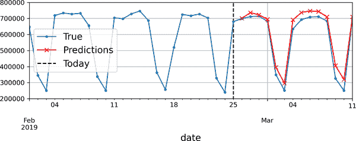
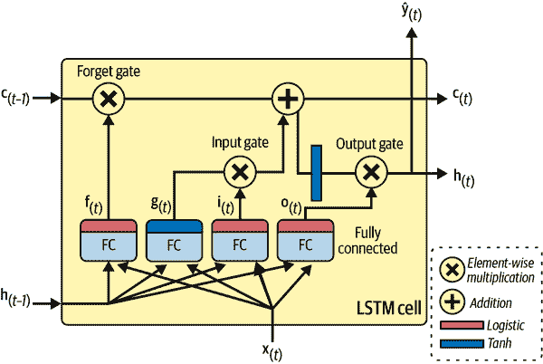

# 第十五章。使用 RNNs 和 CNNs 处理序列

预测未来是你经常做的事情，无论是在结束朋友的句子还是预期早餐时咖啡的味道。在本章中，我们将讨论循环神经网络（RNNs）-一类可以预测未来的网络（嗯，至少在一定程度上）。RNNs 可以分析时间序列数据，例如您网站上每日活跃用户的数量，您所在城市的每小时温度，您家每日的用电量，附近汽车的轨迹等等。一旦 RNN 学习了数据中的过去模式，它就能利用自己的知识来预测未来，当然前提是过去的模式在未来仍然成立。

更一般地说，RNNs 可以处理任意长度的序列，而不是固定大小的输入。例如，它们可以将句子、文档或音频样本作为输入，使它们非常适用于自然语言处理应用，如自动翻译或语音转文本。

在本章中，我们将首先介绍 RNNs 的基本概念以及如何使用时间反向传播来训练它们。然后，我们将使用它们来预测时间序列。在此过程中，我们将研究常用的 ARMA 模型系列，通常用于预测时间序列，并将它们用作与我们的 RNNs 进行比较的基准。之后，我们将探讨 RNNs 面临的两个主要困难：

+   不稳定的梯度（在第十一章中讨论），可以通过各种技术来缓解，包括*循环丢失*和*循环层归一化*。

+   （非常）有限的短期记忆，可以使用 LSTM 和 GRU 单元进行扩展。

RNNs 并不是处理序列数据的唯一类型的神经网络。对于小序列，常规的密集网络可以胜任，而对于非常长的序列，例如音频样本或文本，卷积神经网络也可以表现得相当不错。我们将讨论这两种可能性，并通过实现 WaveNet 来结束本章-一种能够处理数万个时间步的 CNN 架构。让我们开始吧！

# 循环神经元和层

到目前为止，我们已经专注于前馈神经网络，其中激活仅在一个方向中流动，从输入层到输出层。循环神经网络看起来非常像前馈神经网络，只是它还有指向后方的连接。

让我们看看最简单的 RNN，由一个神经元组成，接收输入，产生输出，并将该输出发送回自身，如图 15-1（左）所示。在每个*时间步* *t*（也称为*帧*），这个*循环神经元*接收输入**x**[(*t*)]以及来自上一个时间步的自己的输出*ŷ*[(*t*–1)]。由于在第一个时间步没有先前的输出，通常将其设置为 0。我们可以沿着时间轴表示这个小网络，如图 15-1（右）所示。这被称为*将网络展开到时间轴*（每个时间步表示一个循环神经元）。


###### 图 15-1. 一个循环神经元（左）在时间轴上展开（右）

您可以轻松创建一个循环神经元层。在每个时间步*t*，每个神经元都接收来自输入向量**x**[(*t*)]和上一个时间步的输出向量**ŷ**[(*t*–1)]，如图 15-2 所示。请注意，现在输入和输出都是向量（当只有一个神经元时，输出是标量）。


###### 图 15-2. 一个循环神经元层（左）在时间轴上展开（右）

每个递归神经元有两组权重：一组用于输入**x**[(*t*)]，另一组用于上一个时间步的输出**ŷ**[(*t*–1)]。让我们称这些权重向量为**w**[*x*]和**w**[*ŷ*]。如果我们考虑整个递归层而不仅仅是一个递归神经元，我们可以将所有权重向量放入两个权重矩阵：**W**[*x*]和**W**[*ŷ*]。

整个递归层的输出向量可以按照你所期望的方式计算，如方程 15-1 所示，其中**b**是偏置向量，*ϕ*(·)是激活函数（例如，ReLU⁠¹）。

##### 方程 15-1. 单个实例的递归层输出

<math><msub><mi mathvariant="bold">ŷ</mi><mrow><mo>(</mo><mi>t</mi><mo>)</mo></mrow></msub><mo>=</mo><mi>ϕ</mi><mfenced><mrow><msup><msub><mi mathvariant="bold">W</mi><mi>x</mi></msub><mo>⊺</mo></msup><msub><mi mathvariant="bold">x</mi><mrow><mo>(</mo><mi>t</mi><mo>)</mo></mrow></msub><mo>+</mo><msup><msub><mi mathvariant="bold">W</mi><mi>ŷ</mi></msub><mo>⊺</mo></msup><msub><mi mathvariant="bold">ŷ</mi><mrow><mo>(</mo><mi>t</mi><mo>-</mo><mn>1</mn><mo>)</mo></mrow></msub><mo>+</mo><mi mathvariant="bold">b</mi></mrow></mfenced></math>

就像前馈神经网络一样，我们可以通过将时间步*t*的所有输入放入输入矩阵**X**[(*t*)]（参见方程 15-2）来一次性计算整个小批量的递归层输出。

##### 方程 15-2. 一次传递中递归神经元层的所有实例的输出：[小批量

<math display="block"><mtable displaystyle="true"><mtr><mtd columnalign="right"><msub><mi mathvariant="bold">Ŷ</mi> <mrow><mo>(</mo><mi>t</mi><mo>)</mo></mrow></msub></mtd> <mtd columnalign="left"><mrow><mo>=</mo> <mi>ϕ</mi> <mfenced separators="" open="(" close=")"><msub><mi mathvariant="bold">X</mi> <mrow><mo>(</mo><mi>t</mi><mo>)</mo></mrow></msub> <msub><mi mathvariant="bold">W</mi> <mi>x</mi></msub> <mo>+</mo> <msub><mi mathvariant="bold">Ŷ</mi> <mrow><mo>(</mo><mi>t</mi><mo>-</mo><mn>1</mn><mo>)</mo></mrow></msub> <msub><mi mathvariant="bold">W</mi> <mi>ŷ</mi></msub> <mo>+</mo> <mi mathvariant="bold">b</mi></mfenced></mrow></mtd></mtr> <mtr><mtd columnalign="left"><mrow><mo>=</mo> <mi>ϕ</mi> <mfenced separators="" open="(" close=")"><mfenced separators="" open="[" close="]"><msub><mi mathvariant="bold">X</mi> <mrow><mo>(</mo><mi>t</mi><mo>)</mo></mrow></msub> <msub><mi mathvariant="bold">Ŷ</mi> <mrow><mo>(</mo><mi>t</mi><mo>-</mo><mn>1</mn><mo>)</mo></mrow></msub></mfenced> <mi mathvariant="bold">W</mi> <mo>+</mo> <mi mathvariant="bold">b</mi></mfenced> <mtext>with</mtext> <mi mathvariant="bold">W</mi> <mo>=</mo> <mfenced separators="" open="[" close="]"><mtable><mtr><mtd><msub><mi mathvariant="bold">W</mi> <mi>x</mi></msub></mtd></mtr> <mtr><mtd><msub><mi mathvariant="bold">W</mi> <mi>ŷ</mi></msub></mtd></mtr></mtable></mfenced></mrow></mtd></mtr></mtable></math>

在这个方程中：

+   **Ŷ**[(*t*)]是一个*m*×*n*[neurons]矩阵，包含小批量中每个实例在时间步*t*的层输出（*m*是小批量中实例的数量，*n*[neurons]是神经元的数量）。

+   **X**[(*t*)]是一个*m*×*n*[inputs]矩阵，包含所有实例的输入（*n*[inputs]是输入特征的数量）。

+   **W**[*x*]是一个*n*[inputs]×*n*[neurons]矩阵，包含当前时间步输入的连接权重。

+   **W**[*ŷ*]是一个*n*[neurons]×*n*[neurons]矩阵，包含上一个时间步输出的连接权重。

+   **b**是一个大小为*n*[neurons]的向量，包含每个神经元的偏置项。

+   权重矩阵**W**[*x*]和**W**[*ŷ*]通常垂直连接成一个形状为(*n*[inputs] + *n*[neurons]) × *n*[neurons]的单个权重矩阵**W**（参见方程 15-2 的第二行）。

+   符号[**X**[(*t*)] **Ŷ**[(*t*–1)]]表示矩阵**X**[(*t*)]和**Ŷ**[(*t*–1)]的水平连接。

注意，**Ŷ**[(*t*)]是**X**[(*t*)]和**Ŷ**[(*t*–1)]的函数，**X**[(*t*–1)]和**Ŷ**[(*t*–2)]的函数，**X**[(*t*–2)]和**Ŷ**[(*t*–3)]的函数，依此类推。这使得**Ŷ**[(*t*)]是自时间*t*=0（即**X**[(0)], **X**[(1)], …​, **X**[(*t*)]）以来所有输入的函数。在第一个时间步骤，*t*=0 时，没有先前的输出，因此通常假定它们都是零。

## 记忆单元

由于递归神经元在时间步骤*t*的输出是前几个时间步骤的所有输入的函数，因此可以说它具有一种*记忆*形式。在时间步骤之间保留一些状态的神经网络的一部分称为*记忆单元*（或简称*单元*）。单个递归神经元或一层递归神经元是一个非常基本的单元，只能学习短模式（通常约为 10 个步骤长，但这取决于任务）。在本章后面，我们将看一些更复杂和强大的单元类型，能够学习更长的模式（大约长 10 倍，但这也取决于任务）。

时间步骤*t*时的单元状态，表示为**h**[(*t*)]（“h”代表“隐藏”），是该时间步骤的一些输入和上一个时间步骤的状态的函数：**h**[(*t*)] = *f*(**x**[(*t*)], **h**[(*t*–1)]）。在时间步骤*t*的输出，表示为**ŷ**[(*t*)]，也是前一个状态和当前输入的函数。在我们迄今讨论的基本单元的情况下，输出只等于状态，但在更复杂的单元中，情况并非总是如此，如图 15-3 所示。


###### 图 15-3。单元的隐藏状态和输出可能不同

## 输入和输出序列

RNN 可以同时接受一系列输入并产生一系列输出（参见图 15-4 左上方的网络）。这种*序列到序列网络*对于预测时间序列非常有用，例如您家每天的用电量：您向其提供过去*N*天的数据，并训练它输出将来一天的用电量（即从*N* – 1 天前到明天）。

或者，您可以向网络提供一系列输入并忽略除最后一个之外的所有输出（参见图 15-4 右上方的网络）。这是一个*序列到向量网络*。例如，您可以向网络提供与电影评论相对应的一系列单词，网络将输出情感分数（例如，从 0 [讨厌]到 1 [喜爱]）。

相反，您可以在每个时间步骤反复向网络提供相同的输入向量，并让它输出一个序列（参见图 15-4 左下方的网络）。这是一个*向量到序列网络*。例如，输入可以是一幅图像（或 CNN 的输出），输出可以是该图像的标题。

最后，您可以有一个序列到向量网络，称为*编码器*，后面是一个向量到序列网络，称为*解码器*（参见图 15-4 的右下方网络）。例如，这可以用于将一种语言的句子翻译成另一种语言。您将向网络提供一种语言的句子，编码器将把这个句子转换成一个单一的向量表示，然后解码器将把这个向量解码成另一种语言的句子。这种两步模型，称为[*编码器-解码器*](https://homl.info/seq2seq)⁠²比尝试使用单个序列到序列的 RNN 实时翻译要好得多（就像左上角表示的那种）：一个句子的最后几个词可能会影响翻译的前几个词，因此您需要等到看完整个句子后再进行翻译。我们将在第十六章中介绍编码器-解码器的实现（正如您将看到的，它比图 15-4 所暗示的要复杂一些）。


###### 图 15-4\. 序列到序列（左上）、序列到向量（右上）、向量到序列（左下）和编码器-解码器（右下）网络

这种多功能性听起来很有前途，但如何训练循环神经网络呢？

# 训练 RNNs

要训练 RNN，关键是将其通过时间展开（就像我们刚刚做的那样），然后使用常规的反向传播（参见图 15-5）。这种策略称为*通过时间的反向传播*（BPTT）。

就像常规反向传播一样，首先通过展开的网络进行第一次前向传递（由虚线箭头表示）。然后使用损失函数ℒ(**Y**[(0)], **Y**[(1)], …​, **Y**[(*T*)]; **Ŷ**[(0)], **Ŷ**[(1)], …​, **Ŷ**[(*T*)])评估输出序列（其中**Y**[(*i*)]是第*i*个目标，**Ŷ**[(*i*)]是第*i*个预测，*T*是最大时间步长）。请注意，此损失函数可能会忽略一些输出。例如，在序列到向量的 RNN 中，除了最后一个输出之外，所有输出都会被忽略。在图 15-5 中，损失函数仅基于最后三个输出计算。然后，该损失函数的梯度通过展开的网络向后传播（由实线箭头表示）。在这个例子中，由于输出**Ŷ**[(0)]和**Ŷ**[(1)]没有用于计算损失，梯度不会通过它们向后传播；它们只会通过**Ŷ**[(2)]、**Ŷ**[(3)]和**Ŷ**[(4)]向后传播。此外，由于在每个时间步骤中使用相同的参数**W**和**b**，它们的梯度将在反向传播过程中被多次调整。一旦反向阶段完成并计算出所有梯度，BPTT 可以执行梯度下降步骤来更新参数（这与常规反向传播没有区别）。


###### 图 15-5\. 通过时间反向传播

幸运的是，Keras 会为您处理所有这些复杂性，您将看到。但在我们到达那里之前，让我们加载一个时间序列，并开始使用传统工具进行分析，以更好地了解我们正在处理的内容，并获得一些基准指标。

# 预测时间序列

好了！假设您刚被芝加哥交通管理局聘为数据科学家。您的第一个任务是构建一个能够预测明天公交和轨道乘客数量的模型。您可以访问自 2001 年以来的日常乘客数据。让我们一起看看您将如何处理这个问题。我们将从加载和清理数据开始：

```py
import pandas as pd
from pathlib import Path

path = Path("datasets/ridership/CTA_-_Ridership_-_Daily_Boarding_Totals.csv")
df = pd.read_csv(path, parse_dates=["service_date"])
df.columns = ["date", "day_type", "bus", "rail", "total"]  # shorter names
df = df.sort_values("date").set_index("date")
df = df.drop("total", axis=1)  # no need for total, it's just bus + rail
df = df.drop_duplicates()  # remove duplicated months (2011-10 and 2014-07)
```

我们加载 CSV 文件，设置短列名，按日期对行进行排序，删除多余的`total`列，并删除重复行。现在让我们看看前几行是什么样子的：

```py
>>> df.head()
 day_type     bus    rail
date
2001-01-01        U  297192  126455
2001-01-02        W  780827  501952
2001-01-03        W  824923  536432
2001-01-04        W  870021  550011
2001-01-05        W  890426  557917
```

在 2001 年 1 月 1 日，芝加哥有 297,192 人乘坐公交车，126,455 人乘坐火车。`day_type`列包含`W`表示**工作日**，`A`表示**周六**，`U`表示**周日**或假期。

现在让我们绘制 2019 年几个月的公交和火车乘客量数据，看看它是什么样子的（参见图 15-6）：

```py
import matplotlib.pyplot as plt

df["2019-03":"2019-05"].plot(grid=True, marker=".", figsize=(8, 3.5))
plt.show()
```


###### 图 15-6。芝加哥的日常乘客量

请注意，Pandas 在范围中包括起始月份和结束月份，因此这将绘制从 3 月 1 日到 5 月 31 日的数据。这是一个*时间序列*：在不同时间步长上具有值的数据，通常在规则间隔上。更具体地说，由于每个时间步长有多个值，因此称为*多变量时间序列*。如果我们只看`bus`列，那将是一个*单变量时间序列*，每个时间步长有一个值。在处理时间序列时，预测未来值（即预测）是最典型的任务，这也是我们将在本章中重点关注的内容。其他任务包括插补（填补缺失的过去值）、分类、异常检测等。

查看图 15-6，我们可以看到每周明显重复的类似模式。这被称为每周*季节性*。实际上，在这种情况下，季节性非常强，通过简单地复制一周前的值来预测明天的乘客量将产生相当不错的结果。这被称为*天真预测*：简单地复制过去的值来进行预测。天真预测通常是一个很好的基准，有时甚至在某些情况下很难超越。

###### 注意

一般来说，天真预测意味着复制最新已知值（例如，预测明天与今天相同）。然而，在我们的情况下，复制上周的值效果更好，因为存在强烈的每周季节性。

为了可视化这些天真预测，让我们将两个时间序列（公交和火车）以及相同时间序列向右移动一周（即向右移动）的时间序列叠加使用虚线。我们还将绘制两者之间的差异（即时间*t*处的值减去时间*t* - 7 处的值）；这称为*差分*（参见图 15-7）：

```py
diff_7 = df[["bus", "rail"]].diff(7)["2019-03":"2019-05"]

fig, axs = plt.subplots(2, 1, sharex=True, figsize=(8, 5))
df.plot(ax=axs[0], legend=False, marker=".")  # original time series
df.shift(7).plot(ax=axs[0], grid=True, legend=False, linestyle=":")  # lagged
diff_7.plot(ax=axs[1], grid=True, marker=".")  # 7-day difference time series
plt.show()
```

不错！注意滞后时间序列如何紧密跟踪实际时间序列。当一个时间序列与其滞后版本相关联时，我们说该时间序列是*自相关*的。正如您所看到的，大多数差异都相当小，除了五月底。也许那时有一个假期？让我们检查`day_type`列：

```py
>>> list(df.loc["2019-05-25":"2019-05-27"]["day_type"])
['A', 'U', 'U']
```


###### 图 15-7。与 7 天滞后时间序列叠加的时间序列（顶部），以及*t*和*t* - 7 之间的差异（底部）

事实上，那时有一个长周末：周一是阵亡将士纪念日假期。我们可以使用这一列来改进我们的预测，但现在让我们只测量我们任意关注的三个月期间（2019 年 3 月、4 月和 5 月）的平均绝对误差，以获得一个大致的概念：

```py
>>> diff_7.abs().mean()
bus     43915.608696
rail    42143.271739
dtype: float64
```

我们的天真预测得到大约 43,916 名公交乘客和约 42,143 名火车乘客的 MAE。一眼看去很难判断这是好是坏，所以让我们将预测误差放入透视中，通过将它们除以目标值来进行评估：

```py
>>> targets = df[["bus", "rail"]]["2019-03":"2019-05"]
>>> (diff_7 / targets).abs().mean()
bus     0.082938
rail    0.089948
dtype: float64
```

我们刚刚计算的是*平均绝对百分比误差*（MAPE）：看起来我们的天真预测为公交大约为 8.3%，火车为 9.0%。有趣的是，火车预测的 MAE 看起来比公交预测的稍好一些，而 MAPE 则相反。这是因为公交乘客量比火车乘客量大，因此自然预测误差也更大，但当我们将误差放入透视时，结果表明公交预测实际上略优于火车预测。

###### 提示

MAE、MAPE 和 MSE 是评估预测的最常见指标之一。与往常一样，选择正确的指标取决于任务。例如，如果您的项目对大误差的影响是小误差的平方倍，那么 MSE 可能更可取，因为它会严厉惩罚大误差。

观察时间序列，似乎没有明显的月度季节性，但让我们检查一下是否存在年度季节性。我们将查看 2001 年至 2019 年的数据。为了减少数据窥探的风险，我们暂时忽略更近期的数据。让我们为每个系列绘制一个 12 个月的滚动平均线，以可视化长期趋势（参见图 15-8）：

```py
period = slice("2001", "2019")
df_monthly = df.resample('M').mean()  # compute the mean for each month
rolling_average_12_months = df_monthly[period].rolling(window=12).mean()

fig, ax = plt.subplots(figsize=(8, 4))
df_monthly[period].plot(ax=ax, marker=".")
rolling_average_12_months.plot(ax=ax, grid=True, legend=False)
plt.show()
```


###### 图 15-8。年度季节性和长期趋势

是的！确实存在一些年度季节性，尽管比每周季节性更嘈杂，对于铁路系列而言更为明显，而不是公交系列：我们看到每年大致相同日期出现高峰和低谷。让我们看看如果绘制 12 个月的差分会得到什么（参见图 15-9）：

```py
df_monthly.diff(12)[period].plot(grid=True, marker=".", figsize=(8, 3))
plt.show()
```


###### 图 15-9。12 个月的差分

注意，差分不仅消除了年度季节性，还消除了长期趋势。例如，2016 年至 2019 年时间序列中存在的线性下降趋势在差分时间序列中变为大致恒定的负值。事实上，差分是一种常用的技术，用于消除时间序列中的趋势和季节性：研究*平稳*时间序列更容易，这意味着其统计特性随时间保持不变，没有任何季节性或趋势。一旦您能够对差分时间序列进行准确的预测，只需将先前减去的过去值添加回来，就可以将其转换为实际时间序列的预测。

您可能会认为我们只是试图预测明天的乘客量，因此长期模式比短期模式更不重要。您是对的，但是，通过考虑长期模式，我们可能能够稍微提高性能。例如，2017 年 10 月，每日公交乘客量减少了约 2500 人，这代表每周减少约 570 名乘客，因此如果我们处于 2017 年 10 月底，通过从上周复制数值，减去 570，来预测明天的乘客量是有道理的。考虑趋势将使您的平均预测略微更准确。

现在您熟悉了乘客量时间序列，以及时间序列分析中一些最重要的概念，包括季节性、趋势、差分和移动平均，让我们快速看一下一个非常流行的统计模型家族，通常用于分析时间序列。

## ARMA 模型家族

我们将从上世纪 30 年代由赫尔曼·沃尔德（Herman Wold）开发的*自回归移动平均*（ARMA）模型开始：它通过对滞后值的简单加权和添加移动平均来计算其预测，非常类似我们刚刚讨论的。具体来说，移动平均分量是通过最近几个预测误差的加权和来计算的。方程 15-3 展示了该模型如何进行预测。

##### 第 15-3 方程。使用 ARMA 模型进行预测

<math><mtable columnalign="left"><mtr><mtd><msub><mover><mi>y</mi><mo>^</mo></mover><mrow><mo>(</mo><mi>t</mi><mo>)</mo></mrow></msub><mo>=</mo><munderover><mo>∑</mo><mrow><mi>i</mi><mo>=</mo><mn>1</mn></mrow><mi>p</mi></munderover><msub><mi>α</mi><mi>i</mi></msub><msub><mi>y</mi><mrow><mo>(</mo><mi>t</mi><mo>-</mo><mi>i</mi><mo>)</mo></mrow></msub><mo>+</mo><munderover><mo>∑</mo><mrow><mi>i</mi><mo>=</mo><mn>1</mn></mrow><mi>q</mi></munderover><msub><mi>θ</mi><mi>i</mi></msub><msub><mi>ϵ</mi><mrow><mo>(</mo><mi>t</mi><mo>-</mo><mi>i</mi><mo>)</mo></mrow></msub></mtd></mtr><mtr><mtd><mtext>with </mtext><msub><mi>ϵ</mi><mrow><mo>(</mo><mi>t</mi><mo>)</mo></mrow></msub><mo>=</mo><msub><mi>y</mi><mrow><mo>(</mo><mi>t</mi><mo>)</mo></mrow></msub><mo>-</mo><msub><mover><mi>y</mi><mo>^</mo></mover><mrow><mo>(</mo><mi>t</mi><mo>)</mo></mrow></msub></mtd></mtr></mtable></math>

在这个方程中：

+   *ŷ*[(*t*)]是模型对时间步*t*的预测。

+   *y*[(*t*)]是时间步*t*的时间序列值。

+   第一个总和是时间序列过去*p*个值的加权和，使用学习到的权重*α*[*i*]。数字*p*是一个超参数，它决定模型应该查看过去多远。这个总和是模型的自回归组件：它基于过去的值执行回归。

+   第二个总和是过去*q*个预测误差*ε*[(*t*)]的加权和，使用学习到的权重*θ*[*i*]。数字*q*是一个超参数。这个总和是模型的移动平均组件。

重要的是，这个模型假设时间序列是平稳的。如果不是，那么差分可能有所帮助。在一个时间步上使用差分将产生时间序列的导数的近似值：实际上，它将给出每个时间步的系列斜率。这意味着它将消除任何线性趋势，将其转换为一个常数值。例如，如果你对系列[3, 5, 7, 9, 11]应用一步差分，你会得到差分系列[2, 2, 2, 2]。

如果原始时间序列具有二次趋势而不是线性趋势，那么一轮差分将不足够。例如，系列[1, 4, 9, 16, 25, 36]经过一轮差分后变为[3, 5, 7, 9, 11]，但如果你再进行第二轮差分，你会得到[2, 2, 2, 2]。因此，进行两轮差分将消除二次趋势。更一般地，连续运行*d*轮差分计算时间序列的*d*阶导数的近似值，因此它将消除多项式趋势直到*d*阶。这个超参数*d*被称为*积分阶数*。

差分是 1970 年由乔治·博克斯和格威林·詹金斯在他们的书《时间序列分析》（Wiley）中介绍的*自回归积分移动平均*（ARIMA）模型的核心贡献：这个模型运行*d*轮差分使时间序列更平稳，然后应用常规 ARMA 模型。在进行预测时，它使用这个 ARMA 模型，然后将差分减去的项加回来。

ARMA 家族的最后一个成员是*季节性 ARIMA*（SARIMA）模型：它以与 ARIMA 相同的方式对时间序列建模，但另外还为给定频率（例如每周）建模一个季节性组件，使用完全相同的 ARIMA 方法。它总共有七个超参数：与 ARIMA 相同的*p*、*d*和*q*超参数，再加上额外的*P*、*D*和*Q*超参数来建模季节性模式，最后是季节性模式的周期，标记为*s*。超参数*P*、*D*和*Q*就像*p*、*d*和*q*一样，但它们用于模拟时间序列在*t* – *s*、*t* – 2*s*、*t* – 3*s*等时刻。

让我们看看如何将 SARIMA 模型拟合到铁路时间序列，并用它来预测明天的乘客量。我们假设今天是 2019 年 5 月的最后一天，我们想要预测“明天”，也就是 2019 年 6 月 1 日的铁路乘客量。为此，我们可以使用`statsmodels`库，其中包含许多不同的统计模型，包括由`ARIMA`类实现的 ARMA 模型及其变体：

```py
from statsmodels.tsa.arima.model import ARIMA

origin, today = "2019-01-01", "2019-05-31"
rail_series = df.loc[origin:today]["rail"].asfreq("D")
model = ARIMA(rail_series,
              order=(1, 0, 0),
              seasonal_order=(0, 1, 1, 7))
model = model.fit()
y_pred = model.forecast()  # returns 427,758.6
```

在这个代码示例中：

+   我们首先导入`ARIMA`类，然后我们从 2019 年初开始到“今天”获取铁路乘客数据，并使用`asfreq("D")`将时间序列的频率设置为每天：在这种情况下，这不会改变数据，因为它已经是每天的，但如果没有这个，`ARIMA`类将不得不猜测频率，并显示警告。

+   接下来，我们创建一个`ARIMA`实例，将所有数据传递到“今天”，并设置模型超参数：`order=(1, 0, 0)`表示*p*=1，*d*=0，*q*=0，`seasonal_order=(0, 1, 1, 7)`表示*P*=0，*D*=1，*Q*=1，*s*=7。请注意，`statsmodels` API 与 Scikit-Learn 的 API 有些不同，因为我们在构建时将数据传递给模型，而不是将数据传递给`fit()`方法。

+   接下来，我们拟合模型，并用它为“明天”，也就是 2019 年 6 月 1 日，做出预测。

预测为 427,759 名乘客，而实际上有 379,044 名。哎呀，我们偏差 12.9%——这相当糟糕。实际上，这比天真预测稍微糟糕，天真预测为 426,932，偏差为 12.6%。但也许那天我们只是运气不好？为了检查这一点，我们可以在循环中运行相同的代码，为三月、四月和五月的每一天进行预测，并计算该期间的平均绝对误差：

```py
origin, start_date, end_date = "2019-01-01", "2019-03-01", "2019-05-31"
time_period = pd.date_range(start_date, end_date)
rail_series = df.loc[origin:end_date]["rail"].asfreq("D")
y_preds = []
for today in time_period.shift(-1):
    model = ARIMA(rail_series[origin:today],  # train on data up to "today"
                  order=(1, 0, 0),
                  seasonal_order=(0, 1, 1, 7))
    model = model.fit()  # note that we retrain the model every day!
    y_pred = model.forecast()[0]
    y_preds.append(y_pred)

y_preds = pd.Series(y_preds, index=time_period)
mae = (y_preds - rail_series[time_period]).abs().mean()  # returns 32,040.7
```

啊，好多了！平均绝对误差约为 32,041，比我们用天真预测得到的平均绝对误差（42,143）显著低。因此，虽然模型并不完美，但平均而言仍然远远超过天真预测。

此时，您可能想知道如何为 SARIMA 模型选择良好的超参数。有几种方法，但最简单的方法是粗暴的方法：进行网格搜索。对于要评估的每个模型（即每个超参数组合），您可以运行前面的代码示例，仅更改超参数值。通常*p*、*q*、*P*和*Q*值较小（通常为 0 到 2，有时可达 5 或 6），*d*和*D*通常为 0 或 1，有时为 2。至于*s*，它只是主要季节模式的周期：在我们的情况下是 7，因为有强烈的每周季节性。具有最低平均绝对误差的模型获胜。当然，如果它更符合您的业务目标，您可以用另一个指标替换平均绝对误差。就是这样！

## 为机器学习模型准备数据

现在我们有了两个基线，天真预测和 SARIMA，让我们尝试使用迄今为止涵盖的机器学习模型来预测这个时间序列，首先从基本的线性模型开始。我们的目标是根据过去 8 周（56 天）的数据来预测明天的乘客量。因此，我们模型的输入将是序列（通常是生产中的每天一个序列），每个序列包含从时间步*t* - 55 到*t*的 56 个值。对于每个输入序列，模型将输出一个值：时间步*t* + 1 的预测。

但我们将使用什么作为训练数据呢？嗯，这就是诀窍：我们将使用过去的每个 56 天窗口作为训练数据，每个窗口的目标将是紧随其后的值。

Keras 实际上有一个很好的实用函数称为`tf.keras.utils.timeseries_dataset_from_array()`，帮助我们准备训练集。它以时间序列作为输入，并构建一个 tf.data.Dataset（在第十三章中介绍）包含所需长度的所有窗口，以及它们对应的目标。以下是一个示例，它以包含数字 0 到 5 的时间序列为输入，并创建一个包含所有长度为 3 的窗口及其对应目标的数据集，分组成大小为 2 的批次：

```py
import tensorflow as tf

my_series = [0, 1, 2, 3, 4, 5]
my_dataset = tf.keras.utils.timeseries_dataset_from_array(
    my_series,
    targets=my_series[3:],  # the targets are 3 steps into the future
    sequence_length=3,
    batch_size=2
)
```

让我们检查一下这个数据集的内容：

```py
>>> list(my_dataset)
[(<tf.Tensor: shape=(2, 3), dtype=int32, numpy=
 array([[0, 1, 2],
 [1, 2, 3]], dtype=int32)>,
 <tf.Tensor: shape=(2,), dtype=int32, numpy=array([3, 4], dtype=int32)>),
 (<tf.Tensor: shape=(1, 3), dtype=int32, numpy=array([[2, 3, 4]], dtype=int32)>,
 <tf.Tensor: shape=(1,), dtype=int32, numpy=array([5], dtype=int32)>)]
```

数据集中的每个样本是长度为 3 的窗口，以及其对应的目标（即窗口后面的值）。窗口是[0, 1, 2]，[1, 2, 3]和[2, 3, 4]，它们各自的目标是 3，4 和 5。由于总共有三个窗口，不是批次大小的倍数，最后一个批次只包含一个窗口而不是两个。

另一种获得相同结果的方法是使用 tf.data 的`Dataset`类的`window()`方法。这更复杂，但它给了您完全的控制，这将在本章后面派上用场，让我们看看它是如何工作的。`window()`方法返回一个窗口数据集的数据集：

```py
>>> for window_dataset in tf.data.Dataset.range(6).window(4, shift=1):
...     for element in window_dataset:
...         print(f"{element}", end=" ")
...     print()
...
0 1 2 3
1 2 3 4
2 3 4 5
3 4 5
4 5
5
```

在这个例子中，数据集包含六个窗口，每个窗口相对于前一个窗口向前移动一个步骤，最后三个窗口较小，因为它们已经到达系列的末尾。通常情况下，您会希望通过向`window()`方法传递`drop_remainder=True`来摆脱这些较小的窗口。

`window()`方法返回一个*嵌套数据集*，类似于一个列表的列表。当您想要通过调用其数据集方法（例如，对它们进行洗牌或分批处理）来转换每个窗口时，这将非常有用。然而，我们不能直接使用嵌套数据集进行训练，因为我们的模型将期望张量作为输入，而不是数据集。

因此，我们必须调用`flat_map()`方法：它将嵌套数据集转换为*平坦数据集*（包含张量而不是数据集）。例如，假设{1, 2, 3}表示包含张量 1、2 和 3 序列的数据集。如果展平嵌套数据集{{1, 2}, {3, 4, 5, 6}}，您将得到平坦数据集{1, 2, 3, 4, 5, 6}。

此外，`flat_map()`方法接受一个函数作为参数，允许您在展平之前转换嵌套数据集中的每个数据集。例如，如果您将函数`lambda ds: ds.batch(2)`传递给`flat_map()`，那么它将把嵌套数据集{{1, 2}, {3, 4, 5, 6}}转换为平坦数据集{[1, 2], [3, 4], [5, 6]}：这是一个包含 3 个大小为 2 的张量的数据集。

考虑到这一点，我们准备对数据集进行展平处理：

```py
>>> dataset = tf.data.Dataset.range(6).window(4, shift=1, drop_remainder=True)
>>> dataset = dataset.flat_map(lambda window_dataset: window_dataset.batch(4))
>>> for window_tensor in dataset:
...     print(f"{window_tensor}")
...
[0 1 2 3]
[1 2 3 4]
[2 3 4 5]
```

由于每个窗口数据集恰好包含四个项目，对窗口调用`batch(4)`会产生一个大小为 4 的单个张量。太棒了！现在我们有一个包含连续窗口的数据集，表示为张量。让我们创建一个小助手函数，以便更容易地从数据集中提取窗口：

```py
def to_windows(dataset, length):
    dataset = dataset.window(length, shift=1, drop_remainder=True)
    return dataset.flat_map(lambda window_ds: window_ds.batch(length))
```

最后一步是使用`map()`方法将每个窗口拆分为输入和目标。我们还可以将生成的窗口分组成大小为 2 的批次：

```py
>>> dataset = to_windows(tf.data.Dataset.range(6), 4)  # 3 inputs + 1 target = 4
>>> dataset = dataset.map(lambda window: (window[:-1], window[-1]))
>>> list(dataset.batch(2))
[(<tf.Tensor: shape=(2, 3), dtype=int64, numpy=
 array([[0, 1, 2],
 [1, 2, 3]])>,
 <tf.Tensor: shape=(2,), dtype=int64, numpy=array([3, 4])>),
 (<tf.Tensor: shape=(1, 3), dtype=int64, numpy=array([[2, 3, 4]])>,
 <tf.Tensor: shape=(1,), dtype=int64, numpy=array([5])>)]
```

正如您所看到的，我们现在得到了与之前使用`timeseries_dataset_from_array()`函数相同的输出（稍微费劲一些，但很快就会值得）。

现在，在开始训练之前，我们需要将数据分为训练期、验证期和测试期。我们现在将专注于铁路乘客量。我们还将通过一百万分之一的比例缩小它，以确保值接近 0-1 范围；这与默认的权重初始化和学习率很好地配合：

```py
rail_train = df["rail"]["2016-01":"2018-12"] / 1e6
rail_valid = df["rail"]["2019-01":"2019-05"] / 1e6
rail_test = df["rail"]["2019-06":] / 1e6
```

###### 注意

处理时间序列时，通常希望按时间划分。但在某些情况下，您可能能够沿其他维度划分，这将使您有更长的时间段进行训练。例如，如果您有关于 2001 年至 2019 年间 10,000 家公司财务状况的数据，您可能能够将这些数据分割到不同的公司。然而，很可能这些公司中的许多将强相关（例如，整个经济部门可能一起上涨或下跌），如果在训练集和测试集中有相关的公司，那么您的测试集将不会那么有用，因为其泛化误差的度量将是乐观偏倚的。

接下来，让我们使用`timeseries_dataset_from_array()`为训练和验证创建数据集。由于梯度下降期望训练集中的实例是独立同分布的（IID），正如我们在第四章中看到的那样，我们必须设置参数`shuffle=True`来对训练窗口进行洗牌（但不洗牌其中的内容）：

```py
seq_length = 56
train_ds = tf.keras.utils.timeseries_dataset_from_array(
    rail_train.to_numpy(),
    targets=rail_train[seq_length:],
    sequence_length=seq_length,
    batch_size=32,
    shuffle=True,
    seed=42
)
valid_ds = tf.keras.utils.timeseries_dataset_from_array(
    rail_valid.to_numpy(),
    targets=rail_valid[seq_length:],
    sequence_length=seq_length,
    batch_size=32
)
```

现在我们已经准备好构建和训练任何回归模型了！

## 使用线性模型进行预测

让我们首先尝试一个基本的线性模型。我们将使用 Huber 损失，通常比直接最小化 MAE 效果更好，如第十章中讨论的那样。我们还将使用提前停止：

```py
tf.random.set_seed(42)
model = tf.keras.Sequential([
    tf.keras.layers.Dense(1, input_shape=[seq_length])
])
early_stopping_cb = tf.keras.callbacks.EarlyStopping(
    monitor="val_mae", patience=50, restore_best_weights=True)
opt = tf.keras.optimizers.SGD(learning_rate=0.02, momentum=0.9)
model.compile(loss=tf.keras.losses.Huber(), optimizer=opt, metrics=["mae"])
history = model.fit(train_ds, validation_data=valid_ds, epochs=500,
                    callbacks=[early_stopping_cb])
```

该模型达到了约 37,866 的验证 MAE（结果可能有所不同）。这比天真的预测要好，但比 SARIMA 模型要差。⁵

我们能用 RNN 做得更好吗？让我们看看！

## 使用简单 RNN 进行预测

让我们尝试最基本的 RNN，其中包含一个具有一个循环神经元的单个循环层，就像我们在图 15-1 中看到的那样：

```py
model = tf.keras.Sequential([
    tf.keras.layers.SimpleRNN(1, input_shape=[None, 1])
])
```

Keras 中的所有循环层都期望形状为[*批量大小*，*时间步长*，*维度*]的 3D 输入，其中*维度*对于单变量时间序列为 1，对于多变量时间序列为更多。请记住，`input_shape`参数忽略第一个维度（即批量大小），由于循环层可以接受任意长度的输入序列，因此我们可以将第二个维度设置为`None`，表示“任意大小”。最后，由于我们处理的是单变量时间序列，我们需要最后一个维度的大小为 1。这就是为什么我们指定输入形状为`[None, 1]`：它表示“任意长度的单变量序列”。请注意，数据集实际上包含形状为[*批量大小*，*时间步长*]的输入，因此我们缺少最后一个维度，大小为 1，但在这种情况下，Keras 很友好地为我们添加了它。

这个模型的工作方式与我们之前看到的完全相同：初始状态*h*[(init)]设置为 0，并传递给一个单个的循环神经元，以及第一个时间步的值*x*[(0)]。神经元计算这些值加上偏置项的加权和，并使用默认的双曲正切函数对结果应用激活函数。结果是第一个输出*y*[0]。在简单 RNN 中，这个输出也是新状态*h*[0]。这个新状态传递给相同的循环神经元，以及下一个输入值*x*[(1)]，并且这个过程重复直到最后一个时间步。最后，该层只输出最后一个值：在我们的情况下，序列长度为 56 步，因此最后一个值是*y*[55]。所有这些都同时为批次中的每个序列执行，本例中有 32 个序列。

###### 注意

默认情况下，Keras 中的循环层只返回最终输出。要使它们返回每个时间步的一个输出，您必须设置`return_sequences=True`，如您将看到的。

这就是我们的第一个循环模型！这是一个序列到向量的模型。由于只有一个输出神经元，输出向量的大小为 1。

现在，如果您编译、训练和评估这个模型，就像之前的模型一样，您会发现它一点用也没有：其验证 MAE 大于 100,000！哎呀。这是可以预料到的，有两个原因：

1.  该模型只有一个循环神经元，因此在每个时间步进行预测时，它只能使用当前时间步的输入值和上一个时间步的输出值。这不足以进行预测！换句话说，RNN 的记忆极为有限：只是一个数字，它的先前输出。让我们来数一下这个模型有多少参数：由于只有一个循环神经元，只有两个输入值，整个模型只有三个参数（两个权重加上一个偏置项）。这对于这个时间序列来说远远不够。相比之下，我们之前的模型可以一次查看所有 56 个先前的值，并且总共有 57 个参数。

1.  时间序列包含的值从 0 到约 1.4，但由于默认激活函数是 tanh，循环层只能输出-1 到+1 之间的值。它无法预测 1.0 到 1.4 之间的值。

让我们解决这两个问题：我们将创建一个具有更大的循环层的模型，其中包含 32 个循环神经元，并在其顶部添加一个密集的输出层，其中只有一个输出神经元，没有激活函数。循环层将能够在一个时间步到下一个时间步传递更多信息，而密集输出层将把最终输出从 32 维投影到 1 维，没有任何值范围约束：

```py
univar_model = tf.keras.Sequential([
    tf.keras.layers.SimpleRNN(32, input_shape=[None, 1]),
    tf.keras.layers.Dense(1)  # no activation function by default
])
```

现在，如果您像之前那样编译、拟合和评估这个模型，您会发现其验证 MAE 达到了 27,703。这是迄今为止我们训练过的最佳模型，甚至击败了 SARIMA 模型：我们做得相当不错！

###### 提示

我们只对时间序列进行了归一化，没有去除趋势和季节性，但模型仍然表现良好。这很方便，因为这样可以快速搜索有前途的模型，而不用太担心预处理。然而，为了获得最佳性能，您可能希望尝试使时间序列更加平稳；例如，使用差分。

## 使用深度 RNN 进行预测

通常会堆叠多层单元，如图 15-10 所示。这给你一个*深度 RNN*。


###### 图 15-10. 深度 RNN（左）在时间轴上展开（右）

使用 Keras 实现深度 RNN 很简单：只需堆叠循环层。在下面的示例中，我们使用三个`SimpleRNN`层（但我们也可以使用任何其他类型的循环层，如`LSTM`层或`GRU`层，我们将很快讨论）。前两个是序列到序列层，最后一个是序列到向量层。最后，`Dense`层生成模型的预测（您可以将其视为向量到向量层）。因此，这个模型就像图 15-10 中表示的模型一样，只是忽略了**Ŷ**[(0)]到**Ŷ**[(*t*–1_)]的输出，并且在**Ŷ**[(*t*)]之上有一个密集层，输出实际预测：

```py
deep_model = tf.keras.Sequential([
    tf.keras.layers.SimpleRNN(32, return_sequences=True, input_shape=[None, 1]),
    tf.keras.layers.SimpleRNN(32, return_sequences=True),
    tf.keras.layers.SimpleRNN(32),
    tf.keras.layers.Dense(1)
])
```

###### 警告

确保对所有循环层设置`return_sequences=True`（除非您只关心最后的输出，最后一个循环层除外）。如果您忘记为一个循环层设置此参数，它将输出一个 2D 数组，其中仅包含最后一个时间步的输出，而不是包含所有时间步输出的 3D 数组。下一个循环层将抱怨您没有以预期的 3D 格式提供序列。

如果您训练和评估这个模型，您会发现它的 MAE 约为 31,211。这比两个基线都要好，但它并没有击败我们的“更浅”的 RNN。看起来这个 RNN 对我们的任务来说有点太大了。

## 多变量时间序列预测

神经网络的一个很大的优点是它们的灵活性：特别是，它们几乎不需要改变架构就可以处理多变量时间序列。例如，让我们尝试使用公交和铁路数据作为输入来预测铁路时间序列。事实上，让我们也加入日期类型！由于我们总是可以提前知道明天是工作日、周末还是假日，我们可以将日期类型系列向未来推移一天，这样模型就会将明天的日期类型作为输入。为简单起见，我们将使用 Pandas 进行此处理：

```py
df_mulvar = df[["bus", "rail"]] / 1e6  # use both bus & rail series as input
df_mulvar["next_day_type"] = df["day_type"].shift(-1)  # we know tomorrow's type
df_mulvar = pd.get_dummies(df_mulvar)  # one-hot encode the day type
```

现在 `df_mulvar` 是一个包含五列的 DataFrame：公交和铁路数据，以及包含下一天类型的独热编码的三列（请记住，有三种可能的日期类型，`W`、`A` 和 `U`）。接下来我们可以像之前一样继续。首先，我们将数据分为三个时期，用于训练、验证和测试：

```py
mulvar_train = df_mulvar["2016-01":"2018-12"]
mulvar_valid = df_mulvar["2019-01":"2019-05"]
mulvar_test = df_mulvar["2019-06":]
```

然后我们创建数据集：

```py
train_mulvar_ds = tf.keras.utils.timeseries_dataset_from_array(
    mulvar_train.to_numpy(),  # use all 5 columns as input
    targets=mulvar_train["rail"][seq_length:],  # forecast only the rail series
    [...]  # the other 4 arguments are the same as earlier
)
valid_mulvar_ds = tf.keras.utils.timeseries_dataset_from_array(
    mulvar_valid.to_numpy(),
    targets=mulvar_valid["rail"][seq_length:],
    [...]  # the other 2 arguments are the same as earlier
)
```

最后我们创建 RNN：

```py
mulvar_model = tf.keras.Sequential([
    tf.keras.layers.SimpleRNN(32, input_shape=[None, 5]),
    tf.keras.layers.Dense(1)
])
```

请注意，与我们之前构建的 `univar_model` RNN 唯一的区别是输入形状：在每个时间步骤，模型现在接收五个输入，而不是一个。这个模型实际上达到了 22,062 的验证 MAE。现在我们取得了很大的进展！

事实上，让 RNN 预测公交和铁路乘客量并不太难。您只需要在创建数据集时更改目标，将其设置为训练集的 `mulvar_train[["bus", "rail"]][seq_length:]`，验证集的 `mulvar_valid[["bus", "rail"]][seq_length:]`。您还必须在输出 `Dense` 层中添加一个额外的神经元，因为现在它必须进行两次预测：一次是明天的公交乘客量，另一次是铁路乘客量。就是这样！

正如我们在第十章中讨论的那样，对于多个相关任务使用单个模型通常比为每个任务使用单独的模型效果更好，因为为一个任务学习的特征可能对其他任务也有用，而且因为在多个任务中表现良好可以防止模型过拟合（这是一种正则化形式）。然而，这取决于任务，在这种特殊情况下，同时预测公交和铁路乘客量的多任务 RNN 并不像专门预测其中一个的模型表现得那么好（使用所有五列作为输入）。尽管如此，它对铁路的验证 MAE 达到了 25,330，对公交达到了 26,369，这还是相当不错的。

## 提前预测多个时间步

到目前为止，我们只预测了下一个时间步的值，但我们也可以通过适当更改目标来预测几个步骤之后的值（例如，要预测两周后的乘客量，我们只需将目标更改为比 1 天后提前 14 天的值）。但是如果我们想预测接下来的 14 个值呢？

第一种选择是取我们之前为铁路时间序列训练的 `univar_model` RNN，让它预测下一个值，并将该值添加到输入中，就好像预测的值实际上已经发生了；然后我们再次使用模型来预测下一个值，依此类推，如下面的代码所示：

```py
import numpy as np

X = rail_valid.to_numpy()[np.newaxis, :seq_length, np.newaxis]
for step_ahead in range(14):
    y_pred_one = univar_model.predict(X)
    X = np.concatenate([X, y_pred_one.reshape(1, 1, 1)], axis=1)
```

在这段代码中，我们取验证期间前 56 天的铁路乘客量，并将数据转换为形状为 [1, 56, 1] 的 NumPy 数组（请记住，循环层期望 3D 输入）。然后我们重复使用模型来预测下一个值，并将每个预测附加到输入系列中，沿着时间轴（`axis=1`）。生成的预测在图 15-11 中绘制。

###### 警告

如果模型在一个时间步骤上出现错误，那么接下来的时间步骤的预测也会受到影响：错误往往会累积。因此，最好只在少数步骤中使用这种技术。



###### 图 15-11。提前 14 步预测，一次预测一步

第二个选项是训练一个 RNN 一次性预测接下来的 14 个值。我们仍然可以使用一个序列到向量模型，但它将输出 14 个值而不是 1。然而，我们首先需要改变目标，使其成为包含接下来 14 个值的向量。为此，我们可以再次使用`timeseries_dataset_from_array()`，但这次要求它创建没有目标（`targets=None`）的数据集，并且具有更长的序列，长度为`seq_length` + 14。然后我们可以使用数据集的`map()`方法对每个序列批次应用自定义函数，将其分成输入和目标。在这个例子中，我们使用多变量时间序列作为输入（使用所有五列），并预测未来 14 天的铁路乘客量。

```py
def split_inputs_and_targets(mulvar_series, ahead=14, target_col=1):
    return mulvar_series[:, :-ahead], mulvar_series[:, -ahead:, target_col]

ahead_train_ds = tf.keras.utils.timeseries_dataset_from_array(
    mulvar_train.to_numpy(),
    targets=None,
    sequence_length=seq_length + 14,
    [...]  # the other 3 arguments are the same as earlier
).map(split_inputs_and_targets)
ahead_valid_ds = tf.keras.utils.timeseries_dataset_from_array(
    mulvar_valid.to_numpy(),
    targets=None,
    sequence_length=seq_length + 14,
    batch_size=32
).map(split_inputs_and_targets)
```

现在我们只需要将输出层的单元数从 1 增加到 14：

```py
ahead_model = tf.keras.Sequential([
    tf.keras.layers.SimpleRNN(32, input_shape=[None, 5]),
    tf.keras.layers.Dense(14)
])
```

训练完这个模型后，你可以像这样一次性预测接下来的 14 个值：

```py
X = mulvar_valid.to_numpy()[np.newaxis, :seq_length]  # shape [1, 56, 5]
Y_pred = ahead_model.predict(X)  # shape [1, 14]
```

这种方法效果相当不错。它对于第二天的预测显然比对未来 14 天的预测要好，但它不会像之前的方法那样累积误差。然而，我们仍然可以做得更好，使用一个序列到序列（或*seq2seq*）模型。

## 使用序列到序列模型进行预测

不是只在最后一个时间步训练模型来预测接下来的 14 个值，而是在每一个时间步都训练它来预测接下来的 14 个值。换句话说，我们可以将这个序列到向量的 RNN 转变为一个序列到序列的 RNN。这种技术的优势在于损失函数将包含 RNN 在每一个时间步的输出，而不仅仅是最后一个时间步的输出。

这意味着会有更多的误差梯度通过模型流动，它们不需要像以前那样通过时间流动，因为它们将来自每一个时间步的输出，而不仅仅是最后一个时间步。这将使训练更加稳定和快速。

明确一点，在时间步 0，模型将输出一个包含时间步 1 到 14 的预测的向量，然后在时间步 1，模型将预测时间步 2 到 15，依此类推。换句话说，目标是连续窗口的序列，每个时间步向后移动一个时间步。目标不再是一个向量，而是一个与输入相同长度的序列，每一步包含一个 14 维向量。

准备数据集并不是简单的，因为每个实例的输入是一个窗口，输出是窗口序列。一种方法是连续两次使用我们之前创建的`to_windows()`实用函数，以获得连续窗口的窗口。例如，让我们将数字 0 到 6 的系列转换为包含 4 个连续窗口的数据集，每个窗口长度为 3：

```py
>>> my_series = tf.data.Dataset.range(7)
>>> dataset = to_windows(to_windows(my_series, 3), 4)
>>> list(dataset)
[<tf.Tensor: shape=(4, 3), dtype=int64, numpy=
 array([[0, 1, 2],
 [1, 2, 3],
 [2, 3, 4],
 [3, 4, 5]])>,
 <tf.Tensor: shape=(4, 3), dtype=int64, numpy=
 array([[1, 2, 3],
 [2, 3, 4],
 [3, 4, 5],
 [4, 5, 6]])>]
```

现在我们可以使用`map()`方法将这些窗口的窗口分割为输入和目标：

```py
>>> dataset = dataset.map(lambda S: (S[:, 0], S[:, 1:]))
>>> list(dataset)
[(<tf.Tensor: shape=(4,), dtype=int64, numpy=array([0, 1, 2, 3])>,
 <tf.Tensor: shape=(4, 2), dtype=int64, numpy=
 array([[1, 2],
 [2, 3],
 [3, 4],
 [4, 5]])>),
 (<tf.Tensor: shape=(4,), dtype=int64, numpy=array([1, 2, 3, 4])>,
 <tf.Tensor: shape=(4, 2), dtype=int64, numpy=
 array([[2, 3],
 [3, 4],
 [4, 5],
 [5, 6]])>)]
```

现在数据集包含长度为 4 的输入序列，目标是包含下两个步骤的序列，每个时间步。例如，第一个输入序列是[0, 1, 2, 3]，对应的目标是[[1, 2], [2, 3], [3, 4], [4, 5]]，这是每个时间步的下两个值。如果你和我一样，可能需要几分钟来理解这个概念。慢慢来！

###### 注意

也许令人惊讶的是，目标值包含在输入中出现的值。这是不是作弊？幸运的是，完全不是：在每一个时间步，RNN 只知道过去的时间步；它无法向前看。它被称为*因果*模型。

让我们创建另一个小型实用函数来为我们的序列到序列模型准备数据集。它还会负责洗牌（可选）和分批处理：

```py
def to_seq2seq_dataset(series, seq_length=56, ahead=14, target_col=1,
                       batch_size=32, shuffle=False, seed=None):
    ds = to_windows(tf.data.Dataset.from_tensor_slices(series), ahead + 1)
    ds = to_windows(ds, seq_length).map(lambda S: (S[:, 0], S[:, 1:, 1]))
    if shuffle:
        ds = ds.shuffle(8 * batch_size, seed=seed)
    return ds.batch(batch_size)
```

现在我们可以使用这个函数来创建数据集：

```py
seq2seq_train = to_seq2seq_dataset(mulvar_train, shuffle=True, seed=42)
seq2seq_valid = to_seq2seq_dataset(mulvar_valid)
```

最后，我们可以构建序列到序列模型：

```py
seq2seq_model = tf.keras.Sequential([
    tf.keras.layers.SimpleRNN(32, return_sequences=True, input_shape=[None, 5]),
    tf.keras.layers.Dense(14)
])
```

这几乎与我们之前的模型完全相同：唯一的区别是在`SimpleRNN`层中设置了`return_sequences=True`。这样，它将输出一个向量序列（每个大小为 32），而不是在最后一个时间步输出单个向量。`Dense`层足够聪明，可以处理序列作为输入：它将在每个时间步应用，以 32 维向量作为输入，并输出 14 维向量。实际上，获得完全相同结果的另一种方法是使用具有核大小为 1 的`Conv1D`层：`Conv1D(14, kernel_size=1)`。

###### 提示

Keras 提供了一个`TimeDistributed`层，允许您将任何向量到向量层应用于输入序列中的每个向量，在每个时间步。它通过有效地重新塑造输入来实现这一点，以便将每个时间步视为单独的实例，然后重新塑造层的输出以恢复时间维度。在我们的情况下，我们不需要它，因为`Dense`层已经支持序列作为输入。

训练代码与往常一样。在训练期间，使用所有模型的输出，但在训练后，只有最后一个时间步的输出才重要，其余可以忽略。例如，我们可以这样预测未来 14 天的铁路乘客量：

```py
X = mulvar_valid.to_numpy()[np.newaxis, :seq_length]
y_pred_14 = seq2seq_model.predict(X)[0, -1]  # only the last time step's output
```

如果评估此模型对*t* + 1 的预测，您将发现验证 MAE 为 25,519。对于*t* + 2，它为 26,274，随着模型试图进一步预测未来，性能会逐渐下降。在*t* + 14 时，MAE 为 34,322。

###### 提示

您可以结合两种方法来预测多步：例如，您可以训练一个模型，预测未来 14 天，然后将其输出附加到输入，然后再次运行模型，以获取接下来 14 天的预测，并可能重复该过程。

简单的 RNN 在预测时间序列或处理其他类型的序列时可能表现得很好，但在长时间序列或序列上表现不佳。让我们讨论一下原因，并看看我们能做些什么。

# 处理长序列

要在长序列上训练 RNN，我们必须在许多时间步上运行它，使展开的 RNN 成为一个非常深的网络。就像任何深度神经网络一样，它可能会遇到不稳定的梯度问题，如第十一章中讨论的：可能需要很长时间来训练，或者训练可能不稳定。此外，当 RNN 处理长序列时，它将逐渐忘记序列中的第一个输入。让我们从不稳定的梯度问题开始，看看这两个问题。

## 解决不稳定梯度问题

许多我们在深度网络中用来缓解不稳定梯度问题的技巧也可以用于 RNN：良好的参数初始化，更快的优化器，辍学等。然而，非饱和激活函数（例如 ReLU）在这里可能不会有太大帮助。实际上，它们可能会导致 RNN 在训练过程中更加不稳定。为什么？嗯，假设梯度下降以一种增加第一个时间步输出的方式更新权重。由于相同的权重在每个时间步使用，第二个时间步的输出也可能略有增加，第三个时间步也是如此，直到输出爆炸——而非饱和激活函数无法阻止这种情况。

您可以通过使用较小的学习率来减少这种风险，或者可以使用饱和激活函数，如双曲正切（这解释了为什么它是默认值）。

同样，梯度本身也可能爆炸。如果注意到训练不稳定，可以监控梯度的大小（例如，使用 TensorBoard），并可能使用梯度裁剪。

此外，批量归一化不能像深度前馈网络那样有效地与 RNN 一起使用。实际上，您不能在时间步之间使用它，只能在循环层之间使用。

更准确地说，从技术上讲，可以在内存单元中添加一个 BN 层（您很快就会看到），以便在每个时间步上应用它（既在该时间步的输入上，也在上一个步骤的隐藏状态上）。然而，相同的 BN 层将在每个时间步上使用相同的参数，而不考虑输入和隐藏状态的实际比例和偏移。实际上，这并不会产生良好的结果，如 César Laurent 等人在[2015 年的一篇论文](https://homl.info/rnnbn)中所证明的：作者发现，只有当 BN 应用于层的输入时才略有益处，而不是应用于隐藏状态。换句话说，当应用于循环层之间（即在图 15-10 中垂直地）时，它略好于什么都不做，但不适用于循环层内部（即水平地）。在 Keras 中，您可以通过在每个循环层之前添加一个 `BatchNormalization` 层来简单地在层之间应用 BN，但这会减慢训练速度，并且可能帮助不大。

另一种规范化方法在 RNN 中通常效果更好：*层归一化*。这个想法是由 Jimmy Lei Ba 等人在[2016 年的一篇论文](https://homl.info/layernorm)中提出的：它与批归一化非常相似，但不同的是，层归一化是在特征维度上进行归一化，而不是在批次维度上。一个优点是它可以在每个时间步上独立地为每个实例计算所需的统计数据。这也意味着它在训练和测试期间的行为是相同的（与 BN 相反），它不需要使用指数移动平均来估计训练集中所有实例的特征统计数据，就像 BN 那样。与 BN 类似，层归一化为每个输入学习一个比例和偏移参数。在 RNN 中，它通常在输入和隐藏状态的线性组合之后立即使用。

让我们使用 Keras 在简单内存单元中实现层归一化。为此，我们需要定义一个自定义内存单元，它就像一个常规层一样，只是它的 `call()` 方法接受两个参数：当前时间步的 `inputs` 和上一个时间步的隐藏 `states`。

请注意，`states` 参数是一个包含一个或多个张量的列表。在简单的 RNN 单元中，它包含一个张量，等于上一个时间步的输出，但其他单元可能有多个状态张量（例如，`LSTMCell` 有一个长期状态和一个短期状态，您很快就会看到）。一个单元还必须有一个 `state_size` 属性和一个 `output_size` 属性。在简单的 RNN 中，两者都简单地等于单元的数量。以下代码实现了一个自定义内存单元，它将表现得像一个 `SimpleRNNCell`，但它还会在每个时间步应用层归一化：

```py
class LNSimpleRNNCell(tf.keras.layers.Layer):
    def __init__(self, units, activation="tanh", **kwargs):
        super().__init__(**kwargs)
        self.state_size = units
        self.output_size = units
        self.simple_rnn_cell = tf.keras.layers.SimpleRNNCell(units,
                                                             activation=None)
        self.layer_norm = tf.keras.layers.LayerNormalization()
        self.activation = tf.keras.activations.get(activation)

    def call(self, inputs, states):
        outputs, new_states = self.simple_rnn_cell(inputs, states)
        norm_outputs = self.activation(self.layer_norm(outputs))
        return norm_outputs, [norm_outputs]
```

让我们来看一下这段代码：

+   我们的 `LNSimpleRNNCell` 类继承自 `tf.keras.layers.Layer` 类，就像任何自定义层一样。

+   构造函数接受单位数和所需的激活函数，并设置 `state_size` 和 `output_size` 属性，然后创建一个没有激活函数的 `SimpleRNNCell`（因为我们希望在线性操作之后但在激活函数之前执行层归一化）。然后构造函数创建 `LayerNormalization` 层，最后获取所需的激活函数。

+   `call()`方法首先应用`simpleRNNCell`，它计算当前输入和先前隐藏状态的线性组合，并返回结果两次（实际上，在`SimpleRNNCell`中，输出就等于隐藏状态：换句话说，`new_states[0]`等于`outputs`，因此我们可以在`call()`方法的其余部分安全地忽略`new_states`）。接下来，`call()`方法应用层归一化，然后是激活函数。最后，它将输出返回两次：一次作为输出，一次作为新的隐藏状态。要使用此自定义细胞，我们只需要创建一个`tf.keras.layers.RNN`层，将其传递给一个细胞实例：

```py
custom_ln_model = tf.keras.Sequential([
    tf.keras.layers.RNN(LNSimpleRNNCell(32), return_sequences=True,
                        input_shape=[None, 5]),
    tf.keras.layers.Dense(14)
])
```

同样，您可以创建一个自定义细胞，在每个时间步之间应用 dropout。但有一个更简单的方法：Keras 提供的大多数循环层和细胞都有`dropout`和`recurrent_dropout`超参数：前者定义要应用于输入的 dropout 率，后者定义隐藏状态之间的 dropout 率，即时间步之间。因此，在 RNN 中不需要创建自定义细胞来在每个时间步应用 dropout。

通过这些技术，您可以缓解不稳定梯度问题，并更有效地训练 RNN。现在让我们看看如何解决短期记忆问题。

###### 提示

在预测时间序列时，通常有必要在预测中包含一些误差范围。为此，一种方法是使用 MC dropout，介绍在第十一章中：在训练期间使用`recurrent_dropout`，然后在推断时通过使用`model(X, training=True)`来保持 dropout 处于活动状态。多次重复此操作以获得多个略有不同的预测，然后计算每个时间步的这些预测的均值和标准差。

## 解决短期记忆问题

由于数据在经过 RNN 时经历的转换，每个时间步都会丢失一些信息。过一段时间后，RNN 的状态几乎不包含最初输入的任何痕迹。这可能是一个停滞不前的问题。想象一下多莉鱼试图翻译一句长句子；当她读完时，她已经不记得它是如何开始的。为了解决这个问题，引入了各种具有长期记忆的细胞类型。它们已经被证明非常成功，以至于基本细胞不再被广泛使用。让我们首先看看这些长期记忆细胞中最受欢迎的：LSTM 细胞。

### LSTM 细胞

*长短期记忆*（LSTM）细胞是由 Sepp Hochreiter 和 Jürgen Schmidhuber 于 1997 年提出的，并在多年来逐渐得到了几位研究人员的改进，如 Alex Graves，Haşim Sak 和 Wojciech Zaremba。如果将 LSTM 细胞视为黑匣子，它可以被用作基本细胞，只是它的性能会更好；训练会更快收敛，并且它会检测数据中更长期的模式。在 Keras 中，您可以简单地使用`LSTM`层而不是`SimpleRNN`层：

```py
model = tf.keras.Sequential([
    tf.keras.layers.LSTM(32, return_sequences=True, input_shape=[None, 5]),
    tf.keras.layers.Dense(14)
])
```

或者，您可以使用通用的`tf.keras.layers.RNN`层，将`LSTMCell`作为参数传递给它。但是，当在 GPU 上运行时，`LSTM`层使用了优化的实现（请参阅第十九章），因此通常最好使用它（`RNN`层在定义自定义细胞时非常有用，就像我们之前做的那样）。

那么 LSTM 细胞是如何工作的呢？其架构显示在图 15-12 中。如果不看盒子里面的内容，LSTM 细胞看起来与常规细胞完全相同，只是其状态分为两个向量：**h**[(*t*)]和**c**[(*t*)]（“c”代表“cell”）。您可以将**h**[(*t*)]视为短期状态，将**c**[(*t*)]视为长期状态。



###### 图 15-12\. LSTM 单元

现在让我们打开盒子！关键思想是网络可以学习将什么存储在长期状态中，什么丢弃，以及从中读取什么。当长期状态**c**[(*t*–1)]从左到右穿过网络时，您可以看到它首先经过一个*遗忘门*，丢弃一些记忆，然后通过加法操作添加一些新的记忆（通过*输入门*选择的记忆）。结果**c**[(*t*)]直接发送出去，没有进一步的转换。因此，在每个时间步骤，一些记忆被丢弃，一些记忆被添加。此外，在加法操作之后，长期状态被复制并通过 tanh 函数传递，然后结果由*输出门*过滤。这产生了短期状态**h**[(*t*)]（这等于此时间步骤的单元输出**y**[(*t*)）。现在让我们看看新记忆来自哪里以及门是如何工作的。

首先，当前输入向量**x**[(*t*)]和先前的短期状态**h**[(*t*–1)]被馈送到四个不同的全连接层。它们各自有不同的作用：

+   主要层是输出**g**[(*t*)]的层。它通常的作用是分析当前输入**x**[(*t*)]和先前（短期）状态**h**[(*t*–1)]。在基本单元中，除了这一层外没有其他内容，其输出直接发送到**y**[(*t*)]和**h**[(*t*)]。但在 LSTM 单元中，这一层的输出不会直接输出；相反，其最重要的部分存储在长期状态中（其余部分被丢弃）。

+   其他三个层是*门控制器*。由于它们使用逻辑激活函数，输出范围从 0 到 1。正如您所看到的，门控制器的输出被馈送到逐元素乘法操作：如果它们输出 0，则关闭门，如果它们输出 1，则打开门。具体来说：

    +   *遗忘门*（由**f**[(*t*)]控制）控制着应该擦除长期状态的哪些部分。

    +   *输入门*（由**i**[(*t*)]控制）控制着应该将**g**[(*t*)]的哪些部分添加到长期状态中。

    +   最后，*输出门*（由**o**[(*t*)]控制）控制着长期状态的哪些部分应该在此时间步骤被读取并输出，既输出到**h**[(*t*)]，也输出到**y**[(*t*)]。

简而言之，LSTM 单元可以学习识别重要的输入（这是输入门的作用），将其存储在长期状态中，保留它直到需要（这是遗忘门的作用），并在需要时提取它。这解释了为什么这些单元在捕捉时间序列、长文本、音频记录等长期模式方面取得了惊人的成功。

方程 15-4 总结了如何计算单元的长期状态、短期状态以及每个时间步骤的输出，针对单个实例（整个小批量的方程非常相似）。

##### 方程 15-4\. LSTM 计算

<math display="block"><mtable displaystyle="true"><mtr><mtd columnalign="right"><msub><mi mathvariant="bold">i</mi> <mrow><mo>(</mo><mi>t</mi><mo>)</mrow></msub></mtd> <mtd columnalign="left"><mrow><mo>=</mo> <mi>σ</mi> <mo>(</mo> <msup><mrow><msub><mi mathvariant="bold">W</mi> <mrow><mi>x</mi><mi>i</mi></mrow></msub></mrow> <mo>⊺</mo></msup> <msub><mi mathvariant="bold">x</mi> <mrow><mo>(</mo><mi>t</mi><mo>)</mo></mrow></msub> <mo>+</mo> <msup><mrow><msub><mi mathvariant="bold">W</mi> <mrow><mi>h</mi><mi>i</mi></mrow></msub></mrow> <mo>⊺</mo></msup> <msub><mi mathvariant="bold">h</mi> <mrow><mo>(</mo><mi>t</mo><mo>-</mo><mn>1</mn><mo>)</mo></mrow></msub> <mo>+</mo> <msub><mi mathvariant="bold">b</mi> <mi>i</mi></msub> <mo>)</mo></mrow></mtd></mtr> <mtr><mtd columnalign="right"><msub><mi mathvariant="bold">f</mi> <mrow><mo>(</mo><mi>t</mi><mo>)</mo></mrow></msub></mtd> <mtd columnalign="left"><mrow><mo>=</mo> <mi>σ</mi> <mo>(</mo> <msup><mrow><msub><mi mathvariant="bold">W</mi> <mrow><mi>x</mi><mi>f</mi></mrow></msub></mrow> <mo>⊺</mo></msup> <msub><mi mathvariant="bold">x</mi> <mrow><mo>(</mo><mi>t</mi><mo>)</mo></mrow></msub> <mo>+</mo> <msup><mrow><msub><mi mathvariant="bold">W</mi> <mrow><mi>h</mi><mi>f</mi></mrow></msub></mrow> <mo>⊺</mo></msup> <msub><mi mathvariant="bold">h</mi> <mrow><mo>(</mo><mi>t</mo><mo>-</mo><mn>1</mn><mo>)</mo></mrow></msub> <mo>+</mo> <msub><mi mathvariant="bold">b</mi> <mi>f</mi></msub> <mo>)</mo></mrow></mtd></mtr> <mtr><mtd columnalign="right"><msub><mi mathvariant="bold">o</mi> <mrow><mo>(</mo><mi>t</mi><mo>)</mo></mrow></msub></mtd> <mtd columnalign="left"><mrow><mo>=</mo> <mi>σ</mi> <mo>(</mo> <msup><mrow><msub><mi mathvariant="bold">W</mi> <mrow><mi>x</mi><mi>o</mi></mrow></msub></mrow> <mo>⊺</mo></msup> <msub><mi mathvariant="bold">x</mi> <mrow><mo>(</mo><mi>t</mi><mo>)</mo></mrow></msub> <mo>+</mo> <msup><mrow><msub><mi mathvariant="bold">W</mi> <mrow><mi>h</mi><mi>o</mi></mrow></msub></mrow> <mo>⊺</mo></msup> <msub><mi mathvariant="bold">h</mi> <mrow><mo>(</mo><mi>t</mo><mo>-</mo><mn>1</mn><mo>)</mo></mrow></msub> <mo>+</mo> <msub><mi mathvariant="bold">b</mi> <mi>o</mi></msub> <mo>)</mo></mrow></mtd></mtr> <mtr><mtd columnalign="right"><msub><mi mathvariant="bold">g</mi> <mrow><mo>(</mo><mi>t</mi><mo>)</mo></mrow></msub></mtd> <mtd columnalign="left"><mrow><mo>=</mo> <mo form="prefix">tanh</mo> <mo>(</mo> <msup><mrow><msub><mi mathvariant="bold">W</mi> <mrow><mi>x</mi><mi>g</mi></mrow></msub></mrow> <mo>⊺</mo></msup> <msub><mi mathvariant="bold">x</mi> <mrow><mo>(</mo><mi>t</mi><mo>)</mo></mrow></msub> <mo>+</mo> <msup><mrow><msub><mi mathvariant="bold">W</mi> <mrow><mi>h</mi><mi>g</mi></mrow></msub></mrow> <mo>⊺</mo></msup> <msub><mi mathvariant="bold">h</mi> <mrow><mo>(</mo><mi>t</mo><mo>-</mo><mn>1</mn><mo>)</mo></mrow></msub> <mo>+</mo> <msub><mi mathvariant="bold">b</mi> <mi>g</mi></msub> <mo>)</mo></mrow></mtd></mtr> <mtr><mtd columnalign="right"><msub><mi mathvariant="bold">c</mi> <mrow><mo>(</mo><mi>t</mi><mo>)</mo></mrow></msub></mtd> <mtd columnalign="left"><mrow><mo>=</mo> <msub><mi mathvariant="bold">f</mi> <mrow><mo>(</mo><mi>t</mi><mo>)</mo></mrow></msub> <mo>⊗</mo> <msub><mi mathvariant="bold">c</mi> <mrow><mo>(</mo><mi>t</mo><mo>-</mo><mn>1</mn><mo>)</mo></mrow></msub> <mo>+</mo> <msub><mi mathvariant="bold">i</mi> <mrow><mo>(</mo><mi>t</mi><mo>)</mo></mrow></msub> <mo>⊗</mo> <msub><mi mathvariant="bold">g</mi> <mrow><mo>(</mo><mi>t</mi><mo>)</mo></mrow></msub></mrow></mtd></mtr> <mtr><mtd columnalign="right"><msub><mi mathvariant="bold">y</mi> <mrow><mo>(</mo><mi>t</mi><mo>)</mo></mrow></msub></mtd> <mtd columnalign="left"><mrow><mo>=</mo> <msub><mi mathvariant="bold">h</mi> <mrow><mo>(</mo><mi>t</mi><mo>)</mo></mrow></msub> <mo>=</mo> <msub><mi mathvariant="bold">o</mi> <mrow><mo>(</mo><mi>t</mi><mo>)</mo></mrow></msub> <mo>⊗</mo> <mo form="prefix">tanh</mo> <mrow><mo>(</mo> <msub><mi mathvariant="bold">c</mi> <mrow><mo>(</mo><mi>t</mi><mo>)</mo></mrow></msub> <mo>)</mo></mrow></mrow></mtd></mtr></mtable></math>

在这个方程中：

+   **W**[*xi*]、**W**[*xf*]、**W**[*xo*]和**W**[*xg*]是每个四层的权重矩阵，用于它们与输入向量**x**[(*t*)]的连接。

+   **W**[*hi*]、**W**[*hf*]、**W**[*ho*]和**W**[*hg*]是每个四层的权重矩阵，用于它们与先前的短期状态**h**[(*t*–1)]的连接。

+   **b**[*i*]、**b**[*f*]、**b**[*o*]和**b**[*g*]是每个四层的偏置项。请注意，TensorFlow 将**b**[*f*]初始化为一个全为 1 的向量，而不是 0。这可以防止在训练开始时忘记所有内容。

LSTM 单元有几个变体。一个特别流行的变体是 GRU 单元，我们现在将看一下。

### GRU 单元

*门控循环单元* (GRU)单元（见图 15-13）由 Kyunghyun Cho 等人在[2014 年的一篇论文](https://homl.info/97)中提出，该论文还介绍了我们之前讨论过的编码器-解码器网络。


###### 图 15-13. GRU 单元

GRU 单元是 LSTM 单元的简化版本，看起来表现同样出色（这解释了它日益增长的受欢迎程度）。这些是主要的简化：

+   两个状态向量合并成一个单一向量**h**[(*t*)]。

+   一个单一的门控制器**z**[(*t*)]控制遗忘门和输入门。如果门控制器输出 1，则遗忘门打开（= 1），输入门关闭（1 - 1 = 0）。如果输出 0，则相反发生。换句话说，每当必须存储一个记忆时，将首先擦除将存储它的位置。这实际上是 LSTM 单元的一个常见变体。

+   没有输出门；完整状态向量在每个时间步输出。然而，有一个新的门控制器**r**[(*t*)]，控制哪部分先前状态将被显示给主层(**g**[(*t*)])。

方程 15-5 总结了如何计算每个时间步的单个实例的单元状态。

##### 方程 15-5. GRU 计算

<math display="block"><mtable displaystyle="true"><mtr><mtd columnalign="right"><msub><mi mathvariant="bold">z</mi> <mrow><mo>(</mo><mi>t</mi><mo>)</mo></mrow></msub></mtd> <mtd columnalign="left"><mrow><mo>=</mo> <mi>σ</mi> <mo>(</mo> <msup><mrow><msub><mi mathvariant="bold">W</mi> <mrow><mi>x</mi><mi>z</mi></mrow></msub></mrow> <mo>⊺</mo></msup> <msub><mi mathvariant="bold">x</mi> <mrow><mo>(</mo><mi>t</mi><mo>)</mo></mrow></msub> <mo>+</mo> <msup><mrow><msub><mi mathvariant="bold">W</mi> <mrow><mi>h</mi><mi>z</mi></mrow></msub></mrow> <mo>⊺</mo></msup> <msub><mi mathvariant="bold">h</mi> <mrow><mo>(</mo><mi>t</mi><mo>-</mo><mn>1</mn><mo>)</mo></mrow></msub> <mo>+</mo> <msub><mi mathvariant="bold">b</mi><mi>z</mi></msub> <mo>)</mo></mrow></mtd></mtr> <mtr><mtd columnalign="right"><msub><mi mathvariant="bold">r</mi> <mrow><mo>(</mo><mi>t</mi><mo>)</mo></mrow></msub></mtd> <mtd columnalign="left"><mrow><mo>=</mo> <mi>σ</mi> <mo>(</mo> <msup><mrow><msub><mi mathvariant="bold">W</mi> <mrow><mi>x</mi><mi>r</mi></mrow></msub></mrow> <mo>⊺</mo></msup> <msub><mi mathvariant="bold">x</mi> <mrow><mo>(</mo><mi>t</mi><mo>)</mo></mrow></msub> <mo>+</mo> <msup><mrow><msub><mi mathvariant="bold">W</mi> <mrow><mi>h</mi><mi>r</mi></mrow></msub></mrow> <mo>⊺</mo></msup> <msub><mi mathvariant="bold">h</mi> <mrow><mo>(</mo><mi>t</mi><mo>-</mo><mn>1</mn><mo>)</mo></mrow></msub> <mo>+</mo> <msub><mi mathvariant="bold">b</mi><mi>r</mi></msub> <mo>)</mo></mrow></mtd></mtr> <mtr><mtd columnalign="right"><msub><mi mathvariant="bold">g</mi> <mrow><mo>(</mo><mi>t</mi><mo>)</mo></mrow></msub></mtd> <mtd columnalign="left"><mrow><mo>=</mo> <mo form="prefix">tanh</mo> <mfenced separators="" open="(" close=")"><msup><mrow><msub><mi mathvariant="bold">W</mi> <mrow><mi>x</mi><mi>g</mi></mrow></msub></mrow> <mo>⊺</mo></msup> <msub><mi mathvariant="bold">x</mi> <mrow><mo>(</mo><mi>t</mi><mo>)</mo></mrow></msub> <mo>+</mo> <msup><mrow><msub><mi mathvariant="bold">W</mi> <mrow><mi>h</mi><mi>g</mi></mrow></msub></mrow> <mo>⊺</mo></msup> <mrow><mo>(</mo> <msub><mi mathvariant="bold">r</mi> <mrow><mo>(</mo><mi>t</mi><mo>)</mo></mrow></msub> <mo>⊗</mo> <msub><mi mathvariant="bold">h</mi> <mrow><mo>(</mo><mi>t</mi><mo>-</mo><mn>1</mn><mo>)</mo></mrow></msub> <mo>)</mo></mrow> <mo>+</mo> <msub><mi mathvariant="bold">b</mi><mi>g</mi></msub></mfenced></mrow></mtd></mtr> <mtr><mtd columnalign="right"><msub><mi mathvariant="bold">h</mi> <mrow><mo>(</mo><mi>t</mi><mo>)</mo></mrow></msub></mtd> <mtd columnalign="left"><mrow><mo>=</mo> <msub><mi mathvariant="bold">z</mi> <mrow><mo>(</mo><mi>t</mi><mo>)</mo></mrow></msub> <mo>⊗</mo> <msub><mi mathvariant="bold">h</mi> <mrow><mo>(</mo><mi>t</mi><mo>-</mo><mn>1</mn><mo>)</mo></mrow></msub> <mo>+</mo> <mrow><mo>(</mo> <mn>1</mn> <mo>-</mo> <msub><mi mathvariant="bold">z</mi> <mrow><mo>(</mo><mi>t</mi><mo>)</mo></mrow></msub> <mo>)</mo></mrow> <mo>⊗</mo> <msub><mi mathvariant="bold">g</mi> <mrow><mo>(</mo><mi>t</mi><mo>)</mo></mrow></msub></mrow></mtd></mtr></mtable></math>

Keras 提供了一个`tf.keras.layers.GRU`层：使用它只需要将`SimpleRNN`或`LSTM`替换为`GRU`。它还提供了一个`tf.keras.layers.GRUCell`，以便根据 GRU 单元创建自定义单元。

LSTM 和 GRU 单元是 RNN 成功的主要原因之一。然而，虽然它们可以处理比简单 RNN 更长的序列，但它们仍然有相当有限的短期记忆，并且很难学习 100 个时间步或更多的序列中的长期模式，例如音频样本、长时间序列或长句子。解决这个问题的一种方法是缩短输入序列；例如，使用 1D 卷积层。

### 使用 1D 卷积层处理序列

在第十四章中，我们看到 2D 卷积层通过在图像上滑动几个相当小的卷积核（或滤波器），产生多个 2D 特征图（每个卷积核一个）。类似地，1D 卷积层在序列上滑动多个卷积核，每个卷积核产生一个 1D 特征图。每个卷积核将学习检测单个非常短的连续模式（不超过卷积核大小）。如果使用 10 个卷积核，则该层的输出将由 10 个 1D 序列组成（长度相同），或者您可以将此输出视为单个 10D 序列。这意味着您可以构建一个由循环层和 1D 卷积层（甚至 1D 池化层）组成的神经网络。如果使用步幅为 1 和`"same"`填充的 1D 卷积层，则输出序列的长度将与输入序列的长度相同。但是，如果使用`"valid"`填充或大于 1 的步幅，则输出序列将短于输入序列，因此请确保相应调整目标。

例如，以下模型与之前的模型相同，只是它以一个 1D 卷积层开始，通过步幅为 2 对输入序列进行下采样。卷积核的大小大于步幅，因此所有输入都将用于计算该层的输出，因此模型可以学习保留有用信息，仅丢弃不重要的细节。通过缩短序列，卷积层可能有助于`GRU`层检测更长的模式，因此我们可以将输入序列长度加倍至 112 天。请注意，我们还必须裁剪目标中的前三个时间步：实际上，卷积核的大小为 4，因此卷积层的第一个输出将基于输入时间步 0 到 3，第一个预测将是时间步 4 到 17（而不是时间步 1 到 14）。此外，由于步幅，我们必须将目标下采样一半：

```py
conv_rnn_model = tf.keras.Sequential([
    tf.keras.layers.Conv1D(filters=32, kernel_size=4, strides=2,
                           activation="relu", input_shape=[None, 5]),
    tf.keras.layers.GRU(32, return_sequences=True),
    tf.keras.layers.Dense(14)
])

longer_train = to_seq2seq_dataset(mulvar_train, seq_length=112,
                                       shuffle=True, seed=42)
longer_valid = to_seq2seq_dataset(mulvar_valid, seq_length=112)
downsampled_train = longer_train.map(lambda X, Y: (X, Y[:, 3::2]))
downsampled_valid = longer_valid.map(lambda X, Y: (X, Y[:, 3::2]))
[...]  # compile and fit the model using the downsampled datasets
```

如果您训练和评估此模型，您会发现它的性能优于之前的模型（略有优势）。事实上，实际上可以仅使用 1D 卷积层并完全放弃循环层！

### WaveNet

在[2016 年的一篇论文](https://homl.info/wavenet)，⁠¹⁶ Aaron van den Oord 和其他 DeepMind 研究人员介绍了一种名为*WaveNet*的新颖架构。他们堆叠了 1D 卷积层，每一层的扩张率（每个神经元的输入间隔）都加倍：第一个卷积层一次只能看到两个时间步，而下一个卷积层则看到四个时间步（其感受野为四个时间步），下一个卷积层看到八个时间步，依此类推（参见图 15-14）。通过加倍扩张率，较低层学习短期模式，而较高层学习长期模式。由于加倍扩张率，网络可以非常高效地处理极大的序列。


###### 图 15-14。WaveNet 架构

论文的作者实际上堆叠了 10 个具有 1、2、4、8、…、256、512 扩张率的卷积层，然后他们又堆叠了另一组 10 个相同的层（扩张率也是 1、2、4、8、…、256、512），然后再次堆叠了另一组相同的 10 层。他们通过指出，具有这些扩张率的单个 10 个卷积层堆栈将像具有大小为 1,024 的卷积核的超高效卷积层一样（速度更快，更强大，参数数量显著减少）。他们还在每一层之前用与扩张率相等的零填充输入序列，以保持整个网络中相同的序列长度。

以下是如何实现一个简化的 WaveNet 来处理与之前相同的序列的方法：⁠¹⁷

```py
wavenet_model = tf.keras.Sequential()
wavenet_model.add(tf.keras.layers.Input(shape=[None, 5]))
for rate in (1, 2, 4, 8) * 2:
    wavenet_model.add(tf.keras.layers.Conv1D(
        filters=32, kernel_size=2, padding="causal", activation="relu",
        dilation_rate=rate))
wavenet_model.add(tf.keras.layers.Conv1D(filters=14, kernel_size=1))
```

这个`Sequential`模型从一个明确的输入层开始——这比仅在第一层上设置`input_shape`要简单。然后，它继续使用“因果”填充的 1D 卷积层，这类似于“相同”填充，只是零值仅附加在输入序列的开头，而不是两侧。这确保了卷积层在进行预测时不会窥视未来。然后，我们添加使用不断增长的扩张率的类似对层：1、2、4、8，再次是 1、2、4、8。最后，我们添加输出层：一个具有 14 个大小为 1 的滤波器的卷积层，没有任何激活函数。正如我们之前看到的那样，这样的卷积层等效于具有 14 个单元的`Dense`层。由于因果填充，每个卷积层输出与其输入序列相同长度的序列，因此我们在训练期间使用的目标可以是完整的 112 天序列：无需裁剪或降采样。

我们在本节讨论的模型对乘客量预测任务提供了类似的性能，但它们在任务和可用数据量方面可能会有很大差异。在 WaveNet 论文中，作者在各种音频任务（因此该架构的名称）上实现了最先进的性能，包括文本转语音任务，在多种语言中产生令人难以置信的逼真声音。他们还使用该模型逐个音频样本生成音乐。当您意识到一秒钟的音频可能包含成千上万个时间步时，这一壮举就显得更加令人印象深刻——即使是 LSTM 和 GRU 也无法处理如此长的序列。

###### 警告

如果您在测试期间评估我们最佳的芝加哥乘客量模型，从 2020 年开始，您会发现它们的表现远远不如预期！为什么呢？嗯，那时候是 Covid-19 大流行开始的时候，这对公共交通产生了很大影响。正如前面提到的，这些模型只有在它们从过去学到的模式在未来继续时才能很好地工作。无论如何，在将模型部署到生产环境之前，请验证它在最近的数据上表现良好。一旦投入生产，请确保定期监控其性能。

有了这个，您现在可以处理各种时间序列了！在第十六章中，我们将继续探索 RNN，并看看它们如何处理各种 NLP 任务。

# 练习

1.  您能想到一些序列到序列 RNN 的应用吗？序列到向量 RNN 和向量到序列 RNN 呢？

1.  RNN 层的输入必须具有多少维度？每个维度代表什么？输出呢？

1.  如果您想构建一个深度序列到序列 RNN，哪些 RNN 层应该具有`return_sequences=True`？序列到向量 RNN 呢？

1.  假设您有一个每日单变量时间序列，并且您想要预测接下来的七天。您应该使用哪种 RNN 架构？

1.  在训练 RNN 时主要的困难是什么？您如何处理它们？

1.  您能勾画出 LSTM 单元的架构吗？

1.  为什么要在 RNN 中使用 1D 卷积层？

1.  您可以使用哪种神经网络架构来对视频进行分类？

1.  为 SketchRNN 数据集训练一个分类模型，该数据集可在 TensorFlow Datasets 中找到。

1.  下载[巴赫赞美诗](https://homl.info/bach)数据集并解压缩。这是由约翰·塞巴斯蒂安·巴赫创作的 382 首赞美诗。每首赞美诗长 100 至 640 个时间步长，每个时间步长包含 4 个整数，其中每个整数对应于钢琴上的一个音符的索引（除了值为 0，表示没有播放音符）。训练一个模型——循环的、卷积的，或两者兼而有之——可以预测下一个时间步长（四个音符），给定来自赞美诗的时间步长序列。然后使用这个模型生成类似巴赫的音乐，一次一个音符：您可以通过给模型提供赞美诗的开头并要求它预测下一个时间步长来实现这一点，然后将这些时间步长附加到输入序列并要求模型预测下一个音符，依此类推。还要确保查看[谷歌的 Coconet 模型](https://homl.info/coconet)，该模型用于关于巴赫的一个不错的谷歌涂鸦。

这些练习的解决方案可在本章笔记本的末尾找到，网址为[*https://homl.info/colab3*](https://homl.info/colab3)。

¹ 请注意，许多研究人员更喜欢在 RNN 中使用双曲正切（tanh）激活函数，而不是 ReLU 激活函数。例如，参见 Vu Pham 等人的[2013 年论文](https://homl.info/91)“Dropout Improves Recurrent Neural Networks for Handwriting Recognition”。基于 ReLU 的 RNN 也是可能的，正如 Quoc V. Le 等人的[2015 年论文](https://homl.info/92)“初始化修正线性单元的循环网络的简单方法”中所示。

² Nal Kalchbrenner 和 Phil Blunsom，“循环连续翻译模型”，*2013 年经验方法自然语言处理会议论文集*（2013）：1700–1709。

³ 芝加哥交通管理局的最新数据可在[芝加哥数据门户](https://homl.info/ridership)上找到。

⁴ 有其他更有原则的方法来选择好的超参数，基于分析*自相关函数*（ACF）和*偏自相关函数*（PACF），或最小化 AIC 或 BIC 指标（在第九章中介绍）以惩罚使用太多参数的模型并减少过拟合数据的风险，但网格搜索是一个很好的起点。有关 ACF-PACF 方法的更多详细信息，请查看 Jason Brownlee 的这篇非常好的[文章](https://homl.info/arimatuning)。

⁵ 请注意，验证期从 2019 年 1 月 1 日开始，因此第一个预测是 2019 年 2 月 26 日，八周后。当我们评估基线模型时，我们使用了从 3 月 1 日开始的预测，但这应该足够接近。

⁶ 随意尝试这个模型。例如，您可以尝试预测接下来 14 天的公交和轨道乘客量。您需要调整目标，包括两者，并使您的模型输出 28 个预测，而不是 14 个。

⁷ César Laurent 等人，“批量归一化循环神经网络”，*IEEE 国际声学、语音和信号处理会议论文集*（2016）：2657–2661。

⁸ Jimmy Lei Ba 等人，“层归一化”，arXiv 预印本 arXiv:1607.06450（2016）。

⁹ 更简单的方法是继承自`SimpleRNNCell`，这样我们就不必创建内部的`SimpleRNNCell`或处理`state_size`和`output_size`属性，但这里的目标是展示如何从头开始创建自定义单元。

¹⁰ 动画电影*海底总动员*和*海底奇兵*中一个患有短期记忆丧失的角色。

¹¹ Sepp Hochreiter 和 Jürgen Schmidhuber，“长短期记忆”，*神经计算* 9，第 8 期（1997 年）：1735–1780。

¹² Haşim Sak 等，“基于长短期记忆的大词汇语音识别循环神经网络架构”，arXiv 预印本 arXiv:1402.1128（2014 年）。

¹³ Wojciech Zaremba 等，“循环神经网络正则化”，arXiv 预印本 arXiv:1409.2329（2014 年）。

¹⁴ Kyunghyun Cho 等，“使用 RNN 编码器-解码器学习短语表示进行统计机器翻译”，*2014 年经验方法自然语言处理会议论文集*（2014 年）：1724–1734。

¹⁵ 请参阅 Klaus Greff 等的[“LSTM：搜索空间奥德赛”](https://homl.info/98)，*IEEE 神经网络与学习系统交易* 28，第 10 期（2017 年）：2222–2232。这篇论文似乎表明所有 LSTM 变体表现大致相同。

¹⁶ Aaron van den Oord 等，“WaveNet：原始音频的生成模型”，arXiv 预印本 arXiv:1609.03499（2016 年）。

¹⁷ 完整的 WaveNet 使用了更多技巧，例如类似于 ResNet 中的跳过连接和类似于 GRU 单元中的*门控激活单元*。有关更多详细信息，请参阅本章的笔记本。
