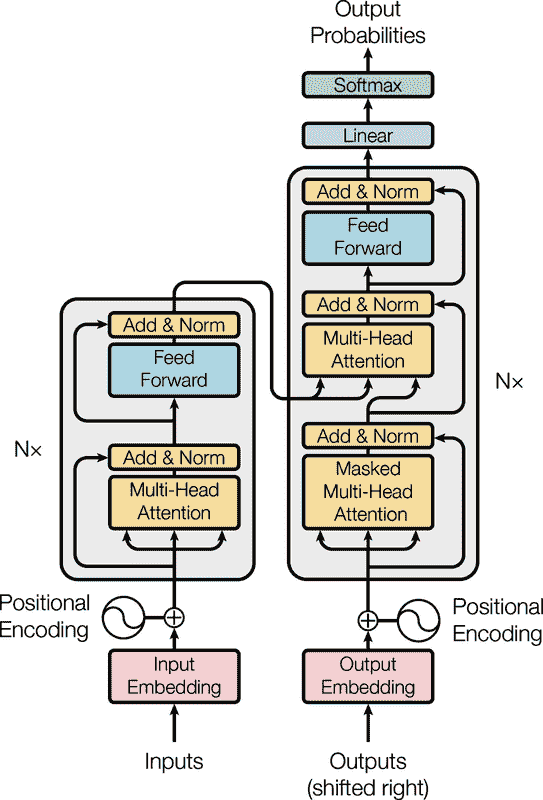

# 第十六章：使用 RNN 和注意力进行自然语言处理

当艾伦·图灵在 1950 年想象他著名的[Turing 测试](https://homl.info/turingtest)时，他提出了一种评估机器匹配人类智能能力的方法。他本可以测试许多事情，比如识别图片中的猫、下棋、创作音乐或逃离迷宫，但有趣的是，他选择了一项语言任务。更具体地说，他设计了一个*聊天机器人*，能够愚弄对话者以为它是人类。这个测试确实有其弱点：一组硬编码规则可以愚弄毫无戒心或天真的人类（例如，机器可以对某些关键词给出模糊的预定义答案，可以假装在回答一些最奇怪的问题时开玩笑或喝醉，或者可以通过用自己的问题回答难题来逃避困难的问题），并且许多人类智能的方面完全被忽视（例如，解释非言语交流，如面部表情，或学习手动任务的能力）。但这个测试确实突显了掌握语言可能是*智人*最伟大的认知能力。

我们能否构建一台能够掌握书面和口头语言的机器？这是自然语言处理研究的终极目标，但实际上研究人员更专注于更具体的任务，比如文本分类、翻译、摘要、问答等等。

自然语言任务的一种常见方法是使用循环神经网络。因此，我们将继续探索循环神经网络（在第十五章中介绍），首先是*字符 RNN*或*char-RNN*，训练以预测句子中的下一个字符。这将使我们能够生成一些原创文本。我们将首先使用*无状态 RNN*（在每次迭代中学习文本的随机部分，没有关于文本其余部分的信息），然后我们将构建*有状态 RNN*（在训练迭代之间保留隐藏状态，并继续阅读离开的地方，使其能够学习更长的模式）。接下来，我们将构建一个 RNN 来执行情感分析（例如，阅读电影评论并提取评价者对电影的感受），这次将句子视为单词序列，而不是字符。然后我们将展示如何使用 RNN 来构建一个编码器-解码器架构，能够执行神经机器翻译（NMT），将英语翻译成西班牙语。

在本章的第二部分，我们将探索*注意机制*。正如它们的名字所示，这些是神经网络组件，它们学习选择模型在每个时间步应该关注的输入部分。首先，我们将通过注意机制提高基于 RNN 的编码器-解码器架构的性能。接下来，我们将完全放弃 RNN，并使用一个非常成功的仅注意架构，称为*transformer*，来构建一个翻译模型。然后，我们将讨论过去几年自然语言处理中一些最重要的进展，包括基于 transformer 的 GPT 和 BERT 等非常强大的语言模型。最后，我将向您展示如何开始使用 Hugging Face 出色的 Transformers 库。

让我们从一个简单而有趣的模型开始，这个模型可以像莎士比亚一样写作（某种程度上）。

# 使用字符 RNN 生成莎士比亚文本

在一篇著名的[2015 年博客文章](https://homl.info/charrnn)中，安德烈·卡帕西展示了如何训练一个 RNN 来预测句子中的下一个字符。然后可以使用这个*char-RNN*逐个字符生成新文本。以下是一个经过训练所有莎士比亚作品后由 char-RNN 模型生成的文本的小样本：

> 潘达鲁斯：
> 
> 唉，我想他将会被接近并且这一天
> 
> 当一点点智慧被获得而从未被喂养时，
> 
> 而谁不是一条链，是他死亡的主题，
> 
> 我不应该睡觉。

虽然不是杰作，但仍然令人印象深刻，模型能够学习单词、语法、正确的标点符号等，只是通过学习预测句子中的下一个字符。这是我们的第一个*语言模型*示例；本章后面讨论的类似（但更强大）的语言模型是现代自然语言处理的核心。在本节的其余部分，我们将逐步构建一个 char-RNN，从创建数据集开始。

## 创建训练数据集

首先，使用 Keras 方便的 `tf.keras.utils.get_file()` 函数，让我们下载所有莎士比亚的作品。数据是从 Andrej Karpathy 的[char-rnn 项目](https://github.com/karpathy/char-rnn)加载的：

```py
import tensorflow as tf

shakespeare_url = "https://homl.info/shakespeare"  # shortcut URL
filepath = tf.keras.utils.get_file("shakespeare.txt", shakespeare_url)
with open(filepath) as f:
    shakespeare_text = f.read()
```

让我们打印前几行：

```py
>>> print(shakespeare_text[:80])
First Citizen:
Before we proceed any further, hear me speak.

All:
Speak, speak.
```

看起来像是莎士比亚的作品！

接下来，我们将使用 `tf.keras.layers.TextVectorization` 层（在第十三章介绍）对此文本进行编码。我们设置 `split="character"` 以获得字符级别的编码，而不是默认的单词级别编码，并且我们使用 `standardize="lower"` 将文本转换为小写（这将简化任务）：

```py
text_vec_layer = tf.keras.layers.TextVectorization(split="character",
                                                   standardize="lower")
text_vec_layer.adapt([shakespeare_text])
encoded = text_vec_layer([shakespeare_text])[0]
```

现在，每个字符都映射到一个整数，从 2 开始。`TextVectorization` 层将值 0 保留给填充标记，将值 1 保留给未知字符。目前我们不需要这两个标记，所以让我们从字符 ID 中减去 2，并计算不同字符的数量和总字符数：

```py
encoded -= 2  # drop tokens 0 (pad) and 1 (unknown), which we will not use
n_tokens = text_vec_layer.vocabulary_size() - 2  # number of distinct chars = 39
dataset_size = len(encoded)  # total number of chars = 1,115,394
```

接下来，就像我们在第十五章中所做的那样，我们可以将这个非常长的序列转换为一个窗口的数据集，然后用它来训练一个序列到序列的 RNN。目标将类似于输入，但是向“未来”移动了一个时间步。例如，数据集中的一个样本可能是代表文本“to be or not to b”（没有最后的“e”）的字符 ID 序列，相应的目标是代表文本“o be or not to be”（有最后的“e”，但没有开头的“t”）的字符 ID 序列。让我们编写一个小型实用函数，将字符 ID 的长序列转换为输入/目标窗口对的数据集：

```py
def to_dataset(sequence, length, shuffle=False, seed=None, batch_size=32):
    ds = tf.data.Dataset.from_tensor_slices(sequence)
    ds = ds.window(length + 1, shift=1, drop_remainder=True)
    ds = ds.flat_map(lambda window_ds: window_ds.batch(length + 1))
    if shuffle:
        ds = ds.shuffle(buffer_size=100_000, seed=seed)
    ds = ds.batch(batch_size)
    return ds.map(lambda window: (window[:, :-1], window[:, 1:])).prefetch(1)
```

这个函数开始得很像我们在第十五章中创建的 `to_windows()` 自定义实用函数：

+   它以一个序列作为输入（即编码文本），并创建一个包含所需长度的所有窗口的数据集。

+   它将长度增加一，因为我们需要下一个字符作为目标。

+   然后，它会对窗口进行洗牌（可选），将它们分批处理，拆分为输入/输出对，并激活预取。

图 16-1 总结了数据集准备步骤：它展示了长度为 11 的窗口，批量大小为 3。每个窗口的起始索引在其旁边标出。


###### 图 16-1\. 准备一个洗牌窗口的数据集

现在我们准备创建训练集、验证集和测试集。我们将大约使用文本的 90%进行训练，5%用于验证，5%用于测试：

```py
length = 100
tf.random.set_seed(42)
train_set = to_dataset(encoded[:1_000_000], length=length, shuffle=True,
                       seed=42)
valid_set = to_dataset(encoded[1_000_000:1_060_000], length=length)
test_set = to_dataset(encoded[1_060_000:], length=length)
```

###### 提示

我们将窗口长度设置为 100，但您可以尝试调整它：在较短的输入序列上训练 RNN 更容易更快，但 RNN 将无法学习任何长于 `length` 的模式，所以不要将其设置得太小。

就是这样！准备数据集是最困难的部分。现在让我们创建模型。

## 构建和训练 Char-RNN 模型

由于我们的数据集相当大，而建模语言是一个相当困难的任务，我们需要不止一个简单的具有几个循环神经元的 RNN。让我们构建并训练一个由 128 个单元组成的 `GRU` 层的模型（如果需要，稍后可以尝试调整层数和单元数）：

```py
model = tf.keras.Sequential([
    tf.keras.layers.Embedding(input_dim=n_tokens, output_dim=16),
    tf.keras.layers.GRU(128, return_sequences=True),
    tf.keras.layers.Dense(n_tokens, activation="softmax")
])
model.compile(loss="sparse_categorical_crossentropy", optimizer="nadam",
              metrics=["accuracy"])
model_ckpt = tf.keras.callbacks.ModelCheckpoint(
    "my_shakespeare_model", monitor="val_accuracy", save_best_only=True)
history = model.fit(train_set, validation_data=valid_set, epochs=10,
                    callbacks=[model_ckpt])
```

让我们仔细看看这段代码：

+   我们使用一个`Embedding`层作为第一层，用于编码字符 ID（嵌入在第十三章中介绍）。`Embedding`层的输入维度数是不同字符 ID 的数量，输出维度数是一个可以调整的超参数，我们暂时将其设置为 16。`Embedding`层的输入将是形状为[*批量大小*, *窗口长度*]的 2D 张量，`Embedding`层的输出将是形状为[*批量大小*, *窗口长度*, *嵌入大小*]的 3D 张量。

+   我们使用一个`Dense`层作为输出层：它必须有 39 个单元（`n_tokens`），因为文本中有 39 个不同的字符，并且我们希望在每个时间步输出每个可能字符的概率。39 个输出概率应该在每个时间步加起来为 1，因此我们将 softmax 激活函数应用于`Dense`层的输出。

+   最后，我们编译这个模型，使用`"sparse_categorical_crossentropy"`损失和 Nadam 优化器，然后训练模型多个 epoch，使用`ModelCheckpoint`回调来保存训练过程中验证准确性最好的模型。

###### 提示

如果您在启用 GPU 的 Colab 上运行此代码，则训练大约需要一到两个小时。如果您不想等待那么长时间，可以减少 epoch 的数量，但当然模型的准确性可能会降低。如果 Colab 会话超时，请确保快速重新连接，否则 Colab 运行时将被销毁。

这个模型不处理文本预处理，所以让我们将其包装在一个最终模型中，包含`tf.keras.layers.TextVectorization`层作为第一层，加上一个`tf.keras.layers.Lambda`层，从字符 ID 中减去 2，因为我们暂时不使用填充和未知标记：

```py
shakespeare_model = tf.keras.Sequential([
    text_vec_layer,
    tf.keras.layers.Lambda(lambda X: X - 2),  # no <PAD> or <UNK> tokens
    model
])
```

现在让我们用它来预测句子中的下一个字符：

```py
>>> y_proba = shakespeare_model.predict(["To be or not to b"])[0, -1]
>>> y_pred = tf.argmax(y_proba)  # choose the most probable character ID
>>> text_vec_layer.get_vocabulary()[y_pred + 2]
'e'
```

太好了，模型正确预测了下一个字符。现在让我们使用这个模型假装我们是莎士比亚！

## 生成虚假的莎士比亚文本

使用 char-RNN 模型生成新文本时，我们可以将一些文本输入模型，让模型预测最有可能的下一个字母，将其添加到文本末尾，然后将扩展后的文本提供给模型猜测下一个字母，依此类推。这被称为*贪婪解码*。但在实践中，这经常导致相同的单词一遍又一遍地重复。相反，我们可以随机采样下一个字符，概率等于估计的概率，使用 TensorFlow 的`tf.random.categorical()`函数。这将生成更多样化和有趣的文本。`categorical()`函数会根据类别对数概率（logits）随机采样随机类别索引。例如：

```py
>>> log_probas = tf.math.log([[0.5, 0.4, 0.1]])  # probas = 50%, 40%, and 10%
>>> tf.random.set_seed(42)
>>> tf.random.categorical(log_probas, num_samples=8)  # draw 8 samples
<tf.Tensor: shape=(1, 8), dtype=int64, numpy=array([[0, 1, 0, 2, 1, 0, 0, 1]])>
```

为了更好地控制生成文本的多样性，我们可以将 logits 除以一个称为*温度*的数字，我们可以根据需要进行调整。接近零的温度偏好高概率字符，而高温度使所有字符具有相等的概率。在生成相对严格和精确的文本（如数学方程式）时，通常更喜欢较低的温度，而在生成更多样化和创意性的文本时，更喜欢较高的温度。以下`next_char()`自定义辅助函数使用这种方法选择要添加到输入文本中的下一个字符：

```py
def next_char(text, temperature=1):
    y_proba = shakespeare_model.predict([text])[0, -1:]
    rescaled_logits = tf.math.log(y_proba) / temperature
    char_id = tf.random.categorical(rescaled_logits, num_samples=1)[0, 0]
    return text_vec_layer.get_vocabulary()[char_id + 2]
```

接下来，我们可以编写另一个小的辅助函数，它将重复调用`next_char()`以获取下一个字符并将其附加到给定的文本中：

```py
def extend_text(text, n_chars=50, temperature=1):
    for _ in range(n_chars):
        text += next_char(text, temperature)
    return text
```

现在我们准备生成一些文本！让我们尝试不同的温度值：

```py
>>> tf.random.set_seed(42)
>>> print(extend_text("To be or not to be", temperature=0.01))
To be or not to be the duke
as it is a proper strange death,
and the
>>> print(extend_text("To be or not to be", temperature=1))
To be or not to behold?

second push:
gremio, lord all, a sistermen,
>>> print(extend_text("To be or not to be", temperature=100))
To be or not to bef ,mt'&o3fpadm!$
wh!nse?bws3est--vgerdjw?c-y-ewznq
```

莎士比亚似乎正在遭受一场热浪。为了生成更具说服力的文本，一个常见的技术是仅从前 *k* 个字符中采样，或者仅从总概率超过某个阈值的最小一组顶级字符中采样（这被称为*核心采样*）。另外，您可以尝试使用*波束搜索*，我们将在本章后面讨论，或者使用更多的`GRU`层和更多的神经元每层，训练更长时间，并在需要时添加一些正则化。还要注意，模型目前无法学习比`length`更长的模式，`length`只是 100 个字符。您可以尝试将此窗口扩大，但这也会使训练更加困难，即使 LSTM 和 GRU 单元也无法处理非常长的序列。另一种替代方法是使用有状态的 RNN。

## 有状态的 RNN

到目前为止，我们只使用了*无状态的 RNN*：在每次训练迭代中，模型从一个全零的隐藏状态开始，然后在每个时间步更新这个状态，在最后一个时间步之后，将其丢弃，因为不再需要。如果我们指示 RNN 在处理训练批次后保留这个最终状态，并将其用作下一个训练批次的初始状态，会怎样呢？这样，模型可以学习长期模式，尽管只通过短序列进行反向传播。这被称为*有状态的 RNN*。让我们看看如何构建一个。

首先，注意到有状态的 RNN 只有在批次中的每个输入序列从上一个批次中对应序列的确切位置开始时才有意义。因此，我们构建有状态的 RNN 需要做的第一件事是使用顺序且不重叠的输入序列（而不是我们用来训练无状态 RNN 的洗牌和重叠序列）。在创建`tf.data.Dataset`时，因此在调用`window()`方法时必须使用`shift=length`（而不是`shift=1`）。此外，我们必须*不*调用`shuffle()`方法。

不幸的是，为有状态的 RNN 准备数据集时，批处理比为无状态的 RNN 更加困难。实际上，如果我们调用`batch(32)`，那么 32 个连续窗口将被放入同一个批次中，接下来的批次将不会继续每个窗口的位置。第一个批次将包含窗口 1 到 32，第二个批次将包含窗口 33 到 64，因此如果您考虑，比如说，每个批次的第一个窗口（即窗口 1 和 33），您会发现它们不是连续的。这个问题的最简单解决方案就是只使用批量大小为 1。以下的`to_dataset_for_stateful_rnn()`自定义实用函数使用这种策略来为有状态的 RNN 准备数据集：

```py
def to_dataset_for_stateful_rnn(sequence, length):
    ds = tf.data.Dataset.from_tensor_slices(sequence)
    ds = ds.window(length + 1, shift=length, drop_remainder=True)
    ds = ds.flat_map(lambda window: window.batch(length + 1)).batch(1)
    return ds.map(lambda window: (window[:, :-1], window[:, 1:])).prefetch(1)

stateful_train_set = to_dataset_for_stateful_rnn(encoded[:1_000_000], length)
stateful_valid_set = to_dataset_for_stateful_rnn(encoded[1_000_000:1_060_000],
                                                 length)
stateful_test_set = to_dataset_for_stateful_rnn(encoded[1_060_000:], length)
```

图 16-2 总结了这个函数的主要步骤。


###### 图 16-2。为有状态的 RNN 准备连续序列片段的数据集

批处理更加困难，但并非不可能。例如，我们可以将莎士比亚的文本分成 32 个等长的文本，为每个文本创建一个连续输入序列的数据集，最后使用`tf.data.Dataset.zip(datasets).map(lambda *windows: tf.stack(windows))`来创建正确的连续批次，其中批次中的第*n*个输入序列从上一个批次中的第*n*个输入序列结束的地方开始（请参阅笔记本获取完整代码）。

现在，让我们创建有状态的 RNN。在创建每个循环层时，我们需要将`stateful`参数设置为`True`，因为有状态的 RNN 需要知道批量大小（因为它将为批次中的每个输入序列保留一个状态）。因此，我们必须在第一层中设置`batch_input_shape`参数。请注意，我们可以将第二维度留空，因为输入序列可以具有任意长度：

```py
model = tf.keras.Sequential([
    tf.keras.layers.Embedding(input_dim=n_tokens, output_dim=16,
                              batch_input_shape=[1, None]),
    tf.keras.layers.GRU(128, return_sequences=True, stateful=True),
    tf.keras.layers.Dense(n_tokens, activation="softmax")
])
```

在每个时期结束时，我们需要在回到文本开头之前重置状态。为此，我们可以使用一个小的自定义 Keras 回调：

```py
class ResetStatesCallback(tf.keras.callbacks.Callback):
    def on_epoch_begin(self, epoch, logs):
        self.model.reset_states()
```

现在我们可以编译模型并使用我们的回调函数进行训练：

```py
model.compile(loss="sparse_categorical_crossentropy", optimizer="nadam",
              metrics=["accuracy"])
history = model.fit(stateful_train_set, validation_data=stateful_valid_set,
                    epochs=10, callbacks=[ResetStatesCallback(), model_ckpt])
```

###### 提示

训练完这个模型后，只能用它来对与训练时相同大小的批次进行预测。为了避免这个限制，创建一个相同的*无状态*模型，并将有状态模型的权重复制到这个模型中。

有趣的是，尽管 char-RNN 模型只是训练来预测下一个字符，但这看似简单的任务实际上也需要它学习一些更高级的任务。例如，要找到“Great movie, I really”之后的下一个字符，了解到这句话是积极的是有帮助的，所以下一个字符更有可能是“l”（代表“loved”）而不是“h”（代表“hated”）。事实上，OpenAI 的 Alec Radford 和其他研究人员在一篇 2017 年的论文中描述了他们如何在大型数据集上训练了一个类似于大型 char-RNN 模型，并发现其中一个神经元表现出色地作为情感分析分类器：尽管该模型在没有任何标签的情况下进行了训练，但他们称之为*情感神经元*达到了情感分析基准测试的最新性能。这预示并激励了 NLP 中的无监督预训练。

但在探索无监督预训练之前，让我们将注意力转向单词级模型以及如何在监督方式下用它们进行情感分析。在这个过程中，您将学习如何使用掩码处理可变长度的序列。

# 情感分析

生成文本可能很有趣且有教育意义，但在实际项目中，自然语言处理的最常见应用之一是文本分类，尤其是情感分析。如果在 MNIST 数据集上进行图像分类是计算机视觉的“Hello world！”，那么在 IMDb 评论数据集上进行情感分析就是自然语言处理的“Hello world！”。IMDb 数据集包含了来自著名的[互联网电影数据库](https://imdb.com)的 50,000 条英文电影评论（25,000 条用于训练，25,000 条用于测试），每条评论都有一个简单的二进制目标，表示其是否为负面（0）或正面（1）。就像 MNIST 一样，IMDb 评论数据集之所以受欢迎是有充分理由的：它足够简单，可以在笔记本电脑上在合理的时间内处理，但足够具有挑战性和有趣。

让我们使用 TensorFlow Datasets 库加载 IMDb 数据集（在第十三章中介绍）。我们将使用训练集的前 90%进行训练，剩下的 10%用于验证：

```py
import tensorflow_datasets as tfds

raw_train_set, raw_valid_set, raw_test_set = tfds.load(
    name="imdb_reviews",
    split=["train[:90%]", "train[90%:]", "test"],
    as_supervised=True
)
tf.random.set_seed(42)
train_set = raw_train_set.shuffle(5000, seed=42).batch(32).prefetch(1)
valid_set = raw_valid_set.batch(32).prefetch(1)
test_set = raw_test_set.batch(32).prefetch(1)
```

###### 提示

如果您愿意，Keras 还包括一个用于加载 IMDb 数据集的函数：`tf.keras.datasets.imdb.load_data()`。评论已经被预处理为单词 ID 的序列。

让我们检查一些评论：

```py
>>> for review, label in raw_train_set.take(4):
...     print(review.numpy().decode("utf-8"))
...     print("Label:", label.numpy())
...
This was an absolutely terrible movie. Don't be lured in by Christopher [...]
Label: 0
I have been known to fall asleep during films, but this is usually due to [...]
Label: 0
Mann photographs the Alberta Rocky Mountains in a superb fashion, and [...]
Label: 0
This is the kind of film for a snowy Sunday afternoon when the rest of the [...]
Label: 1
```

有些评论很容易分类。例如，第一条评论中的第一句话包含“terrible movie”这几个词。但在许多情况下，事情并不那么简单。例如，第三条评论一开始是积极的，尽管最终是一个负面评论（标签 0）。

为了为这个任务构建一个模型，我们需要预处理文本，但这次我们将其分成单词而不是字符。为此，我们可以再次使用`tf.keras.​lay⁠ers.TextVectorization`层。请注意，它使用空格来识别单词边界，在某些语言中可能效果不佳。例如，中文书写不使用单词之间的空格，越南语甚至在单词内部也使用空格，德语经常将多个单词连接在一起，没有空格。即使在英语中，空格也不总是分词的最佳方式：想想“San Francisco”或“#ILoveDeepLearning”。

幸运的是，有解决这些问题的解决方案。在[2016 年的一篇论文](https://homl.info/rarewords)，爱丁堡大学的 Rico Sennrich 等人探索了几种在子词级别对文本进行标记和去标记化的方法。这样，即使您的模型遇到了以前从未见过的罕见单词，它仍然可以合理地猜测它的含义。例如，即使模型在训练期间从未见过单词“smartest”，如果它学会了单词“smart”并且还学会了后缀“est”表示“最”，它可以推断出“smartest”的含义。作者评估的技术之一是*字节对编码*（BPE）。BPE 通过将整个训练集拆分为单个字符（包括空格），然后重复合并最频繁的相邻对，直到词汇表达到所需大小。

Google 的 Taku Kudo 在 2018 年发表的一篇论文进一步改进了子词标记化，通常消除了标记化之前需要进行特定于语言的预处理的需要。此外，该论文提出了一种称为*子词正则化*的新型正则化技术，通过在训练期间在标记化中引入一些随机性来提高准确性和稳健性：例如，“New England”可以被标记为“New”+“England”，或“New”+“Eng”+“land”，或简单地“New England”（只有一个标记）。Google 的[*SentencePiece*](https://github.com/google/sentencepiece)项目提供了一个开源实现，该实现在 Taku Kudo 和 John Richardson 的一篇[论文](https://homl.info/sentencepiece)中有描述。

[TensorFlow Text](https://homl.info/tftext)库还实现了各种标记化策略，包括[WordPiece](https://homl.info/wordpiece)（BPE 的变体），最后但同样重要的是，[Hugging Face 的 Tokenizers 库](https://homl.info/tokenizers)实现了一系列极快的标记化器。

然而，对于英语中的 IMDb 任务，使用空格作为标记边界应该足够好。因此，让我们继续创建一个`TextVectorization`层，并将其调整到训练集。我们将词汇表限制为 1,000 个标记，包括最常见的 998 个单词以及一个填充标记和一个未知单词的标记，因为很少见的单词不太可能对这个任务很重要，并且限制词汇表大小将减少模型需要学习的参数数量：

```py
vocab_size = 1000
text_vec_layer = tf.keras.layers.TextVectorization(max_tokens=vocab_size)
text_vec_layer.adapt(train_set.map(lambda reviews, labels: reviews))
```

最后，我们可以创建模型并训练它：

```py
embed_size = 128
tf.random.set_seed(42)
model = tf.keras.Sequential([
    text_vec_layer,
    tf.keras.layers.Embedding(vocab_size, embed_size),
    tf.keras.layers.GRU(128),
    tf.keras.layers.Dense(1, activation="sigmoid")
])
model.compile(loss="binary_crossentropy", optimizer="nadam",
              metrics=["accuracy"])
history = model.fit(train_set, validation_data=valid_set, epochs=2)
```

第一层是我们刚刚准备的`TextVectorization`层，接着是一个`Embedding`层，将单词 ID 转换为嵌入。嵌入矩阵需要每个词汇表中的标记一行（`vocab_size`），每个嵌入维度一列（此示例使用 128 维，但这是一个可以调整的超参数）。接下来我们使用一个`GRU`层和一个具有单个神经元和 sigmoid 激活函数的`Dense`层，因为这是一个二元分类任务：模型的输出将是评论表达对电影积极情绪的估计概率。然后我们编译模型，并在我们之前准备的数据集上进行几个时期的拟合（或者您可以训练更长时间以获得更好的结果）。

遗憾的是，如果运行此代码，通常会发现模型根本无法学习任何东西：准确率保持接近 50%，不比随机机会好。为什么呢？评论的长度不同，因此当`TextVectorization`层将它们转换为标记 ID 序列时，它使用填充标记（ID 为 0）填充较短的序列，使它们与批次中最长序列一样长。结果，大多数序列以许多填充标记结尾——通常是几十甚至几百个。即使我们使用的是比`SimpleRNN`层更好的`GRU`层，它的短期记忆仍然不太好，因此当它经过许多填充标记时，它最终会忘记评论的内容！一个解决方案是用等长的句子批次喂给模型（这也加快了训练速度）。另一个解决方案是让 RNN 忽略填充标记。这可以通过掩码来实现。

## 掩码

使用 Keras 让模型忽略填充标记很简单：在创建`Embedding`层时简单地添加`mask_zero=True`。这意味着所有下游层都会忽略填充标记（其 ID 为 0）。就是这样！如果对先前的模型进行几个时期的重新训练，您会发现验证准确率很快就能达到 80%以上。

这种工作方式是，`Embedding`层创建一个等于`tf.math.not_equal(inputs, 0)`的*掩码张量*：它是一个布尔张量，形状与输入相同，如果标记 ID 为 0，则等于`False`，否则等于`True`。然后，该掩码张量会被模型自动传播到下一层。如果该层的`call()`方法有一个`mask`参数，那么它会自动接收到掩码。这使得该层能够忽略适当的时间步。每个层可能会以不同的方式处理掩码，但通常它们只是忽略被掩码的时间步（即掩码为`False`的时间步）。例如，当循环层遇到被掩码的时间步时，它只是复制前一个时间步的输出。

接下来，如果该层的`supports_masking`属性为`True`，那么掩码会自动传播到下一层。只要层具有`supports_masking=True`，它就会继续这样传播。例如，当`return_sequences=True`时，循环层的`supports_masking`属性为`True`，但当`return_sequences=False`时，它为`False`，因为在这种情况下不再需要掩码。因此，如果您有一个具有多个`return_sequences=True`的循环层，然后是一个`return_sequences=False`的循环层的模型，那么掩码将自动传播到最后一个循环层：该层将使用掩码来忽略被掩码的步骤，但不会进一步传播掩码。同样，如果在我们刚刚构建的情感分析模型中创建`Embedding`层时设置了`mask_zero=True`，那么`GRU`层将自动接收和使用掩码，但不会进一步传播，因为`return_sequences`没有设置为`True`。

###### 提示

一些层在将掩码传播到下一层之前需要更新掩码：它们通过实现`compute_mask()`方法来实现，该方法接受两个参数：输入和先前的掩码。然后计算更新后的掩码并返回。`compute_mask()`的默认实现只是返回先前的掩码而没有更改。

许多 Keras 层支持掩码：`SimpleRNN`、`GRU`、`LSTM`、`Bidirectional`、`Dense`、`TimeDistributed`、`Add`等（都在`tf.keras.layers`包中）。然而，卷积层（包括`Conv1D`）不支持掩码——它们如何支持掩码并不明显。

如果掩码一直传播到输出，那么它也会应用到损失上，因此被掩码的时间步将不会对损失产生贡献（它们的损失将为 0）。这假设模型输出序列，这在我们的情感分析模型中并不是这样。

###### 警告

`LSTM`和`GRU`层具有基于 Nvidia 的 cuDNN 库的优化实现。但是，此实现仅在所有填充标记位于序列末尾时支持遮罩。它还要求您使用几个超参数的默认值：`activation`、`recurrent_activation`、`recurrent_dropout`、`unroll`、`use_bias`和`reset_after`。如果不是这种情况，那么这些层将退回到（速度慢得多的）默认 GPU 实现。

如果要实现支持遮罩的自定义层，应在`call()`方法中添加一个`mask`参数，并显然使方法使用该遮罩。此外，如果遮罩必须传播到下一层，则应在构造函数中设置`self.supports_masking=True`。如果必须在传播之前更新遮罩，则必须实现`compute_mask()`方法。

如果您的模型不以`Embedding`层开头，可以使用`tf.keras.layers.Masking`层代替：默认情况下，它将遮罩设置为`tf.math.reduce_any(tf.math.not_equal(X, 0), axis=-1)`，意味着最后一个维度全是零的时间步将在后续层中被遮罩。

使用遮罩层和自动遮罩传播对简单模型效果最好。对于更复杂的模型，例如需要将`Conv1D`层与循环层混合时，并不总是适用。在这种情况下，您需要显式计算遮罩并将其传递给适当的层，可以使用函数式 API 或子类 API。例如，以下模型与之前的模型等效，只是使用函数式 API 构建，并手动处理遮罩。它还添加了一点辍学，因为之前的模型略微过拟合：

```py
inputs = tf.keras.layers.Input(shape=[], dtype=tf.string)
token_ids = text_vec_layer(inputs)
mask = tf.math.not_equal(token_ids, 0)
Z = tf.keras.layers.Embedding(vocab_size, embed_size)(token_ids)
Z = tf.keras.layers.GRU(128, dropout=0.2)(Z, mask=mask)
outputs = tf.keras.layers.Dense(1, activation="sigmoid")(Z)
model = tf.keras.Model(inputs=[inputs], outputs=[outputs])
```

遮罩的最后一种方法是使用不规则张量来向模型提供输入。实际上，您只需在创建`TextVectorization`层时设置`ragged=True`，以便将输入序列表示为不规则张量：

```py
>>> text_vec_layer_ragged = tf.keras.layers.TextVectorization(
...     max_tokens=vocab_size, ragged=True)
...
>>> text_vec_layer_ragged.adapt(train_set.map(lambda reviews, labels: reviews))
>>> text_vec_layer_ragged(["Great movie!", "This is DiCaprio's best role."])
<tf.RaggedTensor [[86, 18], [11, 7, 1, 116, 217]]>
```

将这种不规则张量表示与使用填充标记的常规张量表示进行比较：

```py
>>> text_vec_layer(["Great movie!", "This is DiCaprio's best role."])
<tf.Tensor: shape=(2, 5), dtype=int64, numpy=
array([[ 86,  18,   0,   0,   0],
 [ 11,   7,   1, 116, 217]])>
```

Keras 的循环层内置支持不规则张量，因此您无需执行其他操作：只需在模型中使用此`TextVectorization`层。无需传递`mask_zero=True`或显式处理遮罩——这一切都已为您实现。这很方便！但是，截至 2022 年初，Keras 中对不规则张量的支持仍然相对较新，因此存在一些问题。例如，目前无法在 GPU 上运行时将不规则张量用作目标（但在您阅读这些内容时可能已解决）。

无论您喜欢哪种遮罩方法，在训练此模型几个时期后，它将变得非常擅长判断评论是积极的还是消极的。如果使用`tf.keras.callbacks.TensorBoard()`回调，您可以在 TensorBoard 中可视化嵌入，看到诸如“棒极了”和“惊人”的词逐渐聚集在嵌入空间的一侧，而诸如“糟糕”和“可怕”的词聚集在另一侧。有些词并不像您可能期望的那样积极（至少在这个模型中），比如“好”这个词，可能是因为许多负面评论包含短语“不好”。

## 重用预训练的嵌入和语言模型

令人印象深刻的是，这个模型能够基于仅有 25,000 条电影评论学习到有用的词嵌入。想象一下，如果我们有数十亿条评论来训练，这些嵌入会有多好！不幸的是，我们没有，但也许我们可以重用在其他（非常）大型文本语料库上训练的词嵌入（例如，亚马逊评论，可在 TensorFlow 数据集上找到）？毕竟，“amazing”这个词无论是用来谈论电影还是其他事物，通常都有相同的含义。此外，也许即使它们是在另一个任务上训练的，嵌入也对情感分析有用：因为“awesome”和“amazing”这样的词有相似的含义，它们很可能会在嵌入空间中聚集，即使是用于预测句子中的下一个词这样的任务。如果所有积极词和所有消极词形成簇，那么这对情感分析将是有帮助的。因此，我们可以不训练词嵌入，而是下载并使用预训练的嵌入，例如谷歌的[Word2vec 嵌入](https://homl.info/word2vec)，斯坦福的[GloVe 嵌入](https://homl.info/glove)，或 Facebook 的[FastText 嵌入](https://fasttext.cc)。

使用预训练词嵌入在几年内很受欢迎，但这种方法有其局限性。特别是，一个词无论上下文如何，都有一个表示。例如，“right”这个词在“left and right”和“right and wrong”中以相同的方式编码，尽管它们表示两个非常不同的含义。为了解决这个限制，Matthew Peters 在 2018 年引入了*来自语言模型的嵌入*（ELMo）：这些是从深度双向语言模型的内部状态中学习到的上下文化词嵌入。与仅在模型中使用预训练嵌入不同，您可以重用预训练语言模型的一部分。

大约在同一时间，Jeremy Howard 和 Sebastian Ruder 的[通用语言模型微调（ULMFiT）论文](https://homl.info/ulmfit)展示了无监督预训练在 NLP 任务中的有效性：作者们使用自监督学习（即从数据自动生成标签）在庞大的文本语料库上训练了一个 LSTM 语言模型，然后在各种任务上进行微调。他们的模型在六个文本分类任务上表现优异（在大多数情况下将错误率降低了 18-24%）。此外，作者们展示了一个仅使用 100 个标记示例进行微调的预训练模型可以达到与从头开始训练 10,000 个示例相同的性能。在 ULMFiT 论文之前，使用预训练模型只是计算机视觉中的常态；在 NLP 领域，预训练仅限于词嵌入。这篇论文标志着 NLP 的一个新时代的开始：如今，重用预训练语言模型已成为常态。

例如，让我们基于通用句子编码器构建一个分类器，这是由谷歌研究人员团队在 2018 年介绍的模型架构。这个模型基于 transformer 架构，我们将在本章后面讨论。方便的是，这个模型可以在 TensorFlow Hub 上找到。

```py
import os
import tensorflow_hub as hub

os.environ["TFHUB_CACHE_DIR"] = "my_tfhub_cache"
model = tf.keras.Sequential([
    hub.KerasLayer("https://tfhub.dev/google/universal-sentence-encoder/4",
                   trainable=True, dtype=tf.string, input_shape=[]),
    tf.keras.layers.Dense(64, activation="relu"),
    tf.keras.layers.Dense(1, activation="sigmoid")
])
model.compile(loss="binary_crossentropy", optimizer="nadam",
              metrics=["accuracy"])
model.fit(train_set, validation_data=valid_set, epochs=10)
```

###### 提示

这个模型非常庞大，接近 1GB 大小，因此下载可能需要一些时间。默认情况下，TensorFlow Hub 模块保存在临时目录中，并且每次运行程序时都会重新下载。为了避免这种情况，您必须将`TFHUB_CACHE_DIR`环境变量设置为您选择的目录：模块将保存在那里，只会下载一次。

请注意，TensorFlow Hub 模块 URL 的最后部分指定我们想要模型的第 4 个版本。这种版本控制确保如果 TF Hub 上发布了新的模块版本，它不会破坏我们的模型。方便的是，如果你只在 Web 浏览器中输入这个 URL，你将得到这个模块的文档。

还要注意，在创建`hub.KerasLayer`时，我们设置了`trainable=True`。这样，在训练期间，预训练的 Universal Sentence Encoder 会进行微调：通过反向传播调整一些权重。并非所有的 TensorFlow Hub 模块都是可微调的，所以确保查看你感兴趣的每个预训练模块的文档。

训练后，这个模型应该能达到超过 90%的验证准确率。这实际上非常好：如果你尝试自己执行这个任务，你可能只会稍微好一点，因为许多评论中既包含积极的评论，也包含消极的评论。对这些模棱两可的评论进行分类就像抛硬币一样。

到目前为止，我们已经看过使用 char-RNN 进行文本生成，以及使用基于可训练嵌入的单词级 RNN 模型进行情感分析，以及使用来自 TensorFlow Hub 的强大预训练语言模型。在接下来的部分中，我们将探索另一个重要的 NLP 任务：神经机器翻译（NMT）。

# 神经机器翻译的编码器-解码器网络

让我们从一个简单的[NMT 模型](https://homl.info/103)开始，它将英语句子翻译成西班牙语（参见图 16-3）。

简而言之，架构如下：英语句子作为输入馈送给编码器，解码器输出西班牙语翻译。请注意，西班牙语翻译也在训练期间作为解码器的输入使用，但是向后移动了一步。换句话说，在训练期间，解码器被给予上一步应该输出的单词作为输入，而不管它实际输出了什么。这被称为“教师强迫”——一种显著加速训练并提高模型性能的技术。对于第一个单词，解码器被给予序列开始（SOS）标记，期望解码器以序列结束（EOS）标记结束句子。

每个单词最初由其 ID 表示（例如，单词“soccer”的 ID 为`854`）。接下来，一个`Embedding`层返回单词嵌入。然后这些单词嵌入被馈送给编码器和解码器。

在每一步中，解码器为输出词汇表（即西班牙语）中的每个单词输出一个分数，然后 softmax 激活函数将这些分数转换为概率。例如，在第一步中，“Me”这个词可能有 7%的概率，“Yo”可能有 1%的概率，依此类推。具有最高概率的单词被输出。这非常类似于常规的分类任务，事实上你可以使用`"sparse_categorical_crossentropy"`损失来训练模型，就像我们在 char-RNN 模型中所做的那样。


###### 图 16-3。一个简单的机器翻译模型

请注意，在推断时（训练后），你将没有目标句子来馈送给解码器。相反，你需要将它刚刚输出的单词作为上一步的输入，如图 16-4 所示（这将需要一个在图中未显示的嵌入查找）。

###### 提示

在一篇[2015 年的论文](https://homl.info/scheduledsampling)，Samy Bengio 等人提出逐渐从在训练期间将前一个“目标”标记馈送给解码器转变为将前一个“输出”标记馈送给解码器。


###### 图 16-4。在推断时，解码器作为输入接收它刚刚在上一个时间步输出的单词

让我们构建并训练这个模型！首先，我们需要下载一个英语/西班牙语句子对的数据集：

```py
url = "https://storage.googleapis.com/download.tensorflow.org/data/spa-eng.zip"
path = tf.keras.utils.get_file("spa-eng.zip", origin=url, cache_dir="datasets",
                               extract=True)
text = (Path(path).with_name("spa-eng") / "spa.txt").read_text()
```

每行包含一个英语句子和相应的西班牙语翻译，用制表符分隔。我们将从删除西班牙字符“¡”和“¿”开始，`TextVectorization`层无法处理这些字符，然后我们将解析句子对并对它们进行洗牌。最后，我们将它们分成两个单独的列表，每种语言一个：

```py
import numpy as np

text = text.replace("¡", "").replace("¿", "")
pairs = [line.split("\t") for line in text.splitlines()]
np.random.shuffle(pairs)
sentences_en, sentences_es = zip(*pairs)  # separates the pairs into 2 lists
```

让我们看一下前三个句子对：

```py
>>> for i in range(3):
...     print(sentences_en[i], "=>", sentences_es[i])
...
How boring! => Qué aburrimiento!
I love sports. => Adoro el deporte.
Would you like to swap jobs? => Te gustaría que intercambiemos los trabajos?
```

接下来，让我们创建两个`TextVectorization`层——每种语言一个，并对文本进行调整：

```py
vocab_size = 1000
max_length = 50
text_vec_layer_en = tf.keras.layers.TextVectorization(
    vocab_size, output_sequence_length=max_length)
text_vec_layer_es = tf.keras.layers.TextVectorization(
    vocab_size, output_sequence_length=max_length)
text_vec_layer_en.adapt(sentences_en)
text_vec_layer_es.adapt([f"startofseq {s} endofseq" for s in sentences_es])
```

这里有几件事需要注意：

+   我们将词汇表大小限制为 1,000，这相当小。这是因为训练集不是很大，并且使用较小的值将加快训练速度。最先进的翻译模型通常使用更大的词汇表（例如 30,000），更大的训练集（几千兆字节）和更大的模型（数百甚至数千兆字节）。例如，查看赫尔辛基大学的 Opus-MT 模型，或 Facebook 的 M2M-100 模型。

+   由于数据集中的所有句子最多有 50 个单词，我们将`output_sequence_length`设置为 50：这样输入序列将自动填充为零，直到它们都是 50 个标记长。如果训练集中有任何超过 50 个标记的句子，它将被裁剪为 50 个标记。

+   对于西班牙文本，我们在调整`TextVectorization`层时为每个句子添加“startofseq”和“endofseq”：我们将使用这些词作为 SOS 和 EOS 标记。您可以使用任何其他单词，只要它们不是实际的西班牙单词。

让我们检查两种词汇表中的前 10 个标记。它们以填充标记、未知标记、SOS 和 EOS 标记（仅在西班牙语词汇表中）、然后按频率递减排序的实际单词开始：

```py
>>> text_vec_layer_en.get_vocabulary()[:10]
['', '[UNK]', 'the', 'i', 'to', 'you', 'tom', 'a', 'is', 'he']
>>> text_vec_layer_es.get_vocabulary()[:10]
['', '[UNK]', 'startofseq', 'endofseq', 'de', 'que', 'a', 'no', 'tom', 'la']
```

接下来，让我们创建训练集和验证集（如果需要，您也可以创建一个测试集）。我们将使用前 100,000 个句子对进行训练，其余用于验证。解码器的输入是西班牙语句子加上一个 SOS 标记前缀。目标是西班牙语句子加上一个 EOS 后缀：

```py
X_train = tf.constant(sentences_en[:100_000])
X_valid = tf.constant(sentences_en[100_000:])
X_train_dec = tf.constant([f"startofseq {s}" for s in sentences_es[:100_000]])
X_valid_dec = tf.constant([f"startofseq {s}" for s in sentences_es[100_000:]])
Y_train = text_vec_layer_es([f"{s} endofseq" for s in sentences_es[:100_000]])
Y_valid = text_vec_layer_es([f"{s} endofseq" for s in sentences_es[100_000:]])
```

好的，现在我们准备构建我们的翻译模型。我们将使用功能 API，因为模型不是顺序的。它需要两个文本输入——一个用于编码器，一个用于解码器——所以让我们从这里开始：

```py
encoder_inputs = tf.keras.layers.Input(shape=[], dtype=tf.string)
decoder_inputs = tf.keras.layers.Input(shape=[], dtype=tf.string)
```

接下来，我们需要使用我们之前准备的`TextVectorization`层对这些句子进行编码，然后为每种语言使用一个`Embedding`层，其中`mask_zero=True`以确保自动处理掩码。嵌入大小是一个您可以调整的超参数，像往常一样：

```py
embed_size = 128
encoder_input_ids = text_vec_layer_en(encoder_inputs)
decoder_input_ids = text_vec_layer_es(decoder_inputs)
encoder_embedding_layer = tf.keras.layers.Embedding(vocab_size, embed_size,
                                                    mask_zero=True)
decoder_embedding_layer = tf.keras.layers.Embedding(vocab_size, embed_size,
                                                    mask_zero=True)
encoder_embeddings = encoder_embedding_layer(encoder_input_ids)
decoder_embeddings = decoder_embedding_layer(decoder_input_ids)
```

###### 提示

当语言共享许多单词时，您可能会获得更好的性能，使用相同的嵌入层用于编码器和解码器。

现在让我们创建编码器并传递嵌入输入：

```py
encoder = tf.keras.layers.LSTM(512, return_state=True)
encoder_outputs, *encoder_state = encoder(encoder_embeddings)
```

为了保持简单，我们只使用了一个`LSTM`层，但您可以堆叠几个。我们还设置了`return_state=True`以获得对层最终状态的引用。由于我们使用了一个`LSTM`层，实际上有两个状态：短期状态和长期状态。该层分别返回这些状态，这就是为什么我们必须写`*encoder_state`来将两个状态分组在一个列表中。现在我们可以使用这个（双重）状态作为解码器的初始状态：

```py
decoder = tf.keras.layers.LSTM(512, return_sequences=True)
decoder_outputs = decoder(decoder_embeddings, initial_state=encoder_state)
```

接下来，我们可以通过具有 softmax 激活函数的`Dense`层将解码器的输出传递，以获得每个步骤的单词概率：

```py
output_layer = tf.keras.layers.Dense(vocab_size, activation="softmax")
Y_proba = output_layer(decoder_outputs)
```

就是这样！我们只需要创建 Keras`Model`，编译它并训练它：

```py
model = tf.keras.Model(inputs=[encoder_inputs, decoder_inputs],
                       outputs=[Y_proba])
model.compile(loss="sparse_categorical_crossentropy", optimizer="nadam",
              metrics=["accuracy"])
model.fit((X_train, X_train_dec), Y_train, epochs=10,
          validation_data=((X_valid, X_valid_dec), Y_valid))
```

训练后，我们可以使用该模型将新的英语句子翻译成西班牙语。但这并不像调用`model.predict()`那样简单，因为解码器期望的输入是上一个时间步预测的单词。一种方法是编写一个自定义记忆单元，跟踪先前的输出并在下一个时间步将其馈送给编码器。但为了保持简单，我们可以多次调用模型，每轮预测一个额外的单词。让我们为此编写一个小型实用程序函数：

```py
def translate(sentence_en):
    translation = ""
    for word_idx in range(max_length):
        X = np.array([sentence_en])  # encoder input
        X_dec = np.array(["startofseq " + translation])  # decoder input
        y_proba = model.predict((X, X_dec))[0, word_idx]  # last token's probas
        predicted_word_id = np.argmax(y_proba)
        predicted_word = text_vec_layer_es.get_vocabulary()[predicted_word_id]
        if predicted_word == "endofseq":
            break
        translation += " " + predicted_word
    return translation.strip()
```

该函数只是逐步预测一个单词，逐渐完成翻译，并在达到 EOS 标记时停止。让我们试试看！

```py
>>> translate("I like soccer")
'me gusta el fútbol'
```

万岁，它起作用了！嗯，至少对于非常短的句子是这样。如果您尝试使用这个模型一段时间，您会发现它还不是双语的，特别是在处理更长的句子时会遇到困难。例如：

```py
>>> translate("I like soccer and also going to the beach")
'me gusta el fútbol y a veces mismo al bus'
```

翻译说：“我喜欢足球，有时甚至喜欢公共汽车”。那么你如何改进呢？一种方法是增加训练集的大小，并在编码器和解码器中添加更多的`LSTM`层。但这只能让你走得更远，所以让我们看看更复杂的技术，从双向循环层开始。

## 双向 RNN

在每个时间步骤，常规循环层在生成输出之前只查看过去和现在的输入。换句话说，它是*因果*的，这意味着它不能预测未来。这种类型的 RNN 在预测时间序列时或在序列到序列（seq2seq）模型的解码器中是有意义的。但对于文本分类等任务，或者在 seq2seq 模型的编码器中，通常最好在编码给定单词之前查看下一个单词。

例如，考虑短语“右臂”，“正确的人”和“批评的权利”：要正确编码单词“right”，您需要向前查看。一个解决方案是在相同的输入上运行两个循环层，一个从左到右读取单词，另一个从右到左读取单词，然后在每个时间步骤组合它们的输出，通常通过连接它们。这就是*双向循环层*的作用（参见图 16-5）。


###### 图 16-5\. 双向循环层

在 Keras 中实现双向循环层，只需将循环层包装在`tf.keras.layers.Bidirectional`层中。例如，以下`Bidirectional`层可以用作我们翻译模型中的编码器：

```py
encoder = tf.keras.layers.Bidirectional(
    tf.keras.layers.LSTM(256, return_state=True))
```

###### 注意

`Bidirectional`层将创建`GRU`层的克隆（但是在相反方向），并且将同时运行并连接它们的输出。因此，尽管`GRU`层有 10 个单元，`Bidirectional`层将在每个时间步输出 20 个值。

只有一个问题。这一层现在将返回四个状态而不是两个：前向`LSTM`层的最终短期和长期状态，以及后向`LSTM`层的最终短期和长期状态。我们不能直接将这个四重状态用作解码器的`LSTM`层的初始状态，因为它只期望两个状态（短期和长期）。我们不能使解码器双向，因为它必须保持因果关系：否则在训练过程中会作弊，而且不起作用。相反，我们可以连接两个短期状态，并连接两个长期状态：

```py
encoder_outputs, *encoder_state = encoder(encoder_embeddings)
encoder_state = [tf.concat(encoder_state[::2], axis=-1),  # short-term (0 & 2)
                 tf.concat(encoder_state[1::2], axis=-1)]  # long-term (1 & 3)
```

现在让我们看看另一种在推理时可以极大提高翻译模型性能的流行技术：束搜索。

## 束搜索

假设您已经训练了一个编码器-解码器模型，并且您使用它将句子“I like soccer”翻译成西班牙语。您希望它会输出正确的翻译“me gusta el fútbol”，但不幸的是它输出了“me gustan los jugadores”，意思是“我喜欢球员”。看着训练集，您注意到许多句子如“I like cars”，翻译成“me gustan los autos”，所以模型在看到“I like”后输出“me gustan los”并不荒谬。不幸的是，在这种情况下是一个错误，因为“soccer”是单数。模型无法回头修正，所以它尽力完成句子，这种情况下使用了“jugadores”这个词。我们如何让模型有机会回头修正之前的错误呢？最常见的解决方案之一是*beam search*：它跟踪一个最有希望的句子列表（比如说前三个），在每个解码器步骤中尝试扩展它们一个词，只保留* k *个最有可能的句子。参数*k*被称为*beam width*。

例如，假设您使用模型来翻译句子“I like soccer”，使用 beam search 和 beam width 为 3（参见图 16-6）。在第一个解码器步骤中，模型将为翻译句子中每个可能的第一个词输出一个估计概率。假设前三个词是“me”（75%的估计概率），“a”（3%）和“como”（1%）。这是我们目前的短列表。接下来，我们使用模型为每个句子找到下一个词。对于第一个句子（“me”），也许模型为“gustan”这个词输出 36%的概率，“gusta”这个词输出 32%的概率，“encanta”这个词输出 16%的概率，依此类推。请注意，这些实际上是*条件*概率，假设句子以“me”开头。对于第二个句子（“a”），模型可能为“mi”这个词输出 50%的条件概率，依此类推。假设词汇表有 1,000 个词，我们将得到每个句子 1,000 个概率。

接下来，我们计算我们考虑的 3,000 个两个词的句子的概率（3 × 1,000）。我们通过将每个词的估计条件概率乘以它完成的句子的估计概率来做到这一点。例如，“me”的句子的估计概率为 75%，而“gustan”这个词的估计条件概率（假设第一个词是“me”）为 36%，所以“me gustan”的估计概率为 75% × 36% = 27%。在计算了所有 3,000 个两个词的句子的概率之后，我们只保留前 3 个。在这个例子中，它们都以“me”开头：“me gustan”（27%），“me gusta”（24%）和“me encanta”（12%）。目前，“me gustan”这个句子领先，但“me gusta”还没有被淘汰。


###### 图 16-6。beam search，beam width 为 3

然后我们重复相同的过程：我们使用模型预测这三个句子中的下一个词，并计算我们考虑的所有 3,000 个三个词的句子的概率。也许现在前三个是“me gustan los”（10%），“me gusta el”（8%）和“me gusta mucho”（2%）。在下一步中，我们可能得到“me gusta el fútbol”（6%），“me gusta mucho el”（1%）和“me gusta el deporte”（0.2%）。请注意，“me gustan”已经被淘汰，正确的翻译现在领先。我们在没有额外训练的情况下提高了我们的编码器-解码器模型的性能，只是更明智地使用它。

###### 提示

TensorFlow Addons 库包含一个完整的 seq2seq API，让您可以构建带有注意力的编码器-解码器模型，包括 beam search 等等。然而，它的文档目前非常有限。实现 beam search 是一个很好的练习，所以试一试吧！查看本章的笔记本，了解可能的解决方案。

通过这一切，您可以为相当短的句子获得相当不错的翻译。不幸的是，这种模型在翻译长句子时会表现得非常糟糕。问题再次出在 RNN 的有限短期记忆上。*注意力机制*是解决这个问题的划时代创新。

# 注意力机制

考虑一下从单词“soccer”到其翻译“fútbol”的路径，回到图 16-3：这是相当长的！这意味着这个单词的表示（以及所有其他单词）需要在实际使用之前经过许多步骤。我们难道不能让这条路径变短一点吗？

这是 Dzmitry Bahdanau 等人在一篇具有里程碑意义的[2014 年论文](https://homl.info/attention)中的核心思想，作者在其中介绍了一种技术，允许解码器在每个时间步关注适当的单词（由编码器编码）。例如，在解码器需要输出单词“fútbol”的时间步，它将把注意力集中在单词“soccer”上。这意味着从输入单词到其翻译的路径现在要短得多，因此 RNN 的短期记忆限制对其影响要小得多。注意机制彻底改变了神经机器翻译（以及深度学习一般）的方式，显著改进了技术水平，特别是对于长句子（例如，超过 30 个单词）。

###### 注意

NMT 中最常用的度量标准是*双语评估助手*（BLEU）分数，它将模型产生的每个翻译与人类产生的几个好翻译进行比较：它计算出现在任何目标翻译中的*n*-gram（*n*个单词序列）的数量，并调整分数以考虑在目标翻译中产生的*n*-gram 的频率。

图 16-7 展示了我们带有注意力机制的编码器-解码器模型。在左侧，您可以看到编码器和解码器。现在，我们不仅在每一步将编码器的最终隐藏状态和前一个目标单词发送给解码器（尽管这仍在进行，但在图中没有显示），还将所有编码器的输出发送给解码器。由于解码器无法一次处理所有这些编码器的输出，因此它们需要被聚合：在每个时间步，解码器的记忆单元计算所有编码器输出的加权和。这决定了它在这一步将关注哪些单词。权重*α*[(*t*,*i*)]是第*t*个解码器时间步的第*i*个编码器输出的权重。例如，如果权重*α*[(3,2)]远大于权重*α*[(3,0)]和*α*[(3,1)]，那么解码器将在这个时间步更多地关注第 2 个单词（“soccer”）的编码器输出，而不是其他两个输出。解码器的其余部分与之前的工作方式相同：在每个时间步，记忆单元接收我们刚刚讨论的输入，以及来自上一个时间步的隐藏状态，最后（尽管在图中没有表示）它接收来自上一个时间步的目标单词（或在推断时，来自上一个时间步的输出）。


###### 图 16-7。使用带有注意力模型的编码器-解码器网络的神经机器翻译

但是这些*α*[(*t*,*i*)]权重是从哪里来的呢？嗯，它们是由一个称为*对齐模型*（或*注意力层*）的小型神经网络生成的，该模型与其余的编码器-解码器模型一起进行训练。这个对齐模型在图 16-7 的右侧进行了说明。它以一个由单个神经元组成的`Dense`层开始，处理每个编码器的输出，以及解码器的先前隐藏状态（例如**h**[(2)]）。这一层为每个编码器输出（例如*e*[(3,] [2)]）输出一个分数（或能量）：这个分数衡量每个输出与解码器先前隐藏状态的对齐程度。例如，在图 16-7 中，模型已经输出了“me gusta el”（意思是“我喜欢”），所以现在期望一个名词：单词“soccer”是与当前状态最匹配的，所以它得到了一个高分。最后，所有分数都通过 softmax 层，以获得每个编码器输出的最终权重（例如*α*[(3,2)]）。给定解码器时间步的所有权重加起来等于 1。这种特定的注意力机制被称为*Bahdanau 注意力*（以 2014 年论文的第一作者命名）。由于它将编码器输出与解码器的先前隐藏状态连接起来，因此有时被称为*连接注意力*（或*加性注意力*）。

###### 注意

如果输入句子有*n*个单词，并假设输出句子长度大致相同，那么这个模型将需要计算大约*n*²个权重。幸运的是，这种二次计算复杂度仍然可行，因为即使是长句子也不会有成千上万个单词。

另一个常见的注意力机制，称为*Luong 注意力*或*乘法注意力*，是在[2015 年](https://homl.info/luongattention)提出的，由 Minh-Thang Luong 等人提出⁠¹⁹。因为对齐模型的目标是衡量编码器输出和解码器先前隐藏状态之间的相似性，作者建议简单地计算这两个向量的点积（参见第四章），因为这通常是一个相当好的相似性度量，而现代硬件可以非常高效地计算它。为了实现这一点，两个向量必须具有相同的维度。点积给出一个分数，所有分数（在给定的解码器时间步长上）都通过 softmax 层，以给出最终的权重，就像 Bahdanau 注意力中一样。Luong 等人提出的另一个简化是使用当前时间步的解码器隐藏状态，而不是上一个时间步（即**h**[(*t*)]而不是**h**[(*t*–1)]），然后直接使用注意力机制的输出（标记为<math><msub><mover><mi mathvariant="bold">h</mi><mo>~</mo></mover><mrow><mo>(</mo><mi>t</mi><mo>)</mo></mrow></msub></math>)来计算解码器的预测，而不是用它来计算解码器当前的隐藏状态。研究人员还提出了一种点积机制的变体，其中编码器输出首先经过一个全连接层（没有偏置项），然后再计算点积。这被称为“一般”点积方法。研究人员将两种点积方法与连接注意力机制（添加一个重新缩放参数向量**v**）进行了比较，他们观察到点积变体的性能优于连接注意力。因此，连接注意力现在使用较少。这三种注意力机制的方程式总结在方程式 16-1 中。

##### 方程式 16-1。注意力机制

<math display="block"><msub><mover><mi mathvariant="bold">h</mi><mo>~</mo></mover><mrow><mo>(</mo><mi>t</mi><mo>)</mo></mrow></msub><mo>=</mo><munder><mo>∑</mo><mi>i</mi></munder><msub><mi>α</mi><mrow><mo>(</mo><mi>t</mi><mo>,</mo><mi>i</mi><mo>)</mo></mrow></msub><msub><mi mathvariant="bold">y</mi><mrow><mo>(</mo><mi>i</mi><mo>)</mo></mrow></msub><mtext> with </mtext><msub><mi>α</mi><mrow><mo>(</mo><mi>t</mi><mo>,</mo><mi>i</mi><mo>)</mo></mrow></msub><mo>=</mo><mfrac><mrow><mi>exp</mi><mfenced><msub><mi>e</mi><mrow><mo>(</mo><mi>t</mi><mo>,</mo><mi>i</mi><mo>)</mo></mrow></msub></mfenced></mrow><mrow><mstyle displaystyle="true"><munder><mo>∑</mo><mrow><mi>i</mi><mo>'</mo></mrow></munder></mstyle><mi>exp</mi><mfenced><msub><mi>e</mi><mrow><mo>(</mo><mi>t</mi><mo>,</mo><mi>i</mi><mo>'</mo><mo>)</mo></mrow></msub></mfenced></mrow></mfrac><mtext> and </mtext><msub><mi>e</mi><mrow><mo>(</mo><mi>t</mi><mo>,</mo><mi>i</mi><mo>)</mo></mrow></msub><mo>=</mo><mfenced open="{" close=""><mtable columnalign="left"><mtr><mtd><msup><msub><mi mathvariant="bold">h</mi><mrow><mo>(</mo><mi>t</mi><mo>)</mo></mrow></msub><mo>⊺</mo></msup><msub><mi mathvariant="bold">y</mi><mrow><mo>(</mo><mi>i</mi><mo>)</mo></mrow></msub></mtd><mtd><mi>d</mi><mi>o</mi><mi>t</mi></mtd></mtr><mtr><mtd><msup><msub><mi mathvariant="bold">h</mi><mrow><mo>(</mo><mi>t</mi><mo>)</mo></mrow></msub><mo>⊺</mo></msup><mi mathvariant="bold">W</mi><msub><mi mathvariant="bold">y</mi><mrow><mo>(</mo><mi>i</mi><mo>)</mo></mrow></msub></mtd><mtd><mi>g</mi><mi>e</mi><mi>n</mi><mi>e</mi><mi>r</mi><mi>a</mi><mi>l</mi></mtd></mtr><mtr><mtd><msup><mi mathvariant="bold">v</mi><mo>⊺</mo></msup><mi>tanh</mi><mo>(</mo><mi mathvariant="bold">W</mi><mo>[</mo><msub><mi mathvariant="bold">h</mi><mrow><mo>(</mo><mi>t</mi><mo>)</mo></mrow></msub><mo>;</mo><msub><mi mathvariant="bold">y</mi><mrow><mo>(</mo><mi>i</mi><mo>)</mo></mrow></msub><mo>]</mo><mo>)</mo></mtd><mtd><mi>c</mi><mi>o</mi><mi>n</mi><mi>c</mi><mi>a</mi><mi>t</mi></mtd></mtr></mtable></mfenced></math>

Keras 为 Luong attention 提供了`tf.keras.layers.Attention`层，为 Bahdanau attention 提供了`AdditiveAttention`层。让我们将 Luong attention 添加到我们的编码器-解码器模型中。由于我们需要将所有编码器的输出传递给`Attention`层，所以在创建编码器时，我们首先需要设置`return_sequences=True`：

```py
encoder = tf.keras.layers.Bidirectional(
    tf.keras.layers.LSTM(256, return_sequences=True, return_state=True))
```

接下来，我们需要创建注意力层，并将解码器的状态和编码器的输出传递给它。然而，为了在每一步访问解码器的状态，我们需要编写一个自定义的记忆单元。为简单起见，让我们使用解码器的输出而不是其状态：实际上这也很有效，并且编码更容易。然后我们直接将注意力层的输出传递给输出层，就像 Luong 注意力论文中建议的那样：

```py
attention_layer = tf.keras.layers.Attention()
attention_outputs = attention_layer([decoder_outputs, encoder_outputs])
output_layer = tf.keras.layers.Dense(vocab_size, activation="softmax")
Y_proba = output_layer(attention_outputs)
```

就是这样！如果训练这个模型，你会发现它现在可以处理更长的句子。例如：

```py
>>> translate("I like soccer and also going to the beach")
'me gusta el fútbol y también ir a la playa'
```

简而言之，注意力层提供了一种让模型集中注意力于输入的一部分的方法。但是还有另一种方式来思考这个层：它充当了一个可微分的记忆检索机制。

例如，假设编码器分析了输入句子“I like soccer”，并且成功理解了单词“I”是主语，单词“like”是动词，因此在这些单词的输出中编码了这些信息。现在假设解码器已经翻译了主语，并且认为接下来应该翻译动词。为此，它需要从输入句子中提取动词。这类似于字典查找：就好像编码器创建了一个字典{"subject": "They", "verb": "played", ...}，解码器想要查找与键“verb”对应的值。

然而，模型没有离散的令牌来表示键（如“主语”或“动词”）；相反，它具有这些概念的矢量化表示，这些表示在训练期间学习到，因此用于查找的查询不会完全匹配字典中的任何键。解决方案是计算查询与字典中每个键之间的相似度度量，然后使用 softmax 函数将这些相似度分数转换为总和为 1 的权重。正如我们之前看到的那样，这正是注意力层所做的。如果代表动词的键与查询最相似，那么该键的权重将接近 1。

接下来，注意力层计算相应值的加权和：如果“动词”键的权重接近 1，那么加权和将非常接近单词“played”的表示。

这就是为什么 Keras 的`Attention`和`AdditiveAttention`层都期望输入一个包含两个或三个项目的列表：*queries*，*keys*，以及可选的*values*。如果不传递任何值，则它们会自动等于键。因此，再次查看前面的代码示例，解码器输出是查询，编码器输出既是键也是值。对于每个解码器输出（即每个查询），注意力层返回与解码器输出最相似的编码器输出（即键/值）的加权和。

关键是，注意力机制是一个可训练的内存检索系统。它非常强大，以至于您实际上可以仅使用注意力机制构建最先进的模型。进入Transformer架构。

## 注意力就是你所需要的：原始Transformer架构

在一篇开创性的[2017 年论文](https://homl.info/transformer)，⁠²⁰一组谷歌研究人员建议“注意力就是你所需要的”。他们创建了一种称为*Transformer*的架构，显著改进了 NMT 的最新技术，而不使用任何循环或卷积层，仅使用注意力机制（加上嵌入层、稠密层、归一化层和其他一些部分）。由于该模型不是循环的，所以不像 RNN 那样容易受到梯度消失或梯度爆炸问题的困扰，可以在较少的步骤中训练，更容易在多个 GPU 上并行化，并且可以比 RNN 更好地捕捉长距离模式。原始的 2017 年Transformer架构在图 16-8 中表示。

简而言之，图 16-8 的左侧是编码器，右侧是解码器。每个嵌入层输出一个形状为[*批量大小*，*序列长度*，*嵌入大小*]的 3D 张量。之后，随着数据流经Transformer，张量逐渐转换，但形状保持不变。



###### 图 16-8。原始的 2017 年Transformer架构⁠²²

如果您将Transformer用于 NMT，则在训练期间必须将英语句子馈送给编码器，将相应的西班牙语翻译馈送给解码器，并在每个句子开头插入额外的 SOS 令牌。在推理时，您必须多次调用Transformer，逐字产生翻译，并在每轮将部分翻译馈送给解码器，就像我们之前在`translate()`函数中所做的那样。

编码器的作用是逐渐转换输入——英文句子的单词表示——直到每个单词的表示完美地捕捉到单词的含义，在句子的上下文中。例如，如果你用句子“I like soccer”来喂给编码器，那么单词“like”将以一个相当模糊的表示开始，因为这个单词在不同的上下文中可能有不同的含义：想想“I like soccer”和“It’s like that”。但是经过编码器后，单词的表示应该捕捉到给定句子中“like”的正确含义（即喜欢），以及可能需要用于翻译的任何其他信息（例如，它是一个动词）。

解码器的作用是逐渐将翻译句子中的每个单词表示转换为翻译中下一个单词的单词表示。例如，如果要翻译的句子是“I like soccer”，解码器的输入句子是“<SOS> me gusta el fútbol”，那么经过解码器后，“el”的单词表示将最终转换为“fútbol”的表示。同样，“fútbol”的表示将被转换为 EOS 标记的表示。

经过解码器后，每个单词表示都经过一个带有 softmax 激活函数的最终`Dense`层，希望能够输出正确下一个单词的高概率和所有其他单词的低概率。预测的句子应该是“me gusta el fútbol <EOS>”。

那是大局观；现在让我们更详细地走一遍图 16-8：

+   首先，注意到编码器和解码器都包含被堆叠*N*次的模块。在论文中，*N* = 6。整个编码器堆栈的最终输出在每个这些*N*级别上被馈送到解码器。

+   放大一下，你会发现你已经熟悉大部分组件：有两个嵌入层；几个跳跃连接，每个连接后面跟着一个层归一化层；几个由两个密集层组成的前馈模块（第一个使用 ReLU 激活函数，第二个没有激活函数）；最后输出层是使用 softmax 激活函数的密集层。如果需要的话，你也可以在注意力层和前馈模块之后添加一点 dropout。由于所有这些层都是时间分布的，每个单词都独立于其他所有单词。但是我们如何通过完全分开地查看单词来翻译句子呢？嗯，我们不能，这就是新组件发挥作用的地方：

    +   编码器的*多头注意力*层通过关注同一句子中的所有其他单词来更新每个单词的表示。这就是单词“like”的模糊表示变得更丰富和更准确的表示的地方，捕捉了它在给定句子中的确切含义。我们将很快讨论这是如何工作的。

    +   解码器的*掩码多头注意力*层做同样的事情，但当处理一个单词时，它不会关注在它之后的单词：这是一个因果层。例如，当处理单词“gusta”时，它只会关注“<SOS> me gusta”这几个单词，而忽略“el fútbol”这几个单词（否则那就是作弊了）。

    +   解码器的上层*多头注意力*层是解码器关注英文句子中的单词的地方。这被称为*交叉*注意力，在这种情况下不是*自我*注意力。例如，当解码器处理单词“el”并将其表示转换为“fútbol”的表示时，解码器可能会密切关注单词“soccer”。

    +   *位置编码*是密集向量（类似于单词嵌入），表示句子中每个单词的位置。第*n*个位置编码被添加到每个句子中第*n*个单词的单词嵌入中。这是因为Transformer架构中的所有层都忽略单词位置：没有位置编码，您可以对输入序列进行洗牌，它只会以相同方式洗牌输出序列。显然，单词的顺序很重要，这就是为什么我们需要以某种方式向Transformer提供位置信息的原因：将位置编码添加到单词表示是实现这一点的好方法。

###### 注意

图 16-8 中每个多头注意力层的前两个箭头代表键和值，第三个箭头代表查询。在自注意力层中，所有三个都等于前一层输出的单词表示，而在解码器的上层注意力层中，键和值等于编码器的最终单词表示，查询等于前一层输出的单词表示。

让我们更详细地了解Transformer架构中的新颖组件，从位置编码开始。

### 位置编码

位置编码是一个密集向量，用于编码句子中单词的位置：第*i*个位置编码被添加到句子中第*i*个单词的单词嵌入中。实现这一点的最简单方法是使用`Embedding`层，并使其对批处理中从 0 到最大序列长度的所有位置进行编码，然后将结果添加到单词嵌入中。广播规则将确保位置编码应用于每个输入序列。例如，以下是如何将位置编码添加到编码器和解码器输入的方法：

```py
max_length = 50  # max length in the whole training set
embed_size = 128
pos_embed_layer = tf.keras.layers.Embedding(max_length, embed_size)
batch_max_len_enc = tf.shape(encoder_embeddings)[1]
encoder_in = encoder_embeddings + pos_embed_layer(tf.range(batch_max_len_enc))
batch_max_len_dec = tf.shape(decoder_embeddings)[1]
decoder_in = decoder_embeddings + pos_embed_layer(tf.range(batch_max_len_dec))
```

请注意，此实现假定嵌入表示为常规张量，而不是不规则张量。²³ 编码器和解码器共享相同的`Embedding`层用于位置编码，因为它们具有相同的嵌入大小（这通常是这种情况）。

Transformer论文的作者选择使用基于正弦和余弦函数在不同频率下的固定位置编码，而不是使用可训练的位置编码。位置编码矩阵**P**在方程 16-2 中定义，并在图 16-9 的顶部（转置）表示，其中*P*[*p*,*i*]是句子中位于第*p*位置的单词的编码的第*i*个分量。

##### 方程 16-2。正弦/余弦位置编码

<math><msub><mi>P</mi><mrow><mi>p</mi><mo>,</mo><mi>i</mi></mrow></msub><mo>=</mo><mfenced open="{" close=""><mtable columnalign="left center"><mtr><mtd><mi>sin</mi><mo>(</mo><mi>p</mi><mo>/</mo><msup><mn>10000</mn><mrow><mi>i</mi><mo>/</mo><mi>d</mi></mrow></msup><mo>)</mo></mtd><mtd><mtext>如果</mtext><mi>i</mi><mtext>是偶数</mtext></mtd></mtr><mtr><mtd><mi>cos</mi><mo>(</mo><mi>p</mi><mo>/</mo><msup><mn>10000</mn><mrow><mo>(</mo><mi>i</mi><mo>-</mo><mn>1</mn><mo>)</mo><mo>/</mo><mi>d</mi></mrow></msup><mo>)</mo></mtd><mtd><mtext>如果</mtext><mi>i</mi><mtext>是奇数</mtext></mtd></mtr></mtable></mfenced></math>

###### 图 16-9。正弦/余弦位置编码矩阵（转置，顶部）关注两个*i*值（底部）

这个解决方案可以提供与可训练位置编码相同的性能，并且可以扩展到任意长的句子，而不需要向模型添加任何参数（然而，当有大量预训练数据时，通常会优先选择可训练位置编码）。在这些位置编码添加到单词嵌入之后，模型的其余部分可以访问句子中每个单词的绝对位置，因为每个位置都有一个唯一的位置编码（例如，句子中位于第 22 个位置的单词的位置编码由图 16-9 左上角的垂直虚线表示，您可以看到它是唯一的）。此外，选择振荡函数（正弦和余弦）使模型能够学习相对位置。例如，相距 38 个单词的单词（例如，在位置*p*=22 和*p*=60 处）在编码维度*i*=100 和*i*=101 中始终具有相同的位置编码值，如图 16-9 所示。这解释了为什么我们需要每个频率的正弦和余弦：如果我们只使用正弦（*i*=100 处的蓝色波），模型将无法区分位置*p*=22 和*p*=35（由十字标记）。

在 TensorFlow 中没有`PositionalEncoding`层，但创建一个并不太困难。出于效率原因，我们在构造函数中预先计算位置编码矩阵。`call()`方法只是将这个编码矩阵截断到输入序列的最大长度，并将其添加到输入中。我们还设置`supports_masking=True`以将输入的自动掩码传播到下一层：

```py
class PositionalEncoding(tf.keras.layers.Layer):
    def __init__(self, max_length, embed_size, dtype=tf.float32, **kwargs):
        super().__init__(dtype=dtype, **kwargs)
        assert embed_size % 2 == 0, "embed_size must be even"
        p, i = np.meshgrid(np.arange(max_length),
                           2 * np.arange(embed_size // 2))
        pos_emb = np.empty((1, max_length, embed_size))
        pos_emb[0, :, ::2] = np.sin(p / 10_000 ** (i / embed_size)).T
        pos_emb[0, :, 1::2] = np.cos(p / 10_000 ** (i / embed_size)).T
        self.pos_encodings = tf.constant(pos_emb.astype(self.dtype))
        self.supports_masking = True

    def call(self, inputs):
        batch_max_length = tf.shape(inputs)[1]
        return inputs + self.pos_encodings[:, :batch_max_length]
```

让我们使用这个层将位置编码添加到编码器的输入中：

```py
pos_embed_layer = PositionalEncoding(max_length, embed_size)
encoder_in = pos_embed_layer(encoder_embeddings)
decoder_in = pos_embed_layer(decoder_embeddings)
```

现在让我们更深入地看一下Transformer模型的核心，即多头注意力层。

### 多头注意力

要理解多头注意力层的工作原理，我们首先必须了解它基于的*缩放点积注意力*层。它的方程式在方程式 16-3 中以矢量化形式显示。它与 Luong 注意力相同，只是有一个缩放因子。

##### 方程式 16-3\. 缩放点积注意力

<math display="block"><mo>注意力</mo><mrow><mo>(</mo><mi mathvariant="bold">Q</mi><mo>,</mo><mi mathvariant="bold">K</mi><mo>,</mo><mi mathvariant="bold">V</mi><mo>)</mo></mrow><mo>=</mo><mo>softmax</mo><mfenced><mfrac><mrow><msup><mi mathvariant="bold">QK</mi><mo>⊺</mo></msup></mrow><msqrt><msub><mi d</mi><mrow><mi k</mi><mi e</mi><mi y</mi><mi s</mi></mrow></msub></msqrt></mfrac></mfenced><mi mathvariant="bold">V</mi></math>

在这个方程中：

+   **Q**是包含每个*查询*的一行的矩阵。其形状为[*n*[queries], *d*[keys]]，其中*n*[queries]是查询的数量，*d*[keys]是每个查询和每个键的维度数量。

+   **K**是包含每个*键*的一行的矩阵。其形状为[*n*[keys], *d*[keys]]，其中*n*[keys]是键和值的数量。

+   **V**是包含每个*值*的一行的矩阵。其形状为[*n*[keys], *d*[values]]，其中*d*[values]是每个值的维度数量。

+   **Q** **K**^⊺的形状为[*n*[queries], *n*[keys]]：它包含每个查询/键对的一个相似度分数。为了防止这个矩阵过大，输入序列不能太长（我们将在本章后面讨论如何克服这个限制）。softmax 函数的输出具有相同的形状，但所有行的总和为 1。最终输出的形状为[*n*[queries], *d*[values]]：每个查询有一行，其中每行代表查询结果（值的加权和）。

+   缩放因子 1 / (<math><msqrt><msub><mi d</mi> <mrow><mi keys</mi></mrow></msub></msqrt></math>)将相似度分数缩小，以避免饱和 softmax 函数，这会导致梯度很小。

+   可以通过在计算 softmax 之前，向相应的相似性分数添加一个非常大的负值来屏蔽一些键/值对，这在掩码多头注意力层中非常有用。

如果在创建`tf.keras.layers.Attention`层时设置`use_scale=True`，那么它将创建一个额外的参数，让该层学习如何正确地降低相似性分数。Transformer模型中使用的缩放后的点积注意力几乎相同，只是它总是将相似性分数按相同因子缩放，即 1 / (<math><msqrt><msub><mi>d</mi> <mrow><mi>keys</mi></mrow></msub></msqrt></math>)。

请注意，`Attention`层的输入就像**Q**、**K**和**V**一样，只是多了一个批处理维度（第一个维度）。在内部，该层仅通过一次调用`tf.matmul(queries, keys)`计算批处理中所有句子的所有注意力分数：这使得它非常高效。实际上，在 TensorFlow 中，如果`A`和`B`是具有两个以上维度的张量，比如形状为[2, 3, 4, 5]和[2, 3, 5, 6]，那么`tf.matmul(A, B)`将把这些张量视为 2×3 数组，其中每个单元格包含一个矩阵，并将相应的矩阵相乘：`A`中第*i*行和第*j*列的矩阵将与`B`中第*i*行和第*j*列的矩阵相乘。由于一个 4×5 矩阵与一个 5×6 矩阵的乘积是一个 4×6 矩阵，`tf.matmul(A, B)`将返回一个形状为[2, 3, 4, 6]的数组。

现在我们准备看一下多头注意力层。其架构如图 16-10 所示。


###### 图 16-10. 多头注意力层架构

正如您所看到的，它只是一堆缩放后的点积注意力层，每个层之前都有一个值、键和查询的线性变换（即没有激活函数的时间分布密集层）。所有输出都简单地连接在一起，并通过最终的线性变换（再次是时间分布的）。

但是为什么？这种架构背后的直觉是什么？好吧，再次考虑一下句子“I like soccer”中的单词“like”。编码器足够聪明，能够编码它是一个动词的事实。但是单词表示还包括其在文本中的位置，这要归功于位置编码，它可能还包括许多其他对其翻译有用的特征，比如它是现在时。简而言之，单词表示编码了单词的许多不同特征。如果我们只使用一个缩放后的点积注意力层，我们只能一次性查询所有这些特征。

这就是为什么多头注意力层应用*多个*不同的线性变换值、键和查询：这使得模型能够将单词表示的许多不同特征投影到不同的子空间中，每个子空间都专注于单词的某些特征。也许其中一个线性层将单词表示投影到一个只剩下单词是动词信息的子空间，另一个线性层将提取出它是现在时的事实，依此类推。然后缩放后的点积注意力层实现查找阶段，最后我们将所有结果连接起来并将它们投影回原始空间。

Keras 包括一个`tf.keras.layers.MultiHeadAttention`层，因此我们现在拥有构建Transformer其余部分所需的一切。让我们从完整的编码器开始，它与图 16-8 中的完全相同，只是我们使用两个块的堆叠（`N = 2`）而不是六个，因为我们没有一个庞大的训练集，并且我们还添加了一点辍学：

```py
N = 2  # instead of 6
num_heads = 8
dropout_rate = 0.1
n_units = 128  # for the first dense layer in each feedforward block
encoder_pad_mask = tf.math.not_equal(encoder_input_ids, 0)[:, tf.newaxis]
Z = encoder_in
for _ in range(N):
    skip = Z
    attn_layer = tf.keras.layers.MultiHeadAttention(
        num_heads=num_heads, key_dim=embed_size, dropout=dropout_rate)
    Z = attn_layer(Z, value=Z, attention_mask=encoder_pad_mask)
    Z = tf.keras.layers.LayerNormalization()(tf.keras.layers.Add()([Z, skip]))
    skip = Z
    Z = tf.keras.layers.Dense(n_units, activation="relu")(Z)
    Z = tf.keras.layers.Dense(embed_size)(Z)
    Z = tf.keras.layers.Dropout(dropout_rate)(Z)
    Z = tf.keras.layers.LayerNormalization()(tf.keras.layers.Add()([Z, skip]))
```

这段代码应该大多数都很简单，除了一个问题：掩码。在撰写本文时，`MultiHeadAttention`层不支持自动掩码，因此我们必须手动处理。我们该如何做？

`MultiHeadAttention`层接受一个`attention_mask`参数，这是一个形状为[*batch size*, *max query length*, *max value length*]的布尔张量：对于每个查询序列中的每个标记，这个掩码指示应该关注对应值序列中的哪些标记。我们想告诉`MultiHeadAttention`层忽略值中的所有填充标记。因此，我们首先使用`tf.math.not_equal(encoder_input_ids, 0)`计算填充掩码。这将返回一个形状为[*batch size*, *max sequence length*]的布尔张量。然后我们使用`[:, tf.newaxis]`插入第二个轴，得到形状为[*batch size*, 1, *max sequence length*]的掩码。这使我们能够在调用`MultiHeadAttention`层时将此掩码用作`attention_mask`：由于广播，相同的掩码将用于每个查询中的所有标记。这样，值中的填充标记将被正确忽略。

然而，该层将为每个单独的查询标记计算输出，包括填充标记。我们需要掩盖与这些填充标记对应的输出。回想一下，在`Embedding`层中我们使用了`mask_zero`，并且在`PositionalEncoding`层中我们将`supports_masking`设置为`True`，因此自动掩码一直传播到`MultiHeadAttention`层的输入(`encoder_in`)。我们可以利用这一点在跳过连接中：实际上，`Add`层支持自动掩码，因此当我们将`Z`和`skip`（最初等于`encoder_in`）相加时，输出将自动正确掩码。天啊！掩码需要比代码更多的解释。

现在开始解码器！再次，掩码将是唯一棘手的部分，所以让我们从那里开始。第一个多头注意力层是一个自注意力层，就像在编码器中一样，但它是一个*掩码*多头注意力层，这意味着它是因果的：它应该忽略未来的所有标记。因此，我们需要两个掩码：一个填充掩码和一个因果掩码。让我们创建它们：

```py
decoder_pad_mask = tf.math.not_equal(decoder_input_ids, 0)[:, tf.newaxis]
causal_mask = tf.linalg.band_part(  # creates a lower triangular matrix
    tf.ones((batch_max_len_dec, batch_max_len_dec), tf.bool), -1, 0)
```

填充掩码与我们为编码器创建的掩码完全相同，只是基于解码器的输入而不是编码器的。因果掩码使用`tf.linalg.band_part()`函数创建，该函数接受一个张量并返回一个将对角线带外的所有值设置为零的副本。通过这些参数，我们得到一个大小为`batch_max_len_dec`（批处理中输入序列的最大长度）的方阵，左下三角形中为 1，右上角为 0。如果我们将此掩码用作注意力掩码，我们将得到我们想要的：第一个查询标记只会关注第一个值标记，第二个只会关注前两个，第三个只会关注前三个，依此类推。换句话说，查询标记不能关注未来的任何值标记。

现在让我们构建解码器：

```py
encoder_outputs = Z  # let's save the encoder's final outputs
Z = decoder_in  # the decoder starts with its own inputs
for _ in range(N):
    skip = Z
    attn_layer = tf.keras.layers.MultiHeadAttention(
        num_heads=num_heads, key_dim=embed_size, dropout=dropout_rate)
    Z = attn_layer(Z, value=Z, attention_mask=causal_mask & decoder_pad_mask)
    Z = tf.keras.layers.LayerNormalization()(tf.keras.layers.Add()([Z, skip]))
    skip = Z
    attn_layer = tf.keras.layers.MultiHeadAttention(
        num_heads=num_heads, key_dim=embed_size, dropout=dropout_rate)
    Z = attn_layer(Z, value=encoder_outputs, attention_mask=encoder_pad_mask)
    Z = tf.keras.layers.LayerNormalization()(tf.keras.layers.Add()([Z, skip]))
    skip = Z
    Z = tf.keras.layers.Dense(n_units, activation="relu")(Z)
    Z = tf.keras.layers.Dense(embed_size)(Z)
    Z = tf.keras.layers.LayerNormalization()(tf.keras.layers.Add()([Z, skip]))
```

对于第一个注意力层，我们使用`causal_mask & decoder_pad_mask`来同时掩盖填充标记和未来标记。因果掩码只有两个维度：它缺少批处理维度，但这没关系，因为广播确保它在批处理中的所有实例中被复制。

对于第二个注意力层，没有特别之处。唯一需要注意的是我们使用`encoder_pad_mask`而不是`decoder_pad_mask`，因为这个注意力层使用编码器的最终输出作为其值。

我们快要完成了。我们只需要添加最终的输出层，创建模型，编译它，然后训练它：

```py
Y_proba = tf.keras.layers.Dense(vocab_size, activation="softmax")(Z)
model = tf.keras.Model(inputs=[encoder_inputs, decoder_inputs],
                       outputs=[Y_proba])
model.compile(loss="sparse_categorical_crossentropy", optimizer="nadam",
              metrics=["accuracy"])
model.fit((X_train, X_train_dec), Y_train, epochs=10,
          validation_data=((X_valid, X_valid_dec), Y_valid))
```

恭喜！您已经从头开始构建了一个完整的 Transformer，并对其进行了自动翻译的训练。这变得相当高级了！

###### 提示

Keras 团队创建了一个新的[Keras NLP 项目](https://github.com/keras-team/keras-nlp)，其中包括一个 API，可以更轻松地构建Transformer。您可能还对新的[Keras CV 项目（用于计算机视觉）](https://github.com/keras-team/keras-cv)感兴趣。

但领域并没有就此停止。现在让我们来探讨一些最近的进展。

# Transformer模型的大量涌现

2018 年被称为 NLP 的“ImageNet 时刻”。从那时起，进展一直令人震惊，基于巨大数据集训练的基于Transformer的架构越来越大。

首先，Alec Radford 和其他 OpenAI 研究人员的[GPT 论文](https://homl.info/gpt)再次展示了无监督预训练的有效性，就像 ELMo 和 ULMFiT 论文之前一样，但这次使用了类似Transformer的架构。作者们预训练了一个由 12 个Transformer模块堆叠而成的大型但相当简单的架构，只使用了像原始Transformer解码器中的掩码多头注意力层。他们在一个非常庞大的数据集上进行了训练，使用了我们用于莎士比亚 char-RNN 的相同自回归技术：只需预测下一个标记。这是一种自监督学习形式。然后，他们对各种语言任务进行了微调，每个任务只进行了轻微的调整。这些任务非常多样化：它们包括文本分类、*蕴涵*（句子 A 是否对句子 B 施加、涉及或暗示必要的后果）、相似性（例如，“今天天气很好”与“阳光明媚”非常相似）和问答（给定一些提供一些背景的文本段落，模型必须回答一些多项选择题）。

然后谷歌的[BERT 论文](https://homl.info/bert)出现了：它也展示了在大型语料库上进行自监督预训练的有效性，使用了与 GPT 类似的架构，但只使用了非掩码多头注意力层，就像原始Transformer的编码器中一样。这意味着模型是自然双向的；因此 BERT 中的 B（来自Transformer的双向编码器表示）。最重要的是，作者提出了两个预训练任务，解释了模型大部分的强度：

掩码语言模型（MLM）

句子中的每个单词有 15%的概率被掩盖，模型经过训练，以预测被掩盖的单词。例如，如果原始句子是“她在生日聚会上玩得很开心”，那么模型可能会得到句子“她<mask>在<mask>聚会上玩得很开心”，它必须预测单词“had”和“birthday”（其他输出将被忽略）。更准确地说，每个选择的单词有 80%的概率被掩盖，10%的概率被替换为随机单词（为了减少预训练和微调之间的差异，因为模型在微调过程中不会看到<mask>标记），以及 10%的概率被保留（以偏向模型正确答案）。

下一个句子预测（NSP）

该模型经过训练，以预测两个句子是否连续。例如，它应该预测“狗在睡觉”和“它打呼噜”是连续的句子，而“狗在睡觉”和“地球绕着太阳转”不是连续的。后来的研究表明，NSP 并不像最初认为的那么重要，因此在大多数后来的架构中被放弃了。

该模型同时在这两个任务上进行训练（参见图 16-11）。对于 NSP 任务，作者在每个输入的开头插入了一个类标记（<CLS>），相应的输出标记表示模型的预测：句子 B 跟在句子 A 后面，或者不是。这两个输入句子被连接在一起，只用一个特殊的分隔标记（<SEP>）分开，然后作为输入提供给模型。为了帮助模型知道每个输入标记属于哪个句子，每个标记的位置嵌入上面添加了一个*段嵌入*：只有两种可能的段嵌入，一个用于句子 A，一个用于句子 B。对于 MLM 任务，一些输入词被屏蔽（正如我们刚才看到的），模型试图预测这些词是什么。损失仅在 NSP 预测和被屏蔽的标记上计算，而不是在未被屏蔽的标记上。


###### 图 16-11. BERT 训练和微调过程

在对大量文本进行无监督预训练阶段之后，该模型然后在许多不同的任务上进行微调，每个任务的变化都很小。例如，对于文本分类（如情感分析），所有输出标记都被忽略，除了第一个，对应于类标记，一个新的输出层取代了以前的输出层，以前的输出层只是一个用于 NSP 的二元分类层。

2019 年 2 月，就在 BERT 发布几个月后，Alec Radford、Jeffrey Wu 和其他 OpenAI 研究人员发表了[GPT-2 论文](https://homl.info/gpt2)，提出了一个与 GPT 非常相似但规模更大的架构（超过 15 亿个参数！）。研究人员展示了新改进的 GPT 模型可以进行*零样本学习*（ZSL），这意味着它可以在许多任务上取得良好的表现而无需任何微调。这只是朝着更大更大模型的竞赛的开始：谷歌的[Switch Transformers](https://homl.info/switch)（2021 年 1 月推出）使用了 1 万亿个参数，很快就会推出更大的模型，比如 2021 年 6 月北京人工智能学会（BAII）宣布的 Wu Dao 2.0 模型。

巨型模型的这种趋势不幸地导致只有经济实力雄厚的组织才能负担得起训练这样的模型：成本很容易就能达到几十万美元甚至更高。训练单个模型所需的能量相当于一个美国家庭几年的电力消耗；这一点根本不环保。许多这些模型甚至太大，无法在常规硬件上使用：它们无法适应内存，速度也会非常慢。最后，有些模型成本如此之高，以至于不会公开发布。

幸运的是，聪明的研究人员正在找到新的方法来缩小Transformer并使其更具数据效率。例如，2019 年 10 月由 Hugging Face 的 Victor Sanh 等人推出的[DistilBERT 模型](https://homl.info/distilbert)是基于 BERT 的一个小型快速Transformer模型。它可以在 Hugging Face 出色的模型中心找到，其中包括成千上万个其他模型——本章后面将会看到一个示例。

DistilBERT 是使用*蒸馏*（因此得名）进行训练的：这意味着将知识从一个教师模型转移到一个通常比教师模型小得多的学生模型。通常通过使用教师对每个训练实例的预测概率作为学生的目标来实现。令人惊讶的是，蒸馏通常比在相同数据集上从头开始训练学生更有效！事实上，学生受益于教师更加微妙的标签。

在 BERT 之后，还有更多的 transformer 架构陆续推出，几乎每个月都有，通常在所有 NLP 任务的最新技术上有所改进：XLNet（2019 年 6 月），RoBERTa（2019 年 7 月），StructBERT（2019 年 8 月），ALBERT（2019 年 9 月），T5（2019 年 10 月），ELECTRA（2020 年 3 月），GPT3（2020 年 5 月），DeBERTa（2020 年 6 月），Switch Transformers（2021 年 1 月），Wu Dao 2.0（2021 年 6 月），Gopher（2021 年 12 月），GPT-NeoX-20B（2022 年 2 月），Chinchilla（2022 年 3 月），OPT（2022 年 5 月），等等。每个模型都带来了新的想法和技术，但我特别喜欢谷歌研究人员的[T5 论文](https://homl.info/t5)：它将所有 NLP 任务都框定为文本到文本，使用编码器-解码器 transformer。例如，要将“I like soccer”翻译成西班牙语，您只需用输入句子“translate English to Spanish: I like soccer”调用模型，它会输出“me gusta el fútbol”。要总结一段文字，您只需输入“summarize:”后跟段落，它会输出摘要。对于分类，只需将前缀更改为“classify:”，模型会输出类名，作为文本。这简化了使用模型，也使其能够在更多任务上进行预训练。

最后但并非最不重要的是，在 2022 年 4 月，谷歌研究人员使用了一个名为*Pathways*的新大规模训练平台（我们将在第十九章中简要讨论），来训练一个名为[*Pathways 语言模型*（PaLM）](https://homl.info/palm)，拥有惊人的 5400 亿个参数，使用了超过 6000 个 TPU。除了其令人难以置信的规模之外，这个模型是一个标准的 transformer，只使用解码器（即，带有掩码多头注意力层），只有一些微调（详细信息请参阅论文）。这个模型在各种 NLP 任务中取得了令人难以置信的表现，特别是在自然语言理解（NLU）方面。它能够完成令人印象深刻的壮举，比如解释笑话，给出详细的逐步回答问题的答案，甚至编码。这在一定程度上归功于模型的规模，也归功于一种称为[*思维链提示*](https://homl.info/ctp)的技术，这种技术是几个月前由另一个谷歌研究团队引入的。

在问答任务中，常规提示通常包括一些问题和答案的示例，例如：“Q: Roger 有 5 个网球。他买了 2 罐网球。每罐有 3 个网球。他现在有多少网球？A: 11。”然后提示继续提出实际问题，比如“Q: John 照顾 10 只狗。每只狗每天需要 0.5 小时散步和照顾自己的事务。他每周花多少时间照顾狗？A:”，模型的任务是附加答案：在这种情况下是“35”。

但是通过思维链提示，示例答案包括导致结论的所有推理步骤。例如，不是“A: 11”，提示包含“A: Roger 从 5 个球开始。2 罐每罐 3 个网球，总共 6 个网球。5 + 6 = 11。”这鼓励模型给出对实际问题的详细答案，比如“John 照顾 10 只狗。每只狗每天需要 0.5 小时散步和照顾自己的事务。所以是 10 × 0.5 = 5 小时每天。5 小时每天 × 7 天每周 = 35 小时每周。答案是每周 35 小时。”这是论文中的一个实际例子！

这个模型不仅比使用常规提示更频繁地给出正确答案——我们鼓励模型深思熟虑——而且还提供了所有推理步骤，这对于更好地理解模型答案背后的原理是有用的。

transformers 已经在 NLP 领域占据了主导地位，但它们并没有止步于此：它们很快也扩展到了计算机视觉领域。

# 视觉 transformers

注意机制在 NMT 之外的第一个应用是使用[视觉注意力](https://homl.info/visualattention)生成图像字幕：一个卷积神经网络首先处理图像并输出一些特征图，然后一个带有注意力机制的解码器 RNN 逐个单词生成字幕。

在每个解码器时间步骤（即每个单词），解码器使用注意力模型专注于图像的正确部分。例如，在图 16-12 中，模型生成了字幕“A woman is throwing a frisbee in a park”，您可以看到当解码器准备输出单词“frisbee”时，它的注意力集中在输入图像的哪个部分：显然，它的大部分注意力集中在飞盘上。


###### 图 16-12。视觉注意力：输入图像（左）和生成单词“frisbee”之前模型的焦点（右）⁠

当 transformers 在 2017 年问世并且人们开始在 NLP 之外进行实验时，它们最初是与 CNN 一起使用的，而不是取代它们。相反，transformers 通常用来取代 RNN，例如在图像字幕模型中。在[2020 年的一篇论文](https://homl.info/detr)中，Facebook 的研究人员提出了一个混合 CNN-transformer 架构用于目标检测。再次，CNN 首先处理输入图像并输出一组特征图，然后这些特征图被转换为序列并馈送到 transformer 中，transformer 输出边界框预测。但是，大部分视觉工作仍然由 CNN 完成。

然后，在 2020 年 10 月，一组谷歌研究人员发布了[一篇论文](https://homl.info/vit)，介绍了一种完全基于 transformer 的视觉模型，称为*vision transformer*（ViT）。这个想法非常简单：只需将图像切成小的 16×16 的方块，并将方块序列视为单词表示的序列。更准确地说，方块首先被展平为 16×16×3=768 维向量——3 代表 RGB 颜色通道——然后这些向量经过一个线性层进行转换但保留其维度。然后产生的向量序列可以像单词嵌入序列一样处理：这意味着添加位置嵌入，并将结果传递给 transformer。就是这样！这个模型在 ImageNet 图像分类上击败了现有技术，但公平地说，作者们必须使用超过 3 亿张额外的图像进行训练。这是有道理的，因为 transformer 没有像卷积神经网络那样多的*归纳偏差*，所以它们需要额外的数据来学习 CNN 隐含假设中的东西。

###### 注意

归纳偏差是模型由于其架构而做出的隐含假设。例如，线性模型隐含地假设数据是线性的。CNN 隐含地假设在一个位置学习到的模式在其他位置也可能有用。RNN 隐含地假设输入是有序的，并且最近的标记比较重要。模型具有的归纳偏差越多，假设它们是正确的，模型所需的训练数据就越少。但是，如果隐含的假设是错误的，那么即使在大型数据集上训练，模型也可能表现不佳。

仅仅两个月后，Facebook 的一个研究团队发布了一篇论文，介绍了*数据高效图像变换器*（DeiTs）。他们的模型在 ImageNet 上取得了竞争性的结果，而无需额外的训练数据。该模型的架构与原始 ViT 几乎相同，但作者使用了一种蒸馏技术，将来自最先进的 CNN 模型的知识转移到他们的模型中。

然后，2021 年 3 月，DeepMind 发布了一篇重要的论文，介绍了*Perceiver*架构。这是一种*多模态*Transformer，意味着您可以向其提供文本、图像、音频或几乎任何其他模态。直到那时，Transformer由于注意力层中的性能和 RAM 瓶颈而被限制在相当短的序列中。这排除了音频或视频等模态，并迫使研究人员将图像视为补丁序列，而不是像素序列。瓶颈是由于自我注意力，其中每个标记必须关注每个其他标记：如果输入序列有*M*个标记，那么注意力层必须计算一个*M*×*M*矩阵，如果*M*非常大，这可能会很大。Perceiver 通过逐渐改进由*N*个标记组成的输入的相当短的*潜在表示*来解决这个问题——通常只有几百个。 （*潜在*一词表示隐藏或内部。）该模型仅使用交叉注意力层，将潜在表示作为查询输入，并将（可能很大的）输入作为值输入。这只需要计算一个*M*×*N*矩阵，因此计算复杂度与*M*线性相关，而不是二次的。经过几个交叉注意力层后，如果一切顺利，潜在表示最终会捕捉到输入中的所有重要内容。作者还建议在连续的交叉注意力层之间共享权重：如果这样做，那么 Perceiver 实际上就变成了一个 RNN。实际上，共享的交叉注意力层可以被看作是不同时间步的相同记忆单元，而潜在表示对应于单元的上下文向量。相同的输入会在每个时间步骤中重复馈送到记忆单元。看来 RNN 并没有完全消亡！

仅仅一个月后，Mathilde Caron 等人介绍了[DINO](https://homl.info/dino)，一个令人印象深刻的视觉变换器，完全不使用标签进行训练，使用自我监督，并能够进行高精度的语义分割。该模型在训练期间被复制，其中一个网络充当教师，另一个充当学生。梯度下降仅影响学生，而教师的权重只是学生权重的指数移动平均值。学生被训练以匹配教师的预测：由于它们几乎是相同的模型，这被称为*自蒸馏*。在每个训练步骤中，输入图像以不同方式增强教师和学生，因此它们不会看到完全相同的图像，但它们的预测必须匹配。这迫使它们提出高级表示。为了防止*模式坍塌*，即学生和教师总是输出相同的内容，完全忽略输入，DINO 跟踪教师输出的移动平均值，并调整教师的预测，以确保它们平均保持在零点上。DINO 还迫使教师对其预测具有高置信度：这被称为*锐化*。这些技术共同保留了教师输出的多样性。

在一篇 2021 年的[论文](https://homl.info/scalingvits)中，Google 研究人员展示了如何根据数据量来扩展或缩小 ViTs。他们成功创建了一个庞大的 20 亿参数模型，在 ImageNet 上达到了超过 90.4%的 top-1 准确率。相反，他们还训练了一个缩小模型，在 ImageNet 上达到了超过 84.8%的 top-1 准确率，只使用了 1 万张图像：每类只有 10 张图像！

视觉 transformers 的进展一直在稳步进行。例如，2022 年 3 月，Mitchell Wortsman 等人的一篇[论文](https://homl.info/modelsoups)展示了首先训练多个 transformers，然后平均它们的权重以创建一个新的改进模型是可能的。这类似于集成（见第七章），只是最终只有一个模型，这意味着没有推理时间惩罚。

transformers 领域的最新趋势在于构建大型多模态模型，通常能够进行零样本或少样本学习。例如，[OpenAI 的 2021 年 CLIP 论文](https://homl.info/clip)提出了一个大型 transformer 模型，预训练以匹配图像的标题：这个任务使其能够学习出色的图像表示，然后该模型可以直接用于诸如使用简单文本提示进行图像分类的任务，比如“一张猫的照片”。不久之后，OpenAI 宣布了[DALL·E](https://homl.info/dalle)，能够根据文本提示生成惊人的图像。[DALL·E 2](https://homl.info/dalle2)生成更高质量的图像，使用扩散模型（见第十七章）。

2022 年 4 月，DeepMind 发布了[Flamingo paper](https://homl.info/flamingo)，介绍了一系列在多种任务和多种模态下预训练的模型，包括文本、图像和视频。一个模型可以用于非常不同的任务，比如问答、图像描述等。不久之后，2022 年 5 月，DeepMind 推出了[GATO](https://homl.info/gato)，一个多模态模型，可以作为强化学习代理的策略（强化学习将在第十八章介绍）。同一个 transformer 可以与您聊天，为图像加注释，玩 Atari 游戏，控制（模拟的）机械臂等，所有这些只需“仅有”12 亿个参数。冒险还在继续！

###### 注意

这些惊人的进步使一些研究人员认为人类水平的 AI 已经近在眼前，认为“规模就是一切”，并且一些模型可能“稍微有意识”。其他人指出，尽管取得了惊人的进步，这些模型仍然缺乏人类智能的可靠性和适应性，我们推理的符号能力，基于单个例子进行泛化的能力等等。

正如您所看到的，transformers 无处不在！好消息是，通常您不必自己实现 transformers，因为许多优秀的预训练模型可以通过 TensorFlow Hub 或 Hugging Face 的模型中心轻松下载。您已经看到如何使用 TF Hub 中的模型，所以让我们通过快速查看 Hugging Face 的生态系统来结束本章。

# Hugging Face 的 Transformers 库

今天谈论 transformers 时不可能不提到 Hugging Face，这是一家为 NLP、视觉等构建了一整套易于使用的开源工具的人工智能公司。他们生态系统的核心组件是 Transformers 库，它允许您轻松下载一个预训练模型，包括相应的分词器，然后根据需要在自己的数据集上进行微调。此外，该库支持 TensorFlow、PyTorch 和 JAX（使用 Flax 库）。

使用 Transformers 库的最简单方法是使用`transformers.pipeline()`函数：只需指定您想要的任务，比如情感分析，它会下载一个默认的预训练模型，准备好使用——真的再简单不过了：

```py
from transformers import pipeline

classifier = pipeline("sentiment-analysis")  # many other tasks are available
result = classifier("The actors were very convincing".)
```

结果是一个 Python 列表，每个输入文本对应一个字典：

```py
>>> result
[{'label': 'POSITIVE', 'score': 0.9998071789741516}]
```

在此示例中，模型正确地发现句子是积极的，置信度约为 99.98%。当然，您也可以将一批句子传递给模型：

```py
>>> classifier(["I am from India.", "I am from Iraq."])
[{'label': 'POSITIVE', 'score': 0.9896161556243896},
 {'label': 'NEGATIVE', 'score': 0.9811071157455444}]
```

`pipeline()`函数使用给定任务的默认模型。例如，对于文本分类任务，如情感分析，在撰写本文时，默认为`distilbert-base-uncased-finetuned-sst-2-english`——一个在英文维基百科和英文书籍语料库上训练的带有小写标记器的 DistilBERT 模型，并在斯坦福情感树库 v2（SST 2）任务上进行了微调。您也可以手动指定不同的模型。例如，您可以使用在多种自然语言推理（MultiNLI）任务上进行微调的 DistilBERT 模型，该任务将两个句子分类为三类：矛盾、中性或蕴含。以下是如何操作：

```py
>>> model_name = "huggingface/distilbert-base-uncased-finetuned-mnli"
>>> classifier_mnli = pipeline("text-classification", model=model_name)
>>> classifier_mnli("She loves me. [SEP] She loves me not.")
[{'label': 'contradiction', 'score': 0.9790192246437073}]
```

###### 提示

您可以在[*https://huggingface.co/models*](https://huggingface.co/models)找到可用的模型，以及在[*https://huggingface.co/tasks*](https://huggingface.co/tasks)找到任务列表。

pipeline API 非常简单方便，但有时您需要更多控制。对于这种情况，Transformers 库提供了许多类，包括各种标记器、模型、配置、回调等。例如，让我们使用`TFAutoModelForSequenceClassification`和`AutoTokenizer`类加载相同的 DistilBERT 模型及其对应的标记器：

```py
from transformers import AutoTokenizer, TFAutoModelForSequenceClassification

tokenizer = AutoTokenizer.from_pretrained(model_name)
model = TFAutoModelForSequenceClassification.from_pretrained(model_name)
```

接下来，让我们标记一对句子。在此代码中，我们激活填充，并指定我们希望使用 TensorFlow 张量而不是 Python 列表：

```py
token_ids = tokenizer(["I like soccer. [SEP] We all love soccer!",
                       "Joe lived for a very long time. [SEP] Joe is old."],
                      padding=True, return_tensors="tf")
```

###### 提示

在将`"Sentence 1 [SEP] Sentence 2"`传递给标记器时，您可以等效地传递一个元组：`("Sentence 1",` `"Sentence 2")`。

输出是`BatchEncoding`类的类似字典实例，其中包含标记 ID 序列，以及包含填充标记的掩码为 0：

```py
>>> token_ids
{'input_ids': <tf.Tensor: shape=(2, 15), dtype=int32, numpy=
array([[ 101, 1045, 2066, 4715, 1012,  102, 2057, 2035, 2293, 4715,  999,
 102,    0,    0,    0],
 [ 101, 3533, 2973, 2005, 1037, 2200, 2146, 2051, 1012,  102, 3533,
 2003, 2214, 1012,  102]], dtype=int32)>,
 'attention_mask': <tf.Tensor: shape=(2, 15), dtype=int32, numpy=
array([[1, 1, 1, 1, 1, 1, 1, 1, 1, 1, 1, 1, 0, 0, 0],
 [1, 1, 1, 1, 1, 1, 1, 1, 1, 1, 1, 1, 1, 1, 1]], dtype=int32)>}
```

当调用标记器时设置`return_token_type_ids=True`，您还将获得一个额外的张量，指示每个标记属于哪个句子。这对某些模型是必需的，但对 DistilBERT 不是。

接下来，我们可以直接将这个`BatchEncoding`对象传递给模型；它返回一个包含其预测类 logits 的`TFSequenceClassifierOutput`对象：

```py
>>> outputs = model(token_ids)
>>> outputs
TFSequenceClassifierOutput(loss=None, logits=[<tf.Tensor: [...] numpy=
array([[-2.1123817 ,  1.1786783 ,  1.4101017 ],
 [-0.01478387,  1.0962474 , -0.9919954 ]], dtype=float32)>], [...])
```

最后，我们可以应用 softmax 激活函数将这些 logits 转换为类概率，并使用`argmax()`函数预测每个输入句子对的具有最高概率的类：

```py
>>> Y_probas = tf.keras.activations.softmax(outputs.logits)
>>> Y_probas
<tf.Tensor: shape=(2, 3), dtype=float32, numpy=
array([[0.01619702, 0.43523544, 0.5485676 ],
 [0.08672056, 0.85204804, 0.06123142]], dtype=float32)>
>>> Y_pred = tf.argmax(Y_probas, axis=1)
>>> Y_pred  # 0 = contradiction, 1 = entailment, 2 = neutral
<tf.Tensor: shape=(2,), dtype=int64, numpy=array([2, 1])>
```

在此示例中，模型正确将第一对句子分类为中性（我喜欢足球并不意味着每个人都喜欢），将第二对句子分类为蕴含（乔确实应该很老）。

如果您希望在自己的数据集上微调此模型，您可以像通常使用 Keras 一样训练模型，因为它只是一个常规的 Keras 模型，具有一些额外的方法。但是，由于模型输出的是 logits 而不是概率，您必须使用`tf.keras.losses.SparseCategoricalCrossentropy(from_logits=True)`损失，而不是通常的`"sparse_categorical_crossentropy"`损失。此外，模型在训练期间不支持`BatchEncoding`输入，因此您必须使用其`data`属性来获取一个常规字典：

```py
sentences = [("Sky is blue", "Sky is red"), ("I love her", "She loves me")]
X_train = tokenizer(sentences, padding=True, return_tensors="tf").data
y_train = tf.constant([0, 2])  # contradiction, neutral
loss = tf.keras.losses.SparseCategoricalCrossentropy(from_logits=True)
model.compile(loss=loss, optimizer="nadam", metrics=["accuracy"])
history = model.fit(X_train, y_train, epochs=2)
```

Hugging Face 还构建了一个 Datasets 库，您可以使用它轻松下载标准数据集（如 IMDb）或自定义数据集，并用它来微调您的模型。它类似于 TensorFlow Datasets，但还提供了在运行时执行常见预处理任务的工具，如掩码。数据集列表可在[*https://huggingface.co/datasets*](https://huggingface.co/datasets)上找到。

这应该让您开始使用 Hugging Face 的生态系统。要了解更多信息，您可以前往[*https://huggingface.co/docs*](https://huggingface.co/docs)查看文档，其中包括许多教程笔记本、视频、完整 API 等。我还建议您查看 O'Reilly 图书[*使用 Hugging Face 构建自然语言处理应用的Transformer*](https://homl.info/hfbook)，作者是来自 Hugging Face 团队的 Lewis Tunstall、Leandro von Werra 和 Thomas Wolf。

在下一章中，我们将讨论如何使用自编码器以无监督的方式学习深度表示，并使用生成对抗网络来生成图像等！

# 练习

1.  使用有状态 RNN 与无状态 RNN 的优缺点是什么？

1.  为什么人们使用编码器-解码器 RNN 而不是普通的序列到序列 RNN 进行自动翻译？

1.  如何处理可变长度的输入序列？可变长度的输出序列呢？

1.  什么是波束搜索，为什么要使用它？可以使用什么工具来实现它？

1.  什么是注意力机制？它如何帮助？

1.  Transformer架构中最重要的层是什么？它的目的是什么？

1.  什么时候需要使用采样 softmax？

1.  *嵌入 Reber 语法*被 Hochreiter 和 Schmidhuber 在关于 LSTMs 的[论文](https://homl.info/93)中使用。它们是产生诸如“BPBTSXXVPSEPE”之类字符串的人工语法。查看 Jenny Orr 的[关于这个主题的很好介绍](https://homl.info/108)，然后选择一个特定的嵌入 Reber 语法（例如 Orr 页面上表示的那个），然后训练一个 RNN 来识别一个字符串是否符合该语法。您首先需要编写一个能够生成包含约 50%符合语法的字符串和 50%不符合语法的字符串的训练批次的函数。

1.  训练一个能够将日期字符串从一种格式转换为另一种格式的编码器-解码器模型（例如，从“2019 年 4 月 22 日”到“2019-04-22”）。

1.  浏览 Keras 网站上关于[“使用双编码器进行自然语言图像搜索”](https://homl.info/dualtuto)的示例。您将学习如何构建一个能够在同一嵌入空间内表示图像和文本的模型。这使得可以使用文本提示搜索图像，就像 OpenAI 的 CLIP 模型一样。

1.  使用 Hugging Face Transformers 库下载一个预训练的语言模型，能够生成文本（例如，GPT），并尝试生成更具说服力的莎士比亚文本。您需要使用模型的`generate()`方法-请参阅 Hugging Face 的文档以获取更多详细信息。

这些练习的解决方案可在本章笔记本的末尾找到，网址为[*https://homl.info/colab3*](https://homl.info/colab3)。

艾伦·图灵，“计算机机器和智能”，*心灵* 49（1950 年）：433-460。

当然，单词*chatbot*出现得更晚。图灵称其测试为*模仿游戏*：机器 A 和人类 B 通过文本消息与人类审问者 C 聊天；审问者提出问题以确定哪一个是机器（A 还是 B）。如果机器能够愚弄审问者，那么它通过了测试，而人类 B 必须尽力帮助审问者。

由于输入窗口重叠，因此在这种情况下*时代*的概念并不那么清晰：在每个时代（由 Keras 实现），模型实际上会多次看到相同的字符。

Alec Radford 等人，“学习生成评论和发现情感”，arXiv 预印本 arXiv:1704.01444（2017 年）。

Rico Sennrich 等人，“使用子词单元进行稀有词的神经机器翻译”，*计算语言学年会第 54 届年会论文集* 1（2016 年）：1715-1725。

⁶ Taku Kudo，“子词规范化：改进神经网络翻译模型的多个子词候选”，arXiv 预印本 arXiv:1804.10959（2018）。

⁷ Taku Kudo 和 John Richardson，“SentencePiece：用于神经文本处理的简单且语言无关的子词标记器和去标记器”，arXiv 预印本 arXiv:1808.06226（2018）。

⁸ Yonghui Wu 等人，“谷歌的神经机器翻译系统：弥合人类和机器翻译之间的差距”，arXiv 预印本 arXiv:1609.08144（2016）。

⁹ 不规则张量在第十二章中被介绍，详细内容在附录 C 中。

¹⁰ Matthew Peters 等人，“深度上下文化的词表示”，*2018 年北美计算语言学分会年会论文集：人类语言技术* 1（2018）：2227–2237。

¹¹ Jeremy Howard 和 Sebastian Ruder，“文本分类的通用语言模型微调”，*计算语言学年会第 56 届年会论文集* 1（2018）：328–339。

¹² Daniel Cer 等人，“通用句子编码器”，arXiv 预印本 arXiv:1803.11175（2018）。

¹³ Ilya Sutskever 等人，“使用神经网络进行序列到序列学习”，arXiv 预印本（2014）。

¹⁴ Samy Bengio 等人，“使用循环神经网络进行序列预测的计划抽样”，arXiv 预印本 arXiv:1506.03099（2015）。

¹⁵ 这个数据集由[Tatoeba 项目](https://tatoeba.org)的贡献者创建的句子对组成。网站作者选择了约 120,000 个句子对[*https://manythings.org/anki*](https://manythings.org/anki)。该数据集在创作共用署名 2.0 法国许可下发布。其他语言对也可用。

¹⁶ 在 Python 中，如果运行`a, *b = [1, 2, 3, 4]`，那么`a`等于`1`，`b`等于`[2, 3, 4]`。

¹⁷ Sébastien Jean 等人，“在神经机器翻译中使用非常大的目标词汇”，*计算语言学年会第 53 届年会和亚洲自然语言处理联合国际会议第 7 届年会论文集* 1（2015）：1–10。

¹⁸ Dzmitry Bahdanau 等人，“通过联合学习对齐和翻译的神经机器翻译”，arXiv 预印本 arXiv:1409.0473（2014）。

¹⁹ Minh-Thang Luong 等人，“基于注意力的神经机器翻译的有效方法”，*2015 年自然语言处理经验方法会议论文集*（2015）：1412–1421。

²⁰ Ashish Vaswani 等人，“注意力就是一切”，*第 31 届国际神经信息处理系统会议论文集*（2017）：6000–6010。

²¹ 由于Transformer使用时间分布密集层，可以说它使用了核大小为 1 的 1D 卷积层。

²² 这是“注意力就是一切”论文中的图 1，经作者的亲切许可再现。

²³ 如果您使用最新版本的 TensorFlow，可以使用不规则张量。

²⁴ 这是“注意力机制是你所需要的一切”中图 2 的右侧部分，经作者亲切授权复制。

²⁵ 当您阅读本文时，这很可能会发生变化；请查看[Keras 问题＃16248](https://github.com/keras-team/keras/issues/16248)获取更多详细信息。当这种情况发生时，将不需要设置`attention_mask`参数，因此也不需要创建`encoder_pad_mask`。

²⁶ 目前`Z + skip`不支持自动屏蔽，这就是为什么我们不得不写`tf.keras.​lay⁠ers.Add()([Z, skip])`的原因。再次强调，当您阅读本文时，情况可能已经发生变化。

²⁷ Alec Radford 等人，“通过生成式预训练改进语言理解”（2018 年）。

²⁸ 例如，“简在朋友的生日派对上玩得很开心”意味着“简喜欢这个派对”，但与“每个人都讨厌这个派对”相矛盾，与“地球是平的”无关。

²⁹ Jacob Devlin 等人，“BERT：深度双向 Transformer 的预训练”，*2018 年北美计算语言学协会会议论文集：人类语言技术* 1（2019 年）。

³⁰ 这是论文中的图 1，经作者亲切授权复制。

³¹ Alec Radford 等人，“语言模型是无监督多任务学习者”（2019 年）。

³² William Fedus 等人，“Switch Transformers: 通过简单高效的稀疏性扩展到万亿参数模型”（2021 年）。

³³ Victor Sanh 等人，“DistilBERT，Bert 的精简版本：更小、更快、更便宜、更轻”，arXiv 预印本 arXiv:1910.01108（2019 年）。

³⁴ Mariya Yao 在这篇文章中总结了许多这些模型：[*https://homl.info/yaopost*](https://homl.info/yaopost)。

³⁵ Colin Raffel 等人，“探索统一文本到文本 Transformer 的迁移学习极限”，arXiv 预印本 arXiv:1910.10683（2019 年）。

³⁶ Aakanksha Chowdhery 等人，“PaLM: 使用路径扩展语言建模”，arXiv 预印本 arXiv:2204.02311（2022 年）。

³⁷ Jason Wei 等人，“思维链提示引发大型语言模型的推理”，arXiv 预印本 arXiv:2201.11903（2022 年）。

³⁸ Kelvin Xu 等人，“展示、关注和叙述：带有视觉注意力的神经图像字幕生成”，*第 32 届国际机器学习会议论文集*（2015 年）：2048–2057。

³⁹ 这是论文中图 3 的一部分。经作者亲切授权复制。

⁴⁰ Marco Tulio Ribeiro 等人，“‘为什么我应该相信你？’：解释任何分类器的预测”，*第 22 届 ACM SIGKDD 国际知识发现与数据挖掘会议论文集*（2016 年）：1135–1144。

⁴¹ Nicolas Carion 等人，“使用 Transformer 进行端到端目标检测”，arXiv 预印本 arxiv:2005.12872（2020 年）。

⁴² Alexey Dosovitskiy 等人，“一幅图像价值 16x16 个词：大规模图像识别的 Transformer”，arXiv 预印本 arxiv:2010.11929（2020 年）。

⁴³ Hugo Touvron 等人，“训练数据高效的图像 Transformer 和通过注意力蒸馏”，arXiv 预印本 arxiv:2012.12877（2020 年）。

⁴⁴ Andrew Jaegle 等人，“Perceiver: 带有迭代注意力的通用感知”，arXiv 预印本 arxiv:2103.03206（2021）。

⁴⁵ Mathilde Caron 等人，“自监督视觉 Transformer 中的新兴属性”，arXiv 预印本 arxiv:2104.14294（2021）。

⁴⁶ Xiaohua Zhai 等人，“缩放视觉 Transformer”，arXiv 预印本 arxiv:2106.04560v1（2021）。

⁴⁷ Mitchell Wortsman 等人，“模型汤：多个微调模型的权重平均提高准确性而不增加推理时间”，arXiv 预印本 arxiv:2203.05482v1（2022）。

⁴⁸ Alec Radford 等人，“从自然语言监督中学习可转移的视觉模型”，arXiv 预印本 arxiv:2103.00020（2021）。

⁴⁹ Aditya Ramesh 等人，“零样本文本到图像生成”，arXiv 预印本 arxiv:2102.12092（2021）。

⁵⁰ Aditya Ramesh 等人，“具有 CLIP 潜变量的分层文本条件图像生成”，arXiv 预印本 arxiv:2204.06125（2022）。

⁵¹ Jean-Baptiste Alayrac 等人，“Flamingo：用于少样本学习的视觉语言模型”，arXiv 预印本 arxiv:2204.14198（2022）。

⁵² Scott Reed 等人，“通用主体代理”，arXiv 预印本 arxiv:2205.06175（2022）。
