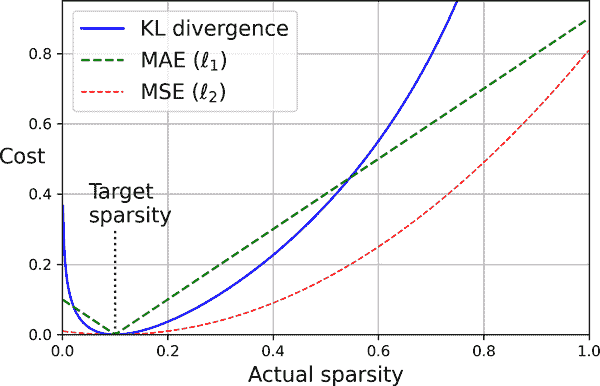
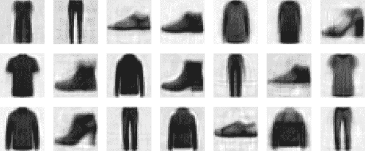

# 第十七章：自编码器、GANs 和扩散模型

自编码器是人工神经网络，能够学习输入数据的密集表示，称为*潜在表示*或*编码*，而无需任何监督（即，训练集未标记）。这些编码通常比输入数据的维度低得多，使得自编码器在降维方面非常有用（参见第八章），特别是用于可视化目的。自编码器还充当特征检测器，并且可以用于深度神经网络的无监督预训练（正如我们在第十一章中讨论的那样）。最后，一些自编码器是*生成模型*：它们能够随机生成看起来非常类似于训练数据的新数据。例如，您可以在人脸图片上训练一个自编码器，然后它将能够生成新的人脸。

*生成对抗网络*（GANs）也是能够生成数据的神经网络。事实上，它们可以生成如此逼真的人脸图片，以至于很难相信它们所代表的人并不存在。您可以通过访问[*https://thispersondoesnotexist.com*](https://thispersondoesnotexist.com)来亲自判断，这是一个展示由名为*StyleGAN*的 GAN 架构生成的人脸的网站。您还可以查看[*https://thisrentaldoesnotexist.com*](https://thisrentaldoesnotexist.com)来查看一些生成的 Airbnb 列表。GANs 现在被广泛用于超分辨率（增加图像的分辨率）、[着色](https://github.com/jantic/DeOldify)、强大的图像编辑（例如，用逼真的背景替换照片炸弹客）、将简单的草图转换为逼真的图像、预测视频中的下一帧、增强数据集（用于训练其他模型）、生成其他类型的数据（如文本、音频和时间序列）、识别其他模型的弱点以加强它们等等。

生成学习领域的一个较新的成员是*扩散模型*。在 2021 年，它们成功生成了比 GANs 更多样化和高质量的图像，同时训练也更容易。然而，扩散模型运行速度较慢。

自编码器、GANs 和扩散模型都是无监督的，它们都学习潜在表示，它们都可以用作生成模型，并且有许多类似的应用。然而，它们的工作方式非常不同：

+   自编码器简单地学习将输入复制到输出。这听起来可能是一个琐碎的任务，但正如你将看到的，以各种方式约束网络可能会使其变得相当困难。例如，您可以限制潜在表示的大小，或者您可以向输入添加噪声并训练网络以恢复原始输入。这些约束阻止了自编码器直接将输入轻松复制到输出，迫使其学习表示数据的有效方式。简而言之，编码是自编码器在某些约束下学习身份函数的副产品。

+   GANs 由两个神经网络组成：一个*生成器*试图生成看起来类似于训练数据的数据，另一个*鉴别器*试图区分真实数据和假数据。这种架构在深度学习中非常独特，因为生成器和鉴别器在训练过程中相互竞争：生成器经常被比作试图制造逼真的假币的罪犯，而鉴别器则像是试图区分真假货币的警察调查员。*对抗训练*（训练竞争的神经网络）被广泛认为是 2010 年代最重要的创新之一。2016 年，Yann LeCun 甚至说这是“过去 10 年中机器学习中最有趣的想法”。

+   *去噪扩散概率模型*（DDPM）被训练用于从图像中去除一点噪音。如果你拿一张完全充满高斯噪音的图像，然后反复在该图像上运行扩散模型，一个高质量的图像将逐渐出现，类似于训练图像（但不完全相同）。

在本章中，我们将深入探讨自编码器的工作原理以及如何将其用于降维、特征提取、无监督预训练或生成模型。这将自然地引导我们到 GAN。我们将构建一个简单的 GAN 来生成假图像，但我们会看到训练通常相当困难。我们将讨论对抗训练中遇到的主要困难，以及一些解决这些困难的主要技术。最后，我们将构建和训练一个 DDPM，并用它生成图像。让我们从自编码器开始！

# 高效的数据表示

你觉得以下哪个数字序列最容易记住？

+   40, 27, 25, 36, 81, 57, 10, 73, 19, 68

+   50, 48, 46, 44, 42, 40, 38, 36, 34, 32, 30, 28, 26, 24, 22, 20, 18, 16, 14

乍一看，第一个序列似乎更容易，因为它要短得多。然而，如果你仔细看第二个序列，你会注意到它只是从 50 到 14 的偶数列表。一旦你注意到这个模式，第二个序列比第一个容易记忆得多，因为你只需要记住模式（即递减的偶数）和起始和结束数字（即 50 和 14）。请注意，如果你能快速轻松地记住非常长的序列，你就不会太在意第二个序列中的模式。你只需要把每个数字背下来，就这样。难以记忆长序列的事实使得识别模式变得有用，希望这解释清楚了为什么在训练期间对自编码器进行约束会促使其发现和利用数据中的模式。

记忆、感知和模式匹配之间的关系在 20 世纪 70 年代初由[威廉·查斯和赫伯特·西蒙](https://homl.info/111)著名研究。他们观察到，专业的国际象棋选手能够在只看棋盘五秒钟的情况下记住游戏中所有棋子的位置，这是大多数人会觉得不可能的任务。然而，这只有在棋子被放置在现实位置（来自实际游戏）时才是这样，而不是当棋子被随机放置时。国际象棋专家的记忆力并不比你我好多少；他们只是更容易看到国际象棋的模式，这要归功于他们对游戏的经验。注意到模式有助于他们有效地存储信息。

就像这个记忆实验中的国际象棋选手一样，自编码器查看输入，将其转换为高效的潜在表示，然后输出与输入非常接近的内容（希望如此）。自编码器始终由两部分组成：一个*编码器*（或*识别网络*），将输入转换为潜在表示，然后是一个*解码器*（或*生成网络*），将内部表示转换为输出（参见图 17-1）。


###### 图 17-1。国际象棋记忆实验（左）和简单的自编码器（右）

正如您所看到的，自编码器通常具有与多层感知器（MLP；参见第十章）相同的架构，只是输出层中的神经元数量必须等于输入数量。在这个例子中，有一个由两个神经元组成的隐藏层（编码器），以及一个由三个神经元组成的输出层（解码器）。输出通常被称为*重构*，因为自编码器试图重构输入。成本函数包含一个*重构损失*，当重构与输入不同时，惩罚模型。

因为内部表示的维度比输入数据低（是 2D 而不是 3D），所以自编码器被称为*欠完备*。欠完备自编码器不能简单地将其输入复制到编码中，但它必须找到一种输出其输入的方式。它被迫学习输入数据中最重要的特征（并丢弃不重要的特征）。

让我们看看如何实现一个非常简单的欠完备自编码器进行降维。

# 使用欠完备线性自编码器执行 PCA

如果自编码器仅使用线性激活函数，并且成本函数是均方误差（MSE），那么它最终会执行主成分分析（PCA；参见第八章）。

以下代码构建了一个简单的线性自编码器，用于在 3D 数据集上执行 PCA，将其投影到 2D：

```py
import tensorflow as tf

encoder = tf.keras.Sequential([tf.keras.layers.Dense(2)])
decoder = tf.keras.Sequential([tf.keras.layers.Dense(3)])
autoencoder = tf.keras.Sequential([encoder, decoder])

optimizer = tf.keras.optimizers.SGD(learning_rate=0.5)
autoencoder.compile(loss="mse", optimizer=optimizer)
```

这段代码与我们在过去章节中构建的所有 MLP 并没有太大的不同，但有几点需要注意：

+   我们将自编码器组织成两个子组件：编码器和解码器。两者都是常规的`Sequential`模型，每个都有一个`Dense`层，自编码器是一个包含编码器后面是解码器的`Sequential`模型（请记住，模型可以作为另一个模型中的一层使用）。

+   自编码器的输出数量等于输入数量（即 3）。

+   为了执行 PCA，我们不使用任何激活函数（即所有神经元都是线性的），成本函数是 MSE。这是因为 PCA 是一种线性变换。很快我们将看到更复杂和非线性的自编码器。

现在让我们在与我们在第八章中使用的相同简单生成的 3D 数据集上训练模型，并使用它对该数据集进行编码（即将其投影到 2D）：

```py
X_train = [...]  # generate a 3D dataset, like in Chapter 8
history = autoencoder.fit(X_train, X_train, epochs=500, verbose=False)
codings = encoder.predict(X_train)
```

请注意，`X_train`既用作输入又用作目标。图 17-2 显示了原始 3D 数据集（左侧）和自编码器的隐藏层的输出（即编码层，右侧）。正如您所看到的，自编码器找到了最佳的 2D 平面来投影数据，尽可能保留数据中的方差（就像 PCA 一样）。


###### 图 17-2. 由欠完备线性自编码器执行的近似 PCA

###### 注意

您可以将自编码器视为执行一种自监督学习，因为它基于一种带有自动生成标签的监督学习技术（在本例中简单地等于输入）。

# 堆叠自编码器

就像我们讨论过的其他神经网络一样，自编码器可以有多个隐藏层。在这种情况下，它们被称为*堆叠自编码器*（或*深度自编码器*）。添加更多层有助于自编码器学习更复杂的编码。也就是说，必须小心不要使自编码器过于强大。想象一个如此强大的编码器，它只学习将每个输入映射到一个单一的任意数字（解码器学习反向映射）。显然，这样的自编码器将完美地重构训练数据，但它不会在过程中学习任何有用的数据表示，并且不太可能很好地推广到新实例。

堆叠自编码器的架构通常关于中心隐藏层（编码层）是对称的。简单来说，它看起来像三明治。例如，时尚 MNIST 的自编码器（在第十章介绍）可能有 784 个输入，然后是具有 100 个神经元的隐藏层，然后是具有 30 个神经元的中心隐藏层，然后是具有 100 个神经元的另一个隐藏层，最后是具有 784 个神经元的输出层。这个堆叠自编码器在图 17-3 中表示。


###### 图 17-3. 堆叠自编码器

## 使用 Keras 实现堆叠自编码器

您可以实现一个堆叠自编码器，非常类似于常规的深度 MLP：

```py
stacked_encoder = tf.keras.Sequential([
    tf.keras.layers.Flatten(),
    tf.keras.layers.Dense(100, activation="relu"),
    tf.keras.layers.Dense(30, activation="relu"),
])
stacked_decoder = tf.keras.Sequential([
    tf.keras.layers.Dense(100, activation="relu"),
    tf.keras.layers.Dense(28 * 28),
    tf.keras.layers.Reshape([28, 28])
])
stacked_ae = tf.keras.Sequential([stacked_encoder, stacked_decoder])

stacked_ae.compile(loss="mse", optimizer="nadam")
history = stacked_ae.fit(X_train, X_train, epochs=20,
                         validation_data=(X_valid, X_valid))
```

让我们来看看这段代码：

+   就像之前一样，我们将自编码器模型分成两个子模型：编码器和解码器。

+   编码器接收 28×28 像素的灰度图像，将它们展平，使每个图像表示为大小为 784 的向量，然后通过两个逐渐减小的“密集”层（100 个单元，然后是 30 个单元）处理这些向量，都使用 ReLU 激活函数。对于每个输入图像，编码器输出大小为 30 的向量。

+   解码器接收大小为 30 的编码（由编码器输出），并通过两个逐渐增大的“密集”层（100 个单元，然后是 784 个单元）处理它们，并将最终向量重新整形为 28×28 的数组，以便解码器的输出具有与编码器输入相同的形状。

+   在编译堆叠自编码器时，我们使用 MSE 损失和 Nadam 优化。

+   最后，我们使用`X_train`作为输入和目标来训练模型。同样，我们使用`X_valid`作为验证输入和目标。

## 可视化重构

确保自编码器得到正确训练的一种方法是比较输入和输出：差异不应太大。让我们绘制一些验证集中的图像，以及它们的重构：

```py
import numpy as np

def plot_reconstructions(model, images=X_valid, n_images=5):
    reconstructions = np.clip(model.predict(images[:n_images]), 0, 1)
    fig = plt.figure(figsize=(n_images * 1.5, 3))
    for image_index in range(n_images):
        plt.subplot(2, n_images, 1 + image_index)
        plt.imshow(images[image_index], cmap="binary")
        plt.axis("off")
        plt.subplot(2, n_images, 1 + n_images + image_index)
        plt.imshow(reconstructions[image_index], cmap="binary")
        plt.axis("off")

plot_reconstructions(stacked_ae)
plt.show()
```

图 17-4 显示了生成的图像。


###### 图 17-4. 原始图像（顶部）及其重构（底部）

重构是可以识别的，但有点丢失。我们可能需要训练模型更长时间，或者使编码器和解码器更深，或者使编码更大。但是，如果我们使网络过于强大，它将能够进行完美的重构，而不必学习数据中的任何有用模式。现在，让我们使用这个模型。

## 可视化时尚 MNIST 数据集

现在我们已经训练了一个堆叠自编码器，我们可以使用它来降低数据集的维度。对于可视化，与其他降维算法（如我们在第八章中讨论的算法）相比，这并不会产生很好的结果，但自编码器的一个重要优势是它们可以处理具有许多实例和许多特征的大型数据集。因此，一种策略是使用自编码器将维度降低到合理水平，然后使用另一个降维算法进行可视化。让我们使用这种策略来可视化时尚 MNIST。首先，我们将使用堆叠自编码器的编码器将维度降低到 30，然后我们将使用 Scikit-Learn 的 t-SNE 算法实现将维度降低到 2 以进行可视化：

```py
from sklearn.manifold import TSNE

X_valid_compressed = stacked_encoder.predict(X_valid)
tsne = TSNE(init="pca", learning_rate="auto", random_state=42)
X_valid_2D = tsne.fit_transform(X_valid_compressed)
```

现在我们可以绘制数据集：

```py
plt.scatter(X_valid_2D[:, 0], X_valid_2D[:, 1], c=y_valid, s=10, cmap="tab10")
plt.show()
```

图 17-5 显示了生成的散点图，通过显示一些图像进行美化。t-SNE 算法识别出几个与类别相匹配的簇（每个类别由不同的颜色表示）。


###### 图 17-5. 使用自编码器后跟 t-SNE 的时尚 MNIST 可视化

因此，自编码器可以用于降维。另一个应用是无监督的预训练。

## 使用堆叠自编码器进行无监督预训练

正如我们在第十一章中讨论的，如果你正在处理一个复杂的监督任务，但没有太多标记的训练数据，一个解决方案是找到一个执行类似任务的神经网络，并重复使用其较低层。这样可以使用少量训练数据训练高性能模型，因为你的神经网络不需要学习所有低级特征；它只需重复使用现有网络学习的特征检测器。

同样，如果你有一个大型数据集，但其中大部分是未标记的，你可以首先使用所有数据训练一个堆叠自编码器，然后重复使用较低层来创建一个用于实际任务的神经网络，并使用标记数据进行训练。例如，图 17-6 展示了如何使用堆叠自编码器为分类神经网络执行无监督预训练。在训练分类器时，如果你确实没有太多标记的训练数据，可能需要冻结预训练层（至少是较低的层）。


###### 图 17-6。使用自编码器进行无监督预训练

###### 注意

拥有大量未标记数据和少量标记数据是很常见的。构建一个大型未标记数据集通常很便宜（例如，一个简单的脚本可以从互联网上下载数百万张图片），但标记这些图片（例如，将它们分类为可爱或不可爱）通常只能由人类可靠地完成。标记实例是耗时且昂贵的，因此通常只有少量人类标记的实例，甚至更少。

实现上没有什么特别之处：只需使用所有训练数据（标记加未标记）训练一个自编码器，然后重复使用其编码器层来创建一个新的神经网络（请参考本章末尾的练习示例）。

接下来，让我们看一些训练堆叠自编码器的技术。

## 绑定权重

当一个自编码器是整齐对称的，就像我们刚刚构建的那样，一个常见的技术是将解码器层的权重与编码器层的权重*绑定*在一起。这样可以减半模型中的权重数量，加快训练速度并限制过拟合的风险。具体来说，如果自编码器总共有*N*层（不包括输入层），而**W**[*L*]表示第*L*层的连接权重（例如，第 1 层是第一个隐藏层，第*N*/2 层是编码层，第*N*层是输出层），那么解码器层的权重可以定义为**W**[*L*] = **W**[*N*–*L*+1]^⊺（其中*L* = *N* / 2 + 1, …​, *N*）。

使用 Keras 在层之间绑定权重，让我们定义一个自定义层：

```py
class DenseTranspose(tf.keras.layers.Layer):
    def __init__(self, dense, activation=None, **kwargs):
        super().__init__(**kwargs)
        self.dense = dense
        self.activation = tf.keras.activations.get(activation)

    def build(self, batch_input_shape):
        self.biases = self.add_weight(name="bias",
                                      shape=self.dense.input_shape[-1],
                                      initializer="zeros")
        super().build(batch_input_shape)

    def call(self, inputs):
        Z = tf.matmul(inputs, self.dense.weights[0], transpose_b=True)
        return self.activation(Z + self.biases)
```

这个自定义层就像一个常规的`Dense`层，但它使用另一个`Dense`层的权重，经过转置（设置`transpose_b=True`等同于转置第二个参数，但更高效，因为它在`matmul()`操作中实时执行转置）。然而，它使用自己的偏置向量。现在我们可以构建一个新的堆叠自编码器，与之前的模型类似，但解码器的`Dense`层与编码器的`Dense`层绑定：

```py
dense_1 = tf.keras.layers.Dense(100, activation="relu")
dense_2 = tf.keras.layers.Dense(30, activation="relu")

tied_encoder = tf.keras.Sequential([
    tf.keras.layers.Flatten(),
    dense_1,
    dense_2
])

tied_decoder = tf.keras.Sequential([
    DenseTranspose(dense_2, activation="relu"),
    DenseTranspose(dense_1),
    tf.keras.layers.Reshape([28, 28])
])

tied_ae = tf.keras.Sequential([tied_encoder, tied_decoder])
```

这个模型实现了与之前模型大致相同的重构误差，使用了几乎一半的参数数量。

## 一次训练一个自编码器

与我们刚刚做的整个堆叠自编码器一次性训练不同，可以一次训练一个浅层自编码器，然后将它们堆叠成一个单一的堆叠自编码器（因此得名），如图 17-7 所示。这种技术现在不太常用，但你可能仍然会遇到一些论文讨论“贪婪逐层训练”，所以了解其含义是很有必要的。


###### 图 17-7。一次训练一个自编码器

在训练的第一阶段，第一个自编码器学习重建输入。然后我们使用这个第一个自编码器对整个训练集进行编码，这给我们一个新的（压缩的）训练集。然后我们在这个新数据集上训练第二个自编码器。这是训练的第二阶段。最后，我们构建一个大的三明治，使用所有这些自编码器，如图 17-7 所示（即，我们首先堆叠每个自编码器的隐藏层，然后反向堆叠输出层）。这给我们最终的堆叠自编码器（请参阅本章笔记本中“逐个训练自编码器”部分以获取实现）。通过这种方式，我们可以轻松训练更多的自编码器，构建一个非常深的堆叠自编码器。

正如我之前提到的，深度学习浪潮的一个触发因素是[Geoffrey Hinton 等人](https://homl.info/136)在 2006 年发现深度神经网络可以通过无监督的方式进行预训练，使用这种贪婪的逐层方法。他们用受限玻尔兹曼机（RBMs；参见[*https://homl.info/extra-anns*](https://homl.info/extra-anns)）来实现这一目的，但在 2007 年[Yoshua Bengio 等人](https://homl.info/112)⁠²表明自编码器同样有效。几年来，这是训练深度网络的唯一有效方式，直到第十一章中引入的许多技术使得可以一次性训练深度网络。

自编码器不仅限于密集网络：你也可以构建卷积自编码器。现在让我们来看看这些。

# 卷积自编码器

如果你处理的是图像，那么迄今为止我们看到的自编码器效果不佳（除非图像非常小）：正如你在第十四章中看到的，卷积神经网络比密集网络更适合处理图像。因此，如果你想为图像构建一个自编码器（例如用于无监督预训练或降维），你将需要构建一个[*卷积自编码器*](https://homl.info/convae)。⁠³ 编码器是由卷积层和池化层组成的常规 CNN。它通常减少输入的空间维度（即高度和宽度），同时增加深度（即特征图的数量）。解码器必须执行相反操作（放大图像并将其深度降至原始维度），为此你可以使用转置卷积层（或者，你可以将上采样层与卷积层结合）。以下是 Fashion MNIST 的基本卷积自编码器：

```py
conv_encoder = tf.keras.Sequential([
    tf.keras.layers.Reshape([28, 28, 1]),
    tf.keras.layers.Conv2D(16, 3, padding="same", activation="relu"),
    tf.keras.layers.MaxPool2D(pool_size=2),  # output: 14 × 14 x 16
    tf.keras.layers.Conv2D(32, 3, padding="same", activation="relu"),
    tf.keras.layers.MaxPool2D(pool_size=2),  # output: 7 × 7 x 32
    tf.keras.layers.Conv2D(64, 3, padding="same", activation="relu"),
    tf.keras.layers.MaxPool2D(pool_size=2),  # output: 3 × 3 x 64
    tf.keras.layers.Conv2D(30, 3, padding="same", activation="relu"),
    tf.keras.layers.GlobalAvgPool2D()  # output: 30
])
conv_decoder = tf.keras.Sequential([
    tf.keras.layers.Dense(3 * 3 * 16),
    tf.keras.layers.Reshape((3, 3, 16)),
    tf.keras.layers.Conv2DTranspose(32, 3, strides=2, activation="relu"),
    tf.keras.layers.Conv2DTranspose(16, 3, strides=2, padding="same",
                                    activation="relu"),
    tf.keras.layers.Conv2DTranspose(1, 3, strides=2, padding="same"),
    tf.keras.layers.Reshape([28, 28])
])
conv_ae = tf.keras.Sequential([conv_encoder, conv_decoder])
```

还可以使用其他架构类型创建自编码器，例如 RNNs（请参阅笔记本中的示例）。

好的，让我们退后一步。到目前为止，我们已经看过各种类型的自编码器（基本、堆叠和卷积），以及如何训练它们（一次性或逐层）。我们还看过一些应用：数据可视化和无监督预训练。

迄今为止，为了强迫自编码器学习有趣的特征，我们限制了编码层的大小，使其欠完备。实际上还有许多其他类型的约束可以使用，包括允许编码层与输入一样大，甚至更大，从而产生*过完备自编码器*。接下来，我们将看一些其他类型的自编码器：去噪自编码器、稀疏自编码器和变分自编码器。

# 去噪自编码器

另一种强制自编码器学习有用特征的方法是向其输入添加噪声，训练它恢复原始的无噪声输入。这个想法自上世纪 80 年代就存在了（例如，Yann LeCun 在 1987 年的硕士论文中提到了这一点）。在[2008 年的一篇论文](https://homl.info/113)中，Pascal Vincent 等人表明自编码器也可以用于特征提取。在[2010 年的一篇论文](https://homl.info/114)中，Vincent 等人介绍了*堆叠去噪自编码器*。

噪声可以是添加到输入的纯高斯噪声，也可以是随机关闭的输入，就像 dropout 中一样（在第十一章中介绍）。图 17-8 展示了这两种选项。

实现很简单：这是一个常规的堆叠自编码器，附加了一个`Dropout`层应用于编码器的输入（或者您可以使用一个`GaussianNoise`层）。请记住，`Dropout`层仅在训练期间激活（`GaussianNoise`层也是如此）：

```py
dropout_encoder = tf.keras.Sequential([
    tf.keras.layers.Flatten(),
    tf.keras.layers.Dropout(0.5),
    tf.keras.layers.Dense(100, activation="relu"),
    tf.keras.layers.Dense(30, activation="relu")
])
dropout_decoder = tf.keras.Sequential([
    tf.keras.layers.Dense(100, activation="relu"),
    tf.keras.layers.Dense(28 * 28),
    tf.keras.layers.Reshape([28, 28])
])
dropout_ae = tf.keras.Sequential([dropout_encoder, dropout_decoder])
```


###### 图 17-8。去噪自编码器，带有高斯噪声（左）或 dropout（右）

图 17-9 显示了一些嘈杂的图像（一半像素关闭），以及基于 dropout 的去噪自编码器重建的图像。请注意，自编码器猜测了实际输入中不存在的细节，例如白色衬衫的顶部（底部行，第四幅图）。正如您所看到的，去噪自编码器不仅可以用于数据可视化或无监督预训练，就像我们迄今讨论过的其他自编码器一样，而且还可以非常简单高效地从图像中去除噪声。


###### 图 17-9。嘈杂的图像（顶部）及其重建（底部）

# 稀疏自编码器

另一种通常导致良好特征提取的约束是*稀疏性*：通过向成本函数添加适当的项，自编码器被推动减少编码层中活跃神经元的数量。例如，它可能被推动使编码层中平均只有 5%的显著活跃神经元。这迫使自编码器将每个输入表示为少量激活的组合。结果，编码层中的每个神经元通常最终代表一个有用的特征（如果您每个月只能说几个词，您可能会尽量使它们值得倾听）。

一个简单的方法是在编码层中使用 sigmoid 激活函数（将编码限制在 0 到 1 之间），使用一个大的编码层（例如，具有 300 个单元），并向编码层的激活添加一些ℓ[1]正则化。解码器只是一个常规的解码器：

```py
sparse_l1_encoder = tf.keras.Sequential([
    tf.keras.layers.Flatten(),
    tf.keras.layers.Dense(100, activation="relu"),
    tf.keras.layers.Dense(300, activation="sigmoid"),
    tf.keras.layers.ActivityRegularization(l1=1e-4)
])
sparse_l1_decoder = tf.keras.Sequential([
    tf.keras.layers.Dense(100, activation="relu"),
    tf.keras.layers.Dense(28 * 28),
    tf.keras.layers.Reshape([28, 28])
])
sparse_l1_ae = tf.keras.Sequential([sparse_l1_encoder, sparse_l1_decoder])
```

这个`ActivityRegularization`层只是返回其输入，但作为副作用，它会添加一个训练损失，等于其输入的绝对值之和。这只影响训练。同样，您可以删除`ActivityRegularization`层，并在前一层中设置`activity_regularizer=tf.keras.regularizers.l1(1e-4)`。这种惩罚将鼓励神经网络生成接近 0 的编码，但由于如果不能正确重建输入也会受到惩罚，因此它必须输出至少几个非零值。使用ℓ[1]范数而不是ℓ[2]范数将推动神经网络保留最重要的编码，同时消除不需要的编码（而不仅仅是减少所有编码）。

另一种方法，通常会产生更好的结果，是在每次训练迭代中测量编码层的实际稀疏度，并在测量到的稀疏度与目标稀疏度不同时对模型进行惩罚。我们通过计算编码层中每个神经元的平均激活值来实现这一点，整个训练批次上。批次大小不能太小，否则平均值将不准确。

一旦我们有了每个神经元的平均激活，我们希望通过向成本函数添加*稀疏损失*来惩罚那些激活过多或不足的神经元。例如，如果我们测量到一个神经元的平均激活为 0.3，但目标稀疏度为 0.1，那么它必须受到惩罚以减少激活。一种方法可能是简单地将平方误差(0.3 - 0.1)²添加到成本函数中，但实际上更好的方法是使用 Kullback–Leibler (KL)散度（在第四章中简要讨论），它比均方误差具有更强的梯度，如您可以在图 17-10 中看到的那样。



###### 图 17-10. 稀疏损失

给定两个离散概率分布*P*和*Q*，这些分布之间的 KL 散度，记为*D*KL，可以使用方程 17-1 计算。

##### 方程 17-1. Kullback–Leibler 散度

<math display="block"><mrow><msub><mi>D</mi> <mi>KL</mi></msub> <mrow><mo>(</mo> <mi>P</mi> <mo>∥</mo> <mi>Q</mi> <mo>)</mo></mrow> <mo>=</mo> <munder><mo>∑</mo> <mi>i</mi></munder> <mi>P</mi> <mrow><mo>(</mo> <mi>i</mi> <mo>)</mo></mrow> <mo form="prefix">log</mo> <mstyle scriptlevel="0" displaystyle="true"><mfrac><mrow><mi>P</mi><mo>(</mo><mi>i</mi><mo>)</mo></mrow> <mrow><mi>Q</mi><mo>(</mo><mi>i</mi><mo>)</mo></mrow></mfrac></mstyle></mrow></math>

在我们的情况下，我们想要衡量编码层中神经元激活的目标概率*p*和通过测量整个训练批次上的平均激活来估计的实际概率*q*之间的差异。因此，KL 散度简化为方程 17-2。

##### 方程 17-2. 目标稀疏度*p*和实际稀疏度*q*之间的 KL 散度

<math display="block"><mrow><msub><mi>D</mi> <mi>KL</mi></msub> <mrow><mo>(</mo> <mi>p</mi> <mo>∥</mo> <mi>q</mi> <mo>)</mo></mrow> <mo>=</mo> <mi>p</mi> <mo form="prefix">log</mo> <mstyle scriptlevel="0" displaystyle="true"><mfrac><mi>p</mi> <mi>q</mi></mfrac></mstyle> <mo>+</mo> <mrow><mo>(</mo> <mn>1</mn> <mo>-</mo> <mi>p</mi> <mo>)</mo></mrow> <mo form="prefix">log</mo> <mstyle scriptlevel="0" displaystyle="true"><mfrac><mrow><mn>1</mn><mo>-</mo><mi>p</mi></mrow> <mrow><mn>1</mn><mo>-</mo><mi>q</mi></mrow></mfrac></mstyle></mrow></math>

一旦我们计算了编码层中每个神经元的稀疏损失，我们将这些损失相加并将结果添加到成本函数中。为了控制稀疏损失和重构损失的相对重要性，我们可以将稀疏损失乘以一个稀疏权重超参数。如果这个权重太高，模型将严格遵循目标稀疏度，但可能无法正确重构输入，使模型无用。相反，如果权重太低，模型将主要忽略稀疏目标，并且不会学习任何有趣的特征。

现在我们有了所有需要基于 KL 散度实现稀疏自编码器的东西。首先，让我们创建一个自定义正则化器来应用 KL 散度正则化：

```py
kl_divergence = tf.keras.losses.kullback_leibler_divergence

class KLDivergenceRegularizer(tf.keras.regularizers.Regularizer):
    def __init__(self, weight, target):
        self.weight = weight
        self.target = target

    def __call__(self, inputs):
        mean_activities = tf.reduce_mean(inputs, axis=0)
        return self.weight * (
            kl_divergence(self.target, mean_activities) +
            kl_divergence(1. - self.target, 1. - mean_activities))
```

现在我们可以构建稀疏自编码器，使用`KLDivergenceRegularizer`来对编码层的激活进行正则化：

```py
kld_reg = KLDivergenceRegularizer(weight=5e-3, target=0.1)
sparse_kl_encoder = tf.keras.Sequential([
    tf.keras.layers.Flatten(),
    tf.keras.layers.Dense(100, activation="relu"),
    tf.keras.layers.Dense(300, activation="sigmoid",
                          activity_regularizer=kld_reg)
])
sparse_kl_decoder = tf.keras.Sequential([
    tf.keras.layers.Dense(100, activation="relu"),
    tf.keras.layers.Dense(28 * 28),
    tf.keras.layers.Reshape([28, 28])
])
sparse_kl_ae = tf.keras.Sequential([sparse_kl_encoder, sparse_kl_decoder])
```

在 Fashion MNIST 上训练这个稀疏自编码器后，编码层的稀疏度大约为 10%。

# 变分自编码器

2013 年，[Diederik Kingma 和 Max Welling](https://homl.info/115)⁠⁶引入了一个重要类别的自编码器，并迅速成为最受欢迎的变体之一：*变分自编码器*（VAEs）。

VAEs 在这些特定方面与我们迄今讨论过的所有自编码器都有很大不同：

+   它们是*概率自编码器*，这意味着它们的输出在训练后部分地由机会决定（与去噪自编码器相反，在训练期间仅使用随机性）。

+   最重要的是，它们是*生成自编码器*，这意味着它们可以生成看起来像是从训练集中采样的新实例。

这两个特性使得 VAEs 与 RBM 相当相似，但它们更容易训练，采样过程也更快（对于 RBM，您需要等待网络稳定到“热平衡”状态，然后才能对新实例进行采样）。正如它们的名字所暗示的，变分自编码器执行变分贝叶斯推断，这是进行近似贝叶斯推断的有效方法。回想一下，贝叶斯推断意味着根据新数据更新概率分布，使用从贝叶斯定理推导出的方程。原始分布称为*先验*，而更新后的分布称为*后验*。在我们的情况下，我们想要找到数据分布的一个很好的近似。一旦我们有了这个，我们就可以从中进行采样。

让我们看看 VAEs 是如何工作的。图 17-11（左）展示了一个变分自编码器。您可以认出所有自编码器的基本结构，具有一个编码器后面跟着一个解码器（在这个例子中，它们都有两个隐藏层），但有一个转折：编码器不是直接为给定输入产生编码，而是产生一个*均值编码* **μ** 和一个标准差 **σ**。然后，实际编码随机地从均值 **μ** 和标准差 **σ** 的高斯分布中采样。之后解码器正常解码采样的编码。图的右侧显示了一个训练实例通过这个自编码器的过程。首先，编码器产生 **μ** 和 **σ**，然后一个编码被随机采样（请注意它并不完全位于 **μ**），最后这个编码被解码；最终输出类似于训练实例。


###### 图 17-11. 变分自编码器（左）和通过它的实例（右）

正如您在图中所看到的，尽管输入可能具有非常复杂的分布，但变分自编码器倾向于产生看起来像是从简单的高斯分布中采样的编码：⁠⁷在训练期间，成本函数（下面讨论）推动编码逐渐在编码空间（也称为*潜在空间*）内迁移，最终看起来像一个高斯点云。一个很大的结果是，在训练变分自编码器之后，您可以非常容易地生成一个新实例：只需从高斯分布中随机采样一个随机编码，解码它，然后就完成了！

现在，让我们看一下成本函数。它由两部分组成。第一部分是通常的重构损失，推动自编码器重现其输入。我们可以使用 MSE 来实现这一点，就像我们之前做的那样。第二部分是*潜在损失*，推动自编码器具有看起来像是从简单高斯分布中抽样的编码：这是目标分布（即高斯分布）与编码的实际分布之间的 KL 散度。数学比稀疏自编码器更复杂，特别是由于高斯噪声，它限制了可以传输到编码层的信息量。这推动自编码器学习有用的特征。幸运的是，方程简化了，因此可以使用 Equation 17-3 计算潜在损失。⁠⁸

##### 方程 17-3。变分自编码器的潜在损失

<math display="block"><mo mathvariant="script">L</mo><mo>=</mo><mo>-</mo><mfrac><mn>1</mn><mn>2</mn></mfrac><munderover><mo>∑</mo><mrow><mi>i</mi><mo>=</mo><mn>1</mn></mrow><mi>n</mi></munderover><mfenced open="[" close="]"><mrow><mn>1</mn><mo>+</mo><mi>log</mi><mo>(</mo><msup><msub><mi>σ</mi><mi>i</mi></msub><mn>2</mn></msup><mo>)</mo><mo>-</mo><msup><msub><mi>σ</mi><mi>i</mi></msub><mn>2</mn></msup><mo>-</mo><msup><msub><mi>μ</mi><mi>i</mi></msub><mn>2</mn></msup></mrow></mfenced></math>

在这个方程中，ℒ是潜在损失，*n*是编码的维度，*μ*[i]和*σ*[i]是编码的第*i*个分量的均值和标准差。向量**μ**和**σ**（包含所有*μ*[i]和*σ*[i]）由编码器输出，如 Figure 17-11（左）所示。

变分自编码器架构的常见调整是使编码器输出**γ** = log(**σ**²)而不是**σ**。然后可以根据 Equation 17-4 计算潜在损失。这种方法在数值上更稳定，加快了训练速度。

##### 方程 17-4。变分自编码器的潜在损失，使用*γ* = log(*σ*²)重写

<math display="block"><mo mathvariant="script">L</mo><mo>=</mo><mo>-</mo><mfrac><mn>1</mn><mn>2</mn></mfrac><munderover><mo>∑</mo><mrow><mi>i</mi><mo>=</mo><mn>1</mn></mrow><mi>n</mi></munderover><mfenced open="[" close="]"><mrow><mn>1</mn><mo>+</mo><msub><mi>γ</mi><mi>i</mi></msub><mo>-</mo><mi>exp</mi><mo>(</mo><msub><mi>γ</mi><mi>i</mi></msub><mo>)</mo><mo>-</mo><msup><msub><mi>μ</mi><mi>i</mi></msub><mn>2</mn></msup></mrow></mfenced></math>

现在，让我们开始为 Fashion MNIST 构建一个变分自编码器（如 Figure 17-11 所示，但使用**γ**调整）。首先，我们需要一个自定义层来根据**μ**和**γ**抽样编码：

```py
class Sampling(tf.keras.layers.Layer):
    def call(self, inputs):
        mean, log_var = inputs
        return tf.random.normal(tf.shape(log_var)) * tf.exp(log_var / 2) + mean
```

这个`Sampling`层接受两个输入：`mean`（**μ**）和`log_var`（**γ**）。它使用函数`tf.random.normal()`从均值为 0，标准差为 1 的高斯分布中抽样一个随机向量（与**γ**形状相同）。然后将其乘以 exp(**γ** / 2)（数学上等于**σ**，您可以验证），最后加上**μ**并返回结果。这样从均值为**μ**，标准差为**σ**的高斯分布中抽样一个编码向量。

接下来，我们可以创建编码器，使用函数式 API，因为模型不是完全顺序的：

```py
codings_size = 10

inputs = tf.keras.layers.Input(shape=[28, 28])
Z = tf.keras.layers.Flatten()(inputs)
Z = tf.keras.layers.Dense(150, activation="relu")(Z)
Z = tf.keras.layers.Dense(100, activation="relu")(Z)
codings_mean = tf.keras.layers.Dense(codings_size)(Z)  # μ
codings_log_var = tf.keras.layers.Dense(codings_size)(Z)  # γ
codings = Sampling()([codings_mean, codings_log_var])
variational_encoder = tf.keras.Model(
    inputs=[inputs], outputs=[codings_mean, codings_log_var, codings])
```

注意，输出`codings_mean`（**μ**）和`codings_log_var`（**γ**）的`Dense`层具有相同的输入（即第二个`Dense`层的输出）。然后，我们将`codings_mean`和`codings_log_var`都传递给`Sampling`层。最后，`variational_encoder`模型有三个输出。只需要`codings`，但我们也添加了`codings_mean`和`codings_log_var`，以防我们想要检查它们的值。现在让我们构建解码器：

```py
decoder_inputs = tf.keras.layers.Input(shape=[codings_size])
x = tf.keras.layers.Dense(100, activation="relu")(decoder_inputs)
x = tf.keras.layers.Dense(150, activation="relu")(x)
x = tf.keras.layers.Dense(28 * 28)(x)
outputs = tf.keras.layers.Reshape([28, 28])(x)
variational_decoder = tf.keras.Model(inputs=[decoder_inputs], outputs=[outputs])
```

对于这个解码器，我们可以使用顺序 API 而不是功能 API，因为它实际上只是一个简单的层堆栈，与我们迄今构建的许多解码器几乎相同。最后，让我们构建变分自编码器模型：

```py
_, _, codings = variational_encoder(inputs)
reconstructions = variational_decoder(codings)
variational_ae = tf.keras.Model(inputs=[inputs], outputs=[reconstructions])
```

我们忽略编码器的前两个输出（我们只想将编码输入解码器）。最后，我们必须添加潜在损失和重构损失：

```py
latent_loss = -0.5 * tf.reduce_sum(
    1 + codings_log_var - tf.exp(codings_log_var) - tf.square(codings_mean),
    axis=-1)
variational_ae.add_loss(tf.reduce_mean(latent_loss) / 784.)
```

我们首先应用方程 17-4 来计算批处理中每个实例的潜在损失，对最后一个轴求和。然后我们计算批处理中所有实例的平均损失，并将结果除以 784，以确保它具有适当的比例，与重构损失相比。实际上，变分自编码器的重构损失应该是像素重构误差的总和，但是当 Keras 计算`"mse"`损失时，它计算所有 784 个像素的平均值，而不是总和。因此，重构损失比我们需要的要小 784 倍。我们可以定义一个自定义损失来计算总和而不是平均值，但将潜在损失除以 784（最终损失将比应该的大 784 倍，但这只是意味着我们应该使用更大的学习率）更简单。

最后，我们可以编译和拟合自编码器！

```py
variational_ae.compile(loss="mse", optimizer="nadam")
history = variational_ae.fit(X_train, X_train, epochs=25, batch_size=128,
                             validation_data=(X_valid, X_valid))
```

# 生成时尚 MNIST 图像

现在让我们使用这个变分自编码器生成看起来像时尚物品的图像。我们只需要从高斯分布中随机采样编码，并解码它们：

```py
codings = tf.random.normal(shape=[3 * 7, codings_size])
images = variational_decoder(codings).numpy()
```

图 17-12 显示了生成的 12 张图像。



###### 图 17-12\. 由变分自编码器生成的时尚 MNIST 图像

这些图像中的大多数看起来相当令人信服，虽然有点模糊。其余的不太好，但不要对自编码器太苛刻——它只有几分钟时间学习！

变分自编码器使得执行*语义插值*成为可能：不是在像素级别插值两个图像，看起来就像两个图像只是叠加在一起，我们可以在编码级别进行插值。例如，让我们在潜在空间中沿着任意线取几个编码，并解码它们。我们得到一系列图像，逐渐从裤子变成毛衣（见图 17-13）：

```py
codings = np.zeros([7, codings_size])
codings[:, 3] = np.linspace(-0.8, 0.8, 7)  # axis 3 looks best in this case
images = variational_decoder(codings).numpy()
```


###### 图 17-13\. 语义插值

现在让我们转向 GANs：它们更难训练，但当你设法让它们工作时，它们会产生非常惊人的图像。

# 生成对抗网络

生成对抗网络是由 Ian Goodfellow 等人在[2014 年的一篇论文](https://homl.info/gan)中提出的⁠⁹，尽管这个想法几乎立即激发了研究人员的兴趣，但要克服训练 GANs 的一些困难还需要几年时间。就像许多伟大的想法一样，事后看来似乎很简单：让神经网络相互竞争，希望这种竞争能推动它们取得卓越的成就。如图 17-14 所示，GAN 由两个神经网络组成：

生成器

以随机分布（通常是高斯）作为输入，并输出一些数据——通常是图像。您可以将随机输入视为要生成的图像的潜在表示（即编码）。因此，正如您所看到的，生成器提供了与变分自编码器中的解码器相同的功能，并且可以以相同的方式用于生成新图像：只需将一些高斯噪声输入，它就会输出一个全新的图像。但是，它的训练方式非常不同，您很快就会看到。

鉴别器

以生成器的假图像或训练集中的真实图像作为输入，必须猜测输入图像是假还是真。


###### 图 17-14\. 生成对抗网络

在训练过程中，生成器和鉴别器有着相反的目标：鉴别器试图区分假图像和真实图像，而生成器试图生成看起来足够真实以欺骗鉴别器的图像。由于 GAN 由具有不同目标的两个网络组成，因此无法像训练常规神经网络那样进行训练。每个训练迭代被分为两个阶段：

+   在第一阶段，我们训练鉴别器。从训练集中抽取一批真实图像，并通过生成器生成相同数量的假图像来完成。标签设置为 0 表示假图像，1 表示真实图像，并且鉴别器在这个带标签的批次上进行一步训练，使用二元交叉熵损失。重要的是，在这个阶段只有鉴别器的权重被优化。

+   在第二阶段，我们训练生成器。我们首先使用它生成另一批假图像，然后再次使用鉴别器来判断图像是假的还是真实的。这次我们不在批次中添加真实图像，所有标签都设置为 1（真实）：换句话说，我们希望生成器生成鉴别器会（错误地）认为是真实的图像！在这一步骤中，鉴别器的权重被冻结，因此反向传播只影响生成器的权重。

###### 注意

生成器实际上从未看到任何真实图像，但它逐渐学会生成令人信服的假图像！它所得到的只是通过鉴别器反向传播的梯度。幸运的是，鉴别器越好，这些二手梯度中包含的关于真实图像的信息就越多，因此生成器可以取得显著进展。

让我们继续构建一个简单的 Fashion MNIST GAN。

首先，我们需要构建生成器和鉴别器。生成器类似于自编码器的解码器，鉴别器是一个常规的二元分类器：它以图像作为输入，最终以包含单个单元并使用 sigmoid 激活函数的`Dense`层结束。对于每个训练迭代的第二阶段，我们还需要包含生成器后面的鉴别器的完整 GAN 模型：

```py
codings_size = 30

Dense = tf.keras.layers.Dense
generator = tf.keras.Sequential([
    Dense(100, activation="relu", kernel_initializer="he_normal"),
    Dense(150, activation="relu", kernel_initializer="he_normal"),
    Dense(28 * 28, activation="sigmoid"),
    tf.keras.layers.Reshape([28, 28])
])
discriminator = tf.keras.Sequential([
    tf.keras.layers.Flatten(),
    Dense(150, activation="relu", kernel_initializer="he_normal"),
    Dense(100, activation="relu", kernel_initializer="he_normal"),
    Dense(1, activation="sigmoid")
])
gan = tf.keras.Sequential([generator, discriminator])
```

接下来，我们需要编译这些模型。由于鉴别器是一个二元分类器，我们可以自然地使用二元交叉熵损失。`gan`模型也是一个二元分类器，因此它也可以使用二元交叉熵损失。然而，生成器只会通过`gan`模型进行训练，因此我们根本不需要编译它。重要的是，在第二阶段之前鉴别器不应该被训练，因此在编译`gan`模型之前我们将其设置为不可训练：

```py
discriminator.compile(loss="binary_crossentropy", optimizer="rmsprop")
discriminator.trainable = False
gan.compile(loss="binary_crossentropy", optimizer="rmsprop")
```

###### 注意

`trainable`属性只有在编译模型时才会被 Keras 考虑，因此在运行此代码后，如果我们调用其`fit()`方法或`train_on_batch()`方法（我们将使用），则`discriminator`是可训练的，而在调用这些方法时`gan`模型是不可训练的。

由于训练循环是不寻常的，我们不能使用常规的`fit()`方法。相反，我们将编写一个自定义训练循环。为此，我们首先需要创建一个`Dataset`来迭代图像：

```py
batch_size = 32
dataset = tf.data.Dataset.from_tensor_slices(X_train).shuffle(buffer_size=1000)
dataset = dataset.batch(batch_size, drop_remainder=True).prefetch(1)
```

现在我们准备编写训练循环。让我们将其封装在一个`train_gan()`函数中：

```py
def train_gan(gan, dataset, batch_size, codings_size, n_epochs):
    generator, discriminator = gan.layers
    for epoch in range(n_epochs):
        for X_batch in dataset:
            # phase 1 - training the discriminator
            noise = tf.random.normal(shape=[batch_size, codings_size])
            generated_images = generator(noise)
            X_fake_and_real = tf.concat([generated_images, X_batch], axis=0)
            y1 = tf.constant([[0.]] * batch_size + [[1.]] * batch_size)
            discriminator.train_on_batch(X_fake_and_real, y1)
            # phase 2 - training the generator
            noise = tf.random.normal(shape=[batch_size, codings_size])
            y2 = tf.constant([[1.]] * batch_size)
            gan.train_on_batch(noise, y2)

train_gan(gan, dataset, batch_size, codings_size, n_epochs=50)
```

正如之前讨论的，您可以在每次迭代中看到两个阶段：

+   在第一阶段，我们向生成器提供高斯噪声以生成假图像，并通过连接相同数量的真实图像来完成这一批次。目标`y1`设置为 0 表示假图像，1 表示真实图像。然后我们对这一批次训练鉴别器。请记住，在这个阶段鉴别器是可训练的，但我们不会触及生成器。

+   在第二阶段，我们向 GAN 提供一些高斯噪声。其生成器将开始生成假图像，然后鉴别器将尝试猜测这些图像是假还是真实的。在这个阶段，我们试图改进生成器，这意味着我们希望鉴别器失败：这就是为什么目标`y2`都设置为 1，尽管图像是假的。在这个阶段，鉴别器是*不*可训练的，因此`gan`模型中唯一会改进的部分是生成器。

就是这样！训练后，您可以随机从高斯分布中抽取一些编码，并将它们馈送给生成器以生成新图像：

```py
codings = tf.random.normal(shape=[batch_size, codings_size])
generated_images = generator.predict(codings)
```

如果显示生成的图像（参见图 17-15），您会发现在第一个时期结束时，它们已经开始看起来像（非常嘈杂的）时尚 MNIST 图像。


###### 图 17-15。在训练一个时期后由 GAN 生成的图像

不幸的是，图像从未真正比那更好，甚至可能会出现 GAN 似乎忘记了它学到的东西的时期。为什么会这样呢？原来，训练 GAN 可能是具有挑战性的。让我们看看为什么。

## 训练 GAN 的困难

在训练过程中，生成器和鉴别器不断试图在零和博弈中互相智胜。随着训练的进行，游戏可能会进入博弈论家称之为*纳什均衡*的状态，以数学家约翰·纳什命名：这是当没有玩家会因为改变自己的策略而变得更好，假设其他玩家不改变自己的策略。例如，当每个人都在道路的左侧行驶时，就达到了纳什均衡：没有司机会因为成为唯一一个换边的人而变得更好。当然，还有第二种可能的纳什均衡：当每个人都在道路的*右侧*行驶时。不同的初始状态和动态可能导致一个或另一个均衡。在这个例子中，一旦达到均衡状态（即，与其他人一样在同一侧行驶），就会有一个单一的最佳策略，但是纳什均衡可能涉及多种竞争策略（例如，捕食者追逐猎物，猎物试图逃跑，双方都不会因为改变策略而变得更好）。

那么这如何应用于 GAN 呢？嗯，GAN 论文的作者们证明了 GAN 只能达到单一的纳什均衡：那就是生成器生成完全逼真的图像，鉴别器被迫猜测（50%真实，50%假）。这个事实非常令人鼓舞：似乎只需要训练足够长的时间，它最终会达到这种均衡，为您提供一个完美的生成器。不幸的是，事情并不那么简单：没有任何保证这种均衡会被达到。

最大的困难被称为*模式坍塌*：这是指生成器的输出逐渐变得不那么多样化。这是如何发生的呢？假设生成器在制作令人信服的鞋子方面比其他任何类别都更擅长。它会用鞋子更多地欺骗鉴别器，这将鼓励它生成更多的鞋子图像。逐渐地，它会忘记如何制作其他任何东西。与此同时，鉴别器将看到的唯一假图像将是鞋子，因此它也会忘记如何鉴别其他类别的假图像。最终，当鉴别器设法将假鞋子与真实鞋子区分开来时，生成器将被迫转向另一个类别。然后它可能擅长衬衫，忘记鞋子，鉴别器也会跟随。GAN 可能逐渐在几个类别之间循环，从未真正擅长其中任何一个。

此外，由于生成器和鉴别器不断相互对抗，它们的参数可能最终会振荡并变得不稳定。训练可能开始正常，然后由于这些不稳定性，突然出现无明显原因的分歧。由于许多因素影响这些复杂的动态，GAN 对超参数非常敏感：您可能需要花费大量精力对其进行微调。实际上，这就是为什么在编译模型时我使用 RMSProp 而不是 Nadam：使用 Nadam 时，我遇到了严重的模式崩溃。

自 2014 年以来，这些问题一直让研究人员忙碌不已：许多论文已经发表在这个主题上，一些论文提出了新的成本函数（尽管谷歌研究人员在[2018 年的一篇论文](https://homl.info/gansequal)中质疑了它们的效率）或稳定训练或避免模式崩溃问题的技术。例如，一种流行的技术称为*经验重播*，它包括在每次迭代中存储生成器生成的图像在重播缓冲区中（逐渐删除较旧的生成图像），并使用来自该缓冲区的真实图像加上假图像来训练鉴别器（而不仅仅是当前生成器生成的假图像）。这减少了鉴别器过度拟合最新生成器输出的机会。另一种常见的技术称为*小批量鉴别*：它测量批次中图像的相似性，并将此统计信息提供给鉴别器，以便它可以轻松拒绝缺乏多样性的整个批次的假图像。这鼓励生成器产生更多样化的图像，减少模式崩溃的机会。其他论文简单地提出了表现良好的特定架构。

简而言之，这仍然是一个非常活跃的研究领域，GAN 的动态仍然没有完全被理解。但好消息是取得了巨大进展，一些结果真的令人惊叹！因此，让我们看一些最成功的架构，从几年前的深度卷积 GAN 开始。然后我们将看一下两个更近期（更复杂）的架构。

## 深度卷积 GAN

原始 GAN 论文的作者尝试了卷积层，但只尝试生成小图像。不久之后，许多研究人员尝试基于更深的卷积网络生成更大的图像的 GAN。这被证明是棘手的，因为训练非常不稳定，但 Alec Radford 等人最终在 2015 年底成功了，经过许多不同架构和超参数的实验。他们将其架构称为[*深度卷积 GAN*](https://homl.info/dcgan)（DCGANs）。以下是他们为构建稳定的卷积 GAN 提出的主要准则：

+   用步进卷积（在鉴别器中）和转置卷积（在生成器中）替换任何池化层。

+   在生成器和鉴别器中使用批量归一化，除了生成器的输出层和鉴别器的输入层。

+   删除更深层次架构的全连接隐藏层。

+   在生成器的所有层中使用 ReLU 激活，除了输出层应使用 tanh。

+   在鉴别器的所有层中使用泄漏 ReLU 激活。

这些准则在许多情况下都适用，但并非总是如此，因此您可能仍需要尝试不同的超参数。实际上，仅仅改变随机种子并再次训练完全相同的模型有时会奏效。以下是一个在时尚 MNIST 上表现相当不错的小型 DCGAN：

```py
codings_size = 100

generator = tf.keras.Sequential([
    tf.keras.layers.Dense(7 * 7 * 128),
    tf.keras.layers.Reshape([7, 7, 128]),
    tf.keras.layers.BatchNormalization(),
    tf.keras.layers.Conv2DTranspose(64, kernel_size=5, strides=2,
                                    padding="same", activation="relu"),
    tf.keras.layers.BatchNormalization(),
    tf.keras.layers.Conv2DTranspose(1, kernel_size=5, strides=2,
                                    padding="same", activation="tanh"),
])
discriminator = tf.keras.Sequential([
    tf.keras.layers.Conv2D(64, kernel_size=5, strides=2, padding="same",
                           activation=tf.keras.layers.LeakyReLU(0.2)),
    tf.keras.layers.Dropout(0.4),
    tf.keras.layers.Conv2D(128, kernel_size=5, strides=2, padding="same",
                           activation=tf.keras.layers.LeakyReLU(0.2)),
    tf.keras.layers.Dropout(0.4),
    tf.keras.layers.Flatten(),
    tf.keras.layers.Dense(1, activation="sigmoid")
])
gan = tf.keras.Sequential([generator, discriminator])
```

生成器接受大小为 100 的编码，将其投影到 6,272 维度（7 * 7 * 128），并重新整形结果以获得一个 7×7×128 张量。这个张量被批量归一化并馈送到一个步幅为 2 的转置卷积层，将其从 7×7 上采样到 14×14，并将其深度从 128 减少到 64。结果再次进行批量归一化，并馈送到另一个步幅为 2 的转置卷积层，将其从 14×14 上采样到 28×28，并将深度从 64 减少到 1。这一层使用 tanh 激活函数，因此输出将范围从-1 到 1。因此，在训练 GAN 之前，我们需要将训练集重新缩放到相同的范围。我们还需要重新整形以添加通道维度：

```py
X_train_dcgan = X_train.reshape(-1, 28, 28, 1) * 2. - 1. # reshape and rescale
```

鉴别器看起来很像用于二元分类的常规 CNN，只是不是使用最大池化层来对图像进行下采样，而是使用步幅卷积（`strides=2`）。请注意，我们使用了泄漏的 ReLU 激活函数。总体而言，我们遵守了 DCGAN 的指导方针，只是将鉴别器中的`BatchNormalization`层替换为`Dropout`层；否则，在这种情况下训练会不稳定。随意调整这个架构：您将看到它对超参数非常敏感，特别是两个网络的相对学习率。

最后，要构建数据集，然后编译和训练这个模型，我们可以使用之前的相同代码。经过 50 个训练周期后，生成器产生的图像如图 17-16 所示。它还不完美，但其中许多图像相当令人信服。


###### 图 17-16。DCGAN 在训练 50 个周期后生成的图像

如果您扩大这个架构并在大量人脸数据集上进行训练，您可以获得相当逼真的图像。事实上，DCGAN 可以学习相当有意义的潜在表示，如图 17-17 所示：生成了许多图像，手动选择了其中的九个（左上角），包括三个戴眼镜的男性，三个不戴眼镜的男性和三个不戴眼镜的女性。对于这些类别中的每一个，用于生成图像的编码被平均，然后基于结果的平均编码生成图像（左下角）。简而言之，左下角的三幅图像分别代表位于其上方的三幅图像的平均值。但这不是在像素级别计算的简单平均值（这将导致三个重叠的脸），而是在潜在空间中计算的平均值，因此图像看起来仍然像正常的脸。令人惊讶的是，如果您计算戴眼镜的男性，减去不戴眼镜的男性，再加上不戴眼镜的女性——其中每个术语对应于一个平均编码——并生成对应于此编码的图像，您将得到右侧面孔网格中心的图像：一个戴眼镜的女性！其周围的其他八幅图像是基于相同向量加上一点噪音生成的，以展示 DCGAN 的语义插值能力。能够在人脸上进行算术运算感觉像是科幻！

然而，DCGAN 并不完美。例如，当您尝试使用 DCGAN 生成非常大的图像时，通常会出现局部令人信服的特征，但整体上存在不一致，比如一只袖子比另一只长得多的衬衫，不同的耳环，或者眼睛看向相反的方向。您如何解决这个问题？


###### 图 17-17。视觉概念的向量算术（DCGAN 论文中的第 7 部分图）⁠¹³

###### 提示

如果将每个图像的类别作为额外输入添加到生成器和鉴别器中，它们将学习每个类别的外观，因此您将能够控制生成器生成的每个图像的类别。这被称为[*条件 GAN*](https://homl.info/cgan)(CGAN)。⁠¹⁴

## GAN 的渐进增长

在一篇[2018 年的论文](https://homl.info/progan)，Nvidia 的研究人员 Tero Kerras 等人提出了一项重要技术：他们建议在训练开始时生成小图像，然后逐渐向生成器和鉴别器添加卷积层，以生成越来越大的图像（4×4、8×8、16×16，...，512×512、1,024×1,024）。这种方法类似于贪婪逐层训练堆叠自编码器。额外的层被添加到生成器的末尾和鉴别器的开头，并且之前训练过的层仍然可训练。

例如，当将生成器的输出从 4×4 增加到 8×8 时（参见图 17-18），在现有卷积层（“Conv 1”）中添加了一个上采样层（使用最近邻过滤）以生成 8×8 特征图。这些被馈送到新的卷积层（“Conv 2”），然后馈送到新的输出卷积层。为了避免破坏 Conv 1 的训练权重，我们逐渐淡入两个新的卷积层（在图 17-18 中用虚线表示），并淡出原始输出层。最终输出是新输出（权重为*α*）和原始输出（权重为 1-*α*）的加权和，从 0 逐渐增加*α*到 1。当向鉴别器添加新的卷积层时（后跟一个平均池化层进行下采样），也使用类似的淡入/淡出技术。请注意，所有卷积层都使用`"same"`填充和步幅为 1，因此它们保留其输入的高度和宽度。这包括原始卷积层，因此它现在产生 8×8 的输出（因为其输入现在是 8×8）。最后，输出层使用核大小为 1。它们只是将它们的输入投影到所需数量的颜色通道（通常为 3）。


###### 图 17-18。逐渐增长的 GAN：GAN 生成器输出 4×4 彩色图像（左）；我们将其扩展到输出 8×8 图像（右）

该论文还介绍了几种旨在增加输出多样性（以避免模式崩溃）并使训练更稳定的技术：

小批量标准差层

添加到鉴别器的末尾附近。对于输入中的每个位置，它计算批次中所有通道和所有实例的标准差（`S = tf.math.reduce_std(inputs, axis=[0, -1])`）。然后，这些标准差在所有点上进行平均以获得单个值（`v = tf.reduce_mean(S)`）。最后，在批次中的每个实例中添加一个额外的特征图，并填充计算出的值（`tf.concat([inputs, tf.fill([batch_size, height, width, 1], v)], axis=-1)`）。这有什么帮助呢？如果生成器生成具有很少变化的图像，那么在鉴别器的特征图中将会有很小的标准差。由于这一层，鉴别器将更容易访问这个统计数据，使得它不太可能被生成器欺骗，生成器产生的多样性太少。这将鼓励生成器产生更多样化的输出，减少模式崩溃的风险。

均衡学习率

使用均值为 0，标准差为 1 的高斯分布初始化所有权重，而不是使用 He 初始化。然而，在运行时（即每次执行该层时），权重会按照 He 初始化的相同因子进行缩放：它们会被除以<math><msqrt><mfrac bevelled="true"><mn>2</mn><msub><mi>n</mi><mtext>inputs</mtext></msub></mfrac></msqrt></math>，其中*n*[inputs]是该层的输入数量。论文表明，当使用 RMSProp、Adam 或其他自适应梯度优化器时，这种技术显著提高了 GAN 的性能。实际上，这些优化器通过其估计的标准偏差对梯度更新进行归一化（参见第十一章），因此具有较大动态范围的参数将需要更长时间进行训练，而具有较小动态范围的参数可能会更新得太快，导致不稳定性。通过在模型本身中重新缩放权重，而不仅仅在初始化时重新缩放它们，这种方法确保了在整个训练过程中所有参数的动态范围相同，因此它们都以相同的速度学习。这既加快了训练速度，又稳定了训练过程。

像素级归一化层

在生成器的每个卷积层之后添加。它根据同一图像和位置处的所有激活进行归一化，但跨所有通道（除以均方激活的平方根）。在 TensorFlow 代码中，这是`inputs / tf.sqrt(tf.reduce_mean(tf.square(X), axis=-1, keepdims=True) + 1e-8)`（需要平滑项`1e-8`以避免除以零）。这种技术避免了由于生成器和鉴别器之间的激烈竞争而导致激活爆炸。

所有这些技术的结合使作者能够生成[极具说服力的高清面部图像](https://homl.info/progandemo)。但是，“说服力”到底是什么意思呢？评估是在使用 GAN 时面临的一大挑战：尽管可以自动评估生成图像的多样性，但评估其质量是一项更加棘手和主观的任务。一种技术是使用人类评分者，但这既昂贵又耗时。因此，作者提出了一种方法，即考虑生成图像与训练图像之间的局部图像结构的相似性，考虑每个尺度。这个想法引领他们走向另一个开创性的创新：StyleGANs。

## StyleGANs

高分辨率图像生成领域的最新技术再次由同一 Nvidia 团队在[2018 年的一篇论文](https://homl.info/stylegan)中推进，引入了流行的 StyleGAN 架构。作者在生成器中使用*风格转移*技术，以确保生成的图像在每个尺度上具有与训练图像相同的局部结构，极大地提高了生成图像的质量。鉴别器和损失函数没有被修改，只有生成器。StyleGAN 生成器由两个网络组成（参见图 17-19）：

映射网络

一个将潜在表示**z**（即编码）映射到向量**w**的八层 MLP。然后，将该向量通过多个*仿射变换*（即没有激活函数的`Dense`层，在图 17-19 中用“A”框表示）发送，从而产生多个向量。这些向量控制生成图像的风格在不同层次上，从细粒度纹理（例如头发颜色）到高级特征（例如成人或儿童）。简而言之，映射网络将编码映射到多个风格向量。

合成网络

负责生成图像。它有一个恒定的学习输入（明确地说，这个输入在训练之后将是恒定的，但在训练期间，它会通过反向传播不断调整）。它通过多个卷积和上采样层处理这个输入，就像之前一样，但有两个变化。首先，在输入和所有卷积层的输出（在激活函数之前）中添加了一些噪音。其次，每个噪音层后面都跟着一个*自适应实例归一化*（AdaIN）层：它独立地标准化每个特征图（通过减去特征图的均值并除以其标准差），然后使用风格向量确定每个特征图的比例和偏移（风格向量包含每个特征图的一个比例和一个偏置项）。


###### 图 17-19. StyleGAN 的生成器架构（来自 StyleGAN 论文的图 1 的一部分）⁠¹⁸

独立于编码添加噪音的想法非常重要。图像的某些部分是相当随机的，比如每个雀斑或头发的确切位置。在早期的 GAN 中，这种随机性要么来自编码，要么是生成器本身产生的一些伪随机噪音。如果来自编码，这意味着生成器必须将编码的表征能力的相当一部分用于存储噪音，这是相当浪费的。此外，噪音必须能够流经网络并到达生成器的最终层：这似乎是一个不必要的约束，可能会减慢训练速度。最后，一些视觉伪影可能会出现，因为在不同级别使用相同的噪音。如果生成器尝试生成自己的伪随机噪音，这种噪音可能看起来不太令人信服，导致更多的视觉伪影。此外，生成器的一部分权重将被用于生成伪随机噪音，这再次似乎是浪费的。通过添加额外的噪音输入，所有这些问题都可以避免；GAN 能够利用提供的噪音为图像的每个部分添加适量的随机性。

每个级别的添加噪音都是不同的。每个噪音输入由一个充满高斯噪音的单个特征图组成，该特征图被广播到所有特征图（给定级别的）并使用学习的每个特征比例因子进行缩放（这由图 17-19 中的“B”框表示）然后添加。

最后，StyleGAN 使用一种称为*混合正则化*（或*风格混合*）的技术，其中一定比例的生成图像是使用两种不同的编码生成的。具体来说，编码**c**[1]和**c**[2]被送入映射网络，得到两个风格向量**w**[1]和**w**[2]。然后合成网络根据第一级的风格**w**[1]和剩余级别的风格**w**[2]生成图像。截断级别是随机选择的。这可以防止网络假设相邻级别的风格是相关的，从而鼓励 GAN 中的局部性，这意味着每个风格向量只影响生成图像中的有限数量的特征。

有这么多种类的 GAN，需要一本整书来覆盖它们。希望这个介绍给您带来了主要思想，最重要的是让您有学习更多的愿望。继续实现您自己的 GAN，如果一开始学习有困难，请不要灰心：不幸的是，这是正常的，需要相当多的耐心才能使其正常运行，但结果是值得的。如果您在实现细节上遇到困难，有很多 Keras 或 TensorFlow 的实现可以参考。实际上，如果您只是想快速获得一些惊人的结果，那么您可以使用预训练模型（例如，有适用于 Keras 的预训练 StyleGAN 模型可用）。

现在我们已经研究了自编码器和 GANs，让我们看看最后一种架构：扩散模型。

# 扩散模型

扩散模型的理念已经存在多年，但它们首次以现代形式在斯坦福大学和加州大学伯克利分校的 Jascha Sohl-Dickstein 等人的[2015 年论文](https://homl.info/diffusion)中得到正式形式化。作者们应用了热力学工具来建模扩散过程，类似于一滴牛奶在茶杯中扩散的过程。核心思想是训练一个模型来学习反向过程：从完全混合状态开始，逐渐将牛奶从茶中“分离”。利用这个想法，他们在图像生成方面取得了令人期待的结果，但由于当时 GANs 生成的图像更具说服力，扩散模型并没有得到太多关注。

然后，在 2020 年，也来自加州大学伯克利分校的 Jonathan Ho 等人成功构建了一个能够生成高度逼真图像的扩散模型，他们称之为*去噪扩散概率模型*（DDPM）。几个月后，OpenAI 研究人员 Alex Nichol 和 Prafulla Dhariwal 的[2021 年论文](https://homl.info/ddpm2)分析了 DDPM 架构，并提出了几项改进，使 DDPM 最终击败了 GANs：DDPM 不仅比 GANs 更容易训练，而且生成的图像更加多样化且质量更高。正如您将看到的那样，DDPM 的主要缺点是生成图像需要很长时间，与 GANs 或 VAEs 相比。

那么 DDPM 究竟是如何工作的呢？假设您从一张猫的图片开始（就像您将在图 17-20 中看到的那样），记为**x**[0]，并且在每个时间步*t*中向图像添加一点均值为 0，方差为*β*[*t*]的高斯噪声。这种噪声对于每个像素都是独立的：我们称之为*各向同性*。您首先得到图像**x**[1]，然后**x**[2]，依此类推，直到猫完全被噪声隐藏，无法看到。最后一个时间步记为*T*。在最初的 DDPM 论文中，作者使用*T* = 1,000，并且他们安排了方差*β*[*t*]的方式，使得猫信号在时间步 0 和*T*之间线性消失。在改进的 DDPM 论文中，*T*增加到了 4,000，并且方差安排被调整为在开始和结束时变化更慢。简而言之，我们正在逐渐将猫淹没在噪声中：这被称为*正向过程*。

随着我们在正向过程中不断添加更多高斯噪声，像素值的分布变得越来越高斯。我遗漏的一个重要细节是，每一步像素值都会被稍微重新缩放，缩放因子为<math><msqrt><mn>1</mn><mo>-</mo><msub><mi>β</mi><mi>t</mi></msub></msqrt></math>。这确保了像素值的均值逐渐接近 0，因为缩放因子比 1 稍微小一点（想象一下反复将一个数字乘以 0.99）。这也确保了方差将逐渐收敛到 1。这是因为像素值的标准差也会被<math><msqrt><mn>1</mn><mo>-</mo><msub><mi>β</mi><mi>t</mi></msub></msqrt></math>缩放，因此方差会被 1 - *β*[*t*]（即缩放因子的平方）缩放。但是方差不能收缩到 0，因为我们在每一步都添加方差为*β*[*t*]的高斯噪声。而且由于当你对高斯分布求和时方差会相加，您可以看到方差只能收敛到 1 - *β*[*t*] + *β*[*t*] = 1。

前向扩散过程总结在 Equation 17-5 中。这个方程不会教你任何新的关于前向过程的知识，但理解这种数学符号是有用的，因为它经常在机器学习论文中使用。这个方程定义了给定 **x**[*t*–1] 的概率分布 *q* 中 **x**[*t*] 的概率分布，其均值为 **x**[*t*–1] 乘以缩放因子，并且具有等于 *β*[*t*]**I** 的协方差矩阵。这是由 *β*[*t*] 乘以单位矩阵 **I** 得到的，这意味着噪音是各向同性的，方差为 *β*[*t*]。

##### 方程 17-5\. 前向扩散过程的概率分布 *q*

<math display="block"><mi>q</mi><mo>(</mo><msub><mi mathvariant="bold">x</mi><mi>t</mi></msub><mo>|</mo><msub><mi mathvariant="bold">x</mi><mrow><mi>t</mi><mo>-</mo><mn>1</mn></mrow></msub><mo>)</mo><mo>=</mo><mi mathvariant="script">N</mi><mo>(</mo><msqrt><mn>1</mn><mo>-</mo><msub><mi>β</mi><mi>t</mi></msub></msqrt><msub><mi mathvariant="bold">x</mi><mrow><mi>t</mi><mo>-</mo><mn>1</mn></mrow></msub><mo>,</mo><msub><mi>β</mi><mi>t</mi></msub><mi mathvariant="bold">I</mi><mo>)</mo></math>

有趣的是，前向过程有一个快捷方式：可以在不必先计算 **x**[1], **x**[2], …, **x**[*t*–1] 的情况下，给定 **x**[0] 来采样图像 **x**[*t*]。实际上，由于多个高斯分布的和也是一个高斯分布，所有的噪音可以在一次性使用 Equation 17-6 中的公式添加。这是我们将要使用的方程，因为它速度更快。

##### 方程 17-6\. 前向扩散过程的快捷方式

<math display="block"><mi>q</mi><mo>(</mo><msub><mi mathvariant="bold">x</mi><mi>t</mi></msub><mo>|</mo><msub><mi mathvariant="bold">x</mi><mn>0</mn></msub><mo>)</mo><mo>=</mo><mi mathvariant="script">N</mi><mfenced><mrow><msqrt><msub><mover><mi>α</mi><mo>¯</mo></mover><mi>t</mi></msub></msqrt><msub><mi mathvariant="bold">x</mi><mn>0</mn></msub><mo>,</mo><mo>(</mo><mn>1</mn><mo>-</mo><msub><mover><mi>α</mi><mo>¯</mo></mover><mi>t</mi></msub><mo>)</mo><mi mathvariant="bold">I</mi></mrow></mfenced></math>

当然，我们的目标不是让猫淹没在噪音中。相反，我们想要创造许多新的猫！我们可以通过训练一个能够执行*逆过程*的模型来实现这一点：从 **x**[*t*] 到 **x**[*t*–1]。然后我们可以使用它从图像中去除一点噪音，并重复这个操作多次，直到所有的噪音都消失。如果我们在包含许多猫图像的数据集上训练模型，那么我们可以给它一张完全充满高斯噪音的图片，模型将逐渐使一个全新的猫出现（见 Figure 17-20）。


###### 图 17-20\. 前向过程 *q* 和逆过程 *p*

好的，让我们开始编码！我们需要做的第一件事是编写前向过程的代码。为此，我们首先需要实现方差计划。我们如何控制猫消失的速度？最初，100%的方差来自原始猫图像。然后在每个时间步*t*，方差会按照 1 - *β*[*t*]乘以，如前所述，并添加噪声。因此，来自初始分布的方差部分在每一步都会缩小 1 - *β*[*t*]倍。如果我们定义*α*[*t*] = 1 - *β*[*t*]，那么经过*t*个时间步骤后，猫信号将被乘以*α̅*[*t*] = *α*[*1*]×*α*[*2*]×…​×*α*[*t*] = <math><msub><mover><mi>α</mi><mo>¯</mo></mover><mi>t</mi></msub><mo>=</mo><munderover><mo>∏</mo><mrow><mi>i</mi><mo>=</mo><mn>1</mn></mrow><mi>t</mi></munderover><msub><mi>α</mi><mi>t</mi></msub></math>。这个“猫信号”因子*α̅*[*t*]是我们希望安排的，使其在时间步 0 和*T*之间逐渐从 1 缩小到 0。在改进的 DDPM 论文中，作者根据方程 17-7 安排*α̅*[*t*]。这个计划在图 17-21 中表示。

##### 方程 17-7。前向扩散过程的方差计划方程

<math display="block"><msub><mi>β</mi><mi>t</mi></msub><mo>=</mo><mn>1</mn><mo>-</mo><mfrac><msub><mover><mi>α</mi><mo>¯</mo></mover><mi>t</mi></msub><msub><mover><mi>α</mi><mo>¯</mo></mover><mrow><mi>t</mi><mo>-</mo><mn>1</mn></mrow></msub></mfrac><mtext>，其中 </mtext><msub><mover><mi>α</mi><mo>¯</mo></mover><mi>t</mi></msub><mo>=</mo><mfrac><mrow><mi>f</mi><mo>(</mo><mi>t</mi><mo>)</mo></mrow><mrow><mi>f</mi><mo>(</mo><mn>0</mn><mo>)</mo></mrow></mfrac><mtext> 和 </mtext><mi>f</mi><mo>(</mo><mi>t</mi><mo>)</mo><mo>=</mo><mi>cos</mi><mo>(</mo><mfrac><mrow><mi>t</mi><mo>/</mo><mi>T</mi><mo>+</mo><mi>s</mi></mrow><mrow><mn>1</mn><mo>+</mo><mi>s</mi></mrow></mfrac><mo>·</mo><mfrac><mi>π</mi><mn>2</mn></mfrac><msup><mo>)</mo><mn>2</mn></msup></math>

在这些方程中：

+   *s*是一个微小值，防止*β*[*t*]在*t* = 0 附近太小。在论文中，作者使用了*s* = 0.008。

+   *β*[*t*]被剪切为不大于 0.999，以避免在*t* = *T*附近的不稳定性。


###### 图 17-21。噪声方差计划*β*[*t*]，以及剩余信号方差*α̅*[*t*]

让我们创建一个小函数来计算*α*[*t*]，*β*[*t*]和*α̅*[*t*]，并使用*T* = 4,000 调用它：

```py
def variance_schedule(T, s=0.008, max_beta=0.999):
    t = np.arange(T + 1)
    f = np.cos((t / T + s) / (1 + s) * np.pi / 2) ** 2
    alpha = np.clip(f[1:] / f[:-1], 1 - max_beta, 1)
    alpha = np.append(1, alpha).astype(np.float32)  # add α₀ = 1
    beta = 1 - alpha
    alpha_cumprod = np.cumprod(alpha)
    return alpha, alpha_cumprod, beta  # αₜ , α̅ₜ , βₜ for t = 0 to T

T = 4000
alpha, alpha_cumprod, beta = variance_schedule(T)
```

为了训练我们的模型来逆转扩散过程，我们需要来自前向过程不同时间步的嘈杂图像。为此，让我们创建一个`prepare_batch()`函数，它将从数据集中获取一批干净图像并准备它们：

```py
def prepare_batch(X):
    X = tf.cast(X[..., tf.newaxis], tf.float32) * 2 - 1  # scale from –1 to +1
    X_shape = tf.shape(X)
    t = tf.random.uniform([X_shape[0]], minval=1, maxval=T + 1, dtype=tf.int32)
    alpha_cm = tf.gather(alpha_cumprod, t)
    alpha_cm = tf.reshape(alpha_cm, [X_shape[0]] + [1] * (len(X_shape) - 1))
    noise = tf.random.normal(X_shape)
    return {
        "X_noisy": alpha_cm ** 0.5 * X + (1 - alpha_cm) ** 0.5 * noise,
        "time": t,
    }, noise
```

让我们看一下这段代码：

+   为简单起见，我们将使用 Fashion MNIST，因此函数必须首先添加一个通道轴。将像素值从-1 缩放到 1 也会有所帮助，这样它更接近均值为 0，方差为 1 的最终高斯分布。

+   接下来，该函数创建`t`，一个包含每个图像批次中随机时间步长的向量，介于 1 和*T*之间。

+   然后它使用`tf.gather()`来获取向量`t`中每个时间步长的`alpha_cumprod`的值。这给我们了向量`alpha_cm`，其中包含每个图像的一个*α̅*[*t*]值。

+   下一行将`alpha_cm`从[*批次大小*]重塑为[*批次大小*, 1, 1, 1]。这是为了确保`alpha_cm`可以与批次`X`进行广播。

+   然后我们生成一些均值为 0，方差为 1 的高斯噪声。

+   最后，我们使用方程 17-6 将扩散过程应用于图像。请注意，`x ** 0.5`等于`x`的平方根。该函数返回一个包含输入和目标的元组。输入表示为一个 Python `dict`，其中包含嘈杂图像和用于生成每个图像的时间步。目标是用于生成每个图像的高斯噪声。

###### 注意

通过这种设置，模型将预测应从输入图像中减去的噪声，以获得原始图像。为什么不直接预测原始图像呢？嗯，作者尝试过：它简单地效果不如预期。

接下来，我们将创建一个训练数据集和一个验证集，将`prepare_batch()`函数应用于每个批次。与之前一样，`X_train`和`X_valid`包含像素值从 0 到 1 的时尚 MNIST 图像：

```py
def prepare_dataset(X, batch_size=32, shuffle=False):
    ds = tf.data.Dataset.from_tensor_slices(X)
    if shuffle:
        ds = ds.shuffle(buffer_size=10_000)
    return ds.batch(batch_size).map(prepare_batch).prefetch(1)

train_set = prepare_dataset(X_train, batch_size=32, shuffle=True)
valid_set = prepare_dataset(X_valid, batch_size=32)
```

现在我们准备构建实际的扩散模型本身。它可以是您想要的任何模型，只要它将嘈杂的图像和时间步骤作为输入，并预测应从输入图像中减去的噪声：

```py
def build_diffusion_model():
    X_noisy = tf.keras.layers.Input(shape=[28, 28, 1], name="X_noisy")
    time_input = tf.keras.layers.Input(shape=[], dtype=tf.int32, name="time")
    [...]  # build the model based on the noisy images and the time steps
    outputs = [...]  # predict the noise (same shape as the input images)
    return tf.keras.Model(inputs=[X_noisy, time_input], outputs=[outputs])
```

DDPM 的作者使用了一个修改过的[U-Net 架构](https://homl.info/unet)，它与我们在第十四章中讨论的 FCN 架构有许多相似之处，用于语义分割：它是一个卷积神经网络，逐渐对输入图像进行下采样，然后再逐渐对其进行上采样，跳跃连接从每个下采样部分的每个级别跨越到相应的上采样部分的级别。为了考虑时间步长，他们使用了与Transformer架构中的位置编码相同的技术对其进行编码（参见第十六章）。在 U-Net 架构的每个级别上，他们通过`Dense`层传递这些时间编码，并将它们馈送到 U-Net 中。最后，他们还在各个级别使用了多头注意力层。查看本章的笔记本以获取基本实现，或者[*https://homl.info/ddpmcode*](https://homl.info/ddpmcode)以获取官方实现：它基于已弃用的 TF 1.x，但非常易读。

现在我们可以正常训练模型了。作者指出，使用 MAE 损失比 MSE 效果更好。您也可以使用 Huber 损失：

```py
model = build_diffusion_model()
model.compile(loss=tf.keras.losses.Huber(), optimizer="nadam")
history = model.fit(train_set, validation_data=valid_set, epochs=100)
```

一旦模型训练完成，您可以使用它生成新图像。不幸的是，在反向扩散过程中没有捷径，因此您必须从均值为 0，方差为 1 的高斯分布中随机抽样**x**[*T*]，然后将其传递给模型预测噪声；使用方程 17-8 从图像中减去它，然后您会得到**x**[*T*–1]。重复这个过程 3999 次，直到得到**x**[0]：如果一切顺利，它应该看起来像一个常规的时尚 MNIST 图像！

##### 方程 17-8。在扩散过程中向后走一步

<math display="block"><msub><mi mathvariant="bold">x</mi><mrow><mi>t</mi><mo>-</mo><mn>1</mn></mrow></msub><mo>=</mo><mfrac><mn>1</mn><msqrt><msub><mi>α</mi><mi>t</mi></msub></msqrt></mfrac><mfenced><mrow><msub><mi mathvariant="bold">x</mi><mi>t</mi></msub><mo>-</mo><mfrac><msub><mi>β</mi><mi>t</mi></msub><msqrt><mn>1</mn><mo>-</mo><msub><mover><mi>α</mi><mo>¯</mo></mover><mi>t</mi></msub></msqrt></mfrac><msub><mi mathvariant="bold">ϵ</mi><mo mathvariant="bold">θ</mo></msub><mo>(</mo><msub><mi mathvariant="bold">x</mi><mi>t</mi></msub><mo>,</mo><mi>t</mi><mo>)</mo></mrow></mfenced><mo>+</mo><msqrt><msub><mi>β</mi><mi>t</mi></msub></msqrt><mi mathvariant="bold">z</mi></math>

在这个方程中，**ϵ[θ]**(**x**[*t*], *t*)代表模型给定输入图像**x**[*t*]和时间步长*t*预测的噪声。**θ**代表模型参数。此外，**z**是均值为 0，方差为 1 的高斯噪声。这使得反向过程是随机的：如果您多次运行它，您将得到不同的图像。

让我们编写一个实现这个反向过程的函数，并调用它生成一些图像：

```py
def generate(model, batch_size=32):
    X = tf.random.normal([batch_size, 28, 28, 1])
    for t in range(T, 0, -1):
        noise = (tf.random.normal if t > 1 else tf.zeros)(tf.shape(X))
        X_noise = model({"X_noisy": X, "time": tf.constant([t] * batch_size)})
        X = (
            1 / alpha[t] ** 0.5
            * (X - beta[t] / (1 - alpha_cumprod[t]) ** 0.5 * X_noise)
            + (1 - alpha[t]) ** 0.5 * noise
        )
    return X

X_gen = generate(model)  # generated images
```

这可能需要一两分钟。这是扩散模型的主要缺点：生成图像很慢，因为模型需要被多次调用。通过使用较小的*T*值或者同时使用相同模型预测多个步骤，可以加快这一过程，但生成的图像可能不那么漂亮。尽管存在这种速度限制，扩散模型确实生成高质量和多样化的图像，正如您在图 17-22 中所看到的。


###### 图 17-22。DDPM 生成的图像

最近，扩散模型取得了巨大的进展。特别是，2021 年 12 月由[Robin Rombach, Andreas Blattmann 等人](https://homl.info/latentdiff)发表的一篇论文⁠²³介绍了*潜在扩散模型*，其中扩散过程发生在潜在空间，而不是在像素空间中。为了实现这一点，使用强大的自编码器将每个训练图像压缩到一个更小的潜在空间中，扩散过程发生在这里，然后自编码器用于解压缩最终的潜在表示，生成输出图像。这极大地加快了图像生成速度，大大减少了训练时间和成本。重要的是，生成的图像质量非常出色。

此外，研究人员还采用了各种调节技术来引导扩散过程，使用文本提示、图像或任何其他输入。这使得快速生成一个漂亮的高分辨率图像成为可能，比如一只读书的蝾螈，或者你可能喜欢的其他任何东西。您还可以使用输入图像来调节图像生成过程。这使得许多应用成为可能，比如外部绘制——在输入图像的边界之外扩展——或内部绘制——填充图像中的空洞。

最后，一个名为*稳定扩散*的强大预训练潜在扩散模型于 2022 年 8 月由慕尼黑大学 LMU 与包括 StabilityAI 和 Runway 在内的几家公司合作开源，得到了 EleutherAI 和 LAION 的支持。2022 年 9 月，它被移植到 TensorFlow，并包含在[KerasCV](https://keras.io/keras_cv)中，这是由 Keras 团队构建的计算机视觉库。现在任何人都可以在几秒钟内免费生成令人惊叹的图像，即使是在普通笔记本电脑上（请参阅本章的最后一个练习）。可能性是无限的！

在下一章中，我们将转向深度强化学习的一个完全不同的分支。

# 练习

1.  自编码器主要用于哪些任务？

1.  假设你想要训练一个分类器，你有大量未标记的训练数据，但只有几千个标记实例。自编码器如何帮助？你会如何继续？

1.  如果自编码器完美地重建输入，它一定是一个好的自编码器吗？你如何评估自编码器的性能？

1.  什么是欠完备和过完备自编码器？过度欠完备自编码器的主要风险是什么？过度完备自编码器的主要风险又是什么？

1.  如何在堆叠自编码器中绑定权重？这样做的目的是什么？

1.  什么是生成模型？你能说出一种生成自编码器吗？

1.  什么是 GAN？你能说出几个 GAN 可以发挥作用的任务吗？

1.  训练 GAN 时的主要困难是什么？

1.  扩散模型擅长什么？它们的主要限制是什么？

1.  尝试使用去噪自编码器预训练图像分类器。您可以使用 MNIST（最简单的选项），或者如果您想要更大的挑战，可以使用更复杂的图像数据集，比如[CIFAR10](https://homl.info/122)。无论您使用的数据集是什么，都要遵循以下步骤：

    1.  将数据集分割成训练集和测试集。在完整的训练集上训练一个深度去噪自编码器。

    1.  检查图像是否被相当好地重建。可视化激活编码层中每个神经元的图像。

    1.  构建一个分类 DNN，重用自编码器的较低层。仅使用训练集中的 500 张图像进行训练。它在有无预训练的情况下表现更好吗？

1.  在您选择的图像数据集上训练一个变分自编码器，并使用它生成图像。或者，您可以尝试找到一个您感兴趣的无标签数据集，看看是否可以生成新样本。

1.  训练一个 DCGAN 来处理您选择的图像数据集，并使用它生成图像。添加经验重放，看看这是否有帮助。将其转换为条件 GAN，您可以控制生成的类别。

1.  浏览 KerasCV 出色的[稳定扩散教程](https://homl.info/sdtuto)，并生成一幅漂亮的图画，展示一只读书的蝾螈。如果您在 Twitter 上发布您最好的图画，请在@ aureliengeron 处标记我。我很想看看您的创作！

这些练习的解决方案可在本章笔记本的末尾找到，网址为[*https://homl.info/colab3*](https://homl.info/colab3)。

¹ William G. Chase 和 Herbert A. Simon，“国际象棋中的感知”，*认知心理学* 4，第 1 期（1973 年）：55-81。

² Yoshua Bengio 等，“深度网络的贪婪逐层训练”，*第 19 届神经信息处理系统国际会议论文集*（2006）：153-160。

³ Jonathan Masci 等，“用于分层特征提取的堆叠卷积自编码器”，*第 21 届国际人工神经网络会议论文集* 1（2011）：52-59。

⁴ Pascal Vincent 等，“使用去噪自编码器提取和组合稳健特征”，*第 25 届国际机器学习会议论文集*（2008）：1096-1103。

⁵ Pascal Vincent 等，“堆叠去噪自编码器：使用局部去噪标准在深度网络中学习有用的表示”，*机器学习研究杂志* 11（2010）：3371-3408。

⁶ Diederik Kingma 和 Max Welling，“自编码变分贝叶斯”，arXiv 预印本 arXiv:1312.6114（2013）。

⁷ 变分自编码器实际上更通用；编码不限于高斯分布。

⁸ 要了解更多数学细节，请查看有关变分自编码器的原始论文，或查看 Carl Doersch 的[优秀教程](https://homl.info/116)（2016）。

⁹ Ian Goodfellow 等，“生成对抗网络”，*第 27 届神经信息处理系统国际会议论文集* 2（2014）：2672-2680。

¹⁰ 要了解主要 GAN 损失的良好比较，请查看 Hwalsuk Lee 的这个[GitHub 项目](https://homl.info/ganloss)。

¹¹ Mario Lucic 等，“GAN 是否平等？大规模研究”，*第 32 届神经信息处理系统国际会议论文集*（2018）：698-707。

¹² Alec Radford 等，“使用深度卷积生成对抗网络进行无监督表示学习”，arXiv 预印本 arXiv:1511.06434（2015）。

¹³ 在作者的亲切授权下再现。

¹⁴ Mehdi Mirza 和 Simon Osindero，“有条件生成对抗网络”，arXiv 预印本 arXiv:1411.1784（2014）。

¹⁵ Tero Karras 等，“用于改善质量、稳定性和变化的 GAN 的渐进增长”，*国际学习表示会议论文集*（2018）。

¹⁶ 变量的动态范围是其可能取的最高值和最低值之间的比率。

¹⁷ Tero Karras 等人，“基于风格的生成对抗网络架构”，arXiv 预印本 arXiv:1812.04948（2018）。

¹⁸ 在作者的亲切授权下复制。

¹⁹ Jascha Sohl-Dickstein 等人，“使用非平衡热力学进行深度无监督学习”，arXiv 预印本 arXiv:1503.03585（2015）。

²⁰ Jonathan Ho 等人，“去噪扩散概率模型”（2020）。

²¹ Alex Nichol 和 Prafulla Dhariwal，“改进的去噪扩散概率模型”（2021）。

²² Olaf Ronneberger 等人，“U-Net：用于生物医学图像分割的卷积网络”，arXiv 预印本 arXiv:1505.04597（2015）。

²³ Robin Rombach，Andreas Blattmann 等人，“使用潜在扩散模型进行高分辨率图像合成”，arXiv 预印本 arXiv:2112.10752（2021）。
