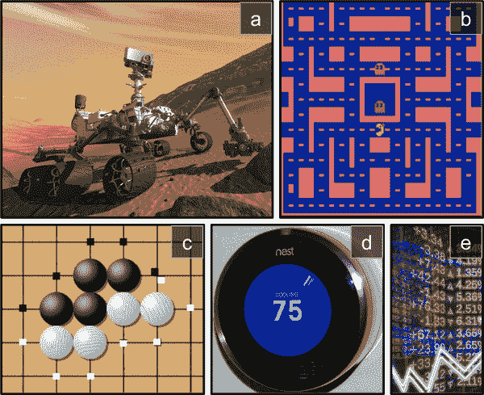
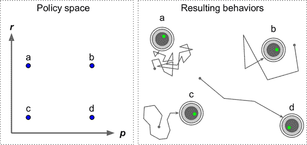
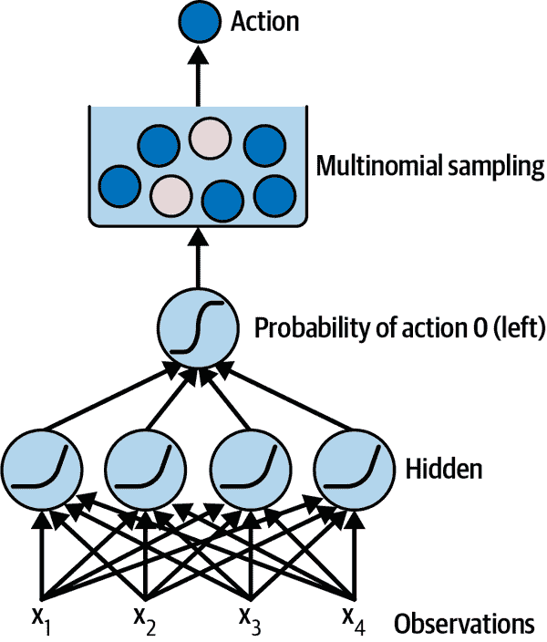
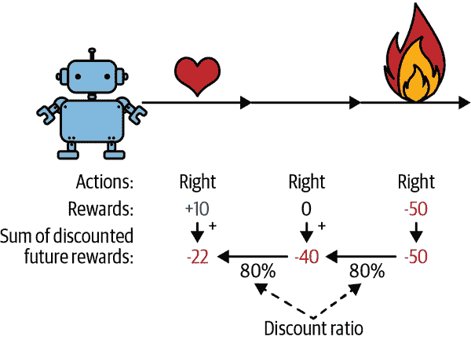
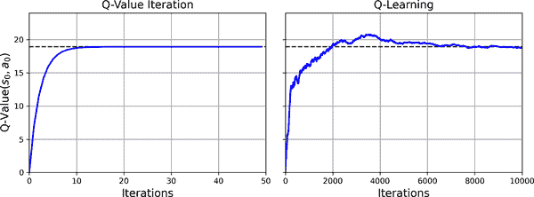

# 第十八章 强化学习

*强化学习*（RL）是当今最激动人心的机器学习领域之一，也是最古老的之一。自上世纪 50 年代以来一直存在，多年来产生了许多有趣的应用，特别是在游戏（例如 *TD-Gammon*，一个下棋程序）和机器控制方面，但很少成为头条新闻。然而，一场革命发生在[2013 年](https://homl.info/dqn)，当时来自英国初创公司 DeepMind 的研究人员展示了一个系统，可以从头开始学习玩几乎任何 Atari 游戏，最终在大多数游戏中[超越人类](https://homl.info/dqn2)，只使用原始像素作为输入，而不需要任何关于游戏规则的先验知识。这是一系列惊人壮举的开始，最终在 2016 年 3 月，他们的系统 AlphaGo 在围棋比赛中击败了传奇职业选手李世石，并在 2017 年 5 月击败了世界冠军柯洁。没有任何程序曾经接近击败这个游戏的大师，更不用说世界冠军了。如今，整个强化学习领域充满了新的想法，具有广泛的应用范围。

那么，DeepMind（2014 年被 Google 以超过 5 亿美元的价格收购）是如何实现所有这些的呢？回顾起来似乎相当简单：他们将深度学习的力量应用于强化学习领域，而且效果超出了他们最疯狂的梦想。在本章中，我将首先解释什么是强化学习以及它擅长什么，然后介绍深度强化学习中最重要的两种技术：策略梯度和深度 Q 网络，包括对马尔可夫决策过程的讨论。让我们开始吧！

# 学习优化奖励

在强化学习中，软件 *代理* 在一个 *环境* 中进行 *观察* 和 *行动*，并从环境中获得 *奖励*。其目标是学会以一种方式行动，以最大化其随时间的预期奖励。如果您不介意有点拟人化，您可以将积极奖励视为快乐，将负面奖励视为痛苦（在这种情况下，“奖励”这个术语有点误导）。简而言之，代理在环境中行动，并通过试错学习来最大化其快乐并最小化其痛苦。

这是一个非常广泛的设置，可以应用于各种任务。以下是一些示例（参见 图 18-1）：

1.  代理程序可以是控制机器人的程序。在这种情况下，环境是真实世界，代理通过一组传感器（如摄像头和触摸传感器）观察环境，其行动包括发送信号以激活电机。它可能被编程为在接近目标位置时获得积极奖励，而在浪费时间或走错方向时获得负面奖励。

1.  代理可以是控制 *Ms. Pac-Man* 的程序。在这种情况下，环境是 Atari 游戏的模拟，行动是九种可能的摇杆位置（左上、下、中心等），观察是屏幕截图，奖励只是游戏得分。

1.  同样，代理可以是玩围棋等棋盘游戏的程序。只有在赢得比赛时才会获得奖励。

1.  代理不必控制物理（或虚拟）移动的东西。例如，它可以是一个智能恒温器，每当接近目标温度并节省能源时获得积极奖励，当人类需要调整温度时获得负面奖励，因此代理必须学会预测人类需求。

1.  代理可以观察股市价格并决定每秒买入或卖出多少。奖励显然是货币收益和损失。

请注意，可能根本没有任何正面奖励；例如，代理可能在迷宫中四处移动，在每个时间步都会获得负面奖励，因此最好尽快找到出口！还有许多其他适合强化学习的任务示例，例如自动驾驶汽车、推荐系统、在网页上放置广告，或者控制图像分类系统应该关注的位置。



###### 图 18-1. 强化学习示例：(a) 机器人，(b) *Ms. Pac-Man*，(c) 围棋选手，(d) 恒温器，(e) 自动交易员⁠⁵

# 策略搜索

软件代理用来确定其行动的算法称为其*策略*。策略可以是一个神经网络，将观察作为输入并输出要采取的行动（见图 18-2）。


###### 图 18-2。使用神经网络策略的强化学习

策略可以是你能想到的任何算法，并且不必是确定性的。实际上，在某些情况下，它甚至不必观察环境！例如，考虑一个机器人吸尘器，其奖励是在 30 分钟内吸尘的量。它的策略可以是每秒以概率*p*向前移动，或者以概率 1 - *p*随机向左或向右旋转。旋转角度将是- *r*和+ *r*之间的随机角度。由于这个策略涉及一些随机性，它被称为*随机策略*。机器人将有一个不规则的轨迹，这保证了它最终会到达它可以到达的任何地方并清理所有的灰尘。问题是，在 30 分钟内它会吸尘多少？

你会如何训练这样的机器人？你只能调整两个*策略参数*：概率*p*和角度范围*r*。一个可能的学习算法是尝试许多不同的参数值，并选择表现最好的组合（参见图 18-3）。这是一个*策略搜索*的例子，这种情况下使用了一种蛮力方法。当*策略空间*太大时（这通常是情况），通过这种方式找到一组好的参数就像在一个巨大的草堆中寻找一根针。

探索政策空间的另一种方法是使用*遗传算法*。例如，您可以随机创建第一代 100 个政策并尝试它们，然后“淘汰”最差的 80 个政策，并让 20 个幸存者每人产生 4 个后代。后代是其父母的副本加上一些随机变化。幸存的政策及其后代一起构成第二代。您可以继续通过这种方式迭代生成，直到找到一个好的政策。



###### 图 18-3。政策空间中的四个点（左）和代理的相应行为（右）

另一种方法是使用优化技术，通过评估奖励相对于策略参数的梯度，然后通过沿着梯度朝着更高奖励的方向调整这些参数。我们将在本章后面更详细地讨论这种方法，称为*策略梯度*（PG）。回到吸尘器机器人，您可以稍微增加*p*，并评估这样做是否会增加机器人在 30 分钟内吸尘的量；如果是，那么再增加*p*一些，否则减少*p*。我们将使用 TensorFlow 实现一个流行的 PG 算法，但在此之前，我们需要为代理创建一个环境——现在是介绍 OpenAI Gym 的时候了。

# OpenAI Gym 简介

强化学习的一个挑战是，为了训练一个代理程序，您首先需要一个可用的环境。如果您想编写一个代理程序来学习玩 Atari 游戏，您将需要一个 Atari 游戏模拟器。如果您想编写一个行走机器人，那么环境就是现实世界，您可以直接在该环境中训练您的机器人。然而，这也有其局限性：如果机器人掉下悬崖，您不能简单地点击撤销。您也不能加快时间——增加计算能力不会使机器人移动得更快——而且通常来说，同时训练 1000 个机器人的成本太高。简而言之，在现实世界中训练是困难且缓慢的，因此您通常至少需要一个*模拟环境*来进行引导训练。例如，您可以使用类似[PyBullet](https://pybullet.org)或[MuJoCo](https://mujoco.org)的库进行 3D 物理模拟。

[*OpenAI Gym*](https://gym.openai.com)是一个工具包，提供各种模拟环境（Atari 游戏，棋盘游戏，2D 和 3D 物理模拟等），您可以用它来训练代理程序，比较它们，或者开发新的 RL 算法。

OpenAI Gym 在 Colab 上预先安装，但是它是一个较旧的版本，因此您需要用最新版本替换它。您还需要安装一些它的依赖项。如果您在自己的机器上编程而不是在 Colab 上，并且按照[*https://homl.info/install*](https://homl.info/install)上的安装说明进行操作，那么您可以跳过这一步；否则，请输入以下命令：

```py
# Only run these commands on Colab or Kaggle!
%pip install -q -U gym
%pip install -q -U gym[classic_control,box2d,atari,accept-rom-license]
```

第一个`%pip`命令将 Gym 升级到最新版本。`-q`选项代表*quiet*：它使输出更简洁。`-U`选项代表*upgrade*。第二个`%pip`命令安装了运行各种环境所需的库。这包括来自*控制理论*（控制动态系统的科学）的经典环境，例如在小车上平衡杆。它还包括基于 Box2D 库的环境——一个用于游戏的 2D 物理引擎。最后，它包括基于 Arcade Learning Environment（ALE）的环境，这是 Atari 2600 游戏的模拟器。几个 Atari 游戏的 ROM 会被自动下载，通过运行这段代码，您同意 Atari 的 ROM 许可证。

有了这个，您就可以使用 OpenAI Gym 了。让我们导入它并创建一个环境：

```py
import gym

env = gym.make("CartPole-v1", render_mode="rgb_array")
```

在这里，我们创建了一个 CartPole 环境。这是一个 2D 模拟，其中一个小车可以被加速向左或向右，以平衡放在其顶部的杆（参见图 18-4）。这是一个经典的控制任务。

###### 提示

`gym.envs.registry`字典包含所有可用环境的名称和规格。


###### 图 18-4。CartPole 环境

在创建环境之后，您必须使用`reset()`方法对其进行初始化，可以选择性地指定一个随机种子。这将返回第一个观察结果。观察结果取决于环境的类型。对于 CartPole 环境，每个观察结果都是一个包含四个浮点数的 1D NumPy 数组，表示小车的水平位置（`0.0` = 中心），其速度（正数表示向右），杆的角度（`0.0` = 垂直），以及其角速度（正数表示顺时针）。`reset()`方法还返回一个可能包含额外环境特定信息的字典。这对于调试或训练可能很有用。例如，在许多 Atari 环境中，它包含剩余的生命次数。然而，在 CartPole 环境中，这个字典是空的。

```py
>>> obs, info = env.reset(seed=42)
>>> obs
array([ 0.0273956 , -0.00611216,  0.03585979,  0.0197368 ], dtype=float32)
>>> info
{}
```

让我们调用`render()`方法将这个环境渲染为图像。由于在创建环境时设置了`render_mode="rgb_array"`，图像将作为一个 NumPy 数组返回：

```py
>>> img = env.render()
>>> img.shape  # height, width, channels (3 = Red, Green, Blue)
(400, 600, 3)
```

然后，您可以使用 Matplotlib 的`imshow()`函数来显示这个图像，就像往常一样。

现在让我们询问环境有哪些可能的动作：

```py
>>> env.action_space
Discrete(2)
```

`Discrete(2)`表示可能的动作是整数 0 和 1，分别代表向左或向右加速。其他环境可能有额外的离散动作，或其他类型的动作（例如连续动作）。由于杆向右倾斜（`obs[2] > 0`），让我们加速小车向右：

```py
>>> action = 1  # accelerate right
>>> obs, reward, done, truncated, info = env.step(action)
>>> obs
array([ 0.02727336,  0.18847767,  0.03625453, -0.26141977], dtype=float32)
>>> reward
1.0
>>> done
False
>>> truncated
False
>>> info
{}
```

`step()` 方法执行所需的动作并返回五个值：

`obs`

这是新的观察。小车现在向右移动（`obs[1] > 0`）。杆仍然向右倾斜（`obs[2] > 0`），但它的角速度现在是负的（`obs[3] < 0`），所以在下一步之后它可能会向左倾斜。

`reward`

在这个环境中，无论你做什么，每一步都会获得 1.0 的奖励，所以目标是尽可能让情节运行更长时间。

`done`

当情节结束时，这个值将是`True`。当杆倾斜得太多，或者离开屏幕，或者经过 200 步后（在这种情况下，你赢了），情节就会结束。之后，环境必须被重置才能再次使用。

`truncated`

当一个情节被提前中断时，这个值将是`True`，例如通过一个强加每个情节最大步数的环境包装器（请参阅 Gym 的文档以获取有关环境包装器的更多详细信息）。一些强化学习算法会将截断的情节与正常结束的情节（即`done`为`True`时）区别对待，但在本章中，我们将对它们进行相同处理。

`info`

这个特定于环境的字典可能提供额外的信息，就像`reset()`方法返回的那样。

###### 提示

当你使用完一个环境后，应该调用它的`close()`方法来释放资源。

让我们硬编码一个简单的策略，当杆向左倾斜时加速向左，当杆向右倾斜时加速向右。我们将运行此策略，以查看它在 500 个情节中获得的平均奖励：

```py
def basic_policy(obs):
    angle = obs[2]
    return 0 if angle < 0 else 1

totals = []
for episode in range(500):
    episode_rewards = 0
    obs, info = env.reset(seed=episode)
    for step in range(200):
        action = basic_policy(obs)
        obs, reward, done, truncated, info = env.step(action)
        episode_rewards += reward
        if done or truncated:
            break

    totals.append(episode_rewards)
```

这段代码是不言自明的。让我们看看结果：

```py
>>> import numpy as np
>>> np.mean(totals), np.std(totals), min(totals), max(totals)
(41.698, 8.389445512070509, 24.0, 63.0)
```

即使尝试了 500 次，这个策略也从未成功让杆连续保持直立超过 63 步。不太好。如果你看一下本章笔记本中的模拟，你会看到小车左右摆动得越来越强烈，直到杆倾斜得太多。让我们看看神经网络是否能提出一个更好的策略。

# 神经网络策略

让我们创建一个神经网络策略。这个神经网络将以观察作为输入，并输出要执行的动作，就像我们之前硬编码的策略一样。更准确地说，它将为每个动作估计一个概率，然后我们将根据估计的概率随机选择一个动作（参见图 18-5）。在 CartPole 环境中，只有两种可能的动作（左或右），所以我们只需要一个输出神经元。它将输出动作 0（左）的概率*p*，当然动作 1（右）的概率将是 1 - *p*。例如，如果它输出 0.7，那么我们将以 70%的概率选择动作 0，或者以 30%的概率选择动作 1。



###### 图 18-5\. 神经网络策略

你可能会想为什么我们根据神经网络给出的概率随机选择一个动作，而不是只选择得分最高的动作。这种方法让代理人在*探索*新动作和*利用*已知效果良好的动作之间找到平衡。这里有一个类比：假设你第一次去一家餐馆，所有菜看起来都一样吸引人，所以你随机挑选了一个。如果它很好吃，你可以增加下次点它的概率，但你不应该将这个概率增加到 100%，否则你永远不会尝试其他菜，其中一些可能比你尝试的这个更好。这个*探索*/*利用*的困境在强化学习中是核心的。

还要注意，在这种特定环境中，过去的动作和观察可以安全地被忽略，因为每个观察包含了环境的完整状态。如果有一些隐藏状态，那么您可能需要考虑过去的动作和观察。例如，如果环境只透露了小车的位置而没有速度，那么您不仅需要考虑当前观察，还需要考虑上一个观察以估计当前速度。另一个例子是当观察是嘈杂的；在这种情况下，通常希望使用过去几个观察来估计最可能的当前状态。因此，CartPole 问题非常简单；观察是无噪声的，并且包含了环境的完整状态。

以下是使用 Keras 构建基本神经网络策略的代码：

```py
import tensorflow as tf

model = tf.keras.Sequential([
    tf.keras.layers.Dense(5, activation="relu"),
    tf.keras.layers.Dense(1, activation="sigmoid"),
])
```

我们使用`Sequential`模型来定义策略网络。输入的数量是观察空间的大小——在 CartPole 的情况下是 4——我们只有五个隐藏单元，因为这是一个相当简单的任务。最后，我们希望输出一个单一的概率——向左移动的概率——因此我们使用具有 sigmoid 激活函数的单个输出神经元。如果有超过两种可能的动作，每种动作将有一个输出神经元，并且我们将使用 softmax 激活函数。

好的，现在我们有一个神经网络策略，它将接收观察并输出动作概率。但是我们如何训练它呢？

# 评估动作：信用分配问题

如果我们知道每一步的最佳行动是什么，我们可以像平常一样训练神经网络，通过最小化估计概率分布与目标概率分布之间的交叉熵来实现，这将只是常规的监督学习。然而，在强化学习中，智能体得到的唯一指导是通过奖励，而奖励通常是稀疏和延迟的。例如，如果智能体设法在 100 步内平衡杆，它如何知道这 100 个动作中哪些是好的，哪些是坏的？它只知道在最后一个动作之后杆倒了，但肯定不是这个最后一个动作完全负责。这被称为*信用分配问题*：当智能体获得奖励时，它很难知道哪些动作应该得到赞扬（或责备）。想象一只狗表现良好几个小时后才得到奖励；它会明白为什么会得到奖励吗？

为了解决这个问题，一个常见的策略是基于之后所有奖励的总和来评估一个动作，通常在每一步应用一个*折扣因子*，*γ*（gamma）。这些折扣后的奖励之和被称为动作的*回报*。考虑图 18-6 中的例子。如果一个智能体连续三次向右移动，并在第一步后获得+10 奖励，在第二步后获得 0 奖励，最后在第三步后获得-50 奖励，那么假设我们使用一个折扣因子*γ*=0.8，第一个动作的回报将是 10 + *γ* × 0 + *γ*² × (–50) = –22。如果折扣因子接近 0，那么未来的奖励与即时奖励相比不会占据很大比重。相反，如果折扣因子接近 1，那么未来的奖励将几乎和即时奖励一样重要。典型的折扣因子从 0.9 到 0.99 不等。使用折扣因子 0.95，未来 13 步的奖励大约相当于即时奖励的一半（因为 0.95¹³ ≈ 0.5），而使用折扣因子 0.99，未来 69 步的奖励相当于即时奖励的一半。在 CartPole 环境中，动作具有相当短期的影响，因此选择折扣因子 0.95 似乎是合理的。



###### 图 18-6。计算动作的回报：折扣未来奖励之和

当然，一个好的行动可能会被几个导致杆迅速倒下的坏行动跟随，导致好的行动获得较低的回报。同样，一个好的演员有时可能会出演一部糟糕的电影。然而，如果我们玩足够多次游戏，平均而言好的行动将获得比坏行动更高的回报。我们想要估计一个行动相对于其他可能行动的平均优势有多大。这被称为*行动优势*。为此，我们必须运行许多情节，并通过减去均值并除以标准差来标准化所有行动回报。之后，我们可以合理地假设具有负优势的行动是坏的，而具有正优势的行动是好的。现在我们有了一种评估每个行动的方法，我们准备使用策略梯度来训练我们的第一个代理。让我们看看如何。

# 策略梯度

正如前面讨论的，PG 算法通过沿着梯度朝着更高奖励的方向优化策略的参数。一种流行的 PG 算法类别称为*REINFORCE 算法*，由 Ronald Williams 于 1992 年提出。这里是一个常见的变体：

1.  首先，让神经网络策略玩游戏多次，并在每一步计算使选择的行动更有可能的梯度，但暂时不应用这些梯度。

1.  在运行了几个情节之后，使用前一节中描述的方法计算每个行动的优势。

1.  如果一个行动的优势是正的，这意味着这个行动可能是好的，你希望应用之前计算的梯度，使这个行动在未来更有可能被选择。然而，如果一个行动的优势是负的，这意味着这个行动可能是坏的，你希望应用相反的梯度，使这个行动在未来略微减少。解决方案是将每个梯度向量乘以相应行动的优势。

1.  最后，计算所有结果梯度向量的平均值，并用它执行一步梯度下降。

让我们使用 Keras 来实现这个算法。我们将训练之前构建的神经网络策略，使其学会在小车上平衡杆。首先，我们需要一个函数来执行一步。我们暂时假设无论采取什么行动都是正确的，以便我们可以计算损失及其梯度。这些梯度将暂时保存一段时间，我们稍后会根据行动的好坏来修改它们：

```py
def play_one_step(env, obs, model, loss_fn):
    with tf.GradientTape() as tape:
        left_proba = model(obs[np.newaxis])
        action = (tf.random.uniform([1, 1]) > left_proba)
        y_target = tf.constant([[1.]]) - tf.cast(action, tf.float32)
        loss = tf.reduce_mean(loss_fn(y_target, left_proba))

    grads = tape.gradient(loss, model.trainable_variables)
    obs, reward, done, truncated, info = env.step(int(action))
    return obs, reward, done, truncated, grads
```

让我们来看看这个函数：

+   在`GradientTape`块中（参见第十二章），我们首先调用模型，给它一个观察值。我们将观察值重塑为包含单个实例的批次，因为模型期望一个批次。这将输出向左移动的概率。

+   接下来，我们随机抽取一个介于 0 和 1 之间的浮点数，并检查它是否大于`left_proba`。`action`将以`left_proba`的概率为`False`，或以`1 - left_proba`的概率为`True`。一旦我们将这个布尔值转换为整数，行动将以适当的概率为 0（左）或 1（右）。

+   现在我们定义向左移动的目标概率：它是 1 减去行动（转换为浮点数）。如果行动是 0（左），那么向左移动的目标概率将是 1。如果行动是 1（右），那么目标概率将是 0。

+   然后我们使用给定的损失函数计算损失，并使用 tape 计算损失相对于模型可训练变量的梯度。同样，这些梯度稍后会在应用之前进行调整，取决于行动的好坏。

+   最后，我们执行选择的行动，并返回新的观察值、奖励、该情节是否结束、是否截断，当然还有我们刚刚计算的梯度。

现在让我们创建另一个函数，它将依赖于`play_one_step()`函数来玩多个回合，返回每个回合和每个步骤的所有奖励和梯度：

```py
def play_multiple_episodes(env, n_episodes, n_max_steps, model, loss_fn):
    all_rewards = []
    all_grads = []
    for episode in range(n_episodes):
        current_rewards = []
        current_grads = []
        obs, info = env.reset()
        for step in range(n_max_steps):
            obs, reward, done, truncated, grads = play_one_step(
                env, obs, model, loss_fn)
            current_rewards.append(reward)
            current_grads.append(grads)
            if done or truncated:
                break

        all_rewards.append(current_rewards)
        all_grads.append(current_grads)

    return all_rewards, all_grads
```

这段代码返回了一个奖励列表的列表：每个回合一个奖励列表，每个步骤一个奖励。它还返回了一个梯度列表的列表：每个回合一个梯度列表，每个梯度列表包含每个步骤的一个梯度元组，每个元组包含每个可训练变量的一个梯度张量。

该算法将使用`play_multiple_episodes()`函数多次玩游戏（例如，10 次），然后它将回头查看所有奖励，对其进行折扣，并对其进行归一化。为此，我们需要几个额外的函数；第一个将计算每个步骤的未来折扣奖励总和，第二个将通过减去均值并除以标准差来对所有这些折扣奖励（即回报）在许多回合中进行归一化：

```py
def discount_rewards(rewards, discount_factor):
    discounted = np.array(rewards)
    for step in range(len(rewards) - 2, -1, -1):
        discounted[step] += discounted[step + 1] * discount_factor
    return discounted

def discount_and_normalize_rewards(all_rewards, discount_factor):
    all_discounted_rewards = [discount_rewards(rewards, discount_factor)
                              for rewards in all_rewards]
    flat_rewards = np.concatenate(all_discounted_rewards)
    reward_mean = flat_rewards.mean()
    reward_std = flat_rewards.std()
    return [(discounted_rewards - reward_mean) / reward_std
            for discounted_rewards in all_discounted_rewards]
```

让我们检查一下这是否有效：

```py
>>> discount_rewards([10, 0, -50], discount_factor=0.8)
array([-22, -40, -50])
>>> discount_and_normalize_rewards([[10, 0, -50], [10, 20]],
...                                discount_factor=0.8)
...
[array([-0.28435071, -0.86597718, -1.18910299]),
 array([1.26665318, 1.0727777 ])]
```

调用`discount_rewards()`返回了我们预期的结果（见图 18-6）。您可以验证函数`discount_and_normalize_rewards()`确实返回了两个回合中每个动作的归一化优势。请注意，第一个回合比第二个回合差得多，因此它的归一化优势都是负数；第一个回合的所有动作都被认为是不好的，反之第二个回合的所有动作都被认为是好的。

我们几乎准备好运行算法了！现在让我们定义超参数。我们将运行 150 次训练迭代，每次迭代玩 10 个回合，每个回合最多持续 200 步。我们将使用折扣因子 0.95：

```py
n_iterations = 150
n_episodes_per_update = 10
n_max_steps = 200
discount_factor = 0.95
```

我们还需要一个优化器和损失函数。一个常规的 Nadam 优化器，学习率为 0.01，将会很好地完成任务，我们将使用二元交叉熵损失函数，因为我们正在训练一个二元分类器（有两种可能的动作——左或右）：

```py
optimizer = tf.keras.optimizers.Nadam(learning_rate=0.01)
loss_fn = tf.keras.losses.binary_crossentropy
```

现在我们准备构建和运行训练循环！

```py
for iteration in range(n_iterations):
    all_rewards, all_grads = play_multiple_episodes(
        env, n_episodes_per_update, n_max_steps, model, loss_fn)
    all_final_rewards = discount_and_normalize_rewards(all_rewards,
                                                       discount_factor)
    all_mean_grads = []
    for var_index in range(len(model.trainable_variables)):
        mean_grads = tf.reduce_mean(
            [final_reward * all_grads[episode_index][step][var_index]
             for episode_index, final_rewards in enumerate(all_final_rewards)
                 for step, final_reward in enumerate(final_rewards)], axis=0)
        all_mean_grads.append(mean_grads)

    optimizer.apply_gradients(zip(all_mean_grads, model.trainable_variables))
```

让我们逐步走过这段代码：

+   在每次训练迭代中，此循环调用`play_multiple_episodes()`函数，该函数播放 10 个回合，并返回每个步骤中每个回合的奖励和梯度。

+   然后我们调用`discount_and_normalize_rewards()`函数来计算每个动作的归一化优势，这在这段代码中称为`final_reward`。这提供了一个衡量每个动作实际上是好还是坏的指标。

+   接下来，我们遍历每个可训练变量，并对每个变量计算所有回合和所有步骤中该变量的梯度的加权平均，权重为`final_reward`。

+   最后，我们使用优化器应用这些均值梯度：模型的可训练变量将被微调，希望策略会有所改善。

我们完成了！这段代码将训练神经网络策略，并成功学会在小车上平衡杆。每个回合的平均奖励将非常接近 200。默认情况下，这是该环境的最大值。成功！

我们刚刚训练的简单策略梯度算法解决了 CartPole 任务，但是它在扩展到更大更复杂的任务时效果不佳。事实上，它具有很高的*样本效率低*，这意味着它需要很长时间探索游戏才能取得显著进展。这是因为它必须运行多个回合来估计每个动作的优势，正如我们所见。然而，它是更强大算法的基础，比如*演员-评论家*算法（我们将在本章末简要讨论）。

###### 提示

研究人员试图找到即使代理最初对环境一无所知也能很好运行的算法。然而，除非你在写论文，否则不应该犹豫向代理注入先验知识，因为这将极大加快训练速度。例如，由于你知道杆应该尽可能垂直，你可以添加与杆角度成比例的负奖励。这将使奖励变得不那么稀疏，加快训练速度。此外，如果你已经有一个相当不错的策略（例如硬编码），你可能希望在使用策略梯度来改进之前，训练神经网络来模仿它。

现在我们将看一下另一个流行的算法家族。PG 算法直接尝试优化策略以增加奖励，而我们现在要探索的算法则不那么直接：代理学习估计每个状态的预期回报，或者每个状态中每个动作的预期回报，然后利用这些知识来决定如何行动。要理解这些算法，我们首先必须考虑*马尔可夫决策过程*（MDPs）。

# 马尔可夫决策过程

20 世纪初，数学家安德烈·马尔可夫研究了没有记忆的随机过程，称为*马尔可夫链*。这样的过程具有固定数量的状态，并且在每一步中随机从一个状态演变到另一个状态。它从状态*s*演变到状态*s*′的概率是固定的，仅取决于对(*s*, *s*′)这一对，而不取决于过去的状态。这就是为什么我们说该系统没有记忆。

图 18-7 显示了一个具有四个状态的马尔可夫链的示例。


###### 图 18-7. 马尔可夫链示例

假设过程从状态*s*[0]开始，并且有 70%的概率在下一步保持在该状态。最终，它必定会离开该状态并永远不会回来，因为没有其他状态指向*s*[0]。如果它进入状态*s*[1]，那么它很可能会进入状态*s*[2]（90%的概率），然后立即返回到状态*s*[1]（100%的概率）。它可能在这两个状态之间交替多次，但最终会陷入状态*s*[3]并永远留在那里，因为没有出路：这被称为*终止状态*。马尔可夫链的动态可能非常不同，并且在热力学、化学、统计学等领域被广泛使用。

马尔可夫决策过程是在 20 世纪 50 年代由[理查德·贝尔曼](https://homl.info/133)首次描述的。⁠¹² 它们类似于马尔可夫链，但有一个区别：在每一步中，代理可以选择几种可能的动作之一，转移概率取决于所选择的动作。此外，一些状态转移会产生一些奖励（正面或负面），代理的目标是找到一个能够随时间最大化奖励的策略。

例如，MDP 在图 18-8 中表示有三个状态（由圆圈表示），并且在每一步最多有三种可能的离散动作（由菱形表示）。


###### 图 18-8. 马尔可夫决策过程示例

如果代理从状态 *s*[0] 开始，可以在行动 *a*[0]、*a*[1] 或 *a*[2] 之间选择。如果选择行动 *a*[1]，它就会肯定留在状态 *s*[0]，没有任何奖励。因此，如果愿意，它可以决定永远留在那里。但如果选择行动 *a*[0]，它有 70%的概率获得+10 的奖励并留在状态 *s*[0]。然后它可以一次又一次地尝试获得尽可能多的奖励，但最终会进入状态 *s*[1]。在状态 *s*[1] 中，它只有两种可能的行动：*a*[0] 或 *a*[2]。它可以通过反复选择行动 *a*[0] 来保持原地，或者选择移动到状态 *s*[2] 并获得-50 的负奖励（疼）。在状态 *s*[2] 中，它别无选择，只能采取行动 *a*[1]，这很可能会将其带回状态 *s*[0]，在途中获得+40 的奖励。你明白了。通过观察这个 MDP，你能猜出哪种策略会随着时间获得最多的奖励吗？在状态 *s*[0] 中，很明显行动 *a*[0] 是最佳选择，在状态 *s*[2] 中，代理别无选择，只能采取行动 *a*[1]，但在状态 *s*[1] 中，不明显代理应该保持原地（*a*[0]）还是冒险前进（*a*[2]）。

贝尔曼找到了一种估计任何状态 *s* 的*最优状态值* *V*(*s*) 的方法，这是代理在到达该状态后可以期望的所有折扣未来奖励的总和，假设它采取最优行动。他表明，如果代理采取最优行动，那么*贝尔曼最优性方程*适用（参见方程 18-1）。这个递归方程表明，如果代理采取最优行动，那么当前状态的最优值等于在采取一个最优行动后平均获得的奖励，再加上这个行动可能导致的所有可能下一个状态的期望最优值。

##### 方程 18-1\. 贝尔曼最优性方程

<math display="block"><mrow><msup><mi>V</mi> <mo>*</mo></msup> <mrow><mo>(</mo> <mi>s</mi> <mo>)</mo></mrow> <mo>=</mo> <munder><mo movablelimits="true" form="prefix">max</mo> <mi>a</mi></munder> <munder><mo>∑</mo> <mrow><mi>s</mi><mo>'</mo></mrow></munder> <mrow><mi>T</mi> <mrow><mo>(</mo> <mi>s</mi> <mo>,</mo> <mi>a</mi> <mo>,</mo> <mi>s</mi><mo>'</mo> <mo>)</mo></mrow> <mrow><mo>[</mo> <mi>R</mi> <mrow><mo>(</mo> <mi>s</mi> <mo>,</mo> <mi>a</mi> <mo>,</mo> <mi>s</mi><mo>'</mo> <mo>)</mo></mrow> <mo>+</mo> <mi>γ</mi> <mo>·</mo> <msup><mi>V</mi> <mo>*</mo></msup> <mrow><mo>(</mo> <mi>s</mi><mo>'</mo> <mo>)</mo></mrow> <mo>]</mo></mrow></mrow> <mtext>for</mtext> <mtext>all</mtext> <mi>s</mi></mrow></math>

在这个方程中：

+   *T*(*s*, *a*, *s*′) 是从状态 *s* 转移到状态 *s*′ 的转移概率，假设代理选择行动 *a*。例如，在图 18-8 中，*T*(*s*[2], *a*[1], *s*[0]) = 0.8。

+   *R*(*s*, *a*, *s*′) 是代理从状态 *s* 转移到状态 *s*′ 时获得的奖励，假设代理选择行动 *a*。例如，在图 18-8 中，*R*(*s*[2], *a*[1], *s*[0]) = +40。

+   *γ* 是折扣因子。

这个方程直接导致了一个算法，可以精确估计每个可能状态的最优状态值：首先将所有状态值估计初始化为零，然后使用*值迭代*算法进行迭代更新（参见方程 18-2）。一个显著的结果是，给定足够的时间，这些估计将收敛到最优状态值，对应于最优策略。

##### 方程 18-2\. 值迭代算法

<math display="block"><mrow><msub><mi>V</mi> <mrow><mi>k</mi><mo>+</mo><mn>1</mn></mrow></msub> <mrow><mo>(</mo> <mi>s</mi> <mo>)</mo></mrow> <mo>←</mo> <munder><mo movablelimits="true" form="prefix">max</mo> <mi>a</mi></munder> <munder><mo>∑</mo> <mrow><mi>s</mi><mo>'</mo></mrow></munder> <mrow><mi>T</mi> <mrow><mo>(</mo> <mi>s</mi> <mo>,</mo> <mi>a</mi> <mo>,</mo> <mi>s</mi><mo>'</mo> <mo>)</mo></mrow> <mrow><mo>[</mo> <mi>R</mi> <mrow><mo>(</mo> <mi>s</mi> <mo>,</mo> <mi>a</mi> <mo>,</mo> <mi>s</mi><mo>'</mo> <mo>)</mo></mrow> <mo>+</mo> <mi>γ</mi> <mo>·</mo> <msub><mi>V</mi> <mi>k</mi></msub> <mrow><mo>(</mo> <mi>s</mi><mo>'</mo> <mo>)</mo></mrow> <mo>]</mo></mrow></mrow> <mtext>for</mtext> <mtext>all</mtext> <mi>s</mi></mrow></math>

在这个方程中，*V**k*是算法的第*k*次迭代中状态*s*的估计值。

###### 注意

这个算法是*动态规划*的一个例子，它将一个复杂的问题分解成可迭代处理的可解子问题。

知道最优状态值可能很有用，特别是用于评估策略，但它并不能为代理提供最优策略。幸运的是，贝尔曼找到了一个非常相似的算法来估计最优*状态-动作值*，通常称为*Q 值*（质量值）。状态-动作对(*s*, *a*)的最优 Q 值，记为*Q**(*s*, *a*)，是代理在到达状态*s*并选择动作*a*后，在看到此动作结果之前，可以期望平均获得的折现未来奖励的总和，假设在此动作之后它表现最佳。

让我们看看它是如何工作的。再次，您首先将所有 Q 值的估计初始化为零，然后使用*Q 值迭代*算法进行更新（参见方程 18-3）。

##### 方程 18-3。Q 值迭代算法

<math display="block"><mrow><msub><mi>Q</mi> <mrow><mi>k</mi><mo>+</mo><mn>1</mn></mrow></msub> <mrow><mo>(</mo> <mi>s</mi> <mo>,</mo> <mi>a</mi> <mo>)</mo></mrow> <mo>←</mo> <munder><mo>∑</mo> <mrow><mi>s</mi><mo>'</mo></mrow></munder> <mrow><mi>T</mi> <mrow><mo>(</mo> <mi>s</mi> <mo>,</mo> <mi>a</mi> <mo>,</mo> <mi>s</mi><mo>'</mo> <mo>)</mo></mrow> <mrow><mo>[</mo> <mi>R</mi> <mrow><mo>(</mo> <mi>s</mi> <mo>,</mo> <mi>a</mi> <mo>,</mo> <mi>s</mi><mo>'</mo> <mo>)</mo></mrow> <mo>+</mo> <mi>γ</mi> <mo>·</mo> <munder><mo movablelimits="true" form="prefix">max</mo> <mrow><mi>a</mi><mo>'</mo></mrow></munder> <mrow><msub><mi>Q</mi> <mi>k</mi></msub> <mrow><mo>(</mo> <mi>s</mi><mo>'</mo> <mo>,</mo> <mi>a</mi><mo>'</mo> <mo>)</mo></mrow></mrow> <mo>]</mo></mrow></mrow> <mtext>for</mtext> <mtext>all</mtext> <mrow><mo>(</mo> <mi>s</mi> <mo>,</mo> <mi>a</mi> <mo>)</mo></mrow></mrow></math>

一旦您有了最优的 Q 值，定义最优策略*π**(*s*)是微不足道的；当代理处于状态*s*时，它应该选择具有该状态最高 Q 值的动作：<math><msup><mi>π</mi><mo>*</mo></msup><mo>(</mo><mi>s</mi><mo>)</mo><mo>=</mo><munder><mo>argmax</mo><mi>a</mi></munder><msup><mi>Q</mi><mo>*</mo></msup><mo>(</mo><mi>s</mi><mo>,</mo><mi>a</mi><mo>)</mo></math>。

让我们将这个算法应用到图 18-8 中表示的 MDP 中。首先，我们需要定义 MDP：

```py
transition_probabilities = [  # shape=[s, a, s']
    [[0.7, 0.3, 0.0], [1.0, 0.0, 0.0], [0.8, 0.2, 0.0]],
    [[0.0, 1.0, 0.0], None, [0.0, 0.0, 1.0]],
    [None, [0.8, 0.1, 0.1], None]
]
rewards = [  # shape=[s, a, s']
    [[+10, 0, 0], [0, 0, 0], [0, 0, 0]],
    [[0, 0, 0], [0, 0, 0], [0, 0, -50]],
    [[0, 0, 0], [+40, 0, 0], [0, 0, 0]]
]
possible_actions = [[0, 1, 2], [0, 2], [1]]
```

例如，要知道在执行动作*a*[1]后从*s*[2]到*s*[0]的转移概率，我们将查找`transition_probabilities[2][1][0]`（为 0.8）。类似地，要获得相应的奖励，我们将查找`rewards[2][1][0]`（为+40）。要获取*s*[2]中可能的动作列表，我们将查找`possible_actions[2]`（在这种情况下，只有动作*a*[1]是可能的）。接下来，我们必须将所有 Q 值初始化为零（对于不可能的动作，我们将 Q 值设置为-∞）：

```py
Q_values = np.full((3, 3), -np.inf)  # -np.inf for impossible actions
for state, actions in enumerate(possible_actions):
    Q_values[state, actions] = 0.0  # for all possible actions
```

现在让我们运行 Q 值迭代算法。它重复应用方程 18-3，对每个状态和每个可能的动作的所有 Q 值进行计算：

```py
gamma = 0.90  # the discount factor

for iteration in range(50):
    Q_prev = Q_values.copy()
    for s in range(3):
        for a in possible_actions[s]:
            Q_values[s, a] = np.sum([
                    transition_probabilities[s][a][sp]
                    * (rewards[s][a][sp] + gamma * Q_prev[sp].max())
                for sp in range(3)])
```

就是这样！得到的 Q 值看起来像这样：

```py
>>> Q_values
array([[18.91891892, 17.02702702, 13.62162162],
 [ 0\.        ,        -inf, -4.87971488],
 [       -inf, 50.13365013,        -inf]])
```

例如，当代理处于状态*s*[0]并选择动作*a*[1]时，预期的折现未来奖励总和约为 17.0。

对于每个状态，我们可以找到具有最高 Q 值的动作：

```py
>>> Q_values.argmax(axis=1)  # optimal action for each state
array([0, 0, 1])
```

这给出了在使用折扣因子为 0.90 时这个 MDP 的最优策略：在状态*s*[0]选择动作*a*[0]，在状态*s*[1]选择动作*a*[0]（即保持不动），在状态*s*[2]选择动作*a*[1]（唯一可能的动作）。有趣的是，如果将折扣因子增加到 0.95，最优策略会改变：在状态*s*[1]中，最佳动作变为*a*[2]（冲过火！）。这是有道理的，因为你越重视未来的奖励，你就越愿意忍受现在的一些痛苦，以换取未来的幸福。

# 时间差异学习

具有离散动作的强化学习问题通常可以建模为马尔可夫决策过程，但代理最初不知道转移概率是多少（它不知道*T*(*s*, *a*, *s*′)），也不知道奖励将会是什么（它不知道*R*(*s*, *a*, *s*′)）。它必须至少体验每个状态和每个转换一次才能知道奖励，如果要对转移概率有合理的估计，它必须多次体验它们。

*时间差异（TD）学习*算法与 Q 值迭代算法非常相似，但经过调整以考虑代理只有对 MDP 的部分知识这一事实。通常我们假设代理最初只知道可能的状态和动作，什么也不知道。代理使用一个*探索策略*——例如，一个纯随机策略——来探索 MDP，随着探索的进行，TD 学习算法根据实际观察到的转换和奖励更新状态值的估计（参见方程 18-4）。

##### 方程 18-4. TD 学习算法

<math display="block"><msub><mi>V</mi> <mrow><mi>k</mi><mo>+</mo><mn>1</mn></mrow></msub> <mo>(</mo><mi>s</mi><mo>)</mo><mo>←</mo><mo>(</mo><mn>1</mn><mo>-</mo><mi>α</mi><mo>)</mo> <msub><mi>V</mi><mi>k</mi></msub> <mo>(</mo><mi>s</mi><mo>)</mo><mo>+</mo><mi>α</mi> <mfenced><mrow><mi>r</mi><mo>+</mo><mi>γ</mi><mo>·</mo> <msub><mi>V</mi><mi>k</mi></msub> <mo>(</mo><mi>s</mi><mo>'</mo><mo>)</mo></mrow></mfenced> <mtext>或者，等价地：</mtext> <msub><mi>V</mi><mrow><mi>k</mi><mo>+</mo><mn>1</mn></mrow></msub> <mo>(</mo><mi>s</mi><mo>)</mo><mo>←</mo><msub><mi>V</mi><mi>k</mi></msub> <mo>(</mo><mi>s</mi><mo>)</mo><mo>+</mo><mi>α</mi><mo>·</mo> <msub><mi>δ</mi><mi>k</mi></msub> <mo>(</mo><mi>s</mi><mo>,</mo><mi>r</mi><mo>,</mo> <mi>s</mo>'</mo><mo>)</mo> <mtext>其中</mtext><msub><mi>δ</mi><mi>k</mi></msub> <mo>(</mo><mi>s</mi><mo>,</mo><mi>r</mi><mo>,</mo><mi>s</mi><mo>′</mo> <mo>)</mo><mo>=</mo><mi>r</mi><mo>+</mo><mi>γ</mi> <mo>·</mo> <msub><mi>V</mi><mi>k</mi></msub> <mo>(</mo><mi>s</mi><mo>'</mo><mo>)</mo><mo>-</mo> <msub><mi>V</mi><mi>k</mi></msub><mo>(</mo><mi>s</mi><mo>)</mo></math>

在这个方程中：

+   *α*是学习率（例如，0.01）。

+   *r* + *γ* · *V**k*被称为*TD 目标*。

+   *δ*k 被称为*TD 误差*。

写出这个方程的第一种形式的更简洁方法是使用符号<math><mi>a</mi><munder><mo>←</mo><mi>α</mi></munder><mi>b</mi></math>，意思是*a*[*k*+1] ← (1 - *α*) · *a*[*k*] + *α* ·*b*[*k*]。因此，方程 18-4 的第一行可以重写为：<math><mi>V</mi><mo>(</mo><mi>s</mi><mo>)</mo><munder><mo>←</mo><mi>α</mi></munder><mi>r</mi><mo>+</mo><mi>γ</mi><mo>·</mo><mi>V</mi><mo>(</mo><mi>s</mi><mo>'</mo><mo>)</mo></math>。

###### 提示

TD 学习与随机梯度下降有许多相似之处，包括一次处理一个样本。此外，就像 SGD 一样，只有逐渐降低学习率，它才能真正收敛；否则，它将继续在最优 Q 值周围反弹。

对于每个状态*s*，该算法跟踪代理离开该状态后获得的即时奖励的平均值，以及它期望获得的奖励，假设它采取最优行动。

# Q-Learning

同样，Q-learning 算法是 Q 值迭代算法在转移概率和奖励最初未知的情况下的一种适应。Q-learning 通过观察代理玩（例如，随机玩）并逐渐改进其对 Q 值的估计来工作。一旦它有准确的 Q 值估计（或足够接近），那么最优策略就是选择具有最高 Q 值的动作（即，贪婪策略）。

##### 方程 18-5\. Q-learning 算法

<math display="block"><mi>Q</mi><mo>(</mo><mi>s</mi><mo>,</mo><mi>a</mi><mo>)</mo> <munder><mo>←</mo><mi>α</mi></munder> <mi>r</mi><mo>+</mo><mi>γ</mi><mo>·</mo> <munder><mi>max</mi><mrow><mi>a</mi><mo>'</mo></mrow></munder> <mi>Q</mi><mo>(</mo><mi>s</mi><mo>'</mo><mo>,</mo> <mi>a</mi><mo>'</mo><mo>)</mo></math>

对于每个状态-动作对（*s*，*a*），该算法跟踪代理离开状态*s*并采取动作*a*后获得的奖励*r*的平均值，以及它期望获得的折现未来奖励的总和。为了估计这个总和，我们取下一个状态*s*′的 Q 值估计的最大值，因为我们假设目标策略将从那时开始最优地行动。

让我们实现 Q-learning 算法。首先，我们需要让代理探索环境。为此，我们需要一个步骤函数，以便代理可以执行一个动作并获得结果状态和奖励：

```py
def step(state, action):
    probas = transition_probabilities[state][action]
    next_state = np.random.choice([0, 1, 2], p=probas)
    reward = rewards[state][action][next_state]
    return next_state, reward
```

现在让我们实现代理的探索策略。由于状态空间相当小，一个简单的随机策略就足够了。如果我们运行足够长的时间，代理将多次访问每个状态，并且还将多次尝试每种可能的动作：

```py
def exploration_policy(state):
    return np.random.choice(possible_actions[state])
```

接下来，在我们像之前一样初始化 Q 值之后，我们准备使用学习率衰减的 Q-learning 算法运行（使用幂调度，引入于第十一章）：

```py
alpha0 = 0.05  # initial learning rate
decay = 0.005  # learning rate decay
gamma = 0.90  # discount factor
state = 0  # initial state

for iteration in range(10_000):
    action = exploration_policy(state)
    next_state, reward = step(state, action)
    next_value = Q_values[next_state].max()  # greedy policy at the next step
    alpha = alpha0 / (1 + iteration * decay)
    Q_values[state, action] *= 1 - alpha
    Q_values[state, action] += alpha * (reward + gamma * next_value)
    state = next_state
```

这个算法将收敛到最优的 Q 值，但需要很多迭代，可能需要相当多的超参数调整。正如您在图 18-9 中看到的那样，Q 值迭代算法（左侧）收敛得非常快，在不到 20 次迭代中，而 Q-learning 算法（右侧）需要大约 8000 次迭代才能收敛。显然，不知道转移概率或奖励使得找到最优策略变得更加困难！



###### 图 18-9\. Q 值迭代算法与 Q-learning 算法的学习曲线

Q-learning 算法被称为*离策略*算法，因为正在训练的策略不一定是训练过程中使用的策略。例如，在我们刚刚运行的代码中，执行的策略（探索策略）是完全随机的，而正在训练的策略从未被使用过。训练后，最优策略对应于系统地选择具有最高 Q 值的动作。相反，策略梯度算法是*在策略*算法：它使用正在训练的策略探索世界。令人惊讶的是，Q-learning 能够通过观察代理随机行动来学习最优策略。想象一下，在一只被蒙住眼睛的猴子是你的老师时学习打高尔夫球。我们能做得更好吗？

## 探索策略

当然，只有当探索策略足够彻底地探索 MDP 时，Q 学习才能起作用。尽管纯随机策略保证最终会访问每个状态和每个转换多次，但这可能需要非常长的时间。因此，更好的选择是使用*ε-贪心策略*（ε是 epsilon）：在每一步中，它以概率*ε*随机行动，或以概率 1-*ε*贪婪地行动（即选择具有最高 Q 值的动作）。*ε-贪心策略*的优势（与完全随机策略相比）在于，随着 Q 值估计变得越来越好，它将花费越来越多的时间探索环境的有趣部分，同时仍然花费一些时间访问 MDP 的未知区域。通常会从较高的*ε*值（例如 1.0）开始，然后逐渐降低它（例如降至 0.05）。

另一种方法是鼓励探索策略尝试之前尝试过的动作，而不仅仅依赖于机会。这可以作为添加到 Q 值估计中的奖励来实现，如方程 18-6 所示。

##### 方程 18-6. 使用探索函数的 Q 学习

<math display="block"><mi>Q</mi><mo>(</mo><mi>s</mi><mo>,</mo><mi>a</mi><mo>)</mo> <munder><mo>←</mo><mi>α</mi></munder> <mi>r</mi><mo>+</mo><mi>γ</mi><mo>·</mo><munder><mi>max</mi> <mrow><mi>a</mi><mo>'</mo></mrow></munder> <mi>f</mi> <mfenced><mrow><mi>Q</mi><mo>(</mo><mi>s</mi><mo>'</mo><mo>,</mo><mi>a</mi><mo>'</mo> <mo>)</mo><mo>,</mo><mi>N</mi><mo>(</mo><mi>s</mo><mo>'</mo><mo>,</mo> <mi>a</mi><mo>'</mo><mo>)</mo></mrow></mfenced></math>

在这个方程中：

+   *N*(*s*′, *a*′)计算动作*a*′在状态*s*′中被选择的次数。

+   *f*(*Q*, *N*)是一个探索函数，例如*f*(*Q*, *N*) = *Q* + *κ*/(1 + *N*)，其中*κ*是一个好奇心超参数，衡量了代理对未知的吸引力。

## 近似 Q 学习和深度 Q 学习

Q 学习的主要问题是它在具有许多状态和动作的大型（甚至中等大小）MDP 中无法很好地扩展。例如，假设您想使用 Q 学习来训练一个代理玩《Ms. Pac-Man》（见图 18-1）。Ms. Pac-Man 可以吃约 150 个豆子，每个豆子可以存在或不存在（即已经被吃掉）。因此，可能的状态数量大于 2¹⁵⁰ ≈ 10⁴⁵。如果您考虑所有鬼和 Ms. Pac-Man 的所有可能位置组合，可能的状态数量将大于地球上的原子数量，因此绝对无法跟踪每个单个 Q 值的估计。

解决方案是找到一个函数*Q***θ**，它用可管理数量的参数（由参数向量**θ**给出）来近似任何状态-动作对(*s*, *a*)的 Q 值。这被称为*近似 Q 学习*。多年来，人们建议使用从状态中提取的手工制作的特征的线性组合（例如，最近的鬼的距离、它们的方向等）来估计 Q 值，但在 2013 年，[DeepMind](https://homl.info/dqn)表明使用深度神经网络可以工作得更好，特别是对于复杂问题，而且不需要任何特征工程。用于估计 Q 值的 DNN 称为*深度 Q 网络*（DQN），并且使用 DQN 进行近似 Q 学习称为*深度 Q 学习*。

现在，我们如何训练一个 DQN 呢？考虑 DQN 计算给定状态-动作对(*s*, *a*)的近似 Q 值。由于贝尔曼，我们知道我们希望这个近似 Q 值尽可能接近我们在状态*s*中执行动作*a*后实际观察到的奖励*r*，加上从那时开始最优地玩的折现值。为了估计未来折现奖励的总和，我们只需在下一个状态*s*′上执行 DQN，对所有可能的动作*a*′。我们得到每个可能动作的近似未来 Q 值。然后我们选择最高的（因为我们假设我们将最优地玩），并对其进行折现，这给我们一个未来折现奖励总和的估计。通过将奖励*r*和未来折现值估计相加，我们得到状态-动作对(*s*, *a*)的目标 Q 值*y*(*s*, *a*)，如方程 18-7 所示。

##### 方程 18-7\. 目标 Q 值

<math><mi>y</mi><mo>(</mo><mi>s</mi><mo>,</mo><mi>a</mi><mo>)</mo><mo>=</mo><mi>r</mi><mo>+</mo><mi>γ</mi><mo>·</mo><munder><mi>max</mi><mrow><mi>a</mi><mo>'</mo></mrow></munder><msub><mi>Q</mi><mi mathvariant="bold">θ</mi></msub><mo>(</mo><mi>s</mi><mo>'</mo><mo>,</mo><mi>a</mi><mo>'</mo><mo>)</mo></math>

有了这个目标 Q 值，我们可以使用任何梯度下降算法运行一个训练步骤。具体来说，我们通常试图最小化估计的 Q 值*Q***θ**和目标 Q 值*y*(*s*, *a*)之间的平方误差，或者使用 Huber 损失来减少算法对大误差的敏感性。这就是深度 Q 学习算法！让我们看看如何实现它来解决 CartPole 环境。

# 实施深度 Q 学习

我们需要的第一件事是一个深度 Q 网络。理论上，我们需要一个神经网络，将状态-动作对作为输入，并输出一个近似 Q 值。然而，在实践中，使用一个只接受状态作为输入，并为每个可能动作输出一个近似 Q 值的神经网络要高效得多。为了解决 CartPole 环境，我们不需要一个非常复杂的神经网络；几个隐藏层就足够了：

```py
input_shape = [4]  # == env.observation_space.shape
n_outputs = 2  # == env.action_space.n

model = tf.keras.Sequential([
    tf.keras.layers.Dense(32, activation="elu", input_shape=input_shape),
    tf.keras.layers.Dense(32, activation="elu"),
    tf.keras.layers.Dense(n_outputs)
])
```

使用这个 DQN 选择动作时，我们选择预测 Q 值最大的动作。为了确保代理程序探索环境，我们将使用*ε*-贪婪策略（即，我们将以概率*ε*选择一个随机动作）：

```py
def epsilon_greedy_policy(state, epsilon=0):
    if np.random.rand() < epsilon:
        return np.random.randint(n_outputs)  # random action
    else:
        Q_values = model.predict(state[np.newaxis], verbose=0)[0]
        return Q_values.argmax()  # optimal action according to the DQN
```

我们将不再仅基于最新经验训练 DQN，而是将所有经验存储在一个*重放缓冲区*（或*重放内存*）中，并在每次训练迭代中从中随机抽取一个训练批次。这有助于减少训练批次中经验之间的相关性，从而极大地帮助训练。为此，我们将使用一个双端队列（`deque`）：

```py
from collections import deque

replay_buffer = deque(maxlen=2000)
```

###### 提示

*deque*是一个队列，可以高效地在两端添加或删除元素。从队列的两端插入和删除项目非常快，但当队列变长时，随机访问可能会很慢。如果您需要一个非常大的重放缓冲区，您应该使用循环缓冲区（请参阅笔记本中的实现），或查看[DeepMind 的 Reverb 库](https://homl.info/reverb)。

每个体验将由六个元素组成：一个状态*s*，代理程序执行的动作*a*，产生的奖励*r*，它达到的下一个状态*s*′，一个指示该点是否结束的布尔值（`done`），最后一个指示该点是否截断的布尔值。我们将需要一个小函数从重放缓冲区中随机抽取一批体验。它将返回六个对应于六个体验元素的 NumPy 数组：

```py
def sample_experiences(batch_size):
    indices = np.random.randint(len(replay_buffer), size=batch_size)
    batch = [replay_buffer[index] for index in indices]
    return [
        np.array([experience[field_index] for experience in batch])
        for field_index in range(6)
    ]  # [states, actions, rewards, next_states, dones, truncateds]
```

让我们还创建一个函数，该函数将使用*ε*-贪婪策略执行一个单步操作，然后将结果体验存储在重放缓冲区中：

```py
def play_one_step(env, state, epsilon):
    action = epsilon_greedy_policy(state, epsilon)
    next_state, reward, done, truncated, info = env.step(action)
    replay_buffer.append((state, action, reward, next_state, done, truncated))
    return next_state, reward, done, truncated, info
```

最后，让我们创建一个最后一个函数，该函数将从重放缓冲区中抽取一批体验，并通过在该批次上执行单个梯度下降步骤来训练 DQN：

```py
batch_size = 32
discount_factor = 0.95
optimizer = tf.keras.optimizers.Nadam(learning_rate=1e-2)
loss_fn = tf.keras.losses.mean_squared_error

def training_step(batch_size):
    experiences = sample_experiences(batch_size)
    states, actions, rewards, next_states, dones, truncateds = experiences
    next_Q_values = model.predict(next_states, verbose=0)
    max_next_Q_values = next_Q_values.max(axis=1)
    runs = 1.0 - (dones | truncateds)  # episode is not done or truncated
    target_Q_values = rewards + runs * discount_factor * max_next_Q_values
    target_Q_values = target_Q_values.reshape(-1, 1)
    mask = tf.one_hot(actions, n_outputs)
    with tf.GradientTape() as tape:
        all_Q_values = model(states)
        Q_values = tf.reduce_sum(all_Q_values * mask, axis=1, keepdims=True)
        loss = tf.reduce_mean(loss_fn(target_Q_values, Q_values))

    grads = tape.gradient(loss, model.trainable_variables)
    optimizer.apply_gradients(zip(grads, model.trainable_variables))
```

这段代码中发生了什么：

+   首先我们定义一些超参数，然后创建优化器和损失函数。

+   然后我们创建`training_step()`函数。它首先对经验进行批量采样，然后使用 DQN 来预测每个经验的下一个状态中每个可能动作的 Q 值。由于我们假设代理将会最优地进行游戏，我们只保留每个下一个状态的最大 Q 值。接下来，我们使用 Equation 18-7 来计算每个经验的状态-动作对的目标 Q 值。

+   我们希望使用 DQN 来计算每个经验状态-动作对的 Q 值，但是 DQN 还会输出其他可能动作的 Q 值，而不仅仅是代理实际选择的动作。因此，我们需要屏蔽掉所有我们不需要的 Q 值。`tf.one_hot()`函数使得将动作索引数组转换为这样的屏蔽变得可能。例如，如果前三个经验包含动作 1、1、0，那么屏蔽将以`[[0, 1], [0, 1], [1, 0], ...]`开始。然后我们可以将 DQN 的输出与这个屏蔽相乘，这将将我们不想要的所有 Q 值置零。然后我们沿着轴 1 求和，去除所有零，只保留经验状态-动作对的 Q 值。这给我们了`Q_values`张量，包含批量中每个经验的一个预测 Q 值。

+   接下来，我们计算损失：它是经验状态-动作对的目标和预测 Q 值之间的均方误差。

+   最后，我们执行梯度下降步骤，以最小化损失与模型可训练变量的关系。

这是最困难的部分。现在训练模型就很简单了：

```py
for episode in range(600):
    obs, info = env.reset()
    for step in range(200):
        epsilon = max(1 - episode / 500, 0.01)
        obs, reward, done, truncated, info = play_one_step(env, obs, epsilon)
        if done or truncated:
            break

    if episode > 50:
        training_step(batch_size)
```

我们运行 600 个 episode，每个最多 200 步。在每一步中，我们首先计算*ε*-贪婪策略的`epsilon`值：它将从 1 线性下降到 0.01，在不到 500 个 episode 内。然后我们调用`play_one_step()`函数，该函数将使用*ε*-贪婪策略选择一个动作，然后执行它并记录经验到重放缓冲区。如果 episode 结束或被截断，我们退出循环。最后，如果我们超过第 50 个 episode，我们调用`training_step()`函数从重放缓冲区中采样一个批次来训练模型。我们之所以在没有训练的情况下运行多个 episode，是为了给重放缓冲区一些时间来填充（如果我们不等待足够长的时间，那么重放缓冲区中将没有足够的多样性）。就是这样：我们刚刚实现了深度 Q 学习算法！

Figure 18-10 显示了代理在每个 episode 中获得的总奖励。


###### 图 18-10\. 深度 Q 学习算法的学习曲线

正如你所看到的，该算法花了一段时间才开始学习任何东西，部分原因是*ε*在开始时非常高。然后它的进展是不稳定的：它首先在第 220 集左右达到了最大奖励，但立即下降，然后上下几次反弹，不久后看起来它终于稳定在最大奖励附近，大约在第 320 集左右，它的得分再次急剧下降。这被称为*灾难性遗忘*，这是几乎所有 RL 算法面临的一个大问题之一：当代理探索环境时，它更新其策略，但它在环境的一个部分学到的东西可能会破坏它在环境的其他部分早期学到的东西。经验是相当相关的，学习环境不断变化——这对于梯度下降来说并不理想！如果增加回放缓冲区的大小，算法将不太容易受到这个问题的影响。调整学习率也可能有所帮助。但事实是，强化学习很难：训练通常不稳定，您可能需要尝试许多超参数值和随机种子，才能找到一个表现良好的组合。例如，如果您尝试将激活函数从`"elu"`更改为`"relu"`，性能将大大降低。

###### 注意

强化学习因训练不稳定性和对超参数值和随机种子选择的极度敏感性而臭名昭著。正如研究人员 Andrej Karpathy 所说，“[监督学习]想要工作。[...]强化学习必须被迫工作”。您需要时间、耐心、毅力，也许还需要一点运气。这是 RL 不像常规深度学习（例如，卷积网络）那样被广泛采用的一个主要原因。但除了 AlphaGo 和 Atari 游戏之外，还有一些真实世界的应用：例如，谷歌使用 RL 来优化其数据中心成本，并且它被用于一些机器人应用、超参数调整和推荐系统中。

你可能会想为什么我们没有绘制损失。事实证明，损失是模型性能的一个很差的指标。损失可能会下降，但代理可能表现更差（例如，当代理陷入环境的一个小区域时，DQN 开始过度拟合这个区域时可能会发生这种情况）。相反，损失可能会上升，但代理可能表现更好（例如，如果 DQN 低估了 Q 值并开始正确增加其预测，代理可能表现更好，获得更多奖励，但损失可能会增加，因为 DQN 还设置了目标，这也会更大）。因此，最好绘制奖励。

到目前为止，我们一直在使用的基本深度 Q 学习算法对于学习玩 Atari 游戏来说太不稳定了。那么 DeepMind 是如何做到的呢？嗯，他们调整了算法！

# 深度 Q 学习变体

让我们看看一些可以稳定和加速训练的深度 Q 学习算法的变体。

## 固定 Q 值目标

在基本的深度 Q 学习算法中，模型既用于进行预测，也用于设置自己的目标。这可能导致类似于狗追逐自己尾巴的情况。这种反馈循环可能使网络不稳定：它可能发散、振荡、冻结等。为了解决这个问题，在他们 2013 年的论文中，DeepMind 的研究人员使用了两个 DQN 而不是一个：第一个是*在线模型*，它在每一步学习并用于移动代理，另一个是*目标模型*，仅用于定义目标。目标模型只是在线模型的一个克隆：

```py
target = tf.keras.models.clone_model(model)  # clone the model's architecture
target.set_weights(model.get_weights())  # copy the weights
```

然后，在`training_step()`函数中，我们只需要更改一行，使用目标模型而不是在线模型来计算下一个状态的 Q 值：

```py
next_Q_values = target.predict(next_states, verbose=0)
```

最后，在训练循环中，我们必须定期将在线模型的权重复制到目标模型中（例如，每 50 个 episode）：

```py
if episode % 50 == 0:
    target.set_weights(model.get_weights())
```

由于目标模型更新的频率远低于在线模型，Q 值目标更加稳定，我们之前讨论的反馈循环被减弱，其影响也变得不那么严重。这种方法是 DeepMind 研究人员在 2013 年的一篇论文中的主要贡献之一，使代理能够从原始像素学习玩 Atari 游戏。为了稳定训练，他们使用了非常小的学习率 0.00025，他们每 10000 步才更新一次目标模型（而不是 50 步），并且他们使用了一个非常大的重放缓冲区，包含 100 万个经验。他们非常缓慢地减小了`epsilon`，在 100 万步内从 1 减小到 0.1，并让算法运行了 5000 万步。此外，他们的 DQN 是一个深度卷积网络。

现在让我们来看看另一个 DQN 变体，它再次超越了现有技术水平。

## 双重 DQN

在一篇 2015 年的论文中，DeepMind 研究人员调整了他们的 DQN 算法，提高了性能并在一定程度上稳定了训练。他们将这个变体称为*双重 DQN*。更新基于这样一个观察：目标网络容易高估 Q 值。实际上，假设所有动作都是同样好的：目标模型估计的 Q 值应该是相同的，但由于它们是近似值，一些可能略大于其他值，纯粹是偶然的。目标模型将始终选择最大的 Q 值，这个值将略大于平均 Q 值，很可能高估真实的 Q 值（有点像在测量池的深度时计算最高随机波浪的高度）。为了解决这个问题，研究人员建议在选择下一个状态的最佳动作时使用在线模型而不是目标模型，并且仅使用目标模型来估计这些最佳动作的 Q 值。以下是更新后的`training_step()`函数：

```py
def training_step(batch_size):
    experiences = sample_experiences(batch_size)
    states, actions, rewards, next_states, dones, truncateds = experiences
    next_Q_values = model.predict(next_states, verbose=0)  # ≠ target.predict()
    best_next_actions = next_Q_values.argmax(axis=1)
    next_mask = tf.one_hot(best_next_actions, n_outputs).numpy()
    max_next_Q_values = (target.predict(next_states, verbose=0) * next_mask
                        ).sum(axis=1)
    [...]  # the rest is the same as earlier
```

仅仅几个月后，DQN 算法的另一个改进被提出；我们接下来将看看这个改进。

## 优先经验回放

与从重放缓冲区中均匀采样经验不同，为什么不更频繁地采样重要经验呢？这个想法被称为*重要性采样*（IS）或*优先经验回放*（PER），并且是由 DeepMind 研究人员在 2015 年的一篇论文中介绍的（再次！）。

更具体地说，如果经验很可能导致快速学习进展，那么这些经验被认为是“重要的”。但是我们如何估计这一点呢？一个合理的方法是测量 TD 误差的大小*δ* = *r* + *γ*·*V*(*s*′) – *V*(*s*)。较大的 TD 误差表明一个转换(*s*, *a*, *s*′)非常令人惊讶，因此可能值得学习。当一个经验被记录在重放缓冲区中时，其优先级被设置为一个非常大的值，以确保至少被采样一次。然而，一旦被采样（并且每次被采样时），TD 误差*δ*被计算，并且这个经验的优先级被设置为*p* = |*δ*|（再加上一个小常数，以确保每个经验有非零的采样概率）。具有优先级*p*的经验被采样的概率*P*与*p*^(*ζ*)成正比，其中*ζ*是一个控制我们希望重要性采样有多贪婪的超参数：当*ζ* = 0 时，我们只得到均匀采样，当*ζ* = 1 时，我们得到完全的重要性采样。在论文中，作者使用了*ζ* = 0.6，但最佳值将取决于任务。

然而，有一个问题：由于样本将偏向于重要经验，我们必须在训练过程中通过根据其重要性降低经验的权重来补偿这种偏差，否则模型将只是过度拟合重要经验。明确地说，我们希望重要经验被更频繁地抽样，但这也意味着我们必须在训练过程中给它们更低的权重。为了做到这一点，我们将每个经验的训练权重定义为*w* = (*n* *P*)^(–*β*)，其中*n*是回放缓冲区中的经验数量，*β*是一个超参数，控制我们想要补偿重要性抽样偏差的程度（0 表示根本不补偿，而 1 表示完全补偿）。在论文中，作者在训练开始时使用*β* = 0.4，并在训练结束时线性增加到*β* = 1。再次强调，最佳值将取决于任务，但如果你增加一个值，通常也会想要增加另一个值。

现在让我们看一下 DQN 算法的最后一个重要变体。

## 决斗 DQN

*决斗 DQN*算法（DDQN，不要与双重 DQN 混淆，尽管这两种技术可以很容易地结合在一起）是由 DeepMind 研究人员在另一篇[2015 年的论文](https://homl.info/ddqn)中介绍的。要理解它的工作原理，我们首先必须注意到一个状态-动作对(*s*, *a*)的 Q 值可以表示为*Q*(*s*, *a*) = *V*(*s*) + *A*(*s*, *a*)，其中*V*(*s*)是状态*s*的值，*A*(*s*, *a*)是在状态*s*中采取动作*a*的*优势*，与该状态下所有其他可能的动作相比。此外，一个状态的值等于该状态的最佳动作*a*^*的 Q 值（因为我们假设最优策略将选择最佳动作），所以*V*(*s*) = *Q*(*s*, *a*^*)，这意味着*A*(*s*, *a*^*) = 0。在决斗 DQN 中，模型估计了状态的值和每个可能动作的优势。由于最佳动作应该具有优势为 0，模型从所有预测的优势中减去了最大预测的优势。这里是一个使用功能 API 实现的简单 DDQN 模型：

```py
input_states = tf.keras.layers.Input(shape=[4])
hidden1 = tf.keras.layers.Dense(32, activation="elu")(input_states)
hidden2 = tf.keras.layers.Dense(32, activation="elu")(hidden1)
state_values = tf.keras.layers.Dense(1)(hidden2)
raw_advantages = tf.keras.layers.Dense(n_outputs)(hidden2)
advantages = raw_advantages - tf.reduce_max(raw_advantages, axis=1,
                                            keepdims=True)
Q_values = state_values + advantages
model = tf.keras.Model(inputs=[input_states], outputs=[Q_values])
```

算法的其余部分与之前完全相同。事实上，你可以构建一个双重决斗 DQN 并将其与优先经验重放结合起来！更一般地说，许多 RL 技术可以结合在一起，正如 DeepMind 在一篇[2017 年的论文](https://homl.info/rainbow)中展示的：论文的作者将六种不同的技术结合到一个名为*Rainbow*的代理中，这在很大程度上超越了现有技术水平。

正如你所看到的，深度强化学习是一个快速发展的领域，还有很多东西等待探索！

# 一些流行 RL 算法的概述

在我们结束本章之前，让我们简要看一下其他几种流行的算法：

[*AlphaGo*](https://homl.info/alphago)

AlphaGo 使用基于深度神经网络的*蒙特卡洛树搜索*（MCTS）的变体，在围棋比赛中击败人类冠军。MCTS 是由 Nicholas Metropolis 和 Stanislaw Ulam 于 1949 年发明的。它在运行许多模拟之后选择最佳移动，重复地探索从当前位置开始的搜索树，并在最有希望的分支上花费更多时间。当它到达一个以前未访问过的节点时，它会随机播放直到游戏结束，并更新每个访问过的节点的估计值（排除随机移动），根据最终结果增加或减少每个估计值。AlphaGo 基于相同的原则，但它使用策略网络来选择移动，而不是随机播放。这个策略网络是使用策略梯度进行训练的。原始算法涉及另外三个神经网络，并且更加复杂，但在[AlphaGo Zero 论文](https://homl.info/alphagozero)中被简化，使用单个神经网络来选择移动和评估游戏状态。[AlphaZero 论文](https://homl.info/alphazero)推广了这个算法，使其能够处理不仅是围棋，还有国际象棋和将棋（日本象棋）。最后，[MuZero 论文](https://homl.info/muzero)继续改进这个算法，即使代理开始时甚至不知道游戏规则，也能胜过以前的迭代！

Actor-critic 算法

Actor-critics 是一类将策略梯度与深度 Q 网络结合的 RL 算法。一个 actor-critic 代理包含两个神经网络：一个策略网络和一个 DQN。DQN 通过从代理的经验中学习来进行正常训练。策略网络学习方式不同（并且比常规 PG 快得多）：代理不是通过多个情节估计每个动作的价值，然后为每个动作总结未来折现奖励，最后对其进行归一化，而是依赖于 DQN 估计的动作值（评论家）。这有点像运动员（代理）在教练（DQN）的帮助下学习。

[*异步优势 actor-critic（A3C）*](https://homl.info/a3c)⁠²³

这是 DeepMind 研究人员在 2016 年引入的一个重要的 actor-critic 变体，其中多个代理并行学习，探索环境的不同副本。定期但异步地（因此得名），每个代理将一些权重更新推送到主网络，然后从该网络中拉取最新的权重。因此，每个代理都有助于改进主网络，并从其他代理学到的知识中受益。此外，DQN 估计每个动作的优势，而不是估计 Q 值（因此名称中的第二个 A），这有助于稳定训练。

[*优势 actor-critic（A2C）*](https://homl.info/a2c)

A2C 是 A3C 算法的一个变体，它去除了异步性。所有模型更新都是同步的，因此梯度更新是在更大的批次上执行的，这使模型能够更好地利用 GPU 的性能。

[*软 actor-critic（SAC）*](https://homl.info/sac)⁠²⁴

SAC 是由 Tuomas Haarnoja 和其他加州大学伯克利分校研究人员于 2018 年提出的 actor-critic 变体。它不仅学习奖励，还要最大化其动作的熵。换句话说，它试图尽可能不可预测，同时尽可能获得更多奖励。这鼓励代理探索环境，加快训练速度，并使其在 DQN 产生不完美估计时不太可能重复执行相同的动作。这个算法展示了惊人的样本效率（与所有以前的算法相反，学习速度非常慢）。

[*近端策略优化（PPO）*](https://homl.info/ppo)

这个由 John Schulman 和其他 OpenAI 研究人员开发的算法基于 A2C，但它剪切损失函数以避免过大的权重更新（这经常导致训练不稳定）。PPO 是前一个[*信任区域策略优化*](https://homl.info/trpo)（TRPO）算法的简化版本，也是由 OpenAI 开发的。OpenAI 在 2019 年 4 月的新闻中以其基于 PPO 算法的 AI OpenAI Five 而闻名，该 AI 在多人游戏*Dota 2*中击败了世界冠军。

[*基于好奇心的探索*](https://homl.info/curiosity)

在强化学习中经常出现的问题是奖励的稀疏性，这使得学习变得非常缓慢和低效。加州大学伯克利分校的 Deepak Pathak 和其他研究人员提出了一种激动人心的方法来解决这个问题：为什么不忽略奖励，只是让代理人对探索环境感到极大的好奇心呢？奖励因此变得内在于代理人，而不是来自环境。同样，激发孩子的好奇心更有可能取得好的结果，而不仅仅是因为孩子取得好成绩而奖励他。这是如何运作的呢？代理人不断尝试预测其行动的结果，并寻找结果与其预测不符的情况。换句话说，它希望受到惊喜。如果结果是可预测的（无聊），它会去其他地方。然而，如果结果是不可预测的，但代理人注意到自己无法控制它，那么它也会在一段时间后感到无聊。只有好奇心，作者们成功地训练了一个代理人玩了很多视频游戏：即使代理人输掉了也没有惩罚，游戏重新开始，这很无聊，所以它学会了避免这种情况。

开放式学习（OEL）

OEL 的目标是训练代理人能够不断学习新颖有趣的任务，通常是通过程序生成的。我们还没有达到这一目标，但在过去几年中取得了一些惊人的进展。例如，Uber AI 团队在 2019 年发表的一篇论文介绍了*POET 算法*，该算法生成多个带有凸起和洞的模拟 2D 环境，并为每个环境训练一个代理人：代理人的目标是尽可能快地行走，同时避开障碍物。该算法从简单的环境开始，但随着时间的推移逐渐变得更加困难：这被称为*课程学习*。此外，尽管每个代理人只在一个环境中接受训练，但它必须定期与其他代理人竞争，跨所有环境。在每个环境中，获胜者被复制并取代之前的代理人。通过这种方式，知识定期在环境之间传递，并选择最具适应性的代理人。最终，这些代理人比单一任务训练的代理人更擅长行走，并且能够应对更加困难的环境。当然，这个原则也可以应用于其他环境和任务。如果您对 OEL 感兴趣，请务必查看[增强 POET 论文](https://homl.info/epoet)，以及 DeepMind 在这个主题上的[2021 年论文](https://homl.info/oel2021)。

###### 提示

如果您想了解更多关于强化学习的知识，请查看 Phil Winder（O'Reilly）的书籍[*强化学习*](https://homl.info/rlbook)。

本章涵盖了许多主题：策略梯度、马尔可夫链、马尔可夫决策过程、Q 学习、近似 Q 学习、深度 Q 学习及其主要变体（固定 Q 值目标、双重 DQN、对决 DQN 和优先经验重放），最后我们简要介绍了一些其他流行算法。强化学习是一个庞大且令人兴奋的领域，每天都会涌现出新的想法和算法，因此希望本章引发了您的好奇心：有一个整个世界等待您去探索！

# 练习

1.  您如何定义强化学习？它与常规监督学习或无监督学习有何不同？

1.  你能想到本章未提及的三种强化学习的可能应用吗？对于每一种，环境是什么？代理是什么？可能的行动有哪些？奖励是什么？

1.  什么是折扣因子？如果修改折扣因子，最优策略会改变吗？

1.  如何衡量强化学习代理的表现？

1.  什么是信用分配问题？它何时发生？如何缓解它？

1.  使用重放缓冲区的目的是什么？

1.  什么是离策略强化学习算法？

1.  使用策略梯度来解决 OpenAI Gym 的 LunarLander-v2 环境。

1.  使用双重对决 DQN 训练一个代理，使其在著名的 Atari *Breakout* 游戏（`"ALE/Breakout-v5"`）中达到超人水平。观察结果是图像。为了简化任务，您应该将它们转换为灰度图像（即在通道轴上取平均），然后裁剪和降采样，使它们足够大以进行游戏，但不要过大。单个图像无法告诉您球和挡板的移动方向，因此您应该合并两到三个连续图像以形成每个状态。最后，DQN 应该主要由卷积层组成。

1.  如果您有大约 100 美元可以花费，您可以购买一个树莓派 3 加上一些廉价的机器人组件，在树莓派上安装 TensorFlow，然后尽情玩耍！例如，可以查看 Lukas Biewald 的这篇 [有趣的帖子](https://homl.info/2)，或者看看 GoPiGo 或 BrickPi。从简单的目标开始，比如让机器人转身找到最亮的角度（如果有光传感器）或最近的物体（如果有声纳传感器），然后朝着那个方向移动。然后您可以开始使用深度学习：例如，如果机器人有摄像头，可以尝试实现一个目标检测算法，使其检测到人并朝他们移动。您还可以尝试使用强化学习，让代理学习如何独立使用电机来实现这个目标。玩得开心！

这些练习的解答可在本章笔记本的末尾找到，网址为 [*https://homl.info/colab3*](https://homl.info/colab3)。

（1）想了解更多细节，请务必查看 Richard Sutton 和 Andrew Barto 的关于强化学习的书籍 *Reinforcement Learning: An Introduction*（麻省理工学院出版社）。

（2）Volodymyr Mnih 等人，“使用深度强化学习玩 Atari 游戏”，arXiv 预印本 arXiv:1312.5602（2013）。

（3）Volodymyr Mnih 等人，“通过深度强化学习实现人类水平控制”，*自然* 518（2015）：529–533。

（4）查看 DeepMind 系统学习 *Space Invaders*、*Breakout* 和其他视频游戏的视频，网址为 [*https://homl.info/dqn3*](https://homl.info/dqn3)。

（5）图像（a）、（d）和（e）属于公共领域。图像（b）是来自 *Ms. Pac-Man* 游戏的截图，由 Atari 版权所有（在本章中属于合理使用）。图像（c）是从维基百科复制的；由用户 Stevertigo 创建，并在 [知识共享署名-相同方式共享 2.0](https://creativecommons.org/licenses/by-sa/2.0) 下发布。

（6）通常更好地给予表现不佳者一点生存的机会，以保留“基因池”中的一些多样性。

⁷ 如果只有一个父母，这被称为*无性繁殖*。有两个（或更多）父母时，这被称为*有性繁殖*。后代的基因组（在这种情况下是一组策略参数）是随机由其父母的基因组的部分组成的。

⁸ 用于强化学习的遗传算法的一个有趣例子是[*增强拓扑的神经进化*](https://homl.info/neat)（NEAT）算法。

⁹ 这被称为*梯度上升*。它就像梯度下降一样，但方向相反：最大化而不是最小化。

¹⁰ OpenAI 是一家人工智能研究公司，部分资金来自埃隆·马斯克。其宣称的目标是推广和发展有益于人类的友好人工智能（而不是消灭人类）。

¹¹ Ronald J. Williams，“用于连接主义强化学习的简单统计梯度跟随算法”，*机器学习*8（1992）：229–256。

¹² Richard Bellman，“马尔可夫决策过程”，*数学与力学杂志*6，第 5 期（1957）：679–684。

¹³ Alex Irpan 在 2018 年发表的一篇很棒的[文章](https://homl.info/rlhard)很好地阐述了强化学习的最大困难和局限性。

¹⁴ Hado van Hasselt 等人，“双 Q 学习的深度强化学习”，*第 30 届 AAAI 人工智能大会论文集*（2015）：2094–2100。

¹⁵ Tom Schaul 等人，“优先经验重放”，arXiv 预印本 arXiv:1511.05952（2015）。

¹⁶ 也可能只是奖励有噪音，此时有更好的方法来估计经验的重要性（请参阅论文中的一些示例）。

¹⁷ Ziyu Wang 等人，“用于深度强化学习的对抗网络架构”，arXiv 预印本 arXiv:1511.06581（2015）。

¹⁸ Matteo Hessel 等人，“彩虹：深度强化学习改进的结合”，arXiv 预印本 arXiv:1710.02298（2017）：3215–3222。

¹⁹ David Silver 等人，“用深度神经网络和树搜索掌握围棋”，*自然*529（2016）：484–489。

²⁰ David Silver 等人，“在没有人类知识的情况下掌握围棋”，*自然*550（2017）：354–359。

²¹ David Silver 等人，“通过自我对弈掌握国际象棋和将棋的一般强化学习算法”，arXiv 预印本 arXiv:1712.01815。

²² Julian Schrittwieser 等人，“通过学习模型计划掌握 Atari、围棋、国际象棋和将棋”，arXiv 预印本 arXiv:1911.08265（2019）。

²³ Volodymyr Mnih 等人，“深度强化学习的异步方法”，*第 33 届国际机器学习会议论文集*（2016）：1928–1937。

²⁴ Tuomas Haarnoja 等人，“软演员-评论家：带有随机演员的离策略最大熵深度强化学习”，*第 35 届国际机器学习会议论文集*（2018）：1856–1865。

²⁵ John Schulman 等人，“近端策略优化算法”，arXiv 预印本 arXiv:1707.06347（2017）。

²⁶ John Schulman 等人，“信任区域策略优化”，*第 32 届国际机器学习会议论文集*（2015）：1889–1897。

²⁷ Deepak Pathak 等，“由自监督预测驱动的好奇心探索”，*第 34 届国际机器学习会议论文集*（2017）：2778–2787。

²⁸ 王锐等，“配对开放式先驱者（POET）：不断生成越来越复杂和多样化的学习环境及其解决方案”，arXiv 预印本 arXiv:1901.01753（2019）。

²⁹ 王锐等，“增强 POET：通过无限创造学习挑战及其解决方案的开放式强化学习”，arXiv 预印本 arXiv:2003.08536（2020）。

³⁰ Open-Ended Learning Team 等，“开放式学习导致普遍能力代理”，arXiv 预印本 arXiv:2107.12808（2021）。
