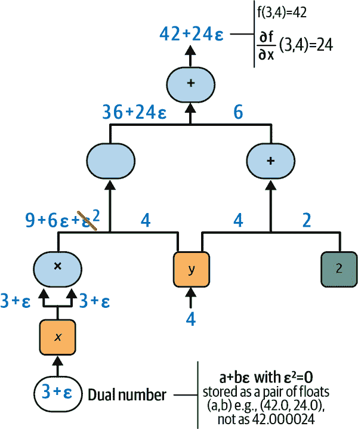
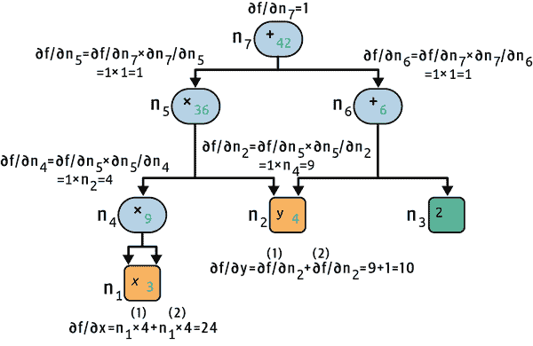

# 附录 B. 自动微分

本附录解释了 TensorFlow 的自动微分（autodiff）功能的工作原理，以及它与其他解决方案的比较。

假设您定义一个函数*f*(*x*, *y*) = *x*²*y* + *y* + 2，并且您需要其偏导数∂*f*/∂*x*和∂*f*/∂*y*，通常用于执行梯度下降（或其他优化算法）。您的主要选择是手动微分、有限差分逼近、前向自动微分和反向自动微分。TensorFlow 实现了反向自动微分，但要理解它，最好先看看其他选项。所以让我们逐个进行，从手动微分开始。

# 手动微分

计算导数的第一种方法是拿起一支铅笔和一张纸，利用您的微积分知识推导出适当的方程。对于刚刚定义的函数*f*(*x*, *y*)，这并不太难；您只需要使用五条规则：

+   常数的导数是 0。

+   *λx*的导数是*λ*（其中*λ*是一个常数）。

+   *x*^λ的导数是*λx*^(*λ*) ^– ¹，所以*x*²的导数是 2*x*。

+   函数和的导数是这些函数的导数之和。

+   *λ*倍函数的导数是*λ*乘以其导数。

从这些规则中，您可以推导出方程 B-1。

##### 方程 B-1\. *f*(*x*, *y*)的偏导数

<math display="block"><mtable displaystyle="true"><mtr><mtd columnalign="right"><mstyle scriptlevel="0" displaystyle="true"><mfrac><mrow><mi>∂</mi><mi>f</mi></mrow> <mrow><mi>∂</mi><mi>x</mi></mrow></mfrac></mstyle></mtd> <mtd columnalign="left"><mrow><mo>=</mo> <mstyle scriptlevel="0" displaystyle="true"><mfrac><mrow><mi>∂</mi><mo>(</mo><msup><mi>x</mi> <mn>2</mn></msup> <mi>y</mi><mo>)</mo></mrow> <mrow><mi>∂</mi><mi>x</mi></mrow></mfrac></mstyle> <mo>+</mo> <mstyle scriptlevel="0" displaystyle="true"><mfrac><mrow><mi>∂</mi><mi>y</mi></mrow> <mrow><mi>∂</mi><mi>x</mi></mrow></mfrac></mstyle> <mo>+</mo> <mstyle scriptlevel="0" displaystyle="true"><mfrac><mrow><mi>∂</mi><mn>2</mn></mrow> <mrow><mi>∂</mi><mi>x</mi></mrow></mfrac></mstyle> <mo>=</mo> <mi>y</mi> <mstyle scriptlevel="0" displaystyle="true"><mfrac><mrow><mi>∂</mi><mo>(</mo><msup><mi>x</mi> <mn>2</mn></msup> <mo>)</mo></mrow> <mrow><mi>∂</mi><mi>x</mi></mrow></mfrac></mstyle> <mo>+</mo> <mn>0</mn> <mo>+</mo> <mn>0</mn> <mo>=</mo> <mn>2</mn> <mi>x</mi> <mi>y</mi></mrow></mtd></mtr> <mtr><mtd columnalign="right"><mstyle scriptlevel="0" displaystyle="true"><mfrac><mrow><mi>∂</mi><mi>f</mi></mrow> <mrow><mi>∂</mi><mi>y</mi></mrow></mfrac></mstyle></mtd> <mtd columnalign="left"><mrow><mo>=</mo> <mstyle scriptlevel="0" displaystyle="true"><mfrac><mrow><mi>∂</mi><mo>(</mo><msup><mi>x</mi> <mn>2</mn></msup> <mi>y</mi><mo>)</mo></mrow> <mrow><mi>∂</mi><mi>y</mi></mrow></mfrac></mstyle> <mo>+</mo> <mstyle scriptlevel="0" displaystyle="true"><mfrac><mrow><mi>∂</mi><mi>y</mi></mrow> <mrow><mi>∂</mi><mi>y</mi></mrow></mfrac></mstyle> <mo>+</mo> <mstyle scriptlevel="0" displaystyle="true"><mfrac><mrow><mi>∂</mi><mn>2</mn></mrow> <mrow><mi>∂</mi><mi>y</mi></mrow></mfrac></mstyle> <mo>=</mo> <msup><mi>x</mi> <mn>2</mn></msup> <mo>+</mo> <mn>1</mn> <mo>+</mo> <mn>0</mn> <mo>=</mo> <msup><mi>x</mi> <mn>2</mn></msup> <mo>+</mo> <mn>1</mn></mrow></mtd></mtr></mtable></math>

对于更复杂的函数，这种方法可能变得非常繁琐，您可能会犯错。幸运的是，还有其他选择。现在让我们看看有限差分逼近。

# 有限差分逼近

回想一下函数*h*(*x*)在点*x*[0]处的导数*h*′(*x*[0])是该点处函数的斜率。更准确地说，导数被定义为通过该点*x*[0]和函数上另一点*x*的直线的斜率的极限，当*x*无限接近*x*[0]时（参见方程 B-2）。

##### 方程 B-2. 函数*h*(*x*)在点*x*[0]处的导数定义

<math display="block"><mtable displaystyle="true"><mtr><mtd columnalign="right"><mrow><msup><mi>h</mi> <mo>'</mo></msup> <mrow><mo>(</mo> <msub><mi>x</mi> <mn>0</mn></msub> <mo>)</mo></mrow></mrow></mtd> <mtd columnalign="left"><mrow><mo>=</mo> <munder><mo movablelimits="true" form="prefix">lim</mo> <mstyle scriptlevel="0" displaystyle="false"><mrow><mi>x</mi><mo>→</mo><msub><mi>x</mi> <mn>0</mn></msub></mrow></mstyle></munder> <mstyle scriptlevel="0" displaystyle="true"><mfrac><mrow><mi>h</mi><mrow><mo>(</mo><mi>x</mi><mo>)</mo></mrow><mo>-</mo><mi>h</mi><mrow><mo>(</mo><msub><mi>x</mi> <mn>0</mn></msub> <mo>)</mo></mrow></mrow> <mrow><mi>x</mi><mo>-</mo><msub><mi>x</mi> <mn>0</mn></msub></mrow></mfrac></mstyle></mrow></mtd></mtr> <mtr><mtd columnalign="left"><mrow><mo>=</mo> <munder><mo movablelimits="true" form="prefix">lim</mo> <mstyle scriptlevel="0" displaystyle="false"><mrow><mi>ε</mi><mo>→</mo><mn>0</mn></mrow></mstyle></munder> <mstyle scriptlevel="0" displaystyle="true"><mfrac><mrow><mi>h</mi><mrow><mo>(</mo><msub><mi>x</mi> <mn>0</mn></msub> <mo>+</mo><mi>ε</mi><mo>)</mo></mrow><mo>-</mo><mi>h</mi><mrow><mo>(</mo><msub><mi>x</mi> <mn>0</mn></msub> <mo>)</mo></mrow></mrow> <mi>ε</mi></mfrac></mstyle></mrow></mtd></mtr></mtable></math>

因此，如果我们想计算*f*(*x*, *y*)关于*x*在*x* = 3 和*y* = 4 处的偏导数，我们可以计算*f*(3 + *ε*, 4) - *f*(3, 4)，然后将结果除以*ε*，使用一个非常小的*ε*值。这种数值逼近导数的方法称为*有限差分逼近*，这个特定的方程称为*牛顿的差商*。以下代码正是这样做的：

```py
def f(x, y):
    return x**2*y + y + 2

def derivative(f, x, y, x_eps, y_eps):
    return (f(x + x_eps, y + y_eps) - f(x, y)) / (x_eps + y_eps)

df_dx = derivative(f, 3, 4, 0.00001, 0)
df_dy = derivative(f, 3, 4, 0, 0.00001)
```

不幸的是，结果不够精确（对于更复杂的函数来说情况会更糟）。正确的结果分别是 24 和 10，但实际上我们得到了：

```py
>>> df_dx
24.000039999805264
>>> df_dy
10.000000000331966
```

注意，要计算两个偏导数，我们至少要调用`f()`三次（在前面的代码中我们调用了四次，但可以进行优化）。如果有 1,000 个参数，我们至少需要调用`f()` 1,001 次。当处理大型神经网络时，这使得有限差分逼近方法过于低效。

然而，这种方法实现起来非常简单，是检查其他方法是否正确实现的好工具。例如，如果它与您手动推导的函数不一致，那么您的函数可能存在错误。

到目前为止，我们已经考虑了两种计算梯度的方法：手动微分和有限差分逼近。不幸的是，这两种方法都对训练大规模神经网络有致命缺陷。因此，让我们转向自动微分，从正向模式开始。

# 正向模式自动微分

图 B-1 展示了正向模式自动微分在一个更简单的函数*g*(*x*, *y*) = 5 + *xy* 上的工作原理。该函数的图在左侧表示。经过正向模式自动微分后，我们得到右侧的图，表示偏导数∂*g*/∂*x* = 0 + (0 × *x* + *y* × 1) = *y*（我们可以类似地得到关于*y*的偏导数）。

该算法将从输入到输出遍历计算图（因此称为“正向模式”）。它从叶节点获取偏导数开始。常数节点（5）返回常数 0，因为常数的导数始终为 0。变量*x*返回常数 1，因为∂*x*/∂*x* = 1，变量*y*返回常数 0，因为∂*y*/∂*x* = 0（如果我们要找关于*y*的偏导数，结果将相反）。

现在我们有了所有需要的内容，可以向上移动到函数*g*中的乘法节点。微积分告诉我们，两个函数*u*和*v*的乘积的导数是∂(*u* × *v*)/∂*x* = ∂*v*/∂*x* × *u* + *v* × ∂*u*/∂*x*。因此，我们可以构建右侧的图的大部分，表示为 0 × *x* + *y* × 1。

最后，我们可以到达函数*g*中的加法节点。如前所述，函数和的导数是这些函数的导数之和，因此我们只需要创建一个加法节点并将其连接到我们已经计算过的图的部分。我们得到了正确的偏导数：∂*g*/∂*x* = 0 + (0 × *x* + *y* × 1)。


###### 图 B-1. 正向模式自动微分

然而，这个方程可以被简化（很多）。通过对计算图应用一些修剪步骤，摆脱所有不必要的操作，我们得到一个只有一个节点的更小的图：∂*g*/∂*x* = *y*。在这种情况下，简化相当容易，但对于更复杂的函数，正向模式自动微分可能会产生一个庞大的图，可能难以简化，并导致性能不佳。

请注意，我们从一个计算图开始，正向模式自动微分产生另一个计算图。这称为*符号微分*，它有两个好处：首先，一旦导数的计算图被生成，我们可以使用它任意次数来计算给定函数的导数，无论*x*和*y*的值是多少；其次，如果需要的话，我们可以再次在结果图上运行正向模式自动微分，以获得二阶导数（即导数的导数）。我们甚至可以计算三阶导数，依此类推。

但也可以在不构建图形的情况下运行正向模式自动微分（即数值上，而不是符号上），只需在运行时计算中间结果。其中一种方法是使用*双数*，它们是形式为*a* + *bε*的奇怪但迷人的数字，其中*a*和*b*是实数，*ε*是一个无穷小数，使得*ε*² = 0（但*ε* ≠ 0）。您可以将双数 42 + 24*ε*看作类似于 42.0000⋯000024，其中有无限多个 0（但当然这只是简化，只是为了让您对双数有一些概念）。双数在内存中表示为一对浮点数。例如，42 + 24*ε*由一对(42.0, 24.0)表示。

双数可以相加、相乘等，如 Equation B-3 所示。

##### Equation B-3. 双数的一些操作

<math display="block"><mtable displaystyle="true"><mtr><mtd columnalign="left"><mrow><mi>λ</mi> <mo>(</mo> <mi>a</mi> <mo>+</mo> <mi>b</mi> <mi>ε</mi> <mo>)</mo> <mo>=</mo> <mi>λ</mi> <mi>a</mi> <mo>+</mo> <mi>λ</mi> <mi>b</mi> <mi>ε</mi></mrow></mtd></mtr> <mtr><mtd columnalign="left"><mrow><mo>(</mo> <mi>a</mi> <mo>+</mo> <mi>b</mi> <mi>ε</mi> <mo>)</mo> <mo>+</mo> <mo>(</mo> <mi>c</mi> <mo>+</mo> <mi>d</mi> <mi>ε</mi> <mo>)</mo> <mo>=</mo> <mo>(</mo> <mi>a</mi> <mo>+</mo> <mi>c</mi> <mo>)</mo> <mo>+</mo> <mo>(</mo> <mi>b</mi> <mo>+</mo> <mi>d</mi> <mo>)</mo> <mi>ε</mi></mrow></mtd></mtr> <mtr><mtd columnalign="left"><mrow><mrow><mo>(</mo> <mi>a</mi> <mo>+</mo> <mi>b</mi> <mi>ε</mi> <mo>)</mo></mrow> <mo>×</mo> <mrow><mo>(</mo> <mi>c</mi> <mo>+</mo> <mi>d</mi> <mi>ε</mi> <mo>)</mo></mrow> <mo>=</mo> <mi>a</mi> <mi>c</mi> <mo>+</mo> <mrow><mo>(</mo> <mi>a</mi> <mi>d</mi> <mo>+</mo> <mi>b</mi> <mi>c</mi> <mo>)</mo></mrow> <mi>ε</mi> <mo>+</mo> <mrow><mo>(</mo> <mi>b</mi> <mi>d</mi> <mo>)</mo></mrow> <msup><mi>ε</mi> <mn>2</mn></msup> <mo>=</mo> <mi>a</mi> <mi>c</mi> <mo>+</mo> <mrow><mo>(</mo> <mi>a</mi> <mi>d</mi> <mo>+</mo> <mi>b</mi> <mi>c</mi> <mo>)</mo></mrow> <mi>ε</mi></mrow></mtd></mtr></mtable></math>

最重要的是，可以证明*h*(*a* + *bε*) = *h*(*a*) + *b* × *h*′(*a*)*ε*，因此计算*h*(*a* + *ε*)可以一次性得到*h*(*a*)和导数*h*′(*a*)。图 B-2 显示了使用双重数计算*f*(*x*, *y*)对*x*在*x* = 3 和*y* = 4 时的偏导数（我将写为∂*f*/∂*x* (3, 4))。我们只需要计算*f*(3 + *ε*, 4)；这将输出一个双重数，其第一个分量等于*f*(3, 4)，第二个分量等于∂*f*/∂*x* (3, 4)。



###### 图 B-2\. 使用双重数进行正向模式自动微分

要计算∂*f*/∂*y* (3, 4)，我们需要再次通过图进行计算，但这次是在*x* = 3 和*y* = 4 + *ε*的情况下。

因此，正向模式自动微分比有限差分逼近更准确，但至少在输入较多而输出较少时存在相同的主要缺陷（例如在处理神经网络时）：如果有 1,000 个参数，将需要通过图进行 1,000 次传递来计算所有偏导数。这就是逆向模式自动微分的优势所在：它可以在通过图进行两次传递中计算出所有偏导数。让我们看看如何做到的。

# 逆向模式自动微分

逆向模式自动微分是 TensorFlow 实现的解决方案。它首先沿着图的正向方向（即从输入到输出）进行第一次传递，计算每个节点的值。然后进行第二次传递，这次是在反向方向（即从输出到输入）进行，计算所有偏导数。名称“逆向模式”来自于这个对图的第二次传递，在这个传递中，梯度以相反方向流动。图 B-3 代表了第二次传递。在第一次传递中，所有节点值都是从*x* = 3 和*y* = 4 开始计算的。您可以在每个节点的右下角看到这些值（例如，*x* × *x* = 9）。为了清晰起见，节点标记为*n*[1]到*n*[7]。输出节点是*n*[7]：*f*(3, 4) = *n*[7] = 42。



###### 图 B-3\. 逆向模式自动微分

这个想法是逐渐沿着图向下走，计算*f*(*x*, *y*)对每个连续节点的偏导数，直到达到变量节点。为此，逆向模式自动微分在方程 B-4 中大量依赖于*链式法则*。

##### 方程 B-4\. 链式法则

<math display="block"><mrow><mstyle scriptlevel="0" displaystyle="true"><mfrac><mrow><mi>∂</mi><mi>f</mi></mrow> <mrow><mi>∂</mi><mi>x</mi></mrow></mfrac></mstyle> <mo>=</mo> <mstyle scriptlevel="0" displaystyle="true"><mfrac><mrow><mi>∂</mi><mi>f</mi></mrow> <mrow><mi>∂</mi><msub><mi>n</mi> <mi>i</mi></msub></mrow></mfrac></mstyle> <mo>×</mo> <mstyle scriptlevel="0" displaystyle="true"><mfrac><mrow><mi>∂</mi><msub><mi>n</mi> <mi>i</mi></msub></mrow> <mrow><mi>∂</mi><mi>x</mi></mrow></mfrac></mstyle></mrow></math>

由于*n*[7]是输出节点，*f* = *n*[7]，所以∂*f* / ∂*n*[7] = 1。

让我们继续沿着图向下走到*n*[5]：当*n*[5]变化时，*f*会变化多少？答案是∂*f* / ∂*n*[5] = ∂*f* / ∂*n*[7] × ∂*n*[7] / ∂*n*[5]。我们已经知道∂*f* / ∂*n*[7] = 1，所以我们只需要∂*n*[7] / ∂*n*[5]。由于*n*[7]只是执行*n*[5] + *n*[6]的求和，我们发现∂*n*[7] / ∂*n*[5] = 1，所以∂*f* / ∂*n*[5] = 1 × 1 = 1。

现在我们可以继续到节点*n*[4]：当*n*[4]变化时，*f*会变化多少？答案是∂*f* / ∂*n*[4] = ∂*f* / ∂*n*[5] × ∂*n*[5] / ∂*n*[4]。由于*n*[5] = *n*[4] × *n*[2]，我们发现∂*n*[5] / ∂*n*[4] = *n*[2]，所以∂*f* / ∂*n*[4] = 1 × *n*[2] = 4。

这个过程一直持续到我们到达图的底部。在那一点上，我们将计算出*f*(*x*, *y*)在*x* = 3 和*y* = 4 时的所有偏导数。在这个例子中，我们发现∂*f* / ∂*x* = 24 和∂*f* / ∂*y* = 10。听起来没错！

反向模式自动微分是一种非常强大和准确的技术，特别是当输入很多而输出很少时，因为它只需要一个前向传递加上一个反向传递来计算所有输出相对于所有输入的所有偏导数。在训练神经网络时，我们通常希望最小化损失，因此只有一个输出（损失），因此只需要通过图两次来计算梯度。反向模式自动微分还可以处理不完全可微的函数，只要您要求它在可微分的点计算偏导数。

在图 B-3 中，数值结果是在每个节点上实时计算的。然而，这并不完全是 TensorFlow 的做法：相反，它创建了一个新的计算图。换句话说，它实现了*符号*反向模式自动微分。这样，只需要生成一次计算图来计算神经网络中所有参数相对于损失的梯度，然后每当优化器需要计算梯度时，就可以一遍又一遍地执行它。此外，这使得在需要时可以计算高阶导数。

###### 提示

如果您想在 C++中实现一种新类型的低级 TensorFlow 操作，并且希望使其与自动微分兼容，那么您需要提供一个函数，该函数返回函数输出相对于其输入的偏导数。例如，假设您实现了一个计算其输入平方的函数：*f*(*x*) = *x*²。在这种情况下，您需要提供相应的导数函数：*f*′(*x*) = 2*x*。
