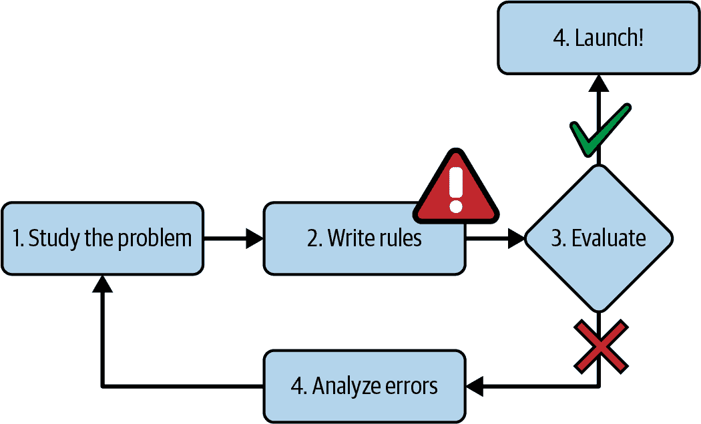
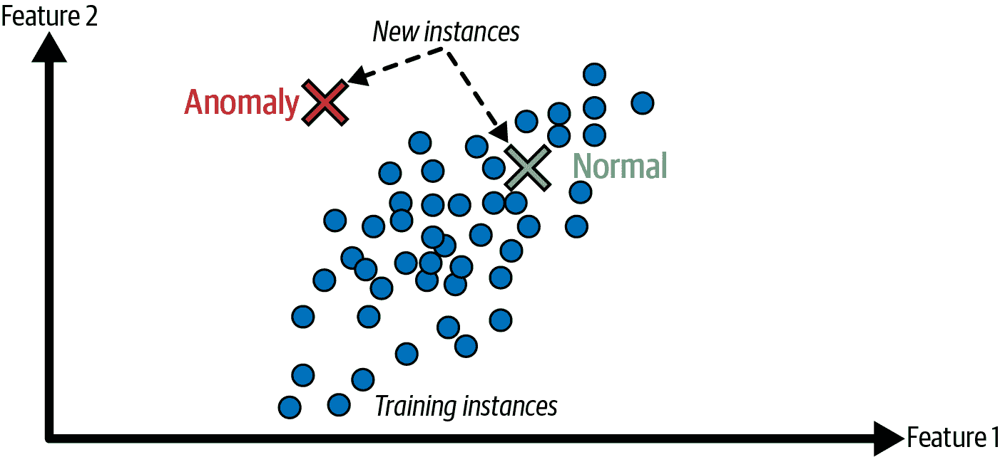
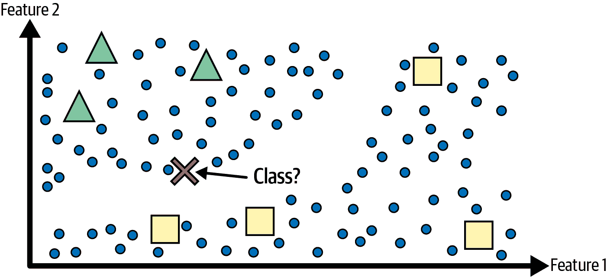
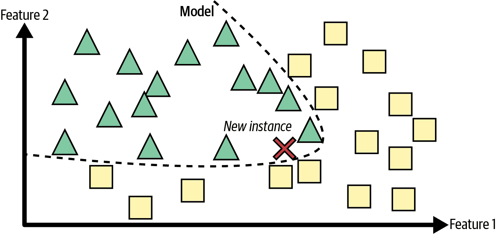
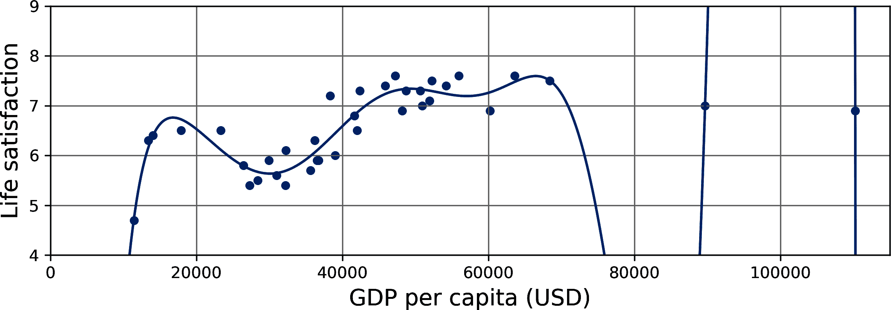
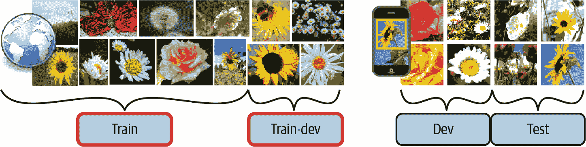

# 第一章. 机器学习景观

不久以前，如果你拿起手机让它告诉你回家的路，它可能会忽略你——人们可能会质疑你的理智。但机器学习不再是科幻小说：数十亿人每天都在使用它。而且事实是，它在一些专业应用中已经存在了几十年，例如光学字符识别（OCR）。第一个真正成为主流的 ML 应用，改善了数亿人的生活，悄然在 20 世纪 90 年代接管了世界：*垃圾邮件过滤器*。它并不完全是一个有自我意识的机器人，但从技术上讲，它确实符合机器学习的定义：它已经学得很好，以至于你很少需要标记电子邮件为垃圾邮件。然后，得益于大数据、硬件改进和几个算法创新，数百个 ML 应用紧随其后，现在默默地支持着你日常使用的数百个产品和功能：语音提示、自动翻译、图像搜索、产品推荐等等。最后，ChatGPT、Gemini（原名 Bard）、Claude、Perplexity 以及许多其他聊天机器人出现：AI 不再只是后台支持服务，它*本身就是服务本身*。

机器学习从何开始，到何为止？机器学习到某事究竟意味着什么？如果我下载了所有维基百科文章的副本，我的电脑真的学到了什么？它突然变得更聪明了吗？在本章中，我将首先阐明机器学习是什么，以及为什么你可能想使用它。

然后，在我们开始探索机器学习大陆之前，我们将先看看地图，了解主要区域和最著名的地标：监督学习与无监督学习及其变体，在线学习与批量学习，基于实例的学习与基于模型的学习。然后我们将查看典型 ML 项目的流程，讨论你可能会面临的主要挑战，并介绍如何评估和微调机器学习系统。

本章介绍了大量基础概念（以及术语）每个数据科学家都应该牢记于心。这将是一个高级概述（这是唯一一个没有太多代码的章节），所有内容都相当简单，但我的目标是确保在我们继续阅读本书的其余部分之前，一切对你来说都清晰明了。所以，拿杯咖啡，我们开始吧！

###### 小贴士

如果你已经熟悉了机器学习的基础知识，你可能想直接跳到第二章。如果你不确定，在继续之前，尝试回答本章末尾列出的所有问题。

# 什么是机器学习？

机器学习是科学（以及艺术）的编程，使计算机能够*从数据中学习*。

这里是一个稍微更普遍的定义：

> [机器学习是]研究领域，赋予计算机在没有明确编程的情况下学习的能力。
> 
> 亚瑟·萨缪尔，1959 年

以及一个更偏向工程的角度：

> 如果计算机程序在任务*T*上通过性能指标*P*从经验*E*中学习，那么它的性能会随着经验*E*的提高而提高。
> 
> 托马斯·米切尔，1997

你的垃圾邮件过滤器是一个机器学习程序，它通过提供垃圾邮件示例（由用户标记）和常规邮件示例（非垃圾邮件，也称为“ham”），可以学习标记垃圾邮件。系统用来学习的示例称为*训练集*。每个训练示例称为*训练实例*（或*样本*）。机器学习系统中学习和做出预测的部分称为*模型*。神经网络和随机森林是模型的例子。

在这种情况下，任务*T*是对新电子邮件标记垃圾邮件，经验*E*是*训练数据*，性能指标*P*需要定义；例如，你可以使用正确分类电子邮件的比率。这个特定的性能指标称为*准确率*，它通常用于分类任务（我们将在第三章中讨论几个其他指标）。

如果你只是下载所有维基百科文章的副本，你的电脑将有更多的数据，但它在任何任务上都不会突然变得更好。这并不是机器学习。

# 为什么使用机器学习？

考虑一下你将如何使用传统编程技术编写垃圾邮件过滤器（图 1-1）：

1.  首先，你会检查垃圾邮件通常看起来是什么样子。你可能会注意到一些单词或短语（如“4U”、“信用卡”、“免费”和“惊人”）在主题行中经常出现。也许你还会注意到发件人姓名、电子邮件正文和其他电子邮件部分的几个其他模式。

1.  你会为注意到的每个模式编写一个检测算法，如果你的程序检测到这些模式中的许多，就会将电子邮件标记为垃圾邮件。

1.  你会测试你的程序，并重复步骤 1 和 2，直到它足够好可以发布。



###### 图 1-1\. 传统方法

由于问题困难，你的程序可能变成一个复杂的规则长列表——很难维护。

与之相反，基于机器学习技术的垃圾邮件过滤器通过检测与正常邮件相比垃圾邮件示例中异常频繁的单词模式，自动学习哪些单词和短语是垃圾邮件的良好预测指标（图 1-2）。该程序更短，更容易维护，并且可能更准确。


###### 图 1-2\. 机器学习方法

如果垃圾邮件发送者注意到所有包含“4U”的邮件都被拦截了？他们可能会开始写“For U”。使用传统编程技术的垃圾邮件过滤器需要更新以标记“For U”邮件。如果垃圾邮件发送者继续绕过你的垃圾邮件过滤器，你可能需要永远不断地编写新的规则。

相比之下，基于机器学习技术的垃圾邮件过滤器会自动注意到“For U”在用户标记的垃圾邮件中变得异常频繁，并开始标记它们，而无需你的干预（图 1-3）。


###### 图 1-3\. 自动适应变化

另一个机器学习大放异彩的领域是那些对于传统方法来说过于复杂或者没有已知算法的问题。例如，考虑语音识别。假设你想从简单开始，编写一个能够区分“一”和“二”这两个词的程序。你可能注意到“二”这个词以高音调声音（“T”）开头，因此你可以硬编码一个算法来测量高音调声音强度，并使用这个强度来区分“一”和“二”——但显然这种技术无法扩展到成千上万由数百万不同的人在嘈杂环境中用数十种语言说出的单词。目前最好的解决方案（至少现在是这样）是编写一个能够通过大量每个单词的示例录音来自我学习的算法。

最后，机器学习可以帮助人类学习（图 1-4）。可以通过检查机器学习模型来了解它们学到了什么（尽管对于某些模型来说这可能很棘手）。例如，一旦垃圾邮件过滤器在足够的垃圾邮件上进行了训练，就可以轻松检查以揭示它认为最好的垃圾邮件预测因素的单词列表和单词组合。有时这会揭示意想不到的相关性或新趋势，从而更好地理解问题。挖掘大量数据以发现隐藏模式被称为*数据挖掘*，而机器学习在这方面表现卓越。


###### 图 1-4\. 机器学习可以帮助人类学习

总结来说，机器学习非常适合：

+   对于现有解决方案需要大量工作和维护的问题，例如长列表的规则（机器学习模型通常可以简化代码并比传统方法表现更好）

+   对于使用传统方法无法得到良好解决方案的复杂问题（最好的机器学习技术可能找到解决方案）

+   波动环境（机器学习系统可以很容易地在新的数据上重新训练，始终保持最新）

+   获取关于复杂问题和大量数据的见解

# 应用示例

让我们看看一些具体的机器学习任务示例，以及可以解决它们的技巧：

分析生产线上的产品图像以自动对其进行分类

这是图像分类，通常使用卷积神经网络（CNNs；见第十二章 cnn_chapter）或视觉转换器（见第十六章 vit_chapter）执行。

在脑部扫描中检测肿瘤

这是语义图像分割，其中图像中的每个像素都被分类（正如我们想要确定肿瘤的确切位置和形状），通常使用 CNN 或视觉转换器。

自动分类新闻文章

这是自然语言处理（NLP），更具体地说，是文本分类，可以使用循环神经网络（RNNs）和 CNNs 来解决，但转换器效果更好（见第十五章 transformer_chapter）。

自动标记讨论论坛上的冒犯性评论

这也是文本分类，使用相同的 NLP 工具。

自动总结长文档

这是一种名为文本摘要的 NLP 分支，再次使用相同的工具。

通过分析非常长的 DNA 序列来估计一个人对特定疾病的遗传风险

这样的任务需要发现非常长序列中的分散模式，这正是状态空间模型（SSMs）特别擅长的领域（见[*https://homl.info*](https://homl.info)上的“状态空间模型（SSMs）”）。

创建聊天机器人或个人助理

这涉及到许多 NLP 组件，包括自然语言理解（NLU）和问答模块。

根据许多性能指标预测您公司明年的收入

这是一个回归任务（即预测值），可以使用任何回归模型来解决，例如线性回归或多项式回归模型（见第四章 linear_models_chapter），回归支持向量机（见[*https://homl.info*](https://homl.info)上的在线附录 SVMs），回归随机森林（见第六章 ensembles_chapter），或人工神经网络（见第九章 ann_chapter）。如果您想考虑过去性能指标的时间序列，您可能希望使用 RNNs，CNNs 或转换器（见第十三章[ch13.html#rnn_chapter]到第十五章[ch15.html#transformer_chapter]）。

使您的应用能够响应语音命令

这是语音识别，需要处理音频样本。由于它们是长而复杂的序列，通常使用 RNNs，CNNs 或转换器（见第十三章[ch13.html#rnn_chapter]到第十五章[ch15.html#transformer_chapter]）进行处理。

检测信用卡欺诈

这就是异常检测，可以使用隔离森林、高斯混合模型（参见第八章）或自编码器（参见第十八章）来解决。

根据客户的购买行为进行客户细分，以便你可以为每个细分设计不同的营销策略

这就是聚类，可以使用*k*-means、DBSCAN 等方法实现（参见第八章）。

以清晰和有洞察力的图表来表示复杂、高维的数据集

这就是数据可视化，通常涉及降维技术（参见第七章）。

根据客户的过去购买推荐可能感兴趣的产品

这是一个推荐系统。一种方法是将过去的购买记录（以及关于客户的其它信息）输入到一个人工神经网络（参见第九章），并让它输出最可能的下一个购买。这个神经网络通常会在所有客户的过去购买序列上进行训练。

为游戏构建一个智能机器人

这通常是通过强化学习（RL；参见第十九章）来解决的，强化学习是机器学习的一个分支，它训练代理（如机器人）选择那些能够在给定环境中（如游戏）最大化其奖励的行动（例如，机器人每次玩家失去一些生命值时都会获得奖励），这就像科学家在训练数据中检测模式并构建预测模型时所做的那样。著名的 AlphaGo 程序就是使用强化学习来击败围棋世界冠军的。

这个列表可以一直继续下去，但希望这能给你一个关于机器学习可以解决的任务的广阔范围和复杂性的感觉，以及你将用于每个任务的技巧类型。

# 机器学习系统的类型

由于机器学习系统类型繁多，根据以下标准对它们进行广泛分类是有用的：

+   它们在训练过程中的指导方式（监督学习、无监督学习、半监督学习、自监督学习以及其他）

+   它们是否能够即时增量学习（在线学习与批量学习）

+   它们是否通过简单地比较新数据点与已知数据点来工作，或者通过在训练数据中检测模式并构建预测模型来工作，就像科学家所做的那样（基于实例的学习与基于模型的学习）

这些标准不是互斥的；你可以以任何你喜欢的方式将它们结合起来。例如，一个最先进的垃圾邮件过滤器可能会使用深度神经网络模型即时学习，该模型使用人类提供的垃圾邮件和正常邮件的示例进行训练；这使得它成为一个在线的、基于模型的、监督学习系统。

让我们更仔细地看看这些标准。

## 训练监督

根据在训练期间获得的监督量及其类型，可以将机器学习系统进行分类。有许多类别，但我们将讨论主要类别：监督学习、无监督学习、自监督学习、半监督学习和强化学习。

### 监督学习

在 *监督学习* 中，你提供给算法的训练集包括期望的解决方案，称为 *标签* (图 1-5)。


###### 图 1-5\. 用于垃圾邮件分类的标记训练集（监督学习的一个示例）

一个典型的监督学习任务是 *分类*。垃圾邮件过滤器是此类任务的一个好例子：它使用许多带有其 *类别*（垃圾邮件或正常邮件）的示例电子邮件进行训练，并且必须学习如何对新电子邮件进行分类。

另一个典型的任务是根据一组 *特征*（如里程、年龄、品牌等）预测一个 *目标* 数值，例如汽车的价格。这类任务被称为 *回归* (图 1-6)。⁠^(1) 为了训练系统，你需要提供许多汽车的例子，包括它们的特征和目标（即价格）。

注意，一些回归模型也可以用于分类，反之亦然。例如，*逻辑回归* 常用于分类，因为它可以输出一个与属于给定类别的概率相对应的值（例如，有 20% 的可能性是垃圾邮件）。


###### 图 1-6\. 回归问题：给定输入特征（通常有多个输入特征，有时还有多个输出值）预测一个值

###### 备注

在监督学习中，*目标* 和 *标签* 通常被视为同义词，但 *目标* 在回归任务中更常见，而 *标签* 在分类任务中更常见。此外，*特征* 有时也被称为 *预测器* 或 *属性*。这些术语可能指单个样本（例如，“这辆车的里程特征等于 15,000”）或所有样本（例如，“里程特征与价格高度相关”）。

### 无监督学习

在 *无监督学习* 中，正如你可能猜到的，训练数据是无标签的。系统试图在没有教师的情况下学习。

例如，假设你有很多关于你的博客访客的数据。你可能想运行一个*聚类*算法来尝试检测相似访客的组（图 1-7）。特征可能包括用户的年龄组、他们的地区、他们的兴趣、会话的持续时间等等。在任何时候，你都没有告诉算法访客属于哪个组：它在不依赖你的帮助的情况下找到这些联系。例如，它可能会注意到 40%的访客是喜欢漫画书的青少年，他们通常在放学后阅读你的博客，而 20%是喜欢科幻的成年人，他们在周末访问。如果你使用*层次聚类*算法，它也可能将每个组进一步细分为更小的组。这可能有助于你针对每个组的目标帖子。


###### 图 1-7\. 聚类

*可视化*算法也是无监督学习的良好例子：你向它们提供大量复杂且未标记的数据，它们会输出数据的 2D 或 3D 表示，这些表示可以轻松绘制（图 1-8）。这些算法试图尽可能多地保留结构（例如，尝试在输入空间中保持不同的簇在可视化中不重叠），这样你就可以理解数据的组织方式，也许可以识别出未预料到的模式。

一个相关的任务是*降维*，其目标是简化数据而不丢失太多信息。完成此任务的一种方法是将几个相关特征合并为一个。例如，一辆车的里程数可能与它的年龄高度相关，因此降维算法将它们合并为一个特征，该特征代表车辆的磨损情况。这被称为*特征提取*。

###### 小贴士

在将训练数据输入另一个机器学习算法（如监督学习算法）之前，尝试使用降维算法减少训练数据中的维度通常是一个好主意。这将运行得更快，数据将占用更少的磁盘和内存空间，在某些情况下，它也可能表现得更好。


###### 图 1-8\. t-SNE 可视化示例，突出显示语义簇⁠^(2)

另一个重要的无监督任务是*异常检测*——例如，检测异常的信用卡交易以防止欺诈，捕捉制造缺陷，或在将数据输入另一个学习算法之前自动从数据集中移除异常值。系统在训练期间主要显示正常实例，因此它学会了识别它们；然后，当它看到一个新的实例时，它可以判断它看起来是否像正常的一个，或者它是否可能是一个异常（参见图 1-9）。一个非常类似的任务是*新颖性检测*：它的目标是检测出与训练集中所有实例都不同的新实例。这要求训练集非常“干净”，没有任何你希望算法检测的实例。例如，如果你有成千上万只狗的图片，其中 1%的图片代表吉娃娃，那么新颖性检测算法不应将新的吉娃娃图片视为新颖性。另一方面，异常检测算法可能会将这些狗视为非常罕见且与其他狗不同，因此它们可能会将它们分类为异常（对吉娃娃没有冒犯之意）。



###### 图 1-9\. 异常检测

最后，另一个常见的无监督任务是*关联规则学习*，其目标是深入大量数据，发现属性之间的有趣关系。例如，假设你拥有一家超市。对你的销售日志运行关联规则可能会揭示出购买烧烤酱和薯片的人也倾向于购买牛排。因此，你可能想要将这些商品放置在彼此附近。

### 半监督学习

由于标注数据通常耗时且成本高昂，你通常会拥有大量的未标注实例，而标注实例却很少。一些算法可以处理部分标注的数据。这被称为*半监督学习*(图 1-10)。



###### 图 1-10\. 具有两个类别（三角形和正方形）的半监督学习：未标注的示例（圆圈）帮助将新的实例（交叉）分类为三角形类别，而不是正方形类别，尽管它更接近标注的正方形。

一些照片托管服务，如 Google Photos，是这方面的好例子。一旦你将所有家庭照片上传到该服务，它就会自动识别出同一个人 A 出现在照片 1、5 和 11 中，而另一个人 B 出现在照片 2、5 和 7 中。这是算法的无监督部分（聚类）。现在系统需要的只是你告诉它这些人的身份。只需为每个人添加一个标签⁠^(3)，它就能命名每张照片中的每个人，这对于搜索照片非常有用。

大多数半监督学习算法是无监督和监督算法的组合。例如，可以使用聚类算法将相似实例分组在一起，然后每个未标记的实例都可以用其簇中最常见的标签进行标记。一旦整个数据集被标记，就可以使用任何监督学习算法。

### 自监督学习

另一种机器学习方法涉及从完全未标记的数据集中生成一个完全标记的数据集。同样，一旦整个数据集被标记，任何监督学习算法都可以使用。这种方法被称为*自监督学习*。

例如，如果你有一个大量未标记图像的数据集，你可以随机遮挡每张图像的一小部分，然后训练一个模型来恢复原始图像（图 1-11）。在训练过程中，遮挡图像被用作模型的输入，原始图像被用作标签。


###### 图 1-11\. 自监督学习示例：输入（左）和目标（右）

结果模型本身可能非常有用——例如，修复损坏的图像或从图片中擦除不需要的对象。但通常情况下，使用自监督学习训练的模型并不是最终目标。你通常会想要调整和微调模型以适应不同的任务——一个你真正关心的任务。

例如，假设你真正想要的是一个宠物分类模型：给定任何宠物的图片，它将告诉你它属于哪个物种。如果你有一大批未标记的宠物照片数据集，你可以先通过自监督学习训练一个图像修复模型。一旦它表现良好，它应该能够区分不同的宠物物种：当它修复一张被遮蔽脸部的猫的图像时，它必须知道不要添加狗的脸。假设你的模型架构允许这样做（大多数神经网络架构都是这样），那么你可以调整模型，使其预测宠物物种而不是修复图像。最后一步是在标记的数据集上微调模型：模型已经知道猫、狗和其他宠物物种看起来是什么样子，所以这一步只需要让模型学习它已知的物种和我们所期望的标签之间的映射。

###### 注意

将知识从一个任务转移到另一个任务称为*迁移学习*，它是今天机器学习中最重要的一项技术，尤其是在使用*深度神经网络*（即由许多神经元层组成的神经网络）时。我们将在第二部分中详细讨论这一点。

正如我们在第十五章中将会看到的，大型语言模型（LLMs）是以非常相似的方式进行训练的，即在巨大的文本语料库中随机遮蔽一些单词，并训练模型预测缺失的单词。这个大型预训练模型随后可以被微调以适应各种应用，从情感分析到聊天机器人。

有些人认为自监督学习是未监督学习的一部分，因为它处理的是完全未标记的数据集。但自监督学习在训练过程中使用了（生成的）标签，所以在某种程度上它更接近监督学习。而“未监督学习”这个术语通常用于处理诸如聚类、降维或异常检测等任务，而自监督学习则专注于与监督学习相同的目标：主要是分类和回归。简而言之，最好将自监督学习视为一个独立的类别。

### 强化学习

*强化学习*是一个完全不同的概念。在这个背景下，学习系统被称为*智能体*，它可以观察环境，选择并执行动作，并获得*奖励*（或者以负奖励形式的*惩罚*，如图 1-12 所示）。然后它必须自己学习最佳策略，即*策略*，以在一段时间内获得最多的奖励。策略定义了智能体在给定情况下应该选择什么动作。


###### 图 1-12\. 强化学习

例如，许多机器人实现强化学习算法来学习如何行走。DeepMind 的 AlphaGo 程序也是强化学习的良好例子：它在 2017 年 5 月成为头条新闻，当时它击败了当时世界排名第一的棋手柯洁。它通过分析数百万场比赛并与之进行多轮比赛来学习其获胜策略。请注意，在对冠军的比赛期间，学习被关闭；AlphaGo 只是在应用它所学的策略。正如你将在下一节中看到的，这被称为*离线学习*。

## 批量学习与在线学习

用于对机器学习系统进行分类的另一个标准是系统是否可以从传入的数据流中增量学习。例如，随机森林（见第六章）只能从头开始使用完整的数据集进行训练——这被称为批量学习——而其他模型可以一次训练一批数据，例如，使用*梯度下降*（见第四章）——这被称为在线学习。

### 批量学习

在*批量学习*中，系统必须使用所有可用数据进行训练。这通常需要大量的时间和计算资源，因此通常是在离线状态下进行的。首先训练系统，然后将其投入生产并运行，不再进行学习；它只是应用它所学的。这被称为*离线学习*。

不幸的是，模型的表现往往会随着时间的推移而缓慢下降，仅仅是因为世界在继续演变，而模型保持不变。这种现象通常被称为*数据漂移*（或*模型退化*）。解决方案是定期使用最新的数据重新训练模型。你需要多久做一次取决于用例：如果模型分类猫和狗的图片，其性能会非常缓慢地下降，但如果模型处理快速演变的系统，例如对金融市场进行预测，那么它很可能会迅速下降。

###### 警告

即使是训练用于分类猫和狗图片的模型，也可能需要定期重新训练，这并不是因为猫和狗会一夜之间发生变异，而是因为相机不断变化，包括图像格式、清晰度、亮度和尺寸比。此外，人们可能明年会喜欢不同的品种，或者他们可能会决定给他们的宠物戴上小小的帽子——谁知道呢？

如果你希望批量学习系统了解新的数据（例如新的垃圾邮件类型），你需要从头开始使用完整的数据集（不仅仅是新数据，还包括旧数据）训练系统的新版本，然后替换旧模型。幸运的是，训练、评估和部署机器学习系统的整个过程可以自动化（如我们在图 1-3 中看到），因此即使是批量学习系统也可以适应变化。只需根据需要更新数据并从头开始训练系统的新版本即可。

这个解决方案很简单，通常效果很好，但使用全部数据集进行训练可能需要很多小时，所以你通常会每隔 24 小时或甚至每周只训练一个新的系统。如果你的系统需要适应快速变化的数据（例如，预测股价），那么你需要一个更反应灵敏的解决方案。

此外，在全部数据集上进行训练需要大量的计算资源（CPU、内存空间、磁盘空间、磁盘 I/O、网络 I/O 等）。如果你有大量数据，并且自动化你的系统每天从头开始训练，这最终会花费你很多钱。如果数据量巨大，并且你的系统必须始终是最新的，那么甚至可能无法使用批量学习。

最后，如果你的系统需要能够自主学习并且资源有限（例如，智能手机应用程序或火星漫游车），那么携带大量训练数据并且每天花费大量资源进行数小时训练将是一个障碍。

在所有这些情况下，更好的选择是使用能够增量学习的算法。

### 在线学习

在*在线学习*中，通过按顺序向系统提供数据实例（单独或以称为*小批量*的小组形式）来增量训练系统。每个学习步骤都很快且成本低，因此系统可以实时学习新数据，随着数据的到来（参见图 1-13）。最常用的在线算法是梯度下降，但也有其他几种。


###### 图 1-13\. 在在线学习中，模型被训练并投入生产，然后随着新数据的到来持续学习

在线学习对于需要快速适应变化的系统非常有用（例如，检测股市中的新模式）。如果你拥有有限的计算资源，这也是一个好的选择；例如，如果模型是在移动设备上训练的。

最重要的是，在线学习算法可以用来训练那些无法装入一台机器内存的大型数据集（这被称为*离核学习*）。算法加载部分数据，在该数据上运行一个训练步骤，然后重复这个过程，直到运行完所有数据（参见图 1-14）。


###### 图 1-14\. 使用在线学习处理大量数据集

在线学习系统的一个重要参数是它们应该多快适应变化的数据：这被称为**学习率**。如果你设置一个高的学习率，那么你的系统将迅速适应新的数据，但它也会倾向于快速忘记旧数据：这被称为**灾难性遗忘**（或**灾难性干扰**）。你不想一个垃圾邮件过滤器只标记它所展示的最新类型的垃圾邮件！相反，如果你设置一个低的学习率，系统将具有更多的惯性；也就是说，它将学习得更慢，但它对新的数据中的噪声或非代表性数据点的序列（异常值）的敏感性也会降低。

###### 警告

核外学习通常是在线下的（即不在实时系统上），所以**在线学习**这个名字可能会让人困惑。把它想作**增量学习**。此外，小批量通常只被称为“批量”，所以**批量学习**也是一个让人困惑的名字。把它想作从头开始在完整数据集上学习。

在线学习的一个大挑战是，如果向系统输入了坏数据，系统的性能将下降，可能很快（取决于数据质量和学习率）。如果是一个实时系统，你的客户会注意到。例如，坏数据可能来自一个错误（例如，机器人上的一个故障传感器），或者可能来自试图操纵系统的人（例如，向搜索引擎发送垃圾邮件以试图在搜索结果中排名靠前）。为了降低这种风险，你需要密切监控你的系统，并在检测到性能下降时及时关闭学习（并可能恢复到之前的工作状态）。你可能还想要监控输入数据，并对异常数据做出反应；例如，使用异常检测算法（见第八章第八章）。

## 基于实例学习与基于模型学习

另一种对机器学习系统进行分类的方法是它们如何**泛化**。大多数机器学习任务都是关于做出预测。这意味着给定一些训练示例，系统需要能够对它以前从未见过的示例做出良好的预测（泛化）。在训练数据上有一个好的性能指标是好的，但不足以；真正的目标是能够在新的实例上表现良好。

泛化的两种主要方法是基于实例的学习和基于模型的学习。

### 基于实例的学习

可能最简单的一种学习方法就是死记硬背。如果你用这种方法创建一个垃圾邮件过滤器，它只会标记所有与用户已经标记的邮件相同的邮件——这不是最差的方法，但绝对不是最好的。

除了标记与已知垃圾邮件完全相同的电子邮件外，你的垃圾邮件过滤器还可以编程为标记与已知垃圾邮件非常相似的电子邮件。这需要两个电子邮件之间的**相似度度量**。两个电子邮件之间的（非常基础的）相似度度量可以是计算它们共有的单词数量。如果一封电子邮件与已知垃圾邮件有大量共同单词，系统就会将其标记为垃圾邮件。

这被称为**基于实例的学习**：系统通过记忆学习示例，然后通过使用相似度度量将它们与学习到的示例（或它们的子集）进行比较来推广到新的案例。例如，在图 1-15 中，新实例将被分类为三角形，因为大多数最相似的实例属于该类别。

基于实例的学习在小型数据集上通常表现良好，特别是如果数据不断变化，但它扩展性不佳：它需要在生产中部署整个训练集的副本；进行预测需要搜索相似的实例，这可能相当慢；并且它不适用于高维数据，如图像。


###### 图 1-15。基于实例的学习：在这个例子中，我们考虑训练集中三个最近邻的类别

### 基于模型的学习和典型的机器学习工作流程

从一组示例中推广的另一种方法是构建这些示例的模型，然后使用该模型进行预测。这被称为**基于模型的学习**（图 1-16）。



###### 图 1-16。基于模型的学习

例如，假设你想知道金钱是否能让人快乐，那么你可以从[经合组织网站](https://www.oecdbetterlifeindex.org)下载更好的生活指数数据，以及[世界银行统计数据](https://ourworldindata.org)关于人均国内生产总值（GDP）。然后你将这两个表连接起来，并按人均 GDP 排序。表 1-1 显示了你可以得到的部分内容。

表 1-1。金钱能让人更快乐吗？

| 国家 | 人均 GDP（美元） | 生活满意度 |
| --- | --- | --- |
| 土耳其 | 28,384 | 5.5 |
| 匈牙利 | 31,008 | 5.6 |
| 法国 | 42,026 | 6.5 |
| 美国 | 60,236 | 6.9 |
| 新西兰 | 42,404 | 7.3 |
| 澳大利亚 | 48,698 | 7.3 |
| 丹麦 | 55,938 | 7.6 |

让我们绘制这些国家的数据图（图 1-17）。


###### 图 1-17。你在这里看到了趋势吗？

这里似乎确实存在一种趋势！尽管数据是*噪声的*（即，部分是随机的），但看起来随着人均国民生产总值的增加，生活满意度或多或少呈线性增长。因此，你决定将生活满意度建模为人均国民生产总值的线性函数（你假设任何偏离该线的偏差只是随机噪声）。这一步被称为*模型选择*：你选择了一个只包含一个属性，即人均国民生产总值的*线性模型*（方程式 1-1）。

##### 方程式 1-1\. 一个简单的线性模型

<mrow><mtext>生活满意度</mtext> <mo>=</mo> <msub><mi>θ</mi> <mn>0</mn></msub> <mo>+</mo> <msub><mi>θ</mi> <mn>1</mn></msub> <mo>×</mo> <mtext>人均国民生产总值</mtext></mrow>

这个模型有两个*模型参数*，*θ*[0] 和 *θ*[1]。⁠^(4) 通过调整这些参数，你可以使你的模型表示任何线性函数，如图图 1-18 所示。


###### 图 1-18\. 几个可能的线性模型

在你能够使用你的模型之前，你需要定义参数值 *θ*[0] 和 *θ*[1]。你如何知道哪些值会使你的模型表现最佳？为了回答这个问题，你需要指定一个性能指标。你可以定义一个*效用函数*（或*适应函数*），它衡量你的模型有多好，或者你可以定义一个*成本函数*（也称为*损失函数*），它衡量它有多坏。对于线性回归问题，人们通常使用一个衡量线性模型预测与训练示例之间距离的成本函数；目标是使这个距离最小化。

这就是线性回归算法发挥作用的地方：你给它提供你的训练示例，然后它找到使线性模型最佳拟合你的数据的参数。这被称为*训练*模型。在我们的情况下，算法发现最佳参数值是*θ*[0] = 3.75 和 *θ*[1] = 6.78 × 10^(–5)。

###### 警告

令人困惑的是，“模型”一词可以指代*模型类型*（例如，线性回归），一个*完全指定的模型架构*（例如，一个输入和一个输出的线性回归），或者一个*最终训练好的模型*，准备用于预测（例如，一个输入和一个输出的线性回归，使用 *θ*[0] = 3.75 和 *θ*[1] = 6.78 × 10^(–5)）。模型选择包括选择模型类型并完全指定其架构。训练一个模型意味着运行一个算法来找到将使模型最佳拟合训练数据的模型参数，并希望在新数据上做出良好的预测。

现在这个模型尽可能紧密地拟合了训练数据（对于线性模型），正如你在图 1-19 中可以看到的那样。


###### 图 1-19。最佳拟合训练数据的线性模型

您终于准备好运行模型进行预测了。例如，假设您想知道波多黎各人的幸福感如何，而经合组织的数据没有给出答案。幸运的是，您可以使用您的模型进行良好的预测：您查找波多黎各的人均 GDP，找到$33,442，然后应用您的模型，发现生活满意度可能大约在 3.75 + 33,442 × 6.78 × 10^(–5) = 6.02。

为了激发您的兴趣，示例 1-1 展示了加载数据、将输入`X`与标签`y`分开、创建散点图进行可视化和训练线性模型并做出预测的 Python 代码。⁠^(5)

##### 示例 1-1。使用 Scikit-Learn 训练和运行线性模型

```py
import matplotlib.pyplot as plt
import numpy as np
import pandas as pd
from sklearn.linear_model import LinearRegression

# Download and prepare the data
data_root = "https://github.com/ageron/data/raw/main/"
lifesat = pd.read_csv(data_root + "lifesat/lifesat.csv")
X = lifesat[["GDP per capita (USD)"]].values
y = lifesat[["Life satisfaction"]].values

# Visualize the data
lifesat.plot(kind='scatter', grid=True,
             x="GDP per capita (USD)", y="Life satisfaction")
plt.axis([23_500, 62_500, 4, 9])
plt.show()

# Select a linear model
model = LinearRegression()

# Train the model
model.fit(X, y)

# Make a prediction for Puerto Rico
X_new = [[33_442.8]]  # Puerto Rico' GDP per capita in 2020
print(model.predict(X_new)) # outputs [[6.01610329]]
```

###### 注意

如果您使用的是基于实例的学习算法，您会发现波兰的人均 GDP 与波多黎各最接近（$32,238），而经合组织的数据告诉我们波兰人的生活满意度是 6.1，因此您也会预测波多黎各的生活满意度为 6.1。如果您稍微放大视角，看看下一个最接近的两个国家，您会发现葡萄牙的生活满意度为 5.4，爱沙尼亚的生活满意度为 5.7。这三个值的平均值为 5.73，略低于您基于模型的预测。这个简单的算法被称为*k-最近邻回归*（在这个例子中，*k* = 3）。

在之前的代码中将线性回归模型替换为*k-最近邻回归*与替换以下这些行一样简单：

```py
from sklearn.linear_model import LinearRegression
model = LinearRegression()
```

与这两个：

```py
from sklearn.neighbors import KNeighborsRegressor
model = KNeighborsRegressor(n_neighbors=3)
```

如果一切顺利，您的模型将做出良好的预测。如果不顺利，您可能需要使用更多的属性（就业率、健康、空气污染等）、获取更多或更好的训练数据，或者可能需要选择一个更强大的模型（例如，多项式回归模型）。

总结如下：

+   您已经研究了数据。

+   您已选择了一个模型。

+   您在训练数据上训练了它（即，学习算法搜索最小化成本函数的模型参数值）。

+   最后，您将模型应用于对新案例进行预测（这被称为*推理*），希望这个模型能够很好地泛化。

这就是典型的机器学习项目看起来像什么。在第二章中，您将通过从头到尾完成一个项目来亲身体验这一点。

我们讨论了许多机器学习系统的类别，但这个领域还有更多！例如，*集成学习*涉及训练多个模型并将它们的个别预测组合成改进的预测（见第六章）；*联邦学习*是一种去中心化的方法，模型在多个设备（例如，智能手机）上训练，并针对每个用户进行调整，而不交换原始数据，从而保护用户的隐私；*元学习*是一种学习如何快速学习新任务的方法，模型用最少的数据学习。而且还有更多！图 1-20 总结了我们迄今为止讨论的机器学习系统的各种分类。


###### 图 1-20. 机器学习类别概述

到目前为止，我们已经覆盖了很多内容：你现在知道机器学习的真正含义，为什么它有用，一些最常见的机器学习系统类别是什么，以及一个典型项目的工作流程是什么样的。现在让我们看看在学习过程中可能出错的地方，以及这些错误如何阻止你做出准确的预测。

# 机器学习的主要挑战

简而言之，由于你的主要任务是选择一个模型并在某些数据上对其进行训练，可能出现的问题有两种：“模型不佳”和“数据不佳”。让我们先从数据不佳的例子开始。

## 训练数据量不足

对于一个学步儿童来说，要学习苹果是什么，你只需要指着苹果说“苹果”（可能需要重复这个程序几次）。现在孩子能够识别各种颜色和形状的苹果。天才。

机器学习还没有完全达到这个水平；对于大多数机器学习算法来说，需要大量的数据才能正常工作。即使是非常简单的问题，通常也需要成千上万的例子，而对于复杂问题，如图像或语音识别，你可能需要数百万个例子（除非你可以重用现有模型的部分，即迁移学习）。

## 非代表性训练数据

为了能够很好地泛化，你的训练数据必须能够代表你想要泛化的新案例。这无论你使用基于实例的学习还是基于模型的学习都是正确的。

例如，你之前用于训练线性模型的国家的集合并不完全具有代表性；它不包含人均 GDP 低于 23,500 美元或高于 62,500 美元的任何国家。图 1-22 显示了添加此类国家后的数据看起来是什么样子。

如果你在这个数据上训练一个线性模型，你会得到实线，而旧模型由虚线表示。正如你所见，添加几个缺失的国家不仅会显著改变模型，而且清楚地表明这样一个简单的线性模型可能永远不会很好地工作。似乎非常富裕的国家并不比中等富裕的国家更快乐（事实上，它们似乎稍微不快乐！），反之，一些贫穷的国家似乎比许多富裕的国家更快乐。

通过使用一个不具有代表性的训练集，你训练了一个不太可能做出准确预测的模型，尤其是对于非常贫穷和非常富裕的国家。

使用一个能代表你想要推广的案例的训练集至关重要。这通常比听起来更难：如果样本太小，你将会有*抽样噪声*（即由于偶然性而产生的非代表性数据），但即使是非常大的样本也可能不具有代表性，如果抽样方法有缺陷。这被称为*抽样偏差*。


###### 图 1-22\. 更具代表性的训练样本

## 低质量数据

显然，如果你的训练数据充满了错误、异常值和噪声（例如，由于测量质量差），这将使系统更难检测到潜在的模式，因此你的系统不太可能表现良好。花时间清理你的训练数据通常是值得的。事实上，大多数数据科学家都会花大量时间做这件事。以下是一些你想要清理训练数据的例子：

+   如果一些实例明显是异常值，简单地丢弃它们或尝试手动修复错误可能会有所帮助。

+   如果一些实例缺少一些特征（例如，5%的客户没有指定他们的年龄），你必须决定你是否想完全忽略这个属性，忽略这些实例，填充缺失值（例如，用中位数年龄），或者训练一个带有该特征的模型和一个不带该特征的模型。

## 不相关特征

正如俗话所说：垃圾进，垃圾出。如果你的训练数据包含足够的相关特征而不是太多不相关特征，你的系统才能具备学习能力。机器学习项目成功的关键部分是制定一套好的特征进行训练。这个过程称为*特征工程*，包括以下步骤：

+   *特征选择*（在现有特征中选择最有用的特征进行训练）

+   *特征提取*（将现有特征结合以产生更有用的一个——如我们之前所见，降维算法可以帮助）

+   通过收集新数据创建新特征

现在我们已经看了许多不良数据的例子，让我们看看几个不良算法的例子。

## 过度拟合训练数据

假设你正在访问一个外国国家，出租车司机骗了你。你可能会想当然地说，那个国家的*所有*出租车司机都是小偷。过度概括是我们人类经常做的事情，而且不幸的是，如果我们不小心，机器也可能陷入同样的陷阱。在机器学习中，这被称为*过度拟合*：这意味着模型在训练数据上表现良好，但推广能力不强。

图 1-23 展示了一个高度多项式生活满意度模型过度拟合训练数据的示例。尽管它在训练数据上的表现比简单的线性模型要好得多，但你真的会相信它的预测吗？



###### 图 1-23\. 过度拟合训练数据

比如深度神经网络这样的复杂模型可以在数据中检测到微妙的模式，但如果训练集噪声较大，或者如果它太小，这会引入采样噪声，那么模型很可能会检测到噪声本身中的模式（如在出租车司机示例中）。显然，这些模式不会推广到新的实例。例如，假设你给你的生活满意度模型提供了许多更多的属性，包括诸如国家名称这样的非信息性属性。在这种情况下，一个复杂的模型可能会检测到像所有在训练数据中名字中带有*w*的国家生活满意度都大于 7 这样的模式：新西兰（7.3）、挪威（7.6）、瑞典（7.3）和瑞士（7.5）。你有多自信这个*w*-满意度规则可以推广到卢旺达或津巴布韦？显然，这种模式是由于训练数据中的纯偶然性而发生的，但模型无法判断一个模式是真实的还是仅仅是数据噪声的结果。

###### 警告

过度拟合发生在模型相对于训练数据的数量和噪声程度过于复杂的情况下，因此它开始学习训练数据中的随机模式。以下是一些可能的解决方案：

+   通过选择具有较少参数的模型（例如，线性模型而不是高次多项式模型）、减少训练数据中的属性数量或约束模型来简化模型。

+   收集更多的训练数据。

+   减少训练数据中的噪声（例如，修复数据错误和移除异常值）。

通过约束模型使其更简单并降低过拟合的风险称为*正则化*。例如，我们之前定义的线性模型有两个参数，*θ*[0]和*θ*[1]。这给学习算法提供了两个*自由度*来调整模型以适应训练数据：它可以调整线的**高度**（*θ*[0]）和**斜率**（*θ*[1]）。如果我们强制*θ*[1] = 0，算法将只有一个自由度，并且将很难正确拟合数据：它所能做的就是移动线以尽可能接近训练实例，因此它最终会位于平均值附近。确实是一个非常简单的模型！如果我们允许算法修改*θ*[1]，但强制它保持较小，那么学习算法实际上将具有介于一个和两个自由度之间。它将产生一个比两个自由度更简单但比一个自由度更复杂的模型。你希望找到在完美拟合训练数据和保持模型足够简单以确保它能够很好地泛化之间的正确平衡。

图 1-24 展示了三个模型。虚线代表原始模型，该模型是在代表圆圈（不包括代表方形的各国）的国家上训练的，实线是我们用所有国家（圆圈和方形）训练的第二模型，而虚线是使用与第一个模型相同数据但带有正则化约束的模型。你可以看到正则化迫使模型具有更小的斜率：这个模型不如第一个模型拟合训练数据（圆圈），但它实际上对新例子（方形）的泛化能力更好。


###### 图 1-24\. 正则化降低了过拟合的风险

在学习过程中应用正则化的程度可以通过一个*超参数*来控制。超参数是学习算法的参数（而不是模型的参数）。因此，它不受学习算法本身的影响；它必须在训练之前设置，并在训练过程中保持不变。如果你将正则化超参数设置得非常大，你将得到一个非常平缓的模型（斜率接近零）；学习算法几乎肯定不会过拟合训练数据，但它不太可能找到好的解决方案。调整超参数是构建机器学习系统的重要部分（你将在下一章看到一个详细的例子）。

## 对训练数据进行欠拟合

如你所猜，**欠拟合**是过拟合的反面：它发生在你的模型太简单，无法学习数据的潜在结构时。例如，生活满意度的线性模型容易欠拟合；现实世界比模型更复杂，所以其预测必然是不准确的，即使在训练示例上也是如此。

这里是解决这个问题的主要选项：

+   选择一个更强大的模型，具有更多参数。

+   向学习算法提供更好的特征（特征工程）。

+   减少对模型的限制（例如通过减少正则化超参数）。

## 部署问题

即使你有一个大而干净的数据集，并且你设法训练了一个既不过拟合也不欠拟合数据的美丽模型，你仍然可能在部署期间遇到问题：例如，模型可能太复杂而难以维护，或者太大而无法适应内存，或者太慢，或者它可能没有正确扩展，它可能有安全漏洞，如果你不经常更新它，它可能会过时等。

简而言之，机器学习项目不仅仅是数据和模型。然而，处理这些操作问题所需的技能集与数据建模所需的技能集相当不同，这就是为什么公司通常有一个专门的 MLOps 团队（机器学习运营）来处理这些问题。

## 退一步

到现在为止，你对机器学习已经了解很多。然而，我们经历了这么多概念，你可能感到有些迷茫，所以让我们退一步，看看大局：

+   机器学习是关于通过从数据中学习来使机器在某个任务上变得更好，而不是必须明确编码规则。

+   有许多不同类型的机器学习系统：监督的或非监督的，批量的或在线的，基于实例的或基于模型的。

+   在机器学习项目中，你在训练集中收集数据，并将训练集输入到学习算法中。如果算法是基于模型的，它会调整一些参数以使模型适应训练集（即，在训练集本身上做出良好的预测），然后希望它也能在新案例上做出良好的预测。如果算法是基于实例的，它只是通过记忆学习示例，并通过使用相似度度量来比较它们与学习到的实例来对新实例进行泛化。

+   如果你的训练集太小，或者数据不具有代表性，是嘈杂的，或者被无关特征（垃圾输入，垃圾输出）污染，系统将无法良好运行。你的模型既不能太简单（在这种情况下会欠拟合）也不能太复杂（在这种情况下会过拟合）。最后，你必须仔细考虑部署限制。

最后还有一个重要的话题要讨论：一旦你训练了一个模型，你不想只是“希望”它泛化到新案例。你想要评估它，并在必要时进行微调。让我们看看如何做到这一点。

# 测试和验证

了解一个模型在新案例上的泛化能力如何的唯一方法是在新案例上实际尝试它。这样做的一种方法是将你的模型投入生产并监控其表现。这很有效，但如果你的模型表现极差，用户会抱怨——这不是一个好主意。

一个更好的选择是将你的数据分成两个集合：*训练集*和*测试集*。正如这些名称所暗示的，你使用训练集来训练你的模型，并使用测试集来测试它。新案例上的错误率称为*泛化误差*（或*样本外误差*），通过在测试集上评估你的模型，你可以得到这个误差的估计。这个值告诉你你的模型在它从未见过的实例上的表现如何。

如果训练误差很低（即你的模型在训练集上犯的错误很少）但泛化误差很高，这意味着你的模型过度拟合了训练数据。

###### 小贴士

通常使用 80%的数据进行训练，*保留*20%用于测试。然而，这取决于数据集的大小：如果它包含 1000 万个实例，那么保留 1%意味着你的测试集将包含 10 万个实例，这可能是获得泛化误差良好估计的足够数量。

## 超参数调整和模型选择

评估一个模型很简单：只需使用测试集。但假设你在两种类型的模型之间犹豫（比如说，线性模型和多项式模型）：你如何决定它们之间的区别？一个选择是训练它们并使用测试集比较它们的泛化能力。

现在假设线性模型泛化得更好，但你想要应用一些正则化来避免过拟合。问题是，你如何选择正则化超参数的值？一个选择是使用 100 个不同的值来训练 100 个不同的模型。假设你找到了产生最低泛化误差的最佳超参数值——比如说，只有 5%的误差。你将这个模型投入生产，但不幸的是，它的表现并没有达到预期，产生了 15%的误差。发生了什么？

问题在于你在测试集上多次测量了泛化误差，并调整了模型和超参数以产生针对该特定集的最佳模型。这意味着该模型在新数据上可能表现不佳。

解决这个问题的常见方法被称为**保留验证法**(图 1-25)：你只需保留一部分训练集来评估几个候选模型，并选择最佳的一个。新的保留集被称为**验证集**（或**开发集**，或**dev 集**）。更具体地说，你使用各种超参数在减少的训练集（即减去验证集的完整训练集）上训练多个模型，并选择在验证集上表现最佳的模型。在保留验证过程之后，你在包括验证集的完整训练集上训练最佳模型，这为你提供了最终模型。最后，你评估这个最终模型在测试集上的表现，以获得泛化错误的估计。


###### 图 1-25. 使用保留验证法进行模型选择

这种解决方案通常效果很好。然而，如果验证集太小，那么模型评估将不够精确：你可能会错误地选择一个次优模型。相反，如果验证集太大，那么剩余的训练集将比完整训练集小得多。为什么这不好？嗯，因为最终模型将在完整训练集上训练，所以比较在大大较小的训练集上训练的候选模型并不理想。这就像选择最快的短跑运动员参加马拉松一样。解决这个问题的方法之一是进行重复的**交叉验证**，使用许多小的验证集。每个模型在训练其余数据后，在每个验证集上评估一次。通过平均一个模型的全部评估，你可以得到一个对其性能的更准确衡量。然而，有一个缺点：训练时间会乘以验证集的数量。

## 数据不匹配

在某些情况下，获取大量训练数据很容易，但这些数据可能不会完美地代表生产中使用的那些数据。例如，假设你想创建一个移动应用程序，用于拍摄花朵照片并自动确定它们的种类。你可以在网上轻松下载数百万张花朵照片，但它们可能不会完美地代表使用移动设备上的应用程序实际拍摄的照片。也许你只有 1,000 张代表性照片（即实际上用应用程序拍摄的）。

在这个案例中，最重要的规则要记住的是，验证集和测试集必须尽可能代表你预期在生产中使用的那些数据，因此它们应该仅由代表性图片组成：你可以将它们打乱，将一半放入验证集，另一半放入测试集（确保没有重复或几乎重复的图片出现在两个集合中）。在用网络图片训练你的模型后，如果你观察到模型在验证集上的表现令人失望，你将不知道这是否是因为你的模型对训练集过拟合，或者这仅仅是由于网络图片和移动应用图片之间的不匹配。

一种解决方案是将一些训练图片（来自网络）保留在另一个由 Andrew Ng 命名为*train-dev set*的集合中（图 1-26）。在模型训练（在训练集上，*不是*在 train-dev 集上）之后，你可以在 train-dev 集上评估它。如果模型表现不佳，那么它一定是对训练集过拟合了，所以你应该尝试简化或正则化模型，获取更多训练数据，并清理训练数据。但如果它在 train-dev 集上表现良好，那么你可以在 dev 集上评估模型。如果它表现不佳，那么问题肯定来自数据不匹配。你可以尝试通过预处理网络图片，使它们看起来更像移动应用将拍摄的图片，然后重新训练模型。一旦你有一个在 train-dev 集和 dev 集上都表现良好的模型，你可以在 test 集上最后一次评估它，以了解它在生产中可能的表现有多好。



###### 图 1-26。当真实数据稀缺（右侧）时，你可以使用类似丰富的数据（左侧）进行训练，并保留其中一部分作为 train-dev 集以评估过拟合；然后使用真实数据评估数据不匹配（dev 集）和评估最终模型的表现（test 集）

# 练习

在本章中，我们介绍了一些机器学习中最重要概念。在接下来的章节中，我们将深入探讨并编写更多代码，但在我们这样做之前，请确保你能回答以下问题：

1.  你会如何定义机器学习？

1.  你能说出四种它闪耀的应用类型吗？

1.  什么是标记的训练集？

1.  两种最常见的监督任务是什么？

1.  你能说出四种常见的无监督任务吗？

1.  你会用哪种类型的算法让机器人能够在各种未知地形上行走？

1.  你会用哪种类型的算法将你的客户分成多个组？

1.  你会将垃圾邮件检测问题视为监督学习问题还是无监督学习问题？

1.  什么是在线学习系统？

1.  什么是离线学习？

1.  哪种类型的算法依赖于相似度度量来进行预测？

1.  模型参数和模型超参数之间的区别是什么？

1.  基于模型的算法在寻找什么？它们最常用的成功策略是什么？他们是如何进行预测的？

1.  你能说出机器学习中的四个主要挑战吗？

1.  如果你的模型在训练数据上表现良好，但泛化到新实例上表现不佳，发生了什么？你能说出三种可能的解决方案吗？

1.  测试集是什么，为什么你想使用它？

1.  验证集的目的是什么？

1.  训练-开发集是什么，何时需要它，以及如何使用它？

1.  如果你使用测试集调整超参数，可能会出什么问题？

这些练习的解决方案可以在本章笔记本的末尾找到，在[*https://homl.info/colab-p*](https://homl.info/colab-p)。

^(1) 有趣的事实：这个听起来古怪的名字是 Francis Galton 在研究高个子的人的孩子往往比他们的父母矮这一事实时提出的统计学术语。由于孩子们比较矮，他称之为 *回归到平均值*。这个名字后来被应用到分析变量之间相关性的方法上。

^(2) 注意动物与车辆之间的分隔情况，以及马与鹿接近但与鸟远距离的情况。图示经 Richard Socher 等人许可复制，来自“Zero-Shot Learning Through Cross-Modal Transfer”，*Proceedings of the 26th International Conference on Neural Information Processing Systems* 1 (2013): 935–943。

^(3) 那就是系统工作得完美的时候。在实践中，它通常为每个人创建几个簇，有时还会把看起来相似的两个人的数据混在一起，所以你可能需要为每个人提供几个标签，并手动清理一些簇。

^(4) 按照惯例，希腊字母 *θ*（theta）常用来表示模型参数。

^(5) 如果你现在还不完全理解所有的代码，没关系；我将在接下来的章节中介绍 Scikit-Learn。

^(6) 例如，根据上下文决定写“to”，“two”还是“too”。

^(7) 图示经 Michele Banko 和 Eric Brill 许可复制，来自“Scaling to Very Very Large Corpora for Natural Language Disambiguation”，*Proceedings of the 39th Annual Meeting of the Association for Computational Linguistics* (2001): 26–33。

^(8) Peter Norvig 等人，“数据的不合理有效性”，*IEEE Intelligent Systems* 24, no. 2 (2009): 8–12。

^(9) David Wolpert，“在学习算法之间缺乏先验区分”，*Neural Computation* 8, no. 7 (1996): 1341–1390。
