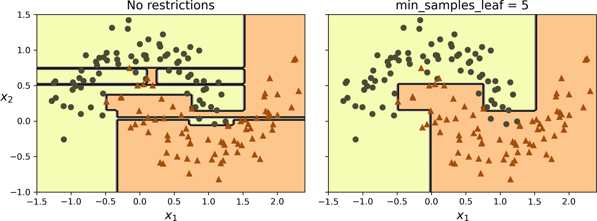
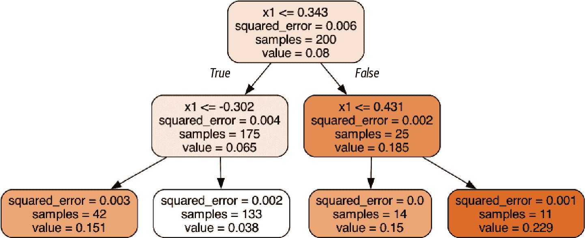
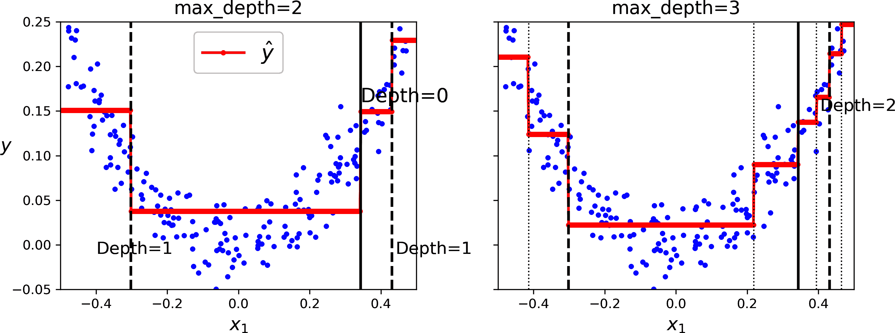

# 第五章\. 决策树

*决策树*是通用的机器学习算法，可以执行分类和回归任务，甚至多输出任务。它们是强大的算法，能够拟合复杂的数据集。例如，在第二章中，您在加利福尼亚住房数据集上训练了一个`DecisionTreeRegressor`模型，并完美地（实际上，过度拟合）地拟合了它。

决策树也是随机森林（参见第六章）的基本组成部分，随机森林是目前最强大的机器学习算法之一。

在本章中，我们将首先讨论如何训练、可视化和使用决策树进行预测。然后我们将介绍 Scikit-Learn 使用的 CART 训练算法，并探讨如何正则化树以及如何将它们用于回归任务。最后，我们将讨论决策树的一些局限性。

# 训练和可视化决策树

要理解决策树，让我们先构建一个，并看看它是如何进行预测的。以下代码在鸢尾花数据集上训练了一个`DecisionTreeClassifier`（参见第四章）：

```py
from sklearn.datasets import load_iris
from sklearn.tree import DecisionTreeClassifier

iris = load_iris(as_frame=True)
X_iris = iris.data[["petal length (cm)", "petal width (cm)"]].values
y_iris = iris.target

tree_clf = DecisionTreeClassifier(max_depth=2, random_state=42)
tree_clf.fit(X_iris, y_iris)
```

您可以通过首先使用`export_graphviz()`函数输出一个名为*iris_tree.dot*的图形定义文件来可视化训练好的决策树：

```py
from sklearn.tree import export_graphviz

export_graphviz(
        tree_clf,
        out_file="iris_tree.dot",
        feature_names=["petal length (cm)", "petal width (cm)"],
        class_names=iris.target_names,
        rounded=True,
        filled=True
    )
```

然后，您可以使用`graphviz.Source.from_file()`在 Jupyter 笔记本中加载并显示该文件：

```py
from graphviz import Source

Source.from_file("iris_tree.dot")
```

[Graphviz](https://graphviz.org)是一个开源的图形可视化软件包。它还包括一个`dot`命令行工具，可以将*.dot*文件转换为多种格式，如 PDF 或 PNG。

您的第一个决策树看起来像图 5-1。


###### 图 5-1\. 鸢尾花决策树

# 进行预测

让我们看看图 5-1 中表示的树是如何进行预测的。假设您发现了一朵鸢尾花，并想根据其花瓣对其进行分类。您从*根节点*（深度 0，顶部）开始：此节点询问花朵的花瓣长度是否小于 2.45 厘米。如果是，那么您将移动到根的左子节点（深度 1，左）。在这种情况下，它是一个*叶节点*（即它没有子节点），所以它不提出任何问题：只需查看该节点的预测类别，决策树预测您的花朵是*Iris setosa*（类别=setosa）。

现在假设你找到了另一朵花，这次花瓣长度大于 2.45 厘米。你再次从根节点开始，但这次移动到它的右子节点（深度 1，右）。这不是一个叶子节点，它是一个 *分裂节点*，因此它会问另一个问题：花瓣宽度是否小于 1.75 厘米？如果是，那么你的花很可能是 *Iris versicolor*（深度 2，左）。如果不是，它很可能是 *Iris virginica*（深度 2，右）。这真的很简单。

###### 注意

决策树众多优点之一是它们对数据准备的要求非常低。实际上，它们根本不需要特征缩放或中心化。

节点的 `samples` 属性统计它应用了多少个训练实例。例如，100 个训练实例的花瓣长度大于 2.45 厘米（深度 1，右），其中 100 个中有 54 个花瓣宽度小于 1.75 厘米（深度 2，左）。节点的 `value` 属性告诉你这个节点应用了多少个每个类别的训练实例：例如，右下角的节点应用了 0 个 *Iris setosa*，1 个 *Iris versicolor* 和 45 个 *Iris virginica*。最后，节点的 `gini` 属性衡量其 *吉尼不纯度*：如果一个节点应用的所有训练实例都属于同一类别，则该节点是“纯净的”（`gini=0`）。例如，由于深度 1 的左节点只应用了 *Iris setosa* 的训练实例，其吉尼不纯度为 0。相反，其他节点都应用了多个类别的实例，因此它们是“不纯净的”。方程式 5-1 展示了训练算法如何计算第 *i* 个节点的吉尼不纯度 *G*[*i*]。类别越多，混合程度越高，不纯度就越大。例如，深度 2 的左节点的吉尼不纯度等于 1 – (0/54)² – (49/54)² – (5/54)² ≈ 0.168。

##### 方程式 5-1\. 吉尼不纯度

$upper G Subscript i Baseline equals 1 minus sigma-summation Underscript k equals 1 Overscript n Endscripts p Subscript i comma k Baseline Superscript 2$

在这个方程中：

+   *G*[*i*] 是第 *i* 个节点的吉尼不纯度。

+   *p*[*i*,*k*] 是第 *i* 个节点中训练实例中类别 *k* 的比例。

###### 注意

Scikit-Learn 使用 CART 算法（稍后讨论），它只产生 *二叉树*，这意味着分裂节点总是有两个子节点（即问题只有是/否的答案）。然而，其他算法，如 ID3，可以产生具有超过两个子节点的决策树。

图 5-2 展示了这个决策树的决策边界。粗垂直线代表根节点的决策边界（深度 0）：花瓣长度=2.45 厘米。由于左侧区域是纯的（只有*Iris setosa*），因此不能再进一步分割。然而，右侧区域是不纯的，因此深度 1 的右节点在花瓣宽度=1.75 厘米处将其分割（由虚线表示）。由于`max_depth`被设置为 2，决策树就在这里停止。如果你将`max_depth`设置为 3，那么两个深度 2 的节点将各自添加另一个决策边界（由两条垂直虚线表示）。


###### 图 5-2\. 决策树决策边界

###### 提示

树结构，包括图 5-1 中显示的所有信息，都可通过分类器的`tree_`属性获取。输入**`help(tree_clf.tree_)`**获取详细信息，并查看[本章的笔记本](https://homl.info/colab-p)以获取示例。

# 估计类概率

决策树还可以估计一个实例属于特定类*k*的概率。首先它遍历树以找到该实例的叶节点，然后返回在训练实例中达到该叶节点的类*k*实例的比例。例如，假设你发现一朵花瓣长度为 5 厘米、宽度为 1.5 厘米的花。相应的叶节点是深度 2 的左节点，因此决策树输出以下概率：*Iris setosa*为 0%（0/54），*Iris versicolor*为 90.7%（49/54），*Iris virginica*为 9.3%（5/54）。如果你要求它预测类别，它输出*Iris versicolor*（类别 1），因为它具有最高的概率。让我们检查一下：

```py
>>> tree_clf.predict_proba([[5, 1.5]]).round(3)
array([[0\.   , 0.907, 0.093]])
>>> tree_clf.predict([[5, 1.5]])
array([1])
```

完美！注意，估计的概率在任何其他图 5-2 右下角的矩形中都是相同的——例如，如果花瓣长度为 6 厘米、宽度为 1.5 厘米（尽管在这种情况下它最可能是*Iris virginica*）。

# CART 训练算法

Scikit-Learn 使用**分类和回归树**（CART）算法来训练决策树（也称为“生长”树）。该算法通过首先使用单个特征*k*和阈值*t*[*k*]（例如，“花瓣长度≤2.45 厘米”）将训练集分割成两个子集来工作。它是如何选择*k*和*t*[*k*]的呢？它搜索产生最纯子集的(*k*, *t*[*k*])对，并按其大小进行加权。方程 5-2 给出了算法试图最小化的成本函数。

##### 方程 5-2\. 分类 CART 成本函数

$StartLayout 1st Row 1st Column upper J left-parenthesis k comma t Subscript k Baseline right-parenthesis 2nd Column equals StartFraction m Subscript left Baseline Over m EndFraction upper G Subscript left Baseline plus StartFraction m Subscript right Baseline Over m EndFraction upper G Subscript right Baseline 2nd Row 1st Column where 2nd Column StartLayout Enlarged left-brace 1st Row  upper G Subscript left slash right Baseline measures the impurity of the left slash right subset 2nd Row  m Subscript left slash right Baseline is the number of instances in the left slash right subset 3rd Row  m equals m Subscript left Baseline plus m Subscript right EndLayout EndLayout$

一旦 CART 算法成功地将训练集分成两部分，它就会使用相同的逻辑分割子集，然后是子子集，依此类推，递归地进行。一旦达到最大深度（由 `max_depth` 超参数定义），或者找不到可以减少纯度的分割，它就会停止递归。一些其他超参数（稍后描述）控制额外的停止条件：`min_samples_split`、`min_samples_leaf`、`max_leaf_nodes` 以及更多。

###### 警告

如您所见，CART 算法是一种 *贪婪算法*：它在顶层贪婪地搜索最优分割，然后在每个后续级别重复此过程。它不会检查分割是否会在几层以下导致最低可能的纯度。贪婪算法通常会产生一个相当好的解决方案，但并不保证是最优的。

不幸的是，找到最优树是一个已知的 *NP 完全问题*。⁠^(1) 它需要 *O*(exp(*m*)) 的时间，⁠^(2) 即使对于小型训练集，这个问题也是不可行的。这就是为什么我们在训练决策树时必须满足“相当好”的解决方案。

# 计算复杂性

进行预测需要从根节点遍历决策树到叶子节点。决策树通常是近似平衡的，因此遍历决策树需要通过大约 *O*(log2) 个节点，其中 *m* 是训练实例的数量，log2 是 *m* 的 *二进制对数*，等于 log(*m*) / log(2)。由于每个节点只需要检查一个特征值，因此整体预测复杂度为 *O*(log2)，与特征数量无关。因此，即使处理大型训练集，预测也非常快。

默认情况下，训练算法在每个节点上比较所有样本的所有特征，这导致训练复杂度为 *O*(*n* × *m* log2)。

可以使用 `max_depth` 超参数设置最大树深度，并且/或者设置在每个节点上要考虑的最大特征数（然后特征会被随机选择）。这样做将大大加快训练速度，并且还可以减少过拟合的风险（但就像往常一样，做得太过分会导致欠拟合）。

# Gini 纯度或熵？

默认情况下，`DecisionTreeClassifier` 类使用基尼不纯度度量，但你可以通过将 `criterion` 超参数设置为 `"entropy"` 来选择 *熵* 不纯度度量。熵的概念起源于热力学，作为分子无序度的度量：当分子静止且有序时，熵趋近于零。熵后来扩展到广泛的领域，包括在香农的信息理论中，它衡量信息的平均内容，正如我们在第四章中看到的。当所有消息都相同的时候，熵为零。在机器学习中，熵经常被用作不纯度度量：当集合只包含一个类的实例时，其熵为零。方程式 5-3 展示了第 *i* 个节点的熵的定义。例如，图 5-1 中的深度 2 左节点具有的熵等于 –(49/54) log[2] (49/54) – (5/54) log[2] (5/54) ≈ 0.445。

##### 方程式 5-3\. 熵

<mrow><msub><mi>H</mi> <mi>i</mi></msub> <mo>=</mo> <mo>-</mo> <munderover><mo>∑</mo> <mfrac linethickness="0pt"><mrow><mi>k</mi><mo>=</mo><mn>1</mn></mrow> <mrow><msub><mi>p</mi> <mrow><mi>i</mi><mo lspace="0%" rspace="0%">,</mo><mi>k</mi></mrow></msub> <mo>≠</mo><mn>0</mn></mrow></mfrac> <mi>n</mi></munderover> <mrow><msub><mi>p</mi> <mrow><mi>i</mi><mo lspace="0%" rspace="0%">,</mo><mi>k</mi></mrow></msub> <msub><mo form="prefix">log</mo> <mn>2</mn></msub> <mrow><mo>(</mo> <msub><mi>p</mi> <mrow><mi>i</mi><mo lspace="0%" rspace="0%">,</mo><mi>k</mi></mrow></msub> <mo>)</mo></mrow></mrow></mrow>

那么，你应该使用基尼不纯度还是熵？事实是，大多数时候这并没有太大的区别：它们会导致类似的树。基尼不纯度计算得稍微快一些，所以它是一个好的默认选项。然而，当它们不同时，基尼不纯度倾向于将最频繁的类隔离在树的分支中，而熵倾向于产生稍微更平衡的树。3

# 正则化超参数

决策树对训练数据几乎没有假设（与假设数据是线性的线性模型相反）。如果不受约束，树结构将适应训练数据，非常紧密地拟合它——实际上，很可能会过度拟合。这样的模型通常被称为 *非参数模型*，并不是因为它没有任何参数（它通常有很多）而是因为参数的数量在训练之前没有确定，因此模型结构可以自由地紧密跟随数据。相比之下，*参数模型*，如线性模型，具有预定的参数数量，因此其自由度有限，降低了过度拟合的风险（但增加了欠拟合的风险）。

为了避免过拟合训练数据，您需要在训练过程中限制决策树的自由度。如您现在所知，这被称为正则化。正则化超参数取决于所使用的算法，但通常您至少可以限制决策树的最大深度。在 Scikit-Learn 中，这由 `max_depth` 超参数控制。默认值是 `None`，表示无限制。减少 `max_depth` 将正则化模型并因此降低过拟合的风险。

`DecisionTreeClassifier` 类有几个其他参数，这些参数以类似的方式限制决策树的结构：

`max_features`

在每个节点上评估用于分裂的最大特征数

`max_leaf_nodes`

最大叶子节点数

`min_samples_split`

节点在可以分裂之前必须拥有的最小样本数

`min_samples_leaf`

叶节点必须拥有的最小样本数以创建节点

`min_weight_fraction_leaf`

与 `min_samples_leaf` 相同，但以总加权实例数的分数表示

`min_impurity_decrease`

只有当这个分裂导致至少这种不纯度减少时才分裂节点

`ccp_alpha`

控制最小成本复杂度剪枝（MCCP），即剪枝那些与叶子节点数量相比不足以减少不纯度的子树；更大的 `ccp_alpha` 值会导致更多的剪枝，从而得到更小的树（默认值为 0—无剪枝）

为了限制模型的复杂度并因此正则化模型，您可以增加 `min_*` 超参数或 `ccp_alpha`，或减少 `max_*` 超参数。调整 `max_depth` 通常是一个好的默认值：它提供了有效的正则化，并保持树小且易于解释。设置 `min_samples_leaf` 也是一个好主意，特别是对于小数据集。当处理高维数据集时，`max_features` 也是很好的选择。

###### 注意

其他算法首先在不加限制的情况下训练决策树，然后进行 *剪枝*（删除）不必要的节点。如果一个节点的所有子节点都是叶子节点，并且它提供的纯度改进在统计上不显著，则该节点被认为是多余的。标准统计测试，如 *χ*² *测试*（卡方测试），用于估计改进纯粹是偶然结果的可能性（这被称为 *零假设*）。如果这个概率，称为 *p-value*，高于给定的阈值（通常为 5%，由超参数控制），则该节点被认为是多余的，并且其子节点被删除。剪枝会继续进行，直到所有不必要的节点都被剪枝。

让我们在月亮数据集上测试正则化：这是一个用于二元分类的玩具数据集，其中数据点形状为两个交错的新月（见图 5-3）。您可以使用 `make_moons()` 函数生成此数据集。

我们将训练一个不带正则化的决策树，另一个带有 `min_samples_leaf=5`。以下是代码；图 5-3 显示了每个树的决策边界：

```py
from sklearn.datasets import make_moons

X_moons, y_moons = make_moons(n_samples=150, noise=0.2, random_state=42)

tree_clf1 = DecisionTreeClassifier(random_state=42)
tree_clf2 = DecisionTreeClassifier(min_samples_leaf=5, random_state=42)
tree_clf1.fit(X_moons, y_moons)
tree_clf2.fit(X_moons, y_moons)
```



###### 图 5-3\. 未正则化树（左侧）和正则化树（右侧）的决策边界

左侧的未正则化模型显然是过拟合的，而右侧的正则化模型可能会泛化得更好。我们可以通过使用不同的随机种子生成的测试集来评估这两棵树来验证这一点：

```py
>>> X_moons_test, y_moons_test = make_moons(n_samples=1000, noise=0.2,
...                                         random_state=43)
...
>>> tree_clf1.score(X_moons_test, y_moons_test)
0.898
>>> tree_clf2.score(X_moons_test, y_moons_test)
0.92
```

事实上，第二个树在测试集上的准确度更好。

# 回归

决策树也擅长执行回归任务。虽然线性回归只适用于线性数据，但决策树可以拟合各种复杂的数据集。让我们使用 Scikit-Learn 的 `DecisionTreeRegressor` 类构建一个回归树，并在具有 `max_depth=2` 的嘈杂二次数据集上对其进行训练：

```py
import numpy as np
from sklearn.tree import DecisionTreeRegressor

rng = np.random.default_rng(seed=42)
X_quad = rng.random((200, 1)) - 0.5  # a single random input feature
y_quad = X_quad ** 2 + 0.025 * rng.standard_normal((200, 1))

tree_reg = DecisionTreeRegressor(max_depth=2, random_state=42)
tree_reg.fit(X_quad, y_quad)
```

结果树在图 5-4 中表示。



###### 图 5-4\. 回归决策树

这棵树看起来与您之前构建的分类树非常相似。主要区别在于，在每个节点中，它预测的是一个值，而不是一个类别。例如，假设您想对一个新实例进行预测，其中 *x*[1] = 0.2。根节点询问 *x*[1] ≤ 0.343。由于它是，算法转到左侧子节点，该节点询问 *x*[1] ≤ –0.302。由于它不是，算法转到右侧子节点。这是一个叶节点，它预测 `value=0.038`。这个预测是该叶节点关联的 133 个训练实例的平均目标值，并且在这些 133 个实例上产生均方误差等于 0.002。

该模型的预测结果在图 5-5 的左侧表示。如果你设置`max_depth=3`，你将得到右侧表示的预测结果。注意，每个区域的预测值总是该区域实例的平均目标值。算法以使大多数训练实例尽可能接近该预测值的方式分割每个区域。



###### 图 5-5\. 两个决策树回归模型的预测结果

CART 算法的工作原理如前所述，只是现在它不是试图以最小化不纯度的方式分割训练集，而是试图以最小化均方误差（MSE）的方式分割训练集。公式 5-4 显示了算法试图最小化的成本函数。

##### 公式 5-4\. 回归的 CART 成本函数

$upper J left-parenthesis k comma t Subscript k Baseline right-parenthesis equals StartFraction m Subscript left Baseline Over m EndFraction MSE Subscript left Baseline plus StartFraction m Subscript right Baseline Over m EndFraction MSE Subscript right Baseline where StartLayout Enlarged left-brace 1st Row  MSE Subscript node Baseline equals StartFraction sigma-summation Underscript i element-of node Endscripts left-parenthesis ModifyingAbove y With caret Subscript node Baseline minus y Superscript left-parenthesis i right-parenthesis Baseline right-parenthesis squared Over m Subscript node Baseline EndFraction 2nd Row  ModifyingAbove y With caret Subscript node Baseline equals StartFraction sigma-summation Underscript i element-of node Endscripts y Superscript left-parenthesis i right-parenthesis Baseline Over m Subscript node Baseline EndFraction EndLayout$

正如对于分类任务一样，决策树在处理回归任务时容易过拟合。在没有任何正则化（即使用默认的超参数）的情况下，你会在图 5-6 的左侧得到预测。这些预测显然非常糟糕地过拟合了训练集。只需设置`min_samples_leaf=10`就会得到一个更加合理的模型，如图 5-6 右侧所示。


###### 图 5-6\. 未正则化的回归树（左）和正则化树（右）的预测

# 对轴方向的敏感性

希望到现在你已经相信决策树有很多优点：它们相对容易理解和解释，使用简单，功能多样，且强大。然而，它们确实有一些局限性。首先，正如你可能已经注意到的，决策树喜欢正交的决策边界（所有分割都垂直于一个轴），这使得它们对数据的方向敏感。例如，图 5-7 显示了一个简单的线性可分数据集：在左侧，决策树可以轻松地分割它，而在右侧，数据集旋转 45°后，决策边界看起来不必要地复杂。尽管两个决策树都完美地拟合了训练集，但右边的模型很可能无法很好地泛化。


###### 图 5-7\. 对训练集旋转的敏感性

限制这种问题的一种方法是对数据进行缩放，然后应用主成分分析 (PCA) 转换。我们将在第七章中详细讨论 PCA，但就目前而言，您只需要知道它会以减少特征之间相关性的方式旋转数据，这通常（但不总是）使事情更容易。

让我们创建一个小的管道，使用 PCA 缩放数据并旋转它，然后在数据上训练一个 `DecisionTreeClassifier`。图 5-8 显示了该树的决策边界：如您所见，旋转使得仅使用一个特征*z*[1]，即原始花瓣长度和宽度的线性函数，就可以很好地拟合数据集。以下是代码：

```py
from sklearn.decomposition import PCA
from sklearn.pipeline import make_pipeline
from sklearn.preprocessing import StandardScaler

pca_pipeline = make_pipeline(StandardScaler(), PCA())
X_iris_rotated = pca_pipeline.fit_transform(X_iris)
tree_clf_pca = DecisionTreeClassifier(max_depth=2, random_state=42)
tree_clf_pca.fit(X_iris_rotated, y_iris)
```

###### 小贴士

`DecisionTreeClassifier` 和 `DecisionTreeRegressor` 类都原生支持缺失值，无需使用填充器。


###### 图 5-8\. 树在缩放和 PCA-旋转的鸢尾花数据集上的决策边界

# 决策树具有高方差

更普遍地说，决策树的主要问题是它们具有相当高的方差：超参数或数据的微小变化可能会产生非常不同的模型。实际上，由于 Scikit-Learn 使用的训练算法是随机的——它在每个节点随机选择要评估的特征集——即使在完全相同的数据上重新训练相同的决策树，也可能产生一个非常不同的模型，如图 5-9 中所示（除非您设置了 `random_state` 超参数）。如您所见，它与之前的决策树(图 5-2)非常不同。


###### 图 5-9\. 在相同的数据上重新训练相同的模型可能产生一个非常不同的模型

幸运的是，通过平均许多树的预测，可以显著降低方差。这种树的*集成*被称为*随机森林*，它是今天最强大的模型类型之一，您将在下一章中看到。

# 练习

1.  在一个包含一百万个实例的训练集上训练的决策树的近似深度是多少？

1.  节点的 Gini 不纯度通常比其父节点低还是高？是*通常*低/高，还是*总是*低/高？

1.  如果决策树过度拟合训练集，尝试减少 `max_depth` 是否是一个好主意？

1.  如果决策树未能很好地拟合训练集，尝试缩放输入特征是否是一个好主意？

1.  如果在一个包含一百万个实例的训练集上训练一个决策树需要一个小时，那么在一个包含一千万个实例的训练集上训练另一个决策树大约需要多少时间？提示：考虑 CART 算法的计算复杂度。

1.  如果在一个给定的训练集上训练一个决策树需要一个小时，那么如果你将特征数量加倍，大约需要多少时间？

1.  按照以下步骤训练并微调 moons 数据集的决策树：

    1.  使用 `make_moons(n_samples=10000, noise=0.4)` 生成 moons 数据集。

    1.  使用 `train_test_split()` 将数据集拆分为训练集和测试集。

    1.  使用网格搜索和交叉验证（借助 `GridSearchCV` 类）来找到 `DecisionTreeClassifier` 的良好超参数值。提示：尝试 `max_leaf_nodes` 的各种值。

    1.  使用这些超参数在完整训练集上训练它，并测量你的模型在测试集上的性能。你应该得到大约 85%到 87%的准确率。

1.  按照以下步骤生长一个森林：

    1.  继续上一个练习，生成 1,000 个训练集的子集，每个子集包含随机选择的 100 个实例。提示：你可以使用 Scikit-Learn 的`ShuffleSplit`类来做这个。

    1.  在每个子集上训练一个决策树，使用在上一个练习中找到的最佳超参数值。在测试集上评估这 1,000 个决策树。由于它们是在较小的集合上训练的，这些决策树可能表现不如第一个决策树，只能达到大约 80%的准确率。

    1.  现在是魔法时刻。对于每个测试集实例，生成 1,000 个决策树的预测，并只保留最频繁的预测（你可以使用 SciPy 的`mode()`函数来做这个）。这种方法在测试集上给出了*多数投票预测*。

    1.  在测试集上评估这些预测：你应该获得比你的第一个模型略高的准确率（大约高 0.5 到 1.5%）。恭喜你，你已经训练了一个随机森林分类器！

这些练习的解决方案可以在本章笔记本的末尾找到，在[*https://homl.info/colab-p*](https://homl.info/colab-p)。

^(1) P 是可以在*多项式时间内*解决的问题的集合（即，数据集大小的多项式）。NP 是那些解决方案可以在多项式时间内验证的问题的集合。一个 NP-hard 问题是可以被在多项式时间内减少到一个已知的 NP-hard 问题的问题。一个 NP-complete 问题既是 NP 也是 NP-hard。一个主要的开放数学问题是 P = NP。如果 P ≠ NP（这似乎很可能是这样），那么将永远不会找到任何 NP-complete 问题的多项式算法（也许有一天在量子计算机上除外）。

^(2) 这个**大 O 符号**表示，随着*m*（即训练实例的数量）的增加，计算时间与*m*的指数成正比（实际上是一个上界，但我们尽量使其尽可能小）。这告诉我们计算如何随着*m*的增长而“增长”，而*O*(exp(*m*))增长非常快。

^(3) 更多细节请参阅 Sebastian Raschka 的[有趣分析](https://homl.info/19)。
