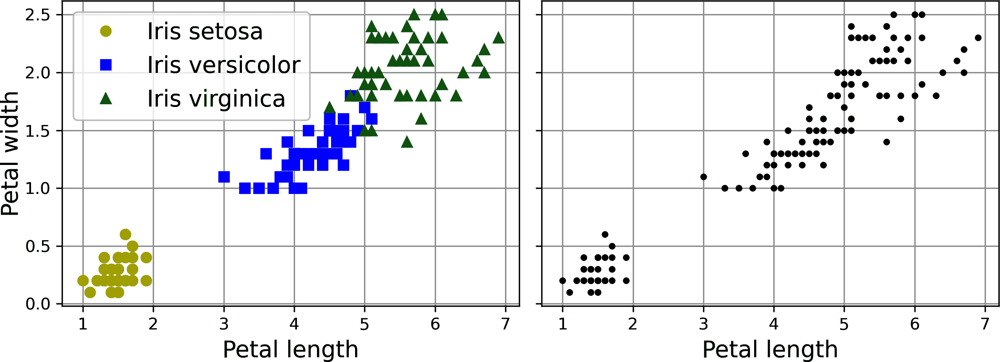
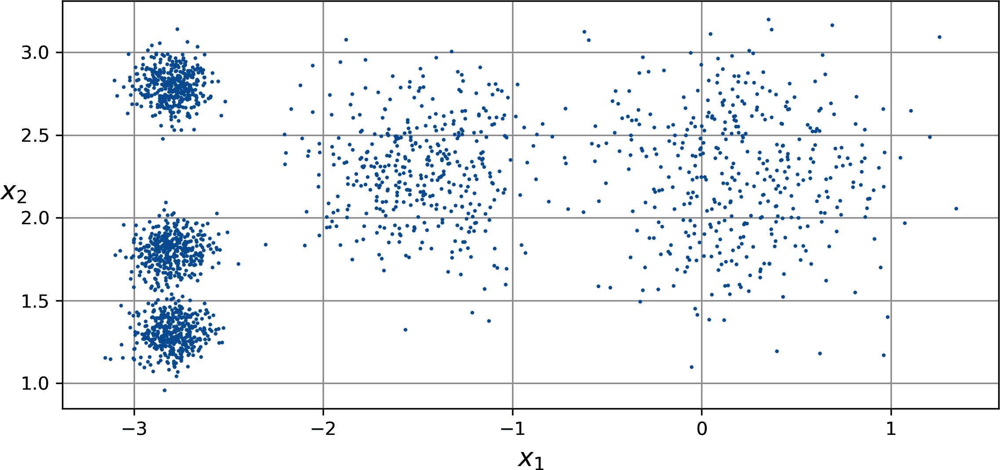
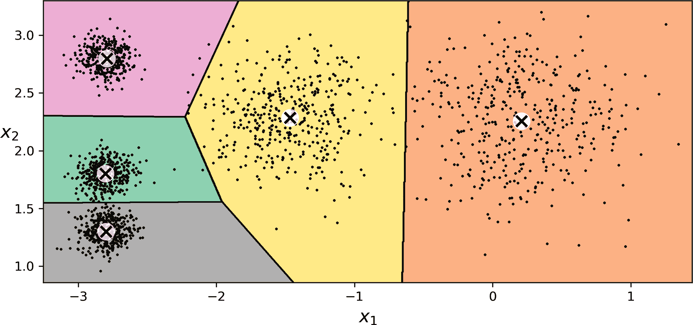
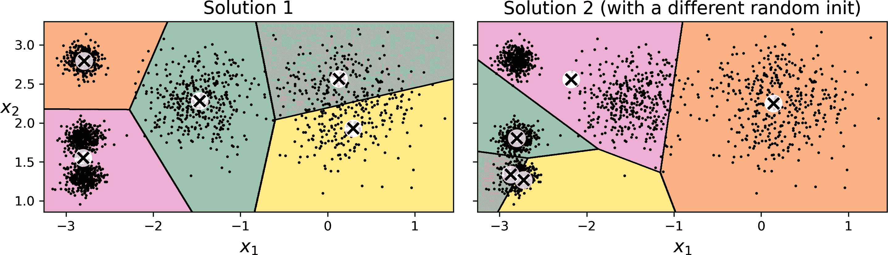
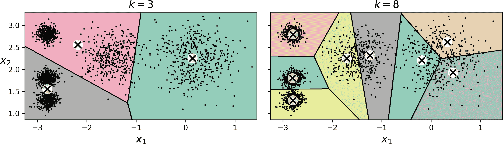
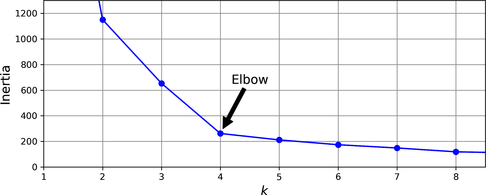
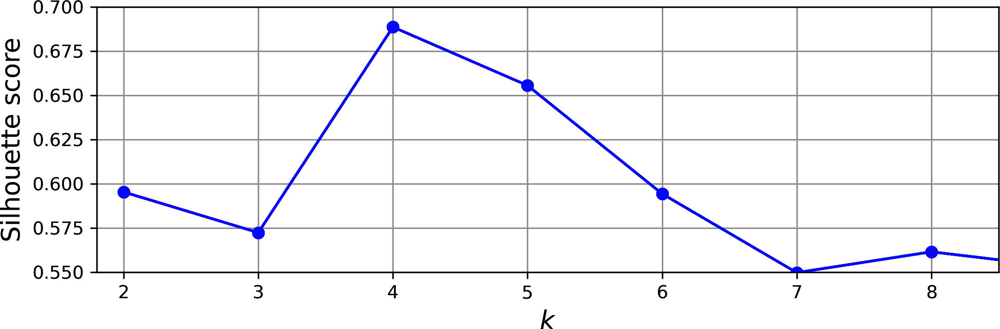
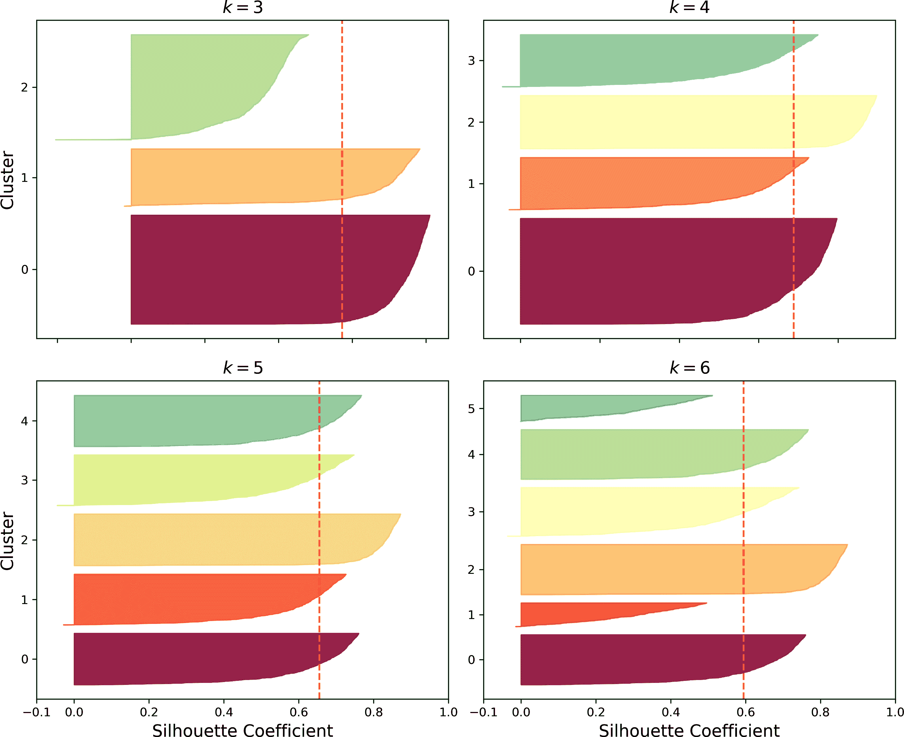
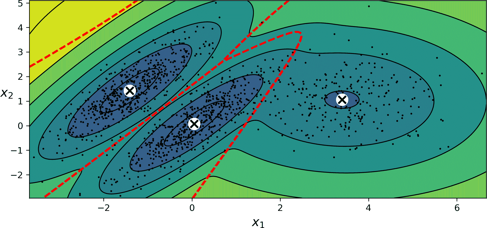
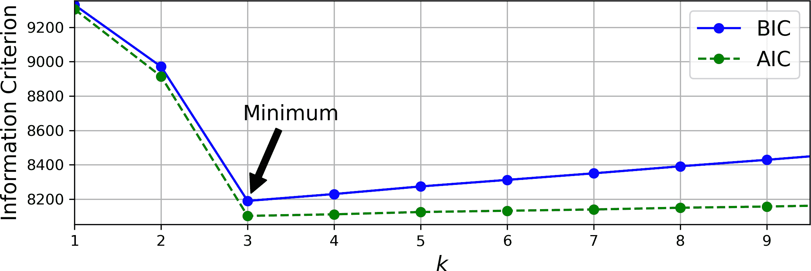

# 第八章\. 无监督学习技术

Yann LeCun，图灵奖得主和 Meta 的首席人工智能科学家，曾著名地表示：“如果智能是一块蛋糕，无监督学习就是蛋糕本身，监督学习就是蛋糕上的糖霜，强化学习就是蛋糕上的樱桃”（NeurIPS 2016）。换句话说，无监督学习具有巨大的潜力，我们才刚刚开始涉足其中。确实，大部分可用的数据都是未标记的：我们拥有输入特征**X**，但没有标签**y**。

假设你想创建一个系统，该系统能够对制造生产线上的每个物品拍摄几张照片，并检测哪些物品是次品的。你可以相当容易地创建一个自动拍照的系统，这可能会每天给你成千上万的照片。然后你可以在几周内构建一个相当大的数据集。但是等等，没有标签！如果你想训练一个常规的二分类器，预测一个物品是否是次品，你需要将每张照片都标记为“次品”或“正常”。这通常需要专家坐下来手动检查所有照片。这是一项漫长、昂贵且繁琐的任务，因此通常只会对可用照片的一小部分进行操作。结果，标记的数据集将非常小，分类器的性能将令人失望。此外，每次公司对其产品进行任何更改时，整个流程都需要从头开始。如果算法能够仅利用未标记的数据，而不需要人为标记每张照片，那岂不是很好？这就是无监督学习的用武之地。

在第七章中，我们探讨了最常见的无监督学习任务：降维。在本章中，我们将探讨一些其他无监督学习任务：

聚类

目标是将相似的实例分组到*簇*中。聚类是数据分析、客户细分、推荐系统、搜索引擎、图像分割、半监督学习、降维等领域的强大工具。

异常检测（也称为*离群值检测*）

目标是学习“正常”数据看起来是什么样子，然后利用这一点来检测异常实例。这些实例被称为*异常*或*离群值*，而正常实例被称为*内群值*。异常检测在广泛的领域中都有用，例如欺诈检测、在制造中检测次品产品、识别时间序列中的新趋势，或在训练另一个模型之前从数据集中移除离群值，这可以显著提高最终模型的表现。

密度估计

这是一项估计生成数据集的随机过程的*概率密度函数*（PDF）的任务。⁠^(1) 密度估计常用于异常检测：位于非常低密度区域的实例很可能是异常。它也适用于数据分析和可视化。

准备好一些蛋糕了吗？我们将从两种聚类算法*k*-means 和 DBSCAN 开始，然后我们将讨论高斯混合模型，并看看它们如何用于密度估计、聚类和异常检测。

# 聚类算法：k-means 和 DBSCAN

当你在山中徒步旅行时，你偶然发现了一种你以前从未见过的植物。你环顾四周，注意到还有几株。它们并不完全相同，但足够相似，让你知道它们很可能属于同一物种（或者至少同一属）。你可能需要一个植物学家告诉你这是什么物种，但你当然不需要专家来识别外观相似的物体组。这被称为*聚类*：它是识别相似实例并将它们分配到*聚类*或相似实例组的任务。

就像在分类中一样，每个实例都被分配到一个组。然而，与分类不同，聚类是一个无监督的任务，没有标签，因此算法需要自己找出如何分组实例。考虑图 8-1：左侧是鸢尾花数据集（在第四章线性模型中介绍），其中每个实例的物种（即其类别）用不同的标记表示。这是一个有标签的数据集，对于逻辑回归、SVM 或随机森林分类器等分类算法非常适合。右侧是相同的数据集，但没有标签，因此不能再使用分类算法。这就是聚类算法介入的地方：许多算法可以轻松地检测到左下角的聚类。用我们的眼睛看也很容易，但右上角的聚类由两个不同的子聚类组成这一点并不明显。尽管如此，数据集还有两个额外的特征（花瓣长度和宽度）在这里没有表示，聚类算法可以利用所有特征，因此实际上它们相当好地识别了三个聚类（例如，使用高斯混合模型，只有 150 个实例中的 5 个被分配到错误的聚类）。



###### 图 8-1. 分类（左侧）与聚类（右侧）：在聚类中，数据集是无标签的，因此算法必须在没有指导的情况下识别聚类

聚类被广泛应用于各种应用中，包括：

客户细分

您可以根据客户的购买和他们在您网站上的活动对客户进行聚类。这有助于了解您的客户是谁以及他们需要什么，因此您可以调整您的产品和营销活动以适应每个细分市场。例如，客户细分在*推荐系统*中非常有用，可以建议其他同一簇用户喜欢的相关内容。

数据分析

当您分析一个新的数据集时，运行聚类算法然后分别分析每个簇可能会有所帮助。

维度约简

一旦数据集被聚类，通常可以测量每个实例与每个簇的*亲和度*；亲和度是衡量实例如何适合簇的任何度量。然后每个实例的特征向量**x**可以被其簇亲和度的向量所替代。如果有*k*个簇，那么这个向量是*k*维的。新向量通常比原始特征向量低得多维，但它可以保留足够的信息以供进一步处理。

特征工程

簇亲和度通常可以作为额外的特征很有用。例如，我们在第二章中使用了*k*均值聚类来向加利福尼亚住房数据集添加地理簇亲和度特征，这有助于我们获得更好的性能。

*异常检测*（也称为*离群值检测*）

任何与所有簇亲和度低的实例很可能是一个异常。例如，如果您根据用户的行为对您的网站用户进行了聚类，您可以检测到具有不寻常行为（如每秒请求数量异常）的用户。

半监督学习

如果您只有少量标签，您可以对聚类进行操作并将标签传播到同一簇的所有实例。这种技术可以大大增加后续监督学习算法可用的标签数量，从而提高其性能。

搜索引擎

一些搜索引擎允许您搜索与参考图像相似的图像。要构建这样的系统，您首先需要将聚类算法应用于数据库中的所有图像；相似的图像最终会落在同一个簇中。然后当用户提供一个参考图像时，您只需使用训练好的聚类模型来找到这个图像的簇，然后您可以简单地返回这个簇中的所有图像。

图像分割

通过根据颜色对像素进行聚类，然后用其簇的平均颜色替换每个像素的颜色，可以显著减少图像中的不同颜色数量。图像分割在许多目标检测和跟踪系统中使用，因为它使得检测每个对象的轮廓变得更容易。

对于簇的定义没有普遍的定义：它实际上取决于上下文，不同的算法将捕获不同类型的簇。一些算法寻找围绕特定点的实例，称为**质心**。其他算法寻找密集实例的连续区域：这些簇可以具有任何形状。一些算法是层次化的，寻找簇的簇。等等。

在本节中，我们将探讨两种流行的聚类算法，*k*-means 和 DBSCAN，并探索它们的一些应用，例如非线性降维、半监督学习和异常检测。

## k-Means 聚类

考虑图 8-2 中表示的未标记数据集：您可以看到五个实例团块。k-means 算法是一个简单的算法，能够非常快速和高效地对这类数据集进行聚类，通常只需几次迭代。它由贝尔实验室的 Stuart Lloyd 于 1957 年提出，作为一种脉冲编码调制技术，但直到 1982 年才在公司外部[发表](https://homl.info/36)。⁠^(2) 1965 年，Edward W. Forgy 发表了几乎相同的算法，因此 k-means 有时被称为 Lloyd-Forgy 算法。



###### 图 8-2\. 由五个实例团块组成的未标记数据集

让我们在这个数据集上训练一个*k*-means 聚类器。它将尝试找到每个团块的中心并将每个实例分配到最近的团块：

```py
from sklearn.cluster import KMeans
from sklearn.datasets import make_blobs

X, y = make_blobs([...])  # make the blobs: y contains the cluster IDs, but we
                          # will not use them; that's what we want to predict
k = 5
kmeans = KMeans(n_clusters=k, random_state=42)
y_pred = kmeans.fit_predict(X)
```

注意，您必须指定算法必须找到的簇数*k*。在这个例子中，从数据中可以看出*k*应该设置为 5，但通常并不那么容易。我们将在稍后讨论这个问题。

每个实例将被分配到五个簇中的某一个。在聚类的上下文中，实例的**标签**是算法分配给该实例的簇的索引；这不要与分类中的类标签混淆，类标签用作目标（记住聚类是一个无监督学习任务）。`KMeans`实例保留了它在训练过程中预测的实例标签，这些标签通过`labels_`实例变量可用：

```py
>>> y_pred
array([4, 0, 1, ..., 2, 1, 0], dtype=int32)
>>> y_pred is kmeans.labels_
True
```

我们还可以看看算法找到的五个质心：

```py
>>> kmeans.cluster_centers_
array([[-2.80389616,  1.80117999],
 [ 0.20876306,  2.25551336],
 [-2.79290307,  2.79641063],
 [-1.46679593,  2.28585348],
 [-2.80037642,  1.30082566]])
```

您可以轻松地将新实例分配到最近的质心所属的簇：

```py
>>> import numpy as np
>>> X_new = np.array([[0, 2], [3, 2], [-3, 3], [-3, 2.5]])
>>> kmeans.predict(X_new)
array([1, 1, 2, 2], dtype=int32)
```

如果您绘制簇的决策边界，您将得到一个 Voronoi 镶嵌图：参见图 8-3，其中每个质心都用一个ⓧ表示。



###### 图 8-3\. k-means 决策边界（Voronoi 镶嵌图）

大多数实例都被清楚地分配到了适当的簇中，但少数实例可能被错误标记，尤其是在左上角簇和中央簇之间的边界附近。事实上，当簇的直径非常不同时，k-means 算法表现不佳，因为它在将实例分配到簇时只关心实例到质心的距离。

与将每个实例分配到单个簇中，即所谓的**硬聚类**不同，给每个实例分配每个簇的分数可能很有用，这被称为**软聚类**。这个分数可以是实例与质心的距离或相似度分数（或亲和度），例如我们在第二章中使用的高斯径向基函数。在 `KMeans` 类中，`transform()` 方法测量每个实例到每个质心的距离：

```py
>>> kmeans.transform(X_new).round(2)
array([[2.81, 0.33, 2.9 , 1.49, 2.89],
 [5.81, 2.8 , 5.85, 4.48, 5.84],
 [1.21, 3.29, 0.29, 1.69, 1.71],
 [0.73, 3.22, 0.36, 1.55, 1.22]])
```

在这个例子中，`X_new` 中的第一个实例距离第一个质心大约 2.81，距离第二个质心 0.33，距离第三个质心 2.90，距离第四个质心 1.49，距离第五个质心 2.89。如果你有一个高维数据集并且以这种方式转换它，你最终会得到一个 *k*-维数据集：这种转换可以是一个非常有效的非线性降维技术。或者，你可以使用这些距离作为额外的特征来训练另一个模型，就像在第二章中那样。

### K-means 算法

那么，算法是如何工作的呢？好吧，假设你被给出了质心。你可以很容易地将数据集中的所有实例标记出来，通过将每个实例分配到其质心最近的簇。相反，如果你被给出了所有实例的标签，你可以很容易地通过计算该簇中实例的平均值来定位每个簇的质心。但是你没有给出标签也没有给出质心，那么你该如何进行呢？首先随机放置质心（例如，通过从数据集中随机选择 *k* 个实例并使用它们的坐标作为质心）。然后标记实例，更新质心，标记实例，更新质心，以此类推，直到质心停止移动。该算法保证在有限步骤内收敛（通常相当小）。这是因为实例与其最近质心之间的均方距离在每一步只能下降，因为它不能是负数，所以它保证会收敛。

你可以在图 8-4 中看到算法的实际运行情况：质心是随机初始化的（左上角），然后实例被标记（右上角），然后质心被更新（中间左），实例被重新标记（中间右），以此类推。正如你所看到的，仅仅经过三次迭代，算法就达到了一个似乎接近最优的聚类。

###### 注意

算法的计算复杂度通常与实例数*m*、聚类数*k*和维度数*n*成线性关系。然而，这只在数据具有聚类结构时才成立。如果没有，则在最坏的情况下，复杂度可能会随着实例数的增加而指数级增长。在实践中，这种情况很少发生，*k*-均值通常是速度最快的聚类算法之一。


###### 图 8-4\. *k*-均值算法

虽然算法保证会收敛，但它可能不会收敛到正确的解（即，它可能收敛到局部最优解）：它是否收敛取决于质心初始化。显示了两种次优解，如果你在随机初始化步骤中运气不佳，算法可能会收敛到这些解。



###### 图 8-5\. 由于不幸运的质心初始化导致的次优解

让我们看看一些方法，通过改进质心初始化来降低这种风险。

### 质心初始化方法

如果你大致知道质心应该在哪里（例如，如果你之前运行了另一个聚类算法），则可以将`init`超参数设置为包含质心列表的 NumPy 数组：

```py
good_init = np.array([[-3, 3], [-3, 2], [-3, 1], [-1, 2], [0, 2]])
kmeans = KMeans(n_clusters=5, init=good_init, random_state=42)
kmeans.fit(X)
```

另一种解决方案是多次运行算法，使用不同的随机初始化，并保留最佳解。随机初始化的次数由`n_init`超参数控制：当使用`init="random"`时，默认等于`10`，这意味着当你调用`fit()`时，上述整个算法将运行 10 次，Scikit-Learn 将保留最佳解。但它是如何知道哪个解是最好的呢？它使用一个性能指标！这个指标被称为模型的*惯性*，它在方程式 8-1 中定义。

##### 方程式 8-1\. 模型的惯性是每个实例**x**^((*i*))与模型预测的最近质心**c**^((*i*))之间所有平方距离的总和

<mrow><mtext>惯性</mtext> <mo>=</mo> <munder><mo>∑</mo> <mi>i</mi></munder> <msup><mrow><mo>∥</mo><msup><mi mathvariant="bold">x</mi> <mrow><mo>(</mo><mi>i</mi><mo>)</mo></mrow></msup> <mo>-</mo><msup><mi mathvariant="bold">c</mi> <mrow><mo>(</mo><mi>i</mi><mo>)</mo></mrow></msup> <mo rspace="0.1em">∥</mo></mrow> <mn>2</mn></msup></mrow>

在 图 8-5 左侧的模型中，惯性大约为 219.6，而在 图 8-5 右侧的模型中为 600.4，而在 图 8-3 中的模型仅为 211.6。`KMeans` 类运行初始化算法 `n_init` 次并保留惯性最低的模型。在这个例子中，图 8-3 中的模型将被选中（除非我们在 `n_init` 连续随机初始化中非常不幸）。如果你好奇，可以通过 `inertia_` 实例变量访问模型的惯性：

```py
>>> kmeans.inertia_
211.59853725816828
```

`score()` 方法返回负惯性（它是负的，因为预测器的 `score()` 方法必须始终遵守 Scikit-Learn 的“越大越好”规则——如果一个预测器比另一个更好，它的 `score()` 方法应该返回一个更高的分数）：

```py
>>> kmeans.score(X)
-211.59853725816828
```

对 *k*-means 算法的一个重要改进，*k-means++*，是在 David Arthur 和 Sergei Vassilvitskii 的 2006 年论文中提出的。[2006 年论文](https://homl.info/37)⁠^(3) 中，他们引入了一个更智能的初始化步骤，倾向于选择彼此距离较远的质心。这个变化使得 *k*-means 算法更有可能定位所有重要的聚类，并且不太可能收敛到次优解（就像分散渔船可以增加找到更多鱼群的机会）。论文表明，为了更智能的初始化步骤所需的额外计算是值得的，因为它使得算法能够大幅减少找到最优解所需的运行次数。*k*-means++ 初始化算法的工作方式如下：

1.  从数据集中随机均匀选择一个质心 **c**^((1))。

1.  选择一个新的质心 **c**^((*i*))，以概率 $upper D left-parenthesis bold x Superscript left-parenthesis i right-parenthesis Baseline right-parenthesis squared$ / $sigma-summation Underscript j equals 1 Overscript m Endscripts upper D left-parenthesis bold x Superscript left-parenthesis j right-parenthesis Baseline right-parenthesis squared$ 选择一个实例 **x**^((*i*)），其中 D(**x**^((*i*))) 是实例 **x**^((*i*))) 与已选择的最近质心之间的距离。这个概率分布确保了远离已选择质心的实例更有可能被选为质心。

1.  重复前面的步骤，直到选择所有 *k* 个质心。

当你设置 `init="k-means++"`（这是默认值）时，`KMeans` 类实际上使用了一种称为 *greedy k-means++* 的 *k*-means++ 变体：在每个迭代中不是采样一个质心，而是采样多个并选择最好的一个。当使用此算法时，`n_init` 默认为 1。

### 加速 k-means 和 mini-batch k-means

Charles Elkan 在一篇 [2003 年的论文](https://homl.info/38) 中提出了对 *k*-均值算法的另一个改进。⁠^(4) 在一些具有许多聚类的较大数据集上，可以通过避免许多不必要的距离计算来加速算法。Elkan 通过利用三角不等式（即，两点之间的直线总是最短距离⁠^(5)) 并跟踪实例与质心之间距离的下限和上限来实现这一点。然而，Elkan 的算法并不总是加速训练，有时它甚至可以显著减慢训练速度；这取决于数据集。尽管如此，如果你想尝试一下，可以将 `algorithm="elkan"` 设置。

David Sculley 在一篇 [2010 年的论文](https://homl.info/39) 中提出了 *k*-均值算法的另一个重要变体。⁠^(6) 该算法不是在每个迭代中使用完整的数据集，而是能够使用小批量数据，每次迭代只稍微移动质心。这加快了算法的速度，并使得对那些不适合内存的大数据集进行聚类成为可能。Scikit-Learn 在 `MiniBatchKMeans` 类中实现了这个算法，你可以像使用 `KMeans` 类一样使用它：

```py
from sklearn.cluster import MiniBatchKMeans

minibatch_kmeans = MiniBatchKMeans(n_clusters=5, random_state=42)
minibatch_kmeans.fit(X)
```

如果数据集不适合内存，最简单的选项是使用 `memmap` 类，就像我们在第七章中为增量 PCA 所做的那样。或者，你可以一次传递一个小批量数据到 `partial_fit()` 方法，但这将需要更多的工作，因为你需要执行多次初始化并自己选择最佳的一个。

### 寻找最佳聚类数量

到目前为止，我们已将聚类数量 *k* 设置为 5，因为通过观察数据很明显这是正确的聚类数量。但通常，知道如何设置 *k* 不会那么容易，如果你设置错误，结果可能会相当糟糕。如图 图 8-6 所示，对于这个数据集，将 *k* 设置为 3 或 8 会得到相当糟糕的模型。

你可能认为你可以只选择惯性最低的模型。不幸的是，事情并不那么简单。当 *k* = 3 时，惯性约为 653.2，这比 *k* = 5 (211.7) 高得多。但是当 *k* = 8 时，惯性仅为 127.1。当尝试选择 *k* 时，惯性不是一个好的性能指标，因为它会随着 *k* 的增加而不断降低。确实，聚类越多，每个实例与其最近质心的距离就越近，因此惯性就越低。让我们绘制惯性作为 *k* 的函数的图表。当我们这样做时，曲线通常包含一个拐点，称为 *肘部*（见 图 8-7）。



###### 图 8-6\. 对于簇数量的不良选择：当 k 值太小时，分离的簇会被合并（左），而当 k 值太大时，一些簇会被分割成多个部分（右）



###### 图 8-7\. 将惯性作为簇数量 k 的函数进行绘图

如您所见，当我们增加*k*直到 4 时，惯性会迅速下降，但当我们继续增加*k*时，它下降的速度会慢得多。这个曲线大致呈手臂形状，在*k* = 4 处有一个拐点。所以，如果我们不知道更好的选择，我们可能会认为 4 是一个不错的选择：任何更低的值都会很显著，而任何更高的值都不会有很大帮助，我们可能只是没有理由地将完美的簇一分为二。

选择簇数量最佳值的这种技术相当粗糙。一个更精确（但计算成本也更高）的方法是使用*轮廓得分*，它是所有实例的平均*轮廓系数*。一个实例的轮廓系数等于（*b* – *a*） / max(*a*, *b*），其中*a*是同一簇中其他实例的平均距离（即平均簇内距离），*b*是平均最近簇距离（即到下一个最近簇实例的平均距离，定义为最小化*b*的簇，排除实例所在的簇）。轮廓系数可以在-1 和+1 之间变化。接近+1 的系数意味着实例很好地位于其自己的簇内，远离其他簇，而接近 0 的系数意味着它接近簇边界；最后，接近-1 的系数意味着实例可能被分配到了错误的簇。

要计算轮廓得分，您可以使用 Scikit-Learn 的`silhouette_score()`函数，给它提供数据集中的所有实例及其分配的标签：

```py
>>> from sklearn.metrics import silhouette_score
>>> silhouette_score(X, kmeans.labels_)
np.float64(0.655517642572828)
```

让我们比较不同簇数量的轮廓得分（见图 8-8）。



###### 图 8-8\. 使用轮廓得分选择簇数量 k

如您所见，这种可视化比之前的一个要丰富得多：虽然它确认*k* = 4 是一个非常不错的选择，但它也突出了*k* = 5 也是一个相当好的选择，并且比*k* = 6 或 7 要好得多。在比较惯性时，这一点并没有显现出来。

当我们按分配给每个实例的聚类和系数值对每个实例的轮廓系数进行排序并绘制时，我们获得了一个更富有信息量的可视化效果。这被称为 *轮廓图*（见 图 8-9）。每个图包含每个聚类的单个刀片形状。形状的高度表示聚类中的实例数量，其宽度代表聚类中实例的排序轮廓系数（越宽越好）。

垂直虚线代表每个聚类数量的平均轮廓得分。当一个聚类中的大多数实例的系数低于这个得分（即，如果许多实例停止在虚线之前，结束在它的左侧），那么这个聚类相当差，因为这意味着它的实例与其他聚类非常接近。在这里，我们可以看到当 *k* = 3 或 6 时，我们得到的是较差的聚类。但是当 *k* = 4 或 5 时，聚类看起来相当不错：大多数实例延伸到虚线之外，向右并接近 1.0。当 *k* = 4 时，索引为 0 的聚类（在底部）相当大。当 *k* = 5 时，所有聚类的大小相似。因此，尽管从 *k* = 4 得到的整体轮廓得分略高于 *k* = 5，但使用 *k* = 5 来获得大小相似的聚类似乎是个好主意。



###### 图 8-9\. 分析不同 *k* 值的轮廓图

## k-Means 的局限性

尽管它有许多优点，尤其是速度快和可扩展，但 *k*-means 并非完美。正如我们所见，为了避免次优解，需要多次运行算法，而且你还需要指定聚类的数量，这可能会相当麻烦。此外，当聚类具有不同的大小、不同的密度或非球形形状时，*k*-means 的表现并不好。例如，图 8-10 展示了 *k*-means 如何聚类包含三个不同维度、密度和方向的椭圆形聚类的数据集。

如您所见，这两种解决方案都不好。左边的解决方案较好，但它仍然切掉了中间聚类 25% 的部分并将其分配给右边的聚类。右边的解决方案非常糟糕，尽管它的惯性较低。因此，根据数据的不同，不同的聚类算法可能表现更好。在这些类型的椭圆形聚类中，高斯混合模型工作得很好。


###### 图 8-10\. k-means 无法正确聚类这些椭圆形的块

###### 小贴士

在运行 *k*-均值聚类之前，您需要缩放输入特征（参见第二章），否则聚类可能会非常拉伸，*k*-均值聚类的性能可能会不佳。缩放特征并不能保证所有聚类都会很完美地呈球形，但它通常有助于 *k*-均值聚类。

现在我们来探讨一下我们可以从聚类中受益的几种方式。我们将使用 *k*-均值聚类，但请随意尝试其他聚类算法。

## 使用聚类进行图像分割

*图像分割* 是将图像分割成多个片段的任务。有几种变体：

+   在 *颜色分割* 中，颜色相似的像素被分配到同一个片段。这在许多应用中是足够的。例如，如果您想分析卫星图像来测量一个区域中有多少总森林面积，颜色分割可能就足够了。

+   在 *语义分割* 中，属于同一物体类型的所有像素都被分配到同一个片段。例如，在自动驾驶汽车的视觉系统中，属于行人图像的所有像素可能会被分配到“行人”片段（会有一个包含所有行人的片段）。

+   在 *实例分割* 中，属于同一物体的所有像素都被分配到同一个片段。在这种情况下，每个行人都会有不同的片段。

目前在语义或实例分割方面达到的先进水平是使用基于卷积神经网络（参见第十二章）或视觉转换器（参见第十六章）的复杂架构实现的。在本章中，我们将关注（相对简单得多的）颜色分割任务，使用 *k*-均值聚类。

我们首先导入 Pillow 包（Python 图像库 PIL 的继任者），然后使用它来加载 *ladybug.png* 图像（参见图 8-11 上方的图像），假设它位于 `filepath`：

```py
>>> import PIL
>>> image = np.asarray(PIL.Image.open(filepath))
>>> image.shape
(533, 800, 3)
```

图像被表示为一个三维数组。第一个维度的尺寸是高度；第二个是宽度；第三个是颜色通道的数量，在这种情况下是红色、绿色和蓝色（RGB）。换句话说，对于每个像素，都有一个包含红色、绿色和蓝色强度（以 0 到 255 之间的无符号 8 位整数表示）的三维向量。有些图像可能有更少的通道（例如灰度图像，只有一个通道），有些图像可能有更多的通道（例如具有额外 *alpha 通道* 的图像用于透明度，或卫星图像，通常包含用于额外光频率的通道，如红外线）。

以下代码将数组重塑为包含 RGB 颜色长列表，然后使用八个簇的 *k*-means 对这些颜色进行聚类。它创建一个 `segmented_img` 数组，包含每个像素最近的簇中心（即每个像素簇的平均颜色），最后将此数组重塑为原始图像形状。第三行使用高级 NumPy 索引；例如，如果 `kmeans_.labels_` 的前 10 个标签等于 1，那么 `segmented_img` 的前 10 个颜色等于 `kmeans.cluster_centers_[1]`：

```py
X = image.reshape(-1, 3)
kmeans = KMeans(n_clusters=8, random_state=42).fit(X)
segmented_img = kmeans.cluster_centers_[kmeans.labels_]
segmented_img = segmented_img.reshape(image.shape)
```

这输出的是图 8-11 右上角所示的图像。你可以尝试使用图中的不同簇数量进行实验。当你使用少于八个簇时，请注意瓢虫的鲜艳红色无法获得自己的簇：它与环境中的颜色合并。这是因为 *k*-means 倾向于相似大小的簇。瓢虫很小——比图像中的其他部分小得多——所以尽管它的颜色鲜艳，*k*-means 仍然无法为它分配一个簇。


###### 图 8-11\. 使用 *k*-means 和不同数量的颜色簇进行图像分割

这并不太难，对吧？现在让我们看看聚类的另一个应用。

## 使用聚类进行半监督学习

聚类的另一个用例是在半监督学习中，当我们有大量的未标记实例和非常少的标记实例时。例如，聚类可以帮助选择哪些额外的实例进行标记（例如，靠近簇质心）。它还可以用于将每个簇中最常见的标签传播到该簇中的未标记实例。让我们在数字数据集上尝试这些想法，这是一个简单的类似 MNIST 的数据集，包含 1,797 个 8 × 8 灰度图像，代表数字 0 到 9。首先，让我们加载并拆分数据集（它已经打乱）：

```py
from sklearn.datasets import load_digits

X_digits, y_digits = load_digits(return_X_y=True)
X_train, y_train = X_digits[:1400], y_digits[:1400]
X_test, y_test = X_digits[1400:], y_digits[1400:]
```

我们将假装我们只有 50 个实例的标签。为了获得基线性能，让我们在这些 50 个标记实例上训练逻辑回归模型：

```py
from sklearn.linear_model import LogisticRegression

n_labeled = 50
log_reg = LogisticRegression(max_iter=10_000)
log_reg.fit(X_train[:n_labeled], y_train[:n_labeled])
```

我们可以随后在测试集上测量此模型的准确性（注意测试集必须是标记过的）：

```py
>>> log_reg.score(X_test, y_test)
0.7581863979848866
```

模型的准确性仅为 75.8%。这并不理想：实际上，如果你尝试在完整训练集上训练模型，你会发现它的准确性将达到约 90.9%。让我们看看我们如何做得更好。首先，让我们将训练集聚成 50 个簇。然后，对于每个簇，我们将找到最接近质心的图像。我们将这些图像称为 *代表性图像*：

```py
k = 50
kmeans = KMeans(n_clusters=k, random_state=42)
X_digits_dist = kmeans.fit_transform(X_train)
representative_digit_idx = X_digits_dist.argmin(axis=0)
X_representative_digits = X_train[representative_digit_idx]
```

图 8-12 显示了 50 个代表性图像。


###### 图 8-12\. 五十个代表性的数字图像（每个簇一个）

让我们查看每一张图像并手动标记它们：

```py
y_representative_digits = np.array([8, 0, 1, 3, 6, 7, 5, 4, 2, 8, ..., 6, 4])
```

现在我们有一个只有 50 个标记实例的数据集，但与随机实例不同，每个实例都是其簇的代表性图像。让我们看看性能是否有所改善：

```py
>>> log_reg = LogisticRegression(max_iter=10_000)
>>> log_reg.fit(X_representative_digits, y_representative_digits)
>>> log_reg.score(X_test, y_test)
0.8337531486146096
```

哇！我们的准确率从 75.8% 上升到 83.4%，尽管我们仍然只训练了 50 个实例。由于标记实例通常既昂贵又痛苦，尤其是当需要由专家手动完成时，标记代表性实例而不是随机实例是一个好主意。

但也许我们可以更进一步：如果我们把标签传播到同一簇中的所有其他实例会怎样？这被称为 *标签传播*：

```py
y_train_propagated = np.empty(len(X_train), dtype=np.int64)
for i in range(k):
    y_train_propagated[kmeans.labels_ == i] = y_representative_digits[i]
```

现在让我们再次训练模型并查看其性能：

```py
>>> log_reg = LogisticRegression()
>>> log_reg.fit(X_train, y_train_propagated)
>>> log_reg.score(X_test, y_test)
0.8690176322418136
```

我们又获得了显著的准确率提升！让我们看看我们是否可以通过忽略距离其簇中心最远的 50% 的实例来做得更好：这应该会消除一些异常值。下面的代码首先计算每个实例到其最近簇中心的距离，然后对于每个簇，它将 50% 最大的距离设置为 -1。最后，它创建了一个不标记这些实例的集合：

```py
percentile_closest = 50

X_cluster_dist = X_digits_dist[np.arange(len(X_train)), kmeans.labels_]
for i in range(k):
    in_cluster = (kmeans.labels_ == i)
    cluster_dist = X_cluster_dist[in_cluster]
    cutoff_distance = np.percentile(cluster_dist, percentile_closest)
    above_cutoff = (X_cluster_dist > cutoff_distance)
    X_cluster_dist[in_cluster & above_cutoff] = -1

partially_propagated = (X_cluster_dist != -1)
X_train_partially_propagated = X_train[partially_propagated]
y_train_partially_propagated = y_train_propagated[partially_propagated]
```

现在让我们在这个部分传播的数据集上再次训练模型，看看我们能得到多少准确率：

```py
>>> log_reg = LogisticRegression(max_iter=10_000)
>>> log_reg.fit(X_train_partially_propagated, y_train_partially_propagated)
>>> log_reg.score(X_test, y_test)
0.8841309823677582
```

太棒了！仅用 50 个标记实例（每个类平均只有 5 个示例！）我们就达到了 88.4% 的准确率，几乎与我们在完全标记的数字数据集上获得的性能相当。这部分得益于我们删除了一些异常值，部分是因为传播的标签实际上相当不错——它们的准确率约为 98.9%，如下面的代码所示：

```py
>>> (y_train_partially_propagated == y_train[partially_propagated]).mean()
np.float64(0.9887798036465638)
```

###### 小贴士

Scikit-Learn 还提供了两个可以自动传播标签的类：`LabelSpreading` 和 `LabelPropagation`，它们位于 `sklearn.semi_supervised` 包中。这两个类会在所有实例之间构建一个相似度矩阵，并通过迭代将标签从标记实例传播到相似的未标记实例。在同一包中还有一个名为 `SelfTrainingClassifier` 的不同类：你给它一个基础分类器（例如，`RandomForestClassifier`），然后它在标记实例上训练它，然后使用它来预测未标记样本的标签。然后，它使用最自信的标签更新训练集，并重复训练和标记的过程，直到不能再添加标签为止。这些技术不是万能的灵丹妙药，但它们有时可以给你的模型带来一点提升。

在我们继续到高斯混合模型之前，让我们看看 DBSCAN，另一个流行的聚类算法，它展示了基于局部密度估计的非常不同的方法。这种方法允许算法识别任意形状的簇。

## DBSCAN

基于 *密度聚类应用噪声*（DBSCAN）的算法将簇定义为高密度连续区域。以下是它是如何工作的：

+   对于每个实例，算法计算有多少实例位于距离它的小距离ε（epsilon）内。这个区域被称为实例的*ε-邻近区域*。

+   如果一个实例在其ε邻近区域（包括自身）中至少有`min_samples`个实例，那么它被视为一个*核心实例*。换句话说，核心实例是位于密集区域中的实例。

+   核心实例的邻近区域中的所有实例都属于同一个簇。这个邻近区域可能包括其他核心实例；因此，一系列相邻的核心实例形成一个单独的簇。

+   任何不是核心实例且其邻近区域没有核心实例的实例被视为异常。

如果所有簇都由低密度区域很好地分隔，则此算法效果良好。Scikit-Learn 中的`DBSCAN`类使用起来就像你预期的那样简单。让我们在第五章中介绍的月亮数据集上测试它：

```py
from sklearn.cluster import DBSCAN
from sklearn.datasets import make_moons

X, y = make_moons(n_samples=1000, noise=0.05, random_state=42)
dbscan = DBSCAN(eps=0.05, min_samples=5)
dbscan.fit(X)
```

所有实例的标签现在都可在`labels_`实例变量中找到：

```py
>>> dbscan.labels_
array([ 0,  2, -1, -1,  1,  0,  0,  0,  2,  5, [...], 3,  3,  4,  2,  6,  3])
```

注意，一些实例的簇索引等于-1，这意味着它们被算法视为异常。核心实例的索引可在`core_sample_indices_`实例变量中找到，而核心实例本身可在`components_`实例变量中找到：

```py
>>> dbscan.core_sample_indices_
array([  0,   4,   5,   6,   7,   8,  10,  11, [...], 993, 995, 997, 998, 999])
>>> dbscan.components_
array([[-0.02137124,  0.40618608],
 [-0.84192557,  0.53058695],
 [...],
 [ 0.79419406,  0.60777171]])
```

这种聚类在图 8-13 的左侧图中表示。如图所示，它识别出相当多的异常，以及七个不同的簇。多么令人失望！幸运的是，如果我们通过增加`eps`到 0.2 来扩大每个实例的邻近区域，我们就能得到右侧的聚类，看起来非常完美。让我们继续使用这个模型。


###### 图 8-13。使用两个不同的邻近区域半径进行 DBSCAN 聚类

意外地，`DBSCAN`类没有`predict()`方法，尽管它有`fit_predict()`方法。换句话说，它不能预测一个新实例属于哪个簇。这个决定是因为不同的分类算法可能对不同任务更好，因此作者决定让用户选择使用哪一个。此外，这并不难实现。例如，让我们训练一个`KNeighborsClassifier`：

```py
from sklearn.neighbors import KNeighborsClassifier

knn = KNeighborsClassifier(n_neighbors=50)
knn.fit(dbscan.components_, dbscan.labels_[dbscan.core_sample_indices_])
```

现在，给定几个新的实例，我们可以预测它们最有可能属于哪个簇，甚至可以估计每个簇的概率：

```py
>>> X_new = np.array([[-0.5, 0], [0, 0.5], [1, -0.1], [2, 1]])
>>> knn.predict(X_new)
array([1, 0, 1, 0])
>>> knn.predict_proba(X_new)
array([[0.18, 0.82],
 [1\.  , 0\.  ],
 [0.12, 0.88],
 [1\.  , 0\.  ]])
```

注意，我们只在核心实例上训练了分类器，但我们也可以选择在所有实例上训练，或者除了异常之外的所有实例：这个选择取决于最终任务。

决策边界在图 8-14 中表示（交叉点代表`X_new`中的四个实例）。请注意，由于训练集中没有异常值，分类器总是选择一个簇，即使那个簇离得很远。引入最大距离相当直接，在这种情况下，距离两个簇都远的两个实例被分类为异常。为此，使用`KNeighborsClassifier`的`kneighbors()`方法。给定一组实例，它返回训练集中*k*-近邻的距离和索引（两个矩阵，每个矩阵有*k*列）：

```py
>>> y_dist, y_pred_idx = knn.kneighbors(X_new, n_neighbors=1)
>>> y_pred = dbscan.labels_[dbscan.core_sample_indices_][y_pred_idx]
>>> y_pred[y_dist > 0.2] = -1
>>> y_pred.ravel()
array([-1,  0,  1, -1])
```


###### 图 8-14\. 两个簇之间的决策边界

简而言之，DBSCAN 是一个非常简单但功能强大的算法，能够识别任何数量和形状的簇。它对异常值具有鲁棒性，并且只有两个超参数（`eps`和`min_samples`）。然而，如果簇之间的密度差异很大，或者如果某些簇周围没有足够低密度的区域，DBSCAN 可能难以正确捕获所有簇。此外，它的计算复杂度大约是*O*(*m*²*n*)，因此它不适合大型数据集。

###### 小贴士

你还可以尝试使用`sklearn.cluster.HDBSCAN`的*层次 DBSCAN*（HDBSCAN），它通常比 DBSCAN 在寻找不同密度的簇方面表现更好。

## 其他聚类算法

Scikit-Learn 实现了更多聚类算法，你应该看看。我无法在这里详细说明它们，但这里有一个简要概述：

聚类层次

从底部向上构建簇的层次结构。想象许多小气泡在水面上漂浮，逐渐附着在一起，直到形成一个大的气泡群。同样，在每次迭代中，层次聚类连接最近的两个簇（从单个实例开始）。如果你为每次合并的簇对画一个分支，你会得到一个簇的二叉树，其中叶子是单个实例。这种方法可以捕获各种形状的簇；它还产生了一个灵活且信息丰富的簇树，而不是强迫你选择特定的簇尺度，并且可以使用任何成对距离。如果你提供一个连接矩阵，这种方法可以很好地扩展到大量实例，连接矩阵是一个稀疏的*m* × *m*矩阵，它指示哪些实例对是邻居（例如，由`sklearn.neighbors.kneighbors_graph()`返回）。如果没有连接矩阵，该算法不适合大型数据集。

BIRCH

平衡迭代减少和层次聚类（BIRCH）算法是专门为非常大的数据集设计的，并且它可以比批处理*k*-means 更快，只要特征数量不是太大（<20）。在训练过程中，它构建一个包含足够信息以快速将每个新实例分配到簇中的树结构，而无需在树中存储所有实例：这种方法允许它在处理大型数据集的同时使用有限的内存。

均值漂移

这个算法首先在每个实例上放置一个圆圈；然后对每个圆圈，它计算位于其内的所有实例的平均值，并将圆圈移动到平均值中心。接下来，它迭代这个均值移动步骤，直到所有圆圈停止移动（即，直到每个圆圈都位于其包含的实例的平均值中心）。均值漂移将圆圈向更高密度的方向移动，直到每个圆圈都找到了一个局部密度最大值。最后，所有圆圈最终停留在相同位置（或足够接近）的实例被分配到同一个簇。均值漂移具有与 DBSCAN 一些相同的特性，例如它可以找到任何数量和形状的簇，它有非常少的超参数（只有一个——圆圈的半径，称为*带宽*），并且它依赖于局部密度估计。但与 DBSCAN 不同，当簇有内部密度变化时，均值漂移倾向于将簇分割成块。不幸的是，它的计算复杂度为*O*(*m*²*n*)，所以它不适合大型数据集。

亲和传播

在这个算法中，实例之间会反复相互交换信息，直到每个实例都选举另一个实例（或它自己）来代表它。这些被选举的实例被称为*范例*。每个范例及其所有选举它的实例组成一个簇。在现实生活中的政治中，你通常希望投票给一个与你意见相似的候选人，但你同时也希望他们能赢得选举，所以你可能选择一个你并不完全同意，但更受欢迎的候选人。你通常通过民意调查来评估受欢迎程度。亲和传播以类似的方式工作，并且倾向于选择位于簇中心附近的范例，类似于*k*-means。但与*k*-means 不同，你不必提前选择簇的数量：它是在训练过程中确定的。此外，亲和传播可以很好地处理不同大小的簇。遗憾的是，这个算法的计算复杂度为*O*(*m*²)，所以它不适合大型数据集。

谱聚类

此算法接受实例之间的相似性矩阵，并从中创建一个低维嵌入（即，它降低了矩阵的维度），然后它在这个低维空间中使用另一个聚类算法（Scikit-Learn 的实现使用 *k*-means）。谱聚类可以捕捉复杂的聚类结构，并且也可以用于切割图（例如，用于识别社交网络上的朋友聚类）。它不适合大量实例，并且当聚类具有非常不同的尺寸时表现不佳。

现在，让我们深入了解高斯混合模型，它可以用于密度估计、聚类和异常检测。

# 高斯混合

*高斯混合模型*（GMM）是一个概率模型，它假设实例是从几个未知参数的高斯分布的混合中生成的。来自单个高斯分布的所有实例形成一个通常看起来像椭球体的聚类。每个聚类可以具有不同的椭球形状、大小、密度和方向，就像在图 8-10 中所示。当你观察一个实例时，你知道它是从某个高斯分布中生成的，但你没有被告知是哪一个，也不知道这些分布的参数是什么。

有几种 GMM 变体。在最简单的变体中，由 `GaussianMixture` 类实现，你必须事先知道高斯分布的数量 *k*。数据集 **X** 假设是通过以下概率过程生成的：

+   对于每个实例，从 *k* 个聚类中随机选择一个聚类。选择第 *j* 个聚类的概率是聚类的权重 *ϕ*^((*j*))。^(8) 为第 *i* 个实例选择的聚类索引表示为 *z*^((*i*)).

+   如果第 *i* 个实例被分配到第 *j* 个聚类（即，*z*^((*i*)) = *j*），那么这个实例的位置 **x**^((*i*)) 是从具有均值 **μ**^((*j*)) 和协方差矩阵 **Σ**^((*j*)) 的高斯分布中随机采样的。这表示为 **x**^((*i*)) ~ 𝒩(μ*^((*j*)), **Σ**^((*j*))).

那么，你可以用这样的模型做什么呢？嗯，给定数据集 **X**，你通常想首先估计权重 **ϕ** 以及所有分布参数 **μ**^((1)) 到 **μ**^((*k*)) 和 **Σ**^((1)) 到 **Σ**^((*k*)）。Scikit-Learn 的 `GaussianMixture` 类使这变得非常简单：

```py
from sklearn.mixture import GaussianMixture

gm = GaussianMixture(n_components=3, n_init=10, random_state=42)
gm.fit(X)
```

让我们看看算法估计的参数：

```py
>>> gm.weights_
array([0.40005972, 0.20961444, 0.39032584])
>>> gm.means_
array([[-1.40764129,  1.42712848],
 [ 3.39947665,  1.05931088],
 [ 0.05145113,  0.07534576]])
>>> gm.covariances_
array([[[ 0.63478217,  0.72970097],
 [ 0.72970097,  1.16094925]],

 [[ 1.14740131, -0.03271106],
 [-0.03271106,  0.95498333]],

 [[ 0.68825143,  0.79617956],
 [ 0.79617956,  1.21242183]]])
```

太好了，它运行得很好！确实，三个簇中的两个生成了包含 500 个实例的簇，而第三个簇只包含 250 个实例。所以真实的簇权重分别是 0.4、0.4 和 0.2，这正是算法找到的（顺序不同）。同样，真实的均值和协方差矩阵与算法找到的相当接近。但这是如何实现的呢？这个课程依赖于 *期望最大化*（EM）算法，它与 *k*-means 算法有许多相似之处：它也随机初始化簇参数，然后重复两个步骤直到收敛，首先将实例分配给簇（这被称为 *期望步骤*），然后更新簇（这被称为 *最大化步骤*）。听起来很熟悉，对吧？在聚类的背景下，您可以将 EM 视为 *k*-means 的推广，它不仅找到簇中心（**μ**^((1)) 到 **μ**^((*k*)))，还找到它们的大小、形状和方向（**Σ**^((1)) 到 **Σ**^((*k*)))，以及它们的相对权重（*ϕ*^((1)) 到 *ϕ*^((*k*)))。然而，与 *k*-means 不同的是，EM 使用软簇分配，而不是硬分配。对于每个实例，在期望步骤中，算法根据当前的簇参数估计它属于每个簇的概率。然后，在最大化步骤中，每个簇使用数据集中的所有实例进行更新，每个实例根据它属于该簇的估计概率进行加权。这些概率被称为簇对实例的 *责任*。在最大化步骤中，每个簇的更新将主要受其最负责的实例的影响。

###### 警告

不幸的是，就像 *k*-means 算法一样，EM 算法可能会收敛到较差的解，因此需要多次运行，只保留最佳解。这就是为什么我们将 `n_init` 设置为 10。请注意：默认情况下 `n_init` 被设置为 1。

您可以检查算法是否收敛以及迭代了多少次：

```py
>>> gm.converged_
True
>>> gm.n_iter_
4
```

现在您已经估计了每个簇的位置、大小、形状、方向和相对权重，模型可以轻松地将每个实例分配给最可能的簇（硬聚类）或估计它属于特定簇的概率（软聚类）。只需使用 `predict()` 方法进行硬聚类，或使用 `predict_proba()` 方法进行软聚类：

```py
>>> gm.predict(X)
array([2, 2, 0, ..., 1, 1, 1])
>>> gm.predict_proba(X).round(3)
array([[0\.   , 0.023, 0.977],
 [0.001, 0.016, 0.983],
 [1\.   , 0\.   , 0\.   ],
 ...,
 [0\.   , 1\.   , 0\.   ],
 [0\.   , 1\.   , 0\.   ],
 [0\.   , 1\.   , 0\.   ]])
```

高斯混合模型是一种 *生成模型*，这意味着您可以从它中抽取新的实例（请注意，它们按簇索引排序）：

```py
>>> X_new, y_new = gm.sample(6)
>>> X_new
array([[-2.32491052,  1.04752548],
 [-1.16654983,  1.62795173],
 [ 1.84860618,  2.07374016],
 [ 3.98304484,  1.49869936],
 [ 3.8163406 ,  0.53038367],
 [ 0.38079484, -0.56239369]])
>>> y_new
array([0, 0, 1, 1, 1, 2])
```

还可以在任何给定位置估计模型的密度。这是通过使用 `score_samples()` 方法实现的：对于每个给定的实例，此方法估计该位置的 *概率密度函数*（PDF）的对数。分数越高，密度越高：

```py
>>> gm.score_samples(X).round(2)
array([-2.61, -3.57, -3.33, ..., -3.51, -4.4 , -3.81])
```

如果你计算这些分数的指数，你将得到给定实例位置的 PDF 值。这些不是概率，而是概率*密度*：它们可以取任何正值，而不仅仅是介于 0 和 1 之间的值。为了估计实例落在特定区域内的概率，你必须在该区域上对 PDF 进行积分（如果你在整个可能的实例位置空间上这样做，结果将是 1）。

图 8-15 显示了该模型的聚类均值、决策边界（虚线）和密度等高线。



###### 图 8-15。训练好的高斯混合模型的聚类均值、决策边界和密度等高线

很好！算法明显找到了一个优秀的解决方案。当然，我们通过使用一组二维高斯分布生成数据来简化了其任务（不幸的是，现实生活中的数据并不总是如此高斯和低维）。我们还给出了算法正确的聚类数量。当维度很多、聚类很多或实例很少时，EM 算法可能难以收敛到最优解。你可能需要通过限制算法必须学习的参数数量来降低任务的难度。一种方法是限制聚类可以具有的形状和方向的范围。这可以通过对协方差矩阵施加约束来实现。为此，将`covariance_type`超参数设置为以下值之一：

`"spherical"`

所有聚类都必须是球形的，但它们可以有不同的直径（即不同的方差）。

`"diag"`

聚类可以具有任何大小和形状的椭圆形，但椭圆的轴必须与坐标轴平行（即协方差矩阵必须是对角线矩阵）。

`"tied"`

所有聚类必须具有相同的椭圆形形状、大小和方向（即所有聚类共享相同的协方差矩阵）。

默认情况下，`covariance_type`等于`"full"`，这意味着每个聚类可以具有任何形状、大小和方向（它有自己的无约束协方差矩阵）。图 8-16 绘制了当`covariance_type`设置为`"tied"`或`"spherical"`时 EM 算法找到的解决方案。


###### 图 8-16。耦合聚类（左）和球形聚类（右）的高斯混合模型

###### 注意

训练`GaussianMixture`模型的计算复杂度取决于实例数量*m*、维度数量*n*、聚类数量*k*以及协方差矩阵的约束。如果`covariance_type`是`"spherical"`或`"diag"`，它是*O*(*kmn*)，假设数据具有聚类结构。如果`covariance_type`是`"tied"`或`"full"`，它是*O*(*kmn*² + *kn*³)，因此它不能扩展到大量特征。

高斯混合模型也可以用于异常检测。我们将在下一节中看到如何使用。

## 使用高斯混合模型进行异常检测

使用高斯混合模型进行异常检测非常简单：任何位于低密度区域的实例都可以被认为是异常。你必须定义你想要使用的密度阈值。例如，在一个试图检测次品产品的制造公司中，次品产品的比例通常是众所周知的。比如说它等于 2%。然后你将密度阈值设置为在低于该阈值密度的区域中定位 2%的实例的值。如果你注意到你得到了太多的假阳性（即被标记为次品的完美产品），你可以降低阈值。相反，如果你有太多的假阴性（即系统没有标记为次品的次品），你可以提高阈值。这是通常的精确度/召回率权衡（见第三章）。以下是如何使用第二个百分位最低密度作为阈值（即，大约 2%的实例将被标记为异常）来识别异常值：

```py
densities = gm.score_samples(X)
density_threshold = np.percentile(densities, 2)
anomalies = X[densities < density_threshold]
```

图 8-17 将这些异常值表示为星号。


###### 图 8-17\. 使用高斯混合模型进行异常检测

一个与之密切相关任务是*新颖性检测*：它与异常检测不同，因为算法假设是在一个“干净”的数据集上训练的，不受异常值污染，而异常检测不做出这种假设。实际上，异常值检测通常用于清理数据集。

###### 小贴士

高斯混合模型试图拟合所有数据，包括异常值；如果你有太多的异常值，这将偏颇模型对“正常性”的看法，并且一些异常值可能被错误地认为是正常的。如果发生这种情况，你可以尝试一次拟合模型，使用它来检测和删除最极端的异常值，然后再次在清理后的数据集上拟合模型。另一种方法是使用鲁棒的协方差估计方法（见`EllipticEnvelope`类）。

就像*k*-means 一样，`GaussianMixture`算法需要你指定聚类数量。那么你如何找到这个数量呢？

## 选择聚类数量

使用*k*-means，你可以使用惯性或轮廓分数来选择合适的簇数。但是，对于高斯混合，由于簇不是球形或大小不同时这些指标不可靠，因此不能使用这些指标。相反，你可以尝试找到最小化*理论信息准则*的模型，例如定义在方程 8-2 中的*贝叶斯信息准则*（BIC）或*赤池信息准则*（AIC）。

##### 方程 8-2\. 贝叶斯信息准则（BIC）和赤池信息准则（AIC）

$StartLayout 1st Row 1st Column 空白 2nd Column upper B upper I upper C 等于 正态 l 正态 o 正态 g 左括号 m 右括号 p 减 2 正态 l 正态 o 正态 g 左括号 修改以上脚本 upper L With 右箭头 2nd Row 1st Column 空白 2nd Column upper A upper I upper C 等于 2 p 减 2 正态 l 正态 o 正态 g 左括号 修改以上脚本 upper L With 右箭头 EndLayout$

在这些方程中：

+   *m* 是实例的数量，一如既往。

+   *p* 是模型学习的参数数量。

+   $ModifyingAbove script upper L With caret$ 是模型*似然函数*的最大值。

BIC 和 AIC 都惩罚需要学习更多参数的模型（例如，更多簇）并奖励拟合数据良好的模型。它们通常会选择相同的模型。当它们不同时，BIC 选择的模型通常比 AIC 选择的模型更简单（参数更少），但拟合数据并不完全一样（这对于大型数据集尤其如此）。

要计算 BIC 和 AIC，请调用`bic()`和`aic()`方法：

```py
>>> gm.bic(X)
np.float64(8189.733705221636)
>>> gm.aic(X)
np.float64(8102.508425106598)
```

图 8-19 显示了不同簇数*k*的 BIC。如图所示，当*k* = 3 时，BIC 和 AIC 都达到最低，因此这很可能是最佳选择。



###### 图 8-19\. 不同簇数*k*的 AIC 和 BIC

## 贝叶斯高斯混合模型

而不是手动搜索最佳簇数，你可以使用`BayesianGaussianMixture`类，该类能够将权重设置为等于（或接近）零的不必要簇。将簇数`n_components`设置为大于最佳簇数的值（这假设对当前问题有一些基本了解），算法将自动消除不必要簇。例如，让我们将簇数设置为 10，看看会发生什么：

```py
>>> from sklearn.mixture import BayesianGaussianMixture
>>> bgm = BayesianGaussianMixture(n_components=10, n_init=10, max_iter=500,
...                               random_state=42)
...
>>> bgm.fit(X)
>>> bgm.weights_.round(2)
array([0.4 , 0.21, 0.39, 0\.  , 0\.  , 0\.  , 0\.  , 0\.  , 0\.  , 0\.  ])
```

完美：算法自动检测到只需要三个簇，并且生成的簇几乎与图 8-15 中的簇相同。

关于高斯混合模型的一个最后说明：尽管它们在椭圆形形状的簇上表现良好，但它们在形状非常不同的簇上表现不佳。例如，让我们看看如果我们使用贝叶斯高斯混合模型对月亮数据集进行聚类会发生什么（参见图 8-20)。

哎呀！该算法拼命地寻找椭圆体，所以它找到了八个不同的簇而不是两个。密度估计还不错，所以这个模型或许可以用于异常检测，但它未能识别出两个月亮。为了总结本章，让我们快速看一下一些能够处理任意形状簇的算法。


###### 图 8-20. 将高斯混合模型拟合到非椭圆形簇

## 其他异常和新颖性检测算法

Scikit-Learn 实现了其他针对异常检测或新颖性检测的算法：

快速 MCD（最小协方差行列式）

通过`EllipticEnvelope`类实现，此算法对离群值检测很有用，特别是用于清理数据集。它假设正常实例（内点）是从单个高斯分布（不是混合分布）生成的。它还假设数据集受到未从该高斯分布生成的离群值的污染。当算法估计高斯分布的参数（即内点周围的椭圆形包络的形状）时，它会小心地忽略最可能是离群值的实例。这种技术提供了更好的椭圆形包络估计，从而使算法在识别离群值方面表现得更好。

隔离森林

这是一个高效的离群值检测算法，尤其是在高维数据集上。该算法构建一个随机森林，其中每个决策树都是随机生长的：在每个节点，它随机选择一个特征，然后选择一个随机阈值值（在最小值和最大值之间）将数据集分成两部分。数据集就这样逐渐被切割成小块，直到所有实例都与其他实例隔离。异常值通常离其他实例很远，所以平均而言（在所有决策树中）它们倾向于比正常实例更快地被隔离。

局部离群因子（LOF）

此算法也适用于离群值检测。它比较给定实例周围的实例密度与其邻居周围的密度。异常值通常比其**k**个最近邻更孤立。

单类 SVM

此算法更适合新颖性检测。回想一下，核化 SVM 分类器首先（隐式地）将所有实例映射到一个高维空间，然后在这个高维空间内使用线性 SVM 分类器来分离这两个类别（参见关于 SVM 的在线章节 [*https://homl.info*](https://homl.info)）。由于我们只有一个类别的实例，单类 SVM 算法试图在高维空间中将实例与原点分离。在原始空间中，这相当于找到一个包含所有实例的小区域。如果一个新实例不落在这个区域内，它就是一个异常。有几个超参数需要调整：核化 SVM 的常规超参数，以及一个对应于新实例被错误地视为新颖（实际上它是正常的）的概率的边缘超参数。它工作得很好，尤其是在高维数据集上，但像所有 SVM 一样，它不能扩展到大数据集。

具有逆变换方法的 PCA 和其他降维技术

如果你比较正常实例的重建误差与异常实例的重建误差，后者通常会大得多。这是一个简单且通常相当有效的异常检测方法（例如，参见本章的练习）。

# 练习

1.  你如何定义聚类？你能列举一些聚类算法吗？

1.  聚类算法有哪些主要应用？

1.  描述两种在应用 *k*-means 算法时选择正确聚类数量的技术。

1.  标签传播是什么？为什么你会实现它，以及如何实现？

1.  你能列举两种可以扩展到大数据集的聚类算法？以及两种寻找高密度区域的算法？

1.  你能想到一个主动学习有用的用例吗？你将如何实现它？

1.  异常检测与新颖性检测有什么区别？

1.  高斯混合是什么？你可以用它来完成哪些任务？

1.  你能列举两种在应用高斯混合模型时寻找正确聚类数量的技术吗？

1.  经典的 Olivetti 人脸数据集包含 400 张 64 × 64 像素的灰度图像。每张图像被展平成一个大小为 4,096 的 1D 向量。40 个不同的人被拍摄（每人 10 次），通常的任务是训练一个模型，可以预测每张图片中代表的是哪个人。使用`sklearn.datasets.fetch_olivetti_faces()`函数加载数据集，然后将其分为训练集、验证集和测试集（注意数据集已经缩放到 0 到 1 之间）。由于数据集相当小，你可能想使用分层抽样以确保每个集合中每个人的图像数量相同。接下来，使用 k-means 聚类图像，并确保你有足够多的聚类（使用本章讨论的其中一种技术）。可视化聚类：你在每个聚类中看到类似的面孔吗？

1.  继续使用 Olivetti 人脸数据集，训练一个分类器来预测每张图片中代表的是哪个人，并在验证集上评估它。接下来，将 k-means 作为降维工具，并在降维集上训练一个分类器。寻找允许分类器获得最佳性能的聚类数量：你可以达到什么样的性能？如果你将降维集的特征附加到原始特征上（再次寻找最佳聚类数量）会怎样？

1.  在 Olivetti 人脸数据集上训练一个高斯混合模型。为了加快算法速度，你可能需要降低数据集的维度（例如，使用 PCA，保留 99%的方差）。使用该模型生成一些新的面孔（使用`sample()`方法），并可视化它们（如果你使用了 PCA，你需要使用它的`inverse_transform()`方法）。尝试修改一些图像（例如，旋转、翻转、变暗）并查看模型是否可以检测到异常（即比较正常图像和异常的`score_samples()`方法的输出）。

1.  一些降维技术也可以用于异常检测。例如，以 Olivetti 人脸数据集为例，使用 PCA 对其进行降维，保留 99%的方差。然后计算每个图像的重建误差。接下来，取之前练习中构建的一些修改后的图像，查看它们的重建误差：注意它有多大。如果你绘制一个重建图像，你会看到原因：它试图重建一个正常的人脸。

这些练习的解决方案可以在本章笔记本的末尾找到，在[*https://homl.info/colab-p*](https://homl.info/colab-p)。

^(1) 如果你不太熟悉概率论，我强烈推荐 Khan Academy 提供的免费在线课程。

^(2) Stuart P. Lloyd, “Least Squares Quantization in PCM”, *IEEE Transactions on Information Theory* 28, no. 2 (1982): 129–137。

^(3) 大卫·亚瑟和谢尔盖·瓦西里维茨基，“k-Means++：谨慎种子的优势”，*第 18 届 ACM-SIAM 离散算法年会论文集*（2007 年）：1027–1035。

^(4) 查尔斯·埃尔坎，“利用三角不等式加速 k-Means”，*第 20 届国际机器学习会议论文集*（2003 年）：147–153。

^(5) 三角不等式是 AC ≤ AB + BC，其中 A、B 和 C 是三个点，AB、AC 和 BC 是这些点之间的距离。

^(6) 大卫·斯库利，“Web-Scale K-Means Clustering”，*第 19 届国际万维网会议论文集*（2010 年）：1177–1178。

^(7) 相反，正如我们之前看到的，*k*-means 隐含地假设所有簇都具有相似的大小和密度，并且都是大致圆形的。

^(8) Phi (*ϕ* 或 *φ*) 是希腊字母的第 21 个字母。
