# 第十二章\. 使用卷积神经网络的深度计算机视觉

尽管 IBM 的 Deep Blue 超级计算机在 1996 年击败了国际象棋世界冠军加里·卡斯帕罗夫，但直到最近，计算机才能可靠地执行看似微不足道的任务，比如在图片中检测小狗或识别语音。为什么这些任务对我们人类来说如此容易？答案在于，感知在很大程度上发生在我们的意识之外，在我们大脑中专门的视觉、听觉和其他感官模块内。当感官信息到达我们的意识时，它已经带有高级特征；例如，当你看一张可爱小狗的图片时，你无法选择*不*看到小狗，*不*注意到它的可爱。你也不能解释*如何*识别一只可爱的小狗；这对你来说只是显而易见的。因此，我们不能相信我们的主观经验：感知绝非微不足道，要理解它，我们必须看看我们的感官模块是如何工作的。

*卷积神经网络*（CNNs）起源于对大脑视觉皮层的研究，自 20 世纪 80 年代以来，它们一直被用于计算机图像识别。在过去 15 年里，得益于计算能力的提升、可用训练数据的增加，以及第十一章中提出的用于训练深度网络的技巧，CNNs 在处理一些复杂的视觉任务上已经达到了超越人类的表现。它们为图像搜索服务、自动驾驶汽车、自动视频分类系统等提供了动力。此外，CNNs 不仅限于视觉感知：它们在许多其他任务中也取得了成功，例如语音识别和自然语言处理。然而，我们现在将专注于视觉应用。

在本章中，我们将探讨卷积神经网络（CNNs）的起源，它们的基本构建块是什么样的，以及如何使用 PyTorch 来实现它们。然后我们将讨论一些最佳的 CNN 架构，以及其他视觉任务，包括目标检测（在图像中分类多个对象并在它们周围放置边界框）和语义分割（根据对象所属的类别对每个像素进行分类）。

# 视觉皮层的架构

大卫·H·休伯尔和托斯顿·威塞尔在[1958 年](https://homl.info/71)⁠^(1)和[1959 年](https://homl.info/72)⁠^(2)（以及几年后对猴子的实验](https://homl.info/73)⁠^(3))对猫进行了一系列实验，为视觉皮层的结构（作者因他们的工作在 1981 年获得了诺贝尔生理学或医学奖）提供了关键见解。特别是，他们展示了视觉皮层中的许多神经元具有小的**局部感受野**，这意味着它们只对视觉场中有限区域的视觉刺激做出反应（参见图 12-1，其中五个神经元的局部感受野由虚线圆表示）。不同神经元的感受野可能重叠，并且共同覆盖整个视觉场。

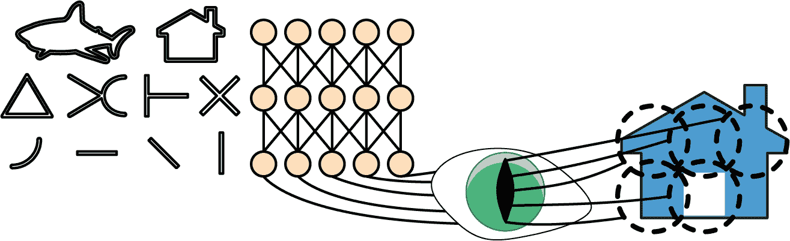

###### 图 12-1. 视觉皮层中的生物神经元对视觉场中称为感受野的小区域内的特定模式做出反应；随着视觉信号通过连续的脑模块，神经元对更大感受野中的更复杂模式做出反应

此外，作者还表明，一些神经元只对水平线的图像做出反应，而另一些神经元只对具有不同方向的线条做出反应（两个神经元可能具有相同的感受野，但对不同的线条方向做出反应）。他们还注意到，一些神经元具有更大的感受野，并对更复杂的模式做出反应，这些模式是较低级别模式的组合。这些观察导致了一种观点，即高级神经元基于相邻的低级神经元的输出（在图 12-1 中，注意每个神经元只与前一层的邻近神经元相连）。这种强大的架构能够检测视觉场任何区域的复杂模式。

这些对视觉皮层的研究启发了 1980 年引入的[新认知机](https://homl.info/74)⁠^(4)，它逐渐演变成了我们现在所说的卷积神经网络。一个重要里程碑是 Yann LeCun 等人于 1998 年发表的一篇[论文](https://homl.info/75)⁠^(5)，介绍了著名的**LeNet-5**架构，该架构被银行广泛用于识别支票上的手写数字。这个架构有一些你已经知道的构建块，例如全连接层和 sigmoid 激活函数，但它还引入了两个新的构建块：**卷积层**和**池化层**。现在让我们来看看它们。

###### 注意

为什么不直接使用具有全连接层的深度神经网络进行图像识别任务呢？遗憾的是，尽管这对于小图像（例如，Fashion MNIST）效果很好，但由于它需要大量的参数，因此对于大图像来说，这种方法会失效。例如，一个 100 × 100 像素的图像有 10,000 个像素，如果第一层只有 1,000 个神经元（这已经严重限制了传递给下一层的信息量），这意味着总共需要 1,000 万个连接。而这只是第一层。CNN 通过使用部分连接层和权重共享来解决这一问题。

# 卷积层

CNN 最重要的构建块是*卷积层*：⁠^(6) 第一卷积层中的神经元并不连接到输入图像中的每一个像素（就像之前章节中讨论的层那样），而是只连接到它们感受野中的像素（见图 12-2）。反过来，第二卷积层中的每个神经元只连接到第一层中位于一个小矩形内的神经元。这种架构使得网络能够专注于第一隐藏层中的小低级特征，然后将它们组装成下一隐藏层中的更大高级特征，依此类推。这种层次结构非常适合处理现实世界图像中常见的复合对象：这也是 CNN 在图像识别中表现如此出色的原因之一。


###### 图 12-2\. 具有矩形局部感受野的 CNN 层

###### 注意

我们之前看到的所有的多层神经网络都是由一长串神经元组成的层，我们必须将输入图像展平为 1D 才能将其输入到神经网络中。在 CNN 中，每一层都是用 2D 表示的，这使得匹配神经元与它们相应的输入变得更容易。

在给定层的第 *i* 行、第 *j* 列的一个神经元连接到前一层中位于第 *i* 到 *i* + *f*[*h*] – 1 行、第 *j* 到 *j* + *f*[*w*] – 1 列的神经元输出，其中 *f*[*h*] 和 *f*[*w*] 是感受野的高度和宽度（见图 12-3）。为了使层具有与前一层相同的高度和宽度，通常会在输入周围添加零，如图中所示。这被称为*零填充*。

通过间隔感受野，也可以将一个大型输入层连接到一个远小的层，如图图 12-4 所示。这大大降低了模型的计算复杂度。从一个感受野到下一个感受野的水平或垂直步长称为**步长**。在图中，一个 5 × 7 输入层（包括零填充）通过 3 × 3 感受野和步长为 2 连接到一个 3 × 4 层。在这个例子中，步长在两个方向上都是相同的，这通常是情况（尽管也有例外）。上层中位于第*i*行、第*j*列的神经元连接到前一层中位于*i* × *s*[*h*]到*i* × *s*[*h*] + *f*[*h*] – 1 行、*j* × *s*[*w*]到*j* × *s*[*w*] + *f*[*w*] – 1 列的神经元的输出，其中*s*[*h*]和*s*[*w*]是垂直和水平步长。

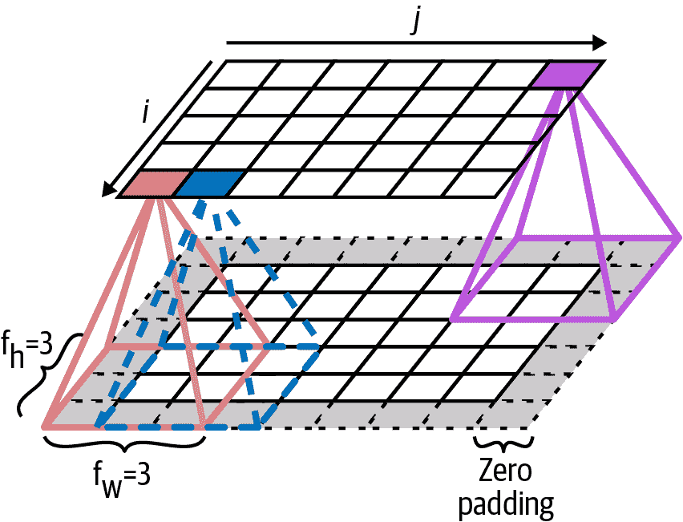

###### 图 12-3\. 层之间的连接和零填充

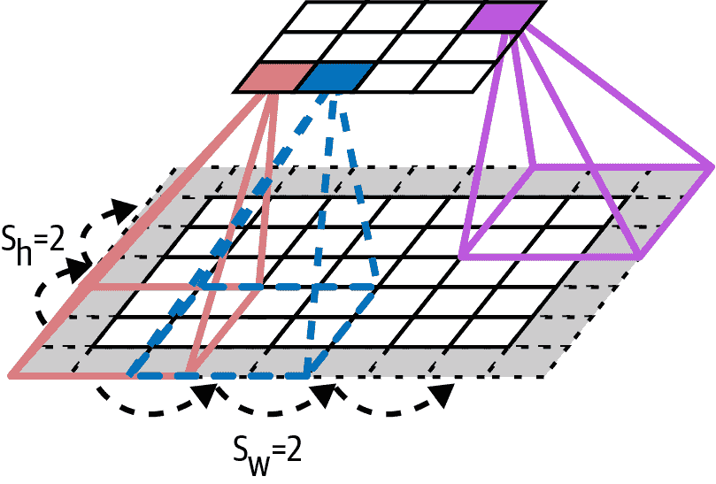

###### 图 12-4\. 使用步长为 2 降低维度

## 滤波器

一个神经元的权重可以表示为一个与感受野大小相同的小图像。例如，图 12-5 显示了两组可能的权重，称为**滤波器**（或**卷积核**，或简称**核**）。第一个滤波器表示为一个中间有垂直白色线的黑色正方形（它是一个 7 × 7 的矩阵，除了中间列，其余都是 0；使用这些权重的神经元将忽略它们感受野中的所有内容，除了中央垂直线，因为所有输入都将乘以 0，除了中央垂直线上的输入）。第二个滤波器是一个中间有水平白色线的黑色正方形。使用这些权重的神经元将忽略它们感受野中的所有内容，除了中央水平线。

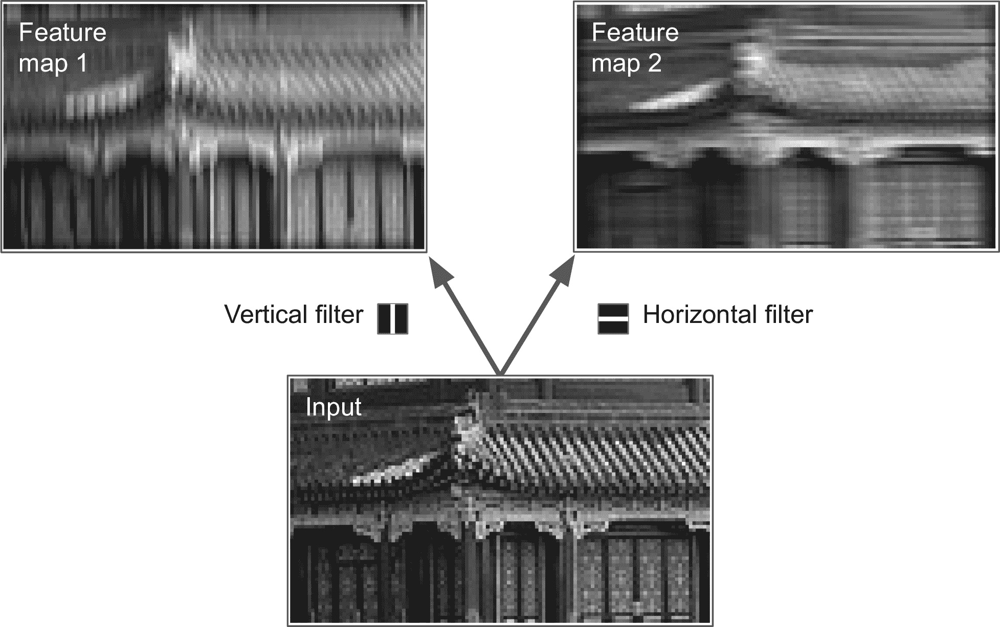

###### 图 12-5\. 应用两个不同的滤波器以获得两个特征图

###### 注意

在深度学习中，我们通常构建一个单一模型，它接受原始输入并产生最终输出。这被称为**端到端学习**。相比之下，传统的视觉系统通常会将系统划分为一系列专门的模块。

现在，如果某一层的所有神经元都使用相同的垂直线过滤器（以及相同的偏置项），并且你将图 12-5 中显示的输入图像（底部图像）输入到网络中，该层将输出左上角的图像。注意，垂直的白色线条被增强，而其余部分则被模糊。同样，右上角的图像是所有神经元都使用相同的水平线过滤器时得到的；注意，水平白色线条被增强，而其余部分则被模糊掉。因此，一个充满使用相同过滤器的神经元的层输出一个*特征图*，它突出了图像中激活过滤器最多的区域。但不用担心，你不需要手动定义过滤器：相反，在训练过程中，卷积层将自动学习其任务中最有用的过滤器，而上面的层将学会将它们组合成更复杂的模式。

## 多个特征图的堆叠

到目前为止，为了简单起见，我将每个卷积层表示为一个二维层，但在现实中，卷积层有多个过滤器（你决定多少个），并且每个过滤器输出一个特征图，因此输出更准确地用三维（参见图 12-6）表示。

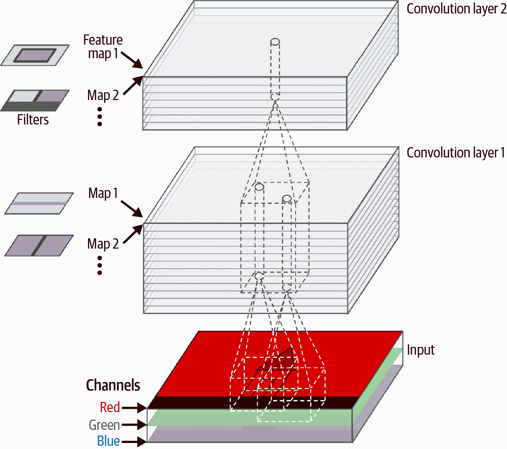

###### 图 12-6\. 每个卷积层有多个过滤器（核），处理具有三个颜色通道的颜色图像；每个卷积层为每个过滤器输出一个特征图

每个特征图中的每个像素都有一个神经元，并且给定特征图内的所有神经元共享相同的参数（即相同的核和偏置项）。不同特征图中的神经元使用不同的参数。神经元的感受野与之前描述的相同，但它扩展到前一层的所有特征图中。简而言之，卷积层同时对其输入应用多个可训练的过滤器，使其能够在输入的任何位置检测到多个特征。

###### 注意

在特征图中的所有神经元共享相同的参数这一事实，显著减少了模型中的参数数量。一旦卷积神经网络学会在某个位置识别一个模式，它就可以在任何其他位置识别该模式。相比之下，一旦一个全连接神经网络学会在某个位置识别一个模式，它只能在那个特定位置识别该模式。

输入图像也由多个子层组成：每个颜色通道一个。如第八章所述，通常有三个：红色、绿色和蓝色（RGB）。灰度图像只有一个通道，但有些图像可能有更多——例如，捕捉额外光频的卫星图像（如红外线）。

具体来说，一个位于给定卷积层 *l* 中特征图 *k* 的第 *i* 行、第 *j* 列的神经元连接到前一层 *l* – 1 中位于行 *i* × *s*[*h*] 到 *i* × *s*[*h*] + *f*[*h*] – 1 和列 *j* × *s*[*w*] 到 *j* × *s*[*w*] + *f*[*w*] – 1 的神经元输出，跨越所有特征图（在层 *l* – *1*）。注意，在一个层中，位于同一行 *i* 和列 *j* 但在不同特征图中的所有神经元都连接到前一层中完全相同的神经元输出。

方程 12-1 总结了前面的解释，通过一个大的数学方程式：它展示了如何计算卷积层中给定神经元的输出。由于所有不同的索引，它看起来有点丑陋，但它所做的只是计算所有输入的加权和，加上偏差项。

##### 方程 12-1\. 计算卷积层中神经元的输出

<mrow><msub><mi>z</mi> <mrow><mi>i</mi><mo lspace="0%" rspace="0%">,</mo><mi>j</mi><mo lspace="0%" rspace="0%">,</mo><mi>k</mi></mrow></msub> <mo>=</mo> <msub><mi>b</mi> <mi>k</mi></msub> <mo>+</mo> <munderover><mo>∑</mo> <mrow><mi>u</mi><mo>=</mo><mn>0</mn></mrow> <mrow><msub><mi>f</mi> <mi>h</mi></msub> <mo>-</mo><mn>1</mn></mrow></munderover> <munderover><mo>∑</mo> <mrow><mi>v</mi><mo>=</mo><mn>0</mn></mrow> <mrow><msub><mi>f</mi> <mi>w</mi></msub> <mo>-</mo><mn>1</mn></mrow></munderover> <munderover><mo>∑</mo> <mrow><mi>k</mi><mo>'</mo><mo>=</mo><mn>0</mn></mrow> <mrow><msub><mi>f</mi> <msup><mi>n</mi> <mo>'</mo></msup></msub> <mo>-</mo><mn>1</mn></mrow></munderover> <msub><mi>x</mi> <mrow><msup><mi>i</mi> <mo>'</mo></msup> <mo lspace="0%" rspace="0%">,</mo><msup><mi>j</mi> <mo>'</mo></msup> <mo lspace="0%" rspace="0%">,</mo><msup><mi>k</mi> <mo>'</mo></msup></mrow></msub> <mo>×</mo> <msub><mi>w</mi> <mrow><mi>u</mi><mo lspace="0%" rspace="0%">,</mo><mi>v</mi><mo lspace="0%" rspace="0%">,</mo><msup><mi>k</mi> <mo>'</mo></msup> <mo lspace="0%" rspace="0%">,</mo><mi>k</mi></mrow></msub> <mtext>with</mtext> <mfenced separators="" open="{" close=""><mtable><mtr><mtd columnalign="left"><mrow><mi>i</mi> <mo>'</mo> <mo>=</mo> <mi>i</mi> <mo>×</mo> <msub><mi>s</mi> <mi>h</mi></msub> <mo>+</mo> <mi>u</mi></mrow></mtd></mtr> <mtr><mtd columnalign="left"><mrow><mi>j</mi> <mo>'</mo> <mo>=</mo> <mi>j</mi> <mo>×</mo> <msub><mi>s</mi> <mi>w</mi></msub> <mo>+</mo> <mi>v</mi></mrow></mtd></mtr></mtable></mfenced></mrow>

在这个方程中：

+   *z*[*i*,] [*j*,] [*k*] 是卷积层（层 *l*）中位于特征图 *k* 的第 *i* 行、第 *j* 列的神经元的输出。

+   如前所述，*s*[*h*] 和 *s*[*w*] 是垂直和水平步长，*f*[*h*] 和 *f*[*w*] 是感受野的高度和宽度，*f*[*n*′] 是前一层（层 *l* – 1）中的特征图数量。

+   *x*[*i*′,] [*j*′,] [*k*′] 是位于层 *l* – 1、行 *i*′、列 *j*′、特征图 *k*′（或通道 *k*′ 如果前一层是输入层）的神经元的输出。

+   *b*[*k*] 是特征图 *k*（在层 *l*）的偏置项。你可以把它想象成一个可以调整特征图 *k* 整体亮度的旋钮。

+   *w*[*u*,] [*v*,] [*k*′,] [*k*] 是层 *l* 中特征图 *k* 的任何神经元与其输入之间的连接权重，该输入位于行 *u*、列 *v*（相对于神经元的感受野），以及特征图 *k*′。

让我们看看如何使用 PyTorch 创建和使用卷积层。

## 使用 PyTorch 实现卷积层

首先，让我们使用 Scikit-Learn 的`load_sample_images()`函数加载一些样本图像。第一张图像代表中国佛教香塔，而第二张图像代表美丽的*大丽花*。这些图像以 Python 列表的形式表示为 NumPy 无符号字节数组，因此让我们将这些图像堆叠成一个单一的 NumPy 数组，然后将其转换为 32 位浮点张量，并将像素值从 0–255 缩放到 0–1：

```py
import numpy as np
import torch
from sklearn.datasets import load_sample_images

sample_images = np.stack(load_sample_images()["images"])
sample_images = torch.tensor(sample_images, dtype=torch.float32) / 255
```

让我们看看这个张量的形状：

```py
>>> sample_images.shape
torch.Size([2, 427, 640, 3])
```

我们有两张图像，它们的高度都是 427 像素，宽度都是 640 像素，并且它们有三个颜色通道：红色、绿色和蓝色。正如我们在第十章中看到的，PyTorch 期望通道维度仅在高度和宽度维度之前，而不是之后，因此我们需要使用`permute()`方法对维度进行置换：

```py
>>> sample_images_permuted = sample_images.permute(0, 3, 1, 2)
>>> sample_images_permuted.shape
torch.Size([2, 3, 427, 640])
```

让我们也使用 TorchVision 的`CenterCrop`类来对图像进行中心裁剪：

```py
>>> import torchvision
>>> import torchvision.transforms.v2 as T
>>> cropped_images = T.CenterCrop((70, 120))(sample_images_permuted)
>>> cropped_images.shape
torch.Size([2, 3, 70, 120])
```

现在，让我们创建一个二维卷积层，并将这些裁剪后的图像输入其中，看看会得到什么。为此，PyTorch 提供了`nn.Conv2d`层。在底层，这个层依赖于`torch.nn.((("torch", "F.conv2d()")))functional.conv2d()`函数。让我们创建一个具有 32 个过滤器、每个大小为 7 × 7 的卷积层（使用`kernel_size=7`，相当于使用`kernel_size=(7 , 7)`），并将此层应用于我们的小批量两张图像：

```py
import torch.nn as nn

torch.manual_seed(42)
conv_layer = nn.Conv2d(in_channels=3, out_channels=32, kernel_size=7)
fmaps = conv_layer(cropped_images)
```

###### 注意

当我们谈论一个二维卷积层时，“2D”指的是空间维度（高度和宽度），但正如你所见，该层接受 4D 输入：正如我们所见，这两个额外的维度是批大小（第一个维度）和通道（第二个维度）。

现在，让我们看看输出的形状：

```py
>>> fmaps.shape
torch.Size([2, 32, 64, 114])
```

输出形状与输入形状相似，但有两大主要区别。首先，通道数从 3 变为 32。这是因为我们设置了`out_channels=32`，因此我们得到了 32 个输出特征图：不再是每个位置的红色、绿色和蓝色的强度，而是现在在每个位置都有每个特征的强度。其次，高度和宽度都缩小了 6 个像素。这是因为`nn.Conv2d`层默认不使用任何零填充，这意味着我们在输出特征图的边缘会丢失一些像素，这取决于滤波器的大小。在这种情况下，由于滤波器大小为 7，我们在水平和垂直方向上各丢失了 6 个像素（即每边 3 个像素）。

###### 警告

默认情况下，`padding`超参数设置为 0，这意味着填充被关闭。奇怪的是，这也被称为*valid 填充*，因为每个神经元的感受野严格位于输入内的*valid*位置（它不会越界）。实际上，你可以设置`padding="valid"`，这相当于`padding=0`。这不是 PyTorch 的命名怪癖：每个人都使用这种令人困惑的命名法。

如果我们改为设置`padding="same"`，那么输入将在所有边填充足够的零，以确保输出特征图最终的大小与输入相同（因此该选项的名称为“same”）：

```py
>>> conv_layer = nn.Conv2d(in_channels=3, out_channels=32, kernel_size=7,
...                        padding="same")
...
>>> fmaps = conv_layer(cropped_images)
>>> fmaps.shape
torch.Size([2, 32, 70, 120])
```

这两种填充选项在图 12-7 中进行了说明。为了简化，这里只显示了水平维度，但当然，同样的逻辑也适用于垂直维度。


###### 图 12-7\. 两种不同的填充选项，`stride=1`和`kernel_size=7`

如果步长大于 1（在任何方向上），则输出大小将远小于输入大小。例如，假设输入大小为 70 × 120，那么如果你设置`stride=2`（或等价地`stride=(2, 2)`），`padding=3`，和`kernel_size=7`，那么输出特征图将是 35 × 60：垂直和水平方向都减半。你可以设置一个非常大的填充值，使输出大小与输入大小相同，但这几乎肯定是一个糟糕的主意，因为它会让你的图像淹没在零的海洋中（因此，PyTorch 会在你设置`padding="same"`和步长大于 1 时抛出异常）。图 12-8 说明了`stride=2`，`kernel_size=7`和`padding`设置为 0 或 3。


###### 图 12-8\. 两种不同的填充选项，`stride=2`和`kernel_size=7`：输出大小大大减小

现在，让我们看看该层的参数（在方程 12-1 中表示为*w*[*u*,] [*v*,] [*k*′,] [*k*]和*b*[*k*]）。就像`nn.Linear`层一样，`nn.Conv2d`层包含了所有层的参数，包括核和偏置，这些参数可以通过`weight`和`bias`属性访问：

```py
>>> conv_layer.weight.shape
torch.Size([32, 3, 7, 7])
>>> conv_layer.bias.shape
torch.Size([32])
```

`weight`张量是 4 维的，其形状为[*output_channels*, *input_channels*, *kernel_height*, *kernel_width*]。`bias`张量是 1 维的，形状为[*output_channels*]。输出通道数等于输出特征图的数量，这也等于滤波器的数量。最重要的是，请注意，输入图像的高度和宽度不会出现在核的形状中：这是因为，正如前面解释的那样，输出特征图中的所有神经元共享相同的权重。这意味着只要图像的大小至少与核一样大，并且具有正确的通道数（在这个例子中是三个），您就可以将任何大小的图像输入到这个层。

在每个卷积层之后添加激活函数是很重要的。这与`nn.Linear`层的原因相同：卷积层执行线性操作，所以如果您堆叠多个没有激活函数的卷积层，它们都将等效于单个卷积层，并且它们将无法学习任何真正复杂的东西。

`weight`和`bias`参数都是随机初始化的，使用与`nn.Linear`层类似的均匀分布，介于$minus StartFraction 1 Over StartRoot k EndRoot EndFraction$和$plus StartFraction 1 Over StartRoot k EndRoot EndFraction$之间，其中*k*是 fan[in]。在`nn.Conv2d`中，*k* = *f*[h] × *f*[w] × *f*[n’]，其中*f*[h]和*f*[w]是核的高度和宽度，*f*[n’]是输入通道数。正如我们在第十一章中看到的，您通常会根据所使用的激活函数重新初始化权重。例如，当您使用 ReLU 激活函数时，应该应用 He 初始化。至于偏置，它们可以简单地重新初始化为零。

如您所见，卷积层有很多超参数：滤波器数量（`out_channels`）、核大小、填充类型、步长和激活函数。像往常一样，您可以使用交叉验证来找到正确的超参数值，但这非常耗时。我们将在本章后面讨论常见的 CNN 架构，以给您一些关于哪些超参数值在实际中效果最好的想法。

现在，让我们看看 CNN 的第二个常见构建块：*池化层*。

# 池化层

一旦你理解了卷积层的工作原理，池化层就很容易理解了。它们的目标是*下采样*（即缩小）输入图像，以减少计算负载、内存使用量和参数数量（从而限制过拟合的风险）。

就像在卷积层中一样，池化层中的每个神经元都连接到前一层中有限数量的神经元，这些神经元位于一个小矩形感受野内。你必须定义其大小、步长和填充类型，就像之前一样。然而，池化神经元没有权重或偏差；它所做的只是使用聚合函数（如最大值或平均值）聚合输入。图 12-9 显示了*最大池化层*，这是最常见的池化层类型。在这个例子中，我们使用了一个 2×2 的*池化核*，步长为 2，没有填充。只有每个感受野中的最大输入值才能进入下一层，而其他输入则被丢弃。例如，在图 12-9 中左下角的感受野中，输入值是 1、5、3 和 2，所以只有最大值 5 被传播到下一层。由于步长为 2，输出图像的高度和宽度是输入图像的一半（因为我们没有使用填充，所以向下取整）。

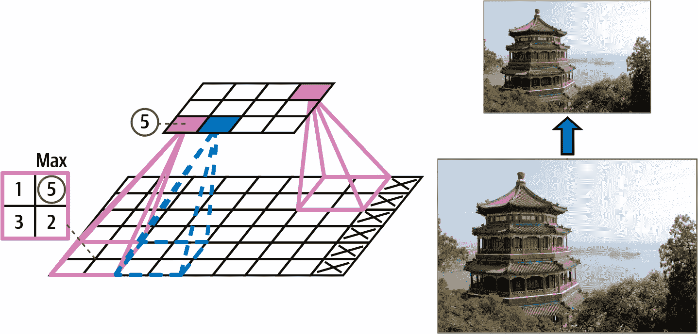

###### 图 12-9。最大池化层（2×2 池化核，步长 2，无填充）

###### 注意

池化层通常独立地对每个输入通道进行操作，因此输出深度（即通道数）与输入深度相同。

除了减少计算量、内存使用量和参数数量外，最大池化层还引入了一定程度的小尺度平移不变性，如图图 12-10 所示。在这里，我们假设亮像素的值低于暗像素，并考虑三个图像（A、B、C）通过一个 2×2 核和步长为 2 的最大池化层。图像 B 和 C 与图像 A 相同，但分别向右移动了一个和两个像素。正如你所见，最大池化层对图像 A 和 B 的输出是相同的。这就是平移不变性的意思。对于图像 C，输出是不同的：它向右移动了一个像素（但仍有 50%的不变性）。通过在 CNN 的每几层中插入一个最大池化层，可以在更大的尺度上获得一定程度的平移不变性。此外，最大池化还提供了一定程度的旋转不变性和轻微的尺度不变性。这种不变性（即使它有限）在预测不应依赖于这些细节的情况下可能是有用的，例如在分类任务中。


###### 图 12-10\. 对微小平移的不变性

然而，最大池化也有一些缺点。它显然是非常破坏性的：即使使用一个微小的 2 × 2 核和步长为 2，输出在两个方向上都会缩小两倍（因此面积会缩小四倍），从而丢弃了 75%的输入值。在某些应用中，不变性并不理想。以语义分割（根据像素所属的对象对图像中的每个像素进行分类的任务，我们将在本章后面探讨）为例：显然，如果输入图像向右平移一个像素，输出也应该向右平移一个像素。在这种情况下，目标是**等变性**，而不是不变性：输入的微小变化应该导致输出中相应的微小变化。

# 使用 PyTorch 实现池化层

以下代码创建了一个`nn.MaxPool2d`层，使用一个 2 × 2 核。步长默认为核大小，因此这个层使用步长为 2（水平和垂直）。默认情况下，它使用`padding=0`（即“有效”填充）：

```py
max_pool = nn.MaxPool2d(kernel_size=2)
```

要创建一个**平均池化层**，只需使用`nn.AvgPool2d`，而不是`nn.MaxPool2d`。正如你可能预期的那样，它的工作方式与最大池化层完全一样，只不过它计算的是平均值而不是最大值。平均池化层曾经非常流行，但现在人们大多使用最大池化层，因为它们通常表现更好。这可能会让人感到惊讶，因为计算平均值通常比计算最大值损失的信息更少。但另一方面，最大池化只保留最强的特征，去除所有无意义的特征，因此下一层可以得到更干净的信号来处理。此外，最大池化比平均池化提供了更强的平移不变性，并且计算量略小。

注意，最大池化和平均池化也可以在深度维度而不是空间维度上执行，尽管这并不常见。这可以使 CNN 学习对各种特征的不变性。例如，它可能学习多个滤波器，每个滤波器检测相同图案的不同旋转（例如手写数字；参见图 12-11），而深度最大池化层将确保输出不受旋转影响。CNN 可以类似地学习对任何事物的不变性：厚度、亮度、倾斜、颜色等等。

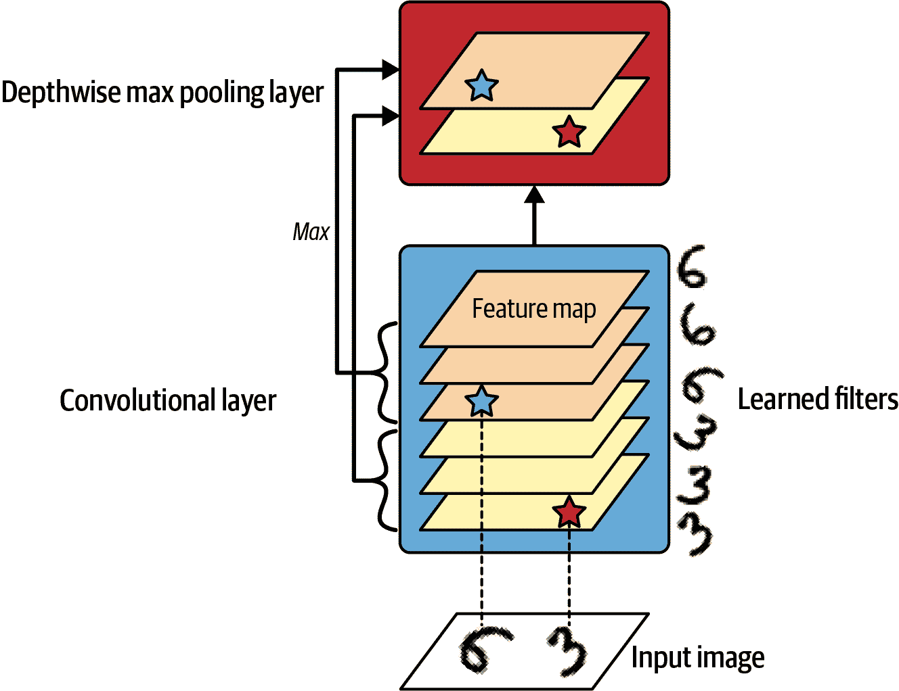

###### 图 12-11\. 深度最大池化有助于 CNN 学习不变性（在这种情况下是对旋转的不变性）

PyTorch 不包括深度最大池化层，但我们可以基于 `torch.F.max_pool1d()` 函数实现一个自定义模块：

```py
import torch.nn.functional as F

class DepthPool(torch.nn.Module):
    def __init__(self, kernel_size, stride=None, padding=0):
        super().__init__()
        self.kernel_size = kernel_size
        self.stride = stride if stride is not None else kernel_size
        self.padding = padding

    def forward(self, inputs):
        batch, channels, height, width = inputs.shape
        Z = inputs.view(batch, channels, height * width)  # merge spatial dims
        Z = Z.permute(0, 2, 1)  # switch spatial and channels dims
        Z = F.max_pool1d(Z, kernel_size=self.kernel_size, stride=self.stride,
                         padding=self.padding)  # compute max pool
        Z = Z.permute(0, 2, 1)  # switch back spatial and channels dims
        return Z.view(batch, -1, height, width)  # unmerge spatial dims
```

例如，假设输入批次包含两个 70 × 120 的图像，每个图像有 32 个通道（即输入的形状为 `[2, 32, 70, 120]`），我们使用 `kernel_size=4`，默认的 `stride`（等于 `kernel_size`）和 `padding=0`：

+   `forward()` 方法首先合并空间维度，这给我们一个形状为 `[2, 32, 8400]` 的张量（因为 70 × 120 = 8,400）。

+   然后，它再次置换最后两个维度，所以我们得到形状为 `[2, 8400, 32]`。

+   接下来，它使用 `max_pool1d()` 函数来计算最后一个维度的最大池化，这对应于我们原始的 32 个通道。由于 `kernel_size` 和 `stride` 都等于 4，我们没有使用任何填充，最后一个维度的尺寸被除以 4，因此得到的形状是 `[2, 8400, 8]`。

+   函数随后再次对最后两个维度进行置换，得到形状为 `[2, 8, 8400]`。

+   最后，它将空间维度分开，得到最终的形状 `[2, 8, 50, 100]`。你可以验证输出正是我们想要的。

在现代架构中经常看到的一种最后类型的池化层是 *全局平均池化层*。它的工作方式非常不同：它所做的只是计算每个整个特征图的平均值。因此，它为每个特征图和每个实例输出一个单一的数字。虽然这当然是非常破坏性的（特征图中大部分信息都丢失了），但它可以在输出层之前非常有用，正如你将在本章后面看到的那样。

要创建这样的层，一个选项是使用常规的 `nn.AvgPool2d` 层并将其核大小设置为与输入相同的大小。然而，这并不太方便，因为它需要提前知道输入的确切维度。一个更简单的解决方案是使用 `nn.AdaptiveAvgPool2d` 层，它允许你指定所需的输出空间维度：它会自动调整核大小（具有相等的步长）以获得所需的结果，如果需要会添加一些填充。如果我们设置输出大小为 1，我们得到一个全局平均池化层：

```py
global_avg_pool = nn.AdaptiveAvgPool2d(output_size=1)
output = global_avg_pool(cropped_images)
```

或者，你也可以直接使用 `torch.mean()` 函数来获取相同的输出：

```py
output = cropped_images.mean(dim=(2, 3), keepdim=True)
```

现在，你已经知道了创建卷积神经网络的所有构建块。让我们看看如何将它们组装起来。

# CNN 架构

典型的 CNN 架构堆叠了几层卷积层（每一层通常后面跟着一个 ReLU 层），然后是一个池化层，然后是几层更多的卷积层（+ReLU），然后是另一个池化层，依此类推。随着图像在网络中前进，它的大小会越来越小，但它通常也会越来越深（即，具有更多的特征图），这要归功于卷积层（参见图 12-12）。在堆栈的顶部，添加了一个常规的前馈神经网络，由几个全连接层（+ReLUs）组成，并且最后一层输出预测（例如，一个输出估计类概率的 softmax 层）。

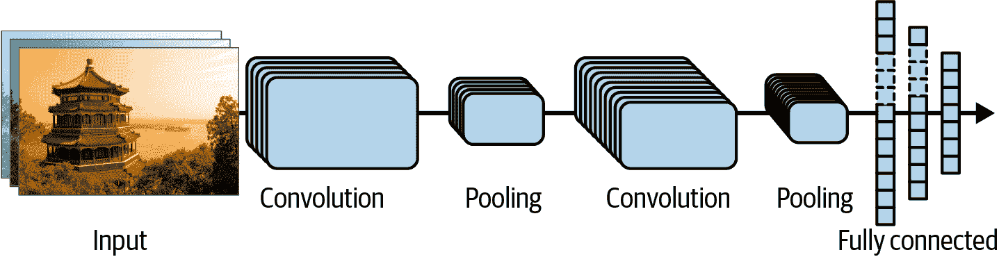

###### 图 12-12. 典型的 CNN 架构

###### 小贴士

与使用 5 × 5 核的卷积层相比，通常更倾向于堆叠两个 3 × 3 核的层：它将使用更少的参数，需要更少的计算，并且通常表现更好。一个例外是第一个卷积层：它通常可以有一个大的核（例如，5 × 5 或 7 × 7），通常步长为 2 或更多。这减少了图像的空间维度，同时不会丢失太多信息，而且由于输入图像通常只有三个通道，这不会太昂贵。

这里是如何实现一个基本的 CNN 来解决 Fashion MNIST 数据集（在第九章中介绍）的方法：

```py
from functools import partial

DefaultConv2d = partial(nn.Conv2d, kernel_size=3, padding="same")
model = nn.Sequential(
    DefaultConv2d(in_channels=1, out_channels=64, kernel_size=7), nn.ReLU(),
    nn.MaxPool2d(kernel_size=2),
    DefaultConv2d(in_channels=64, out_channels=128), nn.ReLU(),
    DefaultConv2d(in_channels=128, out_channels=128), nn.ReLU(),
    nn.MaxPool2d(kernel_size=2),
    DefaultConv2d(in_channels=128, out_channels=256), nn.ReLU(),
    DefaultConv2d(in_channels=256, out_channels=256), nn.ReLU(),
    nn.MaxPool2d(kernel_size=2),
    nn.Flatten(),
    nn.Linear(in_features=2304, out_features=128), nn.ReLU(),
    nn.Dropout(0.5),
    nn.Linear(in_features=128, out_features=64), nn.ReLU(),
    nn.Dropout(0.5),
    nn.Linear(in_features=64, out_features=10),
).to(device)
```

让我们来看看这段代码：

+   我们使用`functools.partial()`函数（在第十一章中介绍）来定义`DefaultConv2d`，它就像`nn.Conv2d`一样，但具有不同的默认参数：小的核大小为 3，以及`"same"`填充。这避免了在整个模型中重复这些参数。

+   接下来，我们创建`nn.Sequential`模型。它的第一层是一个具有 64 个相当大的过滤器（7 × 7）的`DefaultConv2d`。它使用默认步长 1，因为输入图像并不很大。它还使用`in_channels=1`，因为 Fashion MNIST 图像只有一个颜色通道（即灰度）。每个卷积层后面跟着 ReLU 激活函数。

+   然后我们添加一个核大小为 2 的最大池化层，因此它将每个空间维度除以 2 的因子（如果需要则向下取整）。

+   然后我们重复相同的结构两次：两个卷积层后面跟着一个最大池化层。对于更大的图像，我们可以重复这个结构几次。重复的次数是一个你可以调整的超参数。

+   注意，当我们沿着卷积神经网络向上爬到输出层时，滤波器的数量会翻倍（最初是 64，然后是 128，接着是 256）。随着层数的增加而增加是有道理的，因为低级特征的数量通常相当低（例如，小圆圈、水平线），但是将它们组合成高级特征的方法有很多种。在每次池化层之后加倍滤波器的数量是一种常见的做法：由于池化层将每个空间维度除以 2，因此我们可以在不担心参数数量、内存使用或计算负载爆炸的情况下，在下一层加倍特征图的数量。

+   接下来是完全连接的网络，由两个具有 ReLU 激活函数的隐藏密集层（`nn.Linear`）和一个密集输出层组成。由于这是一个有 10 个类别的分类任务，输出层有 10 个单元。正如我们在第十章中所做的那样，我们省略了 softmax 激活函数，因此模型将输出 logits 而不是概率，我们必须使用`nn.CrossEntropyLoss`来训练模型。请注意，我们必须在第一个密集层之前将输入展平，因为它期望每个实例都有一个特征的一维数组。我们还添加了两个 dropout 层，每个层的 dropout 率为 50%，以减少过拟合。

###### 小贴士

第一个`nn.Linear`层有 2,304 个输入特征：这个数字是从哪里来的？嗯，时尚 MNIST 图像是 28 × 28 像素，但是池化层将它们缩小到 14 × 14，然后是 7 × 7，最后是 3 × 3。在第一个`nn.Linear`层之前，有 256 个特征图，所以我们最终有 256 × 3 × 3 = 2,304 个输入特征。弄清楚特征的数量有时可能有点困难，但一个技巧是将`in_features`设置为某个任意值（比如说 999），并让训练失败。正确的特征数量会出现在错误信息中：“RuntimeError：mat1 和 mat2 的形状不能相乘（32x2304 和 999x128）”。另一个选项是使用`nn.LazyLinear`而不是`nn.Linear`：它就像`nn.Linear`层一样，只不过它只在第一次被调用时创建权重矩阵：然后它可以自动将输入特征的数量设置为正确的值。其他层——例如卷积层和批归一化层——也有懒惰的变体。

如果你在这个时尚 MNIST 训练集上训练这个模型，它应该在测试集上达到接近 92%的准确率（你可以使用我们在第十章中定义的`train()`和`evaluate_tm()`函数）。它不是最先进的，但相当不错，比我们在第九章中使用密集网络实现的要好。

几年来，这种基本架构的变体得到了发展，在领域内取得了惊人的进步。衡量这种进步的一个好方法是 ILSVRC [ImageNet 挑战赛](https://image-net.org)中的错误率。在这个比赛中，图像分类的错误率在 6 年内从超过 26% 下降到不到 2.3%。更确切地说，这是 *前五错误率*，即测试图像中系统对其五个最自信的预测没有包含正确答案的比率。图像相当大（例如，高度为 256 像素），有 1,000 个类别，其中一些非常微妙（尝试区分 120 种狗的品种！）。查看获胜作品的演变是了解 CNN 的工作原理以及深度学习研究进展的好方法。

我们将首先查看经典的 LeNet-5 架构（1998 年），然后是 ILSVRC 挑战赛的几个获胜者：AlexNet（2012 年）、GoogLeNet（2014 年）、ResNet（2015 年）和 SENet（2017 年）。我们还将讨论一些其他架构，包括 VGGNet、Xception、ResNeXt、DenseNet、MobileNet、CSPNet、EfficientNet 和 ConvNeXt（我们将在第十六章中讨论视觉 Transformer）。

## LeNet-5

[LeNet-5 架构](https://homl.info/lenet5)⁠^(8)可能是最广为人知的 CNN 架构。如前所述，它是由 Yann LeCun 在 1998 年创建的，并被广泛用于手写数字识别（MNIST）。它由表 12-1 中显示的层组成。

表 12-1\. LeNet-5 架构

| Layer | 类型 | 图层 | 大小 | 核大小 | 步长 | 激活 |
| --- | --- | --- | --- | --- | --- | --- |
| Out | 全连接 | – | 10 | – | – | RBF |
| F6 | 全连接 | – | 84 | – | – | tanh |
| C5 | 卷积 | 120 | 1 × 1 | 5 × 5 | 1 | tanh |
| S4 | 平均池化 | 16 | 5 × 5 | 2 × 2 | 2 | tanh |
| C3 | 卷积 | 16 | 10 × 10 | 5 × 5 | 1 | tanh |
| S2 | 平均池化 | 6 | 14 × 14 | 2 × 2 | 2 | tanh |
| C1 | 卷积 | 6 | 28 × 28 | 5 × 5 | 1 | tanh |
| In | 输入 | 1 | 32 × 32 | – | – | – |

如您所见，这与我们的 Fashion MNIST 模型非常相似：一系列卷积层和池化层，之后是一个密集的网络。也许与更现代的分类 CNN 相比的主要区别在于激活函数：今天，我们会使用 ReLU 而不是 tanh，以及 softmax 而不是 RBF（在第二章中介绍）。还有一些其他的小差异并不真正重要，但如果您感兴趣，它们在本章的笔记本中列出，见[*https://homl.info/colab-p*](https://homl.info/colab-p)。Yann LeCun 的[网站](http://yann.lecun.com/exdb/lenet)也展示了 LeNet-5 对数字进行分类的精彩演示。

## AlexNet

[AlexNet CNN 架构](https://homl.info/80)⁠^(9)通过大幅领先赢得了 2012 年 ILSVRC 挑战赛：它实现了 17%的顶级错误率，而第二名的竞争者只有 26%！AlexNet 由 Alex Krizhevsky（因此得名）、Ilya Sutskever 和 Geoffrey Hinton 开发。它与 LeNet-5 相似，只是更大、更深，并且它是第一个直接堆叠卷积层而不是在每个卷积层之上堆叠池化层的架构。表 12-2 展示了这一架构。

表 12-2\. AlexNet 架构

| 层 | 类型 | Maps | Size | 核大小 | 步长 | 填充 | 激活 |
| --- | --- | --- | --- | --- | --- | --- | --- |
| Out | 全连接 | – | 1,000 | – | – | – | Softmax |
| F10 | 全连接 | – | 4,096 | – | – | – | ReLU |
| F9 | 全连接 | – | 4,096 | – | – | – | ReLU |
| S8 | 最大池化 | 256 | 6 × 6 | 3 × 3 | 2 | `valid` | – |
| C7 | 卷积 | 256 | 13 × 13 | 3 × 3 | 1 | `same` | ReLU |
| C6 | 卷积 | 384 | 13 × 13 | 3 × 3 | 1 | `same` | ReLU |
| C5 | 卷积 | 384 | 13 × 13 | 3 × 3 | 1 | `same` | ReLU |
| S4 | 最大池化 | 256 | 13 × 13 | 3 × 3 | 2 | `valid` | – |
| C3 | 卷积 | 256 | 27 × 27 | 5 × 5 | 1 | `same` | ReLU |
| S2 | 最大池化 | 96 | 27 × 27 | 3 × 3 | 2 | `valid` | – |
| C1 | 卷积 | 96 | 55 × 55 | 11 × 11 | 4 | `valid` | ReLU |
| In | 输入 | 3 (RGB) | 227 × 227 | – | – | – | – |

为了减少过拟合，作者使用了两种正则化技术。首先，他们在训练过程中对 F9 和 F10 层的输出应用了 dropout（在第十一章中介绍），dropout 率为 50%。其次，他们通过随机平移训练图像、水平翻转和改变光照条件来执行数据增强。

AlexNet 还使用了一种名为*局部响应归一化*（LRN）的正则化技术：最强烈激活的神经元抑制位于相邻特征图中相同位置的神经元。这种竞争性激活在生物神经元中已被观察到。这鼓励不同的特征图进行专业化，将它们推开，并迫使它们探索更广泛的功能范围，从而提高泛化能力。然而，这种技术主要被更简单、更有效的正则化技术所取代，尤其是批量归一化。

一种名为[*ZFNet*](https://homl.info/zfnet)⁠^(10)的 AlexNet 变体由 Matthew Zeiler 和 Rob Fergus 开发，并在 2013 年 ILSVRC 挑战赛中获胜。它本质上与 AlexNet 相似，只是对一些超参数（特征图数量、核大小、步长等）进行了微调。

## GoogLeNet

[GoogLeNet 架构](https://homl.info/81)是由 Google 研究的 Christian Szegedy 等人开发的⁠^(11)，它通过将前五名的错误率推至 7% 以下赢得了 ILSVRC 2014 挑战赛。这种出色的性能在很大程度上得益于网络比之前的 CNN 深得多（正如你将在 图 12-15 中看到的那样）。这是通过称为 *inception 模块* 的子网络实现的⁠^(12)，它允许 GoogLeNet 比之前的架构更有效地使用参数：GoogLeNet 实际上比 AlexNet 少 10 倍的参数（大约 600 万而不是 6000 万）。

图 12-14 展示了 inception 模块的架构。符号“3 × 3 + 1(S)”表示该层使用 3 × 3 内核，步长 1，以及 `"same"` 填充。输入信号首先并行馈送到四个不同的层。所有卷积层都使用 ReLU 激活函数。请注意，顶部的卷积层使用不同的内核大小（1 × 1、3 × 3 和 5 × 5），这使得它们能够捕捉不同尺度的模式。此外，请注意，每一层都使用步长 1 和 `"same"` 填充（甚至最大池化层），因此它们的输出与它们的输入具有相同的高度和宽度。这使得在最终的 *深度拼接层*（即，它拼接了上层四个卷积层输出的多个特征图）中沿深度维度拼接所有输出成为可能。它可以使用 `torch.cat()` 函数实现，其中 `dim=1`。

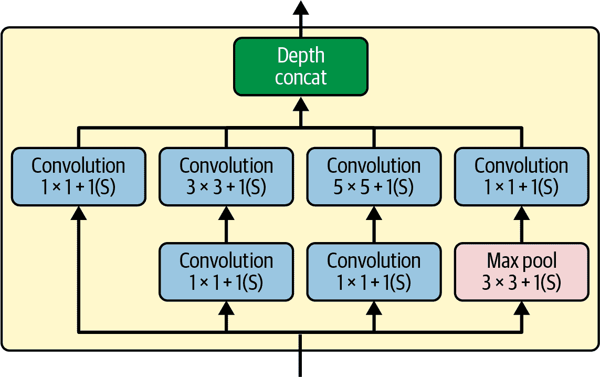

###### 图 12-14\. Inception 模块

你可能会想知道为什么 inception 模块有 1 × 1 内核的卷积层。当然，这些层无法捕捉任何特征，因为它们一次只查看一个像素，对吧？实际上，这些层有三个作用：

+   尽管它们无法捕捉空间模式，但它们可以捕捉深度维度上的模式（即，跨通道）。

+   它们被配置为输出比输入更少的特征图，因此它们作为 *瓶颈层*，意味着它们降低维度。这减少了计算成本和参数数量，加快了训练速度并提高了泛化能力。

+   每一对卷积层（[1 × 1, 3 × 3] 和 [1 × 1, 5 × 5]）就像一个单一的强大卷积层，能够捕捉更复杂的模式。卷积层相当于在图像上扫过一个密集层（在每个位置，它只查看一个小感受野），而这些成对的卷积层相当于在图像上扫过两层神经网络。

简而言之，你可以将整个 inception 模块视为一种类固醇化的卷积层，能够输出能够捕捉到各种尺度复杂模式的特征图。

现在，让我们看看 GoogLeNet 卷积神经网络（CNN）的架构（见图 12-15）。每个卷积层和池化层输出的特征图数量在核大小之前显示。架构非常深，以至于需要用三列来表示，但 GoogLeNet 实际上是一个高高的堆叠，包括九个 inception 模块（带有旋转顶部的盒子）。inception 模块中的六个数字代表模块中每个卷积层输出的特征图数量（顺序与图 12-14 中的相同）。请注意，所有卷积层都使用 ReLU 激活函数。

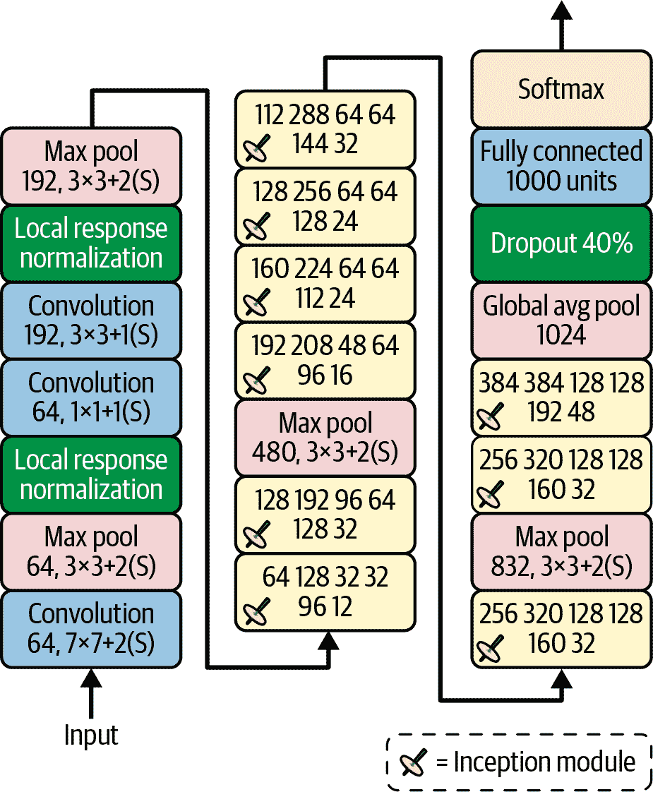

###### 图 12-15\. GoogLeNet 架构

让我们遍历这个网络：

+   前两层将图像的高度和宽度分别除以 4（因此面积除以 16），以减少计算负担。第一层使用较大的核大小，7×7，这样就能保留大部分信息。

+   然后局部响应归一化层确保前一层学习到广泛的特征（如前所述）。

+   接着是两个卷积层，其中第一个类似于瓶颈层。如前所述，你可以将这对层视为一个更智能的单个卷积层。

+   再次，一个局部响应归一化层确保了前一层能够捕捉到广泛的模式。

+   接下来，一个最大池化层将图像的高度和宽度减少到原来的二分之一，再次用于加速计算。

+   然后是 CNN 的*主干*：九个 inception 模块的高高堆叠，穿插着几个最大池化层以降低维度并加速网络。

+   接下来，全局平均池化层输出每个特征图的平均值：这去除了任何剩余的空间信息，这很好，因为在这个点上空间信息已经很少了。实际上，GoogLeNet 的输入图像通常是 224×224 像素，经过 5 个最大池化层后，每个池化层将高度和宽度除以 2，特征图降至 7×7。此外，这是一个分类任务，而不是定位任务，所以物体在哪里并不重要。多亏了这一层带来的维度降低，就不需要在 CNN 的顶部有多个全连接层（如 AlexNet 中那样），这大大减少了网络中的参数数量，并限制了过拟合的风险。

+   最后几层是显而易见的：用于正则化的 dropout 层，然后是一个包含 1,000 个单元的全连接层（因为共有 1,000 个类别），以及一个 softmax 激活函数来输出估计的类别概率。

原始的 GoogLeNet 架构在第三和第六个 Inception 模块的顶部插入了两个辅助分类器。它们都由一个平均池化层、一个卷积层、两个全连接层和一个 softmax 激活层组成。在训练过程中，它们的损失（按 70%的比例缩小）被添加到总损失中。目标是解决梯度消失问题并正则化网络，但后来发现它们的效果相对较小。

Google 研究人员后来提出了 GoogLeNet 架构的几个变体，包括 Inception-v3 和 Inception-v4，它们使用略微不同的 Inception 模块以达到更好的性能。

## ResNet

Kaiming He 等人使用一个[残差网络（ResNet）](https://homl.info/82)⁠^(13)赢得了 2015 年 ILSVRC 挑战赛，该网络在 3.6%以下的误差率下取得了惊人的前五名。获胜的变体使用了一个由 152 层组成的极其深的 CNN（其他变体有 34、50 和 101 层）。这证实了一般趋势：计算机视觉模型变得越来越深，参数越来越少。能够训练如此深的网络的关键是使用*跳跃连接*（也称为*快捷连接*）：输入到层的信号也被添加到堆栈中更高层的层的输出。让我们看看为什么这很有用。

在训练神经网络时，目标是使其模拟目标函数*h*(**x**)。如果你将输入**x**添加到网络的输出（即添加一个跳跃连接），那么网络将被迫模拟*f*(**x**) = *h*(**x**) – **x**而不是*h*(**x**)。这被称为*残差学习*（参见图 12-16）。


###### 图 12-16\. 残差学习

当你初始化一个神经网络时，其权重接近于零，因此常规网络在训练开始时只输出接近零的值。但是，如果你添加一个跳跃连接，结果网络将输出其输入的副本；换句话说，它在训练开始时充当了恒等函数。如果目标函数相当接近恒等函数（这通常是情况），这将大大加快训练速度。

此外，如果你添加了许多跳跃连接，即使有几层还没有开始学习，网络也能开始取得进展（参见图 12-17）。多亏了跳跃连接，信号可以轻松地穿越整个网络。深度残差网络可以看作是一堆*残差单元*（RUs），其中每个残差单元都是一个带有跳跃连接的小型神经网络。

现在，让我们看看 ResNet 的架构（参见 图 12-18）。它出人意料地简单。它开始和结束都与 GoogLeNet 完全一样（除了没有 dropout 层），中间只是一个非常深的残差单元堆叠。每个残差单元由两个卷积层（没有池化层！）组成，使用批量归一化（BN）和 ReLU 激活，使用 3 × 3 内核并保留空间维度（步长 1，`"same"` 填充）。


###### 图 12-17\. 常规深度神经网络（左）和深度残差网络（右）


###### 图 12-18\. ResNet 架构

注意，特征图的数量在每几个残差单元后翻倍，同时其高度和宽度减半（使用步长为 2 的卷积层）。当这种情况发生时，输入不能直接添加到残差单元的输出中，因为它们的形状不同（例如，这个问题影响了图 12-18 中由虚线箭头表示的跳跃连接）。为了解决这个问题，输入通过一个步长为 2 的 1 × 1 卷积层和正确的输出特征图数量传递（参见 图 12-19）。


###### 图 12-19\. 改变特征图大小和深度时的跳跃连接

###### 小贴士

在训练过程中，对于每个小批量，你可以跳过一组随机的残差单元。这种 [*随机深度* 技术](https://homl.info/sdepth)⁠^(14) 可以显著加快训练速度，而不会影响准确性。你可以使用 `torchvision.ops.​sto⁠chastic_depth()` 函数来实现它。

架构的不同变体存在，层数数量不同。ResNet-34 是一个包含 34 层的 ResNet（仅计算卷积层和全连接层）⁠^(15)，包含 3 个输出 64 个特征图的 RUs，4 个输出 128 个地图的 RUs，6 个输出 256 个地图的 RUs，以及 3 个输出 512 个地图的 RUs。我们将在本章后面实现这个架构。

比 ResNet-152 更深的 ResNets，例如 ResNet-152，使用略微不同的残差单元。它们不是使用两个 3 × 3 的卷积层，例如 256 个特征图，而是使用三个卷积层：首先是一个 1 × 1 的卷积层，只有 64 个特征图（4 倍少），它作为瓶颈层（如前所述），然后是一个 64 个特征图的 3 × 3 层，最后是一个 256 个特征图（64 的四倍）的另一个 1 × 1 卷积层，以恢复原始深度。ResNet-152 包含 3 个这样的残差单元，输出 256 个图，然后是 8 个 512 个图的 RU，接着是 36 个 1,024 个图的 RU，最后是 3 个 2,048 个图的 RU。

###### 注意

谷歌的[Inception-v4 架构](https://homl.info/84)⁠^(16)将 GoogLeNet 和 ResNet 的思想合并，在 ImageNet 分类任务上实现了接近 3%的顶级错误率。

## Xception

GoogLeNet 架构的另一个变体值得关注：[Xception](https://homl.info/xception)⁠^(17)（代表*极端 Inception*）由 François Chollet（深度学习框架 Keras 的作者）于 2016 年提出，在巨大的视觉任务（3.5 亿张图像和 17,000 个类别）上显著优于 Inception-v3。就像 Inception-v4 一样，它将 GoogLeNet 和 ResNet 的思想合并，但它用一种称为*深度可分离卷积层*（或简称*可分离卷积层*⁠^(18))的特殊层替换了 inception 模块。这些层在之前的一些 CNN 架构中已经使用过，但在 Xception 架构中并不像这样核心。而常规卷积层使用尝试同时捕捉空间模式（例如，椭圆形）和跨通道模式（例如，嘴巴+鼻子+眼睛=脸）的滤波器，可分离卷积层则做出了一个强烈的假设，即空间模式和跨通道模式可以分别建模（参见图 12-20）。因此，它由两部分组成：第一部分对每个输入特征图应用单个空间滤波器，然后第二部分专门寻找跨通道模式——它只是一个具有 1 × 1 滤波器的常规卷积层。

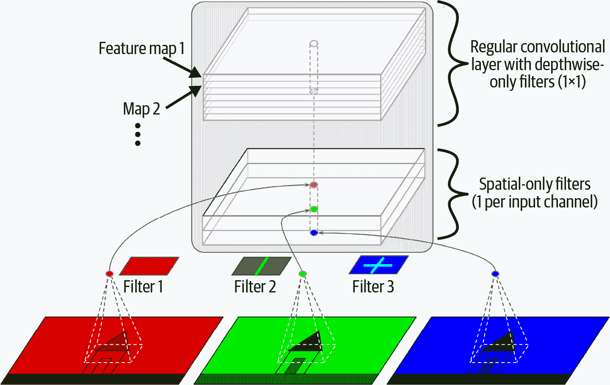

###### 图 12-20. 深度可分离卷积层

由于可分离卷积层每个输入通道只有一个空间滤波器，因此在具有太多通道的层之后，例如输入层（当然，图 12-20 就代表了这一点，但只是为了说明目的），你应该避免使用它们。因此，Xception 架构从 2 个常规卷积层开始，但其余架构只使用可分离卷积（总共 34 个），再加上一些最大池化层和常规的最终层（一个全局平均池化层和一个密集输出层）。

你可能会想知道为什么 Xception 被认为是 GoogLeNet 的一个变体，因为它根本不包含任何 Inception 模块。好吧，如前所述，Inception 模块包含具有 1×1 滤波器的卷积层：它们专门寻找跨通道模式。然而，位于其上的卷积层是常规卷积层，它们同时寻找空间和跨通道模式。因此，你可以将 Inception 模块视为常规卷积层（考虑空间模式和跨通道模式共同）和可分离卷积层（分别考虑它们）之间的中间层。在实践中，似乎可分离卷积层通常表现更好。

PyTorch 没有包含 `SeparableConv2d` 模块，但实现自己的模块相当直接：

```py
class SeparableConv2d(nn.Module):
    def __init__(self, in_channels, out_channels, kernel_size, stride=1,
                 padding=0):
        super().__init__()
        self.depthwise_conv = nn.Conv2d(
            in_channels, in_channels, kernel_size, stride=stride,
            padding=padding, groups=in_channels)
        self.pointwise_conv = nn.Conv2d(
            in_channels, out_channels, kernel_size=1, stride=1, padding=0)

    def forward(self, inputs):
        return self.pointwise_conv(self.depthwise_conv(inputs))
```

注意第七行的 `groups` 参数：它允许你将输入通道分割成给定数量的独立组，每个组都有自己的滤波器（注意 `in_channels` 和 `out_channels` 需要能被 `groups` 整除）。默认情况下 `groups=1`，这会给你一个正常的卷积层，但如果你将 `groups` 和 `out_channels` 都设置为 `in_channels`，你将得到一个深度卷积层，每个输入通道一个滤波器。这就是可分离卷积层的第一层。第二层是一个常规卷积层，但我们将其内核大小和步长设置为 1。就这样！

###### 小贴士

可分离卷积层比常规卷积层使用更少的参数、更少的内存和更少的计算，并且通常表现更好。除了在具有少量通道的层（如输入通道）之后，你可以默认使用它们。

## SENet

在 2017 年 ILSVRC 挑战赛中获胜的架构是[Squeeze-and-Excitation 网络（SENet）](https://homl.info/senet)。⁠^(19) 这个架构扩展了现有的架构，如 Inception 网络和 ResNets，并提升了它们的性能。这使得 SENet 以惊人的 2.25%的 Top-5 错误率赢得了比赛！Inception 网络和 ResNets 的扩展版本分别称为 *SE-Inception* 和 *SE-ResNet*。提升的原因在于 SENet 为原始架构中的每个 Inception 模块或残差单元添加了一个小的神经网络，称为 *SE 块*，如图图 12-21 所示。


###### 图 12-21\. SE-Inception 模块（左）和 SE-ResNet 单元（右）

SE 块分析其附加单元的输出，专注于深度维度（它不寻找任何空间模式），并学习哪些特征通常最活跃地一起出现。然后，它使用这些信息来重新校准特征图，如图 12-22 所示。例如，SE 块可能学习到嘴巴、鼻子和眼睛通常在图片中一起出现：如果你看到嘴巴和鼻子，你应该期待看到眼睛。因此，如果块在嘴巴和鼻子特征图中看到强烈的激活，但在眼睛特征图中只有轻微的激活，它将增强眼睛特征图（更准确地说，它将减少无关的特征图）。如果眼睛与某些其他事物有些混淆，这种特征图重新校准将有助于解决歧义。

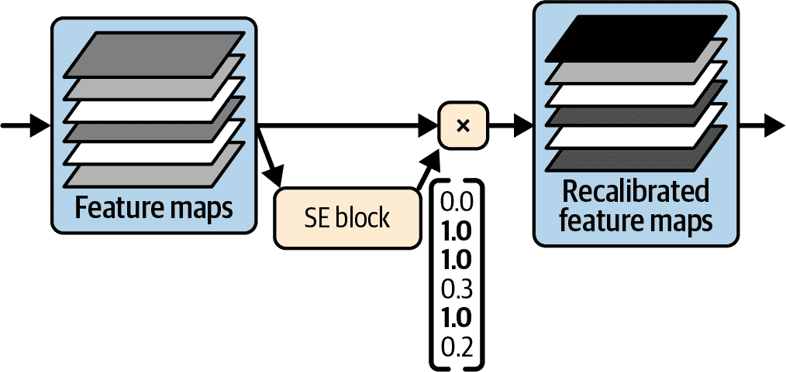

###### 图 12-22\. SE 块执行特征图重新校准

SE 块仅由三层组成：一个全局平均池化层，一个使用 ReLU 激活函数的隐藏密集层，以及一个使用 sigmoid 激活函数的密集输出层（见图 12-23）。


###### 图 12-23\. SE 块架构

如前所述，全局平均池化层计算每个特征图的平均激活值：例如，如果其输入包含 256 个特征图，它将输出 256 个数字，代表每个滤波器的整体响应水平。接下来的一层是“挤压”发生的地方：这一层比 256 个神经元少得多——通常是特征图数量的 16 倍（例如，16 个神经元），因此 256 个数字被压缩成一个小的向量（例如，16 个维度）。这是一个低维向量表示（即嵌入）特征响应的分布。这个瓶颈步骤迫使 SE 块学习特征组合的通用表示（我们将在讨论第十八章中的自动编码器时再次看到这一原则）。最后，输出层接收嵌入并输出一个包含每个特征图一个数字的重新校准向量（例如，256 个），每个数字介于 0 和 1 之间。然后，特征图乘以这个重新校准向量，因此无关的特征（具有低重新校准分数）被缩小，而相关的特征（重新校准分数接近 1）则保持不变。

## 其他值得注意的架构

有许多其他 CNN 架构可以探索。以下是一些最值得注意的简要概述：

[VGGNet](https://homl.info/vggnet)⁠^(20)

VGGNet 在 2014 年 ILSVRC 挑战赛中获得了第二名。来自牛津大学视觉几何组（VGG）研究实验室的 Karen Simonyan 和 Andrew Zisserman 开发了一种非常简单且经典的架构；它有 2 或 3 个卷积层和一个池化层，然后又是 2 或 3 个卷积层和一个池化层，以此类推（根据 VGG 变体，总共有 16 或 19 个卷积层），加上一个具有 2 个隐藏层和输出层的最终密集网络。它使用了小的 3 × 3 滤波器，但数量很多。

[ResNeXt](https://homl.info/resnext)⁠^(21)

ResNeXt 对 ResNet 中的残差单元进行了改进。与最佳 ResNet 模型中的残差单元仅包含每个 3 个卷积层不同，ResNeXt 的残差单元由许多并行堆叠（例如，32 个堆叠）组成，每个堆叠包含 3 个卷积层。然而，每个堆叠的前两层仅使用少量滤波器（例如，仅四个），因此整体参数数量与 ResNet 相同。然后，将所有堆叠的输出相加，并将结果传递给下一个残差单元（以及跳跃连接）。

[DenseNet](https://homl.info/densenet)⁠^(22)

DenseNet 由几个密集块组成，每个块由几个密集连接的卷积层组成。这种架构在参数相对较少的情况下实现了出色的精度。什么是“密集连接”？每个层的输出作为输入馈送到同一块中每个后续层。例如，块中的第四层将块中第一、第二和第三层的输出深度拼接作为输入。密集块之间由几个过渡层分隔。

[MobileNet](https://homl.info/mobilenet)⁠^(23)

MobileNets 是一种轻量级且快速的模型，旨在用于移动和 Web 应用程序。它们基于深度可分离卷积层，类似于 Xception。作者提出了几种变体，以牺牲一点精度来换取更快速和更小的模型。还有其他几种 CNN 架构适用于移动设备，例如 SqueezeNet、ShuffleNet 或 MNasNet。

[CSPNet](https://homl.info/cspnet)⁠^(24)

一个跨阶段部分网络（CSPNet）与 DenseNet 类似，但每个密集块的部分输入直接连接到该块的输出，而不经过该块。

[EfficientNet](https://homl.info/efficientnet)⁠^(25)

无疑，EfficientNet 是这个列表中最重要的模型之一。作者提出了一种方法，通过联合增加深度（层数）、宽度（每层的滤波器数量）和分辨率（输入图像的大小）来有效地缩放任何 CNN。这被称为*复合缩放*。他们使用神经架构搜索来找到一个缩小版本的 ImageNet（具有更小和更少的图像）的良好架构，然后使用复合缩放来创建这个架构的更大版本。当 EfficientNet 模型出现时，它们在所有计算预算下都大大优于所有现有模型，并且至今仍然是最好的模型之一。作者在 2021 年发表了一篇后续论文，介绍了 EfficientNetV2，它进一步提高了训练时间和参数效率。

[ConvNeXt](https://homl.info/convnext)⁠^(26)

ConvNeXt 与 ResNet 非常相似，但借鉴了最成功的视觉 Transformer 架构的一些改进（见第十六章），例如使用大核（例如 7 × 7 而不是 3 × 3），在每个残差单元中使用更少的激活函数和归一化层，等等。

理解 EfficientNet 的复合缩放方法有助于更深入地理解 CNN，尤其是如果您需要缩放 CNN 架构时。它基于计算预算的对数度量，表示为*ϕ*：如果您的计算预算加倍，那么*ϕ*增加 1。换句话说，可用于训练的浮点运算次数与 2^(*ϕ*)成正比。您的 CNN 架构的深度、宽度和分辨率应分别按*α*^(*ϕ*)、*β*^(*ϕ*)和*γ*^(*ϕ*)缩放。因子*α*、*β*和*γ*必须大于 1，且*αβ*²*γ*²应接近 2。这些因子的最佳值取决于 CNN 的架构。为了找到 EfficientNet 架构的最佳值，作者从一个小的基线模型（EfficientNetB0）开始，将*ϕ*固定为 1，并简单地进行了网格搜索：他们找到了α = 1.2，β = 1.1，γ = 1.1。然后，他们使用这些因子创建了几个更大的架构，命名为 EfficientNetB1 到 EfficientNetB7，对应于*ϕ*的增加值。

希望您喜欢这次对主要 CNN 架构的深入探讨！但您是如何选择正确的架构的呢？

## 选择合适的 CNN 架构

如您所预期，最佳架构取决于您项目中最重要的是什么：准确性？模型大小（例如，用于部署到移动设备）？推理速度？能耗？表 12-3 列出了 TorchVision 当前可用的某些预训练分类模型（您将在本章后面了解如何使用它们）。完整的列表可在[*https://pytorch.org/vision/stable/models*](https://pytorch.org/vision/stable/models)找到（包括其他计算机视觉任务的模型）。表格显示了每个模型在 ImageNet 数据集上的 top-1 和 top-5 准确性，其参数数量（以百万计），以及每个图像所需的计算量（以 GFLOPs 衡量：一个 Giga-FLOP 是一亿个浮点运算）。如您所见，较大的模型通常更准确，但并非总是如此；例如，EfficientNet v2 的小型变体在大小和准确性上都优于 Inception v3（但在计算量上不是）。

表 12-3. TorchVision 中可用的预训练模型，按大小排序

| 类名 | Top-1 准确率 | Top-5 准确率 | 参数 | GFLOPs |
| --- | --- | --- | --- | --- |
| MobileNet v3 small | 67.7% | 87.4% | 2.5M | 0.1 |
| EfficientNet B0 | 77.7% | 93.5% | 5.3M | 0.4 |
| GoogLeNet | 69.8% | 89.5% | 6.6M | 1.5 |
| DenseNet 121 | 74.4% | 92.0% | 8.0M | 2.8 |
| EfficientNet v2 small | 84.2% | 96.9% | 21.5M | 8.4 |
| ResNet 34 | 73.3% | 91.4% | 21.8M | 3.7 |
| Inception V3 | 77.3% | 93.5% | 27.2M | 5.7 |
| ConvNeXt Tiny | 82.6% | 96.1% | 28.6M | 4.5 |
| DenseNet 161 | 77.1% | 93.6% | 28.7M | 7.7 |
| ResNet 152 | 82.3% | 96.0% | 60.2M | 11.5 |
| AlexNet | 56.5% | 79.1% | 61.1M | 0.7 |
| EfficientNet B7 | 84.1% | 96.9% | 66.3M | 37.8 |
| ResNeXt 101 32x8D | 82.8% | 96.2% | 88.8M | 16.4 |
| EfficientNet v2 large | 85.8% | 97.8% | 118.5M | 56.1 |
| VGG 11 with BN | 70.4% | 89.8% | 132.9M | 7.6 |
| ConvNeXt Large | 84.4% | 97.0% | 197.8M | 34.4 |

较小的模型可以在任何 GPU 上运行，但大型模型，如 ConvNeXt Large，怎么办呢？由于每个参数都表示为一个 32 位的浮点数（4 字节），您可能会认为只需 800 MB 的 RAM 就可以运行一个 2 亿参数的模型，但实际上您需要更多，通常在推理时每个图像需要 5 GB 的 RAM（取决于图像大小），在训练时则需要更多。让我们看看原因。 

## GPU RAM 需求：推理与训练

CNN 需要大量的 RAM。例如，考虑一个具有 200 个 5 × 5 滤波器的单个卷积层，步长为 1，使用`"same"`填充，处理一个 150 × 100 的 RGB 图像（3 个通道）：

+   参数数量是 (5 × 5 × 3 + 1) × 200 = 15,200（+ 1 对应于偏置项）。这并不多：为了产生相同大小的输出，一个全连接层需要 200 × 150 × 100 个神经元，每个神经元连接到所有 150 × 100 × 3 个输入。它将有 200 × 150 × 100 × (150 × 100 × 3 + 1) ≈ 135 亿个参数！

+   然而，每个 200 个特征图包含 150 × 100 个神经元，每个这样的神经元都需要计算其 5 × 5 × 3 = 75 个输入的加权总和：总共是 2.25 亿次的浮点数乘法。虽然没有全连接层那么糟糕，但仍然相当计算密集。

+   重要的是，卷积层的输出将占用 200 × 150 × 100 × 32 = 9600 万位（12 MB）的 RAM，假设我们使用 32 位浮点数。⁠^(27) 这只是对一个实例而言——如果训练批次包含 100 个实例，那么这个单一的卷积层将占用 1.2 GB 的 RAM！

在推理过程中（即，为新的实例做出预测时），一旦计算了下一层，一层占用的 RAM 就可以释放，因此你只需要两个连续层所需的 RAM。但在训练过程中，正向传播期间计算的所有内容都需要保留以供反向传播使用，因此所需的 RAM 量（至少）是所有层所需的 RAM 总量。你很容易耗尽 GPU RAM。

如果训练因为内存不足而崩溃，你可以尝试减小批次大小。为了仍然获得大批次的一些好处，你可以在每个批次之后累积梯度，并且只在几个批次后更新模型权重。或者，你可以尝试使用步长来降低维度，移除一些层，使用 16 位浮点数而不是 32 位浮点数，将 CNN 分布到多个设备上，或者将最占用内存的模块卸载到 CPU（使用`module.to("cpu")`）。

另一个选择是以更高的计算量换取更低的内存使用。例如，在正向传播过程中，你不必保存所有的激活，而可以保存其中一部分，称为*激活检查点*，然后在反向传播过程中，你可以通过从上一个检查点开始运行部分正向传播来按需重新计算缺失的激活。

要在 PyTorch 中实现激活检查点（也称为*梯度检查点*），你可以使用`torch.utils.checkpoint.checkpoint()`函数：而不是调用模块`z = foo(x)`，你可以使用`z = checkpoint(foo, x)`来调用它。在推理期间，这不会有任何区别，但在训练期间，这个模块的激活将不再在正向传播期间保存，并且当需要时，`foo(x)`将在反向传播期间重新计算。这种方法实现起来相当简单，并且不需要对模型架构进行任何更改。

###### 警告

如果用相同的输入调用两次正向传播并产生相同的结果，否则梯度将是不正确的。这意味着自定义模块必须遵守一些约束，例如避免原地操作或使用受控状态进行随机数生成：请参阅`checkpoint()`函数的文档以获取更多详细信息。

话虽如此，如果你愿意调整你的模型架构，那么你可以使用一个更高效的解决方案来用内存交换计算：可逆残差网络。

## 可逆残差网络（RevNets）

[RevNets](https://homl.info/revnet)是由 Aidan Gomez 等人于 2017 年提出的：⁠^(28)它们通常只会增加大约 33%的计算量，实际上在正向传播过程中根本不需要保存任何激活！这是它们的工作原理：

+   每一层，称为**可逆层**，接受两个大小相等的输入，**x**[1]和**x**[2]，并计算两个输出：**y**[1] = **x**[1] + f(**x**[2]) 和 **y**[2] = g(**y**[1]) + **x**[2]，其中 f 和 g 可以是任何函数，只要输出大小等于输入大小，并且对于给定的输入总是产生相同的输出。例如，f 和 g 可以是包含几个步长为 1 和`"same"`填充（每个卷积层都带有自己的批归一化和 ReLU 激活）的相同模块。

+   在反向传播过程中，每个可逆层的输入可以在需要时从输出重新计算，使用：**x**[2] = **y**[2] – g(**y**[1]) 和 **x**[1] = **y**[1] – f(**x**[2])（你可以轻松验证这两个等式直接来自前两个）。在正向传播过程中不需要存储任何激活：太棒了！

由于 f 和 g 必须输出与输入相同的形状，可逆层不能包含步长大于 1 的卷积层，或者带有`"valid"`填充的卷积层。你仍然可以在你的 CNN 中使用这样的层，但 RevNet 技巧将不适用于它们，因此你将不得不在正向传播过程中保存它们的激活；幸运的是，CNN 通常只需要少量这样的层。这包括非常第一层，它减少了空间维度并增加了通道数：结果可以沿着通道维度分成两个相等的部分，并馈送到第一个可逆层。

RevNets 不仅限于 CNN。实际上，它们是名为 Reformer 的具有影响力的 Transformer 架构的核心（见第十七章）。

好的，现在是时候让我们动手实践了！让我们使用 PyTorch 从头开始实现最流行的 CNN 架构之一。

# 使用 PyTorch 实现 ResNet-34 CNN

到目前为止描述的大多数 CNN 架构都可以使用 PyTorch 相当自然地实现（尽管通常你会加载一个预训练的网络，正如你将看到的）。为了说明这个过程，让我们使用 PyTorch 从头开始实现一个 ResNet-34。首先，我们将创建一个`ResidualUnit`层：

```py
class ResidualUnit(nn.Module):
    def __init__(self, in_channels, out_channels, stride=1):
        super().__init__()
        DefaultConv2d = partial(
            nn.Conv2d, kernel_size=3, stride=1, padding=1, bias=False)
        self.main_layers = nn.Sequential(
            DefaultConv2d(in_channels, out_channels, stride=stride),
            nn.BatchNorm2d(out_channels),
            nn.ReLU(),
            DefaultConv2d(out_channels, out_channels),
            nn.BatchNorm2d(out_channels),
        )
        if stride > 1:
            self.skip_connection = nn.Sequential(
                DefaultConv2d(in_channels, out_channels, kernel_size=1,
                              stride=stride, padding=0),
                nn.BatchNorm2d(out_channels),
            )
        else:
            self.skip_connection = nn.Identity()

    def forward(self, inputs):
        return F.relu(self.main_layers(inputs) + self.skip_connection(inputs))
```

如你所见，这段代码与图 12-19 非常接近。在构造函数中，我们创建了所有需要的层：图的最右侧是主要层，当步长大于 1 时，跳过连接对应于左侧的层，或者当步长为 1 时对应于`nn.Identity`模块——`nn.Identity`模块什么都不做，只是返回其输入。然后在`forward()`方法中，我们让输入通过主要层和跳过连接，然后我们将两个输出相加并应用激活函数。

接下来，让我们构建我们的`ResNet34`模块！现在我们有了`ResidualUnit`模块，整个 ResNet-34 架构就变成了一个模块的大堆栈，因此我们可以将`ResNet34`类基于一个单一的`nn.Sequential`模块。代码与图 12-18 非常吻合：

```py
class ResNet34(nn.Module):
    def __init__(self):
        super().__init__()
        layers = [
            nn.Conv2d(in_channels=3, out_channels=64, kernel_size=7, stride=2,
                      padding=3, bias=False),
            nn.BatchNorm2d(num_features=64),
            nn.ReLU(),
            nn.MaxPool2d(kernel_size=3, stride=2, padding=1),
        ]
        prev_filters = 64
        for filters in [64] * 3 + [128] * 4 + [256] * 6 + [512] * 3:
            stride = 1 if filters == prev_filters else 2
            layers.append(ResidualUnit(prev_filters, filters, stride=stride))
            prev_filters = filters
        layers += [
            nn.AdaptiveAvgPool2d(output_size=1),
            nn.Flatten(),
            nn.LazyLinear(10),
        ]
        self.resnet = nn.Sequential(*layers)

    def forward(self, inputs):
        return self.resnet(inputs)
```

这段代码中唯一棘手的部分是添加`ResidualUnit`层到层列表中的循环：如前所述，前 3 个 RU 有 64 个滤波器，然后接下来的 4 个 RU 有 128 个滤波器，以此类推。在每次迭代中，当滤波器数量与上一个 RU 相同时要将步长设置为 1，否则设置为 2；然后我们将`ResidualUnit`添加到列表中，并最终更新`prev_filters`。

就这样，你现在可以在 ImageNet 或任何其他 224 × 224 图像的数据集上训练这个模型了。令人惊讶的是，仅仅 45 行代码，我们就能构建出赢得 ILSVRC 2015 挑战赛的模型！这既展示了 ResNet 模型的优雅性，也展示了 PyTorch（以及 Python）的表达能力。实现我们讨论的其他 CNN 架构需要更多时间，但并不会太难。然而，TorchVision 内置了这些架构中的几个，所以为什么不使用它们呢？

# 使用 TorchVision 的预训练模型

通常情况下，你不需要手动实现像 GoogLeNet、ResNet 或 ConvNeXt 这样的标准模型，因为使用 TorchVision 只需几行代码就可以轻松地获得预训练的网络。

###### 小贴士

TIMM 是基于 PyTorch 的另一个非常流行的库：它提供了一系列预训练的图像分类模型，以及许多相关工具，如数据加载器、数据增强工具、优化器、调度器等。Hugging Face 的 Hub 也是一个获取各种预训练模型的好地方（见第十四章）。

例如，你可以使用以下代码加载在 ImageNet 上预训练的 ConvNeXt 模型。ConvNeXt 模型有几个变体——微型、小型、基础型和大型——此代码加载的是基础型：

```py
weights = torchvision.models.ConvNeXt_Base_Weights.IMAGENET1K_V1
model = torchvision.models.convnext_base(weights=weights).to(device)
```

就这样！此代码自动从*Torch Hub*（一个在线预训练模型存储库）下载权重（338 MB）。权重被保存并缓存以供将来使用（例如，在`~/.cache/torch/hub`中；运行`torch.hub.get_dir()`以找到系统上的确切路径）。一些模型有更新的权重版本（例如，`IMAGENET1K_V2`）或其他权重变体。要获取可用模型的完整列表，请运行`torchvision.models.list_models()`。要获取给定模型（如`convnext_base`）可用的预训练权重的列表，请运行`list(torchvision.models.get_model_weights("convnext_base"))`。或者，访问[*https://pytorch.org/vision/main/models*](https://pytorch.org/vision/main/models)。

让我们使用这个模型来分类我们之前加载的两个样本图像。在我们这样做之前，我们必须首先确保图像被预处理成模型所期望的格式。特别是，它们必须具有正确的尺寸。ConvNeXt 模型期望 224 × 224 像素的图像（其他模型可能期望其他尺寸，例如 299 × 299）。由于我们的样本图像是 427 × 640 像素，我们需要调整它们的大小。我们可以使用 TorchVision 的`CenterCrop`和/或`Resize`转换来完成此操作，但使用`weights.transforms()`返回的转换更容易、更安全，因为这些转换专门为这个特定的预训练模型设计：

```py
transforms = weights.transforms()
preprocessed_images = transforms(sample_images_permuted)
```

重要的是，这些转换也像训练期间一样对像素强度进行了归一化。在这种情况下，转换分别对每个颜色通道的像素强度进行标准化，使用 ImageNet 的每个通道的均值和标准差（我们将在本章后面看到如何手动进行此操作）。

接下来，我们可以将图像移动到 GPU，并将它们传递给模型。像往常一样，记得在做出预测之前将模型切换到评估模式——模型默认处于训练模式——并关闭 autograd：

```py
model.eval()
with torch.no_grad():
    y_logits = model(preprocessed_images.to(device))
```

结果是一个包含每个图像类别 logits 的 2 × 1,000 张量（记住，ImageNet 有 1,000 个类别）。正如我们在第十章中所做的那样，我们可以使用`torch.argmax()`来获取每个图像的预测类别（即 logits 最大的类别）：

```py
>>> y_pred = torch.argmax(y_logits, dim=1)
>>> y_pred
tensor([698, 985], device='cuda:0')
```

到目前为止，一切顺利，但这些类别究竟代表什么呢？好吧，你可以在网上找到 ImageNet 的类别名称，但再次强调，直接从`weights`对象获取类别名称更简单、更安全。确实，它的`meta`属性是一个字典，包含有关预训练模型的元数据，包括类别名称：

```py
>>> class_names = weights.meta["categories"]
>>> [class_names[class_id] for class_id in y_pred]
['palace', 'daisy']
```

这就是结果：第一张图像被分类为宫殿，第二张为雏菊。由于 ImageNet 数据集没有中国塔或大丽花类别，宫殿和雏菊是合理的替代品（塔是北京颐和园的一部分）。让我们使用`topk()`查看前三个预测：

```py
>>> y_top3_logits, y_top3_class_ids = y_logits.topk(k=3, dim=1)
>>> [[class_names[class_id] for class_id in top3] for top3 in y_top3_class_ids]
[['palace', 'monastery', 'lakeside'], ['daisy', 'pot', 'ant']]
```

让我们看看这些类别的估计概率：

```py
>>> y_top3_logits.softmax(dim=1)
tensor([[0.8618, 0.1185, 0.0197],
 [0.8106, 0.0964, 0.0930]], device='cuda:0')
```

如您所见，TorchVision 使得下载和使用预训练模型变得容易，并且对于 ImageNet 类别来说，它开箱即用就工作得相当好。但如果你需要将图像分类到不属于 ImageNet 数据集的类别，比如各种花卉种类呢？在这种情况下，你仍然可以通过使用迁移学习来从预训练模型中获益。

# 迁移学习的预训练模型

如果你想要构建一个图像分类器，但你没有足够的数据从头开始训练它，那么重用预训练模型的底层通常是一个好主意，正如我们在第十一章中讨论的那样。在本节中，我们将重用之前加载的 ConvNeXt 模型——它在 ImageNet 上进行了预训练——并在替换其分类头部后，我们将对其进行微调，以[*102 类别花卉数据集*](https://homl.info/flowers102)⁠^(29)（简称 Flowers102）。此数据集每个类别只有 10 个图像，总共有 102 个类别（正如其名称所示），所以如果你尝试从头开始训练模型，你将真的很难获得高精度。然而，使用一个好的预训练模型，很容易超过 90%的精度。让我们看看如何做到这一点。首先，让我们使用 Torchvision 下载数据集：

```py
DefaultFlowers102 = partial(torchvision.datasets.Flowers102, root="datasets",
                            transform=weights.transforms(), download=True)
train_set = DefaultFlowers102(split="train")
valid_set = DefaultFlowers102(split="val")
test_set = DefaultFlowers102(split="test")
```

此代码使用`partial()`来避免三次重复相同的参数。我们还设置了`transform=weights.transforms()`，以便在加载图像时立即对图像进行预处理。Flowers102 数据集包含三个预定义的分割，用于训练、验证和测试。前两个类别每个有 10 个图像，但令人惊讶的是测试集有更多（每个类别的图像数量在 20 到 238 之间不等）。在实际项目中，你通常会使用大部分数据用于训练而不是测试，但这个数据集是为计算机视觉研究设计的，作者故意限制了训练集和验证集。

然后，我们像往常一样创建数据加载器：

```py
from torch.utils.data import DataLoader

train_loader = DataLoader(train_set, batch_size=32, shuffle=True)
valid_loader = DataLoader(valid_set, batch_size=32)
test_loader = DataLoader(test_set, batch_size=32)
```

许多 TorchVision 数据集方便地在`classes`属性中包含类别名称，但遗憾的是这个数据集没有这样做.^(30) 如果你更喜欢看到像“老虎莲”、“乌头”或“龙葵”这样的可爱名称，而不是无聊的类别 ID，那么你需要手动定义类别名称列表：

```py
class_names = ['pink primrose', ..., 'trumpet creeper', 'blackberry lily']
```

现在，让我们将预训练的 ConvNeXt-base 模型适应到这个数据集上。由于它在 ImageNet 上进行了预训练，而 ImageNet 有 1,000 个类别，因此模型的头部（即其上层）被设计为输出 1,000 个 logits。但我们只有 102 个类别，所以我们必须截断模型的头部并替换为更小的一个。但我们如何找到它呢？好吧，让我们使用模型的`named_children()`方法来找到其子模块的名称：

```py
>>> [name for name, child in model.named_children()]
['features', 'avgpool', 'classifier']
```

`features`模块是模型的主要部分，它包括除了全局平均池化层（`avgpool`）和模型的头部（`classifier`）之外的所有层。让我们更仔细地看看头部：

```py
>>> model.classifier
Sequential(
 (0): LayerNorm2d((1024,), eps=1e-06, elementwise_affine=True)
 (1): Flatten(start_dim=1, end_dim=-1)
 (2): Linear(in_features=1024, out_features=1000, bias=True)
)
```

如您所见，这是一个由一个层归一化层、一个`nn.Flatten`层和一个具有 1,024 个输入和 1,000 个输出的`nn.Linear`层组成的`nn.Sequential`模块。这个`nn.Linear`层是输出层，也是我们需要替换的那一层。我们必须只更改输出的数量：

```py
n_classes = 102  # len(class_names) == 102
model.classifier[2] = nn.Linear(1024, n_classes).to(device)
```

如第十一章所述，通常在训练初期冻结预训练层的权重是一个好主意。我们可以通过冻结模型中的每一个参数，然后只解冻头部的参数来实现这一点：

```py
for param in model.parameters():
    param.requires_grad = False

for param in model.classifier.parameters():
    param.requires_grad = True
```

接下来，您可以训练这个模型几个周期，仅通过训练新的头部，而不对预训练层进行微调，您就已经可以达到大约 90%的准确率。之后，您可以解冻整个模型，降低学习率——通常是降低 10 倍——并继续训练模型。尝试一下，看看您能达到多高的准确率！

为了达到更高的准确率，通常在训练图像上进行一些数据增强是一个好主意。为此，您可以尝试随机水平翻转训练图像，随机以小角度旋转它们，随机调整大小和裁剪它们，以及随机调整它们的颜色。所有这些都必须在运行 ImageNet 归一化步骤之前完成，您可以使用`Normalize`转换来实现这一点：

```py
import torchvision.transforms.v2 as T

transforms = T.Compose([
    T.RandomHorizontalFlip(p=0.5),
    T.RandomRotation(degrees=30),
    T.RandomResizedCrop(size=(224, 224), scale=(0.8, 1.0)),
    T.ColorJitter(brightness=0.2, contrast=0.2, saturation=0.2, hue=0.1),
    T.ToImage(),
    T.ToDtype(torch.float32, scale=True),
    T.Normalize(mean=[0.485, 0.456, 0.406], std=[0.229, 0.224, 0.225]),
])
```

###### 小贴士

TorchVision 附带一个`AutoAugment`转换，它应用针对 ImageNet 优化的多个增强操作。它很好地推广到许多其他图像数据集，并且它还为其他两个数据集提供了预定义的设置：CIFAR10 和街景房屋数字（SVHN）数据集。

这里有一些更多想法，可以帮助进一步提高您模型的准确率：

+   尝试其他预训练模型。

+   扩展训练集：找到更多花卉图像并对其进行标记。

+   创建一个模型集合，并将它们的预测结果结合起来。

+   分析失败案例，看看它们是否具有特定的特征，例如相似的纹理或颜色。然后，您可以尝试调整图像预处理来解决这些问题。

+   使用性能调度等学习计划。

+   逐步解冻层，从顶部开始。或者，您可以使用*差异学习率*：对较低层应用较小的学习率，对上层应用较大的学习率。您可以通过使用参数组来实现这一点（参见第十一章）。

+   探索不同的优化器并微调它们的超参数。

+   尝试不同的正则化技术。

###### 小贴士

值得花时间去寻找在类似图像上预训练的模型。例如，如果您处理的是卫星图像、航空图像，甚至是像数字高程模型（DEM）这样的栅格数据，那么在 ImageNet 上预训练的模型帮助不大。相反，可以查看微软的*TorchGeo*库，它与 TorchVision 类似，但用于地理空间数据。对于医学图像，可以查看 Project MONAI。对于农业图像，可以查看 AgML。等等。

有了这个，你就可以开始在自己的图像和类别上训练令人惊叹的图像分类器了！但计算机视觉不仅仅是分类。例如，如果你还想知道图片中花朵的位置呢？让我们现在来看看这个问题。

# 分类和定位

在图片中定位一个对象可以表达为一个回归任务，如第九章中所述：预测围绕对象的边界框，一个常见的方法是预测边界框中心的坐标，以及其宽度和高度（或者，你也可以预测对象的左上角和右下角的水平和垂直坐标）。这意味着我们需要预测四个数字。这并不需要对 ConvNeXt 模型进行太多修改；我们只需要添加一个具有四个单元的第二个密集输出层（例如，在全局平均池化层之上）。这是一个`FlowerLocator`模型，它将定位头部添加到给定的基础模型中，例如我们的 ConvNeXt 模型：

```py
class FlowerLocator(nn.Module):
    def __init__(self, base_model):
        super().__init__()
        self.base_model = base_model
        self.localization_head = nn.Sequential(
            nn.Flatten(),
            nn.Linear(base_model.classifier[2].in_features, 4)
        )

    def forward(self, X):
        features = self.base_model.features(X)
        pool = self.base_model.avgpool(features)
        logits = self.base_model.classifier(pool)
        bbox = self.localization_head(pool)
        return logits, bbox

torch.manual_seed(42)
locator_model = FlowerLocator(model).to(device)
```

这个定位模型有两个头部：第一个输出类别对数，而第二个输出边界框。定位头部与分类头部中的`nn.Linear`层的输入数量相同，但它只输出四个数字。`forward()`方法接收一个预处理图像的批次作为输入，并输出预测的类别对数（每张图像 102 个）和预测的边界框（每张图像 1 个）。训练好这个模型后，你可以这样使用它：

```py
preproc_images = [...]  # a batch of preprocessed images
y_pred_logits, y_pred_bbox = locator_model(preprocessed_images.to(device))
```

但我们如何训练这个模型呢？嗯，我们在第十章中看到了如何训练具有两个或更多输出的模型，而这个模型也没有什么不同：在这种情况下，我们可以为分类头部使用`nn.CrossEntropyLoss`，为定位头部使用`nn.MSELoss`。最终的损失可以简单地是这两个损失的加权总和。哇，就是这样。

嘿，别急！我们遇到了一个问题：Flowers102 数据集不包含任何边界框，因此我们需要自己添加它们。这通常是机器学习项目中难度最大且成本最高的部分之一：标记和注释数据。花时间寻找合适的工具是个好主意。要使用边界框注释图像，您可能希望使用开源标记工具，如 Label Studio、OpenLabeler、ImgLab、Labelme、VoTT 或 VGG Image Annotator，或者可能是一个商业工具，如 LabelBox、Supervisely、Roboflow 或 RectLabel。其中许多现在都提供 AI 辅助，大大加快了注释任务。如果您有大量图像需要注释，您可能还想考虑众包平台，如 Amazon Mechanical Turk。然而，设置众包平台、准备发送给工作人员的表格、监督他们以及确保他们产生的边界框质量良好是一项相当多的工作，所以请确保这是值得的努力。如果只有几百张甚至几千张图像需要标记，并且您不打算经常这样做，自己来做可能更合适：有了合适的工具，这只需要几天时间，您也会更好地了解您的数据集和任务。

然后，您可以创建一个自定义数据集（见第十章），其中每个条目包含一个图像、一个标签和一个边界框。TorchVision 方便地包含一个`BoundingBoxes`类，它表示一组边界框。例如，以下代码为 Flowers102 训练集第一张图像中最大的花朵创建了一个边界框（目前我们只考虑每张图像一个边界框，但我们在本章后面将讨论每张图像多个边界框的情况）：

```py
import torchvision.tv_tensors

bbox = torchvision.tv_tensors.BoundingBoxes(
    [[377, 199, 248, 262]],  # center x=377, center y=199, width=248, height=262
    format="CXCYWH",  # other possible formats: "XYXY" and "XYWH"
    canvas_size=(500, 754)  # raw image size before preprocessing
)
```

###### 小贴士

要可视化边界框，请使用`torchvision.utils.draw_bounding_boxes()`函数。您首先需要使用`torchvision.ops.box_convert()`将边界框转换为 XYXY 格式。

`BoundingBoxes`类是`TVTensor`的子类，而`TVTensor`是`torch.Tensor`的子类，因此您可以像处理常规张量一样处理边界框，并具有额外功能。最重要的是，您可以使用 TorchVision 的 v2 transforms API 转换边界框。例如，让我们使用我们之前定义的转换来预处理这个边界框：

```py
>>> transform(bbox)
BoundingBoxes([[ 90,  91, 120, 154]], format=BoundingBoxFormat.CXCYWH,
 canvas_size=(224, 224), clamping_mode=soft)
```

###### 警告

调整和裁剪边界框的工作效果如预期，但旋转是特殊的：由于边界框没有旋转参数，因此不能旋转，所以它会被调整大小以适应旋转后的框（*而不是*旋转的对象）。因此，它可能最终会变得比对象大一些。

你可以将嵌套数据结构传递给转换，输出将具有相同的结构，但所有图像和边界框都会被转换。例如，以下代码转换训练集中的第一朵花图像及其边界框，但保持标签不变。在这个例子中，输入和输出都是包含图像和由标签和边界框组成的字典的 2 元组，但你也可以使用任何其他数据结构。

```py
first_image = [...]  # load the first training image without any preprocessing
preproc_image, preproc_target = transform(
    (first_image, {"label": 0, "bbox": bbox})
)
preproc_bbox = preproc_target["bbox"]
```

###### 小贴士

当使用均方误差（MSE）时，对于大边界框的 10 像素误差和对于小边界框的 10 像素误差会受到相同的惩罚。为了避免这种情况，你可以使用一个自定义的损失函数，在计算 MSE 之前，先计算目标框和预测框的宽度和高度的平方根。

MSE 简单且通常在训练模型时效果相当好，但它并不是一个很好的度量标准来评估模型预测边界框的能力。这个最常见的度量标准是*交并比*（IoU，也称为*Jaccard 指数*）：它是目标边界框 T 和预测边界框 P 之间的重叠面积除以它们的并集面积 P ∪ T（见图 12-24）。简而言之，IoU = |P ∩ T| / |P ∪ T|，其中|*x*|是*x*的面积。IoU 的范围从 0（没有重叠）到 1（完全重叠）。它通过`torchvision.ops.box_iou()`函数实现。

IoU（交并比）对于训练来说并不理想，因为当 P 和 T 没有重叠时，无论它们之间的距离或形状如何，IoU 都等于零：在这种情况下，梯度也等于零，因此梯度下降无法取得任何进展。幸运的是，通过结合额外信息可以修复这个缺陷。例如，H. Rezatofighi 等人在 2019 年的一篇论文[2019 paper](https://homl.info/giou)中引入的*广义 IoU* (GIoU)，考虑了包含 P 和 T 的最小框 S，并从 IoU 中减去 P 或 T 未覆盖的 S 的比例。简而言之，GIoU = IoU – |S – (P ∪ T)| / |S|。这意味着随着 P 和 T 之间的距离增加，GIoU 会减小，这为梯度下降提供了可以操作的空间，使其可以将 P 拉得更接近 T。由于我们希望最大化 GIoU，因此 GIoU 损失等于 1 – GIoU。这种损失很快变得流行，并且可以通过`torchvision.ops.generalized_box_iou_loss()`函数实现。

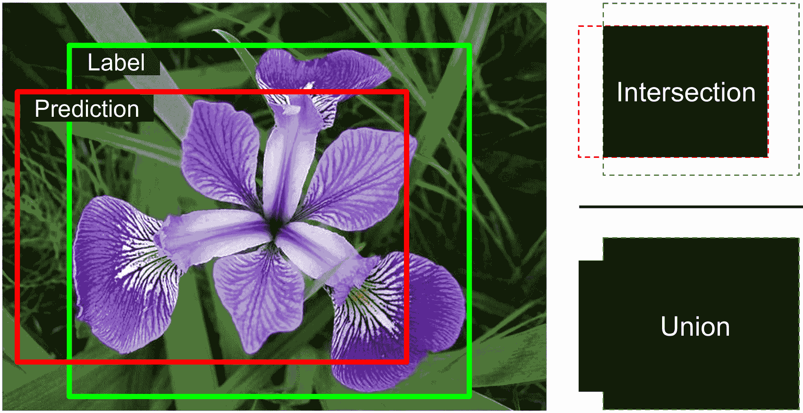

###### 图 12-24\. 边界框的 IoU 度量

IoU 的一个重要变体是*完整 IoU* (CIoU)，由 Z. Zheng 等人在 2020 年的一篇论文[2020 paper](https://homl.info/ciou)中引入。它考虑了三个几何因素：IoU（重叠越多越好）、P 和 T 中心之间的距离（越近越好），通过 S 对角线的长度进行归一化，以及 P 和 T 的宽高比之间的相似性（越近越好）。损失是 1 – CIoU，它通过`torchvision.ops.complete_box_iou_loss()`函数实现。它通常比 MSE 或 GIoU 表现更好，收敛更快，并能得到更准确的边界框，因此它正在成为定位的默认损失函数。

分类和定位单个对象很好，但如果图像中包含多个对象（如花卉数据集中常见的情况）怎么办呢？

# 目标检测

在图像中分类和定位多个对象的任务被称为*目标检测*。直到几年前，一种常见的方法是使用一个 CNN，该 CNN 被训练来分类和定位图像中大致居中的单个对象，然后将这个 CNN 在图像上滑动并在每一步进行预测。CNN 通常被训练来预测不仅包括类概率和边界框，还包括一个*对象性分数*：这是图像确实包含一个位于中间附近的对象的估计概率。这是一个二元分类输出；可以通过具有单个单元的密集输出层，使用 sigmoid 激活函数，并通过二元交叉熵损失进行训练来产生。

###### 注意

除了对象性分数外，有时还会添加一个“无对象”类别，但通常效果并不好。对于“是否存在对象？”和“它是什么类型的对象？”这些问题最好分别回答。

这种滑动-CNN 方法在图 12-25 中进行了说明。在这个例子中，图像被切割成 5 × 7 的网格，我们看到一个 CNN——一个粗黑矩形——在所有 3 × 3 的区域滑动并在每一步进行预测。

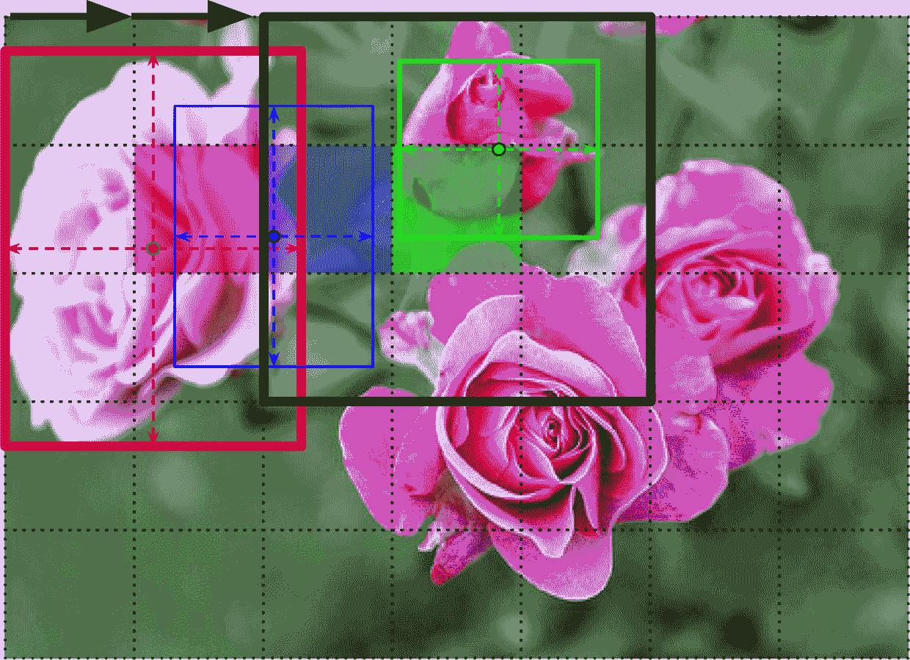

###### 图 12-25\. 通过在图像上滑动 CNN 检测多个对象

在这个图中，CNN 已经对这三个 3 × 3 区域进行了预测：

+   当查看左上角的 3 × 3 区域（位于第二行和第二列的红色阴影网格单元格中心），它检测到了最左侧的玫瑰。注意，预测的边界框超出了这个 3 × 3 区域的边界。这是完全可以接受的：尽管 CNN 没有看到玫瑰的底部，但它能够合理地猜测它可能的位置。它还预测了类别概率，给“玫瑰”类别一个很高的概率。最后，它预测了一个相当高的物体得分，因为边界框的中心位于中央网格单元格内（在这个图中，物体得分由边界框的厚度表示）。

+   当查看下一个 3 × 3 区域时，向右移动一个网格单元格（中心位于阴影蓝色方块），它没有检测到该区域内居中的任何花朵，因此预测了一个非常低的物体得分；因此，预测的边界框和类别概率可以安全地忽略。你可以看到预测的边界框本身就不太合适。

+   最后，当查看下一个 3 × 3 区域时，再次向右移动一个网格单元格（中心位于阴影绿色单元格），它检测到了顶部的玫瑰，尽管并不完美。这个玫瑰在这个区域内并没有很好地居中，所以预测的物体得分并不高。

你可以想象将 CNN 在整个图像上滑动会产生总共 15 个预测的边界框，这些边界框以 3 × 5 的网格组织，每个边界框都伴随着其估计的类别概率和物体得分。由于物体可以有不同的尺寸，你可能还希望将 CNN 再次滑动到 2 × 2 和 4 × 4 的区域，以捕捉更小和更大的物体。

这种技术相当直接，但正如你所看到的，它通常会多次检测到同一个物体，位置略有不同。需要一些后处理来去除所有不必要的边界框。对此的一个常见方法称为 *非极大值抑制*（NMS）。下面是如何工作的：

1.  首先，去除所有物体得分低于某个阈值的边界框；由于 CNN 认为在那个位置没有物体，边界框就变得没有用了。

1.  找到剩余的物体得分最高的边界框，并去除所有与之重叠很大的其他剩余边界框（例如，IoU 大于 60% 的）。例如，在 图 12-25 中，物体得分最高的边界框是覆盖在最左侧玫瑰上的粗边界框。另一个接触同一玫瑰的边界框与最大边界框重叠很大，所以我们将去除它（尽管在这个例子中它已经在之前的步骤中被移除了）。

1.  重复步骤 2，直到没有更多边界框可以去除。

这种简单的目标检测方法效果相当不错，但需要多次运行 CNN（本例中为 15 次），因此速度相当慢。幸运的是，有一种更快的方法可以在图像上滑动 CNN：使用*完全卷积网络*（FCN）。

## 完全卷积网络

FCN 的想法最早由 Jonathan Long 等人于 2015 年在一篇[论文](https://homl.info/fcn)⁠^(33)中提出，用于语义分割（根据图像中对象的类别对每个像素进行分类的任务）。作者指出，你可以用卷积层替换 CNN 顶部的密集层。为了理解这一点，让我们看一个例子：假设一个有 200 个神经元的密集层位于输出 100 个特征图（每个特征图大小为 7 × 7）的卷积层之上（这是特征图的大小，不是核的大小）。每个神经元将计算来自卷积层的所有 100 × 7 × 7 激活的加权总和（加上一个偏置项）。现在让我们看看如果我们用一个大小为 7 × 7、使用`"valid"`填充的 200 个滤波器的卷积层替换密集层会发生什么。这个层将输出 200 个特征图，每个特征图大小为 1 × 1（因为核的大小正好等于输入特征图的大小，并且我们使用了`"valid"`填充）。换句话说，它将输出 200 个数字，就像密集层一样；如果你仔细观察卷积层执行的运算，你会注意到这些数字将与密集层产生的数字完全相同。唯一的区别是，密集层的输出是一个形状为[*批大小*, 200]的张量，而卷积层将输出一个形状为[*批大小*, 200, 1, 1]的张量。

###### 小贴士

将密集层转换为卷积层时，卷积层的滤波器数量必须等于密集层的单元数量，滤波器大小必须等于输入特征图的大小，并且必须使用`"valid"`填充。步长可以设置为 1 或更大，我们很快就会看到。

这为什么很重要呢？因为密集层期望一个特定的输入大小（因为它有一个输入特征对应的权重），而卷积层将愉快地处理任何大小的图像⁠^(34)（然而，它确实期望其输入具有特定的通道数，因为每个核包含每个输入通道的不同权重集）。由于 FCN 只包含卷积层（以及具有相同属性的池化层），它可以在任何大小的图像上训练和执行！

例如，假设我们已经在 224 × 224 的图像上训练了一个用于花卉分类和定位的 CNN，并且有一个额外的对象性头。它在 224 × 224 的图像上训练，并且每张图像输出 107 个值：

+   分类头输出 102 个类别的 logits（每个类别一个），使用`nn.CrossEntropyLoss`进行训练。

+   对象性头输出一个对象性 logits，使用`nn.BCELoss`进行训练。

+   定位头输出四个数字来描述边界框，使用 CIoU 损失进行训练。

我们现在可以将 CNN 的密集层（`nn.Linear`）转换为卷积层（`nn.Conv2d`）。实际上，我们甚至不需要重新训练模型；我们只需将密集层的权重复制到卷积层！或者，我们可以在训练之前将 CNN 转换为 FCN。

现在假设在输出层（也称为瓶颈层）之前的最后一个卷积层在输入 224 × 224 图像时输出 7 × 7 特征图（参见图 12-26 的左侧）。例如，如果网络包含 5 层，步长为 2，并且使用`"same"`填充，那么空间维度总共会被除以 2⁵ = 32。如果我们向 FCN 输入 448 × 448 的图像（参见图 12-26 的右侧），瓶颈层现在将输出 14 × 14 特征图。由于密集输出层被替换为一个使用 107 个 7 × 7 大小滤波器的卷积层，使用`"valid"`填充和步长 1，输出将由 107 个特征图组成，每个特征图的大小为 8 × 8（因为 14 – 7 + 1 = 8）。

换句话说，全卷积网络（FCN）只会处理整个图像一次，并且它会输出一个 8 × 8 的网格，其中每个单元格包含图像一个区域的预测：107 个数字代表 102 个类别的概率、1 个物体得分和 4 个边界框坐标。这就像将原始卷积神经网络（CNN）在图像上滑动，每行滑动 8 步，每列滑动 8 步。为了可视化这一点，想象将原始图像切割成一个 14 × 14 的网格，然后在这个网格上滑动一个 7 × 7 的窗口；窗口将有 8 × 8 = 64 个可能的位置，因此有 8 × 8 个预测。然而，FCN 方法要*高效得多*，因为网络只看一次图像。实际上，“你只需看一次”（YOLO）是一个非常流行的目标检测架构的名称，我们将在下一节中探讨。


###### 图 12-26\. 同一个全卷积网络处理小图像（左）和大图像（右）

## 你只需看一次

YOLO 是由 Joseph Redmon 等人于 2015 年在一篇[论文](https://homl.info/yolo)中提出的一种快速且准确的目标检测架构。⁠^(35) 它如此之快，以至于可以在视频上实时运行，正如 Redmon 的[演示](https://homl.info/yolodemo2)所示。YOLO 的架构与我们刚刚讨论的架构非常相似，但有一些重要的区别：

+   对于每个网格单元，YOLO 只考虑边界框中心位于该单元内的对象。边界框坐标相对于该单元，其中(0, 0)表示单元的左上角，(1, 1)表示单元的右下角。然而，边界框的高度和宽度可能远远超出单元的范围。

+   对于每个网格单元，YOLO 输出两个边界框（而不是只有一个），这使得模型能够处理两个对象非常接近以至于它们的边界框中心位于同一单元格内的情况。每个边界框还附带其自己的对象性得分。

+   YOLO 还为每个网格单元输出一个类别概率分布，由于 YOLO 是在包含 20 个类别的 PASCAL VOC 数据集上训练的，因此每个网格单元预测 20 个类别的概率。这产生了一个粗略的*类别概率图*。请注意，模型为每个网格单元预测一个类别概率分布，而不是每个边界框。然而，在后期处理过程中，可以通过测量每个边界框与类别概率图中每个类别的匹配程度来估计每个边界框的类别概率。例如，想象一张一个人站在车前的图片。将有两个边界框：一个大的水平边界框用于车，一个小的垂直边界框用于人。这些边界框的中心可能位于同一个网格单元内。那么我们如何判断应该将哪个类别分配给每个边界框呢？嗯，类别概率图将包含一个“车”类别占主导地位的大区域，在其中将有一个较小的区域“人”类别占主导地位。希望车的边界框大致匹配“车”区域，而人的边界框大致匹配“人”区域：这将允许将正确的类别分配给每个边界框。

YOLO 最初是使用 Darknet 开发的，这是一个由 Joseph Redmon 最初用 C 语言编写的开源深度学习框架，但很快就被移植到了 PyTorch 和其他库中。多年来，它一直在不断改进，最初由 Joseph Redmon 等人（YOLOv2、YOLOv3 和 YOLO9000）进行改进，自 2020 年以来，由其他多个团队进行改进。每个版本都带来了一些令人印象深刻的速度和精度提升，使用了各种技术；例如，YOLOv3 通过*锚先验*提高了精度，利用了某些边界框形状比其他形状更可能的事实，这取决于类别（例如，人倾向于有垂直的边界框，而汽车通常没有）。他们还增加了每个网格单元中的边界框数量，他们在包含更多类别的不同数据集上进行了训练（在 YOLO9000 的情况下，有高达 9,000 个类别，组织在一个层次结构中），他们添加了跳过连接来恢复 CNN 中丢失的一些空间分辨率（我们将在查看语义分割时简要讨论这一点），还有更多。这些模型也有很多变体，例如缩小版的“tiny”YOLO，优化用于在更强大的机器上训练，并且可以运行得非常快（每秒超过 1,000 帧！），但*平均精度均值*（mAP）略低。

TorchVision 不包括任何 YOLO 模型，但你可以使用 Ultralytics 库，它提供了一个简单的 API 来下载和使用基于 PyTorch 的各种预训练 YOLO 模型。这些模型在包含超过 330,000 张图片的 COCO 数据集上进行了预训练，其中包含 200,000 张图片被标注用于对象检测，有 80 个不同的类别（人、汽车、卡车、自行车、球等）。Ultralytics 库默认不安装在 Colab 上，因此我们必须运行`%pip install ultralytics`。然后我们可以下载一个 YOLO 模型并使用它。例如，以下是使用此库下载 YOLOv9 模型（中等变体）并在一批图片中检测对象的方法（该模型接受 PIL 图像、NumPy 数组，甚至 URL）：

```py
from ultralytics import YOLO

model = YOLO('yolov9m.pt')  # n=nano, s=small, m=medium, x=large
images = ["https://homl.info/soccer.jpg", "https://homl.info/traffic.jpg"]
results = model(images)
```

输出是一个`Results`对象列表，它提供了一个方便的`summary()`方法。例如，以下是查看第一张图片中第一个检测到的对象的方法：

```py
>>> results[0].summary()[0]
{'name': 'sports ball',
 'class': 32,
 'confidence': 0.96214,
 'box': {'x1': 245.35733, 'y1': 286.03003, 'x2': 300.62509, 'y2': 343.57184}}
```

###### 小贴士

Ultralytics 库还提供了一个简单的 API，可以在其他常见的对象检测数据集或你自己的数据集上训练 YOLO 模型。有关更多详细信息，请参阅[*https://docs.ultralytics.com/modes/train*](https://docs.ultralytics.com/modes/train)。

通过 TorchVision 还可以获得其他预训练的对象检测模型。你可以像使用预训练的分类模型（例如 ConvNeXt）一样使用它们，只是每个图像预测都表示为一个包含两个条目的字典：`"labels"`（即类别 ID）和`"boxes"`。可用的模型在此列出（查看[模型页面](https://pytorch.org/vision/main/models)以获取所有变体的完整列表）：

[Faster R-CNN](https://homl.info/fasterrcnn)⁠^(36)

该模型有两个阶段：图像首先通过 CNN，然后输出传递到一个**区域提议网络**（RPN），该网络提议最有可能包含物体的边界框；然后对每个边界框运行分类器，基于 CNN 裁剪后的输出。

[SSD](https://homl.info/ssd)⁠^(37)

SSD 是一个单阶段检测器（“看一次”），类似于 YOLO。

[SSDlite](https://homl.info/ssdlite)⁠^(38)

SSD 的轻量级版本，非常适合移动设备。

[RetinaNet](https://homl.info/retinanet)⁠^(39)

一个单阶段检测器，它引入了一种称为**焦点损失**（见`torchvision.ops.sigmoid_focal_loss()`）的交叉熵损失变体。这种损失给困难样本更多的权重，从而提高了对小物体和较少出现的类别的性能。

[FCOS](https://homl.info/fcos)⁠^(40)

一个单阶段全卷积网络，它直接预测边界框而不依赖于锚框。

到目前为止，我们只考虑了在单张图像中检测物体。但视频呢？物体必须在每一帧中被检测到，并且必须在时间上被跟踪。现在让我们快速了解一下目标跟踪。

# 目标跟踪

目标跟踪是一个具有挑战性的任务：物体在移动，它们可能随着接近或远离而增大或缩小，它们的外观可能随着转向或移动到不同的光照条件或背景而改变，它们可能被其他物体暂时遮挡，等等。

最受欢迎的目标跟踪系统之一是[DeepSORT](https://homl.info/deepsort)。⁠^(41) 它基于经典算法和深度学习的结合：

+   它使用**卡尔曼滤波器**来估计给定先前检测的物体最可能的位置，并假设物体倾向于以恒定速度移动。

+   它使用深度学习模型来衡量新检测与现有跟踪物体之间的相似度。

+   最后，它使用**匈牙利算法**将新检测映射到现有跟踪物体（或新跟踪物体）。该算法有效地找到使检测与跟踪物体预测位置之间的距离最小化的映射组合，同时最小化外观差异。

例如，想象一个红色的球刚刚从蓝色球上弹开，而蓝色球正在相反方向上移动。根据球之前的位移，卡尔曼滤波器会预测球将相互穿过；实际上，它假设物体以恒定速度移动，因此不会预期到弹跳。如果匈牙利算法只考虑位置，那么它会愉快地将新的检测映射到错误的球上，就像它们刚刚穿过彼此并交换了颜色。但是，多亏了相似度度量，匈牙利算法会注意到这个问题。假设球不太相似，算法会将新的检测映射到正确的球上。

Ultralytics 库支持物体跟踪。它默认使用[Bot-SORT 算法](https://homl.info/botsort)：这个算法与 DeepSORT 非常相似，但速度更快，精度更高，这得益于诸如相机运动补偿和卡尔曼滤波器调整等改进。⁠^(42) 例如，我们可以使用我们之前创建的 YOLOv9 模型在视频中跟踪物体，通过执行以下代码。在这个例子中，我们还打印出每一帧中每个跟踪物体的 ID，并将带有注释的视频副本保存（其路径显示在末尾）：

```py
my_video = "https://homl.info/cars.mp4"
results = model.track(source=my_video, stream=True, save=True)
for frame_results in results:
    summary = frame_results.summary()  # similar summary as earlier + track id
    track_ids = [obj["track_id"] for obj in summary]
    print("Track ids:", track_ids)
```

到目前为止，我们使用边界框定位物体。这通常足够了，但有时你需要以更高的精度定位物体——例如，在视频会议通话中移除人的背景。让我们看看如何降低到像素级别。

# 语义分割

在*语义分割*中，每个像素根据其所属对象的类别进行分类（例如，道路、汽车、行人、建筑物等），如图图 12-27 所示。请注意，同一类别的不同对象*不会被区分*。例如，分割图像右侧的所有自行车最终都变成了一团像素。这项任务的主要困难在于，当图像通过常规卷积神经网络时，它们会逐渐失去空间分辨率（由于步长大于 1 的层）；因此，常规卷积神经网络可能只知道图像的左下角有一个人，但可能不会比这更精确。


###### 图 12-27\. 语义分割

就像对象检测一样，解决这个问题有许多不同的方法，其中一些相当复杂。然而，2015 年 Jonathan Long 等人发表的一篇论文中提出了一个相当简单的解决方案，我之前提到过，关于全卷积网络。作者首先从一个预训练的 CNN 开始，将其转换为 FCN。CNN 对输入图像应用了 32 的整体步长（即如果你乘以所有步长），这意味着最后一层的特征图比输入图像小 32 倍。这显然太粗糙了，所以他们添加了一个单独的*上采样层*，将分辨率乘以 32。

对于上采样（增加图像大小）有几种解决方案，例如双线性插值，但这只适用于×4 或×8。相反，他们使用一个*转置卷积层*：⁠^(43) 这相当于首先通过插入空行和列（充满零）来拉伸图像，然后执行常规卷积（见图 12-28)。或者，有些人更喜欢将其视为使用分数步长的常规卷积层（例如，图 12-28 中的步长为 1/2）。转置卷积层可以被初始化为执行接近线性插值的功能，但由于它是一个可训练层，它将在训练过程中学会做得更好。在 PyTorch 中，你可以使用`nn.ConvTranspose2d`层。

###### 注意

在转置卷积层中，步长定义了输入将被拉伸多少，而不是滤波器步长的大小，所以步长越大，输出就越大（与卷积层或池化层不同）。

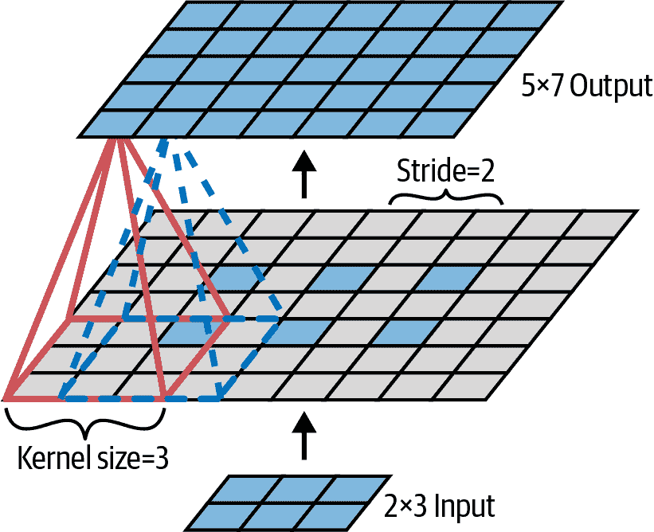

###### 图 12-28. 使用转置卷积层进行上采样

使用转置卷积层进行上采样是可以的，但仍然不够精确。为了做得更好，Long 等人添加了来自较低层的跳过连接：例如，他们将输出图像上采样了 2 倍（而不是 32 倍），并且添加了具有这种双倍分辨率的较低层的输出。然后他们通过 16 倍因子上采样结果，导致总上采样因子为 32（见图 12-29）。这恢复了一些在早期池化层中丢失的空间分辨率。在他们最好的架构中，他们使用第二个类似的跳过连接从更低层恢复更精细的细节。简而言之，原始 CNN 的输出经过以下额外步骤：上采样×2，添加适当尺度的较低层输出，上采样×2，添加更低层的输出，最后上采样×8。甚至可以将尺寸放大到原始图像大小之上：这可以用来提高图像的分辨率，这是一种称为*超分辨率*的技术。


###### 图 12-29\. 跳过层从较低层恢复一些空间分辨率

###### 小贴士

FCN 模型在 TorchVision 中可用，还有其他几个语义分割模型。请参阅笔记本以获取代码示例。

*实例分割*与语义分割类似，但不是将同一类的所有对象合并成一个大的块，而是将每个对象与其他对象区分开来（例如，它识别每个单独的自行车）。例如，由 Kaiming He 等人于 2017 年提出[2017 年论文](https://homl.info/maskrcnn)⁠^(44)的*Mask R-CNN*架构通过为每个边界框额外生成一个像素掩码来扩展 Faster R-CNN 模型。因此，你不仅为每个对象得到一个带有估计类别概率的边界框，还得到一个定位边界框内属于对象的像素的像素掩码。此模型在 TorchVision 中可用，在 COCO 2017 数据集上预训练。

###### 小贴士

由于`Video`和`Mask` TVTensors，TorchVision 的 transforms API v2 可以应用于掩码和视频，就像它应用于边界框一样。

如你所见，深度计算机视觉领域广阔且发展迅速，每年都会出现各种架构。如果你想尝试最新的最佳模型，请查看[*https://huggingface.co/papers*](https://huggingface.co/papers)上的热门论文。其中大部分曾经是基于卷积神经网络的，但自 2020 年以来，另一种神经网络架构已经进入计算机视觉领域：Transformer（我们将在第十四章中讨论）。过去 15 年取得的进步令人惊叹，研究人员现在正专注于越来越难的问题，例如*对抗学习*（试图使网络对旨在欺骗它的图像更具抵抗力）、*可解释性*（理解网络为何做出特定的分类）、逼真的*图像生成*（我们将在第十八章中再次讨论）、*单次学习*（一个系统在仅看到一次物体后就能识别该物体）、预测视频中的下一帧、结合文本和图像任务，等等。

现在进入下一章，我们将探讨如何使用循环神经网络和卷积神经网络处理序列数据，如时间序列。

# 练习

1.  与全连接 DNN 相比，CNN 在图像分类中有哪些优势？

1.  考虑一个由三个卷积层组成的 CNN，每个层使用 3 × 3 核，步长为 2，填充为"same"。最低层输出 100 个特征图，中间层输出 200 个，顶层输出 400 个。输入图像是 200 × 300 像素的 RGB 图像：

    1.  CNN 中的参数总数是多少？

    1.  如果我们使用 32 位浮点数，在为单个实例进行预测时，这个网络至少需要多少 RAM？

    1.  当在 50 张图像的小批量上进行训练时，情况如何？

1.  如果在训练 CNN 时你的 GPU 内存不足，你可以尝试以下五种方法来解决问题？

1.  为什么你想要添加一个最大池化层而不是具有相同步长的卷积层？

1.  你能说出与 LeNet-5 相比，AlexNet 的主要创新点是什么？GoogLeNet、ResNet、SENet、Xception、EfficientNet 和 ConvNeXt 的主要创新点又是什么？

1.  什么是全卷积网络？如何将密集层转换为卷积层？

1.  语义分割的主要技术难点是什么？

1.  从头开始构建自己的 CNN，并尝试在 MNIST 上实现尽可能高的准确率。

1.  使用迁移学习进行大图像分类，按照以下步骤进行：

    1.  创建一个包含每个类别至少 100 张图像的训练集。例如，你可以根据自己的照片根据地点（海滩、山脉、城市等）进行分类。或者，你可以使用现有的数据集，例如 PyTorch 的[计算机视觉迁移学习教程](https://homl.info/transfertuto)中使用的数据集。

    1.  将其分为训练集、验证集和测试集。

    1.  构建输入管道，应用适当的预处理操作，并可选地添加数据增强。

    1.  在这个数据集上微调预训练模型。

1.  遍历 PyTorch 的[目标检测微调教程](https://homl.info/detectiontuto)。

这些练习的解答可在本章笔记本的末尾找到，在[*https://homl.info/colab-p*](https://homl.info/colab-p)。

^(1) David H. Hubel，“未受限制的猫的条纹皮层中的单个神经元活动”，*生理学杂志* 147 (1959): 226–238。

^(2) David H. Hubel 和 Torsten N. Wiesel，“猫条纹皮层中单个神经元的感受野”，*生理学杂志* 148 (1959): 574–591。

^(3) David H. Hubel 和 Torsten N. Wiesel，“猴条纹皮层的感受野和功能架构”，*生理学杂志* 195 (1968): 215–243。

^(4) Kunihiko Fukushima，“新认知机：一种不受位置移动影响的模式识别机制的自我组织神经网络模型”，*生物控制论* 36 (1980): 193–202。

^(5) Yann LeCun 等人，“将基于梯度的学习方法应用于文档识别”，*IEEE 汇刊* 86, 第 11 期 (1998): 2278–2324。

^(6) 卷积是一种数学运算，它将一个函数滑动到另一个函数上，并测量它们逐点乘积的积分。它与傅里叶变换和拉普拉斯变换有着深刻的联系，并且在信号处理中被广泛使用。卷积层实际上使用的是互相关，这与卷积非常相似（更多详情请见[*https://homl.info/76*](https://homl.info/76)）。

^(7) 我们之前讨论的其他核都有权重，但池化核没有：它们只是无状态的滑动窗口。

^(8) Yann LeCun 等人，“将基于梯度的学习方法应用于文档识别”，*IEEE 汇刊* 86, 第 11 期 (1998): 2278–2324。

^(9) Alex Krizhevsky 等人，“使用深度卷积神经网络进行 ImageNet 分类”，*第 25 届国际神经网络信息处理系统会议论文集* 1 (2012): 1097–1105。

^(10) Matthew D. Zeiler 和 Rob Fergus，“可视化并理解卷积网络”，*欧洲计算机视觉会议论文集* (2014): 818–833。

^(11) Christian Szegedy 等人，“通过卷积加深”，*IEEE 计算机视觉与模式识别会议论文集* (2015): 1–9。

^(12) 在 2010 年的电影《盗梦空间》中，角色们不断深入到多个梦境层中；因此这些模块的名称由此而来。

^(13) 何凯明等， “用于图像识别的深度残差学习”， arXiv 预印本 arXiv:1512:03385 (2015)。

^(14) 高黄，孙宇等， “具有随机深度的深度网络”， arXiv 预印本 arXiv:1603.09382 (2016)。

^(15) 描述神经网络时，通常只计算具有参数的层。

^(16) Christian Szegedy 等， “Inception-v4，Inception-ResNet 以及残差连接对学习的影响”， arXiv 预印本 arXiv:1602.07261 (2016)。

^(17) François Chollet， “Xception：使用深度可分离卷积的深度学习”， arXiv 预印本 arXiv:1610.02357 (2016)。

^(18) 这个名称有时可能有些歧义，因为空间可分离卷积通常也被称为“可分离卷积”。

^(19) 胡杰等， “挤压和激励网络”， *IEEE 计算机视觉与模式识别会议论文集* (2018): 7132–7141。

^(20) Karen Simonyan 和 Andrew Zisserman， “用于大规模图像识别的非常深的卷积神经网络”， arXiv 预印本 arXiv:1409.1556 (2014)。

^(21) 谢赛宁等， “用于深度神经网络的聚合残差变换”， arXiv 预印本 arXiv:1611.05431 (2016)。

^(22) 高黄等， “密集连接卷积网络”， arXiv 预印本 arXiv:1608.06993 (2016)。

^(23) Andrew G. Howard 等， “MobileNets：用于移动视觉应用的效率卷积神经网络”， arXiv 预印本 arXiv:1704.04861 (2017)。

^(24) 王建尧等， “CSPNet：一种可以增强 CNN 学习能力的新的骨干网络”， arXiv 预印本 arXiv:1911.11929 (2019)。

^(25) 谭明兴和 Quoc V. Le， “EfficientNet：重新思考卷积神经网络的模型缩放”， arXiv 预印本 arXiv:1905.11946 (2019)。

^(26) 刘壮等， “面向 2020 年代的卷积神经网络”， arXiv 预印本 arXiv:2201.03545 (2022)。

^(27) 在国际单位制（SI）中，1 MB = 1,000 KB = 1,000 × 1,000 字节 = 1,000 × 1,000 × 8 比特。而 1 MiB = 1,024 kiB = 1,024 × 1,024 字节。因此，12 MB ≈ 11.44 MiB。

^(28) 艾丹·戈麦斯等， “在大规模类别上的自动花卉分类”， *印度计算机视觉、图形与图像处理会议论文集* (2008)。

^(29) M. Nilsback 和 A. Zisserman， “在大量类别上的自动花卉分类”， *印度计算机视觉、图形与图像处理会议论文集* (2008)。

^(30) TorchVision PR #8838 可能会在你阅读这些行时修复这个问题。

^(31) H. Rezatofighi 等人，“Generalized Intersection over Union: A Metric and A Loss for Bounding Box Regression”，arXiv 预印本 arXiv:1902.09630 (2019).

^(32) Z. Zheng 等人，“Enhancing Geometric Factors in Model Learning and Inference for Object Detection and Instance Segmentation”，arXiv 预印本 arXiv:2005.03572 (2020).

^(33) Jonathan Long 等人，“Fully Convolutional Networks for Semantic Segmentation”，*IEEE 计算机视觉与模式识别会议论文集* (2015): 3431–3440.

^(34) 有一个小的例外：使用 `"valid"` 填充的卷积层如果输入尺寸小于核尺寸，将会报错。

^(35) Joseph Redmon 等人，“You Only Look Once: Unified, Real-Time Object Detection”，*IEEE 计算机视觉与模式识别会议论文集* (2016): 779–788.

^(36) Shaoqing Ren 等人，“Faster R-CNN: Towards Real-Time Object Detection with Region Proposal Networks”，*第 28 届国际神经网络信息处理系统会议论文集* 1 (2015): 91–99.

^(37) Wei Liu 等人，“SSD: Single Shot Multibox Detector”，*第 14 届欧洲计算机视觉会议论文集* 1 (2016): 21–37.

^(38) Mark Sandler 等人，“MobileNetV2: Inverted Residuals and Linear Bottlenecks”，arXiv 预印本 arXiv:1801.04381 (2018).

^(39) Tsung-Yi Lin 等人，“Focal Loss for Dense Object Detection”，arXiv 预印本 arXiv:1708.02002 (2017).

^(40) Zhi Tian 等人，“FCOS: Fully Convolutional One-Stage Object Detection”，arXiv 预印本 arXiv:1904.01355 (2019).

^(41) Nicolai Wojke 等人，“Simple Online and Realtime Tracking with a Deep Association Metric”，arXiv 预印本 arXiv:1703.07402 (2017).

^(42) Nir Aharon 等人，“BoT-SORT: Robust Associations Multi-Pedestrian Tracking”，arXiv 预印本 arXiv:2206.14651 (2022).

^(43) 这种类型的层有时被称为 *反卷积层*，但它并不执行数学家所说的反卷积，因此应避免使用此名称。

^(44) Kaiming He 等人，“Mask R-CNN”，arXiv 预印本 arXiv:1703.06870 (2017).
