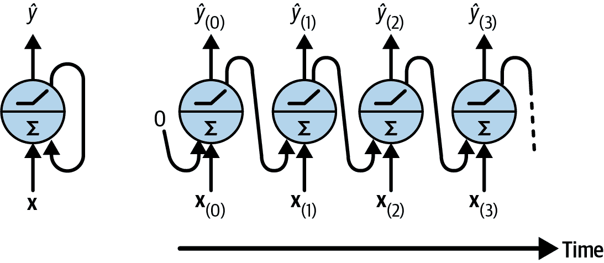
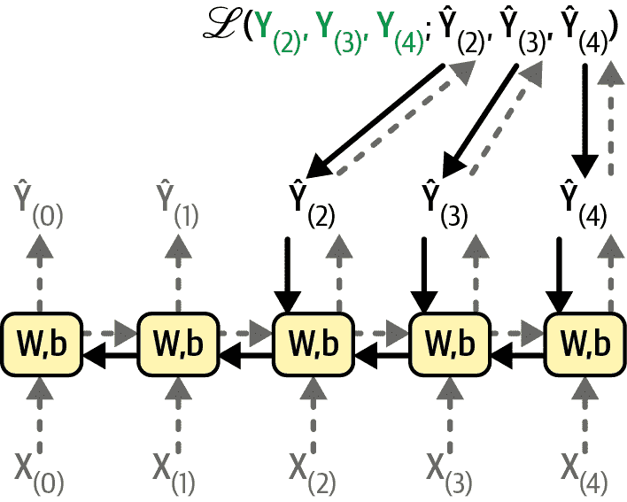
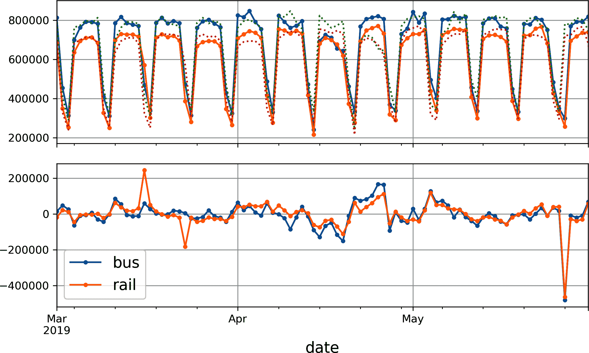
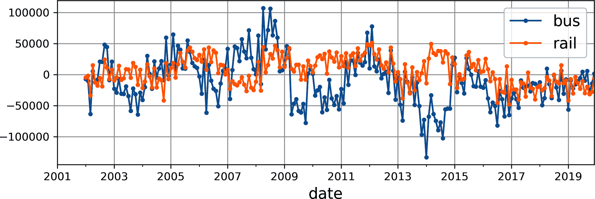
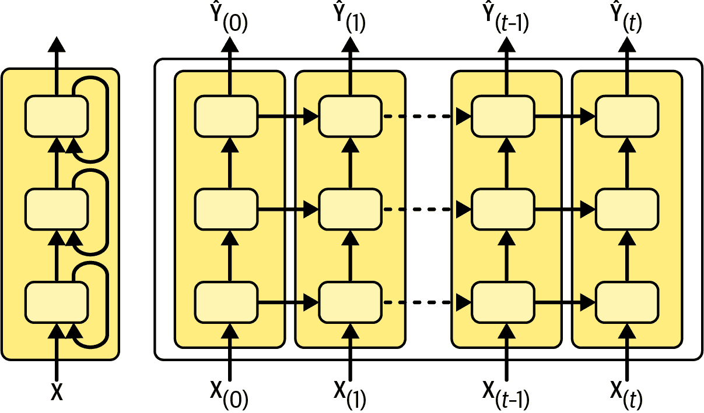

# 第十三章\. 使用 RNNs 和 CNNs 处理序列

预测未来是你在日常生活中经常做的事情，无论是完成朋友的句子还是期待早餐时咖啡的香气。在本章中，我们将讨论循环神经网络（RNNs）——一类能够预测未来的网络（好吧，至少在一定范围内）。RNNs 可以分析时间序列数据，例如你网站上每日活跃用户数量、你城市的小时温度、你家的每日电力消耗、附近车辆的轨迹等等。一旦 RNN 学会了数据中的过去模式，它就能利用其知识来预测未来，当然，前提是过去模式在未来仍然成立。

更一般地说，RNNs 可以在任意长度的序列上工作，而不是在固定大小的输入上。例如，它们可以接受句子、文档或音频样本作为输入，这使得它们在自然语言处理应用，如自动翻译或语音转文本中非常有用。

在本章中，我们首先将介绍 RNNs 的基本概念以及如何使用时间反向传播来训练它们。然后，我们将使用它们来预测时间序列。在这个过程中，我们将查看流行的自回归移动平均（ARMA）模型系列，这些模型通常用于预测时间序列，并将它们作为基准与我们的 RNNs 进行比较。之后，我们将探索 RNNs 面临的主要两个困难：

+   不稳定的梯度（在第十一章 Chapter 11 中讨论），可以使用各种技术来缓解，包括*循环 dropout*和*循环层归一化*。

+   （非常）有限的短期记忆，可以使用长短期记忆（LSTM）和门控循环单元（GRU）细胞来扩展。

RNNs 并不是唯一能够处理序列数据的神经网络类型。对于短序列，一个常规的密集网络就可以解决问题，而对于非常长的序列，例如音频样本或文本，卷积神经网络实际上也可以工作得相当好。我们将讨论这两种可能性，并在本章结束时实现一个 WaveNet——一个能够处理数万个时间步序列的 CNN 架构。但我们可以做得更好！在第十四章 Chapter 14 中，我们将应用 RNNs 到自然语言处理（NLP）中，并了解如何使用注意力机制来提升它们。注意力是 transformers 的核心，我们将在第十五章 Chapter 15 中了解到：它们现在是序列处理、NLP 甚至计算机视觉的尖端技术。但在我们到达那里之前，让我们从最简单的 RNNs 开始！

# 循环神经元和层

到目前为止，我们一直关注的是前馈神经网络，其中激活只在一个方向上流动，从输入层到输出层。循环神经网络看起来非常像前馈神经网络，只不过它还有指向后方的连接。

让我们看看最简单的 RNN，它由一个接收输入、产生输出并将该输出发送回自身的神经元组成（见图图 13-1，左侧）。在每个时间步*t*（也称为*帧*），这个*循环神经元*接收输入**x**[(*t*)]以及前一个时间步的输出*ŷ*[(*t*–1)]。由于第一个时间步没有前一个输出，它通常被设置为零。我们可以将这个微小的网络与时间轴相对比（见图图 13-1，右侧）。这被称为*通过时间展开网络*（它是在每个时间步表示一次的相同循环神经元）。



###### 图 13-1\. 循环神经元（左侧）随时间展开（右侧）

你可以轻松创建一个循环神经元层。在每个时间步*t*，每个神经元都会接收到输入向量**x**[(*t*)]和前一个时间步的输出向量**ŷ**[(*t*–1)]，如图图 13-2 所示。请注意，现在输入和输出都是向量（当只有一个神经元时，输出是一个标量）。


###### 图 13-2\. 循环神经元层（左侧）随时间展开（右侧）

每个循环神经元有两套权重：一套用于输入**x**[(*t*)]，另一套用于前一个时间步的输出**ŷ**[(*t*–1)]。让我们称这些权重向量为**w**[*x*]和**w**[*ŷ*]。如果我们考虑整个循环层而不是单个循环神经元，我们可以将所有权重向量放入两个权重矩阵中：**W**[*x*]和**W**[*ŷ*]。

整个循环层的输出向量可以像你预期的那样计算，如方程式 13-1 所示，其中**b**是偏置向量，*ϕ*(·)是激活函数（例如，ReLU⁠^(1)）。

##### 方程式 13-1\. 单个实例的循环层输出

$美元符号修改上标 y 带撇号下标左括号 t 右括号基线等于 phi 左括号上标 W 下标 x 基线上标 T 基线上标 W 下标修改上标 y 带撇号基线上标 T 基线修改上标 y 带撇号下标左括号 t 减 1 右括号基线加上上标 b 右括号美元符号$

就像前馈神经网络一样，我们可以通过将所有输入在时间步 *t* 放入一个输入矩阵 **X**[(*t*)]（见 方程 13-2）中，一次性计算整个 mini-batch 的循环层输出。

##### 方程 13-2\. mini-batch 中所有实例的循环神经元层输出

<mtable displaystyle="true"><mtr><mtd columnalign="right"><msub><mi mathvariant="bold">Ŷ</mi> <mrow><mo>(</mo><mi>t</mi><mo>)</mo></mrow></msub></mtd> <mtd columnalign="left"><mrow><mo>=</mo> <mi>ϕ</mi> <mn>(</mn> <msub><mi mathvariant="bold">X</mi> <mrow><mo>(</mo><mi>t</mi><mo>)</mo></mrow></msub> <msub><mi mathvariant="bold">W</mi> <mi>x</mi></msub> <mo>+</mo> <msub><mi mathvariant="bold">Ŷ</mi> <mrow><mo>(</mo><mi>t</mi><mo>-</mo><mn>1</mn><mo>)</mo></mrow></msub> <msub><mi mathvariant="bold">W</mi> <mi>ŷ</mi></msub> <mo>+</mo> <mi mathvariant="bold">b</mi> <mn>)</mn></mrow></mtd></mtr> <mtr><mtd columnalign="left"><mrow><mo>=</mo> <mi>ϕ</mi> <mn>(</mn> <mn>[</mn> <msub><mi mathvariant="bold">X</mi> <mrow><mo>(</mo><mi>t</mi><mo>)</mo></mrow></msub> <msub><mi mathvariant="bold">Ŷ</mi> <mrow><mo>(</mo><mi>t</mi><mo>-</mo><mn>1</mn><mo>)</mo></mrow></msub> <mn>]</mn> <mi mathvariant="bold">W</mi> <mo>+</mo> <mi mathvariant="bold">b</mi> <mn>)</mn> <mtext>with</mtext> <mi mathvariant="bold">W</mi> <mo>=</mo> <mo>[</mo> <mtable><mtr><mtd><msub><mi mathvariant="bold">W</mi> <mi>x</mi></msub></mtd></mtr> <mtr><mtd><msub><mi mathvariant="bold">W</mi> <mi>ŷ</mi></msub></mtd></mtr></mtable> <mo>]</mo></mrow></mtd></mtr></mtable>

在这个方程中：

+   **Ŷ**[(*t*)] 是一个 *m* × *n*[neurons] 的矩阵，包含 mini-batch 中每个实例在时间步 *t* 的层输出（*m* 是 mini-batch 中的实例数量，*n*[neurons] 是神经元的数量）。

+   **X**[(*t*)] 是一个 *m* × *n*[inputs] 的矩阵，包含所有实例的输入（*n*[inputs] 是输入特征的数量）。

+   **W**[*x*] 是一个 *n*[inputs] × *n*[neurons] 的矩阵，包含当前时间步输入的连接权重。

+   **W**[*ŷ*] 是一个 *n*[neurons] × *n*[neurons] 的矩阵，包含前一时间步输出的连接权重。

+   **b** 是一个大小为 *n*[neurons] 的向量，包含每个神经元的偏置项。

+   权重矩阵 **W**[*x*] 和 **W**[*ŷ*] 通常垂直连接成一个形状为 (*n*[inputs] + *n*[neurons]) × *n*[neurons] 的单个权重矩阵 **W**（见 方程 13-2 的第二行）。

+   符号 [**X**[(*t*)] **Ŷ**[(*t*–1)]] 表示矩阵 **X**[(*t*)] 和 **Ŷ**[(*t*–1)] 的水平连接。

注意到 **Ŷ**[(*t*)] 是 **X**[(*t*)] 和 **Ŷ**[(*t*–1)] 的函数，**Ŷ**[(*t*–1)] 是 **X**[(*t*–1)] 和 **Ŷ**[(*t*–2)] 的函数，**Ŷ**[(*t*–2)] 是 **X**[(*t*–2)] 和 **Ŷ**[(*t*–3)] 的函数，依此类推。这使得 **Ŷ**[(*t*)] 成为自时间 *t* = 0（即 **X**[(0)], **X**[(1)], …​, **X**[(*t*)]）以来所有输入的函数。在第一个时间步，*t* = 0，没有先前的输出，因此它们通常被假定为都是零。

###### 注意

在人工神经网络中引入反向连接（即循环）的想法可以追溯到人工神经网络的最早期，但第一个现代循环神经网络（RNN）架构是在 1986 年由迈克尔·I·乔丹（Michael I. Jordan）提出的[1](https://homl.info/jordanrnn)。⁠^(2) 在每个时间步，他的 RNN 会查看该时间步的输入，以及它从上一个时间步的输出。这被称为*输出反馈*。

## 记忆单元

由于在时间步 *t* 的循环神经元的输出是所有先前时间步输入的函数，因此可以说它具有一种*记忆*形式。一个在时间步之间保持某些状态的神经网络部分被称为*记忆单元*（或简单地称为*单元*）。单个循环神经元或循环神经元层是一个非常基本的单元，只能学习短模式（通常长度约为 10 步，但这个数字根据任务而变化）。在本章的后面部分，我们将探讨一些更复杂且功能强大的单元类型，这些单元能够学习更长的模式（大约长 10 倍，但同样，这取决于任务）。

单元在时间步 *t* 的状态，表示为 **h**[(*t*)]（“h”代表“隐藏”），是某些在该时间步的输入及其前一个时间步的状态的函数：**h**[(*t*)] = *f*(**x**[(*t*)], **h**[(*t*–1)]). 它在时间步 *t* 的输出，表示为 **ŷ**[(*t*)]，也是前一个状态和当前输入的函数，通常它只是当前状态的函数。在我们迄今为止讨论的基本单元中，输出等于状态，但在更复杂的单元中，情况并不总是如此，如图 13-3 所示。


###### 图 13-3\. 单元的隐藏状态及其输出可能不同

###### 注意

第一个现代 RNN，它反馈的是隐藏状态而不是输出，是在 1990 年由杰弗里·埃尔曼（Jeffrey Elman）提出的[2](https://homl.info/elmanrnn)。⁠^(3) 这被称为*状态反馈*，并且是今天最常见的方法。

## 输入和输出序列

RNN 可以同时接受一系列输入并产生一系列输出（见图 13-4 左上角的网络）。这种类型的*序列到序列网络*对于预测时间序列很有用，例如你家的每日电力消耗：你给它输入过去*N*天的数据，并训练它输出未来一天（即从*N* - 1 天到明天）的电力消耗。

或者，你也可以给网络输入一系列输入，忽略除了最后一个之外的所有输出（见图 13-4 右上角的网络）。这是一个*序列到向量网络*。例如，你可以给网络输入一系列与电影评论对应的单词，网络会输出一个情感分数（例如，从 0[恨]到 1[爱]）。

相反，你可以在每个时间步重复输入相同的输入向量，并让网络输出一个序列（见图 13-4 左下角的网络）。这是一个*向量到序列网络*。例如，输入可以是图像（或 CNN 的输出），输出可以是该图像的标题。


###### 图 13-4\. 序列到序列（左上角）、序列到向量（右上角）、向量到序列（左下角）和编码器-解码器（右下角）网络

最后，你可以有一个序列到向量网络，称为*编码器*，后面跟着一个向量到序列网络，称为*解码器*（见图 13-4 右下角的网络）。例如，这可以用于将一种语言的句子翻译成另一种语言。你会给网络输入一种语言的句子，编码器会将这个句子转换成一个单一的向量表示，然后解码器会将这个向量解码成另一种语言的句子。这个称为[*编码器-解码器*](https://homl.info/seq2seq)的两步模型，⁠^(4)比尝试使用单个序列到序列 RNN（如左上角表示的）即时翻译要好得多：句子的最后几个词可能会影响翻译的第一个词，所以你需要等到看到整个句子后再进行翻译。我们将在第十四章中介绍编码器-解码器的实现（正如你将看到的，它比图 13-4 所暗示的要复杂一些）。

这种多功能性听起来很有希望，但你如何训练一个循环神经网络呢？

# 训练 RNNs

要训练一个 RNN，技巧是将其在时间上展开（就像我们刚才做的那样），然后使用常规的反向传播（见图 13-5）。这种策略被称为*时间反向传播*（BPTT）。

正如常规反向传播一样，有一个通过展开网络的第一次正向传递（由虚线箭头表示）。然后使用损失函数ℒ(**Y**[(0)], **Y**[(1)], …​, **Y**[(*T*)]; **Ŷ**[(0)], **Ŷ**[(1)], …​, **Ŷ**[(*T*)])评估输出序列（其中**Y**[(*i*)]是第*i*个目标，**Ŷ**[(*i*)]是第*i*个预测，*T*是最大时间步）。请注意，这个损失函数可能会忽略一些输出。例如，在序列到向量的 RNN 中，除了最后一个输出之外，所有输出都被忽略。在图 13-5 中，损失函数仅基于最后三个输出进行计算。然后，该损失函数的梯度通过展开网络向后传播（由实线箭头表示）。在这个例子中，由于输出**Ŷ**[(0)]和**Ŷ**[(1)]没有用于计算损失，因此梯度不会通过它们向后流动；它们只通过**Ŷ**[(2)]，**Ŷ**[(3)]和**Ŷ**[(4)]流动。此外，由于每个时间步都使用相同的参数**W**和**b**，它们的梯度将在反向传播期间多次调整。一旦反向阶段完成并且所有梯度都已计算，BPTT 可以执行梯度下降步骤以更新参数（这与常规反向传播没有不同）。



###### 图 13-5. 时间反向传播

幸运的是，PyTorch 为你处理了所有这些复杂性，你将会看到。但在我们到达那里之前，让我们加载一个时间序列，并使用经典工具开始分析它，以便更好地了解我们正在处理的内容，并获得一些基线指标。

# 时间序列预测

好的！让我们假设你刚刚被芝加哥交通管理局雇佣为数据科学家。你的第一个任务是构建一个能够预测第二天公交和铁路乘客数量的模型。你自 2001 年以来就有每日客流量数据。让我们看看你会如何处理这个问题。我们将从加载数据并对其进行清理开始：^(5)

```py
import pandas as pd
from pathlib import Path

path = Path("datasets/ridership/CTA_-_Ridership_-_Daily_Boarding_Totals.csv")
df = pd.read_csv(path, parse_dates=["service_date"])
df.columns = ["date", "day_type", "bus", "rail", "total"]  # shorter names
df = df.sort_values("date").set_index("date")
df = df.drop("total", axis=1)  # no need for total, it's just bus + rail
df = df.drop_duplicates()  # remove duplicated months (2011-10 and 2014-07)
```

我们加载 CSV 文件，设置短列名，按日期排序行，删除冗余的`total`列，并删除重复的行。现在让我们看看前几行看起来像什么：

```py
>>> df.head()
 day_type     bus    rail
date
2001-01-01        U  297192  126455
2001-01-02        W  780827  501952
2001-01-03        W  824923  536432
2001-01-04        W  870021  550011
2001-01-05        W  890426  557917
```

2001 年 1 月 1 日，有 297,192 人在芝加哥乘坐公交车，有 126,455 人乘坐火车。`day_type`列包含`W`代表**W**eekdays，`A`代表**S**a**turdays，`U`代表**S**u**ndays 或节假日。

现在让我们绘制 2019 年几个月的公交和铁路客流量数据，看看它看起来像什么（见图 13-6）：

```py
import matplotlib.pyplot as plt

df["2019-03":"2019-05"].plot(grid=True, marker=".", figsize=(8, 3.5))
plt.show()
```


###### 图 13-6. 芝加哥每日客流量

注意，Pandas 包括范围中的起始和结束月份，因此这个图显示了从 3 月 1 日到 5 月 31 日的数据。这是一个*时间序列*：在不同时间步长上有值的序列，通常是以固定间隔。更具体地说，由于每个时间步长有多个值，这被称为*多元时间序列*。如果我们只看`bus`列，它将是一个*单变量时间序列*，每个时间步长只有一个值。预测未来值（即预测）是处理时间序列时最典型的任务，这也是本章我们将关注的重点。其他任务包括插补（填补过去缺失的值）、分类、异常检测等。

观察图 13-6 图 13-6，我们可以看到这种模式每周都会清晰地重复。这被称为*季节性*。实际上，在这个例子中，这种季节性非常强烈，仅通过复制一周前的值来预测明天的客流量就能得到相当好的结果。这被称为*简单预测*：简单地复制过去的一个值来做出我们的预测。简单预测通常是一个很好的基线，在某些情况下甚至可能很难超越。

###### 注意

通常，简单预测意味着复制最新的已知值（例如，预测明天将与今天相同）。然而，在我们的情况下，由于强烈的每周季节性，复制上周的值效果更好。

为了可视化这些简单预测，让我们用虚线叠加两个时间序列（公交车和铁路）以及相同时间序列滞后一周（即向右移动）的时间序列。我们还将绘制两者之间的差异（即时间*t*的值减去时间*t*–7 的值）；这被称为*差分*（见图 13-7）：

```py
diff_7 = df[["bus", "rail"]].diff(7)["2019-03":"2019-05"]

fig, axs = plt.subplots(2, 1, sharex=True, figsize=(8, 5))
df.plot(ax=axs[0], legend=False, marker=".")  # original time series
df.shift(7).plot(ax=axs[0], grid=True, legend=False, linestyle=":")  # lagged
diff_7.plot(ax=axs[1], grid=True, marker=".")  # 7-day difference time series
plt.show()
```



###### 图 13-7\. 时间序列与 7 天滞后时间序列叠加（顶部），以及*t*和*t*–7 之间的差异（底部）

还不错！注意观察滞后时间序列如何紧密地跟踪实际时间序列。当一个时间序列与其自身的滞后版本相关时，我们称该时间序列为*自相关的*。正如你所见，大部分差异都相当小，除了五月底。那时可能有个假期？让我们检查一下`day_type`列：

```py
>>> list(df.loc["2019-05-25":"2019-05-27"]["day_type"])
['A', 'U', 'U']
```

的确，那时有一个长假：星期一是纪念日假期。我们可以使用这个列来改进我们的预测，但现在让我们只测量我们任意关注的三个月的平均绝对误差——2019 年 3 月、4 月和 5 月，以获得一个大致的概念：

```py
>>> diff_7.abs().mean()
bus     43915.608696
rail    42143.271739
dtype: float64
```

我们的简单预测得到的平均绝对误差（MAE）大约为 43,916 名公交车乘客，以及大约 42,143 名铁路乘客。一眼看去很难判断这是好是坏，所以让我们通过将预测误差除以目标值来将这些误差置于适当的视角：

```py
>>> targets = df[["bus", "rail"]]["2019-03":"2019-05"]
>>> (diff_7 / targets).abs().mean()
bus     0.082938
rail    0.089948
dtype: float64
```

我们刚刚计算的是所谓的*平均绝对百分比误差*（MAPE）。看起来我们的简单预测给出了公交车大约 8.3%的 MAPE，铁路大约 9.0%。值得注意的是，铁路预测的 MAE 看起来略好于公交车预测的 MAE，而 MAPE 的情况则相反。这是因为公交车乘客数量大于铁路乘客数量，所以预测误差自然也更大，但当我们将这些误差置于适当的视角时，结果竟然是公交车预测实际上略好于铁路预测。

###### 小贴士

MAE（平均绝对误差）、MAPE（平均绝对百分比误差）和均方误差（MSE）是你可以用来评估预测的最常见指标之一。和往常一样，选择合适的指标取决于任务。例如，如果你的项目对大误差的惩罚比对小误差的惩罚更严重，那么 MSE 可能更可取，因为它对大误差的惩罚更重。

观察时间序列，似乎没有明显的月度季节性，但让我们检查是否存在年度季节性。我们将查看 2001 年至 2019 年的数据。为了减少数据挖掘的风险，我们目前将忽略更近期的数据。让我们也为每个序列绘制 12 个月的滚动平均值，以可视化长期趋势（参见图 13-8）：

```py
period = slice("2001", "2019")
df_monthly = df.select_dtypes(include="number").resample('ME').mean()
rolling_average_12_months = df_monthly.loc[period].rolling(window=12).mean()

fig, ax = plt.subplots(figsize=(8, 4))
df_monthly[period].plot(ax=ax, marker=".")
rolling_average_12_months.plot(ax=ax, grid=True, legend=False)
plt.show()
```


###### 图 13-8. 年度季节性和长期趋势

是的！确实存在一些年度季节性，尽管它比周季节性更嘈杂，并且对于铁路序列比公交车序列更明显：我们每年在相同日期看到峰值和谷值。让我们检查如果我们绘制 12 个月差异会得到什么（参见图 13-9）：

```py
df_monthly.diff(12)[period].plot(grid=True, marker=".", figsize=(8, 3))
plt.show()
```



###### 图 13-9. 12 个月差异

注意到差分不仅消除了年度季节性，还消除了长期趋势。例如，2016 年至 2019 年时间序列中存在的线性下降趋势在差分时间序列中变成了一个大致恒定的负值。实际上，差分是常用的一种技术，用于从时间序列中去除趋势和季节性：研究一个 *平稳* 时间序列，即其统计属性在时间上保持不变，没有任何季节性或趋势，更容易一些。一旦你能够对差分时间序列进行准确的预测，只需将之前减去的过去值加回，就可以很容易地将它们转换为实际时间序列的预测。

你可能认为我们只是在尝试预测明天的客流量，所以长期模式的重要性远不如短期模式。你说得对，但即便如此，我们仍然可能通过考虑长期模式来略微提高性能。例如，2017 年 10 月的每日公交客流量下降了约 2,500 人，这相当于每周少 570 名乘客，所以如果我们是在 2017 年 10 月末，那么通过复制上周的值并减去 570 来预测明天的客流量是有意义的。考虑趋势会使你的预测在平均上更准确。

现在你已经熟悉了客流量时间序列，以及时间序列分析中的一些最重要的概念，包括季节性、趋势、差分和移动平均，让我们快速了解一下一个非常流行的统计模型族，这些模型通常用于分析时间序列。

## ARMA 模型族

我们将从由赫尔曼·沃尔德在 1930 年代开发的 *自回归移动平均*（ARMA）模型开始：它通过简单的加权滞后值之和来计算预测，并通过添加移动平均来校正这些预测，这与我们刚才讨论的非常相似。具体来说，移动平均成分是通过计算最后几个预测误差的加权平均来得到的。方程式 13-3 展示了模型是如何进行预测的。

##### 方程式 13-3\. 使用 ARMA 模型进行预测

<mtable columnalign="left"><mtr><mtd><msub><mover><mi>y</mi><mo>^</mo></mover><mrow><mo>(</mo><mi>t</mi><mo>)</mo></mrow></msub><mo>=</mo><munderover><mo>∑</mo><mrow><mi>i</mi><mo>=</mo><mn>1</mn></mrow><mi>p</mi></munderover><msub><mi>α</mi><mi>i</mi></msub><msub><mi>y</mi><mrow><mo>(</mo><mi>t</mi><mo>-</mo><mi>i</mi><mo>)</mo></mrow></msub><mo>+</mo><munderover><mo>∑</mo><mrow><mi>i</mi><mo>=</mo><mn>1</mn></mrow><mi>q</mi></munderover><msub><mi>θ</mi><mi>i</mi></msub><msub><mi>ε</mi><mrow><mo>(</mo><mi>t</mi><mo>-</mo><mi>i</mi><mo>)</mo></mrow></msub></mtd></mtr><mtr><mtd><mtext>with  </mtext><msub><mi>ε</mi><mrow><mo>(</mo><mi>t</mi><mo>)</mo></mrow></msub><mo>=</mo><msub><mi>y</mi><mrow><mo>(</mo><mi>t</mi><mo>)</mo></mrow></msub><mo>-</mo><msub><mover><mi>y</mi><mo>^</mo></mover><mrow><mo>(</mo><mi>t</mi><mo>)</mo></mrow></msub></mtd></mtr></mtable>

在这个方程中：

+   *ŷ*[(*t*)] 是模型对时间步 *t* 的预测。

+   *y*[(*t*)] 是时间序列在时间步 *t* 的值。

+   第一个求和是时间序列过去 *p* 个值的加权求和，使用学习到的权重 *α*[*i*]。数字 *p* 是一个超参数，它决定了模型应该回溯多远的历史。这个求和是模型的 *自回归* 部分：它基于过去值进行回归。

+   第二个求和是过去 *q* 个预测误差 *ε*[(*t*)] 的加权求和，使用学习到的权重 *θ*[*i*]。数字 *q* 是一个超参数。这个求和是模型的 *移动平均* 部分。

重要的是，这个模型假设时间序列是平稳的。如果不是，那么差分可能有助于解决这个问题。对单个时间步进行差分将产生时间序列导数的近似值：实际上，它将给出每个时间步的序列斜率。这意味着它将消除任何线性趋势，将其转换为常数值。例如，如果你对一个序列 [3, 5, 7, 9, 11] 应用单步差分，你得到差分序列 [2, 2, 2, 2]。

如果原始时间序列有一个二次趋势而不是线性趋势，那么单次差分将不足以解决问题。例如，序列 [1, 4, 9, 16, 25, 36] 在一次差分后变为 [3, 5, 7, 9, 11]，但如果你进行第二次差分，那么你得到 [2, 2, 2, 2]。因此，进行两次差分将消除二次趋势。更一般地，进行 *d* 次连续差分计算时间序列的 *d* 次导数的近似值，因此它将消除高达 *d* 次的多项式趋势。这个超参数 *d* 被称为 *积分阶数*。

差分是*自回归积分移动平均*（ARIMA）模型的核心贡献，由 George Box 和 Gwilym Jenkins 在他们的书《时间序列分析》（Wiley）中于 1970 年引入。该模型进行*d*轮差分，使时间序列更加平稳，然后应用常规的 ARMA 模型。在做出预测时，它使用这个 ARMA 模型，然后添加回由差分减去的项。

ARMA 家族的最后一个成员是*季节性 ARIMA*（SARIMA）模型：它以与 ARIMA 相同的方式对时间序列进行建模，但还额外对给定频率（例如，每周）的季节性成分进行建模，使用完全相同的 ARIMA 方法。它总共有七个超参数：与 ARIMA 相同的*p*，*d*，和*q*超参数；以及额外的*p*，*d*，和*q*超参数来建模季节性模式；最后是季节性模式的周期，表示为*s*。超参数*p*，*d*，和*q*与*p*，*d*，和*q*类似，但它们用于在*t* – *s*，*t* – 2*s*，*t* – 3*s*等时间点建模时间序列。

让我们看看如何将 SARIMA 模型拟合到铁路时间序列，并使用它来预测明天的客流量。我们将假设今天是 2019 年 5 月最后一天，我们想要预测 2019 年 6 月 1 日的铁路客流量。为此，我们可以使用包含许多不同统计模型（包括 ARMA 模型及其变体）的`statsmodels`库，这些模型通过`ARIMA`类实现：

```py
from statsmodels.tsa.arima.model import ARIMA

origin, today = "2019-01-01", "2019-05-31"
rail_series = df.loc[origin:today]["rail"].asfreq("D")
model = ARIMA(rail_series,
              order=(1, 0, 0),
              seasonal_order=(0, 1, 1, 7))
model = model.fit()
y_pred = model.forecast()  # returns 427,758.6
```

在这个代码示例中：

+   我们首先导入`ARIMA`类，然后从 2019 年初开始到“今天”获取铁路客流量数据，并使用`asfreq("D")`将时间序列的频率设置为每日。在这种情况下，这不会改变数据，因为它已经是每日的，但如果没有这个设置，`ARIMA`类将不得不猜测频率，并显示警告。

+   接下来，我们创建一个`ARIMA`实例，传递从“今天”之前的所有数据，并设置模型超参数：`order=(1, 0, 0)`表示*p* = 1，*d* = 0，和*q* = 0；而`seasonal_order=(0, 1, 1, 7)`表示*p* = 0，*d* = 1，*q* = 1，和*s* = 7。请注意，`statsmodels` API 与 Scikit-Learn 的 API 略有不同，因为我们是在构造时将数据传递给模型，而不是在`fit()`方法中传递。

+   接下来，我们拟合模型，并使用它来预测“明天”，即 2019 年 6 月 1 日。

预测的客流量为 427,759 人，而实际上有 379,044 人。哎呀，我们偏离了 12.9%——这相当糟糕。实际上比简单的预测还要糟糕，简单的预测为 426,932，偏离了 12.6%。但也许我们那天只是运气不好？为了检查这一点，我们可以循环运行相同的代码，为三月份、四月份和五月份的每一天做出预测，并计算该期间的 MAE：

```py
origin, start_date, end_date = "2019-01-01", "2019-03-01", "2019-05-31"
time_period = pd.date_range(start_date, end_date)
rail_series = df.loc[origin:end_date]["rail"].asfreq("D")
y_preds = []
for today in time_period.shift(-1):
    model = ARIMA(rail_series[origin:today],  # train on data up to "today"
                  order=(1, 0, 0),
                  seasonal_order=(0, 1, 1, 7))
    model = model.fit()  # note that we retrain the model every day!
    y_pred = model.forecast().iloc[0]
    y_preds.append(y_pred)

y_preds = pd.Series(y_preds, index=time_period)
mae = (y_preds - rail_series[time_period]).abs().mean()  # returns 32,040.7
```

哎，这好多了！平均绝对误差（MAE）大约是 32,041，这比我们用朴素预测得到的 MAE（42,143）低得多。所以尽管模型并不完美，但它仍然在平均意义上比朴素预测有大幅提升。

在这一点上，你可能想知道如何为 SARIMA 模型选择良好的超参数。有几种方法，但最简单易懂且易于开始的方法是暴力搜索法：只需运行网格搜索。对于你想要评估的每个模型（即每个超参数组合），你可以运行前面的代码示例，只需更改超参数值。好的*p*，*q*，*P*和*Q*值通常相当小（通常是 0 到 2，有时高达 5 或 6），而*d*和*D*通常是 0 或 1，有时是 2。至于*s*，它只是主要季节性模式的周期：在我们的案例中是 7，因为有强烈的每周季节性。MAE 最低的模型获胜。当然，如果你有更好的指标来匹配你的业务目标，你也可以用其他指标替换 MAE。就这样！

###### 小贴士

选择良好的超参数还有其他更原则性的方法，基于分析*自相关函数*（ACF）和*偏自相关函数*（PACF），⁠^(6) 或者最小化 AIC 或 BIC 指标（在第八章 8 中介绍），以惩罚使用过多参数的模型并降低过拟合数据的风险，但网格搜索是一个不错的起点。

## 为机器学习模型准备数据

现在我们有了两个基线，朴素预测和 SARIMA，让我们尝试使用我们之前覆盖的机器学习模型来预测这个时间序列，从基本的线性模型开始。我们的目标将是基于过去 8 周的数据（56 天）预测明天的乘客量。因此，我们模型的输入将是序列（一旦模型投入生产，通常每天只有一个序列），每个序列包含从时间步长*t* – 55 到*t*的 56 个值。对于每个输入序列，模型将输出一个值：时间步长*t* + 1 的预测值。

但我们将使用什么作为训练数据呢？嗯，这里有个技巧：我们将使用过去每 56 天的窗口作为训练数据，每个窗口的目标将是紧随其后的值。为了做到这一点，我们需要创建一个自定义数据集，该数据集将把给定的时间序列切割成所有可能的长度为给定长度的窗口，每个窗口都有其对应的目标：

```py
class TimeSeriesDataset(torch.utils.data.Dataset):
    def __init__(self, series, window_length):
        self.series = series
        self.window_length = window_length

    def __len__(self):
        return len(self.series) - self.window_length

    def __getitem__(self, idx):
        if idx >= len(self):
            raise IndexError("dataset index out of range")
        end = idx + self.window_length  # 1st index after window
        window = self.series[idx : end]
        target = self.series[end]
        return window, target
```

让我们通过将这个简单的包含数字 0 到 5 的时间序列应用于这个类来测试它。我们可以使用 [0, 1, 2, 3, 4, 5] 来表示这个序列，但 RNN 模块期望每个序列都是 2D 的，形状为 [*序列长度*, *维度*]。对于单变量时间序列，维度是 1，因此我们表示时间序列为 [[0], [1], [2], [3], [4], [5]]。在下面的代码中，`TimeSeriesDataset` 包含所有长度为 3 的窗口，每个窗口都有其对应的目标（即窗口后的第一个值）：

```py
>>> my_series = torch.tensor([[0], [1], [2], [3], [4], [5]])
>>> my_dataset = TimeSeriesDataset(my_series, window_length=3)
>>> for window, target in my_dataset:
...     print("Window:", window, " Target:", target)
...
Window: tensor([[0], [1], [2]])  Target: tensor([3])
Window: tensor([[1], [2], [3]])  Target: tensor([4])
Window: tensor([[2], [3], [4]])  Target: tensor([5])
```

看起来我们的 `TimeSeriesDataset` 类工作得很好！现在我们可以为这个小型数据集创建一个 `DataLoader`，随机打乱窗口并将它们分成每批两个：

```py
>>> from torch.utils.data import DataLoader
>>> torch.manual_seed(0)
>>> my_loader = DataLoader(my_dataset, batch_size=2, shuffle=True)
>>> for X, y in my_loader:
...     print("X:", X, " y:", y)
...
X: tensor([[[0], [1], [2]], [[2], [3], [4]]])  y: tensor([[3], [5]])
X: tensor([[[1], [2], [3]]])  y: tensor([[4]])
```

第一批包含窗口 [[0], [1], [2]] 和 [[2], [3], [4]]，以及它们各自的目标 [3] 和 [5]；第二批只包含一个窗口 [[1], [2], [3]]，其目标为 [4]。实际上，当数据集的长度不是批量大小的倍数时，最后一个批次会更短。

好的，现在我们已经有了将时间序列转换为可用于训练 ML 模型的数据集的方法，让我们继续准备我们的客流量数据集。首先，我们需要将我们的数据分为训练期、验证期和测试期。我们目前将专注于铁路客流量。我们将数据转换为 32 位浮点张量，并按一百万的比例缩小，以确保值最终接近 0–1 范围；这很好地与默认权重初始化和学习率相匹配。在这段代码中，我们使用 `df[["rail"]]` 而不是 `df["rail"]`，以确保生成的张量形状为 [*序列长度*, 1] 而不是 [*序列长度*]：

```py
rail_train = torch.FloatTensor(df[["rail"]]["2016-01":"2018-12"].values / 1e6)
rail_valid = torch.FloatTensor(df[["rail"]]["2019-01":"2019-05"].values / 1e6)
rail_test = torch.FloatTensor(df[["rail"]]["2019-06":].values / 1e6)
```

###### 注意

在处理时间序列时，你通常希望按时间进行分割。然而，在某些情况下，你可能能够在其他维度上进行分割，这将为你提供更长的训练时间。例如，如果你有关于 2001 年至 2019 年 10,000 家公司财务状况的数据，你可能能够将这些数据分割到不同的公司。然而，这些公司之间很可能存在强烈的关联（例如，整个经济部门可能共同上升或下降），如果你在训练集和测试集中有相关的公司，那么你的测试集将不那么有用，因为其泛化误差的度量将过于乐观地偏差。

接下来，让我们使用我们的 `TimeSeriesDataset` 类来创建用于训练、验证和测试的数据集，并创建相应的数据加载器。由于梯度下降期望训练集中的实例是独立同分布的（IID），正如我们在第四章线性模型中看到的，我们必须将 `shuffle` 设置为 `True`——这将打乱窗口，但不会打乱它们的内部内容：

```py
window_length = 56
train_set = TimeSeriesDataset(rail_train, window_length)
train_loader = DataLoader(train_set, batch_size=32, shuffle=True)
valid_set = TimeSeriesDataset(rail_valid, window_length)
valid_loader = DataLoader(valid_set, batch_size=32)
test_set = TimeSeriesDataset(rail_test, window_length)
test_loader = DataLoader(test_set, batch_size=32)
```

现在我们已经准备好构建和训练我们想要的任何回归模型了！

## 使用线性模型进行预测

让我们先尝试一个基本的线性模型。我们将使用 Huber 损失，正如在第九章中讨论的，这通常比直接最小化 MAE 效果更好：

```py
import torch.nn as nn
import torchmetrics

torch.manual_seed(42)
model = nn.Sequential(nn.Flatten(), nn.Linear(window_length, 1)).to(device)
loss_fn = nn.HuberLoss()
optimizer = torch.optim.SGD(model.parameters(), lr=0.003, momentum=0.9)
metric = torchmetrics.MeanAbsoluteError().to(device)
[...]  # train the PyTorch model (e.g., using train() function from Chapter 10)
```

注意，我们必须在`nn.Linear`层之前使用一个`nn.Flatten`层，因为输入的形状为[*批大小*，*窗口长度*，*维度性*]，而`nn.Linear`层期望输入的形状为[*批大小*，*特征*]。如果你训练这个模型，你会看到它达到了验证 MAE 为 37,726（你的结果可能会有所不同）。这比简单的预测要好，但比 SARIMA 模型差。（^(7）

我们能否用 RNN 做得更好？好吧，让我们看看！

## 使用简单 RNN 进行预测

让我们实现一个包含单个循环层的简单 RNN（见图 13-2）以及一个最终的`nn.Linear`层，该层将最后一个隐藏状态作为输入并输出模型的预测：

```py
class SimpleRnnModel(nn.Module):
    def __init__(self, input_size, hidden_size, output_size):
        super().__init__()
        self.hidden_size = hidden_size
        self.memory_cell = nn.Sequential(
            nn.Linear(input_size + hidden_size, hidden_size),
            nn.Tanh()
        )
        self.output = nn.Linear(hidden_size, output_size)

    def forward(self, X):
        batch_size, window_length, dimensionality = X.shape
        X_time_first = X.transpose(0, 1)
        H = torch.zeros(batch_size, self.hidden_size, device=X.device)
        for X_t in X_time_first:
            XH = torch.cat((X_t, H), dim=1)
            H = self.memory_cell(XH)
        return self.output(H)

torch.manual_seed(42)
univar_model = SimpleRnnModel(input_size=1, hidden_size=32, output_size=1)
```

让我们逐行分析这段代码：

+   构造函数接受三个参数：输入大小、隐藏大小和输出大小。在我们的例子中，当创建模型时（在最后一行），输入大小被设置为 1，因为我们处理的是一元时间序列。隐藏大小是循环神经元的数量。在这个例子中，我们将其设置为 32，但这是一个你可以调整的超参数。输出大小为 1，因为我们只预测一个值。

+   构造函数首先创建内存单元，它将在每个时间步使用一次：它是一个由`nn.Linear`层和 tanh 激活函数组成的顺序模块。你可以在这里使用另一个激活函数，但通常使用 tanh 激活函数，因为它在 RNN 中比其他激活函数更稳定。

+   接下来，我们创建一个`nn.Linear`层，它将被用来取最后一个隐藏状态并产生最终输出。这是必需的，因为隐藏状态有每个循环神经元的一个维度（在这个例子中是 32），而目标只有一个维度，因为我们处理的是一元时间序列，我们只尝试预测一个未来的值。此外，tanh 激活函数只输出介于-1 和+1 之间的值，而我们需要预测的值偶尔会超过+1。

+   `forward()`方法将传递由我们的数据加载器产生的输入批次，因此每个批次将具有[*批大小*，*窗口长度*，*维度性*]的形状，其中*维度性* = 1。

+   隐藏状态`H`被初始化为零：对于每个输入窗口，每个循环神经元有一个零，所以隐藏状态的形状是[*批大小*，*隐藏大小*]。

+   接下来，我们遍历每个时间步。为此，我们必须使用`permute(0, 1)`交换`X`的前两个维度。结果，每个时间步的输入张量`X_t`的形状为[*批大小*，*维度性*]。

+   在每个时间步，我们希望将当前的输入 `X_t` 和隐藏状态 `H` 同时输入到记忆单元中。为此，我们首先需要将 `X_t` 和 `H` 在第一个维度上连接起来，得到形状为 [*批大小*，*输入大小* + *隐藏大小*] 的张量 `XH`。然后我们可以将 `XH` 传递给记忆单元以获取新的隐藏状态。

+   循环结束后，`H` 代表最终的隐藏状态。我们将其通过输出层 `nn.Linear`，得到形状为 [*批大小*，*输出大小*] 的最终预测。

简而言之，该模型将隐藏状态初始化为零，然后通过每个时间步，将记忆单元应用于当前输入和最后一个隐藏状态，从而得到新的隐藏状态。它重复此过程，直到最后一个时间步，然后通过线性层传递最后一个隐藏状态以获取实际的预测。所有这些操作都是针对批次中的每个序列同时进行的。

因此，这就是我们的第一个循环模型！它是一个序列到向量的模型。由于在这种情况下只有一个输出神经元，因此每个输入序列的输出向量大小为 1。

现在如果您将此模型移至 GPU，并像之前一样进行训练和评估，您会发现其验证 MAE 达到 30,659。这是我们迄今为止训练的最佳模型，甚至超过了 SARIMA 模型；我们做得相当不错！

###### 小贴士

我们只对时间序列进行了归一化，而没有去除趋势和季节性，但模型仍然表现良好。这很方便，因为它使得可以快速搜索有潜力的模型，而无需过多担心预处理。然而，为了获得最佳性能，你可能想尝试使时间序列更加平稳，例如，使用差分法。

PyTorch 内置的 `nn.RNN` 模块可以极大地简化 `SimpleRnnModel` 的实现。以下实现（几乎）等同于之前的实现：

```py
class SimpleRnnModel(nn.Module):
    def __init__(self, input_size, hidden_size, output_size):
        super().__init__()
        self.rnn = nn.RNN(input_size, hidden_size, batch_first=True)
        self.output = nn.Linear(hidden_size, output_size)

    def forward(self, X):
        outputs, last_state = self.rnn(X)
        return self.output(outputs[:, -1])
```

代码比之前短得多。让我们来看看它：

+   在构造函数中，我们现在创建一个 `nn.RNN` 模块而不是构建一个记忆单元。我们指定输入大小和隐藏大小，就像我们之前做的那样，并且我们还设置了 `batch_first=True`，因为我们的输入批次具有批维度优先。如果我们没有设置 `batch_first=True`，则 `nn.RNN` 模块将假设时间维度首先（即，它期望输入批次具有形状为 [*窗口长度*，*批大小*，*维度*] 而不是 [*批大小*，*窗口长度*，*维度*]）。

+   构造函数还创建了一个输出层，这与我们之前的实现完全相同。

+   在 `forward()` 方法中，我们直接将输入批次传递给 `nn.RNN` 模块。这处理了所有事情：内部，它使用零初始化隐藏状态，并使用基于线性层和激活函数（默认为 tanh）的简单记忆单元处理每个时间步，就像我们之前做的那样。

+   注意，`nn.RNN` 模块返回两件事：

    +   `outputs` 是一个张量，包含每个时间步长顶部循环层的输出。目前我们只有一个循环层，但在下一节中我们将看到 `nn.RNN` 模块支持多个循环层。由于我们处理的是一个简单的 RNN，输出仅仅是每个时间步长顶部循环层的隐藏状态。`outputs` 张量的形状为 [*批大小*, *窗口长度*, *隐藏大小*]（如果我们没有设置 `batch_first=True`，则前两个维度会被交换）。

    +   `last_state` 包含每个循环层在最后一个时间步之后的隐藏状态。其形状为 [*层数*, *批大小*, *隐藏大小*]。在我们的例子中，有一个循环层，所以第一维的大小是 1。

+   最后，我们取最后一个输出（也是顶部循环层的最后一个状态）并通过我们的 `nn.Linear` 输出层传递。

如果你训练这个模型，你将得到与之前相似的结果，但通常要快得多，因为 `nn.RNN` 模块得到了很好的优化。特别是，当使用 Nvidia GPU 时，`nn.RNN` 模块利用 cuDNN 库，该库提供了各种神经网络架构的高度优化的实现，包括几个 RNN 架构。

###### 注意

`nn.RNN` 模块使用两个偏置参数：一个用于输入，另一个用于隐藏状态。它只是将它们相加，所以这实际上并没有提高模型，但这个额外的参数是 cuDNN 库所必需的。这就是为什么你不会得到与之前完全相同的结果。

## 使用深度 RNN 进行预测

堆叠多个层是很常见的，如图 图 13-10 所示。这给你一个 *深度 RNN*。



###### 图 13-10\. 一个深度 RNN（左）通过时间展开（右）

使用 PyTorch 实现深度 RNN 很简单：只需在创建 `nn.RNN` 模块时将 `num_layers` 参数设置为所需的循环层数。例如，如果你在先前模型的构造函数中创建 `nn.RNN` 模块时设置 `num_layers=3`，你将得到一个三层 RNN（其余代码保持不变）：

```py
self.rnn = nn.RNN(input_size, hidden_size, num_layers=3, batch_first=True)
```

如果你训练和评估这个模型，你会发现它达到了 29,273 的 MAE。这是我们迄今为止最好的模型！

## 多变量时间序列预测

神经网络的一个重要特性是其灵活性：特别是，它们可以几乎不改变其架构来处理多元时间序列。例如，让我们尝试使用铁路和公交数据作为输入来预测铁路时间序列。实际上，让我们也加入天气类型！由于我们总是可以提前知道明天是工作日、周末还是假日，我们可以将天气类型序列提前一天，这样模型就可以得到明天的天气类型作为输入。为了简单起见，我们将使用 Pandas 进行此处理：

```py
df_mulvar = df[["rail", "bus"]] / 1e6  # use both rail & bus series as input
df_mulvar["next_day_type"] = df["day_type"].shift(-1)  # we know tomorrow's type
df_mulvar = pd.get_dummies(df_mulvar, dtype=float)  # one-hot encode day type
```

现在`df_mulvar`是一个包含五个列的 DataFrame：铁路和公交数据，以及包含下一天类型 one-hot 编码的三个列（回想一下，有三种可能的天气类型，`W`、`A`和`U`）。接下来，我们可以像之前一样进行操作。首先，我们将数据分为三个时期，将其按一百万的比例缩小，并将其转换为张量：

```py
mulvar_train = torch.FloatTensor(df_mulvar["2016-01":"2018-12"].values / 1e6)
mulvar_valid = torch.FloatTensor(df_mulvar["2019-01":"2019-05"].values / 1e6)
mulvar_test = torch.FloatTensor(df_mulvar["2019-06":].values / 1e6)
```

然后，我们需要创建 PyTorch 数据集。如果我们使用`TimeSeriesDataset`，目标将包括第二天铁路和公交客流量，以及下一天类型的 one-hot 编码。由于我们目前只想预测铁路客流量，我们必须调整`TimeSeriesDataset`，只保留目标中的第一个值，即铁路客流量。一种方法是为`TimeSeriesDataset`创建一个新的`MulvarTimeSeriesDataset`类，该类扩展了`TimeSeriesDataset`类，并调整了`__getitem__()`方法以过滤目标：

```py
class MulvarTimeSeriesDataset(TimeSeriesDataset):
    def __getitem__(self, idx):
        window, target = super().__getitem__(idx)
        return window, target[:1]
```

接下来，我们可以创建数据集和数据加载器，就像我们之前做的那样：

```py
mulvar_train_set = MulvarTimeSeriesDataset(mulvar_train, window_length)
mulvar_train_loader = DataLoader(mulvar_train_set, batch_size=32, shuffle=True)
[...]  # create the datasets and data loaders for the validation and test sets
```

如果你查看数据加载器产生的批次，你会发现输入形状是[32, 56, 5]，目标形状是[32, 1]。完美！

因此，我们最终可以创建 RNN：

```py
torch.manual_seed(42)
mulvar_model = SimpleRnnModel(input_size=5, hidden_size=32, output_size=1)
mulvar_model = mulvar_model.to(device)
```

注意到这个模型与之前我们构建的`univar_model` RNN 完全相同，只是`input_size=5`：在每一个时间步，模型现在接收五个输入而不是一个。实际上，这个模型达到了验证集的 MAE 为 23,227。现在我们取得了很大的进步！

实际上，让 RNN 预测铁路和公交客流量并不太难。你只需要在`MulvarTimeSeriesDataset`类中返回`target[:2]`而不是`target[:1]`，并在创建`SimpleRnnModel`时设置`output_size=2`，这就是全部了！

正如我们在第九章中讨论的，使用单个模型执行多个相关任务通常比为每个任务使用单独的模型性能更好，因为为某个任务学习到的特征可能对其他任务也有用，并且因为需要在多个任务上表现良好，这可以防止模型过拟合（这是一种正则化形式）。然而，这取决于任务，在这个特定的情况下，预测公交和铁路客流量的多任务 RNN 并不像专门预测一个或另一个（使用所有五个列作为输入）的模型表现得那么好。尽管如此，它达到了铁路验证 MAE 为 26,441，公交车为 26,178，这仍然相当不错。

## 预测多个时间步长

到目前为止，我们只预测了下一个时间步长的值，但我们可以通过适当地更改目标（例如，为了预测两周后的客流量，我们可以将目标更改为 14 天前的值而不是 1 天前的值）来预测多个步骤。但如果我们想使用单个模型预测下一个 14 个值怎么办？

第一种选择是使用我们之前为铁路时间序列训练的`univar_model` RNN，预测下一个值，并将该值添加到输入中，就像预测的值实际上已经发生一样。然后我们再次使用模型来预测下一个值，依此类推，如下面的代码所示：

```py
n_steps = 14
univar_model.eval()
with torch.no_grad():
    X = rail_valid[:window_length].unsqueeze(dim=0).to(device)
    for step_ahead in range(n_steps):
        y_pred_one = univar_model(X)
        X = torch.cat([X, y_pred_one.unsqueeze(dim=0)], dim=1)

    Y_pred = X[0, -n_steps:, 0]
```

在此代码中，我们取验证期前 56 天的铁路客流量，使用`unsqueeze()`方法添加一个大小为 1 的批次维度（因为我们的`univar_model`期望 3D 输入），然后将张量移动到 GPU 上。现在`X`的形状是[1, 56, 1]。然后我们反复使用模型来预测下一个值，并将每个预测值追加到输入序列中，沿着时间轴（`dim=1`）。由于每个预测的形状为[1, 1]，我们必须再次使用`unsqueeze()`来添加一个大小为 1 的批次维度，然后才能将其连接到`X`。最后，`X`的形状变为[1, 56 + 14, 1]，我们的最终预测是`X`的最后 14 个值。生成的预测结果在图 13-11 中展示。

###### 警告

如果模型在某个时间步长出现错误，那么后续时间步长的预测也会受到影响：错误往往会累积。因此，最好只使用这种技术进行少数几个步骤。


###### 图 13-11. 逐个预测 14 个步骤的预测

第二种选择是训练一个 RNN 一次性预测接下来的 14 个值。我们仍然可以使用序列到向量的模型，但它将输出 14 个值而不是 1 个。然而，我们首先需要将目标更改为包含下一个 14 个值的向量。为此，我们可以创建以下类：

```py
class ForecastAheadDataset(TimeSeriesDataset):
    def __len__(self):
        return len(self.series) - self.window_length - 14 + 1

    def __getitem__(self, idx):
        end = idx + self.window_length  # 1st index after window
        window = self.series[idx : end]
        target = self.series[end : end + 14, 0]  # 0 = rail ridership
        return window, target
```

###### 小贴士

我硬编码了数字 14，但在实际项目中你应该使其可配置（例如，就像`window_length`一样）。

这个类继承自`TimeSeriesDataset`类，并调整了其`__len__()`和`__getitem__()`方法。现在目标是一个包含下一个 14 个铁路客流量值的张量，而不仅仅是下一个值。我们可以再次创建一个训练集、一个验证集和一个测试集，基于我们之前构建的多变量时间序列：

```py
ahead_train_set = ForecastAheadDataset(mulvar_train, window_length)
ahead_train_loader = DataLoader(ahead_train_set, batch_size=32, shuffle=True)
[...]  # create the datasets and data loaders for the validation and test sets
```

最后，我们可以创建一个简单的 RNN，就像`mulvar_model`一样，但`output_size=14`：

```py
torch.manual_seed(42)
ahead_model = SimpleRnnModel(input_size=5, hidden_size=32, output_size=14)
ahead_model = ahead_model.to(device)
```

训练这个模型后，你可以一次性预测下一个 14 个值，如下所示：

```py
ahead_model.eval()
with torch.no_grad():
    window = mulvar_valid[:window_length]  # shape [56, 5]
    X = window.unsqueeze(dim=0)            # shape [1, 56, 5]
    Y_pred = ahead_model(X.to(device))     # shape [1, 14]
```

这种方法相当有效。它对下一天的预测显然比对未来 14 天的预测要好，但它不会像之前的方法那样累积误差。现在让我们看看序列到序列模型是否可以做得更好。

###### 小贴士

你可以将这两种方法结合起来，预测很多步的未来：一次性使用一个模型来预测接下来的 14 天，然后将预测结果附加到输入上，再次运行模型以获取接下来 14 天的预测，依此类推。⁠^(8)

## 使用序列到序列模型进行预测

我们不是只在最后一个时间步训练模型来预测接下来的 14 个值，而是可以在每个时间步都训练它来预测接下来的 14 个值。为了清楚起见，在时间步 0 时，模型将输出一个包含从时间步 1 到 14 的预测的向量，然后在时间步 1 时，模型将预测时间步 2 到 15，依此类推。换句话说，目标是连续窗口的序列，每个时间步向前移动一个时间步。对于每个输入窗口的目标不再是向量，而是一个与输入长度相同的序列，每个步骤包含一个 14 维向量。给定一个形状为[*batch size*, *window length*, *input size*]的输入批次，输出将具有形状[*batch size*, *window length*, *output_size*]。这不再是一个序列到向量的 RNN，而是一个序列到序列（或*seq2seq*）RNN。

###### 注意

可能会令人惊讶的是，目标中包含出现在输入中的值（除了最后一个时间步）。这不是作弊吗？幸运的是，根本不是：在每个时间步，RNN 只知道过去的时间步；它不能向前看。它被称为*因果*模型。

你可能想知道，当我们真正只对预测未来值感兴趣时，为什么还要训练一个 seq2seq 模型，这些未来值是在模型的最后一个时间步输出的。你是对的：训练完成后，实际上可以忽略所有输出，除了最后一个时间步的输出。这种技术的主要优势是，损失将包含每个时间步 RNN 输出的项，而不仅仅是最后一个时间步的输出。这意味着将有更多的错误梯度流经模型，并且由于它们将来自每个时间步的输出，而不是仅仅来自最后一个，因此它们不需要像以前那样在时间上流动得那么多。这既可以稳定训练，又可以加快收敛速度。此外，由于模型必须在每个时间步进行预测，它将看到不同长度的输入序列，这可以降低模型过度拟合训练期间使用的特定窗口长度的风险。好吧，至少这是我们的希望！让我们尝试将这种技术应用于铁路客流量时间序列。像往常一样，我们首先需要准备数据集：

```py
class Seq2SeqDataset(ForecastAheadDataset):
    def __getitem__(self, idx):
        end = idx + self.window_length  # 1st index after window
        window = self.series[idx : end]
        target_period = self.series[idx + 1 : end + 14, 0]
        target = target_period.unfold(dimension=0, size=14, step=1)
        return window, target
```

我们的新`Seq2SeqDataset`类继承自`ForecastAheadDataset`类，并重写了`__getitem__()`方法：输入窗口的定义和以前一样，但现在目标是每个时间步连续的窗口，每个时间步向前移动一个时间步。`unfold()`方法就是魔法所在：它从一个张量中产生滑动块。为此，它沿着给定的维度以给定的步数反复滑动，并提取给定大小的块。例如：

```py
>>> torch.tensor([0, 1, 2, 3, 4, 5]).unfold(dimension=0, size=4, step=1)
tensor([[0, 1, 2, 3],
 [1, 2, 3, 4],
 [2, 3, 4, 5]])
```

我们必须再次创建一个训练集、一个验证集和一个测试集，以及相应的数据加载器：

```py
seq_train_set = Seq2SeqDataset(mulvar_train, window_length)
seq_train_loader = DataLoader(seq_train_set, batch_size=32, shuffle=True)
[...]  # create the datasets and data loaders for the validation and test sets
```

最后，我们可以构建序列到序列模型：

```py
class Seq2SeqRnnModel(SimpleRnnModel):
    def forward(self, X):
        outputs, last_state = self.rnn(X)
        return self.output(outputs)

torch.manual_seed(42)
seq_model = Seq2SeqRnnModel(input_size=5, hidden_size=32, output_size=14)
seq_model = seq_model.to(device)
```

我们从`SimpleRnnModel`类继承，并重写了`forward()`方法。与之前只将线性`self.output`层应用于最后一个时间步的输出不同，我们现在将其应用于每个时间步的输出。这可能会让你感到惊讶，但到目前为止，我们只将`nn.Linear`层应用于形状为[*批大小*，*特征*]的 2D 输入，但这里的`outputs`张量形状为[*批大小*，*窗口长度*，*隐藏大小*]：它是 3D 的，而不是 2D！幸运的是，这可以正常工作，因为`nn.Linear`层将自动应用于每个时间步，因此模型的预测将具有形状[*批大小*，*窗口长度*，*输出大小*]：这正是我们需要的。

在底层，`nn.Linear`层依赖于`torch.matmul()`进行矩阵乘法。这个函数有效地支持乘以超过两个维度的数组。例如，你可以将形状为[2, 3, 5, 7]的数组与形状为[2, 3, 7, 11]的数组相乘。实际上，这两个数组都可以看作是 2×3 的矩阵网格，而`torch.matmul()`只是简单地乘以两个网格中对应的矩阵。由于将 5×7 矩阵与 7×11 矩阵相乘会产生一个 5×11 矩阵，最终结果是一个 2×3 的 5×11 矩阵网格，表示为一个形状为[2, 3, 5, 11]的张量。广播也被支持；例如，你可以将形状为[10, 56, 32]的数组与形状为[32, 14]的数组相乘：第一个数组中的十个 56×32 矩阵将分别与第二个数组中的相同的 32×14 矩阵相乘，你将得到一个形状为[10, 56, 14]的张量。这就是当你将 3D 输入传递给`nn.Linear`层时发生的事情。

###### 小贴士

另一种得到相同结果的方法是将`nn.Linear`输出层替换为使用大小为 1 的核的`nn.Conv1d`层（即`Conv1d(32, 14, kernel_size=1)`）。然而，你必须交换输入和输出的最后两个维度，将时间维度视为空间维度。

训练代码与平常一样。在训练过程中，使用模型的所有输出，但在训练后，只有最后一个时间步的输出才是重要的，其余的可以忽略（如前所述）。例如，我们可以这样预测未来 14 天的铁路客流量：

```py
seq_model.eval()
with torch.no_grad():
    some_window = mulvar_valid[:window_length]  # shape [56, 5]
    X = some_window.unsqueeze(dim=0)            # shape [1, 56, 5]
    Y_preds = seq_model(X.to(device))           # shape [1, 56, 14]
    Y_pred = Y_preds[:, -1]                     # shape [1, 14]
```

如果你评估这个模型对*t+1*的预测，你会发现验证 MAE 为 23,350，这是一个非常好的结果。当然，对于更远的预测，模型的准确性并不高。例如，*t+14*的 MAE 为 35,315。

简单的 RNN 在预测时间序列或处理其他类型的序列方面可能相当出色，但它们在长时间序列或序列上的表现并不好。让我们讨论一下原因，并看看我们能做些什么。

# 处理长序列

要在长序列上训练一个 RNN，我们必须运行它经过许多时间步，这使得展开的 RNN 成为一个非常深的网络。就像任何深度神经网络一样，它可能遭受不稳定梯度问题，这在第十一章中有讨论：训练可能永远无法完成，或者训练可能不稳定。此外，当 RNN 处理长序列时，它会逐渐忘记序列中的第一个输入。让我们看看这两个问题，先从不稳定梯度问题开始。

## 应对不稳定梯度问题

我们在深度网络中使用的许多技巧也可以用于 RNNs 来减轻不稳定梯度的問題：良好的参数初始化、更快的优化器、dropout 等。然而，非饱和激活函数（例如 ReLU）可能在这里帮助不大。实际上，它们可能实际上会导致 RNN 在训练期间变得更加不稳定。为什么？好吧，假设梯度下降以增加第一个时间步输出的方式更新权重。因为每个时间步都使用相同的权重，所以第二个时间步的输出也可能略微增加，第三步也是如此，直到输出爆炸——而非饱和激活函数不能阻止这一点。

您可以通过使用较小的学习率来降低这种风险，或者您可以使用饱和激活函数，如双曲正切函数（这也解释了为什么它是默认的）。

同样，梯度本身也可能爆炸。如果您注意到训练不稳定，您可能想要监控梯度的尺寸，并可能使用梯度裁剪。

此外，与深度前馈网络相比，批归一化在 RNNs 中的使用效率较低。实际上，您不能在时间步之间使用它，只能在循环层之间使用。更准确地说，从技术上讲，可以在记忆单元中添加一个 BN 层，以便在每个时间步应用它（包括该时间步的输入和前一步的隐藏状态）。然而，这意味着相同的 BN 层将在每个时间步使用，使用相同的参数，而不管输入和隐藏状态的实际规模和偏移量。实际上，这并没有产生良好的结果，正如 César Laurent 等人 2015 年在一篇[论文](https://homl.info/rnnbn)中展示的那样。⁠^(9) 作者发现，当 BN 应用于层的输入而不是隐藏状态时，它只有轻微的益处。换句话说，当应用于循环层之间（即图 13-10 中的垂直方向）时，它略好于无，但在循环层内部（即水平方向）则不是。

层归一化（在第十一章中介绍）在循环层内通常比 BN 表现得更好。它通常在每个时间步之前应用于激活函数。遗憾的是，PyTorch 的`nn.RNN`模块不支持 LN，因此您必须手动实现 RNN 的循环（就像我们之前做的那样），并在每个迭代中应用`nn.LayerNorm`模块。这并不太难，但您确实失去了`nn.RNN`模块的简单性和速度。例如，您可以将我们的`SimpleRnnModel`类的第一个版本添加一个`nn.LayerNorm`模块到记忆单元中，就在 tanh 激活函数之前：

```py
self.memory_cell = nn.Sequential(
    nn.Linear(input_size + hidden_size, hidden_size),
    nn.LayerNorm(hidden_size),
    nn.Tanh()
)
```

###### 警告

层归一化并不总是有帮助；你只需要尝试一下。一般来说，它在*门控 RNN*如 LSTM 和 GRU（稍后讨论）中表现更好。当时间序列经过预处理以去除任何季节性或趋势时，它更有可能有所帮助。

同样，如果你希望在每一步之间应用 dropout，你必须编写一个自定义的 RNN，因为`nn.RNN`模块不支持这一点。然而，它支持在每个循环层之后添加 dropout 层：只需将`dropout`超参数设置为所需的 dropout 率（默认为 0）。

使用这些技术，你可以减轻梯度不稳定的问题，并更有效地训练 RNN。现在让我们看看如何处理短期记忆问题。

###### 小贴士

当预测时间序列时，在预测结果旁边有一些误差条通常很有用。为此，一种方法是在第十一章中介绍的多变量 dropout（MC dropout）。

## 解决短期记忆问题

由于数据在穿越 RNN 时经历的转换，每个时间步长都会丢失一些信息。过了一段时间后，RNN 的状态几乎没有任何关于第一个输入的痕迹。这可能会成为致命的问题。想象一下多莉鱼⁠^(10)试图翻译一个长句子；当她读完的时候，她已经不知道它是如何开始的。为了解决这个问题，已经引入了各种具有长期记忆的单元。它们已经证明非常成功，以至于基本的单元已经很少使用了。让我们首先看看这些长期记忆单元中最受欢迎的：LSTM 单元。

### LSTM 单元

*长短期记忆*（LSTM）单元是由 Sepp Hochreiter 和 Jürgen Schmidhuber 于 1997 年[提出](https://homl.info/93)⁠^(11)，并且经过多年多位研究者的逐步改进，例如[Alex Graves](https://homl.info/graves)，[Haşim Sak](https://homl.info/94)，⁠^(12)和[Wojciech Zaremba](https://homl.info/95).⁠^(13)。你可以简单地使用`nn.LSTM`模块来代替`nn.RNN`模块；这是一个即插即用的替换，并且通常表现更好：训练收敛更快，模型能够检测数据中的长期模式。

那么，这种魔法是如何工作的呢？好吧，LSTM 架构在图 13-12 中展示。如果你不查看盒子内部的内容，LSTM 单元看起来就像一个普通的单元，只不过其状态被分成两个向量：**h**[(*t*)]和**c**[(*t*)]（“c”代表“cell”）。你可以将**h**[(*t*)]视为短期状态，将**c**[(*t*)]视为长期状态。


###### 图 13-12\. LSTM 单元

现在，让我们打开盒子！关键思想是网络可以学习在长期状态中存储什么，丢弃什么，以及从中读取什么。当长期状态**c**[(*t*–1)]从左到右穿越网络时，你可以看到它首先通过一个*遗忘门*，丢弃一些记忆，然后通过加法操作添加一些新的记忆（这些记忆是通过*输入门*选择的）。结果**c**[(*t*)]直接输出，没有任何进一步的转换。所以，在每一个时间步，一些记忆被丢弃，一些记忆被添加。此外，在加法操作之后，长期状态被复制并通过 tanh 函数传递，结果通过*输出门*过滤。这产生了短期状态**h**[(*t*)]（它等于这个时间步的细胞输出**y**[(*t*)]）。现在让我们看看新的记忆从哪里来以及门是如何工作的。

首先，当前输入向量**x**[(*t*)]和前一个短期状态**h**[(*t*–1)]被输入到四个不同的全连接层。它们各自有不同的作用：

+   主要层是输出**g**[(*t*)]的那一层。它具有分析当前输入**x**[(*t*)]和前一个（短期）状态**h**[(*t*–1)]的常规作用。在一个简单的 RNN 细胞中，除了这一层之外没有其他层，其输出直接输出到**y**[(*t*)]和**h**[(*t*)]。但在 LSTM 细胞中，这一层的输出不会直接输出；相反，其最重要的部分被存储在长期状态中（其余部分被丢弃）。

+   另外三个层是*门控制器*。由于它们使用逻辑激活函数，输出范围在 0 到 1 之间。正如你所见，门控制器的输出被输入到逐元素乘法操作：如果它们输出 0，则关闭门；如果它们输出 1，则打开门。具体来说：

    +   *遗忘门*（由**f**[(*t*)]控制）控制哪些长期状态的部分应该被删除。

    +   *输入门*（由**i**[(*t*)]控制）控制哪些**g**[(*t*)]的部分应该添加到长期状态中。

    +   最后，*输出门*（由**o**[(*t*)]控制）控制在这个时间步应该读取和输出的长期状态的部分，既包括**h**[(*t*)]也包括**y**[(*t*)]。

简而言之，LSTM 细胞可以学习识别重要的输入（这是输入门的作用），将其存储在长期状态中，根据需要保留它（这是遗忘门的作用），并在需要时提取它（这是输出门的作用），同时保持完全可微。这解释了为什么这些细胞在捕捉时间序列、长文本、音频记录等方面的长期模式方面取得了惊人的成功。

方程式 13-4 总结了如何计算单个实例（整个小批次的方程式非常相似）的细胞长期状态、短期状态以及每个时间步的输出。

##### 方程式 13-4\. LSTM 计算

在此方程中：

+   **W**[*xi*]，**W**[*xf*]，**W**[*xo*] 和 **W**[*xg*] 是每个四层与输入向量 **x**[(*t*)] 连接的权重矩阵。

+   **W**[*hi*]，**W**[*hf*]，**W**[*ho*] 和 **W**[*hg*] 是每个四层与之前短期状态 **h**[(*t*–1)] 连接的权重矩阵。

+   **b**[*i*]，**b**[*f*]，**b**[*o*] 和 **b**[*g*] 是每个四层的偏置项。

###### 小贴士

尝试将之前的模型中的 `nn.RNN` 替换为 `nn.LSTM`，并查看在乘客数据集上可以达到的性能（可能需要进行一些超参数调整）。

就像简单的 RNN 一样，如果你想在每个时间步添加层归一化或 dropout，你必须手动实现循环。一个选项是使用 方程式 13-4，但一个更简单的选项是使用 `nn.LSTMCell` 模块，它运行单个时间步。例如，这里有一个简单的实现：

```py
class LstmModel(nn.Module):
    def __init__(self, input_size, hidden_size, output_size):
        super().__init__()
        self.hidden_size = hidden_size
        self.memory_cell = nn.LSTMCell(input_size, hidden_size)
        self.output = nn.Linear(hidden_size, output_size)

    def forward(self, X):
        batch_size, window_length, dimensionality = X.shape
        X_time_first = X.transpose(0, 1)
        H = torch.zeros(batch_size, self.hidden_size, device=X.device)
        C = torch.zeros(batch_size, self.hidden_size, device=X.device)
        for X_t in X_time_first:
            H, C = self.memory_cell(X_t, (H, C))
        return self.output(H)
```

这与我们的 `SimpleRnnModel` 的第一次实现非常相似，但现在我们在每个时间步使用 `nn.LSTMCell`，并且隐藏状态现在分为两部分：短期 `H` 和长期 `C`。

LSTM 单元有几个变体。一个特别受欢迎的变体是 GRU 单元，我们现在将探讨它。

### GRU 单元

*门控循环单元*（GRU）单元（见 图 13-13）是由 Kyunghyun Cho 等人提出的，该论文于 2014 年发表，也介绍了我们之前讨论过的编码器-解码器网络。14


###### 图 13-13\. GRU 单元

GRU 单元是 LSTM 单元的简化版本，并且通常表现良好。15 这些是主要的简化：

+   两个状态向量合并为一个单独的向量 **h**[(*t*)]。

+   单个门控制器 **z**[(*t*)] 控制遗忘门和输入门。如果门控制器输出 1，则遗忘门打开（= 1）且输入门关闭（1 – 1 = 0）。如果它输出 0，则发生相反的情况。换句话说，每当需要存储记忆时，首先会擦除它将被存储的位置。

+   没有输出门；在每一步都输出完整的状态向量。然而，有一个新的门控制器 **r**[(*t*)]，它控制将哪一部分的前一个状态展示给主层（**g**[(*t*)]）。

方程式 13-5 总结了如何计算单个实例在每个时间步的细胞状态。

##### 方程式 13-5\. GRU 计算

$StartLayout 1st Row 1st Column 空白 2nd Column 粗体 z 下标 左括号 t 右括号 基线 等于 sigma 左括号 粗体 上标 W 下标 x z 基线 上标 T 基线 粗体 x 下标 t 右括号 基线 加上 粗体 上标 W 下标 h z 基线 上标 T 基线 粗体 h 下标 t 减 1 右括号 基线 加上 粗体 b 下标 z 基线 右括号 2nd Row 1st Column 空白 2nd Column 粗体 r 下标 t 右括号 基线 等于 sigma 左括号 粗体 上标 W 下标 x r 基线 上标 T 基线 粗体 x 下标 t 右括号 基线 加上 粗体 上标 W 下标 h r 基线 上标 T 基线 粗体 h 下标 t 减 1 右括号 基线 加上 粗体 b 下标 r 基线 右括号 3rd Row 1st Column 空白 2nd Column 粗体 g 下标 t 右括号 基线 等于 双曲正切 左括号 粗体 上标 W 下标 x g 基线 上标 T 基线 粗体 x 下标 t 右括号 基线 加上 粗体 上标 W 下标 h g 基线 上标 T 基线 粗体 h 下标 t 减 1 右括号 基线 加上 粗体 b 下标 g 基线 右括号 4th Row 1st Column 空白 2nd Column 粗体 h 下标 t 右括号 基线 等于 粗体 z 下标 t 右括号 基线 乘以 粗体 h 下标 t 减 1 右括号 基线 加上 左括号 1 减去 粗体 z 下标 t 右括号 基线 乘以 粗体 g 下标 t 右括号 EndLayout$

PyTorch 提供了 `nn.GRU` 层；使用它只需将 `nn.RNN` 或 `nn.LSTM` 替换为 `nn.GRU`。如果你想要基于 GRU 单元创建自定义 RNN，它还提供了一个 `nn.GRUCell`（在前面示例中将 `nn.LSTMCell` 替换为 `nn.GRUCell`，并去掉 `C`）。

LSTM 和 GRU 是 RNN 成功的主要原因之一。尽管它们可以处理比简单 RNN 更长的序列，但它们在短期记忆方面仍然相当有限，并且在处理 100 个时间步或更长的序列（如音频样本、长时间序列或长句子）时，学习长期模式比较困难。解决这一问题的方法之一是缩短输入序列，例如，使用一维卷积层。

### 使用一维卷积层处理序列

在第十二章中，我们了解到二维卷积层通过在图像上滑动几个相当小的核（或过滤器）来工作，从而产生多个二维特征图（每个核一个）。同样，一维卷积层在序列上滑动几个核，每个核产生一个一维特征图。每个核将学会检测一个非常短的序列模式（不超过核大小）。如果你使用 10 个核，那么层的输出将由 10 个一维序列组成（所有长度相同），或者等价地，你可以将这个输出视为一个 10 维序列。这意味着你可以构建一个由循环层和一维卷积层（甚至一维池化层）混合组成的神经网络。然而，如前所述，你必须交换`nn.Conv1d`层输入和输出的最后两个维度，因为`nn.Conv1d`层期望输入形状为[*批大小*，*输入特征*，*序列长度*]，并产生形状为[*批大小*，*输出特征*，*序列长度*]的输出。

###### 警告

如果你使用步长为 1 且填充为"same"的一维卷积层，那么输出序列的长度将与输入序列相同。但是，如果你使用"valid"填充或步长大于 1，那么输出序列将比输入序列短，因此请确保相应地调整目标。

例如，以下模型由一个一维卷积层、一个 GRU 层和一个线性输出层组成，所有这些层都输入和输出序列批次（即 3D 张量）。`nn.Conv1d`层通过步长为 2 的方式将输入序列下采样 2 倍。核大小与步长相同（实际上更大），因此所有输入都将用于计算层的输出，因此模型可以学会保留最有用的信息，丢弃不重要的细节。在`forward()`方法中，我们只是链式连接层，但在`nn.Conv1d`层前后交换最后两个维度，并且我们忽略`nn.GRU`层返回的隐藏状态：

```py
class DownsamplingModel(nn.Module):
    def __init__(self, input_size, hidden_size, output_size):
        super().__init__()
        self.conv = nn.Conv1d(input_size, hidden_size, kernel_size=4, stride=2)
        self.gru = nn.GRU(hidden_size, hidden_size, batch_first=True)
        self.linear = nn.Linear(hidden_size, output_size)

    def forward(self, X):
        Z = X.permute(0, 2, 1)  # treat time as a spatial dimension
        Z = self.conv(Z)
        Z = Z.permute(0, 2, 1)  # swap back time & features dimensions
        Z = torch.relu(Z)
        Z, _states = self.gru(Z)
        return self.linear(Z)

torch.manual_seed(42)
dseq_model = DownsamplingModel(input_size=5, hidden_size=32, output_size=14)
dseq_model = dseq_model.to(device)
```

通过缩短时间序列，卷积层有助于`GRU`层检测更长的模式，因此我们可以将窗口长度加倍到 112 天。请注意，我们还必须从目标中裁剪掉前三个时间步：实际上，核的大小是 4，因此卷积层的第一个输出将基于输入时间步 0 到 3，因此第一个预测必须针对时间步 4 到 17（而不是时间步 1 到 14）。此外，由于步长，我们必须将目标下采样 2 倍。为此，我们需要一个新的`Dataset`类，因此让我们创建`Seq2SeqDataset`类的子类：

```py
class DownsampledDataset(Seq2SeqDataset):
    def __getitem__(self, idx):
        window, target = super().__getitem__(idx)
        return window, target[3::2]  # crop the first 3 targets and downsample

window_length = 112
dseq_train_set = DownsampledDataset(rail_train, window_length)
dseq_train_loader = DataLoader(dseq_train_set, batch_size=32, shuffle=True)
[...]  # create the datasets and data loaders for the validation and test sets
```

现在模型可以像往常一样进行训练。我们已经成功混合了卷积层和循环层。但是，如果我们只使用一维卷积层并完全丢弃循环层会怎样呢？

### WaveNet

在[2016 年的一篇论文](https://homl.info/wavenet)⁠^(16)中，Aaron van den Oord 和其他 DeepMind 研究人员介绍了一种名为*WaveNet*的新架构。他们堆叠了 1D 卷积层，每层将膨胀率（每个神经元的输入之间的距离）加倍：第一层卷积层一次只能看到两个时间步，而下一层可以看到四个时间步（其感受野长度为四个时间步），下一层可以看到八个时间步，以此类推（见图 13-14)。这样，较低层学习短期模式，而较高层学习长期模式。由于膨胀率加倍，网络可以非常高效地处理极长的序列。


###### 图 13-14\. WaveNet 架构

论文的作者实际上堆叠了 10 个具有膨胀率 1、2、4、8、…、256、512 的卷积层，然后他们又堆叠了另一组 10 个相同的层（也具有膨胀率 1、2、4、8、…、256、512），然后再次堆叠了另一个相同的 10 层组。他们通过指出，一个具有这些膨胀率的单个 10 层卷积层堆叠将像一个具有 1,024 个大小内核的超高效卷积层（除了更快、更强大，并且使用显著更少的参数）。他们还在每一层之前用与膨胀率相等的零填充输入序列，以在整个网络中保持相同的序列长度。在左侧而不是两侧进行填充很重要，因为它确保卷积层在做出预测时不会看到未来。这使得它成为一个因果模型。

让我们实现一个简化的 WaveNet 来处理之前相同的序列。⁠^(17) 我们将首先创建一个自定义的`CausalConv1d`模块，它就像一个`nn.Conv1d`模块一样工作，除了输入在左侧通过适当的数量进行填充，以确保序列保持相同的长度：

```py
mport torch.nn.functional as F

class CausalConv1d(nn.Conv1d):
    def forward(self, X):
        padding = (self.kernel_size[0] - 1) * self.dilation[0]
        X = F.pad(X, (padding, 0))
        return super().forward(X)
```

在此代码中，我们继承自`nn.Conv1d`类，并重写了`forward()`方法。在其中，我们计算所需的左填充大小，并在调用基类的`forward()`方法之前使用`pad()`函数填充序列。`pad()`函数接受两个参数：要填充的张量（`X`），以及一个表示在最后一个维度（即时间维度）左右填充多少个整数的元组。

现在我们已经准备好构建 WaveNet 模型本身：

```py
class WavenetModel(nn.Module):
    def __init__(self, input_size, hidden_size, output_size):
        super().__init__()
        layers = []
        for dilation in (1, 2, 4, 8) * 2:
            conv = CausalConv1d(input_size, hidden_size, kernel_size=2,
                                dilation=dilation)
            layers += [conv, nn.ReLU()]
            input_size = hidden_size
        self.convs = nn.Sequential(*layers)
        self.output = nn.Linear(hidden_size, output_size)

    def forward(self, X):
        Z = X.permute(0, 2, 1)
        Z = self.convs(Z)
        Z = Z.permute(0, 2, 1)
        return self.output(Z)

torch.manual_seed(42)
wavenet_model = WavenetModel(input_size=5, hidden_size=32, output_size=14)
wavenet_model = wavenet_model.to(device)
```

在构造函数中，我们创建了八个具有不同膨胀率的`CausalConv1d`层（1, 2, 4, 8，然后再次是 1, 2, 4, 8），每个层后面都跟着 ReLU 激活函数。我们将所有这些模块链接在一个`nn.Sequential`模块`self.convs`中。我们还创建了输出`nn.Linear`层。在正向方法中，我们交换输入的最后两个维度，就像我们之前做的那样，然后通过卷积层传递它们，然后交换最后两个维度回到原始顺序，并通过输出层传递结果。多亏了因果填充，每个卷积层都输出一个与输入序列长度相同的序列，因此我们用于训练的目标可以是完整的 112 天序列；无需裁剪或下采样。因此，我们可以使用为`Seq2SeqModel`（即`seq_train_loader`和`seq_valid_loader`）构建的数据加载器来训练模型。

我们在本节中讨论的模型在乘客预测任务上提供了相似的性能，但它们可能因任务和可用数据量的不同而有很大差异。在 WaveNet 论文中，作者在各种音频任务上实现了最先进的性能（因此得名该架构），包括文本到语音任务，产生跨越多种语言的非常逼真的声音。他们还使用该模型一次生成一个音频样本来生成音乐。当你意识到一个音频秒可以包含数万个时间步时，这一成就就更加令人印象深刻——即使是 LSTMs 和 GRUs 也无法处理如此长的序列。

###### 警告

如果你评估我们最好的芝加哥乘客模型在 2020 年开始的测试期间，你会发现它们的性能远低于预期！为什么？嗯，那正是 Covid-19 大流行开始的时候，这对公共交通产生了巨大影响。如前所述，这些模型只有在它们从过去学到的模式在未来继续存在时才会表现良好。无论如何，在将模型部署到生产之前，请确保它在最近的数据上表现良好。一旦它进入生产，请确保定期监控其性能。

这样，你现在可以处理各种时间序列！在第十四章中，我们将继续探索 RNN，并了解它们如何处理各种 NLP 任务。

# 练习

1.  你能想到几个序列到序列 RNN 的应用吗？序列到向量 RNN 和向量到序列 RNN 呢？

1.  RNN 层的输入必须有多少维？每个维度代表什么？它的输出呢？

1.  你如何在 PyTorch 中构建一个深度序列到序列 RNN？

1.  假设你有一个每日的单变量时间序列，你想使用 RNN 预测接下来七天。你应该使用哪种架构？

1.  训练 RNN 时主要有哪些困难？你如何处理它们？

1.  你能画出 LSTM 单元的架构吗？

1.  为什么你想要在一个 RNN 中使用 1D 卷积层？

1.  你可以使用哪种神经网络架构来对视频进行分类？

1.  尝试调整`Seq2SeqModel`模型以预测未来 14 天内铁路和公交客流量。现在，模型需要预测 28 个值而不是 14 个。

1.  下载[Bach 合唱曲](https://homl.info/bach)数据集并解压它。它由约翰·塞巴斯蒂安·巴赫创作的 382 首合唱曲组成。每首合唱曲长 100 到 640 个时间步，每个时间步包含 4 个整数，其中每个整数对应于钢琴上一个音符的索引（除了值 0，表示没有音符演奏）。训练一个模型——循环的、卷积的或两者结合——可以预测合唱曲的下一个时间步（四个音符），给定一个合唱曲的时间步序列。然后使用这个模型一次生成一个音符的巴赫风格音乐：你可以通过给模型一个合唱曲的开始部分并要求它预测下一个时间步，然后将这些时间步添加到输入序列中并要求模型预测下一个音符，依此类推。同时，确保查看[Google 的 Coconet 模型](https://homl.info/coconet)，该模型被用于一个关于巴赫的漂亮的 Google 涂鸦。

1.  训练一个针对[QuickDraw 数据集](https://homl.info/quickdraw)的分类模型，该数据集包含数百万个各种物体的草图。首先，下载几个类别的简化数据（例如，*ant.ndjson*、*axe.ndjson*和*bat.ndjson*）。每个 NDJSON 文件每行包含一个 JSON 对象，你可以使用 Python 的`json.loads()`函数来解析它。这将给你一个草图列表，其中每个草图都表示为一个 Python 字典。在每个字典中，`"drawing"`条目包含一系列笔触。你可以将这个列表转换为维度为[*笔触*、*x 坐标*、*y 坐标*]的 3D 浮点张量。由于 RNN 以单个序列作为输入，你需要将每个草图的笔触全部连接成一个单独的序列。最好添加一个额外的特征，以便 RNN 知道当前笔触的进度（例如，从 0 到 1）。换句话说，模型将接收一个序列，其中每个时间步长有三个特征：笔的*x*和*y*坐标，以及当前笔触的进度比。

1.  创建一个包含你说“是”或“否”的短音频录音的数据集，并在其上训练一个二进制分类循环神经网络（RNN）。例如，你可以：

    1.  使用 Audacity 等音频录制软件，尽可能多地录制你说“是”的声音，每个词之间有短暂的停顿。为“否”这个词也创建一个类似的录音。尽量涵盖你在现实生活中可能以各种方式发音的这些词。

    1.  使用 TorchAudio 库中的`torchaudio.load()`函数加载每个 WAV 文件。这将返回一个包含音频的张量，以及一个表示每秒样本数的整数。音频张量的形状为[*通道*，*样本*]：单声道一个通道，立体声两个通道。通过在通道维度上平均来将立体声转换为单声道。

    1.  通过在静音处分割，将每段录音分割成单个单词。你可以使用`torchaudio.transforms.Vad`转换（语音活动检测）来完成此操作。

    1.  由于序列如此之长，直接在它们上训练 RNN 很困难，因此首先将音频转换为频谱图很有帮助。为此，你可以使用`torchaudio.transforms.MelSpectrogram`转换，这对于语音来说非常适合。输出是一个显著更短的序列，具有更多的通道。

    1.  现在尝试在你的是/否数据集上构建和训练一个二进制分类 RNN！考虑将你的数据集和模型与世界分享（例如，通过 Hugging Face Hub）。

这些练习的解决方案可在本章笔记本的末尾找到，在[*https://homl.info/colab-p*](https://homl.info/colab-p)。

^(1) 注意，许多研究人员更喜欢在 RNN 中使用双曲正切（tanh）激活函数，而不是 ReLU 激活函数。例如，参见 Vu Pham 等人 2013 年的论文“Dropout Improves Recurrent Neural Networks for Handwriting Recognition”。基于 ReLU 的 RNN 也是可能的，如 Quoc V. Le 等人 2015 年的论文“A Simple Way to Initialize Recurrent Networks of Rectified Linear Units”所示。

^(2) Michael I. Jordan，“Attractor Dynamics and Parallelism in a Connectionist Sequential Machine”，*第八届认知科学学会年度会议论文集*（1986 年）。

^(3) Jeffrey L. Elman，“Finding Structure in Time”，*认知科学*，第 14 卷，第 2 期（1990 年）。

^(4) Nal Kalchbrenner 和 Phil Blunsom，“Recurrent Continuous Translation Models”，*2013 年实证自然语言处理会议论文集*（2013 年）：1700–1709。

^(5) 芝加哥交通管理局的最新数据可在[芝加哥数据门户](https://homl.info/ridership)找到。

^(6) 关于 ACF-PACF 方法的更多细节，请查看 Jason Brownlee 的这篇非常好的[帖子](https://homl.info/arimatuning)。

^(7) 注意，验证期从 2019 年 1 月 1 日开始，因此第一个预测是在 2019 年 2 月 26 日，八周后。当我们评估基线模型时，我们使用了从 2019 年 3 月 1 日开始进行的预测，但这应该足够接近。

^(8) 我们不能使用`ahead_model`，因为它需要铁路和公交客流量作为输入，但它只预测铁路客流量。

^(9) César Laurent 等人，“批量归一化循环神经网络”，*IEEE 国际声学、语音和信号处理会议论文集* (2016): 2657–2661.

^(10) 来自动画电影 *海底总动员* 和 *海底奇缘* 的角色，患有短期记忆丧失。

^(11) Sepp Hochreiter 和 Jürgen Schmidhuber，“长短期记忆”，*神经计算* 9, 第 8 期 (1997): 1735–1780.

^(12) Haşim Sak 等人，“基于长短期记忆的循环神经网络架构用于大词汇量语音识别”，arXiv 预印本 arXiv:1402.1128 (2014).

^(13) Wojciech Zaremba 等人，“循环神经网络正则化”，arXiv 预印本 arXiv:1409.2329 (2014).

^(14) Kyunghyun Cho 等人，“使用 RNN 编码器-解码器学习短语表示”，*2014 年自然语言处理实证方法会议论文集* (2014): 1724–1734.

^(15) 参见 Klaus Greff 等人，“LSTM：一次搜索空间探险”，[“LSTM: A Search Space Odyssey”](https://homl.info/98)，*IEEE 交易杂志：神经网络与学习系统* 28, 第 10 期 (2017): 2222–2232。这篇论文似乎表明所有 LSTM 变体表现大致相同。

^(16) Aaron van den Oord 等人，“WaveNet：原始音频的生成模型”，arXiv 预印本 arXiv:1609.03499 (2016).

^(17) 完整的 WaveNet 使用了一些额外的技巧，例如类似于 ResNet 中的跳跃连接，以及类似于在 GRU 单元中发现的 *门控激活单元*。
