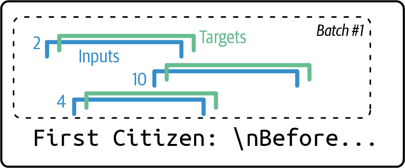
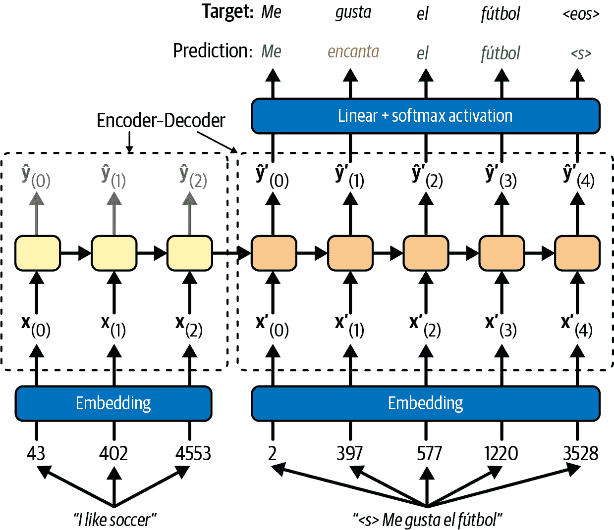
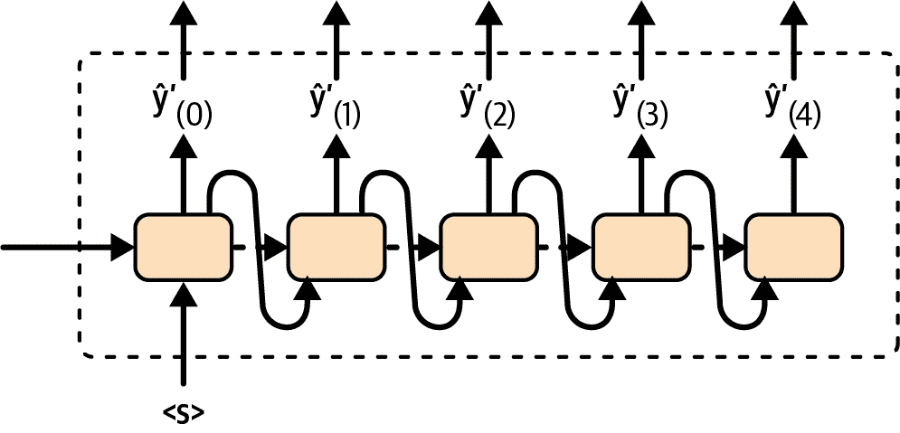
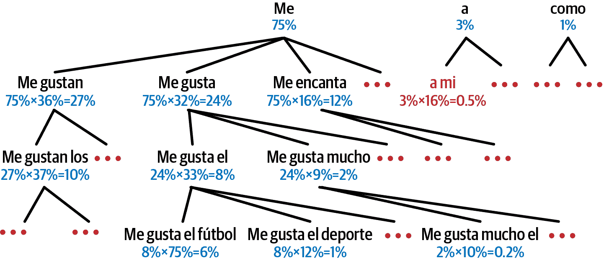

# 第十四章：自然语言处理与 RNN 和注意力

当艾伦·图灵在 1950 年想象他著名的[Turing 测试](https://homl.info/turingtest)⁠^(1)时，他提出了一种评估机器匹配人类智能能力的方法。他本可以测试许多事情，比如识别图片中的猫、下棋、作曲或逃离迷宫的能力，但有趣的是，他选择了一个语言任务。更具体地说，他设计了一个能够欺骗其对话者认为它是人类的*聊天机器人*。⁠^(2) 这个测试确实有其弱点：一组硬编码的规则可以欺骗没有防备或天真的人类（例如，机器可以对某些关键词给出模糊的预定义答案，它可以假装在开玩笑或喝醉来通过其最奇怪的答案，或者它可以用自己的问题来逃避困难的问题），并且忽略了人类智能的许多方面（例如，解释非言语交流的能力，如面部表情，或者学习手动任务的能力）。但这个测试确实突出了掌握语言可能是*智人*最大的认知能力。

直到最近，最先进的自然语言处理（NLP）模型基本上都是基于循环神经网络（在第十三章中介绍），即 RNN。然而，近年来，RNN 已被 transformers 所取代，我们将在第十五章中探讨这一点。尽管如此，了解 RNN 如何用于 NLP 任务仍然很重要，这不仅因为这样有助于更好地理解 transformers。此外，本章中我们将讨论的大部分技术也适用于 Transformer 架构（例如，分词、束搜索、注意力机制等）。此外，RNN 最近以状态空间模型（SSMs）的形式意外回归（参见“状态空间模型（SSMs）”[*https://homl.info*](https://homl.info)）。

本章分为三个部分。在第一部分，我们将从构建一个*字符 RNN*，或*char-RNN*开始，该 RNN 被训练来预测句子中的下一个字符。在这个过程中，我们将了解可训练嵌入。我们的 char-RNN 将成为我们的第一个微型的*语言模型*，能够生成原始文本。

在第二部分，我们将转向文本分类，更具体地说，是情感分析，其目的是预测某些文本是积极还是消极。我们的模型将阅读电影评论并估计评论者对电影的感受。这次，我们不会将文本拆分为单个字符，而是将其拆分为*tokens*：一个 token 是从固定大小的词汇中提取的小块文本，例如英语中最常见的 10,000 个单词，或者最常见的子词（例如，“smartest” = “smart” + “est”），甚至单个字符或字节。为了将文本拆分为 tokens，我们将使用*tokensizer*。本节还将介绍流行的 Hugging Face 库：*Datasets*库用于下载数据集，*Tokenizers*库用于 tokenizers，以及*Transformers*库用于流行的模型，这些模型将自动从*Hugging Face Hub*下载。Hugging Face 是一家极具影响力的公司，也是开源社区，它在开源 AI 领域，尤其是在 NLP 领域扮演着核心角色。

本章的最终目标将是神经机器翻译（NMT），这是第三部分和最后一部分的主题：我们将构建一个能够将英语翻译成西班牙语的编码器-解码器模型。这将引导我们到*注意力机制*，我们将将其应用于编码器-解码器模型，以提高其处理长输入文本的能力。正如其名所示，注意力机制是神经网络组件，它们学会在每个时间步选择模型应该关注的输入部分。它们直接导致了下一章中我们将看到的 transformers 革命。

让我们从一个非常简单且有趣的 char-RNN 模型开始，它可以模仿莎士比亚的风格写作（或者说类似）。

# 使用字符 RNN 生成莎士比亚风格的文本

在一篇著名的[2015 博客文章](https://homl.info/charrnn)《循环神经网络的不合理有效性》中，安德烈·卡帕西展示了如何训练一个 RNN 来预测句子中的下一个字符。这个*char-RNN*可以用来逐个字符生成新的文本。以下是 char-RNN 模型在训练了莎士比亚的所有作品后生成的一段文本的样本：

> 潘达罗斯：
> 
> 唉，我想他将被接近，那一天
> 
> 当微小的努力得以实现却从未得到滋养，
> 
> 谁又能逃脱死亡的锁链，
> 
> 我不应该睡觉。

这并不是一部杰作，但令人印象深刻的是，模型仅通过学习预测句子中的下一个字符就能学会单词、语法、正确的标点符号等等。这是我们第一个*语言模型*的例子。在本节的剩余部分，我们将逐步构建 char-RNN，从创建数据集开始。

## 创建训练数据集

首先，让我们下载莎士比亚作品的子集（大约 25%）。数据是从安德烈·卡帕西的[char-rnn 项目](https://github.com/karpathy/char-rnn)加载的：

```py
from pathlib import Path
import urllib.request

def download_shakespeare_text():
    path = Path("datasets/shakespeare/shakespeare.txt")
    if not path.is_file():
        path.parent.mkdir(parents=True, exist_ok=True)
        url = "https://homl.info/shakespeare"
        urllib.request.urlretrieve(url, path)
    return path.read_text()

shakespeare_text = download_shakespeare_text()
```

让我们打印出前几行：

```py
>>> print(shakespeare_text[:80])
First Citizen:
Before we proceed any further, hear me speak.

All:
Speak, speak.
```

看起来像是莎士比亚的作品，没错！

神经网络处理的是数字而不是文本，因此我们需要一种方法将文本编码成数字。通常，这是通过将文本分割成*标记*，如单词或字符，并为每个可能的标记分配一个整数 ID 来完成的。例如，让我们将我们的文本分割成字符，并为每个可能的字符分配一个 ID。我们首先需要找到文本中使用的字符列表。这将构成我们的标记*词汇表*：

```py
>>> vocab = sorted(set(shakespeare_text.lower()))
>>> "".join(vocab)
"\n !$&',-.3:;?abcdefghijklmnopqrstuvwxyz"
```

注意，我们调用`lower()`来忽略大小写，从而减少词汇表的大小。我们必须现在为每个字符分配一个标记 ID。为此，我们可以简单地使用它在词汇表中的索引。为了解码我们模型的输出，我们还需要一种方法从标记 ID 到字符的转换：

```py
>>> char_to_id = {char: index for index, char in enumerate(vocab)}
>>> id_to_char = {index: char for index, char in enumerate(vocab)}
>>> char_to_id["a"]
13
>>> id_to_char[13]
'a'
```

接下来，让我们创建两个辅助函数，一个用于将文本编码为标记 ID 的张量，另一个用于将它们解码回文本：

```py
import torch

def encode_text(text):
    return torch.tensor([char_to_id[char] for char in text.lower()])

def decode_text(char_ids):
    return "".join([id_to_char[char_id.item()] for char_id in char_ids])
```

让我们试一试：

```py
>>> encoded = encode_text("Hello, world!")
>>> encoded
tensor([20, 17, 24, 24, 27,  6,  1, 35, 27, 30, 24, 16,  2])
>>> decode_text(encoded)
'hello, world!'
```

接下来，让我们准备数据集。目前，我们有一个包含莎士比亚作品的极长字符序列。就像我们在第十三章中做的那样 Chapter 13，我们可以将这个长序列转换成一系列窗口，然后我们可以使用这些窗口来训练一个序列到序列的 RNN。目标将与输入相似，但会向前移动一个时间步。例如，数据集中一个样本可能是一个字符 ID 序列，代表文本“to be or not to b”（没有最后的“e”），相应的目标是一个字符 ID 序列，代表文本“o be or not to be”（带有最后的“e”，但没有开头的“t”）。让我们创建我们的数据集类：

```py
from torch.utils.data import Dataset, DataLoader

class CharDataset(Dataset):
    def __init__(self, text, window_length):
        self.encoded_text = encode_text(text)
        self.window_length = window_length

    def __len__(self):
        return len(self.encoded_text) - self.window_length

    def __getitem__(self, idx):
        if idx >= len(self):
            raise IndexError("dataset index out of range")
        end = idx + self.window_length
        window = self.encoded_text[idx : end]
        target = self.encoded_text[idx + 1 : end + 1]
        return window, target
```

现在让我们像往常一样创建数据加载器。由于文本相当大，我们可以使用大约 90%用于训练（即一百万个字符），5%用于验证，5%用于测试（每个 60,000 个字符）：

```py
window_length = 50
batch_size = 512  # reduce if your GPU cannot handle such a large batch size
train_set = CharDataset(shakespeare_text[:1_000_000], window_length)
valid_set = CharDataset(shakespeare_text[1_000_000:1_060_000], window_length)
test_set = CharDataset(shakespeare_text[1_060_000:], window_length)
train_loader = DataLoader(train_set, batch_size=batch_size, shuffle=True)
valid_loader = DataLoader(valid_set, batch_size=batch_size)
test_loader = DataLoader(test_set, batch_size=batch_size)
```

每个批次将由 512 个 50 个字符的窗口组成，其中每个字符由其标记 ID 表示，每个窗口都附带一个 50 个字符的目标窗口（偏移一个字符）。请注意，在每个 epoch 时，训练批次都会被随机打乱（见图 14-1）。



###### 图 14-1。每个训练批次由随机打乱的窗口及其偏移的目标组成。在这个图中，窗口长度是 10 而不是 50。

###### 小贴士

我们将窗口长度设置为 50，但你可以尝试调整它。在较短的输入序列上训练 RNN 更容易更快，但 RNN 将无法学习比窗口长度更长的任何模式，所以不要让它太小。

虽然技术上我们可以直接将标记 ID 输入到神经网络中而不进行任何进一步的前处理，但这不会很好用。确实，正如我们在第二章中看到的，大多数机器学习模型——包括神经网络——都假设相似的输入代表相似的事物；不幸的是，相似的 ID 可能代表完全无关的标记，反之亦然，遥远的 ID 可能代表相似的标记。神经网络会以一种奇怪的方式产生偏差，并且在训练中很难克服这种偏差。

一种解决方案是使用独热编码，因为所有独热向量彼此之间距离相等。然而，当词汇量很大时，独热向量也很大。在我们的例子中，词汇量只包含 39 个字符，所以每个字符都由一个 39 维的独热向量表示。这仍然是可以管理的，但如果我们处理的是单词而不是字符，词汇量可能达到数千，那么独热编码就不可行了。幸运的是，由于我们处理的是神经网络，我们有一个更好的选择：嵌入。

## 嵌入

嵌入是一种对某些高维数据的密集表示，通常是一个分类特征。如果有 50,000 个可能的类别，那么独热编码会产生一个 50,000 维的稀疏向量（即大部分是零）。相比之下，嵌入是一个相对较小的密集向量；例如，只有 300 个维度。

###### 小贴士

嵌入大小是一个你可以调整的超参数。作为一个经验法则，一个好的嵌入大小通常接近类别数量的平方根。

在深度学习中，嵌入通常随机初始化，然后与模型的其他参数一起通过梯度下降进行训练。例如，如果我们想在加利福尼亚住房数据集上训练一个神经网络（见第二章），我们可以使用嵌入来表示`ocean_proximity`分类特征。`"NEAR BAY"`类别最初可能由一个随机向量，如`[0.831, 0.696]`表示，而`"NEAR OCEAN"`类别可能由另一个随机向量，如`[0.127, 0.868]`表示（在这个例子中我们使用 2D 嵌入）。

由于这些嵌入是可训练的，它们在训练过程中会逐渐改进；并且在这个例子中，它们代表相当相似的分类，因此梯度下降肯定会将它们推向彼此更近的位置，同时它倾向于将它们从“内陆”类别的嵌入（见图 14-2）移开。确实，表示越好，神经网络做出准确预测就越容易，因此训练往往使嵌入成为类别有用的表示。这被称为*表示学习*（你将在第十八章中看到其他类型的表示学习）。


###### 图 14-2\. 嵌入将在训练过程中逐渐改进

不仅嵌入通常是对手头任务的有用表示，而且这些相同的嵌入经常可以成功地用于其他任务。最常见的例子是*词嵌入*（即单个单词的嵌入）：当你从事自然语言处理任务时，你通常最好重用预训练的词嵌入，而不是自己训练，正如我们将在本章后面看到的那样。

使用向量来表示单词的想法可以追溯到 20 世纪 60 年代，许多复杂的技巧已经被用来生成有用的向量，包括使用神经网络。但真正的发展是在 2013 年，当时 Tomáš Mikolov 和其他谷歌研究人员发表了一篇[论文](https://homl.info/word2vec)⁠^(3)，描述了一种使用神经网络高效学习词嵌入的有效技术，显著优于之前的尝试。这使得他们能够在非常大的文本语料库上学习嵌入：他们训练了一个神经网络来预测任何给定单词附近的单词，并获得了惊人的词嵌入。例如，同义词有非常接近的嵌入，而像*法国*、*西班牙*和*意大利*这样的语义相关单词则聚集在一起。

虽然不仅仅是关于邻近性：词嵌入在嵌入空间中也是沿着有意义的轴组织起来的。这里有一个著名的例子：如果你计算*国王 – 男人 + 女人*（添加和减去这些单词的嵌入向量），那么结果将非常接近单词*王后*的嵌入（参见图 14-3）。换句话说，词嵌入编码了性别概念！同样，你可以计算*马德里 – 西班牙 + 法国*，结果接近*巴黎*，这似乎表明首都的概念也被编码在嵌入中。


###### 图 14-3\. 相似单词的词嵌入往往很接近，某些轴似乎编码了有意义的概念

###### 警告

词嵌入可以有一些有意义的结构，正如“国王 – 男人 + 女人”所示。然而，它们也是嘈杂的，通常很难解释。我在笔记本的末尾添加了一些代码，以便您可以自己判断。

不幸的是，词嵌入有时会捕捉到我们最糟糕的偏见。例如，尽管它们正确地学习到*男人是国王，女人是王后*，但它们似乎也学习到*男人是医生，女人是护士*：这是一种相当严重的性别偏见！为了公平起见，这个特定的例子可能被夸大了，正如 Malvina Nissim 等人在 2019 年的一篇论文[2019 paper](https://homl.info/fairembeds)⁠^(4)中指出的。尽管如此，确保深度学习算法的公平性是一个重要且活跃的研究课题。

PyTorch 提供了一个`nn.Embedding`模块，它封装了一个*嵌入矩阵*：这个矩阵有每一可能的类别（例如，词汇表中的每个标记一行）和每个嵌入维度一列。嵌入维度性是一个你可以调整的超参数。默认情况下，嵌入矩阵是随机初始化的。

要将类别 ID 转换为嵌入，`nn.Embedding`层只需查找并返回相应的行。就是这样！例如，让我们初始化一个具有五个类别和 3D 嵌入的`nn.Embedding`层，并使用它来编码一些类别：

```py
>>> import torch.nn as nn
>>> torch.manual_seed(42)
>>> embed = nn.Embedding(5, 3)  # 5 categories × 3D embeddings
>>> embed(torch.tensor([[3, 2], [0, 2]]))
tensor([[[ 0.2674,  0.5349,  0.8094],
 [ 2.2082, -0.6380,  0.4617]],

 [[ 0.3367,  0.1288,  0.2345],
 [ 2.2082, -0.6380,  0.4617]]], grad_fn=<EmbeddingBackward0>)
```

如您所见，类别 3 被编码为 3D 向量`[0.2674, 0.5349, 0.8094]`，类别 2 被编码（两次）为 3D 向量`[2.2082, -0.6380, 0.4617]`，而类别 0 被编码为 3D 向量`[0.3367, 0.1288, 0.2345]`（在这个例子中没有使用类别 1 和 4）。由于该层尚未经过训练，这些编码只是随机的。

注意，嵌入层在数学上等同于 one-hot 编码后跟一个线性层（没有偏置参数）。例如，如果你创建一个带有`nn.Linear(5, 3, bias=False)`的线性层，并传递 one-hot 向量`torch.tensor([[0., 0., 0., 1., 0.]])`，你得到一个等于线性层转置权重矩阵的第 3 行的向量（该矩阵充当嵌入矩阵）。这是因为转置权重矩阵的所有行都乘以零，除了第 3 行乘以 1，所以结果是第 3 行。然而，使用`nn.Embedding(5, 3)`并传递`torch.tensor([3])`会更高效：这不需要 one-hot 编码，也不需要所有无意义的零乘法。

好的，现在你已经了解了嵌入，你就可以开始构建莎士比亚模型了。

## 构建和训练 Char-RNN 模型

由于我们的数据集相当大，并且建模语言是一项相当困难的任务，我们需要比简单的具有几个循环神经元的 RNN 更复杂的模型。让我们构建并训练一个具有两层`nn.GRU`模块（在第十三章 Chapter 13 中介绍）的模型，每层有 128 个单元，并加入一些 dropout。如果需要，你可以稍后尝试调整层数和单元数：

```py
class ShakespeareModel(nn.Module):
    def __init__(self, vocab_size, n_layers=2, embed_dim=10, hidden_dim=128,
                 dropout=0.1):
        super().__init__()
        self.embed = nn.Embedding(vocab_size, embed_dim)
        self.gru = nn.GRU(embed_dim, hidden_dim, num_layers=n_layers,
                          batch_first=True, dropout=dropout)
        self.output = nn.Linear(hidden_dim, vocab_size)

    def forward(self, X):
        embeddings = self.embed(X)
        outputs, _states = self.gru(embeddings)
        return self.output(outputs).permute(0, 2, 1)

torch.manual_seed(42)
model = ShakespeareModel(len(vocab)).to(device)
```

让我们来看看这段代码：

+   我们使用一个`nn.Embedding`层作为第一层，来编码字符 ID。正如我们刚才看到的，`nn.Embedding`层的输入维度数是类别数，所以在我们这个例子中是不同字符 ID 的数量。嵌入大小是一个可以调整的超参数，我们暂时将其设置为 10。而`nn.Embedding`层的输入将是形状为[*批次大小*，*窗口长度*]的整数张量，而`nn.Embedding`层的输出将是形状为[*批次大小*，*窗口长度*，*嵌入大小*]的浮点张量。

+   `nn.GRU`层有 10 个输入（即嵌入大小），128 个输出（即隐藏大小），两层，并且通常我们必须指定`batch_first=True`，因为否则该层假设批次维度在时间维度之后。

+   我们使用`nn.Linear`层作为输出层：它必须有 39 个单元，因为文本中有 39 个不同的字符，我们希望为每个可能的字符（在每个时间步）输出一个 logit。

+   在`forward()`方法中，我们只是依次调用这些层。请注意，`nn.GRU`层的输出形状是[*批次大小*，*窗口长度*，*隐藏大小*]，而`nn.Linear`层的输出形状是[*批次大小*，*窗口长度*，*词汇表大小*]，但正如我们在第十三章中看到的，我们将用于训练的`nn.CrossEntropyLoss`和`Accuracy`模块都期望类维度（即`vocab_size`）是第二个维度，而不是最后一个维度。这就是为什么我们必须对`nn.Linear`层的输出最后两个维度进行置换。请注意，`nn.GRU`层还返回最终的隐藏状态，但我们忽略了它们。⁠^(5)

现在，你可以像往常一样训练和评估模型，使用`nn.CrossEntropyLoss`和`Accuracy`指标。

现在让我们使用我们的模型来预测句子中的下一个字符：

```py
model.eval()  # don't forget to switch the model to evaluation mode!
text = "To be or not to b"
encoded_text = encode_text(text).unsqueeze(dim=0).to(device)
with torch.no_grad():
    Y_logits = model(encoded_text)
    predicted_char_id = Y_logits[0, :, -1].argmax().item()
    predicted_char = id_to_char[predicted_char_id]  # correctly predicts "e"
```

我们首先对文本进行编码，添加一个大小为 1 的批次维度，并将张量移动到 GPU 上。然后我们调用我们的模型，并为每个时间步获取 logits。我们只对最后一个时间步的 logits 感兴趣（因此是-1），我们想知道哪个 token ID 的 logit 最高，所以我们使用`argmax()`。然后我们使用`item()`从张量中提取 token ID。最后，我们将 token ID 转换为字符，这就是我们的预测。

模型正确预测了“e”，太好了！现在让我们用这个模型假装我们是莎士比亚！

###### 警告

如果你在这个激活了 GPU 的 Colab 上运行此代码，那么训练可能需要几个小时。如果你不想等那么久，你可以减少 epoch 的数量，但当然，模型的准确率可能会更低。如果 Colab 会话超时，请确保快速重新连接，否则 Colab 运行时将被销毁。

## 生成假莎士比亚文本

要使用 char-RNN 模型生成新的文本，我们可以给它一些文本，让模型预测最可能的下一个字母，将其添加到文本的末尾，然后将扩展后的文本给模型以猜测下一个字母，依此类推。这被称为 *贪婪解码*。但在实践中，这通常会导致相同的单词反复出现。相反，我们可以随机采样下一个字符，使用模型估计的概率分布：如果模型估计一个给定标记的概率为 *p*，那么这个标记将以概率 *p* 被采样。这个过程将生成更多样化和有趣的文本，因为最可能的标记不总是会采样。为了采样下一个标记，我们可以使用 `torch.multinomial()` 函数，该函数根据给定的类概率列表采样随机类索引。例如：

```py
>>> torch.manual_seed(42)
>>> probs = torch.tensor([[0.5, 0.4, 0.1]])  # probas = 50%, 40%, and 10%
>>> samples = torch.multinomial(probs, replacement=True, num_samples=8)
>>> samples
tensor([[0, 0, 0, 0, 1, 0, 2, 2]])
```

为了更好地控制生成文本的多样性，我们可以将 logits 除以一个称为 *温度* 的数字，我们可以随意调整它。接近零的温度有利于高概率字符，而高温度则使所有字符具有相等的概率。在生成较为严格和精确的文本时，如数学方程式，通常更喜欢较低的温度，而在生成更多样化和富有创意的文本时，则更喜欢较高的温度。让我们编写一个 `next_char()` 辅助函数，该函数将使用这种方法来选择要添加到输入文本中的下一个字符：

```py
import torch.nn.functional as F

def next_char(model, text, temperature=1):
    encoded_text = encode_text(text).unsqueeze(dim=0).to(device)
    with torch.no_grad():
        Y_logits = model(encoded_text)
        Y_probas = F.softmax(Y_logits[0, :, -1] / temperature, dim=-1)
        predicted_char_id = torch.multinomial(Y_probas, num_samples=1).item()
    return id_to_char[predicted_char_id]
```

接下来，我们可以编写另一个小的辅助函数，该函数将反复调用 `next_​char()` 来获取下一个字符并将其附加到给定的文本中：

```py
def extend_text(model, text, n_chars=80, temperature=1):
    for _ in range(n_chars):
        text += next_char(model, text, temperature)
    return text
```

我们现在可以生成一些文本了！让我们尝试低、中、高温度：

```py
>>> print(extend_text(model, "To be or not to b", temperature=0.01))
To be or not to be the state
and the contrary of the state and the sea,
the common people of the
>>> print(extend_text(model, "To be or not to b", temperature=0.4))
To be or not to be the better from the cause
that thou think you may be so be gone.

romeo:
that
>>> print(extend_text(model, "To be or not to b", temperature=100))
To be or not to b-c3;m-rkn&:x:uyve:b&hi n;n-h;wt3k
&cixxh:a!kq$c$ 3 ncq$ ;;wq cp:!xq;yh
!3
d!nhi.
```

当温度较低时，请注意重复： “the state and the” 出现了两次。中等温度导致了更令人信服的结果，尽管罗密欧今天并不太健谈。但在最后一个例子中，温度过高——我们烧毁了莎士比亚。为了生成更令人信服的文本，一种常见的技术是只从前 *k* 个字符中采样，或者只从总概率超过某个阈值的最小的一组前 *k* 个字符中采样：这被称为 *top-p 采样* 或 *核采样*。或者，你也可以尝试使用 *beam search*，我们将在本章后面讨论，或者使用更多的 `nn.GRU` 层和每层的更多神经元，如果需要的话，进行更长时间的训练，并添加更多的正则化。

###### 注意

当前模型无法学习超过 `window_length` 的模式，而 `window_length` 只有 50 个字符。你可以尝试将这个窗口做得更大，但这也会使训练更加困难，甚至 LSTM 和 GRU 单元也无法处理非常长的序列。⁠^(6)

有趣的是，尽管 char-RNN 模型只是训练来预测下一个字符，但这个看似简单的任务实际上还需要它学习一些更高级的任务。例如，为了找到“Great movie, I really ”之后的下一个字符，了解这个句子是积极的很有帮助，因此跟随的更有可能是字母“l”（代表“loved”），而不是“h”（代表“hated”）。实际上，Alec Radford 和其他 OpenAI 研究人员在 2017 年发表的一篇[论文](https://homl.info/sentimentneuron)⁠^(7)中描述了作者如何在大型数据集上训练了一个类似 char-RNN 的大模型，并发现其中一个神经元充当了一个出色的情感分析分类器。尽管模型是在没有任何标签的情况下训练的，但被称为“sentiment neuron”——正如他们所称呼的——在情感分析基准测试中达到了最先进的性能（这预示并激励了 NLP 中的无监督预训练）。

说到这里，让我们告别莎士比亚，转向本章的第二部分：情感分析。

# 使用 Hugging Face 库进行情感分析

自然语言处理中最常见的应用之一是文本分类——特别是情感分析。如果 MNIST 数据集上的图像分类是计算机视觉中的“Hello, world!”，那么 IMDb 评论数据集上的情感分析就是自然语言处理中的“Hello, world!”。IMDb 数据集包含 50,000 篇英文电影评论（25,000 用于训练，25,000 用于测试），这些评论是从著名的[互联网电影数据库](https://imdb.com)提取的，每个评论都有一个简单的二元目标，表示它是负面（0）还是正面（1）。就像 MNIST 一样，IMDb 评论数据集因其简单性而广受欢迎：它足够简单，可以在合理的时间内用笔记本电脑处理，但挑战性足够，既有趣又有成就感。

要下载 IMDb 数据集，我们将使用 Hugging Face *Datasets* 库，它提供了对托管在 Hugging Face Hub 上的数十万个数据集的便捷访问。它在 Colab 上预先安装；否则可以使用`pip install datasets`进行安装。我们将使用原始训练集的 80%进行训练，剩余的 20%用于验证，使用`train_test_split()`方法来分割数据集：

```py
from datasets import load_dataset

imdb_dataset = load_dataset("imdb")
split = imdb_dataset["train"].train_test_split(train_size=0.8, seed=42)
imdb_train_set, imdb_valid_set = split["train"], split["test"]
imdb_test_set = imdb_dataset["test"]
```

让我们检查几篇评论：

```py
>>> imdb_train_set[1]["text"]
"'The Rookie' was a wonderful movie about the second chances life holds [...]"
>>> imdb_train_set[1]["label"]
1
>>> imdb_train_set[16]["text"]
"Lillian Hellman's play, adapted by Dashiell Hammett with help from Hellman,
becomes a curious project to come out of gritty Warner Bros. [...] It seems to
take forever for this drama to find its focus, [...], it seems a little
patronizing [...] Lukas has several speeches in the third-act which undoubtedly
won him the Academy Award [...] this tasteful, tactful movie [...] It should be
a heady mix, but instead it's rather dry-eyed and inert. ** from ****"
>>> imdb_train_set[16]["label"]
0
```

第一篇评论立即表明这是一部精彩的电影；没有必要再读下去了：它显然是正面的（标签 = 1）。第二篇评论的分类要困难得多：它包含了对电影的详细描述，其中穿插着正面和负面的评论。幸运的是，结论非常明显是负面的，这使得任务变得容易得多（标签 = 0）。尽管如此，这并不是一个简单任务。

一个简单的 char-RNN 模型会感到吃力；我们需要一个更强大的分词技术。因此，在我们回到情感分析之前，让我们先关注分词。

## 使用 Hugging Face Tokenizers 库进行分词

在一篇 [2016 年的论文](https://homl.info/rarewords)，⁠^(8) 中，爱丁堡大学的 Rico Sennrich 等人探索了几种在子词级别分词和去分词文本的方法。这样，即使你的模型遇到了它以前从未见过的罕见词，它仍然可以合理地猜测它的含义。例如，即使模型在训练期间从未见过单词“smartest”，如果它学会了单词“smart”，并且它还学会了后缀“est”意味着“the most”，它就可以推断出“smartest”的含义。作者评估的技术之一是 *字节对编码*（BPE），由 Philip Gage 在 1994 年引入（最初用于数据压缩）。BPE 通过将整个训练集拆分为单个字符，然后在每次迭代中找到最频繁的相邻标记对并将其添加到词汇表中工作。它重复这个过程，直到词汇表达到所需的大小。

[Hugging Face Tokenizers 库](https://homl.info/tokenizers)包含了几个流行的分词算法的高效实现，包括 BPE。它在 Colab 上预先安装（或者你也可以使用 `pip install tokenizers` 来安装）。以下是使用 IMDb 数据集训练 BPE 模型的步骤：

```py
import tokenizers

bpe_model = tokenizers.models.BPE(unk_token="<unk>")
bpe_tokenizer = tokenizers.Tokenizer(bpe_model)
bpe_tokenizer.pre_tokenizer = tokenizers.pre_tokenizers.Whitespace()
special_tokens = ["<pad>", "<unk>"]
bpe_trainer = tokenizers.trainers.BpeTrainer(vocab_size=1000,
                                             special_tokens=special_tokens)
train_reviews = [review["text"].lower() for review in imdb_train_set]
bpe_tokenizer.train_from_iterator(train_reviews, bpe_trainer)
```

让我们一步步来看这段代码：

+   我们导入 Tokenizers 库，并创建一个 BPE 模型，指定一个未知标记 `"<unk>"`，如果我们在尝试分词包含模型在训练期间从未见过的标记的文本时使用它：未知标记将被替换为 `"<unk>"` 标记。

+   然后，我们基于 BPE 模型创建一个 `Tokenizer`。

+   Tokenizers 库允许你指定可选的预处理和后处理步骤，并且它还提供了常见的预处理器和后处理程序。在这个例子中，我们使用 `Whitespace` 预处理程序，它在空格处分割文本（并丢弃空格），并且还分离字母组和非字母组。例如，“Hello, world!!!”将被分割成 ["Hello”, “,”, “world”, “!!!"]。然后 BPE 算法将运行在这些单独的块上，这极大地加快了训练速度并提高了分词质量（至少当文本是英文时）通过提供合理的单词边界。

+   然后，我们定义一个特殊标记列表：一个填充标记 `"<pad>"`，当我们在不同长度的文本创建批次时将很有用，以及我们之前讨论过的未知标记。

+   我们创建一个 `BpeTrainer`，指定最大词汇表大小和特殊标记列表。训练器将在词汇表的开头添加特殊标记，所以 `"<pad>"` 将是标记 0，而 `"<unk>"` 将是标记 1。

+   接下来，我们创建一个包含 IMDb 训练集中所有文本的列表。

+   最后，我们使用 `BpeTrainer` 在这个列表上训练分词器。几秒钟后，BPE 分词器就准备好使用了！

现在，让我们使用我们的 BPE 分词器来分词一些文本：

```py
>>> some_review = "what an awesome movie! 

>>> bpe_encoding = bpe_tokenizer.encode(some_review)
>>> bpe_encoding
Encoding(num_tokens=8, attributes=[ids, type_ids, tokens, offsets,
         attention_mask, special_tokens_mask, overflowing])

```

`encode()` 方法返回一个包含八个标记的 `Encoding` 对象。让我们来看看这些标记及其 ID：

```py
>>> bpe_encoding.tokens
['what', 'an', 'aw', 'es', 'ome', 'movie', '!', '<unk>']
>>> bpe_token_ids = bpe_encoding.ids
>>> bpe_token_ids
[303, 139, 373, 149, 240, 211, 4, 1]
```

注意，像“what”和“movie”这样的常用词已被 BPE 模型识别，并由单个标记表示，而像“awesome”这样的不常用词则被拆分为多个标记。此外，需要注意的是，笑脸不是训练数据的一部分，因此它被替换为未知标记 `"<unk>"`。

分词器提供了一个 `get_vocab()` 方法，它返回一个将每个标记映射到其 ID 的字典。您还可以使用 `token_to_id()` 方法将单个标记映射，或者相反使用 `id_to_token()` 方法从 ID 到标记。然而，您更经常使用 `decode()` 方法将标记 ID 列表转换为字符串：

```py
>>> bpe_tokenizer.decode(bpe_token_ids)
'what an aw es ome movie !'
```

分词器会跟踪每个标记在原始字符串中的起始和结束偏移量，这在调试时非常有用：

```py
>>> bpe_encoding.offsets
[(0, 4), (5, 7), (8, 10), (10, 12), (12, 15), (16, 21), (21, 22), (23, 24)]
```

也可以一次编码整个字符串批次。例如，让我们编码训练集的前三个评论：

```py
>>> bpe_tokenizer.encode_batch(train_reviews[:3])
[Encoding(num_tokens=281, attributes=[ids, type_ids, tokens, [...]]),
 Encoding(num_tokens=114, attributes=[ids, type_ids, tokens, [...]]),
 Encoding(num_tokens=285, attributes=[ids, type_ids, tokens, [...]]),
```

如果我们想创建一个包含所有三个评论标记 ID 的单个整数张量，我们必须首先确保它们都具有相同数量的标记，但目前并非如此。为此，我们可以要求分词器用填充标记 ID 填充较短的评论，直到它们的长度与批次中最长的评论一样长。我们还可以要求分词器截断任何超过某些最大长度的序列，因为 RNN 本身就不擅长处理非常长的序列：

```py
bpe_tokenizer.enable_padding(pad_id=0, pad_token="<pad>")
bpe_tokenizer.enable_truncation(max_length=500)
```

现在让我们再次编码批次。这次所有序列都将具有相同数量的标记，因此我们可以创建一个包含所有标记 ID 的张量：

```py
>>> bpe_encodings = bpe_tokenizer.encode_batch(train_reviews[:3])
>>> bpe_batch_ids = torch.tensor([encoding.ids for encoding in bpe_encodings])
>>> bpe_batch_ids
tensor([[159, 402, 176, 246,  61, [...], 215, 156, 586,   0,   0,   0,   0],
 [ 10, 138, 198, 289, 175, [...],   0,   0,   0,   0,   0,   0,   0],
 [289,  15, 209, 398, 177, [...],  50,  29,  22,  17,  24,  18,  24]])
```

注意，第一和第二个评论是用 0 填充的，这是我们的填充标记 ID。每个 `Encoding` 对象还包括一个 `attention_mask` 属性，其中包含每个非填充标记的 1，以及每个填充标记的 0。这可以在您的模型中用来轻松忽略填充的时间步：只需将张量与注意力掩码相乘。在某些情况下，您可能更喜欢有序列长度列表（忽略填充）。以下是获取注意力掩码张量和序列长度的方法：

```py
>>> attention_mask = torch.tensor([encoding.attention_mask
...                                for encoding in bpe_encodings])
...
>>> attention_mask
tensor([[1, 1, 1, 1, 1, 1, 1, 1, 1, 1, 1, 1, 1, 1, [...], 1, 1, 1, 0, 0, 0, 0],
 [1, 1, 1, 1, 1, 1, 1, 1, 1, 1, 1, 1, 1, 1, [...], 0, 0, 0, 0, 0, 0, 0],
 [1, 1, 1, 1, 1, 1, 1, 1, 1, 1, 1, 1, 1, 1, [...], 1, 1, 1, 1, 1, 1, 1]])
>>> lengths = attention_mask.sum(dim=-1)
>>> lengths
tensor([281, 114, 285])
```

你可能已经注意到我们的分词器处理空格并不很好。特别是，单词“awesome”返回为“aw es ome”，而“movie!”返回为“movie !”。这是因为`Whitespace`预分词器丢弃了所有空格，因此 BPE 分词器不知道空格应该放在哪里，它只是在所有标记之间添加空格。为了解决这个问题，我们可以用`ByteLevel`预分词器替换`Whitespace`预分词器：它将所有空格替换为特殊字符 Ġ，这样 BPE 模型就不会丢失它们的跟踪。例如，如果你使用这个预分词器，并且对文本“what an awesome movie! .png)”进行编码和解码，你会得到：“Ġwhat Ġan Ġaw es ome Ġmovie !”。在移除空格后，然后将每个 Ġ 替换为空格，你得到 " what an awesome movie!"。这几乎是完美的，除了开头多余的空格——这很容易移除——以及丢失的 emoji，因为它不在词汇表中，被`decode()`方法丢弃。

正如其名所示，`ByteLevel`预分词器允许 BPE 模型在字节级别而不是字符级别工作：不出所料，这被称为字节级 BPE（BBPE）。例如，.png) emoji 将被转换为四个字节，使用 Unicode 的 UTF-8 编码。这意味着如果其词汇表包含所有 256 个可能的字节，BBPE 永远不会输出未知标记，因为任何文本都可以在其词汇表中找不到更长标记时分解为其单个字节。这使得 BBPE 非常适合包含诸如 emoji 之类的罕见字符的语料库。

BPE 的另一个重要变体是 Google 在 2016 年提出的[WordPiece](https://homl.info/wordpiece)，⁠^(9)。这个分词算法与 BPE 非常相似，但在每次迭代中，它不是将最频繁的相邻标记对添加到词汇表中，而是添加得分最高的标记对。这个得分是使用方程式 14-1 计算的：频率(AB)项与 BPE 中的类似——它提高了在语料库中频繁出现的标记对。然而，分母在单个标记本身频繁时降低了标记对的得分。这种归一化往往比 BPE 更有用和有意义，并且该算法通常产生的编码序列比 BPE 或 BBPE 更短。

##### 方程式 14-1。由标记 A 和 B 组成的 AB 对的 WordPiece 得分

$score left-parenthesis AB right-parenthesis equals StartFraction frequency left-parenthesis AB right-parenthesis Over freq left-parenthesis upper A right-parenthesis dot freq left-parenthesis upper B right-parenthesis EndFraction dot len left-parenthesis vocab right-parenthesis$

要使用 Tokenizers 库训练 WordPiece 标记器，你可以使用与 BPE 相同的代码，但将`BPE`模型替换为`WordPiece`，将`BpeTrainer`替换为`WordPieceTrainer`。如果你对之前相同的评论进行编码和解码，你会得到“what an aw esome movie !”。注意，WordPiece 会给单词内部的标记添加一个前缀，这使得重建原始字符串变得容易：只需移除" #“#（以及标点符号前的空格）。注意，笑脸表情符号再次消失了，因为它不在词汇表中。

我们将要讨论的最后一种流行的标记化算法是 Unigram LM（语言模型），它是由 Google 的 Taku Kudo 在 2018 年的一篇[论文](https://homl.info/subword)⁠^(10)中提出的。这种技术与之前的不同：它从一个包含训练语料库中每个频繁单词、子单词和字符的非常大的词汇表开始，然后逐渐移除最不有用的标记，直到达到所需的词汇表大小。为了确定一个标记的有用性，这种方法做出一个大的简化假设：它假设语料库是从词汇表中随机采样的，一次一个标记（因此得名 Unigram LM），并且每个标记都是独立于其他标记采样的。因此，这个标记器模型假设采样对 AB 的概率等于采样 A 的概率乘以采样 B 的概率。基于这个假设，它可以估计采样整个训练语料库的概率。在每次迭代中，训练算法尝试移除标记，同时尽量不减少这个整体概率。

例如，假设词汇表包含“them”、“the”和“m”这三个标记，分别具有 1%、5%和 2%的概率。这意味着单词“them”有 1%的概率被采样为单个标记“them”，或者有 5% × 2% = 0.1%的概率被采样为“the” + “m”这对。总的来说，单词“them”有 1% + 0.1% = 1.1%的概率被采样。如果我们从词汇表中移除标记“them”，那么采样单词“them”的概率将下降到 0.1%。如果我们移除“m”或“the”中的任何一个，那么概率只会下降到 1%，因为我们仍然可以采样单个标记“them”。所以如果训练语料库只包含单词“them”，那么算法会更倾向于删除“the”或“m”。当然，在现实中语料库包含许多其他包含这两个标记的单词，因此算法可能会找到其他不那么有用的标记来删除。

###### 小贴士

单词一元语言模型对于像英语这样的不使用空格分隔单词的语言来说非常好。例如，中文文本之间没有空格，越南语甚至在单词内部使用空格，而德语经常将多个单词连在一起，不使用空格。

同样，该论文还提出了一种新颖的正则化技术，称为 *子词正则化*，通过在训练 NLP 模型（而非分词器模型）时引入一些随机性来提高泛化能力和鲁棒性。例如，假设词汇表包含标记“them”、“the”和“m”，并且您选择使用子词正则化，那么单词“them”有时会被分词为“the” + “m”，有时作为“them”。这种技术在 *形态丰富的语言* 中效果最好，这意味着在这些语言中，单词通过词缀、屈折和内部修改（如阿拉伯语、芬兰语、德语、匈牙利语、波兰语或土耳其语）携带大量语法信息，而与那些依赖词序或额外辅助词（如英语、中文、泰语或越南语）的语言形成对比。

不幸的是，Tokenizers 库本身不支持子词正则化，因此您必须自己实现它，或者可以使用 Google 的 [*SentencePiece*](https://github.com/google/sentencepiece) 库 (`pip install sentencepiece`)，该库提供了一个开源实现。该项目在 Taku Kudo 和 John Richardson 的 2018 年论文 [2018 paper](https://homl.info/sentencepiece)⁠^(11) 中进行了描述。

表 14-1 总结了今天使用的三种主要分词器。

表 14-1\. 三种主要分词器的概述

| Feature | BBPE | WordPiece | Unigram LM |
| --- | --- | --- | --- |
| **How** | 合并最频繁的成对 | 合并最大化数据可能性的成对 | 移除最不可能的标记 |
| **Pros** | 快速、简单，非常适合多语言 | 效率和分词质量之间的良好平衡 | 最有意义的，最短的序列 |
| **Cons** | 可能产生尴尬的分割 | 对于多语言不如 BBPE 坚固 | 训练和分词速度较慢 |
| **Used By** | GPT, Llama, RoBERTa, BLOOM | BERT, DistilBERT, ELECTRA | T5, ALBERT, mBART |

在许多情况下，自己训练分词器是有用的；例如，如果您正在处理特定领域的文本，如医学、法律或工程文档，这些文档充满了术语，或者文本是用低资源语言或方言写的，或者它是用新编程语言编写的代码，等等。然而，在大多数情况下，您可能只想简单地重用预训练的分词器。

## 重用预训练分词器

要下载预训练的分词器，我们将使用 [Hugging Face *Transformers 库*](https://homl.info/transformerslib)。这个库提供了许多流行的模型，用于 NLP、计算机视觉、音频处理等。几乎所有这些模型都提供了预训练的权重，并且库可以自动从 Hugging Face Hub 下载它们。这些模型最初都是基于 *Transformer 架构*（我们将在第十五章第十五章中详细讨论），因此库的名称，但现在也有其他类型的模型可用，例如 CNN。最后，每个模型都附带所有需要的工具，包括 NLP 模型的分词器：在一行代码中，你可以拥有一个针对给定任务的完全功能、高性能模型，正如我们将在本章后面看到的那样。

目前，我们只需从某个 NLP 模型中获取预训练的分词器。例如，以下代码下载了 GPT-2 模型（一个文本生成模型）使用的预训练 BBPE 分词器，并使用这个分词器来编码前 3 个 IMDb 评论，如果编码的序列超过 500 个标记，则截断编码序列：

```py
import transformers

gpt2_tokenizer = transformers.AutoTokenizer.from_pretrained("gpt2")
gpt2_encoding = gpt2_tokenizer(train_reviews[:3], truncation=True,
                               max_length=500)
```

注意我们像使用函数一样使用分词器对象。结果是类型为 `BatchEncoding` 的类似字典的对象。你可以使用 `"input_ids"` 键来获取标记 ID。它返回一个标记 ID 的 Python 列表列表。例如，让我们看看第一个编码评论的前 10 个标记 ID，并使用分词器来解码它们，使用其 `decode()` 方法：

```py
>>> gpt2_token_ids = gpt2_encoding["input_ids"][0][:10]
>>> gpt2_token_ids
[14247, 35030, 1690, 423, 257, 1688, 8046, 13, 484, 1690]
>>> gpt2_tokenizer.decode(gpt2_token_ids)
'stage adaptations often have a major fault. they often'
```

如果你更愿意使用预训练的 WordPiece 分词器，你可以重用任何使用 WordPiece 预训练的 LLM 的分词器，例如 BERT（另一个流行的 NLP 模型，代表 Transformer 的双向编码表示）。这个分词器有一个填充标记（与之前的分词器不同，因为 GPT-2 不需要它），所以当编码一批评论时，我们可以指定 `padding=True`：像往常一样，最短的文本将使用填充标记填充到最长的文本长度。这允许我们还可以指定 `return_tensors="pt"` 来获取 PyTorch 张量而不是 Python 列表列表的标记 ID：非常方便！所以让我们编码前三个 IMDb 评论：

```py
bert_tokenizer = transformers.AutoTokenizer.from_pretrained("bert-base-uncased")
bert_encoding = bert_tokenizer(train_reviews[:3], padding=True,
                               truncation=True, max_length=500,
                               return_tensors="pt")
```

###### 小贴士

名称 `"bert-base-uncased"` 指的是一个 *模型检查点*：这个特定的检查点是大小写不敏感的 BERT 模型，在英语文本上预训练。其他检查点也可用，例如 `"bert-large-cased"`，如果你需要一个更大且大小写敏感的 BERT 模型，或者 `"bert-base-multilingual-uncased"`，如果你需要一个在超过 100 种语言上预训练的无大小写模型。目前我们只是使用模型的分词器。

结果的标记 ID 和注意力掩码是很好的填充张量：

```py
>>> bert_encoding["input_ids"]
tensor([[ 101, 2754,17241, 2411, 2031, [...],  102, 0, 0, 0, [...], 0, 0, 0],
 [ 101, 1005, 1996, 8305, 1005, [...],  102, 0, 0, 0, [...], 0, 0, 0],
 [ 101, 7929, 1010, 2021, 2515, [...], 1012,  1019,  1013,  1019,  102]])
>>> bert_encoding["attention_mask"]
tensor([[1, 1, 1, 1, 1, 1, 1, 1, 1, 1, 1, 1, [...], 0, 0, 0, 0, 0, 0, 0, 0, 0],
 [1, 1, 1, 1, 1, 1, 1, 1, 1, 1, 1, 1, [...], 0, 0, 0, 0, 0, 0, 0, 0, 0],
 [1, 1, 1, 1, 1, 1, 1, 1, 1, 1, 1, 1, [...], 1, 1, 1, 1, 1, 1, 1, 1, 1]])
```

注意，每个标记 ID 序列都以标记 101 ([CLS]) 开头，并以标记 102 ([SEP]) 结尾（忽略填充标记）。这些标记是 BERT 模型所需的（正如我们将在第十五章中看到的那样），但除非您的模型也需要它们，否则您可以通过在调用分词器时设置`add_special_tokens=False`来删除它们。

那么，预训练的单词 LM 分词器怎么样呢？嗯，许多模型都是使用 Unigram LM 训练的，例如 ALBERT、T5 或 XML-R 模型，仅举几个例子。例如：

```py
albert_tokenizer = transformers.AutoTokenizer.from_pretrained("albert-base-v2")
albert_encoding = albert_tokenizer(train_reviews[:3], padding=True, [...])
```

Transformers 库还提供了一个对象，可以将您的自己的分词器（来自 Tokenizers 库）包装起来，并给它与预训练的分词器（来自 Transformers 库）相同的 API。例如，让我们包装我们之前训练过的 BPE 分词器：

```py
hf_tokenizer = transformers.PreTrainedTokenizerFast(
    tokenizer_object=bpe_tokenizer)
hf_encodings = hf_tokenizer(train_reviews[:3], padding=True, [...])
```

这样，我们就拥有了所有需要的分词工具，所以让我们回到情感分析。

## 构建和训练情感分析模型

我们的 sentiment analysis 模型必须使用分词评论的批次进行训练。然而，我们创建的数据集并没有处理分词。一个选择是更新它们（例如，使用`map()`方法），但处理数据加载器中的分词同样简单。为此，我们可以通过`collate_fn`参数将一个函数传递给`DataLoader`构造函数：数据加载器将为每个批次调用此函数，传递一个数据集样本列表。我们的函数将接受这个批次，对评论进行分词，如果需要则截断和填充它们，并返回一个包含 PyTorch 张量（标记 ID 和注意力掩码）的`BatchEncoding`对象，以及另一个包含标签的张量。对于分词，我们将简单地使用我们刚刚加载的预训练 WordPiece 分词器：

```py
def collate_fn(batch, tokenizer=bert_tokenizer):
    reviews = [review["text"] for review in batch]
    labels = [[review["label"]] for review in batch]
    encodings = tokenizer(reviews, padding=True, truncation=True,
                          max_length=200, return_tensors="pt")
    labels = torch.tensor(labels, dtype=torch.float32)
    return encodings, labels

batch_size = 256
imdb_train_loader = DataLoader(imdb_train_set, batch_size=batch_size,
                               collate_fn=collate_fn, shuffle=True)
imdb_valid_loader = DataLoader(imdb_valid_set, batch_size=batch_size,
                               collate_fn=collate_fn)
imdb_test_loader = DataLoader(imdb_test_set, batch_size=batch_size,
                              collate_fn=collate_fn)
```

现在我们已经准备好创建我们的情感分析模型：

```py
class SentimentAnalysisModel(nn.Module):
    def __init__(self, vocab_size, n_layers=2, embed_dim=128, hidden_dim=64,
                 pad_id=0, dropout=0.2):
        super().__init__()
        self.embed = nn.Embedding(vocab_size, embed_dim,
                                  padding_idx=pad_id)
        self.gru = nn.GRU(embed_dim, hidden_dim, num_layers=n_layers,
                          batch_first=True, dropout=dropout)
        self.output = nn.Linear(hidden_dim, 1)

    def forward(self, encodings):
        embeddings = self.embed(encodings["input_ids"])
        _outputs, hidden_states = self.gru(embeddings)
        return self.output(hidden_states[-1])
```

如您所见，这个模型与我们之前的莎士比亚模型非常相似，但有一些重要的区别：

+   在创建`nn.Embedding`层时，我们将`padding_idx`参数设置为我们的填充 ID。这确保填充 ID 被嵌入为不可训练的零向量，以减少填充标记对损失的影响。

+   由于这是一个序列到向量模型，而不是序列到序列模型，我们只需要顶层 GRU 层的最后一个输出来进行最终预测（通过输出`nn.Linear`层）。我们可以使用`outputs[:, -1]`而不是`hidden_states[-1]`，因为它们是相等的。

+   输出的`nn.Linear`层只有一个输出维度，因为它是一个二分类模型。最终输出将是一个二维张量，包含一个列，每条评论有一个 logit，正面评论为正，负面评论为负。

+   `forward()`方法接受一个`BatchEncoding`对象作为输入，其中包含标记 ID（可能已填充和截断）。

我们可以使用 `nn.BCEWithLogitsLoss` 训练这个模型，因为这是一个二元分类任务。它在验证集上的准确率接近 85%，这相当不错，尽管最好的模型达到了人类水平，略高于 90% 的准确率。可能无法进一步提高；因为许多评论是模糊的，分类它们感觉就像抛硬币一样。

我们模型的一个问题是我们没有完全忽略填充标记。确实，如果一条评论以许多填充标记结束，`nn.GRU` 模块将不得不处理它们，等到它处理完所有这些标记时，它可能已经忘记了评论的内容。为了避免这种情况，我们可以使用一个 *打包序列* 而不是常规张量。打包序列是一种特殊的数据结构，用于高效地表示一批长度可变的序列。你可以使用 `pack_padded_sequence()` 函数将包含填充序列的张量转换为打包序列对象，相反，你可以在需要将打包序列对象转换为填充张量时使用 `pad_packed_sequence()` 函数：

```py
>>> from torch.nn.utils.rnn import pack_padded_sequence, pad_packed_sequence
>>> sequences = torch.tensor([[1, 2, 0, 0], [5, 6, 7, 8]])
>>> packed = pack_padded_sequence(sequences, lengths=(2, 4),
...                               enforce_sorted=False, batch_first=True)
...
>>> packed
PackedSequence(data=tensor([5, 1, 6, 2, 7, 8]), [...])
>>> padded, lengths = pad_packed_sequence(packed, batch_first=True)
>>> padded, lengths
(tensor([[1, 2, 0, 0],
 [5, 6, 7, 8]]),
 tensor([2, 4]))
```

默认情况下，`pack_padded_sequence()` 函数假定批次中的序列按从长到短的顺序排列。如果不是这种情况，你必须设置 `enforce_sorted=False`。此外，该函数还假定时间维度在批次维度之前。如果批次维度是第一个，你必须设置 `batch_first=True`。

PyTorch 的循环层支持打包序列：它们高效地处理序列，在每个序列的末尾停止。所以让我们更新我们的情感分析模型以使用打包序列。在 `forward()` 方法中，只需将 `self.gru(embeddings)` 行替换为以下代码：

```py
lengths = encodings["attention_mask"].sum(dim=1)
packed = pack_padded_sequence(embeddings, lengths=lengths.cpu(),
                              batch_first=True, enforce_sorted=False)
_outputs, hidden_states = self.gru(packed)
```

这段代码首先计算批次中每个序列的长度，就像我们之前做的那样，然后打包嵌入张量，并将打包序列传递给 `nn.GRU` 模块。有了这个，模型将正确处理序列，而不会被任何填充标记所打扰。实际上，在创建 `nn.Embedding` 层时，你不再需要设置 `padding_idx`，但这并不妨碍，并且使调试变得更容易，所以我更喜欢保留它。

提高我们模型的另一种方法是让它从两个方向查看评论：从左到右，然后从右到左。让我们看看这是如何工作的。

###### 注意

如果你将一个打包序列传递给 `nn.GRU` 模块，它的输出也将是一个打包序列，在你将其传递给下一层之前，你需要将其转换回填充张量。幸运的是，我们不需要这些输出用于我们的情感分析模型，只需要隐藏状态。

## 双向 RNN

在每个时间步，一个常规循环层只查看过去和当前的输入，然后生成其输出。换句话说，它是*因果的*，这意味着它不能看到未来。这种类型的 RNN 在预测时间序列或在序列到序列（seq2seq）模型的解码器中是有意义的。但对于文本分类或 seq2seq 模型的编码器中的任务，通常更倾向于在编码给定单词之前查看下一个单词。

例如，考虑短语“the right arm”，“the right person”，和“the right to speak”：为了正确编码单词“right”，你需要查看前方。一种解决方案是在相同的输入上运行两个循环层，一个从左到右读取单词，另一个从右到左读取，然后在每个时间步将它们的输出合并，通常是通过连接它们。这就是*双向循环层*所做的事情（参见图 14-4）。


###### 图 14-4\. 双向循环层

要使我们的情感分析模型双向，我们只需在创建`nn.GRU`层时设置`bidirectional=True`（这也适用于`nn.RNN`和`nn.LSTM`模块）。

然而，一旦我们这样做，我们必须对我们的模型进行一些调整。特别是，我们必须将输出`nn.Linear`层的输入维度加倍，因为隐藏状态的大小将加倍：

```py
self.output = nn.Linear(2 * hidden_dim, 1)
```

我们还必须在将结果传递到输出层之前，连接 GRU 顶层的前向和后向隐藏状态。为此，我们可以将`forward()`方法的最后一行（即`return self.output(hidden_states[-1])`）替换为以下代码：

```py
n_dims = self.output.in_features
top_states = hidden_states[-2:].permute(1, 0, 2).reshape(-1, n_dims)
return self.output(top_states)
```

让我们看看中间行是如何工作的：

+   到目前为止，`nn.GRU`模块返回的隐藏状态的形状是[*层数*，*批量大小*，*隐藏大小*]，在我们的例子中是[2, 256, 64]。但是当我们设置`bidirectional=True`时，我们将第一个维度的尺寸加倍，所以我们现在有一个形状为[4, 256, 64]的形状：张量包含第 1 层前向、第 1 层后向、第 2 层前向和第 2 层后向的隐藏状态。由于我们只想获取顶层的前向和后向隐藏状态，我们必须获取`hidden_states[-2:]`。

+   我们还需要连接前向和后向状态。一种方法是通过使用`permute(1, 0, 2)`对顶层隐藏状态的前两个维度进行置换，以获得形状[256, 2, 64]，然后使用`reshape(-1, n_dims)`（其中`n_dims`等于 128）重塑结果，以获得所需的形状：[256, 2 * 64]。

###### 注意

在这个模型中，我们只使用最后一个隐藏状态，忽略每个时间步的输出。如果你想要使用双向模块的输出，请注意，其最后一个维度的尺寸将是加倍。

你可以尝试训练这个模型，但在这个情况下你不会看到任何改进，因为第一个模型实际上过度拟合了训练集，而这个新版本甚至更糟：它在训练集上达到了超过 99%的准确率，但在验证集上只有 84%。为了解决这个问题，你可以尝试对模型进行更多的正则化，减小模型的大小，或者增加训练集的大小。

但让我们尝试一些不同的事情：使用预训练的嵌入。

## 重新使用预训练的嵌入和语言模型

我们的模型能够根据仅有 25,000 条电影评论，为数千个标记学习到有用的嵌入：这相当令人印象深刻！想象一下，如果我们有数十亿条评论来训练，这些嵌入会多么好。好消息是，即使这些词嵌入是在某些其他（非常）大的文本语料库上训练的，即使它不是由电影评论组成的，即使它们不是为了情感分析而训练的，我们也可以重用词嵌入。毕竟，“amazing”这个词无论你用它来谈论电影还是其他任何东西，通常都有相同的意思。

由于我们使用了 BERT 模型的预训练标记，我们不妨尝试使用它的嵌入层。首先，我们需要使用 Transformers 库中的`AutoModel.from_pretrained()`函数下载预训练模型，然后我们可以直接访问其嵌入层：

```py
>>> bert_model = transformers.AutoModel.from_pretrained("bert-base-uncased")
>>> bert_model.embeddings.word_embeddings
Embedding(30522, 768, padding_idx=0)
```

如你所见，这个 BERT 模型是使用 PyTorch 实现的，它包含一个常规的`nn.Embedding`层。我们可以直接用这个替换我们模型的`nn.Embedding`层（并重新训练我们的模型），但我们可以通过用预训练嵌入矩阵的副本初始化我们自己的`nn.Embedding`层来保持模型干净地分离。这可以通过使用`Embedding.from_pretrained()`函数来完成：

```py
class SentimentAnalysisModelPreEmbeds(nn.Module):
    def __init__(self, pretrained_embeddings, n_layers=2, hidden_dim=64,
                 dropout=0.2):
        super().__init__()
        weights = pretrained_embeddings.weight.data
        self.embed = nn.Embedding.from_pretrained(weights, freeze=True)
        embed_dim = weights.shape[-1]
        [...]  # the rest of the model is exactly like earlier

imdb_model_bert_embeds = SentimentAnalysisModelPreEmbeds(
    bert_model.embeddings.word_embeddings).to(device)
```

注意，我们在创建`nn.Embedding`层时设置了`freeze=True`：这使得它不可训练，并确保预训练的嵌入在训练初期不会被大的梯度损坏。你可以这样训练模型几个周期，然后使嵌入层可训练，并继续训练，让模型微调我们的任务嵌入。

预训练词嵌入已经流行了一段时间，从 Google 的[Word2vec 嵌入](https://homl.info/word2vec)（2013 年），Stanford 的[GloVe 嵌入](https://homl.info/glove)（2014 年），Facebook 的[FastText 嵌入](https://fasttext.cc)（2016 年）等开始。然而，这种方法有其局限性。特别是，无论在什么语境下，一个词只有一个表示。例如，“right”这个词在“left and right”和“right and wrong”中的编码方式相同，尽管它的意思非常不同。为了解决这个局限性，Matthew Peters 在 2018 年发表的一篇[论文](https://homl.info/elmo)⁠^(13)中引入了*从语言模型中提取嵌入*（ELMo）：这些是从深度双向 RNN 语言模型的内部状态中学习到的上下文化词嵌入。换句话说，你不仅可以在你的模型中使用预训练的词嵌入，还可以重用预训练语言模型的几个层。

大约在同一时间，Jeremy Howard 和 Sebastian Ruder 的[通用语言模型微调（ULMFiT）论文](https://homl.info/ulmfit)⁠^(14)展示了无监督预训练在 NLP 任务中的有效性。作者在一个巨大的文本语料库上使用自监督学习（即自动从数据中生成标签）训练了一个 LSTM 语言模型，然后他们在各种任务上微调它。他们的模型在六个文本分类任务上大幅超越了当时的最佳水平（在大多数情况下将错误率降低了 18%–24%）。此外，作者还表明，仅在 100 个标记示例上微调的预训练模型可以达到从头开始训练 10,000 个示例时的相同性能。在 ULMFiT 论文之前，使用预训练模型在计算机视觉中是常态；在 NLP 的背景下，预训练仅限于词嵌入。这篇论文标志着 NLP 新时代的开始：今天，重用预训练语言模型是常态。

例如，为什么不为我们情感分析模型重用整个预训练的 BERT 模型呢？要使用 BERT 模型，Transformers 库允许我们像调用函数一样调用它，传递给它分词后的评论：

```py
>>> bert_encoding = bert_tokenizer(train_reviews[:3], padding=True,
...                                max_length=200, truncation=True,
...                                return_tensors="pt")
...
>>> bert_output = bert_model(**bert_encoding)
>>> bert_output.last_hidden_state.shape
torch.Size([3, 200, 768])
```

BERT 的输出包括一个名为`last_hidden_state`的属性，它包含每个标记的上下文化嵌入。这里的“last”指的是最后一层，而不是最后一个时间步（BERT 是一个转换器，而不是 RNN）。这个`last_hidden_state`张量的形状为[*批大小*，*最大序列长度*，*隐藏大小*]。让我们在情感分析模型中使用这些上下文化嵌入：

```py
class SentimentAnalysisModelBert(nn.Module):
    def __init__(self, n_layers=2, hidden_dim=64, dropout=0.2):
        super().__init__()
        self.bert = transformers.AutoModel.from_pretrained("bert-base-uncased")
        embed_dim = self.bert.config.hidden_size
        self.gru = nn.GRU(embed_dim, hidden_dim, [...])
        self.output = nn.Linear(hidden_dim, 1)

    def forward(self, encodings):
        contextualized_embeddings = self.bert(**encodings).last_hidden_state
        lengths = encodings["attention_mask"].sum(dim=1)
        packed = pack_padded_sequence(contextualized_embeddings, [...])
        _outputs, hidden_states = self.gru(packed)
        return self.output(hidden_states[-1])
```

注意，我们不需要将`nn.GRU`模块设置为双向，因为上下文化嵌入已经向前看了。

如果你冻结 BERT 模型（例如，使用`model.bert.requires_grad_(False)`）并训练模型的其他部分，你将注意到显著的性能提升，达到 88%以上的准确率。太棒了！

另一个选项是只对第一个标记（即 *类别标记* [CLS]）使用上下文化的嵌入。实际上，在预训练过程中，BERT 模型必须仅基于这个标记的上下文化嵌入执行文本分类任务（我们将在 第十五章 中更详细地讨论 BERT 预训练）。因此，它学会了将文本的最重要特征总结到这个嵌入中。这简化了我们的模型，因为我们完全可以去掉 `nn.GRU` 模块，并且 `forward()` 方法变得更短：

```py
def forward(self, encodings):
    bert_output = self.bert(**encodings)
    return self.output(bert_output.last_hidden_state[:, 0])
```

事实上，BERT 模型在类别嵌入之上包含一个额外的隐藏层，由一个 `nn.Linear` 模块和一个 `nn.Tanh` 模块组成。这个隐藏层被称为 *池化器*。要使用它，只需将 `bert_output.last_hidden_state[:, 0]` 替换为 `bert_output.pooler_output`。您可能还希望在几个 epoch 之后解冻池化器，以便针对 IMDb 任务进行微调。

因此，我们首先只重用了预训练的标记器，然后重用了预训练的嵌入，接着是大部分预训练的 BERT 模型，最后是完整的模型，只在池化器之上添加了一个 `nn.Linear` 层。我们实际上可以更进一步，直接使用现成的句子分类类。

## 任务特定类

要使用 BERT 解决我们的二分类任务，我们可以使用 Transformers 库提供的 `BertForSequenceClassification` 类。它只是一个带有分类头的 BERT 模型。要创建此模型，您只需指定要使用的预训练 BERT 检查点、您分类任务的输出单元数，以及可选的数据类型（我们将使用 16 位浮点数以适应小型 GPU）：

```py
from transformers import BertForSequenceClassification

torch.manual_seed(42)
bert_for_binary_clf = BertForSequenceClassification.from_pretrained(
    "bert-base-uncased", num_labels=2, dtype=torch.float16).to(device)
```

###### 小贴士

Transformers 库包含许多基于各种预训练模型的任务特定类，例如 `BertForQuestionAnswering` 或 `RobertaForSequenceClassification`（见 第十五章）。您还可以使用 `AutoModelForSequenceClassification` 让库为您选择正确的类，基于请求的模型检查点（例如，如果您请求 `"bert-base-uncased"`，您将获得一个 `BertForSequenceClassification` 的实例）。类似的 `AutoModelFor[...]` 类也适用于其他任务。

到目前为止，我们一直使用单个输出进行二分类，那么为什么我们设置了 `num_labels=2` 呢？嗯，为了简单起见，Hugging Face 更愿意将二分类完全视为多类分类，因此此模型将输出两个 logits 而不是一个，并且必须使用 `nn.CrossEntropyLoss` 而不是 `nn.BCELoss` 或 `nn.BCEWithLogitsLoss` 进行训练。如果您想将 logits 转换为估计的概率，必须使用 `torch.softmax()` 而不是 `torch.sigmoid()`。

让我们用这个模型对一个非常积极的评论进行测试：

```py
>>> encoding = bert_tokenizer(["This was a great movie!"])
>>> with torch.no_grad():
...   output = bert_for_binary_clf(
...     input_ids=torch.tensor(encoding["input_ids"], device=device),
...     attention_mask=torch.tensor(encoding["attention_mask"], device=device))
...
>>> output.logits
tensor([[-0.0120,  0.6304]], device='cuda:0', dtype=torch.float16)
>>> torch.softmax(output.logits, dim=-1)
tensor([[0.3447, 0.6553]], device='cuda:0', dtype=torch.float16)
```

我们首先对评论进行分词，然后调用模型，它返回一个包含 logits 的 `ModelOutput` 对象，我们使用 `torch.softmax()` 函数将这些 logits 转换为估计的概率。哎呀！模型以 65.53% 的置信度将这篇评论分类为负面！实际上，`BertForSequenceClassification` 中的 BERT 模型是预训练的，但分类头不是，所以我们直到在 IMDb 数据集上实际训练这个模型之前都会得到很差的表现。

如果你调用此模型（或从 Transformers 库中的任何其他模型）时传递标签，那么它也会计算损失，并在 `ModelOutput` 对象中返回它。例如：

```py
>>> with torch.no_grad():
...   output = bert_for_binary_clf(
...     input_ids=torch.tensor(encoding["input_ids"], device=device),
...     attention_mask=torch.tensor(encoding["attention_mask"], device=device),
...     labels=torch.tensor([1], device=device))
...
>>> output.loss
tensor(0.4226, device='cuda:0', dtype=torch.float16)
```

由于 `num_labels` 大于 1，模型会计算 `nn.CrossEntropyLoss`（它被实现为 `nn.LogSoftmax` 后跟 `nn.NLLLoss`——这就是为什么我们看到 `grad_fn=<NllLossBackward0>`）。如果我们使用了 `num_labels=1`，那么模型将使用 `nn.MSELoss` 代替；这对于回归任务可能很有用。

我们现在可以使用自己的训练代码来训练这个模型，就像我们之前做的那样，但 Transformers 库提供了一个方便的 *Trainer API*，所以让我们来看看它。

## Trainer API

Trainer API 允许你用很少的样板代码在自己的数据集上微调模型。它可以在训练期间保存模型检查点，应用早期停止，跨 GPU 分布计算，记录指标，处理填充、批处理、洗牌等等。让我们使用 Trainer API 来训练我们的 IMDb 模型。

Trainer API 直接与数据集对象一起工作，而不是数据加载器，但它期望数据集包含分词后的文本，而不是字符串，因此我们必须注意分词。我们可以通过使用数据集的 `map()` 方法（此方法由 Datasets 库实现；它不适用于纯 PyTorch 数据集）来非常简单地做到这一点：

```py
def tokenize_batch(batch):
    return bert_tokenizer(batch["text"], truncation=True, max_length=200)

tok_imdb_train_set = imdb_train_set.map(tokenize_batch, batched=True)
tok_imdb_valid_set = imdb_valid_set.map(tokenize_batch, batched=True)
tok_imdb_test_set = imdb_test_set.map(tokenize_batch, batched=True)
```

由于我们设置了 `batched=True`，`map()` 方法将评论的批次传递给 `tokenize_batch()` 方法：这是可选的，但它显著加快了这一预处理步骤。`tokenize_batch()` 方法对给定的评论批次进行分词，`map()` 方法将结果字段添加到每个实例中。这包括模型期望的字段，如 `token_ids` 和 `attention_mask`。

为了评估我们的模型，我们可以编写一个简单的函数，该函数接受一个具有两个属性的对象：`label_ids` 和 `predictions`：

```py
def compute_accuracy(pred):
    return {"accuracy": (pred.label_ids == pred.predictions.argmax(-1)).mean()}
```

###### 小贴士

或者，你可以使用 Hugging Face *Evaluate library* 提供的指标：它们被设计得与 Transformers 库配合得很好。或者，尽管 Trainer API 不支持来自 TorchMetrics 库的流式指标，但你仍然可以在一个函数中包装它们来使用。

接下来，我们必须在 `TrainingArguments` 对象中指定我们的训练配置：

```py
from transformers import TrainingArguments

train_args = TrainingArguments(
    output_dir="my_imdb_model", num_train_epochs=2,
    per_device_train_batch_size=128, per_device_eval_batch_size=128,
    eval_strategy="epoch", logging_strategy="epoch", save_strategy="epoch",
    load_best_model_at_end=True, metric_for_best_model="accuracy",
    report_to="none")
```

我们指定日志和模型检查点必须保存在`my_imdb_model`目录中；训练应该运行 2 个 epoch（如果你想增加这个数字）；训练和评估的批量大小都是 128（你可以根据你的 VRAM 量进行调整）；我们希望在每个 epoch 结束时进行评估、记录和保存；并且根据验证准确率，在训练结束时加载最佳模型。最后，`report_to`参数允许你指定一个或多个训练代码将日志报告给的工具，例如 TensorBoard 或[Weights & Biases (W&B)](https://wandb.ai)。这可以用来可视化学习曲线。为了简单起见，我将`report_to="none"`设置为关闭报告。

最后，我们创建一个`Trainer`对象，并将模型、训练参数、训练集和验证集、评估函数以及一个负责填充的数据合并器传递给它。最后，我们调用训练器的`train()`方法，这样就完成了！模型在仅经过两个 epoch 后，在验证集上的准确率达到了大约 90%：

```py
from transformers import DataCollatorWithPadding, Trainer

trainer = Trainer(
    bert_for_binary_clf, train_args, train_dataset=tok_imdb_train_set,
    eval_dataset=tok_imdb_valid_set, compute_metrics=compute_accuracy,
    data_collator=DataCollatorWithPadding(bert_tokenizer))
train_output = trainer.train()
```

太好了，你现在知道如何下载像 BERT 这样的预训练模型并在自己的数据集上进行微调了！但如果你根本没有任何数据集，只想使用已经针对情感分析微调过的预训练模型怎么办？为此，你可以使用*pipelines API*。

## Hugging Face Pipelines

Transformers 库提供了一个非常方便的 API，用于下载和使用各种任务的预训练管道。每个管道都包含一个预训练模型以及相应的预处理和后处理模块。例如，让我们创建一个情感分析管道，并在训练集中的前 10 条 IMDb 评论上运行它：

```py
>>> from transformers import pipeline
>>> model_name = "distilbert-base-uncased-finetuned-sst-2-english"
>>> classifier_imdb = pipeline("sentiment-analysis", model=model_name,
...                            truncation=True, max_length=512)
...
>>> classifier_imdb(train_reviews[:10])
[{'label': 'POSITIVE', 'score': 0.9996108412742615},
 {'label': 'POSITIVE', 'score': 0.9998623132705688},
 [...]
 {'label': 'POSITIVE', 'score': 0.9978922009468079},
 {'label': 'NEGATIVE', 'score': 0.9997020363807678}]
```

好吧，这几乎不可能更简单了，对吧？只需通过指定任务和要使用的模型以及一些其他参数来创建一个管道，然后就可以开始了！在这个例子中，每条评论都会得到一个`"POSITIVE"`或`"NEGATIVE"`标签，以及一个等于模型对该标签估计概率的分数。这个特定的模型在验证集上的准确率实际上达到了 88.2%，这是一个相当不错的成绩。以下是一些需要注意的点：

+   如果你没有指定模型，`pipeline()`函数将使用所选任务的默认模型。对于情感分析，在撰写本文时，它是我们选择的模型：这是一个 DistilBERT 模型——BERT 的缩小版——带有非大小写分词器，在英语维基百科和一组英语书籍上训练，并在斯坦福情感树库 v2 (SST 2)任务上进行微调。

+   如果你有 GPU，管道会自动使用它。如果你有多个 GPU，你可以通过将管道的`device`参数设置为 GPU 索引来指定使用哪一个。

+   Transformers 库中的模型默认总是处于评估模式（无需调用`eval()`）。

+   分数是针对所选标签的，而不是针对正类。特别是，由于这是一个二元分类任务，分数不能低于 0.5（否则模型会选择另一个标签）。

我们选择的是适用于通用情感分析的模型，例如电影评论，但其他模型更适合特定的用例，例如社交媒体帖子（例如，在大型推文数据集上训练，然后在情感分析数据集上进行微调）。为了找到最适合您用例的最佳模型，您可以在[*Hugging Face Hub*](https://huggingface.co/models)上搜索可用的模型列表。然而，仅“文本分类”类别中就有超过 80,000 个模型可供选择，因此您需要使用过滤器来缩小选项范围。特别是，从任务开始过滤，并按趋势或最受欢迎的模型排序。如果需要，您还可以继续按语言和数据集进行过滤。优先选择来自信誉良好的来源的模型（例如，来自 huggingface、facebook、google、cardiffnlp 等用户的模型），并且如果模型包含可执行代码，请确保您信任该用户（如果您信任，请在调用`pipeline()`函数时设置`trust_remote_code=True`）。

除了情感分析之外，还有许多其他文本分类任务。例如，在多体裁自然语言推理（MultiNLI）数据集上微调的模型可以将一对文本（每个文本以分隔标记[SEP]结束）分类为三个类别：矛盾（如果文本相互矛盾）、蕴涵（如果第一个文本蕴涵第二个文本），或者中性。例如：

```py
>>> model_name = "huggingface/distilbert-base-uncased-finetuned-mnli"
>>> classifier_mnli = pipeline("text-classification", model=model_name)
>>> classifier_mnli([
...     "She loves me. [SEP] She loves me not. [SEP]",
...     "Alice just woke up. [SEP] Alice is awake. [SEP]",
...     "I like dogs. [SEP] Everyone likes dogs. [SEP]"])
...
[{'label': 'contradiction', 'score': 0.9717152714729309},
 {'label': 'entailment', 'score': 0.9119168519973755},
 {'label': 'neutral', 'score': 0.9509281516075134}]
```

通过管道 API 还可以通过许多其他 NLP 任务，例如问答、摘要、句子相似度、文本生成、标记分类、翻译等。而且这还远不止于此！还有许多计算机视觉任务，例如图像分类、图像分割、目标检测、图像到文本、文本到图像、深度估计，甚至音频任务，例如音频分类、语音到文本、文本到语音等。请确保查看[*https://huggingface.co/tasks*](https://huggingface.co/tasks)上的完整列表。

###### 警告

在下载模型之前，请确保您信任托管平台（例如，Hugging Face Hub）和模型的作者：模型可能包含可执行代码，这可能是有害的。它也可能产生有偏见的输出，或者它可能使用受版权保护或敏感的私人数据进行训练，这些数据可能泄露给您的用户，或者它甚至可能包含*有毒权重*，这可能导致它仅对某些类型的输入产生有害内容（例如，宣传），而其他情况下则表现正常。

是时候回顾一下了。到目前为止，我们已经探讨了使用 char-RNN 进行文本生成，以及使用各种子词标记化方法、预训练嵌入甚至整个预训练模型进行情感分析。在这个过程中，我们讨论了嵌入、标记化器和 Hugging Face 库。在下一节中，我们将探索另一个重要的 NLP 任务：*神经机器翻译*（NMT）。具体来说，我们将构建一个能够将英语翻译成西班牙语的编码器-解码器模型，并了解如何使用束搜索和注意力机制来提高其性能。¡Vamos!

# 用于神经机器翻译的编码器-解码器网络

让我们从相对简单的[序列到序列 NMT 模型](https://homl.info/nmtmodel)⁠^(15)开始，该模型将英语文本翻译成西班牙语（见图图 14-5）。



###### 图 14-5.一个简单的机器翻译模型

简而言之，架构如下：英语文本作为输入传递给编码器，解码器输出西班牙语翻译。请注意，在训练期间，西班牙语翻译也被用作解码器的输入，但向后移动了一步。换句话说，在训练期间，解码器被提供的输入是它在前一步应该输出的标记，而不考虑它实际上输出了什么。这被称为*教师强制*——一种显著加快训练速度并提高模型性能的技术。对于第一个标记，解码器被提供起始序列（SoS，也称为序列开始，BoS）标记（`"<s>"`），并且解码器被期望以结束序列（EoS）标记（`"</s>"`）结束文本。

每个标记最初由其 ID 表示（例如，标记“足球”的 ID 为`4553`）。接下来，一个`nn.Embedding`层返回标记嵌入。这些标记嵌入随后被输入到编码器和解码器中。

在每一步，解码器的密集输出层（即一个`nn.Linear`层）为输出词汇表中的每个标记（即西班牙语）输出一个 logit 分数。如果你将这些 logit 通过 softmax 函数传递，你会得到每个可能标记的估计概率。例如，在第一步，单词“我”可能有一个 7%的概率，“你”可能有一个 1%的概率，依此类推。这非常像一项常规的分类任务，实际上，我们将使用`nn.CrossEntropyLoss`来训练模型，就像我们在 char-RNN 模型中所做的那样。

注意，在推理时间（训练后），你将没有目标文本可以输入到解码器中。相反，你需要输入它在前一步刚刚输出的单词，如图图 14-6 所示（这需要嵌入查找，图中未显示）。



###### 图 14-6。在推理时间，解码器将前一个时间步输出的单词作为输入

###### 小贴士

在一篇[2015 年的论文](https://homl.info/scheduledsampling)⁠^(16)中，Samy Bengio 等人提出，在训练过程中逐渐从向解码器提供前一个*目标*标记切换到提供前一个*输出*标记。

让我们构建和训练这个模型！首先，我们需要下载一个英语/西班牙语文本对的语料库。为此，我们将使用 Dataset 库从*Tatoeba Challenge*语料库下载英语/西班牙语文本对。The [Tatoeba 项目](https://tatoeba.org)是由 Trang Ho 于 2006 年启动的一个语言学习倡议，贡献者创建了一个包含许多语言文本对的巨大集合。Tatoeba Challenge 语料库是由赫尔辛基大学的研究人员创建的，用于评估机器翻译系统，使用从 Tatoeba 项目提取的数据。训练集相当大，因此我们将使用验证集作为我们的训练集，留出 20%用于验证。我们还将下载测试集：

```py
nmt_original_valid_set, nmt_test_set = load_dataset(
    path="ageron/tatoeba_mt_train", name="eng-spa",
    split=["validation", "test"])
split = nmt_original_valid_set.train_test_split(train_size=0.8, seed=42)
nmt_train_set, nmt_valid_set = split["train"], split["test"]
```

数据集中的每个样本都是一个包含英语文本及其西班牙语翻译的字典。例如：

```py
>>> nmt_train_set[0]
{'source_text': 'Tom tried to break up the fight.',
 'target_text': 'Tom trató de disolver la pelea.',
 'source_lang': 'eng',
 'target_lang': 'spa'}
```

我们需要对这个文本进行分词。我们可以为英语和西班牙语使用不同的分词器，但这两种语言有很多共同词汇（例如，animal, color, hotel, hospital, idea, radio, motor），以及许多类似的子词（例如，pre, auto, inter, uni），因此使用一个共同的分词器是有意义的。让我们在所有训练文本上训练一个 BPE 分词器，包括英语和西班牙语：

```py
def train_eng_spa():  # a generator function to iterate over all training text
    for pair in nmt_train_set:
        yield pair["source_text"]
        yield pair["target_text"]

max_length = 256
vocab_size = 10_000
nmt_tokenizer_model = tokenizers.models.BPE(unk_token="<unk>")
nmt_tokenizer = tokenizers.Tokenizer(nmt_tokenizer_model)
nmt_tokenizer.enable_padding(pad_id=0, pad_token="<pad>")
nmt_tokenizer.enable_truncation(max_length=max_length)
nmt_tokenizer.pre_tokenizer = tokenizers.pre_tokenizers.Whitespace()
nmt_tokenizer_trainer = tokenizers.trainers.BpeTrainer(
    vocab_size=vocab_size, special_tokens=["<pad>", "<unk>", "<s>", "</s>"])
nmt_tokenizer.train_from_iterator(train_eng_spa(), nmt_tokenizer_trainer)
```

让我们来测试这个分词器：

```py
>>> nmt_tokenizer.encode("I like soccer").ids
[43, 401, 4381]
>>> nmt_tokenizer.encode("<s> Me gusta el fútbol").ids
[2, 396, 582, 219, 3356]
```

完美！现在让我们创建一个小的实用类，它将包含分词后的英语文本（即*源*标记 ID 序列），以及相应的分词后的西班牙语目标（即*目标*标记 ID 序列），再加上相应的注意力掩码。为此，我们可以创建一个`namedtuple`基类（即具有命名字段的元组），并扩展它以添加一个`to()`方法，这将使将所有这些张量移动到 GPU 变得容易：

```py
from collections import namedtuple

fields = ["src_token_ids", "src_mask", "tgt_token_ids", "tgt_mask"]
class NmtPair(namedtuple("NmtPairBase", fields)):
    def to(self, device):
        return NmtPair(self.src_token_ids.to(device), self.src_mask.to(device),
                       self.tgt_token_ids.to(device), self.tgt_mask.to(device))
```

接下来，让我们创建数据加载器：

```py
def nmt_collate_fn(batch):
    src_texts = [pair['source_text'] for pair in batch]
    tgt_texts = [f"<s> {pair['target_text']} </s>" for pair in batch]
    src_encodings = nmt_tokenizer.encode_batch(src_texts)
    tgt_encodings = nmt_tokenizer.encode_batch(tgt_texts)
    src_token_ids = torch.tensor([enc.ids for enc in src_encodings])
    tgt_token_ids = torch.tensor([enc.ids for enc in tgt_encodings])
    src_mask = torch.tensor([enc.attention_mask for enc in src_encodings])
    tgt_mask = torch.tensor([enc.attention_mask for enc in tgt_encodings])
    inputs = NmtPair(src_token_ids, src_mask,
                     tgt_token_ids[:, :-1], tgt_mask[:, :-1])
    labels = tgt_token_ids[:, 1:]
    return inputs, labels

batch_size = 32
nmt_train_loader = DataLoader(nmt_train_set, batch_size=batch_size,
                              collate_fn=nmt_collate_fn, shuffle=True)
nmt_valid_loader = DataLoader(nmt_valid_set, batch_size=batch_size,
                              collate_fn=nmt_collate_fn)
nmt_test_loader = DataLoader(nmt_test_set, batch_size=batch_size,
                             collate_fn=nmt_collate_fn)
```

`nmt_collate_fn()`函数首先从给定的批次中提取所有英语和西班牙语文本。在这个过程中，它还在每个西班牙语文本的开头添加一个 SoS 标记，以及在结尾添加一个 EoS 标记。然后，它使用我们的 BPE 标记器对英语和西班牙语文本进行标记化。接下来，将输入序列和注意力掩码转换为张量，并包装在`NmtPair`中。重要的是，该函数从解码器输入中删除 EoS 标记，并从解码器目标中删除 SoS 标记。例如，输入可能包含“<s> Me gusta el fútbol”的标记 ID，而目标可能包含“Me gusta el fútbol </s>

现在我们已经准备好构建我们的翻译模型。它就像图 14-5 一样，只是编码器和解码器共享相同的`nn.Embedding`层，编码器和解码器的`nn.GRU`模块各包含两层：

```py
class NmtModel(nn.Module):
    def __init__(self, vocab_size, embed_dim=512, pad_id=0, hidden_dim=512,
                 n_layers=2):
        super().__init__()
        self.embed = nn.Embedding(vocab_size, embed_dim, padding_idx=pad_id)
        self.encoder = nn.GRU(embed_dim, hidden_dim, num_layers=n_layers,
                              batch_first=True)
        self.decoder = nn.GRU(embed_dim, hidden_dim, num_layers=n_layers,
                              batch_first=True)
        self.output = nn.Linear(hidden_dim, vocab_size)

    def forward(self, pair):
        src_embeddings = self.embed(pair.src_token_ids)
        tgt_embeddings = self.embed(pair.tgt_token_ids)
        src_lengths = pair.src_mask.sum(dim=1)
        src_packed = pack_padded_sequence(
            src_embeddings, lengths=src_lengths.cpu(),
            batch_first=True, enforce_sorted=False)
        _, hidden_states = self.encoder(src_packed)
        outputs, _ = self.decoder(tgt_embeddings, hidden_states)
        return self.output(outputs).permute(0, 2, 1)

torch.manual_seed(42)
vocab_size = nmt_tokenizer.get_vocab_size()
nmt_model = NmtModel(vocab_size).to(device)
```

这个模型中的几乎所有内容都应该看起来很熟悉：它与我们的先前模型非常相似。我们在构造函数中创建模块，然后`forward()`方法将输入序列（英语和西班牙语）嵌入，打包英语嵌入并通过编码器传递，然后它将西班牙语嵌入传递给解码器，同时传递编码器的最后一个隐藏状态（所有`nn.GRU`层）。最后，解码器的输出通过输出`nn.Linear`层传递，最终输出通过重新排列以确保类别维度（包含标记对数）是第二个维度，因为`nn.CrossEntropyLoss`和`Accuracy`度量标准期望如此，正如我们之前所看到的。

###### 注意

在 NMT 中最常用的度量标准是*bilingual evaluation understudy*（BLEU）分数，它将模型生成的每个翻译与人类生成的几个良好翻译进行比较。它计算出现在任何目标翻译中的*n*-gram（*n*个单词的序列）的数量，并调整分数以考虑生成的*n*-gram 在目标翻译中的频率。它通过 TorchMetric 的`BLEUScore`类实现。

我们本可以打包西班牙语嵌入，但那样的话，解码器的输出将是打包的序列，我们得在将它们传递到输出层之前填充它们。我们避免了这种复杂性，因为我们只需配置损失函数，使其在目标为填充标记时忽略输出标记，如下所示：

```py
xentropy = nn.CrossEntropyLoss(ignore_index=0)  # ignore <pad> tokens
```

现在，您可以训练这个模型（例如，使用`Nadam`优化器，`lr = 0.001`进行 10 个 epoch），这将花费相当长的时间。实际上，当你考虑到模型一次学习两种语言的事实时，它并不长！

在训练过程中，让我们编写一个小的辅助函数，使用我们的模型将一些英语文本翻译成西班牙语。它将首先使用英语文本调用编码器，并为解码器提供一个单个 SoS 标记。解码器将只为翻译中的第一个标记输出 logits。然后我们的函数将选择最可能的标记（即具有最高 logit 的标记），并将其添加到解码器输入中，然后再次调用模型以获取下一个标记。它将重复此过程，每次添加一个标记，直到模型输出一个 EoS 标记：

```py
def translate(model, src_text, max_length=20, pad_id=0, eos_id=3):
    tgt_text = ""
    token_ids = []
    for index in range(max_length):
        batch, _ = nmt_collate_fn([{"source_text": src_text,
                                    "target_text": tgt_text}])
        with torch.no_grad():
            Y_logits = model(batch.to(device))
            Y_token_ids = Y_logits.argmax(dim=1)  # find the best token IDs
            next_token_id = Y_token_ids[0, index]  # take the last token ID

        next_token = nmt_tokenizer.id_to_token(next_token_id)
        tgt_text += " " + next_token
        if next_token_id == eos_id:
            break
    return tgt_text
```

###### 注意

这种实现方法是可行的，但它根本就没有优化。我们可以在英语文本上只运行一次编码器，也可以在每个时间步只运行一次解码器，而不是在每次迭代中在整个增长文本上运行它。

让我们尝试翻译一些文本！

```py
>>> nmt_model.eval()
>>> translate(nmt_model, "I like soccer.")
' Me gusta el fútbol . </s>'
```

哈哈，成功了！我们从头开始构建了一个模型，可以将英语翻译成西班牙语。

如果你玩我们的翻译模型，你会发现它在处理短文本时通常表现良好，但处理长句时却真的很困难。例如：

```py
>>> longer_text = "I like to play soccer with my friends."
>>> translate(nmt_model, longer_text)
' Me gusta jugar con mis amigos . </s>'
```

翻译说“我喜欢和我的朋友们一起玩”。哎呀，没有提到足球。那么我们如何改进这个模型呢？一种方法是通过增加训练集的大小，并在编码器和解码器中添加更多的`nn.GRU`层。你还可以使编码器双向（但不是解码器，否则它就不再是因果的，它会在每个时间步看到完整的翻译，而不是仅仅看到之前的标记）。另一种可以极大地提高翻译模型在推理时性能的技术是*带宽搜索*。

# 带宽搜索

要将英语文本翻译成西班牙语，我们需要多次调用我们的模型，每次生成一个单词。不幸的是，这意味着当模型犯了一个错误时，它会一直带着这个错误完成整个翻译，这可能会导致更多的错误，从而使翻译越来越差。例如，假设我们想要翻译“我喜欢足球”，模型正确地以“我”开始，但随后预测的是“gustan”（复数）而不是“gusta”（单数）。这个错误是可以理解的，因为“Me gustan”在很多情况下是翻译“I like”的正确方式。一旦模型犯了这个错误，它就会一直使用“gustan”。然后它合理地添加了“los”，这是“the”的复数形式。但由于模型从未在训练数据中看到“los fútbol”（足球是单数，不是复数），模型试图找到一些合理的东西来添加，并且根据上下文，它添加了“jugadores”，这意味着“球员”。所以“我喜欢足球”被翻译成了“I like the players”。一个错误引发了一系列错误。

我们如何给模型一个机会去纠正它之前犯的错误？最常用的解决方案之一是**光束搜索**：它跟踪一个包含 k 个最有希望的输出序列的短列表（比如，前三个），在每次解码步骤中，它尝试通过一个单词扩展每个序列，并只保留 k 个最可能的序列。参数 k 被称为**光束宽度**。

例如，假设你使用该模型，通过具有三个宽度光束的光束搜索来翻译句子“我喜欢足球”（参见图 14-7）。在第一个解码步骤中，模型将为翻译句子中每个可能的首个单词输出一个估计概率。假设前三个单词是“Me”（估计概率为 75%），“a”（3%）和“como”（1%）。这就是我们到目前为止的短列表。接下来，我们使用模型为每个句子找到下一个单词。对于第一个句子（“Me”），模型可能为单词“gustan”输出 36%的概率，为单词“gusta”输出 32%的概率，为单词“encanta”输出 16%，等等。请注意，这些实际上是**条件**概率，给定句子以“Me”开头。对于第二个句子（“a”），模型可能为单词“mi”输出 50%的条件概率，等等。假设词汇表有 10,000 个标记，我们将为每个句子得到 10,000 个概率。

接下来，我们计算我们考虑的 30,000 个双词句子的概率（3 × 10,000）。我们通过将每个单词的估计条件概率乘以完成该句子的估计概率来完成这项工作。例如，句子“Me”的估计概率为 75%，而单词“gustan”（在第一个单词是“Me”的情况下）的估计条件概率为 36%，因此句子“Me gustan”的估计概率为 75% × 36% = 27%。在计算所有 30,000 个双词句子的概率后，我们只保留前三个。在这个例子中，它们都以单词“Me”开头：“Me gustan”（27%），“Me gusta”（24%）和“Me encanta”（12%）。目前，“Me gustan”领先，但“Me gusta”尚未被淘汰。



###### 图 14-7. 具有三个宽度光束的搜索

然后我们重复同样的过程：我们使用模型预测这三个句子中的每一个句子中的下一个单词，并计算我们考虑的 30,000 个三词句子的概率。也许现在排名前三的是“Me gustan los”（10%）、“Me gusta el”（8%）和“Me gusta mucho”（2%）。在下一步中，我们可能会得到“Me gusta el fútbol”（6%）、“Me gusta mucho el”（1%）和“Me gusta el deporte”（0.2%）。请注意，“Me gustan”已被排除，正确的翻译现在就在眼前。我们通过更明智地使用模型，而没有进行任何额外的训练，就提高了编码器-解码器模型的表现。

本章的笔记本包含一个非常简单的`beam_search()`函数，如果你感兴趣的话，但通常你可能会想使用 Transformers 库中`GenerationMixin`类提供的实现。这就是 Transformers 库中的文本生成模型获得`generate()`方法的地方：它接受一个`num_beams`参数，你可以将其设置为所需的 beam 宽度，如果你想使用 beam 搜索。它还提供了一个`do_sample`参数，它将使用模型输出的概率分布随机采样下一个标记，就像我们之前在 char-RNN 模型中做的那样。还支持其他生成策略，并且可以组合使用（更多详情请见[*https://homl.info/hfgen*](https://homl.info/hfgen)）。

就这样，你可以为相当短的句子获得相当好的翻译。例如，以下翻译是正确的：

```py
>>> beam_search(nmt_model, longer_text, beam_width=3)
' Me gusta jugar al fútbol con mis amigos . </s>'
```

不幸的是，这个模型在翻译长句子方面仍然会很糟糕：

```py
>>> longest_text = "I like to play soccer with my friends at the beach."
>>> beam_search(nmt_model, longest_text, beam_width=3)
' Me gusta jugar con jugar con los jug adores de la playa . </s>'
```

这翻译成“我喜欢和海滩上的玩家一起玩”。这并不完全正确。再次强调，问题源于 RNNs 有限的短期记忆。*注意力机制*是解决这一问题的颠覆性创新。

# 注意力机制

考虑从单词“soccer”到其翻译“fútbol”的路径，如图 14-5 所示：它相当长！这意味着这个单词（以及所有其他单词）的代表需要在实际使用之前跨越许多步骤。我们能不能使这条路径更短？

这是 Dzmitry Bahdanau 等人于 2014 年发表的一篇里程碑式[论文](https://homl.info/attention)⁠^(20)的核心思想，其中作者介绍了一种技术，允许解码器在每个时间步集中关注由编码器编码的适当单词。例如，在解码器需要输出单词“fútbol”的时间步，它将集中关注单词“soccer”。这意味着从输入单词到其翻译的路径现在要短得多，因此 RNNs 的短期记忆限制的影响要小得多。注意力机制彻底改变了神经机器翻译（以及深度学习），特别是在长句子（例如，超过 30 个单词）方面，显著提高了当前的最佳水平。

图 14-8 显示了我们的编码器-解码器模型，并添加了注意力机制：

+   在左侧，你有编码器和解码器（我在这个图中将编码器设置为双向的，因为这通常是一个好主意）。

+   我们现在将所有编码器的输出发送到解码器，而不是像之前那样将编码器的最终隐藏状态以及每个时间步的先前目标单词发送到解码器（这仍然会做，但在图中没有显示）。

+   由于解码器不能一次处理所有这些编码器输出，因此它们需要被聚合：在每个时间步，解码器的记忆单元计算所有编码器输出的加权总和。这决定了解码器在这个步骤将关注哪些单词。

+   权重 *α*[(*t*,*i*)] 是第 *i* 个编码器输出在第 *t* 个解码器时间步的权重。例如，如果权重 *α*[(3,2)] 远大于权重 *α*[(3,0)] 和 *α*[(3,1)]，那么解码器将更多地关注编码器的输出对于单词 #2（“soccer”）而不是其他两个输出，至少在这个时间步。

+   解码器的其余部分工作方式与之前相同：在每个时间步，记忆单元接收我们刚才讨论的输入，加上前一个时间步的隐藏状态，最后（尽管在图中没有表示）它接收前一个时间步的目标单词（或在推理时间，前一个时间步的输出）。


###### 图 14-8\. 使用注意力模型的编码器-解码器网络进行神经机器翻译

但这些 *α*[(*t*,*i*)] 权重从何而来？嗯，它们是由一个小型神经网络生成的，称为 *对齐模型*（或 *注意力层*），该模型与编码器-解码器模型的其余部分一起训练。这个对齐模型在图 14-8 的右侧进行了说明：

+   它从一个密集层（即`nn.Linear`）开始，该层接受编码器的每个输出，以及解码器的上一个隐藏状态（例如，**h**[(2)]），并输出每个编码器输出的分数（或能量）（例如，*e*[(3,] [2)]）。这个分数衡量每个编码器输出与解码器的上一个隐藏状态对齐的程度。

    例如，在图 14-8 中，模型已经输出了“me gusta el”（意味着“我喜欢”），所以它现在期待一个名词。单词“soccer”是与当前状态最佳对齐的单词，因此它得到了高分。

+   最后，所有分数都通过 softmax 层得到每个编码器输出的最终权重（例如，*α*[(3,2)]）。给定解码器时间步的所有权重加起来等于 1。

这种特定的注意力机制被称为*Bahdanau 注意力*（以 2014 年论文的第一作者命名）。由于它将编码器的输出与解码器的先前隐藏状态连接起来，有时也称为*连接注意力*（或*加性注意力*）。

简而言之，注意力机制提供了一种让模型关注输入部分的方法。尽管如此，还有另一种思考整个过程的方式：它充当一个可微的记忆检索机制。例如，假设编码器分析了输入句子“我喜欢足球”，并且它设法理解“我”是主语，“喜欢”是动词，“足球”是名词，因此它将这些信息编码在输出中。现在假设解码器已经翻译了“我喜欢”，并且它认为接下来应该翻译名词。为此，它需要从输入句子中检索名词。这类似于字典查找：就好像编码器创建了一个字典`{"subject": "I", "verb": "like", "noun": "soccer"}`，而解码器想要查找与键“noun”对应的值。

然而，该模型没有离散的标记来表示键（如“主语”、“动词”或“名词”）；相反，它具有在训练期间学习到的这些概念的向量表示，因此它将用于查找的查询将不会与字典中的任何键完美匹配。一种解决方案是计算查询与字典中每个键之间的相似度度量，然后使用 softmax 函数将这些相似度分数转换为加起来为 1 的权重。正如我们刚才看到的，这正是注意力层所做的事情。如果表示名词的键与查询最为相似，那么该键的权重将接近 1。接下来，注意力层计算相应的值的加权总和：如果“名词”键的权重接近 1，那么加权总和将非常接近单词“足球”的表示。简而言之，解码器查询了一个名词，而注意力机制检索到了它。

在大多数现代注意力机制的实现中，参数被命名为`query`、`key`和`value`。在我们的例子中，查询是解码器的隐藏状态，键是编码器的输出（用于计算权重），值也是编码器的输出（用于计算最终的加权总和）。

###### 注意

如果输入句子有*n*个单词长，并且假设输出句子长度大致相同，那么注意力机制将需要计算大约*n*²个权重。当句子过长时，这种二次计算复杂度变得无法处理。

另一种常见的注意力机制，被称为 *Luong 注意力* 或 *乘性注意力*，在 [2015](https://homl.info/luongattention)⁠^(21) 年由 Minh-Thang Luong 等人提出。由于对齐模型的目标是测量编码器输出之一与解码器前一个隐藏状态之间的相似度，因此作者们建议简单地计算这两个向量的点积（参见第四章），因为这通常是一个相当好的相似度度量，而现代硬件可以非常高效地计算它。为了实现这一点，这两个向量必须具有相同的维度。点积给出一个分数，所有分数（在给定的解码器时间步长）都通过 softmax 层来给出最终的权重，就像在 Bahdanau 注意力中一样。

Luong 等人还建议使用当前时间步的解码器隐藏状态而不是前一个时间步的隐藏状态（即，**h**[(*t*)] 而不是 **h**[(*t*–1)]) 来计算注意力向量（表示为 <msub><mover><mi mathvariant="bold">h</mi><mo>~</mo></mover><mrow><mo>(</mo><mi>t</mi><mo>)</mo></mrow></msub>）。然后，这个注意力向量与解码器的隐藏状态连接起来形成一个注意力隐藏状态，然后用于预测下一个标记。这通过允许在应用注意力之前编码器和解码器独立操作，而不是将注意力交织到解码器的递归中，从而简化并加快了过程。

研究人员还提出了一种点积机制的变体，其中编码器的输出首先通过一个全连接层（没有偏置项）然后再计算点积。这被称为“通用”点积方法。研究人员将这两种点积方法与串联注意力机制（添加一个缩放参数向量 **v**）进行了比较，并观察到点积变体比串联注意力表现更好。因此，现在串联注意力使用得很少。这三个注意力机制的方程式总结在方程式 14-2 中。

##### 方程式 14-2\. 注意力机制

```py
def attention(query, key, value):  # note: dq == dk and Lk == Lv
    scores = query @ key.transpose(1, 2)  # [B,Lq,dq] @ [B,dk,Lk] = [B, Lq, Lk]
    weights = torch.softmax(scores, dim=-1)  # [B, Lq, Lk]
    return weights @ value  # [B, Lq, Lk] @ [B, Lv, dv] = [B, Lq, dv]
```

就像在方程 14-2 中一样，我们首先计算注意力分数，然后使用 softmax 函数将它们转换为注意力权重，最后通过将注意力权重与值（即编码器输出）相乘来计算注意力输出。这种实现可以有效地一次性为整个批次运行所有这些计算。`query`参数对应于方程 14-2 中的**h**[(*t*)]（即解码器的隐藏状态），而`key`参数对应于$ModifyingAbove bold y With caret Subscript left-parenthesis i right-parenthesis$（即编码器的输出），但仅用于计算注意力分数。`value`参数也对应于$ModifyingAbove bold y With caret Subscript left-parenthesis i right-parenthesis$，但仅用于最终计算加权求和。`key`和`value`参数通常相同，但在一些场景中它们可以不同（例如，一些模型使用压缩键来节省内存并加快分数计算）。形状在注释中显示：`B`是批次大小；`Lq`是批次中最长查询的长度；`Lk`是批次中最长键的长度（注意，每个值必须与其对应的键具有相同的长度）；`dq`是查询的嵌入大小，它必须与键的嵌入大小`dk`相同；`dv`是值的嵌入大小。

###### 小贴士

由于所有参数都是 3D 张量，我们可以用*批量矩阵乘法*函数：`torch.bmm()`来替换`@`矩阵乘法运算符。这个函数只适用于矩阵批（即 3D 张量），但它针对这个用例进行了优化，所以运行得更快。结果是相同的：第一个张量中的每个矩阵都会与第二个张量中相应的矩阵相乘。

现在我们来更新我们的 NMT 模型。构造函数只需要一个修改——输出层的输入大小必须加倍，因为我们将会将注意力向量连接到解码器输出：

```py
self.output = nn.Linear(2 * hidden_dim, vocab_size)
```

接下来，让我们将注意力添加到`forward()`方法中：

```py
def forward(self, pair):
    src_embeddings = self.embed(pair.src_token_ids)  # same as earlier
    tgt_embeddings = self.embed(pair.tgt_token_ids)  # same
    src_lengths = pair.src_mask.sum(dim=1)  # same
    src_packed = pack_padded_sequence(src_embeddings, [...])  # same
    encoder_outputs_packed, hidden_states = self.encoder(src_packed)
    decoder_outputs, _ = self.decoder(tgt_embeddings, hidden_states)  # same
    encoder_outputs, _ = pad_packed_sequence(encoder_outputs_packed,
                                                batch_first=True)
    attn_output = attention(query=decoder_outputs,
                            key=encoder_outputs, value=encoder_outputs)
    combined_output = torch.cat((attn_output, decoder_outputs), dim=-1)
    return self.output(combined_output).permute(0, 2, 1)
```

让我们分析这段代码：

+   我们计算英语和西班牙语的嵌入，英语序列长度，并将英语嵌入打包，就像之前一样。

+   然后，我们像之前一样运行编码器，但我们不再忽略其输出，因为我们将会需要它们用于注意力函数。

+   接下来，我们像之前一样运行解码器。

+   由于编码器的输入表示为一个打包序列，其输出也以打包序列的形式表示。支持打包序列的操作不多，因此我们必须使用`pad_packed_sequence()`函数将编码器的输出转换为填充张量。

+   现在我们可以调用我们的`attention()`函数。注意，我们传递的是解码器输出而不是隐藏状态，因为解码器只返回最后一个隐藏状态。这是可以的，因为`nn.GRU`层的输出等于其顶层隐藏状态。

+   最后，我们将注意力输出和解码器输出在最后一个维度上连接起来，并将结果通过输出层。和之前一样，我们也会对结果的最后两个维度进行置换。

###### 警告

我们的关注机制不会忽略填充标记。模型在训练过程中学会忽略它们，但最好完全屏蔽它们。我们将在第十五章中看到如何做到这一点。

就这样！如果你训练这个模型，你会发现它现在可以处理更长的句子。例如：

```py
>>> translate(nmt_attn_model, longest_text)
' Me gusta jugar fu tbol con mis amigos en la playa . </s>'
```

太棒了！我们甚至不需要使用束搜索。事实上，注意力机制证明非常强大，以至于一些谷歌研究人员试图完全去掉循环层，只使用前馈层和注意力。令人惊讶的是，它表现得像魔法一样。这导致研究人员将他们的论文命名为“Attention is all you need”，向世界介绍了 Transformer 架构。这是 NLP 以及更广泛的领域内一场巨大革命的开始。在下一章中，我们将探索 Transformer 架构，看看它是如何改变深度学习的。

# 练习

1.  使用有状态 RNN 与无状态 RNN 相比，有哪些优缺点？

1.  为什么人们使用编码器-解码器 RNN 而不是普通的序列到序列 RNN 进行自动翻译？

1.  你如何处理变长输入序列？变长输出序列又该如何处理？

1.  什么是束搜索，你为什么需要使用它？你可以使用什么工具来实现它？

1.  什么是注意力机制？它是如何帮助的？

1.  你在什么时候需要使用采样软最大化？

1.  Hochreiter 和 Schmidhuber 在他们的关于 LSTMs 的论文[他们的论文](https://homl.info/93)中使用了*嵌入 Reber 语法*。它们是产生如“BPBTSXXVPSEPE”等字符串的人工语法。查看 Jenny Orr 关于这个主题的[良好介绍](https://homl.info/108)，然后选择一个特定的嵌入 Reber 语法（例如 Orr 页面上表示的那个），并训练一个 RNN 来识别字符串是否遵守该语法。你首先需要编写一个函数，能够生成包含大约 50%遵守语法的字符串和 50%不遵守语法的训练批次。

1.  训练一个编码器-解码器模型，可以将日期字符串从一种格式转换为另一种格式（例如，从“2019 年 4 月 22 日”到“2019-04-22”）。

这些练习的解答可以在本章笔记本的末尾找到，在[*https://homl.info/colab-p*](https://homl.info/colab-p)。

^(1) 阿兰·图灵，“计算机与智能”，*心灵* 49 (1950): 433–460。

^(2) 当然，单词*聊天机器人*出现得要晚得多。图灵称他的测试为*模仿游戏*：机器 A 和人类 B 通过文本消息与人类审问者 C 聊天；审问者提问以确定哪一个是机器（A 或 B）。如果机器能够欺骗审问者，则通过测试，而人类 B 必须帮助审问者。

^(3) Tomáš Mikolov 等人，“词和短语的分布式表示及其组合性”，*《第 26 届国际神经信息处理系统会议论文集》* 2 (2013): 3111–3119.

^(4) Malvina Nissim 等人，“公平比轰动性更好：人等于医生，女性等于医生”，arXiv 预印本 arXiv:1905.09866 (2019).

^(5) 在 Python 中，命名未使用的变量时使用下划线前缀是一种惯例。

^(6) 捕获更长的模式的一种技术是使用有状态的 RNN。这稍微复杂一些，并且使用得不太多，但如果您感兴趣，我在本章的笔记本中包含了一个部分。

^(7) Alec Radford 等人，“学习生成评论和发现情感”，arXiv 预印本 arXiv:1704.01444 (2017).

^(8) Rico Sennrich 等人，“使用子词单元进行罕见词的神经机器翻译”，*《第 54 届计算语言学协会年会论文集》* 1 (2016): 1715–1725.

^(9) Yonghui Wu 等人，“Google 的神经机器翻译系统：弥合人类翻译与机器翻译之间的差距”，arXiv 预印本 arXiv:1609.08144 (2016).

^(10) Taku Kudo，“Subword Regularization：使用多个子词候选者改进神经网络翻译模型”，arXiv 预印本 arXiv:1804.10959 (2018).

^(11) Taku Kudo 和 John Richardson，“SentencePiece：用于神经网络文本处理的简单且语言无关的子词标记器和去标记器”，arXiv 预印本 arXiv:1808.06226 (2018).

^(12) *嵌套张量* 具有类似的作用，并且更方便使用，但截至写作时它们仍处于原型阶段。有关更多详细信息，请参阅[*https://pytorch.org/docs/stable/nested.html*](https://pytorch.org/docs/stable/nested.html)。

^(13) Matthew Peters 等人，“Deep Contextualized Word Representations”，*《北美计算语言学协会第 2018 年会议：人机语言技术论文集》* 1 (2018): 2227–2237.

^(14) Jeremy Howard 和 Sebastian Ruder，“用于文本分类的通用语言模型微调”，*《第 56 届计算语言学协会年会论文集》* 1 (2018): 328–339.

^(15) Ilya Sutskever 等人，“使用神经网络的序列到序列学习”，arXiv 预印本，arXiv:1409.3215 (2014).

^(16) Samy Bengio 等人，“使用循环神经网络进行序列预测的定时采样”，arXiv 预印本 arXiv:1506.03099 (2015).

^(17) Sébastien Jean 等人, “在神经机器翻译中使用非常大的目标词汇表”, *第 53 届计算语言学年会和第 7 届亚洲自然语言处理联合会国际自然语言处理联合会议论文集* 1 (2015): 1–10.

^(18) Edouard Grave 等人, “针对 GPU 的高效 softmax 近似”, arXiv preprint arXiv:1609.04309 (2016).

^(19) Ofir Press, Lior Wolf, “Using the Output Embedding to Improve Language Models”, arXiv preprint arXiv:1608.05859 (2016).

^(20) Dzmitry Bahdanau 等人, “通过联合学习对齐和翻译进行神经机器翻译”, arXiv preprint arXiv:1409.0473 (2014).

^(21) Minh-Thang Luong 等人, “基于注意力的神经机器翻译的有效方法”, *2015 年实证自然语言处理会议论文集* (2015): 1412–1421.
