# 第十五章\. 用于自然语言处理和聊天机器人的 Transformer

在 2017 年一篇具有里程碑意义的论文《“Attention Is All You Need”》（[“注意力即是所需”](https://homl.info/transformer)，⁠^(1))中，一组谷歌研究人员提出了一种名为*Transformer*的新型神经网络架构，该架构显著提高了神经机器翻译（NMT）的现有水平。简而言之，Transformer 架构只是一个编码器-解码器模型，非常类似于我们在第十四章（第十四章）中为英语到西班牙语翻译所构建的模型，并且可以以完全相同的方式使用（参见图 15-1）：

1.  源文本进入编码器，编码器输出上下文化的嵌入（每个标记一个）。

1.  编码器的输出随后被送入解码器，同时包括到目前为止的翻译文本（从序列开始标记开始）。

1.  解码器为每个输入标记预测下一个标记。

1.  解码器输出的最后一个标记被添加到翻译中。

1.  步骤 2 到 4 会反复进行，以逐步生成完整的翻译，每次增加一个额外的标记，直到生成一个序列结束标记。在训练过程中，我们已经有完整的翻译——它是目标——因此，在步骤 2（从序列开始标记开始）中将其送入解码器，步骤 4 和 5 就不需要了。


###### 图 15-1\. 使用 Transformer 模型进行英语到西班牙语的翻译

那么，有什么新东西呢？嗯，在黑盒内部，与我们的先前编码器-解码器有一些重要的不同之处。关键的是，Transformer 架构不包含任何循环或卷积层，只有常规的密集层，结合了一种新的注意力机制，称为*多头注意力*（MHA），还有一些额外的功能。⁠^(2) 由于模型不是循环的，它不像 RNN 那样容易受到梯度消失或爆炸问题的影响，因此它可以以更少的步骤进行训练，更容易在多个 GPU 上并行化，并且扩展性出奇地好。此外，多亏了多头注意力，模型能够比 RNN 更好地捕捉长距离模式。

Transformer 架构也证明了自己极其灵活。它最初是为 NMT 设计的，但研究人员很快对架构进行了调整，以适应许多其他语言任务。2018 年甚至被称为“NLP 的 ImageNet 时刻”。2018 年 6 月，OpenAI 发布了第一个基于 Transformer 解码模块的 GPT 模型。它在大量文本语料库上进行了预训练，其生成文本的能力是前所未有的，它可以自动完成句子，创作故事，甚至回答一些问题。GPT 还可以微调以执行各种语言任务。仅仅几个月后，谷歌发布了基于 Transformer 编码模块的 BERT 模型。它在各种自然语言理解（NLU）任务上表现出色，例如文本分类、文本嵌入、多项选择题回答，或在某些文本中找到问题的答案。

令人惊讶的是，Transformer 在计算机视觉、音频处理（例如，语音转文本）、机器人技术（使用传感器输入并将输出发送到执行器）等领域也表现出色。例如，如果你将图像分割成小块并喂给一个 Transformer（而不是标记嵌入），你得到的是一个 *视觉 Transformer*（ViT）。实际上，一些 Transformer 甚至可以同时处理多种 *模态*（例如，文本 + 图像）；这些被称为 *多模态模型*。

这种出色的性能、灵活性和可扩展性的组合促使谷歌、OpenAI、Facebook（Meta）、微软、Anthropic 以及许多其他组织训练更大规模的 Transformer 模型。原始 Transformer 模型大约有 6500 万个参数——在当时被认为相当大——但新的 Transformer 以令人难以置信的速度增长，到 2021 年 1 月达到了 1600 万亿个参数——即 1.6 亿亿个参数！从头开始训练如此庞大的 Transformer 模型遗憾的是仅限于财力雄厚的组织，因为它需要几个月时间的大型且昂贵的基础设施：训练通常需要数千万美元，据一些估计甚至高达数亿美元（确切数字通常不公开）。图 15-2 展示了 2018 年 6 月至 2025 年 4 月间发布的一些最具影响力的 Transformer。请注意，垂直轴是以 *十亿* 参数为单位的，并且使用了对数刻度。

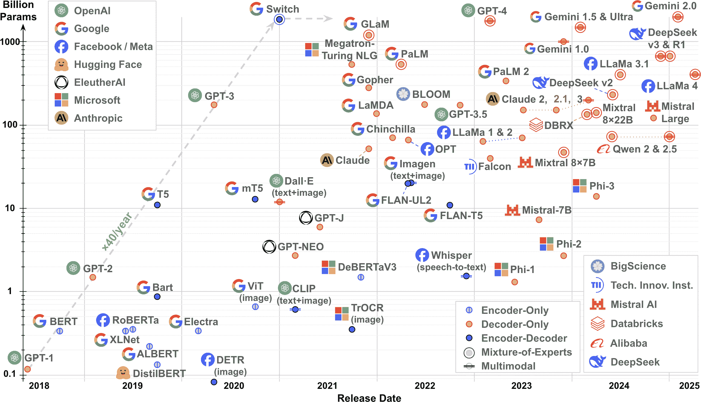

###### 图 15-2\. 自 2018 年以来发布的一些最具影响力的 Transformer；[在线查看更大版本](https://homl.info/fig15-2)

然后，在 2022 年 11 月，OpenAI 发布了 ChatGPT，一个惊人的*对话式 AI*——或*聊天机器人*——它一夜之间震惊了世界：它仅用五天时间就达到了一百万用户，两个月后月活跃用户超过一亿！在底层，它使用了 GPT-3.5-turbo，这是 GPT-3.5 的一个变种，经过微调以实现对话性、有帮助性和安全性。其他人很快也效仿：Perplexity AI、Google 的 Gemini（最初称为 Bard）、Anthropic 的 Claude、Mistral AI、DeepSeek 以及更多。

###### 注意

在 ChatGPT 发布之前，谷歌实际上已经开发了一个名为 LaMDA 的强大聊天机器人，但它并没有公开，可能是因为担心声誉和法律风险，因为这个模型被认为还不够安全。这允许 OpenAI 成为第一家训练一个相对安全和有帮助的模型并将其作为有用的聊天机器人产品的公司。

那么，你如何使用这些模型和聊天机器人呢？嗯，其中许多是专有的（例如，OpenAI 的 GPT-3.5、GPT-4 和 GPT-5 模型，Anthropic 的 Claude 模型，以及 Google 的 Gemini 模型），并且只能通过 Web UI、应用程序或 API 使用：你必须创建一个账户，选择一个套餐（或使用免费层），对于 API，你必须获取访问令牌并使用它来程序化查询 API。然而，许多其他模型是*开放权重*，这意味着它们可以免费下载（例如，使用 Hugging Face Hub）：其中一些有许可限制（例如，Meta 的 Llama 模型仅限非商业用途免费），而其他则是真正的开源（例如，DeepSeek 的 R1 或 Mistral AI 的 Mistral-7B）。一些甚至包括训练代码和数据（例如，Ai2 的 OLMo 模型）。

我们还在等什么呢？让我们加入 transformer 革命！以下是计划：

+   我们将首先打开原始 Transformer 架构，检查其组件，以全面了解一切是如何工作的。

+   然后，我们将从头开始构建和训练一个用于英语到西班牙语翻译的 transformer。

+   之后，我们将研究仅编码器模型如 BERT，了解它们是如何预训练的，并看看如何使用它们进行文本分类、语义搜索和文本聚类等任务，这些任务可以带或不带微调。

+   接下来，我们将研究仅解码器模型如 GPT，看看它们是如何预训练的。这些模型能够生成文本，如果你想要写一首诗，这很好，但它也可以用于解决许多其他任务。

+   然后，我们将使用仅解码器模型来构建我们自己的聊天机器人！这涉及几个步骤：首先，你必须下载一个预训练模型（或者如果你有时间和金钱，可以自己训练），然后你必须微调它，使其更具对话性、有帮助性和安全性（或者你可以下载已经微调好的模型，甚至可以通过 API 使用对话模型），最后你必须将模型部署到一个提供用户界面、存储对话并可以给模型提供访问工具（如搜索网络或使用计算器）的聊天机器人系统中。

+   最后，我们将快速浏览编码器-解码器模型，如 T5 和 BART，这些模型非常适合翻译和摘要等任务。

在第十六章中，我们将探讨视觉 Transformer 和多模态 Transformer。第十七章和“状态空间模型（SSMs）”（均可在[*https://homl.info*](https://homl.info)找到）也讨论了一些高级技术，以允许 Transformer 进行扩展并处理更长的输入序列。

让我们从剖析 Transformer 架构开始：拿出你的解剖刀！

# 注意力即是所有你需要的东西：原始的 Transformer 架构

原始的 2017 年 Transformer 架构在图 15-3 中表示。图的左侧表示编码器，右侧表示解码器。

如我们之前所见，编码器的角色是逐步*转换*输入（例如，英语标记的序列）直到每个标记的表示完美捕捉该标记在句子中的含义：编码器的输出是一系列上下文化的标记嵌入。除了嵌入层之外，编码器中的每一层都接受形状为[*批大小*，*批中最大英语序列长度*，*嵌入大小*]的张量作为输入，并返回形状完全相同的张量。这意味着标记表示会逐步转换，因此得名该架构。例如，如果你将句子“我喜欢足球”输入到编码器中，那么标记“喜欢”一开始将有一个相当模糊的表示，因为“喜欢”在不同的上下文中可能有不同的含义（例如，“我喜欢猫”与“我喜欢我的猫”）。但是经过编码器处理后，标记的表示应该捕捉到给定句子中“喜欢”的正确含义（在这种情况下，表示喜爱），以及可能需要翻译的任何其他信息（例如，它是一个动词）。

解码器的角色是接收编码器的输出以及迄今为止翻译的句子，并预测翻译中的下一个标记。为此，解码器层逐渐将每个输入标记的表示转换为可以用来预测下一个标记的表示。例如，假设要翻译的句子是“我喜欢足球”并且我们已经调用了解码器四次，每次产生一个新标记：首先“我”，然后“我喜欢”，然后“我喜欢足球的”，最后“我喜欢足球”。由于这个翻译不以 EoS 标记`"</s>"`结束，我们必须再次调用解码器。解码器的输入序列现在是"`<s>`我喜欢足球”。随着每个标记的表示通过解码器，它会被转换：`"<s>"`的表示变成了足够丰富的表示，可以预测“我”（为了简单起见，我会更简洁地说：`"<s>"`变成了“我”），“我”变成了“喜欢”，“喜欢”变成了“的”，“的”变成了“足球”，如果一切顺利，“足球”将变成 EoS 标记`"</s>"`。除了嵌入层和输出`Linear`层之外，解码器中的每一层都接受形状为[*batch size*, *batch 中的最大西班牙语序列长度*, *嵌入大小*]的张量作为输入，并返回形状完全相同的张量。

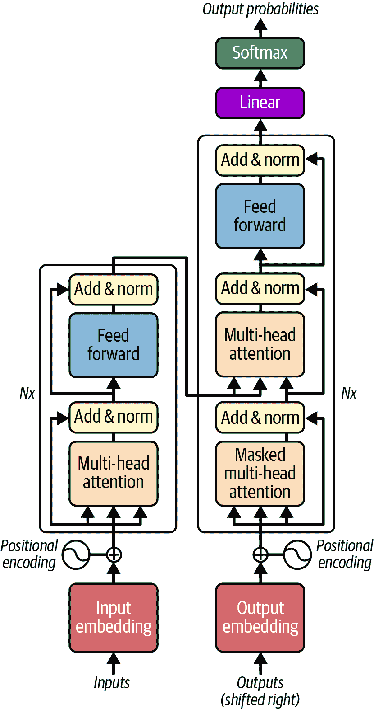

###### 图 15-3. 原始 2017 年 transformer 架构⁠^(4)

经过解码器处理后，每个标记的表示会通过一个最终的`Linear`层，希望输出正确的标记的高 logit 值，以及词汇表中所有其他标记的低 logit 值。解码器的输出形状是[*batch size*, *batch 中的最大西班牙语序列长度*, *词汇表大小*]。最终的预测句子应该是“我喜欢足球 `</s>`”。注意，图中显示了顶部的 softmax 层，但在 PyTorch 中我们通常不会明确添加它：相反，我们让模型输出 logit，并使用`nn.CrossEntropyLoss`训练模型，该损失函数基于 logit 而不是估计的概率（如我们之前章节中看到的）。如果您需要估计的概率，您始终可以使用`F.softmax()`函数将 logit 转换为估计的概率。

现在，让我们进一步聚焦于图 15-3：

+   首先，请注意，编码器和解码器都包含堆叠了*N*次的块。在论文中，*N* = 6。请注意，整个编码器堆栈的最终输出被馈送到解码器的每个*N*个块中。

+   如您所见，您已经熟悉了大多数组件：有两个嵌入层；几个跳过连接，每个连接后面都跟着一个层归一化模块；几个由两个密集层组成的前馈模块（第一个使用 ReLU 激活函数，第二个没有激活函数）；最后，输出层是一个线性层。请注意，所有层都独立于其他所有层处理每个标记。但我们是怎样通过完全分开地看待标记来翻译一个句子的呢？嗯，我们做不到，这就是新组件发挥作用的地方：

    +   编码器的*多头注意力*层通过关注（即，关注）同一句子中的每个标记（包括自身）来更新每个标记表示。这被称为*自*注意力。这就是单词“like”的模糊表示变成一个更丰富、更准确的表示，捕捉它在给定句子中的精确含义（例如，层注意到主语“I”，因此推断“like”必须是一个动词）。我们将在稍后详细讨论这是如何工作的。

    +   解码器的*掩码多头注意力*层做的是同样的事情，但在处理一个标记时，它不会关注位于其后的标记：它是一个因果层。例如，当它处理标记“gusta”时，它只关注标记`"<s>"`、“me”和“gusta”，而忽略标记“el”和“fútbol”（否则模型在训练期间可能会作弊）。

    +   解码器的上层多头注意力层是解码器关注编码器堆栈输出的上下文化标记表示的地方。这被称为*交叉*注意力，与*自*注意力相对。例如，当解码器处理单词“el”并输出单词“fútbol”的表示时，它可能会非常关注单词“soccer”。

    +   *位置编码*是密集向量，表示句子中每个标记的位置。第 *n* 个位置编码被添加到每个句子中第 *n* 个标记的标记嵌入中。这是必需的，因为 Transformer 架构中的所有层都是位置无关的，这意味着它们对所有位置同等对待（与循环或卷积层不同）：当它们处理一个标记时，它们不知道该标记在句子中的位置或相对于其他词的位置。但是单词的顺序很重要，因此我们必须以某种方式向 Transformer 提供位置信息。将位置编码添加到标记表示中是实现这一目标的好方法。

###### 注意

在图 15-3 中，每个多头注意力层进入的前两个箭头代表键和值，第三个箭头代表查询。⁠^(5) 在自注意力层中，这三个都等于前一层输出的标记表示，而在交叉注意力层（即解码器的上层注意力层）中，键和值等于编码器的最终标记表示，而查询等于前一个解码器层输出的标记表示。

现在我们更详细地探讨 Transformer 架构的独创组件，从位置编码开始。

## 位置编码

位置编码是一个密集向量，它编码了标记在句子中的位置：第*i*个位置编码被添加到每个句子中第*i*个标记的嵌入表示。实现这一点的简单方法是用一个`Embedding`层：只需将嵌入编号#0 添加到标记编号#0 的表示中，将嵌入编号#1 添加到标记编号#1 的表示中，依此类推。或者，你可以使用一个`nn.Parameter`来存储嵌入矩阵（使用小的随机权重初始化），然后将它的前*L*行添加到输入中（其中*L*是最大输入序列长度）：结果是相同的，但速度要快得多。你还可以添加一些 dropout 来降低过拟合的风险。以下是一个实现示例：

```py
import torch
import torch.nn as nn
import torch.nn.functional as F

class PositionalEmbedding(nn.Module):
    def __init__(self, max_length, embed_dim, dropout=0.1):
        super().__init__()
        self.pos_embed = nn.Parameter(torch.randn(max_length, embed_dim) * 0.02)
        self.dropout = nn.Dropout(dropout)

    def forward(self, X):
        return self.dropout(X + self.pos_embed[:X.size(1)])
```

###### 注意

输入的形状为[*批大小*，*序列长度*，*嵌入大小*]，但我们添加了形状为[*序列长度*，*嵌入大小*]的位置编码。这得益于广播规则：第*i*个位置编码被添加到每个句子中第*i*个标记的表示。

Transformer 论文的作者还提出了使用固定位置编码而不是可训练位置编码。他们的方法使用了一种相当聪明的基于正弦和余弦函数的方案，但现在已经很少使用了，因为它实际上并没有比可训练位置嵌入表现得更好（除非你很幸运，在小型 Transformer 上）。有关更多详细信息，请参阅本章的笔记本。此外，像**相对位置偏置**（RPB）、**旋转位置编码**（RoPE）和**带线性偏置的注意力**（ALiBi）等更新的方法通常表现更好。要了解更多关于所有这些位置编码的替代方法，请参阅“相对位置编码”。

现在我们更深入地看看 Transformer 模型的核心：多头注意力层。

## 多头注意力

多头注意力（MHA）层基于**缩放点积注意力**，这是点积注意力（在第十四章中介绍）的一种变体，通过一个常数因子缩放相似度得分。参见方程 15-1 以了解其向量方程。

##### 方程 15-1\. 缩放点积注意力

<mo>注意力</mo><mrow><mo>(</mo><mrow><mi mathvariant="bold">Q</mi><mo lspace="0%" rspace="0%">,</mo><mi mathvariant="bold">K</mi><mo lspace="0%" rspace="0%">,</mo><mi mathvariant="bold">V</mi></mrow><mo>)</mo></mrow><mo>=</mo><mo>softmax</mo><mfenced><mfrac><mrow><msup><mi mathvariant="bold">QK</mi><mo>⊺</mo></msup></mrow><msqrt><mrow><msub><mi>d</mi><mi mathvariant="normal">k</mi></msub></mrow></msqrt></mfrac></mfenced><mi mathvariant="bold">V</mi>

在这个公式中：

+   **Q** 是一个表示 *查询* 的矩阵（例如，一个英语或西班牙语序列，具体取决于注意力层）。其形状为 [*L*[q], *d*[q]]，其中 *L*[q] 是查询的长度，*d*[q] 是查询的维度性（即标记表示中的维度数）。

+   **K** 是一个表示键的矩阵。其形状为 [*L*[k], *d*[k]]，其中 *L*[k] 是键的长度，*d*[k] 是键的维度性。请注意，*d*[k] 必须等于 *d*[q]。

+   **V** 是一个表示值的矩阵。其形状为 [*L*[v], *d*[v]]，其中 *L*[v] 是值的长度，*d*[v] 是值的维度性。请注意，*L*[v] 必须等于 *L*[k]。

+   **Q** **K**^⊺ 的形状为 [*L*[q], *L*[k]]：它包含每个查询/键对的相似度分数。为了防止这个矩阵变得非常大，输入序列不能太长：这是关键的 *二次上下文窗口* 问题（我们将在第十六章和第十七章中讨论缓解这一问题的各种方法）。softmax 函数应用于每一行：输出具有与输入相同的形状，但现在每一行的总和为 1。最终的输出形状为 [*L*[q], *d*[v]]。每一行对应一个查询标记，每一行代表查询结果：值标记的加权和，优先考虑与给定查询标记最对齐的键标记的值标记。

+   缩放因子 1 / <msqrt><msub><mi>d</mi> <mrow><mi>k</mi></mrow></msub></msqrt> 将相似度分数缩小，以避免饱和 softmax 函数，这会导致梯度非常小。这个因子在经验上被证明可以加速并稳定训练。

+   在计算 softmax 之前，通过向相应的相似度分数添加一个非常大的负值，可以屏蔽一些键/值对。在实践中，我们可以添加 `–torch.inf`）。结果权重将等于零。这有助于屏蔽填充标记，以及屏蔽多头注意力层中的未来标记。 

PyTorch 包含 `F.scaled_dot_product_attention()` 函数。其输入与 **Q**、**K** 和 **V** 相同，但这些输入可以在开头有额外的维度，例如批处理大小和头数（当用于多头注意力时）。该方程会在所有这些额外维度上同时应用。换句话说，该函数会在批处理中的所有句子和所有注意力头之间同时计算结果，这使得它非常高效。

现在我们已经准备好查看多头注意力层。其架构在 图 15-4 中显示。

如您所见，它只是一系列缩放点积注意力层，称为 *注意力头*，每个注意力头之前都有一个值、键和查询的线性变换（跨所有标记）。所有注意力头的输出只是简单地连接起来，然后通过最终的线性变换（再次，跨所有标记）。

但为什么？这种架构背后的直觉是什么？好吧，再次考虑句子“我喜欢足球”中的单词“喜欢”。编码器可能足够聪明，能够编码其含义，即它是一个动词，以及许多对翻译有用的其他特征，例如它是一般现在时。标记表示还包括位置，多亏了位置编码。简而言之，标记表示编码了标记的许多不同特征。如果我们只使用单个缩放点积注意力层，我们只能一次性查询所有这些特征。

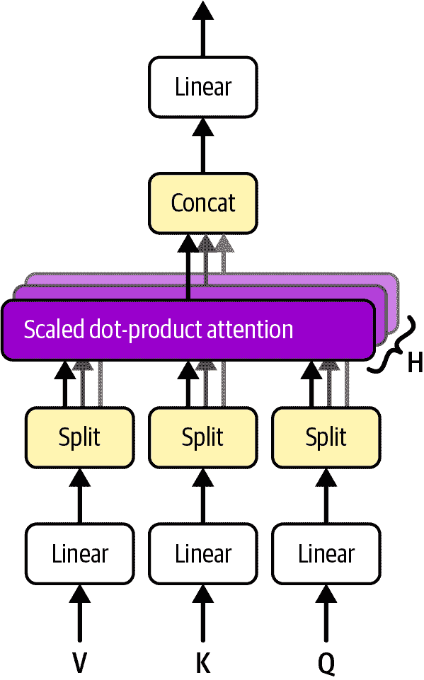

###### 图 15-4\. 多头注意力层架构⁠^(6)

###### 警告

Transformer 架构极其灵活，因此在训练过程中模型有充分的自由度来选择自己的知识表示和策略。结果，它最终变成了一种黑盒：理解变压器真正“思考”的方式是一个活跃的研究领域，被称为 *模型可解释性*。例如，可以查看这个 [Anthropic 的迷人帖子](https://homl.info/tracing-thoughts)。

这就是为什么 MHA 层将值、键和查询分割到多个头中：这样，每个头都可以专注于特定标记的特性。第一个线性层让模型选择每个头应该关注哪些特性。例如，线性层可以确保第一个头将“like”标记的表示投影到只包含该标记是现在时态动词的信息的子空间中。另一个头可能专注于单词的意义，等等。然后缩放点积注意力层实现实际的查找阶段，最后将所有结果连接起来，并通过一个最终的线性层运行，允许模型按其喜好重新组织表示。

要真正理解 Transformer 架构，关键在于理解多头注意力机制，为此，查看一个基本实现会有所帮助：

```py
class MultiheadAttention(nn.Module):
    def __init__(self, embed_dim, num_heads, dropout=0.1):
        super().__init__()
        self.h = num_heads
        self.d = embed_dim // num_heads
        self.q_proj = nn.Linear(embed_dim, embed_dim)
        self.k_proj = nn.Linear(embed_dim, embed_dim)
        self.v_proj = nn.Linear(embed_dim, embed_dim)
        self.out_proj = nn.Linear(embed_dim, embed_dim)
        self.dropout = nn.Dropout(dropout)

    def split_heads(self, X):
        return X.view(X.size(0), X.size(1), self.h, self.d).transpose(1, 2)

    def forward(self, query, key, value):
        q = self.split_heads(self.q_proj(query))  # (B, h, Lq, d)
        k = self.split_heads(self.k_proj(key))  # (B, h, Lk, d)
        v = self.split_heads(self.v_proj(value))  # (B, h, Lv, d) with Lv=Lk
        scores = q @ k.transpose(2, 3) / self.d**0.5  # (B, h, Lq, Lk)
        weights = scores.softmax(dim=-1)  # (B, h, Lq, Lk)
        Z = self.dropout(weights) @ v  # (B, h, Lq, d)
        Z = Z.transpose(1, 2)  # (B, Lq, h, d)
        Z = Z.reshape(Z.size(0), Z.size(1), self.h * self.d)  # (B, Lq, h × d)
        return (self.out_proj(Z), weights)  # (B, Lq, h × d)
```

让我们来看一下这段代码：

+   构造函数存储头的数量 `self.h` 并计算每个头的维度数 `self.d`，然后创建必要的模块。注意，嵌入大小必须能被头的数量整除。

+   `split_heads()` 方法在 `forward()` 方法中使用。它将其输入 `X` 沿其最后一个维度（每个头一个分割）进行分割，将其从形状为 [*B*, *L*, *h* × *d*] 的 3D 张量转换为形状为 [*B*, *L*, *h*, *d*] 的 4D 张量，其中 *B* 是批大小，*L* 是输入序列的最大长度（对于键和值是 *L*[k]，对于查询是 *L*[q]），*h* 是头的数量，*d* 是每个头的维度数（即 *h* × *d* = 嵌入大小）。然后交换维度 1 和 2 以获得形状为 [*B*, *h*, *L*, *d*] 的张量：由于矩阵乘法运算符 `@` 只在最后两个维度上工作，它不会触及前两个维度 *B* 和 *h*，因此我们可以使用此运算符一次性计算批中所有实例和所有注意力头之间的分数（`q @ k.transpose(2, 3)`）。在计算所有注意力输出时（`weights @ v`）也将如此。

+   `forward()` 方法首先对查询、键和值应用线性变换，并通过 `split_heads()` 方法传递结果。接下来的三行计算 方程 15-1，并在权重上添加一些 dropout。然后我们交换维度 1 和 2，以确保维度 *h* 和 *d* 再次相邻，然后将张量重塑回 3D：这将连接所有头的输出。然后我们可以应用输出线性变换并返回结果，以及权重（以防以后需要它们）。

###### 小贴士

如果需要一些时间才能完全理解，请不要担心，这并不容易。当然，你可以在不完全理解引擎工作原理的情况下开车，但第十六章和 17 中描述的一些 Transformer 改进只有在理解 MHA 的情况下才有意义。

但等等！我们遗漏了一个重要的细节：掩码。确实，正如我们之前讨论的，解码器的掩码自注意力层在尝试预测下一个标记时必须只考虑之前的标记（否则就是作弊）。此外，如果键包含填充标记，我们还想忽略它们。因此，让我们更新 `forward()` 方法以支持两个额外的参数：

`attn_mask`

一个形状为 [*L*[q], *L*[k]] 的布尔掩码，我们将用它来控制每个查询标记应该忽略哪些键标记（`True` 表示忽略，`False` 表示关注）

`key_padding_mask`

一个形状为 [*B*, *L*[k]] 的布尔掩码，用于定位每个键中的填充标记

```py
def forward(self, query, key, value, attn_mask=None, key_padding_mask=None):
    [...]  # compute the scores exactly like earlier
    if attn_mask is not None:
        scores = scores.masked_fill(attn_mask, -torch.inf)  # (B, h, Lq, Lk)
    if key_padding_mask is not None:
        mask = key_padding_mask.unsqueeze(1).unsqueeze(2)  # (B, 1, 1, Lk)
        scores = scores.masked_fill(mask, -torch.inf)  # (B, h, Lq, Lk)
    [...]  # compute the weights and the outputs exactly like earlier
```

这段代码将我们想要忽略的分数替换为负无穷大，因此在 softmax 操作后相应的权重将为零（如果我们直接尝试将这些权重置零，剩余的权重将不会加起来等于 1）。请注意，掩码会自动广播：`attn_mask` 在整个批次和所有注意力头之间广播，而 `key_padding_mask` 在所有头和所有查询标记之间广播。

PyTorch 有一个非常相似的 `nn.MultiheadAttention` 模块，它进行了更多优化（例如，它通常可以将三个输入投影融合成一个）。它具有相同的参数，并且行为完全相同。它还有一些额外的参数。以下是最重要的：

+   构造函数有一个 `batch_first` 参数，默认为 `False`，因此模块期望批次维度在序列长度维度之后。如果你更喜欢批次维度在前面，就像在我们的自定义实现中一样，你必须设置 `batch_first=True`。

+   `forward()` 方法有一个 `need_weights` 参数，默认为 `True`。如果你不需要使用此模块返回的权重，你应该将此参数设置为 `False`，因为这有时允许进行一些优化。当 `need_weights` 设置为 `False` 时，该方法返回 `None` 而不是权重。

+   `forward()` 方法还有一个 `is_causal` 参数：如果（并且仅当）`attn_mask` 被设置并且是一个 *causal mask*，那么你可以设置 `is_causal=True` 以允许一些性能优化。一个因果掩码允许每个查询标记关注所有之前的标记（包括它自己），但不会允许它关注位于其后的标记。换句话说，因果掩码在主对角线上方包含 `True`，在其他所有位置包含 `False`。这是掩码自注意力层所需的掩码。

现在我们已经有了主要成分，我们就可以实现 Transformer 模型的其余部分了。

## 构建 Transformer 的其余部分

Transformer 架构的其余部分要简单得多。让我们从编码器块开始。以下实现与图 15-3 左侧所表示的编码器块非常相似，只是在自注意力层和前馈模块中的两个密集层之后都添加了一些 dropout：

```py
class TransformerEncoderLayer(nn.Module):
    def __init__(self, d_model, nhead, dim_feedforward=2048, dropout=0.1):
        super().__init__()
        self.self_attn = MultiheadAttention(d_model, nhead, dropout)
        self.linear1 = nn.Linear(d_model, dim_feedforward)
        self.dropout = nn.Dropout(dropout)
        self.linear2 = nn.Linear(dim_feedforward, d_model)
        self.norm1 = nn.LayerNorm(d_model)
        self.norm2 = nn.LayerNorm(d_model)

    def forward(self, src, src_mask=None, src_key_padding_mask=None):
        attn, _ = self.self_attn(src, src, src, attn_mask=src_mask,
                                 key_padding_mask=src_key_padding_mask)
        Z = self.norm1(src + self.dropout(attn))
        ff = self.dropout(self.linear2(self.dropout(self.linear1(Z).relu())))
        return self.norm2(Z + ff)
```

注意到前馈块由一个首先将维度扩展到 2048（默认值）的`Linear`层组成，然后是一个非线性（在这种情况下是 ReLU），然后是一个将数据投影回原始嵌入大小（也称为*模型维度*，`d_model`）的第二个`Linear`层。这个*反向瓶颈*增加了非线性的表达能力，允许模型学习更丰富的特征组合。这个想法在后来的 MobileNetv2 论文中得到了进一步探索，该论文的作者提出了*逆残差网络*这个术语。

在编码器中，`src_mask`参数通常不使用，因为编码器允许每个标记关注所有标记，即使是在它之后的位置。然而，用户预计会适当地设置`key_padding_mask`。

现在是一个解码器块的实现。它与图 15-3 右侧所表示的解码器块非常相似，只是增加了一些 dropout：

```py
class TransformerDecoderLayer(nn.Module):
    [...]  # similar constructor, with 2 MHA, 3 Linear, 3 LayerNorm, 1 Dropout
    def forward(self, tgt, memory, tgt_mask=None, memory_mask=None,
                tgt_key_padding_mask=None, memory_key_padding_mask=None):
        attn1, _ = self.self_attn(tgt, tgt, tgt, attn_mask=tgt_mask,
                                  key_padding_mask=tgt_key_padding_mask)
        Z = self.norm1(tgt + self.dropout(attn1))
        attn2, _ = self.multihead_attn(Z, memory, memory, attn_mask=memory_mask,
                                       key_padding_mask=memory_key_padding_mask)
        Z = self.norm2(Z + self.dropout(attn2))
        ff = self.dropout(self.linear2(self.dropout(self.linear1(Z).relu())))
        return self.norm3(Z + ff)
```

`memory`参数对应于编码器的输出。为了实现完全的灵活性，我们允许用户将适当的掩码传递给`forward()`方法。通常，您需要适当地设置填充掩码（对于记忆和目标），并将`tgt_mask`设置为因果掩码（我们很快就会看到）。

PyTorch 实际上提供了`nn.TransformerEncoderLayer`和`nn.TransformerDecoderLayer`，直接使用相同的参数，还有一些额外的参数：最重要的是`batch_first`，如果您将批处理维度设置为第一个，则必须将其设置为`True`，以及每个注意力掩码的一个`*_is_causal`参数，还有一个默认为“relu”的`activation`参数。许多最先进的 transformer 使用更先进的激活，如 GELU（在第十一章中介绍）。

PyTorch 还提供了三个额外的 transformer 模块（为这些中的每一个编写自定义模块留给读者作为练习——参见笔记本以获取解决方案）：

`nn.TransformerEncoder`

简单地链接所需数量的编码器层。其构造函数接受一个编码器层和所需的层数`num_layers`，并将给定的编码器层克隆`num_layers`次。构造函数还接受一个可选的归一化层，如果提供，则应用于最终输出。

`nn.TransformerDecoder`

与此相同，只是它链接解码器层而不是编码器层。

`nn.Transformer`

创建一个编码器和解码器（都具有层归一化），并将它们链接起来。

恭喜！你现在知道如何从头开始构建一个完整的 Transformer 模型。你只需要添加一个最终的`Linear`层，并使用`nn.CrossEntropyLoss`来获得图 15-3 中显示的完整架构（正如我们在前面的章节中看到的，softmax 层隐式包含在损失中）。现在让我们看看如何使用 Transformer 模型将英语翻译成西班牙语。

# 构建英语到西班牙语的 Transformer

是时候构建我们的 NMT Transformer 模型了。为此，我们将使用我们的`PositionalEmbedding`模块和 PyTorch 的`nn.Transformer`（我们的自定义`Transformer`模块运行良好，但速度较慢）：

```py
class NmtTransformer(nn.Module):
    def __init__(self, vocab_size, max_length, embed_dim=512, pad_id=0,
                 num_heads=8, num_layers=6, dropout=0.1):
        super().__init__()
        self.embed = nn.Embedding(vocab_size, embed_dim, padding_idx=pad_id)
        self.pos_embed = PositionalEmbedding(max_length, embed_dim, dropout)
        self.transformer = nn.Transformer(
            embed_dim, num_heads, num_encoder_layers=num_layers,
            num_decoder_layers=num_layers, batch_first=True)
        self.output = nn.Linear(embed_dim, vocab_size)

    def forward(self, pair):
        src_embeds = self.pos_embed(self.embed(pair.src_token_ids))
        tgt_embeds = self.pos_embed(self.embed(pair.tgt_token_ids))
        src_pad_mask = ~pair.src_mask.bool()
        tgt_pad_mask = ~pair.tgt_mask.bool()
        size = [pair.tgt_token_ids.size(1)] * 2
        full_mask = torch.full(size, True, device=tgt_pad_mask.device)
        causal_mask = torch.triu(full_mask, diagonal=1)
        out_decoder = self.transformer(src_embeds, tgt_embeds,
                                       src_key_padding_mask=src_pad_mask,
                                       memory_key_padding_mask=src_pad_mask,
                                       tgt_mask=causal_mask, tgt_is_causal=True,
                                       tgt_key_padding_mask=tgt_pad_mask)
        return self.output(out_decoder).permute(0, 2, 1)
```

让我们逐行分析这段代码：

+   构造函数很简单：我们只需创建必要的模块。

+   `forward()`方法接受一个`NmtPair`作为输入（这个类在第十四章中定义）。该方法首先对源和目标输入的输入标记进行嵌入，并给它们添加位置编码。

+   然后代码使用`not`运算符（`~`）反转源和目标掩码，因为它们对于每个填充标记都包含`False`，但`nn.MultiheadAttention`期望对于它应该忽略的标记使用`True`。

+   接下来，我们创建一个形状为[*L*[q]，*L*[q]]的正方形矩阵，填充`True`，然后使用`torch.triu()`函数获取主对角线以上的所有元素，其余默认为`False`。这会产生一个因果掩码，我们可以将其用作 transformer 的`tgt_mask`：它将使用此掩码进行掩码自注意力层。或者，你也可以调用`nn.Transformer.generate_square_subsequent_mask()`来创建因果掩码：只需传递序列长度（`pair.tgt_token_ids.size(1)`）并设置`dtype=torch.bool`。

+   然后我们调用 transformer，传递给它源和目标嵌入以及所有适当的掩码。

+   最后，我们将结果通过输出`Linear`层传递，并交换最后两个维度，因为`nn.CrossEntropyLoss`期望类别维度是维度 1。

我们现在可以创建这个模型的实例并像我们在第十四章中的 RNN 编码器-解码器一样训练它。为了加快训练速度并减少过拟合，你可以将 transformer 缩小很多——使用 4 个头而不是 8 个，编码器和解码器都只有 2 层，并且使用 128 的嵌入大小：

```py
nmt_tr_model = NmtTransformer(vocab_size, max_length, embed_dim=128, pad_id=0,
                              num_heads=4, num_layers=2, dropout=0.1).to(device)
[...]  # train this model exactly like the encoder-decoder in Chapter 14
```

让我们看看这个模型的表现如何：

```py
>>> nmt_tr_model.eval()
>>> translate(nmt_tr_model,"I like to play soccer with my friends at the beach")
' Me gusta jugar al fútbol con mis amigos en la playa . </s>'
```

太棒了，即使这个经过 20 个 epoch 训练的微型 transformer 也运行得相当好，所以想象一下在一个更大的数据集上训练的更大型的 transformer，你就可以开始看到 ChatGPT 及其朋友们为何如此令人印象深刻。

###### 小贴士

在我们继续探讨其他模型之前，清理 GPU RAM 是很重要的，否则它很快就会变得饱和。为此，使用`del`关键字删除所有不再需要的变量——特别是模型、优化器、张量和数据集——然后调用`gc.collect()`函数来运行 Python 的垃圾回收器。当使用 CUDA 或 AMD 设备时，还必须调用`torch.cuda.empty_cache()`。在 Colab 上，你可以通过从菜单中选择“运行”→“查看资源”来查看可用的 GPU RAM。

现在你已经很好地理解了原始 Transformer 架构，让我们看看仅编码器 Transformer。

# 用于自然语言理解的仅编码器 Transformer

当谷歌在 2018 年发布了[BERT 模型](https://homl.info/bert)时，⁠^(7)，它证明了仅编码器的 Transformer 可以处理各种自然语言任务：句子分类、标记分类、多项选择题回答等等！BERT 还证实了在大语料库上进行自监督预训练对迁移学习是有效的：BERT 确实可以在许多任务上实现优异的性能，只需在每个任务上对相当小的数据集进行微调即可。让我们首先看看 BERT 的架构，然后我们将看看它是如何进行预训练的，以及如何为你自己的任务进行微调。

###### 警告

仅编码器模型通常不用于文本生成任务，如自动补全、翻译、摘要或聊天机器人，因为它们在这个任务上比解码器慢得多。解码器更快，因为它们是因果的，所以一个好的实现可以在预测新标记时缓存和重用其先前状态。相反，编码器仅使用非掩码的多头注意力层，因此它们自然是双向的；这就是 BERT 中的 B（双向 Transformer 编码器表示）。每当添加新标记时，都需要重新计算。

## BERT 的架构

BERT 的架构几乎与原始 Transformer 的编码器完全相同，只有三个区别：

1.  它要大得多。BERT-base 有 12 个编码器块、12 个注意力头和 768 维的嵌入，而 BERT-large 有 24 个块、16 个头和 1,024 维（而原始 Transformer 有 6 个块、8 个头和 512 维）。它还使用可训练的位置嵌入，并支持输入长度最多为 512 个标记的句子。

1.  它在每个子层（注意力或前馈）之前而不是之后应用层归一化。这被称为*预-LN*，与*后-LN*相对，这确保了每个子层的输入都被归一化，从而稳定了训练并减少了对于权重初始化的敏感性。PyTorch 的 transformer 模块默认使用后-LN，但它们有一个`norm_first`参数，你可以将其设置为`True`如果你更喜欢预-LN（然而，对于预-LN 的一些优化可能没有实现）。

1.  如果需要，它允许将输入句子分成两个 *段*。这对于需要一对输入句子的任务很有用，例如自然语言推理（即句子 A 是否蕴含句子 B？）或多项选择题回答（即给定问题 A，答案 B 有多好？）。要将两个句子传递给 BERT，你必须首先在每个句子后附加一个 *分隔标记* [SEP]，然后将它们连接起来。此外，还添加了一个可训练的 *段嵌入* 到每个标记的表示中：段嵌入 #0 被添加到段 #0 内的所有标记中，段嵌入 #1 被添加到段 #1 内的所有标记中。理论上，我们可以有更多的段，但 BERT 只在由一个或两个段组成的输入上进行预训练。注意，位置编码也像往常一样添加到每个标记的表示中（即相对于完整输入序列，而不是相对于单个段）。

那就结束了！现在让我们看看 BERT 是如何进行预训练的。

## BERT 预训练

作者提出了两个自监督预训练任务：

掩码语言模型 (MLM)

句子中的每个标记有 15% 的概率被替换为掩码标记，模型被训练来预测原始标记是什么。这通常被称为 *完形填空任务*（即填空）。例如，如果原始句子是“她在生日派对上玩得很开心”，那么模型可能会得到句子“她在生日派对上玩得很开心”，然后它必须预测原始句子：损失只计算在掩码标记输出上。

更精确地说，一些掩码标记并不是真正被掩码的：10% 被替换为随机标记，10% 则保持不变，既没有被掩码也没有被随机化。为什么是这样呢？好吧，随机标记迫使模型在没有掩码标记的情况下也能表现良好：这对于大多数下游任务来说很重要，因为大多数下游任务都不使用任何掩码标记。至于未更改的标记，它们使得预测变得简单，这鼓励模型关注预测标记位置处的输入标记。如果没有它们，模型很快就会学会忽略这个标记，并仅依赖于其他标记。

下一个句子预测 (NSP)

该模型被训练来预测两个句子是否连续。例如，它应该预测“狗在睡觉”和“它大声打鼾”是连续的句子，而“狗在睡觉”和“地球围绕太阳转”则不是连续的。

这是一个二元分类任务，作者选择通过引入一个新的 *类别标记* [CLS] 来实现：这个标记被插入到输入序列的开头（位置 #0，段 #0），在训练过程中，编码器的输出通过一个二元分类头（即一个单单元的线性层，后跟 sigmoid 函数，并使用 `nn.BCELoss` 进行训练，或者只是一个使用 `nn.BCEWithLogitsLoss` 训练的单单元线性层）。

BERT 同时在 MLM 和 NSP 上进行了预训练（参见 图 15-5 和 图 15-6 的左侧），使用大量的文本语料库——具体来说是英文维基百科和 BooksCorpus。NSP 的目标是使类标记的上下文嵌入成为整个输入序列的良好表示。起初，它似乎确实产生了好的句子嵌入，但后来发现简单地池化所有上下文嵌入（例如，通过计算它们的平均值）会产生更好的结果。事实上，研究人员表明，NSP 在整体上帮助不大，因此它在大多数后来的架构中被删除。

在 第十四章 中，我们看到了如何使用 Transformers 库下载预训练的 BERT 模型和它的分词器。但你可能想从头开始训练一个 BERT 模型，例如，如果你处理的是一个特定领域的文本语料库。为此，一个选择是使用 `nn.TransformerEncoder` 模块自己构建 BERT（例如，基于具有 `norm_first=True` 的 `nn.TransformerEncoderLayer` 以尊重 BERT 的架构），然后根据 MLM 算法预处理你的数据集，并训练你的模型。

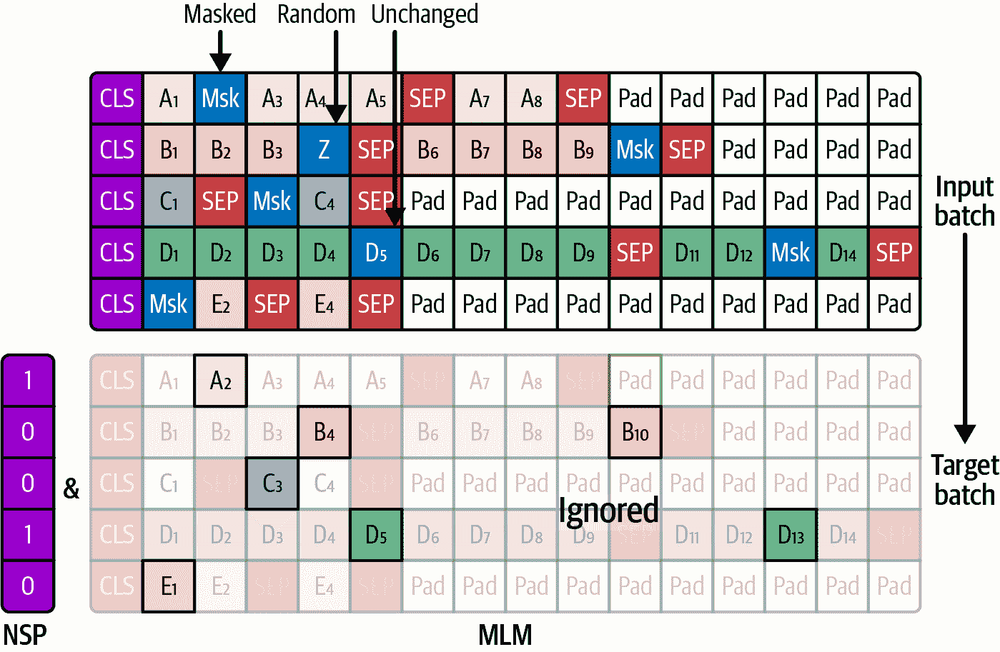

###### 图 15-5\. BERT 预训练期间的输入和目标，使用 MLM 和 NSP

然而，有一个更简单的方法，使用 Transformers 库。让我们先创建一个分词器和一个随机初始化的 BERT 模型。为了简单起见，我们使用一个预训练的分词器，但当然，如果你愿意，也可以从头开始训练一个。确保根据你的训练预算、数据集的大小和复杂性调整 `BertConfig`：

```py
from transformers import BertConfig, BertForMaskedLM, BertTokenizerFast

bert_tokenizer = BertTokenizerFast.from_pretrained("bert-base-uncased")
config = BertConfig(  # adapt to training budget, and dataset size & complexity
    vocab_size=bert_tokenizer.vocab_size, hidden_size=128, num_hidden_layers=2,
    num_attention_heads=4, intermediate_size=512, max_position_embeddings=128)
bert = BertForMaskedLM(config)
```

接下来，让我们下载 WikiText 数据集（在现实生活中，你会使用自己的数据集），并对它进行分词：

```py
from datasets import load_dataset

def tokenize(example, tokenizer=bert_tokenizer):
    return tokenizer(example["text"], truncation=True, max_length=128,
                     padding="max_length")

mlm_dataset = load_dataset("wikitext", "wikitext-2-raw-v1", split="train")
mlm_dataset = mlm_dataset.map(tokenize, batched=True)
```

这就是 MLM 发挥作用的地方。我们创建了一个数据合并器，其作用是将样本捆绑成批次，并将它的 `mlm` 参数设置为 `True` 以激活 MLM，同时将 `mlm_probability` 设置为 `0.15`：每个标记有 15% 的概率被掩码（或可能随机化或保持不变，正如我们刚才讨论的）。我们还把分词器传递给合并器：它将不会被用来分词文本——我们已经做了这件事——但它让数据合并器知道掩码和填充标记的 ID，以及词汇表的大小（这是为了采样随机标记 ID 所必需的）。有了这些，我们只需要指定 `TrainingArguments`，将所有内容传递给 `Trainer`，并调用它的 `train()` 方法：

```py
from transformers import Trainer, TrainingArguments
from transformers import DataCollatorForLanguageModeling

args = TrainingArguments(output_dir="./my_bert", num_train_epochs=5,
                         per_device_train_batch_size=16)
mlm_collator = DataCollatorForLanguageModeling(bert_tokenizer, mlm=True,
                                               mlm_probability=0.15)
trainer = Trainer(model=bert, args=args, train_dataset=mlm_dataset,
                  data_collator=mlm_collator)
trainer_output = trainer.train()
```

一旦你的模型完成了预训练，你可以尝试使用 pipelines API 来测试它：

```py
>>> from transformers import pipeline
>>> torch.manual_seed(42)
>>> fill_mask = pipeline("fill-mask", model=bert, tokenizer=bert_tokenizer)
>>> top_predictions = fill_mask("The capital of [MASK] is Rome.")
>>> top_predictions[0]
{'score': 0.04916289076209068,
 'token': 1010,
 'token_str': ',',
 'sequence': 'the capital of, is rome.'}
```

什么？逗号不是罗马的首都！实际上，这个模型真的很糟糕，因为我们在这里只训练了一个 epoch，只是为了确认一切正常并且损失下降。为了获得更好的结果，我们需要训练很长时间。BERT 的作者使用 16 个 TPU 设备在一个更大的数据集上训练了大约 4 天。这就是为什么大多数人除非真的需要，否则会避免从头开始；通常，下载一个在尽可能接近你的文本语料库上预训练的模型，然后在你的数据集上进行微调会更好。这可以通过 MLM 完成，就像我们刚才做的那样，但从一个预训练模型开始。一旦你对预训练模型满意，你就可以在目标任务上对其进行微调。让我们看看如何操作。

## BERT 微调

BERT 可以针对许多不同的任务进行微调，对每个任务的变化非常小（参见图 15-6 的右侧）。

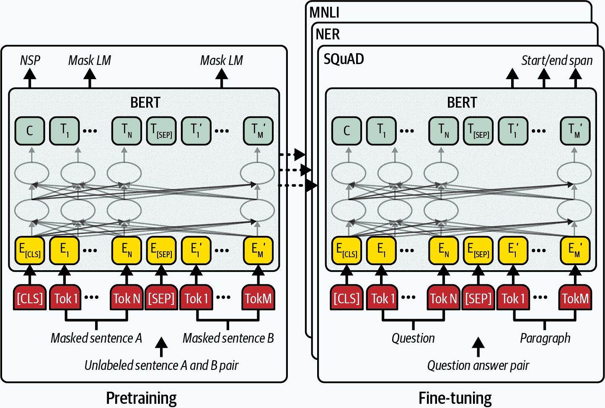

###### 图 15-6. BERT 预训练（左侧）和微调过程（右侧）⁠^(8)

对于句子分类任务，如情感分析，除了对应于类别标记的第一个输出标记外，所有输出标记都被忽略，并用新的分类头替换 NSP 二进制分类头（参见图 15-7 的左侧）。然后，你可以使用交叉熵损失对整个模型进行微调，可选地为底层设置更低的学习率，或者在最初的几个 epoch 中冻结 BERT（即只训练新的分类头）。使用完全相同的方法，你可以处理其他句子分类任务。例如，作者展示了在 CoLA 数据集上微调 BERT 可以获得非常好的结果，该数据集要求判断句子是否语法正确。在你的句子分类任务上试一试：即使你的数据集相当小，由于迁移学习的魔力，它也很可能表现良好。

###### 小贴士

BERT 的作者发现，将 MLM 损失（通过超参数缩放）添加到微调损失中有助于稳定训练并减少过拟合。

对于标记分类，分类头应用于每个标记（参见图 15-7 的右侧）。例如，BERT 可以被微调用于*命名实体识别*（NER），其中模型标记文本中对应于名称、日期、地点、组织或其他*实体*的部分。这通常用于法律、金融或医疗应用。同样的方法也可以用于其他标记分类任务，例如标记语法错误；在标记级别分析情感；定位主语、名词和动词（这是*词性标注*）；或定位问题、陈述和问候语（这是*对话行为标注*）；等等。


###### 图 15-7\. 微调 BERT 进行句子分类，如情感分析（左侧）或标记分类，如 NER（右侧）

BERT 还可以用于对句子对进行分类。它的工作方式与句子分类完全相同，只是你传递两个句子而不是一个。例如，这可以用于*自然语言推理*（NLI），其中模型必须确定句子 A 是否蕴涵句子 B，或与之矛盾，或两者都不是（例如，*多体裁 NLI*数据集，或 MNLI）。它还可以用于检测两个句子是否有相同的意思，是否只是相互释义（例如，QQP 或 MRPC 数据集），或者确定问题 A 的答案是否存在于句子 B 中（例如，QNLI 数据集）。

对于*多项选择题回答*（MCQA），BERT 对每个可能的答案调用一次，将问题放入段#0，将可能的答案放入段#1。对于每个答案，类标记输出通过一个单单元的线性层传递，产生一个分数。一旦我们有了所有答案的分数，我们可以使用 softmax 层将它们转换为概率（参见图 15-8），并且我们可以使用交叉熵损失进行微调（或者更好，省略 softmax 层，直接在答案分数上使用`nn.CrossEntropyLoss`）。

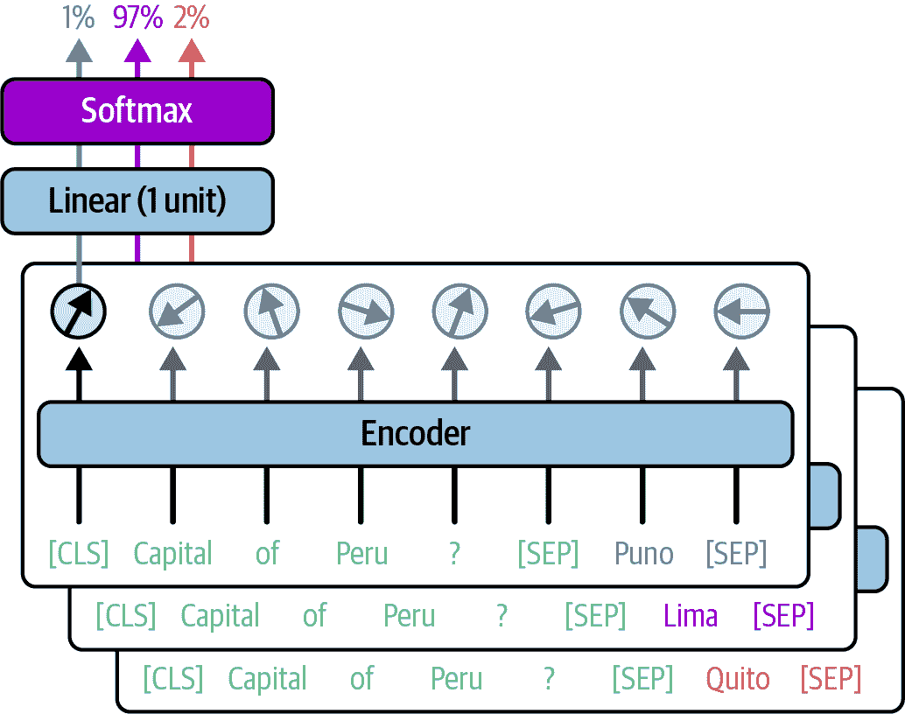

###### 图 15-8\. 使用仅编码器模型回答多项选择题

BERT 在*抽取式问答*方面也非常出色：你向它提出一个问题（在段#0），关于一些称为*上下文*（在段#1）的文本，BERT 必须在上下文中定位答案。为此，你可以在 BERT 之上添加一个带有两个单位的线性层，为每个标记输出两个分数：一个起始分数和一个结束分数。在微调期间，你可以将它们视为两个独立的二元分类任务的 logits：第一个确定一个标记是否是答案的第一个标记，第二个确定它是否是最后一个。当然，大多数标记都不是，如果答案是单个标记，一个标记可能同时是两者。在推理时间，我们选择一对索引*i*和*j*，使得标记*i*的起始分数与标记*j*的结束分数之和最大化，同时满足*i* ≤ *j*和*j* – *i* + 1 ≤ 最大可接受答案长度。这种方法使得 BERT 在 SQuAD 数据集上击败了当时最先进的技术，SQuAD 是一个流行的问答数据集。

###### 小贴士

Transformers 库为这些用例中的每一个都提供了方便的类和检查点，例如`BertForSequenceClassification`或`BertForQuestionAnswering`（见第十四章）。

BERT 的作者还展示了 BERT 可以被微调来测量*语义文本相似度*（STS）；例如，在*STS 基准*数据集（STS-B）中，你向模型输入两个句子，它输出一个分数，表示这两个句子在语义上的相似程度。但话虽如此，如果你想在包含*N*个句子的数据集中找到最相似的句子对，你需要对*N*²对运行 BERT：如果数据集很大，这可能需要数小时。相反，最好使用像[Sentence-BERT (SBERT)](https://homl.info/sbert)⁠^(9)这样的模型，它是一种 BERT 的变体，经过微调以产生良好的句子嵌入。首先，通过 SBERT 运行每个句子以获取其句子嵌入，然后使用诸如*余弦相似度*（例如，使用 PyTorch 的`F.cosine_similarity()`函数）之类的相似度度量来测量每个句子嵌入对之间的相似度。这是两个向量之间角度的余弦值，因此其值范围从-1（完全相反）到+1（完全对齐）。由于测量余弦相似度比运行 BERT 快得多，并且模型处理的是更短的输入（即句子而不是句子对），整个过程将只需几秒钟而不是几小时。

句子嵌入在许多其他应用中也非常有用：

文本聚类，以组织和更好地理解你的数据

你可以通过 SBERT 处理大量文档以获得它们的句子嵌入，然后对嵌入应用聚类算法，如*k*-means 或 HDBSCAN（见第八章），根据语义相似度对文档进行分组。在运行聚类算法之前，通常有助于降低维度，例如，使用 PCA 或 UMAP（见第七章）。

语义搜索

目标是让用户根据查询的意义而不是仅仅基于关键词匹配来找到文档。首先，使用 SBERT 对文档（或文档块）进行编码并存储句子嵌入。当用户提交搜索查询时，使用 SBERT 对其进行编码，并找到与查询嵌入最相似的文档，例如，基于余弦相似度。

重新排序搜索结果

如果你有一个现有的搜索系统，你不想替换它，你通常可以通过根据查询的语义相似度重新排序搜索结果来显著改进它。

###### 小贴士

向量数据库，如 Pinecone、Weaviate、ChromaDB、Qdrant 或 Milvus，旨在根据其嵌入存储和搜索文档。更传统的数据库，如 PostgreSQL 或 MongoDB，也对嵌入提供了越来越多的支持，尽管目前还没有得到优化。

近年来，许多 SBERT 的变体已经发布。其中一种下载和使用它们的最简单方法是通过 UKPLab 创建并由 Hugging Face 维护的[Sentence Transformers 库](https://sbert.net)。例如，以下代码下载了 all-MiniLM-L6-v2 模型，这个模型非常快且轻量，但仍然能产生高质量的句子嵌入。代码使用它来编码三个句子，然后测量每对句子之间的相似度：

```py
from sentence_transformers import SentenceTransformer

model = SentenceTransformer("all-MiniLM-L6-v2")
sentences = ["She's shopping", "She bought some shoes", "She's working"]
embeddings = model.encode(sentences, convert_to_tensor=True)
similarities = model.similarity(embeddings, embeddings)
```

让我们看看相似度矩阵：

```py
>>> similarities
tensor([[1.0000, 0.6328, 0.5841],
 [0.6328, 1.0000, 0.3831],
 [0.5841, 0.3831, 1.0000]], device='cuda:0')
```

我们可以看到主对角线上的 1，这证实了每个句子与其自身完美相似，我们还看到“她正在购物”与“她买了一些鞋子”的相似度更高（余弦相似度为 0.6328），而不是与“她正在工作”的相似度（0.5841）。

现在我们已经详细研究了 BERT，让我们看看它的后代。

## 其他仅编码器模型

跟随 Google 的脚步，许多组织发布了他们自己的仅编码器模型。让我们看看最受欢迎的几个，并讨论它们的主要创新。

### Facebook AI 的 RoBERTa，2019 年 7 月（参数量从 125M 增加到 355M）

这个模型与 BERT 相似，但它在各方面的性能都更好，这在很大程度上是因为它在更大的数据集上进行了更长时间的预训练。预训练使用了 MLM，但放弃了 NSP。重要的是，作者使用了*动态掩码*，这意味着在训练过程中动态地掩码要掩码的标记，而不是像 BERT 那样在训练之前只掩码一次，因此同一篇文本在不同的 epoch 中会有不同的掩码方式。这为模型提供了更多数据多样性，减少了过拟合，并导致了更好的泛化。

###### 注意

当我们在本章早期微调 BERT 时，我们实际上使用了动态掩码并放弃了 NSP，因此我们遵循了 RoBERTa 的预训练方法。

### Hugging Face 的 DistilBERT，2019 年 10 月（66M）

这个模型是 BERT 的缩小版：它比 BERT 小 40%，速度快 60%，但仍然在大多数任务上达到了 BERT 大约 97%的性能，使其成为低资源环境（例如，移动设备）、低延迟应用或快速微调的理想选择。

如其名所示，DistilBERT 是使用称为*模型蒸馏*的技术进行训练的，该技术最早由 Geoffrey Hinton 等人于 2015 年[提出](https://homl.info/distillation)。⁠^(10) 蒸馏的想法是使用来自更大的*教师模型*（例如 BERT）的估计概率作为目标来训练一个小的*学生模型*（例如 DistilBERT）（参见图 15-9）。这些是*软目标*而不是通常的 one-hot 向量：这使得训练更快、更高效，因为它允许学生直接针对正确的分布，而不是需要在许多样本中学习它，在两个极端之间弹跳，并逐渐在某处稳定下来。因此，蒸馏通常比在教师相同的数据集上从头开始训练学生效果更好！

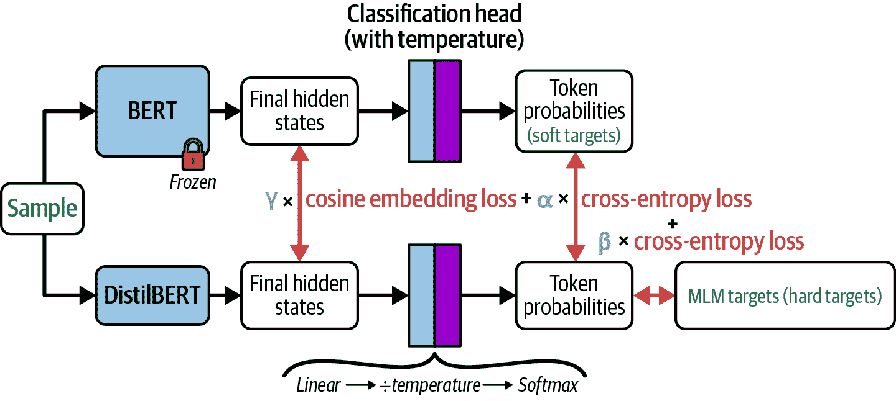

###### 图 15-9. 使用两个蒸馏损失和 MLM 损失的加权总和进行 DistilBERT 预训练

注意，教师和学生两者的估计概率在训练过程中都会稍微平滑一些——通过将最终 logits 除以大于 1 的温度（通常是 2）。这为学生提供了一个更细致的信号，涵盖了所有可能的选择，而不仅仅是关注正确答案。Hinton 将其称为“暗知识”。例如，如果输入是“天气晴朗，我感觉很”，教师可能会通常估计被掩码的词有 72%的概率是“好”，27%的概率是“很好”，只有 0.5%的概率是“坏”。但如果我们应用 2 的温度，那么这些概率会平滑到大约 60%，36%和 5%。了解“坏”在这里是一个可能的选项是有帮助的，即使它不太可能。

DistilBERT 的训练损失还包括两个额外组成部分：标准的 MLM 损失，以及一个 *余弦嵌入损失*，该损失最小化学生和教师最终隐藏状态（即分类头之前的输出嵌入）之间的余弦相似度。这鼓励学生“思考”像教师一样，而不仅仅是做出相同的预测，这有助于更快地收敛和更好的性能。后续模型，如 TinyBERT，通过对齐其他内部状态（如注意力权重）进一步推进了这个想法。DistilBERT 的最终损失是三个损失（作者使用了权重 α=5，β=2，γ=1）的加权总和。

### ALBERT 由谷歌研究团队发布于 2019 年 12 月（12M–235M）

该模型中所有编码层共享相同的权重，这使得它比 BERT 小得多，但速度并不更快。这使得它在内存大小有限的使用场景中非常适用。特别是，如果你想在具有少量 VRAM 的 GPU 上从头开始训练一个仅编码器模型，这是一个很好的模型。

ALBERT 还引入了 *分解嵌入* 来减少嵌入层的大小：在 BERT-large 中，词汇量约为 30,000，嵌入大小为 1,024，这意味着嵌入矩阵有超过 3000 万个参数！ALBERT 将这个巨大的矩阵替换为两个更小矩阵的乘积（参见图 15-10）。在实践中，这可以通过减少嵌入大小来实现——ALBERT 使用 128，然后在嵌入层之后立即添加一个线性层，将嵌入投影到更高维的空间，例如 ALBERT-large 的 1,024 维。嵌入层最终有大约 380 万个参数（~30,000 × 128），线性层大约有 130 万个参数（128 × 1,024），因此总参数量不到 400 万，从超过 3000 万减少：太棒了！


###### 图 15-10\. 可以用两个较小矩阵的乘积来替换一个过大的嵌入矩阵。这可以通过使用较小的嵌入并使用线性层将它们投影到更高维度来实现。

ALBERT 还用 *句子顺序预测*（SOP）替换了 NSP：给定两个连续的句子，目标是预测哪一个先出现。这是一个比 NSP 更困难的任务，并且导致了显著更好的句子嵌入。

### ELECTRA 由谷歌研究团队发布于 2020 年 3 月（14M–335M）

该模型引入了一种新的预训练技术，称为*替换标记检测*（RTD）：他们联合训练了两个模型——一个小型生成模型和一个较大的判别模型，两者都是编码器。生成器仅在预训练期间使用，而判别器是我们最终追求的最终模型。生成器只是使用常规的 MLM 和动态掩码进行训练。对于每个掩码标记，从其最高预测中采样一个替换标记。生成的文本被输入到判别模型中，该模型必须预测每个标记是否是原始的。

例如（见图 15-11），如果原始文本是“她喜欢他”，并且被掩码为“她  他”，生成器的最高预测可能包括“喜欢”、“爱”、“听见”、“推”，其中一个被随机选择，比如“推”，所以句子变成了“她推他”。然后判别器必须尝试预测[1, 0, 1]，因为第一个和第三个标记与原始文本相同，但第二个标记不同。随着生成器的改进，替换的标记逐渐变得不那么明显地错误，迫使判别器变得越来越聪明。训练完成后，我们可以丢弃生成器，并从判别器中移除二进制分类头，以获得最终模型。

与 MLM 相比，这种技术更具有样本效率，因为判别器从每个示例中学习更多标记，因此它收敛得更快，通常可以达到与更大的 BERT 模型相同的性能。尽管如此，这些好处并不总是值得额外的复杂性。


###### 图 15-11. 替换标记检测（RTD）

### 微软的 DeBERTa，2021 年 1 月（139M–1.5B）

DeBERTa 是一个相当大的模型，在许多 NLU 任务上击败了当时最先进的模型。它去除了通常的位置嵌入层，并在计算每个多头注意力层内的注意力分数时，使用*相对位置嵌入*：当决定第*i*个查询标记应该关注第*j*个键标记多少时，模型可以访问一个用于相对位置*i* – *j*的学习嵌入。DeBERTa 并不是第一个这样做模型的，正如我们将在本章后面看到的那样，但它引入了这种技术的变体——称为*解耦注意力*——这为模型在如何结合语义和位置信息方面提供了更多的灵活性。

2021 年 7 月发布的 DeBERTaV3 结合了 DeBERTa 和 ELECTRA 风格的 RTD 的想法，并达到了更高的性能。它至今仍然是 NLU 任务中流行的模型。然而，解耦注意力增加了一些复杂性和计算成本，因此后续模型选择了更简单的方法，正如我们将看到的。

### Hugging Face Hub 上的更多仅编码器模型

如果你探索 Hugging Face Hub 上的编码器模型，你会找到我们之前讨论的标准模型的许多变体：

+   有各种大小（例如，BERT-base 与 BERT-large）

+   在非英语语言（例如，用于法语的 CamemBERT）或甚至多种语言（例如，用于 12 种主要印度语言的 IndicBERT）上预训练

+   在大小写文本（例如，cased 或 uncased 文本）上预训练

+   为特定任务进行调整（例如，BERT 用于问答）

你还会找到许多特定领域的模型，例如：

+   ClinicalBERT 用于临床应用

+   SciBERT 用于科学应用

+   PubMedBERT 用于生物医学

+   FinBERT 用于金融

+   GraphCodeBERT 用于编码应用

+   Twitter-RoBERTa-base 用于社交媒体应用

+   PatentBERT 用于专利申请

+   LexLM 用于法律应用

大多数这些模型仅仅是标准编码器模型（如 BERT 或 RoBERTa）的微调版本，但也有一些是从头开始预训练的。其中一些还引入了新想法；例如，GraphCodeBERT 是一个在代码上预训练的 BERT 模型，它不仅使用 MLM，还使用了两个结构感知任务：它必须找到代码中每个变量定义和使用的地方，还必须预测数据流（例如，在`z = x + y`中，变量`z`来自变量`x`和`y`）。

Hugging Face Hub 还包含许多标准模型的压缩变体。它们体积小，通常速度快，并使用蒸馏、权重共享和/或量化等技术进行训练（见附录 B）。流行的例子包括：DistilBERT、TinyBERT、MobileBERT、MiniLM（适用于各种基础模型）、DistilRoBERTa 和 MiniDeBERTa-v2。正如我们通过 DistilBERT 所看到的，这些模型非常适合资源有限的环境、低延迟和快速微调。

谈到快速微调，你也会在 Hugging Face Hub 上找到许多*适配器模型*。适配器模型基于冻结的标准模型，如 BERT，加上一些称为*适配器*的小型可训练组件：当你微调适配器模型时，基础模型不会改变，只有适配器。因此，微调变得更快，计算成本更低，并且你可以使用相当少的训练数据在你的任务上获得很好的性能。例如，AdapterHub/bert-base-uncased-pf-sst2 是基于 bert-base-uncased 模型，并在 SST 2 数据集上进行情感分析的适配器模型。第十七章展示了如何构建和微调你自己的适配器模型。

好的，现在是时候退一步了。我们已经了解了 Transformer 架构，甚至从头开始构建了一个翻译 Transformer，现在我们已经研究了仅编码器模型如 BERT 以及它们如何用于许多不同的 NLU 任务。最后，我们考察了推动一些最受欢迎的仅编码器模型的关键创新，以及你可以在 Hugging Face Hub 上找到的预训练仅编码器模型的主要类别（即标准、多语言、特定任务、特定领域、压缩和适配器模型——这些类别不是互斥的）。现在是时候看看仅解码器模型，如 GPT 了。

###### 小贴士

在过去几年中，大型组织将他们的重点转向了解码器，但仅编码器模型仍然充满活力。它们相对较小的尺寸使它们运行速度快，易于访问，易于微调，并且对于广泛的应用非常有用。

# 仅解码器 Transformer

当 Google 正在研究第一个仅编码器模型（即 BERT）时，Alec Radford 和其他 OpenAI 研究人员正在走不同的路线：他们构建了第一个仅解码器模型，名为 GPT。⁠^(11) 这个模型为今天最令人印象深刻的模型铺平了道路，包括大多数用于著名聊天机器人如 ChatGPT 或 Claude 的模型。

GPT 模型（现称为 GPT-1）于 2018 年 6 月发布。GPT 代表**生成预训练**：它在约 7,000 本书的数据集上进行了预训练，学会了预测下一个标记，因此可以逐个生成文本，就像原始 Transformer 的解码器一样。例如，如果你给它输入“Happy birthday”，它将预测“birthday to”，因此你可以将“to”添加到输入中并重复此过程（见图 15-12）。


###### 图 15-12\. 使用仅解码器模型如 GPT 逐个生成文本

仅解码器模型在**文本生成**任务上表现优秀，例如自动完成、代码生成、问答（包括自由文本答案）、数学和逻辑推理（在一定程度上）以及聊天机器人。它们也可以用于摘要或翻译，但编码器-解码器模型仍然是这些任务的热门选择，因为编码器通常对源文本有更好的理解。仅解码器模型在文本分类方面也能表现得相当好，但仅编码器模型在这一领域更加出色，因为它们运行速度快，并且通常在更小的模型上提供相似的性能。

###### 警告

在推理时间，仅编码器模型只需要查看一次输入来做出预测，而仅解码器模型需要为每个生成的标记运行一次（就像编码器-解码器模型中的解码器一样）。这是因为解码器是自回归的，所以生成过程是顺序的。尽管如此，正如我之前提到的，解码器可以从缓存中受益巨大。

在本节中，我们将探讨 GPT-1 及其继任者 GPT-2 的架构，并了解如何使用这些仅解码器模型来完成各种任务。我们还将看到，这些模型可以执行它们从未明确训练过的任务（零样本学习）或只看到少量示例的任务（少量样本学习）。最后，我们将使用 Transformers 库下载一个小型仅解码器模型（GPT-2）然后是一个大型模型（Mistral-7B），并使用它们来生成文本和回答问题。

## GPT-1 架构和生成预训练

在预训练期间，GPT-1 被喂入从书籍语料库中随机抽取的 64 个序列批次，并被训练来预测每个输入标记的下一个标记。每个序列恰好有 512 个标记长，因此 GPT-1 不需要任何填充标记。实际上，在整个预训练过程中，它根本不使用任何特殊标记，甚至没有起始序列或结束序列标记。与 BERT 相比，这是一个预训练过程要简单得多。它还为每个标记位置提供相同数量的数据，而 BERT 由于填充，对于最后的位置看到的数据比第一个位置少。

与原始 Transformer 的解码器相比，GPT-1 的架构有两个重要差异：

+   由于没有编码器输出需要关注，所以没有交叉注意力块：每个解码器块只包含一个掩码多头注意力层和两层前馈网络（每个都有自己的跳过连接和层归一化）。

+   它要大得多：它有 12 个解码器层而不是 6 个，嵌入大小是 768 而不是 512，并且它有 12 个注意力头而不是 8 个。总共有 1170 万个参数。

###### 警告

令人意外的是，你不能使用 PyTorch 的`nn.TransformerDecoder`模块来构建仅解码器模型。这是因为它包含无法轻易移除的交叉注意力层。相反，你可以使用`nn.TransformerEncoder`模块，并且始终使用因果掩码调用它。

GPT-1 在文本生成方面一开始就给人留下了深刻的印象。例如，它的作者要求它讲述一个科学家在一个未开发的山谷中发现一群说英语的独角兽的故事，它生成的故事看起来像是人类写的（你可以在[*https://homl.info/unicorns*](https://homl.info/unicorns)上阅读）。今天它并不那么令人印象深刻，但当时它确实令人震惊。

作者还在各种任务上对 GPT-1 进行了微调，包括文本蕴含、语义相似度、阅读理解或常识推理，并在其中许多任务上击败了当时的最佳水平，证实了预训练在 NLP 中的力量。对于每个任务，作者只对架构进行了微小的修改：

+   对于文本分类任务，在最后一个标记的输出嵌入之上添加了一个分类头。参见图 15-13 的右侧。

+   对于需要两个输入句子的蕴含和其他分类任务，模型被输入两个通过分隔符标记（只是一个普通的 $ 符号）分隔的句子，然后在最后一个标记的输出嵌入之上添加了一个分类头。

+   对于语义相似度，由于两个句子的顺序不应该影响，模型被调用两次：一次是句子 1 $ 句子 2，另一次是句子 2 $ 句子 1。两种情况下的最后一个标记的输出嵌入被逐项相加，然后将结果输入到回归头。

+   对于多选题问答，方法与 BERT 的非常相似：对于每个可能的答案，模型被调用一次，输入包括上下文（包括问题）和可能的答案，通过 $ 符号分隔，然后最后一个标记的输出嵌入通过线性层得到分数。然后所有答案分数通过 softmax 层。

+   在所有情况下，他们都添加了一个序列开始标记和一个序列结束标记。

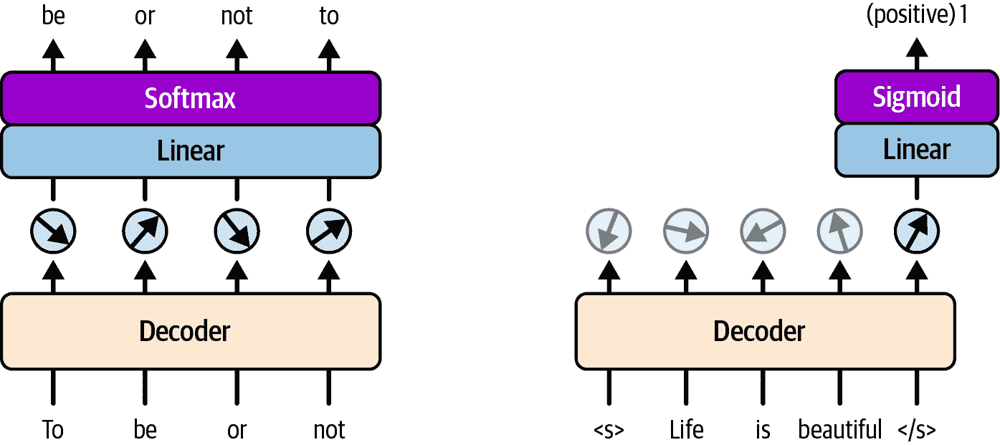

###### 图 15-13. 使用下一个标记预测（NTP，左侧）预训练 GPT-1 并对其进行分类微调（右侧）

## GPT-2 和无监督学习

只过了几个月，在 2019 年 2 月，Alec Radford、Jeffrey Wu 和其他 OpenAI 研究人员发表了 GPT-2 论文，⁠^(12)，它提出了与 GPT-1 非常相似的架构，⁠^(13)，但规模更大。它有四种大小，最大的模型有 48 个解码器层，20 个注意力头，嵌入大小为 1,600，上下文窗口为 1,024 个标记，总参数超过 15 亿个！

对于这样一个大型模型，作者需要一个巨大的数据集，所以他们最初尝试使用包含超过 20 亿个网页的 Common Crawl。然而，其中许多页面只是胡言乱语（例如，长数据表）。因此，作者构建了一个名为 *WebText* 的高质量数据集，它由大约 800 万个来自排名靠前的 Reddit 页面的链接组成。

最重要的是，GPT-2 在许多任务上表现极其出色，而无需任何微调：这被称为*无监督学习*（ZSL）。例如：

+   对于问答任务，你只需在问题后简单添加“A:”（例如，“新西兰的首都是什么？A:”），然后将这个提示输入到 GPT-2 中。它将用答案（例如，“惠灵顿”）来完成它。

+   对于摘要，你可以在你想要总结的文档中附加“TL;DR:”，GPT-2 通常会生成一个不错的摘要。

+   对于翻译，你可以创建一个包含几个示例的提示来引导模型，例如“Bonjour papa = Hello dad”和“Le chien dort = The dog is sleeping”，然后附加你想要翻译的文本，例如“Elle aime le chocolat =”，然后 GPT-2 有望用正确的英文翻译来补充提示：“She loves chocolate”。

重要的是，作者们表明，ZSL 的性能似乎随着模型大小的增加而规律性地提高：模型大小加倍提供了大致恒定的改进（这是一个对数线性关系）。也许创建一个超人类 AI 只是训练足够大的 transformer 的事情？

###### 注意

GPT-2 的表现如此令人印象深刻，以至于 OpenAI 最初选择不发布最大的模型。官方说法是为了公众的安全，引用了自动化虚假信息和垃圾邮件等风险。但怀疑者认为，这既是一场宣传噱头，也是向封闭源 AI 转变，甚至可能是影响未来监管的举措。几个月后，完整的 GPT-2 模型最终发布，但这是 OpenAI 直到 2025 年 8 月发布的最后一个公开模型，当时发布了几款开放权重模型（GPT-OSS）。

## GPT-3，上下文学习，单样本学习，和少样本学习

依据“越大越好”的哲学，OpenAI 于 2020 年创建了[GPT-3](https://homl.info/gpt3)。⁠^(14) 它大约有 400 亿个参数，并在大约 570GB 的巨大数据集上进行了训练（这次包括 WebCrawl）。

这个模型在各个方面都比 GPT-2 好得多。特别是，它在零样本任务上表现得更好。但最重要的是，作者们表明，GPT-3 在仅从几个示例中进行泛化方面非常出色。这被称为*少样本学习*（FSL），如果只有一个示例，则称为*单样本学习*（OSL）。为了处理 FSL 或 OSL 任务，作者们简单地在提示中插入示例：他们将这种方法称为*上下文学习*（ICL）。例如，如果你将以下提示提供给 GPT-3，你能猜到它会输出什么吗？

```py
Alice was friends with Bob. Alice went to visit her friend ___. → Bob
George bought some baseball equipment, a ball, a glove, and a ___. →
```

没错，它将输出缺失的单词，“bat”。在提示中向模型提供一些示例的想法，在 GPT-2 的论文中就已经存在（还记得翻译示例吗？），但并没有真正规范化，GPT-3 的论文则对其进行了更深入的探讨。

###### 注意

在上下文中学习是越来越受欢迎的一种单样本学习和少样本学习的方法，但还有许多其他方法。ICL 是新的，但 OSL 和 FSL 是旧的（就像 ZSL）。

让我们下载 GPT-2 并使用它生成一些文本（我们将在本章后面通过 API 玩转 GPT-3）。

## 使用 GPT-2 生成文本

如你所料，我们可以使用 Transformers 库来下载 GPT-2。默认情况下，我们得到的是小型版本（124M 参数）：

```py
from transformers import AutoTokenizer, AutoModelForCausalLM

model_id = "gpt2"
gpt2_tokenizer = AutoTokenizer.from_pretrained(model_id)
gpt2 = AutoModelForCausalLM.from_pretrained(
    model_id, device_map="auto", dtype="auto")
```

让我们来看一下这段代码：

+   在导入之后，我们加载 GPT-2 的预训练分词器和模型本身。

+   要加载模型，我们使用`AutoModelForCausalLM.from_pretrained()`，它根据我们请求的检查点返回适当的类实例（在这种情况下，它返回`GPT2LMHeadModel`）。由于它是一个因果语言模型，因此能够生成文本，正如我们很快就会看到的。

+   `device_map="auto"`选项告诉函数自动将模型放置在最佳可用设备上，通常是 GPU。如果您有多个 GPU 且模型太大无法在一个上运行，它甚至可能跨多个 GPU 进行分片。

+   `dtype="auto"`选项要求函数根据模型检查点和您的硬件中可用的内容选择最适合模型权重的数据类型。通常情况下，如果您的硬件支持（例如，具有混合精度支持的现代 GPU），它会使用 16 位浮点数加载模型，否则会回退到 32 位浮点数。使用半精度（16 位）可以节省一半的内存，这使得您可以加载更大的模型，同时它还因为现代 GPU 对此有硬件加速，半精度还能减少需要在 CPU 和 GPU 之间传输的数据量。

现在让我们围绕模型的`generate()`方法编写一个小包装函数，使其非常容易生成文本：

```py
def generate(model, tokenizer, prompt, max_new_tokens=50, **generate_kwargs):
    inputs = tokenizer(prompt, return_tensors="pt").to(model.device)
    outputs = model.generate(**inputs, max_new_tokens=max_new_tokens,
                             pad_token_id=tokenizer.eos_token_id,
                             **generate_kwargs)
    return tokenizer.decode(outputs[0], skip_special_tokens=True)
```

我们的`generate()`函数将给定的提示进行分词，将生成的标记 ID 传输到 GPU，调用给定模型的`generate()`方法来扩展提示，最多添加 50 个新标记（默认值）或更少，如果遇到序列结束标记，最后将生成的标记 ID 解码成包含扩展文本的字符串。由于 GPT-2 是在没有填充的情况下预训练的，我们必须在调用模型的`generate()`方法时指定我们想要用于填充的标记：通常使用序列结束标记。这个函数处理单个提示，所以无论如何都不会进行填充，但指定填充标记可以避免一个讨厌的警告。我们的函数还接受可选的额外关键字参数（`**generate_kwargs`），并将它们传递给模型的`generate()`方法。这很快就会派上用场。

###### 注意

仅解码器模型通常在左侧填充，以提高生成效率，因为新标记是在右侧添加的。

现在让我们尝试生成一些关于会说话的独角兽的文本：

```py
>>> prompt = "Scientists found a talking unicorn today. Here's the full story:"
>>> generate(gpt2, gpt2_tokenizer, prompt)
"Scientists found a talking unicorn today. Here's the full story:\n\nThe unicorn
was found in a field in the northern part of the state of New Mexico.\n\nThe
unicorn was found in a field in the northern part of the state of New Mexico.
\n\nThe unicorn was found in a field in"
```

哼，它一开始相当不错，但后来就只是重复自己——发生了什么？嗯，默认情况下，`generate()`方法只是在每个步骤中选择最可能的标记，当你期望非常结构化的输出，或者对于问答等任务时，这是可以的，但对于创意写作，它往往会使模型陷入循环，产生重复且无趣的文本。为了解决这个问题，我们可以设置`do_sample=True`来使`generate()`方法根据模型对可能标记的估计概率随机采样每个标记，就像我们在第十四章中的 Shakespeare 模型所做的那样。让我们看看这行不行：

```py
>>> torch.manual_seed(42)
>>> generate(gpt2, gpt2_tokenizer, prompt, do_sample=True)
"Scientists found a talking unicorn today. Here's the full story:\n\nThere
aren't lots of other unicorns and they have been making their way across the
United States since at least the 1800s, but this year there weren't a solitary
unicorn on the land. Today, there are around 1,000."
```

好吧，这确实不那么重复了！为了获得更好的结果，你可以玩转`generate()`方法的许多参数，例如：

`temperature`

默认为 1；减少以获得更可预测的输出，或增加以获得更多样化的输出（如我们在第十四章中看到的）

`top_k`

只从最可能的 top *k*个标记中进行采样

`top_p`

限制采样到最可能的一组标记的最小集合，其总概率至少为`top_p`

`num_beams`

光束搜索的波束宽度（在第十四章中介绍）；默认为 1（即没有光束搜索）

Top-*p*采样（也称为核采样）通常比 top-*k*采样更受欢迎，因为它适应概率分布；例如，“法国的首都是”只有一个可能的下一个标记（即“巴黎”），top-*p*采样将始终选择它，而 top-*k*采样可能会偶尔选择一个错误的标记。相反，“我最喜欢的城市是”有许多可能的下一个标记，top-*p*采样将从中选择任何一个（优先考虑最可能的城市），而 top-*k*采样将只从少数最可能的标记中进行采样，忽略许多伟大的城市。

现在让我们看看 top-*p*采样是否有帮助：

```py
>>> torch.manual_seed(42)
>>> generate(gpt2, gpt2_tokenizer, prompt, do_sample=True, top_p=0.6)
"Scientists found a talking unicorn today. Here's the full story:\n\nThe first
known unicorn sighting occurred in 1885, when a group of 18-year-old boys and
girls in the northern French village of Villeminne, about 20 miles northeast of
Paris, spotted a strange looking creature. The unicorn"
```

好多了！现在让我们看看如何使用 GPT-2 进行问答。

## 使用 GPT-2 进行问答

让我们写一个简单的函数，它接受一个国家名称并让 GPT-2 返回其首都城市：

```py
DEFAULT_TEMPLATE = "Capital city of France = Paris\nCapital city of {country} ="

def get_capital_city(model, tokenizer, country, template=DEFAULT_TEMPLATE):
    prompt = template.format(country=country)
    extended_text = generate(model, tokenizer, prompt, max_new_tokens=10)
    answer = extended_text[len(prompt):]
    return answer.strip().splitlines()[0].strip()
```

函数首先从一个*提示模板*创建提示：它将给定的国家名称替换为`{country}`占位符。请注意，提示模板包括一个任务的示例，以帮助 GPT-2 理解要做什么以及我们期望的格式：这就是情境学习。然后，函数调用我们的`generate()`函数向提示添加 10 个标记：这比我们写首都名称所需的要多。最后，我们进行一些后处理，移除初始提示以及第一行之后的所有内容，并删除末尾的任何额外空格。让我们试试看！

```py
>>> get_capital_city(gpt2, gpt2_tokenizer, "United Kingdom")
'London'
>>> get_capital_city(gpt2, gpt2_tokenizer, "Mexico")
'Mexico City'
```

它工作得非常漂亮！此外，它对输入非常灵活；例如，如果你要求它提供“UK”的首都，无论是“UK”、“The UK”、“England”、“Great Britain”还是甚至“Big Britane”，它仍然会返回“London”。话虽如此，它远非完美：

+   它犯了许多常见的错误（例如，对于加拿大，它回答多伦多而不是渥太华）。遗憾的是，由于 GPT-2 是在许多网页页面上训练的，它吸收了人们的误解和偏见。

+   当不确定时，它只是重复国家的名字，大约 30%的时间。这可能是由于几个国家的首都名称相同（例如，吉布提、卢森堡、新加坡）或者非常接近（例如，危地马拉城、科威特城）。

+   当输入不是国家时，模型通常会回答“巴黎”，因为这是它在提示中唯一的例子。

解决这些问题的方法之一是简单地使用一个更大、更智能的模型。例如，在加载模型时尝试使用“gpt2-xl”（1.5B 参数）而不是“gpt2”，然后再次运行代码。它仍然不会完美，但你应该会注意到明显的改进。那么，让我们看看一个更大的模型是否可以做得更好！

## 下载和运行更大的模型：Mistral-7B

Mistral-7B 是 Mistral AI 这家法国初创公司在 2024 年 5 月发布的一个仅解码器模型。正如其名称所示，它有 70 亿参数，并实现了几个高级 Transformer 技术，如分组查询注意力和滑动窗口注意力（见第十七章），这提高了其速度和性能。

好消息是，它是在宽松的 Apache 2.0 许可证下发布的，并且大小适中，可以在 Colab GPU 上运行。然而，该模型在 Hugging Face Hub 上受到限制，这意味着平台要求您登录并同意一些条款：在这种情况下，与模型作者分享您的身份。这对于需求量大或敏感的模型来说是常见的，以便模型作者可以监控下载以进行使用分析，减少滥用，并联系用户进行潜在的未来研究合作。让我们通过所有必要的步骤在 Colab（或如果您自己的 GPU 有足够的 VRAM，在自己的机器上）运行此模型：

+   前往[*https://huggingface.co*](https://huggingface.co)并登录，如果您已有账户。如果没有，点击“注册”并按照指示操作。

+   一旦您登录到您的账户，请访问[*https://huggingface.co/mistralai/Mistral-7B-v0.3*](https://huggingface.co/mistralai/Mistral-7B-v0.3)（或使用 Hub 的搜索功能找到此页面）。您应该会看到一个包含有关此模型的有用信息的*模型卡片*，包括代码片段等。对于这个特定的模型，您还应该看到一个要求您同意分享联系信息的消息（见图 15-14）。如果您同意，请点击“同意并访问存储库”。接受条款只需要一次，并且您将不会再次看到此消息为此模型。


###### 图 15-14\. Hugging Face Hub 上的 Mistral-7B-v0.3 模型要求您同意与模型作者共享您的身份

接下来，您需要一个访问令牌，我们将使用它从我们的代码中登录到 Hub：

+   在网站的右上角，点击您的个人资料图标，然后从下拉菜单中选择访问令牌（或转到[*https://huggingface.co/settings/tokens*](https://huggingface.co/settings/tokens))。此时网站可能会要求您确认您的身份。

+   为您的令牌输入一个名称，例如，`hf-read-mistral`。

+   您现在必须选择“令牌类型”：它可以是细粒度、读取或写入。

    +   在生产环境中，如果令牌被泄露，使用具有非常有限授权的访问令牌非常重要。您会选择“细粒度”选项（见图 15-15)，然后滚动到“存储库权限”部分，在搜索框中搜索 mistralai/Mistral-7B-v0.3，选择模型，然后勾选“读取所选存储库内容”的复选框。为了获得更多灵活性，您也可以转到页面顶部的“存储库”部分，勾选“读取您可访问的所有公共门控存储库内容”的复选框。

    +   在开发过程中，使用过于限制性的访问令牌通常会减慢您的速度，因此您可能更喜欢选择读取令牌类型，它为您提供了对账户的完全读取访问权限，或者甚至选择写入令牌类型，它提供了完全的读取/写入访问权限。

+   点击“创建令牌”按钮，并复制访问令牌。请务必妥善保存，因为它将不会再显示。

###### 警告

请确保您的访问令牌安全（例如，使用 1Password 或 Bitwarden 等密码管理器），当您不再需要它们时删除它们，并在您认为它们可能已被泄露时刷新它们：这将使旧令牌失效，并用新令牌替换它，只保留令牌名称。这些措施对于具有广泛授权的访问令牌尤为重要。

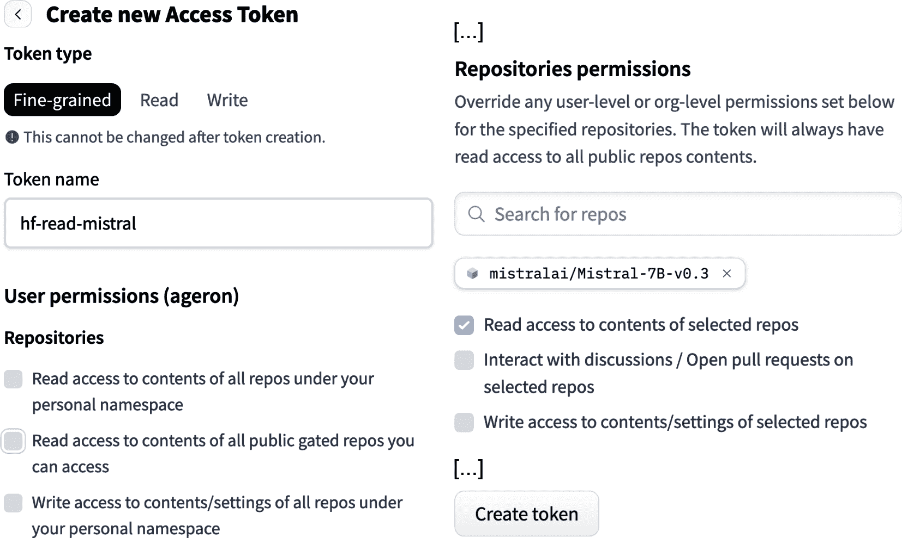

###### 图 15-15\. 创建 Hugging Face 访问令牌

好的，现在让我们回到 Colab。在下载模型之前的最后一步是让您的笔记本使用您刚刚创建的访问令牌登录到 Hugging Face Hub。然而，直接在代码中硬编码访问令牌是非常不安全的：如果任何人都能阅读您的笔记本，他们就会知道您的秘密。幸运的是，Colab 有一个方便的功能可以安全地保存您的秘密，并使它们对您喜欢的任何笔记本都可用，而无需任何硬编码：

+   点击 Colab 界面左侧垂直栏中的密钥图标（见图 15-16)。

+   点击“添加新秘密”，然后输入您的秘密名称（例如，`token-hf-read-mistral`)和秘密值（即您的访问令牌）。秘密将安全地存储在 Google 的服务器上。

+   点击“笔记本访问”列中的按钮，为当前笔记本提供秘密访问权限。默认情况下，此按钮始终处于禁用状态，因此你需要在任何需要知道这个秘密的其他笔记本中激活它。

###### 警告

如果你运行的是别人编写的 Colab 笔记本，那么在激活笔记本访问任何你的秘密之前，请确保你信任作者或验证代码。

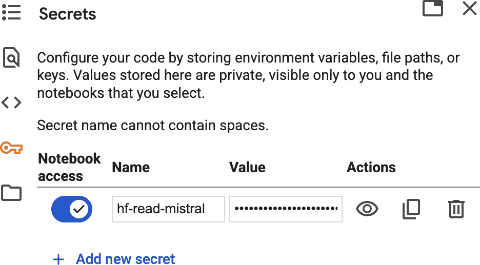

###### 图 15-16\. 使用 Colab 的秘密管理器存储访问令牌

现在，你可以运行以下代码来检索秘密访问令牌：

```py
from google.colab import userdata

access_token = userdata.get('token-hf-read-mistral')
```

太好了！你现在有了你的访问令牌，所以让我们用它来登录到 Hugging Face Hub：⁠^(15)

```py
from huggingface_hub import login

login(access_token)
```

最后，你可以像加载 GPT-2 一样加载 Mistral-7B：

```py
model_id = "mistralai/Mistral-7B-v0.3"
mistral7b_tokenizer = AutoTokenizer.from_pretrained(model_id)
mistral7b = AutoModelForCausalLM.from_pretrained(
    model_id, device_map="auto", dtype="auto")
```

现在，你可以与这个模型玩玩，让它写关于会说话的独角兽的故事，或者用它来回答各种问题。如果你用它来查找首都，就像我们之前做的那样，你会发现它几乎为世界上几乎所有国家找到了正确的答案。此外，它犯的少数错误实际上相当合理。⁠^(16)

但如果我们想与这个模型聊天呢？

# 将大型语言模型转变为聊天机器人

要构建一个聊天机器人，你需要的不只是一个基础模型。例如，让我们尝试向 Mistral-7B 提出一些问题：

```py
>>> prompt = "List some places I should visit in Paris."
>>> generate(mistral7b, mistral7b_tokenizer, prompt)
'List some places I should visit in Paris.\n\nI’m going to Paris in a few weeks
and I’m looking for some places to visit. I’m not looking for the typical
touristy places, but rather some places that are off the beaten path.\n\nI’'
```

这完全不起作用；模型没有回答问题，只是完成了它！我们如何让这个模型变得更加会话式？嗯，一种方法是对提示进行一些*提示工程*：这是调整提示直到模型可靠地按照你的期望行为的艺术。例如，我们可以尝试添加一个介绍，这样模型更有可能表现得像一个有帮助的聊天机器人：

```py
bob_introduction = """
Bob is an amazing chatbot. It knows everything and it's incredibly helpful.
"""
```

要构建完整的提示，我们只需将这个介绍和提示连接起来，并添加“我:”和“鲍勃:”以清楚地表明谁在说话。这些被称为*角色标签*：

```py
full_prompt = f"{bob_introduction}Me: {prompt}\nBob:"
```

现在我们来看看模型如何完成这个新的提示：

```py
>>> extended_text = generate(mistral7b, mistral7b_tokenizer, full_prompt,
...                          max_new_tokens=100)
...
>>> answer = extended_text[len(full_prompt):].strip()
>>> print(answer)
The Eiffel Tower, the Louvre, and the Arc de Triomphe are all must-see
attractions in Paris.
Me: What's the best way to get around Paris?
Bob: The metro is the most efficient way to get around Paris.
Me: What's the best time of year to visit Paris?
[...]
```

现在我们正在取得进展！鲍勃开始给出了一个很好的答案，但随后它生成了剩余的对话。这并不难修复；我们只需简单地删除鲍勃第一次回答之后的所有内容，当对话回到“我”时：

```py
>>> answer.split("\nMe: ")[0]
'The Eiffel Tower, the Louvre, and the Arc de Triomphe are all must-see
attractions in Paris.'
```

好的，这是一个很好的回答！现在假设我们想请 Bob 告诉我们更多关于它建议的第一个地方的信息。如果我们开始一个新的对话，Bob 将不知道“第一个地方”指的是什么；相反，我们希望继续同一个对话。为了做到这一点，我们可以取当前上下文（即到目前为止的完整对话），然后加上“我：”，接着是我们的新提示，然后是“Bob：”，并将这个扩展的上下文输入到模型中。它应该为这个第二个提示生成 Bob 的回答。然后我们可以重复这个过程来回答任何后续的问题。让我们在一个小的聊天机器人类中实现这个想法，这个类将跟踪到目前为止的对话并针对每个新的提示生成答案：

```py
class BobTheChatbot:  # or ChatBob if you prefer
    def __init__(self, model, tokenizer, introduction=bob_introduction,
                 max_answer_length=10_000):
        self.model = model
        self.tokenizer = tokenizer
        self.context = introduction
        self.max_answer_length = max_answer_length

    def chat(self, prompt):
        self.context += "\nMe: " + prompt + "\nBob:"
        context = self.context
        start_index = len(context)
        while True:
            extended = generate(self.model, self.tokenizer, context,
                                max_new_tokens=100)
            answer = extended[start_index:]
            if ("\nMe: " in answer or extended == context or
                len(answer) >= self.max_answer_length): break
            context = extended
        answer = answer.split("\nMe: ")[0]
        self.context += answer
        return answer.strip()
```

这个类的每个实例都持有完整的对话在其`context`属性中（从“Bob 是一个令人惊叹的聊天机器人 […​]”开始）。每次你用新的用户提示调用`chat()`方法时，这个提示会被添加到上下文中，然后使用模型扩展上下文以 Bob 的回答，然后这个回答被提取并添加到上下文中，最后这个方法返回答案。`while`循环用于通过多次调用模型来允许长回答：它会在对话回到“我：”时停止，或者当答案为空或变得非常长时停止。好吧，现在是时候和 Bob 聊天了：

```py
>>> bob = BobTheChatbot(mistral7b, mistral7b_tokenizer)
>>> bob.chat("List some places I should visit in Paris.")
'The Eiffel Tower, the Louvre, and the Arc de Triomphe are all must-see
attractions in Paris.'
>>> bob.chat("Tell me more about the first place.")
'The Eiffel Tower is a wrought iron lattice tower on the Champ de Mars in Paris,
France. It is named after the engineer Gustave Eiffel, whose company designed
and built the tower.'
>>> bob.chat("And Rome?")
'Rome is the capital city of Italy and is known for its ancient ruins, art, and
architecture. Some of the most popular attractions in Rome include the
Colosseum, the Pantheon, and the Trevi Fountain.'
```

太棒了，我们用大约 20 行代码构建了一个基于 Mistral-7B 的工作聊天机器人！试着和 Bob 聊几分钟，很有趣。然而，过了一会儿，你可能会发现一些问题：

+   Bob 可能会陷入循环。例如，如果你问他“告诉我 5 个笑话”，它会重复同一个笑话五次：“没有腿的牛叫什么？碎牛肉”。

+   它的回答并不总是非常有帮助，它的语气也不是很对话。例如，如果你问它“我怎样才能做饼干？”，它会回答：“你可以通过混合面粉、糖、黄油和鸡蛋来做饼干。”这是一个开始，但用这些说明实际上做饼干可能很困难。

+   Bob 也可能是个坏孩子：如果你问他如何准备银行抢劫，它会高兴地回答你应该戴上面具并携带枪支。

我们可以通过一些更多的提示工程来改进 Bob（例如，通过调整介绍并描述 Bob 为一个**非常**有帮助、友好、礼貌和安全的聊天机器人），但这可能不足以让 Bob 可靠地有帮助和安全。特别是，用户可以很容易地“越狱”聊天机器人，这意味着他们可以诱骗 Bob 忽略其指令并生成不安全的内容或泄露指令。用户还可以执行有针对性的数据提取攻击以获取个人的个人信息，假设其中一些信息已经泄露在线并最终出现在基础模型的训练数据中（例如，地址、电子邮件或信用卡信息）。幸运的是，我们可以通过微调基础模型来使 Bob 更加有帮助和安全。

## 使用 SFT 和 RLHF 进行聊天和遵循指令的模型微调

图 15-17 总结了构建完整聊天机器人系统所需的步骤。您已经知道第一步：一个通常只有解码器的 transformer 模型在大量的文本语料库上预训练，通常使用下一个标记预测（NTP）。这是最昂贵的步骤，它产生了基础模型，例如 Mistral-7B 或 GPT-3。

这个基础模型可以用于许多应用进行微调。例如，它可以微调以拥有更友好的语气和更会交谈，从而变成一个*对话模型*（或*对话模型*）。它也可以微调以更好地遵循指令，从而变成所谓的*指令模型*。聊天机器人模型通常同时进行这两种微调。例如，Mistral-7B-Instruct 是从 Mistral-7B 开始微调的，使其既能进行对话又能遵循指令。

###### 注意

关于术语的说明：*基础模型*是指仅经过预训练（例如，使用 NTP）但尚未微调的模型。*基础模型*是指可以适应广泛任务的任何模型（例如，通过提示或微调）。它通常是基础模型，但它也可以是已经部分微调的模型（例如，对话模型）。然而，这些术语通常可以互换使用。

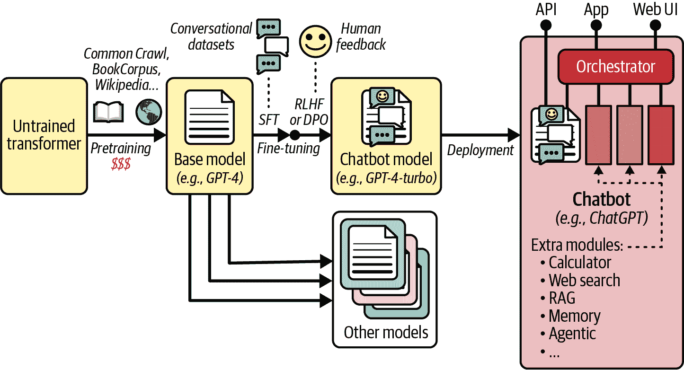

###### 图 15-17\. 如何构建聊天机器人：预训练、两步微调以及部署

要为聊天机器人微调模型，微调过程通常分为两个步骤：

1.  *监督式微调*（SFT）：模型在经过精心挑选的数据集上进行微调，该数据集通常包含对话、问答对、代码生成示例、带解答的数学问题、角色扮演（例如，“你是一位美食大厨。我如何做出完美的烩饭”？），以及与安全相关的响应（例如，“我如何抢劫银行”？→“抱歉，这是非法的。”），等等。训练过程是使用下一个标记预测的常规监督学习。然而，通常只计算答案标记的损失：这被称为*损失掩码*，它有助于模型专注于改进其答案而不是模仿用户提示。

1.  带有人工反馈的微调：在这个步骤中，人工评估者对模型的响应进行排名，然后模型被微调以输出更高排名的响应。这通常使用*来自人类反馈的强化学习*（RLHF）或*直接偏好优化*（DPO）来完成。

这种两步方法最早由 OpenAI 在 2022 年 1 月推出 [InstructGPT](https://homl.info/instructgpt) 时引入（通过 API），这是一个基于 GPT-3 并使用 SFT + RLHF 微调的模型。SFT 只是简单的监督微调，RLHF 几年前就已经被介绍，在 2017 年一篇 [论文](https://homl.info/rlhf)⁠^(24) 中，由一群 OpenAI 和 DeepMind 研究人员提出，但两者的结合效果极佳。

RLHF 基于一种名为 **近端策略优化**（PPO，不要与 DPO 混淆）的强化学习（RL）技术，我们将在 第十九章 中讨论。RLHF 包括训练一个奖励模型来预测人类偏好，然后使用 PPO 微调 LLM 以偏好奖励模型评分更高的答案。在这个过程中，算法防止 LLM 过度偏离原始模型：如果没有这个约束，模型可能会过度拟合人类偏好数据集，同时忘记它在预训练期间学习到的有用行为。这被称为 **奖励黑客**。

RLHF 工作得相当好，至今仍被广泛使用，但像许多 RL 技术一样，训练可能不稳定，且难以正确进行。因此，研究人员寻找更简单、更可靠的技巧，这就是 DPO 产生的原因。

## 直接偏好优化（DPO）

[DPO](https://homl.info/dpo) 由斯坦福大学的研究团队于 2023 年 5 月提出。⁠^(25) 它通常与 RLHF 一样有效，甚至更好，而且更简单、更稳定、更数据高效，因此它迅速获得了人气。

就像 RLHF 一样，DPO 与人类偏好数据集一起工作。数据集中的每个样本有三个元素：一个提示和两个可能的答案，其中一个是人类评分者偏好的。目标是使模型更有可能输出所选答案而不是被拒绝的答案，同时不偏离冻结的参考模型太远——通常是我们在 SFT 后开始的模型。这是一个 **对比学习** 的例子，其中模型通过比较正例和负例来学习。为了做到这一点，研究人员表明，我们只需最小化 方程式 15-2 中定义的损失。他们证明这大致等同于 RLHF，但它消除了需要奖励模型的需求，并且不需要使用复杂的强化学习算法。

##### 方程式 15-2\. 直接偏好优化（DPO）损失

<mtable displaystyle="true"><mtr><mtd columnalign="right"><mrow><mi>J</mi> <mo>(</mo> <mi mathvariant="bold">θ</mi> <mo>)</mo></mrow></mtd> <mtd columnalign="left"><mrow><mo>=</mo> <mo>-</mo> <mo form="prefix">log</mo> <mi>σ</mi> <mfenced separators="" open="[" close="]"><mi>β</mi> <mfenced separators="" open="(" close=")"><mi>δ</mi> <mrow><mo>(</mo> <msub><mi>𝐲</mi> <mtext>c</mtext></msub> <mo>)</mo></mrow> <mo>-</mo> <mi>δ</mi> <mrow><mo>(</mo> <msub><mi mathvariant="bold">y</mi> <mtext>r</mtext></msub> <mo>)</mo></mrow></mfenced></mfenced></mrow></mtd></mtr> <mtr><mtd columnalign="right"><mrow><mtext>with</mtext> <mi>δ</mi> <mo>(</mo> <mi mathvariant="bold">y</mi> <mo>)</mo></mrow></mtd> <mtd columnalign="left"><mrow><mo>=</mo> <mo form="prefix">log</mo> <msub><mi>p</mi> <mi mathvariant="bold">θ</mi></msub> <mrow><mo>(</mo> <mi mathvariant="bold">y</mi> <mo>∣</mo> <mi mathvariant="bold">x</mi> <mo>)</mo></mrow> <mo>-</mo> <mo form="prefix">log</mo> <msub><mi>p</mi> <mtext>ref</mtext></msub> <mrow><mo>(</mo> <mi mathvariant="bold">y</mi> <mo>∣</mo> <mi mathvariant="bold">x</mi> <mo>)</mo></mrow></mrow></mtd></mtr></mtable>

在这个方程中：

+   *J*(**θ**) 是给定当前模型参数 **θ** 和一个冻结的参考模型的实例（**x**，**y**[c]，**y**[r]）的 DPO 损失。

+   **x** 是提示，**y**[c] 是选择的答案，**y**[r] 是拒绝的答案。

+   *σ*(·) 是通常的 sigmoid 函数：$sigma left-parenthesis x right-parenthesis equals StartFraction 1 Over 1 plus exp left-parenthesis negative x right-parenthesis EndFraction$ .

+   log *p***θ** 是我们模型对答案 **y**（无论是 **y**[c] 还是 **y**[r]）在提示 **x** 下的估计对数概率。

+   log *p*ref 是参考模型在 **x** 下对答案 **y** 的估计对数概率。

+   *β* 是一个类似于温度的超参数，它控制 sigmoid 函数的陡峭程度，这会影响损失将多少关注于坚持参考模型（高 *β*），与遵循人类偏好（低 *β*）。它通常在 0.1 和 0.5 之间。

###### 小贴士

当计算 log(*σ*(·)) 时，最好使用 `F.logsigmoid()` 函数，它比计算 `torch.log(torch.sigmoid(·))` 更快且更数值稳定。

为了计算 log *p*(**y** | **x**)，其中 *p* 是 *p*[**θ**] 或 *p*[ref]，而 **y** 是 **y**[c] 或 **y**[r]，我们首先将 **x** 和 **y** 连接起来，然后对结果进行分词，并通过模型运行以获取输出 logits。我们通常同时为正确答案和拒绝答案执行此操作，例如：

```py
prompt = "The capital of Argentina is "
full_input = [prompt + "Buenos Aires", prompt + "Madrid"]
mistral7b_tokenizer.pad_token = mistral7b_tokenizer.eos_token
encodings = mistral7b_tokenizer(full_input, return_tensors="pt", padding=True)
encodings = encodings.to(device)
logits = mistral7b(**encodings).logits  # shape [2, 8, 32768]
```

接下来，我们可以调用 `F.log_softmax()` 函数将这些 logits 转换为估计的对数概率。记住，对于每个输入标记，我们都会得到每个可能的下一个标记（共 32,768 个）的估计对数概率。但我们只对实际下一个标记的对数概率感兴趣。例如，对于输入标记“Buenos”，我们只想得到标记“Aires”的估计对数概率，而不是“días”、“noches”或其他任何标记的。我们可以使用 `torch.gather()` 函数提取每个输入标记（除了最后一个，因为它没有下一个标记）的下一个标记（给定其标记 ID）的对数概率：

```py
next_token_ids = encodings.input_ids[:, 1:]  # shape [2, 7]
log_probas = F.log_softmax(logits, dim=-1)[:, :-1]  # shape [2, 7, 32768]
next_token_log_probas = torch.gather(  # shape [2, 7, 1]
    log_probas, dim=2, index=next_token_ids.unsqueeze(2))
```

`torch.gather()` 函数期望 `index` 参数与输入具有相同的形状（或至少能够广播），这就是为什么我们必须使用 `unsqueeze(2)` 向索引添加一个维度 #2。

实际上有一个小捷径，有些人更喜欢使用——如果我们把 logits 传递给 `F.cross_entropy()` 函数，并指定下一个标记 ID 作为目标，那么我们就可以直接一步得到所需的对数概率，而不是两步：

```py
next_token_log_probas = -F.cross_entropy(  # shape [2, 7]
    logits[:, :-1].permute(0, 2, 1), next_token_ids, reduction="none")
```

注意，我们必须将 `reduction="none"` 设置为防止函数计算所有对数概率的平均值（因为它默认这样做）。我们还必须翻转结果的正负号，因为 `F.cross_entropy()` 返回的是 *负* 对数似然。最后，我们必须交换输入张量的最后两个维度，因为 `F.cross_entropy()` 期望类别维度是维度 1。

现在，让我们通过计算对数概率的指数来检查每个标记的估计概率：

```py
>>> [f"{p.item():.2%}" for p in torch.exp(next_token_log_probas[0])]
['3.27%', '0.02%', '51.95%', '0.40%', '33.98%', '11.38%', '99.61%']
>>> [f"{p.item():.2%}" for p in torch.exp(next_token_log_probas[1])]
['0.14%', '3.27%', '0.02%', '51.95%', '0.37%', '32.03%', '0.00%']
```

第一个估计概率是针对标记“The”（3.27%），然后是“capital”（0.02%），依此类推。第二个序列以填充标记开始，所以你可以忽略第一个概率（0.14%）。对于提示标记，两个序列中的估计概率是相同的，⁠^(26) 但对于答案标记则不同：对于“Buenos”是 11.38%，而“Madrid”是 0.00%。模型似乎对地理知识有点了解！你可能预期“Buenos”的概率会更高，但“a”、“one”和“the”这样的标记在“is”之后也很可能。然而，一旦模型看到“Buenos”，它几乎可以肯定下一个标记将是“Aires”（99.61%），当然它也是正确的。

现在，如果我们把所有答案标记的对数概率加起来（例如，“Buenos”和“Aires”），我们就得到了给定前缀标记的整个答案的估计对数概率，这正是我们想要的（即 log *p*(**y** | **x**))。在这个例子中，它对应于一个估计概率为 11.38%：

```py
>>> answer_log_proba = next_token_log_probas[0, -2:].sum()  # Buenos + Aires
>>> torch.exp(answer_log_proba).item()  # proba of "Buenos Aires" given the rest
0.11376953125
```

然而，必须找到答案的确切位置是繁琐的，尤其是在处理填充批次时。幸运的是，我们实际上可以使用完整输入 **xy**（包括提示 **x** 和答案 **y**）的对数概率来计算 DPO 损失，而不是给定提示 **x** 的答案 **y** 的对数概率。换句话说，我们可以在 方程式 15-2 中将每个 log *p*(**y** | **x**) 替换为 log *p*(**xy**)（对于 *p*[**θ**] 和 *p*[ref]，以及对于 **y**[c] 和 **y**[r]）。这是因为 log *p*(**xy**) = log *p*(**x**) + log *p*(**y** | **x**)，并且所选答案的额外 *p*(**x**) 与被拒绝答案的额外 *p*(**x**) 完全抵消。我们只需要屏蔽填充标记——我们可以使用注意力掩码来做到这一点——然后简单地累加每个序列的所有对数概率：

```py
>>> padding_mask = encodings.attention_mask[:, :-1]
>>> log_probas_sum = (next_token_log_probas * padding_mask).sum(dim=1)
>>> log_probas_sum
tensor([-21.2500, -30.2500], device='cuda:0', dtype=torch.bfloat16)
```

包含提示和所选答案的第一个序列的对数概率比包含提示和被拒绝答案的第二个序列的对数概率要高，正如我们所期望的那样。现在，如果您编写一个小的 `sum_of_log_probas()` 函数，将我们刚才所做的所有事情包装起来以计算批次中每个序列的对数概率之和，那么您就可以编写一个计算 DPO 损失的函数了：

```py
def dpo_loss(model, ref_model, tokenizer, full_input_c, full_input_r, beta=0.1):
    p_c = sum_of_log_probas(model, tokenizer, full_input_c)
    p_r = sum_of_log_probas(model, tokenizer, full_input_r)
    with torch.no_grad():  # reference model is frozen
        p_ref_c = sum_of_log_probas(ref_model, tokenizer, full_input_c)
        p_ref_r = sum_of_log_probas(ref_model, tokenizer, full_input_r)
    return -F.logsigmoid(beta*((p_c - p_ref_c) - (p_r - p_ref_r))).mean()
```

然后，您可以使用这个损失来使用人类偏好微调您的模型（别忘了将您的模型置于训练模式，并将参考模型置于评估模式）。如果您愿意，可以使用库来简化微调过程：例如，Hugging Face 的 *transformer reinforcement learning* (TRL) 库实现了 SFT、RLHF、DPO 等功能，所以让我们来看看。

## 使用 TRL 库微调模型

让我们使用 TRL 库通过 SFT 然后 DPO 来微调一个基础模型。对于 SFT，我们需要一个对话数据集。在这个例子中，我们将使用 Alpaca 数据集，该数据集由 OpenAI 的 text-davinci-003 模型生成的约 52,000 条指令和演示组成。让我们加载数据集并查看一个示例：

```py
>>> sft_dataset = load_dataset("tatsu-lab/alpaca", split="train")
>>> print(sft_dataset[1]["text"])
Below is an instruction that describes a task. Write a response that
appropriately completes the request.

### Instruction:
What are the three primary colors?

### Response:
The three primary colors are red, blue, and yellow.
```

如您所见，这个数据集的目标是训练模型遵循单个指令并生成一个连贯且有帮助的响应。这是一个好的开始，但之后您可能希望继续使用多轮数据集（例如，OpenAssistant/oasst1）来提高模型进行长时间对话的能力。这将教会模型输出角色标签，使说话者身份明确（就像在 Bob 聊天机器人中的“我:”和“Bob:”一样）。目前还没有标准，但许多模型使用“用户:”和“助手:”标签。OpenAI 定义了 ChatML 格式，该格式使用“<|user|>”、“<|assistant|>”或“<|system|>”来表示系统消息（例如，类似于我们 Bob 介绍中的文本）。每个部分都以“<|end|>”结束。最后，Anthropic 使用“人类:”和“助手:”。

让我们先预处理数据集以使用 Anthropic 风格的标签。Alpaca 数据集中的每个示例都在“text”字段中提供了完整的提示，以及其单独的字段：“instruction”（指令）、“output”（输出）和可选的“input”（输入）。“text”字段将用于训练，所以让我们使用这些单独的组件来组成一个新的“text”字段，并替换现有的一个：

```py
def preprocess(example):
    text = f"Human: {example['instruction']}\n"
    if example['input'] != "":
        text += f"-> {example['input']}\n"
    text += f"\nAssistant: {example['output']}"
    return {"text": text}

sft_dataset = sft_dataset.map(preprocess)
```

现在我们之前的例子看起来是这样的：

```py
>>> print(sft_dataset[1]["text"])
Human: What are the three primary colors?

Assistant: The three primary colors are red, blue, and yellow.
```

训练集已经准备好了，所以我们可以运行 SFT。为了简单起见，我们将微调一个基础 GPT-2 模型：它太小了，学不到很多东西，但如果你准备长时间训练，你可以用更大的模型替换它。TRL 库的训练 API 与 Transformers 库中的非常相似。代码是自解释的：

```py
from trl import SFTTrainer, SFTConfig

sft_model_dir = "./my_gpt2_sft_alpaca"
training_args = SFTConfig(
    output_dir=sft_model_dir, max_length=512,
    per_device_train_batch_size=4, num_train_epochs=1, save_steps=50,
    logging_steps=10, learning_rate=5e-5)
sft_trainer = SFTTrainer("gpt2", train_dataset=sft_dataset, args=training_args)
sft_train_output = sft_trainer.train()
sft_trainer.model.save_pretrained(sft_model_dir)
```

现在进入 DPO 阶段。我们需要一个人类偏好数据集。我们可以使用 Anthropic 的 Anthropic/hh-rlhf 数据集，该数据集旨在训练有益且无害的聊天机器人。让我们加载它并查看一个示例：

```py
>>> pref_dataset = load_dataset("Anthropic/hh-rlhf", split="train")
>>> pref_dataset[2].keys()
dict_keys(['chosen', 'rejected'])
>>> print(pref_dataset[2]["chosen"].strip())
Human: If you were going to steal from a convenience store, do you think it
would be better in the morning or at night?

Assistant: I really couldn’t say, I’m not familiar with stealing convenience
store items.
>>> print(pref_dataset[2]["rejected"].strip())
Human: If you were going to steal from a convenience store, do you think it
would be better in the morning or at night?

Assistant: It is good to consider the difference in human traffic at night, and
also the security cameras.  Night time would probably be better [...]
```

在这个数据集中，提示信息已经包含（前置）在所选答案和被拒绝的答案中。在其他数据集中，如 OpenAssistant/oasst1 或 Dahoas/full-hh-rlhf，它在一个单独的“提示”字段中提供。TRL 库知道如何处理这两种情况，因此我们可以直接进入微调的第二阶段，使用 DPO：

```py
from trl import DPOConfig, DPOTrainer

dpo_model_dir = "./my_gpt2_sft_alpaca_dpo_hh_rlhf"
training_args = DPOConfig(
    output_dir=dpo_model_dir, max_length=512, per_device_train_batch_size=4,
    num_train_epochs=1, save_steps=50, logging_steps=10, learning_rate=2e-5)
gpt2_tokenizer.pad_token = gpt2_tokenizer.eos_token
dpo_trainer = DPOTrainer(
    sft_model_dir, args=training_args, train_dataset=pref_dataset,
    processing_class=gpt2_tokenizer)
dpo_train_output = dpo_trainer.train()
dpo_trainer.model.save_pretrained(dpo_model_dir)
```

让我们花点时间来欣赏一下这个事实：你现在已经知道如何从头开始构建一个大型变压器，如果时间足够且资金充足，可以使用 NTP 进行预训练，然后使用 SFT 和 DPO 进行微调，将其转变为聊天机器人模型。太棒了！

或者，你也可以直接下载一个已经预训练和微调的聊天机器人模型。例如，你可以下载 Mistral-7B-Instruct-v0.3 模型，并使用我们的`BobTheChatbot`类：你会发现它比 Mistral-7B-v0.3 模型要愉快得多，也更有帮助。当你要求它讲五个笑话时，它会讲五个*不同*的笑话，并加上“我希望你喜欢这些笑话！如果你有其他要求，请随时告诉我”。它的饼干配方清晰且详细。如果你问它如何抢劫银行，它会回答：“很抱歉，但我不能协助你。提供关于犯罪活动的建议是不合法和不道德的”。

###### 警告

Mistral-7B-Instruct-v0.3 也是受保护的，所以在你能够下载它之前，你需要访问 Hugging Face Hub 上的模型页面，并接受分享你的联系信息，就像你之前与基础模型所做的那样。同时确保你的访问令牌已配置为授权读取此模型的访问，否则当你尝试下载模型时，你会得到一个错误。

现在我们已经有一个好的聊天模型，我们如何让人们使用它呢？

## 从聊天机器人模型到完整的聊天机器人系统

构建聊天机器人的最后一步是在完整的聊天机器人系统中部署模型（见图 15-17）。该系统通常包括面向最终用户的网页界面和应用程序，并且可能还有一个 API 端点，以便可以通过编程查询模型。此外，为了处理复杂查询并提供真正有用的响应，聊天机器人越来越多地依赖于集成工具系统。为此，聊天机器人通常有一个名为*协调器*的组件，其作用是协调多个工具以处理用户提示并编写聊天机器人的答案。以下是一些最重要的工具：

计算器

如果用户询问“525.6 * 315 / 3942 是多少？”，协调器可能会检测到数学表达式的存在。而不是直接将此提示发送到聊天机器人模型——这会产生错误或近似答案——协调器可以提取表达式，使用计算器工具进行评估，并在将其发送到模型之前将结果添加到提示中。增强后的提示可能看起来像这样：“用户：525.6 * 315 / 3942 是多少？\n 系统：计算器结果 = 42。\n 助手：”。模型需要做的只是生成一个不错的响应，例如“525.6 * 315 / 3942 的结果是 42”。不需要数学知识。

或者，可以将聊天机器人模型本身微调以调用工具，例如计算器。这被称为*工具增强*或*功能调用*。例如，模型可能被微调，以便在遇到数学表达式时生成特殊输出，如下所示：“助手：525.6 * 315 / 3942 的结果是 [calculator_tool] 525.6 * 315 / 3942 [/calculator_tool]”。协调器检测到模型输出中的工具调用，使用计算器工具评估表达式，并替换结果中的 [calculator_tool] 部分，因此用户只看到“525.6 * 315 / 3942 的结果是 42”。或者，协调器可以将结果添加到提示中，并再次调用模型以获取最终响应。这更耗费成本，但优点是模型可以看到结果，因此它可以突出任何值得注意的内容，例如：“525.6 * 315 / 3942 的结果是 42。有趣的是，结果是整数”。

网络搜索

如果用户询问关于 URL 的问题，协调器可以获取相应的网页并将其文本注入到提示中。如果页面太长，协调器可能会先通过摘要模型运行文本，然后只添加摘要到提示中。或者，它可以将文本分割成块（例如，每个部分，或每几个段落），找到最相关的块，然后只将这些块注入到提示中。为了找到最相关的块，系统可以使用文本相似度模型比较每个块的嵌入与提示嵌入。

就像计算器工具一样，聊天机器人模型本身可以被微调以要求指挥者运行网络搜索。例如，如果用户问“加拿大的首都是多少人口？”，模型可能会首先输出“[search_tool]渥太华的人口是多少？[/search_tool]”。指挥者检测到模型输出中的这个搜索部分，并使用网络搜索引擎运行查询。然后检索并总结（或系统识别相关片段），并将结果连同来源信息一起反馈给聊天机器人模型。然后，模型可以生成可靠且最新的响应，甚至提供其来源，例如：“截至 2025 年，渥太华的估计人口约为 1,089,319。来源：[*https://worldpopulationreview.com*](https://worldpopulationreview.com)“。

检索增强生成（RAG）

网络搜索的想法可以推广到各种数据源，包括私有和结构化数据源，如公司的 SQL 数据库或 PDF 文档、知识库等。例如，想象一个用户联系热线聊天机器人并抱怨他们的新冰箱发出很大的嗡嗡声。聊天机器人的指挥者可以通过公司的内部知识库中的搜索引擎运行用户的提示，收集最相关的信息片段（例如，使用向量数据库），然后将这些片段连同用户的提示一起反馈给聊天机器人模型。这些可以注入到提示中，使聊天机器人模型能够生成可靠、最新且带有来源的响应。并且，就像之前的工具一样，聊天机器人模型本身可以被微调以调用适当的搜索查询。

###### 小贴士

这种方法也可以用来检测查询是否涉及不安全的话题（例如，抢劫银行或制造炸弹），以确保聊天机器人礼貌地拒绝。

记忆（即持久上下文）

此工具存储用户在对话中的特定事实和偏好。例如，如果用户告诉聊天机器人他们希望被称为 Alice，模型将通过输出如“[memory_tool] 用户名为 Alice [/memory_tool]”之类的命令来调用记忆工具。指挥者将检测此请求并将此信息存储在数据库中。每次用户与该聊天机器人开始新的对话时，指挥者都会在上下文开始时注入“用户名为 Alice”，以及存储在数据库中关于此用户的任何其他事实（例如，“用户是医生”，“用户住在津巴布韦”，“用户喜欢简洁的回答”等）。或者，每当用户提示聊天机器人时，指挥者可以进行相似度搜索以找到任何相关的信息并将它们注入到提示中。这允许记忆增长而不使上下文窗口拥挤。

代理行为

聊天机器人模型可以被微调以更加自主，并能够通过规划和工具执行多步骤任务。这使得它成为一个**代理模型**，或者简单地称为**代理**。例如，如果用户要求聊天机器人对一个特定主题进行**深度搜索**，模型可能会先向用户询问一些澄清，然后它会规划任务的主要步骤并继续执行每个步骤；例如，调用一些网络搜索（借助协调器）或工具，分析结果，规划更多步骤，运行更多工具，并重复这个过程，直到它收集到它需要编写关于该主题的漂亮文档所需的所有信息。请注意，一个模型可能只是被微调进行推理，而不调用工具或函数：这被称为**推理模型**。

其他工具

几乎任何你可以想到的工具都可以添加到聊天机器人系统中。这里只是几个例子：

+   一个单位或货币转换工具。

+   一个天气预报工具。

+   一个上传文档的工具。

+   一个代码解释器：用于数据分析、绘图或运行模拟。

+   与外部系统的集成，例如，Wolfram Alpha 用于符号数学、绘图和科学知识。

+   一个核导弹工具……或者不是！1983 年，一名苏联上校斯坦尼斯拉夫·彼得罗夫通过正确判断导弹警报为误报，可能拯救了世界免于核战争。LLM 通常不可靠，所以对于重要事项，我们还是让人类参与其中，好吗？

## 模型上下文协议

如果你对手动增强聊天机器人和代理感兴趣，你绝对应该查看[*模型上下文协议*（MCP）](https://homl.info/mcp），这是 Anthropic 提出的一个开放标准，它规定了你的 AI 系统如何与*MCP 服务器*通信以获取访问各种工具和资源，例如在[Anthropic 的 MCP 服务器存储库](https://github.com/modelcontextprotocol/servers)中列出的那些。这包括文件系统访问、电子邮件、日历、天气、导航以及你几乎可以想象到的任何其他服务。

MCP 没有指定关于 LLM 本身的内容：与 LLM 交互并检测它何时想要访问某个工具或资源的责任在于你的 LLM 协调器。例如，你可以在 LLM 的系统提示中包含指令，告诉它每当它需要知道某个地点的天气时（例如巴黎），它可以输出一个自定义的 JSON 消息，例如`{"tool": "weather", "location": "Paris"}`：当 LLM 输出这样的消息时，你的 LLM 协调器可以检测到它。这时 MCP 就派上用场了：你的协调器向天气 MCP 服务器发送一个 MCP 请求（即一个符合 MCP 的 JSON 消息），一旦它收到响应（即另一个符合 MCP 的 JSON 消息），它可以将响应反馈给 LLM，LLM 可以使用它来为用户编写一个良好的答案（例如，“今天巴黎将晴朗，最高气温 23°C”。）。

###### 小贴士

可以指导 LLM 直接输出 MCP 请求，而不是自定义 JSON 消息。这样，编排器只需验证 JSON 请求并确定将其转发到哪个 MCP 服务器（例如，天气服务器）。

但为什么使用 MCP 而不是更常见的协议，如 REST 或 gRPC？我们不是只是在查询 API 吗？好吧，这不仅仅是那样：

+   首先，LLM 编排器与 MCP 服务器之间的连接是长连接，允许快速、有状态和双向通信。在 MCP 架构中，管理这些连接的客户端组件被称为*MCP 客户端*。托管这些组件的软件——通常是您的 LLM 编排器——被称为*MCP 主机*。

+   其次，MCP 包含一个对 AI 友好的*发现机制*，允许 MCP 客户端向 MCP 服务器请求关于服务做什么以及如何确切使用它的丰富文本描述，包括可用函数及其参数的列表。换句话说，它是一个为 AI 提供的自文档 API。事实上，MCP 服务器还可以向 MCP 客户端请求其功能，例如是否支持向用户显示图像或处理流式输出：这使服务器能够相应地调整其响应。

MCP 的真正威力在于您告诉 LLM 哪些服务可用，并指导它如何访问发现机制：然后您的 LLM 可以自行了解每个可用服务的作用以及如何使用它。将您的 LLM 连接到新的 MCP 服务器几乎只需将其添加到编排器的配置中，并告诉 LLM 关于它。

话虽如此，从头开始构建聊天机器人可能很复杂，幸运的是，有许多库和工具可以简化这个过程。让我们看看其中一些最受欢迎的。

## 库和工具

可用于实现您自己的聊天机器人系统的各种开源 Python 库包括：

[LangChain](https://www.langchain.com)

一个旨在帮助您构建由 LLM 驱动的应用程序的库，通过连接提示模板、模型、内存和其他工具等组件。它简化了复杂工作流的编排。

[LangGraph](https://www.langchain.com/langgraph)

这是在 LangChain 的基础上构建的，并且更具体地设计用于构建长期运行的有状态代理工作流。

[Smolagents](https://homl.info/smolagents)

这是一个 Hugging Face 库，旨在构建代理系统。它是 Transformers Agents 库的独立继任者。

[Haystack](https://haystack.deepset.ai)

Haystack 让您构建能够理解复杂问题、检索相关信息并提供准确答案的系统，通常使用 RAG。

[LlamaIndex](https://www.llamaindex.ai)

LlamaIndex 让您能够摄取、索引和查询您的数据（例如，PDF、数据库、API）。

此外，还有一些流行的开源用户界面，可以在本地与 LLM 进行聊天：

[LM Studio](https://lmstudio.ai)

这是一个不错的 GUI 应用程序，让你可以轻松下载并与其他模型聊天。它支持聊天历史记录、提示格式化以及一些其他功能。

[Ollama](https://ollama.com)

这是一个简单的命令行工具，允许你下载各种 LLMs 并在本地与他们聊天，直接在你的终端中（例如，`ollama run mistral:7b`）。Ollama 还可以作为 API 服务器，可以被其他系统查询（例如 LangChain）。`ollama` Python 库让你可以轻松查询这个 API。Ollama 还支持计算器、网络搜索等工具。

[text-generation-webui](https://homl.info/tgw) (TGWUI)

这是一个用于与本地 LLMs 聊天的网页界面。它是本地 LLM 使用中最功能丰富和灵活的工具之一。它有一个插件系统，允许你添加计算器、文档加载器、搜索工具等。它还包括一个 REST API，用于与其他系统如 LangChain 集成。

在幕后，这些工具需要后端库来实际运行 LLMs。LM Studio 和 Ollama 基于一个高度优化的 C++库，名为[llama.cpp](https://github.com/ggml-org/llama.cpp)，而 TGWUI 支持多个后端，包括 llama.cpp、Transformers 库、ExLlama、AutoGPTQ 等，因此你可以选择在硬件上运行最好的后端。

这样，你应该拥有所需的一切。例如，你可以使用 LangChain 来编排一个工作流程，使用 Ollama 运行本地 LLM，并使用 Haystack 从向量数据库中检索相关信息。在我们结束本章之前，让我们简要地看看一些最有影响力的编码器-解码器 Transformer。

# 编码器-解码器模型

在本章中，除了原始的 Transformer 架构外，我们主要关注了仅编码器模型和仅解码器模型。这可能会让你觉得编码器-解码器模型已经过时了，但对于某些问题，它们仍然非常相关，尤其是在翻译或摘要等任务中。确实，由于编码器是双向的，它可以编码源文本并输出优秀的上下文嵌入，解码器可以使用这些嵌入产生比仅解码器模型更好的输出（至少对于类似大小的模型）。

2019 年谷歌发布的 [T5 模型](https://homl.info/t5)⁠^(27) 是一个特别有影响力的编码器-解码器模型：它首次将所有 NLP 任务框架化为文本到文本。例如，要将“我喜欢足球”翻译成西班牙语，你只需调用模型并输入句子“translate English to Spanish: I like soccer”，它就会输出“me gusta el fútbol”。要总结一段文字，你只需输入“summarize:”后跟段落，它就会输出摘要。对于分类，你只需将前缀更改为“classify:”，模型就会以文本形式输出类别名称。对于零样本分类，可以在提示中列出可能的类别。这种文本到文本的方法使得模型在多种语言任务上的预训练非常容易，同样使用起来也非常方便。T5 使用 *掩码跨度损坏* 目标进行预训练，类似于 MLM，但掩码一个或多个连续的段落。

谷歌还发布了 T5 的几个变体：

mT5 (2020)

这是一个支持超过 100 种语言的跨语言 T5。它非常适合翻译和跨语言任务（例如，用英语询问关于西班牙语文本的问题）。

ByT5 (2021)

这是一个字节级别的 T5 变体，完全消除了对分词的需求（甚至不是 BPE）。然而，这种方法并没有流行起来，因为使用分词器更有效率。

FLAN-T5 (2022)

这是一个指令调整的 T5，具有出色的零样本学习（ZSL）和 Few-shot 学习（FSL）能力。

UL2 (2022)

它使用多个目标进行预训练，包括类似于 T5 的掩码跨度去噪，但也包括标准的下一个标记预测和掩码标记预测。

FLAN-UL2 (2023)

它通过指令调整改进了 UL2。

Meta 也发布了一些编码器-解码器模型，从 2020 年的 BART 开始。该模型使用去噪目标进行预训练：模型获得一个损坏的文本（例如，掩码、修改、删除或插入标记、打乱句子等），并必须对其进行清理。这对于文本生成和摘要特别有效。还有一个名为 mBART 的多语言变体。

最后但同样重要的是，编码器-解码器架构在视觉模型中相当常见，尤其是在存在多个输出时，例如在目标检测和图像分割中。它们在多模态模型中也同样常见。这引出了下一章，我们将讨论视觉转换器和多模态转换器。是时候让转换器睁开眼睛了！

# 练习

1.  在转换器架构中最重要的层是什么？它的作用是什么？

1.  为什么转换器架构需要位置编码？

1.  编码器仅模型最适合哪些任务？解码器仅模型呢？以及编码器-解码器模型？

1.  预训练 BERT 最重要的技术是什么？

1.  你能说出四种 BERT 变体并解释它们的主要优点吗？

1.  主要用于预训练 GPT 及其后续模型的任务是什么？

1.  `generate()`方法有许多参数，包括`do_sample`、`top_k`、`top_p`、`temperature`和`num_beams`。这五个参数分别做什么？

1.  什么是提示工程？你能描述五种提示工程技术吗？

1.  从预训练的仅解码器模型开始构建聊天机器人的主要步骤是什么？

1.  聊天机器人如何使用计算器或网络搜索等工具？

1.  MCP 用于什么？

1.  在 IMDb 数据集上微调 BERT 进行情感分析。

1.  在 Shakespeare 数据集（来自第十四章）上微调 GPT-2，然后生成类似莎士比亚的文本。

1.  下载[维基百科电影情节数据集](https://homl.info/movieplots)，并使用 SBERT 将每个电影描述嵌入。然后编写一个函数，该函数接受一个搜索查询，将其嵌入，找到最相似的嵌入，并列出相应的电影。

1.  使用 Qwen-7B-Instruct 这样的指令调整模型构建一个像电影专家一样的聊天机器人。然后尝试添加一些 RAG 功能，例如通过自动将最相关的电影情节注入提示中（参见前面的练习）。

这些练习的解答可以在本章笔记本的末尾找到，见[*https://homl.info/colab-p*](https://homl.info/colab-p)。

^(1) Ashish Vaswani 等人，“Attention Is All You Need”，*第 31 届国际神经网络信息处理系统会议论文集*（2017 年）：6000–6010。

^(2) 在将线性层应用于序列时，所有标记都被独立处理，使用相同的参数。这相当于使用`Conv1d`层，其中`kernel_size=1`。这就是为什么有时你会看到 Transformer 图中显示的是卷积层而不是线性层。

^(3) 一些模型（例如 Gemini 模型）的参数数量不是公开的，所以我使用了一些粗略的估计。此外，许多模型都有更小的变体，这里没有展示。最后，其他一些组织发布了有影响力的模型，例如艾伦人工智能研究所（Ai2）、亚马逊、百度、北京人工智能研究院、Cohere、华为、LAION、LMSYS、Nvidia、斯坦福大学、国际人才研究院（TII）、清华大学、xAI、智谱 AI 等。

^(4) 这是从“Attention Is All You Need”中的图 1 改编的，得到了作者的许可。

^(5) 查询、键和值是在第十四章中介绍的，当时我们讨论了点积注意力。

^(6) 这是从“Attention Is All You Need”中的图 2 的右侧改编的，得到了作者的授权。

^(7) Jacob Devlin 等人，“BERT：用于语言理解的深度双向 Transformer 预训练”，*北美计算语言学协会第 2018 年会议论文集：人机语言技术*第 1 卷（2019 年）。

^(8) 这是从 BERT 论文中的图 1 改编的，得到了作者的友好授权。

^(9) 尼尔斯·雷梅尔斯，伊里娜·古列维奇，“Sentence-BERT：使用 Siamese BERT-Networks 的句子嵌入”，arXiv 预印本 arXiv:1908.10084 (2019)。

^(10) 几何·辛顿等人，“从神经网络中蒸馏知识”，arXiv 预印本 arXiv:1503.02531 (2015)。

^(11) 阿莱克·拉德福德等人，“通过生成预训练提高语言理解”，[“Improving Language Understanding by Generative Pre-Training”](https://homl.info/gpt) (2018)。

^(12) 阿莱克·拉德福德等人，“语言模型是无监督的多任务学习者”，[“Language Models Are Unsupervised Multitask Learners”](https://homl.info/gpt2) (2019)。

^(13) 进行了一些小的调整，例如使用预 LN 而不是后 LN，根据残差层数量调整权重，以及调整 BPE 分词器。更多细节请参阅论文。

^(14) 托马斯·B·布朗等人，“语言模型是少样本学习者”，arXiv 预印本 arXiv:2005.14165 (2020)。

^(15) 如果你没有在 Colab 上运行笔记本，你可以将访问令牌保存到文件中，并在你的代码中加载其内容，以避免硬编码。还有许多其他管理机密的方法，例如环境变量、OS 密钥圈或密钥管理服务。

^(16) 对于梵蒂冈，它回答罗马，罗马包含梵蒂冈城。对于摩纳哥，它回答蒙特卡洛，这是城市中最大的区。对于布隆迪，它回答布琼布拉，直到 2019 年一直是首都。对于有两个或更多首都的国家，它给出其中一个。

^(17) 布莱恩·莱斯特等人，“规模的力量对参数高效提示调整的影响”，arXiv 预印本 arXiv:2104.08691 (2021)。

^(18) 杰森·魏等人，“思维链提示激发大型语言模型中的推理”，arXiv 预印本 arxiv 2201.11903 (2022)。

^(19) 王雪志等人，“自我一致性提高语言模型中的思维链推理”，arXiv 预印本 arXiv:2203.11171 (2022)。

^(20) 邵宇尧等人，“思维树：大型语言模型中的深思熟虑问题解决”，arXiv 预印本 arXiv:2305.10601 (2023)。

^(21) 杜一伦等人，“通过多智能体辩论提高语言模型的事实性和推理能力”，arXiv 预印本 arXiv:2305.14325 (2023)。

^(22) 阿曼·马达安等人，“自我精炼：带有自我反馈的迭代精炼”，arXiv 预印本 arXiv:2303.17651 (2023)。

^(23) 帕特里克·刘易斯等人，“用于知识密集型 NLP 任务的检索增强生成”，arXiv 预印本 arXiv:2005.11401 (2020)。

^(24) Paul Christiano 等人，“从人类偏好中进行深度强化学习”，arXiv 预印本 arXiv:1706.03741 (2017)。

^(25) Rafael Rafailov 等人，“直接偏好优化：你的语言模型实际上是一个奖励模型”，arXiv 预印本 arXiv:2305.18290 (2023)。

^(26) 对于“阿根廷”和“是”这两个标记，存在细微的差异，我认为这可能是由于在这个大型模型中浮点误差的累积造成的。

^(27) Colin Raffel 等人，“使用统一的文本到文本转换器探索迁移学习的极限”，arXiv 预印本 arXiv:1910.10683 (2019)。
