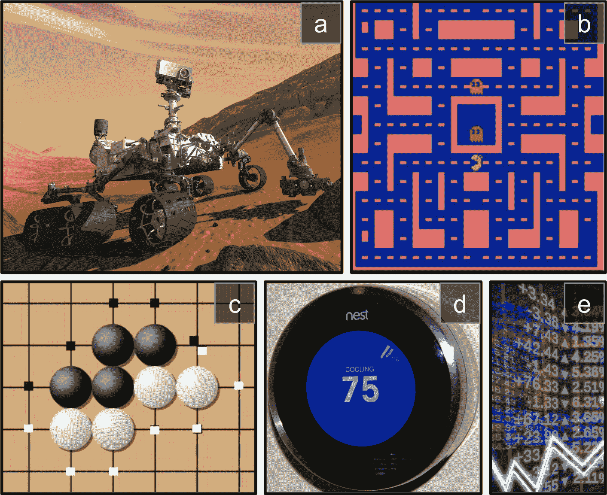
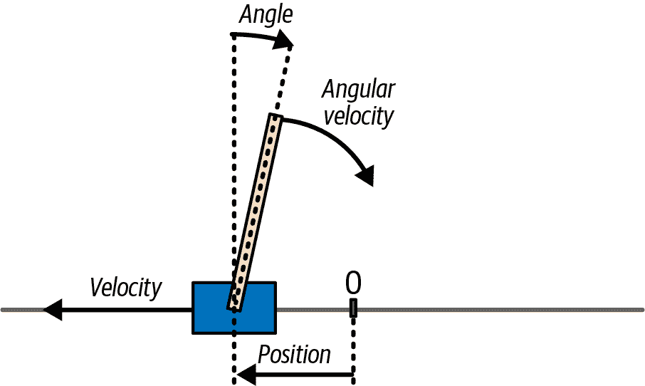
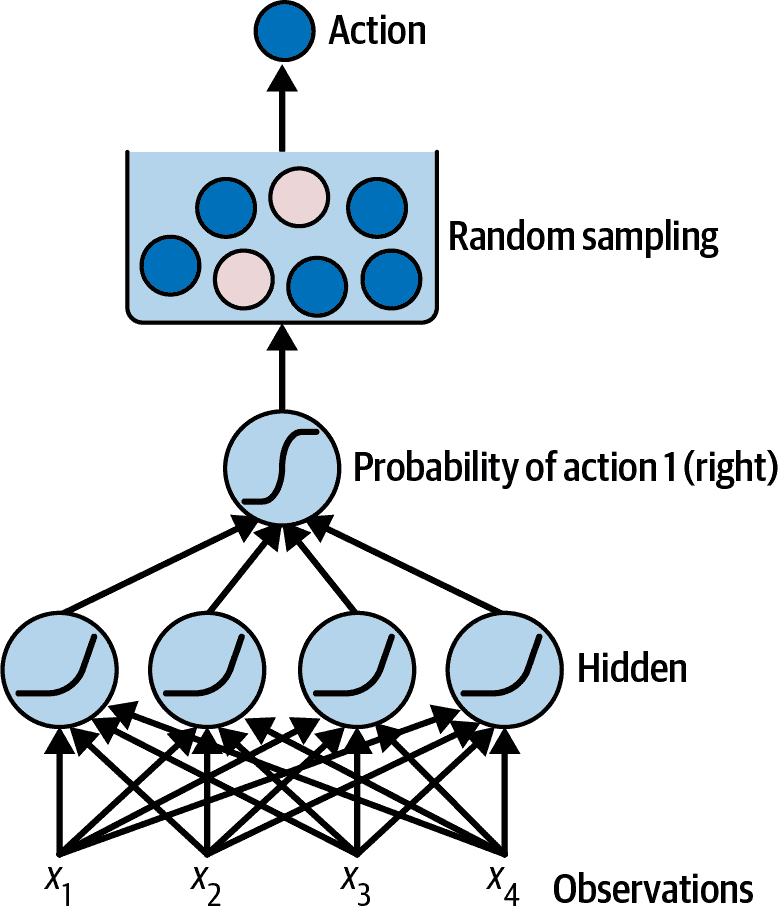
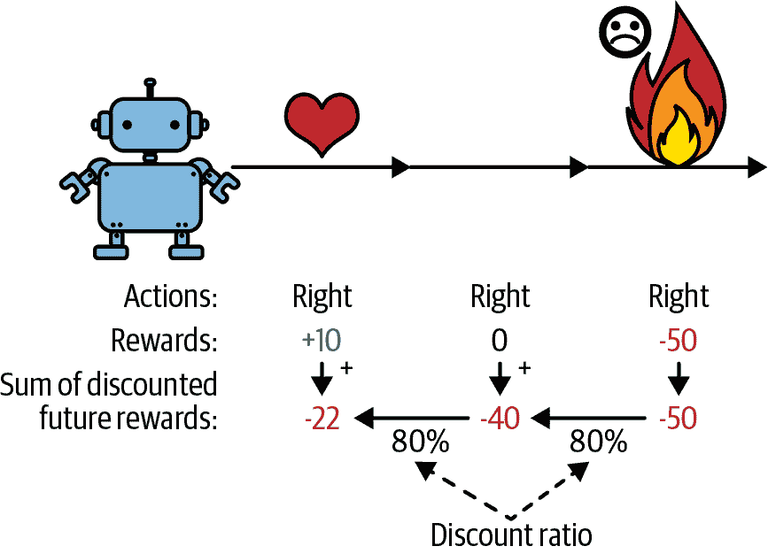
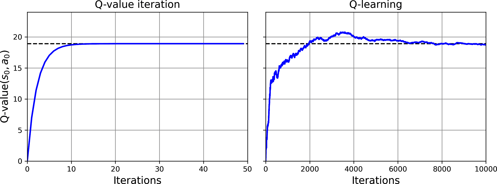
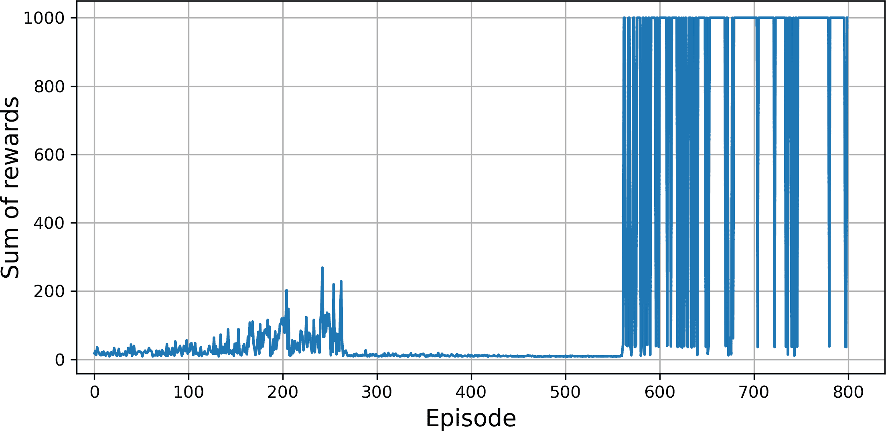
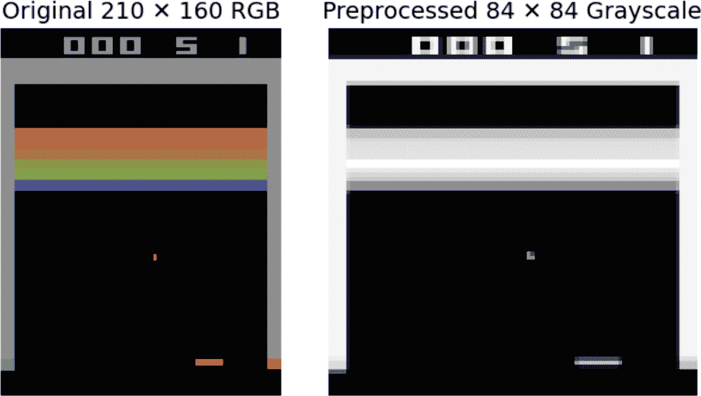

# 第十九章。强化学习

*强化学习*（RL）是当今机器学习中最激动人心的领域之一，同时也是最古老的领域之一。它自 20 世纪 50 年代以来一直存在，多年来产生了许多有趣的应用，尤其是在游戏（例如，*TD-Gammon*，一种国际象棋程序）和机器控制方面，但很少成为头条新闻。然而，在 2013 年发生了一场革命，当时来自一家名为 DeepMind 的英国初创公司的研究人员展示了一个可以从零开始学习几乎任何 Atari 游戏的系统，最终在大多数游戏中超过了人类，仅使用原始像素作为输入，并且没有任何关于游戏规则的先验知识。这是系列惊人壮举中的第一个：

+   在 2016 年，DeepMind 的 AlphaGo 击败了传奇围棋职业选手李世石；在 2017 年，它又击败了世界冠军柯洁。没有任何程序曾接近击败这个游戏的宗师，更不用说最顶尖的选手了。

+   在 2020 年，DeepMind 发布了 AlphaFold，它可以以前所未有的准确性预测蛋白质的 3D 形状。这在生物学、化学和医学上是一个变革性的成果。事实上，Demis Hassabis（创始人兼首席执行官）和 John Jumper（总监）因 AlphaFold 获得了诺贝尔化学奖。

+   在 2022 年，DeepMind 发布了 AlphaCode，它可以生成具有竞技编程水平的代码。

+   在 2023 年，DeepMind 发布了 GNoME，它可以预测新的晶体结构，包括数十万种预测的稳定材料。

那么，DeepMind 的研究人员是如何实现这一切的呢？嗯，他们将深度学习的力量应用于强化学习领域，结果超出了他们的预期：*深度强化学习*诞生了。今天，尽管 DeepMind 继续引领潮流，但许多其他组织也加入了进来，整个领域充满了新的想法，应用范围广泛。

在本章中，我将首先解释什么是强化学习以及它的优势，然后介绍深度强化学习中最重要的一些技术家族：策略梯度、深度 Q 网络（包括马尔可夫决策过程的讨论），最后是演员-评论家方法，包括流行的 PPO，我们将用它来击败 Atari 游戏。那么，让我们开始吧！

# 什么是强化学习？

在强化学习中，一个软件*代理*在*环境*中做出*观察*并采取*行动*，作为回报，它从环境中获得*奖励*。其目标是学习以最大化其预期奖励的方式行事。如果你不介意有一点拟人化，你可以把正奖励看作是快乐，负奖励看作是痛苦（在这种情况下，“奖励”这个词有点误导）。简而言之，代理在环境中行动，并通过试错来学习最大化快乐和最小化痛苦。

这是一个相当广泛的设置，可以应用于各种任务。以下是一些例子（参见图 19-1)：

+   代理可以是控制机器人的程序。在这种情况下，环境是现实世界，代理通过一组*传感器*（如摄像头和触觉传感器）观察环境，其动作包括发送信号以激活电机。它可以编程为在接近目标目的地时获得正奖励，而在浪费时间或走错方向时获得负奖励。

+   代理可以是控制*Ms. Pac-Man*的程序。在这种情况下，环境是 Atari 游戏的模拟，动作是九个可能的摇杆位置（左上角、向下、中心等），观察是屏幕截图，奖励只是游戏分数。

+   同样，代理可以是玩围棋等棋类游戏的程序。只有当它获胜时才会获得奖励。

+   代理不必控制物理上（或虚拟上）移动的东西。例如，它可以是智能恒温器，在接近目标温度并节省能源时获得正奖励，当人类需要调整温度时获得负奖励，因此代理必须学会预测人类的需求。

+   代理可以观察股票市场价格，并决定每秒买卖多少。奖励显然是货币的盈亏。

注意，可能根本没有任何正奖励；例如，代理可能在迷宫中移动，每一步都获得负奖励，所以它最好尽快找到出口！强化学习非常适合许多其他任务，例如自动驾驶汽车、推荐系统、在网页上放置广告，或控制图像分类系统应该关注的焦点。



###### 图 19-1\. 强化学习示例：（a）机器人，（b）*Ms. Pac-Man*，（c）围棋选手，（d）恒温器，（e）自动交易员⁠^(6)

现在我们转向强化学习算法的一个大型家族：*策略梯度*。

# 策略梯度

软件代理用来确定其行为的算法被称为其*策略*。策略可以是任何你能想到的算法，例如一个以观察为输入并输出要采取的行动的神经网络（参见图 19-2）。


###### 图 19-2\. 使用神经网络策略的强化学习

策略甚至不必是确定性的。实际上，在某些情况下，它甚至不必观察环境，只要它能获得奖励！例如，考虑一个盲目的机器人吸尘器，其奖励是在 30 分钟内收集的灰尘量。其策略可以是每秒以概率*p*向前移动，或者以概率 1 – *p*随机左转或右转。旋转角度将是介于 –*r* 和 +*r* 之间的随机角度。由于这个策略涉及一些随机性，它被称为*随机策略*。机器人将会有一个不规则的轨迹，这保证了它最终会到达它能到达的任何地方并收集所有灰尘。问题是，它在 30 分钟内能收集多少灰尘？

你会如何训练这样的机器人？你只能调整两个*策略参数*：概率*p*和角度范围*r*。一个可能的学习算法是尝试这些参数的许多不同值，并选择表现最好的组合（参见图 19-3）。这是一个*策略搜索*的例子，在这种情况下使用的是穷举法。当*策略空间*太大时（这通常是情况），以这种方式找到一组好的参数就像在大堆稻草中寻找一根针。

另一种探索策略空间的方法是使用*遗传算法*。例如，你可以随机创建第一代 100 个策略并尝试它们，然后“淘汰”80 个最差的策略⁠^(7)，让 20 个幸存者各自产生 4 个后代。后代是其父母的副本⁠^(8)加上一些随机变异。幸存策略及其后代共同构成了第二代。你可以继续这样迭代通过几代，直到找到好的策略。⁠^(9)


###### 图 19-3\. 策略空间中的四个点（左）和代理的对应行为（右）

另一种方法是使用优化技术，通过评估奖励相对于策略参数的梯度来调整这些参数，然后沿着梯度方向调整这些参数以获得更高的奖励。遵循这种策略的算法被称为*策略梯度*（PG）算法。但在我们能够实现它们之前，我们首先需要为智能体创建一个生存的环境——因此，现在是介绍 Gymnasium 库的时候了。

## Gymnasium 库简介

强化学习的一个挑战是，为了训练一个智能体，您首先需要一个工作的环境。如果您想编写一个学习玩 Atari 游戏的智能体，您需要一个 Atari 游戏模拟器。如果您想编写一个行走机器人，那么环境就是现实世界，您可以直接在那个环境中训练您的机器人。然而，这有其局限性：如果机器人从悬崖上掉下来，您不能只是点击撤销。您也不能加快时间——增加更多的计算能力不会让机器人移动得更快——并且并行训练 1000 个机器人通常太昂贵了。简而言之，在现实世界中训练既困难又缓慢，因此您至少需要一个*模拟环境*来进行启动训练。例如，您可能使用像[PyBullet](https://pybullet.org)或[MuJoCo](https://mujoco.org)这样的库来进行 3D 物理模拟。

[体育馆图书馆](https://gymnasium.farama.org)是一个开源工具包，它提供了各种模拟环境（如 Atari 游戏、棋盘游戏、2D 和 3D 物理模拟等），您可以使用这些环境来训练智能体、比较它们或开发新的强化学习算法。它是 OpenAI Gym 的继任者，现在由一群研究人员和开发者维护。

Gymnasium 在 Colab 上预先安装，包括 Arcade Learning Environment（ALE）库`ale_py`，这是一个 Atari 2600 游戏的模拟器，对于所有 Atari 环境都是必需的，以及 Box2D 库，它是用于几个具有 2D 物理的环境。如果您在自己的机器上编码而不是在 Colab 上，并且您遵循了[*https://homl.info/install-p*](https://homl.info/install-p)上的安装说明，那么您应该可以开始了。

让我们从导入 Gymnasium 并创建一个环境开始：

```py
import gymnasium as gym

env = gym.make("CartPole-v1", render_mode="rgb_array", max_episode_steps=1000)
```

在这里，我们创建了一个 CartPole 环境（版本 1）。这是一个 2D 模拟，其中一辆小车可以加速向左或向右，以平衡放在它顶部的一根杆子（参见图 19-4）——这是一个经典的控制任务。我很快会解释`render_mode`和`max_episode_steps`。

###### 小贴士

`gym.envs.registry`字典包含了所有可用环境的名称和规范。您可以使用`gym.pprint_registry()`打印出一个漂亮的列表。Atari 环境将只有在启动 ALE 模拟器后才能使用。



###### 图 19-4\. 小车杆环境

创建环境后，您必须使用 `reset()` 方法对其进行初始化，可选地指定一个随机种子。这将返回第一个观察结果。观察结果取决于环境类型。对于 CartPole 环境，每个观察结果都是一个包含四个浮点数的 NumPy 数组，分别表示小车的水平位置（`0.0` = 中心）、速度（正值表示向右）、杆的角度（`0.0` = 垂直）和角速度（正值表示顺时针）。`reset()` 方法还返回一个可能包含额外环境特定信息的字典。这可以用于调试，有时也用于训练。例如，在许多 Atari 环境中，它包含剩余的生命数。然而，在 CartPole 环境中，此字典为空：

```py
>>> obs, info = env.reset(seed=42)
>>> obs
array([ 0.0273956 , -0.00611216,  0.03585979,  0.0197368 ], dtype=float32)
>>> info
{}
```

让我们调用 `render()` 方法将此环境渲染为图像。由于我们在创建环境时设置了 `render_mode="rgb_array"`，因此图像将以 NumPy 数组的形式返回（然后您可以使用 Matplotlib 的 `imshow()` 函数来显示此图像）：

```py
>>> img = env.render()
>>> img.shape  # height, width, channels (3 = Red, Green, Blue)
(400, 600, 3)
```

现在，让我们询问环境可能有哪些动作：

```py
>>> env.action_space
Discrete(2)
```

`Discrete(2)` 表示可能的动作是整数 0 和 1，分别代表向左或向右加速。其他环境可能有额外的离散动作，或其他类型的动作（例如连续动作）。由于杆向右倾斜 (`obs[2] > 0`)，让我们加速小车向右：

```py
>>> action = 1  # accelerate right
>>> obs, reward, done, truncated, info = env.step(action)
>>> obs
array([ 0.02727336,  0.18847767,  0.03625453, -0.26141977], dtype=float32)
>>> reward, done, truncated, info
(1.0, False, False, {})
```

`step()` 方法执行所需的动作并返回五个值：

`obs`

这是一条新的观察。小车现在正向右移动 (`obs[1] > 0`)。杆仍然向右倾斜 (`obs[2] > 0`)，但其角速度现在是负的 (`obs[3] < 0`)，因此它很可能会在下一步后向左倾斜。

`reward`

在这个环境中，无论您做什么，每一步都会获得 1.0 的奖励，因此目标是尽可能长时间地保持剧集运行。一个 *剧集* 是环境的一次运行，直到游戏结束或中断。

`done`

当剧集结束时，此值将为 `True`。这将在杆倾斜过多或超出屏幕时发生。之后，必须重置环境才能再次使用。

`truncated`

当一个剧集提前中断时，此值将为 `True`，通常是由施加每个剧集最大步数的环境包装器引起的（有关环境包装器的更多详细信息，请参阅 Gymnasium 的文档）。默认情况下，CartPole 的环境规范将最大步数设置为 500，但我们在创建环境时将其更改为 1000。一些强化学习算法将截断剧集与正常完成的剧集（即 `done` 为 `True`）区别对待，但在本章中我们将它们视为相同。

`info`

这个特定环境的字典可能提供额外信息，就像`reset()`方法返回的信息一样。

###### 小贴士

一旦你完成了一个环境的使用——可能是在许多回合之后——你应该调用它的`close()`方法来释放资源。

让我们硬编码一个简单的策略，当杆子向左倾斜时加速向左，当杆子向右倾斜时加速向右。我们将运行这个策略，看看它在 500 个回合中获得的平均奖励：

```py
def basic_policy(obs):
    angle = obs[2]
    return 0 if angle < 0 else 1  # go left if leaning left, otherwise go right

totals = []
for episode in range(500):
    total_rewards = 0
    obs, info = env.reset(seed=episode)
    while True:  # no risk of infinite loop: will be truncated after 1000 steps
        action = basic_policy(obs)
        obs, reward, done, truncated, info = env.step(action)
        total_rewards += reward
        if done or truncated:
            break

    totals.append(total_rewards)
```

这段代码是自我解释的。让我们看看结果：

```py
>>> import numpy as np
>>> np.mean(totals), np.std(totals), min(totals), max(totals)
(np.float64(41.698), np.float64(8.389445512070509), 24.0, 63.0)
```

即使尝试了 500 次，这项政策也从未能将杆子保持直立超过 63 个连续步骤。这并不理想。如果你查看本章笔记本中的模拟，你会看到小车左右摆动越来越剧烈，直到杆子倾斜过度。神经网络可以做得更好！

## 神经网络策略

让我们创建一个神经网络策略。这个神经网络将观察作为输入，并将输出要执行的操作，就像我们之前硬编码的策略一样。更确切地说，它将为每个操作估计一个概率，然后根据估计的概率随机选择一个操作（参见图 19-5）。在 CartPole 环境中，只有两个可能的操作（左或右），所以我们只需要一个输出神经元。它将输出操作 1（右）的概率*p*，当然操作 0（左）的概率将是 1 – *p*。例如，如果它输出 0.7，那么我们将以 70%的概率选择操作 1，或者以 30%的概率选择操作 0（这是一个*p* = 0.7 的伯努利分布）。



###### 图 19-5\. 神经网络策略

你可能会想知道，为什么我们根据神经网络给出的概率选择随机动作，而不是只选择得分最高的动作。这种方法让智能体在探索新动作和利用已知效果良好的动作之间找到正确的平衡。这里有一个类比：假设你第一次去餐厅，所有的菜看起来都同样吸引人，所以你随机选择一个。如果它结果很好，你可以增加下次点这个菜的概率，但你不应该将这个概率增加到 100%，否则你将永远无法尝试其他菜肴，其中一些可能比你所尝试的更好。这种*探索*/*利用*的困境是强化学习中的核心问题。

还要注意，在这个特定的环境中，过去的行为和观察可以安全地忽略，因为每个观察都包含了环境的完整状态。如果有某些隐藏状态，那么你可能需要考虑过去的行为和观察。例如，如果环境只揭示了滑车的位置但没有其速度，那么你必须考虑当前观察以及之前的观察，以便估计当前速度。另一个例子是当观察有噪声时；在这种情况下，你通常想使用过去几项观察来估计最可能的状态。因此，CartPole 问题是最简单的；观察是无噪声的，并且它们包含了环境的完整状态。

让我们使用 PyTorch 来实现一个基本的神经网路策略，用于 CartPole：

```py
import torch
import torch.nn as nn

class PolicyNetwork(nn.Module):
    def __init__(self):
        super().__init__()
        self.net = nn.Sequential(nn.Linear(4, 5), nn.ReLU(), nn.Linear(5, 1))

    def forward(self, state):
        return self.net(state)
```

我们的政策网络是一个小型 MLP，因为这个任务相对简单。输入的数量是环境状态的尺寸：在 CartPole 的情况下，它只是单个观察的尺寸，即四个。我们只有一个包含五个单元的隐藏层（在这种情况下不需要更多）。最后，我们希望输出一个概率，所以我们有一个输出神经元。如果有超过两个可能的行为，那么每个行为将有一个输出神经元。为了性能和数值稳定性，我们不在最后添加 sigmoid 函数，因此网络实际上会输出 logits 而不是概率。

接下来让我们定义一个函数，它将使用这个策略网络来选择一个动作：

```py
def choose_action(model, obs):
    state = torch.as_tensor(obs)
    logit = model(state)
    dist = torch.distributions.Bernoulli(logits=logit)
    action = dist.sample()
    log_prob = dist.log_prob(action)
    return int(action.item()), log_prob
```

该函数接受单个观察，将其转换为张量，并将其传递给策略网络以获取动作 1（向右）的 logit。然后它使用这个 logit 创建一个`Bernoulli`概率分布，并从中采样一个动作：这个分布将以概率 *p* = exp(logit) / (1 + exp(logit)) 输出 1（向右），以概率 1 – *p* 输出 0（向左）。如果有超过两个可能的行为，你将使用一个`Categorical`分布代替。最后，我们计算采样动作的对数概率（即 log(*p*)或 log(1 – *p*)）：这个对数概率将在训练时被需要。

###### 小贴士

如果动作空间是连续的，你可以使用高斯分布而不是 Bernoulli 或 Categorical 分布。策略网络必须预测分布的均值和标准差（或标准差的对数）。标准差的对数通常会被截断，以确保分布既不太宽也不太窄。

好的，我们现在有一个神经网络策略，它可以接受环境状态（在这种情况下，单个观察）并选择一个动作。但我们是怎样训练它的呢？

## 评估动作：信用分配问题

如果我们知道在每一步的最佳动作是什么，我们可以通过最小化估计概率分布与目标概率分布之间的交叉熵来像往常一样训练神经网络。这将是常规的监督学习。然而，在强化学习中，智能体得到的唯一指导是通过奖励，而奖励通常是稀疏和延迟的。例如，如果一个智能体成功平衡杆 100 步，它如何知道它所采取的 100 个动作中哪些是好的，哪些是坏的？它所知道的就是在最后一步后杆子倒了，但显然这一步并不完全负责。这被称为**信用分配问题**：当智能体获得奖励（或惩罚）时，它很难知道哪些动作应该得到认可（或责备）。想象一下一只狗在表现良好数小时后得到奖励；它会明白自己为什么被奖励吗？

为了简化信用分配，一个常见的策略是评估一个动作基于其之后所有奖励的总和，并在每一步应用一个**折现因子**，_γ*（伽马）。这个折现奖励的总和被称为动作的**回报**。考虑图 19-6 中的例子。如果一个智能体连续三次选择向右移动，并在第一步后获得+10 的奖励，第二步后获得 0，最后在第三步后获得-50，那么如果我们使用折现因子 *γ* = 0.8，第一个动作的回报将是 10 + *γ* × 0 + *γ*² × (–50) = –22。



###### 图 19-6\. 计算动作的回报：折现未来奖励的总和

以下函数计算回报，给定奖励和折现因子：

```py
def compute_returns(rewards, discount_factor):
    returns = rewards[:]  # copy the rewards
    for step in range(len(returns) - 1, 0, -1):
        returns[step - 1] += returns[step] * discount_factor

    return torch.tensor(returns)
```

这个函数产生预期的结果：

```py
>>> compute_returns([10, 0, -50], discount_factor=0.8)
tensor([-22., -40., -50.])
```

如果折现因子接近 0，那么与即时奖励相比，未来的奖励不会太多。相反，如果折现因子接近 1，那么远期奖励将几乎与即时奖励一样重要。典型的折现因子范围从 0.9 到 0.99。以 0.95 的折现因子为例，13 步后的奖励大约相当于即时奖励的一半（因为 0.95¹³ ≈ 0.5），而以 0.99 的折现因子为例，69 步后的奖励相当于即时奖励的一半。在 CartPole 环境中，动作有相当短期的效果，因此选择一个较低的折现因子 0.95 似乎是合理的，并且它将有助于信用分配，使训练更快更稳定。然而，如果折现因子设置得太低，那么智能体将学会次优策略，过分关注短期收益。

现在我们有了评估每个动作的方法，我们就可以使用策略梯度来训练我们的第一个智能体了。让我们看看怎么做。

## 使用策略梯度解决 CartPole 问题

如前所述，策略梯度算法通过跟随梯度指向更高的奖励来优化策略的参数。一个流行的 PG 算法，称为*REINFORCE*（或*蒙特卡洛 PG*），是由 Ronald Williams 在 1992 年[首次提出](https://homl.info/132)。⁠^(11) 它有许多变体，各种调整，但基本原则是这样的：

1.  首先，让神经网络策略玩一个游戏，并记录奖励和估计的对数概率。

1.  然后使用上一节中定义的函数计算每个动作的回报。

1.  如果一个动作的回报是正的，这意味着这个动作可能是好的，你希望这个动作在未来更有可能被选择。相反，如果一个动作的回报是负的，你希望这个动作*更少*可能。为了实现这一点，你可以最小化方程 19-1 中定义的 REINFORCE 损失：这将最大化期望的折现回报。

    ##### 方程 19-1\. REINFORCE 损失

    <mrow><mi>ℒ</mi> <mrow><mo>(</mo> <mi mathvariant="bold">θ</mi> <mo>)</mo></mrow> <mo>=</mo> <mo>-</mo> <munder><mo>∑</mo> <mi>t</mi></munder> <mrow><mo form="prefix">log</mo> <msub><mi>π</mi> <mi mathvariant="bold">θ</mi></msub> <mrow><mo>(</mo> <msub><mi>a</mi> <mi>t</mi></msub> <mo>|</mo> <msub><mi>s</mi> <mi>t</mi></msub> <mo>)</mo></mrow> <mo>·</mo> <msub><mi>r</mi> <mi>t</mi></msub></mrow></mrow>

在这个方程中，*π***θ**是策略网络的估计概率，表示在状态*s*[*t*]（其中*t*是时间步）下动作*a*[*t*]的概率，*r*[*t*]是观察到的这个动作的回报；**θ**代表模型参数。

让我们使用 PyTorch 来实现这个算法。首先，我们需要一个函数来让策略网络玩一个游戏，并记录奖励和对数概率：

```py
def run_episode(model, env, seed=None):
    log_probs, rewards = [], []
    obs, info = env.reset(seed=seed)
    while True:  # the environment will truncate the episode if it is too long
        action, log_prob = choose_action(model, obs)
        obs, reward, done, truncated, _info = env.step(action)
        log_probs.append(log_prob)
        rewards.append(reward)
        if done or truncated:
            return log_probs, rewards
```

该函数首先将环境重置以开始一个新的游戏。为了可重复性，我们向`reset()`方法传递一个种子。然后是游戏循环：在每次迭代中，我们将当前环境状态（即最后的观察）传递给之前定义的`choose_action()`方法。它返回所选动作及其对数概率。然后我们调用环境的`step()`方法来执行动作。这返回一个新的观察（NumPy 数组）、一个奖励、两个布尔值表示游戏是否结束或截断，以及一个 info 字典（在 CartPole 的情况下我们可以安全地忽略它）。我们记录对数概率和奖励在两个列表中，当游戏结束时返回这些列表。

我们最终可以编写训练函数：

```py
def train_reinforce(model, optimizer, env, n_episodes, discount_factor):
    for episode in range(n_episodes):
        seed = torch.randint(0, 2**32, size=()).item()
        log_probs, rewards = run_episode(model, env, seed=seed)
        returns = compute_returns(rewards, discount_factor)
        std_returns = (returns - returns.mean()) / (returns.std() + 1e-7)
        losses = [-logp * rt for logp, rt in zip(log_probs, std_returns)]
        loss = torch.cat(losses).sum()
        optimizer.zero_grad()
        loss.backward()
        optimizer.step()
        print(f"\rEpisode {episode + 1}, Reward: {sum(rewards):.2f}", end=" ")
```

这很好，也很简洁，不是吗？在每次训练迭代中，函数运行一个回合并获取对数概率和奖励。⁠^(12) 然后，它计算每个动作的回报。接下来，它标准化回报（即，它减去平均回报并除以标准差，再加上一个小的值以避免除以零）。这个标准化步骤是可选的，但它是 REINFORCE 算法的一个常见且推荐的调整，因为它可以稳定训练。接下来，函数使用方程式 19-1 计算 REINFORCE 损失，并执行优化器步骤以最小化损失。

就这样，我们已经准备好构建和训练策略网络了！

```py
torch.manual_seed(42)
model = PolicyNetwork()
optimizer = torch.optim.NAdam(model.parameters(), lr=0.06)
train_reinforce(model, optimizer, env, n_episodes=200, discount_factor=0.95)
```

训练将不到一分钟。如果你使用这个策略网络运行一个回合，你会看到它完美地平衡了杆。成功！

我们刚刚训练的简单策略梯度算法解决了 CartPole 任务，但它不会很好地扩展到更大和更复杂的任务。事实上，它非常*样本低效*，这意味着它需要探索游戏很长时间才能取得显著的进步。这是因为它的回报估计非常嘈杂，尤其是在好的动作和坏的动作混合在一起时。然而，它是更强大算法的基础，例如*演员-评论家*算法（我们将在本章末尾讨论）。

###### 小贴士

研究者们试图寻找即使在智能体最初对环境一无所知的情况下也能良好工作的算法。然而，除非你正在撰写论文，否则你不应该犹豫将先验知识注入智能体中，因为这会显著加快训练速度。例如，既然你知道杆应该尽可能垂直，你可以添加与杆角度成比例的负奖励。这将使奖励更加稀疏，并加快训练速度。此外，如果你已经有一个相当不错的策略（例如，硬编码），在使用策略梯度改进它之前，你可能想要训练神经网络来模仿它。

此外，REINFORCE 算法相当不稳定：智能体在训练过程中可能会进步一段时间，然后突然忘记一切，再次学习，忘记，学习，等等。这是一段过山车般的经历。这在很大程度上是因为训练样本不是独立同分布的（IID）；事实上，训练样本包括智能体现在能够达到的任何状态。随着智能体的进步，它会探索环境的不同部分，并且它可能会忘记其他部分的一切。例如，一旦它学会了正确地保持杆竖直，它就再也不会看到非垂直的杆，并且它将完全忘记如何处理它们。而且这个问题在更复杂的环境中会变得更加严重。

###### 注意

强化学习因其训练的不稳定性和对超参数值和随机种子选择的巨大敏感性而闻名，这是一个非常困难的领域。⁠^(13) 如研究者安德烈·卡帕西所说，“[监督学习]希望工作。[……] RL 必须被迫工作”。你需要时间、耐心、毅力，也许还需要一点运气。这也是强化学习不像常规深度学习那样被广泛采用的主要原因。

我们现在将探讨另一组流行的算法：*基于价值的算法*。

# 基于价值的算法

与 PG 算法直接尝试优化策略以增加奖励不同，基于价值的算法更为间接：智能体学习估计每个状态的价值（即预期的回报），或者给定状态下每个动作的价值，然后它使用这些知识来决定如何行动。为了理解这些算法，我们首先必须讨论*马尔可夫决策过程*（MDP）。

## 马尔可夫决策过程

在 20 世纪初，数学家安德烈·马尔可夫研究了没有记忆的随机过程，称为*马尔可夫链*。这样的过程具有固定数量的状态，并且它在每一步随机地从一种状态演变到另一种状态。从状态 *s* 到状态 *s*′ 的演变概率是固定的，并且它只依赖于对 (*s*, *s*′)，而不依赖于过去的状态。这就是为什么我们说系统没有记忆。

图 19-7 展示了一个具有四个状态的马尔可夫链的示例。


###### 图 19-7\. 马尔可夫链的示例

假设过程从状态 *s*[0] 开始，有 70%的几率在下一步仍然处于该状态。最终它必然会离开该状态并且永远不再回来，因为没有其他状态指向 *s*[0]。如果它进入状态 *s*[1]，那么它接下来最有可能进入状态 *s*[2]（90%的概率），然后立即回到状态 *s*[1]（100%的概率）。它可能在这两个状态之间交替多次，但最终它会陷入状态 *s*[3] 并永远停留在这里，因为没有出路：这被称为*终止状态*。马尔可夫链可以具有非常不同的动态，并且它们在热力学、化学、统计学等领域被广泛使用。

马尔可夫决策过程最早在 20 世纪 50 年代由[理查德·贝尔曼](https://homl.info/133)描述。⁠^(14) 它们类似于马尔可夫链，但有一个转折点：在每一步，一个智能体可以选择几种可能的行为之一，并且转移概率取决于所选择的行为。此外，某些状态转移会返回一些奖励（正面或负面），智能体的目标是找到一个策略，使其在时间上的累积奖励最大化。

例如，图 19-8 所示的 MDP 有三个状态（用圆圈表示）和每个步骤最多三个可能的离散行动（用菱形表示）。


###### 图 19-8. 马尔可夫决策过程的示例

如果它从状态 *s*[0] 开始，代理可以选择行动 *a*[0]、*a*[1] 或 *a*[2]。如果它选择行动 *a*[1]，它将肯定地停留在状态 *s*[0] 而没有任何奖励。因此，如果它想的话，它可以永远留在那里。但是，如果它选择行动 *a*[0]，它有 70%的概率获得+10 的奖励并停留在状态 *s*[0]。然后它可以一次又一次地尝试以获得尽可能多的奖励，但最终它可能会结束在状态 *s*[1]。在状态 *s*[1] 中，它只有两种可能的行为：*a*[0] 或 *a*[2]。它可以反复选择行动 *a*[0] 以保持原位，或者它可以选择移动到状态 *s*[2] 并获得-50 的负面奖励（ouch）。在状态 *s*[2] 中，它别无选择，只能采取行动 *a*[1]，这很可能会将它带回到状态 *s*[0]，并在路上获得+40 的奖励。你明白这个意思了。通过观察这个 MDP，你能猜出哪种策略在长时间内能获得最多的奖励吗？在状态 *s*[0] 中，显然行动 *a*[0] 是最佳选择，在状态 *s*[2] 中，代理别无选择，只能采取行动 *a*[1]，但在状态 *s*[1] 中，并不明显代理应该留在原位 (*a*[0]) 还是穿过火海 (*a*[2])。

贝尔曼找到了一种方法来估计任何状态 *s* 的 *最优状态值*，表示为 *V**(*s*)，这是代理从状态 *s* 开始，平均期望获得的折扣未来奖励的总和，假设它采取最优行动。他证明了如果代理采取最优行动，那么 *贝尔曼最优方程* 适用（见 方程 19-2）。这个递归方程表明，如果代理采取最优行动，那么当前状态的最优值等于采取一个最优行动后平均获得的奖励，加上所有可能后续状态期望的最优值的总和。

##### 方程 19-2. 贝尔曼最优方程

$upper V Superscript asterisk Baseline left-parenthesis s right-parenthesis equals max Underscript a Endscripts sigma-summation Underscript s Superscript prime Baseline Endscripts upper T left-parenthesis s comma a comma s Superscript prime Baseline right-parenthesis left-bracket upper R left-parenthesis s comma a comma s Superscript prime Baseline right-parenthesis plus gamma dot upper V Superscript asterisk Baseline left-parenthesis s Superscript prime Baseline right-parenthesis right-bracket for all s$

在这个方程中：

+   *T*(*s*, *a*, *s*′) 是在智能体选择了动作 *a* 的情况下，从状态 *s* 到状态 *s*′ 的转移概率。例如，在图 19-8 中，*T*(*s*[2], *a*[1], *s*[0]) = 0.8。注意，$sigma-summation Underscript s Superscript prime Baseline Endscripts upper T left-parenthesis s comma a comma s Superscript prime Baseline right-parenthesis equals 1$ 。

+   *R*(*s*, *a*, *s*′) 是当智能体从状态 *s* 转移到状态 *s*′ 时获得的奖励，前提是智能体选择了动作 *a*。例如，在图 19-8 中，*R*(*s*[2], *a*[1], *s*[0]) = +40。

+   *γ* 是折扣因子。

###### 注意

在贝尔曼方程和本章的其余部分中，最优策略是指最大化期望的*折扣*未来奖励总和的策略：这意味着它依赖于折扣因子 *γ*。然而，在现实世界的任务中，我们通常对每轮期望的奖励总和更感兴趣，没有任何折扣（实际上，我们通常就是这样评估智能体的）。为了达到这个目标，我们通常选择一个接近 1 的折扣因子（但不要太接近，否则训练会变得缓慢且不稳定）。

这个方程直接导出了一个可以精确估计每个可能状态的最优状态值的算法：首先将所有状态值估计初始化为零，然后使用*值迭代算法*（见方程 19-3）迭代更新它们。一个显著的结果是，给定足够的时间，这些估计将保证收敛到最优状态值，对应于最优策略。

##### 方程 19-3\. 值迭代算法

$upper V Subscript k plus 1 Baseline left-parenthesis s right-parenthesis left-arrow max Underscript a Endscripts sigma-summation Underscript s Superscript prime Baseline Endscripts upper T left-parenthesis s comma a comma s Superscript prime Baseline right-parenthesis left-bracket upper R left-parenthesis s comma a comma s Superscript prime Baseline right-parenthesis plus gamma dot upper V Subscript k Baseline left-parenthesis s Superscript prime Baseline right-parenthesis right-bracket for all s$

在这个方程中，*V**k* 是算法第 *k* 次迭代时状态 *s* 的估计值。

###### 注意

这个算法是**动态规划**的一个例子，它将复杂问题分解为可处理的子问题，这些子问题可以迭代解决。

了解最优状态值可能很有用，特别是为了评估策略，但它并不给我们提供智能体的最优策略。幸运的是，贝尔曼找到了一个非常相似的算法来估计最优的*状态-动作值*，通常称为*Q 值*（质量值）。状态-动作对 (*s*, *a*) 的最优 Q 值，表示为 *Q**(*s*, *a*)，是智能体从状态 *s* 出发，如果选择动作 *a*，在看到该动作的结果之前，平均期望的折扣未来奖励的总和，假设它在该动作之后采取最优行动。

让我们看看它是如何工作的。再次，你首先将所有 Q 值估计初始化为零，然后使用 *Q 值迭代* 算法（见 方程式 19-4）来更新它们。

##### 方程式 19-4\. Q 值迭代算法

$upper Q Subscript k plus 1 Baseline left-parenthesis s comma a right-parenthesis left-arrow sigma-summation Underscript s Superscript prime Baseline Endscripts upper T left-parenthesis s comma a comma s Superscript prime Baseline right-parenthesis left-bracket upper R left-parenthesis s comma a comma s Superscript prime Baseline right-parenthesis plus gamma dot max Underscript a Superscript prime Baseline Endscripts upper Q Subscript k Baseline left-parenthesis s prime comma a Superscript prime Baseline right-parenthesis right-bracket for all left-parenthesis s comma a right-parenthesis$

一旦你有了最优 Q 值，定义最优策略，记为 *π*^*(*s*), 就变得简单了：当智能体处于状态 *s* 时，它应该选择该状态具有最高 Q 值的动作。这个复杂的数学符号表示为 $pi Superscript asterisk Baseline left-parenthesis s right-parenthesis equals argmax Underscript a Endscripts upper Q Superscript asterisk Baseline left-parenthesis s comma a right-parenthesis$ .

让我们将此算法应用于 图 19-8 中表示的 MDP。首先，我们需要定义 MDP：

```py
transition_probabilities = [  # shape=[s, a, s']
    [[0.7, 0.3, 0.0], [1.0, 0.0, 0.0], [0.8, 0.2, 0.0]],
    [[0.0, 1.0, 0.0], None, [0.0, 0.0, 1.0]],
    [None, [0.8, 0.1, 0.1], None]
]
rewards = [  # shape=[s, a, s']
    [[+10, 0, 0], [0, 0, 0], [0, 0, 0]],
    [[0, 0, 0], [0, 0, 0], [0, 0, -50]],
    [[0, 0, 0], [+40, 0, 0], [0, 0, 0]]
]
possible_actions = [[0, 1, 2], [0, 2], [1]]
```

例如，要知道在执行动作 *a*[1] 后从 *s*[2] 转移到 *s*[0] 的转移概率，我们将查找 `transition_probabilities[2][1][0]`（这是 0.8）。同样，为了得到相应的奖励，我们将查找 `rewards[2][1][0]`（这是 +40）。为了得到 *s*[2] 中可能动作的列表，我们将查找 `possible_actions[2]`（在这种情况下，只有动作 *a*[1] 是可能的）。接下来，我们必须将所有 Q 值初始化为零（除了不可能的动作，我们将 Q 值设置为 –∞）：

```py
Q_values = np.full((3, 3), -np.inf)  # -np.inf for impossible actions
for state, actions in enumerate(possible_actions):
    Q_values[state, actions] = 0.0  # for all possible actions
```

现在我们来运行 Q 值迭代算法。它反复应用 方程式 19-4，针对所有 Q 值，对每个状态和每个可能动作进行迭代：

```py
gamma = 0.90  # the discount factor

for iteration in range(50):
    Q_prev = Q_values.copy()
    for s in range(3):
        for a in possible_actions[s]:
            Q_values[s, a] = np.sum([
                    transition_probabilities[s][a][sp]
                    * (rewards[s][a][sp] + gamma * Q_prev[sp].max())
                for sp in range(3)])
```

就这样！得到的 Q 值看起来是这样的：

```py
>>> Q_values
array([[18.91891892, 17.02702702, 13.62162162],
 [ 0\.        ,        -inf, -4.87971488],
 [       -inf, 50.13365013,        -inf]])
```

例如，当智能体处于状态 *s*[0] 并选择动作 *a*[1] 时，期望的折现未来奖励总和大约为 17.0。

对于每个状态，我们可以找到具有最高 Q 值的动作：

```py
>>> Q_values.argmax(axis=1)  # optimal action for each state
array([0, 0, 1])
```

这给出了使用折现因子 0.90 的 MDP 的最优策略：在状态 *s*[0] 选择动作 *a*[0]，在状态 *s*[1] 选择动作 *a*[0]（即保持原位），在状态 *s*[2] 选择动作 *a*[1]（唯一可能动作）。有趣的是，如果我们把折现因子提高到 0.95，最优策略就会改变：在状态 *s*[1] 最好的动作变为 *a*[2]（穿过火焰！）。这很有道理，因为你对未来奖励的重视程度越高，你现在就越愿意为了未来的幸福忍受一些痛苦。

## 时间差分学习

具有离散动作的强化学习问题通常可以建模为马尔可夫决策过程，但代理最初并不知道状态转移概率是什么（它不知道 *T*(*s*, *a*, *s*′))，也不知道奖励将会是什么（它不知道 *R*(*s*, *a*, *s*′))。它必须至少体验每个状态和每个转移一次才能知道奖励，如果它想要对转移概率有一个合理的估计，它必须多次体验它们。

*时间差分 (TD) 学习* 算法与 Q 值迭代算法非常相似，但经过调整以考虑代理对 MDP 只有部分知识的事实。一般来说，我们假设代理最初只知道可能的状态和动作，没有更多。代理使用 *探索策略*——例如，一个完全随机的策略——来探索 MDP，随着它的进展，TD 学习算法根据实际观察到的转移和奖励来更新状态值的估计（参见 方程 19-5）。

##### 方程 19-5\. TD 学习算法

$StartLayout 1st Row 1st Column 上标 k 加 1 基线 左括号 s 右括号 2nd Column 左箭头 左括号 1 减去 alpha 右括号 上标 k 基线 左括号 s 右括号 加上 alpha 左括号 r 加 gamma 点 上标 k 基线 左括号 s' 右括号 右括号 2nd Row 1st Column 或逗号 2nd Column 相当于冒号 3rd Row 1st Column 上标 k 加 1 基线 左括号 s 右括号 2nd Column 左箭头 上标 k 基线 左括号 s 右括号 加上 alpha 点 delta 上标 k 基线 左括号 s ，r ，s 上标 prime 基线 右括号 4th Row 1st Column 与 2nd Column delta 上标 k 基线 左括号 s ，r ，s 上标 prime 基线 右括号 等于 r 加 gamma 点 上标 k 基线 左括号 s' 右括号 减去 上标 k 基线 左括号 s 右括号 EndLayout$

在这个方程中：

+   *α* 是学习率（例如，0.01）。

+   *r* + *γ* · *V**k* 被称为 *TD 目标*。

+   *δ**k* 被称为 *TD 错误*。

写这个方程的第一种形式的一个更简洁的方法是使用符号 $a left-arrow Underscript alpha Endscripts b$ ，它意味着 *a*[*k*+1] ← (1 – *α*) · *a*[*k*] + *α* ·*b*[*k*]。因此，方程 19-5 的第一行可以重写如下：$upper V left-parenthesis s right-parenthesis left-arrow Underscript alpha Endscripts r plus gamma dot upper V left-parenthesis s prime right-parenthesis$ .

###### 提示

TD 学习与随机梯度下降有很多相似之处，包括它一次处理一个样本的事实。此外，就像 SGD 一样，只有当你逐渐降低学习率时，它才能真正收敛；否则，它将围绕最优 Q 值不断震荡。

对于每个状态 *s*，此算法会跟踪智能体离开该状态后获得的即时奖励的运行平均值，以及它期望在以后获得的奖励，假设它采取最优行动。

## Q-Learning

类似地，Q 学习算法是 Q 值迭代算法对初始时过渡概率和奖励未知的情况的改编（见 方程 19-6）。Q 学习通过观察智能体（例如，随机）玩游戏并逐渐改进其对 Q 值的估计来工作。一旦它有了准确的 Q 值估计（或者足够接近），那么最优策略就是选择具有最高 Q 值的动作（即贪婪策略）。

##### 方程 19-6\. Q 学习算法

$upper Q left-parenthesis s comma a right-parenthesis left-arrow Underscript alpha Endscripts r plus gamma dot max Underscript a Superscript prime Baseline Endscripts upper Q left-parenthesis s prime comma a prime right-parenthesis$

对于每个状态-动作对 (*s*, *a*)，此算法会跟踪一个运行平均奖励 *r*，这是智能体在执行动作 *a* 离开状态 *s* 后获得的奖励，以及它期望获得的未来折扣奖励的总和。为了估计这个总和，我们取下一个状态 *s*′ 的 Q 值估计的最大值，因为我们假设从那时起目标策略将采取最优行动。

让我们实现 Q 学习算法。首先，我们需要让智能体探索环境。为此，我们需要一个步进函数，以便智能体可以执行一个动作并获得相应的状态和奖励：

```py
def step(state, action):
    probas = transition_probabilities[state][action]
    next_state = np.random.choice([0, 1, 2], p=probas)
    reward = rewards[state][action][next_state]
    return next_state, reward
```

现在，让我们实现智能体的探索策略。由于状态空间相当小，一个简单的随机策略就足够了。如果我们运行足够长的时间，智能体将多次访问每个状态，并且也会多次尝试每个可能的动作：

```py
def exploration_policy(state):
    return np.random.choice(possible_actions[state])
```

接下来，在初始化 Q 值就像之前一样之后，我们就可以运行带有学习率衰减的 Q 学习算法（使用在第十一章中引入的幂调度）：

```py
alpha0 = 0.05  # initial learning rate
decay = 0.005  # learning rate decay
gamma = 0.90  # discount factor
state = 0  # initial state

for iteration in range(10_000):
    action = exploration_policy(state)
    next_state, reward = step(state, action)
    next_value = Q_values[next_state].max()  # greedy policy at the next step
    alpha = alpha0 / (1 + iteration * decay)
    Q_values[state, action] *= 1 - alpha
    Q_values[state, action] += alpha * (reward + gamma * next_value)
    state = next_state
```

此算法将收敛到最优 Q 值，但需要许多迭代，并且可能需要进行大量的超参数调整。正如你在 图 19-9 中可以看到，Q 值迭代算法（左）在不到 20 次迭代内就非常快地收敛了，而 Q 学习算法（右）则需要大约 8,000 次迭代才能收敛。显然，不知道过渡概率或奖励会使找到最优策略变得显著更难！



###### 图 19-9\. Q 值迭代算法与 Q 学习算法的学习曲线

Q 学习算法被称为 *离线策略*算法，因为正在训练的策略不一定是训练期间使用的策略。例如，在我们刚刚运行的代码中，正在执行的策略（探索策略）是完全随机的，而正在训练的策略从未被使用过。训练后，最佳策略对应于系统地选择具有最高 Q 值的动作。相反，REINFORCE 算法是 *在线策略*：它使用正在训练的策略来探索世界。令人惊讶的是，Q 学习仅通过观察代理随机行动就能学会最佳策略。想象一下，当你的老师是一个蒙上眼睛的猴子时，你学习打高尔夫球。我们能做得更好吗？

## 探索策略

当然，Q 学习只有在探索策略足够彻底地探索 MDP 时才能工作。尽管纯随机策略保证最终会多次访问每个状态和每个转换，但这可能需要非常长的时间。因此，更好的选择是使用 *ε-greedy* 策略（ε是 epsilon）：在每一步，它以概率 *ε* 随机行动，或者以概率 1–*ε*（即选择具有最高 Q 值的动作）贪婪行动。与完全随机的策略相比，*ε*-greedy 策略的优势在于，随着 Q 值估计越来越好，它将越来越多地花时间探索环境的有趣部分，同时仍然花一些时间访问 MDP 中的未知区域。通常，开始时将 *ε* 的值设得较高（例如，1.0），然后逐渐降低它（例如，降至 0.05）。

或者，而不是仅仅依赖机会进行探索，另一种方法是通过鼓励探索策略尝试之前很少尝试过的动作。这可以通过向 Q 值估计中添加一个奖励来实现，如方程式 19-7 所示。

##### 方程式 19-7\. 使用探索函数的 Q 学习

$upper Q left-parenthesis s comma a right-parenthesis left-arrow Underscript alpha Endscripts r plus gamma dot max Underscript a Superscript prime Baseline Endscripts f left-parenthesis upper Q left-parenthesis s prime comma a Superscript prime Baseline right-parenthesis comma upper N left-parenthesis s prime comma a prime right-parenthesis right-parenthesis$

在这个方程中：

+   *N*(*s*′, *a*′) 计算在状态 *s*′ 下动作 *a*′ 被选择的次数。

+   *f*(*Q*, *N*) 是一个 *探索函数*，例如 *f*(*Q*, *N*) = *Q* + *κ*/(1 + *N*)，其中 *κ*（kappa）是一个好奇心超参数，它衡量代理对未知事物的吸引力。

## 近似 Q 学习和深度 Q 学习

Q 学习的主要问题是它不能很好地扩展到具有许多状态和动作的大（甚至中等）MDP。例如，假设你想使用 Q 学习来训练一个智能体来玩 *Ms. Pac-Man*（见 图 19-1）。Ms. Pac-Man 可以吃大约 240 个豆子，每个豆子可以是存在或不存在（即，已经被吃掉）。因此，可能的豆子状态数约为 2²⁴⁰ ≈ 10⁷³。如果你加上所有幽灵和 Ms. Pac-Man 的所有可能位置组合，可能的状态数将大于我们银河系中的原子数，因此你绝对无法跟踪每个 Q 值的估计。

解决方案是找到一个函数 *Q***θ**，它近似于任何状态-动作对 (*s*, *a*) 的 Q 值，其中向量 **θ** 参数化该函数。这被称为 *近似 Q 学习*。多年来，推荐使用从状态中提取的手工特征（例如，最近幽灵的距离、他们的方向等）的线性组合来估计 Q 值，但 2013 年，[DeepMind](https://homl.info/dqn) 展示了使用深度神经网络可以工作得更好，特别是对于复杂问题，而且不需要任何特征工程。用于估计 Q 值的 DNN 被称为 *深度 Q 网络* (DQN)，使用 DQN 进行近似 Q 学习被称为 *深度 Q 学习*。

现在，我们如何训练一个 DQN 呢？好吧，考虑 DQN 为给定的状态-动作对 (*s*, *a*) 计算的近似 Q 值。多亏了 Bellman，我们知道我们希望这个近似 Q 值尽可能接近我们在状态 *s* 中执行动作 *a* 后实际观察到的奖励 *r*，以及从那时起最优地玩下去的折现值。为了估计这个未来折现奖励的总和，我们只需在下一个状态 *s*′ 上对所有可能动作 *a*′ 执行 DQN。我们得到每个可能动作的近似未来 Q 值。然后我们选择最高的（因为我们假设我们将进行最优游戏），并对其进行折现，这给我们提供了未来折现奖励总和的估计。通过将奖励 *r* 和未来折现价值估计相加，我们得到状态-动作对 (*s*, *a*) 的目标 Q 值 *y*(*s*, *a*)，如 方程式 19-8 所示。

##### 方程式 19-8\. 目标 Q 值

<mrow><mi>y</mi> <mrow><mo>(</mo> <mi>s</mi> <mo lspace="0%" rspace="0%">,</mo> <mi>a</mi> <mo>)</mo></mrow> <mo>=</mo> <mi>r</mi> <mo>+</mo> <mi>γ</mi> <mo>·</mo> <munder><mo movablelimits="true" form="prefix">max</mo> <msup><mi>a</mi> <mo>'</mo></msup></munder> <msub><mi>Q</mi> <mi mathvariant="bold">θ</mi></msub> <mrow><mo>(</mo> <msup><mi>s</mi> <mo>'</mo></msup> <mo lspace="0%" rspace="0%">,</mo> <msup><mi>a</mi> <mo>'</mo></msup> <mo>)</mo></mrow></mrow>

使用这个目标 Q 值，我们可以使用任何梯度下降算法运行一个训练步骤。通常，我们试图最小化估计 Q 值*Q***θ**和目标 Q 值*y*(*s*, *a*)之间的平方误差，或者使用 Huber 损失来减少算法对大错误的敏感性。这就是深度 Q 学习算法！让我们看看如何实现它来解决 CartPole 环境。

## 实现深度 Q 学习

我们首先需要一个深度 Q 网络。从理论上讲，我们需要一个神经网络，它以状态-动作对作为输入，并输出一个近似的 Q 值。然而，在实践中，使用一个仅以状态作为输入，并为每个可能的动作输出一个近似 Q 值的神经网络要高效得多。为了解决 CartPole 环境，我们不需要一个非常复杂的神经网络；几个隐藏层就足够了：

```py
class DQN(nn.Module):
    def __init__(self):
        super().__init__()
        self.net = nn.Sequential(nn.Linear(4, 32), nn.ReLU(),
                                 nn.Linear(32, 32), nn.ReLU(),
                                 nn.Linear(32, 2))

    def forward(self, state):
        return self.net(state)
```

我们的 DQN 与我们早期的策略网络非常相似，只是它为每个动作输出一个 Q 值而不是 logits。现在让我们定义一个基于这个 DQN 选择动作的函数：

```py
def choose_dqn_action(model, obs, epsilon=0.0):
        if torch.rand(()) < epsilon:  # epsilon greedy policy
            return torch.randint(2, size=()).item()
        else:
            state = torch.as_tensor(obs)
            Q_values = model(state)
            return Q_values.argmax().item()  # optimal according to the DQN
```

这个函数接受一个环境状态（一个单独的观察值）并将其传递给神经网络以预测 Q 值，然后它简单地返回具有最大预测 Q 值的动作（`argmax()`）。为了确保代理探索环境，我们使用ε-贪婪策略，这意味着我们以概率ε选择一个随机动作。

###### 警告

DQN 通常不适用于连续动作空间，除非你能将空间离散化（这仅适用于非常小的空间）或者将它们与策略梯度结合。这是因为 DQN 代理必须在每一步找到具有最高 Q 值的动作。在连续动作空间中，这需要在每一步对 Q 值函数运行优化算法，这在实际中是不可行的。

我们不会仅基于最新的经验来训练 DQN，而是将所有经验存储在重放缓冲区（或重放记忆）中，并在每次训练迭代中从中随机抽取一个训练批次。这有助于减少训练批次中经验之间的相关性，通过使数据分布更加一致来稳定训练。每个经验将表示为一个包含六个元素的元组：一个状态`s*`，代理采取的动作`a*`，得到的奖励`r*`，代理达到的下一个状态`s′*`，一个布尔值表示在该点是否结束剧集（`done`），以及最后另一个布尔值表示在该点是否截断剧集。我们还需要一个函数来从重放缓冲区中随机抽取一个经验批次。它将返回一个包含六个张量的元组，每个字段一个：

```py
def sample_experiences(replay_buffer, batch_size):
    indices = torch.randint(len(replay_buffer), size=[batch_size])
    batch = [replay_buffer[index] for index in indices.tolist()]
    return [to_tensor([exp[index] for exp in batch]) for index in range(6)]

def to_tensor(data):
    array = np.stack(data)
    dtype = torch.float32 if array.dtype == np.float64 else None
    return torch.as_tensor(array, dtype=dtype)
```

`sample_experiences()` 函数接受一个重放缓冲区和批次大小，并从缓冲区中随机采样所需数量的经验元组。然后，对于经验元组中的六个字段，它从批次中的每个经验中提取该字段，并使用 `to_tensor()` 函数将该列表转换为张量。最后，它返回六个张量的列表。所有张量都具有 `batch size` 的形状，除了观察张量，它们的形状为 `batch size`, 4。

`to_tensor()` 函数接受一个包含观察（即形状为 `4` 的 64 位 NumPy 数组）的 Python 列表（即动作（整数）、奖励（浮点数）或布尔值（完成或截断）），并返回适当 PyTorch 类型的张量。请注意，包含观察的 64 位 NumPy 数组被转换为 32 位张量。

重放缓冲区可以是任何支持追加和索引的数据结构，并且可以限制大小以避免在训练过程中内存爆炸。为了简单起见，我们将使用来自标准 `collections` 包的 Python *deque*。这是一个双端队列，其中元素可以在两端高效地追加或弹出（即移除）。如果您设置了一个大小限制，并且该限制被达到，则将元素追加到队列的一端会自动从另一端弹出。这意味着每个新的经验会替换最老的经验，这正是我们想要的。

###### 小贴士

在 deque 的两端追加和弹出项非常快，但当队列非常长时（例如，100,000 个项或更多），随机访问可能会很慢。如果您需要一个非常大的重放缓冲区，您应该使用循环缓冲区（请参阅笔记本中的实现），或者查看 [DeepMind 的 Reverb 库](https://homl.info/reverb)。

让我们再创建一个函数，该函数将使用我们的 DQN 播放一个完整剧集，并将生成的经验存储在重放缓冲区中。我们将以评估模式运行并使用 `torch.no_grad()`，因为我们目前不需要梯度。为了日志记录的目的，我们还将使该函数汇总剧集中的所有奖励并返回结果：

```py
def play_and_record_episode(model, env, replay_buffer, epsilon, seed=None):
    obs, _info = env.reset(seed=seed)
    total_rewards = 0
    model.eval()
    with torch.no_grad():
        while True:
            action = choose_dqn_action(model, obs, epsilon)
            next_obs, reward, done, truncated, _info = env.step(action)
            experience = (obs, action, reward, next_obs, done, truncated)
            replay_buffer.append(experience)
            total_rewards += reward
            if done or truncated:
                return total_rewards
            obs = next_obs
```

接下来，让我们创建一个函数，该函数将从重放缓冲区中采样一批经验，并通过对这个批次执行单次梯度下降步骤来训练 DQN：

```py
def dqn_training_step(model, optimizer, criterion, replay_buffer, batch_size,
                      discount_factor):
    experiences = sample_experiences(replay_buffer, batch_size)
    state, action, reward, next_state, done, truncated = experiences
    with torch.inference_mode():
        next_Q_value = model(next_state)

    max_next_Q_value, _ = next_Q_value.max(dim=1)
    running = (~(done | truncated)).float()  # 0 if s' is over, 1 if running
    target_Q_value = reward + running * discount_factor * max_next_Q_value
    all_Q_values = model(state)
    Q_value = all_Q_values.gather(dim=1, index=action.unsqueeze(1))
    loss = criterion(Q_value, target_Q_value.unsqueeze(1))
    optimizer.zero_grad()
    loss.backward()
    optimizer.step()
```

###### 小贴士

`torch.inference_mode()` 上下文类似于 `torch.no_grad()`，在上下文中，模型以评估模式运行，并且不能在反向传播中使用新张量。

下面是这段代码中发生的事情：

+   函数首先从重放缓冲区中采样一批经验。

+   然后它使用 DQN 来计算批次中每个经验的预期 Q 值。为此，代码实现了方程 19-8：DQN 以推理模式评估下一个状态 *s’* 的所有 Q 值，然后我们只保留最大 Q 值，因为我们假设从现在开始代理将最优地玩游戏，并将这个最大 Q 值乘以折扣因子。如果剧集已经结束（完成或截断），则折扣后的最大 Q 值乘以零，因为我们不能期望获得更多奖励。否则，它乘以 1（即不变）。最后，我们添加经验的奖励。所有这些操作都是同时对批次中的所有经验执行的。

+   接下来，该函数再次使用模型（这次是训练模式）来计算当前状态 *s* 的所有 Q 值，并使用 `gather()` 方法提取实际选择的动作对应的 Q 值。同样，这是对批次中的所有经验同时进行的。

+   最后，我们计算损失，这通常是目标 Q 值和预测 Q 值之间的均方误差，并执行优化器步骤以最小化损失。

呼！那是最难的部分。现在我们可以编写主训练函数并运行它：

```py
from collections import deque

def train_dqn(model, env, replay_buffer, optimizer, criterion, n_episodes=800,
              warmup=30, batch_size=32, discount_factor=0.95):
    totals = []
    for episode in range(n_episodes):
        epsilon = max(1 - episode / 500, 0.01)
        seed = torch.randint(0, 2**32, size=()).item()
        total_rewards = play_and_record_episode(model, env, replay_buffer,
                                                epsilon, seed=seed)
        print(f"\rEpisode: {episode + 1}, Rewards: {total_rewards}", end=" ")
        totals.append(total_rewards)
        if episode >= warmup:
            dqn_training_step(model, optimizer, criterion, replay_buffer,
                              batch_size, discount_factor)
    return totals

torch.manual_seed(42)
dqn = DQN()
optimizer = torch.optim.NAdam(dqn.parameters(), lr=0.03)
mse = nn.MSELoss()
replay_buffer = deque(maxlen=100_000)
totals = train_dqn(dqn, env, replay_buffer, optimizer, mse)
```

训练算法运行 800 个剧集。在每个训练迭代中，我们使用 `play_and_record_episode()` 函数让 DQN 玩一个完整的剧集，然后使用 `dqn_training_step()` 函数运行一个训练步骤。请注意，我们只在几个预热剧集之后开始训练，以确保重放缓冲区包含足够多的经验。我们还从 500 个剧集后线性减少ε-greedy 策略的 epsilon 值，从 1.0 下降到 0.01（然后保持在 0.01）。这样，代理的行为将逐渐变得不那么随机，更多地关注利用而不是探索。该函数还记录每个剧集的总奖励，并返回这些总数；它们在图 19-10 中绘制。



###### 图 19-10\. 深度 Q 学习算法的学习曲线

###### 注意

为什么不绘制损失？嗯，它是一个很差的模型性能指标，因此绘制每集的总奖励更可取。确实，损失可能会下降，而代理的表现可能会变差（例如，如果代理卡在环境的一个小区域，DQN 开始过度拟合它）。相反，损失可能会上升，而代理的表现可能会变好（例如，如果 DQN 低估了目标 Q 值，它开始正确地增加它们）。 

好消息是算法起作用了：训练的智能体完美地平衡了小车上的杆子，达到了最大总奖励 1,000。坏消息是训练过程完全不稳定。事实上，它甚至比 REINFORCE 算法还要不稳定。我不得不调整了很多超参数，才偶然找到了这个成功的训练运行。正如你所见，智能体在大约 200 个回合后达到了 200 分的奖励，这已经很不错了，但很快它就忘记了所有东西，表现糟糕，直到第 ~550 个回合，它才迅速解决了问题。

那么，为什么这个 DQN 实现不稳定呢？是不是数据分布的问题？嗯，重放缓冲区相当大，所以数据分布肯定比 REINFORCE 算法更稳定。那么问题出在哪里呢？嗯，在这个基本的深度 Q 学习实现中，模型既用于做出预测，也用于设置自己的目标。这可能导致类似于狗追自己的尾巴的情况。这个反馈循环可以使网络不稳定：它可能发散、振荡、冻结等等。幸运的是，有方法可以改进这一点；让我们看看如何。

## DQN 改进

在他们 2013 年的论文中，DeepMind 研究人员提出了一种使用两个 DQN 而不是一个来稳定 DQN 训练的方法：第一个是 *在线模型*，它在每一步学习，并用于移动智能体，另一个是 *目标模型*，仅用于定义目标。目标模型只是在线模型的克隆，其权重定期从在线模型复制（例如，在他们 Atari 模型中，每 10,000 步复制一次）。这使得 Q 值目标更加稳定，因此反馈循环被抑制，其影响要小得多。他们将这一主要改进与几个其他调整相结合：一个非常大的重放缓冲区、一个非常小的学习率、一个非常长的训练时间（5000 万步）、一个非常缓慢减少的 epsilon（超过 100 万步），以及一个强大的神经网络（CNN）。

然后，在 2015 年的一篇论文[2015 paper](https://homl.info/doubledqn)⁠^(15)中，DeepMind 的研究人员再次调整了他们的 DQN 算法，提高了其性能并使训练更加稳定。他们将这个变体称为*double DQN*。这次更新基于这样一个观察：目标网络容易高估 Q 值。确实，假设所有动作都是同样好的：目标模型估计的 Q 值应该是相同的，但由于它们是近似值，一些值可能会因为纯粹的机会而略大于其他值。目标模型将始终选择最大的 Q 值，这个值将略大于平均 Q 值，很可能会高估真实 Q 值（有点像在测量泳池深度时计算最高随机波浪的高度）。为了解决这个问题，研究人员提出在为下一个状态选择最佳动作时使用在线模型而不是目标模型，并且仅使用目标模型来估计这个最佳动作的 Q 值。

另一个重要的改进是引入了*优先经验回放*（PER），这是 DeepMind 研究人员在 2015 年的一篇论文[2015 paper](https://homl.info/prioreplay)⁠^(16)中提出的（又一次！）。不是从重放缓冲区中*均匀*地采样经验，为什么不更多地采样重要的经验呢？

更具体地说，如果经验可能导致快速的学习进步，则认为这些经验是“重要的”。但我们如何估计这一点呢？一个合理的方法是测量 TD 误差*δ* = *r* + *γ*·*V*(*s*′) – *V*(*s*)的大小。大的 TD 误差表明一个转换(*s*, *a*, *s*′)非常令人惊讶，因此可能值得学习。⁠^(17) 当一个经验被记录在重放缓冲区中时，其优先级被设置为一个非常大的值，以确保它至少被采样一次。然而，一旦它被采样（并且每次被采样时），就会计算 TD 误差*δ*，并将这个经验的优先级设置为*p* = |*δ*|（加上一个小的常数，以确保每个经验都有非零的采样概率）。具有优先级*p*的经验采样的概率*P*与*p*^(*ζ*)成正比，其中*ζ*（zeta）是一个超参数，它控制我们希望重要性采样有多贪婪：当*ζ* = 0 时，我们只得到均匀采样，当*ζ* = 1 时，我们得到完整的重要性采样。在论文中，作者使用了*ζ* = 0.6，但最佳值将取决于任务。

但是有一个问题：由于样本将偏向于重要的经验，我们必须在训练过程中通过根据其重要性降低经验权重来补偿这种偏差，否则模型将只是过度拟合重要的经验。为了清楚起见，我们希望重要的经验被更频繁地采样，但这同时也意味着我们必须在训练期间给予它们更低的权重。为此，我们定义每个经验的训练权重为 *w* = (*n* *P*)^(–*β*)，其中 *n* 是重放缓冲区中的经验数量，而 *β* 是一个超参数，它控制我们想要补偿的重要性采样偏差的程度（0 表示完全不补偿，而 1 表示完全补偿）。在论文中，作者在训练开始时使用了 *β* = 0.4，并在训练结束时将其线性增加到 *β* = 1。再次强调，最佳值将取决于任务，但如果你增加一个，你通常也会想增加另一个。

最后一个值得注意的 DQN 变体是*对抗 DQN*算法（DDQN，不要与 double DQN 混淆，尽管这两种技术可以很容易地结合）。它是由 DeepMind 研究人员在另一篇[2015 年的论文](https://homl.info/ddqn)⁠^(18)中引入的。为了理解它是如何工作的，我们必须首先注意，状态-动作对(*s*, *a*)的 Q 值可以表示为 *Q*(*s*, *a*) = *V*(*s*) + *A*(*s*, *a*)，其中 *V*(*s*) 是状态 *s* 的值，而 *A*(*s*, *a*) 是在状态 *s* 中采取动作 *a* 相对于该状态下所有其他可能动作的*优势*。此外，状态的值等于该状态下最佳动作 *a*^* 的 Q 值（因为我们假设最优策略会选择最佳动作），所以 *V*(*s*) = *Q*(*s*, *a*^*)，这意味着 *A*(*s*, *a*^*) = 0。在对抗 DQN 中，模型估计每个可能动作的价值和优势。由于最佳动作应该具有 0 的优势，模型从所有预测的优势中减去最大预测的优势。算法的其余部分与之前相同。

这些技术可以以各种方式组合，正如 DeepMind 在 2017 年的一篇[论文](https://homl.info/rainbow)中展示的那样：⁠^(19)该论文的作者将六种不同的技术组合成一个名为*Rainbow*的代理，它在很大程度上超越了当时的最佳水平。

谈到组合不同的方法，为什么不将策略梯度与基于价值的方法结合起来，以获得两者的最佳效果呢？这就是 actor-critic 算法背后的核心思想。现在让我们来讨论它们。

# Actor-Critic 算法

演员评论家是一系列结合策略梯度与基于价值方法的强化学习算法。一个演员评论家由一个策略（演员）和一个价值网络（评论家）组成，它们同时训练。演员依赖于评论家来估计动作或状态的价值（或优势），以指导其策略更新。由于评论家可以使用大的重放缓冲区，它稳定了训练并提高了数据效率。这有点像一名运动员（演员）在教练（评论家）的帮助下学习。

此外，演员-评论家方法支持随机策略和连续动作空间，就像策略梯度一样。所以我们确实得到了两者的最佳结合。

让我们实现一个基本的演员-评论家：

```py
class ActorCritic(nn.Module):
    def __init__(self):
        super().__init__()
        self.body = nn.Sequential(nn.Linear(4, 32), nn.ReLU(),
                                  nn.Linear(32, 32), nn.ReLU())
        self.actor_head = nn.Linear(32, 1)  # outputs action logits
        self.critic_head = nn.Linear(32, 1)  # outputs state values

    def forward(self, state):
        features = self.body(state)
        return self.actor_head(features), self.critic_head(features)
```

在构造函数中，我们构建演员和评论家网络。在这个实现中，它们共享相同的底层（称为 *body*）。这是一种常见的做法，因为它减少了总参数数量，从而提高了数据效率，但它也使得训练稍微不稳定，因为演员和评论家耦合得更紧密（另一种追逐自己的尾巴的情况）。演员网络接受一批环境状态，并为每个状态输出一个动作 logit（这就是动作 1 的 logit，就像 REINFORCE 一样）。评论家网络估计每个给定状态的价值。`forward()` 方法接受一批状态，并将它们通过两个网络（共享身体）运行，并返回动作 logit 和状态值。

现在，让我们编写一个函数来选择一个动作。它与我们之前为 REINFORCE 策略网络编写的 `choose_action()` 函数相同，除了它还返回评论家网络估计的状态值。这将在训练中需要：

```py
def choose_action_and_evaluate(model, obs):
    state = torch.as_tensor(obs)
    logit, state_value = model(state)
    dist = torch.distributions.Bernoulli(logits=logit)
    action = dist.sample()
    log_prob = dist.log_prob(action)
    return int(action.item()), log_prob, state_value
```

太好了！现在让我们看看如何训练我们的演员-评论家。我们将首先定义一个函数，该函数将执行一个训练步骤：

```py
def ac_training_step(optimizer, criterion, state_value, target_value, log_prob,
                     critic_weight):
    td_error = target_value - state_value
    actor_loss = -log_prob * td_error.detach()
    critic_loss = criterion(state_value, target_value)
    loss = actor_loss + critic_weight * critic_loss
    optimizer.zero_grad()
    loss.backward()
    optimizer.step()
```

首先，我们计算 TD 误差，这是目标值 *y* = *r* + *γ*V(*s’*) 与状态值 V(*s*) 之间的差异。演员的损失与 REINFORCE 相同，只是我们将对数概率乘以 TD 误差而不是（标准化的）回报。换句话说，我们鼓励那些比价值网络预期表现更好的动作。至于评论家的损失，它鼓励评论家的价值估计 V(*s*) 与目标值 *y* 匹配（例如，使用 MSE）。最后，整体损失是演员损失和评论家损失的加权总和。为了稳定训练，通常给评论家损失更少的权重。然后我们执行一个优化器步骤来最小化损失。哦，注意，我们调用 `td_error.detach()` 是因为我们不希望梯度下降通过演员的损失影响评论家网络。

我们还需要一个函数来计算目标值：

```py
def get_target_value(model, next_obs, reward, done, truncated, discount_factor):
    with torch.inference_mode():
        _, _, next_state_value = choose_action_and_evaluate(model, next_obs)

    running = 0.0 if (done or truncated) else 1.0
    target_value = reward + running * discount_factor * next_state_value
    return target_value
```

此代码首先使用`choose_action_and_evaluate()`函数评估 V(*s’*)（我们忽略所选动作及其对数概率）。我们在推理模式下运行此操作，因为我们正在计算目标：我们不希望梯度下降影响它。接下来，我们简单地评估目标*y* = *r* + *γ*V(*s’*)。如果回合结束，则*y* = *r*。

这样，我们就有了编写一个函数所需的所有内容，该函数将运行整个回合并在每个步骤中训练演员-评论家（我们还在回合结束时计算总奖励并返回它）：

```py
def run_episode_and_train(model, optimizer, criterion, env, discount_factor,
                          critic_weight, seed=None):
    obs, _info = env.reset(seed=seed)
    total_rewards = 0
    while True:
        action, log_prob, state_value = choose_action_and_evaluate(model, obs)
        next_obs, reward, done, truncated, _info = env.step(action)
        target_value = get_target_value(model, next_obs, reward, done,
                                        truncated, discount_factor)
        ac_training_step(optimizer, criterion, state_value, target_value,
                         log_prob, critic_weight)
        total_rewards += reward
        if done or truncated:
            return total_rewards
        obs = next_obs
```

最后，我们可以编写我们的主要训练函数，该函数只是多次调用`run_​epi⁠sode_and_train()`函数，并返回每个回合的总奖励：

```py
def train_actor_critic(model, optimizer, criterion, env, n_episodes=400,
                       discount_factor=0.95, critic_weight=0.3):
    totals = []
    model.train()
    for episode in range(n_episodes):
        seed = torch.randint(0, 2**32, size=()).item()
        total_rewards = run_episode_and_train(model, optimizer, criterion, env,
                                              discount_factor, critic_weight,
                                              seed=seed)
        totals.append(total_rewards)
        print(f"\rEpisode: {episode + 1}, Rewards: {total_rewards}", end=" ")

    return totals
```

让我们运行它！

```py
torch.manual_seed(42)
ac_model = ActorCritic()
optimizer = torch.optim.NAdam(ac_model.parameters(), lr=1.1e-3)
criterion = nn.MSELoss()
totals = train_actor_critic(ac_model, optimizer, criterion, env)
```

它确实有效！我们得到了一个非常稳定的 CartPole，能够收集最大奖励。尽管如此，此实现仍然非常敏感于超参数和随机种子的选择，训练仍然非常不稳定。幸运的是，研究人员已经提出了各种技术，可以稳定演员-评论家。以下是一些最受欢迎的技术：

[*异步优势演员-评论家（A3C）*](https://homl.info/a3c)⁠^(20)

这是 DeepMind 研究人员在 2016 年引入的一个重要演员-评论家变体，其中多个智能体并行学习，探索环境的不同副本。在固定间隔内，但异步（因此得名），每个智能体将一些权重更新推送到主网络，然后从该网络拉取最新权重。因此，每个智能体都为改进主网络做出贡献，并从其他智能体学到的内容中受益。此外，评论家不仅估计状态值，甚至 Q 值，而是估计每个动作的*优势*（因此名称中的第二个 A），就像在 Dueling DQN 中一样。

[*优势演员-评论家（A2C）*](https://homl.info/a2c)

A2C 是 A3C 算法的一个变体，它去除了异步性。所有模型更新都是同步的，因此梯度更新是在更大的批次上进行的，这使得模型能够更好地利用 GPU 的强大功能。

[*软演员-评论家（SAC）*](https://homl.info/sac)⁠^(21)

SAC 是 2018 年由 Tuomas Haarnoja 和其他加州大学伯克利分校研究人员提出的一种演员-评论家变体。它不仅学习奖励，还学习如何最大化其动作的熵。换句话说，它试图尽可能不可预测，同时获得尽可能多的奖励。这鼓励智能体探索环境，从而加快训练速度，并减少评论家产生不完美估计时重复执行相同动作的可能性。该算法已经展示了惊人的样本效率（与所有之前的算法相反，这些算法学习速度非常慢）。

[*近端策略优化（PPO）*](https://homl.info/ppo)⁠^(22)

约翰·舒尔曼和其他 OpenAI 研究人员提出的这个算法基于 A2C，但它剪辑损失函数以避免过大的权重更新（这通常会导致训练不稳定）。PPO 是 OpenAI 另一个[*信任域策略优化* (TRPO) 算法](https://homl.info/trpo)的简化，同样也是 OpenAI 提出的。2019 年 4 月，OpenAI 因其基于 PPO 算法的 AI 产品 OpenAI Five 而闻名，该产品在多人游戏 *Dota 2* 中击败了世界冠军。

最后两个算法，SAC 和 PPO，是目前最广泛使用的强化学习算法之一，几个库提供了易于使用且高度优化的实现。例如，让我们使用流行的 Stable-Baselines3 库在 *Breakout* Atari 游戏上训练一个 PPO 代理。

###### 小贴士

你应该使用哪种强化学习算法？PPO 是一个优秀的通用强化学习算法——如果你不确定，这是一个不错的选择。SAC 对于连续动作任务来说是最高效的采样算法，使其非常适合机器人技术。DQN 在诸如 Atari 游戏或棋类游戏等离散任务上仍然表现强劲。

# 使用 Stable-Baselines3 PPO 实现掌握 Atari Breakout

由于 Stable-Baselines3 (SB3) 在 Colab 上默认未安装，我们必须首先运行 `%pip install -q stable_baselines3`，这将花费几分钟时间。然而，如果你在自己的机器上运行代码，并且遵循了[安装说明](https://homl.info/install-p)，那么它已经安装了。

接下来，我们必须创建一个 ALE 接口：它将运行 Atari 2600 模拟器，并允许 Gymnasium 与其接口（Atari 游戏将出现在可用环境列表中）：

```py
import ale_py

ale = ale_py.ALEInterface()
```

Atari 游戏存储在只读存储器（ROM）卡上。现在，这些 ROM 可以免费下载并用于研究和教育目的。在 Colab 上，它们是预安装的，如果你按照安装说明在本地运行代码，那么它们也是预安装的。

现在我们有了 SB3、ALE 接口和 ROM，我们准备创建 *Breakout* 环境。但不是直接使用 Gymnasium 创建它，我们将使用 SB3 的 `make_atari_env()` 函数：它创建了一个包含多个 *Breakout* 环境的包装环境，这些环境将并行运行。包装环境中的每个观察结果将包含每个 *Breakout* 环境的一个观察结果。同样，包装环境的 `step()` 函数将接受一个包含每个 *Breakout* 环境一个动作的数组。最后，包装环境将负责预处理图像，将它们从 210 × 160 RGB 图像转换为 84 × 84 灰度图像。非常方便！所以让我们创建一个包含四个 *Breakout* 环境的 SB3 环境，并将其重置以获取一个观察结果：

```py
from stable_baselines3.common.env_util import make_atari_env

envs = make_atari_env("BreakoutNoFrameskip-v4", n_envs=4)
obs = envs.reset()  # a 4 × 84 × 84 × 1 NumPy array (note: no info dict)
```

###### 小贴士

`env.get_images()` 方法返回预处理前的原始图像（见图 19-11）。



###### 图 19-11\. 预处理前后的 *Breakout* 帧对比（左）和（右）

ALE 接口以每秒 60 帧的速度运行，这相当快，因此连续帧看起来非常相似，这浪费了计算资源。为了避免这种情况，默认的 *Breakout* 环境将每个动作重复四次，并只返回最终观察结果；这被称为 *帧跳过*。然而，与其跳过帧，不如将它们堆叠成一个单通道四通道图像，并使用该图像作为观察。为此，我们首先必须避免帧跳过：这就是为什么我们使用了 `BreakoutNoFrameskip-v4` 环境而不是 `Breakout-v4`。⁠^(24) 然后，我们必须将环境包裹在 `VecFrameStack` 中；这个包装环境将重复每个动作多次（在我们的例子中是四次）并将结果帧沿通道维度（即最后一个）堆叠：

```py
from stable_baselines3.common.vec_env import VecFrameStack

envs_stacked = VecFrameStack(envs, n_stack=4)
obs = envs_stacked.reset()  # returns a 4 × 84 × 84 × 4 NumPy array
```

现在，让我们创建一个具有一些良好超参数的 PPO 模型：

```py
from stable_baselines3 import PPO

ppo_model = PPO("CnnPolicy", envs_stacked, device=device, learning_rate=2.5e-4,
                batch_size=256, n_steps=256, n_epochs=4, clip_range=0.1,
                vf_coef=0.5, ent_coef=0.01, gamma=0.99, verbose=0)
```

这有很多参数！让我们看看它们的作用：

+   第一个参数是策略网络。由于我们指定了 `CnnPolicy`，SB3 将根据选择的算法（本例中为 PPO）和观察空间为我们构建一个良好的 CNN。如果您好奇，可以查看 `ppo_model.policy` 以了解 CNN 的架构：它是一个具有演员头（用于动作对数）和评论家头（用于状态值）的深度 CNN。有四种可能的行为：左、右、开火（发射球）和空操作（不执行任何操作）。如果您想使用自定义神经网络，您必须创建 `ActorCriticPolicy` 类的子类，该类位于 `stable_baselines3.common.policies` 模块中。有关更多详细信息，请参阅 [SB3 的文档](https://homl.info/sb3)。

+   `env`、`device`、`learning_rate` 和 `batch_size` 是不言自明的。

+   `n_steps` 是在每个策略更新之前（每个环境）运行的环环境步骤数。

+   `n_epochs` 是在优化过程中每个批次上运行的训练步骤数。

+   `clip_range` 限制了策略更新的幅度，以避免可能引起灾难性遗忘的大幅变化。

+   `vf_coef` 是价值函数损失在总损失中的权重（类似于我们演员-评论家的 `critic_weight` 超参数）。

+   `ent_coef` 是鼓励探索的熵项的权重。

+   `gamma` 是折扣率。

+   `verbose` 是日志详细程度（0 = 静默，1 = 信息，2 = 调试）。

###### 小贴士

对于新任务，默认的`PPO`超参数是一个良好的起点。如果学习过程太慢，首先尝试使用更多的并行环境；然后考虑使用更高的学习率或更大的 clip 范围。你也可以减小`n_steps`或`batch_size`，但这可能会增加梯度噪声。如果学习不稳定，尝试降低学习率或 clip 范围，并使用更大的 rollouts（即，`n_steps`）或批量大小。对于短期任务，使用`gamma`接近 0.95，对于长期任务，使用 0.995 到 0.999。最后，如果你想鼓励更多的探索，增加`ent_coef`。

现在让我们开始训练。以下代码将对模型进行 3000 万步的训练。这将需要很多小时，可能对于 Colab 会话来说时间太长（除非你有付费订阅），因此笔记本还包括了如果你更喜欢的话可以下载训练好的模型的代码。每次你长时间训练一个模型时，定期保存检查点（例如，每 100,000 次`step()`方法的调用）都很重要，以避免在发生崩溃或断电时需要从头开始。为此，我们可以创建一个检查点回调并将其传递给`learn()`方法：

```py
from stable_baselines3.common.callbacks import CheckpointCallback

cb = CheckpointCallback(save_freq=100_000, save_path="my_ppo_breakout.ckpt")
ppo_model.learn(total_timesteps=30_000_000, progress_bar=True, callback=cb)
ppo_model.save("my_ppo_breakout")  # save the final model
```

###### 注意

`save_freq`参数计算`step()`方法的调用次数。由于有 4 个环境并行运行，50,000 次调用对应于 200,000 个总时间步。

要在训练过程中查看进度，一个选项是在另一个笔记本中加载最新的检查点，并尝试它。一个更简单的选项是使用 TensorBoard 来可视化学习曲线，特别是每集的平均奖励。为此，你必须在 Colab 或 Jupyter 中首先激活 TensorBoard 扩展，通过运行`%load_ext tensorboard`（这是在本章笔记本的开始处完成的）。接下来，你必须启动 TensorBoard 服务器，将其指向日志目录，并选择它将监听的 TCP 端口。以下“魔法”命令（即以%开头）将执行此操作，并直接在 Colab 或 Jupyter 中打开 TensorBoard 客户端界面：

```py
tensorboard_logdir = "my_ppo_breakout_tensorboard"  # path to the log directory
%tensorboard --logdir={tensorboard_logdir} --port 6006
```

接下来，你必须告诉 PPO 模型在哪里保存其 TensorBoard 日志。这是在创建模型时完成的：

```py
ppo_model = PPO("CnnPolicy", [...], tensorboard_log=tensorboard_logdir)
```

就这些了。一旦开始训练，你将在 TensorBoard 界面（或点击刷新按钮）中看到学习曲线大约每 30 秒变化一次。最重要的指标是`rollout/ep_rew_mean`，即每集的平均奖励：它应该缓慢上升，尽管有时会略有下降。在总共 1 百万步之后，它通常会达到大约 20；这不是一个非常好的智能体。但如果你让训练运行到 1000 万步，它应该达到人类水平。在 5000 万步之后，它通常将是超人类的。

恭喜你，你已经知道如何训练一个超人类 AI 了！你可以这样尝试：

```py
ppo_model = PPO.load("my_ppo_agent_breakout")  # or load the best checkpoint
eval_env = make_atari_env("BreakoutNoFrameskip-v4", n_envs=1, seed=42)
eval_stacked = VecFrameStack(eval_env, n_stack=4)
frames = []
obs = eval_stacked.reset()
for _ in range(5000):  # some limit in case the agent never loses
    frames.append(eval_stacked.render())
    action, _ = ppo_model.predict(obs, deterministic=True) # for reproducibility
    obs, reward, done, info = eval_stacked.step(action)
    if done[0]:  # note: there's no `truncated`
        break

eval_stacked.close()
```

这将捕捉到一集中所有的帧。你可以使用 Matplotlib 将它们渲染成动画（参见笔记本中的示例）。如果你训练代理足够长的时间（或者使用了预训练模型），你会发现代理玩得相当不错，甚至找到了在侧面挖隧道并将球通过它们的策略：这是这款游戏中最好的策略之一！

# 一些流行强化学习算法概述

在我们结束这一章之前，让我们简要地看看一些其他流行的算法：

[*AlphaGo*](https://homl.info/alphago)⁠^(25)

AlphaGo 使用基于深度神经网络的变体*蒙特卡洛树搜索*（MCTS）来击败围棋的人类冠军。MCTS 是由尼古拉斯·梅特罗波利斯和斯坦尼斯瓦夫·乌拉姆在 1949 年发明的。它在运行了许多模拟后选择最佳移动，反复从当前位置开始探索搜索树，并在最有希望的分支上花费更多时间。当它到达一个之前未访问过的节点时，它会随机移动直到游戏结束，并更新每个访问节点的估计（不包括随机移动），根据最终结果增加或减少每个估计。

AlphaGo 基于同样的原理，但它使用策略网络来选择移动，而不是随机移动。这个策略网络使用策略梯度进行训练。原始算法涉及三个额外的神经网络，更复杂，但在[AlphaGo Zero 论文](https://homl.info/alphagozero)⁠^(26)中得到了简化，该论文使用单个神经网络来选择移动和评估游戏状态。[AlphaZero 论文](https://homl.info/alphazero)⁠^(27)将这个算法推广，使其能够处理不仅仅是围棋，还有象棋和国际象棋。最后，[MuZero 论文](https://homl.info/muzero)⁠^(28)继续改进这个算法，即使代理一开始甚至不知道游戏规则，也优于之前的迭代！

###### 注意

围棋的规则被硬编码到 AlphaGo 中。相比之下，MuZero 逐渐学习环境的模型：给定状态*s*和动作*a*，它学习预测奖励*r*和达到状态*s’*的概率。拥有环境模型（硬编码或学习）允许这些算法进行前瞻性规划（在这种情况下使用 MCTS）。因此，这两个算法都属于广泛的*基于模型的强化学习*算法类别。相比之下，策略梯度、基于值的方法和演员-评论员方法都是*无模型强化学习*算法：它们有一个策略模型和/或一个值模型，但没有*环境*模型。

[*基于好奇的探索*](https://homl.info/curiosity)⁠^(29)

在强化学习（RL）中，一个反复出现的问题是奖励的稀疏性，这使得学习变得非常缓慢且效率低下。Deepak Pathak 和其他加州大学伯克利分校的研究人员提出了一种解决这个问题的激动人心的方法：为什么不忽略奖励，而是让智能体对探索环境极度好奇呢？因此，奖励对智能体来说是内在的，而不是来自环境。同样，激发孩子的求知欲比仅仅因为孩子取得好成绩而奖励孩子更有可能取得好的结果。

这是如何工作的？智能体持续尝试预测其行动的结果，并寻找结果与其预测不符的情况。换句话说，它想要感到惊讶。如果结果是可预测的（无聊的），它会去别处。然而，如果结果是不可预测的，但智能体注意到它无法控制它，那么它过一段时间后也会感到无聊。仅凭好奇心，作者成功地在许多视频游戏中训练了智能体：尽管智能体在失败时不会受到惩罚，但它发现失败很无聊，因为游戏会重新开始，所以它学会了避免失败。

开放式学习（OEL）

OEL 的目标是训练能够无限学习新且有趣任务的智能体，这些任务通常是通过程序生成的。我们还没有达到那里，但过去几年已经取得了一些惊人的进展。例如，来自 Uber AI 的研究团队在 2019 年发表的一篇论文[2019 paper](https://homl.info/poet)⁠^(30)中介绍了*POET 算法*，该算法生成多个带有凹凸和孔洞的模拟 2D 环境，并为每个环境训练一个智能体。智能体的目标是尽可能快地行走，同时避开障碍物。

算法从简单的环境开始，但随着时间的推移，它们会逐渐变得更具挑战性：这被称为*课程学习*。此外，尽管每个智能体只在一个环境中进行训练，但它必须定期与其他环境中的所有智能体竞争。在每个环境中，获胜者会复制并取代之前的智能体。这样，知识就会定期在不同环境之间转移，并且选择最适应的智能体。

最后，这些智能体比仅训练单一任务的智能体走得更好，并且它们可以应对更困难的环境。当然，这个原则也可以应用于其他环境和任务。如果你对 OEL 感兴趣，务必查看[Enhanced POET 论文](https://homl.info/epoet)，⁠^(31)以及 DeepMind 关于这个主题的 2021 年论文[2021 paper](https://homl.info/oel2021)⁠^(32)。

###### 小贴士

如果你想了解更多关于强化学习的信息，可以阅读 Phil Winder（O’Reilly）所著的[*Reinforcement Learning*](https://homl.info/rlbook)一书。

本章我们涵盖了众多主题。我们学习了策略梯度方法；我们使用 Gymnasium 实现了 REINFORCE 算法来解决 CartPole 问题；我们探讨了马尔可夫链和马尔可夫决策过程，这引导我们到基于价值的方法；然后我们实现了一个深度 Q-Learning 模型。然后我们讨论了演员-评论家方法，并使用 Stable-Baselines3 库实现了一个击败 Atari 游戏 *Breakout* 的 PPO 模型。最后，我们瞥了一眼强化学习的其他一些领域，包括基于模型的方法等。强化学习是一个庞大且令人兴奋的领域，每天都有新的想法和算法涌现，所以我希望这一章激起了你的好奇心。有一个广阔的世界等待你去探索！

# 练习

1.  你会如何定义强化学习？它与常规的监督学习或无监督学习有何不同？

1.  你能想到本章未提及的三个可能的强化学习应用吗？对于每个应用，环境是什么？智能体是什么？一些可能的行为有哪些？奖励有哪些？

1.  折扣因子是什么？如果你修改折扣因子，最优策略会改变吗？

1.  你如何衡量强化学习智能体的性能？

1.  信用分配问题是什么？它何时发生？你如何减轻它？

1.  使用重放缓冲区有什么意义？

1.  什么是离策略强化学习算法？它的好处是什么？

1.  基于模型强化学习算法是什么？你能给出一些例子吗？

1.  使用策略梯度解决 Gymnasium 的 LunarLander-v2 环境。

1.  使用你选择的强化学习算法解决 BipedalWalker-v3 环境。

1.  如果你有多余的约 $100，你可以购买一个 Raspberry Pi 3 和一些便宜的机器人组件，在 Pi 上安装 PyTorch，然后尽情探索！从简单的目标开始，比如让机器人转圈找到最亮的角度（如果它有光传感器）或最近的对象（如果它有声纳传感器），然后朝那个方向移动。然后你可以开始使用深度学习。例如，如果机器人有摄像头，你可以尝试实现一个目标检测算法，使其能够检测到人并朝他们移动。你也可以尝试使用强化学习让智能体自己学习如何使用电机来实现那个目标。祝你好玩！

这些练习的解答可以在本章笔记本的末尾找到，在[*https://homl.info/colab-p*](https://homl.info/colab-p)。

# 谢谢！

在我们关闭这本书的最后一章之前，我想感谢你阅读到最后一句话。我真心希望你在阅读这本书时和我写作时一样感到快乐，并且它对你的项目（无论大小）都很有用。

如果你发现错误，请发送反馈。更普遍地说，我很乐意知道你的想法，所以请不要犹豫，通过 O’Reilly 或通过 *ageron/handson-mlp* GitHub 项目联系我。

未来的最佳建议是：多加练习：尝试完成所有练习（如果你还没有这样做的话），玩玩 Jupyter 笔记本，加入 Kaggle.com 或其他机器学习社区，观看机器学习课程，阅读论文，参加会议，并结识专家。有一个具体的项目来做也会非常有帮助，无论是为了工作还是为了乐趣（理想情况下两者都有），所以如果你一直梦想着构建某个东西，那就试试吧！逐步工作；不要一开始就瞄准月亮，但要专注于你的项目，逐步构建。这需要耐心和毅力，但当你拥有一个行走的机器人、一个工作的聊天机器人或你想要构建的任何其他东西时，这将是非常有回报的。

我最大的希望是这本书能激励你构建一个能让我们所有人受益的精彩机器学习应用！那会是什么呢？

—*奥雷利安·热隆*

*2025 年 10 月 22 日*

^(1) 想要了解更多细节，请务必查看理查德·萨顿和安德鲁·巴特罗关于强化学习的书籍，《强化学习：入门》（麻省理工学院出版社）。

^(2) DeepMind 在 2014 年被谷歌以超过 5 亿美元的价格收购。

^(3) Volodymyr Mnih 等人，“使用深度强化学习玩 Atari 游戏”，arXiv 预印本 arXiv:1312.5602（2013），[*https://homl.info/dqn*](https://homl.info/dqn)。

^(4) Volodymyr Mnih 等人，“通过深度强化学习实现人类水平控制”，*自然* 518（2015）：529–533，[*https://homl.info/dqn2*](https://homl.info/dqn2)。

^(5) 查看 DeepMind 的系统学习玩《太空侵略者》、《Breakout》和其他电子游戏的视频，请访问[*https://homl.info/dqn3*](https://homl.info/dqn3)。

^(6) 图像（a）、（d）和（e）属于公有领域。图像（b）是《Ms. Pac-Man》游戏的截图，版权属于 Atari（本章中为合理使用）。图像（c）来自维基百科；它是由用户 Stevertigo 创建并发布在[Creative Commons BY-SA 2.0](https://oreil.ly/O2fAq)下。

^(7) 通常给表现不佳的人一点生存的机会，以保留“基因池”中的多样性。

^(8) 如果只有一个父母，这被称为*无性繁殖*。如果有两个（或更多）父母，则称为*有性繁殖*。后代（在这种情况下是一组策略参数）的基因组是随机由其父母基因组的部分组成的。

^(9) 强化学习中使用的遗传算法的一个有趣例子是[*增强拓扑结构的神经进化*](https://homl.info/neat)（NEAT）算法。还可以查看 2025 年提出的[*进化策略优化*](https://homl.info/epo)（EPO），其中主代理从一群代理的经验中稳定且高效地学习。

^(10) 这被称为*梯度上升*。它就像梯度下降，但方向相反：最大化而不是最小化。

^(11) 罗纳德·J·威廉姆斯，“用于连接主义强化学习的简单统计梯度跟随算法”，《机器学习》8 期（1992 年）：229–256。

^(12) 我们为每个回合生成一个新的随机种子，使用`torch.randint()`。这确保了每个回合都是不同的，但如果我们在调用`train_reinforce()`之前设置 PyTorch 的随机种子，整个训练过程是可重现的。

^(13) 亚历克斯·伊尔潘在 2018 年发表的一篇优秀的[博客文章](https://homl.info/rlhard)很好地概述了强化学习最大的困难和局限性。

^(14) 理查德·贝尔曼，“马尔可夫决策过程”，《数学与力学杂志》6 卷第 5 期（1957 年）：679–684。

^(15) 霍多·范·哈塞尔特等人，“使用双重 Q 学习的深度强化学习”，《第 30 届 AAAI 人工智能会议论文集》（2015 年）：2094–2100。

^(16) 托马斯·沙乌等人，“优先经验回放”，arXiv 预印本 arXiv:1511.05952（2015 年）。

^(17) 也可能只是奖励是噪声的，在这种情况下，有更好的方法来估计经验的重要性（例如，参见“优先经验回放”中的某些示例）。

^(18) 王子瑜等人，“用于深度强化学习的对抗网络架构”，arXiv 预印本 arXiv:1511.06581（2015 年）。

^(19) 马泰奥·赫塞尔等人，“Rainbow：结合深度强化学习的改进”，arXiv 预印本 arXiv:1710.02298（2017 年）：3215–3222。

^(20) 瓦洛迪米尔·米欣等人，“深度强化学习的异步方法”，《第 33 届国际机器学习会议论文集》（2016 年）：1928–1937。

^(21) 托马斯·哈诺亚等人，“软演员-评论家：具有随机演员的离策略最大熵深度强化学习”，《第 35 届国际机器学习会议论文集》（2018 年）：1856–1865。

^(22) 约翰·舒尔曼等人，“近端策略优化算法”，arXiv 预印本 arXiv:1707.06347（2017 年）。

^(23) 约翰·舒尔曼等人，“信任域策略优化”，《第 32 届国际机器学习会议论文集》（2015 年）：1889–1897。

^(24) “v4”后缀是版本号；它与帧跳过或并行环境数量无关。

^(25) 大卫·西尔弗等人，“使用深度神经网络和树搜索掌握围棋”，《自然》529 期（2016 年）：484–489。

^(26) 大卫·西尔弗等人，“无需人类知识的围棋掌握”，《自然》550 期（2017 年）：354–359。

^(27) 大卫·西尔弗等，“通过通用强化学习算法自我对弈掌握国际象棋和将棋”，arXiv 预印本 arXiv:1712.01815.

^(28) 朱利安·施里特维瑟等，“通过学习模型进行规划以掌握 Atari、围棋、国际象棋和将棋”，arXiv 预印本 arXiv:1911.08265 (2019).

^(29) Deepak Pathak 等人，“通过自监督预测驱动的探索”，*第 34 届国际机器学习会议论文集* (2017): 2778–2787.

^(30) 王瑞等，“成对开放式开拓者（POET）：无限生成越来越复杂和多样化的学习环境及其解决方案”，arXiv 预印本 arXiv:1901.01753 (2019).

^(31) 王瑞等，“通过无界创造学习挑战及其解决方案增强 POET：开放式强化学习”，arXiv 预印本 arXiv:2003.08536 (2020).

^(32) 开放式学习团队等，“开放式学习导致通用智能体”，arXiv 预印本 arXiv:2107.12808 (2021).
