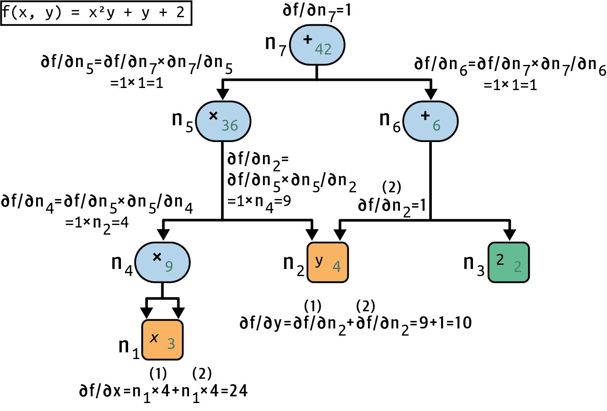

# 附录 A. 自动微分

本附录解释了 PyTorch 的自动微分（autodiff）功能是如何工作的，以及它与其他解决方案的比较。

假设你定义了一个函数 *f*(*x*, *y*) = *x*²*y* + *y* + 2，你需要它的偏导数 ∂*f*/∂*x* 和 ∂*f*/∂*y*，通常用于执行梯度下降（或某些其他优化算法）。你的主要选项是手动微分、有限差分近似、前向自动微分和反向自动微分。PyTorch 实现了反向自动微分，但要完全理解它，先查看其他选项是有用的。所以，让我们逐一介绍它们，从手动微分开始。

# 手动微分

计算导数的第一个方法就是拿起一支铅笔和一张纸，运用你的微积分知识来推导出适当的方程。对于刚刚定义的函数 *f*(*x*, *y*)，这并不太难；你只需要使用五个规则：

+   常数的导数是 0。

+   *λx* 的导数是 *λ*（其中 *λ* 是一个常数）。

+   *x*^λ 的导数是 *λx*^(*λ*) ^– ¹，所以 *x*² 的导数是 2*x*。

+   函数和的导数是这些函数导数的和。

+   *λ* 乘以一个函数的导数是 *λ* 乘以其导数。

从这些规则中，你可以推导出 方程 A-1。

##### 方程 A-1\. *f*(*x*, *y*) 的偏导数

<mtable displaystyle="true"><mtr><mtd columnalign="right"><mstyle scriptlevel="0" displaystyle="true"><mfrac><mrow><mi>∂</mi><mi>f</mi></mrow> <mrow><mi>∂</mi><mi>x</mi></mrow></mfrac></mstyle></mtd> <mtd columnalign="left"><mrow><mo>=</mo> <mstyle scriptlevel="0" displaystyle="true"><mfrac><mrow><mi>∂</mi><mo>(</mo><msup><mi>x</mi> <mn>2</mn></msup> <mi>y</mi><mo>)</mo></mrow> <mrow><mi>∂</mi><mi>x</mi></mrow></mfrac></mstyle> <mo>+</mo> <mstyle scriptlevel="0" displaystyle="true"><mfrac><mrow><mi>∂</mi><mi>y</mi></mrow> <mrow><mi>∂</mi><mi>x</mi></mrow></mfrac></mstyle> <mo>+</mo> <mstyle scriptlevel="0" displaystyle="true"><mfrac><mrow><mi>∂</mi><mn>2</mn></mrow> <mrow><mi>∂</mi><mi>x</mi></mrow></mfrac></mstyle> <mo>=</mo> <mi>y</mi> <mstyle scriptlevel="0" displaystyle="true"><mfrac><mrow><mi>∂</mi><mo>(</mo><msup><mi>x</mi> <mn>2</mn></msup> <mo>)</mo></mrow> <mrow><mi>∂</mi><mi>x</mi></mrow></mfrac></mstyle> <mo>+</mo> <mn>0</mn> <mo>+</mo> <mn>0</mn> <mo>=</mo> <mn>2</mn> <mi>x</mi> <mi>y</mi></mrow></mtd></mtr> <mtr><mtd columnalign="right"><mstyle scriptlevel="0" displaystyle="true"><mfrac><mrow><mi>∂</mi><mi>f</mi></mrow> <mrow><mi>∂</mi><mi>y</mi></mrow></mfrac></mstyle></mtd> <mtd columnalign="left"><mrow><mo>=</mo> <mstyle scriptlevel="0" displaystyle="true"><mfrac><mrow><mi>∂</mi><mo>(</mo><msup><mi>x</mi> <mn>2</mn></msup> <mi>y</mi><mo>)</mo></mrow> <mrow><mi>∂</mi><mi>y</mi></mrow></mfrac></mstyle> <mo>+</mo> <mstyle scriptlevel="0" displaystyle="true"><mfrac><mrow><mi>∂</mi><mi>y</mi></mrow> <mrow><mi>∂</mi><mi>y</mi></mrow></mfrac></mstyle> <mo>+</mo> <mstyle scriptlevel="0" displaystyle="true"><mfrac><mrow><mi>∂</mi><mn>2</mn></mrow> <mrow><mi>∂</mi><mi>y</mi></mrow></mfrac></mstyle> <mo>=</mo> <msup><mi>x</mi> <mn>2</mn></msup> <mo>+</mo> <mn>1</mn> <mo>+</mo> <mn>0</mn> <mo>=</mo> <msup><mi>x</mi> <mn>2</mn></msup> <mo>+</mo> <mn>1</mn></mrow></mtd></mtr></mtable>

对于更复杂的函数，这种方法可能会变得非常繁琐，并且你可能会犯错误。幸运的是，还有其他选择。现在让我们看看有限差分近似。

# 有限差分近似

回想一下，函数 *h*(*x*) 在点 *x*[0] 处的导数 *h*′(*x*[0]) 是该点处的函数斜率。更精确地说，导数定义为通过该点 *x*[0] 和函数上的另一点 *x* 的直线的斜率的极限，当 *x* 无限接近 *x*[0] 时（见 方程 A-2）。

##### 方程 A-2\. 函数 *h*(*x*) 在点 *x*[0] 处的导数定义

<mrow><msup><mi>h</mi> <mo>'</mo></msup> <mrow><mo>(</mo> <msub><mi>x</mi> <mn>0</mn></msub> <mo>)</mo></mrow></mrow> <mrow><mo>=</mo> <munder><mo movablelimits="true" form="prefix">lim</mo> <mstyle scriptlevel="0" displaystyle="false"><mrow><mi>x</mi><mo>→</mo><msub><mi>x</mi> <mn>0</mn></msub></mrow></mstyle></munder> <mstyle scriptlevel="0" displaystyle="true"><mfrac><mrow><mi>h</mi><mrow><mo>(</mo><mi>x</mi><mo>)</mo></mrow><mo>-</mo><mi>h</mi><mrow><mo>(</mo><msub><mi>x</mi> <mn>0</mn></msub> <mo>)</mo></mrow></mrow> <mrow><mi>x</mi><mo>-</mo><msub><mi>x</mi> <mn>0</mn></msub></mrow></mfrac></mstyle></mrow> <mrow><mo>=</mo> <munder><mo movablelimits="true" form="prefix">lim</mo> <mstyle scriptlevel="0" displaystyle="false"><mrow><mi>ε</mi><mo>→</mo><mn>0</mn></mrow></mstyle></munder> <mstyle scriptlevel="0" displaystyle="true"><mfrac><mrow><mi>h</mi><mrow><mo>(</mo><msub><mi>x</mi> <mn>0</mn></msub> <mo>+</mo><mi>ε</mi><mo>)</mo></mrow><mo>-</mo><mi>h</mi><mrow><mo>(</mo><msub><mi>x</mi> <mn>0</mn></msub> <mo>)</mo></mrow></mrow> <mi>ε</mi></mfrac></mstyle></mrow>

因此，如果我们想计算函数 *f*(*x*, *y*) 关于 *x* 在 *x* = 3 和 *y* = 4 处的偏导数，我们可以计算 *f*(3 + *ε*, 4) – *f*(3, 4) 并将结果除以 *ε*，使用一个非常小的 *ε* 值。这种导数的数值近似称为有限差分近似，这个特定的方程称为牛顿差商。这正是以下代码所做的事情：

```py
def f(x, y):
    return x**2*y + y + 2

def derivative(f, x, y, x_eps, y_eps):
    return (f(x + x_eps, y + y_eps) - f(x, y)) / (x_eps + y_eps)

df_dx = derivative(f, 3, 4, 0.00001, 0)
df_dy = derivative(f, 3, 4, 0, 0.00001)
```

不幸的是，结果是近似的（对于更复杂的函数，结果会更差）。正确的结果分别是 24 和 10，但相反，我们得到：

```py
>>> df_dx
24.000039999805264
>>> df_dy
10.000000000331966
```

注意，为了计算两个偏导数，我们至少需要调用 `f()` 三次（在前面的代码中我们调用了四次，但可以进行优化）。如果有 1,000 个参数，我们至少需要调用 `f()` 1,001 次。当您处理大型神经网络时，这使得有限差分近似变得非常低效。

然而，这种方法实现起来非常简单，因此它是一个检查其他方法是否正确实现的绝佳工具。例如，如果它与您手动推导出的函数不一致，那么您的函数可能包含错误。

到目前为止，我们已经考虑了两种计算梯度的方法：使用手动微分和使用有限差分近似。不幸的是，这两种方法对于训练大规模神经网络都是致命的缺陷。因此，让我们转向自动微分，从前向模式开始。

# 前向自动微分

图 A-1 展示了前向自动微分在更简单的函数 *g*(*x*, *y*) = 5 + *xy* 上的工作原理。该函数的图像在左侧表示。经过前向自动微分后，我们得到右侧的图像，它表示偏导数 ∂*g*/∂*x* = 0 + (0 × *x* + *y* × 1) = *y*（我们可以类似地获得关于 *y* 的偏导数）。

算法将从输入遍历计算图到输出（因此得名“前向模式”）。它首先获取叶节点的偏导数。常数节点（5）返回常数 0，因为常数的导数始终为 0。变量 *x* 返回常数 1，因为 ∂*x*/∂*x* = 1，而变量 *y* 返回常数 0，因为 ∂*y*/∂*x* = 0（如果我们寻找关于 *y* 的偏导数，结果将是相反的）。

现在我们已经拥有了向上移动到函数 *g* 中的乘法节点所需的所有信息。微积分告诉我们，两个函数 *u* 和 *v* 的乘积的导数是 ∂(*u* × *v*)/∂*x* = ∂*v*/∂*x* × *u* + *v* × ∂*u*/∂*x*。因此，我们可以构建右边的图形的大部分，代表 0 × *x* + *y* × 1。

最后，我们可以移动到函数 *g* 中的加法节点。如前所述，函数和的导数是这些函数导数的和，所以我们只需要创建一个加法节点并将其连接到我们已计算的部分图。我们得到正确的偏导数：∂*g*/∂*x* = 0 + (0 × *x* + *y* × 1)。


###### 图 A-1\. 前向模式自动微分

然而，这个方程可以被大大简化。通过在计算图上应用一些修剪步骤来去除所有不必要的操作，我们得到一个只有一个节点的更小的图：∂*g*/∂*x* = *y*。在这种情况下简化相对容易，但对于更复杂的函数，前向模式自动微分可能会产生一个巨大的图，这可能很难简化并导致性能不佳。

注意，我们从一个计算图开始，前向模式自动微分产生了另一个计算图。这被称为 *符号微分*，它有两个很好的特性。首先，一旦导数的计算图被生成，我们可以多次使用它来计算给定函数关于 *x* 和 *y* 任意值的导数。其次，如果我们需要的话，我们可以再次在前向模式自动微分的结果图上运行，以获取二阶导数（即导数的导数）。我们甚至可以计算三阶导数，以此类推。

但也可以在不构建图（即数值上，而不是符号上）的情况下运行前向自动微分，只需在飞行中计算中间结果即可。这样做的一种方法就是使用*双数*，这是一种奇特但迷人的形式为 *a* + *bε* 的数字，其中 *a* 和 *b* 是实数，而 *ε* 是一个无穷小数，使得 *ε*² = 0（但 *ε* ≠ 0）。你可以把双数 42 + 24*ε* 看作类似于 42.0000⋯000024 的东西，有无限多个 0（但当然这只是为了给你一些关于双数的概念）。双数在内存中用一对浮点数表示。例如，42 + 24*ε* 由对 (42.0, 24.0) 表示。

双数可以进行加法、乘法等操作，如方程 A-3 所示。

##### 方程 A-3\. 双数的一些操作

<mtable displaystyle="true"><mtr><mtd columnalign="left"><mrow><mi>λ</mi> <mo>(</mo> <mi>a</mi> <mo>+</mo> <mi>b</mi> <mi>ε</mi> <mo>)</mo> <mo>=</mo> <mi>λ</mi> <mi>a</mi> <mo>+</mo> <mi>λ</mi> <mi>b</mi> <mi>ε</mi></mrow></mtd></mtr> <mtr><mtd columnalign="left"><mrow><mo>(</mo> <mi>a</mi> <mo>+</mo> <mi>b</mi> <mi>ε</mi> <mo>)</mo> <mo>+</mo> <mo>(</mo> <mi>c</mi> <mo>+</mo> <mi>d</mi> <mi>ε</mi> <mo>)</mo> <mo>=</mo> <mo>(</mo> <mi>a</mi> <mo>+</mo> <mi>c</mi> <mo>)</mo> <mo>+</mo> <mo>(</mo> <mi>b</mi> <mo>+</mo> <mi>d</mi> <mo>)</mo> <mi>ε</mi></mrow></mtd></mtr> <mtr><mtd columnalign="left"><mrow><mrow><mo>(</mo> <mi>a</mi> <mo>+</mo> <mi>b</mi> <mi>ε</mi> <mo>)</mo></mrow> <mo>×</mo> <mrow><mo>(</mo> <mi>c</mi> <mo>+</mo> <mi>d</mi> <mi>ε</mi> <mo>)</mo></mrow> <mo>=</mo> <mi>a</mi> <mi>c</mi> <mo>+</mo> <mrow><mo>(</mo> <mi>a</mi> <mi>d</mi> <mo>+</mo> <mi>b</mi> <mi>c</mi> <mo>)</mo></mrow> <mi>ε</mi> <mo>+</mo> <mrow><mo>(</mo> <mi>b</mi> <mi>d</mi> <mo>)</mo></mrow> <msup><mi>ε</mi> <mn>2</mn></msup> <mo>=</mo> <mi>a</mi> <mi>c</mi> <mo>+</mo> <mrow><mo>(</mo> <mi>a</mi> <mi>d</mi> <mo>+</mo> <mi>b</mi> <mi>c</mi> <mo>)</mo></mrow> <mi>ε</mi></mrow></mtd></mtr></mtable>

最重要的是，可以证明 *h*(*a* + *bε*) = *h*(*a*) + *b* × *h*′(*a*)*ε*，因此计算 *h*(*a* + *ε*) 一次就可以得到 *h*(*a*) 和导数 *h*′(*a*)。图 A-2 显示，在 *x* = 3 和 *y* = 4 处对函数 *f*(*x*, *y*) 关于 *x* 的偏导数（我将写作 ∂*f*/∂*x* (3, 4)）可以使用双数来计算。我们只需要计算 *f*(3 + *ε*, 4)；这将输出一个双数，其第一个分量等于 *f*(3, 4)，其第二个分量等于 ∂*f*/∂*x* (3, 4)。


###### 图 A-2\. 使用双数进行前向自动微分

要计算 ∂*f*/∂*y* (3, 4)，我们不得不再次遍历图，但这次是带有 *x* = 3 和 *y* = 4 + *ε*。

因此，正向模式自动微分比有限差分近似更准确，但它也存在着相同的重大缺陷，至少当有多个输入和少量输出时（例如处理神经网络时）：如果有 1,000 个参数，就需要遍历图 1,000 次来计算所有的偏导数。这就是反向模式自动微分发光的地方：它只需遍历图两次就能计算所有这些。让我们看看它是如何做到的。

# 反向模式自动微分

反向模式自动微分是 PyTorch 实现的解决方案。它首先沿着图的正向（即从输入到输出）遍历图来计算每个节点的值。然后它进行第二次遍历，这次是反向方向（即从输出到输入）来计算所有的偏导数。名称“反向模式”来自于对图的第二次遍历，其中梯度以相反的方向流动。图 A-3 表示第二次遍历。在第一次遍历期间，所有节点值都已计算，从 *x* = 3 和 *y* = 4 开始。您可以在每个节点的右下角看到这些值（例如，*x* × *x* = 9）。节点用 *n*[1] 到 *n*[7] 标记以供清晰识别。输出节点是 *n*[7]：*f*(3, 4) = *n*[7] = 42。



###### 图 A-3\. 反向模式自动微分

策略是逐步向下遍历图，计算 *f*(*x*, *y*) 对每个连续节点的偏导数，直到我们达到变量节点。为此，反向模式自动微分严重依赖于链式法则，如 方程 A-4 所示。

##### 方程 A-4\. 链式法则

<mrow><mstyle scriptlevel="0" displaystyle="true"><mfrac><mrow><mi>∂</mi><mi>f</mi></mrow> <mrow><mi>∂</mi><mi>x</mi></mrow></mfrac></mstyle> <mo>=</mo> <mstyle scriptlevel="0" displaystyle="true"><mfrac><mrow><mi>∂</mi><mi>f</mi></mrow> <mrow><mi>∂</mi><msub><mi>n</mi> <mi>i</mi></msub></mrow></mfrac></mstyle> <mo>×</mo> <mstyle scriptlevel="0" displaystyle="true"><mfrac><mrow><mi>∂</mi><msub><mi>n</mi> <mi>i</mi></msub></mrow> <mrow><mi>∂</mi><mi>x</mi></mrow></mfrac></mstyle></mrow>

由于 *n*[7] 是输出节点，*f* = *n*[7] 因此 ∂*f* / ∂*n*[7] = 1。

让我们继续沿着图向下到 *n*[5]：当 *n*[5] 变化时，*f* 会如何变化？答案是 ∂*f* / ∂*n*[5] = ∂*f* / ∂*n*[7] × ∂*n*[7] / ∂*n*[5]。我们已经知道 ∂*f* / ∂*n*[7] = 1，所以我们只需要 ∂*n*[7] / ∂*n*[5]。由于 *n*[7] 简单地执行了求和 *n*[5] + *n*[6]，我们发现 ∂*n*[7] / ∂*n*[5] = 1，因此 ∂*f* / ∂*n*[5] = 1 × 1 = 1。

现在我们可以继续到节点 *n*[4]：当 *n*[4] 变化时，*f* 会如何变化？答案是 ∂*f* / ∂*n*[4] = ∂*f* / ∂*n*[5] × ∂*n*[5] / ∂*n*[4]。由于 *n*[5] = *n*[4] × *n*[2]，我们发现 ∂*n*[5] / ∂*n*[4] = *n*[2]，所以 ∂*f* / ∂*n*[4] = 1 × *n*[2] = 4。

这个过程会一直持续到我们到达图的底部。在那个点上，我们将计算出在点 *x* = 3 和 *y* = 4 处的 *f*(*x*, *y*) 的所有偏导数。在这个例子中，我们找到 ∂*f* / ∂*x* = 24 和 ∂*f* / ∂*y* = 10。听起来很合理！

反向模式自动微分是一种非常强大且精确的技术，尤其是在输入很多而输出很少的情况下，因为它只需要对每个输出进行一次前向传播和一次反向传播，就可以计算所有输出相对于所有输入的所有偏导数。在训练神经网络时，我们通常希望最小化损失，因此只有一个输出（损失），因此只需要通过图两次来计算梯度。

PyTorch 在每次前向传播过程中动态构建一个新的图。无论何时你在具有`requires_grad=True`的张量上运行操作，PyTorch 都会计算结果张量并将其`grad_fn`属性设置为特定于操作的物体，这允许 PyTorch 通过此操作反向传播梯度。由于图是动态构建的，你的代码可以非常动态，包含循环和条件语句，而且一切都会正常工作。

反向模式自动微分也可以处理不完全可微分的函数，只要你要求它在可微分的点上计算偏导数。

###### 小贴士

创建一个微小的自动微分框架是一个很好的练习，可以真正掌握自动微分。尝试为小批操作从头开始创建一个。如果你卡住了，可以查看这个项目的`extra_autodiff.ipynb`笔记本，你可以在 Colab 上运行[*https://homl.info/colab-p*](https://homl.info/colab-p)。你还可以观看 Andrej Karpathy 的出色 YouTube 视频，他在视频中从头开始构建了[micrograd 库](https://homl.info/micrograd)。
