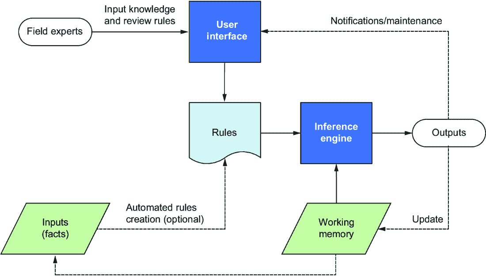
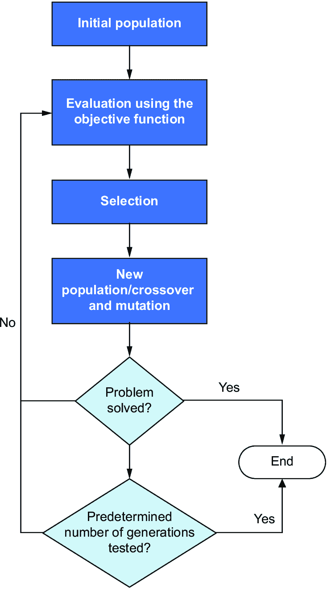

# 第二章：AI 掌握：基本技术，第一部分

### 本章介绍

+   专家系统简介

+   业务规则管理系统简介

+   案例推理系统简介

+   模糊逻辑简介

+   遗传算法简介

本章和下一章探讨了各种 AI 技术，赋予计算机模拟人类认知的能力——从专家系统捕捉、存储和允许我们重复使用的宝贵专业知识，只有有限数量的专家掌握；到系统化决策制定的商业规则。我们将学习案例推理（CBR），它使用类比来通过重用从过去经验中学到的知识来解决问题，以及处理不确定性和航行模糊的模糊逻辑。我们将了解遗传算法在解决解决空间庞大的复杂问题时是如何运作的，以及像挖掘黄金一样的数据挖掘，以揭示隐藏的宝贵见解。我们还将探索神经网络和深度学习令人敬畏的世界，机器从大量的数据中学习。最后，我们将研究无监督学习，这是算法从未被标记的数据中发现隐藏模式。每种技术都有其优缺点，这就是为什么现实世界的应用结合了多种技术的能力。

我尽力避免术语和公式，但我还是会介绍一些你在阅读这一主题时可能遇到的技术术语。如果你只对学习 AI 的故事或者对其潜力发展有一个有见地的观点感兴趣，你可以跳过本章和下一章而不会有连续性的损失。

## 2.1 专家系统

在许多领域，专家都是稀缺的，因为要成为任何一个领域的专家需要多年的学习和实际经验。如果我们能够捕捉、存储和分享这有限数量专家拥有的宝贵专业知识将会非常有益。此外，大量的专家定期退休，带走了他们丰富的知识和重要的业务经验。例如，当有 25 名专家退休时，他们会带走超过 1000 年的集体经验。

如果我们能够找到一种智能的方法，在不一定需要实际专家参与的情况下，为各个领域创造出虚拟专家并有效地解决问题，那该有多好呀？例如，想象一下，你想做一些园艺工作，并且正在尝试为你的气候、土壤和阳光条件选择合适的植物。你可能会问一个园艺专家建议你的情况下最好的植物。现在，假设我们能够提取专家的关于植物类型、土壤条件、天气模式以及与园艺有关的所有知识，设计一个“园艺数字专家”软件。这个例子说明了专家系统的目的，专家系统是指计算机系统，旨在模仿特定领域人类专家的决策能力。

而传统的过程式系统将算法和知识合并在一个单一程序中，专家系统将特定于领域的专业知识与执行程序所使用的过程性方法分离开来。专家系统包括三个主要模块（见图 2.1）：

+   知识库，包含领域专业知识，存储为一组简单的`if`-`then`语句规则。该模块充当了许多专家积累的知识的存储库。

+   工作内存，包含数据输入并跟踪推理引擎所推导出的进展情况。

+   推理引擎，它是一个在循环中运行的计算机程序。在每个周期，它会根据规则评估工作内存中的事实。当规则的条件满足时，该规则可能会产生新的事实，修改现有事实和/或停止循环。如果当前的事实不能触发更多的规则，则循环会自动停止。



##### 图 2.1 专家系统的流程图

这种组件的分离带来了许多好处。它使得没有编程背景的人，比如医生、交易员、承保人员和合规专家，能够在知识库中分享他们的专业知识。这种设置还有助于专家系统的丰富和维护，因为知识可以很容易地添加、更新或从知识库中删除，而不需要修改基础代码。

1972 年，爱德华·H·肖特利夫（Edward H. Shortliffe）创建了 MYCIN[1]，这是最早的专家系统之一。它被用来实验性地诊断细菌感染，并且它从关于细菌生物体、感染部位以及特定临床症状（如发热或头痛）的输入信息中推断。MYCIN 知识库中包含了 500 多个`if`-`then`规则。以下是 Mycin 使用的规则之一：

```py
Rule 20 
IF substrate of culture is blood
AND stain of organism is gram negative
AND morphology is rod
AND patient has been seriously burned
THEN likelihood is 40% that organism is pseudomonas 
```

正如你可能推断的那样，`if`-`then`-`else`格式的简单性至关重要。你可以想象专家制定这样的规则而无需专门的培训。以下是另一个专家系统的规则示例，旨在提高工厂安全性和诊断系统故障[2]：

```py
Rule 27
IF Condenser Temperature Increase
AND Steam Temperature Increase
AND Condenser Pressure Rapid Increase
AND Condensate Level Increase
THEN Emergency Pump is Idle
AND DISPLAY Condensate Pump Break Down and Emergency Pipe Idle
```

商业专家系统的开拓性之一是 eXpert CONfigurer（XCON）。数字设备公司（DEC）是一家计算机供应商，面临着管理各种组件的挑战，这些组件经常变化，并且可以以多种方式配置。在 20 世纪 80 年代初，在开始组装和配置计算机系统之前，来自客户的订单需要手动验证，以确保它们包含所有所需的组件，没有多余的部分。尽管进行了这些手动检查，但配置过程中的错误偶尔仍然存在，因此需要纠正措施。因此，在将计算机运送给客户之前，DEC 的最终装配站会重新评估计算机。XCON 被引入，利用其知识库和一组规则来验证每台计算机的布局。这一创新使得 DEC 能够将大多数组件直接运送到客户现场进行最终装配，从而简化了流程。

另一个显著的系统出现在 1983 年的通用电气公司：柴油电力机车维修专家系统（DELTA）。DELTA 旨在封装大卫·I·史密斯（David I. Smith）的丰富知识，他是 GE 的资深现场服务工程师之一。史密斯因其在机车发动机和维修方面的卓越专业知识而闻名，经常跨国旅行，指导少数学徒。DELTA 由 500 多条针对故障排除和机车维护的规则组成，使其成为该领域的宝贵工具。

总之，必须认识到，在特定领域开发专家系统是一个持续的过程，涉及多个设计阶段和彻底的性能测试。这个过程类似于打造一台精调的仪器，其中每一次迭代都会完善其功能。在这个动态发展过程中，有几个关键活动至关重要。首先，制定新规则可能是必要的，以涵盖更广泛的情景并提高系统的准确性。这些新的见解使系统能够适应不断变化的条件和挑战。其次，不断审查和修订现有规则至关重要。随着专家系统与现实世界的数据交互并遇到各种情况，它会增加调整响应的能力。审查和修订意味着定期更新规则，以保持与该领域当前实践和知识的一致性。还必须认识到，并非所有规则都会永远保持相关性。随着时间的推移，由于领域动态或技术进步的变化，一些规则可能会变得过时或不太有效。因此，这个迭代过程的一部分涉及识别和删除过时规则，以保持系统的效率和准确性。

## 2.2 商业规则管理系统

如果您曾经使用过类似 TurboTax 这样的系统来完成所得税申报，那么您就使用过由 *业务规则管理系统*（BRMS）驱动的应用程序。BRMS 是对专家系统概念的进步，被广泛应用于许多领域。例如，金融机构可以使用这种技术来根据信用评分、收入水平和债务比率等因素确定贷款申请人的资格。这种能力使它们能够简化和自动化决策过程。

一个规则的示例是：“如果申请人的信用评分高于特定阈值并保持稳定收入，则应自动批准申请人。”在医疗保健领域，BRMS 对于帮助医院有效管理病人入院非常重要，它可以基于床位可用性、病人情况和医疗方案等因素自动化决策过程。

业务规则也可以应用于自动驾驶车辆以确保安全。可以设计一组规则来遵守交通规则和法规，包括速度限制、停车标志、交通信号灯和让行规则。此外，可以制定规则来规定自动驾驶车辆如何应对特定的行为和情况，例如优先考虑行人和骑行者而不是其他车辆，处理人行横道、变道、合流、道路封闭、绕行、天气和路况、能见度、交通拥堵和突然停车等。

BRMS（业务规则管理系统）使组织能够轻松地集中、管理和自动化复杂的决策过程。在技术层面上，BRMS 包括几个关键组件：

+   *规则存储库*—该组件作为业务规则的存储库，用于定义、组织和高效存储规则。

+   *规则编制环境*—规则编制环境提供了用户友好的界面，便于规则的创建、修改和测试。它支持业务用户或分析师进行规则开发。

+   *规则一致性模块*—这个关键组件旨在防止系统内规则之间的矛盾。其主要目的是评估新添加或修改的规则，以确保它们不会引入与现有规则冲突或不一致的情况，这可能会导致决策过程中的混乱或意外后果。

+   *推理引擎*—推理引擎是执行定义规则的计算模块。它处理并应用规则以做出决策或在业务流程中自动执行操作。

+   *规则治理*—这个系统对于管理规则版本、跟踪变更并确保符合监管要求和内部标准至关重要。它有助于维护规则修改及其影响的历史记录。

+   *分析工具*—分析工具用于监控和分析规则对业务流程的影响。它为组织提供见解和基于数据的信息，使它们能够完善和优化其规则集。这种优化增强了决策能力和整体运营效率。该模块包括“假如”和“如果不”模拟功能，为组织提供有价值的见解，了解规则调整的潜在益处或缺点，帮助组织做出明智的决策，并优化其业务规则以实现期望的结果，同时减轻意外后果。

这种技术的优点包括其灵活性和简单性，以便非技术人员可以轻松添加、更新或删除任何规则。这就像拥有一个适应您业务需求的规则书，使得维护和修改规则变得更加容易。

业务规则的推理逻辑与早期专家系统的类似，但具有若干限制。例如，无法充分将人类专业知识包含在简洁的逻辑片段中，这些片段可以转换为`if`-`then`-`else`规则。即使在看似可行的情况下，也很难完全提取熟练专家的全面知识，并有效地将其专业知识转移到计算机中。

我在巴黎内克尔医院（Centre Informatique Necker Enfant Malade，CINEM）的博士研究期间面临了这一挑战。我的目标是开发一个模拟程序，用于指导医学生进行临床推理。该程序旨在帮助他们准备临床实践，并避免在为患者提供护理时出现错误。

临床推理是一种需要多年实践才能掌握的技能，而且大部分的专业知识和经验很难通过面试来提取。医生的很大一部分专业知识和技能是隐性的，难以表述。即使医学专家能够解释他们的临床推理，概述大部分潜在逻辑和因果关系仍然是一项艰巨的任务。基于规则的医学决策可能涉及许多复杂问题：

+   我们应该如何对紧急性、年龄或既往病史等情境因素进行分类，以及它们如何影响特定行动方案的后果？

+   我们如何建立一套连贯、非矛盾且有意义的规则，以应对不同的情境和场景？

+   我们如何代表临床经验，并将其与解剖学、病理学和器官系统的事实信息联系起来，这些是给定案例的重要背景知识？

+   我们如何适应行为变化或数据分布的变化？

## 2.3 基于案例的推理

如果我们能找到一种智能的方式来存储和重用在任何特定领域获得的专业知识，那岂不是太好了？重用专业知识很重要，因为它影响我们记忆、推理和解决问题的能力。例如，假设我们可以编写一个程序，通过重用包含过去患者病例的库来重用医生在医学诊断方面获得的专业知识，以治疗出现类似症状的新患者。程序将首先通过比较重要症状、病史、年龄、性别和其他上下文因素，检索具有相似症状和情况的类似病例。该程序还将能够根据新患者的独特特征进行调整和个性化治疗。根据结果，我们将向我们的“专业知识库”添加这位新患者的知识和特点。我们的专业知识还应包含失败的结果，以避免犯同样的错误。我们更新我们的库的次数越多，它在治疗患者方面就越有效率。

这个例子描述了 CBR 方法，这是一种涉及通过参考和调整类似过去经验的解决方案来解决新问题的 AI 技术。对于每个新问题，第一步是在案例库中搜索与新问题相似的案例。一旦找到一个或多个相似的案例，系统将评估是否可以直接使用任何现有解决方案或它们的组合，或者是否需要根据新问题与类似案例之间的相似性和差异进行调整以适应新问题。一旦解决了新问题，就将调整后的解决方案和针对新问题的特定数据添加到库中以供将来使用。这种案例丰富提高了 CBR 随时间的效率。

CBR 是一种利用过去经验来解决新问题和类似问题的 AI 技术。它涉及一系列三个步骤：

1.  *检索* ——在这一步中，CBR 从其案例库中识别并检索与当前问题相似的相关案例。

1.  *重用* ——一旦检索到相关案例，CBR 系统将评估这些案例中存储的知识的适用性。这一步通常涉及调整和调整，以使解决方案适合当前问题，因为过去案例中使用的解决方案可能不直接适用于当前问题。

1.  *修订* ——解决当前问题后，修订后的解决方案将添加到案例库中。随着更多案例的解决和插入到案例库中，CBR 系统在其领域内解决问题的能力变得更加熟练。这种自适应和知识驱动的方法使 CBR 在技术支持、故障排除和维护任务中特别有价值。

为了说明这些步骤，让我们思考以下场景。假设您将车辆送到汽车修理店进行维护。抵达后，技工开始交谈，收集关于您遇到的问题的信息。您可能会提到您的汽车出现振动，排气噪音大，且有明显的烧机油气味。此时，技工迅速回想起过去类似情况，以确定影响您车辆的潜在问题。他们处理的每个任务都有助于加强他们的专业知识，提高他们的理解能力，并在此过程中不断完善他们的技能。

与专家系统和业务规则管理系统相比，CBR 的一个重要优势是无需编写显式规则。与需要耗时的规则制定的专家系统不同，CBR 利用真实世界的案例及其相关解决方案来解决新问题。这一特点极大地减少了知识工程的工作量，并使 CBR 成为在各个领域中将专家知识编码为显式规则具有挑战性的一种有效技术。此外，CBR 直接从经验中学习的能力不仅简化了知识获取，还增强了其适应性，使其成为处理不断变化的情况的有价值的技术。

由于 CBR 依赖于过去的案例来解决问题，当面临在案例库中缺乏紧密类比的问题时，可能会遇到挑战。此外，随着案例库随着时间的推移而扩大，存储和检索案例可能变得计算密集。这些因素可能会显著影响 CBR 系统的实时性能。

## 2.4 模糊逻辑

在现实生活中，情况通常缺乏明确的、容易识别的、明确正确或错误的答案。相反，它们通常包含多种潜在结果和要考虑的因素。以医学诊断为例。患者不仅经历和描述症状方式不同，而且当医生询问头痛或疲劳等问题时，答案通常不是简单的*是*或*否*。患者通常使用*有时*、*通常*、*很少*和*经常*等术语来表达他们症状的不同程度。此外，症状的感知和标记，如*无*、*轻微*、*中等*、*严重*和*强烈*等词语，由于独特的生理、心理、过去经验、疼痛阈值和耐受性，患者之间可能差异很大。这些变化导致了对疼痛的不同描述和评级，而使用二进制逻辑系统（仅限于*存在*或*不存在*）无法充分代表这些变化。另一方面，模糊逻辑提供了一种更适应和高效捕捉这些细微差别的方法。

**模糊逻辑**，可能更应该被称为“灵活逻辑”，是处理决策和控制系统中的不确定性和模糊性的数学框架。Lotfi Zadeh [4] 在上世纪六十年代开创了这种创新方法，以克服传统逻辑的约束，允许在“完全真”和“完全假”之间有一个细微的真实度量。模糊逻辑依赖于模糊集的概念来表示部分成员资格，并捕捉集合之间的渐进过渡。例如，在定义高个子和矮个子时，模糊集认识到身高是一个连续体，个体可以同时以不同程度属于两个集合。

要说一个人是高个子，传统逻辑要求我们指定一个身高 *h*，并且他们是高个子的陈述将取决于他们的身高是大于还是小于 *h*。例如，假设我们决定一个人的身高至少是 6 英尺 2 英寸时才算高个子。那么关于假设人们身高的陈述可以使用传统逻辑通过指定二进制真值（是或否，1 或 0，真或假）进行评估，如表 2.1 所示。

##### 表 2.1 根据身高确定高个子和矮个子的值

| 姓名 | 身高 | 高个子 | 矮个子 |
| --- | --- | --- | --- |
| 加里  | 6’1”  | 0  | 1  |
| 乔  | 6’3”  | 1  | 0  |
| 桑迪  | 5’6”  | 0  | 1  |
| 苏  | 6’1”  | 0  | 1  |

每个人在高个子和矮个子集合中的成员资格分别在第三和第四列中指示。鉴于我们的标准是 6 英尺 2 英寸，很明显乔是高个子而不是矮个子，桑迪是矮个子而不是高个子。表格中的 1 和 0 表明了这一点，这些情况似乎是明显的。然而，直觉上不应该将苏和加里归类为矮个子，尤其是当他们的身高与桑迪相比时，他们几乎与乔一样高。我们可能觉得适用于乔的情况也应适用于加里和苏，但传统逻辑要求一个人要么高要么矮，没有中间选项。

让我们考虑另一个例子。假设一家银行正在使用一组规则来决定申请人是否会获得贷款，其中一条规则是：

```py
IF "X has a bachelor's degree" is TRUE 
AND Number of years employed ≥ 2
AND income ≥ $100,000
THEN "Loan approved" = TRUE
```

该规则本质上是说，拥有大学学位、已经工作两年或更长时间且收入较高（超过 10 万美元）的客户的申请将获得批准。假设一位申请人拥有硕士学位，收入超过 20 万美元，但只工作了一年零 11 个月零 27 天。在这种情况下，申请人将被拒绝。当然，在现实生活中，这种贷款拒绝是没有意义的，这种严格的阈值处理方式对银行和借款人都不利。基于模糊逻辑的决策将允许银行与潜在的优质客户建立关系，因为它会认识到一年零 11 个月零 27 天已经足够接近两年。

模糊逻辑有助于处理不确定、不精确、模糊、不完整和嘈杂的数据。它成为现代技术的基础，用于各种情况，包括面部识别、空调、洗衣机、汽车变速器、天气预报和股票交易。作为人类，我们经常在不知不觉中使用模糊逻辑。当我们停车时，我们不会考虑把方向盘向左转 20 度，然后以每小时两英里的速度倒车。相反，我们会考虑稍微向左转一点，然后可能再稍微向右转一点，然后缓慢倒车。防欺诈专家可能会制定一条规则，例如：“当跨境交易数量很高并且交易发生在晚上时，该交易可能可疑”，或者化工厂的经理可能会说：“如果储罐内的温度过高，降低压力。”

这些情景都不能用二元区分（如真/假、是/否或 0/1）来恰当地描述。模糊逻辑通过处理细微差别的输入而不是二元输入，使许多领域受益。

由于其处理不确定性和不精确性的能力，模糊逻辑在各个领域中提供了几个优势，使其非常适合处理模糊性特征的系统。此外，模糊逻辑在处理嘈杂数据时表现出色，即使处理不完整或不准确的信息时也保持高效。这种技术进一步简化了复杂控制系统，增强了它们在设计和理解上的直观性。这使得模糊逻辑在从工业控制和机器人技术到医学诊断和自然语言处理等众多应用中都非常有价值。

模糊逻辑在许多应用中具有强大的功能，但它也有局限性。其中一个关键挑战是其潜在产生难以理解或用日常语言解释的结果。这种缺乏清晰度在像医疗保健这样的关键领域中可能特别棘手，那里透明的解释是至关重要的。另一个限制在于选择适当的隶属函数和参数的复杂性。在这方面做出错误的选择可能会严重影响模糊逻辑系统的性能。例如，考虑在模糊逻辑系统内确定某物的热度或冷度；这些决定可能是主观的，并且常常严重依赖于专业知识。

## 2.5 遗传算法

假设我们想找到将产品从大型制造商运送到零售商的最有效方式。我们需要优化资源分配、选择最佳的时间、最佳路线以及需要优化的许多其他因素。使用遗传算法解决这一供应链问题涉及许多潜在解决方案（种群），包括不同的路线、分销计划和排程方法。我们应该选择一种评估（适应度评估）这些潜在解决方案的方法，根据交货时间、成本和其他因素。下一步是根据它们在速度、成本和其他因素方面的表现对解决方案进行排序，并选择（选择）这些解决方案中的一组需要组合（交叉）以找到最佳解决方案。

这个想法是将两个好的解决方案的部分结合起来，以创建一个更好的解决方案。例如，我们可以将一个解决方案的更快路线与另一个解决方案的资源分配结合起来，从而创建一个新的、更好的解决方案。偶尔，对解决方案进行随机改变（突变）可以导致完全新的策略和解决方案。一旦交叉和突变完成，我们将得到一个新的种群，它们应该更好，因为它们是结合最佳潜在解决方案的结果。我们重复这个过程多代直到没有改进或达到特定的周期数。

这个例子描述了遗传算法的方法。这种技术从一组潜在解决方案开始，评估它们，组合更好的解决方案，引入随机性来搜索新的选项，然后重复这个过程，直到找到最有效的解决方案。

遗传算法是优化算法。由 John Holland 于 1960 年发明并在多年来得到改进，其灵感来源于达尔文的自然选择原理，即所有物种都有一个共同的祖先，并且物种随着时间的推移而进化。达尔文还引入了自然选择的概念，即适应其环境的种群成员更有可能生存和繁殖后代。遗传算法的美妙之处在于其简单性。它不是通过彻底分析可能是天文数字的可能性来解决问题，而是生成问题的潜在解决方案，评估它们在评分系统上的性能，并将它们演化到某种理想状态。性能最差的候选解决方案被丢弃，最好的解决方案被保留，并且通过轻微修改顶级表现者来创建新的解决方案。新的变体与现有的解决方案进行评估，这个过程会持续下去，直到获得具有合适性能的解决方案为止。

在他更正式的描述中，Holland 通过使用恰当的术语（例如*交叉*、*适应度*和*突变*）将他的算法与自然选择联系起来。然而，为了在特定情况下保持这种类比，我们必须找到一个好的目标函数来评估随机生成的解决方案，我们需要一个足够大的种群大小，一个合适的突变率，以及一个有效的交叉程序来从现有解决方案中创建新的候选解决方案。

遗传算法通常包括以下步骤，如图 2.2 所示：

1.  选择初始种群。每个种群成员代表了我们问题的一个可能解决方案。

1.  使用选择的目标函数评估种群中的每个个体，并为其分配适应度得分。

1.  消除得分低的个体。

1.  通过突变或结合得分最高的个体的副本创建新个体。

1.  将新个体添加到种群中。



##### 图 2.2 遗传算法的流程图

重复步骤 2 到 5，直到经过了指定的时间量，测试了预定数量的世代，或者该过程停止产生更高适应度的个体为止。当过程结束时，拥有最高适应度得分的种群成员即为问题的解决方案。

注意，理论上，可能仍然存在更好的解决方案，因此遗传算法最适合于接受足够好的解决方案的问题，对于这些问题，只需要达到令人满意但不完美的性能就足够了。

遗传算法相对于经典优化技术有许多优势。首先，它们相对容易理解，但可以用来解决极其复杂的问题。其次，如果给予足够的时间，即使完美解决方案不可用，它们也会始终提供接近最优的解决方案。第三，它们非常适合并行计算，这种方法会同时执行许多计算，从而实现快速求解。

在 1992 年，Holland 总结了遗传算法的概念，并在《科学美国人》的一篇文章[5]中宣扬了它的潜力：

> 实用主义研究人员认为，进化的卓越力量值得效仿，而不是羡慕。自然选择消除了软件设计的最大障碍之一：预先规定问题的所有特征以及程序应该采取的行动。通过利用进化的机制，研究人员可能能够“培育”出即使没有人可以完全理解其结构也能解决问题的程序。实际上，这些所谓的遗传算法已经证明能够在喷气发动机等复杂系统的设计中取得突破。遗传算法使得可以探索比传统程序更广泛的潜在解决方案。

为了更好地理解遗传算法的威力，让我们来看看著名的旅行推销员问题（TSP），以及其臭名昭著的*组合爆炸*，这个术语描述了问题的复杂度略微增加就会导致寻找解决方案的难度急剧增加。 TSP 要求我们找到访问一系列城市的最佳顺序，其中最佳路径可能是最短的，最经济的，或者可能是最风景如画的。由于要比较的路径数量可能极其庞大，制作列表并检查每个路线的长度并不是一个可行的选择。

遗传算法解决 TSP 的过程如下：

1.  *初始种群* —遗传算法从随机生成或使用启发式方法开发的初始解决方案种群开始。每个潜在解决方案是一个城市序列，其中每个城市仅访问一次，并且序列以开始时的第一个城市结束。

1.  *适应性函数* —适应性函数评估解决方案的质量。在 TSP 中，它可能是一个计算给定解决方案的总行程距离的函数。我们也可以选择使用不同的度量标准作为适应性函数。

1.  *选择* —总行程距离较短的解决方案将被保留用于下一步。也可以使用其他方法进行选择。

1.  *交叉* —交叉包括将两个解决方案组合成一个新的解决方案。在 TSP 中，这一步可能涉及选择一个解决方案的一部分，并用另一个解决方案的城市完成它，同时保持顺序。

1.  *突变* — 突变涉及在解决方案中引入微小的随机变化，以在潜在解决方案的种群中引入变化。在 TSP 中，突变可以涉及两个城市的交换。

来自交叉和突变的解决方案将成为我们的新种群。遗传算法通过前述步骤迭代，直到找到最佳解决方案或达到预定义的终止标准，如最大世代数。

遗传算法在各种优化问题中具有广泛的应用，涵盖供应链、金融模型、股票交易所、生产计划、汽车制造和机器人技术。考虑一个固定车队的学区，旨在有效地在每个孩子的住所接送他们并安全地将他们送到学校。他们的目标可能是发现一组路线，以最小化公交车的总行驶距离，同时确保没有孩子在上午 7 点之前上车，并确保每个孩子在上午 8 点之前到达学校。

随着要访问的位置数量的增加，问题的复杂性显着增加。这种复杂性在表 2.2 中生动地说明，该表概述了在访问各种位置时，假设任意两个位置之间有直接路径时，单个公交车的可能路线数量的指数增长。

##### 表 2.2 学校校车路线示例的遗传算法的复杂性

| 要访问的地点数 | 要比较的可能路线数 |
| --- | --- |
| 1  | 1  |
| 2  | 2  |
| 3  | 6  |
| 4  | 24  |
| 10  | 3,628,000  |
| 20  | 2,432,902,008,176,640,000  |

正如我们所看到的，数字变得非常大。解决类似的组合问题可能非常具有挑战性，在某些情况下，经典算法可能无法解决。在科学领域，就像在许多其他领域一样，最有效的想法通常很简单，而遗传算法提供了这个原理的一个典型例子，提供了一种简单但非常有效的解决复杂问题的方法。

遗传算法是一种强大的优化技术，但像所有其他 AI 方法一样，它们也有一定的局限性。首先，不能保证它们会找到最佳解决方案，它们的性能严重依赖于初始种群和参数调整。它们还需要大量的计算资源，对于复杂问题可能会很慢。此外，它们提供的解决方案可能难以解释。尽管存在这些限制，但遗传算法在解决各种类型的问题方面表现突出，特别是在复杂性较高的情况下，其他方法可能效果不佳的情况下。

## 摘要

+   专家系统是使用由领域专家制定的`if`-`then`规则评估数据的软件程序。随着时间的推移，它们随着各种管理和部署模块的添加而发展，形成了业务规则管理系统。

+   案例推理是一种将人类知识转化为广义案例的技术，然后可以应用于解决类似问题。

+   模糊逻辑被引入以解决在现实场景中使用严格的真/假区分所带来的限制。当处理需要细致理解的问题时，它尤其有价值。

+   遗传算法从生物学中汲取灵感，以找到问题的最优解决方案。它通过测试、组合和修改潜在解决方案来实现这一目标，保留表现良好的解决方案，而丢弃表现不佳的解决方案。
