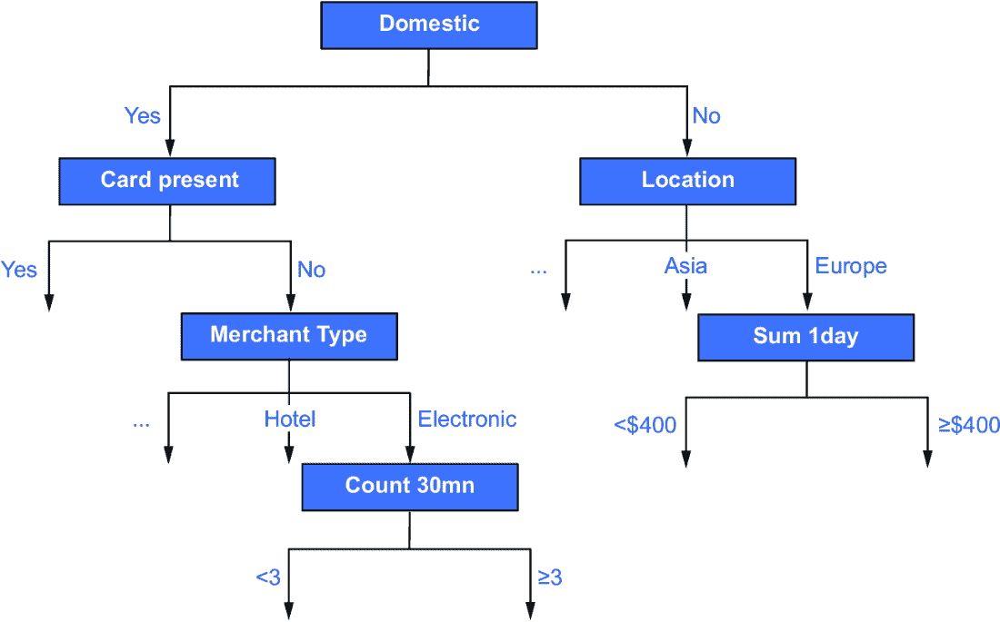
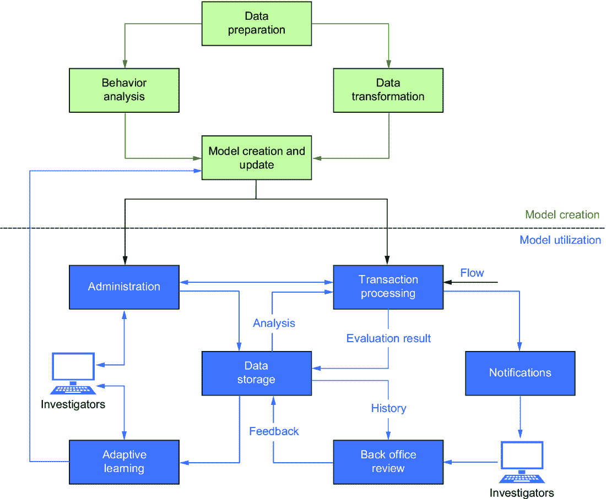
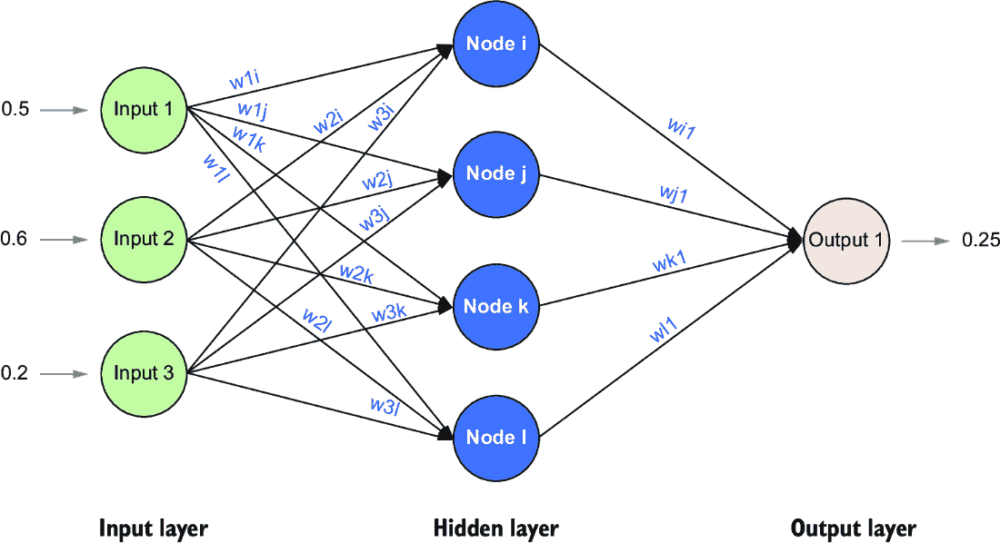
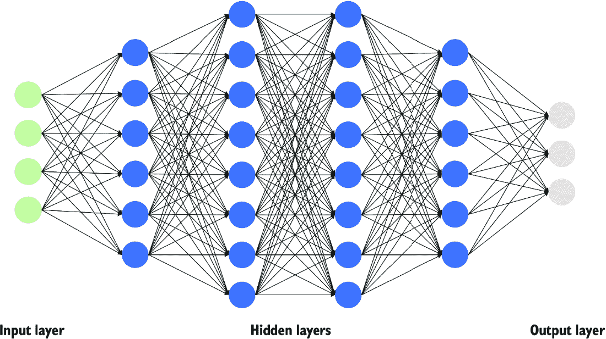
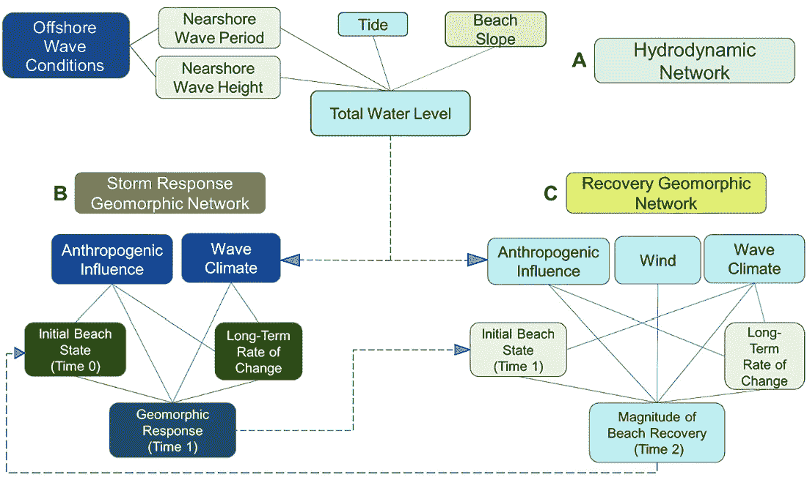

# 第三章：AI 精通：基本技术，第二部分

### 本章内容包括

+   数据挖掘简介

+   人工神经网络概述

+   深度学习描述

+   贝叶斯网络简介

+   无监督学习概述

AI 专家阿瑟·塞缪尔，在第一章介绍了他 1959 年的跳棋程序的成功后，将机器学习定义为一门研究计算机如何在没有显式编程的情况下学习的领域。“没有显式编程”可能会误导，因为学习是通过数据挖掘和神经网络等技术实现的，这些技术依赖于工程师显式编程的算法。

在本章中，我们将探讨数据挖掘，这是一种从数据中提取有价值信息、模式和关联的技术。我简要介绍贝叶斯网络，这是一种编码感兴趣变量之间概率关系的方法。然后我介绍人工神经网络和深度学习，这些强大的模式识别算法在计算机视觉、自然语言和音频处理领域取得了令人印象深刻的结果。我们将本章内容以无监督学习结束，这些算法能够分析未标记的数据集以发现相似性和差异。我会提供足够的细节让你理解这些机器学习技术的含义和应用，但我们不会陷入理论的细节。

## 3.1 数据挖掘

想象一下一个能帮助杂货店确保货架上始终摆放着新鲜农产品的程序，精确地在需要时提供，消除了库存过剩或热门商品缺货的问题。该程序还擅长优化商店布局，战略性地放置互补商品以提高销量，调整价格以实现最大利润，并根据个别顾客过往的购买情况制定个性化促销活动和折扣，以增强客户忠诚度，提高销售额和优化利润。这个例子完美地说明了数据挖掘技术能为零售业带来的众多好处之一。数据挖掘是一种人工智能方法，包括一系列技术和算法，用于从庞大而复杂的数据源中发现隐藏的模式、关系和有价值的见解。随着组织越来越意识到从他们掌握的日益庞大的数据中提取可行动的见解的巨大价值，它的应用也是广泛的且不断发展的。的确，由于互联网的普及、电子商务的普及、大多数商业产品上的条形码的使用、社交媒体的普及和无处不在的网络追踪，近几十年来可用数据的数量呈指数增长。由廉价数据存储的推动促进的数据的激增，造成了需要自动化技术来从中提取知识和见解的需求。显然，个人无法处理或分析甚至是一小部分可用数据。

就像金矿开采一样，从一大堆岩石和沙子中提取金子一样，数据挖掘旨在发现庞大数据集中隐藏的有意义的相关性、模式、异常或规则。形式上，数据挖掘是指一系列用于分类、预测、聚类和市场篮子分析等任务的算法集合。这些算法利用统计、概率和数学技术来识别数据模式，其中一些实现的命名如 SLIQ [1] CART [2]、C4.5 [3] 和 CHAID [4]。

数据挖掘算法在各个行业都有应用。例如，迪士尼的 MyMagic+项目利用数据挖掘来增强其运营和基础设施的效率。一个显著的应用是将其用于最小化景点和餐厅等待时间。

食品行业利用数据挖掘进行需求预测和产品竞争定价。例如，像麦当劳这样的连锁公司利用数据挖掘来确定新店的最佳位置。地方政府应用数据挖掘来预测交通流量，特别是在高峰时段，而公用事业公司利用数据挖掘来预测电力需求并维持可靠供应。

典型的数据挖掘任务涉及分类，即将标记数据分类为有意义的组。从分析数据中得出的知识通常以决策树的形式表示。决策树是一种流程图，通过树中的一系列问题或测试将输入数据与适当的类别关联起来。每个节点评估数据的特定属性，每个不同的属性值对应于从该节点发出的一个分支。输出节点，也称为叶子节点或终端节点，表示一个类别或决策。位于输入节点和终端节点之间的节点通常被称为测试节点。

决策树的结构是根据数据推断出来的。数学公式被用来评估每个节点在有效地做出决策方面的潜在贡献，而最有区别性的节点被战略性地放置在树的开头。例如，如果你想确定一个动物是否是鸟类，你可能首先考虑的问题是它是否有羽毛，或者它是否能飞。另一方面，询问它是否栖息在森林中不会让你迅速做出决定。

## 3.2 防欺诈的决策树

银行承担着有效管理与信贷和支付交易相关的风险的重大责任。鉴于涉及的资金数额巨大，银行业务中的任何安全漏洞都可能对机构的声誉产生严重不利影响。当信用卡在商家位置使用时，一个高效的基于人工智能的系统必须迅速提供授权决策，通常在毫秒内。为了识别潜在的欺诈活动，这个系统需要评估与卡片相关的众多参数，同时处理每秒数万笔交易而不会造成任何延迟。考虑到在感恩节后的黑色星期五，即传统上标志着美国圣诞购物季开始的日子，系统所遭受的大量查询。

要构建一个发卡银行可以用于实时防欺诈的决策树，我们可能会分析他们信用卡交易的 18 个月。每个交易记录将包含许多属性，例如购买金额、购买时间和日期、国际还是国内商家、商家类别代码（表示商家业务类型）、地理区域，以及交易时卡片是否出现。每笔欺诈交易都必须由人工标记为欺诈。

决策树将通过权衡每个属性对帮助风险系统实时决定是否接受或拒绝信用卡交易来构建。属性空间将基于重要性进行递归划分，并且对于形成评估最有用的属性将放置在决策树的最前面。在防止欺诈的例子中，数据可能显示国际交易比国内交易更常见，因此，首先应该提出这个问题。因此，与这个问题相关联的节点将是树中的第一个。

创建了这个初始节点后，我们创建两个分支，一个用于国内交易，一个用于国际交易。然后我们重复这个过程，以找到与每个分支相关的交易最具有区分性的问题。对于国内交易，也许数据显示，在线或电话交易的欺诈可能性显著高于刷卡交易。

在这种情况下，我们接下来可能要问的最重要的问题可能是卡片是否出现在交易中，而在决策树中跟随国内分支的节点可能会解决这个问题。我们会在国内路径上创建一个“卡片存在”分支和一个“卡片不存在”分支，并且我们会重复这个过程，直到所有可用属性都以高效的决策树形式表示出来。图 3.1 展示了我们正在讨论的决策树的前几个节点。

##### 图 3.1 决策树的前几个层级。在实际应用中，完整的树可能包含数千个节点。

对于商业应用，我们并不总是仅依赖于交易记录中可用的原始属性。我们可能还会尝试通过进一步的分析来丰富数据的属性。对于我们的信用卡授权问题，我们可能意识到过去 15 分钟或过去一小时内执行的交易数量的问题的重要性，或者研究可能会识别涉及餐厅和加油站的可疑购买模式。决策树中表示的逻辑有时会被转化为一组`if-then-else`规则，这样做更容易理解，特别是如果树非常大的话。

总结一下，数据挖掘项目通常遵循一个迭代过程：

1.  了解应用领域和数据挖掘项目的目标

1.  收集数据，这通常涉及成本高昂的标记步骤

1.  整合来自各种来源收集的数据

1.  清理数据以消除不一致性

1.  分析以识别丰富数据的新属性

1.  将数据分成至少两组，一组用于训练，一组用于测试

1.  选择合适的数据挖掘算法

1.  使用指定的训练数据构建系统

1.  对决策树进行修剪，以保持模型足够的一般性

1.  使用指定的测试来测试模型并评估其性能

1.  测试模型的可扩展性和韧性

1.  重复步骤 2 至 11 直至达到期望的性能

1.  部署模型并将系统集成到运营中

图 3.2 显示了一个流程图，概述了数据挖掘模型的创建和部署过程。

##### 图 3.2 描述了设计和部署数据挖掘模型的各个步骤的流程图示例

虽然决策树算法是最流行的，但也使用其他数据挖掘技术。例如，关联分析经常用于市场篮子研究，试图识别出倾向于一起购买的产品集。这种直接的方法基于加法、交集和并集。例如，假设我们有一百万张收据，其中有 20,000 张包含购买面包和奶酪，5,000 张包含面包、奶酪和橄榄。我们可以从这些数据推断，购买面包和奶酪的顾客还购买橄榄的可能性为 25%。通过关联分析获取的关于顾客购买习惯的信息可以用于制定交叉销售策略、提供相关优惠券，甚至优化产品在商店货架上的展示方式。通过相关方法获得的信息可以用于预测返利活动的效果或制定改善客户保留的策略。

数据挖掘提供的预测和指导的价值严重依赖于输入的质量，“垃圾进，垃圾出”（GIGO）这句格言非常贴切。不可靠的数据导致不可靠的模型，当从多个来源以不同格式编译数据时出现的不一致性会带来重大问题。软件甚至人员几乎无法辨别数据是否被错误标记，而且在数据首次记录时个人可能会产生的偏见和其他主观影响也是挑战之一。在实际情况中应用数据挖掘也会面临实际挑战。例如，决策树的结构和逻辑无法根据新信息逐步更新，因此决策树无法有效地适应数据和行为的变化。

## 3.3 人工神经网络

想象一下，我们想教会计算机如何识别手写数字 0 到 9。一开始，我们向我们的程序展示了许多手写数字的图片（训练示例）来训练程序。我们的程序依靠不同的层来学习。例如，第一层会查看图片并尝试识别边缘和曲线等东西。下一层将使用第一层的结果来寻找形状，如环和线。例如，数字 8 有一个形状，类似于两个圆叠在一起。我们可以通过进一步深入更多的层来继续这个过程。通过所有这些层后，我们的程序猜测图片中的数字是什么。我们将我们程序的猜测与图片中的正确数字进行比较。如果程序猜错了——例如，当数字实际上是 7 时，它猜测成了 1——我们告诉程序它犯了一个错误。然后程序将调整其参数（数值），这些参数作为程序分类背后的秘密配方。这些数字反映了某些形状、输入或特征的重要性以及它们如何强烈地影响程序的响应。在训练过程中，程序通过称为反向传播的过程微调这些参数（称为权重），该过程通过发现最小化错误的权重的最佳组合来学习识别模式和做出正确的预测。这些权重是我们的程序学习将不同的信息片段分配重要性的方式。我们提供的图片越多，我们的程序就会越好地学会识别数字。在这个例子中，我们描述了训练神经网络的方法。

人工神经网络被构想为将输入数据转换为输出数据的脑细胞的算法模型。这个概念的引入归功于 1943 年 McCulloch 和 Pitts，当时他们证明布尔运算可以使用“神经”元素来执行，这些元素模仿生物神经元。自 1950 年以来，这个领域取得了重大进展。

1958 年，Frank Rosenblatt 引入了感知机，标志着人工神经网络领域的一个关键时刻，因为它能够根据训练数据学习和调整其决策。尽管感知机是一个简单的程序，有许多限制，但它为神经网络的进一步发展奠定了基础。1960 年，Bernard Widrow 和 Marcian Hoff 开发了第一个应用于实际问题的神经网络系统。他们设计了 ADALINE（自适应线性神经元），它识别二进制模式，使其能够在读取来自电话线的流比特时预测下一个比特。MADALINE（多个 ADALINE）被开发出来以消除电话线上的回声。

在他 1974 年的博士论文中，于 1994 年重印的[5]中，Paul Werbos 提出了使用神经网络来近似动态规划开发强化学习系统的构想。动态规划是一种将复杂问题转化为一系列简单问题的优化方法。1986 年，Rumelhart、Hinton 和 Williams 重新发现了反向传播技术，并通过发表反向传播训练算法[6]，使这一基本技术广为人知。

反向传播算法结构包括一个输入层、一个或多个隐藏层和一个输出层。每个节点或人工神经元都连接到另一个，并具有权重和阈值。如果任何节点的输出超过指定的阈值，该节点将被激活，将数据传输到网络的下一层。否则，不会将数据传递到网络的下一层。图 3.3 描述了一个具有三层（输入、隐藏和输出）的反向传播算法结构。

+   *输入层*—该层接收输入到网络中的输入数据。

+   *隐藏层*—神经网络使用连接层之间的权重值对从训练数据中学到的信息进行编码。

+   *输出层*—输出层收集了隐藏层中所做的预测并计算模型的预测。

##### **图 3.3 一个具有三层的反向传播模型**

图 3.3 中的输入值为 0.5、0.6 和 0.2。输入层和隐藏层中的每个节点都连接到下一层的所有节点，并且在特定层内部之间没有连接。每个节点之间的连接都有一个关联的权重因子。最初，节点之间以随机权重连接。训练过程包括通过迭代处理一组训练样本并将其预测与每个样本的正确标签进行比较来修改这些权重的值。当结果不同时，权重会被调整。这些权重修改是向后进行的（即，从输出层通过每个隐藏层向下到输入层），因此称为反向传播算法。虽然不能保证，但权重最终会收敛，学习过程结束。这些修改后的权重，它们是介于 0 和 1 或-1 和 1 之间的数字，代表了神经网络学到的内容。

单个神经网络节点的输入必须是数值型的，并且必须落在闭区间范围内[0,1]或[-1,1]，这需要将输入归一化为训练示例中每个属性的值在 0 到 1 或-1 到 1 之间。可以对离散值属性进行编码，使每个域值有一个输入单元。举个例子，假设我们有属性婚姻状况，其值为单身、已婚、丧偶和离婚。一种可能的方法是将这四个值表示为单身=(1,0,0,0)、已婚=(0,1,0,0)、丧偶=(0,0,1,0)和离婚=(0,0,0,1)。

对于数值数据，我们可以应用简单的公式

规范化值 = (值 – 最小值) / (最大值 – 最小值)

其中 MIN 表示数据集中的最小值，MAX 表示数据集中的最大值。

例如，考虑数字 2、4、5、6、20、56 和 62。最小值为 2，最大值为 62，范围为 60。按照规范化过程并四舍五入到最接近的百分之一，得到表 3.1 中的结果。

##### 表 3.1 规范化过程

| 原始数 | 规范化值 |
| --- | --- |
| 2  | (2 – 2)/60 = 0  |
| 4  | (4 – 2)/60 = 0.03  |
| 5  | (5 – 2)/60 = 0.05  |
| 6  | (6 – 2)/60 = 0.07  |
| 20  | (20 – 2)/60 = 0.3  |
| 56  | (56 – 2)/60 = 0.9  |
| 62  | (62 – 2)/60 = 1  |

反向传播算法仍然是训练监督式人工神经网络的广泛使用的方法。最初，神经网络的连接是使用随机生成的权重建立的，通常在 0 和 1 之间，连接不同的节点。训练过程是迭代的，涉及将训练示例呈现给网络。

在每次迭代过程中，将一个带标签的示例输入到网络的输入层。然后算法通过一种称为前向传播的过程计算网络的输出，这包括通过隐藏层进行计算以产生最终输出。随后，算法将此输出与预期结果或目标值进行比较。当计算得到的输出值与预期结果不同时，反向传播算法就会起作用。它通过沿着隐藏层向输入层进行回溯，调整网络的权重以最小化误差。这个迭代过程将持续进行，直到网络的性能提高并达到所需的准确度。

尽管成功并非肯定，但这个过程会通过大量周期的重复来重复，直到满足以下两个条件之一：权重收敛，使得神经网络能够正确评估所有测试样本，或者神经网络的误差落在可接受的阈值范围内。基本上，神经网络“学到”的东西归结为一组介于 0 和 1 之间的数值（调整后的权重）。这些调整后的权重概括了人工神经网络所代表的本质。

虽然使用反向传播算法训练的神经网络已经证明其在各种问题上的效用，但它们也存在几个固有的局限性。首先，这些网络往往运作为神秘的黑盒，因为训练模型的内部工作，包括它识别的关键特征，可能很难检查。这种不透明性源自隐藏层之间的复杂关系，主要由数字权重（通常介于 0 和 1 之间）组成。因此，神经网络模型难以解释其决策，这可能是一个重大的缺点。在问责和透明度至关重要的情境中，这种限制变得尤为令人担忧。

其次，神经网络的设计并不是一项直接的任务。它涉及做出关键决策，如确定最佳数量的隐藏层，配置这些层内节点之间的连接，设置权重调整的学习速率，选择适当的训练数据，并建立稳健的测试和验证程序。这些设计选择显著影响了网络的整体表现和有效性。

最后，虽然神经网络需要大量的计算资源，但并不能保证训练过程会产生高度有效的模型。达到最佳解的收敛并不是确定的，而在训练过程中可能会出现过拟合或欠拟合等问题。

## 3.4 深度学习

深度学习，经常被誉为人工智能的典范，几乎已经成为 AI 本身的代名词。安东尼·W·科斯纳在 2015 年的一篇 *Forbes* 文章中称为“深度学习和机器智能将吞噬世界” [7]，以及阿普尔夫·米什拉在 2017 年发布在 *科学美国人*上的一项声明中 [8]，声称深度学习已经使得人工智能达到了能够在解释视觉数据方面匹敌甚至超越人类专家的地步，比如在医学领域。2018 年，CNN 报导称，由阿里巴巴（BABA）和微软（MSFT）开发的深度神经网络已经在斯坦福大学的阅读理解测试上超过了人类的表现 [9]。

然而，尽管深度学习具有令人印象深刻的名誉，值得一提的是，我们标签为“深度学习”的许多方面可能已经很熟悉了。将神经网络与传统的反向传播相比较，“深度”是指隐藏层的数量，有时也涉及节点的连接方式。增加更多隐藏层的主要优势在于它们已经被证明具有能力从简单概念构建复杂概念的等级结构，使其在辨别各种特征方面非常有效。图 3.4 提供了典型深度神经网络架构的可视化表示。

##### 图 3.4 一个深度神经网络架构

深度学习算法的根源可以追溯到 1960 年代中期 Ivakhnenko 和 Lapa 的工作。 在他们 1965 年的报告《控制预测设备》[10]中，他们探讨了利用具有输入和输出层之间分层节点的人工神经网络进行模式识别的方法。 他们认为深度网络在处理具有非线性特征的问题时具有计算优势，特别是与经典网络相比。

在当代的深度学习中，基本方法仍然根植于反向传播算法的概念。 无论数据类型如何，通常都会将其转换为 0 到 1 之间的数值向量。 深度学习的核心仍然围绕着权重调整，这些权重由 0 到 1 之间的数千个数值表示。 虽然深度学习主要以监督方式运作，其中训练数据包含许多精心标记的样本，但值得注意的是，该领域已经扩展到包括各种传统监督学习以外的学习范式，包括无监督学习、强化学习和半监督学习。 这种更广泛的技术范围赋予了深度学习在不同领域处理各种任务的能力。

举例来说，让我们开始一个简单的项目：创建一个能够对猫和狗的彩色照片进行分类的深度学习系统。 在设计这样的模型时，我们可以探索两种盛行的架构：卷积神经网络[11]和视觉变换器[12]，它目前主导了计算机视觉任务解决方案的格局。

感谢英国医生托马斯·杨（Thomas Young）于 1802 年的见解，我们知道了如何将彩色图像转换为 0 到 1 之间的一系列数字。 杨的工作阐明了 RGB（红、绿、蓝）颜色系统，这使我们能够将图像中的颜色表示为这三种基本颜色的组合。 因此，我们图像中的每个像素可以用三个数字集来描述，表示其在 RGB 光谱中的颜色。

训练过程遵循类似的权重调整模式，这是神经网络的一个特点。 通过足够数量和高质量的训练数据以及良好设计的网络，我们的深度神经网络应该能够准确识别测试用的大部分图像。 值得注意的是，我们保持了用于训练和测试的独立数据集，以评估训练过程的有效性。 此划分允许我们在以前未见过的数据上验证模型的性能。

总之，设计深度学习项目的过程可以概括为以下几个步骤：

1.  *明确目标*—清晰地表达神经网络的预期目的和其力图解决的问题。

1.  *数据收集*—积累大量与项目目标相关的高质量数据。

1.  *数据标记*—为数据分配适当的标签。这可能涉及手动标记或其他标记方法，具体取决于项目的要求。

1.  *数据分割*—将带标签的数据分隔成不同的集合，通常至少两个：一个用于训练模型，另一个用于无偏见的测试。

1.  *数据预处理*—通过归一化和转换为矢量形式，准备数据输入神经网络中。

1.  *性能评估*—开发一个强大的评估框架来评估网络的性能，选择与具体任务相关的相关指标。

1.  *模型优化*—通过微调参数和调整架构来持续改善模型，以减少错误并防止过拟合。

### 3.4.1 深度学习的好处

辨识深度学习的优势是一项多方面的努力，这要归功于其出色的适应性。其核心优势在于从庞大、复杂的数据集中提取模式并获取见解的能力。这种能力在广泛的行业中具有重要价值。它在医疗保健领域发挥作用，促进疾病诊断，在金融领域，它增强了风险评估和欺诈检测。在自然语言处理中，深度学习模型使机器能够理解并生成人类语言，从而在虚拟助手和语言翻译领域取得突破性进展。

深度学习在图像识别方面也表现出色，它推动像面部识别和自动驾驶这样的技术。这些模型具有自动化任务的能力，从而提高生产力并节省相当多的成本。此外，深度学习使企业能够为客户提供高度个性化的体验，根据个人喜好定制推荐内容和服务。

另一个值得注意的优势在于预测分析，深度学习模型分析历史和实时数据，以预测销售、预测市场需求，并做出数据驱动的决策。类似地，深度学习的出色的计算机视觉能力自动化任务，如图像识别、目标检测和制造业质量控制，从而提升运营效率和产品质量。

通过克服曾被认为不可逾越的数据挑战，深度学习成为最具变革性的技术之一，推动各个领域的创新。

### 3.4.2 深度学习的限制

让我们首先考虑 Keras 深度学习库的创作者 Francois Chollet 的见解，他也是 TensorFlow 机器学习框架的重要贡献者。Chollet 指出：

> [The] 深度学习模型 “只是” 一系列简单的连续几何变换，将一个向量空间映射到另一个向量空间。它所能做的就是将一个数据流形 X 映射到另一个流形 Y，假设存在一个可学习的连续变换从 X 到 Y，并且 X: Y 有一个密集的采样可用作训练数据。大多数希望学习的程序无法表示为数据流形的连续几何变形。

对于深度学习的更深入探索，我推荐阅读 Chollet 的优秀著作，*Python 深度学习* [13]，其中引用的内容即来自此书。

把*深度*和*学习*这两个术语与计算机结合起来可能会让人误以为计算机真正地以深刻的方式进行学习。然而，正如我们在本书中所探讨的，深度学习算法本质上是数学公式。仅仅使用公式，我们无法定义或创造真正的智能。这就是为什么，当*PYMNTS*杂志在 2017 年 10 月询问我对深度学习的看法时 [14]，我的回答是：“在你使用‘深度’这个词之前，先给我看看学习。”我们将在第六章进一步探讨这个话题。

在我遇到的许多业务应用中，由于需要大量标记数据，应用深度学习网络可能会面临挑战。许多企业不仅缺乏必要数量的数据，而且还缺乏标记数据。即使数据可用，设计和训练深度网络可能是耗时的，而且当应用于偏离其训练数据的数据时，这样的网络通常性能不佳。

例如，考虑 AlphaGo，它需要数百万个训练场景和数年的专家团队精心设计。虽然它在围棋游戏中表现出色，但要将其适应其他用途则需要不同的数据科学家和工程师团队进行大量的工作。每次对深度学习项目的目标进行更改都需要进行昂贵的重新训练。

公平地说，深度学习近年来受益于计算速度的提高，这要归功于专门为其设计的专用硬件。在一些特定领域，有大量标记数据可用于训练。例如，ImageNet 项目提供了超过 1400 万张由人类注释的图像，使其成为物体识别测试的宝贵资源。然而，对于大多数问题，与深度学习相关的挑战仍然存在。

此外，深度神经网络容易受到通过对抗性示例的黑客攻击的影响。通过微妙的像素改变，一个人可以干扰一个深度学习监控系统的训练，该系统旨在检测入侵者。即使创建对抗性攻击可能并不直接，问题仍然存在：当涉及到关键任务时，我们应该信任具有这种脆弱性的技术吗？

即使在深度学习算法展示高效率的领域，一个关键的方面通常缺乏的是可信度。一个无法提供其结论理由的系统，人们怎么能信任它呢？深度学习算法，就像传统的神经网络一样，是黑匣子。想象一个军事操作员必须为这样一个系统做出的生死决定提供理由的情景。我们怎么能允许在具有重大社会影响的应用中使用这样的系统，比如刑事司法或信贷？

这些问题促使欧洲委员会出台一项监管框架，旨在确保所有在欧洲使用的 AI 程序能够可靠地保障个人和企业的安全和基本权利。欧盟执行委员会执行委员玛格丽特·韦斯塔格强调了对 AI 的信任的重要性，她说：“在人工智能领域，信任是必须的，而不是一种美好的愿望。通过这些里程碑式的规定，欧盟正在引领新的全球标准的制定，以确保人工智能能够值得信赖” [15]。

这一监管框架根据 AI 系统的风险级别进行分类，并施加相应的限制。这些限制从完全禁止可能对安全或生计构成威胁的程序，到对那些用于关键基础设施的程序进行严格检查，如交通运输、教育、招聘、信用评分、执法、刑事司法或选举。在欧洲使用的 AI 系统必须遵守以下要求：

+   必须使用适当的数据集以最小化偏见和歧视性结果的风险。

+   必须确保完全可追溯，以便进行监督。

+   必须有详细的文档可供查阅以解释系统的运行情况。

+   必须向决定是否使用这样一个系统的个人提供清晰而充足的信息。

+   必须建立有效的人工监督和监控机制。

+   技术必须有目的、健壮、安全、准确且无偏见。

重要的是要注意，虽然深度学习是一种普遍的 AI 方法，但并不是所有的深度学习解决方案都天生无法满足这些要求。然而，在解决与信任和透明度相关的问题上仍然是该领域面临的重大挑战。

至于为什么这个领域始终备受瞩目，一个显而易见的解释是使用诸如“神经元”之类的术语，以及将神经网络呈现为受到生物启发且具有与人类相似结构的结构。在第六章中，我们将详细阐述为什么这种说法是荒谬的。

强化学习是一种追溯到早期控制论的机器学习方法，通过反复试错来学习行为。它的核心原则围绕着使用奖励和惩罚作为强化信号。阿瑟·塞缪尔在 1956 年的跳棋程序中首次运用了强化学习。这个程序自我对弈，随机移动并根据跳棋规则评估结果，以确定最佳策略。强化学习在可以明确定义正面行为奖励的环境中特别有益，尽管在现实世界的应用中很少有这种明确性。

## 3.5 贝叶斯网络

与我在商业领域使用的之前的人工智能技术相比，我对贝叶斯网络的经验有限。尽管如此，我将提供一个简要概述，因为它们提供了一种成熟的方法，可以在涉及概率描述的项目中发挥价值。

贝叶斯网络作为描绘各种事件之间相互作用的地图，使我们能够理解一个事件的变化如何对其他事件产生连锁效应。更具体地说，贝叶斯网络属于使用有向无环图来描述变量之间关系及其概率依赖关系的概率模型类别。它们的根源可以追溯到托马斯·贝叶斯和他于 1763 年遗稿出版的手稿。贝叶斯定理引入了条件概率的概念。该定理提供了一个公式，用于在获得新证据时调整信念，阐明了根据与该事件相关的条件信息来计算事件发生的可能性。表达贝叶斯定理的一种方式是，事件 B 发生的概率，假设事件 A 已发生，乘以事件 A 发生的概率，等于事件 A 发生的概率，假设事件 B 已发生，乘以事件 B 发生的概率。

贝叶斯网络包括了感兴趣变量之间的概率关系。它由类似于有向无环图或信念网络的结构组成，节点由边连接。每个节点代表一个变量，有向边表示这些变量之间的条件依赖关系。

例如，考虑一个用于天气预测的贝叶斯网络，其中一个表示云的节点与一个表示雨的节点相连，箭头从云指向雨。如果将云节点设置为 40%，表示云条件的可能性为 40%，则雨变量的值将取决于云变量。也许，如果天阴，下雨的可能性为 30%，而如果不是阴天，则只有 5% 的可能性。该模型可以通过计算各种场景的可能性和依赖关系来处理这些概率：多云而不下雨，多云而下雨，不多云而下雨，或者不多云而不下雨。在具有数百个节点和依赖关系的更复杂的贝叶斯网络中，它们可以用来推断特定变量在决定结果方面的整体重要性。

图 3.5 是由圣彼得堡沿海和海洋科学中心的研究人员开发的一套贝叶斯网络，用于(a)生成总水位的情景，(b)预测风暴影响，以及(c)预测沙滩恢复的大小。这些贝叶斯网络融合了来自历史性和飓风桑迪后研究项目的地形、水深和海岸线数据。贝叶斯网络以概率形式生成了沿海变化的预测。

##### 图 3.5 一个贝叶斯网络的示例

贝叶斯网络于 1970 年代末首次亮相，作为模拟阅读理解中分布式处理的手段。这种建模方法旨在将语义期望与感知证据相融合，形成一致的解释[17]。被誉为贝叶斯网络鼻祖的朱迪亚·珀尔在《为什么的故事》[18]中阐述了如何设计用于不确定性推理的软件：

> 我坚信任何人工智能系统都应该模拟我们对人类神经信息处理的理解。我认为，机器在不确定性下的推理应建立在类似的消息传递架构之上。困扰我的问题是：这些消息应该是什么？经过几个月的努力，我最终发现这些消息采取了两种形式——一个方向上的条件概率和另一个方向上的可能性比率。

珀尔设想了一个分层网络，每个节点向相邻节点传递其信念。接收节点以两种方式之一处理传入信息：当消息从父节点到子节点流动时，使用条件概率更新其信念，或者当消息从子节点到父节点移动时，通过与可能性比率相乘来调整信念。

尽管贝叶斯网络有其优点，但与其他机器学习方法类似，它们也有局限性。它们基于精确的概率运作，这可能与现实世界中不精确的知识情景不符，需要置信区间，例如在 56%和 62%之间。在试图在复杂领域中创建贝叶斯网络结构时，另一个重大的限制出现了。虽然专家们可以定义简单的贝叶斯网络，但在许多领域，为人类操作者构建这样的网络往往是一项艰巨的任务。理想的情况是计算机能够从数据中自动学习网络结构、参数和条件概率，然而在大多数实际应用中，这仍然是一个重大挑战。从数据构建贝叶斯网络的普遍有效方法的缺乏意味着它们的创建往往需要大量的时间和人力投入。

## 3.6 无监督学习

无监督学习是人工智能领域的一种方法，其中算法被用来在不依赖标记输出的情况下识别数据中的模式和结构。其主要目标是基于内在的相似性、差异或隐藏结构对数据进行分组。例如，无监督学习技术如聚类在零售领域中证明了其无价之处，因为它们使得将具有相似购买行为的客户进行分组成为可能。这种分类可以揭示出不同的客户细分，如注重预算的购物者、奢侈品爱好者和偶尔购买者，从而使零售商能够更有效地调整营销策略，提供定制的产品推荐，并优化库存管理，以满足其客户群体的多样化需求。

无监督学习擅长从无组织或未标记的数据中提取有意义的见解和知识，帮助组织做出明智的决策。为了说明无监督学习的效能，考虑其在打击洗钱问题上的作用，这是一个需要应用该技术的关键社会问题。

尽管实施了严格的立法，但犯罪分子和恐怖分子在其非法活动中表现出了足智多谋和持久的特点。根据联合国毒品和犯罪办公室的数据，单年全球洗钱金额估计占世界国内生产总值的 2%至 5%，换算成 2022 年的美元为惊人的 8000 亿至 2 万亿美元[19]。

洗钱活动主要旨在隐藏非法获取的资金并模糊其来源。通常，通过一系列故意设计成难以追踪的复杂金融交易来实现这一目的。洗钱者经常采用巧妙的策略，经常将非法交易与合法企业的交易混合在一起。他们通过隐藏所有权结构进一步复杂化了问题，例如在监管松懈的司法管辖区创建信托和离岸公司。此外，他们利用现代工具和技术，包括加密货币、货币交易所、国际汇款，甚至现金走私，来促进他们的活动。互联网技术的普及只加剧了这些挑战，因为在线拍卖、赌博、银行业务和点对点支付应用程序为他们提供了额外的途径来保护其匿名性。

下面的洗钱案例[20]描绘了一个在数年内发展并涉及众多个人的情景：

> *汤姆是一名政府雇员。在他成为赌徒后，他能够支持他的家庭。在他的职位上，他有权提出和批准私营公司在公共部门竞争的项目。他的赌博习惯推动了他的腐败，大型商人愿意付给他很高的钱以换取政府业务的保证，汤姆通过他的腐败活动很快变得富有。汤姆的朋友吉娜拥有一家交易和旅游公司，愿意帮助他洗钱。她利用她的员工作为“替罪羊”，创建了许多不同的银行账户，通过这些账户可以洗钱——总共超过 400 万美元被洗钱。然而，现金支付和随后的转移离岸风险引起了注意，因此汤姆开发了一种更复杂的洗钱方法——一个水果送货公司。这家公司由吉娜的丈夫拥有，三个月内洗了 270 万美元，通过创建虚假发票来伪装交易，这些发票是商人根据汤姆的指示结算的。汤姆洗钱的总金额被估计在 10 亿美元左右。值得注意的是，机构的披露是因为最初的简单洗钱方案，而后来涉及成熟公司的方案似乎没有什么泄露风险。*

在打击洗钱方面，监督学习方法由于几个引人注目的原因而证明是不足够的。一个重要的挑战之一是在创建有效的训练和测试数据集时遇到的困难，有时甚至是不可能的。洗钱计划并不是孤立的、离散的事件。罪犯们经营得很小心，使用复杂的策略来掩盖他们的活动。这些复杂的情景不能通过监督学习中通常用于标记样本来准确地表示。

此外，监督技术缺乏适应性，而犯罪组织非常灵活，不断地发明复杂的策略来规避检测。他们的假设是他们的财务交易受到监视，精心制作每一笔交易以模仿合法活动。例如，像餐馆和夜总会这样以现金交易为主的企业可以存入大笔款项而不引起金融机构的怀疑。这使它们非常适合洗钱，因为它们可以处理大量的现金交易而不引起警觉。

由于监督学习在打击洗钱方面的无效性，当前的方法主要依赖于反洗钱专家制定的预定义规则来标记可疑交易。然而，正如前面讨论的，业务规则在动态环境中有显著的局限性。因此，当前的反洗钱解决方案遭受高比例的误报率。一些估计甚至表明，多达 90%的合规分析师时间都花在调查这些系统产生的大量误报上。

有效地打击洗钱需要应用无监督学习技术。其中一个主要的无监督学习方法是聚类，它试图将未标记的数据分为组或簇。这些群集是由每个组内示例之间的相似性定义的，从而使异常的识别成为可能。例如，一组电汇可能根据频率、金额和受益人的类型等因素进行分组。分析可能会揭示来自相关经纪公司、工业公司或货币传输者的转账之间的联系。这些聚类的转账也可能展示出共同的金融特征，例如共享账户或账户类型以及与相同的金融机构和个人的关系。当调查人员在制造公司或保险公司的活动中发现异常模式时，这促使更仔细地审查，以确定这些企业是否可能是洗钱的幌子。

无监督学习虽然是机器学习中的一个强大工具，但它也有其自身的局限性。最关键的局限性是对无监督模型的评估。与有监督学习不同，我们无法依赖标记的输出来评估性能，无监督学习缺乏明确的度量标准或评估学习表示质量的指导。此外，无监督学习模型可能对超参数和初始化的选择非常敏感，这使得确定特定问题的最佳设置变得具有挑战性。

## 3.7 那么，什么是人工智能？

在探索人工智能及其多种技术后，自然而然地会对人工智能的当代格局产生兴趣。值得注意的是，我仍然坚持我在 1988 年博士论文[21]中提出的相同定义：

> 人工智能本质上是一组人类编码的数学算法，主要根植于概率和统计学。这些算法的目的是审查数据，并从属性和概念之间的见解模式和相互关系中提取深刻的模式。

## 概要

+   数据挖掘是突出的人工智能技术，用于分析大量数据集并发现模式。由于其能够提供人类可读的知识提取解释，因此在各个领域都很受欢迎。

+   人工神经网络代表了另一种重要的人工智能技术，能够从大量数据集中学习。这些网络由相互连接的节点层组成，在训练过程中，调整连接这些节点的权重以编码有关模式的信息。

+   深度学习是神经网络的延伸，引入了比早期模型更多层的网络。然而，重要的是要注意，层数的增加并不一定等同于更高的智能。相反，它允许深度学习网络捕获复杂的层次模式和表示。

+   贝叶斯网络，起源可以追溯到 260 多年前，是一种统计模型。它们在无监督学习技术（如聚类）中特别有价值，使它们成为处理未标记数据的实用选择。

+   无监督学习是一种强大的人工智能技术，利用算法在不需要标记输出的情况下识别数据中的模式和结构。
