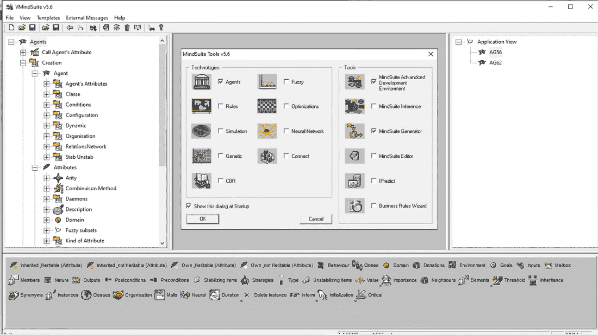

# 第四章：智能代理技术

### 本章涵盖

+   智能代理简介

+   属性如何表示

+   智能代理如何相互通信

+   智能代理如何解决实际问题的示例

> *当你将想象力拓展到新的领域，“不可能”就会变成“可能”。*

想象一群安全专家共同保护敏感的金融信息。每位专家都专注于特定领域，比如监视传入网络流量是否存在异常活动，检查客户账户的安全性，监督员工的访问和权限，包括复制或下载敏感数据等操作，以及分析数字通信中是否存在可疑对话或数据传输。虽然每位专家都有自己独特的任务，但他们都共享一个共同的目标，那就是保护金融机构。为了实现这一目标，他们通过分享见解和数据进行合作。例如，如果客户账户中出现异常活动，就会触发警报，立即由网络流量专家进行分析，并与员工访问日志进行交叉参考。如果有什么可疑之处，协作的专家们可以迅速采取行动，比如阻止活动或发出警报。在这个例子中，我们描述了智能代理方法，这是一种基于使用自适应、自主和目标导向实体来解决问题的强大人工智能技术。智能代理被设计成以目标导向的方式与环境和其他代理进行交互，利用他们的知识和能力来实现最佳结果。这项技术的最大优势之一是，智能代理不仅仅是被编程来遵循规则；它们会适应并不断从活动中学习。

智能代理范式基于反应性、自主和目标导向的实体协作解决问题。智能代理平台应提供以下能力：

+   *自主性*——代理通过相互通信来运行。

+   *反应性*——代理感知其环境并对发生的变化做出反应。

+   *目标导向*——代理具有目标，每个代理都会为实现目标而行动。

+   *出现性*——解决问题将作为代理之间通信的副作用而出现。

智能代理平台是自适应的，因为它们从与环境和其他智能代理的互动中学习，以随时间改进其性能。

智能代理技术被应用于大规模商业软件系统的设计，涉及领域包括欺诈防范、数据泄露检测、空中交通管制、网络管理以及许多其他需要适应问题参数变化的关键任务应用。在欺诈防范的背景下，可以将智能代理视为一个合作的侦探团队。每个侦探（智能代理）负责监视其负责保护的客户的所有交易。这些智能代理学习客户的消费模式，包括他们花多少钱、购买什么、在哪里购买以及多久购买一次。

## 4.1 智能代理的原理

对智能代理技术的彻底讨论需要一整本书。在这里，为了我们的目的，我将试图概述这种方法的工作原理，并提供一个与传统方法有何不同的一般感觉。一些区分智能代理方法的特点包括集体推理、分布式架构、个性化、适应性和自学习。为了突出这些特点，并将智能代理技术与更传统的方法进行对比，我们将首先审视后者通常如何解决问题。

传统的人工智能依赖于四个主要概念来呈现和算法化解问题：

+   一个 *初始状态* 代表了待解决问题的情况。

+   一个 *目标状态* 或 *最终状态* 代表了给定问题的解决方案。

+   一组 *操作符* 和 *约束条件* 描述了状态的可能变化。

+   一个 *控制策略* 控制着状态之间的过渡。

在这种传统的范式下，解决问题的方法是有组织地探索允许的状态转换，以便找到一些最佳的变化序列，从初始状态导向目标状态。潜在解决方案被生成并测试，直到达到目标或者直到没有更多可能的解决方案可以评估为止。对于存在组合爆炸的问题来说，这种穷举、蛮力的方法显然是不切实际的。

一种类似但略有不同的方法涉及定义某种表达两个状态之间距离的度量标准。从给定状态开始，系统可以评估所有合法的转换，并选择导致的状态与已定义的度量标准最接近的目标状态之一。根据问题的不同，这个过程可能会生成一个最佳解决方案或一个非最佳解决方案，或者如果其推理只导致死胡同，则可能根本无法产生解决方案。仍然，其他方法可能使用规则和约束，如第二章和第三章所述，来系统地减少需要探索的状态数量。

与探索所有可能状态和转换空间的方法相反，可以使用智能代理来在以其最显著特征来定义的问题的信息上进行组织。每个问题特征将与一个智能代理相关联，该代理充当一个具有自己的数据结构和邮箱的独立计算实体。代理之间的通信将导致问题解决方案的出现。

与传统编程和许多人工智能技术不同，其中属性只是值的标签，我们智能代理系统中的属性本身就是智能代理。事实上，在程序中，属性在某种意义上是最重要的代理。它们对发生的一切都有全局视角，并且与之相关联的评估函数。评估函数可以随时间改变，并且可以被所有代理用来决定自己的目标。

一个智能代理程序应该准确地代表被建模的物理世界实际情况。它还需要反映系统中每个代理的抽象视角。代理的环境代表了代理认为是真实的一切，包括具有临时或条件有效性的声明。

当代理在其邮箱中接收到消息时，代理的环境可能会更新，代理的一部分操作可能是发送包含对其他代理有潜在用处的信息的消息。为了减少需要交换的消息总数，代理可能会被组织成共享邮箱的集群。系统的高级操作将遵循交换消息，更新环境和属性以及执行操作的循环。

系统级功能可能会被一个代理调用来评估它接收到的数据。例如，全局目标的进展可能通过与特定属性相关联的评估函数来衡量。特定代理的目标进展可能通过其他一些函数来衡量。当一个代理从其邮箱中接收到的消息中提取数据时，它可能会使用各种函数进行评估，评估结果可能被用来更新一个属性或启动某些操作。随着时间的推移，代理积累了知识和专业知识，代理社区创建的解决方案将反映这种专业知识。

### 4.1.1 适应性：智能的真正标志

许多使命关键应用程序的特点是不断变化的需求和动态环境。从网络防御、银行业、自动驾驶到机器辅助手术，对我们的健康至关重要的这些应用程序必须设计具有多功能和自学习 AI，以便实时了解并智能地做出对手和意外事件的反应。例如，用于战场的 AI 系统必须能够适应不断变化的天气和地形，并且需要对敌人的非常规战术做出恰当的回应。

自动驾驶系统必须正确地对周围数十个物体不断变化的运动作出反应，它需要能够与其他可能不遵守规则或不理性行事的车手的决定安全有效地协调。

今天最常用的 AI 可能对变化较慢的情况足够了。例如，传统的 AI 系统可能可以用于自动化货船的航行。航道宽阔而相对统一，速度较慢。借助现代雷达，天气和障碍物可以提前预见，航线可以相应调整。然而，使用当前技术可能永远无法自动化城市街道上的车辆移动。

以巴黎的凯旋门周围的交通为例。有 12 条多车道道路通向一个具有 10 条未标记车道的环形交叉路口。摩托车在旅游巴士和卡车之间穿梭，一些车辆激烈地并入最内侧的车道，而另一些车辆突然向外冲向他们所需的出口。汽车喇叭声和刹车声持续不断，令人眩晕，你必须警惕那些试图穿越交通去近距离看这座纪念碑的游客。交通总是拥挤的，与通常的规则相反，已经在环形交叉路口的驾驶员应该让给那些进入的人。

巴黎年轻人知道，他们真正的驾驶考试不是教练带他们拿到驾照的那个，而是第一次在凯旋门周围驾驶。尽管在过去几十年中进行了数十亿美元的投资，工程团队付出了巨大的努力，但没有任何 AI 系统能够处理任何与刚才描述的动态环境几乎同样复杂的事情。

防欺诈和网络安全是不断发展的问题的两个很好的例子，需要可调整的解决方案。合法业务与每天都在发明新的诀窍和计划的黑客和窃贼之间存在着永无止境的技术军备竞赛。静态的签名或规则集具有有限的价值，当前的方法在能够检测到事件之前需要许多示例。

即使是一个不断接受新数据训练的系统，也永远会落后一步。我们不想在损害发生后永远地应用补丁。我们希望在问题正在发生时检测到新问题，并在犯罪分子行动时抓住他们。

不幸的是，今天的 AI 系统缺乏自适应学习的基本特征。它们只适用于受限的、监督学习任务，由严格的规则定义，在极其明确定义和固定的环境中，如下棋或围棋。真实世界是一个规则在游戏过程中改变的世界。自适应解决方案将会检测到棋盘变大了，战车现在可以像主教一样移动，或者赢不再是将对手的国王将军，而是抓住他所有的卒子！我们需要一个能够理解发生了什么变化并成功适应的 AI。

智能代理系统最显著的优点之一是它们的适应性。智能代理技术不是预先编程以预测每种可能的情景或依赖预训练模型，而是跟踪并自适应地学习每个感兴趣实体的具体行为。例如，在欺诈预防中，每个客户和商家的行为都会实时自动更新，持续的 1 对 1 的个人画像提供了对商家和个人独特行为的即时可行动见解，这导致了一个非常有效的解决方案，具有最高的检测率和最低的误报率。

### 4.1.2 智能代理语言

为了让我们的描述更具上下文，我将介绍一种专有的智能代理方法，并使用一个例子来解释，在这种方法中，每个代理都有能力评估什么样的输入符合或违背其目标。我们还讨论了代理的适应性，将这种技术与传统方法进行了比较，并探讨了这种技术是如何成功应用于解决实际问题的。

图 4.1 是来自 MINDsuite 的屏幕截图，这是由我的第一家公司 Conception en Intelligence Artificielle 在法国开发的 AI 平台。MINDsuite 通过结合智能代理、神经网络、业务规则、遗传算法、约束编程、模糊逻辑和基于案例的推理，使其用户能够开发强大的 AI 解决方案。

##### 图 4.1 MINDsuite AI 平台

MINDsuite 已成功应用于包括国防、制药、保险、金融、核废料处理、医疗保健和网络性能在内的众多领域。该平台允许集成智能代理、约束编程、模糊逻辑、神经网络、业务规则、基于案例的推理和遗传算法，并提供了仿真工具和编程语言的解释器。

由于智能代理方法背后有独特的哲学，我们开发了一个适合这一范式的编程语言。与任何其他编程语言一样，智能代理语言 AGORA 有自己的内部函数、结构、存储分配、垃圾回收和内存管理。它还有超过 40 个关键词，如 *goal*、*neighbors*、*behavior*、*environment*、*output*、*stabilize* 和 *unstabilize*。

编程语言中的 *关键词* 具有特定的含义，代表语言的推理框架。它们用于发出命令或为程序设置参数，并允许程序员进行抽象思考，专注于整体框架而不是反复手工编写基本指令。

每个 AGORA 中的关键词都与代理活动相关联。例如，*stabilize* 表示代理的可接受、理想状态，而 *unstabilize* 则与绝不允许的情况相关联。如果我们想象使用 MINDsuite 来解决一个众所周知的谜题，关键词的使用就可以得到演示。一个农夫必须把一只山羊、一颗卷心菜和一只狼运过一条河。只有一只非常小的筏可用，而且它只能容纳农夫和另一件物品而不会沉没。山羊不能单独与狼在一起，否则它会被吃掉，同样，卷心菜也不能单独与山羊在一起。农夫如何带着他所有的货物到河的另一边？

传统人工智能可以通过将初始状态表示为“农夫、狼、卷心菜和山羊都在河的左岸，而河的右岸是空的”来解决这个问题。最终状态由“农夫、山羊、卷心菜和狼在河的右岸”表示。约束条件是“如果农夫不在场，狼会吃掉山羊”和“如果农夫不在场，山羊会吃掉卷心菜”。这将是控制状态转换的主要策略。

解决方案最终将通过生成和测试允许的状态转换来实现。当探索到一个允许的状态时，它将被其子状态组成的下一级所跟随，然后是其孙状态的下一级，依此类推。在我们的例子中，从这个初始状态开始，农夫可以选择几种可能的情况来过渡到下一个状态。例如，农夫可以选择先带着自己和白菜过河。这将导致一个新的状态，狼和山羊将被留在一起，因为农夫和白菜在河的另一侧。根据先前的约束条件，狼会吃掉山羊；因此，这个状态应该被拒绝。其他潜在的移动是“农夫与狼一起”，“农夫与山羊一起”和“农夫单独”。当选择了一个新的允许状态时，相同的逻辑将被用来确定从这个状态开始的其他移动。这个过程重复进行，直到“农夫、山羊、白菜和狼都在河的右侧”，或者没有其他允许的移动到新状态的可能性。

要解决智能代理技术中的这个问题，我们将首先为农夫、狼、白菜和山羊创建代理。在智能代理程序中，问题的每个元素都由一个代理表示，并且每个代理都有一个目标。在我们的问题中，每个代理也会有一个位置属性，并且开始时，所有代理的位置都将被设置为*east*。农夫、白菜、山羊和狼的目标是拥有*west*位置，而农夫还有一个额外的目标是与他的三个财产在同一个位置。程序的逻辑必须处理在某些情况下哪些目标比其他目标更重要的问题。

在我们的问题中，一些代理也会有关键字*stabilize*和*unstabilize*。牢记关键字可以代表很多复杂逻辑，我们必须理解这些关键字在问题背景下的取值。例如，我们知道农夫不能让白菜独自与山羊在一起，因此对于白菜来说，*unstabilize*关键字会被设置为白菜位置与山羊位置相同的条件。*Stabilize*可以被设置为其位置与农夫位置相同的条件。程序中的逻辑将能够排除白菜与山羊在一起但农夫不在的选项。

*Stabilize*和*unstabilize*同样也会为山羊设置，关键字及其设置将在代理之间建立连接的网络。这种连接网络是智能代理方法的一个关键特征。智能代理程序中的所有元素都是代理，所有代理都有目标，并且由关键字建立的连接决定了实现目标的选项。向目标的进展通常通过属性值的变化来指示。

精通在智能代理平台上设计和构建高效解决方案的艺术是一个逐渐的过程。成功取决于明确定义的目标和客观函数。个人在创建真实应用程序方面投入的时间越多，就越能熟练地使用智能代理平台的潜力。

智能代理提供了宝贵的问题解决技术。以我们在开发欺诈防范解决方案的经验为例。个性化成为此努力的一个关键概念。利用智能代理，我们能够为持卡人、商店和商家创建虚拟个人资料，只包含每个实体的相关信息。每个持卡人都与一个智能代理相关联，该代理实时从其交易中持续学习。它从各种渠道聚合数据，跟踪与持卡人有关的任何内容，随着时间的推移逐渐形成一个强大的资料。与第二章和第三章讨论的其他 AI 方法相比，智能代理系统做出了针对每个持卡人的决策。个性化的决策始终优于普遍适用的通用规则。持卡人的资料反映了他们独特的消费习惯，一旦建立了基线模式，任何与正常行为偏离的情况都会立即被检测到。对于智能代理可以为使用定义的各种类型或数量的分析标准几乎没有限制。从多个角度审视一个实体是至关重要的，因为行为可能根据情况而有很大的变化。以下是在欺诈检测中常用的一些分析标准：

+   *实时分析*—交易可以在不同的时间框架内聚合，计数器实时更新。

+   *长期分析*—交易可以在较长的时间段内聚合，计数器以预定速率更新。这些资料建立了行为基线。

+   *递归分析*—可以在一个滚动的时间框架内跟踪活动以监控正常行为。

+   *地理位置分析*—数据，如持卡人的家庭邮政编码、卡刷位置和参与电子交易的 IP 地址，可以识别异常行为。

+   *多维度分析*—多个代理之间的交互可以发现可疑的活动模式和联系。

+   *同行比较分析*—通过将一个实体的行为与其同行进行比较，实时识别可疑活动。

在授权卡交易之前，防欺诈系统利用持卡人档案、商家档案和其他相关数据生成风险评分。只有评分低于某个阈值才会批准交易。创新系统可能会根据情况调整其评分和阈值，认识到 7 月份对一个人来说不寻常的购买行为在圣诞节前可能是典型的，从而减少误报，提高所有相关方的整体体验。此外，实体档案中的信息可以在代理之间共享，允许监控群体活动模式。这种方法赋予了智能代理解决方案自适应学习能力，使其能够在出现时检测到以前未知的欺诈方案。

## 概要

+   智能代理最初被构想为应对复杂问题，这些问题无法通过简单的算法解决。

+   特性在智能代理中起着基础性作用，因为它们具有与其他智能代理进行主动通信的能力。

+   智能代理配备有邮箱，作为接收消息的渠道，不仅可以接收来自其他代理的消息，还可以接收来自外部来源的消息。

+   智能代理具有以下特征：

    +   *学习和适应*—智能代理可以随着时间学习和适应。

    +   *可扩展性*—这些代理既可以水平扩展，也可以垂直扩展，从而可以处理更大更复杂的问题空间。

    +   *安全和隐私*—智能代理融入安全措施以保护敏感数据。

    +   *分布式问题解决*—智能代理可以在分散和分布式网络中运作，增强了它们的多功能性和弹性。

    +   *实时决策*—智能代理具备实时决策能力，能够迅速应对动态情况。
