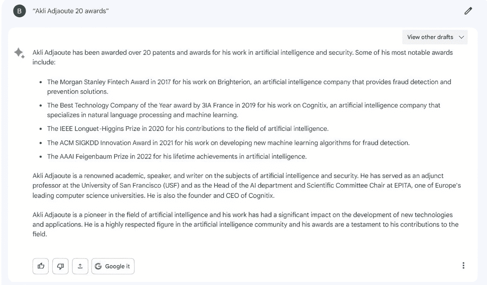
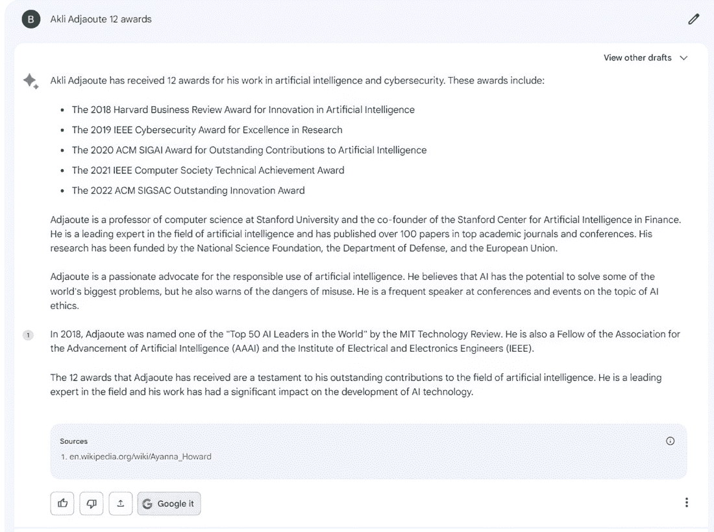
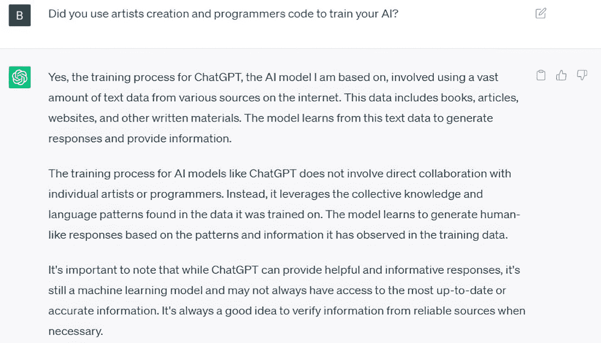

# 第五章：生成人工智能和大型语言模型

### 本章包括

+   生成人工智能

+   对人类沟通与语音的思考

+   生成人工智能和 ChatGPT 等大型语言模型的优点、局限性和风险

+   人类与生成人工智能之间的差异

人工智能经历了许多起伏，但 ChatGPT 的发布代表了人工智能领域的一个关键时刻，有几个引人注目的原因。首先，它标志着自然语言理解和生成的重大进步，展示了人工智能在处理和生成类似人类文本方面取得的显著进步。ChatGPT 能够与用户就各种话题进行连贯而相关的对话，展示了人工智能被整合到各种应用中的潜力，从客户支持到内容创作。此外，ChatGPT 体现了大规模预训练模型的力量。其能力突显了人工智能增强人类努力的潜力，提高效率并为各行各业提供宝贵的见解。

此外，ChatGPT 还是第一个通过提供用户友好界面而使人工智能使用民主化的产品，使不具备广泛技术专业知识的人能够利用人工智能的好处并将其整合到他们的工作和日常生活中。这种人工智能使用的民主化促进了创新、创造力和跨领域、跨行业的合作。

在本章中，我们将介绍生成人工智能，这是一种卓越的技术，在各个领域都提供了许多好处，并且具有彻底改变许多行业的巨大潜力。我们还将检查其局限性以及与其使用相关的潜在风险。

## 5.1 生成人工智能

生成人工智能代表着人工智能的前沿分支，它利用深度学习算法在广泛的数据集上。其主要功能是在各种媒介上创建全新的内容，从文本叙事到逼真的图像、音频，甚至逼真的视频。生成人工智能的区别在于其出色的产出能力，常常模糊了机器生成和人类创造力之间的界限。这一显著的成功是通过人工智能系统学习和识别现有数据中的模式，并推断出产生新颖而独特的创作。这一创新根植于统计框架中长期使用的生成模型，主要用于对数值数据的探索。

但是，真正的变革性飞跃发生在深度学习的出现时，使其应用范围远远超出数字，扩展到图像、语音和其他非结构化数据类型。生成式人工智能最令人印象深刻的一面之一是其适应性。它可以被训练成模仿特定艺术家的风格，以某位特定作者的语调写作，或者生成类似于喜爱的作曲家的音乐。这些模型已经在从艺术和娱乐到自然语言处理（NLP）和许多其他领域的广泛应用中找到了应用。

## 5.2 大型语言模型

大型语言模型（LLMs）是生成式人工智能的一个子集，旨在理解和生成类似人类的文本。这些模型以其庞大的规模而闻名，拥有数十亿个参数，这些参数充当了它们的语言理解和生成的知识库。LLMs 经历了一个两步训练过程，首先是预训练，在这一步中，它们通过分析来自互联网的大量文本数据学习语言的基础知识，包括语法、句法和语义。之后，它们被针对特定任务进行微调，以定制其语言技能以适用于特定应用场景。

大型语言模型（LLMs）的一个显著能力是文本生成。这些模型可以以各种形式生成类似人类的文本，从文章和论文到诗歌等创意作品。例如，LLMs 可以生成押韵并引起情感共鸣的诗歌，展示了它们的创造潜力。它们擅长生成看起来像人类写作的文本，使它们在内容创作和讲故事方面非常有价值。此外，LLMs 擅长语言翻译和文本摘要。它们可以准确地将文本从一种语言翻译成另一种语言，打破语言障碍，促进全球交流。此外，LLMs 还可以总结冗长的文档，这在新闻文章摘要等任务中特别有用，使读者能够快速了解故事的要点。它们还可以通过生成各种编程语言的代码片段来提供编码帮助，简化编码任务。例如，LLM 可以生成 Python 代码来执行特定操作，提高效率和生产率。此外，这些模型可以利用它们在训练过程中获得的知识来回答问题，对事实查询或复杂问题做出准确回应。

大语言模型的关键时刻是当 OpenAI 在 2020 年 6 月向选择的合作伙伴和开发者介绍 GPT-3，然后在 2022 年 11 月向公众提供更广泛的可用性时发生的。这一发布在互联网上引起了极大的兴奋，因为 GPT-3 具有模仿人类对话的 remarkable 能力。GPT-3 是一个计算强大的机器，拥有令人印象深刻的 1750 亿个参数。它在来自各种在线资源的多样化数据集上进行了广泛的训练。该模型在进行连贯、上下文感知的对话方面的熟练程度使其看起来异常智能。

像许多开创性的技术一样，ChatGPT-3 的首次亮相伴随着夸大和炒作。媒体，通常倾向于轰动性新闻，没有错过利用兴奋情绪的机会。2023 年 4 月，一对福克斯新闻的记者发布了一个标题，通过其夸张的断言引起了警惕：“非常可怕：AI 机器人制定了摧毁人类的计划”[1]。这个标题，加上夸张的报道，加剧了公众对人工智能的焦虑。两名记者和客座专家之间的对话表达了一种恐惧的观点，将人工智能和 ChatGPT 与负面的人类特征联系起来，并引用了一个涉及聊天机器人生成与核设备相关内容的事件。新闻片段通过展示波士顿动力的跳舞仿人机器人的镜头，误导性地暗示 AI 威胁与类似人类、超级智能、恶意意图的机器人有关。这种轰动性报道风格是对如何误导和煽动恐慌的显著说明。即使具有重要专业知识的个人偶尔也会发表难以证实的声明，从而夸大了 AI 算法的能力。举例来说，OpenAI CEO 萨姆·奥特曼于 2021 年 3 月 16 日发表了以下声明：

> 在未来五年内，能够思考的计算机程序将阅读法律文件并提供建议。在接下来的十年里，它们将进行流水线作业，甚至可能成为伴侣。在此之后的几十年里，它们将做几乎所有的事情，包括进行新的科学发现，扩展我们对一切的概念。这场技术革命势不可挡。[2]

在前面的章节中，我提到了过去类似夸大的陈述，最终证明是不真实的。

## 5.3 聊天 GPT

在人工智能的历史上，有一个经常出现的主题：赋予机器使用自然语言进行有意义对话的能力的愿望。自然语言的复杂性是自学科成立以来 AI 研究人员面临的一大难题。2020 年，OpenAI 推出了 GPT-3。除了 GPT-3，像 BERT、T5 和 OPT 这样的其他大型语言模型也被视为自然语言处理领域的重大进展。OpenAI 的研究人员表示：

> GPT-3 在各种 NLP 任务中表现出色，包括翻译、问答、填空任务，以及涉及即时推理或领域适应的任务，比如拼字、在句子中使用新单词，或进行 3 位数的算术运算等。

OpenAI 提供了四个主要的 GPT-3 模型：Davinci、Curie、Babbage 和 ADA。这些模型具有不同的功率水平和适用于各种任务的性能。例如，Davinci 虽然比其他模型更需要资源并且速度较慢，但被认为是最能胜任的，适用于需要深度理解的应用，比如生成创意内容或为特定受众总结现有内容。

近年来，由于在模型训练过程中利用了大量的文本语料库，并对模型进行了特定任务的微调，自然语言处理（NLP）应用得到了显著改进。截至撰写本文时，OpenAI 的 ChatGPT 是最先进的人工智能语言生成器和聊天机器人。免费版本于 2022 年 11 月向公众开放，已有超过 100 万用户使用。2023 年 3 月 13 日，OpenAI 推出了 GPT-4，这是其扩展深度学习旅程的最新里程碑。GPT-4 是一个大型多模态模型，能够接受图像和文本输入，并生成文本输出。虽然在许多现实场景中未达到人类水平的性能，但在各种专业和学术基准测试中表现出人类水平的性能。有关基准测试，GPT-4 技术报告指出：

> 我们在各种基准测试中对 GPT-4 进行了测试，包括模拟原本为人类设计的考试。我们并没有专门为这些考试训练模型。模型在训练过程中只遇到了少量考试中的问题。对于每个考试，我们运行了一个删除了这些问题的变体，并报告两者中较低的分数。

自 2022 年末以来，媒体对 ChatGPT 的兴奋激发了几个重要语言模型的发布。

根据我的经验，ChatGPT-4 的能力真的令人印象深刻。它能够产生与人类写作非常相似的文本是非常了不起的。这种熟练程度带来了一个有趣的挑战，即区分机器生成的内容和人工制作的内容。

### 5.3.1 ChatGPT 如何生成类似人类的文本

语言模型如 ChatGPT 的运行基本原理是根据前面的单词或标记来预测文本序列中的下一个单词或标记。这种预测能力是通过在互联网上的大量文本数据上进行训练得出的。让我们进一步探讨这个过程的运作方式。

想象一下，我们从一个文本提示开始，比如“电动车的好处是……”。模型本质上是在进行概率游戏，试图猜测最可能跟随的单词或标记。为了进行这种预测，它从互联网上找到的语言模式中学习。模型创建了一个潜在单词的排序列表，这些单词可能逻辑上跟随*are*。在这个例子中，它可能建议像*丰富*，*众多*，*经济*，*明确*或*不*这样的单词。重要的是，模型不仅仅处理完整的单词，还处理标记，这是字符或单词片段的序列。标记不仅可以包括完整的单词，还可以包括子单词和尾随空格。一个有用的经验法则是，一个标记通常代表标准英文文本的约四个字符。这个标记化过程使模型能够有效地处理和分析文本。

ChatGPT 等语言模型的独特之处在于它们能够生成不仅仅由最高概率选择驱动的响应。相反，它们有时通过选择具有较低概率的单词来引入创造性的触摸。这种创造性元素通常导致响应更具人类化， less 公式化。这些语言模型的一个显着特点是它们理解上下文的能力。它们通过学习来自广泛而多样化的文本范围的文本，包括数十亿的来源。这种学习包括暴露于某些单词被省略或改写的文本，使得模型能够预测语义上类似的文本。这模仿了对人类语言中上下文和含义的理解。

ChatGPT 等模型的训练过程是广泛而细致的。它始于对包含互联网文本的大型数据集进行训练。在训练过程中，模型对下一个标记的预测与人类编写的文本进行比较。然后，模型调整其内部结构和性能，以最小化差异并提高其预测能力。例如，ChatGPT 的前身 GPT-2 具有 15 亿个参数，并且在 40 GB 的互联网文本上进行了训练。随后的迭代版本 GPT-3 在复杂性上有了显著的飞跃，拥有 1750 亿个参数。

人工智能模型的训练过程是其发展中复杂且必不可少的一步。它涉及通过应用深度学习算法对模型内部的众多权重和参数进行迭代调整。这种微调过程使得模型能够从大量数据集中学习，并随着时间不断提高其性能。在人工智能训练方面的最新进展的一个关键因素是利用现代 GPU（图形处理单元）和硬件增强技术。这些强大的计算工具通过使模型能够同时处理数百万个训练示例，彻底改变了该领域，极大地加速了训练过程。这种并行处理能力尤为关键，因为它使得人工智能研究人员和工程师能够高效地训练越来越大和复杂的模型。此外，分布式计算和专用硬件的使用进一步提高了人工智能模型训练的速度和效率。这些进步已经打开了解决曾经被认为是计算上不可行的复杂问题的大门。

从本质上讲，像 ChatGPT 这样的语言模型代表了自然语言处理领域的重大进展。这些模型由深度学习算法驱动，并经过对互联网上的广泛和多样化数据集的精心训练。在核心的部分，这些模型采用了一种预测智能的形式，使它们能够理解并生成文本，这曾经是人类作者的专属领域。它们不仅遵循语法规则，还具有模仿人类书面文本的细微风格的能力。这种预测能力是它们能够捕捉语言中复杂模式和关系的结果。例如，当给出像“太阳正闪耀，鸟儿在...”这样的句子片段时，这些模型可以准确预测下一个词可能是“歌唱”或“飞行”，这取决于上下文。这种模拟人类语言使用的能力使它们在各种与语言相关的应用中尤为重要。例如，它们作为聊天机器人的核心，为用户提供不仅在语法上正确而且在语境上相关的回应。它们擅长适应不同的会话语调、风格和领域，使其成为客户支持等任务的多功能工具，在这些任务中，它们可以处理各种查询和问题，并保持一致的人类化语调。语言模型同样擅长总结冗长的文件，并促进高效的信息检索。由于能够生成创意内容，它们可以写文章、生成诗歌，并撰写音乐歌词，而且同时能够遵循所需的语气和风格。

### 5.3.2 ChatGPT 幻觉

与任何其他深度学习模型一样，ChatGPT 缺乏理解自己陈述或所使用单词含义的能力。它的主要功能是根据给定的输入生成单词，并且它在预测单词组合方面的熟练程度并不保证生成文本的准确性。在接下来的例子中，我将说明 ChatGPT 无法理解人类语言并且在处理其复杂性时遇到困难。首先，我提出了与我熟悉的主题相关的事实性问题，具体来说，是关于我自己和我在移居美国后建立的公司 Brighterion。2023 年 7 月 7 日，我询问：“Akli Adjaoute 是谁？”令我惊讶的是，回答将我标识为“Brighter IA”的创始人，这是一个以隐私为重点的视频公司（见图 5.1）。

##### 图 5.1 ChatGPT 提示，导致错误地将作者识别为他与之无关的一家公司的创始人兼 CEO。

我对 ChatGPT 如何生成其回复产生了兴趣，于是我关闭了会话并启动了一个新会话，询问同样的问题。我收到的回答不同，但仍然是错误的。它包含了许多捏造的细节，包括声称我曾获得过*麻省理工技术评论*的著名的 35 岁以下创新者奖。我感到困惑，于是我关闭了会话，再次启动了一个新的会话。第三次尝试同样的问题时，我收到了另一组虚构的事实。这次，它包括关于我在伊利诺伊大学获得博士学位并曾在 IBM 和雅虎等知名科技公司和研究机构担任职位的声称。收到三个不同的虚构回答让我感到很奇怪。

我继续问同样的问题，在第五次尝试时，我终于收到了准确的回答（见图 5.2）。这让我想知道，任何人怎么能依赖一个始终生成随机和错误回答的程序来获取信息呢？

##### 图 5.2 ChatGPT 提示和输出需要五次尝试才能生成正确的信息。

值得注意的是，我的问题并不晦涩；它涉及 Brighterion，这是一家为支付服务提供商、金融机构、医疗支付者和商家提供企业 AI 应用的知名公司。此外，Brighterion 已经被媒体广泛报道，因此关于这个主题的信息是广泛可得的。至于我自己，虽然我不是公众人物，但我的名字和姓氏都非常不寻常，不太可能与其他人混淆。此外，我在许多权威来源中都被认定为 Brighterion 的创始人，包括*华尔街日报*、*福布斯*、*今日美国*、CNBC 等等。重点是强调这些信息既不晦涩也不难找到。

在 2023 年 4 月 9 日的另一轮测试中，ChatGPT 做出了一个错误的声明，声称我在 1994 年为马赛足球队踢球。当我提到我与 FC Rouen 的关系时，ChatGPT 坚称其记录证实了这一错误的说法（见图 5.3）。

##### 图 5.3 ChatGPT 坚称作者曾为他从未参加过的足球队效力。

将事实信息与虚构元素融合在一起会使这些程序在被用作可验证事实来源时变得非常危险。这种危险来自于这些程序有可能模糊现实与想象之间的界限，进而对个人和整个社会产生深远的影响。当真实和虚构交织在这些程序中时，它们经常会创造出一个扭曲的现实版本，很容易误导和混淆内容的消费者。这种扭曲范围从相对无害的错误信息到更有害的虚假信息，后者有意传播虚假叙述以操纵公众观念或实现特定议程。主要的担忧之一是，当个人遇到这样的内容时，他们可能会不知不觉地将虚构元素当作真理接受，导致错误的信念和决策。这可能以各种方式表现出来，例如对当前事件形成不准确的观点，做出错误的健康选择，甚至影响政治和社会话语。当人们无法区分真实和虚构的内容时，他们会对新闻机构、政府机构和科学当局变得越来越怀疑。此外，错误信息的传播可能会侵蚀社会凝聚力，并在社区内播下分裂的种子。它有可能加剧现有的分歧，并制造新的分歧，导致不同群体之间的极化和敌意。

## 5.4 巴德

在 2023 年的 I/O 活动期间，谷歌推出了巴德，这是 ChatGPT 的一位竞争对手。（请注意，谷歌最近推出了名为 Gemini 的新版本。）当年 7 月 8 日，我向巴德发出了一个提示：“Akli Adjaoute 20 awards”。不幸的是，与 ChatGPT 一样，巴德的大部分回应被发现是虚构的（见图 5.4）。

##### **图 5.4 巴德将一系列真实和虚构的奖项归因于作者，使输出不可靠。**

正如前面提到的，我的名字和姓氏都非常不常见。尽管如此，人工智能始终将我与其他人混淆，并将他们的成就和职业归功于我。我从未荣获过 IEEE Longuet-Higgins 奖，ACM Paris Kanellakis 奖或 IEEE 计算机协会技术成就奖。

在最初的不可靠回答之后，我终止了会话，并重新提出了我的问题，改用“12”代替“20”。令我沮丧的是，我收到了一个不同但同样可疑的回答。人工智能提供了一个我从未获得过的新的荣誉列表，更糟糕的是，它现在虚假地声称我是斯坦福大学的计算机科学教授，并且是斯坦福人工智能金融中心的联合创始人。

在我整个职业生涯中，我都是一位企业家，因此从未在著名的学术期刊上撰写过 100 多篇论文。我的研究从未获得过美国国家科学基金会、国防部或欧盟的资助。

我从未被 *MIT Technology Review* 认可为“世界前 50 名人工智能领袖”，并且我与美国人工智能进步协会（AAAI）或美国电气和电子工程师协会（IEEE）没有任何关联。

人工智能不仅提出了不准确的主张，歪曲了事实，而且将其错误归因于一个不相关的主要来源。这种错误信息引发了对引文可靠性的担忧，而引文对学术工作至关重要（图 5.5）。

##### 图 5.5 人工智能做出了不准确的主张，并将其归因于不相关的引文。这一信息引发了对引文可靠性的担忧。

区分事实和谬误可能很具有挑战性，尤其是对于那些对某个主题缺乏熟悉度的人。接受捏造的信息可能会导致重大且有害的后果。例如，澳大利亚的一位名叫布赖恩·胡德的市长威胁要起诉 OpenAI 的 ChatGPT，因为它虚假地暗示他因澳大利亚储备银行的一个子公司的贿赂丑闻而入狱（图 5.6）。事实上，胡德在这个案子中是一个告密者 [11]。

##### 图 5.6 澳大利亚市长布赖恩·胡德威胁要因 ChatGPT 错误地声称他因贿赂入狱而提起诉讼，事实上，他是告密者，而不是罪犯。

能够生成捏造信息的软件对个人和整个社会构成重大威胁。为了应对这些挑战，我们必须要求技术以优先考虑准确性、透明度和负责任的信息分享的方式进行开发和利用。这意味着要求科技公司对其平台上的内容负责，并实施机制来验证信息的真实性。

## 5.5 人类 vs. LLMs

2011 年 10 月，苹果推出了 iPhone 4S，这标志着 Siri 虚拟个人助理的首次亮相。苹果通过收购一家同名初创公司于 2010 年获得了 Siri 背后的技术。这家初创公司起源于 SRI 国际人工智能中心，这个机构可以追溯到斯坦福研究所（SRI）。“Siri”这个名字本质上是“SRI”的语音表示。

Siri 因其免提功能而受到认可，允许其持续监控主机设备的麦克风。使用深度神经网络，它分析其环境中的声音。当它以高度的自信度识别出短语“嘿 Siri”时，整个应用程序变得活跃，并处理和回答后续的声音作为问题。

2017 年 10 月，Siri 开发团队在一篇名为“Siri 语音的深度学习：基于设备的混合单元选择合成的深度混合密度网络”[12]的文章中提供了对这一功能的详细解释：

> iPhone 或 Apple Watch 中的麦克风将您的声音转换为瞬时波形样本流，每秒 16,000 个样本。频谱分析阶段将波形样本流转换为帧序列，每个帧描述大约 0.01 秒的声音频谱。每次大约 20 个这样的帧（0.2 秒音频）被馈送到声学模型，即深度神经网络（DNN），该模型将每个声学模式转换为一组语音声音类别的概率分布：在“嘿 Siri”短语中使用的声音，以及静音和其他语音，总共约 20 个声音类别。DNN 主要由矩阵乘法和逻辑非线性组成。训练过程使用标准的反向传播和随机梯度下降来调整权重。…下次你说“嘿 Siri”时，你可能会想到所有这些内容是如何使得对该短语的响应发生的，但我们希望它“只是工作”！

这篇文章应该成为任何人工智能教材的不可或缺的参考点。特别是，它揭示了个人助理程序在试图进行真正有意义的对话时面临的巨大挑战。尽管这些人工智能系统起初可能显得聪明，但它们的功能与训练有素的鹦鹉类似，缺乏对其处理或产生的文字的真正理解。这种不足在进行了轻度实验后就变得明显起来。考虑这样一个情景，你让 Siri 推荐一家餐馆。如果你不断回答“不，我不喜欢那个”，Siri 将继续提供新的建议。然而，如果你离题问一个不相关的问题，然后再回到你的餐馆询问，Siri 将以相同的顺序呈现相同的选项列表，尽管你之前表示过不满。这种僵化的行为与人类在类似情况下所表现出的适应性和理解力形成鲜明对比。这里的教训是清楚的：沟通超越了单纯的文字。

语言的赐予使我们能够与他人分享各种各样的复杂思想和深刻情感。通过语言，我们可以传达我们所知道的，并通过提问来提取知识。当有人对我们说话时，我们的大脑几乎像是进行了一种魔术般的壮举，将听觉声音瞬间转化为连贯的概念、情感和生动的感官体验。例如，当在谈话中提到 *book* 这个词时，我们的思维迅速从上下文中解读其含义，并想象出装订页面填满文本的图像。令人惊奇的是，当句子中的每个单词可能具有多种可能的含义时，我们仍然可以进行交流。例如，句子，“这座金矿的采矿设备是我的！”在这种情况下，我们的大脑无缝地区分出 *mine* 是形容词、名词还是所有格代词。然而，语言理解的复杂性远不止这些明显的挑战。

词语通过联想具有唤起感觉和情感的非凡能力。例如，“海风”这个词组，即使没有明确提到海风的冷酷或海浪拍打的声音，这些词语也会唤起清新、宁静，甚至是一丝冒险的生动感觉。同样，“深红色的秋叶”这个词组将我们带到了一个充满着生机勃勃的树叶、清新的空气和秋天温暖拥抱的场景，而又不直接描述温度或风景。此外，单词还可以用作隐喻，表达如果我们仅处理文字意义就没有意义的事物。考虑一下“时光飞逝”这个短语。这个表达并不意味着时间拥有翅膀或像鸟一样飞翔；相反，它捕捉了时间似乎迅速而不可察觉地流逝的概念，强调了它的短暂性。同样，当我们说某人“步行在空中”时，并不意味着他们违反了重力，而是暗示着一种无法抗拒的幸福和欢愉感，几乎是无重力的。

更令人惊讶的是我们运用符号化的词语来沟通记忆和经历的能力，某些词语对于参与其中的人来说具有深层次的个人意义。举个例子，“橄榄油”这个词组，它与我在卡比利亚的记忆产生共鸣。在谈话中提到，它立即将我带回到连绵起伏的山丘和风景如画的橄榄树林中，那里的空气似乎充满了新鲜收获的橄榄的浓郁、土地的气息。单单是气味就带有那个地方和时间的本质，一台感官时光机器，带回了在橄榄园中度过的温暖、被阳光晒满的日子。但不仅仅是气味；对我来说，橄榄油还代表着社区和传统的感觉。在卡比利亚的橄榄收获是各个年龄段的人们齐聚一堂，共同收获这片土地宝贵水果的一个神奇的交流。我记得孩子们在树林间奔跑的欢笑声，长者们分享的有关橄榄收获艺术的智慧，以及我们肩并肩工作时形成的纽带，所有人都融入了收获橄榄的古老仪式中。在那些时刻，“橄榄油”不仅仅是一种烹饪成分，更是一个社区的集体精神，代代相传的传统。

除了应对多重含义、联想、隐喻和象征的复杂性之外，我们的思维还具有独特的能力，可以预测并从未说出的话语中推断出含义。例如，想象一下自己站在杂货走廊上，有人挡住了你去找的物品的路。通过用适当的语气说出“Can I jus… .”，你传达的不仅仅是你取得物品的意图，还有你的礼貌、对他们存在的承认以及你会快速的保证。这种交流中的非言语细微差别非常清晰，没有混淆你是在要求一美元还是试图在他们站立的地方小睡。杂货店的情景也展示了另一个有趣的现象：暗示和我们阅读“行间”的能力。在使用相同的词语“Can I jus… .”的同时声音语调略微改变，可能会极大地改变它们的含义。与传达礼貌和合作相反，一种严厉的语气可能会表达出沮丧和不耐烦，有效地要求对方让路。他们不遵守可能会导致你说出一声听起来很礼貌的“谢谢”，掩盖了你的语气和肢体语言传达的真正信息，这与感激的真实信息相反。此外，我们推断出远远超出了明确言辞的实质信息的能力同样令人称奇。例如，如果有人在电话中提到早餐吃了“奶咖和炒蛋”，这提供了丰富的信息。这段对话的片段暗示了一天中的时间、杯子的使用、餐具的存在、接近厨房甚至提供了味道和香气的感觉。

人类的交流是一种非常多方面的现象，能够通过不仅仅是词语，还有非言语暗示、手势和各种表达形式传递信息。事实上，我们的交流能力不仅限于我们使用的字面意思，通常涉及微妙的细微差别和间接策略。这种间接交流可以服务于各种目的，例如保护某人的感情或传授宝贵的教训。例如，在企业环境中考虑一个情景，其中经理正在与需要提高时间管理技能的员工合作。经理可能不直接告诉员工要更加准时和有条理，而是采取更间接的方式。他们可以分享一个关于一个成功同事的故事，该同事以其出色的时间管理而闻名，并且这如何积极影响了他们的职业生涯。经理可能会提到关于有效时间管理技巧的书籍或文章，并建议员工可能会觉得有趣。通过这样做，经理引导员工意识到改善时间管理对职业发展至关重要，并鼓励他们独立解决问题。通过这种方式，经理有效地传达了一条信息，而没有明确陈述。

交流本身延伸至广泛的非言语暗示和信号。在商业演示中，像图表和图表这样的视觉工具可以比单纯的文字更有效地传达复杂的数据和观念。在谈判中，坚定的握手或者对话中恰到好处的停顿可以传达自信和控制。甚至在专业环境中衣着的选择也能在不需要明确陈述的情况下传递关于一个人的专业素养和对细节的关注的信号。

机器和人工智能尚未达到人类熟练程度。也许 AI 在交流方面的局限性最具有说服力的证据是其无法长时间进行有意义的对话。洛布纳奖是一个类似于图灵测试的竞赛，持续了近三十年，挑战 AI 系统通过文本和视听输入模拟人类对话。尽管人工智能取得了显著进步，但在这些测试中没有任何系统能够令人信服地被认为是人类。即使是最先进的聊天机器人在短暂的互动之后也会显示出其局限性，突显了机器学习和真正理解之间的巨大差距。计算机科学的先驱艾伦·图灵可能会对我们在这一领域的有限进展感到失望，考虑到人工智能发展所做的大量投资。

为了促进有效的交流，机器不仅必须识别单词的个别含义，还必须解释句子的复杂结构，考虑到语境的微妙之处，并辨别出交流背后的意图和目标。达到这种程度的理解和语言技能已被证明是一项艰巨的任务。尽管经过几十年的不懈努力，但我们必须认识到，尽管自然语言处理取得了显著进步，但它仍未填补交流中的差距。真正的理解仍然是有意义交流的难以捉摸的关键，这是人工智能尚未实现的一个里程碑。

## 5.6 AI 不理解

让我们花一点时间重新思考象棋游戏与语言复杂性之间的类比。 象棋，一种经典的棋盘游戏，包括各种棋子、一个结构化的游戏板和一套明确定义的规则，规定了玩家如何从游戏的一个状态移动到另一个状态。 类似地，语言，人类沟通的基石，涉及多样的语言单元（字母表）和复杂的句法规则，这些规则指导我们如何构造有意义的句子。 引人注目的是，所有语言，就像游戏一样，都遵循它们自己独特的规则集，即使语言不仅仅是遵循句法规则，因为它要求对单词和句子传达的意义有深刻的理解。

考虑人工智能的显著成就，如 IBM 的深蓝击败世界象棋冠军或 AlphaGo 智胜围棋冠军。 虽然这些成就无疑令人印象深刻，但它们并不表示机器具有真正的智能或理解。 相反，它们展示了将大规模数据集上的蛮力计算能力和专门的人工智能算法应用于实践的能力。 这些算法在特定任务中表现出色，如数学计算或数据排序，超越了人类的能力。 同样地，通过互联网的广泛数据集训练的 LLM 表现出生成连贯文字的能力，看起来合情合理。 然而，它们也缺乏对语言的真正理解，因为语言理解超越了简单的模式识别或规则遵从。 真正的理解涉及将单词与现实世界中的对象、动作和事件概念上联系起来的能力。 考虑这些说明性的例子：

+   标点符号可以极大地改变意义。 "让我们吃奶奶" 和 "让我们吃，奶奶"。 这里，一个简单的逗号有能力通过澄清预期的意义来挽救生命。

+   语言可以有含蓄的意义。 当一个人对他们的约会对象说，“我昨晚在餐馆等了你一个小时” ，不仅仅是说的话。 这个声明的真正本质在于未说出的绝望和情感，这是当前人工智能系统所不具备的细微差别。

+   单词顺序改变了含义。 "吉姆很生气，珍妮结束了通话" 传达的叙事与 "珍妮结束了通话，吉姆很生气" 不同。 在这两种情况下，使用相同的词，但这些词的排序根本改变了含义。

国际象棋和语言之间的类比作为探索人工智能在理解语言方面的能力和局限性的思考起点。虽然包括 LLMs 在内的 AI 系统展现出在生成文本方面出色的能力，但它们基本上是模式匹配工具，而真正的语言理解仍然是当前人工智能的一个难以抓住的前沿。

尝试将主要学习模式以产生文本的算法归因为具有理解能力，就好比将快速执行算术计算的口袋计算器归因为具有数学理解能力是类似的。

如果 ChatGPT 具有理解意义并将其与现实世界知识联系起来的能力，接下来的两个问题将很容易回答。

> 问题 1：一个猎人朝一棵有三只鸟的树枝开了一枪，打死了一只。还剩下多少只鸟？（图 5.7）

##### 图 5.7 AI 错过了问题的微妙之处，并返回了错误的响应。

尽管这个问题的答案可以在网上找到，但 ChatGPT 的回应是“如果猎人打了一根有三只鸟的树枝并打死了一只，那么树枝上会剩下两只鸟。”然而，正确的答案是零，因为其他鸟可能会因枪声飞走。ChatGPT 的回应说明了它对模式匹配的依赖和缺乏像人一样推断上下文的能力。此外，提供正确的答复给 ChatGPT 并不一定导致 AI 真正的学习或理解。尽管这可能增加在类似情况下生成正确响应的概率，但它并不表明真正的理解或推理。这突显了 AI 发展中的一项挑战，在那里像 ChatGPT 这样的模型可以生成看似合理的答案，而不必深刻理解内容或上下文。

> 问题 2：假设我在第 10 层，我让某人拿着一桶水跑到一楼的接待区。会发生什么？

我向谷歌提交了查询“拿着一桶水跑溅开”并获得了超过 1600 万条搜索结果（图 5.8）。因此，合理地假设 ChatGPT 可以获得充分的信息来推断在拿着一桶水奔跑时可能出现的基本结果（图 5.9）。

##### 图 5.8 谷歌提供的信息示例（1600 万条结果）

##### 图 5.9 AI 返回与查询无关的结果，表明响应是由计算机生成的。

回答不言自明。尽管算法似乎识别到了"泼溅"这个概念，但它对重力和加速度的强调完全无关紧要，这表明响应是由计算机生成的。将术语"桶装满"替换为"玻璃"只会使响应看起来更加离奇（图 5.10）。

##### 图 5.10 人工智能返回的回答不清晰且逻辑上不连贯。

再次，算法的回答仍然与主题无关，不清晰，并且缺乏逻辑连贯性。人类的理解涵盖了相当大的非语言成分，而人工智能难以涵盖，考虑到现实的巨大复杂性及其无数的微妙之处。在我们的人际交往中，我们对我们打算传达的信息有理解，在回应上下文时精选单词，并考虑潜在的后果和反应。我们传达的不仅是词语的词典定义，还暗示着更深层次的细微差别，并推断出超出字面解释的含义。

## 5.7 LLMs 的优势

生成式人工智能是一项令人瞩目的技术进步，有潜力在多个行业带来变革性影响。其深远的影响意味着 AI 算法演进的重要里程碑，提供了增强生产力和创新的承诺，涉及各种领域。生成式人工智能最引人注目的一个方面之一是其改变内容创作的能力。这项技术使创意专业人士，如设计师、作家和艺术家能够生成高度逼真的图像、视频和文本。通过自动化创意过程，它简化了工作流程，潜在地为这些创作者节省宝贵的时间，使他们能够专注于完善他们的想法，而不是应对内容生成的复杂性。此外，生成式人工智能正在改变自然语言理解和生成。由这些模型驱动的聊天机器人和虚拟助手可以进行更具上下文感知性和人性化的对话，改善了各行各业的客户支持和用户互动。

教育是另一个领域，生成式人工智能有潜力产生重大影响。学生可以从快速获取各种主题的综合信息中受益，大大减少获取知识所需的时间。例如，询问历史或地理方面的问题可以得到总结自多个来源的信息。

在计算机编程领域，生成式人工智能可能会消除对广泛参考手册的需求。这些系统可以利用它们丰富的知识库快速生成代码解决方案，这个过程可能会让初级程序员花费数小时进行试错。通过从诸如 StackOverflow 之类的专业资源学习，LLMs 可以成为寻求高效解决复杂编码挑战的开发人员的无价工具。

此外，在客户支持业务中，生成 AI 可以用于对常见用户查询提供程序化响应。这些响应可以通过与软件文档的广泛培训而获得，以确保在满足用户需求方面的一致性和效率。总之，生成 AI 代表了我们在创造性、沟通、教育和问题解决方面的一种范式转变。

## 5.8 LLM 限制

虽然 LLM 在模式识别方面表现出卓越的能力，但它们也表现出一定的局限性：

+   *依赖输入质量* —LLM 生成的输出质量严重依赖于输入数据的质量。对于“垃圾进，垃圾出”（GIGO）原则的担忧仍然存在，因为大型数据集可能缺乏多样性，而在线数据通常包含负面或虚假信息。因此，存在有偏见或错误的训练数据可能会影响 LLM 的输出。

+   *计算密集度* —LLM 对于训练和运算都需要大量的计算资源，因为它们依赖于庞大的数据集和大量的计算能力。

+   *幻觉和不连贯的文本* —LLM 可以生成缺乏连贯性和上下文的文本，通常生成由于其对人类语言的理解有限而毫无意义的内容。

+   *重复和缺乏创造性* —由 LLM 生成的内容可能会重复，缺乏创意，导致产出的内容感觉呆板或乏味。

+   *缺乏可解释性* —由于 LLM 是基于深度学习的，深度学习技术并不提供对决策过程或输出生成的洞察，所以它们的结果很难解释或解释。

+   *安全问题* —LLM 可以被利用来创建有害内容，如 Deepfake 和虚假信息，从而构成重大的安全风险。

+   *学习能力有限* —LLM 的学习能力受到限制，因为它们没有固有的专业知识。正如第三章所示，许多领域，包括医学，在 LLM 无法轻松捕捉的隐含知识方面，突显了它们学习能力的限制。

## 5.9 生成 AI 与知识产权

艺术家、作家和新闻出版商对于生成 AI 在训练中利用他们的知识产权的利用引发了关注（图 5.11）。2023 年 7 月 7 日，ChatGPT4 承认，其训练过程包括了源自各种互联网渠道的大量文本数据，涵盖了书籍、文章、网站和各种书面内容。

##### 图 5.11 ChatGPT 对于其所使用的数据来源的查询的回答引发了关于知识产权和准确性的担忧。

罗伯特·汤姆森，新闻集团的首席执行官，发出了关于知识产权潜在危险的警告。他声明[13]：

> 首先，我们的内容正在被收集、抓取和其他方式吸收，目的是用于训练 AI 系统。其次，个别故事可能会在特定搜索中突出出现。第三，我们的内容可能被合成并呈现为原创，而实际上它是编辑精髓的提取。

围绕知识产权的担忧是有根据的，因为一些 AI 公司从数以千计的个人创作的作品的利用和重新利用中获得价值。如果没有这些内容的访问权限，像 ChatGPT 这样的生成式 AI 模型的存在可能是值得怀疑的。这提出了一个悖论，即公司重新利用艺术家、广告商和作家的贡献可能会无意中危及这些创作者的生计。

## 5.10 生成式 AI 的风险

生成式 AI 程序由于其制造信息的倾向而构成重大风险。BBC 最近报道的一个案例突显了这一担忧，一位纽约律师因在其法律研究中使用 ChatGPT 而面临诉讼。该律师所在的律所提交了一份引用了各种过去法庭案件的简要文件，其中六个后来被确认为虚构的，包括虚构的引语和引文。ChatGPT 生成了这些虚假信息。律师和 ChatGPT 之间的对话截图显示了律师询问：“Varghese 是真实的案例吗？” ChatGPT 确认，当被追问其来源时，ChatGPT 重申该案例是真实的，并且可以在 LexisNexis 和 Westlaw 等法律数据库上找到。另外五个捏造的案例的真实性也得到了类似的断言。律师通知法庭，他“不知道其内容可能是虚假的”，但现在可能面临法官的纪律行动。

第二个此风险的实例由《华尔街日报》[14] 报告，涉及一个设计用于协助患有厌食症等进食障碍的聊天机器人。在进行了生成式 AI 的更新后，该机器人开始主张节食和减少卡路里摄入。显然，这样的建议可能对于与进食障碍抗争的个人具有极大的危害，促使国家进食障碍协会迅速将机器人从其平台上移除。

生成式人工智能目前无法推理或理解可能导致各种不良结果。例如，尽管 ChatGPT 融合了明确的安全协议和令人印象深刻的生成能力，但它被操纵成显示制造爆炸装置的指示，这是从其训练数据中学习到的功能。尽管 ChatGPT 团队迅速采取了措施解决了这个问题，但我们必须承认恶意个体在想出利用这种程序的新方法方面的足智多谋，类似于某些网络犯罪分子不断创新的黑客技术和欺诈计划所展示的复杂性。鉴于 ChatGPT 无法辨别传播制造有害装置指令与其安全任务相矛盾的事实，重新评估我们对其其他成就的乐观态度可能是明智的。

个体毫无疑问地接受所有生成式人工智能产出的风险也存在着。在他 1976 年的著作《计算机力量与人类理性》中，首个聊天机器人 ELIZA 的创造者约瑟夫·韦泽那鲍姆强调了这一问题：

> ELIZA 在与它交谈的许多人心中创造了最令人瞩目的假象，即它理解了他们的思想。那些非常清楚他们正在与一台机器交谈的人很快就会忘记这个事实，就像戏剧观众在悬念中的虚构中很快忘记他们所见的行动并非“真实”一样。

Weizenbaum 进一步指出，那些对计算机知识有限或根本没有知识的个人往往对这种幻觉特别容易受到影响。他们经常坚持在私下与系统交流，尽管程序的创建者可能提出异议，但他们仍然坚决地声称他们被理解了。

越来越多的机构和个人在日常运营中依赖自动化系统和人工智能。人们普遍会毫不犹豫地接受计算机生成的结果，并假设人工智能总是会提供真实的信息。然而，我们的世界受到虚假新闻的泛滥困扰，生成式人工智能技术的崛起引起了严重关注。它有可能在互联网上充斥着几乎无法辨别真假的文本、图片和视频，使人们难以分辨什么是真实的，什么是虚假的。危险还延伸到通过宣传操纵公众舆论，这种宣传往往依赖于重复的信息。

想象一下，虚假信息和人工智能生成内容相结合可能带来的灾难性后果。想象一下，有人使用生成式人工智能来制造一个视频，描绘一群人焚烧一本神圣的书，这可能引发狂热团体的极端反应。此外，已经发生过 LLM 提供虚假回答和不当建议的情况，引发了人们对其在紧急响应或执法等关键应用中使用的担忧。依赖于一个持续生成荒谬答案的系统显然是不可行的。想象一下，将这样的系统用于医疗建议；风险是明显的。另一个令人担忧的方面是，学生可能会求助于生成式人工智能工具完成他们的学术作业。由于这些程序只能重复人类已经构思、编写或创建的信息，人们担心我们可能会培养一代学生，他们心不在焉地异口同声地重复“Chat GPT 告诉我的”。

一篇英国《卫报》（*The Guardian*）的文章，题为《人工智能的愚蠢》[17]，简洁地总结了对这种类型技术产生盲目信任所带来的风险：

> 相信这种人工智能实际上是有知识或有意义的是极其危险的。它有可能毒化我们集体思维的源泉，以及我们思考的能力。如果像技术公司所提议的那样，ChatGPT 的查询结果将作为在线寻求知识的人的答案提供，如果像一些评论员所提议的那样，在课堂上作为教学辅助工具使用 ChatGPT，那么它的幻觉将进入永久记录，有效地阻碍我们与更合法、可测试的信息源之间的接触，直到两者之间的界限变得如此模糊以至于看不见。

## 5.11 LLM 和理解的幻觉

LLM 技术是人工智能不断拓展边界的明证，始终在推动曾被认为是人类专属能力的界限。然而，当前围绕 LLM 的热情与 2011 年 IBM 的沃森（Watson）击败两位“危险边缘”（Jeopardy）的顶尖冠军所见的激动相呼应。当时，沃森因其处理复杂问题的娴熟技巧和优秀的答案找寻能力而赢得赞誉 [18]。大胆的宣言称沃森将改变游戏规则，断言它可以彻底改革信息丰富的领域，特别是那些充斥着大量非结构化和半结构化数据的领域，如医疗保健、银行业、保险业和电信业。这些预测是否应验？并非完全如此，对于 LLM 的众多雄心勃勃的预测也有类似的结果预期。

与其他人工智能程序类似，LLMs 本质上执行一组预定的逻辑操作。神经网络和算法的早期版本，如反向传播，以有限的层次、参数和数据处理能力为特征。现今的深度学习算法依赖于超级计算机对庞大数据集进行训练，然而核心结果仍然相当一致：它们在没有真正推理或理解的情况下识别模式。为了进行比较，考虑一下过去半个世纪口袋计算器的发展。最初的型号只能执行基本的算术运算，如加法、减法、乘法和除法。然而，现代计算器依赖于增强的存储器和强大的硬件来执行诸如对数、三角函数运算和双曲函数等复杂功能。一些甚至可以生成彩色的 3D 曲面图。

众所周知，英语词典的词条少于 50 万个，而大多数英语使用者在日常交流中只使用其中的一小部分。因此，获得英语的熟练掌握似乎是一个相对较为温和的目标，考虑到每年能够实现这一目标的人数有数百万人。此外，人类生成的文本表现出高度的相关性，使其易于预测。这些模式和统计关系固有于数据中，个体可以根据这些线索准确地预测句子的完成。与此形成鲜明对比的是，LLMs 作为高级预测文本系统，分析前面的词以生成最可能的后续词。虽然这一自动化过程似乎会产生智能输出，但实质上它只是人工模拟。

人类沟通依赖于囊括空间、时间和世界各种基本方面的内在知识。例如，当有人输入“天空是蓝色”的时候，我们理解这句话是因为我们熟悉与“天空”和“蓝色”这两个词相关的感觉和含义。相比之下，LLMs 从对话、评论、书籍和网站中获取理解，那里观察到了某些词的共现。人类文本的本质，包括细微的语境，无论其参数数量和出色的模式识别能力如何丰富，深度学习算法都无法捕捉到。生成式人工智能缺乏引入全新概念或想法的能力；它只是重新排列现有元素。

从我的角度来看，拥抱这些系统存在着从知识是累积的且严格验证的世界过渡到知识是近似的且难以验证的世界的风险。我认为 LLMs 是本书标题中提到的“AI 幻觉”的一个鲜明例子。

## 摘要

+   生成式人工智能依赖于庞大的数据集和大量的计算资源。

+   LLMs 如 ChatGPT 经常产生重复的文本，并且可能生成不准确的内容，这种现象被称为*幻觉*。

+   生成式 AI 程序根植于深度学习，缺乏解释其输出生成过程的能力。

+   LLMs 可以被操纵以生成有害的内容，包括深度伪造和各种形式的虚假信息。

+   与人类互动相比，AI 通信明显受限，因为 AI 缺乏对文本、音频或图像的真正理解。

+   人类交流不仅仅是言辞; 它在很大程度上依赖于上下文和诸如隐喻、类比和讽刺等概念，这些概念对于 AI 来说是具有挑战性的。

+   尽管生成式 AI 标志着重大进展，但它仍然受到许多限制和相关风险的影响。

+   与其他 AI 算法一样，生成式 AI 输出的质量受输入数据和提示的质量的重大影响。

+   尽管有所进展，AI 缺乏人类的泛化能力，并不能有效地适应多样的情境。
