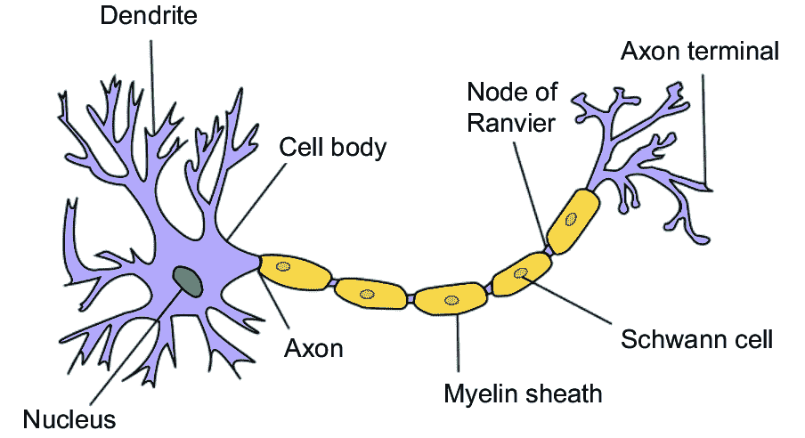

# 第六章：人类与机器

### 本章涵盖

+   生物大脑概览

+   人类思想和记忆的考量

+   对常识、想象力、直觉和创造力的思考

+   图像推理

> 在人工智能领域度过的一年足以让人相信上帝。——艾伦·J·佩利斯

机器能否匹敌或超越人类的创造力？在本章中，我们将解释，即使人工智能系统在模式识别和数据分析方面显示出令人印象深刻的能力，但人类创造力的本质仍然是一个难以用算法复制的谜团。我们将审视人类认知的几个方面，以突显想象力、直觉、好奇心和创造力的真正含义，证明当前的人工智能虽然可以大大增强我们的能力，但无法模拟许多对于人类大脑想象未知、综合抽象思维并从思想和情感中汲取灵感的特性。我们还将证明，真正的理解是视觉的前提条件，揭示当前人工智能算法在识别物体方面的局限性以及它们远离实现人类般感知物体和场景的距离。

## 人类大脑

我们的大脑，即使在我们睡觉时也在编排我们所做的一切，是已知宇宙中最复杂的有机物质。根据科学作家 Rachel Tompa 的优秀文章“关于大脑的 5 个未解之谜”[1]，我们甚至不了解蠕虫的大脑。

在《科学》杂志[2]发表的一篇文章中，计算神经科学家克里斯托夫·科赫（Christof Koch）强调了由于大脑的复杂性而我们在理解人类大脑方面取得的少之又少的进展：“1962 年未来诺贝尔奖得主大卫·休贝尔（David Hubel）和托斯滕·维塞尔（Torsten Wiesel）在一篇著名的出版物中提出的有关皮层回路的基本问题至今 50 年后仍然没有答案。”我听过神经学家也有同样的感受，但你会发现一些人工智能专家假装理解大脑的工作原理。

### 思考

表达我们的思想意味着什么？人类大脑的内部运作仍然是一个深奥的谜团，我们尚未完全掌握思想的本质，以及我们如何从感官体验中提取意义。作为人类，当我们遇到没有即时答案的问题或者依靠我们的知识来制定回答时，我们会参与思考。例如，当被要求计算 5 乘以 4 时，答案 20 会毫不费力地立即出现。同样，拼写我们自己的名字是一种自动的反应。然而，当面对像计算 529 的平方根或者拼写具有挑战性的单词“onomatopoeia”这样的更复杂的任务时，我们通常需要进行深思熟虑。似乎当我们必须适应不熟悉的情况时，我们会进行思考。

人体是约 30 万亿个细胞的复杂组合，每个细胞都作为一个独立的、知觉的、反应的和巧妙的实体运作，并与其他细胞和谐地合作。这些细胞成分同时执行成千上万的功能，包括输送氧气、循环血液、消化食物和合成蛋白质。我们的感觉器官不断向大脑传递信息，为我们提供视觉、听觉、嗅觉、味觉和触觉的感觉。大脑处理这些信息，使我们能够理解并适当地对周围环境作出反应。

人脑由大约 1000 亿个神经元相互连接在各种功能结构之间。神经元利用电脉冲和化学信号在大脑内部和大脑与更广泛的神经系统之间传递信息。神经元之间的动态相互作用和交流使每个个体在认知、情感和行为反应方面独一无二。

神经元分为三类：感觉神经元，运动神经元和中间神经元。感觉神经元将来自我们感觉器官（如眼睛和耳朵）的数据传递给大脑。另一方面，运动神经元通过从大脑到肌肉的指令进行肌肉活动的控制。其余的神经元类型统称为中间神经元。在这三类中，存在许多不同的亚类，每种亚类专门负责特定类型的信息传递。根据它们的位置和功能，一些亚类的神经元偶尔可以承担其他亚类的角色，通过传递和接收特定的神经递质。

神经元本身包括三个基本组成部分：细胞体，被称为轴突的延长结构，以及被称为树突的延伸网络（图 6.1）[3]。细胞体是神经元的指挥中心，内含细胞核，控制其功能并包含遗传物质。轴突类似于一个长长的尾巴，主要将电化学脉冲从细胞体传递出去，促进与其他神经元的通信。树突通过其分支结构从相邻神经元接收传入信号。神经元通过神经递质跨越称为突触的专门连接传递信息。

##### 图 6.1 典型神经元的图像（由 Wikimedia Commons 提供，CC BY-SA 3.0）

每个轴突末端都含有大量的囊泡，每个囊泡都包含大量的神经递质分子。单个神经元具有与其他神经元建立成千上万的连接的能力，导致成年人脑中估计有 100 万亿个突触连接。这些连接并不是静态的；它们表现出随时间变化的能力。此外，两个神经元之间交换的信号越多，它们之间的连接就越强。这种动态特性使人脑能够根据经验重新配置其物理结构。

将生物神经网络采用的复杂学习机制与人工神经网络的简单架构和学习方法进行比较，显然存在着明显的对比。人工神经网络通常采用简约的拓扑结构，并依赖于权重修改进行学习，这与生物神经网络的复杂性相形见绌。

### 6.1.2 记忆

我们的记忆定义了我们是谁，但它们究竟是什么，以及它们是如何存储和检索的？这个问题已经困扰了研究者数个世纪。我们知道记忆不是存储在我们身体内的物理对象，但除此之外我们还知道些什么？我们想象我们的大脑会对我们经历过的经历进行某种记录，至少是重要的经历。

如果我们的大脑有一个文件库，其中包含我们学到的东西，我们的思想和信仰，编程工作是如何进行的？文件格式是什么？这是否是适当的类比？我们的大脑如何区分和分类我们思考的众多事物之间的多维差异和相似之处，以及它如何跟踪它们之间的相互关系？

计算机通过访问存储在晶体管或其他电子媒介中的二进制数据来“回忆”某些事情。它将存储设备中的 1 和 0 转换为在屏幕上显示符号或使声音从扬声器中发出的机器指令。将这与人类经验进行比较。微弱的声音或气味可以带回我们第一次听到最喜欢的歌曲或我们尝试特别菜肴时度假时的生动记忆。

我仍然记得当我第一次听到约翰·列侬的歌曲“想象”时我在哪里以及我在做什么。在我们的脑海中，我们可以将景象形象化，听到环境声音，闻到香气，就好像我们的眼睛，耳朵和鼻子是时光机器。我们重新体验情感，并拼凑出我们曾经进行过的对话的部分，所有这些都可以在毫秒内自动发生。

尽管我们显然了解计算机内存的工作原理，但我们对自己的内存仍然了解不足，虽然大脑功能的大部分仍然是神秘的，但我们已经取得了一些进展。1953 年，亨利·莫莱森（Henry Molaison）在接受手术治疗癫痫后失去了形成新的长期记忆的能力。手术已经切除了他的海马的一半，这导致医生相信海马在记忆形成中起作用，这一假设后来得到了证实。

像莫莱森（Molaison）等人所经历的不幸事件促成了大脑内部的不同亚结构的发现，每个亚结构都有特定的功能。其中值得注意的是丘脑和下丘脑，它们在协调运动方面发挥作用；垂体和松果体，负责产生和调节各种激素；网状网络，与意识和注意力相关；边缘系统，参与驱动和情绪的处理；以及脑干，包含控制自动过程的多个亚结构。

1970 年，埃里克·坎德尔博士因他对海蛞蝓简单神经系统的研究而获得了诺贝尔医学奖。他的实验揭示了记忆背后的分子机制，并表明学习涉及到大脑结构的物理变化。他发现，随着海蛞蝓的学习，化学信号改变了连接它们细胞的突触网络。这些细胞用于传递和接收信息的电化学通路的变化与新记忆的形成有关。今天，我们可以观察到细胞核产生 mRNA，指导突触建立新的连接，我们现在了解到当我们学习或记忆时，这些变化发生在我们自己的大脑中。

### 6.1.3 潜意识

我们的意识思维作为想象力和情感的融合，不断寻求新奇。它是新鲜想法的源泉，也是我们所谓的“人类智慧”的基石。

我们的潜意识与我们的大脑和神经系统协同工作，接管我们的行为并塑造我们的选择。这个潜意识不断运作，像一台警惕的自动驾驶，调节着从我们的呼吸和体温到我们的免疫系统的一切。它独立于我们理性、逻辑的思维之外运作，但似乎依赖于我们的信念和过去的经验。

我们的潜意识对我们的观点、信念和判断产生重大影响。想象一下一个孩子通过观察周围环境和其中的人学习行为规范。这些根深蒂固的价值观可能在我们成年后指导我们的决定，即使我们并没有意识到它们，挑战它们也会引起强烈的情绪，如内疚。我们的潜意识编程也可能培养出隐藏的偏见，导致我们评判那些没有经历相同条件的人。

这种复杂性与机器智能模型形成鲜明对比，机器智能模型中的一切都是内在明确的。数据要么被存储，要么没有被存储，算法要么引用它，要么不引用它。

当观察一个婴儿学会走路时，我们就能看到我们潜意识思维的卓越力量。他们从爬行开始，试验和发现一种推动他们前进的肢体运动模式。逐渐地，他们学会站立和转移体重，最终掌握走路的艺术。这个公式在几周内就被深深地植入到他们的潜意识中，使他们能够毫不费力地走路一生。尽管进行了巨额投资，机器人仍然无法复制幼儿的熟练程度。

当驾驶汽车时，我们潜意识的能力同样显著。最初，我们的意识思维在学习这项复杂任务时感到困难，但随着经验的增长，驾驶似乎毫不费力。我们常常在没有记得细节的情况下完成一次旅程，因为我们的心智自动驾驶系统在交通中导航、避开障碍物并适应条件。令人惊讶的是，我们的潜意识甚至管理着我们的速度，因为我们可能发现自己在不知不觉中与道路要求保持一致。意识思维偶尔会参与其中，以记录环境中的重大变化。我们的潜意识思维操作起来就像是一台适应性的自动驾驶系统。

### 6.1.4 常识

> 常识是没有反思的判断，被整个班级、整个国家或整个人类共享。—詹巴蒂斯塔·维科

常识，是数百万年人类进化和交流的产物，是从共享的人类经验中得出的广泛实用见解的广阔图书馆。我们日常生活中所做的一切都使用常识，它使我们能够理解世界并在其中有效行动。这种知识不需要教导，因为我们期望每个人通过他们的生活经验自动获得它。以下 12 个例子说明了大多数人会认为是常识的事情：

1.  图书馆或你手上的书应该在那里，但是微波炉里的书就没有意义。

1.  雨是垂直落下的，会让我们身上湿透。

1.  一个装有水的玻璃杯如果掉在水泥地上很可能会破裂，但即使没有破裂，里面的水也会溢出。

1.  大象不会飞。

1.  我的父母比我年龄大。

1.  酒后驾车是一种危险行为。

1.  蜂蜜味甜，来自蜜蜂。

1.  动物不会开车。

1.  盐不是糖，即使它们看起来相同。

1.  在黑暗中，外表不重要。

1.  如果你知道我有一辆车，你可以推断我可以载你。

1.  如果你得知我的车发动不了，你不再会推断你可以搭我的车了。

人类经常通过短语或词语的组合抽象地表达常识。例如，当我们使用短语“boiling the ocean”时，我们传达的是一个任务过于庞大的意思。另一方面，人工智能系统往往难以理解这种抽象概念。它们可能会意识到海洋含有水，水可以被煮沸，导致它们字面上解释短语，错过了预期的意义。

我们的常识还涉及识别概念之间的关系、含义和关联。当我们看到云和天空变暗时，我们预料到会下雨并理解它对我们野餐计划的影响。我们从词语、手势、符号和颜色中得出意义，所有这些都取决于上下文和各种线索。例如，在美国，政治新闻文章中的术语“红州”和“蓝州”被理解为指具有多数共和党或民主党选民的州，而不是描述它们的物理颜色。

常识在人类创造力中起着至关重要的指导作用，它引导我们将精力从不切实际的追求中转移到生产性和有效的项目上。常识的多样性和无数情景使得几乎不可能将其编目或编程到计算机中。涉及对象、行为、个体和环境因素的潜在组合几乎是无限的。因此，在计算机中复制常识仍然是一个巨大的挑战，真正的人工智能在没有常识和理解的基础上是无法实现的。

### 6.1.5 好奇心

> 我们不断向前迈进，开启新的大门，做新的事情，因为我们好奇，好奇心不断引领我们走向新的道路。 ——华特·迪士尼

好奇心，贯穿我们思想的思维驱动力，是人类文明进步的关键力量。它激发了我们对未知的调查和发现的渴望，探索未知，创新和学习。鲁道夫·吉卜林的诗歌“我保持六个诚实的仆人”以一种富有想象力的方式概括了好奇心：

我保持六个诚实的仆人

(他们教会了我所有我所知道的);

他们的名字是什么、为什么、什么时候、怎么样、在哪里和谁。

我把它们送过陆地和海洋，

我把它们送往东方和西方;

但在他们为我工作之后，

我让他们全部休息。

人类的好奇心一直驱使着我们超越了单纯的生存需要，往往类似于饥饿或口渴的原始本能。正是这股驱动力使我们投入时间和精力探索我们的世界。无论是对未探索的海洋还是新大陆的好奇心，它都激励我们建造船只，踏上探索之旅。

好奇心不仅限于探索，它在每个领域都发挥着不可或缺的作用。例如，它通过帮助我们更好地了解和满足个人需求来提升客户服务。在医疗保健领域，它提高了治疗的质量，因为对患者状况更加好奇的医生更有可能提供更加量身定制和个性化的护理。

费思·菲茨杰拉德博士在她名为“好奇心”的文章中强调了医疗保健中好奇心的重要性[5]。在这篇文章中，她分享了医生和作家埃里希·洛伊的一段话，强调好奇心是医学领域的驱动力：

> 好奇心，这种刺激探索的原始“惊奇”，既涉及想象力（构想新现象的替代解释），又涉及智力（制定最佳方法来判断哪种解释最有可能）。想象力和智力对于人文学科、科学以及两者的综合（即临床医学）都是不可或缺的。

可以毫不夸张地说，大部分显著影响人类进步的科学进步都可以归因于好奇心。例如，考虑一下德国物理学家威廉·伦琴于 1895 年的情况。在使用克鲁克斯管进行研究电放电时，伦琴做出了一个引人注目的观察：他的设备在房间对面的一个化学涂层屏幕上产生了一种神秘的发光。受到伦琴工作的启发，法国人亨利·贝克勒尔决定调查他收藏的一些在黑暗中散发出诡异光辉的不寻常的岩石。这种受好奇心驱动的探索最终导致了放射性的发现 [6]，这是现代科学中的一个基本概念，为 X 射线、烟雾探测器和核能等技术奠定了基础。

理查德·费曼是 20 世纪后期物理学领域的著名人物，因其在量子电动力学方面的开创性工作而与 1965 年分享了诺贝尔物理学奖，这对我们理解基本粒子具有深远的影响。当被问及是什么主要推动了科学发现时，他回答道：“这与好奇心有关。这与人们想知道某物是如何运作的有关。”[7]在他的书籍*六堂简单的课* [8]中，费曼强调好奇心要求我们提出问题：

> 沙子是否与岩石不同？也就是说，沙子也许只是许多非常小的石头？月球是一个巨大的岩石吗？如果我们了解了岩石，我们是否也会了解沙子和月亮？

像其他内在驱动力一样，好奇心是人类创新背后的刺激，敦促我们冒险探索未知领域。好奇心和我们的情感联系在一起，唤起了好奇、兴奋和探索新事物和未知事物的内在渴望。好奇心推动我们冒险以寻求回报，激发出一种令人激动的感觉。好奇心的满足触发了大脑中多巴胺等愉悦化学物质的释放[9]。相比之下，人工智能仅依赖于人类编程算法。机器缺乏动机和满足的能力，当然，它们也无法体验好奇心。

### 6.1.6 想象力

> 逻辑会把你从 A 带到 B，想象力会带你去任何地方。——爱因斯坦

想象力，创造新想法和发明的源泉，源自人类情感、专业知识、生活经验以及思想、情感和记忆之间。它是创作诗歌、作曲音乐、解决复杂问题和构想突破性创新的催化剂。想象力还赋予我们从当前环境中推断未来事件的能力。

想象这种情景：你发现自己在一幢办公大楼的十层，突然被交付紧急使命，要将满满一桶水送到一楼的接待区，而电梯坏了，必须使用楼梯。虽然这种情况可能是新颖的，可能没有人曾向你描述过这样的困境，但你的想象力迅速地开始发挥作用。

在这种想象的练习中，你可能会推断出任务的紧急性与接待区的重要事件有关，因而你创造并评估了各种场景。当你想象自己带着晃动的水桶飞奔下楼梯时，你预料到不可避免的溅洒，潮湿的衣物的可能，以及为了避免滑倒而需要谨慎行动。

这就是想象力的工作本质，一种推动创新的智力能力，使我们能够探索想法和实体，这些想法和实体只存在于我们的思想中。想想莫扎特，他声名远播地在脑海中创作了整个交响乐曲，没有真正的乐器。同样，剧作家设想了场景，充满多位表演者，他们的行动和对话，他们在舞台上的精确位置，伴随的音效以及事件的交织。

想象力是人类创造力的发动机。举例来说，约翰内斯·古腾堡就是因为在脑海中构想出一个带活字的螺旋压力机而闻名的。这一构想最终导致了第一台印刷机的诞生，这台机器将成为历史上最具影响力的发明之一。在他的论文《尼古拉·特斯拉：今天的电力是通过他的发明来产生、传输和转化为机械动力的》[10]中，肯尼思·斯韦泽赞扬了特斯拉非凡的想象力，并强调了特斯拉的创新的深远和积极影响：

> 从小，特斯拉就能清晰地想象，以至于他经常很难区分真实物体和他想象中的对应物。这种能力在普通生活中经常令人困扰，甚至令人恐惧，但特斯拉在发明中却利用了这一优势。借助这种能力，他可以在脑海中组装和重组机械零件，改变尺寸、重量和材料，最终制作出一个通常会准确运行的模型。

同一篇论文强调了特斯拉的想象力，描述了一项突破性的发现，为现代电动机和发电机铺平了道路：

> 1882 年 2 月的一个傍晚，答案出现了。特斯拉与朋友西格蒂一起漫步在布达佩斯市立公园里，背诵着他能倒背如流的歌德的《浮士德》中的诗句。突然间，他苦苦寻觅的解答在他脑海中闪现。他清楚地看到一块铁转子在电涡旋中快速旋转——由两个不同相位的交流电相互作用产生的旋转磁场。特斯拉用一根棍子在沙地上画出图表，向西格蒂详细解释了六年后他在美国要申请专利的感应电动机的原理。

我们的想象力是一种思想和情感的融合，导致创造力和创新。与机器不同，我们的认知过程不受严格逻辑的限制。一个设计用于在数据中检测模式的算法如何能够复制人类想象力的无限性？

### 6.1.7 创造力

> 创造力就是看到别人看到的，并且想到其他人从未想到过的事物。—阿尔伯特·爱因斯坦

创造力源于我们推断看似无关联概念之间连接的能力。它依赖于想象力产生新颖的想法或有价值的产品。这种创造力的力量可以以各种方式表现出来，从创造全新的东西到组合、调整或增强现有元素。创造力挑战了纯逻辑的限制。它始于想象力，通过直觉蓬勃发展，并通过推理形成。成为创造性的公式或方法是不存在的。创造力使我们能够在面对意外事件和挑战时实时适应。众所周知，创造力是发明之母。

一种关于创造力的经典例证可以在阿基米德的故事中找到。他被国王委托确定一顶王冠的容积。当他浸入浴缸时，突然产生了灵感：他的身体排开的水等于他的体积。意识到这个原理可以应用于测量王冠的容积，据说他大喊“幽锥！”这意味着“我找到了！”

另一个例子来自约翰·斯坦贝克杰出的书*与查利一起寻找美国* [11]，他描述了他如何巧妙地在乡间旅行时设计了一种高效处理洗衣的方法：

> 我发明了一种洗衣服的方法，你需要走很远才能超越它。它是这样发明出来的。我有一个带盖子和提手的大塑料垃圾桶。由于卡车的正常移动使它倾斜，我用一根坚固的弹性绳（由覆盖橡胶的棉制绳组成）把它拴在我的小壁橱里的衣服杆上，它可以随意摇晃而不会倾倒。经过一天，我打开它在路边一个垃圾桶处处理东西时，发现了我见过的最彻底混合和揉捏的垃圾。我猜想所有伟大的发明都源于这样的经历。第二天早上，我清洗了塑料桶，放入两件衬衣，内衣和袜子，加入热水和洗衣粉，并用橡皮绳拴在衣服杆上，它整天摇晃和疯狂舞蹈。那天晚上，我在小溪里冲洗衣服，你从未见过那么干净的衣服。在小马车 Rocinante（他以唐·吉诃德的马命名的皮卡车）内，我靠近窗户悬挂了一条尼龙线，将衣服挂起晾干。从那时起，我的衣服是在一天的行车中洗净，然后在第二天晾干的。

创造力似乎具有天然的广阔性，一次又一次地在一项创新之上建立起来。随着时间的推移，渐进式的增强和巧妙的修改已经将我们从热气球推上了太空飞船。

一个有创造力的个体经常接受挑战，以发明创新的解决方案。相比之下，现有的人工智能是机械操作，根据人类创建的算法处理数据。它缺乏发明全新东西的能力。创造力怎么会从一堆数学公式中出现呢？

### 6.1.8 直觉

> C’estparlalogiquequ’ondémontre，c’estparl’intuitionqu’oninvente。我们用直觉发明，我们用逻辑证明。—亨利·庞加莱

直觉是我们本能的能力，能够在不依赖于有意识的推理的情况下感知、评估和理解某种东西。它就像一个微妙的耳语，引导我们探索未被探索的领域，借鉴我们过去的经验和情感，以拥抱有时可能导致突破性发现的非常规路径。直觉超越逻辑的边界，使得很难解释。

大多数创新在一定程度上可以归因于直觉。我们都熟悉艾萨克·牛顿和苹果落下的传奇故事。当他观察到一个苹果从树上掉下来时，牛顿深深地感受到这个看似普通的事件背后有重要的东西。这使他思考运动中物体的本质，他的直觉提示他，导致苹果下落的东西可能也是月球运动的原因。他进一步推断，这样一个普遍的力量也可能控制着星球和行星的运动。在他那个时代，普遍的信仰是天使推动行星沿着它们的轨道运动。

1796 年，医生爱德华·詹纳有一个直觉，导致了世界上第一个疫苗的开发。那时，天花在英国是一种猖獗且致命的疾病。詹纳观察到那些经常与牛交往的人经常感染牛痘，这是一种相关但较轻的疾病，可以从牛传播给人类。奇怪的是，那些感染了牛痘的人似乎对天花免疫。詹纳有一个直觉，认为牛痘能够对抗天花，并通过对牛痘的有意识和系统性暴露，他证明了它可以防止天花的传播。这种直觉，在病毒的发现及其在疾病中的作用被发现将近一个世纪之前，帮助对抗了困扰人类几个世纪的疾病。

1928 年，苏格兰医生和科学家亚历山大·弗莱明在检查细菌培养皿时注意到一块霉斑。他观察到霉斑周围的区域没有细菌。他的直觉引导他进一步调查，从而发现了青霉素，这是一个挽救生命的发现，拯救了无数人的生命。

同样，起搏器，一个医疗救命器，是在 1956 年由工程师和发明家威尔逊·格雷特巴奇的直觉发明的。在研发心脏节律记录器时，他不小心使用了错误大小的电阻器，意外地听到了设备发出的电脉冲声。他的直觉让他相信自己可能已经找到了一种模拟和刺激心跳的方法，这一信念被证明是正确的。

人工智能作为计算机程序，主要依赖逻辑推理，缺乏直觉维度。复制触发人类直觉的复杂而神秘的过程对人工智能来说是一个巨大挑战。很难想象一种算法能够复制出像直觉这样不合理和无法解释的东西。算法和数学公式的组合如何能够在机器中产生直觉？

### 6.1.9 类比

> 发现中真正的成就在于……看到了以前没有人看到的类比。 ——阿瑟·科斯特勒

比喻是一种利用相应部分或相似之处进行比较的比较。比喻激发直觉和创造力，使其成为人类创新的强大工具。我们自然而然地在不同的对象之间进行类比。例如，我们认识到汽车和滑板之间的类比，尽管它们有根本的不同，但两者都有轮子，可以促进从 A 点到 B 点的移动。比喻在职业世界中也发挥着重要作用。例如，律师在他们的论点中经常引用先例，使用通过比较早期案例进行推理的方法。在他们 1970 年的学术文章中，题为“关于人工智能和法律推理的一些猜测”的文章中，Bruce G. Buchanan 和 Thomas E. Headrick 强调了比喻在法律职业中的关键作用：

> 律师通常喜欢构建从案例中提取出与他正在处理的案例相似的事实的论点。如果找不到这样的案例，他就会寻找在形成论点时与自己的类似的事实的案例。找到类比的一种方法是通过对法律规则的概括。尽管在一个案例中将规则应用于特定的事实，但法院陈述规则的语言可能演绎地允许将其应用于不同的事实。该规则可能使用能够涵盖各种事件、行动或关系的词语。例如，在我们的波士顿冰块的案例中，律师检查了水递送的案例是否适用于冰递送。此外，类比是通过对事实情况进行概括而找到的。

人类的类比推理利用了广泛的多样化经验库，使我们能够推断出看似无关的领域之间的联系，并将它们的见解应用于创新和创造新的思想。相比之下，当前的人工智能技术在试图模拟人类级别的类比推理时面临困难，因为它们严重依赖于预定义的算法。

## 6.2 人类视觉与计算机视觉

视觉可以说是我们最依赖的感觉，帮助我们导航和理解周围的世界。我们的视觉感知始于环境中的光线，这些光线要么来自光源，要么从物体上反射，然后通过角膜进入我们的眼睛。眼睛的晶状体将这些光线聚焦到视网膜上，视网膜位于眼睛背部的光敏膜。视网膜细胞通过传递神经信号响应，这些信号迅速被加工成我们周围环境的表示。这种感知过程使我们能够感知光明和黑暗；区分颜色、质地和形状；以及识别不同的物体。此外，我们还能检测运动并估计距离。

捕捉光线并生成电信号的物理过程并不特别复杂，许多机器在这方面超过了我们。我们有能够检测遥远天体的热量和 X 射线的设备，还有能够产生单个原子图像的其他设备。然而，人类视觉不仅仅是数据采集；它涉及到解释和理解的复杂过程，这是机器目前远远落后的领域。

通常，人类只需要少数几个示例就能对某事物形成深刻的理解。当一个孩子第一次看到一只猫时，他们本能地建立起一个心理模型，帮助他们识别“猫”的特性。他们使用逻辑和常识来概括他们的观察，下意识地识别与猫相关的各种特征，如形状、颜色、纹理、声音和行为。即使孩子的第一次遭遇是在窗户里看到一只小小的、白色的暹罗猫，他们也会认出其他不同颜色、大小和品种的猫，即使在不同的活动中。他们可以在照片、漫画甚至是万圣节有人扮成猫时识别猫。随着接触的增多，他们可能会了解到猫有爪子和尖牙，可以表现出甜蜜和脾气暴躁的行为。

相比之下，深度学习算法通常需要接触数百万个人标记的示例，才能可靠地将一张图片识别为“猫”或“非猫”。这些示例需要是高分辨率的图像。算法需要看到猫从多个角度和参与各种活动，捕捉所有相关的形状、大小、颜色和纹理。对于机器来说，它“看到”的对象本质上是像素的集合。机器学习采用分层方法，最初识别与形状相关的模式，然后识别颜色和纹理，最终检测到更细微的特征。即使一个人工智能系统能够可靠地“看到”和识别猫的图像，它也缺乏孩子第一次遇到猫后所达到的深度理解。正如我们在第三章中探讨的神经网络和深度学习所述，机器“学到”的基本上是一组介于 0 和 1 之间的数字值（网络的权重），使算法大部分时间能够产生准确的输出。然而，这些数字不能教会机器图像的*意义*或照片中捕捉到的物体的潜在用途。

### 6.2.1 AI 和 COVID

2020 年，全球应对了 COVID-19 病毒的出现，这是一场夺走了数百万生命的全球健康危机。对技术解决方案的需求至关重要，这为人工智能提供了展示其潜力的独特机会。多年来媒体对机器视觉的炒作，利用 AI 诊断 COVID 的想法似乎很有前途。看起来很简单：使用带有“感染”或“未感染”标签的胸部 X 射线或其他图像训练机器学习算法，医生可以在上传患者的胸部扫描后立即收到诊断结果，消除了传统 COVID 检测所需的等待时间。

然而，现实是令人失望的。虽然机器学习在某些医学影像应用中取得了成功，但在全球大流行期间，全球范围内开发的数百种模型都未能用于 COVID 诊断。《自然》杂志团队对 2212 项研究进行的全面审查，标题为“使用胸部 X 射线和 CT 扫描检测和预测 COVID-19 的机器学习的常见缺陷和建议” [13]，得出结论：“由于方法论缺陷和/或潜在偏见，没有发现任何潜在临床用途的模型。”

*麻省理工科技评论*（*MIT Technology Review*）分享了类似令人失望的评估，称：“最终，开发了许多预测工具。没有一个真正起到作用，有些甚至可能有害” [14]。领导*英国医学杂志*研究审查的流行病学家劳雷·维南特斯（Laure Wynants）表达了深刻的担忧，她认为实验性诊断技术可能会带来更多的伤害而不是好处。她说：“这令人震惊。...我当初确实有些担心，但这超出了我的担忧” [15]。遗憾的是，我同意她的看法。

### 6.2.2 图像推理

我们人类在不费吹灰之力的情况下，将视觉输入实时转化为我们完全信任的有意义信息，以至于我们经常拿生命来赌注。相比之下，2017 年进行的一项针对深度学习系统的实验展示了计算机“视觉”的脆弱性。在训练网络以识别一组图像后，发现有 74%的图像可以仅通过修改一个像素的方式，以 99%的概率愚弄算法 [16]。值得一提的是，我们每只眼睛都有一个真实的盲点，尽管它代表了我们视野中一个比一个像素更重要的空白，但我们通常完全没有注意到它，也不会因此感到困惑。每只眼睛后面视网膜神经连接的地方没有光感受细胞，因此眼睛透过镜头聚焦在其中一个点上的环境光不会激发任何信号。然而，大脑通过使用上下文和另一只眼睛的数据来填补缺失的信息，将我们的环境呈现为一个连续的、无间断的图像。

AI 对于物体识别的困难是显著的，但更大的缺陷在于其完全无法将意义与其处理的图像关联起来。视觉不仅仅是关于在图像中识别物体，而且在像素模式中找出模式与理解对象环境的重要性、对象之间的关系以及它们的潜在用途之间存在着巨大的差距。人类天生的从背景中区分对象的能力继续逃避 AI，而通过触觉、声音和嗅觉辅助的视觉解释能力可能永远不会被任何 AI 算法复制。

AI 也难以模仿不连贯性的检测。在没有任何训练的情况下，我们知道汽车不应该放在微波炉中，椅子也不会飞。如果我们被展示一个厨房场景，我们知道不要期望有一个热水浴缸或割草机。相比之下，AI 不会识别连接或关系，因此无法告诉何时情况不对。

我们的人类视觉系统还与我们的逻辑推理和想象力结合在一起。例如，仅通过视觉，一个孩子就能学到香蕉是一种从绿色开始、变黄后发展出褐色斑点的水果。他们会学到香蕉没有种子，可以和冰淇淋一起食用，也可以被烹饪。他们还会明白，尽管香蕉可能被切片放入一碗燕麦粥中，但不应该放入一碗鸡汤中。

当前的 AI 无法自动复制出孩子对香蕉产生的任何想法或联想。计算机也不太可能识别出香蕉和香蕉形状的黄色塑料之间的有意义差异。即使只依靠视觉，孩子也会推断出塑料香蕉不会变黄，也不能剥皮或食用。

抽象的意义和表示也是我们处理视觉输入的一部分。当我们在纸上看到数字时，我们将它们与数量关联起来，或者通过相对大小或其他抽象特征理解它们。数字 9 和数字 6 在旋转 180 度后基本相同，但我们毫不犹豫地知道 9 表示的数量大于 6，也许每个数量都可以被 3 整除。

我们的视觉处理也与我们的运动功能和协调能力无缝结合在一起。我们可以在草地上奔跑，同时观看球在空中飞行，而无需测量或进行任何数学计算，就能在恰到好处的时间和位置抓住球，防止它撞到地面。管弦乐团的音乐家们可以根据乐谱上的标记进行复杂而精细的动作，同时根据指挥的手势调整他们的表演。

有许多人类视觉方面的特点是机器无法复制的，因为它们是机器。例如，看到一个哭泣的孩子可能会引起悲伤或同情。一个久违的朋友可能会引起惊讶和喜悦。对感官输入的情绪反应和生理反应显然只限于生物体，没有任何机械模拟能够重新创建人类视觉的这些特征。

大部分人工智能的努力都集中在复制人类智能上，而没有分析 AI 算法和计算机使用的过程是否与人类思维有任何关系。我们了不起的大脑能够做出我们甚至无法理解的事情，从这个角度来看，声称我们可以在计算机中复制这些事情应该变得更容易被否定。此外，通过放弃我们应该尝试让我们的机器像大脑一样行为的想法，我们实际上可以追求技术的全部潜力。虽然鸟类的飞行可能曾经启发过那些想象飞行器的人，但我们并不渴望制造完全模仿鸟类行为的飞机。事实上，我们的空中技术远远超过了自然界的任何东西。

尽管人工智能取得了惊人的进步，但它仍然受限于其算法编程，缺乏复制人类好奇心、想象力、创造力、类比和直觉这些定义人类特征的基本品质。这些方面与许多其他情感人类能力之间的内在联系是我们物种的独特特征。

## 摘要

+   人类大脑仍然是一个神秘的谜团，继续困扰着医学专业人员和研究人员。

+   尽管在揭示认知和意识的神经基础方面取得了重大进展，但负责产生我们思想的精确机制仍然是一个深奥的谜。

+   人类大脑惊人的记忆信息和概括概念的能力证明了其惊人的适应性。

+   在意识之外，潜意识对我们的决策和创造性发现产生了深远的影响。

+   常识是人类决策的基本方面，是复杂情况中的重要指南。

+   人类拥有独特的特性，对人工智能来说仍然是一个严峻的挑战。
