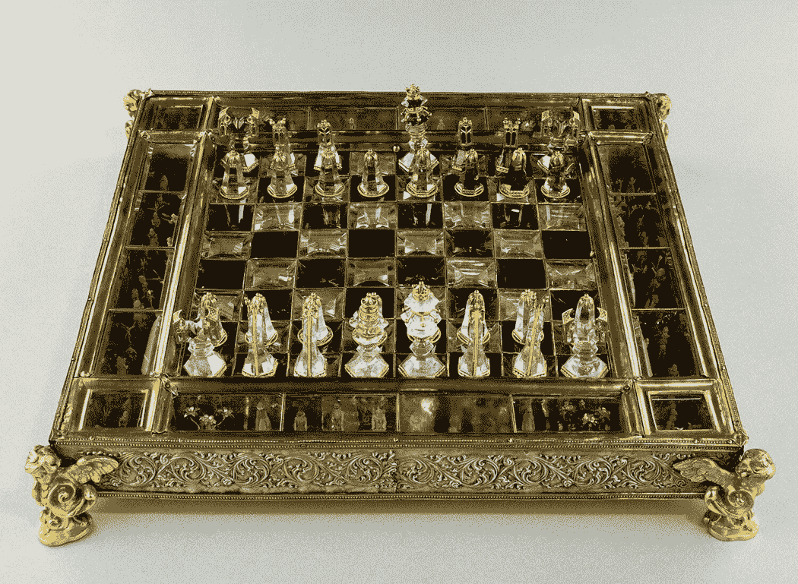

# 第七章：AI 不会把数据转化为智能

### 本章内容包括

+   数据、信息和智能之间的区别

+   AI 模型的有限重用性

+   AI 对意外数据输入的脆弱性

在本章中，我们将解释，无论数据集有多么广泛或算法有多么先进，人工智能程序在从数据中推断智能时面临着巨大挑战，这是由于语义鸿沟导致的，人工智能算法可以处理数据，但难以理解它的更深层含义。即使对于像识别手写数字这样的简单任务，人工智能模型擅长的地方，它们仍然缺乏理解数字周围语境的能力。例如，一个人工智能系统可能正确识别手写的 9 为数字符号 9，但它仍然无法推断出这个数字更有可能代表的是生日卡上一个孩子的年龄。

農夫狼山羊白菜难题，前面在第四章已经讨论过，作为一个主要示例，说明了当人工智能面临需要逻辑推理和策略规划的问题时的约束。传统的机器学习模型主要依赖于统计模式和数据驱动的训练，因此对于需要演绎推理、前瞻性规划以及对特定约束的深刻理解的任务来说并不合适，就像这个简单的问题所展示的那样。在这个谜题中，农夫必须安全地把狼、山羊和白菜过河，确保狼不吃山羊，山羊不吃白菜。虽然人工智能在自然语言理解、图像识别和游戏等领域表现出色，但这些领域通常涉及基于模式识别和优化的活动，借鉴于历史数据。相比之下，解决农夫狼山羊白菜难题需要符号推理或符号人工智能技术，依赖明确规则和逻辑来确定正确的行动顺序，同时遵循预先定义的约束。人工智能的真正进步将需要开发创新技术，例如智能代理，超越仅仅从数据中学习的局限。

通过引用医学诊断更详细地阐述，很多人认为人工智能可以从数据中获取“智能”的能力。然而，只依靠训练数据的人工智能系统并不能准确进行医学诊断。一个基本的限制是缺乏医学理解。只依靠数据训练的人工智能程序可以识别统计模式和相关性，但它们缺乏对潜在的医学概念、疾病机制以及人体复杂性的固有理解。医学诊断通常需要对生物学、病理学和临床专业知识的理解，这些是无法从数据中推断出来的。

在大多数情况下，去看医生，除非是紧急情况，都是从信息共享过程开始的。在预约时提出问题并得到回答，填写接待表格，更新健康史，有时需要填写问卷调查。在患者见到医生之前，护士通常会记录身高、体重、体温和血压，同时进行初步测试。

一旦医生进入检查室，他们就开始信息过滤和推理的过程。除了患者的记录和收集的初步数据外，医生还考虑患者的外貌和举止。他们对患者的眼睛、耳朵、鼻子和喉咙进行视觉检查；听心跳；和触诊腹部。他们与患者讨论他们的症状，并提出有针对性的问题收集特定信息。在某些情况下，他们可能进行专门的诊断程序，或要求进行血液或尿液样本进行实验室测试。

从理论上讲，几乎患者生活故事中的任何细节，甚至是他们亲属的故事，都可能与诊断相关。然而，区分要考虑什么和要忽略什么是一种技能，在大多数情况下，大部分可用信息与当前情况无关。如果有时找到正确的诊断感觉就像在草堆中找针一样，那么添加更多数据只会增加草堆的大小，形成阻碍而不是帮助。

医生的大部分推理都是本能和潜意识的，来源于对类似案例的经验和对患者的熟悉。随着时间的推移，医生们已经发展出了处理不确定性和不完整信息的能力。例如，他们必须根据患者的整体健康状况来解释症状严重程度的描述。他们的提问方式会根据患者的回答和直觉实时调整。有时，他们本能地知道要询问家族史或现有病史，而在其他情况下，好奇心促使他们询问睡眠质量或情绪压力。

显然，医生需要推断、进行类比和依靠直觉。他们的任务不是尽可能积累更多信息，而是获取正确的信息并正确解释它。无论 AI 模型在训练过程中使用了多大规模的数据集，它都无法复制医疗专业人员的多方面推理能力。

## 7.1 机器击败世界冠军

历史上两次最广泛宣传的“人工智能事件”是 IBM 的深蓝在 1997 年击败国际象棋冠军加里·卡斯帕罗夫，以及 AlphaGo 在 2016 年击败围棋冠军李世石。这两次事件都受到了广泛的媒体关注，展示了这些程序的表面“智能”，并引发了对未来更先进技术的期待。然而，这些流行的解释往往偏离了实质。这些演示主要突出了机器强大的计算能力和复杂的专门算法。它们并没有展示出真正的智能或理解，而是突显了人类和机器生成游戏走法的鲜明对比。通过分析计算机用于玩人类游戏的方法，我们可以更好地理解依赖于数据和计算的人工智能系统。

在国际象棋游戏中，棋盘由八行八列组成，最初由 32 个方格占据。每一方开始时都有一组棋子，包括八个兵，两个战车，两个骑士，两个主教，一个皇后和一个国王（图 7.1）。每种棋子都有自己独特的移动规则。例如，兵通常每次只能前进一格，除了它的第一步，它可以选择前进一格或两格。玩家轮流行动，白方棋子先行。棋子通过移动到被对手棋子占据的方格来夺取对手的棋子。游戏的目标是将对手的国王置于无法逃脱被夺取的位置，这称为将死。

##### 图 7.1 国际象棋的起始位置（法国卢浮宫艺术收藏品）[1]

在国际象棋游戏中，白方面临着初始的 20 种可能走法选择，而对手也有同样数量的潜在应对。然而，随着游戏的进行，可能的棋盘位置数量显著增加。在第二对走法之后，我们就达到了 197,742 个潜在的棋盘配置。经过三对走法后，这个数字急剧增加到了超过 1.21 亿。为了提供一些透视，考虑到国际象棋中的典型局面允许大约 30 个合法走法可供选择。随着平均国际象棋游戏扩展到大约 40 对走法，总可能的游戏位置数可估计约为 10120 个。

注意 这个巨大的数字被称为香农数，以数学家和电气工程师克劳德·香农的名字命名。它用作国际象棋中估算游戏树复杂度的度量。香农发表了一篇开创性的论文，标题为“为下国际象棋编程的计算机”。在这篇论文中，他引入了游戏树的概念，包括代表不同游戏状态的节点和连接到可通过合法移动到达的节点的边。

在国际象棋中，每个玩家的一步行动会导致对手可能的多种回应，形成一个称为游戏树的分支结构。香农数试图量化可能的国际象棋游戏的大量数量。这个数字提供了国际象棋游戏树复杂性的下限。它是对可能的国际象棋游戏的最小数量的估计，考虑到合法的移动和位置。计算涉及考虑平均分支因子（每个回合可能的平均移动数）和平均游戏长度。

虽然由于国际象棋的巨大复杂性，确切的数字很难准确把握，但香农数作为一个理论上的衡量方式，用来说明国际象棋的非凡深度和复杂性。它突出了国际象棋的错综复杂和广阔性质，强调了包含所有潜在合法位置和着法的困难。

编程回合制游戏的传统方法，正如 IBM 的 Deep Blue 为国际象棋所示，涉及将游戏树存储在计算机内存中。在这种方法中，系统评估分支末端位置的可取性，系统地向树中添加更多节点以进行更深层次的搜索，并修剪不太有希望的分支。计算机然后根据评估最高的位置选择移动。竞争性回合制游戏通常有时间限制。每个玩家最初被分配一定数量的时间，在轮到他们行动时会减少。如果玩家的时间用完，他们通常输掉游戏。因此，计算机必须依靠启发式方法来确定为计算分配多少时间以及何时行动。就像人类玩家一样，它需要在花时间寻找潜在更好的着法和为未来回合保留时间之间保持平衡，避免可能导致劣势位置的快速决策。

要有效地对抗技术娴熟的国际象棋玩家，一个程序必须分析涉及大量着法的序列，这是一个没有剪枝会变得不切实际的任务。Alpha-beta 剪枝是一种用于减少需要在此过程中评估的节点数量的特定算法。国际象棋程序还包括应用启发式方法和经验法则来评估各种位置中每一方的相对优势的子例程。这些评估被转化为数字分数，加权并组合以产生一个总体评估分数，考虑到它们的相对重要性。此外，像 Deep Blue 这样的程序可以访问包含完整国际象棋大师游戏、开局序列和一个包含棋盘上剩余棋子较少位置的完整游戏树的终局数据库。

切换到围棋游戏，它是在一个 1…9 的网格上用黑白棋子进行的。目标是通过用自己的棋子包围它来夺取最多的领地。多年来，计算机围棋程序采取了各种方法，早期的尝试如阿尔伯特·佐布里斯特（Albert Zobrist）1968 年的程序[2]依赖于传统编程。相比之下，1998 年在德克萨斯大学奥斯汀分校（University of Texas at Austin）引入的共生适应性神经进化（SANE）方法[3]利用神经网络和遗传算法教会程序在一个九九棋盘上下棋，而不需要预先编程的围棋知识。然而，AlphaGo 采用了广泛的参考数据库、大师知识和高度复杂的深度学习。该程序使用了来自人类和计算机对局的位置进行训练，包括棋盘位置、最佳着法和获胜百分比。随后，AlphaGo 与自己对弈了数百万局，以完善其策略。

基于计算机的方法不同于依赖直觉和经验的人类玩家。人类玩家计算着法序列并评估位置，但他们的过程既不系统也不数值化。著名国际象棋大师马格努斯·卡尔森（Magnus Carlsen）提到，他偶尔可以计算 15 到 20 步的走法，但挑战在于评估这些线路末端的位置[4]。人类还严重依赖直觉、策略和预测对手的计划，有时选择的走法可能不是数值得分最高的，但对他们的对手在心理上具有挑战性。

## 7.2 缺乏概括

许多人工智能项目主要用于营销目的，由此产生的程序通常除了能在特定游戏中击败人类外，其实用性有限。这些项目通常需要大量的成本和资源投入。虽然它们可能最初引起媒体的关注，例如深蓝（Deep Blue）广泛报道，但它们经常随着时间的推移而逐渐被遗忘。相比之下，国际象棋或围棋等游戏的人类专家可以将他们的技能转移到其他游戏中，并取得相当不错的表现。给他们一段时间熟悉新游戏的规则，他们就能有效地运用自己的系统性和战略性思维能力。另一方面，人工智能系统很难适应其指定游戏中的规则变化，更别说将自己的知识应用到不同领域了。

此外，当评估计算机表现出的明显智能时，重要的是要考虑到，能够以大师级水平下棋的个体也可以处理诸如撰写关于棋局战略的文章等任务。然而，尽管它们具有令人印象深刻的下棋能力，像深蓝这样的系统在其专业任务之外的能力上是有限的。例如，AlphaGo 采用先进的技术来导航复杂的状态空间并分析大量的数据，但它之所以能够这样做，是因为它在完整和完美的信息下运作。这些系统在面对具有不完整信息和不确定性的真实情景时会遇到困难。

在 20 世纪 50 年代，能够进行快速准确的心算的个体被认为是“聪明”的，因为在普及计算机之前，这种技能非常有价值。如今，价格实惠的手持计算器在操纵数学公式和执行计算方面超过了人类的能力。然而，我们并不将智能归因于计算器。这引发了一个问题：为什么我们经常将游戏程序描述为智能，仅仅因为它们擅长快速计算和数据处理？

让我们用一个历史案例来总结本章，突显人工智能系统在试图复制反直觉智能时面临的重大挑战。在二战期间，数学家亚伯拉罕·沃尔德提出了一种反直觉但高度有效的战略，以加强飞机抵抗敌人的火力。他建议的做法是，不是加强接受了最严重破坏的飞机部件，而是加强接受了最轻微破坏的部分[5]。他的洞察力至关重要：返回基地的飞机正在经受他们所累积的损害，记录突出显示了如果受损会导致飞机丢失的区域。沃尔德对反直觉智能的卓越展示得以实现，得益于他的认知能力，如抽象推理、创造力和对情境的深刻理解，这使他能够概念化和推理可能在他的知识和过去经验中没有直接先例的概念。此外，他应用常识推理、创造力和想象力的能力使他能够制定创新解决方案来解决违反常规逻辑的问题，并展示了他的反直觉智能。

与此形成鲜明对比的是，人工智能模型缺乏把握数据背后基本原理或概念的能力。它们还缺乏常识推理，这对于理解可能不符合标准规则或模式的反直觉情境至关重要。本质上，人工智能无法推断反直觉智能凸显了数据驱动的机器学习与人类在复杂、非常规情况下经常使用的细致、依赖于情境的推理之间的分歧。

## 摘要

+   仅仅依赖 AI 程序从数据中学习可能无法满足执行许多任务的需求，尤其是那些需要推理或常识知识的任务。

+   依赖数据学习的 AI 模型通常只局限于单一领域，因为它们的知识和能力完全来源于它们接受训练的数据。

+   AI 模型缺乏基于上下文的推理和批判性思维能力。
