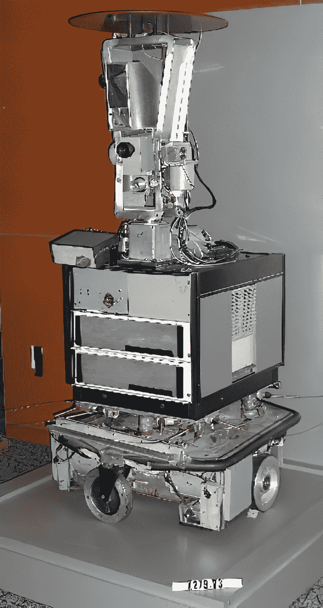
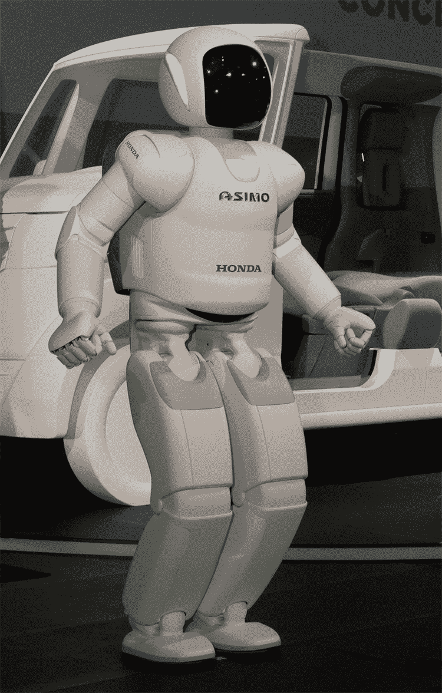

# 第九章：技术单一性是荒谬的

### 本章内容包括

+   单一性的不太可能性

+   机器缺乏智能

+   对人脑的思考

> 这个世界上唯一可怕的是……只是未被理解的。——玛丽·居里

据一些人说，人类文明的终结不会是由于诸如气候变化、核战争或太阳耗尽等原因。相反，他们认为在不远的将来，人工智能可能变得如此先进，以至于获得自己的意志并控制了地球。这种潜在的灾难通常被称为“单一性”，即一种假设的时间点，人工智能的进步速度如此之快，以至于人类无法跟上其进步。虽然这个概念在科幻故事中很激动人心，但将这种猜测基于现实是至关重要的。在本章中，我们的目标是揭示技术单一性的概念，认为它在根本上是有缺陷的。

## 9.1 技术单一性的起源

技术单一性的概念并不是一个新的想法；它起源于至少 1958 年的讨论。在那一年，物理学家约翰·冯·诺伊曼（John von Neumann）和斯坦尼斯拉夫·乌拉姆（Stanislaw Ulam）进行了一次谈话，他们思考了“技术的不断加速进步”可能导致人类历史上一次深刻而潜在不可预测的转折点。这个转折点被称为“单一性”，将标志着一个超出我们能预见的方式改变人类事务的时刻。1965 年，艾·杰·古德（I. J. Good）在他的文章《关于第一台超级智能机的推测》[1]中更详细地解释了这个概念。在这篇文章中，古德探讨了一个可能出现的“超级智能机”的想法，它有可能超越人类的智能。他暗示，这台机器可能会引发我们社会和生活方式的深刻变化：

> 让一台超级智能机器被定义为一台可以远远超越任何人类的所有智力活动的机器。由于机器的设计是这些智力活动之一，一台超级智能机器甚至可以设计出更好的机器；然后无疑将出现一个“智能爆炸”，人类的智力将远远落后。因此，第一台超级智能机器是人类唯一需要制造的最后一件发明，前提是这台机器足够温顺，可以告诉我们如何控制它……。很可能，20 世纪内将会建造一台超级智能机器。

1967 年，领导麻省理工学院人工智能实验室的马文·明斯基大胆地宣称，“在一代人之内，创建‘人工智能’的问题将得到实质性解决”[引用自 2]。他甚至更进一步，暗示“在 10 年内，计算机甚至不会把我们作为宠物”。大约同一时间，另一位杰出的计算机科学家赫伯特·西蒙也进行了类似的宏伟预测，声称到 1985 年，机器将能够做任何人类能做的工作[3]。

不幸的是，像这样的夸大声明往往比理性分析更能吸引人们的注意。近年来，包括比尔·盖茨、斯蒂芬·霍金和埃隆·马斯克在内的一些科学和技术界知名人士曾就人工智能可能带来的潜在风险敲响了警钟。OpenAI 的 CEO 山姆·阿特曼也赞同技术奇点的观点[4]：

> 我们的自我价值如此依赖于我们的智慧，以至于我们相信它必须是独一无二的，而不仅仅是比所有其他动物高一点的连续体。也许人工智能会有同样的感觉，并且注意到我们和倭黑猩猩之间的差异几乎不值得讨论。 

2015 年由全球挑战基金会和牛津大学未来人类研究所出版的一份报告，强调了与先进智能机器相关的一种风险，是“威胁人类文明的 12 个风险”之一[5]。具体而言，该报告提到了与高级智能机器相关的风险：

> 通过它们在速度和性能方面的优势，以及它们更好地与标准计算机软件集成，它们可以在一个或多个领域（研究、规划、社交技能等）迅速变得极其智能。如果它们擅长进行计算机研究，递归自我改进可能会产生人们有时称之为“奇点”的东西，但也许更好地描述为“智能爆炸”...。随着人工智能的智能迅速增加，这样极端的智能很难受到控制（无论是由创造它们的团体，还是由国际监管制度），并且可能会以一种方式行事，来提升自身的智能并获取几乎所有初期人工智能动机的最大资源。如果这些动机并没有详细描述人类的生存和价值，该智能就会被驱使去建立一个没有人类或没有人类存在的有意义特征的世界。这使得极端智能的人工智能具有独特的风险，因为灭绝比较小的问题更有可能发生。只有当人工智能预料到可能胜出的机会时，它才会转向人类；否则，它会完全融入社会。而如果人工智能能够成功地策划一个文明崩溃，那么它肯定能驱使剩下的人类灭绝。

请放心，并非所有涉足人工智能领域的人都怀有世界末日的幻想。在历史上，总会有一些理性的声音，为人工智能的能力和限制提供更加谨慎和理性的观点。其中一位有远见的人是阿达·洛夫莱斯，她以在人工智能领域的开拓性工作而闻名，通常被认为是编写了世界上第一个计算机程序的人。在 19 世纪，洛夫莱斯与查尔斯·巴贝奇合作设计了他提出的分析引擎，这是一个机械通用计算机设计。她的非凡洞察力超越了仅仅是计算的概念；她理解了机器操纵符号和生成复杂序列的潜力，基本上为编程奠定了基础。洛夫莱斯关于分析引擎的开创性笔记展示了机器不仅可以用于数学计算，还可以设想一个更广泛的计算世界。她的工作是现代计算机编程和人工智能理论基础的早期例子。在 1842 年，洛夫莱斯阐述了关于分析引擎的以下观点 [6]：

> 分析引擎完全没有创造任何东西的自命不凡。它只能执行我们知道如何命令它执行的任务。它可以进行分析，但它没有预见任何分析关系或真理的能力。

同样地，我们在第一章中介绍的亚瑟·塞缪尔是人工智能的先驱之一。塞缪尔的工作对塑造人工智能的基础产生了重要影响，并对该领域产生了深远影响。正如先前提到的，他设计了一个计算机程序，可以下跳棋，并通过从经验中学习来不断提高性能。这一概念为现代机器学习和强化学习算法奠定了基础。在 1960 年发表在《科学》杂志上的开创性文章中，题为“自动化的一些道德和技术后果——一种驳斥” [7]，塞缪尔雄辩地强调了在围绕自动化的讨论中分清事实和虚构之间的关键重要性：

> 机器不是神灵，它不靠魔法工作，它没有意志，并且……没有什么会出来，除非被输入了，当然，偶尔会出现故障……。机器不会也不能做[任何]，直到它被指示如何继续……。相信其他的是相信魔法。由于机器没有自己的思想，“结论”不是“它的”。所谓的“结论”只是输入程序和输入数据的逻辑结果，由无生命的机械和电子部件组成的机械装置的机械功能所显示。机器似乎表现出来的“意图”是人类程序员的意图，事先指定的，或者是从这些派生出来的，根据程序员指定的规则……。尽管我坚持说“没有什么出来的不是已经输入的”，但这并不意味着输出没有超越我们对输入数据的价值的价值。计算机的实用性在于计算机以快速和准确的方式提供输入数据的所需转换，从一个人可能无法直接使用的形式到一个直接有用的形式。

亚瑟·塞缪尔对人工智能的深刻看法在今天的背景下仍然具有相关性和准确性。从我们的技术中出现超级智能、邪恶的实体来控制并制造混乱的概念仍然牢牢地停留在虚构的世界中。虽然诱人的是将其与科幻作家如艾萨克·阿西莫夫的作品、电视剧如《半夜心跳》以及像《终结者》和《黑客帝国》这样的大片中描述的情景相提并论，但必须认识到真正智能的认知能力，如直觉、想象力和创造力，对于人工系统仍然是难以捉摸的。

## 9.2 关于机器人进化的真相

从玛丽·雪莱于 1818 年创作的小说中描述的弗兰肯斯坦博士的创造，到迪士尼 1940 年电影中栩栩如生的木偶匹诺曹，人造物体获得意识的想法一直具有迷人的吸引力。

术语“机器人”通过卡雷尔·恰佩克于 1920 年的剧作*R.U.R.（罗森的通用机器人）*而广为人知并受到欢迎。这个词源于捷克语，具体来说是*robota*，意思是“强制劳动”，它引入了一个将塑造未来自动化和人工智能的概念。机器人术语的演变继续随着“人形机器人”的引入而进行。虽然这个术语本身具有古希腊的根源，但在 1930 年代，由于作家埃德蒙德·哈密尔顿等人在 1940 年代初期的科幻作品中，它在科幻小说中找到了新的归属。这些具有类似人类特征的人形机器人开始吸引全球观众的想象力。快进到今天，我们发现自己身处一个机器人确实在执行劳动的世界。然而，它们的能力仍然局限于相对简单和有限的任务。尽管我们取得了技术上的进步，但早期科幻中构想的人形机器人的概念仍然遥不可及。

1961 年，通用汽车公司在新泽西州的一家工厂推出了一种机械臂，用于操纵熔铸金属零件，这标志着它早期涉足机器人技术的尝试。这一尝试取得了成功，为 1970 年代的进一步探索铺平了道路。该公司将机器的使用扩展到其他精密控制的任务中，包括焊接和喷漆。在当今的汽车制造业中，机器人发挥着不可或缺的作用。然而，它们仍然专门用于特定的任务。

1962 年，麻省理工学院的亨利·恩斯特构想了第一个由计算机操作的机械手，设计用于远程操纵放射性材料。一套电机协调着机械臂的运动，而手指的光传感器则辨别出影子。这个巧妙的系统，在计算机程序的指导下，操纵着桌子上的物体，把它们拿起来放进一个容器里。

Shakey，1966 年至 1972 年在 SRI 人工智能中心进行研究的主题，作为第一款具备感知周围环境能力的移动机器人（图 9.1）迈出了巨大的一步。作为当时的奇迹，Shakey 作为一个实验平台，整合了机器学习、计算机视觉、导航和众多人工智能技术。它的任务包括需要规划、寻路和简单物体的重新排列，这让它在 1970 年被 *LIFE* 杂志称为“第一个电子人”。尽管 Shakey 的成就无疑是开创性的，但保持现实的视角是至关重要的。它擅长的任务与电影中机器人的描述相去甚远。一个人类操作员会从控制台发出指令，指示 Shakey 执行像将一个块从平台上推下的操作。然后，这些指令会通过无线电传输，使 Shakey 能够勘测其环境、定位目标并执行任务。这无疑是人工智能的一个显著成就，但也凸显了当代机器人技术与虚构世界之间的差距。虽然进步是巨大的，但科幻与现实世界机器人之间的鸿沟仍然存在，突显了在创造高度能干和适应性强的机器人系统方面的持续挑战。

##### 图 9.1 Shakey（图片由计算机历史博物馆提供）

在 Shakey 开创性的研究之后的几十年里，机器人领域经历了一种渐进但稳定的演变。到了 20 世纪 80 年代初，东京的早稻田大学的工程师们取得了重大突破。他们推出了一款由微处理器芯片驱动的机器人，这是对以前驱动机器人系统的房间大小的计算机的一次革命性的改变。这一创新的飞跃为更紧凑、更灵活的机器人平台铺平了道路。这款机器人的独特之处在于它能够站在两条“腿”上，以稳健的步伐行走，典型地展示了双足动物的运动早期进展。此后不久，即 1981 年，东京工业大学的広瀬茂男（Shigeo Hirose）通过创建一款四足机器人，为机器人技术创造了另一个里程碑。这台非凡的机器展示了爬楼梯的能力，并为机器人以稳定性和机动性的结合方式探索环境打开了新的可能性。上世纪 90 年代，卡内基梅隆大学的研究人员开发了一款八足机器人，带来了另一项进展。多条腿的使用使得机器人能够保持稳定，并穿越对于轮式或双足机器人来说是无法通过的地形。

在机器人领域最引人注目的里程碑之一是 NASA 创纪录的“探路者”任务。 在 1997 年 7 月 4 日这个历史性的日子上，火星“探路者”号，一个令人瞩目的机器人航天器，成功地将一个基地站和一个名为“漫游者”的自主漫游车成功部署到了红色星球[10]上。 这一划时代的成就标志着太空探索迈出了重要的一步。 “漫游者”自主漫游车在这项开创性任务中发挥了重要作用。 在 83 个非凡的日子里，它开始了一段令人难以置信的旅程，用它的六个轮子穿越火星的地形。 “漫游者”配备了一套科学仪器，成为了一位宝贵的探险家，捕捉到了火星地貌的高分辨率图像，并收集了重要的大气和地质数据。 这一成就是机器人和太空探索领域的令人瞩目的进步。

在 1998 年假日购物季节，家长和孩子们被技术的承诺所吸引，国内机器人学取得了重要进展。 领导这个技术奇境的是“Furby”，被巧妙地营销为一种人工智能伴侣。 “Furby”酷似毛绒动物，拥有一系列互动功能，包括移动的眼睛和嘴巴，以及语音识别技术。 它能够用自己古怪的语言“Furbish”进行交流，并逐渐学习并讲述英语和其他几种常见语言的单词。 这种渐进的语言发展旨在模仿宠物或伴侣学习主人语言的过程。 “Furby”的不可抗拒的魅力和大众吸引力导致其在上市首年销售了 1400 万台，成为无数家庭必备的物品。

当“Furby”成为头条新闻和玩具店的焦点时，索尼公司正在推出另一款非凡的产品，即一款名为“AIBO”的机器宠物狗。 “AIBO”具有基本的计算机视觉功能，使其能够与环境进行交互并对超过 100 个语音命令做出响应。 它的动作和互动使它成为了一种即时的感觉。 在消费者热情的显著展示中，“AIBO”首次发售的 5000 个单位在 20 分钟内就被热情的网络客户抢购一空。 索尼继续每年推出新款“AIBO”直到 2006 年。 2017 年，索尼宣布“AIBO”的回归，并推出了一个承诺与用户建立“情感联系”的新型号[11]。 这一发展标志着人类与机器人之间关系的重大转变，因为它表明了机器人为提供陪伴和情感支持的潜力。

在 2002 年情人节，机器人技术和流行文化领域发生了一次具有开创性的时刻，当时本田推出了 ASIMO，这是“Advanced Step in Innovative Mobility”的缩写（图 9.2）。ASIMO 代表了人形机器人发展的一个重大飞跃，其推出是本田工程师 15 年不懈努力的成果。创造 ASIMO 的旅程始于 1986 年，当时本田团队着手于构建一个可以像真人一样移动和行走的机器人的雄心勃勃的任务。经过多年的奉献和创新，ASIMO 成为了一个能够精准行走并执行各种特定任务的卓越机器人。ASIMO 最具标志性的时刻之一是它敲响了钟，开启了纽约证券交易所。这一事件发生在本田股票上市 25 周年之际。

##### 图 9.2 ASIMO（2000）（图片由东京未来馆提供）

机器人技术的前沿常常可以在波士顿动力机器人的车间找到。这家公司成立于 1992 年，是麻省理工学院的一个分支，总部位于马萨诸塞州沃尔瑟姆。该公司在 2020 年被现代汽车集团收购前曾经历过所有权变更，谷歌和软银是先前的所有者。波士顿动力机器人以其印象深刻的机器人创造而获得认可，包括被称为 BigDog 的四足军用机器人，名为 Atlas 的人形机器人和多功能搬运机器人 Handle。2022 年 11 月发表在彭博社的一篇文章介绍了波士顿动力公司的 CEO，他对 Handle 表现出了极大的热情。他说：“Handle 是一种优雅地在两个大轮子上操作的机器人，设计用于自动化诸如在托盘上移动箱子甚至从卡车卸货等任务，这对于机器人来说是一个极具挑战性的任务” [12]。

当我们思考这一声明时，保持透视是很重要的。自从 Shakey 的时代以来的 50 年里，我们已经从仅仅定位一个方块并将其推开到精确地定位一个箱子并将其置于或离开平台。机器人领域的专家往往坦率地谈论当前技术的能力和局限性。与其听信那些夸大机器人接管的言论，我们可以从它们的现实评估中受益。即使配备了最先进的传感器、执行器、摄像头和材料，加上卓越的才能和资源，世界领先的机器人团队也认为利用机器人装卸货物是机器人技术发展的一个关键里程碑。虽然网上有迷人的视频展示机器人跳舞、跳跃和进行杂技表演，但是重要的是要记住这些动作通常是预先编程的。这些机器不会自主地对环境做出反应。人形机器人做后空翻的景象可能令人印象深刻，但与甚至是笨拙的孩子自动地恢复平衡的能力相比，它显得黯然失色。我们天生有能力在冰上滑倒或在楼梯上走错台阶时重新获得平衡，这远远优于即使是最先进的机器人的能力。

## 9.3 融合人类和机器？

电子植入物可以解码脑活动并与计算机通信，这是几十年来的研究课题。根据 2016 年《华盛顿邮报》报道，匹兹堡大学和匹兹堡大学医学中心之间的重要合作涉及将比沙粒还小的电极植入患者的感觉皮层。这些电极接收来自机械手的信号，使个体能够在瘫痪的右手上感受触觉感觉，有效地绕过了受损的脊髓[13]。这一进展展示了脑机接口在医学康复领域的有前途的应用。

然而，尽管取得了这些显著的进展，但对于将人类思维上传到计算机或创造合成人类和人机混合体的即将到来的可能性进行夸大宣称是不太可能的。《如何创造思想：揭示人类思想的秘密》[14]等书籍的标题可能会让人联想到科幻小说，让我们质疑它们的科学有效性。

挑战在于人工智能当前的发展状态与我们对人类大脑复杂性的理解之间的巨大差距。知名的神经科学家们甚至承认缺乏对大脑真正运作方式的基本理解。因此，我们应该小心不要使用或将“大脑”或“神经元”等术语与人工智能联系起来。深度学习神经网络中的一个神经元与实际神经元之间的相似性大约如同玩具熊与真熊之间的相似性！

在《奇点临近》一书中，雷·库兹韦尔大胆预测用设计基因取代人类 DNA，甚至提供了一个相对精确的时间表，暗示到了 2020 年代末我们将逆向工程人类大脑[15]。这样的预测部分基于计算机在诸如国际象棋等游戏中战胜冠军以及摩尔定律等观察。摩尔定律指出，计算能力大约每两年翻一番。这种说法在十年前有些准确；然而，芯片制造商已经接近微芯片上晶体管密度的物理极限以及高度紧凑设备中散热的挑战。即使我们假设计算机会继续变得更快、更小、更便宜，将计算能力和智能区分开来也是至关重要的。机器仍然通过执行人类编写的指令来运行，这与管理人类思维的多方面过程根本不同，后者涉及化学、生物学、神经学、心理学等因素。神经科学家克里斯托夫·科赫在他的文章《大脑的终结开始》[16]中用这样的话说得很贴切：

> 有一件事是确定的。生物学对简单一无所知。大脑并非由数十亿个相同的乐高积木组装而成，而是由数百种不同的神经元类型组成。每种细胞类型都有其独特的形态、信号传导和活跃基因。它们之间通过复杂的连线规则相互连接，而我们对此只能朦胧地认识。

合并人类和机器的概念往往高估了我们技术进步的复杂性，同时低估了生物体的惊人复杂性。人体本身就是一个奇迹般的奇迹，由数万亿个适应性强且错综复杂的细胞组成。在这个生命的复杂网络中，每个器官都在发送和接收信号，并与其他每个部分进行复杂的协调。考虑我们的许多器官之一，眼睛。想想我们的眼睛每时每刻处理的大量数据，它们激发的复杂信号级联，影响它们功能的反馈循环，以及它们协调提供给我们视觉的众多系统。

然而，我们的眼睛仅代表了我们身体内庞大复杂性的一小部分。即使它们如此显著，它们与我们的大脑的广泛复杂性相比仍然黯然失色，大脑常被称为已知宇宙中最复杂的有组织物质之一，有充分的理由。人类大脑，作为生物进化的奇迹，拥有无与伦比的创造力、直觉、情感智能和对复杂、不断变化环境的微妙理解。它在基本范式上与人工智能有着根本不同的操作方式，后者虽然在其自身方面强大，但缺乏生物神经元的复杂相互作用以及促进人类认知的基础生物化学过程。见证过人工智能在现实世界应用的人都意识到，当前的人工智能远未能够达到与人类认知深度和复杂性相似的任何事物，更不用说复制人类大脑了。

在他极力推荐的书籍*信念的生物学* [17]中，布鲁斯·利普顿优雅地描述了存在于我们体内的生命智慧的概念：

> 当麻疹病毒感染儿童时，一个不成熟的免疫细胞被召集来产生针对该病毒的保护性蛋白抗体。在这个过程中，细胞必须创建一个新基因，作为制造麻疹抗体蛋白的蓝图。激活的细胞利用一种称为亲和力成熟的惊人机制，使细胞能够完美调整其抗体蛋白的最终形状，使其成为入侵的麻疹病毒的完美补充物。新的抗体基因也会在细胞分裂时传递给所有细胞的后代。细胞了解了麻疹病毒；它还创造了一种记忆，将被其子细胞继承。这种惊人的基因工程代表了一种细胞演化的固有智能机制。

我们的细胞是生命的复杂微观世界，精巧设计用于接收、处理、反应和保留信息，在一场同步的芭蕾舞中展现着其复杂性。这些微小的生命单位不知疲倦地履行着自己的角色，彼此协调以维持我们身体的平衡。当面临外部变化时，细胞表现出了非凡的适应性，调整其功能以有效应对不断变化的环境。它们能够感知、做出决定并执行行动，所有这些都在几分之一秒内完成。虽然我们在理解细胞机制方面取得了进展，但我们仍然远未揭示出它们复杂性的全部程度。

## 9.4 科幻与现实

技术奇点的概念已经被讨论了六十多年，常常伴随着热情的炒作。尽管人工智能可能带来的潜在威胁经常被强调，但重要的是要承认，目前的人工智能远远不具备甚至年幼儿童都具有的认知能力，更不用说创造力或情感等属性了。必须认识到机器，无论是机器人还是计算机程序，在人类提供指令和指导之前都是惰性的，没有目的。

计算机擅长处理数字和处理文字，但它们缺乏对其处理数据背后含义的真正理解。以二进制代码运行的算法无法像人类那样真正“理解”。复杂的问题解决、适应意想不到的情况以及假设的制定仍然远远超出了人工智能的能力范围。在实践中，大多数人工智能应用都局限于高度特定的任务，通常依赖于精心策划的大量训练数据集。尽管我们可能倾向于将某种神秘感归因于我们无法完全理解的技术，但本书旨在消除这种幻觉。机器人和自动机尽管表现出似乎复杂的行动，但只是执行它们的预先编程指令。它们没有自我意识，也不表现出恐惧或征服欲等特征，当然也不构成对人类文明的威胁。

尽管存在这些局限性，世界各国政府仍在大力投资于人工智能和自主系统。然而，即使到了 2022 年，军事领导人也对其可靠性和实用性提出了疑问。2020 年兰德报告[18]关于人工智能在军事应用方面的报告提供了几个说明性的例子，这些例子可能会让决策者犹豫不决。

其中一起事故发生于 1988 年，当时美国海军意外击落了一架伊朗民航客机，导致了 290 人的悲剧丧生。虽然确切的原因有争议，但众所周知，负责追踪飞机和操作弹药的“宙斯盾”武器系统采用了自动化系统为雷达探测到的物体分配跟踪号码。该系统定期回收通话号码，而在关键时期，客机被分配了一个新号码，这个号码碰巧与距离仅 110 英里的战斗机分配的号码相同。

另一场灾难发生在 1991 年的海湾战争期间，当时“密苏里号”错误地认为自己受到了伊拉克的“蚕食”导弹的攻击，并部署了对策。与此同时，附近的“贾雷特号”菲兰克斯自动瞄准系统在自主目标获取模式下检测到了对策并向其开火。不幸的是，“贾雷特号”的四发炮弹击中了“密苏里号”。

在 1996 年的一次跨国训练演习中，一架海军 A-6E 入侵者飞机拖着一架打算被日本参与者击落的目标飞机。然而，Phalanx 系统误将目标飞机识别为入侵者并开火。

RAND 报告进一步描述了 2003 年的第四起事故，当时一台美国爱国者防空导弹系统由于误识别而误击了英国皇家空军飞行的一架飓风战斗机，导致两名机组人员丧生。同年稍晚时又发生了第五起事故，一架美国海军飞机被误认为是伊拉克导弹，导致飞行员悲剧丧生。这些事故提醒我们注意自主系统潜在的风险，并强调在将人工智能和自动化融入关键功能时的谨慎考虑、测试和监督的重要性。

在一场坦率的问答环节中，美国陆军上将塞尔瓦在备受尊敬的布鲁金斯学会智库中表达了他对当代人工智能方法的保留态度，特别是对深度学习的保留态度，因为它们固有地无法为其决策提供透明的解释[19]。他强调说：“我们相信，单靠人工智能实际上并不能解决我们被要求解决的问题。它不能只是一个黑匣子，说着只需执行 X。”

陆军上将塞尔瓦进一步强调，军方不能依赖缺乏可靠性和可理解性的人工智能系统。在他看来，一个可接受的系统必须具备不仅要经受严格的物理测试，还要接受智力审查的能力。

约瑟夫·韦岑鲍姆在他的开创性著作《计算机力量与人类理性》[20]中，对技术奇点的概念提出了深刻的观点，至今仍然非常有效。他说道：

> 科学也可以被视为一种令人上瘾的药物。我们对科学的无尽迷恋不仅使我们依赖和依赖于它，而且，类似于许多其他以递增剂量摄入的物质一样，科学逐渐变成了一种缓慢起效的毒药。

韦岑鲍姆的观察是非常相关的，因为越来越多的人沉迷于他们的设备，花费大量时间在社交媒体上，这可能会对他们的健康产生负面影响，因为其中包含有害内容和不健康行为。

技术飞跃的概念虽然令人着迷，但却引发了一个问题，即我们是否过于迷恋科幻场景而忽视了现实世界的挑战。人类面临着迫在眉睫的威胁，如气候变化、流行病以及核战和生物战的幽灵。在这种情况下，对超智能人工智能潜力的着迷可能会分散对即时、切实问题的关注和资源。至关重要的是要认识到，人工智能，像任何技术一样，既可以用于善良目的，也可以用于恶意目的。虽然人工智能可以促进挽救生命的疫苗的开发，但它也可以被武器化，用于破坏性的目的。一个旨在提供信息的系统同样可以被用来欺骗。

总之，塞尔瓦将军对当前人工智能技术的局限性的保留态度，再加上维岑鲍姆对科学进步双刃性的警示，提醒我们深思熟虑和道德创新的重要性。因此，我们不应该只沉湎于关于人工智能的厄运愿景，而是必须优先考虑负责任地开发和安全部署这些技术，以服务于人类的最大利益。

## 总结

+   人工智能的“技术飞跃”在过去 60 年中多次被预测，但最终未能出现，我们离体验它还很遥远。

+   尽管机器人技术有所进步，但机器仍然没有智能和意愿，因此它们没有进化和构成威胁的能力。

+   现代计算机的更快处理速度并不能让它们进行思考。

+   我们仍然无法解释人类大脑的工作原理，因此我们无法复制它。
