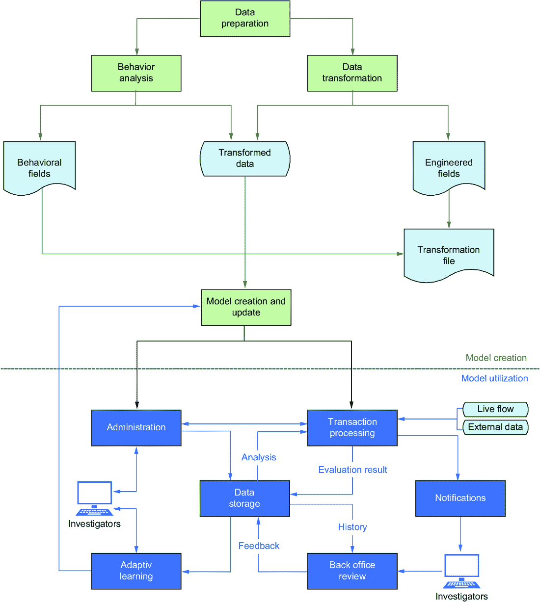

# 第十章：从成功和失败的 AI 应用中学习

### 本章涵盖

+   AI 的成功应用

+   AI 使用中的问题

+   失败的 AI 应用

+   良好数据的重要性

+   使用 AI 的建议

+   如何规划一个 AI 项目并使其成功启动

每个 AI 项目，无论成功与否，都提供了宝贵的经验教训。从这些经验中学习使我们能够做出明智的决策，引导我们的 AI 项目走向成功，同时避免常见的陷阱。在本章中，我们探讨了从过去项目的错误和成就中学到的经验教训，因为理解决定 AI 项目结果的因素至关重要。我还将分享有关建立合适的团队、培养适当的思维方式以及为您的 AI 项目制定有希望的计划的宝贵建议。

## 10.1 AI 成功案例

人工智能已经在众多特定的、明确定义的应用中证明了自己的价值，展示了其改变各个行业的潜力。在这次讨论中，我们将探讨这些 AI 应用及其对我们生活的重大影响，同时也承认了当前技术的局限性，并提供关于下一代系统特点的见解。

人工智能取得了显著成果的一个突出领域是欺诈防范领域。随着在线业务交易的指数增长，这一领域的重要性也随之激增。据 Statista 统计，2020 年，全球超过 20 亿人进行了在线购买，导致电子零售销售额超过了惊人的 4.2 万亿美元。在线购物提供的便利性、竞争性价格和增加的选择吸引了消费者，但不幸的是，它们也吸引了犯罪分子的注意。与传统的实体店面相比，在线零售商面临着令人望而生畏的挑战，因为针对他们的欺诈率超过了传统实体店面的 10 倍以上。这种差异的出现是由于多种因素，包括在虚拟交易期间误传身份的便利性、无法揭示可疑行为的面对面互动的缺失，以及无法验证卡的所有权或签名。信用卡欺诈可能通过物理卡的丢失或被盗而显现，但更经常地，它是由于个人信息的非法获取而导致的。例如，犯罪分子利用诸如卡片窃取器之类的设备秘密地捕捉信用卡或借记卡详细信息，通常悄悄地放置在 ATM 卡槽或加油站键盘上。然后，这些窃取的信息被用于未经授权的在线购买或其他犯罪活动。Nilson 报告的 2020 年 12 月版揭示了这一问题的惊人规模，称全球信用卡交易欺诈损失达到了 286.5 亿美元，较上年增长了 2.9%。然而，这些数字不包括卡发行者、商家和收单行承担的额外费用。与欺诈调查、客户投诉和呼叫中心管理相关的费用进一步突显了欺诈对电子商务生态系统的全面影响。

联邦贸易委员会（FTC）在 2021 年 2 月也引用了这些令人担忧的统计数据，报告称消费者在过去一年中报告了惊人的 220 万起欺诈案件，损失超过 33 亿美元，较上年显著增加。这些数字强调了对整个电子商务基础设施的交易安全至关重要。

为了应对这一普遍问题，人工智能已被证明是实时防范欺诈的宝贵盟友。早期版本依赖于将已知欺诈指标存储在数据库中的欺诈扫描仪，但这些通常需要大量人工操作，并且检测率有限。如今，像 iPrevent™这样的尖端解决方案，由 Brighterion（现为万事达卡公司）开发，使用一系列先进的人工智能技术不断监控实体的行为，迅速检测异常，并以高准确度挫败欺诈企图。

人工智能的变革潜力延伸到每个行业，其多功能性深刻影响着塑造我们日常生活的产业。例如，在零售业，人工智能和机器学习是优化运营的宝贵工具。零售商正在利用人工智能的预测能力来增强他们的需求预测能力。通过分析大量数据，人工智能可以准确地预测客户偏好。此外，人工智能驱动的库存管理系统正在优化库存水平，确保产品在需要的时间和地点随时可用。

此外，以人工智能驱动的订单执行系统正在彻底改变供应链，提高效率，最终提升客户满意度。航空公司也采用人工智能改革他们的运营。人工智能算法在通过优化航班计划以最小化干扰来减少航班延误方面发挥了关键作用。通过人工智能的预测性维护能力，维修计划受益匪浅，有效减少停机时间，并通过早期发现潜在问题增强安全性。安全措施通过人工智能辅助的飞行员培训计划和实时监控系统得到了提升，使航空旅行更加可靠和安全。在农业领域，人工智能在确保作物健康和优化资源利用方面发挥了关键作用。人工智能驱动的传感器和无人机被部署用于检测疾病，预防潜在的作物损失。公用事业公司依赖人工智能进行精确的电力需求预测，这是能源部门的重要组成部分。人工智能模型分析历史消费模式、天气数据和各种其他变量，准确预测能源需求。随着人工智能技术的不断发展，我们可以预期在广泛的行业领域看到更多创新的应用，进一步改变我们生活、工作和与周围世界互动的方式。

## 10.2 AI 误用

当我们将注意力从备受赞誉的人工智能成就转移到其不那么成功的应用领域时，重要的是要探索 AI 部署可能根本不符合我们最佳利益的领域。AI 造成危害的潜力和其协助能力一样重要，强调了对它可能对社会构成的潜在危险的慎重考虑的必要性。在这一章中，我们将探讨三个显著的例子：深度伪造、网络欺凌和犯罪个人档案编制。

深度伪造代表了利用深度学习技术制造合成媒体的相对较新和可怕的威胁。尽管具有生成从未发生事件的真实音频和视频的能力对电影制作者可能是一种福音，但却对个人、公司、国家及其政府构成重大风险。这项技术有潜力被恶意使用，比如通过巧妙地描绘政治对手身陷尴尬境地来影响选举。

我们日益依赖电子媒体的情况加剧了这个问题的严重性。通过发布一份深度伪造的新闻稿，声称来自知名企业 CEO 的新闻稿，股价可能会被人为操控，可能导致严重的财务后果。这可能被策划为获取非法利润，偏袒一家公司而不是另一家，或者仅仅是制造混乱。例如，一个深度神经网络，精心训练过埃隆·马斯克曾经做过的每一个采访，可以被用来制作一个令人信服的视频，在这个视频中，马斯克似乎宣布特斯拉破产。当欺骗行为被揭露并公之于众时，已经造成了无法挽回的伤害。

此外，深度伪造技术有可能加剧网络欺凌的问题，这包括利用电子设备对个人进行折磨或恐吓。不幸的是，这个问题正在加剧，这可以从美国政府反欺凌网站的统计数据中得到证实，该网站指出，2019 年约有 15％的美国高中学生成为网络欺凌的受害者。在网络欺凌的背景下应用深度伪造技术的问题是非常清楚的，这需要共同努力来防止这种技术的滥用。网络欺凌不仅仅局限于年轻人；极端组织或对抗性政府也有可能将其作为一种武器。例如，一个独裁者可以动用一群“电子特工”来瞄准一个反对派。他们的任务将是通过激烈的、个人攻击来散播虚假信息并制造混乱。此外，他们还可以对互联网和社交媒体进行监视，以寻找有关他们政权的任何批评性言论。通过将此类内容标记为不适当，他们可以通过内容过滤算法自动删除它，从而操纵和扭曲公众的看法。

尤其令人不安和在伦理上令人担忧的一个领域是在刑事 profiling 中应用人工智能。任何影响个人生活或福祉的决定的基本原则应该是理性、客观，以及没有偏见或成见。遗憾的是，一些美国的自治市政府不经意地误用了人工智能，导致了不利后果。在一篇启发性的 2016 年 BBC 文章中，标题为“数学如何让你锒铛入狱” [4]，揭示了“美国的罪犯可以被分配计算机生成的‘风险分数’，这可能会影响他们的刑期”的事实。这些风险评分是根据一个人的教育和职业经历以及个人信息来确定的，例如他们的朋友或家人是否有犯罪记录，以及他们是否居住在犯罪率较高的社区。此外，个人可能会接受评估，他们的得分可能会受到他们对道德问题的回答的影响，比如，“一个挨饿的人偷食物是否可以接受？”这些分数从 0 到 10 不等，然后用于做出关键决定，比如是否可以给某人保释，是否应该被监禁，是否应该给予替代刑罚，甚至在狱中是否应该考虑假释。

这些算法评估的令人不安的含义进一步由 ProPublica 在 2016 年发布的关于机器偏见的全面研究 [5] 揭示了。这种使用预测算法的风险评估在美国的法庭中变得越来越普遍。它们被用来在刑事司法流程的每个阶段做出决策，从像 Fort Lauderdale 这样的地方设定保释金金额，到对被告人的自由做出更深刻的判断。这些算法已经在亚利桑那州、科罗拉多州、特拉华州、肯塔基州、路易斯安那州、俄克拉荷马州、弗吉尼亚州、华盛顿州和威斯康星州等州被采用，法官在刑事判决过程中会收到它们的结果。ProPublica 分析了在 2013 年和 2014 年在佛罗里达州布罗沃德县被逮捕的 7000 多名个体被分配的风险评分。他们将这些分数与随后两年的犯罪行为进行了比较，这也是算法的创建者使用的相同基准。他们的发现令人担忧：风险分数在预测暴力犯罪方面极不可靠，只有 20% 的预测会实际发生。

考虑到更广泛的罪行范围，包括驾驶过期驾照等轻罪，该算法的表现仅略优于抛硬币。更令人担忧的是，这个公式表现出明显的偏见。它更有可能将黑人被告标记为未来的罪犯，几乎是白人被告的两倍，尽管负责创建该算法的公司对这些发现表示异议。在存在任何不确定性的情况下，在允许算法影响我们公民的生活和自由之前，我们必须谨慎行事。已知具有低预测准确性且已知引入偏见的系统，毫无疑问，不应该使用。

将人工智能用于法律决策需要仔细考虑。我们能否真实地期望任何人工智能系统充分考虑到罪犯的心理健康状况？如果某人的行为问题可以通过适当的药物或社会支持得到解决，我们是否应该相信计算机程序来决定监禁还是缓刑对社会最有利？

正如欧洲委员会数字时代适应欧洲执行副主席玛格丽特·韦斯塔格所言：“在人工智能方面，信任是必须的，而不是一种美好的愿望”[6]。欧盟禁止使用任何不透明和不可信任的系统的立场值得赞扬。影响个人的解决方案必须经过验证，以确保其设计符合严格的技术和道德标准，解决诸如可靠性、公平性、隐私性、透明度和可解释性等问题。任何直接影响公民的人工智能系统应至少接受类似于美国食品和药物管理局在新药上市前要求的严格评估的认证过程。这些系统应明确证明缺乏偏见，采用清晰易懂的逻辑，并做出可向受影响者用简单语言解释的决定。如果不遵守这些最低要求，人工智能带来的风险超过好处的风险将仍然不可接受。

## 10.3 人工智能失败

在我们探索那些未能达到预期目标的知名项目时，我们回到了 1982 年，探索了日本著名的第五代计算机系统（FGCS）。这个努力以其雄心勃勃的范围而闻名，这个特点最终导致了它的失败。

FGCS 项目的主要目标是开创配备多处理器的计算机的发展，每个处理器都使用专门的逻辑同时并行执行多个程序。这些创新的、非冯·诺依曼系统旨在通过利用知识库和专家系统机制来擅长处理推理，这些概念在第二章得到了详细阐述。为了实现这一目标，FGCS 团队甚至走到了创建自己的编程语言 KL1，精心优化以促进并行推理。

FGCS 项目被期望引领人工智能新时代，具备推理和执行诸如自然语言处理和疾病诊断等任务的能力。在超过 10 年的时间里，并投资超过 10 亿美元，该项目被视为一个巨大的工程。然而，尽管拥有巨大资源和专注的努力，FGCS 未能达到其崇高的目标。FGCS 主管藤和一郎反思 [7]：

> 那时，我们不得不面对批评，基于那个错误的想象，认为这是一个试图解决不可能目标的鲁莽项目。现在我们看到，国内外的批评认为该项目失败，因为它无法实现那些宏伟目标。

这个案例研究为那些开始进行人工智能项目的人提供了宝贵的教训：它强调了精心定义项目的范围和限制的重要性。FGCS 项目是一个警示性故事，突显了即使在目标不明确和可实现的情况下，即使是经费充足且雄心勃勃的举措也可能会失败。它提醒我们，高远的抱负虽然值得赞扬，但必须建立在现实期望之上，以确保任何人工智能企业的成功。

从一篇名为“医疗保健的可理解模型：预测肺炎风险和住院 30 天返院”的文章中可以得出另一个宝贵的教训 [8]。该研究考察了将机器学习应用于改善出现肺炎症状的人群分类程序。该文章表明，机器学习模型犯了一个危及生命的错误，将患哮喘的肺炎患者分类为“低风险”。

这个问题的根源在于数据和模型学习数据的能力。与许多其他机器学习算法一样，该模型也是从训练数据中学习模式的。在本例中，它错误地从数据中推断出哮喘在某种程度上与减少患肺炎的风险有关。模型的预测与现实世界之间的差异源于对哮喘患者进行的积极护理有效地降低其肺炎相关的死亡率，而这种降低率相比一般人群来说要低。这导致机器学习模型做出了错误的假设，即在孤立状态下，哮喘可以降低患肺炎的风险，而实际上，哮喘患者如果不立即住院，将面临相当大的风险。

该示例凸显了人工干预在验证过程中的至关重要性，为模型考虑的数据和属性提供了宝贵的见解，并基于对主题的深入知识预期的响应。这种人为输入有助于确保没有遗漏关键信息，并且模型与它旨在解决的问题的实际复杂性保持一致。此外，该示例强调了数据科学与领域专业知识之间的重要联系。虽然机器学习算法可以分析大量数据集并提取模式，但它们往往依赖人类指导以正确解释上下文并防止潜在的危险误解。数据科学家和领域专家之间的合作在利用机器学习在医疗保健等复杂和关键任务中的全部潜力方面始终至关重要。

人工智能和聊天机器人开发的领域已经有值得注意的失败案例，这些失败案例为我们认识技术的局限性提供了宝贵的教训。其中一起事件发生在 2016 年 3 月 23 日，当时微软在 Twitter 上推出了聊天机器人项目 Tay，仅仅在推出 16 小时后就匆匆终止了该项目。这个突然的决定引发了疑问，特别是考虑到数年的开发和大量的财政投资，估计总计超过 1 亿美元。那么，为什么微软这么迅速地放弃了这个项目呢？在一篇博客文章[9]中，微软提供了对其决策原因的见解：

> 在开发 Tay 时，我们制定并实施了大量过滤并进行了广泛的用户研究，涵盖了多个用户群体。我们在各种情况下对 Tay 进行了压力测试，特别是为了让与 Tay 互动成为积极的体验。一旦我们熟悉 Tay 与用户的互动方式，我们希望邀请更广泛的人群与她进行互动。正是通过增加互动，我们预计可以学到更多的知识，让人工智能变得越来越好。

Tay 的旅程在它开始吸收 Twitter 用户的攻击性和粗俗内容时出现了令人不安的转折。它迅速陷入发布性别歧视和种族主义评论的漩涡，而且有一次，它臭名昭著地支持了“希特勒是对的”这一令人憎恶的声明。发现用户可以通过简单地指示它“跟我重复”来操纵 Tay 转发他们自己的内容成为该项目的致命一击。同样，2022 年 8 月由 Facebook（Meta）发布的聊天机器人 BlenderBot3 也表现出了与 Tay 相同的漏洞，并重复了与 Tay 相同的错误。虽然对于未经培训的人来说，这些人工智能系统可能看起来很智能，但它们缺乏对其发布内容的真正理解。它们的响应是算法化的，它们的交互与人类对话基本上不同。

这些问题不仅限于聊天机器人；它们延伸到基于“相似”个体行为决定用户看到的内容的内容推荐算法。这种做法可能无意中导致激进或不适当内容的传播。告密者们揭示了推荐引擎通常被设计成最大化用户参与度，最容易通过建议越来越极端的内容来实现。用户参与度越高，产生的广告收入就越多。虽然这样的参与度符合公司的财务利益，但它带来了严重的社会风险。例如，误导性的反疫苗信息可能被强加给本来对此不感兴趣的个体。此外，误导信息和宣传可能被反民主国家或有意干预选举的团体武器化。旨在吸引用户的社交媒体机器人可能无意中培养分裂和疏远人与人之间的关系。

这些聊天机器人失败事件和相关的互动技术中得到的最重要的教训是一个鲜明的提醒，即这些程序缺乏真正的理解。它们就像是包含了单词但没有对其含义进行理解的字典，重要的是要保持对这种基本局限性的认识。

虽然我们可能理解人类语言的微妙之处可能会给人工智能带来挑战，但人们可能会认为数值和数据驱动的领域，如股票市场，会是人工智能能力的完美契合。毕竟，随着近几十年来计算技术的发展，对冲基金经理们越来越多地转向了机器学习算法，希望在金融市场上获得竞争优势。然而，现实情况却有所不同，数亿美元的几家公司在追求以人工智能驱动的投资策略时遭遇了财务灾难。引发的问题是：这是怎么发生的？

对于最近这些由人工智能驱动的投资策略的令人失望的表现，一个引人注目的解释在于政府和美联储对 COVID-19 疫情做出的前所未有和意外的行动。这些公司依靠数学和机器学习来预测市场走势。然而，全球大流行的爆发带来了一系列完全意想不到的情况，使得他们的人工智能系统基本上无法预测快速变化的金融格局，使这些公司处于不堪设想的境地，不得不向投资者解释，为什么他们曾经充满希望的人工智能驱动的投资决策表现不佳。

一个值得注意的例子是著名的文艺复兴机构权益基金（RIEF），其令人失望的表现导致投资者纷纷撤离。一篇 2021 年的《华尔街日报》文章标题为“詹姆斯·西蒙斯辞去文艺复兴技术公司董事长职务” [10]，强调了该基金的困境，一位投资者适当地表示，“RIEF 的机器学习模型崩溃了。”的确，这简洁地概括了该基金的困境，其价值在股市大幅上涨 40% 的时候下跌了 20%。

股市中的这些昂贵而不幸的失败提醒人们，使人工智能系统真正适应具有固有挑战性。虽然监督学习方法在被分析的案例与训练示例密切相符时可以产生令人印象深刻的结果，但在情况迅速演变且行为变得不可预测时，它们在本质上是有限的。实质上，人工智能模型，无论多么复杂，都可能在面对意想不到的事件和动态、不断变化的环境时很快变得过时。接下来，让我们继续探讨两个引人注目的案例研究，分别来自 IBM 的 Watson 和房地产市场巨头 Zillow。

首先，正如之前提到的，IBM 的 Watson 在击败《危险边缘！》冠军后引起了极大的关注，这一成就展示了人工智能在回答琐事问题方面的显著能力。然而，Watson 在智力竞赛节目上取得的早期成功与其后在医学诊断方面的挣扎形成了鲜明对比。这种对比令人深思，提醒人们医学推理中的复杂性。IBM 对 Watson 进行了大笔投资，数以十亿计，希望它能彻底改革医疗保健。其中一个项目是创建一台机器，不仅能够协助肿瘤学家洞察见解，还能促进药物开发，并将患者与相关临床试验联系起来。在 2011 年令人印象深刻的游戏节目表现十年后，IBM 对 Watson 在医疗保健方面的热情显著减退。《华尔街日报》报道了这一转变，称“IBM 对 Watson 的撤退凸显了医疗保健中更广泛的人工智能挣扎” [11]。曾被“大蓝”认为是大胆举措的举动现在正在重新考虑。

沃森在医疗领域面临的主要障碍之一是医疗推理的微妙和多面性。医生不仅依靠教科书知识，他们还根据自己的丰富经验进行推理、进行类比、捕捉微妙的人际暗示，并通过一系列程序调整假设。对于当前的人工智能来说，医学的这种丰富、直观的理解仍然具有挑战性。沃森的案例研究强调了一个关键教训：并非所有问题都适合机器学习。一些问题，比如规则清晰、结果可预测的琐事问题，与人工智能的能力很匹配。只要沃森能够访问互联网以检索答案，它就能茁壮成长。然而，当面对医学诊断的复杂性时，人工智能的局限性变得明显起来。

另一方面，Zillow 试图通过应用机器学习模型来革新房地产行业。Zillow 的愿景是利用人工智能分析大量房地产数据，包括地块大小、邮政编码、卧室和浴室数量、平方英尺、房源持续时间和区域销售数字。其目标是通过提供在线房地产列表、按需购房和数据驱动服务成为市场领导者。

最初，Zillow 的人工智能平台 Zestimate 被誉为革命性。它利用自然语言处理从公共记录中获取见解，并利用机器视觉从房产图像中提取信息。2021 年 7 月的一篇文章[12]宣称了 Zillow 的实力：“Zillow 利用解释型人工智能数据革新人们出售房屋的方式。”然而，仅仅几个月后，情况出现了意想不到的转变。2021 年 11 月，《华尔街日报》的头条新闻揭示了 Zillow 正在退出翻修房屋的业务[13]，称其无法准确预测房价上涨。

Zillow 的案例提醒我们，在具有不完整、不准确或过时信息特征的情况下应用机器学习是需要谨慎的，比如动态的房地产市场。像新建筑、地方动态变化以及房产维护历史等因素都会显著影响房产价值，而这些复杂因素对算法来说很难进行考量。房地产经纪人凭借其评估专业知识和对当地细微差异的深刻理解，拥有机器无法复制的洞察力。

新冠肺炎大流行为人工智能展示其潜力提供了独特机会，然而也带来了让人联想起过去人工智能冬季的担忧。许多人希望我们先进的“智能”机器能在寻找治愈方法或迅速开发疫苗方面发挥关键作用。社会急需一个拯救生命的解决方案，作为回应，全球启动了数千个机器学习项目来解决这个问题。媒体迅速歌颂人工智能的力量，仿佛这是一场全球抗击病毒的比赛。

一个值得注意的乐观主义标题出现在*Science*杂志上：“AI 为潜在的 COVID-19 药物创造了新的‘配方’”[14]。同样，金融服务公司 BBVA 宣布：“AI 驱动的项目确定了高达 390 种可能的抗 COVID 药物”[15]。这些报道引用了一位研究人员的话，他宣称“机器学习解决方案使他们能够确定大约 390 种可能能够作用于病毒治疗靶点和感染过程的药物。” AI 模型确定的最有前途的候选药物包括氯喹，羟氯喹，奥司他韦（林德西韦）和托珠单抗（雅斯达）。 

但是，乐观主义总是需要谨慎对待的。2020 年 5 月，欧洲药品管理局发布了一份警报[16]，警告不要使用氯喹和羟氯喹，称它们在 COVID-19 治疗中无效，并且有潜在严重的副作用。尽管有这些警告，2022 年俄勒冈中毒中心的报告令人担忧：“羟氯喹，氯喹和伊维菌素已被证明对治疗 COVID 无效，但使用这些物质导致了许多案例的严重中毒”[17]。这种情况再次提醒我们，虽然 AI 在协助医疗保健和药物研发方面有巨大的潜力，但它必须始终经受严格的审查和验证，以确保任何提议的治疗方法的安全性和有效性。

结束这一部分时，我们可能会反思一句关于不要在它们孵化之前就数鸡的谚语，因为我们注意到有两个许多人一度认为已经几乎完成的项目。第一个我们已经在本书中提到的，是自动驾驶汽车的追求。第二个例子是语言翻译的发展。自 20 世纪 50 年代以来，成千上万的研究人员已经解决了这个问题，花费了数十亿美元。虽然取得了巨大的进展，而且终点似乎总是在望，但我们仍然没有创造出一个可以可靠地将一种语言翻译成另一种语言的系统。

法语单词*avocat*恰好有两个意思：律师和鳄梨。在我写这篇文章的时候，当我把这个简单的句子“J’ai bien aimé l’avocat car il m’a fait rire aux larmes”放到最流行的在线翻译工具中时，算法告诉我它的意思是“I really liked the avocado because it made me laugh to tears”（图 10.1）。程序明显无法推断上下文，这表明我们仍然有很长的路要走。

##### 图 10.1 于 2022 年 10 月 9 日翻译。由于用户反馈的不同，结果可能会有变化。

## 10.4 如何使您的 AI 项目取得成功

在当今快速发展的技术景观中，AI 已经崭露头角，吸引了人们的想象力，并推动了各个行业的创新。AI 主导地位的激增在很大程度上归因于两个关键因素：对巨大数据存储库的空前访问和现代计算机的非凡能力，这些计算机配备了巨大的存储容量和闪电般的处理速度。这些进步共同解锁了 AI 的全部潜力，这在以前被认为是不可想象的。然而，尽管他们拥有丰富的数据，但许多公司尚未完全拥抱过渡成为数据驱动型企业。这种犹豫的一个重要原因是普遍的误解，即 AI 是一个神奇的实体，只需要按下按钮就能创建和部署智能系统。这种误解可能导致错误的期望，最终导致 AI 事业失败。

在没有制定明确和全面的计划的情况下启动 AI 项目可能会导致失望。必须以明确的路线图方式来对待 AI 事业，该路线图不仅概述了目标，还有效地缓解了风险，并最大化了 AI 对企业和行业带来的潜在利益。

### 10.4.1 数据：AI 的生命之血

重要的不仅仅是数据的数量，还有质量和相关性。AI 算法在进行准确预测和决策时严重依赖高质量的数据。因此，组织必须将数据收集和管理作为其 AI 战略的基本方面之一。

### 10.4.2 现实的 AI 视角

了解 AI 的真正能力和局限性至关重要。虽然 AI 能够执行卓越的任务，但它并非万能，无法解决每一个问题。公司需要设定现实的目标和期望，将 AI 视为增强人类能力的工具，而不是神奇的灵丹妙药。

### 10.4.3 计划的重要性

制定全面的 AI 战略涉及定义明确的目标、确定正确的用例、组建必要的人才，并有效地分配资源。一个深思熟虑的计划确保 AI 项目具有目的，并且成功的机会更大。

### 10.4.4 风险缓解

每个 AI 项目都存在固有的风险，如数据隐私问题、算法偏见或意外的技术挑战。组织必须积极识别和解决这些风险，以避免挫折和法律或伦理困境。

### 10.4.5 协作与专业知识

AI 是一个跨学科的领域，需要在数据科学、机器学习、领域知识等方面具有专业知识。与这些领域的专家进行协作和合作可以极大地增加成功实施 AI 的机会。

## 10.5 AI 模型生命周期管理

推出成功的人工智能项目需要一个明确定义的路线图，从深入理解为什么需要人工智能而不是现有流程开始。第一步是将项目与具体的业务结果保持一致，并批判性地评估预期的好处是否值得投入时间和资源。一旦您确信项目的价值，精细的规划变得至关重要。必须认识到，开发人工智能解决方案不是一个线性过程，而是一个迭代的旅程。在每个阶段，反馈循环随处可见，影响项目的每一个方面。为了最大化成功的可能性，我们需要按照以下行动顺序进行：

1.  *数据收集和标记*——首先收集构建和测试您的人工智能模型所需的所有必要数据。对于监督学习算法，确保数据标记准确。

1.  *数据样本选择*——考虑您的数据规模。虽然大型机构可能每年产生数十亿条记录，但可能不高效地使用所有数据进行培训和测试。确保代表性样本至关重要。

1.  *数据质量保证*——仔细审查数据以查找冗余、不一致和不连贯的地方。从多个来源合并数据可能会导致需要解决的重复、不一致或不连贯的记录。

1.  *数据丰富化*——原始数据通常不足。通过智能地组合属性和数据以及开发新的见解来增强其效用。例如，在欺诈预防中，将交易记录与不同时间段的帐户活动关联起来可以提供有价值的上下文。

1.  *模型构建*——利用第二章和第三章涵盖的技术构建您的人工智能模型。

1.  *严格测试*——广泛评估模型的弹性、性能和可扩展性，以确保它满足预期并产生所需的输出。

1.  *部署*——一旦模型通过了严格的测试，就该将其部署到生产环境中了。

1.  *持续监控和优化*——在部署后密切关注系统的性能。保持预期的服务水平至关重要，并准备根据需要进行调整。如果性能出现波动，应用适应性学习技术可能会有益。

这些准则构成了一个全面的框架，用于引导人工智能项目开发的复杂旅程。通过遵循这些步骤并适应不断变化的环境，您增加了实现人工智能项目目标并为您的组织提供实实在在的好处的可能性。

图 10.2 是一张图表，概述了典型人工智能模型如何有效构建和部署。

##### 图 10.2 一个流程图示例，描述了设计和部署人工智能模型的各个步骤

### 10.5.1 数据准备

人工智能项目的初始阶段涉及细致的数据准备工作。这个多方面的任务包括几个关键方面：

+   *选择相关数据类型*——在企业领域，当利用数据时，了解法律限制至关重要。例如，某些法规，如公平借贷法，禁止在设计 AI 模型时使用年龄、种族、宗教、邮政编码、性别或种族等属性。确保遵守此类法规至关重要。

+   *数据格式转换*——AI 算法在处理不同数据类型方面有所不同。虽然一些算法可以直接处理分类数据，但其他算法则要求将数据转换为数字格式。这种转换确保与选择的 AI 技术兼容。

+   *抽样*——管理大型数据集可能会耗费大量资源。为了降低成本并简化开发过程，通常明智的做法是采用抽样技术。这涉及减少数据大小同时保持其代表性，从而促进更高效的模型训练。

+   *数据分析和清洗*——数据质量至关重要。在这个阶段，进行严格的分析，以识别和纠正冗余、不一致和不连贯等问题。来自不同来源的数据合并可能会引入重复记录，而不一致的数据可能会导致冲突。确保数据完整性对于可靠的 AI 模型结果至关重要。

### 10.5.2 行为分析

该阶段涉及智能数据分析，以基于各种指标派生新属性。例如，在防欺诈的背景下，可以创建新的特征来衡量特定时间间隔内的总支出，从而增强模型的欺诈检测能力。

### 10.5.3 数据转换

数据转换是一个关键步骤，包括数据归一化和聚类：

+   *数据归一化*——通常，数据来自不同来源，并且以不同的尺度进行测量。为了确保公平处理，数据归一化调整值到一个公共尺度。例如，当两个系统使用不同的比例来表示相同的信息时，如百分比和从 1 到 10 的分数，数据归一化会使这些值协调一致。

+   *聚类*——使用聚类技术将数据分组为有意义的类别。例如，可以使用聚类算法将城市按人口规模分组，从而增强模型识别模式和趋势的能力。

### 10.5.4 模型创建

数据丰富的核心是从个体数据属性中提取和生成有意义的见解，或者进行战略性组合。例如，在防欺诈中，将交易记录与不同时间范围内的帐户活动关联起来，可以为设计更有效的模型提供宝贵的数据。

### 10.5.5 实时生产

一旦 AI 模型被认为已准备好投入使用，它就会过渡到实时生产阶段。在这个阶段，模型实时运行，处理实时数据流。例如，防欺诈模型不断评估交易是否存在潜在欺诈。

### 10.5.6 数据存储

数据存储是记录和存档输入数据和模型输出的一项重要组成部分。该存储库有助于后续分析、审计和持续监控。

### 10.5.7 通知

可以预先定义自动化操作，以响应特定的结果或触发器。例如，某些事件可能会引发调查或自动通知相关利益相关者。

### 10.5.8 后勤审查

关键应用通常需要专门的团队来管理 AI 模型引发的警报。在诸如反洗钱检测之类的场景中，及时审查和评估可疑行为对于最小化法律和监管风险至关重要。

### 10.5.9 自适应学习

建立反馈循环对于持续改进至关重要。算法从错误中学习，并适应新的数据，随着时间的推移，增强模型的性能。

### 10.5.10 管理

模型管理涵盖了所有操作方面，包括访问管理和权限。这确保了模型在生产环境中安全高效地运行。

### 10.5.11 对 AI 平台的评注

像 Brighterion 这样的先进 AI 平台提供自动化机器学习能力。这些平台简化了各种数据科学任务，包括数据准备、行为分析、数据转换和模型创建。这种自动化显著加快了开发过程，使数据科学家能够专注于完善模型和解决特定的业务目标。

总而言之，开发和部署 AI 模型的过程是一个需要对数据进行细致关注、严格分析和有条不紊的方法的多方面旅程。每个阶段在确保 AI 项目成功的过程中都起着至关重要的作用，从最初的数据准备到实时模型部署和通过自适应学习持续改进。自动化的 AI 平台进一步提高了效率，赋予数据科学家驱动创新和实现业务目标的能力。

## 10.6 成功 AI 项目的指导原则

开展成功的 AI 项目不仅仅需要懂得机器学习算法的人员。尽管 AI 的专业知识无疑至关重要，但一个有效的 AI 项目团队需要更广泛的技能和知识。清晰的规范和对可用数据的深刻理解同样是决定性的组成部分。在没有对所需业务结果有深刻理解的情况下启动 AI 项目，就等于邀请失败。比如，一个被赋予实时决策任务的系统，本质上需要与在夜间批量处理相同数据的系统形成截然不同的方法。因此，最佳方法是从项目的目标和约束条件开始向后工作，确保你的 AI 计划牢固地扎根于对其目的的深刻理解。

此外，建议通过解决一个可证明可以从 AI 的能力中获益的单一、现有的业务流程来开始您的 AI 之旅。例如，一家公司可能会试图了解为什么会失去顾客给竞争对手，或者为什么某些产品经常一起购买。这个初始的机器学习目标应该是谨慎和可以实现的。从小规模的成功开始对于培养需要更雄心勃勃的工作所需的知识和专业技能至关重要。许多项目因目标过于雄心勃勃而失败。

也很重要理解单一的机器学习技术可能不足以解决复杂的商业问题。可能需要结合各种相互补充的方法来弥补彼此的优势并补偿各自的弱点。此外，除了算法本身之外，AI 解决方案在现实应用中的实用性取决于诸如可用性、响应时间和可扩展性等因素。例如，考虑一个必须全天候运行、在毫秒内响应并且每秒处理数万笔交易的信用卡授权系统。如果不能满足这些运营标准，即使是最复杂的算法也会失效。

一旦您的项目目标被细致定义并且约束条件被充分概述，这些信息就成为组建一个具有互补知识和技能的专业团队的基础。随着领域专家带来的领域特定见解变得不可或缺，主题专家的重要性变得非常清楚。在技术上，软件工程师从可靠的解决方案架构师的输入中获益良多，后者可以指导设计过程。此外，系统工程师对于建立必要的基础设施以确保最佳性能和安全性至关重要。部署后，连续监控和维护对于长期成功至关重要。适当的生命周期管理实践是保持您的 AI 项目在正确轨道上的关键。

如前所述，没有神奇的 AI 算法，而 AI 系统也不是一个能够立即解决所有问题的“魔法盒子”。AI 项目的成功通常取决于一系列试错过程，这些过程受到在类似案例中已被证明有效的理解的指导。这是一个需要时间和专业知识的旅程。

总之，AI 项目是一个多方面的努力，需要精心规划、一个全面的团队以及对问题本身和 AI 技术复杂性的深刻理解。接受这些原则并理解 AI 开发中固有的迭代过程是实现项目成功的关键。

## 摘要

+   许多 AI 技术已成功应用于实时欺诈防范、信用风险、反洗钱工作、国土安全、供应链和交通管理。

+   不良行为者已经利用人工智能生成深度伪造视频，人工智能已被用于进行有偏见的个人画像。

+   数十亿美元已经被花在失败的人工智能项目上。

+   通常，人工智能模型失败是因为它们从无效或不完整的数据中学习。

+   聊天机器人没有真正的理解力，无法区分礼貌和冒犯性的陈述。

+   成功使用人工智能的第一步之一是理解项目涉及的数据，并确保其对于任务是正确和充足的。

+   在使用人工智能时，应考虑整个项目生命周期，包括如何记录代码、解释其作用以及如何确保和更新模型。
