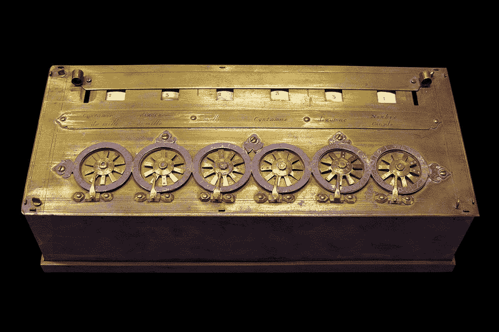
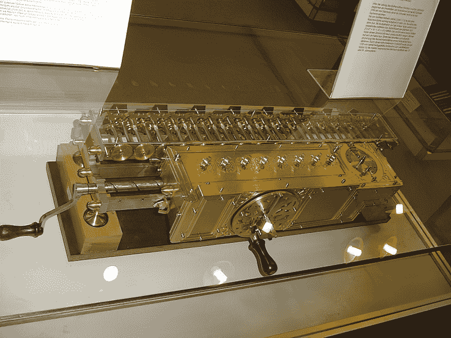
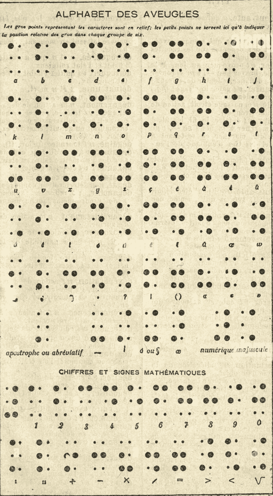
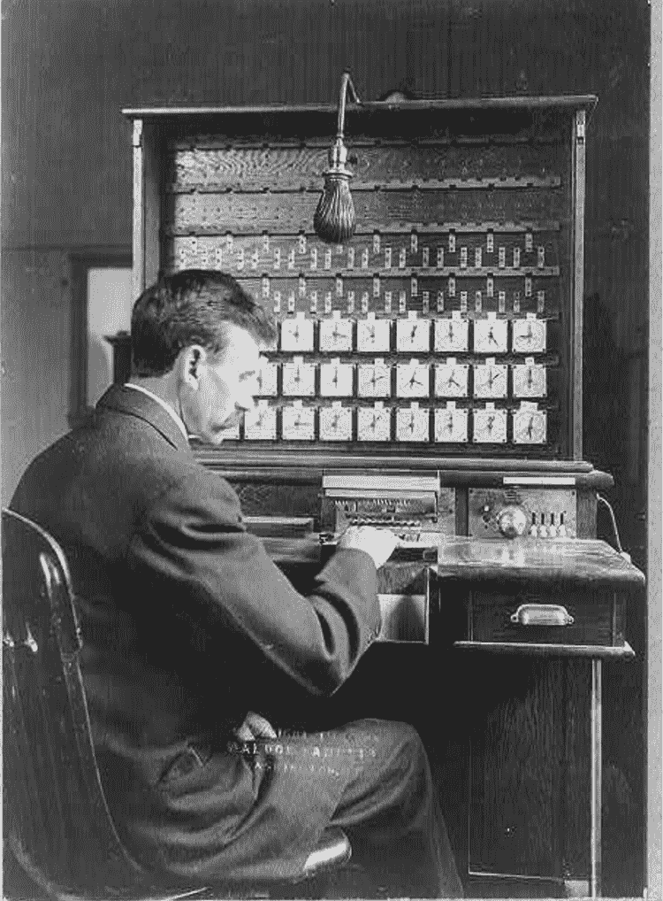
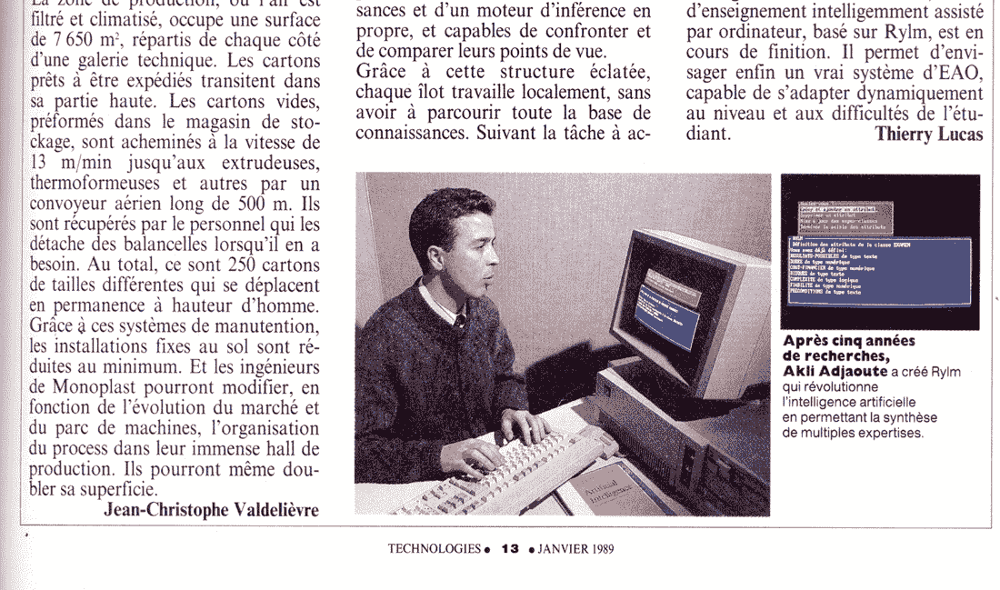

# 附录 A：追溯根源：从机械计算器到数字梦想

对于普通人来说，人工智能似乎是最近的一个领域，考虑到近年来公众对人工智能的关注增加。然而，支撑这一学科的概念和理论的基础可以追溯到几个世纪以前。本章将踏上一段时光之旅，追溯那些引领我们走向今天人工智能的先驱的足迹。我们将发现那些梦想着能够推理和学习的机器的先见者：从帕斯卡对机械计算器的巧妙设计，这标志着人类与机器互动历史的一个重要时刻，到莱布尼茨的二进制系统，至今仍然是今天数字计算的表征基础，巴贝奇对分析引擎的构思作为一台机械大脑，以及爱达·洛芙莉丝对编程的洞察。了解这些历史发展将为我们展示人工智能曾经走过的道路，今天的位置以及其潜在的未来。

## A.1 机器能思考吗？

几乎四个世纪前，在 1642 年，有人首次提出了机器是否具有思考能力的问题。这个问题是在布莱斯·帕斯卡（1623-1662）介绍帕斯卡计算器（Pascaline）时出现的，这是最早记录的计算设备。帕斯卡在 19 岁时构思了这台机器，主要目的是帮助他的父亲，他的父亲是一名税收征收员。它的目的是两方面的：最小化错误并减轻枯燥计算的负担。

帕斯卡计算器（Pascaline）通过无误地执行加法、减法、乘法和除法（图 A.1）显著增强了人类的认知能力。这个机械奇迹接受输入，执行运算，并产生数字结果。通过自动化这些功能，它减少了对人力的手工劳动的需求。这一创新对帕斯卡的父亲尤为宝贵，否则他将沉浸在繁琐且耗时的手工计算任务中。



##### 图 A.1 帕斯卡计算器（法国 CNAM）

帕斯卡计算器（Pascaline）还具有一个巧妙的进位机制（称为 *le sautoir*），设计用于处理进位操作（*la retenue*）。这一创新解决了帕斯卡在协助父亲时观察到的主要计算错误之一。正如你可能从你自己的算术课上记得的那样，当计算类似 2…9 这样的东西时，我们首先加上最右边的数字，写下 6，然后“进位 1”到下一列。对这一发明印象深刻，路易十四国王于 1649 年授予帕斯卡在法国制造他的计算机的独家权利。

在他的作品《思想录》[1]中，帕斯卡对机器和有感知的生物进行了最早的重要比较。例如，他说：“算术机器产生的效果比动物的所有行为都更接近思想。但是，它并没有执行任何可以让我们归因于它的意愿的行为，就像我们对待动物一样。”

同样，在《帕斯卡先生的生活》[2]中，他的妹妹佩里埃夫人将帕斯卡林描述为“完全存在于思想中的任务”。她回忆了她兄弟的成就：

> 在那个时候（1642 年至 1643 年），他 19 岁时发明了这台算术机器，通过这台机器，不仅可以进行各种操作而不需要笔和记号，而且我们甚至不需要了解任何算术规则，也能百分之百地确定结果。这项工作被认为是一种来自自然界的新事物，将完全存在于思想中的一门科学机械化，并找到了在其中进行所有操作的手段，完全不需要推理。这项工作让他很疲惫，不是因为思考或动作，这些他都毫不费力地完成了，而是要让工人们理解所有这些事情，以至于他花了两年时间将它完美地实现。

尽管帕斯卡林需要熟练操作机器控制的人类操作员，但它执行的任务通常需要精通数学的个人。这引出了一个问题：我们应该将帕斯卡林归类为开创性的人工智能机器吗？这个考虑是相关的，因为，就像帕斯卡林一样，当今的计算机执行着由人类程序员精心设计和编码的根植于算法的计算任务。即使是今天最先进的人工智能系统本质上也代表了人类设计和调整的技术的集合，以生成特定的行为，而不具有真正的理解或推理能力。

在 1671 年，大约三十年后，帕斯卡林诞生，戈特弗里德·威廉·莱布尼茨推出了阶梯式计算器，这是一种巧妙的计算设备，采用十进制表示法，通过迭代加法执行乘法，由手摇曲柄机构（图 A.2）驱动。在他的数字表示机械化努力的指导下，莱布尼茨于 1703 年撰写了一篇著名的论文，题为《仅使用字符 0 和 1 解释二进制算术，以及有关其实用性和给予伏羲古老汉字意义的评论》[3]。在这部开创性的作品中，他引入了二进制数系统，该系统仅依赖两个数字 0 和 1。这个二进制系统现在几乎是所有现代计算机的基石。



##### 图 A.2 德国博物馆里的莱布尼茨台阶式计算器复制品

我们都熟悉十进制数系统，通常称为“十进制数”。该系统使用数字 0、1、2、3、4、5、6、7、8 和 9，每个数字在数字中的位置表示其在个位、十位、百位等位置的价值。我们的祖先发明了十进制系统，很可能受到了他们用十根手指计数的影响。在我们的日常计算中，比如加法…得到 8 或从 27 减去 7 得到 20，我们无意识地使用十进制系统。许多人可能没有意识到这种选择是任意的，而且还存在其他选择，比如二进制。

计算机、智能手机和各种数字设备完全依赖于二进制系统，使用 1 和 0 进行所有操作。文档、图像、音频以及各种文件都以 1 和 0 的序列存储，并且计算机通过将数字表示为二进制位序列并执行类似于十进制系统的过程来执行数学运算。鉴于二进制在计算中的关键作用，熟悉它是有益的。我们可以从在二进制系统中表示几个十进制数开始（表 A.1）。

##### 表 A.1 十进制数及其二进制等效值

| **十进制数** | **二进制等效值** |
| --- | --- |
| 0  | 0  |
| 1  | 1  |
| 2  | 10  |
| 3  | 11  |
| 4  | 100  |
| 5  | 101  |
| 6  | 110  |
| 7  | 111  |
| 8  | 1000  |
| 9  | 1001  |

十进制数表示为数字序列，最右边的数字表示单位。向左的每个连续的数字表示十的幂的倍数，其中第 *n* 个十的幂表示 10 乘以自己 *n* 次。例如，十进制数 207 可以看作是 2 × 100 + 0 × 10 + 7 × 1，符合我们对它的理解，即两个 100、没有 10 和七个 1。以更简明的形式，这个数字可以用指数表示为 2 × 102 + 0 × 101 + 7 × 100。

二进制数遵循类似的概念，但它们的数字表示的是二的幂的倍数，而不是十的幂的倍数。举例来说，十进制数 27 在二进制中表示为 11011，因为 27 可以表示为十进制中的 16 + 8 + 0 + 2 + 1，而这个和可以表示为二的幂的和，如 1 × 24 + 1 × 23 + 0 × 22 + 1 × 21 + 1 × 20。

计算机中的文本存储为二进制代码，其中每个字母和印刷符号根据通用约定被分配一个固定的二进制字符串。例如，本书早期的工作标题 *AI Reality and Illusion* 存储在计算机内存中的二进制序列如下：

```py
01000001 01001001 00100000 01010010 01000101 01000001 01001100 01001001 01010100 01011001 00100000 01100001 01101110 01100100 00100000 01001001 01001100 01001100 01010101 01010011 01001001 01001111 01001110
```

每组数字代表一个字母或一个空格，其中 A = 01000001，I = 01001001，等等。

任何依赖于仅有两个符号的系统都被认为是二进制的。例如，路易·布拉叶在三岁时失去了视力，在 1824 年 15 岁时，在法国盲童学院（Institute for Blind Children）的学生时，他发明了盲文代码（图 A.3）。盲文代码利用表面上凸起和不凸起的点来通过触觉传达信息。这一系统使盲人或视力有限的人能够阅读。



##### 图 A.3 盲文代码

莫尔斯电码，另一种二进制编码形式，依靠点和线来表示信息（图 A.4）。短脉冲表示点，而长脉冲对应短线，这些信号通过电报线传输。通过为特定字母分配二进制序列，莫尔斯电码实现了信息的传输。


##### 图 A.4 莫尔斯电码

在 1844 年 5 月 24 日，塞缪尔·莫尔斯成功地利用他的电码在华盛顿特区和巴尔的摩之间传递了开创性的电报消息，“上帝造了什么？”

延续了帕斯卡和莱布尼茨在 18 世纪的贡献，欧洲创新者打造了一系列出色的自动机器，旨在模仿人类行为。其中最著名的发明家是法国的雅克·德·沃克松（Jacques de Vaucanson，1709–1782），于 1727 年创造了一台能够端菜和擦桌子的初始自动机器。然而，一名政府官员批评他的发明是亵渎的，导致沃克松的工作室关闭。尽管如此，沃克松后来用他的机械鸭子、机械吹笛者和机械吹奏者征服了欧洲。

除了他富有娱乐性的自动机器外，沃克松还对工业革命做出了重要贡献。在担任丝绸制造检查员期间，他于 1745 年通过发明第一台自动织机彻底改革了法国的纺织业。这台机器利用穿孔卡片来引导与经线相连的钩子，代表着自动机器按照二进制指令的最早实例之一。令人遗憾的是，织工们反对这一发明，担心会失去工作，沃克松被迫放弃了他的项目并为自己的生命逃亡。

沃克松的概念在 1804 年由法国织工和商人约瑟夫-玛丽·雅卡尔（Joseph-Marie Jacquard）进一步完善，并最终实现。他开发了一种使用穿孔卡片的自动织机，卡片上的孔决定了针、线和织物的移动，从而创建了具有复杂图案的丝绸织物。这种技术使得可以生产出挂毯、锦缎和有图案的针织织物。穿孔卡片的巧妙使用后来为数字计算机的设计提供了灵感，在 20 世纪早期的计算机中使用穿孔卡片进行数据输入。

瑞士奢侈钟表制造商皮埃尔·雅克-德罗兹制作了他那个时代最为出色的自动机器人之一。他最复杂的创作是一台坐在书桌旁的机械男孩，于 1768 年制作完成。这个机械人可以用笔和纸写字，由操作者控制一个轮子组合出最多 40 个预选字符。它使用鹅毛笔，在墨水中蘸取，摇动手腕以防止涂抹。它的眼睛在写作时会跟随文字移动，头部在蘸墨的时候也会动。这个写字机器人目前仍在运行，并在纳沙泰尔历史博物馆展出。

受这些越来越逼真的机器人影响的一位思想家是法国医生和哲学家朱利安·奥夫瓦·德·拉·梅特里。在他 1747 年出版的著作《人是机器》中，他提出了物质主义对心理感受的观点，为行为主义奠定了基础，质疑道：“认为我们之外存在着几乎与我们自己一样完美的机器的生灵，这样想有什么荒谬的地方吗？”

进一步普及类人机器概念的是沃尔夫冈·冯·坎普伦在 1769 年在奥地利匈牙利皇后玛丽亚·特蕾莎宫中展示了一种巧妙的自动下棋机器人。这台机器人被称为“土耳其人”，吸引了观众的注意，并让战败的对手感到恐惧。它的外观类似木偶，装饰有齿轮、曲柄和杠杆，使人想起钟表的机械装置。令人惊讶的是，“土耳其人”不仅会下棋，而且擅长下棋，击败了大多数挑战者，让试图解释其高超棋艺的科学家感到疑惑。坎普伦带着他的自动下棋机器人在欧洲巡回演出，在巴黎，“土耳其人”不仅击败了著名发明家查尔斯·巴贝奇，还击败了当时担任驻法国美国大使的本杰明·富兰克林。

“土耳其人”也开始了一场美国之行，在 1826 年初，数百人聚集在纽约百老汇国民酒店观看其首场比赛展示。这些观众被承诺能看到第一台能在赢过人类在智力挑战游戏象棋中机械机器人。然而，“土耳其人”实际上是一个骗局。隐藏在机器外壳内的是一个微小的象棋高手，他在操作象棋棋盘。在现代，魔术装备的创造者约翰·高恩制作了一个“土耳其人”的功能复制品，可以在 BBC 网站上观察到其动作。

误解“土耳其人”为真正下棋机器的可能原因之一是其推出期间正值工业革命早期阶段，这个时期从 1760 年到 1850 年，其特点是农业、制造业、纺织业和运输方面的重大创新。

虽然肯佩伦以土耳其人而闻名，但他一生中还完成了许多其他项目。最值得注意的之一是他在 1791 年的书籍《人类言语的机制》中描述的一个说话机。这个装置可以合成法语、意大利语和英语的语音、词语、句子和完整的短语。与土耳其人不同，这项发明的运作效果如广告所述，最初的机器之一仍在慕尼黑的德国博物馆展出。

在 18 世纪，一个被迅速技术进步所标志的时期，人们发现自己既被新兴发明的世界所吸引，又对此感到担忧。土耳其人的在欧洲的展览与一股反技术情绪的浪潮相吻合。卢德派骚乱是英国 19 世纪初纺织工人的一系列抗议和破坏行为，这是对这种焦虑的一种表现。这些工人担心自动化会导致大规模失业和工资下降。

玛丽·雪莱于 1818 年出版的开创性小说《弗兰肯斯坦》加剧了这些担忧。故事描绘了从无生命物质中创造生命，引发了对无节制的技术进步后果的质疑。1811 年，在英国的诺丁汉郡，纺织业引入自动化机械引发了一场暴力工人暴动。这场起义迅速蔓延到其他地区，抗议者要求摧毁他们认为导致经济困境的机器。紧张局势升级，导致卢德派和政府武装部队之间发生冲突。到 1812 年，毁坏机械的行为被视为一种死刑罪，可处以死刑。总共，1813 年有 17 名男子因此罪行被处以死刑，这是技术进步引起的社会动荡的鲜明提醒。

在这种动荡中，现代技术的基础也正在奠定。19 世纪中期，逻辑学家乔治·布尔在数学领域取得了重大进展。他 1853 年的论文《思维法则的研究》[6]引入了布尔代数。这种数学框架后来在数字计算机的设计和运行中被证明是不可或缺的。布尔代数处理的是只能有两个可能值的系统，通常表示为“真值”，如是/否，真/假，0/1 或开/关。

这个时代的另一位梦想家是查尔斯·巴比奇（1791-1871），他的工作奠定了现代计算机的基础。他花了多年时间开发一种能够进行导航和弹道所需的复杂计算的自动表计算器。然而，巴比奇最引人瞩目的概念是分析引擎[7]。它被设想为一台机械计算机，预示了我们今天使用的计算机。受约瑟夫·玛丽·雅卡尔在可编程织布机中使用的打孔卡技术的启发，巴比奇设想了一种通用的可编程机器，它可以使用打孔卡进行输入、输出和数据存储。艾达·洛芙蕾斯（1815-1852），常常被认为是世界上第一位计算机程序员，认识到了巴比奇的分析引擎的潜力。在她的作品《洛夫莱斯 & 巴比奇及其于 1843 年的《笔记》的创作》中，她记录了这一卓越发明的能力和可能性，为计算机的未来奠定了基础[8]：

> 在使机制能够将一般符号以无限的多样性和范围相连的方式组合起来时，建立了物质的操作和数学科学中最抽象的心智过程之间的联系。为未来的分析开发了一种新的、广阔的、强大的语言，用来处理其真相，使得这些真相能够比我们目前拥有的手段更快速、更准确地应用于人类的目的。

对洛夫莱斯和巴比奇的文件进行审查揭示了他们优先事项的分歧。巴比奇主要强调计算，而洛夫莱斯在她的梦想视野中，思考了进化后的分析引擎不仅能够进行计算，还能创作音乐和生成图像的潜力。在她的著作中，她表达了：

> 比如，假设在和声学和音乐作曲的科学中，音高的基本关系可以进行这种表达和适应，那么这台机器就可以创作出任何复杂程度或范围的精致和科学的音乐作品。

尽管巴贝奇和洛夫莱斯所构想的分析引擎从未真正存在，但他们在讨论通用可编程计算机方面的远见卓识，在考虑到即将展开的发展时尤为超前。这些富有远见的想法最早的实现之一可归功于赫尔曼·霍勒里斯（1860-1929），他经常被认为是自动化数据处理的先驱。霍勒里斯曾短暂担任美国人口普查局的统计员，这段经历凸显了改进计算方法的迫切需求。受到雅卡德织机和铁路上使用打孔图像来在车票上编码乘客特征的做法的启发，霍勒里斯发明了一种电子制表机，将在 20 世纪上半叶彻底改变数据处理的方式[9]。

为了 1890 年的人口普查，霍勒里斯提出了一个系统，其中每个人的数据将被编码到一张单独的卡片上，然后由他的创新机器进行统计处理[10]（图 A.5）。这种方法显著加速了数据处理过程，以较低的成本提供了更多的统计数据。这种方法的成功导致了与各种实体的合同，包括铁路公司和加拿大、挪威和奥地利等国外政府。1896 年，在他的人口普查机器取得成功的基础上，霍勒里斯成立了制表机公司。1924 年，销售员托马斯·J·沃森加入公司后，他们将其更名为国际商业机器公司（IBM）。经过多年的专注研究和开发，IBM 提升了制表技术，创造了一台能够执行 if-then 逻辑操作的机器。



##### 图 A.5 电子制表的霍勒里斯系统（照片由国会图书馆提供）

为现代计算机铺平道路的关键突破是电磁技术的利用。在二战期间对计算技术的需求推动下，霍华德·H·艾肯教授设计了世界上第一台大型计算机——哈佛马克一号。这台令人瞩目的机器采用打孔卡片和磁带进行数据处理和存储。与早期为特定任务量身定制的计算机不同，哈佛马克一号是一台多功能的通用计算机。最初的马克一号重达五吨，长达 50 英尺。1944 年 8 月正式揭幕时，它被誉为“世界上最伟大的数学计算器”，甚至有人将其称为“自动大脑”。

下一个在计算领域的重大进展是克劳德·香农在 1937 年提出了布尔代数的概念，以简化电气网络中继电器的排列。他的开创性工作在 1937 年的硕士论文中提出，题为“对继电器和开关电路的符号分析”[11]。香农的贡献奠定了现代数字电路设计的基础。

类似地，在 20 世纪 40 年代末，约翰·冯·诺伊曼通过想出一种方法将代码和数据存储在计算机的内部存储器中做出了开创性贡献。这一创新对计算机科学的发展至关重要，并导致了电子离散自动计算机（EDVAC）的诞生，该机器是 ENIAC 的继任者。尽管 ENIAC 通常被公认为是第一台数字电子计算机，但不容忽视的是大英帝国在 1943 年建造的高度专业化机器 Colossus，用以解密纳粹恩尼格玛密码。使用 Colossus 解码截获的消息揭示了关键信息，缩短了战争时间，并加速了纳粹的失败。温斯顿·丘吉尔生动地描述了 Colossus 团队是“下金蛋的鹅，永远不会嘎嘎叫”，以强调他们的无价贡献。

虽然计算机变得越来越先进和强大，但它们也变得难以控制。例如，UNIVAC 每秒可以进行 1,000 次计算，但需要 5,000 个真空管，这些管体积庞大且产生大量热量。个人计算机的发展必须借助晶体管的发明，这是 20 世纪的一个重大进步。

与真空管相比，晶体管体积小、节能、产生少量热量。这些特征允许将大量晶体管集成到单个设备中。1947 年，贝尔实验室的物理学家约翰·巴德因和沃尔特·布拉泰因将一块锗放大器连接到一块金箔条上，制造了第一个晶体管。经过数年的原型设计和测试，晶体管于 20 世纪 50 年代初开始大规模生产，并成为几乎所有电子设备的组成部分。晶体管的重要意义得到了承认，约翰·巴德因、沃尔特·布拉泰因和威廉·肖克利因其在半导体研究和发现晶体管效应方面的贡献被共同授予 1956 年诺贝尔物理学奖。

另一项重大突破发生在 1958 年，杰克·基尔比和罗伯特·劳伊斯制造了第一块集成电路，现在通常称为微芯片。这些集成电路包括各种电路元件，包括晶体管、电容器和电阻器，都以硅片上的单个单元的形式制造。劳伊斯随后于 1968 年在北加利福尼亚州圣何塞地区创立了英特尔公司，推广了“硅谷”的名词。微芯片在推动现代计算机革命和数字时代方面发挥了重要作用，并使基尔比于 2000 年获得诺贝尔物理学奖。

随着半导体芯片技术的迅速发展，计算机变得更小、更实惠，使得它们的可访问性大大提高，并在各个行业广泛应用。1981 年 8 月 12 日，在纽约市华尔道夫阿斯托里亚球场的一次新闻发布会上，IBM 推出了价格为$1,565 的 IBM 个人计算机。这与二十年前的计算机格局形成了鲜明对比，二十年前，一台 IBM 计算机的成本可能高达 900 万美元，需要大量的空间和人员进行操作。IBM 个人计算机由 Intel 8088 微处理器驱动，运行速度以百万分之一秒为单位测量，并且大约和一个便携式打字机一样大小。它包含 40K 的只读存储器和 16K 的用户存储器，甚至还配备了一个用于音乐生成的内置扬声器[13]（见图 A.6）。



##### 图 A.6 我于 1988 年创立了我的第一家公司，当时的机器配备了 1 MB RAM 和 40 MB 硬盘空间。

到 2024 年，配备 16 GB RAM 的机器已成为常态，许多公司慷慨地为客户提供 1 TB 甚至更多的免费存储空间。为了强调这些进步的重要性，让我们讨论一下主要概念。一个比特（bit）代表计算机内存中的一个 0 或 1，一个字节（byte）包含 8 个比特，而 1 千字节（kB）包含 1024 个字节。在此基础上，1 兆字节（MB）等于 1024 千字节，1 千兆字节（GB）包含 1024 兆字节，1 TB 包含 1024 GB。

在过去的四十年里，计算机的容量和处理能力已经成倍增加。这些显著进步的主要推动因素是能够将越来越多的晶体管集成到单个芯片上。早在 1970 年代，计算机已经开始整合每个晶体管超过 10 万个的芯片。值得注意的是，每个芯片的计算能力是 UNIVAC 的 20 倍，而 UNIVAC 曾经填满了整个房间，并且根据通货膨胀调整后的成本约为 1000 万美元！必须认识到，如果没有这些芯片，像互联网、手机、笔记本电脑以及苹果、微软、脸书和谷歌等行业巨头的存在都不可能实现。

晶片上的晶体管数量自那时以来继续以每两年翻倍的速度增长，这一现象通常被称为摩尔定律。到 2018 年，我们已经跨越了“七纳米器件”的门槛，这是指这些晶体管的尺寸。在这种微小的尺度上，我们可以在一块不大于指甲大小的芯片上容纳超过 200 亿个晶体管。以一英寸计，一个单独的纳米米为 25,400,000，而人类头发的宽度通常约为 80,000 到 100,000 纳米。因此，仅仅 12,000 个晶体管，其计算能力相当于两台 UNIVAC 电脑，占据了人类头发的宽度。
